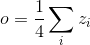
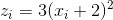
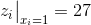
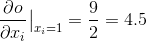

# 自动求导: 自动微分

> 译者：[@小王子](https://github.com/VPrincekin)
> 
> 校对者：[@李子文](https://github.com/liziwenzzzz)

PyTorch 中所有神经网络的核心是 `autograd` 自动求导包. 我们先来简单介绍一下, 然后我们会去训练我们的第一个神经网络.

`autograd` 自动求导包针对张量上的所有操作都提供了自动微分操作. 这是一个逐个运行的框架, 这意味着您的反向传播是由您的代码如何运行来定义的, 每个单一的迭代都可以不一样.

让我们用一些更简单的术语与例子来了解这些套路.

## Variable(变量）

`autograd.Variable` 是包的核心类. 它包装了张量, 并且支持几乎所有的操作. 一旦你完成了你的计算, 你就可以调用 `.backward()` 方法, 然后所有的梯度计算会自动进行.

你还可以通过 `.data` 属性来访问原始的张量, 而关于该 variable(变量）的梯度会被累计到 `.grad` 上去.


Variable

还有一个针对自动求导实现来说非常重要的类 - `Function`.

`Variable` 和 `Function` 是相互联系的, 并且它们构建了一个非循环的图, 编码了一个完整的计算历史信息. 每一个 variable(变量）都有一个 `.grad_fn` 属性, 它引用了一个已经创建了 `Variable` 的 `Function` (除了用户创建的 `Variable` 之外 - 它们的 `grad_fn` 为 `None` ).

如果你想计算导数, 你可以在 `Variable` 上调用 `.backward()` 方法. 如果 `Variable` 是标量的形式(例如, 它包含一个元素数据）, 你不必指定任何参数给 `backward()`, 但是, 如果它有更多的元素. 你需要去指定一个 `grad_output` 参数, 该参数是一个匹配 shape(形状）的张量.

```py
import torch
from torch.autograd import Variable

```

创建 variable(变量）:

```py
x = Variable(torch.ones(2, 2), requires_grad = True)
print(x)

```

variable(变量）的操作:

```py
y = x + 2
print(y)

```

`y` 由操作创建,所以它有 `grad_fn` 属性.

```py
print(y.grad_fn)

```

y 的更多操作

```py
z = y * y * 3
out = z.mean()

print(z, out)

```

## 梯度

我们现在开始了解反向传播, `out.backward()` 与 `out.backward(torch.Tensor([1.0]))` 这样的方式一样

```py
out.backward()

```

但因 d(out)/dx 的梯度

```py
print(x.grad)

```

你应该得到一个 `4.5` 的矩阵. 让我们推导出 `out` _Variable_ “”. 我们有 ,  和 . 因此, , 所以 .

你可以使用自动求导来做很多有趣的事情

```py
x = torch.randn(3)
x = Variable(x, requires_grad = True)

y = x * 2
while y.data.norm() < 1000:
    y = y * 2

print(y)

```

```py
gradients = torch.FloatTensor([0.1, 1.0, 0.0001])
y.backward(gradients)

print(x.grad)

```

**稍候阅读:**

`Variable` 和 `Function` 的文档请参阅 [http://pytorch.apachecn.org/cn/docs/0.3.0/autograd.html](http://pytorch.apachecn.org/cn/docs/0.3.0/autograd.html)