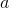

# Probability distributions - torch.distributions

> 译者：[@叶舒泉](https://github.com/pleaseconnectwifi)
> 
> 校对者：[@smilesboy](https://github.com/smilesboy)、[@Charles Xu](https://github.com/the0demiurge)

该 `distributions` 统计分布包中含有可自定义参数的概率分布和采样函数.

当概率密度函数对其参数可微时, 可以使用 `log_prob()` 方法来实施梯度方法 Policy Gradient. 它的一个基本方法是REINFORCE规则:


这其中  是参数,  是学习率,  是奖惩,  是在策略  中从  状态下采取  行动的概率.

在实践中, 我们要从神经网络的输出中采样选出一个行动, 在某个环境中应用该行动, 然后 使用 `log_prob` 函数来构造一个等价的损失函数. 请注意, 这里我们使用了负号, 因为优化器使用 是是梯度下降法, 然而上面的REINFORCE规则是假设了梯度上升情形. 如下所示是在多项式分布下 实现REINFORCE的代码:

```py
probs = policy_network(state)
# NOTE: 等同于多项式分布
m = Categorical(probs)
action = m.sample()
next_state, reward = env.step(action)
loss = -m.log_prob(action) * reward
loss.backward()

```

## Distribution (概率分布)

```py
class torch.distributions.Distribution
```

Distribution是概率分布的抽象基类.

```py
log_prob(value)
```

返回在`value`处的概率密度函数的对数.

参数：`value (Tensor 或 Variable)` – (基类的参数,没有实际用处）


```py
sample()
```

生成一个样本, 如果分布参数有多个, 就生成一批样本.

```py
sample_n(n)
```

生成n个样本, 如果分布参数有多个, 就生成n批样本.

## Bernoulli (伯努利分布)

```py
class torch.distributions.Bernoulli(probs)
```

创建以 `probs` 为参数的伯努利分布.

样本是二进制的 (0或1). 他们以p的概率取值为1, 以 (1 - p) 的概率取值为0.

例:

```py
>>> m = Bernoulli(torch.Tensor([0.3]))
>>> m.sample()  # 30% chance 1; 70% chance 0
 0.0
[torch.FloatTensor of size 1]

```

参数：`probs (Tensor 或 Variable)` – 采样到 `1` 的概率


## Categorical (类别分布)

```py
class torch.distributions.Categorical(probs)
```

创建以 `probs` 为参数的类别分布.

它和 `multinomial()` 采样的分布是一样的.

样本是来自 “0 … K-1” 的整数,其中 “K” 是probs.size(-1).

如果 `probs` 是长度为 `K` 的一维列表,则每个元素是对该索引处的类进行抽样的相对概率.

如果 `probs` 是二维的,它被视为一批概率向量.

另见: [`torch.multinomial()`](torch.html#torch.multinomial "torch.multinomial")

例:

```py
>>> m = Categorical(torch.Tensor([ 0.25, 0.25, 0.25, 0.25 ]))
>>> m.sample()  # equal probability of 0, 1, 2, 3
 3
[torch.LongTensor of size 1]

```

参数：`probs (Tensor 或 Variable)` – 事件概率


## Normal (正态分布)

```py
class torch.distributions.Normal(mean, std)
```

创建以 `mean` 和 `std` 为参数的正态分布(也称为高斯分布）.

例:

```py
>>> m = Normal(torch.Tensor([0.0]), torch.Tensor([1.0]))
>>> m.sample()  # normally distributed with mean=0 and stddev=1
 0.1046
[torch.FloatTensor of size 1]

```

参数：

*   `mean (float 或 Tensor 或 Variable)` – 分布的均值
*   `std (float 或 Tensor 或 Variable)` – 分布的标准差

