# 用 PyTorch 做 神经转换 (Neural Transfer)

> 译者：[@Twinkle](https://github.com/kemingzeng)

**原作者**: [Alexis Jacq](https://alexis-jacq.github.io)

## 介绍

欢迎观看! 这篇教程解释了如何实现 Leon A. Gatys, Alexander S. Ecker 和 Matthias Bethge 几位学者发明的 [Neural-Style](https://arxiv.org/abs/1508.06576) 算法 .

### 题中的神经描述的是什么?

神经风格, 或者说神经转换是一种算法, 它输入一张内容图像 (例如海龟), 一张风格图像 (例如艺术波浪), 然后返回内容图像的内容, 此时返回的内容像是被艺术风格图像的风格渲染过:


### 它是如何工作的?

原理很简单: 我们定义两个距离, 一个是关于内容的 () , 另一个是关于风格的 (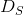) .  衡量两张图像的内容有多么不同, 而  衡量两张图像的风格有多么不同. 接着我们拿出我们的输入, 也就是第三张图像 (例如全噪声), 然后我们转换它, 同时最小化它与内容图像的内容距离和它与风格图像的风格距离.

#### 好吧, 它具体是怎么工作的?

继续深入需要一些数学知识. 令 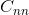 代表一个预训练好的深度卷积神经网络,  代表任何图像. 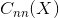 是神经网络输入  后的结果 (包括在所有层的特征映射). 令 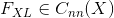 代表在深度为 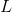 层处的特征映射, 都矢量化和级联为一个单一矢量. 我们简单地用 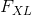 定义  在  层的内容. 如果 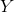 是另一张和  相同大小的图像, 我们定义这两张图像在  层的内容距离如下:


式中 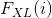 是  的第 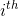 个元素. 定义风格要更繁琐一些. 令满足  的 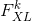 代表  层矢量化的 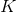 个特征映射中的第  个. 图像  在  层的风格  定义为满足  的所有矢量化特征映射  的克产物 (Gram produce). 换句话说,  是一个 x 的矩阵, 其在  行和  列的每个元素  是  和 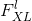 之间的矢量产物 :


式中  是  的第  个元素. 我们可以把  当做特征映射  和 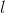 相关性的衡量. 那样的话,  代表了  在  层特征向量的相关性矩阵. 注意  的尺寸只决定于特征映射的数量, 不被  的尺寸所影响. 然后如果  是 _任意尺寸_ 的另一张图像, 我们定义在  层的风格距离如下:


要想一次性地在一些层最小化一个可变图像  与目标内容图像  间的 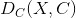, 和  与目标风格图像  间的  , 我们计算并加和每个目标层每个距离的梯度 (对  求导).


式中  和 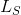 分别是内容和风格的目标层(任意陈述), 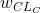 和  是风格和内容关于每个目标层的权重(任意陈述). 然后我们对  进行梯度下降:


好吧, 数学的部分就到此为止. 如果你想要更加深入(比如怎么计算梯度), **我们推荐你阅读原始论文** (作者是 Leon A. Gatys 和 AL), 论文中这部分解释地更好更清晰.

对于在 PyTorch 中的实现, 我们已经有了我们需要的一切: 事实上就是 PyTorch, 所有的梯度都被为你自动且动态地计算(当你从库中使用函数时). 这就是为什么算法的实现在 PyTorch 中变得非常轻松.

## PyTorch 实现

如果你不确定是否理解了以上数学公式, 你也可以通过实现它, 在过程中有所领悟. 如果你正在探索 PyTorch , 我们推荐你先阅读这篇教程 [Introduction to PyTorch](../beginner/deep_learning_60min_blitz.html).

### 包

我们将会依赖下列这些包:

*   `torch`, `torch.nn`, `numpy` (indispensables packages for neural networks with PyTorch)
*   `torch.autograd.Variable` (dynamic computation of the gradient wrt a variable)
*   `torch.optim` (efficient gradient descents)
*   `PIL`, `PIL.Image`, `matplotlib.pyplot` (load and display images)
*   `torchvision.transforms` (treat PIL images and transform into torch tensors)
*   `torchvision.models` (train or load pre-trained models)
*   `copy` (to deep copy the models; system package)

```py
from __future__ import print_function

import torch
import torch.nn as nn
from torch.autograd import Variable
import torch.optim as optim

from PIL import Image
import matplotlib.pyplot as plt

import torchvision.transforms as transforms
import torchvision.models as models

import copy

```

### Cuda

如果你的计算机里有 GPU, 推荐在上面运行算法, 尤其是当你要尝试 大型网络时 (就像 VGG). 有鉴于此, 我们有 `torch.cuda.is_available()`, 如果你的计算机有可用 GPU 则会返回 True. 然后我们用 `.cuda()` 方法 将可分配的进程和模块从 CPU 移动到 GPU. 当我们想将这些模块重新移回 CPU 的时候(比如要用 numpy), 我们用 `.cpu()` 方法. 最后, `.type(dtype)` 会用来将一个 `torch.FloatTensor` 转化为 用于 GPU 进程输入的 `torch.cuda.FloatTensor`.

```py
use_cuda = torch.cuda.is_available()
dtype = torch.cuda.FloatTensor if use_cuda else torch.FloatTensor

```

### 读取图像

为了简化其实现, 让我们从导入一个相同维度的风格和内容图像开始. 然后我们将它们缩放到想要的输入图像尺寸 (在例子中是 128 和 512, 取决你的 GPU 是否可用) 然后把它们转化为 torch 张量, 以待喂入一个神经网络.

注解：

这里是教程需要的图像的下载链接: [picasso.jpg](https://pytorch.org/tutorials/_static/img/neural-style/picasso.jpg) 和 [dancing.jpg](https://pytorch.org/tutorials/_static/img/neural-style/dancing.jpg). 下载这两张图像然后把它们加入到名为 `images` 的目录中.

```py
# 想要的输出图像尺寸
imsize = 512 if use_cuda else 128  # 如果没有 GPU 则使用小尺寸

loader = transforms.Compose([
    transforms.Scale(imsize),  # 缩放图像
    transforms.ToTensor()])  # 将其转化为 torch 张量

def image_loader(image_name):
    image = Image.open(image_name)
    image = Variable(loader(image))
    # 由于神经网络输入的需要, 添加 batch 的维度
    image = image.unsqueeze(0)
    return image

style_img = image_loader("images/picasso.jpg").type(dtype)
content_img = image_loader("images/dancing.jpg").type(dtype)

assert style_img.size() == content_img.size(), \
    "we need to import style and content images of the same size"

```

导入的 PIL 图像像素值的范围为 0 到 255\. 转化为 torch 张量后, 它们的值范围变为了 0 到and 1\. 这是个重要的细节: torch 库中的神经网络被使用 0-1 的张量图像训练. 如果你尝试用 0-255 的张量图像喂入神经网络, 激活的特征映射就没用了. 这不是 使用 Caffe 库中预训练的神经网络, Caffe 中是用 0-255 的张量图像训练的.

### 显示图像

我们将使用 `plt.imshow` 来显示图像. 所以我们需要先把它们转回 PIL 图像.

```py
unloader = transforms.ToPILImage()  # 转回 PIL 图像

plt.ion()

def imshow(tensor, title=None):
    image = tensor.clone().cpu()  # 克隆是为了不改变它
    image = image.view(3, imsize, imsize)  # 移除 batch 维度
    image = unloader(image)
    plt.imshow(image)
    if title is not None:
        plt.title(title)
    plt.pause(0.001) # 暂停一会, 让绘图更新

plt.figure()
imshow(style_img.data, title='Style Image')

plt.figure()
imshow(content_img.data, title='Content Image')

```

### 内容损失

内容损失是一个在网络输入为  的层  输入特征映射  的函数, 返回此图像与内容图像间的加权内容距离 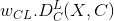. 之后, 权重 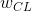 和目标内容  就成为了函数的参数. 我们把这个函数作为 torch 模块来实现, 把这些参 数作为构造器的输入. 这个距离  是两个特征映射集的 均方误差, 可以用作为第三个参数的标准的 `nn.MSELoss` 来计算.

我们会在每个目标层加入我们的内容损失作为额外的神经网络模块. 这样, 每次我们都会给神经 网络投喂一张输入图像 , 所有的损失都会在目标层被计算, 多亏了自动梯度计算, 所有梯度都会被搞定. 要实现, 我们只需写出转换模块的 `forward` 方法, 这个模块就变 成了网络的 ‘’transparent layer (透明层)’‘, 计算好的损失被存为模块的参数.

最后, 我们定义一个假的 `backward` 方法, 它仅仅只调用后向方法 `nn.MSELoss` 来重构梯度. 这个方法返回计算好的损失: 运行梯度下降时要想显示风格和内容损失的变化, 这会非常有用.

```py
class ContentLoss(nn.Module):

    def __init__(self, target, weight):
        super(ContentLoss, self).__init__()
        # 我们会从所使用的树中“分离”目标内容
        self.target = target.detach() * weight
        # 动态地计算梯度: 它是个状态值, 不是变量.
        # 否则评价指标的前向方法会抛出错误.
        self.weight = weight
        self.criterion = nn.MSELoss()

    def forward(self, input):
        self.loss = self.criterion(input * self.weight, self.target)
        self.output = input
        return self.output

    def backward(self, retain_graph=True):
        self.loss.backward(retain_graph=retain_graph)
        return self.loss

```

注解：

**重要细节**: 这个模块虽然叫做 `ContentLoss`, 却不是个真正的 Pytorch 损失函数. 如果你想像 Pytorch 损失一样定义你的内容损失, 你得新建一个 Pytorch 自动求导函数并手动得在 `backward` 方法中重算/实现梯度.

### 风格损失

对于风格损失, 我们首先需要定义一个给定输入  在  层的特征映射  时计算克产物  的模块. 令 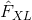 表示  重变形为 x 的版本, 这里  是  层特征 映射的数量,  是任意矢量化特征映射  的长度.  的第  行是 . 可以验证 . 鉴于此, 实现我们的模块就很容易了:

```py
class GramMatrix(nn.Module):

    def forward(self, input):
        a, b, c, d = input.size()  # a=batch size(=1)
        # b= 特征映射的数量
        # (c,d)= 一个特征映射的维度 (N=c*d)

        features = input.view(a * b, c * d)  # 将 F_XL 转换为 \hat F_XL

        G = torch.mm(features, features.t())  # 计算克产物 (gram product)

        # 我们用除以每个特征映射元素数量的方法
            # 标准化克矩阵 (gram matrix) 的值
        return G.div(a * b * c * d)

```

特征映射的维度  越长, 则克矩阵 (gram matrix) 的值越大. 因此如果我们不用  来标准化, 在梯度下降过程中第一层 (在池化层之前) 的损失计算就会过于重要. 我们当然不希望这样, 因为我们感兴趣的风格特征都在最深的那些层!

接着, 风格损失模块被以和内容损失模块相同的方式实现, 但是我们还得把 `gramMatrix` 加入作为参数:

```py
class StyleLoss(nn.Module):

    def __init__(self, target, weight):
        super(StyleLoss, self).__init__()
        self.target = target.detach() * weight
        self.weight = weight
        self.gram = GramMatrix()
        self.criterion = nn.MSELoss()

    def forward(self, input):
        self.output = input.clone()
        self.G = self.gram(input)
        self.G.mul_(self.weight)
        self.loss = self.criterion(self.G, self.target)
        return self.output

    def backward(self, retain_graph=True):
        self.loss.backward(retain_graph=retain_graph)
        return self.loss

```

### 读取神经网络

现在, 我们要导入一个预训练好的神经网络. 和论文一样, 我们用预训练 的 19 层 VGG 网络 (VGG19).

PyTorch对 VGG 的实现模块分为两个子 `Sequential` 模块: `features` (包括卷积和池化层) 和 `classifier` (包括全连接层). 我们只对 `features` 感兴趣:

```py
cnn = models.vgg19(pretrained=True).features

# 可能的话将它移到 GPU 上:
if use_cuda:
    cnn = cnn.cuda()

```

`Sequential` (顺序) 模块包含一个子模块的列表. 比如, `vgg19.features` 包含一个以正确深度排列的序列 (Conv2d, ReLU, Maxpool2d, Conv2d, ReLU…), 就如我们在 _Content loss_ 部分讲到的, 我们想要把我们的风格和内容损失模块以想要的深度作为 ‘透明层’ 加入到 我们的网络中. 为了这样, 我们建立了一个新的 `Sequential` (顺序) 模块, 在其中我们把 `vgg19` 和我们的损失模块以正确的顺序加入:

```py
# 希望计算风格/内容损失的层 :
content_layers_default = ['conv_4']
style_layers_default = ['conv_1', 'conv_2', 'conv_3', 'conv_4', 'conv_5']

def get_style_model_and_losses(cnn, style_img, content_img,
                               style_weight=1000, content_weight=1,
                               content_layers=content_layers_default,
                               style_layers=style_layers_default):
    cnn = copy.deepcopy(cnn)

    # 仅为了有一个可迭代的列表 内容/风格 损失
    content_losses = []
    style_losses = []

    model = nn.Sequential()  # 新建的 Sequential 网络模块
    gram = GramMatrix()  # 我们需要一个克模块 (gram module) 来计算风格目标

    # 可能的话将这些模块移到 GPU 上:
    if use_cuda:
        model = model.cuda()
        gram = gram.cuda()

    i = 1
    for layer in list(cnn):
        if isinstance(layer, nn.Conv2d):
            name = "conv_" + str(i)
            model.add_module(name, layer)

            if name in content_layers:
                # 加内容损失:
                target = model(content_img).clone()
                content_loss = ContentLoss(target, content_weight)
                model.add_module("content_loss_" + str(i), content_loss)
                content_losses.append(content_loss)

            if name in style_layers:
                # 加风格损失:
                target_feature = model(style_img).clone()
                target_feature_gram = gram(target_feature)
                style_loss = StyleLoss(target_feature_gram, style_weight)
                model.add_module("style_loss_" + str(i), style_loss)
                style_losses.append(style_loss)

        if isinstance(layer, nn.ReLU):
            name = "relu_" + str(i)
            model.add_module(name, layer)

            if name in content_layers:
                # 加内容损失:
                target = model(content_img).clone()
                content_loss = ContentLoss(target, content_weight)
                model.add_module("content_loss_" + str(i), content_loss)
                content_losses.append(content_loss)

            if name in style_layers:
                # 加风格损失:
                target_feature = model(style_img).clone()
                target_feature_gram = gram(target_feature)
                style_loss = StyleLoss(target_feature_gram, style_weight)
                model.add_module("style_loss_" + str(i), style_loss)
                style_losses.append(style_loss)

            i += 1

        if isinstance(layer, nn.MaxPool2d):
            name = "pool_" + str(i)
            model.add_module(name, layer)  # ***

    return model, style_losses, content_losses

```

注解：

在这篇论文中他们推荐将最大池化层更改为平均池化层. AlexNet是一个比 VGG19 更小的网络, 用它实现的话我们也不会看到 任何结果质量的不同. 而如果你想做这个替代的话, 可以用这些代码:

```py
# avgpool = nn.AvgPool2d(kernel_size=layer.kernel_size,
#                         stride=layer.stride, padding = layer.padding)
# model.add_module(name,avgpool)

```

### 输入图像

为了简化代码, 我们用与内容和风格图像同样尺寸的图像做输入. 这个图像可以是白噪声的, 也可以是一份内容图像的拷贝.

```py
input_img = content_img.clone()
# 如果你想用白噪声做输入, 请取消下面的注释行:
# input_img = Variable(torch.randn(content_img.data.size())).type(dtype)

# 在绘图中加入原始的输入图像:
plt.figure()
imshow(input_img.data, title='Input Image')

```

### 梯度下降

由于本算法的作者 Leon Gatys 的建议 [here](https://discuss.pytorch.org/t/pytorch-tutorial-for-neural-transfert-of-artistic-style/336/20?u=alexis-jacq), 我们将使用 L-BFGS 算法来跑我们的梯度下降. 和训练一个网络不同的是, 我们希望训练输入图像来最小化 内容/风格 损失. 我们想简单地建一个 PyTorch L-BFGS 优化器, 传入我们的图像作为变量进行优化. 但是 `optim.LBFGS` 的第一个形参是一个需要梯度的 PyTorch `Variable` . 我们的输入图像是一个 `Variable` , 但不是需要计算梯度的树的叶节点. 为了使这个变量需要梯度运算, 一个可能的方法是从输入图像构建一个 `Parameter` (参数) 对象. 然后我们只需给优化器的构造器传递一个 包含这个参数的列表:

```py
def get_input_param_optimizer(input_img):
    # 这行显示了输入是一个需要梯度计算的参数
    input_param = nn.Parameter(input_img.data)
    optimizer = optim.LBFGS([input_param])
    return input_param, optimizer

```

**最后一步**: 循环进行梯度下降. 每一步中我们必须喂给神经网络更新后 的输入以计算新的损失, 我们要运行每个损失的 `backward` 方法来动态 计算他们的梯度并呈现梯度下降的每一步. 这个优化器需要一个 “closure” : 一个重新评估模型并返回损失的函数.

然而, 这里有一个小问题. 被优化的图像的像素值会在  和  之间波动, 而不是继续保持在 0 到 1\. 换句话说, 图像可能会被完美地优化成荒谬的值. 事实上, 我们必须在限制下使用 优化器来使我们的输入图像一直保持正确的值. 有一个简单的解决方案: 在每一步, 都校正图像使其保持 0-1 范围的值.

```py
def run_style_transfer(cnn, content_img, style_img, input_img, num_steps=300,
                       style_weight=1000, content_weight=1):
    """Run the style transfer."""
    print('Building the style transfer model..')
    model, style_losses, content_losses = get_style_model_and_losses(cnn,
        style_img, content_img, style_weight, content_weight)
    input_param, optimizer = get_input_param_optimizer(input_img)

    print('Optimizing..')
    run = [0]
    while run[0] <= num_steps:

        def closure():
            # 校正更新后的输入图像值
            input_param.data.clamp_(0, 1)

            optimizer.zero_grad()
            model(input_param)
            style_score = 0
            content_score = 0

            for sl in style_losses:
                style_score += sl.backward()
            for cl in content_losses:
                content_score += cl.backward()

            run[0] += 1
            if run[0] % 50 == 0:
                print("run {}:".format(run))
                print('Style Loss : {:4f} Content Loss: {:4f}'.format(
                    style_score.data[0], content_score.data[0]))
                print()

            return style_score + content_score

        optimizer.step(closure)

    # 最后一次的校正...
    input_param.data.clamp_(0, 1)

    return input_param.data

```

最后, 运行算法

```py
output = run_style_transfer(cnn, content_img, style_img, input_img)

plt.figure()
imshow(output, title='Output Image')

# sphinx_gallery_thumbnail_number = 4
plt.ioff()
plt.show()

```
