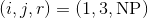
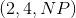
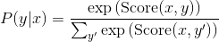
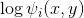
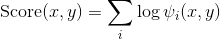
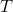
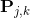

# 高级教程: 作出动态决策和 Bi-LSTM CRF

> 译者：[@JingTao](https://github.com/jingwangfei)、[@friedhelm739](https://github.com/friedhelm739)

## 动态 VS 静态深度学习工具集

Pytorch 是一个 _动态_ 神经网络工具包. 另一个动态工具包的例子是 [Dynet](https://github.com/clab/dynet) (我之所以提这个是因为使用 Pytorch 和 Dynet 是十分类似的. 如果你看过 Dynet 中的例子, 那么它将有可能对你在 Pytorch 下实现它有帮助). 与动态相反的是 _静态_ 工具包, 包括了 Theano, Keras, TensorFlow 等等. 下面是这两者核心的一些区别:

*   在一个静态工具包中, 你一次性定义好一个计算图, 接着编译它, 然后把数据流输实例送进去.
*   在一个动态工具包中, 你 _为每一个实例_ 定义一个计算图, 它完全不需要被编译并且是在运行中实时执行的.

若没有丰富的经验, 你很难体会出其中的差别. 举一个例子, 假设我们想要构建一个深度句法分析器. 那么我们的模型需要下列的一些步骤:

*   我们从下往上构建树
*   标注根节点(句子中的词语)
*   从那儿开始, 使用一个神经网络和词向量来找到组成句法的不同组合. 一旦当你形成了一个新的句法, 使用某种方式得到句法的嵌入表示 (embedding). 在这个例子里, 我们的网络架构将会 完全的依赖于输入的句子. 来看这个句子: “绿色猫抓了墙”, 在这个模型的某一节点, 我们想要把范围  合并起来(即, 一个 NP 句法范围跨越词1到词3, 在这个例子中是”绿色猫”).

然而, 另一个句子可能是”某处, 那个大肥猫抓了墙.” 在这个句子中, 我们想要在某点形成句法  . 我们想要形成的句法将会依赖于这个实例. 如果仅仅编译这个计算图一次, 就像在静态工具包中那样, 那么我们给这个逻辑编程将会变得十分困难或者根本不可能. 然而, 在一个动态工具包中, 并不仅仅只有一个预定义的计算图. 对于每一个实例, 都能够有一个新的计算图, 所以上面的问题就不复存在了.

动态工具包也具有更容易调试和更接近所使用的编程语言的特点(我的意思是 Pytorch 和 Dynet 看上去 比 Keras 和 Theano 更像 Python).

## Bi-LSTM CRF (条件随机场) 讨论

在这一部分, 我们将会看到一个完整且复杂的 Bi-LSTM CRF (条件随机场)用来命名实体识别 (NER) 的例子. 上面的 LSTM 标注工具通常情况下对词性标注已经足够用了, 但一个序列模型比如 CRF 对于在 NER 下取得 强劲的表现是至关重要的. 假设熟悉 CRF. 尽管这个名字听上去吓人, 但所有的模型只是一个由 LSTM 提供 特征的 CRF. 但这是一个高级的模型, 远比这个教程中的其它早期的模型更加复杂. 如果你要跳过这一部分, 没有关系. 想要确定你是否准备好, 那看看你是不是能够:

*   复现标签 k 的第 i 步维特比变量的算法.
*   修改上述循环来计算正向变量.
*   再一次修改上述复现来在对数空间中计算正向变量. (提示: 对数-求和-指数)

如果你能够完成以上三件事, 那么你就不难理解下面的代码了. 回想一下, CRF 计算的是一个条件概率. 让  作为一个标注序列,  作为某个词的输入序列. 接下来我们计算:



上面的分数 Score 是由定义一些对数势能  而决定的. 进而



要使分割函数易于掌控, 势能必须只能集中于局部的特征.

在 Bi-LSTM CRF 中, 我们定义两种势能 (potential): 释放 (emission) 和过渡 (transition). 索引  处字的释放势能来自于  时间处的 Bi-LSTM 的隐藏状态. 过渡势能的分数储存在  矩阵  , 其中  是标注集合. 在我的实现中,  是从标注  过渡到 标注  的得分. 因此:


![= \sum_i h_i[y_i] + \textbf{P}_{y_i, y_{i-1}}](img/tex-da28d9f122b1a23f8d46f87faf92a1b0.gif)

在上面第二个表达式中, 我们认为标签被分配了独一无二的非负索引.

如果上面的讨论太简短了, 你还可以看看 [这个](http://www.cs.columbia.edu/%7Emcollins/crf.pdf) 由 Michael Collins 写的关于 CRFs 的文章.

## 具体实现笔记

下面的例子实现了在对数空间中的前向算法来计算出分割函数和维特比算法来进行译码. 反向传播将会为我们自动计算出梯度. 我们不需要手动去实现这个.

这个代码中的实现并没有优化过. 如果你理解下面的过程, 也许你会觉得下面的代码中, 前向算法中 的迭代下一次标注可以在一次大的运算中完成. 虽然有简化的余地, 但我想的是让代码可读性更好. 如果你想进行相关的修改, 也许你可以在一些真实的任务中使用这个标注器.

```py
# 作者: Robert Guthrie

import torch
import torch.autograd as autograd
import torch.nn as nn
import torch.optim as optim

torch.manual_seed(1)

```

一些帮助函数, 使代码可读性更好

```py
def to_scalar(var):
    # 返回 python 浮点数 (float)
    return var.view(-1).data.tolist()[0]

def argmax(vec):
    # 以 python 整数的形式返回 argmax
    _, idx = torch.max(vec, 1)
    return to_scalar(idx)

def prepare_sequence(seq, to_ix):
    idxs = [to_ix[w] for w in seq]
    tensor = torch.LongTensor(idxs)
    return autograd.Variable(tensor)

# 使用数值上稳定的方法为前向算法计算指数和的对数
def log_sum_exp(vec):
    max_score = vec[0, argmax(vec)]
    max_score_broadcast = max_score.view(1, -1).expand(1, vec.size()[1])
    return max_score + \
        torch.log(torch.sum(torch.exp(vec - max_score_broadcast)))

```

创建模型

```py
class BiLSTM_CRF(nn.Module):

    def __init__(self, vocab_size, tag_to_ix, embedding_dim, hidden_dim):
        super(BiLSTM_CRF, self).__init__()
        self.embedding_dim = embedding_dim
        self.hidden_dim = hidden_dim
        self.vocab_size = vocab_size
        self.tag_to_ix = tag_to_ix
        self.tagset_size = len(tag_to_ix)

        self.word_embeds = nn.Embedding(vocab_size, embedding_dim)
        self.lstm = nn.LSTM(embedding_dim, hidden_dim // 2,
                            num_layers=1, bidirectional=True)

        # 将LSTM的输出映射到标记空间
        self.hidden2tag = nn.Linear(hidden_dim, self.tagset_size)

        # 过渡参数矩阵. 条目 i,j 是
        # *从* j *到* i 的过渡的分数
        self.transitions = nn.Parameter(
            torch.randn(self.tagset_size, self.tagset_size))

        # 这两句声明强制约束了我们不能
        # 向开始标记标注传递和从结束标注传递
        self.transitions.data[tag_to_ix[START_TAG], :] = -10000
        self.transitions.data[:, tag_to_ix[STOP_TAG]] = -10000

        self.hidden = self.init_hidden()

    def init_hidden(self):
        return (autograd.Variable(torch.randn(2, 1, self.hidden_dim // 2)),
                autograd.Variable(torch.randn(2, 1, self.hidden_dim // 2)))

    def _forward_alg(self, feats):
        # 执行前向算法来计算分割函数
        init_alphas = torch.Tensor(1, self.tagset_size).fill_(-10000.)
        # START_TAG 包含所有的分数
        init_alphas[0][self.tag_to_ix[START_TAG]] = 0.

        # 将其包在一个变量类型中继而得到自动的反向传播
        forward_var = autograd.Variable(init_alphas)

        # 在句子中迭代
        for feat in feats:
            alphas_t = []  # 在这个时间步的前向变量
            for next_tag in range(self.tagset_size):
                # 对 emission 得分执行广播机制: 它总是相同的,
                # 不论前一个标注如何
                emit_score = feat[next_tag].view(
                    1, -1).expand(1, self.tagset_size)
                # trans_score 第 i 个条目是
                # 从i过渡到 next_tag 的分数
                trans_score = self.transitions[next_tag].view(1, -1)
                # next_tag_var 第 i 个条目是在我们执行 对数-求和-指数 前
                # 边缘的值 (i -> next_tag)
                next_tag_var = forward_var + trans_score + emit_score
                # 这个标注的前向变量是
                # 对所有的分数执行 对数-求和-指数
                alphas_t.append(log_sum_exp(next_tag_var))
            forward_var = torch.cat(alphas_t).view(1, -1)
        terminal_var = forward_var + self.transitions[self.tag_to_ix[STOP_TAG]]
        alpha = log_sum_exp(terminal_var)
        return alpha

    def _get_lstm_features(self, sentence):
        self.hidden = self.init_hidden()
        embeds = self.word_embeds(sentence).view(len(sentence), 1, -1)
        lstm_out, self.hidden = self.lstm(embeds, self.hidden)
        lstm_out = lstm_out.view(len(sentence), self.hidden_dim)
        lstm_feats = self.hidden2tag(lstm_out)
        return lstm_feats

    def _score_sentence(self, feats, tags):
        # 给出标记序列的分数
        score = autograd.Variable(torch.Tensor([0]))
        tags = torch.cat([torch.LongTensor([self.tag_to_ix[START_TAG]]), tags])
        for i, feat in enumerate(feats):
            score = score + \
                self.transitions[tags[i + 1], tags[i]] + feat[tags[i + 1]]
        score = score + self.transitions[self.tag_to_ix[STOP_TAG], tags[-1]]
        return score

    def _viterbi_decode(self, feats):
        backpointers = []

        # 在对数空间中初始化维特比变量
        init_vvars = torch.Tensor(1, self.tagset_size).fill_(-10000.)
        init_vvars[0][self.tag_to_ix[START_TAG]] = 0

        # 在第 i 步的 forward_var 存放第 i-1 步的维特比变量
        forward_var = autograd.Variable(init_vvars)
        for feat in feats:
            bptrs_t = []  # 存放这一步的后指针
            viterbivars_t = []  # 存放这一步的维特比变量

            for next_tag in range(self.tagset_size):
                # next_tag_var[i] 存放先前一步标注i的
                # 维特比变量, 加上了从标注 i 到 next_tag 的过渡
                # 的分数
                # 我们在这里并没有将 emission 分数包含进来, 因为
                # 最大值并不依赖于它们(我们在下面对它们进行的是相加)
                next_tag_var = forward_var + self.transitions[next_tag]
                best_tag_id = argmax(next_tag_var)
                bptrs_t.append(best_tag_id)
                viterbivars_t.append(next_tag_var[0][best_tag_id])
            # 现在将所有 emission 得分相加, 将 forward_var
            # 赋值到我们刚刚计算出来的维特比变量集合
            forward_var = (torch.cat(viterbivars_t) + feat).view(1, -1)
            backpointers.append(bptrs_t)

        # 过渡到 STOP_TAG
        terminal_var = forward_var + self.transitions[self.tag_to_ix[STOP_TAG]]
        best_tag_id = argmax(terminal_var)
        path_score = terminal_var[0][best_tag_id]

        # 跟着后指针去解码最佳路径
        best_path = [best_tag_id]
        for bptrs_t in reversed(backpointers):
            best_tag_id = bptrs_t[best_tag_id]
            best_path.append(best_tag_id)
        # 弹出开始的标签 (我们并不希望把这个返回到调用函数)
        start = best_path.pop()
        assert start == self.tag_to_ix[START_TAG]  # 健全性检查
        best_path.reverse()
        return path_score, best_path

    def neg_log_likelihood(self, sentence, tags):
        feats = self._get_lstm_features(sentence)
        forward_score = self._forward_alg(feats)
        gold_score = self._score_sentence(feats, tags)
        return forward_score - gold_score

    def forward(self, sentence):  # 不要把这和上面的 _forward_alg 混淆
        # 得到 BiLSTM 输出分数
        lstm_feats = self._get_lstm_features(sentence)

        # 给定特征, 找到最好的路径
        score, tag_seq = self._viterbi_decode(lstm_feats)
        return score, tag_seq

```

运行训练

```py
START_TAG = "<START>"
STOP_TAG = "<STOP>"
EMBEDDING_DIM = 5
HIDDEN_DIM = 4

# 制造一些训练数据
training_data = [(
    "the wall street journal reported today that apple corporation made money".split(),
    "B I I I O O O B I O O".split()
), (
    "georgia tech is a university in georgia".split(),
    "B I O O O O B".split()
)]

word_to_ix = {}
for sentence, tags in training_data:
    for word in sentence:
        if word not in word_to_ix:
            word_to_ix[word] = len(word_to_ix)

tag_to_ix = {"B": 0, "I": 1, "O": 2, START_TAG: 3, STOP_TAG: 4}

model = BiLSTM_CRF(len(word_to_ix), tag_to_ix, EMBEDDING_DIM, HIDDEN_DIM)
optimizer = optim.SGD(model.parameters(), lr=0.01, weight_decay=1e-4)

# 在训练之前检查预测结果
precheck_sent = prepare_sequence(training_data[0][0], word_to_ix)
precheck_tags = torch.LongTensor([tag_to_ix[t] for t in training_data[0][1]])
print(model(precheck_sent))

# 确认从之前的 LSTM 部分的 prepare_sequence 被加载了
for epoch in range(
        300):  # 又一次, 正常情况下你不会训练300个 epoch, 这只是示例数据
    for sentence, tags in training_data:
        # 第一步: 需要记住的是Pytorch会累积梯度
        # 我们需要在每次实例之前把它们清除
        model.zero_grad()

        # 第二步: 为我们的网络准备好输入, 即
        # 把它们转变成单词索引变量 (Variables)
        sentence_in = prepare_sequence(sentence, word_to_ix)
        targets = torch.LongTensor([tag_to_ix[t] for t in tags])

        # 第三步: 运行前向传递.
        neg_log_likelihood = model.neg_log_likelihood(sentence_in, targets)

        # 第四步: 计算损失, 梯度以及
        # 使用 optimizer.step() 来更新参数
        neg_log_likelihood.backward()
        optimizer.step()

# 在训练之后检查预测结果
precheck_sent = prepare_sequence(training_data[0][0], word_to_ix)
print(model(precheck_sent))
# 我们完成了!

```

## 练习: 为区别性标注定义一个新的损失函数

在解码的时候, 我们不一定需要创建一个计算图, 因为我们并不从维特比路径分数中做反向传播. 不管怎样, 既然我们有了它, 尝试训练这个标注器, 使其损失函数是维特比路径分数和黄金标准分数之差. 需要弄清楚的是, 这个函数在预测标注序列是正确的时候应当大于等于0. 这本质上是 _结构化感知机_ .

这个改动应当是很简短的, 因为 Viterbi 和 score_sentence 是已经实现好了的. 这是 _依赖于训练实例的_ 计算图的形状的一个例子. 但我们并没有尝试过在一个静态工具包上实现过, 我想象中这是可行的但并不是很显而易见.

找一些真实数据做一下比较吧!
