# PyTorch深度学习

> 译者：[@JingTao](https://github.com/jingwangfei)、[@friedhelm739](https://github.com/friedhelm739)

## 深度学习构建模块: Affine maps, non-linearities and objectives

深度学习以巧妙的方式将non-linearities和linearities组合在一起.non-linearities的引入允许强大的模型. 在本节中, 我们将使用这些核心组件, 构建一个objective函数, 并且看看模型是如何训练的.

### Affine Maps

深度学习的核心工作之一是affine map, 这是一个函数  其中


对于矩阵  和向量 . 这里学习的参数是  and 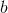. 通常,  被称为 _偏差_ 项.

Pytorch和大多数其他深度学习框架与传统的线性代数有所不同.它映射输入的是行而不是列. 也就是说, 下面的输出的第  行是  的输入的第  行加上偏置项的映射. 看下面的例子.

```py
# 作者: Robert Guthrie

import torch
import torch.autograd as autograd
import torch.nn as nn
import torch.nn.functional as F
import torch.optim as optim

torch.manual_seed(1)

```

```py
lin = nn.Linear(5, 3)  # 从 R^5 映射到 R^3, 参数 A, b
# 数据是 2x5\.  A 是从 5 映射到 3... 我们能在A下映射得到想要的数据吗?
data = autograd.Variable(torch.randn(2, 5))
print(lin(data))  # 是的

```

### Non-Linearities(非线性)

首先, 注意以下将解释为什么我们首先需要 non-linearities.假设我们有两个 affine maps  and 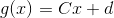. 什么是 ?

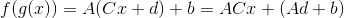

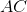 是一个矩阵,  是一个向量, 所以我们看到组合两个affine maps会得到一个affine map

由此可以看出, 如果你想让你的神经网络成为affine 组合的长链条, 那么相比于做一个简单的affine map, 此举不会给你的模型增加新的作用.

如果我们在affine层之间引入non-linearities, 则不再是这种情况, 我们可以构建更强大的模型.

接下来有一些重要的non-linearities.  是最常见的. 你可能想知道: “为什么这些函数？我可以想到很多其他的non-linearities 函数.” 其原因是他们的梯度容易计算, 并且计算梯度对学习是必不可少的. 例如

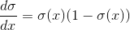

一个简单的提示: 虽然你可能已经在入门AI中学习到了一些神经网络, 其中 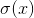 是默认的non-linearity, 但通常人们在实践中会避免它. 这是因为随着参数绝对值的增长, 梯度会很快 _消失_ . 小梯度意味着很难学习. 大多数人默认tanh或ReLU.

```py
# 在pytorch中, 很多的non-linearities是在torch中.是功能性的 (我们将它记为 F)
# 这意味着 non-linearites 不像 affine maps 一样拥有参数.也意味着它们再训练时没有可以更新的参数.
#
data = autograd.Variable(torch.randn(2, 2))
print(data)
print(F.relu(data))

```

### Softmax and Probabilities(Softmax和概率分布)

函数 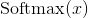 也是一个 non-linearity, 但它的特殊之处在于它通常是网络中一次操作. 这是因为它接受了一个实数向量并返回一个概率分布.其定义如下. 定义 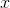 是一个实数的向量(正数或负数都无所谓, 没有限制). 然后, 第i个  的组成是

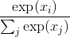

应该清楚的是, 输出是一个概率分布: 每个元素都是非负的, 并且所有元素的总和都是1.

你也可以把它看作只是将一个元素明确的指数运算符应用于输入, 以使所有内容都为非负值, 然后除以归一化常数.

```py
# Softmax也在 torch.nn.functional
data = autograd.Variable(torch.randn(5))
print(data)
print(F.softmax(data, dim=0))
print(F.softmax(data, dim=0).sum())  #总和为一因为他是概率分布!
print(F.log_softmax(data, dim=0))  # 他也是 log_softmax

```

### Objective Functions(目标函数)

Objective function 是一个目标函数，你训练网络的目的是使其最小(在这种情况下, 它通常被称为 _损失函数_ 或 _成本函数_ ). 首先选择一个训练实例, 通过神经网络运行它, 计算输出的损失. 然后利用损失函数的导数来更新模型的参数. 直观地说, 如果你的模型对答案完全有信心, 但答案是错误的, 你的损失就会很高. 如果它的答案非常有信心, 而且答案是正确的, 那么损失就会很低.

将训练样例的损失函数最小化的想法是, 你的网络希望能够很好地产生, 并且在开发集, 测试集或生产环境中未知的示例有小的损失. 一个示例损失函数是 _负对数似然损失_ , 这是多类分类的一个非常普遍的目标函数. 对于有监督的多类别分类, 这意味着训练网络以最小化正确输出的负对数概率(或等同地, 最大化正确输出的对数概率).

## Optimization and Training(优化和训练)

那么我们可以计算一个实例的损失函数?我们该怎么做?我们之前看到autograd.变量知道如何计算与计算梯度有关的事物.那么, 因为我们的损失是一个 autograd. 对于 Variable, 我们可以对所有用于计算的参数计算梯度！然后我们可以执行标准渐变更新. 令 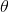 是我们的参数, 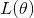 损失函数, 以及:  是一个正的的学习率. 然后:


有大量的算法和积极的研究去尝试比vanilla梯度更新更出色的方法. 许多人试图根据训练的情况改变学习率. 除非你真的感兴趣, 否则你不必担心这些算法具体做什么. Torch提供了许多 torch.optim 包, 它们都是开源的.使用最简单的梯度更新与更复杂的算法效果相同.尝试不同的更新算法和更新算法的不同参数(如不同的初始学习速率)对于优化网络性能非常重要. 通常, 只需用Adam或RMSProp等优化器替换vanilla SGD 即可显着提升性能.

## Creating Network Components in Pytorch(在Pytorch中创建神经元)

在我们开始关注NLP之前, 让我们做一个注释的例子, 在Pytorch中只使用affine maps和non-linearities构建网络.我们还将看到如何使用Pytorch建立的负对数似然计算损失函数, 并通过反向传播更新参数.

所有神经元都应该从nn.Module继承并覆盖forward()方法.就样板而言就是这样.从nn.Module继承能为你的神经元提供功能.例如, 它可以跟踪其可训练的参数, 可以使用.cuda()或.cpu()函数等在CPU和GPU之间交换, 等等.

我们来编写一个带有注释的网络示例, 该网络采用稀疏的词袋表示法, 并输出概率分布在两个标签上: “英语”和“西班牙语”.使用的模型是逻辑回归.

### 示例： Logistic Regression Bag-of-Words classifier(例子: 基于词袋表示法的逻辑斯蒂回归分类器)

我们的模型将映射一个稀疏的BOW表示来记录标签上的概率.我们为词汇表中的每个单词分配一个索引. 例如, 我们的完整的词汇表有两个单词: “你好” 和 “世界”, 这两个单词的索引分别为0和1\. 句子为 “hello hello hello hello” 的BoW向量为

![\left[ 4, 0 \right]](img/tex-f379e430146ac263265a319d3af2fed7.gif)

对于 “hello world world hello” , 它是

![\left[ 2, 2 \right]](img/tex-b5b39fca1b80bee345f79478b304387b.gif)

等等.一般来说, 它是

![\left[ \text{Count}(\text{hello}), \text{Count}(\text{world}) \right]](img/tex-f0d85cf33cbe7b079f01d6bd48b6de00.gif)

将这个BOW向量表示为 . 我们的网络输出是:


也就是说, 我们通过affine map传递输入, 然后进行softmax.

```py
data = [("me gusta comer en la cafeteria".split(), "SPANISH"),
        ("Give it to me".split(), "ENGLISH"),
        ("No creo que sea una buena idea".split(), "SPANISH"),
        ("No it is not a good idea to get lost at sea".split(), "ENGLISH")]

test_data = [("Yo creo que si".split(), "SPANISH"),
             ("it is lost on me".split(), "ENGLISH")]

# word_to_ix 将在词汇中的单词映射为一个特征数,
# 这个特征数就是单词在词袋中的索引
word_to_ix = {}
for sent, _ in data + test_data:
    for word in sent:
        if word not in word_to_ix:
            word_to_ix[word] = len(word_to_ix)
print(word_to_ix)

VOCAB_SIZE = len(word_to_ix)
NUM_LABELS = 2

class BoWClassifier(nn.Module):  # 从 nn.Module继承!

    def __init__(self, num_labels, vocab_size):
        # 在 nn.Module中调用初始化函数. 不要被这个困惑,
        # 这个做法经常在 nn.Module见到
        super(BoWClassifier, self).__init__()

        # 定义你需要的变量. 在本例中, 我们需要affine mapping的系数 A 和 b.
        # Torch 定义了可提供 affine map的nn.Linear().
        # 确定你理解了为什么输入矩阵的维度是 vocab_size而输出的是num_labels!
        self.linear = nn.Linear(vocab_size, num_labels)

        # 注意!  non-linearity log softmax 没有系数!
        # 所以我们在这并不需要担心

    def forward(self, bow_vec):
        # 将输入引入到线性神经元层中, 随后引入到log_softmax.
        # 在torch.nn.functional中有很多非线性和其他的函数
        return F.log_softmax(self.linear(bow_vec), dim=1)

def make_bow_vector(sentence, word_to_ix):
    vec = torch.zeros(len(word_to_ix))
    for word in sentence:
        vec[word_to_ix[word]] += 1
    return vec.view(1, -1)

def make_target(label, label_to_ix):
    return torch.LongTensor([label_to_ix[label]])

model = BoWClassifier(NUM_LABELS, VOCAB_SIZE)

# model知道它的系数.第一个输出的是A, 第二个是b.
# 当你在模块__init__函数中指定一个神经元去分类变量, self.linear = nn.Linear(...)被执行
# 随后从Pytorch devs通过Python magic, 你的模块(在本例中, BoWClassifier) 将会存储 nn.Linear的系数
for param in model.parameters():
    print(param)

# 要运行该模型, 请传入一个BoW vector, 但要将其封装在一个autograd.Variable中.
sample = data[0]
bow_vector = make_bow_vector(sample[0], word_to_ix)
log_probs = model(autograd.Variable(bow_vector))
print(log_probs)

```

以上哪个值对应于”英语”的概率, 以及哪个值是”西班牙语”?我们从来没有定义过它, 但如果我们想要训练这个模型, 我们需要去定义.

```py
label_to_ix = {"SPANISH": 0, "ENGLISH": 1}

```

来做训练吧！要做到这一点, 我们通过实例来获取概率, 计算损失函数, 计算损失函数的梯度, 然后用梯度步骤更新参数.Torch在nn软件包中提供了损失函数.nn.NLLLoss()是我们想要的负对数似然损失.它还定义了torch.optim中的优化函数.在这里, 我们只使用SGD.

请注意, NLLLoss 的 _输入_ 是一个对数概率向量和一个目标标签. 它不会为我们计算对数概率. 这就是为什么我们网络的最后一层是log softmax. 损失函数 nn.CrossEntropyLoss() 与 NLLLoss() 相同, 唯一的不同是它为你去做 softmax.

```py
# 在我们训练前运行训练集, 去看看前后的变化
for instance, label in test_data:
    bow_vec = autograd.Variable(make_bow_vector(instance, word_to_ix))
    log_probs = model(bow_vec)
    print(log_probs)

# 在矩阵中输出"creo"列
print(next(model.parameters())[:, word_to_ix["creo"]])

loss_function = nn.NLLLoss()
optimizer = optim.SGD(model.parameters(), lr=0.1)

# 通常你想要多次浏览训练集.100比起实际数据集是很多的, 但实际数据集会多于2个实例.
# 通常, 在5到30之间是合理的.

for epoch in range(100):
    for instance, label in data:
        # 步骤 1\. 牢记 Pytorch 会积累梯度.
        # 我们需要在每一例前清理掉
        model.zero_grad()

        # 步骤 2\. 制作我们的 BOW 向量 并且我们必须将目标封装在变量中并且为整数 .
        # 例如, 如果目标是"西班牙语", 则封装为整数0.对于损失函数而言, 概率分布的
        # 第0列对应的是"西班牙语"的损失函数.
        #
        bow_vec = autograd.Variable(make_bow_vector(instance, word_to_ix))
        target = autograd.Variable(make_target(label, label_to_ix))

        # 步骤 3\. Run our forward pass.
        log_probs = model(bow_vec)

        # 步骤 4\. 计算损失, 梯度, 通过调用optimizer.step()来更新系数
        #
        loss = loss_function(log_probs, target)
        loss.backward()
        optimizer.step()

for instance, label in test_data:
    bow_vec = autograd.Variable(make_bow_vector(instance, word_to_ix))
    log_probs = model(bow_vec)
    print(log_probs)

# 对应于西班牙语上升, 英语下降!
print(next(model.parameters())[:, word_to_ix["creo"]])

```

我们得到了正确的答案! 你可以看到, 第一个示例中西班牙语的概率要高得多, 而测试数据的第二个英语概率应该高得多.

现在你看到了如何制作一个Pytorch组件, 通过它传递一些数据并做梯度更新.我们准备深入挖掘NLP所能提供的内容.
