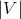
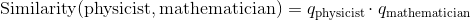
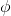
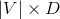
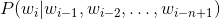
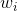
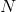
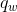

# 词汇嵌入:编码词汇语义

> 译者：[@JingTao](https://github.com/jingwangfei)、[@friedhelm739](https://github.com/friedhelm739)

单词嵌入是真实数字的密集向量,在你的词汇表中每一个单词都是. 在NLP中, 通常情况下, 您的特性就是单词!但是你应该怎么在你的电脑中表示一个单词?可以存储它的ascii字符表示, 但那仅仅告诉你单词 _是_ 什么,没有说太多它 _意味_ 着什么 (你也许可以从它的词缀中派生出它的词性, 或者从它的大小写中得到它的属性,但并不多.). 更重要的是, 在什么意义上你能把这些表象结合起来? 我们经常需要神经网络的密集输出, 输入为  维, 其中  是我们的词汇表, 但经常输出是更小维度的 (如果我们只预测少量的标签的话). 我们如何从一个大的维度空间得到一个更小的维度空间?

如果我们不用 ascii 字符表示, 而使用one-hot encoding呢? 那就是, 我们用如下所示表示  字符

![\overbrace{\left[ 0, 0, \dots, 1, \dots, 0, 0 \right]}^\text{|V| elements}](img/tex-cf775cf1814914c00f5bf7ada7de4369.gif)

其中 1 是  的特征位置.其他的单词也是在其他位置有一个1, 在另外的位置都是0.

除了巨大的占用空间外,这种表述有一个巨大的缺陷. 它仅仅简单的把所有的单词都看作独立实体认 为它们彼此之间毫无关联.我们真正想要的是单词之间有一些 _相似_ .为什么? 让我们来看一下例子.

假设我们正在搭建一个语言模型. 假设我们在训练集中看到了如下语句.

*   The mathematician ran to the store.
*   The physicist ran to the store.
*   The mathematician solved the open problem.

现在假设我们得到了一个在训练集从未看到过的新句子:

*   The physicist solved the open problem.

我们的语言模型对此句可能运行的不错, 但如果我们能使用以下两个事实,情况会好得多吗:

*   我们看到数学家和物理学家在句子中有着相同的作用.它们之间有一个语义关系.
*   我们已经看到数学家在这个新的没看过的的句子中扮演着同样的角色, 就像我们现在看到的物理学家一样.

然后我们就推断物理学家在这个句子里是很合适的?这就是我们指的相似的意思:我们指的是 _语义相似度_, 不仅仅是拼字一样的表示. 它是一种通过连接我们所看到的和我们没有看到的东西之间的点来对抗语言数据稀疏性的技术. 这个例子当然要依赖于一个基本的语言假设:在相似的语境中出现的单词在语义上是相互关联的. 这被叫做 [distributional hypothesis](https://en.wikipedia.org/wiki/Distributional_semantics).

## Getting Dense Word Embeddings(密集字嵌入)

我们如何来解决那个问题?我们怎么能在单词中编码语义相似呢? 也许我们会想出一些语义属性. 举个例子, 我们看到了, 数学家和物理学家都会跑, 也许我们可以把”能跑”这个语义属性给一个高分. 考虑一下其他的属性, 想象一下, 你可能会在这些属性上给一些普通的单词得分.

如果每一个属性都是一维, 那我们可以给一个向量代表一个单词, 像这样:

![ q_\text{mathematician} = \left[ \overbrace{2.3}^\text{can run}, \overbrace{9.4}^\text{likes coffee}, \overbrace{-5.5}^\text{majored in Physics}, \dots \right]](img/tex-62ca51f900bf27324a2be4e6b8609f4b.gif)

![ q_\text{physicist} = \left[ \overbrace{2.5}^\text{can run}, \overbrace{9.1}^\text{likes coffee}, \overbrace{6.4}^\text{majored in Physics}, \dots \right]](img/tex-a0be0498fd8216177330deffbfcb6ea2.gif)

这样我们就可以通过如下来得到这些单词之间的相似度:



尽管通常情况下需要归一化:


其中  是两个向量的角度. 这就意味着,极端相似的单词(嵌入方向是同一个) 会得到相似度为1.反之为 -1.

你可以认为本章刚开始的稀疏one-hot 向量是我们刚定义向量的特殊形式,其中单词的相似度为 0, 然后我们可以给每一个单词一些独特的语义属性.这些向量是 _密集的_ , 也就是说他们是非零的.

但是这些新的向量是一种巨大的痛苦:你可以想到数千种不同的语义属性,它们可能与决定相似性有关, 而且究竟你怎样把它们设置成不同的属性? 深度学习的中心思想是比起需要程序员去自己设计特征, 神经网络学习特征的表示. 所以为什么不在我们的模型中让单词嵌入到系数中,然后让它们在训练中更新呢? 这就是我们要做的. 我们会有一些 _潜在的语义属性_ 网络可以, 严肃来讲, 学习. 注意, 嵌入词可能无法解释. 那就是尽管如上所示我们手工制作的矢量图,我们可以看到数学家和物理学家的相似之处是他们都喜欢咖啡. 如果我们允许神经网络学习嵌入, 并看到数学家和物理学家在第二个维度中有很大的价值, 但是它意味着什么很不清晰. 在潜在语义来讲它们是相似的, 但是对我们来说是无法解释的.

总结一下, **单词嵌入是一个单词 *语义* 的表示,语义信息的有效编码可能与手头任务相关**. 你也可以嵌入其他的东西: 部分的语音标签, 解析树, 其他任何东西! 特征嵌入是这个领域的核心思想.

## Word Embeddings in Pytorch(Pytorch中的单词嵌入）

在我们举例或练习之前, 关于如何在Pytorch中使用嵌入以及在一般的深度学习编程中,有一些快速 的说明.与制作one-hot向量时我们对每一个单词定义一个特别的索引相似,单词嵌入时同样需要对每 一个单词定义一个特别的索引. 这些将是查找表中的键. 意思是,嵌入被储存为一个  矩阵, 其中  是嵌入的维度, 这样的词被赋予了索引  它的嵌入被储存在矩阵的 第  行. 在所有的代码中, 从单词到索引的映射是一个命名的字典 word_to_ix.

允许你使用嵌入的模块式 torch.nn.Embedding,这需要两个参数:词汇量和嵌入的维度.

为了索引到这个表中,你需要使用 torch.LongTensor (索引为整数,不能为浮点数).

```py
# 作者: Robert Guthrie

import torch
import torch.autograd as autograd
import torch.nn as nn
import torch.nn.functional as F
import torch.optim as optim

torch.manual_seed(1)

```

```py
word_to_ix = {"hello": 0, "world": 1}
embeds = nn.Embedding(2, 5)  # 2 单词, 5 维嵌入
lookup_tensor = torch.LongTensor([word_to_ix["hello"]])
hello_embed = embeds(autograd.Variable(lookup_tensor))
print(hello_embed)

```

## 例子: N-Gram 语言模型

回想一下 在n-gram语言模型中,给定一系列单词  , 我们需要计算



 是句子中第i个单词.

本例中, 我们将计算一些训练集的损失函数并且用反向传播更新系数.

```py
CONTEXT_SIZE = 2
EMBEDDING_DIM = 10
# 我们将使用 Shakespeare Sonnet 2
test_sentence = """When forty winters shall besiege thy brow,
And dig deep trenches in thy beauty's field,
Thy youth's proud livery so gazed on now,
Will be a totter'd weed of small worth held:
Then being asked, where all thy beauty lies,
Where all the treasure of thy lusty days;
To say, within thine own deep sunken eyes,
Were an all-eating shame, and thriftless praise.
How much more praise deserv'd thy beauty's use,
If thou couldst answer 'This fair child of mine
Shall sum my count, and make my old excuse,'
Proving his beauty by succession thine!
This were to be new made when thou art old,
And see thy blood warm when thou feel'st it cold.""".split()
# 我们应该对输入进行标记,但是我们将忽略它
# 建造一系列元组.  每个元组 ([ word_i-2, word_i-1 ], 都是目标单词)
trigrams = [([test_sentence[i], test_sentence[i + 1]], test_sentence[i + 2])
            for i in range(len(test_sentence) - 2)]
# 输出前 3, 为了让你看到他的各式
print(trigrams[:3])

vocab = set(test_sentence)
word_to_ix = {word: i for i, word in enumerate(vocab)}

class NGramLanguageModeler(nn.Module):

    def __init__(self, vocab_size, embedding_dim, context_size):
        super(NGramLanguageModeler, self).__init__()
        self.embeddings = nn.Embedding(vocab_size, embedding_dim)
        self.linear1 = nn.Linear(context_size * embedding_dim, 128)
        self.linear2 = nn.Linear(128, vocab_size)

    def forward(self, inputs):
        embeds = self.embeddings(inputs).view((1, -1))
        out = F.relu(self.linear1(embeds))
        out = self.linear2(out)
        log_probs = F.log_softmax(out, dim=1)
        return log_probs

losses = []
loss_function = nn.NLLLoss()
model = NGramLanguageModeler(len(vocab), EMBEDDING_DIM, CONTEXT_SIZE)
optimizer = optim.SGD(model.parameters(), lr=0.001)

for epoch in range(10):
    total_loss = torch.Tensor([0])
    for context, target in trigrams:

        # 步骤 1\. 准备好进入模型的数据 (例如将单词转换成整数索引,并将其封装在变量中)
        context_idxs = [word_to_ix[w] for w in context]
        context_var = autograd.Variable(torch.LongTensor(context_idxs))

        # 步骤 2\. 回调 *积累* 梯度. 在进入一个实例前,需要将之前的实力梯度置零
        model.zero_grad()

        # 步骤 3\. 运行反向传播,得到单词的概率分布
        log_probs = model(context_var)

        # 步骤 4\. 计算损失函数. (再次注意, Torch需要将目标单词封装在变量中)
        loss = loss_function(log_probs, autograd.Variable(
            torch.LongTensor([word_to_ix[target]])))

        # 步骤 5\. 反向传播并更新梯度
        loss.backward()
        optimizer.step()

        total_loss += loss.data
    losses.append(total_loss)
print(losses)  # 在训练集中每次迭代损失都会减小!

```

## Exercise: Computing Word Embeddings: Continuous Bag-of-Words(练习: 计算单词嵌入: 连续单词包)

连续单词包模型 (CBOW) 在NLP深度学习中使用的很频繁. 这个模型尝试去预测文中目标单词的 前后一些单词. 它有别于语言建模, 因为CBOW不是顺序的, 也不需要是概率性的.CBOW被用来快 速训练单词嵌入,而这些嵌入被用来初始化一些复杂模型的嵌入.通常情况下, 这被称为 _预训练嵌入_ . 它几乎总是能帮助提升百分之几的性能.

CBOW模型如下所示.给定一个目标单词  和  代表单词每一遍的滑窗距,  和  , 将所有上下文词统称为  ,CBOW试图去最小化如下


其中  是单词  的嵌入.

在Pytorch中通过填充下面的类来实现这个模型. 一些建议:

*   想好你需要定义的系数.
*   确保你知道每一步操作后的构造. 如果想要重构请使用 .view().

```py
CONTEXT_SIZE = 2  # 左右各2个单词
raw_text = """We are about to study the idea of a computational process.
Computational processes are abstract beings that inhabit computers.
As they evolve, processes manipulate other abstract things called data.
The evolution of a process is directed by a pattern of rules
called a program. People create programs to direct processes. In effect,
we conjure the spirits of the computer with our spells.""".split()

# 通过从 `raw_text` 得到一组单词, 进行去重操作
vocab = set(raw_text)
vocab_size = len(vocab)

word_to_ix = {word: i for i, word in enumerate(vocab)}
data = []
for i in range(2, len(raw_text) - 2):
    context = [raw_text[i - 2], raw_text[i - 1],
               raw_text[i + 1], raw_text[i + 2]]
    target = raw_text[i]
    data.append((context, target))
print(data[:5])

class CBOW(nn.Module):

    def __init__(self):
        pass

    def forward(self, inputs):
        pass

# 创建模型并且训练. 这里有一些函数可以在使用模型之前帮助你准备数据

def make_context_vector(context, word_to_ix):
    idxs = [word_to_ix[w] for w in context]
    tensor = torch.LongTensor(idxs)
    return autograd.Variable(tensor)

make_context_vector(data[0][0], word_to_ix)  # 例子

```
