# torch.nn

> 译者：[@小王子](https://github.com/VPrincekin)、[@那伊抹微笑](https://github.com/wangyangting)、[@Yang Shun](https://github.com/busyboxs)、[@Zhu Yansen](https://github.com/zhuyansen)、[@woaichipinngguo](https://github.com/woaichipinngguo)、[@buldajs](https://github.com/buldajs)、[@吉思雨](https://github.com/swardsman)、[@王云峰](https://github.com/vra)、[@李雨龙](https://github.com/sawyer7246)、[@Yucong Zhu](https://github.com/Eadral)、[@林嘉应](https://github.com/garry1ng)、[@QianFanCe](https://github.com/QianFanCe)、[@dabney777](https://github.com/dabney777)、[@Alex](https://github.com/jizg)、[@SiKai Yao](https://github.com/Mabinogiysk)、[@小乔](https://github.com/QiaoXie) @laihongchang @噼里啪啦嘣 [@BarrettLi](https://github.com/BarrettLi)、[@KrokYin](https://github.com/KrokYin)、[@MUSK1881](https://github.com/JoinsenQ)
> 
> 校对者：[@clown9804](http://community.apachecn.org/?/people/clown9804)、[@飞龙](https://github.com/wizardforcel)

## Parameters (参数)

```py
class torch.nn.Parameter
```

Variable 的一种, 常被用于 module parameter(模块参数）.

Parameters 是 `Variable`](autograd.html#torch.autograd.Variable "torch.autograd.Variable") 的子类, 当它和 [`Module` 一起使用的时候会有一些特殊的属性 - 当它们被赋值给 Module 属性时, 它会自动的被加到 Module 的参数列表中, 并且会出现在 `parameters()` iterator 迭代器方法中. 将 Varibale 赋值给 Module 属性则不会有这样的影响. 这样做的原因是: 我们有时候会需要缓存一些临时的 state(状态）, 例如: 模型 RNN 中的最后一个隐藏状态. 如果没有 `Parameter` 这个类的话, 那么这些临时表也会注册为模型变量.

Variable 与 Parameter 的另一个不同之处在于, Parameter 不能被 volatile (即: 无法设置 volatile=True) 而且默认 requires_grad=True. Variable 默认 requires_grad=False.

参数：

*   `data (Tensor)` – parameter tensor.
*   `requires_grad (bool, 可选)` – 如果参数需要梯度. 更多细节请参阅 [反向排除 subgraphs (子图)](notes/autograd.html#excluding-subgraphs).


## Containers (容器)

### Module

```py
class torch.nn.Module
```

所有神经网络的基类.

你的模型应该也是该类的子类.

Modules 也可以包含其它 Modules, 允许使用树结构嵌入它们. 你可以将子模块赋值给模型属性

```py
import torch.nn as nn
import torch.nn.functional as F

class Model(nn.Module):
    def __init__(self):
        super(Model, self).__init__()
        self.conv1 = nn.Conv2d(1, 20, 5)
        self.conv2 = nn.Conv2d(20, 20, 5)

    def forward(self, x):
       x = F.relu(self.conv1(x))
       return F.relu(self.conv2(x))

```

以这种方式分配的子模块将被注册, 并且在调用 .cuda() 等等方法时也将转换它们的参数.

```py
add_module(name, module)
```

添加一个 child module(子模块）到当前的 module(模块）中.

被添加的 module 还可以通过指定的 name 属性来获取它.

参数：

*   `name (string)` – 子模块的名称. 可以使用指定的 name 从该模块访问子模块
*   `parameter (Module)` – 被添加到模块的子模块.


```py
apply(fn)
```

将 `fn` 函数递归的应用到每一个子模块 (由 `.children()` 方法所返回的) 以及 self. 典型的用于包括初始化模型的参数 (也可参阅 torch-nn-init).

参数：`fn (Module -> None)` – 要被应用到每一个子模块上的函数

返回值：`self`

返回类型：`Module`

示例：

```py
>>> def init_weights(m):
>>>     print(m)
>>>     if type(m) == nn.Linear:
>>>         m.weight.data.fill_(1.0)
>>>         print(m.weight)
>>>
>>> net = nn.Sequential(nn.Linear(2, 2), nn.Linear(2, 2))
>>> net.apply(init_weights)
Linear (2 -> 2)
Parameter containing:
 1  1
 1  1
[torch.FloatTensor of size 2x2]
Linear (2 -> 2)
Parameter containing:
 1  1
 1  1
[torch.FloatTensor of size 2x2]
Sequential (
 (0): Linear (2 -> 2)
 (1): Linear (2 -> 2)
)

```

```py
children()
```

返回一个最近子模块的 iterator(迭代器）.

Yields: `Module` – 一个子模块

```py
cpu()
```

将所有的模型参数和缓冲区移动到 CPU.

返回值：`self`

返回类型：`Module`

```py
cuda(device=None)
```

将所有的模型参数和缓冲区移动到 GPU.

这将会关联一些参数并且缓存不同的对象. 所以在构建优化器之前应该调用它, 如果模块在优化的情况下会生存在 GPU 上.

参数：`device (int, 可选)` – 如果指定, 所有参数将被复制到指定的设备上

返回值：`self`

返回类型：`Module`

```py
double()
```

将所有的 parameters 和 buffers 的数据类型转换成 double.

返回值：`self`

返回类型：`Module`

```py
eval()
```

将模块设置为评估模式.

这种方式只对 Dropout 或 BatchNorm 等模块有效.

```py
float()
```

将所有的 parameters 和 buffers 的数据类型转换成float.

返回值：`self`

返回类型：`Module`

```py
forward(*input)
```

定义每次调用时执行的计算.

应该被所有的子类重写.

注解：

尽管需要在此函数中定义正向传递的方式, 但是应该事后尽量调用 `Module` 实例, 因为前者负责运行已注册的钩子, 而后者静默的忽略它们.

```py
half()
```

将所有的 parameters 和 buffers 的数据类型转换成 half.

返回值：`self`

返回类型：`Module`

```py
load_state_dict(state_dict, strict=True)
```

将 `state_dict` 中的 parameters 和 buffers 复制到此模块和它的子后代中. 如果 `strict` 为 `True`, 则 `state_dict` 的 key 必须和模块的 `state_dict()` 函数返回的 key 一致.

参数：

*   `state_dict (dict)` – 一个包含 parameters 和 persistent buffers(持久化缓存的）字典.
*   `strict (bool)` – 严格的强制 `state_dict` 属性中的 key 与该模块的函数 `state_dict()` 返回的 keys 相匹配.


```py
modules()
```

返回一个覆盖神经网络中所有模块的 iterator(迭代器）.

Yields: `Module` – 网络中的一个模块

注解：

重复的模块只返回一次. 在下面的例子中, `1` 只会被返回一次. example, `l` will be returned only once.

```py
>>> l = nn.Linear(2, 2)
>>> net = nn.Sequential(l, l)
>>> for idx, m in enumerate(net.modules()):
>>>     print(idx, '->', m)
0 -> Sequential (
 (0): Linear (2 -> 2)
 (1): Linear (2 -> 2)
)
1 -> Linear (2 -> 2)

```

```py
named_children()
```

返回一个 iterator(迭代器）, 而不是最接近的子模块, 产生模块的 name 以及模块本身.

Yields: `(string, Module)` – 包含名称和子模块的 Tuple(元组）

示例：

```py
>>> for name, module in model.named_children():
>>>     if name in ['conv4', 'conv5']:
>>>         print(module)

```

```py
named_modules(memo=None, prefix='')
```

返回一个神经网络中所有模块的 iterator(迭代器）, 产生模块的 name 以及模块本身.

Yields: `(string, Module)` – 名字和模块的 Tuple(元组）

注解：

重复的模块只返回一次. 在下面的例子中, `1` 只会被返回一次.

```py
>>> l = nn.Linear(2, 2)
>>> net = nn.Sequential(l, l)
>>> for idx, m in enumerate(net.named_modules()):
>>>     print(idx, '->', m)
0 -> ('', Sequential (
 (0): Linear (2 -> 2)
 (1): Linear (2 -> 2)
))
1 -> ('0', Linear (2 -> 2))

```

```py
named_parameters(memo=None, prefix='')
```

返回模块参数的迭代器, 产生参数的名称以及参数本身

Yields: `(string, Parameter)` – Tuple 包含名称很参数的 Tuple(元组）

示例：

```py
>>> for name, param in self.named_parameters():
>>>    if name in ['bias']:
>>>        print(param.size())

```

```py
parameters()
```

返回一个模块参数的迭代器.

这通常传递给优化器.

Yields: `Parameter` – 模型参数

示例：

```py
>>> for param in model.parameters():
>>>     print(type(param.data), param.size())
<class 'torch.FloatTensor'> (20L,)
<class 'torch.FloatTensor'> (20L, 1L, 5L, 5L)

```

```py
register_backward_hook(hook)
```

在模块上注册一个 backward hook(反向钩子）.

每次计算关于模块输入的梯度时, 都会调用该钩子. 钩子应该有以下结构:

```py
hook(module, grad_input, grad_output) -> Tensor or None

```

如果 module 有多个输入或输出的话, 那么 `grad_input` 和 `grad_output` 将会是个 tuple. hook 不应该修改它的参数, 但是它可以选择性地返回一个新的关于输入的梯度, 这个返回的梯度在后续的计算中会替代 `grad_input`.

返回值：通过调用 `handle.remove()` 方法可以删除添加钩子的句柄 `handle.remove()`

返回类型：`torch.utils.hooks.RemovableHandle`

```py
register_buffer(name, tensor)
```

给模块添加一个持久化的 buffer.

持久化的 buffer 通常被用在这么一种情况: 我们需要保存一个状态, 但是这个状态不能看作成为模型参数. 例如: BatchNorm 的 `running_mean` 不是一个 parameter, 但是它也是需要保存的状态之一.

Buffers 可以使用指定的 name 作为属性访问.

参数：

*   `name (string)` – buffer 的名称. 可以使用指定的 name 从该模块访问 buffer
*   `tensor (Tensor)` – 被注册的 buffer.


示例：

```py
>>> self.register_buffer('running_mean', torch.zeros(num_features))

```

```py
register_forward_hook(hook)
```

在模块上注册一个 forward hook(前向钩子）.

每一次 `forward()` 函数计算出一个输出后, 该钩子将会被调用. 它应该具有以下结构

```py
hook(module, input, output) -> None

```

该钩子应该不会修改输入或输出.

返回值：通过调用 `handle.remove()` 方法可以删除添加钩子的句柄

返回类型：`torch.utils.hooks.RemovableHandle`

```py
register_forward_pre_hook(hook)
```

在模块上注册一个预前向钩子.

每一次在调用 `forward()` 函数前都会调用该钩子. 它应该有以下结构:

```py
hook(module, input) -> None

```

该钩子不应该修改输入.

返回值：通过调用 `handle.remove()` 方法可以删除添加钩子的句柄 `handle.remove()`

返回类型：`torch.utils.hooks.RemovableHandle`

```py
register_parameter(name, param)
```

添加一个参数到模块中.

可以使用指定的 name 属性来访问参数.

参数：

*   `name (string)` – 参数名. 可以使用指定的 name 来从该模块中访问参数
*   `parameter (Parameter)` – 要被添加到模块的参数.


```py
state_dict(destination=None, prefix='', keep_vars=False)
```

返回一个字典, 它包含整个模块的状态.

包括参数和持久化的缓冲区 (例如. 运行中的平均值). Keys 是与之对应的参数和缓冲区的 name.

当 keep_vars 为 `True` 时, 它为每一个参数(而不是一个张量）返回一个 Variable.

参数：

*   `destination (dict, 可选)` – 如果不是 None, 该返回的字典应该被存储到 destination 中. Default: None
*   `prefix (string, 可选)` – 向结果字典中的每个参数和缓冲区的 key(名称）添加一个前缀. Default: ‘’
*   `keep_vars (bool, 可选)` – 如果为 `True`, 为每一个参数返回一个 Variable. 如果为 `False`, 为每一个参数返回一个 Tensor. Default: `False`


返回值：包含模块整体状态的字典

返回类型：`dict`

示例：

```py
>>> module.state_dict().keys()
['bias', 'weight']

```

```py
train(mode=True)
```

设置模块为训练模式.

这只对诸如 Dropout 或 BatchNorm 等模块时才会有影响.

返回值：`self`

返回类型：`Module`

```py
type(dst_type)
```

转换所有参数和缓冲区为 dst_type.

参数：`dst_type (type 或 string)` – 理想的类型

返回值：`self`

返回类型：`Module`

```py
zero_grad()
```

将所有模型参数的梯度设置为零.

### Sequential

```py
class torch.nn.Sequential(*args)
```

一个顺序的容器. 模块将按照它们在构造函数中传递的顺序添加到它. 或者, 也可以传入模块的有序字典.

为了更容易理解, 列举小例来说明

```py
# 使用 Sequential 的例子
model = nn.Sequential(
          nn.Conv2d(1,20,5),
          nn.ReLU(),
          nn.Conv2d(20,64,5),
          nn.ReLU()
        )

# 与 OrderedDict 一起使用 Sequential 的例子
model = nn.Sequential(OrderedDict([
          ('conv1', nn.Conv2d(1,20,5)),
          ('relu1', nn.ReLU()),
          ('conv2', nn.Conv2d(20,64,5)),
          ('relu2', nn.ReLU())
        ]))

```

### ModuleList

```py
class torch.nn.ModuleList(modules=None)
```

将子模块放入一个 list 中.

ModuleList 可以像普通的 Python list 一样被索引, 但是它包含的模块已经被正确的注册了, 并且所有的 Module 方法都是可见的.

参数：`modules (list, 可选)` – 要添加的模块列表


示例：

```py
class MyModule(nn.Module):
    def __init__(self):
        super(MyModule, self).__init__()
        self.linears = nn.ModuleList([nn.Linear(10, 10) for i in range(10)])

    def forward(self, x):
        # ModuleList can act as an iterable, or be indexed using ints
        for i, l in enumerate(self.linears):
            x = self.linears[i // 2](x) + l(x)
        return x

```

```py
append(module)
```

添加一个指定的模块到 list 尾部.

参数：`module (nn.Module)` – 要被添加的模块


```py
extend(modules)
```

在最后添加 Python list 中的模块.

参数：`modules (list)` – 要被添加的模块列表


### ParameterList

```py
class torch.nn.ParameterList(parameters=None)
```

保存 list 中的 parameter.

ParameterList 可以像普通的 Python list 那样被索引, 但是它所包含的参数被正确的注册了, 并且所有的 Module 方法都可见的.

参数：`modules (list, 可选)` – 要被添加的 `Parameter` 列表


示例：

```py
class MyModule(nn.Module):
    def __init__(self):
        super(MyModule, self).__init__()
        self.params = nn.ParameterList([nn.Parameter(torch.randn(10, 10)) for i in range(10)])

    def forward(self, x):
        # ModuleList 可以充当 iterable(迭代器）, 或者可以使用整数进行索引
        for i, p in enumerate(self.params):
            x = self.params[i // 2].mm(x) + p.mm(x)
        return x

```

```py
append(parameter)
```

添加一个指定的参数到 list 尾部.

参数：`parameter (nn.Parameter)` – parameter to append


```py
extend(parameters)
```

在最后添加 Python list 中的参数.

参数：`parameters (list)` – list of parameters to append


## Convolution Layers (卷积层)

### Conv1d

```py
class torch.nn.Conv1d(in_channels, out_channels, kernel_size, stride=1, padding=0, dilation=1, groups=1, bias=True)
```

一维卷积层 输入矩阵的维度为 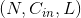, 输出矩阵维度为 . 其中N为输入数量, C为每个输入样本的通道数量, L为样本中一个通道下的数据的长度. 算法如下:

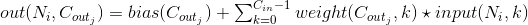

 是互相关运算符, 上式带  项为卷积项.

`stride` 计算相关系数的步长, 可以为 tuple .`padding` 处理边界时在两侧补0数量`dilation` 采样间隔数量. 大于1时为非致密采样, 如对(a,b,c,d,e)采样时, 若池化规模为2,

dilation 为1时, 使用 (a,b);(b,c)… 进行池化, dilation 为1时, 使用 (a,c);(b,d)… 进行池化. | `groups` 控制输入和输出之间的连接, group=1, 输出是所有输入的卷积；group=2, 此时相当于 有并排的两个卷基层, 每个卷积层只在对应的输入通道和输出通道之间计算, 并且输出时会将所有 输出通道简单的首尾相接作为结果输出.

> `in_channels` 和 `out_channels`都要可以被 groups 整除.

注解：

数据的最后一列可能会因为 kernal 大小设定不当而被丢弃(大部分发生在 kernal 大小不能被输入 整除的时候, 适当的 padding 可以避免这个问题）.

参数：

*   `in_channels (-)` – 输入信号的通道数.
*   `out_channels (-)` – 卷积后输出结果的通道数.
*   `kernel_size (-)` – 卷积核的形状.
*   `stride (-)` – 卷积每次移动的步长, 默认为1.
*   `padding (-)` – 处理边界时填充0的数量, 默认为0(不填充).
*   `dilation (-)` – 采样间隔数量, 默认为1, 无间隔采样.
*   `groups (-)` – 输入与输出通道的分组数量. 当不为1时, 默认为1(全连接).
*   `bias (-)` – 为 `True` 时, 添加偏置.


形状：

*   输入 Input: 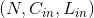
*   输出 Output:  其中 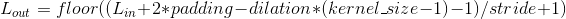

变量：

*   `weight (Tensor)` – 卷积网络层间连接的权重, 是模型需要学习的变量, 形状为 (out_channels, in_channels, kernel_size)
*   `bias (Tensor)` – 偏置, 是模型需要学习的变量, 形状为 (out_channels)


Examples:

```py
>>> m = nn.Conv1d(16, 33, 3, stride=2)
>>> input = autograd.Variable(torch.randn(20, 16, 50))
>>> output = m(input)

```

### Conv2d

```py
class torch.nn.Conv2d(in_channels, out_channels, kernel_size, stride=1, padding=0, dilation=1, groups=1, bias=True)
```

二维卷积层 输入矩阵的维度为  , 输出矩阵维度为  . 其中N为输入数量, C为每个输入样本的通道数量, H, W 分别为样本中一个通道下的数据的形状. 算法如下:


 是互相关运算符, 上式带`*`项为卷积项.

`stride` 计算相关系数的步长, 可以为 tuple .`padding` 处理边界时在每个维度首尾补0数量.`dilation` 采样间隔数量. 大于1时为非致密采样.`groups` 控制输入和输出之间的连接, group=1, 输出是所有输入的卷积； group=2, 此时

相当于有并排的两个卷基层, 每个卷积层只在对应的输入通道和输出通道之间计算, 并且输出时会将所有 输出通道简单的首尾相接作为结果输出.

> `in_channels` 和 `out_channels`都要可以被 groups 整除.

`kernel_size`, `stride`, `padding`, `dilation` 可以为:

> *   单个 `int` 值 – 宽和高均被设定为此值.
> *   由两个 `int` 组成的 `tuple` – 第一个 `int` 为高, 第二个 `int` 为宽.

注解：

数据的最后一列可能会因为 kernal 大小设定不当而被丢弃(大部分发生在 kernal 大小不能被输入 整除的时候, 适当的 padding 可以避免这个问题）.

参数：

*   `in_channels (-)` – 输入信号的通道数.
*   `out_channels (-)` – 卷积后输出结果的通道数.
*   `kernel_size (-)` – 卷积核的形状.
*   `stride (-)` – 卷积每次移动的步长, 默认为1.
*   `padding (-)` – 处理边界时填充0的数量, 默认为0(不填充).
*   `dilation (-)` – 采样间隔数量, 默认为1, 无间隔采样.
*   `groups (-)` – 输入与输出通道的分组数量. 当不为1时, 默认为1(全连接).
*   `bias (-)` – 为 `True` 时, 添加偏置.


形状：

*   输入 Input: 
*   输出 Output:  其中 ![H_{out} = floor((H_{in} + 2 * padding[0] - dilation[0] * (kernel\_size[0] - 1) - 1) / stride[0] + 1)](img/tex-79b3618ba1cd1e8e6e665aae1b4fc446.gif) ![W_{out} = floor((W_{in} + 2 * padding[1] - dilation[1] * (kernel\_size[1] - 1) - 1) / stride[1] + 1)](img/tex-e9f44b9b5fc42bdb5991cfcd52e2dced.gif)

变量：

*   `weight (Tensor)` – 卷积网络层间连接的权重, 是模型需要学习的变量, 形状为 (out_channels, in_channels, kernel_size[0], kernel_size[1])
*   `bias (Tensor)` – 偏置, 是模型需要学习的变量, 形状为 (out_channels)


Examples:

```py
>>> # With square kernels and equal stride
>>> m = nn.Conv2d(16, 33, 3, stride=2)
>>> # non-square kernels and unequal stride and with padding
>>> m = nn.Conv2d(16, 33, (3, 5), stride=(2, 1), padding=(4, 2))
>>> # non-square kernels and unequal stride and with padding and dilation
>>> m = nn.Conv2d(16, 33, (3, 5), stride=(2, 1), padding=(4, 2), dilation=(3, 1))
>>> input = autograd.Variable(torch.randn(20, 16, 50, 100))
>>> output = m(input)

```

### Conv3d

```py
class torch.nn.Conv3d(in_channels, out_channels, kernel_size, stride=1, padding=0, dilation=1, groups=1, bias=True)
```

三维卷基层 输入矩阵的维度为 , 输出矩阵维度为:. 其中N为输入数量, C为每个输入样本的通道数量, D, H, W 分别为样本中一个通道下的数据的形状. 算法如下:


 是互相关运算符, 上式带`*`项为卷积项.

`stride` 计算相关系数的步长, 可以为 tuple .`padding` 处理边界时在每个维度首尾补0数量.`dilation` 采样间隔数量. 大于1时为非致密采样.`groups` 控制输入和输出之间的连接, group=1, 输出是所有输入的卷积； group=2, 此时

相当于有并排的两个卷基层, 每个卷积层只在对应的输入通道和输出通道之间计算, 并且输出时会将所有 输出通道简单的首尾相接作为结果输出.

> `in_channels` 和 `out_channels`都要可以被 groups 整除.

`kernel_size`, `stride`, `padding`, `dilation` 可以为:

> *   单个 `int` 值 – 宽和高和深度均被设定为此值.
> *   由三个 `int` 组成的 `tuple` – 第一个 `int` 为深度, 第二个 `int` 为高度, 第三个 `int` 为宽度.

注解：

数据的最后一列可能会因为 kernal 大小设定不当而被丢弃(大部分发生在 kernal 大小不能被输入 整除的时候, 适当的 padding 可以避免这个问题）.

参数：

*   `in_channels (-)` – 输入信号的通道数.
*   `out_channels (-)` – 卷积后输出结果的通道数.
*   `kernel_size (-)` – 卷积核的形状.
*   `stride (-)` – 卷积每次移动的步长, 默认为1.
*   `padding (-)` – 处理边界时填充0的数量, 默认为0(不填充).
*   `dilation (-)` – 采样间隔数量, 默认为1, 无间隔采样.
*   `groups (-)` – 输入与输出通道的分组数量. 当不为1时, 默认为1(全连接).
*   `bias (-)` – 为 `True` 时, 添加偏置.


形状：

*   输入 Input: 
*   输出 Output:  其中 ![D_{out} = floor((D_{in} + 2 * padding[0] - dilation[0] * (kernel\_size[0] - 1) - 1) / stride[0] + 1)](img/tex-ba168d43ee6e937903b387d0afce9a40.gif) ![H_{out} = floor((H_{in} + 2 * padding[1] - dilation[1] * (kernel\_size[1] - 1) - 1) / stride[1] + 1)](img/tex-89213fb2d0850f4cc41af72bae650bd0.gif) ![W_{out} = floor((W_{in} + 2 * padding[2] - dilation[2] * (kernel\_size[2] - 1) - 1) / stride[2] + 1)](img/tex-397d0048589e3a1a6644d6613e7d4722.gif)

变量：

*   `weight (Tensor)` – 卷积网络层间连接的权重, 是模型需要学习的变量, 形状为 (out_channels, in_channels, kernel_size[0], kernel_size[1], kernel_size[2])
*   `bias (Tensor)` – 偏置, 是模型需要学习的变量, 形状为 (out_channels)


Examples:

```py
>>> # With square kernels and equal stride
>>> m = nn.Conv3d(16, 33, 3, stride=2)
>>> # non-square kernels and unequal stride and with padding
>>> m = nn.Conv3d(16, 33, (3, 5, 2), stride=(2, 1, 1), padding=(4, 2, 0))
>>> input = autograd.Variable(torch.randn(20, 16, 10, 50, 100))
>>> output = m(input)

```

### ConvTranspose1d

```py
class torch.nn.ConvTranspose1d(in_channels, out_channels, kernel_size, stride=1, padding=0, output_padding=0, groups=1, bias=True, dilation=1)
```

一维反卷积层 反卷积层可以理解为输入的数据和卷积核的位置反转的卷积操作. 反卷积有时候也会被翻译成解卷积.

`stride` 计算相关系数的步长.`padding` 处理边界时在每个维度首尾补0数量.`output_padding` 输出时候在首尾补0的数量. (卷积时, 形状不同的输入数据

对相同的核函数可以产生形状相同的结果；反卷积时, 同一个输入对相同的核函数可以产生多 个形状不同的输出, 而输出结果只能有一个, 因此必须对输出形状进行约束）. | `dilation` 采样间隔数量. 大于1时为非致密采样. | `groups` 控制输入和输出之间的连接, group=1, 输出是所有输入的卷积； group=2, 此时 相当于有并排的两个卷基层, 每个卷积层只在对应的输入通道和输出通道之间计算, 并且输出时会将所有 输出通道简单的首尾相接作为结果输出.

> `in_channels` 和 `out_channels`都要可以被 groups 整除.

注解：

数据的最后一列可能会因为 kernal 大小设定不当而被丢弃(大部分发生在 kernal 大小不能被输入 整除的时候, 适当的 padding 可以避免这个问题）.

参数：

*   `in_channels (-)` – 输入信号的通道数.
*   `out_channels (-)` – 卷积后输出结果的通道数.
*   `kernel_size (-)` – 卷积核的形状.
*   `stride (-)` – 卷积每次移动的步长, 默认为1.
*   `padding (-)` – 处理边界时填充0的数量, 默认为0(不填充).
*   `output_padding (-)` – 输出时候在首尾补值的数量, 默认为0\. (卷积时, 形状不同的输入数据
*   `同一个输入对相同的核函数可以产生多 (_对相同的核函数可以产生形状相同的结果；反卷积时_,)` –
*   而输出结果只能有一个, 因此必须对输出形状进行约束） (_个形状不同的输出_,) –
*   `groups (-)` – 输入与输出通道的分组数量. 当不为1时, 默认为1(全连接).
*   `bias (-)` – 为 `True` 时, 添加偏置.
*   `dilation (-)` – 采样间隔数量, 默认为1, 无间隔采样.


形状：

*   输入 Input: 
*   输出 Output:  其中 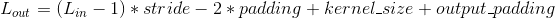

变量：

*   `weight (Tensor)` – 卷积网络层间连接的权重, 是模型需要学习的变量, 形状为weight (Tensor): 卷积网络层间连接的权重, 是模型需要学习的变量, 形状为 (in_channels, out_channels, kernel_size[0], kernel_size[1])
*   `bias (Tensor)` – 偏置, 是模型需要学习的变量, 形状为 (out_channels)


### ConvTranspose2d

```py
class torch.nn.ConvTranspose2d(in_channels, out_channels, kernel_size, stride=1, padding=0, output_padding=0, groups=1, bias=True, dilation=1)
```

二维反卷积层 反卷积层可以理解为输入的数据和卷积核的位置反转的卷积操作. 反卷积有时候也会被翻译成解卷积.

`stride` 计算相关系数的步长.`padding` 处理边界时在每个维度首尾补0数量.`output_padding` 输出时候在每一个维度首尾补0的数量. (卷积时, 形状不同的输入数据

对相同的核函数可以产生形状相同的结果；反卷积时, 同一个输入对相同的核函数可以产生多 个形状不同的输出, 而输出结果只能有一个, 因此必须对输出形状进行约束）. | `dilation` 采样间隔数量. 大于1时为非致密采样. | `groups` 控制输入和输出之间的连接, group=1, 输出是所有输入的卷积； group=2, 此时 相当于有并排的两个卷基层, 每个卷积层只在对应的输入通道和输出通道之间计算, 并且输出时会将所有 输出通道简单的首尾相接作为结果输出.

> `in_channels` 和 `out_channels`都应当可以被 groups 整除.

`kernel_size`, `stride`, `padding`, `output_padding` 可以为:

> *   单个 `int` 值 – 宽和高均被设定为此值.
> *   由两个 `int` 组成的 `tuple` – 第一个 `int` 为高度, 第二个 `int` 为宽度.

注解：

数据的最后一列可能会因为 kernal 大小设定不当而被丢弃(大部分发生在 kernal 大小不能被输入 整除的时候, 适当的 padding 可以避免这个问题）.

参数：

*   `in_channels (-)` – 输入信号的通道数.
*   `out_channels (-)` – 卷积后输出结果的通道数.
*   `kernel_size (-)` – 卷积核的形状.
*   `stride (-)` – 卷积每次移动的步长, 默认为1.
*   `padding (-)` – 处理边界时填充0的数量, 默认为0(不填充).
*   `output_padding (-)` – 输出时候在首尾补值的数量, 默认为0\. (卷积时, 形状不同的输入数据
*   `同一个输入对相同的核函数可以产生多 (_对相同的核函数可以产生形状相同的结果；反卷积时_,)` –
*   而输出结果只能有一个, 因此必须对输出形状进行约束） (_个形状不同的输出_,) –
*   `groups (-)` – 输入与输出通道的分组数量. 当不为1时, 默认为1(全连接).
*   `bias (-)` – 为 `True` 时, 添加偏置.
*   `dilation (-)` – 采样间隔数量, 默认为1, 无间隔采样.


形状：

*   输入 Input: 
*   输出 Output:  其中 ![H_{out} = (H_{in} - 1) * stride[0] - 2 * padding[0] + kernel\_size[0] + output\_padding[0]](img/tex-7009a9216729c8c52e70b14ec732620d.gif) ![W_{out} = (W_{in} - 1) * stride[1] - 2 * padding[1] + kernel\_size[1] + output\_padding[1]](img/tex-bc45574b44fdf01856bacfcd4abdeeba.gif)

变量：

*   `weight (Tensor)` – 卷积网络层间连接的权重, 是模型需要学习的变量, 形状为weight (Tensor): 卷积网络层间连接的权重, 是模型需要学习的变量, 形状为 (in_channels, out_channels, kernel_size[0], kernel_size[1])
*   `bias (Tensor)` – 偏置, 是模型需要学习的变量, 形状为 (out_channels)


Examples:

```py
>>> # With square kernels and equal stride
>>> m = nn.ConvTranspose2d(16, 33, 3, stride=2)
>>> # non-square kernels and unequal stride and with padding
>>> m = nn.ConvTranspose2d(16, 33, (3, 5), stride=(2, 1), padding=(4, 2))
>>> input = autograd.Variable(torch.randn(20, 16, 50, 100))
>>> output = m(input)
>>> # exact output size can be also specified as an argument
>>> input = autograd.Variable(torch.randn(1, 16, 12, 12))
>>> downsample = nn.Conv2d(16, 16, 3, stride=2, padding=1)
>>> upsample = nn.ConvTranspose2d(16, 16, 3, stride=2, padding=1)
>>> h = downsample(input)
>>> h.size()
torch.Size([1, 16, 6, 6])
>>> output = upsample(h, output_size=input.size())
>>> output.size()
torch.Size([1, 16, 12, 12])

```

### ConvTranspose3d

```py
class torch.nn.ConvTranspose3d(in_channels, out_channels, kernel_size, stride=1, padding=0, output_padding=0, groups=1, bias=True, dilation=1)
```

三维反卷积层 反卷积层可以理解为输入的数据和卷积核的位置反转的卷积操作. 反卷积有时候也会被翻译成解卷积.

`stride` 计算相关系数的步长.`padding` 处理边界时在每个维度首尾补0数量.`output_padding` 输出时候在每一个维度首尾补0的数量. (卷积时, 形状不同的输入数据

对相同的核函数可以产生形状相同的结果；反卷积时, 同一个输入对相同的核函数可以产生多 个形状不同的输出, 而输出结果只能有一个, 因此必须对输出形状进行约束） | `dilation` 采样间隔数量. 大于1时为非致密采样. | `groups` 控制输入和输出之间的连接, group=1, 输出是所有输入的卷积； group=2, 此时 相当于有并排的两个卷基层, 每个卷积层只在对应的输入通道和输出通道之间计算, 并且输出时会将所有 输出通道简单的首尾相接作为结果输出.

> `in_channels` 和 `out_channels`都应当可以被 groups 整除.

`kernel_size`, `stride`, `padding`, `output_padding` 可以为:

> *   单个 `int` 值 – 深和宽和高均被设定为此值.
> *   由三个 `int` 组成的 `tuple` – 第一个 `int` 为深度, 第二个 `int` 为高度,第三个 `int` 为宽度.

注解：

数据的最后一列可能会因为 kernal 大小设定不当而被丢弃(大部分发生在 kernal 大小不能被输入 整除的时候, 适当的 padding 可以避免这个问题）.

参数：

*   `in_channels (-)` – 输入信号的通道数.
*   `out_channels (-)` – 卷积后输出结果的通道数.
*   `kernel_size (-)` – 卷积核的形状.
*   `stride (-)` – 卷积每次移动的步长, 默认为1.
*   `padding (-)` – 处理边界时填充0的数量, 默认为0(不填充).
*   `output_padding (-)` – 输出时候在首尾补值的数量, 默认为0\. (卷积时, 形状不同的输入数据
*   `同一个输入对相同的核函数可以产生多 (_对相同的核函数可以产生形状相同的结果；反卷积时_,)` –
*   而输出结果只能有一个, 因此必须对输出形状进行约束） (_个形状不同的输出_,) –
*   `groups (-)` – 输入与输出通道的分组数量. 当不为1时, 默认为1(全连接).
*   `bias (-)` – 为 `True` 时, 添加偏置.
*   `dilation (-)` – 采样间隔数量, 默认为1, 无间隔采样.


形状：

*   输入 Input: 
*   输出 Output:  其中 ![D_{out} = (D_{in} - 1) * stride[0] - 2 * padding[0] + kernel\_size[0] + output\_padding[0]](img/tex-02979cc7d8145e84e5beef17eed9af98.gif) ![H_{out} = (H_{in} - 1) * stride[1] - 2 * padding[1] + kernel\_size[1] + output\_padding[1]](img/tex-fd675a2fc6af8db9a43fc6aee6bba673.gif) ![W_{out} = (W_{in} - 1) * stride[2] - 2 * padding[2] + kernel\_size[2] + output\_padding[2]](img/tex-ed1eac6d6bea1843a9838431c595dcb5.gif)

变量：

*   是模型需要学习的变量, 形状为weight (_卷积网络层间连接的权重_,) – 卷积网络层间连接的权重, 是模型需要学习的变量, 形状为 (in_channels, out_channels, kernel_size[0], kernel_size[1], kernel_size[2])
*   `bias (Tensor)` – 偏置, 是模型需要学习的变量, 形状为 (out_channels)


Examples:

```py
>>> # With square kernels and equal stride
>>> m = nn.ConvTranspose3d(16, 33, 3, stride=2)
>>> # non-square kernels and unequal stride and with padding
>>> m = nn.Conv3d(16, 33, (3, 5, 2), stride=(2, 1, 1), padding=(0, 4, 2))
>>> input = autograd.Variable(torch.randn(20, 16, 10, 50, 100))
>>> output = m(input)

```

## Pooling Layers (池化层)

### MaxPool1d

```py
class torch.nn.MaxPool1d(kernel_size, stride=None, padding=0, dilation=1, return_indices=False, ceil_mode=False)
```

对于多个输入通道组成的输入信号,应用一维的最大池化 `max pooling` 操作

最简单的例子, 如果输入大小为 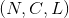, 输出大小为 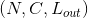, 该层输出值可以用下式精确计算:


如果 `padding` 不是0,那么在输入数据的每条边上会隐式填补对应 `padding` 数量的0值点`dilation` 用于控制内核点之间的间隔, [link](https://github.com/vdumoulin/conv_arithmetic/blob/master/README.md) 很好地可视化展示了 `dilation` 的功能

参数：

*   `kernel_size` – 最大池化操作时的窗口大小
*   `stride` – 最大池化操作时窗口移动的步长, 默认值是 `kernel_size`
*   `padding` – 输入的每条边隐式补0的数量
*   `dilation` – 用于控制窗口中元素的步长的参数
*   `return_indices` – 如果等于 `True`, 在返回 max pooling 结果的同时返回最大值的索引. 这在之后的 Unpooling 时很有用
*   `ceil_mode` – 如果等于 `True`, 在计算输出大小时,将采用向上取整来代替默认的向下取整的方式


形状：

*   输入：
*   输出： 遵从如下关系 

Examples:

```py
>>> # pool of size=3, stride=2
>>> m = nn.MaxPool1d(3, stride=2)
>>> input = autograd.Variable(torch.randn(20, 16, 50))
>>> output = m(input)

```

### MaxPool2d

```py
class torch.nn.MaxPool2d(kernel_size, stride=None, padding=0, dilation=1, return_indices=False, ceil_mode=False)
```

对于多个输入通道组成的输入信号,应用二维的最大池化 `max pooling` 操作

最简单的例子, 如果输入大小为 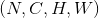, 输出大小为 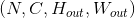, 池化窗口大小 `kernel_size` 为 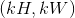 该层输出值可以用下式精确计算:

![\begin{array}{ll} out(N_i, C_j, h, w) = \max_{m=0}^{kH-1} \max_{n=0}^{kW-1} input(N_i, C_j, stride[0] * h + m, stride[1] * w + n) \end{array}](img/tex-573dc90f741480b5e40bf216db293982.gif)

如果 `padding` 不是0, 那么在输入数据的每条边上会隐式填补对应 `padding` 数量的0值点`dilation` 用于控制内核点之间的间隔, [link](https://github.com/vdumoulin/conv_arithmetic/blob/master/README.md) 很好地可视化展示了 `dilation` 的功能

参数 `kernel_size`, `stride`, `padding`, `dilation` 可以是以下任意一种数据类型:

> *   单个 `int` 类型数据 – 此时在 height 和 width 维度上将使用相同的值
> *   包含两个 int 类型数据的 `tuple` 元组 – 此时第一个 `int` 数据表示 height 维度上的数值, 第二个 `int` 数据表示 width 维度上的数值

参数：

*   `kernel_size` – 最大池化操作时的窗口大小
*   `stride` – 最大池化操作时窗口移动的步长, 默认值是 `kernel_size`
*   `padding` – 输入的每条边隐式补0的数量
*   `dilation` – 用于控制窗口中元素的步长的参数
*   `return_indices` – 如果等于 `True`, 在返回 max pooling 结果的同时返回最大值的索引 这在之后的 Unpooling 时很有用
*   `ceil_mode` – 如果等于 `True`, 在计算输出大小时,将采用向上取整来代替默认的向下取整的方式


形状：

*   输入：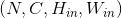
*   输出： 遵从如下关系 ![H_{out} = floor((H_{in} + 2 * padding[0] - dilation[0] * (kernel\_size[0] - 1) - 1) / stride[0] + 1)](img/tex-79b3618ba1cd1e8e6e665aae1b4fc446.gif) ![W_{out} = floor((W_{in} + 2 * padding[1] - dilation[1] * (kernel\_size[1] - 1) - 1) / stride[1] + 1)](img/tex-e9f44b9b5fc42bdb5991cfcd52e2dced.gif)

Examples:

```py
>>> # pool of square window of size=3, stride=2
>>> m = nn.MaxPool2d(3, stride=2)
>>> # pool of non-square window
>>> m = nn.MaxPool2d((3, 2), stride=(2, 1))
>>> input = autograd.Variable(torch.randn(20, 16, 50, 32))
>>> output = m(input)

```

### MaxPool3d

```py
class torch.nn.MaxPool3d(kernel_size, stride=None, padding=0, dilation=1, return_indices=False, ceil_mode=False)
```

对于多个输入通道组成的输入信号,应用三维的最大池化 `max pooling` 操作

最简单的例子, 如果输入大小为 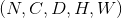,输出大小为 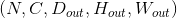 池化窗口大小 `kernel_size` 为 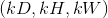 该层输出值可以用下式精确计算:

![\begin{array}{ll} out(N_i, C_j, d, h, w) = \max_{k=0}^{kD-1} \max_{m=0}^{kH-1} \max_{n=0}^{kW-1} input(N_i, C_j, stride[0] * k + d, stride[1] * h + m, stride[2] * w + n) \end{array}](img/tex-42f8d78c4f022c0857c8561088078429.gif)

如果 `padding` 不是0, 那么在输入数据的每条边上会隐式填补对应 `padding` 数量的0值点`dilation` 用于控制内核点之间的间隔, [link](https://github.com/vdumoulin/conv_arithmetic/blob/master/README.md) 很好地可视化展示了 `dilation` 的功能

参数 `kernel_size`, `stride`, `padding`, `dilation` 可以是以下任意一种数据类型:

> *   单个 `int` 类型数据 – 此时在 depth, height 和 width 维度上将使用相同的值
> *   包含三个 int 类型数据的 `tuple` 元组 – 此时第一个 `int` 数据表示 depth 维度上的数值, 第二个 `int` 数据表示 height 维度上的数值,第三个 `int` 数据表示 width 维度上的数值

参数：

*   `kernel_size` – 最大池化操作时的窗口大小
*   `stride` – 最大池化操作时窗口移动的步长, 默认值是 `kernel_size`
*   `padding` – 输入所有三条边上隐式补0的数量
*   `dilation` – 用于控制窗口中元素的步长的参数
*   `return_indices` – 如果等于 `True`, 在返回 max pooling 结果的同时返回最大值的索引 这在之后的 Unpooling 时很有用
*   `ceil_mode` – 如果等于 `True`, 在计算输出大小时,将采用向上取整来代替默认的向下取整的方式


形状：

*   输入：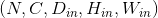
*   输出： 遵从如下关系 ![D_{out} = floor((D_{in} + 2 * padding[0] - dilation[0] * (kernel\_size[0] - 1) - 1) / stride[0] + 1)](img/tex-ba168d43ee6e937903b387d0afce9a40.gif) ![H_{out} = floor((H_{in} + 2 * padding[1] - dilation[1] * (kernel\_size[1] - 1) - 1) / stride[1] + 1)](img/tex-89213fb2d0850f4cc41af72bae650bd0.gif) ![W_{out} = floor((W_{in} + 2 * padding[2] - dilation[2] * (kernel\_size[2] - 1) - 1) / stride[2] + 1)](img/tex-397d0048589e3a1a6644d6613e7d4722.gif)

Examples:

```py
>>> # pool of square window of size=3, stride=2
>>> m = nn.MaxPool3d(3, stride=2)
>>> # pool of non-square window
>>> m = nn.MaxPool3d((3, 2, 2), stride=(2, 1, 2))
>>> input = autograd.Variable(torch.randn(20, 16, 50,44, 31))
>>> output = m(input)

```

### MaxUnpool1d

```py
class torch.nn.MaxUnpool1d(kernel_size, stride=None, padding=0)
```

`MaxPool1d` 的逆过程

要注意的是 `MaxPool1d` 并不是完全可逆的, 因为在max pooling过程中非最大值已经丢失

`MaxUnpool1d` 以 `MaxPool1d` 的输出, 包含最大值的索引作为输入 计算max poooling的部分逆过程(对于那些最大值区域), 对于那些非最大值区域将设置为0值

注解：

<cite>MaxPool1d</cite> 可以将多个输入大小映射到相同的输出大小, 因此反演过程可能会模棱两可 为适应这一点, 在调用forward函数时可以将需要的输出大小作为额外的参数 <cite>output_size</cite> 传入.

� 具体用法,请参阅下面的输入和示例

参数：

*   `kernel_size (int 或 tuple)` – 最大池化操作时的窗口大小
*   `stride (int 或 tuple)` – 最大池化操作时窗口移动的步长, 默认值是 `kernel_size`
*   `padding (int 或 tuple)` – 输入的每条边填充0值的个数


Inputs:

*   `input`: 需要转化的输入的 Tensor
*   `indices`: `MaxPool1d` 提供的最大值索引
*   `output_size` (可选) : `torch.Size` 类型的数据指定输出的大小

形状：

*   输入：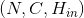
*   输出： 遵从如下关系 ![H_{out} = (H_{in} - 1) * stride[0] - 2 * padding[0] + kernel\_size[0]](img/tex-3e4cc86575ff480ad4c4141a89f2b470.gif) 或者在调用时指定输出大小 `output_size`

示例：

```py
>>> pool = nn.MaxPool1d(2, stride=2, return_indices=True)
>>> unpool = nn.MaxUnpool1d(2, stride=2)
>>> input = Variable(torch.Tensor([[[1, 2, 3, 4, 5, 6, 7, 8]]]))
>>> output, indices = pool(input)
>>> unpool(output, indices)
Variable containing:
(0 ,.,.) =
 0   2   0   4   0   6   0   8
[torch.FloatTensor of size 1x1x8]

>>> # Example showcasing the use of output_size
>>> input = Variable(torch.Tensor([[[1, 2, 3, 4, 5, 6, 7, 8, 9]]]))
>>> output, indices = pool(input)
>>> unpool(output, indices, output_size=input.size())
Variable containing:
(0 ,.,.) =
 0   2   0   4   0   6   0   8   0
[torch.FloatTensor of size 1x1x9]

>>> unpool(output, indices)
Variable containing:
(0 ,.,.) =
 0   2   0   4   0   6   0   8
[torch.FloatTensor of size 1x1x8]

```

### MaxUnpool2d

```py
class torch.nn.MaxUnpool2d(kernel_size, stride=None, padding=0)
```

`MaxPool2d` 的逆过程

要注意的是 `MaxPool2d` 并不是完全可逆的, 因为在max pooling过程中非最大值已经丢失

`MaxUnpool2d` 以 `MaxPool2d` 的输出, 包含最大值的索引作为输入 计算max poooling的部分逆过程(对于那些最大值区域), 对于那些非最大值区域将设置为0值

注解：

<cite>MaxPool2d</cite> 可以将多个输入大小映射到相同的输出大小, 因此反演过程可能会模棱两可. 为适应这一点, 在调用forward函数时可以将需要的输出大小作为额外的参数 <cite>output_size</cite> 传入.

� 具体用法,请参阅下面的输入和示例

参数：

*   `kernel_size (int 或 tuple)` – 最大池化操作时的窗口大小
*   `stride (int 或 tuple)` – 最大池化操作时窗口移动的步长, 默认值是 `kernel_size`
*   `padding (int 或 tuple)` – 输入的每条边填充0值的个数


Inputs:

*   `input`: 需要转化的输入的 Tensor
*   `indices`: `MaxPool2d` 提供的最大值索引
*   `output_size` (可选) : `torch.Size` 类型的数据指定输出的大小

形状：

*   输入：
*   输出： 遵从如下关系 ![H_{out} = (H_{in} - 1) * stride[0] -2 * padding[0] + kernel\_size[0]](img/tex-bc6952442952352a9c45fd1615b9c8ab.gif) ![W_{out} = (W_{in} - 1) * stride[1] -2 * padding[1] + kernel\_size[1]](img/tex-271dbbdd3ca44e09a3a07b7353048057.gif) 或者在调用时指定输出大小 `output_size`

示例：

```py
>>> pool = nn.MaxPool2d(2, stride=2, return_indices=True)
>>> unpool = nn.MaxUnpool2d(2, stride=2)
>>> input = Variable(torch.Tensor([[[[ 1,  2,  3,  4],
...                                  [ 5,  6,  7,  8],
...                                  [ 9, 10, 11, 12],
...                                  [13, 14, 15, 16]]]]))
>>> output, indices = pool(input)
>>> unpool(output, indices)
Variable containing:
(0 ,0 ,.,.) =
 0   0   0   0
 0   6   0   8
 0   0   0   0
 0  14   0  16
[torch.FloatTensor of size 1x1x4x4]

>>> # specify a different output size than input size
>>> unpool(output, indices, output_size=torch.Size([1, 1, 5, 5]))
Variable containing:
(0 ,0 ,.,.) =
 0   0   0   0   0
 6   0   8   0   0
 0   0   0  14   0
 16   0   0   0   0
 0   0   0   0   0
[torch.FloatTensor of size 1x1x5x5]

```

### MaxUnpool3d

```py
class torch.nn.MaxUnpool3d(kernel_size, stride=None, padding=0)
```

`MaxPool3d` 的逆过程

要注意的是 `MaxPool3d` 并不是完全可逆的, 因为在max pooling过程中非最大值已经丢失 `MaxUnpool3d` 以 `MaxPool3d` 的输出, 包含最大值的索引作为输入 计算max poooling的部分逆过程(对于那些最大值区域), 对于那些非最大值区域将设置为0值

注解：

<cite>MaxPool3d</cite> 可以将多个输入大小映射到相同的输出大小, 因此反演过程可能会模棱两可. 为适应这一点, 在调用forward函数时可以将需要的输出大小作为额外的参数 <cite>output_size</cite> 传入.

� 具体用法,请参阅下面的输入和示例

参数：

*   `kernel_size (int 或 tuple)` – 最大池化操作时的窗口大小
*   `stride (int 或 tuple)` – 最大池化操作时窗口移动的步长, 默认值是 `kernel_size`
*   `padding (int 或 tuple)` – 输入的每条边填充0值的个数


Inputs:

*   `input`: 需要转化的输入的 Tensor
*   `indices`: `MaxPool3d` 提供的最大值索引
*   `output_size` (可选) : `torch.Size` 类型的数据指定输出的大小

形状：

*   输入：
*   输出： 遵从如下关系 ![D_{out} = (D_{in} - 1) * stride[0] - 2 * padding[0] + kernel\_size[0]](img/tex-570c38500306b160a0747f548ed0f215.gif) ![H_{out} = (H_{in} - 1) * stride[1] - 2 * padding[1] + kernel\_size[1]](img/tex-f359d5e863d259e3983a5b5c33f30f38.gif) ![W_{out} = (W_{in} - 1) * stride[2] - 2 * padding[2] + kernel\_size[2]](img/tex-0aaee5bf5ff41e2d03d399eead71c93e.gif) 或者在调用时指定输出大小 `output_size`

示例：

```py
>>> # pool of square window of size=3, stride=2
>>> pool = nn.MaxPool3d(3, stride=2, return_indices=True)
>>> unpool = nn.MaxUnpool3d(3, stride=2)
>>> output, indices = pool(Variable(torch.randn(20, 16, 51, 33, 15)))
>>> unpooled_output = unpool(output, indices)
>>> unpooled_output.size()
torch.Size([20, 16, 51, 33, 15])

```

### AvgPool1d

```py
class torch.nn.AvgPool1d(kernel_size, stride=None, padding=0, ceil_mode=False, count_include_pad=True)
```

对于多个输入通道组成的输入信号,应用一维的平均池化 `average pooling` 操作

最简单的例子, 如果输入大小为 , 输出大小为 , 池化窗口大小 `kernel_size` 为  该层输出值可以用下式精确计算:

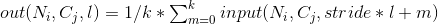

如果 `padding` 不是0, 那么在输入数据的每条边上会隐式填补对应 `padding` 数量的0值点

参数 `kernel_size`, `stride`, `padding` 可以为单个 `int` 类型的数据 或者是一个单元素的tuple元组

参数：

*   `kernel_size` – 平均池化操作时取平均值的窗口的大小
*   `stride` – 平均池化操作时窗口移动的步长, 默认值是 `kernel_size`
*   `padding` – 输入的每条边隐式补0的数量
*   `ceil_mode` – 如果等于 `True`, 在计算输出大小时,将采用向上取整来代替默认的向下取整的方式
*   `count_include_pad` – 如果等于 `True`, 在计算平均池化的值时,将考虑 `padding` 填充的0


形状：

*   输入：
*   输出： 遵从如下关系 

Examples:

```py
>>> # pool with window of size=3, stride=2
>>> m = nn.AvgPool1d(3, stride=2)
>>> m(Variable(torch.Tensor([[[1,2,3,4,5,6,7]]])))
Variable containing:
(0 ,.,.) =
 2  4  6
[torch.FloatTensor of size 1x1x3]

```

### AvgPool2d

```py
class torch.nn.AvgPool2d(kernel_size, stride=None, padding=0, ceil_mode=False, count_include_pad=True)
```

对于多个输入通道组成的输入信号,应用二维的平均池化 `average pooling` 操作

最简单的例子,如果输入大小为 ,输出大小为 , 池化窗口大小 `kernel_size` 为  该层输出值可以用下式精确计算:

![\begin{array}{ll} out(N_i, C_j, h, w) = 1 / (kH * kW) * \sum_{m=0}^{kH-1} \sum_{n=0}^{kW-1} input(N_i, C_j, stride[0] * h + m, stride[1] * w + n) \end{array}](img/tex-83e390b13d2c73927b15f35344142d36.gif)

如果 `padding` 不是0, 那么在输入数据的每条边上会隐式填补对应 `padding` 数量的0值点

参数 `kernel_size`, `stride`, `padding` 可以是以下任意一种数据类型:

> *   单个 `int` 类型数据 – 此时在 height 和 width 维度上将使用相同的值
> *   包含两个 int 类型数据的 `tuple` 元组 – 此时第一个 `int` 数据表示 height 维度上的数值, 第二个 `int` 数据表示 width 维度上的数值

参数：

*   `kernel_size` – 平均池化操作时取平均值的窗口的大小
*   `stride` – 平均池化操作时窗口移动的步长, 默认值是 `kernel_size`
*   `padding` – 输入的每条边隐式补0的数量
*   `ceil_mode` – 如果等于 `True`, 在计算输出大小时,将采用向上取整来代替默认的向下取整的方式
*   `count_include_pad` – 如果等于 `True`, 在计算平均池化的值时,将考虑 `padding` 填充的0


形状：

*   输入：
*   输出： 遵从如下关系 ![H_{out} = floor((H_{in} + 2 * padding[0] - kernel\_size[0]) / stride[0] + 1)](img/tex-741bce32e0f25e0789dd133c8f7efabd.gif) ![W_{out} = floor((W_{in} + 2 * padding[1] - kernel\_size[1]) / stride[1] + 1)](img/tex-e529efd000cb956703fed84faea15127.gif)

Examples:

```py
>>> # pool of square window of size=3, stride=2
>>> m = nn.AvgPool2d(3, stride=2)
>>> # pool of non-square window
>>> m = nn.AvgPool2d((3, 2), stride=(2, 1))
>>> input = autograd.Variable(torch.randn(20, 16, 50, 32))
>>> output = m(input)

```

### AvgPool3d

```py
class torch.nn.AvgPool3d(kernel_size, stride=None, padding=0, ceil_mode=False, count_include_pad=True)
```

对于多个输入通道组成的输入信号,应用三维的平均池化 `average pooling` 操作

最简单的例子, 如果输入大小为 ,输出大小为  池化窗口大小 `kernel_size` 为  该层输出值可以用下式精确计算:

![\begin{array}{ll} out(N_i, C_j, d, h, w) = 1 / (kD * kH * kW) * \sum_{k=0}^{kD-1} \sum_{m=0}^{kH-1} \sum_{n=0}^{kW-1} input(N_i, C_j, stride[0] * d + k, stride[1] * h + m, stride[2] * w + n) \end{array}](img/tex-fbe2c38eff7c51172e8dab64682e8248.gif)

如果 `padding` 不是0, 那么在输入数据的每条边上会隐式填补对应 `padding` 数量的0值点

参数 `kernel_size`, `stride` 可以是以下任意一种数据类型:

> *   单个 `int` 类型数据 – 此时在 depth, height 和 width 维度上将使用相同的值
> *   包含三个 int 类型数据的 `tuple` 元组 – 此时第一个 `int` 数据表示 depth 维度上的数值, 第二个 `int` 数据表示 height 维度上的数值,第三个 `int` 数据表示 width 维度上的数值

参数：

*   `kernel_size` – 平均池化操作时取平均值的窗口的大小
*   `stride` – 平均池化操作时窗口移动的步长, 默认值是 `kernel_size`
*   `padding` – 输入的每条边隐式补0的数量
*   `ceil_mode` – 如果等于 `True`, 在计算输出大小时,将采用向上取整来代替默认的向下取整的方式
*   `count_include_pad` – 如果等于 `True`, 在计算平均池化的值时,将考虑 `padding` 填充的0


形状：

*   输入：
*   输出： 遵从如下关系 ![D_{out} = floor((D_{in} + 2 * padding[0] - kernel\_size[0]) / stride[0] + 1)](img/tex-8b48af0f996fb14285ac4c971f261f39.gif) ![H_{out} = floor((H_{in} + 2 * padding[1] - kernel\_size[1]) / stride[1] + 1)](img/tex-442ab69f414e2fff99841eec0edaa03e.gif) ![W_{out} = floor((W_{in} + 2 * padding[2] - kernel\_size[2]) / stride[2] + 1)](img/tex-d5ddd94486a3777d830d45cb65de8dc5.gif)

Examples:

```py
>>> # pool of square window of size=3, stride=2
>>> m = nn.AvgPool3d(3, stride=2)
>>> # pool of non-square window
>>> m = nn.AvgPool3d((3, 2, 2), stride=(2, 1, 2))
>>> input = autograd.Variable(torch.randn(20, 16, 50,44, 31))
>>> output = m(input)

```

### FractionalMaxPool2d

```py
class torch.nn.FractionalMaxPool2d(kernel_size, output_size=None, output_ratio=None, return_indices=False, _random_samples=None)
```

对于多个输入通道组成的输入信号,应用二维的分数最大池化 `fractional max pooling` 操作

分数最大池化 `Fractiona MaxPooling` 的具体细节描述,详见Ben Graham论文 [Fractional MaxPooling](http://arxiv.org/abs/1412.6071)

由目标输出大小确定随机步长,在 kH x kW 区域内进行最大池化的操作 输出特征的数量与输入通道的数量相同

参数：

*   `kernel_size` – 最大池化操作时窗口的大小. 可以是单个数字 k (等价于 k x k 的正方形窗口) 或者是 一个元组 tuple (kh x kw)
*   `output_size` – oH x oW 形式的输出图像的尺寸. 可以用 一个 tuple 元组 (oH, oW) 表示 oH x oW 的输出尺寸, 或者是单个的数字 oH 表示 oH x oH 的输出尺寸
*   `output_ratio` – 如果想用输入图像的百分比来指定输出图像的大小,可选用该选项. 使用范围在 (0,1) 之间的一个值来指定.
*   `return_indices` – 如果等于 `True`,在返回输出结果的同时返回最大值的索引,该索引对 nn.MaxUnpool2d 有用. 默认情况下该值等于 `False`


示例：

```py
>>> # pool of square window of size=3, and target output size 13x12
>>> m = nn.FractionalMaxPool2d(3, output_size=(13, 12))
>>> # pool of square window and target output size being half of input image size
>>> m = nn.FractionalMaxPool2d(3, output_ratio=(0.5, 0.5))
>>> input = autograd.Variable(torch.randn(20, 16, 50, 32))
>>> output = m(input)

```

### LPPool2d

```py
class torch.nn.LPPool2d(norm_type, kernel_size, stride=None, ceil_mode=False)
```

对于多个输入通道组成的输入信号,应用二维的幂平均池化 `power-average pooling` 操作

在每个窗口内, 输出的计算方式: 

> *   当 p 无穷大时,等价于最大池化 `Max Pooling` 操作
> *   当 `p=1` 时, 等价于平均池化 `Average Pooling` 操作

参数 `kernel_size`, `stride` 可以是以下任意一种数据类型:

> *   单个 `int` 类型数据 – 此时在height和width维度上将使用相同的值
> *   包含两个 int 类型数据的 `tuple` 元组 – 此时第一个 `int` 数据表示 height 维度上的数值, 第二个 `int` 数据表示 width 维度上的数值

参数：

*   `kernel_size` – 幂平均池化时窗口的大小
*   `stride` – 幂平均池化操作时窗口移动的步长, 默认值是 `kernel_size`
*   `ceil_mode` – 如果等于 `True`, 在计算输出大小时,将采用向上取整来代替默认的向下取整的方式


形状：

*   输入：
*   输出： 遵从如下关系 ![H_{out} = floor((H_{in} + 2 * padding[0] - dilation[0] * (kernel\_size[0] - 1) - 1) / stride[0] + 1)](img/tex-79b3618ba1cd1e8e6e665aae1b4fc446.gif) ![W_{out} = floor((W_{in} + 2 * padding[1] - dilation[1] * (kernel\_size[1] - 1) - 1) / stride[1] + 1)](img/tex-e9f44b9b5fc42bdb5991cfcd52e2dced.gif)

Examples:

```py
>>> # power-2 pool of square window of size=3, stride=2
>>> m = nn.LPPool2d(2, 3, stride=2)
>>> # pool of non-square window of power 1.2
>>> m = nn.LPPool2d(1.2, (3, 2), stride=(2, 1))
>>> input = autograd.Variable(torch.randn(20, 16, 50, 32))
>>> output = m(input)

```

### AdaptiveMaxPool1d

```py
class torch.nn.AdaptiveMaxPool1d(output_size, return_indices=False)
```

对于多个输入通道组成的输入信号,应用一维的自适应最大池化 `adaptive max pooling` 操作

对于任意大小的输入,可以指定输出的尺寸为 H 输出特征的数量与输入通道的数量相同.

参数：

*   `output_size` – 目标输出的尺寸 H
*   `return_indices` – 如果等于 `True`,在返回输出结果的同时返回最大值的索引,该索引对 nn.MaxUnpool1d 有用. 默认情况下该值等于 `False`


示例：

```py
>>> # target output size of 5
>>> m = nn.AdaptiveMaxPool1d(5)
>>> input = autograd.Variable(torch.randn(1, 64, 8))
>>> output = m(input)

```

### AdaptiveMaxPool2d

```py
class torch.nn.AdaptiveMaxPool2d(output_size, return_indices=False)
```

对于多个输入通道组成的输入信号,应用二维的自适应最大池化 `adaptive max pooling` 操作

对于任意大小的输入,可以指定输出的尺寸为 H x W 输出特征的数量与输入通道的数量相同.

参数：

*   `output_size` – H x W 形式的输出图像的尺寸. 可以用 一个 tuple 元组 (H, W) 表示 H x W 的输出尺寸, 或者是单个的数字 H 表示 H x H 的输出尺寸
*   `return_indices` – 如果等于 `True`,在返回输出结果的同时返回最大值的索引,该索引对 nn.MaxUnpool2d 有用. 默认情况下该值等于 `False`


示例：

```py
>>> # target output size of 5x7
>>> m = nn.AdaptiveMaxPool2d((5,7))
>>> input = autograd.Variable(torch.randn(1, 64, 8, 9))
>>> output = m(input)
>>> # target output size of 7x7 (square)
>>> m = nn.AdaptiveMaxPool2d(7)
>>> input = autograd.Variable(torch.randn(1, 64, 10, 9))
>>> output = m(input)

```

### AdaptiveMaxPool3d

```py
class torch.nn.AdaptiveMaxPool3d(output_size, return_indices=False)
```

对于多个输入通道组成的输入信号,应用三维的自适应最大池化 `adaptive max pooling` 操作

对于任意大小的输入,可以指定输出的尺寸为 D x H x W 输出特征的数量与输入通道的数量相同.

参数：

*   `output_size` – D x H x W 形式的输出图像的尺寸. 可以用 一个 tuple 元组 (D, H, W) 表示 D x H x W 的输出尺寸, 或者是单个的数字 D 表示 D x D x D 的输出尺寸
*   `return_indices` – 如果等于 `True`,在返回输出结果的同时返回最大值的索引,该索引对 nn.MaxUnpool3d 有用. 默认情况下该值等于 `False`


示例：

```py
>>> # target output size of 5x7x9
>>> m = nn.AdaptiveMaxPool3d((5,7,9))
>>> input = autograd.Variable(torch.randn(1, 64, 8, 9, 10))
>>> output = m(input)
>>> # target output size of 7x7x7 (cube)
>>> m = nn.AdaptiveMaxPool3d(7)
>>> input = autograd.Variable(torch.randn(1, 64, 10, 9, 8))
>>> output = m(input)

```

### AdaptiveAvgPool1d

```py
class torch.nn.AdaptiveAvgPool1d(output_size)
```

对于多个输入通道组成的输入信号,应用一维的自适应平均池化 `adaptive average pooling` 操作

对于任意大小的输入,可以指定输出的尺寸为 H 输出特征的数量与输入通道的数量相同.

参数：output_size – 目标输出的尺寸 H


示例：

```py
>>> # target output size of 5
>>> m = nn.AdaptiveAvgPool1d(5)
>>> input = autograd.Variable(torch.randn(1, 64, 8))
>>> output = m(input)

```

### AdaptiveAvgPool2d

```py
class torch.nn.AdaptiveAvgPool2d(output_size)
```

对于多个输入通道组成的输入信号,应用二维的自适应平均池化 `adaptive average pooling` 操作

对于任意大小的输入,可以指定输出的尺寸为 H x W 输出特征的数量与输入通道的数量相同.

参数：output_size – H x W 形式的输出图像的尺寸. 可以用 一个 tuple 元组 (H, W) 表示 H x W 的输出尺寸, 或者是单个的数字 H 表示 H x H 的输出尺寸


示例：

```py
>>> # target output size of 5x7
>>> m = nn.AdaptiveAvgPool2d((5,7))
>>> input = autograd.Variable(torch.randn(1, 64, 8, 9))
>>> output = m(input)
>>> # target output size of 7x7 (square)
>>> m = nn.AdaptiveAvgPool2d(7)
>>> input = autograd.Variable(torch.randn(1, 64, 10, 9))
>>> output = m(input)

```

### AdaptiveAvgPool3d

```py
class torch.nn.AdaptiveAvgPool3d(output_size)
```

对于多个输入通道组成的输入信号,应用三维的自适应平均池化 `adaptive average pooling` 操作

对于任意大小的输入,可以指定输出的尺寸为 D x H x W 输出特征的数量与输入通道的数量相同.

参数：output_size – D x H x W 形式的输出图像的尺寸. 可以用 一个 tuple 元组 (D, H, W) 表示 D x H x W 的输出尺寸, 或者是单个的数字 D 表示 D x D x D 的输出尺寸


示例：

```py
>>> # target output size of 5x7x9
>>> m = nn.AdaptiveAvgPool3d((5,7,9))
>>> input = autograd.Variable(torch.randn(1, 64, 8, 9, 10))
>>> output = m(input)
>>> # target output size of 7x7x7 (cube)
>>> m = nn.AdaptiveAvgPool3d(7)
>>> input = autograd.Variable(torch.randn(1, 64, 10, 9, 8))
>>> output = m(input)

```

## Padding Layers (填充层)

### ReflectionPad2d

```py
class torch.nn.ReflectionPad2d(padding)
```

使用输入边界的反射填充输入张量.

参数：

*   `padding (int, tuple)` – 填充的大小. 如果是int, 则在所有边界填充使用相同的.
*   `则使用 (_如果是4个元组_,)` –


形状：

*   输入：
*   输出： where  

示例：

```py
>>> m = nn.ReflectionPad2d(3)
>>> input = autograd.Variable(torch.randn(16, 3, 320, 480))
>>> output = m(input)
>>> # 使用不同的填充
>>> m = nn.ReflectionPad2d((3, 3, 6, 6))
>>> output = m(input)

```

### ReplicationPad2d

```py
class torch.nn.ReplicationPad2d(padding)
```

使用输入边界的复制填充输入张量.

参数：`padding (int, tuple)` – 填充的大小. 如果是int, 则在所有边界使用相同的填充. 如果是4个元组, 则使用(paddingLeft, paddingRight, paddingTop, paddingBottom)


形状：

*   输入：
*   输出： where  

示例：

```py
>>> m = nn.ReplicationPad2d(3)
>>> input = autograd.Variable(torch.randn(16, 3, 320, 480))
>>> output = m(input)
>>> # 使用不同的填充
>>> m = nn.ReplicationPad2d((3, 3, 6, 6))
>>> output = m(input)

```

### ReplicationPad3d

```py
class torch.nn.ReplicationPad3d(padding)
```

使用输入边界的复制填充输入张量.

参数：

*   `padding (int, tuple)` – 填充的大小. 如果是int, 则在所有边界使用相同的填充.
*   `则使用 (paddingLeft, paddingRight, (_如果是四个元组_,)` –
*   paddingBottom, paddingFront, paddingBack) (_paddingTop_,) –


形状：

*   输入：
*   输出： where   

示例：

```py
>>> m = nn.ReplicationPad3d(3)
>>> input = autograd.Variable(torch.randn(16, 3, 8, 320, 480))
>>> output = m(input)
>>> # 使用不同的填充
>>> m = nn.ReplicationPad3d((3, 3, 6, 6, 1, 1))
>>> output = m(input)

```

### ZeroPad2d

```py
class torch.nn.ZeroPad2d(padding)
```

用零填充输入张量边界.

参数：

*   `padding (int, tuple)` – 填充的大小. 如果是int, 则在所有边界使用相同的填充.


形状：

*   输入：
*   输出： where  

示例：

```py
>>> m = nn.ZeroPad2d(3)
>>> input = autograd.Variable(torch.randn(16, 3, 320, 480))
>>> output = m(input)
>>> # 使用不同的填充
>>> m = nn.ZeroPad2d((3, 3, 6, 6))
>>> output = m(input)

```

### ConstantPad2d

```py
class torch.nn.ConstantPad2d(padding, value)
```

用一个常数值填充输入张量边界.

对于 Nd-padding, 使用 nn.functional.pad().

参数：

*   `padding (int, tuple)` – 填充的大小. 如果是int, 则在所有边界使用相同的填充.
*   `value` –


形状：

*   输入：
*   输出： where  

示例：

```py
>>> m = nn.ConstantPad2d(3, 3.5)
>>> input = autograd.Variable(torch.randn(16, 3, 320, 480))
>>> output = m(input)
>>> # 使用不同的填充
>>> m = nn.ConstantPad2d((3, 3, 6, 6), 3.5)
>>> output = m(input)

```

## Non-linear Activations (非线性层)

### ReLU

```py
class torch.nn.ReLU(inplace=False)
```

对输入运用修正线性单元函数 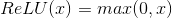

参数：inplace – 选择是否进行覆盖运算 Default: `False`


形状：

*   输入：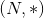 `*` 代表任意数目附加维度
*   输出：, 与输入拥有同样的 shape 属性

Examples:

```py
>>> m = nn.ReLU()
>>> input = autograd.Variable(torch.randn(2))
>>> print(input)
>>> print(m(input))

```

### ReLU6

```py
class torch.nn.ReLU6(inplace=False)
```

对输入的每一个元素运用函数 

参数：inplace – 选择是否进行覆盖运算 默认值: `False`


形状：

*   输入：, `*` 代表任意数目附加维度
*   输出：, 与输入拥有同样的 shape 属性

Examples:

```py
>>> m = nn.ReLU6()
>>> input = autograd.Variable(torch.randn(2))
>>> print(input)
>>> print(m(input))

```

### ELU

```py
class torch.nn.ELU(alpha=1.0, inplace=False)
```

对输入的每一个元素运用函数, 

参数：

*   `alpha` – ELU 定义公式中的 alpha 值. 默认值: 1.0
*   `inplace` – 选择是否进行覆盖运算 默认值: `False`


形状：

*   输入： `*` 代表任意数目附加维度
*   输出：, 与输入拥有同样的 shape 属性

Examples:

```py
>>> m = nn.ELU()
>>> input = autograd.Variable(torch.randn(2))
>>> print(input)
>>> print(m(input))

```

### SELU

```py
class torch.nn.SELU(inplace=False)
```

对输入的每一个元素运用函数, , `alpha=1.6732632423543772848170429916717`, `scale=1.0507009873554804934193349852946`.

更多地细节可以参阅论文 [Self-Normalizing Neural Networks](https://arxiv.org/abs/1706.02515) .

参数：`inplace (bool, 可选)` – 选择是否进行覆盖运算. 默认值: `False`


形状：

*   输入： where `*` means, any number of additional dimensions
*   输出：, same shape as the input

Examples:

```py
>>> m = nn.SELU()
>>> input = autograd.Variable(torch.randn(2))
>>> print(input)
>>> print(m(input))

```

### PReLU

```py
class torch.nn.PReLU(num_parameters=1, init=0.25)
```

对输入的每一个元素运用函数  这里的 “a” 是自学习的参数. 当不带参数地调用时, nn.PReLU() 在所有输入通道中使用单个参数 “a” . 而如果用 nn.PReLU(nChannels) 调用, “a” 将应用到每个输入.

注解：

当为了表现更佳的模型而学习参数 “a” 时不要使用权重衰减 (weight decay)

参数：

*   `num_parameters` – 需要学习的 “a” 的个数. 默认等于1
*   `init` – “a” 的初始值. 默认等于0.25


形状：

*   输入： 其中 `*` 代表任意数目的附加维度
*   输出：, 和输入的格式 shape 一致

例:

```py
>>> m = nn.PReLU()
>>> input = autograd.Variable(torch.randn(2))
>>> print(input)
>>> print(m(input))

```

### LeakyReLU

```py
class torch.nn.LeakyReLU(negative_slope=0.01, inplace=False)
```

对输入的每一个元素运用, 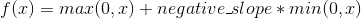

参数：

*   `negative_slope` – 控制负斜率的角度, 默认值: 1e-2
*   `inplace` – 选择是否进行覆盖运算 默认值: `False`


形状：

*   输入： 其中 `*` 代表任意数目的附加维度
*   输出：, 和输入的格式shape一致

例:

```py
>>> m = nn.LeakyReLU(0.1)
>>> input = autograd.Variable(torch.randn(2))
>>> print(input)
>>> print(m(input))

```

### Threshold

```py
class torch.nn.Threshold(threshold, value, inplace=False)
```

基于 Tensor 中的每个元素创造阈值函数

Threshold 被定义为

```py
y =  x        if x >  threshold
     value    if x <= threshold

```

参数：

*   `threshold` – 阈值
*   `value` – 输入值小于阈值则会被 value 代替
*   `inplace` – 选择是否进行覆盖运算. 默认值: `False`


形状：

*   输入： 其中 `*` 代表任意数目的附加维度
*   输出：, 和输入的格式 shape 一致

例:

```py
>>> m = nn.Threshold(0.1, 20)
>>> input = Variable(torch.randn(2))
>>> print(input)
>>> print(m(input))

```

### Hardtanh

```py
class torch.nn.Hardtanh(min_val=-1, max_val=1, inplace=False, min_value=None, max_value=None)
```

对输入的每一个元素运用 HardTanh

HardTanh 被定义为:

```py
f(x) = +1, if x  >  1
f(x) = -1, if x  < -1
f(x) =  x,  otherwise

```

线性区域的范围 ![[-1, 1]](img/tex-7dec1d46e68831c4eca28b020fcb1604.gif) 可以被调整

参数：

*   `min_val` – 线性区域范围最小值. 默认值: -1
*   `max_val` – 线性区域范围最大值. 默认值: 1
*   `inplace` – 选择是否进行覆盖运算. 默认值: `False`


关键字参数 `min_value` 以及 `max_value` 已被弃用. 更改为 `min_val` 和 `max_val`

形状：

*   输入： 其中 `*` 代表任意维度组合
*   输出：, 与输入有相同的 shape 属性

例

```py
>>> m = nn.Hardtanh(-2, 2)
>>> input = autograd.Variable(torch.randn(2))
>>> print(input)
>>> print(m(input))

```

### Sigmoid

```py
class torch.nn.Sigmoid
```

对每个元素运用 Sigmoid 函数. Sigmoid 定义如下 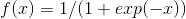

形状：

*   输入： `*` 表示任意维度组合
*   输出：, 与输入有相同的 shape 属性

Examples:

```py
>>> m = nn.Sigmoid()
>>> input = autograd.Variable(torch.randn(2))
>>> print(input)
>>> print(m(input))

```

### Tanh

```py
class torch.nn.Tanh
```

对输入的每个元素, 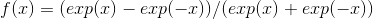

形状：

*   输入： `*` 表示任意维度组合
*   输出：, 与输入有相同的 shape 属性

Examples:

```py
>>> m = nn.Tanh()
>>> input = autograd.Variable(torch.randn(2))
>>> print(input)
>>> print(m(input))

```

### LogSigmoid

```py
class torch.nn.LogSigmoid
```

对输入的每一个元素运用函数 

形状：

*   输入： 其中 `*` 代表任意数目的附加维度
*   输出：, 和输入的格式shape一致

例:

```py
>>> m = nn.LogSigmoid()
>>> input = autograd.Variable(torch.randn(2))
>>> print(input)
>>> print(m(input))

```

### Softplus

```py
class torch.nn.Softplus(beta=1, threshold=20)
```

对每个元素运用Softplus函数, Softplus 定义如下 :: 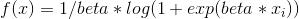

Softplus 函数是ReLU函数的平滑逼近. Softplus 函数可以使得输出值限定为正数.

为了保证数值稳定性. 线性函数的转换可以使输出大于某个值.

参数：

*   `beta` – Softplus 公式中的 beta 值. 默认值: 1
*   `threshold` – 阈值. 当输入到该值以上时我们的SoftPlus实现将还原为线性函数. 默认值: 20


形状：

*   输入： 其中 `*` 代表任意数目的附加维度 dimensions
*   输出：, 和输入的格式shape一致

例:

```py
>>> m = nn.Softplus()
>>> input = autograd.Variable(torch.randn(2))
>>> print(input)
>>> print(m(input))

```

### Softshrink

```py
class torch.nn.Softshrink(lambd=0.5)
```

对输入的每一个元素运用 soft shrinkage 函数

SoftShrinkage 运算符定义为:

```py
f(x) = x-lambda, if x > lambda >  f(x) = x+lambda, if x < -lambda
f(x) = 0, otherwise

```

参数：lambd – Softshrink 公式中的 lambda 值. 默认值: 0.5


形状：

*   输入： 其中 `*` 代表任意数目的附加维度
*   输出：, 和输入的格式 shape 一致

例:

```py
>>> m = nn.Softshrink()
>>> input = autograd.Variable(torch.randn(2))
>>> print(input)
>>> print(m(input))

```

### Softsign

```py
class torch.nn.Softsign
```

对输入的每一个元素运用函数 

形状：

*   输入： 其中 `*` 代表任意数目的附加维度
*   输出：, 和输入的格式 shape 一致

例:

```py
>>> m = nn.Softsign()
>>> input = autograd.Variable(torch.randn(2))
>>> print(input)
>>> print(m(input))

```

### Tanhshrink

```py
class torch.nn.Tanhshrink
```

对输入的每一个元素运用函数, 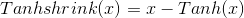

形状：

*   输入： 其中 `*` 代表任意数目的附加维度
*   输出：, 和输入的格式shape一致

例:

```py
>>> m = nn.Tanhshrink()
>>> input = autograd.Variable(torch.randn(2))
>>> print(input)
>>> print(m(input))

```

### Softmin

```py
class torch.nn.Softmin(dim=None)
```

对n维输入张量运用 Softmin 函数, 将张量的每个元素缩放到 (0,1) 区间且和为 1.


形状：

*   输入：任意shape
*   输出：和输入相同

参数：`dim (int)` – 这是将计算 Softmax 的维度 (所以每个沿着 dim 的切片和为 1).

返回值：返回结果是一个与输入维度相同的张量, 每个元素的取值范围在 [0, 1] 区间.


例:

```py
>>> m = nn.Softmin()
>>> input = autograd.Variable(torch.randn(2, 3))
>>> print(input)
>>> print(m(input))

```

### Softmax

```py
class torch.nn.Softmax(dim=None)
```

对n维输入张量运用 Softmax 函数, 将张量的每个元素缩放到 (0,1) 区间且和为 1\. Softmax 函数定义如下 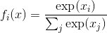

形状：

*   输入：任意shape
*   输出：和输入相同

返回值：返回结果是一个与输入维度相同的张量, 每个元素的取值范围在 [0, 1] 区间.

参数：`dim (int)` – 这是将计算 Softmax 的那个维度 (所以每个沿着 dim 的切片和为 1).


注解：

如果你想对原始 Softmax 数据计算 Log 进行收缩, 并不能使该模块直接使用 NLLLoss 负对数似然损失函数. 取而代之, 应该使用 Logsoftmax (它有更快的运算速度和更好的数值性质).

例:

```py
>>> m = nn.Softmax()
>>> input = autograd.Variable(torch.randn(2, 3))
>>> print(input)
>>> print(m(input))

```

### Softmax2d

```py
class torch.nn.Softmax2d
```

把 SoftMax 应用于每个空间位置的特征.

给定图片的 通道数 Channels x 高 Height x 宽 Width, 它将对图片的每一个位置 使用 Softmax 

形状：

*   输入：
*   输出： (格式 shape 与输入相同)

返回值：一个维度及格式 shape 都和输入相同的 Tensor, 取值范围在[0, 1]


例:

```py
>>> m = nn.Softmax2d()
>>> # you softmax over the 2nd dimension
>>> input = autograd.Variable(torch.randn(2, 3, 12, 13))
>>> print(input)
>>> print(m(input))

```

### LogSoftmax

```py
class torch.nn.LogSoftmax(dim=None)
```

对每个输入的 n 维 Tensor 使用 Log(Softmax(x)). LogSoftmax 公式可简化为


形状：

*   输入：任意格式 shape
*   输出：和输入的格式 shape 一致

参数：`dim (int)` – 这是将计算 Softmax 的那个维度 (所以每个沿着 dim 的切片和为1).

返回值：一个维度及格式 shape 都和输入相同的 Tensor, 取值范围在 [-inf, 0)


例:

```py
>>> m = nn.LogSoftmax()
>>> input = autograd.Variable(torch.randn(2, 3))
>>> print(input)
>>> print(m(input))

```

## Normalization layers (归一化层)

### BatchNorm1d

```py
class torch.nn.BatchNorm1d(num_features, eps=1e-05, momentum=0.1, affine=True)
```

对 2d 或者 3d 的小批量 (mini-batch) 数据进行批标准化 (Batch Normalization) 操作.

![y = \frac{x - mean[x]}{ \sqrt{Var[x] + \epsilon}} * gamma + beta](img/tex-7845c007673a63d2279ae8173ba805f4.gif)

每个小批量数据中,计算各个维度的均值和标准差,并且 gamma 和 beta 是大小为 C 的可学习, 可改变的仿射参数向量( C 为输入大小).

在训练过程中,该层计算均值和方差,并进行平均移动,默认的平均移动动量值为 0.1.

在验证时,训练得到的均值/方差,用于标准化验证数据.

BatchNorm 在 ‘C’ 维上处理,即 ‘(N,L)’ 部分运行,被称作 ‘Temporal BatchNorm’

参数：

*   `num_features` – 预期输入的特征数,大小为 ‘batch_size x num_features [x width]’
*   `eps` – 给分母加上的值,保证数值稳定(分母不能趋近0或取0),默认为 1e-5
*   `momentum` – 动态均值和动态方差使用的移动动量值,默认为 0.1
*   `affine` – 布尔值,设为 True 时,表示该层添加可学习,可改变的仿射参数,即 gamma 和 beta,默认为 True


形状：

*   输入：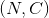 or 
*   输出： or  (same shape as input)

示例：

```py
>>> # With Learnable Parameters
>>> m = nn.BatchNorm1d(100)
>>> # Without Learnable Parameters
>>> m = nn.BatchNorm1d(100, affine=False)
>>> input = autograd.Variable(torch.randn(20, 100))
>>> output = m(input)

```

### BatchNorm2d

```py
class torch.nn.BatchNorm2d(num_features, eps=1e-05, momentum=0.1, affine=True)
```

对小批量 (mini-batch) 3d 数据组成的 4d 输入进行标准化 (Batch Normalization) 操作.

![y = \frac{x - mean[x]}{ \sqrt{Var[x] + \epsilon}} * gamma + beta](img/tex-7845c007673a63d2279ae8173ba805f4.gif)

每个小批量数据中,计算各个维度的均值和标准差, 并且 gamma 和 beta 是大小为 C 的可学习,可改变的仿射参数向量 (C 为输入大小).

在训练过程中,该层计算均值和方差,并进行平均移动.默认的平均移动动量值为 0.1.

在验证时,训练得到的均值/方差,用于标准化验证数据.

BatchNorm 在 ‘C’ 维上处理,即 ‘(N, H, W)’ 部分运行,被称作 ‘Spatial BatchNorm’.

参数：

*   `num_features` – 预期输入的特征数,大小为 ‘batch_size x num_features x height x width’
*   `eps` – 给分母加上的值,保证数值稳定(分母不能趋近0或取0),默认为 1e-5
*   `momentum` – 动态均值和动态方差使用的移动动量值,默认为 0.1
*   `affine` – 布尔值,设为 True 时,表示该层添加可学习,可改变的仿射参数,即 gamma 和 beta,默认为 True


形状：

*   输入：
*   输出： (same shape as input)

示例：

```py
>>> # With Learnable Parameters
>>> m = nn.BatchNorm2d(100)
>>> # Without Learnable Parameters
>>> m = nn.BatchNorm2d(100, affine=False)
>>> input = autograd.Variable(torch.randn(20, 100, 35, 45))
>>> output = m(input)

```

### BatchNorm3d

```py
class torch.nn.BatchNorm3d(num_features, eps=1e-05, momentum=0.1, affine=True)
```

对小批量 (mini-batch) 4d 数据组成的 5d 输入进行标准化 (Batch Normalization) 操作.

![y = \frac{x - mean[x]}{ \sqrt{Var[x] + \epsilon}} * gamma + beta](img/tex-7845c007673a63d2279ae8173ba805f4.gif)

每个小批量数据中,计算各个维度的均值和标准差, 并且 gamma 和 beta 是大小为 C 的可学习,可改变的仿射参数向量 (C 为输入大小).

在训练过程中,该层计算均值和方差,并进行平均移动.默认的平均移动动量值为 0.1.

在验证时,训练得到的均值/方差,用于标准化验证数据.

BatchNorm 在 ‘C’ 维上处理,即 ‘(N, D, H, W)’ 部分运行,被称作 ‘Volumetric BatchNorm’ 或者 ‘Spatio-temporal BatchNorm’

参数：

*   `num_features` – 预期输入的特征数,大小为 ‘batch_size x num_features x depth x height x width’
*   `eps` – 给分母加上的值,保证数值稳定(分母不能趋近0或取0),默认为 1e-5
*   `momentum` – 动态均值和动态方差使用的移动动量值,默认为 0.1
*   `affine` – 布尔值,设为 True 时,表示该层添加可学习,可改变的仿射参数,即 gamma 和 beta,默认为 True


形状：

*   输入：
*   输出： (same shape as input)

示例：

```py
>>> # With Learnable Parameters
>>> m = nn.BatchNorm3d(100)
>>> # Without Learnable Parameters
>>> m = nn.BatchNorm3d(100, affine=False)
>>> input = autograd.Variable(torch.randn(20, 100, 35, 45, 10))
>>> output = m(input)

```

### InstanceNorm1d

```py
class torch.nn.InstanceNorm1d(num_features, eps=1e-05, momentum=0.1, affine=False)
```

对 2d 或者 3d 的小批量 (mini-batch) 数据进行实例标准化 (Instance Normalization) 操作. .. math:

```py
y = \frac{x - mean[x]}{ \sqrt{Var[x]} + \epsilon} * gamma + beta

```

对小批量数据中的每一个对象,计算其各个维度的均值和标准差,并且 gamma 和 beta 是大小为 C 的可学习, 可改变的仿射参数向量( C 为输入大小).

在训练过程中,该层计算均值和方差,并进行平均移动,默认的平均移动动量值为 0.1.

在验证时 (`.eval()`),InstanceNorm 模型默认保持不变,即求得的均值/方差不用于标准化验证数据, 但可以用 `.train(False)` 方法强制使用存储的均值和方差.

参数：

*   `num_features` – 预期输入的特征数,大小为 ‘batch_size x num_features x width’
*   `eps` – 给分母加上的值,保证数值稳定(分母不能趋近0或取0),默认为 1e-5
*   `momentum` – 动态均值和动态方差使用的移动动量值,默认为 0.1
*   `affine` – 布尔值,设为 `True` 时,表示该层添加可学习,可改变的仿射参数,即 gamma 和 beta,默认为 `False`


形状：

*   输入：
*   输出： (same shape as input)

示例：

```py
>>> # Without Learnable Parameters
>>> m = nn.InstanceNorm1d(100)
>>> # With Learnable Parameters
>>> m = nn.InstanceNorm1d(100, affine=True)
>>> input = autograd.Variable(torch.randn(20, 100, 40))
>>> output = m(input)

```

### InstanceNorm2d

```py
class torch.nn.InstanceNorm2d(num_features, eps=1e-05, momentum=0.1, affine=False)
```

对小批量 (mini-batch) 3d 数据组成的 4d 输入进行实例标准化 (Batch Normalization) 操作. .. math:

```py
y = \frac{x - mean[x]}{ \sqrt{Var[x]} + \epsilon} * gamma + beta

```

对小批量数据中的每一个对象,计算其各个维度的均值和标准差,并且 gamma 和 beta 是大小为 C 的可学习, 可改变的仿射参数向量( C 为输入大小).

在训练过程中,该层计算均值和方差,并进行平均移动,默认的平均移动动量值为 0.1.

在验证时 (`.eval()`),InstanceNorm 模型默认保持不变,即求得的均值/方差不用于标准化验证数据, 但可以用 `.train(False)` 方法强制使用存储的均值和方差.

参数：

*   `num_features` – 预期输入的特征数,大小为 ‘batch_size x num_features x height x width’
*   `eps` – 给分母加上的值,保证数值稳定(分母不能趋近0或取0),默认为 1e-5
*   `momentum` – 动态均值和动态方差使用的移动动量值,默认为 0.1
*   `affine` – 布尔值,设为 `True` 时,表示该层添加可学习,可改变的仿射参数,即 gamma 和 beta,默认为 `False`


形状：

*   输入：
*   输出： (same shape as input)

示例：

```py
>>> # Without Learnable Parameters
>>> m = nn.InstanceNorm2d(100)
>>> # With Learnable Parameters
>>> m = nn.InstanceNorm2d(100, affine=True)
>>> input = autograd.Variable(torch.randn(20, 100, 35, 45))
>>> output = m(input)

```

### InstanceNorm3d

```py
class torch.nn.InstanceNorm3d(num_features, eps=1e-05, momentum=0.1, affine=False)
```

对小批量 (mini-batch) 4d 数据组成的 5d 输入进行实例标准化 (Batch Normalization) 操作. .. math:

```py
y = \frac{x - mean[x]}{ \sqrt{Var[x]} + \epsilon} * gamma + beta

```

对小批量数据中的每一个对象,计算其各个维度的均值和标准差,并且 gamma 和 beta 是大小为 C 的可学习, 可改变的仿射参数向量( C 为输入大小).

在训练过程中,该层计算均值和方差,并进行平均移动,默认的平均移动动量值为 0.1.

在验证时 (`.eval()`),InstanceNorm 模型默认保持不变,即求得的均值/方差不用于标准化验证数据, 但可以用 `.train(False)` 方法强制使用存储的均值和方差.

参数：

*   `num_features` – 预期输入的特征数,大小为 ‘batch_size x num_features x depth x height x width’
*   `eps` – 给分母加上的值,保证数值稳定(分母不能趋近0或取0),默认为 1e-5
*   `momentum` – 动态均值和动态方差使用的移动动量值,默认为 0.1
*   `affine` – 布尔值,设为 `True` 时,表示该层添加可学习,可改变的仿射参数,即 gamma 和 beta,默认为 `False`


形状：

*   输入：
*   输出： (same shape as input)

示例：

```py
>>> # Without Learnable Parameters
>>> m = nn.InstanceNorm3d(100)
>>> # With Learnable Parameters
>>> m = nn.InstanceNorm3d(100, affine=True)
>>> input = autograd.Variable(torch.randn(20, 100, 35, 45, 10))
>>> output = m(input)

```

## Recurrent layers (循环层)

### RNN

```py
class torch.nn.RNN(*args, **kwargs)
```

对于输入序列使用一个多层的 `Elman RNN`, 它的激活函数为 `tanh` 或者 `ReLU` .

对输入序列中每个元素, 每层计算公式为:


这里 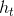 是当前在时刻 `t` 的隐状态, 并且 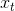 是之前一层在 `t` 时刻的隐状态, 或者是第一层的输入. 如果 `nonlinearity='relu'` ,那么将使用 relu 代替 tanh 作为激活函数.

参数：

*   `input_size` – 输入 x 的特征数量
*   `hidden_size` – 隐状态 `h` 中的特征数量
*   `num_layers` – RNN 的层数
*   `nonlinearity` – 指定非线性函数使用 [‘tanh’&#124;’relu’]. 默认: ‘tanh’
*   `bias` – 如果是 `False` , 那么 RNN 层就不会使用偏置权重 b_ih 和 b_hh, 默认: `True`
*   `batch_first` – 如果 `True`, 那么输入 `Tensor` 的 shape 应该是 (batch, seq, feature),并且输出也是一样
*   `dropout` – 如果值非零, 那么除了最后一层外, 其它层的输出都会套上一个 `dropout` 层
*   `bidirectional` – 如果 `True` , 将会变成一个双向 RNN, 默认为 `False`


Inputs: input, h_0

*   `input (seq_len, batch, input_size)`: 包含输入序列特征的 `tensor` , `input` 可以是被填充的变长序列.细节请看 `torch.nn.utils.rnn.pack_padded_sequence()` .
*   `h_0 (num_layers * num_directions, batch, hidden_size)`: 包含 `batch` 中每个元素保存着初始隐状态的 `tensor`

Outputs: output, h_n

*   `output (seq_len, batch, hidden_size * num_directions)`: 包含 RNN 最后一层输出特征 (h_k) 的 `tensor` 对于每个 k ,如果输入是一个 `torch.nn.utils.rnn.PackedSequence` , 那么输出也是一个可以是被填充的变长序列.
*   `h_n (num_layers * num_directions, batch, hidden_size)`: 包含 k= seq_len 隐状态的 `tensor`.

变量：

*   weight_ih_l[k] – 第 k 层的 input-hidden 权重,可学习, shape 是 `(input_size x hidden_size)`
*   weight_hh_l[k] – 第 k 层的 hidden-hidden 权重, 可学习, shape 是 `(hidden_size x hidden_size)`
*   bias_ih_l[k] – 第 k 层的 input-hidden 偏置, 可学习, shape 是 `(hidden_size)`
*   bias_hh_l[k] – 第 k 层的 hidden-hidden 偏置, 可学习, shape 是 `(hidden_size)`


Examples:

```py
>>> rnn = nn.RNN(10, 20, 2)
>>> input = Variable(torch.randn(5, 3, 10))
>>> h0 = Variable(torch.randn(2, 3, 20))
>>> output, hn = rnn(input, h0)

```

### LSTM

```py
class torch.nn.LSTM(*args, **kwargs)
```

对于输入序列使用一个多层的 `LSTM` ( long short-term memory ).

对输入序列的每个元素, `LSTM` 的每层都会执行以下计算:


这里  是在时刻 `t` 的隐状态, 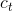 是在时刻 `t` 的细胞状态 (cell state),  是上一层的在时刻 `t` 的隐状态或者是第一层的  , 而 , , 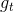, 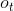 分别代表 输入门,遗忘门,细胞和输出门.

参数：

*   `input_size` – 输入的特征维度
*   `hidden_size` – 隐状态的特征维度
*   `num_layers` – 层数(和时序展开要区分开)
*   `bias` – 如果为 `False` ,那么 LSTM 将不会使用 b_ih 和 b_hh ,默认: `True`
*   `batch_first` – 如果为 `True` , 那么输入和输出 Tensor 的形状为 (batch, seq, feature)
*   `dropout` – 如果非零的话, 将会在 RNN 的输出上加个 dropout , 最后一层除外
*   `bidirectional` – 如果为 `True`,将会变成一个双向 RNN ,默认为 `False`


Inputs: input, (h_0, c_0)

*   `input (seq_len, batch, input_size)`: 包含输入序列特征的 `tensor` . 也可以是 `packed variable length sequence`, 详见 `torch.nn.utils.rnn.pack_padded_sequence()` .
*   `h_0 (num_layers * num_directions, batch, hidden_size)`: 包含 batch 中每个元素的初始化隐状态的 `tensor` .
*   `c_0 (num_layers * num_directions, batch, hidden_size)`: 包含 batch 中每个元素的初始化细胞状态的 `tensor` .

Outputs: output, (h_n, c_n)

*   `output (seq_len, batch, hidden_size * num_directions)`: 包含 RNN 最后一层的输出特征 `(h_t)` 的 `tensor` , 对于每个 t . 如果输入是 `torch.nn.utils.rnn.PackedSequence` 那么输出也是一个可以是被填充的变长序列.
*   `h_n (num_layers * num_directions, batch, hidden_size)`: 包含 t=seq_len 隐状态的 `tensor`.
*   `c_n (num_layers * num_directions, batch, hidden_size)`: 包含 t=seq_len 细胞状态的 `tensor`.

变量：

*   weight_ih_l[k] – 第 k 层可学习的 input-hidden 权重 `(W_ii&#124;W_if&#124;W_ig&#124;W_io)`, shape 是 `(4*hidden_size x input_size)`
*   weight_hh_l[k] – 第 k 层可学习的 hidden-hidden 权重 `(W_hi&#124;W_hf&#124;W_hg&#124;W_ho)`, shape 是 `(4*hidden_size x hidden_size)`
*   bias_ih_l[k] – 第 k 层可学习的 input-hidden 偏置 `(b_ii&#124;b_if&#124;b_ig&#124;b_io)`, shape 是 `(4*hidden_size)`
*   bias_hh_l[k] – 第 k 层可学习的 hidden-hidden 偏置 `(b_hi&#124;b_hf&#124;b_hg&#124;b_ho)`, shape 是 `(4*hidden_size)`


Examples:

```py
>>> rnn = nn.LSTM(10, 20, 2)
>>> input = Variable(torch.randn(5, 3, 10))
>>> h0 = Variable(torch.randn(2, 3, 20))
>>> c0 = Variable(torch.randn(2, 3, 20))
>>> output, hn = rnn(input, (h0, c0))

```

### GRU

```py
class torch.nn.GRU(*args, **kwargs)
```

对于输入序列使用一个多层的 `GRU` (gated recurrent unit).

对输入序列的每个元素, 每层都会执行以下计算:


这里  是在时刻 `t` 的隐状态,  是前一层在时刻 `t` 的隐状态或者是第一层的  , 而 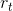, 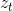,  分别是重置门,输入门和新门.

参数：

*   `input_size` – 输入的特征维度
*   `hidden_size` – 隐状态的特征维度
*   `num_layers` – RNN 的层数
*   `bias` – 如果为 `False`, 那么 RNN 层将不会使用偏置权重 b_ih 和 b_hh 默认: `True`
*   `batch_first` – 如果为 `True`, 那么输入和输出的 `tensor` 的形状是 (batch, seq, feature)
*   `dropout` – 如果非零的话,将会在 RNN 的输出上加个 dropout ,最后一层除外
*   `bidirectional` – 如果为 `True`, 将会变成一个双向 RNN . 默认: `False`


Inputs: input, h_0

*   `input (seq_len, batch, input_size)`: 包含输入序列特征的 `tensor` . 也可以是 `packed variable length sequence`, 详见 `torch.nn.utils.rnn.pack_padded_sequence()` .
*   `h_0 (num_layers * num_directions, batch, hidden_size)`: 包含 batch 中每个元素的初始化隐状态的 `tensor`

Outputs: output, h_n

*   `output (seq_len, batch, hidden_size * num_directions)`: 包含 RNN 最后一层的输出特征 `(h_t)` 的 `tensor` , 对于每个 t . 如果输入是 `torch.nn.utils.rnn.PackedSequence` 那么输出也是一个可以是被填充的变长序列.
*   `h_n (num_layers * num_directions, batch, hidden_size)`: 包含 t=seq_len 隐状态的 `tensor`.

变量：

*   weight_ih_l[k] – 第 k 层可学习的 input-hidden 权重 (W_ir&#124;W_iz&#124;W_in), shape 为 `(3*hidden_size x input_size)`
*   weight_hh_l[k] – 第 k 层可学习的 hidden-hidden 权重 (W_hr&#124;W_hz&#124;W_hn), shape 为 `(3*hidden_size x hidden_size)`
*   bias_ih_l[k] – 第 k 层可学习的 input-hidden 偏置 (b_ir&#124;b_iz&#124;b_in), shape 为 `(3*hidden_size)`
*   bias_hh_l[k] – 第 k 层可学习的 hidden-hidden 偏置 (b_hr&#124;b_hz&#124;b_hn), shape 为 `(3*hidden_size)`


Examples:

```py
>>> rnn = nn.GRU(10, 20, 2)
>>> input = Variable(torch.randn(5, 3, 10))
>>> h0 = Variable(torch.randn(2, 3, 20))
>>> output, hn = rnn(input, h0)

```

### RNNCell

```py
class torch.nn.RNNCell(input_size, hidden_size, bias=True, nonlinearity='tanh')
```

一个 `Elan RNN cell` , 激活函数是 tanh 或 ReLU , 用于输入序列.

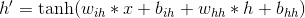

如果 nonlinearity=’relu’, 那么将会使用 ReLU 来代替 tanh .

参数：

*   `input_size` – 输入的特征维度
*   `hidden_size` – 隐状态的特征维度
*   `bias` – 如果为 `False`, 那么RNN层将不会使用偏置权重 b_ih 和 b_hh. 默认: `True`
*   `nonlinearity` – 用于选择非线性激活函数 [‘tanh’&#124;’relu’]. 默认: ‘tanh’


Inputs: input, hidden

*   `input (batch, input_size)`: 包含输入特征的 `tensor` .
*   `hidden (batch, hidden_size)`: 包含 batch 中每个元素的初始化隐状态的 `tensor`.

Outputs: h’

*   h’ (batch, hidden_size): 保存着 batch 中每个元素的下一层隐状态的 `tensor` .

变量：

*   `weight_ih` – `input-hidden` 权重, 可学习, shape 为 `(input_size x hidden_size)`
*   `weight_hh` – `hidden-hidden` 权重, 可学习, shape 为 `(hidden_size x hidden_size)`
*   `bias_ih` – `input-hidden` 偏置,可学习, shape 为 `(hidden_size)`
*   `bias_hh` – `hidden-hidden` 偏置,可学习, shape 为 `(hidden_size)`


Examples:

```py
>>> rnn = nn.RNNCell(10, 20)
>>> input = Variable(torch.randn(6, 3, 10))
>>> hx = Variable(torch.randn(3, 20))
>>> output = []
>>> for i in range(6):
...     hx = rnn(input[i], hx)
...     output.append(hx)

```

### LSTMCell

```py
class torch.nn.LSTMCell(input_size, hidden_size, bias=True)
```

LSTM 细胞.


参数：

*   `input_size` – 输入的特征维度
*   `hidden_size` – 隐状态的维度
*   `bias` – 如果为 `False`, 那么RNN层将不会使用偏置权重 b_ih 和 b_hh 默认: `True`


Inputs: input, (h_0, c_0)

*   `input (batch, input_size)`: 包含输入特征的 `tensor` .
*   `h_0 (batch, hidden_size)`: 包含 batch 中每个元素的初始化隐状态的 `tensor`.
*   `c_0 (batch. hidden_size)`: 包含 batch 中每个元素的初始化细胞状态的 `tensor`

Outputs: h_1, c_1

*   `h_1 (batch, hidden_size)`: 保存着 batch 中每个元素的下一层隐状态的 `tensor`
*   `c_1 (batch, hidden_size)`: 保存着 batch 中每个元素的下一细胞状态的 `tensor`

变量：

*   `weight_ih` – `input-hidden` 权重, 可学习, 形状为 `(4*hidden_size x input_size)`
*   `weight_hh` – `hidden-hidden` 权重, 可学习, 形状为 `(4*hidden_size x hidden_size)`
*   `bias_ih` – `input-hidden` 偏置, 可学习, 形状为 `(4*hidden_size)`
*   `bias_hh` – `hidden-hidden` 偏置, 可学习, 形状为 `(4*hidden_size)`


Examples:

```py
>>> rnn = nn.LSTMCell(10, 20)
>>> input = Variable(torch.randn(6, 3, 10))
>>> hx = Variable(torch.randn(3, 20))
>>> cx = Variable(torch.randn(3, 20))
>>> output = []
>>> for i in range(6):
...     hx, cx = rnn(input[i], (hx, cx))
...     output.append(hx)

```

### GRUCell

```py
class torch.nn.GRUCell(input_size, hidden_size, bias=True)
```

GRU 细胞


参数：

*   `input_size` – 输入的特征维度
*   `hidden_size` – 隐状态的维度
*   `bias` – 如果为 `False`, 那么RNN层将不会使用偏置权重 b_ih 和 b_hh 默认: `True`


Inputs: input, hidden

*   `input (batch, input_size)`: 包含输入特征的 `tensor` .
*   `hidden (batch, hidden_size)`: 包含 batch 中每个元素的初始化隐状态的 `tensor`.

Outputs: h’

*   h’: (batch, hidden_size): 保存着 batch 中每个元素的下一层隐状态的 `tensor`

变量：

*   `weight_ih` – `input-hidden` 权重, 可学习, shape 为, `(3*hidden_size x input_size)`
*   `weight_hh` – `hidden-hidden` 权重, 可学习, shape 为 `(3*hidden_size x hidden_size)`
*   `bias_ih` – `input-hidden` 偏置, 可学习, shape 为 `(3*hidden_size)`
*   `bias_hh` – `hidden-hidden` 偏置, 可学习, shape 为 `(3*hidden_size)`


Examples:

```py
>>> rnn = nn.GRUCell(10, 20)
>>> input = Variable(torch.randn(6, 3, 10))
>>> hx = Variable(torch.randn(3, 20))
>>> output = []
>>> for i in range(6):
...     hx = rnn(input[i], hx)
...     output.append(hx)

```

## Linear layers (线性层)

### Linear

```py
class torch.nn.Linear(in_features, out_features, bias=True)
```

对输入数据进行线性变换: 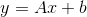

参数：

*   `in_features` – 每个输入样本的大小
*   `out_features` – 每个输出样本的大小
*   `bias` – 若设置为 False, 这层不会学习偏置. 默认值: True


形状：

*   输入：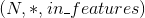 这里 `*` 意味着可以添加任意数量的其他维度
*   输出：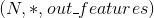 除了最后一个维度外, 其余的都与输入相同

变量：

*   `weight` – 形状为 (out_features x in_features) 的模块中可学习的权值
*   `bias` – 形状为 (out_features) 的模块中可学习的偏置


Examples:

```py
>>> m = nn.Linear(20, 30)
>>> input = autograd.Variable(torch.randn(128, 20))
>>> output = m(input)
>>> print(output.size())

```

### Bilinear

```py
class torch.nn.Bilinear(in1_features, in2_features, out_features, bias=True)
```

对输入数据进行双线性变换: 

参数：

*   `in1_features` – 输入一的每个输入样本的大小
*   `in2_features` – 输入二的每个输入样本的大小
*   `out_features` – 每个输出样本的大小
*   `bias` – 若设置为False, 这层不会学习偏置. 默认值: True


形状：

*   输入：, 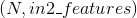
*   输出：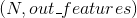

变量：

*   `weight` – 形状为 (out_features x in1_features x in2_features) 的模块中可学习的权值
*   `bias` – 形状为 (out_features) 的模块中可学习的偏置


Examples:

```py
>>> m = nn.Bilinear(20, 30, 40)
>>> input1 = autograd.Variable(torch.randn(128, 20))
>>> input2 = autograd.Variable(torch.randn(128, 30))
>>> output = m(input1, input2)
>>> print(output.size())

```

## Dropout layers

### Dropout

```py
class torch.nn.Dropout(p=0.5, inplace=False)
```

Dropout 在训练期间, 按照伯努利概率分布, 以概率 p 随机地将输入张量中的部分元素

置为 0, 在每次调用时, 被置为 0 的元素是随机的.

Dropout 已被证明是正则化的一个行之有效的技术, 并且在防止神经元之间互适应问题上 也卓有成效.(神经元互适应问题详见论文 [Improving neural networks by preventing co-adaptation of feature detectors](https://arxiv.org/abs/1207.0580))

并且, Dropout 的输出均与 _1/(1-p)_ 的比例系数进行了相乘, 保证了求值时函数是归一化的.

Args: p: 元素被置为0的概率, 默认值: 0.5 inplace: 如果为 True, 置0操作将直接发生在传入的元素上.默认值: false Shape:

*   输入：any.输入数据可以是任何大小
*   输出：Same.输出数据大小与输入相同

Examples:

```py
>>> m = nn.Dropout(p=0.2)

```

```py
>>> input = autograd.Variable(torch.randn(20, 16))
>>> output = m(input)

```

### Dropout2d

```py
class torch.nn.Dropout2d(p=0.5, inplace=False)
```

Dropout2d 将输入张量的所有通道随机地置为 0.被置为 0 的通道在每次调用时是随机的.

> 通常输入数据来自 Conv2d 模块.
> 
> 在论文 [Efficient Object Localization Using Convolutional Networks](http://arxiv.org/abs/1411.4280) 中有如下 描述: 如果特征映射中的邻接像素是强相关的(在早期的卷积层中很常见）, 那么独立同分布 的 dropout 将不会正则化激活函数, 相反其会导致有效的学习率的下降.
> 
> 在这样的情况下, 应该使用函数函数 nn.Dropout2d , 它能够提升特征映射之间的独立性.
> 
> Args: p (float,optional): 元素被置0的概率 inplace(bool, 可选）: 如果被设为’True’, 置0操作将直接作用在输入元素上 Shape:
> 
> *   输入：math:(N, C, H, W)
> *   输出：math:(N, C, H, W) (与输入相同）
> 
> Examples:
> 
> ```py
> &gt;&gt;&gt; m = nn.Dropout2d(p=0.2)
> 
> ```
> 
> ```py
> &gt;&gt;&gt; input = autograd.Variable(torch.randn(20, 16, 32, 32))
> &gt;&gt;&gt; output = m(input)
> 
> ```

### Dropout3d

```py
class torch.nn.Dropout3d(p=0.5, inplace=False)
```

Dropout3d 将输入张量的所有通道随机地置为 0.被置为 0 的通道在每次调用时是随机的.

> 通常输入数据来自 Conv3d 模块.
> 
> 在论文 [Efficient Object Localization Using Convolutional Networks](http://arxiv.org/abs/1411.4280) 中有如下 描述: 如果特征映射中的邻接像素是强相关的(在早期的卷积层中很常见）, 那么独立同分布 的 dropout 将不会正则化激活函数, 相反其会导致有效的学习率的下降.
> 
> 在这样的情况下, 应该使用函数函数 nn.Dropout3d , 它能够促进特征映射之间的独立性.
> 
> Args: p (float,optional): 元素被置0的概率 inplace(bool, 可选）: 如果被设为 True , 置0操作将直接作用在输入元素上 Shape:
> 
> *   输入：math:(N, C, H, W)
> *   输出：math:(N, C, H, W) (与输入相同）
> 
> Examples:
> 
> ```py
> &gt;&gt;&gt; m = nn.Dropout3d(p=0.2)
> 
> ```
> 
> ```py
> &gt;&gt;&gt; input = autograd.Variable(torch.randn(20, 16, 4, 32, 32))
> &gt;&gt;&gt; output = m(input)
> 
> ```

### AlphaDropout

```py
class torch.nn.AlphaDropout(p=0.5)
```

在输入上应用 Alpha Dropout.

> Alpha Dropout 是一种维持自正交性质的 Dropout . 对于一个均值为 0 和标准差为 1 的输入 来说, Alpha Dropout 能保持原始数据的均值和标准差.Alpha Dropout 和 SELU 激活函数 携手同行, 后者也保证了输出拥有与输入相同的均值和标准差.
> 
> Alpha Dropout 在训练期间, 按照伯努利概率分布, 以概率 p 随机地将输入张量中的部分元素 置进行掩盖, 在每次调用中, 被掩盖的元素是随机的, 并且对输出会进行缩放、变换等操作 以保持均值为 0、标准差为 1.
> 
> 在求值期间, 模块简单的计算一个归一化的函数.
> 
> 更多信息请参考论文: Self-Normalizing Neural Networks
> 
> Args: p(float）: 元素被掩盖的概率, 默认值: 0.5 Shape:
> 
> *   输入：any.输入数据可以是任何大小
> *   输出：Same.输出数据大小与输入相同
> 
> Examples:
> 
> ```py
> &gt;&gt;&gt; m = nn.AlphaDropout(p=0.2)
> 
> ```
> 
> ```py
> &gt;&gt;&gt; input = autograd.Variable(torch.randn(20, 16))
> &gt;&gt;&gt; output = m(input)
> 
> ```

## Sparse layers (稀疏层)

### Embedding

```py
class torch.nn.Embedding(num_embeddings, embedding_dim, padding_idx=None, max_norm=None, norm_type=2, scale_grad_by_freq=False, sparse=False)
```

一个简单的查找表, 存储了固定字典和大小的 embedding.

这个模块经常用来存储 word embeddings, 并通过索引来检索, 模块的输入是索引构成的列表, 输出是对应的 word embeddings.

参数：

*   `num_embeddings (int)` – embeddings 字典的大小
*   `embedding_dim (int)` – 每个 embedding 向量的大小
*   `padding_idx (int, 可选)` – 如果给出, 在索引处, 输出补零
*   `max_norm (float, 可选)` – 如果给出, 重新归一化 embeddings, 使其范数小于该值
*   `norm_type (float, 可选)` – 为 max_norm 选项计算 p 范数时 P
*   `scale_grad_by_freq (boolean, 可选)` – 如果给出, 会根据 words 在 mini-batch 中的频率缩放梯度
*   `sparse (boolean, 可选)` – 如果为 `True`, 关于权重矩阵的梯度是一个稀疏张量, 详情请参考稀疏梯度


| Variables: | **weight** (Tensor) – shape 为 (num_embeddings, embedding_dim) 的模块的可学习权重 |
| --- | --- |

形状：

*   输入：LongTensor `(N, W)`, N = mini-batch, W = 每个 mini-batch 中用来提取的索引数
*   输出：`(N, W, embedding_dim)`

注解：

请注意, 只支持有限数量的优化器. 稀疏梯度: 当前是 (`cuda` 和 `cpu`) 版本的 `optim.SGD`, 和 (`cpu`) 版本的 `optim.Adagrad`.

Examples:

```py
>>> # an Embedding module containing 10 tensors of size 3
>>> embedding = nn.Embedding(10, 3)
>>> # a batch of 2 samples of 4 indices each
>>> input = Variable(torch.LongTensor([[1,2,4,5],[4,3,2,9]]))
>>> embedding(input)

Variable containing:
(0 ,.,.) =
 -1.0822  1.2522  0.2434
 0.8393 -0.6062 -0.3348
 0.6597  0.0350  0.0837
 0.5521  0.9447  0.0498

(1 ,.,.) =
 0.6597  0.0350  0.0837
 -0.1527  0.0877  0.4260
 0.8393 -0.6062 -0.3348
 -0.8738 -0.9054  0.4281
[torch.FloatTensor of size 2x4x3]

>>> # example with padding_idx
>>> embedding = nn.Embedding(10, 3, padding_idx=0)
>>> input = Variable(torch.LongTensor([[0,2,0,5]]))
>>> embedding(input)

Variable containing:
(0 ,.,.) =
 0.0000  0.0000  0.0000
 0.3452  0.4937 -0.9361
 0.0000  0.0000  0.0000
 0.0706 -2.1962 -0.6276
[torch.FloatTensor of size 1x4x3]

```

### EmbeddingBag

```py
class torch.nn.EmbeddingBag(num_embeddings, embedding_dim, max_norm=None, norm_type=2, scale_grad_by_freq=False, mode='mean')
```

计算一 个’bags’ 里的 embedding s的均值或和, 不用实例化中间的 embeddings

对于固定长度的 bags

*   nn.EmbeddingBag 和 `mode=sum` 相当于 nn.Embedding 与之后的 `torch.sum(dim=1)`
*   其与 `mode=mean` 相当于 nn.Embedding 与之后的 `torch.mean(dim=1)`

然而, 比起一连串这样的操作, nn.EmbeddingBag 在时间和内存上更加高效.

参数：

*   `num_embeddings (int)` – embeddings 字典的大小
*   `embedding_dim (int)` – 每个 embedding 向量的大小
*   `max_norm (float, 可选)` – 如果给出, 重新归一化 embeddings, 使其范数小于该值
*   `norm_type (float, 可选)` – 为 max_norm 选项计算 p 范数时的 P
*   `scale_grad_by_freq (boolean, 可选)` – 如果给出, 会根据 words 在 mini-batch 中的频率缩放梯度
*   `mode (string, 可选)` – ‘sum’ &#124; ‘mean’. 指定减少 bag 的方式. 默认: ‘mean’


| Variables: | **weight** (Tensor) – shape 为 (num_embeddings, embedding_dim) 的模块的可学习权重 |
| --- | --- |

Inputs: input, offsets

*   `input (N or BxN)`: LongTensor, 包括要提取的 embeddings 的索引, 当 `input` 是形状为 `N` 的 1D 张量时, 一个给出的 `offsets` 张量中包括: mini-batch 中每个新序列的起始位置
*   `offsets (B or None)`: LongTensor, 包括一个 mini-batch 的可变长度序列中的每个新样本的起始位置 如果 `input` 是 2D (BxN) 的, offset 就不用再给出; 如果 `input` 是一个 mini-batch 的固定长度的序列, 每个序列的长度为 `N`

形状：

*   输入：LongTensor `N`, N = 要提取的 embeddings 的数量,

> 或者是 LongTensor `BxN`, B = mini-batch 中序列的数量, N = 每个序列中 embeddings 的数量

*   Offsets: LongTensor `B`, B = bags 的数量, 值为每个 bag 中 `input` 的 offset, i.e. 是长度的累加. Offsets 不会给出, 如果 Input是 2D 的`BxN` 张量, 输入被认为是固定长度的序列
*   输出：`(B, embedding_dim)`

Examples:

```py
>>> # an Embedding module containing 10 tensors of size 3
>>> embedding_sum = nn.EmbeddingBag(10, 3, mode='sum')
>>> # a batch of 2 samples of 4 indices each
>>> input = Variable(torch.LongTensor([1,2,4,5,4,3,2,9]))
>>> offsets = Variable(torch.LongTensor([0,4]))
>>> embedding_sum(input, offsets)

Variable containing:
-0.7296 -4.6926  0.3295
-0.5186 -0.5631 -0.2792
[torch.FloatTensor of size 2x3]

```

## Distance functions (距离函数)

### CosineSimilarity

```py
class torch.nn.CosineSimilarity(dim=1, eps=1e-08)
```

返回沿着 dim 方向计算的 x1 与 x2 之间的余弦相似度.

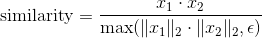

参数：

*   `dim (int, 可选)` – 计算余弦相似度的维度. Default: 1
*   `eps (float, 可选)` – 小的值以避免被零除. Default: 1e-8


形状：

*   Input1: , 其中的 D 表示 `dim` 的位置
*   Input2: , 与 Input1 一样的 shape
*   输出：

Examples:

```py
>>> input1 = autograd.Variable(torch.randn(100, 128))
>>> input2 = autograd.Variable(torch.randn(100, 128))
>>> cos = nn.CosineSimilarity(dim=1, eps=1e-6)
>>> output = cos(input1, input2)
>>> print(output)

```

### PairwiseDistance

```py
class torch.nn.PairwiseDistance(p=2, eps=1e-06)
```

计算向量 v1, v2 之间的 batchwise pairwise distance(分批成对距离):


参数：

*   `p (_real_)` – norm degree(规范程度). Default: 2
*   `eps (float, 可选)` – 小的值以避免被零除. Default: 1e-6


形状：

*   Input1: , 其中的 `D = vector dimension(向量维度)`
*   Input2: , 与 Input1 的 shape 一样
*   输出：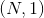

Examples:

```py
>>> pdist = nn.PairwiseDistance(p=2)
>>> input1 = autograd.Variable(torch.randn(100, 128))
>>> input2 = autograd.Variable(torch.randn(100, 128))
>>> output = pdist(input1, input2)

```

## Loss functions (损失函数)

### L1Loss

```py
class torch.nn.L1Loss(size_average=True, reduce=True)
```

创建一个衡量输入 `x` 与目标 `y` 之间差的绝对值的平均值的标准, 该 函数会逐元素地求出 `x` 和 `y` 之间差的绝对值, 最后返回绝对值的平均值.


`x` 和 `y` 可以是任意维度的数组, 但需要有相同数量的n个元素.

求和操作会对n个元素求和, 最后除以 `n` .

在构造函数的参数中传入 `size_average=False`, 最后求出来的绝对值将不会除以 `n`.

参数：

*   `size_average (bool, 可选)` – 默认情况下, loss 会在每个 mini-batch(小批量） 上取平均值. 如果字段 size_average 被设置为 `False`, loss 将会在每个 mini-batch(小批量） 上累加, 而不会取平均值. 当 reduce 的值为 `False` 时该字段会被忽略. 默认值: `True`
*   `reduce (bool, 可选)` – 默认情况下, loss 会在每个 mini-batch(小批量）上求平均值或者 求和. 当 reduce 是 `False` 时, 损失函数会对每个 batch 元素都返回一个 loss 并忽 略 size_average 字段. 默认值: `True`


形状：

*   输入: , `*` 表示任意数量的额外维度
*   目标: , 和输入的shape相同
*   输出: 标量. 如果 reduce 是 `False` , 则输出为 , shape与输出相同

Examples:

```py
>>> loss = nn.L1Loss()
>>> input = autograd.Variable(torch.randn(3, 5), requires_grad=True)
>>> target = autograd.Variable(torch.randn(3, 5))
>>> output = loss(input, target)
>>> output.backward()

```

### MSELoss

```py
class torch.nn.MSELoss(size_average=True, reduce=True)
```

输入 `x` 和 目标 `y` 之间的均方差


`x` 和 `y` 可以是任意维度的数组, 但需要有相同数量的n个元素.

求和操作会对n个元素求和, 最后除以 `n`.

在构造函数的参数中传入 `size_average=False` , 最后求出来的绝对值将不会除以 `n`.

要得到每个 batch 中每个元素的 loss, 设置 `reduce` 为 `False`. 返回的 loss 将不会 取平均值, 也不会被 `size_average` 影响.

参数：

*   `size_average (bool, 可选)` – 默认情况下, loss 会在每个 mini-batch(小批量） 上取平均值. 如果字段 size_average 被设置为 `False` , loss 会在每 个 mini-batch(小批量）上求和. 只有当 reduce 的值为 `True` 才会生效. 默认值: `True`
*   `reduce (bool, 可选)` – 默认情况下, loss 会根据 size_average 的值在每 个 mini-batch(小批量）上求平均值或者求和. 当 reduce 是 `False` 时, 损失函数会对每 个 batch 元素都返回一个 loss 并忽略 size_average字段. 默认值: `True`


形状：

*   输入: , 其中 `*` 表示任意数量的额外维度.
*   目标: , shape 跟输入相同

Examples:

```py
>>> loss = nn.MSELoss()
>>> input = autograd.Variable(torch.randn(3, 5), requires_grad=True)
>>> target = autograd.Variable(torch.randn(3, 5))
>>> output = loss(input, target)
>>> output.backward()

```

### CrossEntropyLoss

```py
class torch.nn.CrossEntropyLoss(weight=None, size_average=True, ignore_index=-100, reduce=True)
```

该类把 `LogSoftMax` 和 `NLLLoss` 结合到了一个类中

当训练有 `C` 个类别的分类问题时很有效. 可选参数 `weight` 必须是一个1维 Tensor, 权重将被分配给各个类别. 对于不平衡的训练集非常有效.

`input` 含有每个类别的分数

`input` 必须是一个2维的形如 `(minibatch, C)` 的 `Tensor`.

`target` 是一个类别索引 (0 to C-1), 对应于 `minibatch` 中的每个元素

loss 可以描述为:

```py
loss(x, class) = -log(exp(x[class]) / (\sum_j exp(x[j])))
               = -x[class] + log(\sum_j exp(x[j]))

```

当 `weight` 参数存在时:

```py
loss(x, class) = weight[class] * (-x[class] + log(\sum_j exp(x[j])))

```

loss 在每个 mini-batch(小批量）上取平均值.

参数：

*   `weight (Tensor, 可选)` – 自定义的每个类别的权重. 必须是一个长度为 `C` 的 Tensor
*   `size_average (bool, 可选)` – 默认情况下, loss 会在每个 mini-batch(小批量） 上取平均值. 如果字段 size_average 被设置为 `False`, loss 将会在每个 mini-batch(小批量） 上累加, 而不会取平均值. 当 reduce 的值为 `False` 时该字段会被忽略.
*   `ignore_index (int, 可选)` – 设置一个目标值, 该目标值会被忽略, 从而不会影响到 输入的梯度. 当 size_average 字段为 `True` 时, loss 将会在没有被忽略的元素上 取平均.
*   `reduce (bool, 可选)` – 默认情况下, loss 会根据 size_average 的值在每 个 mini-batch(小批量）上求平均值或者求和. 当 reduce 是 `False` 时, 损失函数会对 每个 batch 元素都返回一个 loss 并忽略 size_average 字段. 默认值: `True`


形状：

*   输入: , 其中 `C` 是类别的数量
*   目标: , 其中的每个元素都满足 `0 &lt;= targets[i] &lt;= C-1`
*   输出: 标量. 如果 reduce 是 `False`, 则输出为 .

Examples:

```py
>>> loss = nn.CrossEntropyLoss()
>>> input = autograd.Variable(torch.randn(3, 5), requires_grad=True)
>>> target = autograd.Variable(torch.LongTensor(3).random_(5))
>>> output = loss(input, target)
>>> output.backward()

```

### NLLLoss

```py
class torch.nn.NLLLoss(weight=None, size_average=True, ignore_index=-100, reduce=True)
```

负对数似然损失. 用于训练 `C` 个类别的分类问题. 可选参数 `weight` 是 一个1维的 Tensor, 用来设置每个类别的权重. 当训练集不平衡时该参数十分有用.

由前向传播得到的输入应该含有每个类别的对数概率: 输入必须是形如 `(minibatch, C)` 的 2维 Tensor.

在一个神经网络的最后一层添加 `LogSoftmax` 层可以得到对数概率. 如果你不希望在神经网络中 加入额外的一层, 也可以使用 `CrossEntropyLoss` 函数.

该损失函数需要的目标值是一个类别索引 `(0 到 C-1, 其中 C 是类别数量)`

该 loss 可以描述为:

```py
loss(x, class) = -x[class]

```

或者当 weight 参数存在时可以描述为:

```py
loss(x, class) = -weight[class] * x[class]

```

又或者当 ignore_index 参数存在时可以描述为:

```py
loss(x, class) = class != ignoreIndex ? -weight[class] * x[class] : 0

```

参数：

*   `weight (Tensor, 可选)` – 自定义的每个类别的权重. 必须是一个长度为 `C` 的 Tensor
*   `size_average (bool, 可选)` – 默认情况下, loss 会在每个 mini-batch(小批量） 上取平均值. 如果字段 size_average 被设置为 `False`, loss 将会在每个 mini-batch(小批量） 上累加, 而不会取平均值. 当 reduce 的值为 `False` 时该字段会被忽略. 默认值: `True`
*   `ignore_index (int, 可选)` – 设置一个目标值, 该目标值会被忽略, 从而不会影响到 输入的梯度. 当 size_average 为 `True` 时, loss 将会在没有被忽略的元素上 取平均值.
*   `reduce (bool, 可选)` – 默认情况下, loss 会在每个 mini-batch(小批量）上求平均值或者 求和. 当 reduce 是 `False` 时, 损失函数会对每个 batch 元素都返回一个 loss 并忽 略 size_average 字段. 默认值: `True`


形状：

*   输入: , 其中 `C` 是类别的数量
*   目标: , 其中的每个元素都满足 `0 &lt;= targets[i] &lt;= C-1`
*   输出: 标量. 如果 reduce 是 `False`, 则输出为 .

Examples:

```py
>>> m = nn.LogSoftmax()
>>> loss = nn.NLLLoss()
>>> # input is of size N x C = 3 x 5
>>> input = autograd.Variable(torch.randn(3, 5), requires_grad=True)
>>> # each element in target has to have 0 <= value < C
>>> target = autograd.Variable(torch.LongTensor([1, 0, 4]))
>>> output = loss(m(input), target)
>>> output.backward()

```

### PoissonNLLLoss

```py
class torch.nn.PoissonNLLLoss(log_input=True, full=False, size_average=True, eps=1e-08)
```

目标值为泊松分布的负对数似然损失.

该损失可以描述为:

> target ~ Pois(input) loss(input, target) = input - target * log(input) + log(target!)

最后一项可以被省略或者用 Stirling 公式来近似. 该近似用于大于1的目标值. 当目标值 小于或等于1时, 则将0加到 loss 中.

参数：

*   `log_input (bool, 可选)` – 如果设置为 `True` , loss 将会按照公 式 `exp(input) - target * input` 来计算, 如果设置为 `False` , loss 将会按照 `input - target * log(input+eps)` 计算.
*   `full (bool, 可选)` – 是否计算全部的 loss, i. e. 加上 Stirling 近似项 `target * log(target) - target + 0.5 * log(2 * pi * target)`.
*   `size_average (bool, 可选)` – 默认情况下, loss 会在每个 mini-batch(小批量） 上取平均值. 如果字段 size_average 被设置为 `False`, loss 将会在每个 mini-batch(小批量） 上累加, 而不会取平均值.
*   `eps (float, 可选)` – 当 log_input==``False`` 时, 取一个很小的值用来避免计算 log(0). 默认值: 1e-8


Examples:

```py
>>> loss = nn.PoissonNLLLoss()
>>> log_input = autograd.Variable(torch.randn(5, 2), requires_grad=True)
>>> target = autograd.Variable(torch.randn(5, 2))
>>> output = loss(log_input, target)
>>> output.backward()

```

### NLLLoss2d

```py
class torch.nn.NLLLoss2d(weight=None, size_average=True, ignore_index=-100, reduce=True)
```

对于图片输入的负对数似然损失. 它计算每个像素的负对数似然损失.

参数：

*   `weight (Tensor, 可选)` – 自定义的每个类别的权重. 必须是一个长度为 `C` 的 Tensor
*   `size_average` – 默认情况下, loss 会在每个 mini-batch(小批量） 上取平均值. 如果字段 size_average 被设置为 `False`, loss 将会在每个 mini-batch(小批量） 上累加, 而不会取平均值. 当 reduce 的值为 `False` 时该字段会被忽略. 默认值: `True`
*   `reduce (bool, 可选)` – 默认情况下, loss 会在每个 mini-batch(小批量）上求平均值或者 求和. 当 reduce 是 `False` 时, 损失函数会对每个 batch 元素都返回一个 loss 并忽 略 size_average 字段. 默认值: `True`


形状：

*   输入： where `C = number of classes`
*   Target: 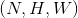 where each value is `0 &lt;= targets[i] &lt;= C-1`
*   输出：scalar. If reduce is `False`, then  instead.

Examples:

```py
>>> m = nn.Conv2d(16, 32, (3, 3)).float()
>>> loss = nn.NLLLoss2d()
>>> # input is of size N x C x height x width
>>> input = autograd.Variable(torch.randn(3, 16, 10, 10))
>>> # each element in target has to have 0 <= value < C
>>> target = autograd.Variable(torch.LongTensor(3, 8, 8).random_(0, 4))
>>> output = loss(m(input), target)
>>> output.backward()

```

### KLDivLoss

```py
class torch.nn.KLDivLoss(size_average=True, reduce=True)
```

[Kullback-Leibler divergence](https://en.wikipedia.org/wiki/Kullback-Leibler_divergence) 损失

KL 散度可用于衡量不同的连续分布之间的距离, 在连续的输出分布的空间上(离散采样)上进行直接回归时 很有效.

跟 `NLLLoss` 一样, `input` 需要含有 _对数概率_ , 不同于 `ClassNLLLoss`, `input` 可 以不是2维的 Tensor, 因为该函数会逐元素地求值.

该方法需要一个shape跟 `input` `Tensor` 一样的 `target` `Tensor`.

损失可以描述为:


默认情况下, loss 会在每个 mini-batch(小批量）上和 **维度** 上取平均值. 如果字段 `size_average` 设置为 `False`, 则 loss 不会取平均值.

参数：

*   `size_average (bool, 可选)` – 默认情况下, loss 会在每个 mini-batch(小批量）上 和 **维度** 上取平均值. 如果设置为 `False`, 则 loss 会累加, 而不是取平均值.
*   `reduce (bool, 可选)` – 默认情况下, loss 会根据 size_average 在每 个 mini-batch(小批量）上求平均值或者求和. 当 reduce 是 `False` 时, 损失函数会对每 个 batch 元素都返回一个 loss 并忽略 size_average 字段. 默认值: `True`


形状：

*   输入: , 其中 `*` 表示任意数量的额外维度.
*   目标: , shape 跟输入相同
*   输出: 标量. 如果 `reduce` 是 `True`, 则输出为 , shape 跟输入相同.

### BCELoss

```py
class torch.nn.BCELoss(weight=None, size_average=True)
```

计算目标和输出之间的二进制交叉熵:

![loss(o, t) = - 1/n \sum_i (t[i] * log(o[i]) + (1 - t[i]) * log(1 - o[i]))](img/tex-c665b18ba021122b899fb17d4f215496.gif)

当定义了 weight 参数时:

![loss(o, t) = - 1/n \sum_i weight[i] * (t[i] * log(o[i]) + (1 - t[i]) * log(1 - o[i]))](img/tex-a75feea82623649f822315604b9dff5a.gif)

这可用于测量重构的误差, 例如自动编码机. 注意目标的值 `t[i]` 的范围为0到1之间.

参数：

*   `weight (Tensor, 可选)` – 自定义的每个 batch 元素的 loss 的权重. 必须是一个长度为 “nbatch” 的 的 Tensor
*   `size_average (bool, 可选)` – 默认情况下, loss 会在每个 mini-batch(小批量） 上取平均值. 如果字段 size_average 被设置为 `False` , loss 会在每 个 mini-batch(小批量）上累加, 而不是取平均值. 默认值: `True`


形状：

*   输入: , 其中 `*` 表示任意数量的额外维度.
*   目标: , shape 跟输入相同

Examples:

```py
>>> m = nn.Sigmoid()
>>> loss = nn.BCELoss()
>>> input = autograd.Variable(torch.randn(3), requires_grad=True)
>>> target = autograd.Variable(torch.FloatTensor(3).random_(2))
>>> output = loss(m(input), target)
>>> output.backward()

```

### BCEWithLogitsLoss

```py
class torch.nn.BCEWithLogitsLoss(weight=None, size_average=True)
```

该损失函数把 `Sigmoid` 层集成到了 `BCELoss` 类中. 该版比用一个简单的 `Sigmoid` 层和 `BCELoss` 在数值上更稳定, 因为把这两个操作合并为一个层之后, 可以利用 log-sum-exp 的 技巧来实现数值稳定.

目标和输出之间的二值交叉熵(不含sigmoid函数)是:

![loss(o, t) = - 1/n \sum_i (t[i] * log(sigmoid(o[i])) + (1 - t[i]) * log(1 - sigmoid(o[i])))](img/tex-f7f1487d3258a1beca2e4eb99261fbad.gif)

当定义了 weight 参数之后可描述为:

![loss(o, t) = - 1/n \sum_i weight[i] * (t[i] * log(sigmoid(o[i])) + (1 - t[i]) * log(1 - sigmoid(o[i])))](img/tex-131660545fb84e407d9855bc8e08e7c1.gif)

这可用于测量重构的误差, 例如自动编码机. 注意目标的值 `t[i]` 的范围为0到1之间.

参数：

*   `weight (Tensor, 可选)` – 自定义的每个 batch 元素的 loss 的权重. 必须是一个长度 为 “nbatch” 的 Tensor
*   `size_average (bool, 可选)` – 默认情况下, loss 会在每个 mini-batch(小批量） 上取平均值. 如果字段 size_average 被设置为 `False` , loss 会在每 个 mini-batch(小批量）上累加, 而不是取平均值. 默认值: `True`


形状：

*   输入: , 其中 `*` 表示任意数量的额外维度.
*   目标: , shape 跟输入相同

Examples:

```py
>>> loss = nn.BCEWithLogitsLoss()
>>> input = autograd.Variable(torch.randn(3), requires_grad=True)
>>> target = autograd.Variable(torch.FloatTensor(3).random_(2))
>>> output = loss(input, target)
>>> output.backward()

```

### MarginRankingLoss

```py
class torch.nn.MarginRankingLoss(margin=0, size_average=True)
```

创建一个衡量 mini-batch(小批量) 中的2个1维 `Tensor` 的输入 `x1` 和 `x2`, 和1个1维 `Tensor` 的目标 `y`(`y` 的取值是 `1` 或者 `-1`) 之间损失的标准.

如果 `y == 1` 则认为第一个输入值应该排列在第二个输入值之上(即值更大), `y == -1` 时则相反.

对于 mini-batch(小批量) 中每个实例的损失函数如下:

```py
loss(x, y) = max(0, -y * (x1 - x2) + margin)

```

如果内部变量 `size_average = True`, 则损失函数计算批次中所有实例的损失值的平均值; 如果 `size_average = False`, 则损失函数计算批次中所有实例的损失至的合计. `size_average` 默认值为 `True`.

### HingeEmbeddingLoss

```py
class torch.nn.HingeEmbeddingLoss(margin=1.0, size_average=True)
```

衡量输入 Tensor(张量) `x` 和 目标 Tensor(张量) `y` (取值为 `1` 和 `-1`) 之间的损失值. 此方法通常用来衡量两个输入值是否相似, 例如使用L1成对距离作为 `x`, 并且通常用来进行非线性嵌入学习或者 半监督学习:

```py
                 { x_i,                  if y_i ==  1
loss(x, y) = 1/n {
                 { max(0, margin - x_i), if y_i == -1

```

`x` 和 `y` 分别可以是具有 `n` 个元素的任意形状. 合计操作对所有元素进行计算.

如果 `size_average=False`, 则计算时不会除以 `n` 取平均值.

`margin` 的默认值是 `1`, 或者可以通过构造函数来设置.

### MultiLabelMarginLoss

```py
class torch.nn.MultiLabelMarginLoss(size_average=True)
```

创建一个标准, 用以优化多元分类问题的合页损失函数 (基于空白的损失), 计算损失值时 需要2个参数分别为输入, `x` (一个2维小批量 `Tensor`) 和输出 `y` (一个2维 `Tensor`, 其值为 `x` 的索引值). 对于mini-batch(小批量) 中的每个样本按如下公式计算损失:

```py
loss(x, y) = sum_ij(max(0, 1 - (x[y[j]] - x[i]))) / x.size(0)

```

其中 `i` 的取值范围是 `0` 到 `x.size(0)`, `j` 的取值范围是 `0` 到 `y.size(0)`, `y[j] &gt;= 0`, 并且对于所有 `i` 和 `j` 有 `i != y[j]`.

`y` 和 `x` 必须有相同的元素数量.

此标准仅考虑 `y[j]` 中最先出现的非零值.

如此可以允许每个样本可以有数量不同的目标类别.

### SmoothL1Loss

```py
class torch.nn.SmoothL1Loss(size_average=True, reduce=True)
```

创建一个标准, 当某个元素的错误值的绝对值小于1时使用平方项计算, 其他情况则使用L1范式计算. 此方法创建的标准对于异常值不如 `MSELoss`敏感, 但是同时在某些情况下可以防止梯度爆炸 (比如 参见论文 “Fast R-CNN” 作者 Ross Girshick). 也被称为 Huber 损失函数:

```py
                      { 0.5 * (x_i - y_i)^2, if |x_i - y_i| < 1
loss(x, y) = 1/n \sum {
                      { |x_i - y_i| - 0.5,   otherwise

```

`x` 和 `y` 可以是任意形状只要都具备总计 `n` 个元素 合计仍然针对所有元素进行计算, 并且最后除以 `n`.

如果把内部变量 `size_average` 设置为 `False`, 则不会被除以 `n`.

参数：

*   `size_average (bool, 可选)` – 损失值默认会按照所有元素取平均值. 但是, 如果 size_average 被 设置为 `False`, 则损失值为所有元素的合计. 如果 reduce 参数设为 `False`, 则忽略此参数的值. 默认: `True`
*   `reduce (bool, 可选)` – 损失值默认会按照所有元素取平均值或者取合计值. 当 reduce 设置为 `False` 时, 损失函数对于每个元素都返回损失值并且忽略 size_average 参数. 默认: `True`


形状：

*   输入:  `*` 代表任意个其他维度
*   目标: , 同输入
*   输出: 标量. 如果 reduce 设为 `False` 则为 , 同输入

### SoftMarginLoss

```py
class torch.nn.SoftMarginLoss(size_average=True)
```

创建一个标准, 用以优化两分类的 logistic loss. 输入为 `x` (一个2维 mini-batch Tensor)和 目标 `y` (一个包含 `1` 或者 `-1` 的 Tensor).

```py
loss(x, y) = sum_i (log(1 + exp(-y[i]*x[i]))) / x.nelement()

```

可以通过设置 `self.size_average` 为 `False` 来禁用按照元素数量取平均的正则化操作.

### MultiLabelSoftMarginLoss

```py
class torch.nn.MultiLabelSoftMarginLoss(weight=None, size_average=True)
```

创建一个标准, 基于输入 `x` 和目标 `y`的 max-entropy(最大熵), 优化多标签 one-versus-all 损失. 输入 `x` 为一个2维 mini-batch `Tensor`, 目标 `y` 为2进制2维 `Tensor`. 对每个 mini-batch 中的样本, 对应的 loss 为:

```py
loss(x, y) = - sum_i (y[i] * log( 1 / (1 + exp(-x[i])))
                  + ( (1-y[i]) * log(exp(-x[i]) / (1 + exp(-x[i]))) )

```

其中 `i == 0` 至 `x.nElement()-1`, `y[i] in {0,1}`. `y` 和 `x` 必须具有相同的维度.

### CosineEmbeddingLoss

```py
class torch.nn.CosineEmbeddingLoss(margin=0, size_average=True)
```

新建一个标准, 用以衡量输入 `Tensor` x1, x2 和取值为 1 或者 -1 的标签 `Tensor` `y`之间的 损失值. 此标准用 cosine 距离来衡量2个输入参数之间是否相似, 并且一般用来学习非线性 embedding 或者半监督 学习.

`margin` 应该取 `-1` 到 `1` 之间的值, 建议取值范围是 `0` 到 `0.5`. 如果没有设置 `margin` 参数, 则默认值取 `0`.

每个样本的损失函数如下:

```py
             { 1 - cos(x1, x2),              if y ==  1
loss(x, y) = {
             { max(0, cos(x1, x2) - margin), if y == -1

```

如果内部变量 `size_average` 设置为 `True`, 则损失函数以 batch 中所有的样本数取平均值; 如果 `size_average` 设置为 `False`, 则损失函数对 batch 中所有的样本求和. 默认情况下, `size_average = True`.

### MultiMarginLoss

```py
class torch.nn.MultiMarginLoss(p=1, margin=1, weight=None, size_average=True)
```

创建一个标准, 用以优化多元分类问题的合页损失函数 (基于空白的损失), 计算损失值时 需要2个参数分别为输入, `x` (一个2维小批量 `Tensor`) 和输出 `y` (一个1维 `Tensor`, 其值为 `x` 的索引值, `0` &lt;= `y` &lt;= `x.size(1)`):

对于每个 mini-batch(小批量) 样本:

```py
loss(x, y) = sum_i(max(0, (margin - x[y] + x[i]))^p) / x.size(0)
```

其中 `i == 0` 至 `x.size(0)` 并且 `i != y`.

可选择的, 如果您不想所有的类拥有同样的权重的话, 您可以通过在构造函数中传入 `weight` 参数来 解决这个问题, `weight` 是一个1维 Tensor.

传入 `weight` 后, 损失函数变为:

> loss(x, y) = sum_i(max(0, w[y] * (margin - x[y] - x[i]))^p) / x.size(0)

默认情况下, 求出的损失值会对每个 minibatch 样本的结果取平均. 可以通过设置 `size_average` 为 `False` 来用合计操作取代取平均操作.

### TripletMarginLoss

```py
class torch.nn.TripletMarginLoss(margin=1.0, p=2, eps=1e-06, swap=False)
```

创建一个标准, 用以衡量三元组合的损失值, 计算损失值时需要3个输入张量 `x1`, `x2`, `x3` 和 一个大于零的 `margin` 值. 此标准可以用来衡量输入样本间的相对相似性. 一个三元输入组合由 `a`, `p` 和 `n`: anchor, positive 样本 和 negative 样本组成. 所有输入变量的形式必须为 .

距离交换的详细说明请参考论文 [Learning shallow convolutional feature descriptors with triplet losses](http://www.iis.ee.ic.ac.uk/%7Evbalnt/shallow_descr/TFeat_paper.pdf) by V. Balntas, E. Riba et al.


其中 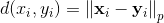.

参数：

*   `anchor` – anchor 输入 tensor
*   `positive` – positive 输入 tensor
*   `negative` – negative 输入 tensor
*   `p` – 正则化率. Default: 2


形状：

*   输入： 其中 `D = vector dimension`
*   输出：

```py
>>> triplet_loss = nn.TripletMarginLoss(margin=1.0, p=2)
>>> input1 = autograd.Variable(torch.randn(100, 128))
>>> input2 = autograd.Variable(torch.randn(100, 128))
>>> input3 = autograd.Variable(torch.randn(100, 128))
>>> output = triplet_loss(input1, input2, input3)
>>> output.backward()

```

## Vision layers (视觉层)

### PixelShuffle

```py
class torch.nn.PixelShuffle(upscale_factor)
```

对张量中形如 ![(*, C * r^2, H, W]](img/tex-92312e8331c8111c53ea986a22d9bfd2.gif) 的元素, 重新排列成 .

当使用 stride =  的高效子像素卷积很有用.

参考如下论文获得更多信息: [Real-Time Single Image and Video Super-Resolution Using an Efficient Sub-Pixel Convolutional Neural Network](https://arxiv.org/abs/1609.05158) Shi et. al (2016) .

参数：`upscale_factor (int)` – 增加空间分辨率的因子


形状：

*   输入: 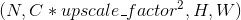
*   输出: 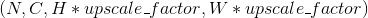

Examples:

```py
>>> ps = nn.PixelShuffle(3)
>>> input = autograd.Variable(torch.Tensor(1, 9, 4, 4))
>>> output = ps(input)
>>> print(output.size())
torch.Size([1, 1, 12, 12])

```

### Upsample

```py
class torch.nn.Upsample(size=None, scale_factor=None, mode='nearest')
```

对给定的多通道一维时序数据, 二维空间数据, 或三维容积数据进行上采样.

输入数据的格式为 `minibatch x channels x [depth] x [height] x width`. 因此, 对于2-D空间数据的输入, 期望得到一个4-D张量；对于3-D立体数据输入, 期望得到一个5-D张量.

对3D, 4D, 5D的输入张量进行最近邻、线性、双线性和三线性采样, 可用于该上采样方法.

可以提供 `scale_factor` 或目标输出的 `size` 来计算输出的大小. (不能同时都给, 因为这样做是含糊不清的. )

参数：

*   `size (tuple, 可选)` – 整型数的元组 ([D_out], [H_out], W_out) 输出大小
*   `scale_factor (int / tuple[int...], 可选)` – 图像高度/宽度/深度的乘数
*   `mode (string, 可选)` – 上采样算法: nearest &#124; linear &#124; bilinear &#124; trilinear. 默认为: nearest


形状：

*   输入: 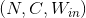,  或 
*   输出: 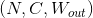,  或  其中: 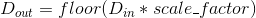 或 `size[-3]` 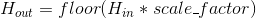 或 `size[-2]`  或 `size[-1]`

示例:

```py
>>> inp
Variable containing:
(0 ,0 ,.,.) =
 1  2
 3  4
[torch.FloatTensor of size 1x1x2x2]

>>> m = nn.Upsample(scale_factor=2, mode='bilinear')
>>> m(inp)
Variable containing:
(0 ,0 ,.,.) =
 1.0000  1.3333  1.6667  2.0000
 1.6667  2.0000  2.3333  2.6667
 2.3333  2.6667  3.0000  3.3333
 3.0000  3.3333  3.6667  4.0000
[torch.FloatTensor of size 1x1x4x4]

>>> inp
Variable containing:
(0 ,0 ,.,.) =
 1  2
 3  4
[torch.FloatTensor of size 1x1x2x2]

>>> m = nn.Upsample(scale_factor=2, mode='nearest')
>>> m(inp)
Variable containing:
(0 ,0 ,.,.) =
 1  1  2  2
 1  1  2  2
 3  3  4  4
 3  3  4  4
[torch.FloatTensor of size 1x1x4x4]

```

### UpsamplingNearest2d

```py
class torch.nn.UpsamplingNearest2d(size=None, scale_factor=None)
```

对多个输入通道组成的输入信号进行2维最近邻上采样.

为了指定采样范围, 提供了 `size` 或 `scale_factor` 作为构造参数.

当给定 `size`, 输出图像的大小为 (h, w).

参数：

*   `size (tuple, 可选)` – 输出图片大小的整型元组(H_out, W_out)
*   `scale_factor (int, 可选)` – 图像的 长和宽的乘子.


形状：

*   输入：
*   输出： 其中  

示例:

```py
>>> inp
Variable containing:
(0 ,0 ,.,.) =
 1  2
 3  4
[torch.FloatTensor of size 1x1x2x2]

>>> m = nn.UpsamplingNearest2d(scale_factor=2)
>>> m(inp)
Variable containing:
(0 ,0 ,.,.) =
 1  1  2  2
 1  1  2  2
 3  3  4  4
 3  3  4  4
[torch.FloatTensor of size 1x1x4x4]

```

### UpsamplingBilinear2d

```py
class torch.nn.UpsamplingBilinear2d(size=None, scale_factor=None)
```

对多个输入通道组成的输入信号进行2维双线性上采样.

为了指定采样范围, 提供了 `size` 或 `scale_factor` 作为构造参数.

当给定 `size`, 输出图像的大小为 (h, w).

参数：

*   `size (tuple, 可选)` – 输出图片大小的整型元组(H_out, W_out)
*   `scale_factor (int, 可选)` – 图像的 长和宽的乘子.


形状：

*   输入：
*   输出： 其中  

示例：

```py
>>> inp
Variable containing:
(0 ,0 ,.,.) =
 1  2
 3  4
[torch.FloatTensor of size 1x1x2x2]

>>> m = nn.UpsamplingBilinear2d(scale_factor=2)
>>> m(inp)
Variable containing:
(0 ,0 ,.,.) =
 1.0000  1.3333  1.6667  2.0000
 1.6667  2.0000  2.3333  2.6667
 2.3333  2.6667  3.0000  3.3333
 3.0000  3.3333  3.6667  4.0000
[torch.FloatTensor of size 1x1x4x4]

```

## DataParallel layers (multi-GPU, distributed) (数据并行层, 多 GPU 的, 分布式的)

### DataParallel

```py
class torch.nn.DataParallel(module, device_ids=None, output_device=None, dim=0)
```

在模块级别实现数据并行性.

此容器通过在批次维度中分块, 将输入分割到指定设备上, 从而并行化给定模块的应用程 序.在正向传递中, 模块被复制到每个设备上, 每个副本处理一部分输入.在向后传递期间, 来自每个副本的梯度变化被汇总到原始模块中.

batch size 应该大于 GPUs 的数量.同时也应该是 GPU 数量的整数倍, 以 便每个块大小相同(以便每个 GPU 处理相同数量的样本）.

引用 :[使用 nn.DataParallel 替代 multiprocessing](notes/cuda.html#cuda-nn-dataparallel-instead)

允许将任意位置和关键字输入传入 DataParallel EXCEPT Tensors. 所有的变量将被分 散在指定的维度(默认为0）.原始类型将被广播, 但所有其他类型将是一个浅层副本, 如 果写入模型的正向传递, 可能会被损坏.

Args : module: 并行的模型 device_ids: CUDA devices(CUDA 驱动） (default: all devices) output_device: 输出设备位置 (default: device_ids[0]) 示例 ::

```py
>>> net = torch.nn.DataParallel(model, device_ids=[0, 1, 2])
>>> output = net(input_var)

```

### DistributedDataParallel

```py
class torch.nn.parallel.DistributedDataParallel(module, device_ids=None, output_device=None, dim=0)
```

在模块级别实现分布式数据并行.

此容器通过在批次维度中分块, 将输入分割到指定设备上, 从而并行化给定模块的应用程序. 该模块被复制到每台机器和每个设备上, 每个这样的副本处理一部分输入.在向后传递期间, 来自每个节点的梯度被平均.

batch size 应该大于 GPUs 的数量.同时也应该是 GPU 数量的整数倍, 以便每个块大小 相同(以便每个 GPU 处理相同数量的样本）.

引用 :Basics](distributed.html#distributed-basics) 和 [使用 nn.DataParallel 替代 multiprocessing](notes/cuda.html#cuda-nn-dataparallel-instead). 对输入的约束和 [`torch.nn.DataParallel` 中一样.

创建这个类需要分布式包已经在 process group 模式下被初始化 (引用 [`torch.distributed.init_process_group()`](distributed.html#torch.distributed.init_process_group "torch.distributed.init_process_group")).

警告：

这个模块只能和``gloo``后端一起工作.

警告：

构造器, 转发方法和输出(或者这个模块的输出功能）的区分是分布式同步点.考虑到不同的 进程可能会执行不同的代码.

警告：

该模块假设所有参数在创建时都在模型中注册.之后不应该添加或删除参数.同样适用于缓冲区.

警告：

这个模块假定所有的缓冲区和梯度都是密集的.

警告：

这个模块不能用于 : func: `torch.autograd.grad` (即只有在参数的 `.grad` 属性中 累积梯度才能使用）.

注解：

参数永远不会在进程之间广播.模块在梯度上执行全部优化步骤, 并假定它们将以相同的方式在 所有进程中进行优化.缓冲区(e.g. BatchNorm stats）在等级0的过程中从模块广播到系统 中的每个迭代中的所有其他副本.

Args : module: 需要并行的模型 device_ids: CUDA devices (default: all devices) output_device: device location of output (default: device_ids[0]) 示例 ::

```py
>>> torch.distributed.init_process_group(world_size=4, init_method='...')
>>> net = torch.nn.DistributedDataParallel(model)

```

## Utilities (工具包)

### clip_grad_norm

```py
torch.nn.utils.clip_grad_norm(parameters, max_norm, norm_type=2)
```

接收一个包含 Variable 的可迭代对象, 对 Variable 的梯度按范数进行裁剪.

范数是对所有梯度进行计算的, 等价于把所有输入变量的梯度连接成一个向量, 然后对这个向量按范数进行裁剪. 梯度将会被原地修改.

参数：

*   `parameters (Iterable[Variable])` – 一个可迭代对象, 其包含将要进行梯度正规化的 Variable
*   `max_norm (float 或 int)` – 梯度的最大范数
*   `norm_type (float 或 int)` – p 范数(指定 p ). 用 `'inf'` 表示无穷范数


返回值：梯度的范数 (视为单个向量的).


### weight_norm

```py
torch.nn.utils.weight_norm(module, name='weight', dim=0)
```

将权重归一化应用于给定模块中的指定参数. .


权重归一化是将权重张量的大小和方向分离的再参数化. 该函数会用两个参数代替 `name` (e.g. “weight”)所指定的参数. 在新的参数中, 一个指定参数的大小 (e.g. “weight_g”), 一个指定参数的方向. 权重归一化是通过一个钩子实现的, 该钩子会在 `~Module.forward` 的每次调用之前根据大小和方向(两个新参数)重新计算权重张量.

默认情况下, `dim=0`, 范数会在每一个输出的 channel/plane 上分别计算. 若要对整个权重张量计算范数, 使用 `dim=None`.

参见 [https://arxiv.org/abs/1602.07868](https://arxiv.org/abs/1602.07868)

参数：

*   `module (nn.Module)` – 给定的 module
*   `name (str, 可选)` – 权重参数的 name
*   `dim (int, 可选)` – 进行范数计算的维度


返回值：添加了权重归一化钩子的原 module


示例：

```py
>>> m = weight_norm(nn.Linear(20, 40), name='weight')
Linear (20 -> 40)
>>> m.weight_g.size()
torch.Size([40, 1])
>>> m.weight_v.size()
torch.Size([40, 20])

```

### remove_weight_norm

```py
torch.nn.utils.remove_weight_norm(module, name='weight')
```

从模块中移除权重归一化/再参数化.

参数：

*   `module (nn.Module)` – 给定的 module
*   `name (str, 可选)` – 权重参数的 name


示例：

```py
>>> m = weight_norm(nn.Linear(20, 40))
>>> remove_weight_norm(m)

```

### PackedSequence

```py
torch.nn.utils.rnn.PackedSequence(_cls, data, batch_sizes)
```

保存一个打包序列的 data 和 batch_sizes.

所有的 RNN 模块都接收这种被包裹后的序列作为它们的输入.

注解：

永远不要手动创建这个类的实例. 它们应当被 `pack_padded_sequence()` 这样的函数实例化.

变量：

*   `data (Variable)` – 包含打包后序列的 Variable
*   `batch_sizes (list[int])` – 包含每个序列步的 batch size 的列表


### pack_padded_sequence

```py
torch.nn.utils.rnn.pack_padded_sequence(input, lengths, batch_first=False)
```

将填充过的变长序列打包(压紧).

输入的形状可以是 `TxBx*` . `T`是最长序列长度(等于 `lengths[0]`), `B`是批量大小, `*`代表任意维度(可以是 0). 如果 `batch_first=True` , 那么相应的输入大小就是 `BxTx*` .

Variable 中保存的序列, 应该按序列长度的长短排序, 长的在前, 短的在后. 即 input[:,0] 代表的是最长的序列, input[:, B-1] 保存的是最短的序列.

注解：

只要是维度大于等于2的 input 都可以作为这个函数的参数. 你可以用它来打包 labels, 然后用 RNN 的输出和打包后的 labels 来计算 loss. 通过 `PackedSequence` 对象的 `.data` 属性可以获取 Variable.

参数：

*   `input (Variable)` – 变长序列被填充后的 batch
*   `lengths (list[int])` – Variable 中每个序列的长度.
*   `batch_first (bool, 可选)` – 如果是 `True`, input 的形状应该是 `BxTx*`.


返回值：一个 `PackedSequence` 对象.


### pad_packed_sequence

```py
torch.nn.utils.rnn.pad_packed_sequence(sequence, batch_first=False, padding_value=0.0)
```

填充打包过的变长序列.

这是 `pack_padded_sequence()` 的逆操作.

返回的 Varaible 的值的 size 是 `TxBx*`, T 是最长序列的长度, B 是 batch_size, 如果 `batch_first=True`, 那么返回值是 `BxTx*`.

Batch中的元素将会以它们长度的逆序排列.

参数：

*   `sequence (PackedSequence)` – 将要被填充的 batch
*   `batch_first (bool, 可选)` – 如果为 `True` , 返回的数据的格式为 `BxTx*`.
*   `padding_value (float, 可选)` – 用来填充元素的值


返回值：一个 tuple, 包含被填充后的序列, 和 batch 中序列的长度列表.
