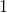
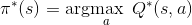
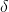
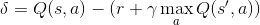
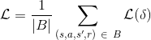
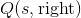
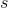
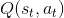
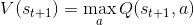
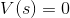

# 强化学习(DQN）教程

> 译者：[@Lisanaaa](https://github.com/Lisanaaa)

**作者**: [Adam Paszke](https://github.com/apaszke)

本教程演示如何使用 PyTorch 对任务 CartPole-v0 训练 Deep Q Learning(DQN）代理(即一个算法黑箱）, 该任务来自于 [OpenAI Gym](https://gym.openai.com/).

**任务**

该代理需要决定将小车往左还是往右推, 因此小车上的杆子始终保持竖直. 你可以在 [Gym website](https://gym.openai.com/envs/CartPole-v0) 找到一个官方的公示榜单, 其罗列了不同的算法和可视化.

代理通过观察当前环境(小车和杆子的组合体）下的状态选择一个合适的行为(往左还是往右推）, 随后环境状态得到转变, 并返回一个回馈因子来量化该行为所带来的后果(好处或是坏处）. 在这个任务中, 如果杆子移动太远则整个代理环境终止.

小车推杆任务被设计为有4个输入参数传给代理, 它们是环境状态, 环境位置, 环境速率等. 然而, 神经网络单靠观察这个场景就可以解决该任务, 因此我们用一些以小车为中心的屏幕图作为输入参数就行了. 正因为此, 我们并不能仅仅凭借将我们所得结果与公示榜单上的结果对比来得出结论, 我们的任务远比这个难. 不幸的是, 这将会导致我们的训练速度变慢, 因为我们必须得渲染屏幕图所有的帧数.

严格来说, 我们将状态定义为前一个屏幕图与当前屏幕图之间的差别. 这也会使得代理将图中推杆的速率也考虑进去.

**包**

首先, 我们导入一些需要用到的包. 第一, 我们需要 [gym包](https://gym.openai.com/docs) 环境需要这个包(使用 ‘pip install gym’ 安装该包). 我们也会使用来自于 PyTorch 的以下包:

*   神经网络 neural networks (`torch.nn`)
*   优化 optimization (`torch.optim`)
*   自微分 automatic differentiation (`torch.autograd`)
*   视觉任务工具 (`torchvision` - [一个独立的包](https://github.com/pytorch/vision)).

```py
import gym
import math
import random
import numpy as np
import matplotlib
import matplotlib.pyplot as plt
from collections import namedtuple
from itertools import count
from copy import deepcopy
from PIL import Image

import torch
import torch.nn as nn
import torch.optim as optim
import torch.nn.functional as F
from torch.autograd import Variable
import torchvision.transforms as T

env = gym.make('CartPole-v0').unwrapped

# 设置 matplotlib
is_ipython = 'inline' in matplotlib.get_backend()
if is_ipython:
    from IPython import display

plt.ion()

# 如果要使用 gpu 的话
use_cuda = torch.cuda.is_available()
FloatTensor = torch.cuda.FloatTensor if use_cuda else torch.FloatTensor
LongTensor = torch.cuda.LongTensor if use_cuda else torch.LongTensor
ByteTensor = torch.cuda.ByteTensor if use_cuda else torch.ByteTensor
Tensor = FloatTensor

```

## 重播记忆 (Replay Memory)

我们将使用体验重播记忆来训练我们的DQN. 它存储了代理观察到的变化过程, 允许我们之后能够 重复使用这些数据. 通过对重播记忆随机取样, 建立了批处理的变化过程将会被解耦合. 这一机制 也被证明能够大幅度地提高和优化 DNQ 训练步骤的稳定性.

对此, 我们将需要两个类:

*   `Transition` - 一个命名元祖(tuple）, 代表了环境的单次变化
*   `ReplayMemory` - 一个有限大小的循环缓冲区, 用于保存最近观察到的转换过程. 它也实现了``.sample(）``方法, 用于选择随机批次的转换进行训练

```py
Transition = namedtuple('Transition',
                        ('state', 'action', 'next_state', 'reward'))

class ReplayMemory(object):

    def __init__(self, capacity):
        self.capacity = capacity
        self.memory = []
        self.position = 0

    def push(self, *args):
        """Saves a transition."""
        if len(self.memory) < self.capacity:
            self.memory.append(None)
        self.memory[self.position] = Transition(*args)
        self.position = (self.position + 1) % self.capacity

    def sample(self, batch_size):
        return random.sample(self.memory, batch_size)

    def __len__(self):
        return len(self.memory)

```

现在, 让我们开始构建我们的模型. 但是在此之前我们首先得重新定义什么是 DNQ.

## DQN 算法

我们的环境是确定性的, 所以这里提出的所有方程也都是为简单起见而确定性地制定的. 在强化学习概念中, 其还会包含有对环境中随机变化过程的期望值.

我们的目标是训练出一个机制, 尽可能做到最大化折扣因子和累积回馈因子. ,  也被称为 _回馈因子_. 折扣因子  应该是一个 位于  和  之间的常量, 且确保了其总和是收敛的. 它的存在意义是让 回馈的重要程度与时间成正比, 即离现在1分钟的回馈比离现在1小时的回馈要更重要, 因为离当前时间越近, 我们的预测值可以更准确, 更可信.

Q-learning 的主要原理是, 假如我们有一个函数, , 这将会定义返回值, 如果我们在给定状态下做出动作, 那么我们将会更容易据此训练出一个机制, 并做到最大化回馈因子.



由于我们对整个环境一无所知, 我们不需要知道确定的 . 但是, 因为神经网络 是一个泛化的逼近函数, 所以我们可以直接构造一个网络并训练它去模拟`Q^*`即可.

对于我们训练的更新规则来说, 我们只需要让每一个  遵从贝尔曼方程 (Bellman equation) 就可以了.


方程两边的实际差值即为时间差分误差 (temporal difference error), :



为了使得该误差值最小化, 我们要使用 [Huber loss](https://en.wikipedia.org/wiki/Huber_loss). 当时间差分误差较小时, Huber loss 表现地与均方误差 (mean squared error) 一样, 而当时间差分误差较大时, Huber loss 表现地与绝对均差 (mean absolute error) 一样. 这一性质使得它在预测带有较多噪音的  值上更具有鲁棒性. 我们通过从重播记忆中取出一批样本来计算 .




### Q-network

我们的模型是一个卷积神经网络 (CNN), 将当前屏幕图与之前屏幕图的差值作为唯一输入, 输出值有两个, 分别代表  和  (其中  是网络的输入). 从效果上来看, 我们的神经网络模型可以预测在当前输入下采取特定行为带来的 _quality_, 即对整个环境的影响.

```py
class DQN(nn.Module):

    def __init__(self):
        super(DQN, self).__init__()
        self.conv1 = nn.Conv2d(3, 16, kernel_size=5, stride=2)
        self.bn1 = nn.BatchNorm2d(16)
        self.conv2 = nn.Conv2d(16, 32, kernel_size=5, stride=2)
        self.bn2 = nn.BatchNorm2d(32)
        self.conv3 = nn.Conv2d(32, 32, kernel_size=5, stride=2)
        self.bn3 = nn.BatchNorm2d(32)
        self.head = nn.Linear(448, 2)

    def forward(self, x):
        x = F.relu(self.bn1(self.conv1(x)))
        x = F.relu(self.bn2(self.conv2(x)))
        x = F.relu(self.bn3(self.conv3(x)))
        return self.head(x.view(x.size(0), -1))

```

### 获取输入

以下代码用来获取和处理来自环境中的被渲染的图像. 其中使用了 `torchvision` 包, 这使得图像变换变得更加简单. 只要运行该代码块就会显示当前所提取图像.

```py
resize = T.Compose([T.ToPILImage(),
                    T.Scale(40, interpolation=Image.CUBIC),
                    T.ToTensor()])

# This is based on the code from gym.
screen_width = 600

def get_cart_location():
    world_width = env.x_threshold * 2
    scale = screen_width / world_width
    return int(env.state[0] * scale + screen_width / 2.0)  # MIDDLE OF CART

def get_screen():
    screen = env.render(mode='rgb_array').transpose(
        (2, 0, 1))  # transpose into torch order (CHW)
    # Strip off the top and bottom of the screen
    screen = screen[:, 160:320]
    view_width = 320
    cart_location = get_cart_location()
    if cart_location < view_width // 2:
        slice_range = slice(view_width)
    elif cart_location > (screen_width - view_width // 2):
        slice_range = slice(-view_width, None)
    else:
        slice_range = slice(cart_location - view_width // 2,
                            cart_location + view_width // 2)
    # Strip off the edges, so that we have a square image centered on a cart
    screen = screen[:, :, slice_range]
    # Convert to float, rescare, convert to torch tensor
    # (this doesn't require a copy)
    screen = np.ascontiguousarray(screen, dtype=np.float32) / 255
    screen = torch.from_numpy(screen)
    # 调整大小并添加批量维度 (BCHW)
    return resize(screen).unsqueeze(0).type(Tensor)

env.reset()
plt.figure()
plt.imshow(get_screen().cpu().squeeze(0).permute(1, 2, 0).numpy(),
           interpolation='none')
plt.title('Example extracted screen')
plt.show()

```

## 训练

### 超参数和函数

这一代码块实例化我们的模型和优化器, 并且定义了一些函数. 函数:

*   `Variable` - 这是一个对 `torch.autograd.Variable` 的简单包装器, 它会在我们每次构建变量时自动将数据发送到GPU.
*   `select_action` - 根据ε贪婪法则选择后续行动. 简而言之, 我们有时会使用 我们的模型来选择动作, 有时我们仅均匀采样. 选择随机动作的 概率大小将从 “EPS_START” 开始, 并沿着到 “EPS_END” 的方向 呈指数衰减. `EPS_DECAY` 控制衰减速度.
*   `plot_durations` - 一个协助绘制动态帧持续时间的函数, 以及过去100动态帧(官方 评估中使用的测量方法）的平均值. 绘制的图像将会显示在包含 主要训练循环的单元代码块下面, 并且在每节动态帧之后更新.

```py
BATCH_SIZE = 128
GAMMA = 0.999
EPS_START = 0.9
EPS_END = 0.05
EPS_DECAY = 200

model = DQN()

if use_cuda:
    model.cuda()

optimizer = optim.RMSprop(model.parameters())
memory = ReplayMemory(10000)

steps_done = 0

def select_action(state):
    global steps_done
    sample = random.random()
    eps_threshold = EPS_END + (EPS_START - EPS_END) * \
        math.exp(-1. * steps_done / EPS_DECAY)
    steps_done += 1
    if sample > eps_threshold:
        return model(
            Variable(state, volatile=True).type(FloatTensor)).data.max(1)[1].view(1, 1)
    else:
        return LongTensor([[random.randrange(2)]])

episode_durations = []

def plot_durations():
    plt.figure(2)
    plt.clf()
    durations_t = torch.FloatTensor(episode_durations)
    plt.title('Training...')
    plt.xlabel('Episode')
    plt.ylabel('Duration')
    plt.plot(durations_t.numpy())
    # Take 100 episode averages and plot them too
    if len(durations_t) >= 100:
        means = durations_t.unfold(0, 100, 1).mean(1).view(-1)
        means = torch.cat((torch.zeros(99), means))
        plt.plot(means.numpy())

    plt.pause(0.001)  # pause a bit so that plots are updated
    if is_ipython:
        display.clear_output(wait=True)
        display.display(plt.gcf())

```

### 训练循环

最终用于训练模型的代码

在下面代码中有一个 `optimize_model` 函数, 它用于实现优化过程的其中一步. 它首先 取出一个批次的样本, 然后将所有的张量全部合并到一个中, 并计算  和 , 最终将这些结果全都融入到loss中去. 假如  是一个终止状态, 则 .

```py
last_sync = 0

def optimize_model():
    global last_sync
    if len(memory) < BATCH_SIZE:
        return
    transitions = memory.sample(BATCH_SIZE)
    # 将betch转置 (详见 http://stackoverflow.com/a/19343/3343043).
    batch = Transition(*zip(*transitions))

    # 计算非最终状态的掩码并连接批处理元素s
    non_final_mask = ByteTensor(tuple(map(lambda s: s is not None,
                                          batch.next_state)))

    # 我们不想通过预期的动作值反向传播, volatile 变量会临时将模型参数
    # 'requires_grad' 更改为False！
    non_final_next_states = Variable(torch.cat([s for s in batch.next_state
                                                if s is not None]),
                                     volatile=True)
    state_batch = Variable(torch.cat(batch.state))
    action_batch = Variable(torch.cat(batch.action))
    reward_batch = Variable(torch.cat(batch.reward))

    # 计算 Q(s_t, a) - 模型计算出 Q(s_t), 然后我们选择某一栏动作执行
    state_action_values = model(state_batch).gather(1, action_batch)

    # 对所有下一状态计算出 V(s_{t+1})
    next_state_values = Variable(torch.zeros(BATCH_SIZE).type(Tensor))
    next_state_values[non_final_mask] = model(non_final_next_states).max(1)[0]
    # 此时我们不想让 volatile flag 混乱了我们的loss, 因此我们将其置为False
    # 在此之后, 我们将会直接丢弃满足该变量, 并设 requires_grad=False
    next_state_values.volatile = False
    # 计算 Q 的期望值
    expected_state_action_values = (next_state_values * GAMMA) + reward_batch

    # 计算 Huber 损失
    loss = F.smooth_l1_loss(state_action_values, expected_state_action_values)

    # 优化模型
    optimizer.zero_grad()
    loss.backward()
    for param in model.parameters():
        param.grad.data.clamp_(-1, 1)
    optimizer.step()

```

下面代码中包含主要的训练循环. 首先, 我们重新设置环境, 并实例化 `state` 变量. 然后, 我们对动作取样并执行, 观察下一屏幕图并得到回馈因子 (通常为1), 同时优化一次模型. 当动态帧结束时 (即我们的模型fail了), 开始新一轮的循环.

下面的 `num_episodes` 变量设置的很小. 你可以把这个 notebook 下载下来然后运行更多帧.

```py
num_episodes = 10
for i_episode in range(num_episodes):
    # Initialize the environment and state
    env.reset()
    last_screen = get_screen()
    current_screen = get_screen()
    state = current_screen - last_screen
    for t in count():
        # Select and perform an action
        action = select_action(state)
        _, reward, done, _ = env.step(action[0, 0])
        reward = Tensor([reward])

        # 观察记录新状态
        last_screen = current_screen
        current_screen = get_screen()
        if not done:
            next_state = current_screen - last_screen
        else:
            next_state = None

        # 将变化过程存到内存中
        memory.push(state, action, next_state, reward)

        # 转移到下一状态
        state = next_state

        # 对目标神经网络执行一步优化
        optimize_model()
        if done:
            episode_durations.append(t + 1)
            plot_durations()
            break

print('Complete')
env.render(close=True)
env.close()
plt.ioff()
plt.show()

```
