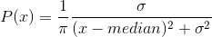
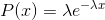
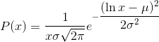

# torch.Tensor

> 译者：[@Sylvester](https://github.com/coboe)、[@那伊抹微笑](https://github.com/wangyangting)
> 
> 校对者：[@Sariel](https://github.com/Cyril-CC)

> `torch.Tensor` 是一种包含单一数据类型元素的多维矩阵.

Torch 定义了七种 CPU tensor 类型和八种 GPU tensor 类型:

| Data type | CPU tensor | GPU tensor |
| --- | --- | --- |
| 32-bit floating point | `torch.FloatTensor` | `torch.cuda.FloatTensor` |
| 64-bit floating point | `torch.DoubleTensor` | `torch.cuda.DoubleTensor` |
| 16-bit floating point | `torch.HalfTensor` | `torch.cuda.HalfTensor` |
| 8-bit integer (unsigned) | `torch.ByteTensor` | `torch.cuda.ByteTensor` |
| 8-bit integer (signed) | `torch.CharTensor` | `torch.cuda.CharTensor` |
| 16-bit integer (signed) | `torch.ShortTensor` | `torch.cuda.ShortTensor` |
| 32-bit integer (signed) | `torch.IntTensor` | `torch.cuda.IntTensor` |
| 64-bit integer (signed) | `torch.LongTensor` | `torch.cuda.LongTensor` |

> `torch.Tensor` 是默认的 tensor 类型(`torch.FloatTensor`)的简称.

一个 tensor 对象可以从 Python 的 [`list`](https://docs.python.org/3/library/stdtypes.html#list) 或者序列(sequence)构建:

```py
>>> torch.FloatTensor([[1, 2, 3], [4, 5, 6]])
1  2  3
4  5  6
[torch.FloatTensor of size 2x3]

```

一个空的 tensor 对象可以通过所指定的大小来构建:

```py
>>> torch.IntTensor(2, 4).zero_()
0  0  0  0
0  0  0  0
[torch.IntTensor of size 2x4]

```

可以通过 Python 的索引和切片方式来获取或修改 tensor 对象的内容:

```py
>>> x = torch.FloatTensor([[1, 2, 3], [4, 5, 6]])
>>> print(x[1][2])
6.0
>>> x[0][1] = 8
>>> print(x)
 1  8  3
 4  5  6
[torch.FloatTensor of size 2x3]

```

每一个 tensor 对象都有一个相应的 `torch.Storage` 用来保存数据. tensor 类提供了一个存储的多维的, 有 [跨度(strided)](https://en.wikipedia.org/wiki/Stride_of_an_array) 的视图, 并且在视图上定义了数值运算.

注解：

会改变 tensor 对象的函数方法名, 其使用了一个下划线后缀作为标识. 比如, `torch.FloatTensor.abs_()` 会在原地(in-place)计算绝对值并返回改变后的 tensor. 而 `torch.FloatTensor.abs()` 会在一个新建的 tensor 中计算结果.

```py
class torch.Tensor
```

```py
class torch.Tensor(*sizes)
```

```py
class torch.Tensor(size)
```

```py
class torch.Tensor(sequence)
```

```py
class torch.Tensor(ndarray)
```

```py
class torch.Tensor(tensor)
```

```py
class torch.Tensor(storage)
```

可以通过提供大小或者数据来创建一个新的 tensor 对象.

如果没有提供参数, 将返回一个空的零维的 tensor. 如果提供了 `numpy.ndarray`, `torch.Tensor`, 或者 `torch.Storage` 作为参数, 其将返回一个与参数共享数据的 tensor 对象. 如果提供一个 Python 序列 (sequence) 作为参数, 将返回从序列的副本中创建的一个新的 tensor 对象.

```py
abs() → Tensor
```

请查看 [`torch.abs()`](torch.html#torch.abs "torch.abs")

```py
abs_() → Tensor
```

`abs()` 的 in-place 运算形式

```py
acos() → Tensor
```

请查看 [`torch.acos()`](torch.html#torch.acos "torch.acos")

```py
acos_() → Tensor
```

`acos()` 的 in-place 运算形式

```py
add(value)
```

请查看 [`torch.add()`](torch.html#torch.add "torch.add")

```py
add_(value)
```

`add()` 的 in-place 运算形式

```py
addbmm(beta=1, mat, alpha=1, batch1, batch2) → Tensor
```

请查看 [`torch.addbmm()`](torch.html#torch.addbmm "torch.addbmm")

```py
addbmm_(beta=1, mat, alpha=1, batch1, batch2) → Tensor
```

`addbmm()` 的 in-place 运算形式

```py
addcdiv(value=1, tensor1, tensor2) → Tensor
```

请查看 [`torch.addcdiv()`](torch.html#torch.addcdiv "torch.addcdiv")

```py
addcdiv_(value=1, tensor1, tensor2) → Tensor
```

`addcdiv()` 的 in-place 运算形式

```py
addcmul(value=1, tensor1, tensor2) → Tensor
```

请查看 [`torch.addcmul()`](torch.html#torch.addcmul "torch.addcmul")

```py
addcmul_(value=1, tensor1, tensor2) → Tensor
```

`addcmul()` 的 in-place 运算形式

```py
addmm(beta=1, mat, alpha=1, mat1, mat2) → Tensor
```

请查看 [`torch.addmm()`](torch.html#torch.addmm "torch.addmm")

```py
addmm_(beta=1, mat, alpha=1, mat1, mat2) → Tensor
```

`addmm()` 的 in-place 运算形式

```py
addmv(beta=1, tensor, alpha=1, mat, vec) → Tensor
```

请查看 [`torch.addmv()`](torch.html#torch.addmv "torch.addmv")

```py
addmv_(beta=1, tensor, alpha=1, mat, vec) → Tensor
```

`addmv()` 的 in-place 运算形式

```py
addr(beta=1, alpha=1, vec1, vec2) → Tensor
```

请查看 [`torch.addr()`](torch.html#torch.addr "torch.addr")

```py
addr_(beta=1, alpha=1, vec1, vec2) → Tensor
```

`addr()` 的 in-place 运算形式

```py
apply_(callable) → Tensor
```

将函数 `callable` 作用于 tensor 的每一个元素, 并将每个元素用 `callable` 的返回值替换.

注解：

该函数只能在 CPU tensor 中使用, 并且不应该用在有较高性能的要求的代码块中.

```py
asin() → Tensor
```

请查看 [`torch.asin()`](torch.html#torch.asin "torch.asin")

```py
asin_() → Tensor
```

`asin()` 的 in-place 运算形式

```py
atan() → Tensor
```

请查看 [`torch.atan()`](torch.html#torch.atan "torch.atan")

```py
atan2(other) → Tensor
```

请查看 [`torch.atan2()`](torch.html#torch.atan2 "torch.atan2")

```py
atan2_(other) → Tensor
```

`atan2()` 的 in-place 运算形式

```py
atan_() → Tensor
```

`atan()` 的 in-place 运算形式

```py
baddbmm(beta=1, alpha=1, batch1, batch2) → Tensor
```

请查看 [`torch.baddbmm()`](torch.html#torch.baddbmm "torch.baddbmm")

```py
baddbmm_(beta=1, alpha=1, batch1, batch2) → Tensor
```

`baddbmm()` 的 in-place 运算形式

```py
bernoulli() → Tensor
```

请查看 [`torch.bernoulli()`](torch.html#torch.bernoulli "torch.bernoulli")

```py
bernoulli_() → Tensor
```

`bernoulli()` 的 in-place 运算形式

```py
bmm(batch2) → Tensor
```

请查看 [`torch.bmm()`](torch.html#torch.bmm "torch.bmm")

```py
byte()
```

将这个 tensor 转换为 byte 类型

```py
cauchy_(median=0, sigma=1, *, generator=None) → Tensor
```

用柯西分布得到的数值来填充 tensor 中的元素:



```py
ceil() → Tensor
```

请查看 [`torch.ceil()`](torch.html#torch.ceil "torch.ceil")

```py
ceil_() → Tensor
```

`ceil()` 的 in-place 运算形式

```py
char()
```

将这个 tensor 转换为 char 类型

```py
chunk(n_chunks, dim=0)
```

将 tensor 分解成 tensor 元组.

请查看 [`torch.chunk()`](torch.html#torch.chunk "torch.chunk").

```py
clamp(min, max) → Tensor
```

请查看 [`torch.clamp()`](torch.html#torch.clamp "torch.clamp")

```py
clamp_(min, max) → Tensor
```

`clamp()` 的 in-place 运算形式

```py
clone() → Tensor
```

返回与原 tensor 具有相同大小和数据类型的 tensor.

```py
contiguous() → Tensor
```

返回一个内存连续的有相同数据的 tensor, 如果原 tensor 内存连续则返回原 tensor.

```py
copy_(src, async=False, broadcast=True) → Tensor
```

将 `src` 中的元素复制到这个 tensor 中并返回这个 tensor

如果 `broadcast` 是 True, 源 tensor 一定和这个 tensor [broadcastable](notes/broadcasting.html#broadcasting-semantics). 另外, 源 tensor 的元素数量应该和这个 tensor 的元素个数一致. 源 tensor 可以是另一种数据类型, 或者在别的的设备上.

参数：

*   `src (Tensor)` – 被复制的源 tensor
*   `async (bool)` – 如果值为 `True` 并且这个复制操作在 CPU 和 GPU 之间进行, 则拷贝的副本与源信息可能会出现异步(asynchronously). 对于其他类型的复制操作, 这个参数不起作用.
*   `broadcast (bool)` – 如果值为 `True`, `src` 将广播基础的 tensor 的形状.


```py
cos() → Tensor
```

请查看 [`torch.cos()`](torch.html#torch.cos "torch.cos")

```py
cos_() → Tensor
```

`cos()` 的 in-place 运算形式

```py
cosh() → Tensor
```

请查看 [`torch.cosh()`](torch.html#torch.cosh "torch.cosh")

```py
cosh_() → Tensor
```

`cosh()` 的 in-place 运算形式

```py
cpu()
```

如果此 tensor 不在CPU上, 则返回此 tensor 的CPU副本

```py
cross(other, dim=-1) → Tensor
```

请查看 [`torch.cross()`](torch.html#torch.cross "torch.cross")

```py
cuda(device=None, async=False)
```

返回此对象在 CUDA 内存中的一个副本 .

如果此对象已经在 CUDA 内存中并且在正确的设备上 , 那么不会执行复制操作 , 直接返回原对象 .

参数：

*   `device (int)` – 目标 GPU 的 id . 默认值是当前设备 .
*   `async (bool)` – 如果为 `True` 并且源位于锁定内存中 , 则副本相对于主机是异步的 . 否则此参数不起效果 .


```py
cumprod(dim) → Tensor
```

请查看 [`torch.cumprod()`](torch.html#torch.cumprod "torch.cumprod")

```py
cumsum(dim) → Tensor
```

请查看 [`torch.cumsum()`](torch.html#torch.cumsum "torch.cumsum")

```py
data_ptr() → int
```

返回 tensor 第一个元素的地址.

```py
diag(diagonal=0) → Tensor
```

请查看 [`torch.diag()`](torch.html#torch.diag "torch.diag")

```py
dim() → int
```

返回 tensor 的维数.

```py
dist(other, p=2) → float
```

请查看 [`torch.dist()`](torch.html#torch.dist "torch.dist")

```py
div(value)
```

请查看 [`torch.div()`](torch.html#torch.div "torch.div")

```py
div_(value)
```

`div()` 的 in-place 运算形式

```py
dot(tensor2) → float
```

请查看 [`torch.dot()`](torch.html#torch.dot "torch.dot")

```py
double()
```

将这个 tensor 转换为 double 类型

```py
eig(eigenvectors=False) -> (Tensor, Tensor)
```

请查看 [`torch.eig()`](torch.html#torch.eig "torch.eig")

```py
element_size() → int
```

返回单个元素的字节大小.

示例：

```py
>>> torch.FloatTensor().element_size()
4
>>> torch.ByteTensor().element_size()
1

```

```py
eq(other) → Tensor
```

请查看 [`torch.eq()`](torch.html#torch.eq "torch.eq")

```py
eq_(other) → Tensor
```

`eq()` 的 in-place 运算形式

```py
equal(other) → bool
```

请查看 [`torch.equal()`](torch.html#torch.equal "torch.equal")

```py
erf() → Tensor
```

请查看 [`torch.erf()`](torch.html#torch.erf "torch.erf")

```py
erf_()
```

```py
erfinv() → Tensor
```

请查看 [`torch.erfinv()`](torch.html#torch.erfinv "torch.erfinv")

```py
erfinv_()
```

```py
exp() → Tensor
```

请查看 [`torch.exp()`](torch.html#torch.exp "torch.exp")

```py
exp_() → Tensor
```

`exp()` 的 in-place 运算形式

```py
expand(*sizes) → Tensor
```

返回 tensor 单个维度扩展到大的一个新的视图.

传递 -1 作为一个维度的大小, 表示这个维度的大小不做改变.

Tensor 也可以扩展到一个很大的维数, 新添加的维度将放在前面. (对于新的维度, 大小不能设置为 -1 .)

扩展一个 tensor 不是分配一个新的内存, 而只是在这个存在的 tensor 上, 通过设置 `stride` 为 0, 创建一个新的某个维度从 1 扩展到很大的视图. 任何大小为 1 的维度, 在不用重新分配内存的情况下, 可以扩展到随意任何一个值.

参数：`sizes (torch.Size 或 int...)` – 期望扩展的大小


示例：

```py
>>> x = torch.Tensor([[1], [2], [3]])
>>> x.size()
torch.Size([3, 1])
>>> x.expand(3, 4)
 1  1  1  1
 2  2  2  2
 3  3  3  3
[torch.FloatTensor of size 3x4]
>>> x.expand(-1, 4)   # -1 means not changing the size of that dimension
 1  1  1  1
 2  2  2  2
 3  3  3  3
[torch.FloatTensor of size 3x4]

```

```py
expand_as(tensor)
```

将此 tensor 展开为指定 tensor 的大小.

这相当于:

```py
self.expand(tensor.size())

```

```py
exponential_(lambd=1, *, generator=None) → Tensor
```

将该 tensor 用指数分布得到的元素填充:



```py
fill_(value) → Tensor
```

将该 tensor 用指定的数值填充.

```py
float()
```

将这个 tensor 转换为 float 类型

```py
floor() → Tensor
```

请查看 [`torch.floor()`](torch.html#torch.floor "torch.floor")

```py
floor_() → Tensor
```

`floor()` 的 in-place 运算形式

```py
fmod(divisor) → Tensor
```

请查看 [`torch.fmod()`](torch.html#torch.fmod "torch.fmod")

```py
fmod_(divisor) → Tensor
```

`fmod()` 的 in-place 运算形式

```py
frac() → Tensor
```

请查看 [`torch.frac()`](torch.html#torch.frac "torch.frac")

```py
frac_() → Tensor
```

`frac()` 的 in-place 运算形式

```py
gather(dim, index) → Tensor
```

请查看 [`torch.gather()`](torch.html#torch.gather "torch.gather")

```py
ge(other) → Tensor
```

请查看 [`torch.ge()`](torch.html#torch.ge "torch.ge")

```py
ge_(other) → Tensor
```

`ge()` 的 in-place 运算形式

```py
gels(A) → Tensor
```

请查看 [`torch.gels()`](torch.html#torch.gels "torch.gels")

```py
geometric_(p, *, generator=None) → Tensor
```

将该 tensor 用几何分布得到的元素填充:


```py
geqrf() -> (Tensor, Tensor)
```

请查看 [`torch.geqrf()`](torch.html#torch.geqrf "torch.geqrf")

```py
ger(vec2) → Tensor
```

请查看 [`torch.ger()`](torch.html#torch.ger "torch.ger")

```py
gesv(A) → Tensor, Tensor
```

请查看 [`torch.gesv()`](torch.html#torch.gesv "torch.gesv")

```py
gt(other) → Tensor
```

请查看 [`torch.gt()`](torch.html#torch.gt "torch.gt")

```py
gt_(other) → Tensor
```

`gt()` 的 in-place 运算形式

```py
half()
```

将这个 tensor 转换为 half-precision float 类型

```py
histc(bins=100, min=0, max=0) → Tensor
```

请查看 [`torch.histc()`](torch.html#torch.histc "torch.histc")

```py
index(m) → Tensor
```

用一个二进制的掩码或沿着一个给定的维度从 tensor 中选取元素. `tensor.index(m)` 等同于 `tensor[m]`.

参数：`m (int 或 ByteTensor 或 slice)` – 用来选取元素的维度或掩码


```py
index_add_(dim, index, tensor) → Tensor
```

按参数 index 给出的索引序列, 将参数 tensor 中的元素加到原来的 tensor 中. 参数 tensor 的尺寸必须严格地与原 tensor 匹配, 否则会发生错误.

参数：

*   `dim (int)` – 索引 index 所指向的维度
*   `index (LongTensor)` – 从参数 tensor 中选取数据的索引序列
*   `tensor (Tensor)` – 包含需要相加的元素的 tensor


示例：

```py
>>> x = torch.Tensor([[1, 1, 1], [1, 1, 1], [1, 1, 1]])
>>> t = torch.Tensor([[1, 2, 3], [4, 5, 6], [7, 8, 9]])
>>> index = torch.LongTensor([0, 2, 1])
>>> x.index_add_(0, index, t)
>>> x
 2   3   4
 8   9  10
 5   6   7
[torch.FloatTensor of size 3x3]

```

```py
index_copy_(dim, index, tensor) → Tensor
```

按参数 index 给出的索引序列, 将参数 tensor 中的元素复制到原来的 tensor 中. 参数 tensor 的尺寸必须严格地与原 tensor 匹配, 否则会发生错误.

参数：

*   `dim (int)` – 索引 index 所指向的维度
*   `index (LongTensor)` – 从参数 tensor 中选取数据的索引序列
*   `tensor (Tensor)` – 包含需要复制的元素的 tensor


示例：

```py
>>> x = torch.Tensor(3, 3)
>>> t = torch.Tensor([[1, 2, 3], [4, 5, 6], [7, 8, 9]])
>>> index = torch.LongTensor([0, 2, 1])
>>> x.index_copy_(0, index, t)
>>> x
 1  2  3
 7  8  9
 4  5  6
[torch.FloatTensor of size 3x3]

```

```py
index_fill_(dim, index, val) → Tensor
```

按参数 index 给出的索引序列, 将原 tensor 中的元素用 `val` 填充.

参数：

*   `dim (int)` – 索引 index 所指向的维度
*   `index (LongTensor)` – 从参数 val 中选取数据的索引序列
*   `val (float)` – 用来填充的值


示例：

```py
>>> x = torch.Tensor([[1, 2, 3], [4, 5, 6], [7, 8, 9]])
>>> index = torch.LongTensor([0, 2])
>>> x.index_fill_(1, index, -1)
>>> x
-1  2 -1
-1  5 -1
-1  8 -1
[torch.FloatTensor of size 3x3]

```

```py
index_select(dim, index) → Tensor
```

请查看 [`torch.index_select()`](torch.html#torch.index_select "torch.index_select")

```py
int()
```

将这个 tensor 转换为 int 类型

```py
inverse() → Tensor
```

请查看 [`torch.inverse()`](torch.html#torch.inverse "torch.inverse")

```py
is_contiguous() → bool
```

以 C 语言的内存模型为原则, 如果该 tensor 在内如果该 tensor 在内存中连续的, 则返回 True.

`is_cuda`

```py
is_pinned()
```

如果 tensor 驻留在固定内存中, 则返回 true

```py
is_set_to(tensor) → bool
```

如果此对象从 Torch C API 引用的 `THTensor` 对象与参数 tensor 引用的对象一致, 则返回True.

```py
is_signed()
```

```py
kthvalue(k, dim=None, keepdim=False) -> (Tensor, LongTensor)
```

请查看 [`torch.kthvalue()`](torch.html#torch.kthvalue "torch.kthvalue")

```py
le(other) → Tensor
```

请查看 [`torch.le()`](torch.html#torch.le "torch.le")

```py
le_(other) → Tensor
```

`le()` 的 in-place 运算形式

```py
lerp(start, end, weight)
```

请查看 [`torch.lerp()`](torch.html#torch.lerp "torch.lerp")

```py
lerp_(start, end, weight)
```

`lerp()` 的 in-place 运算形式

```py
log() → Tensor
```

请查看 [`torch.log()`](torch.html#torch.log "torch.log")

```py
log1p() → Tensor
```

请查看 [`torch.log1p()`](torch.html#torch.log1p "torch.log1p")

```py
log1p_() → Tensor
```

`log1p()` 的 in-place 运算形式

```py
log_() → Tensor
```

`log()` 的 in-place 运算形式

```py
log_normal_(mean=1, std=2, *, generator=None)
```

将该 tensor 用均值为 mean (µ), 标准差为 std (σ) 的对数正态分布得到的元素填充. 要注意 [`mean`](torch.html#torch.mean "torch.mean") 和 `stdv` 是基本正态分布的均值和标准差, 不是返回的分布:



```py
long()
```

将这个 tensor 转换为 long 类型

```py
lt(other) → Tensor
```

请查看 [`torch.lt()`](torch.html#torch.lt "torch.lt")

```py
lt_(other) → Tensor
```

`lt()` 的 in-place 运算形式

```py
map_(tensor, callable)
```

将 `callable` 作用于本 tensor 和参数 tensor 中的每一个元素, 并将结果存放在本 tensor 中. 本 tensor 和参数 tensor 都必须是 [broadcastable](notes/broadcasting.html#broadcasting-semantics).

> `callable` 应该有下列标志:
> 
> ```py
> def callable(a, b) -&gt; number
> 
> ```

```py
masked_scatter_(mask, source)
```

复制 `source` 的元素到本 tensor 被`mask`中值为 1 的元素标记的位置中. `mask` 的形状和本 tensor 的形状必须是可广播的 ( [broadcastable](notes/broadcasting.html#broadcasting-semantics)). `source` 中元素的个数最少为 `mask` 中值为1的元素的个数.

参数：

*   `mask (ByteTensor)` – 二进制掩码
*   `source (Tensor)` – 复制的源 tensor


注解：

`mask` 作用于 `self` 自身的 tensor, 而不是参数 `source` 的 tensor.

```py
masked_fill_(mask, value)
```

将本 tensor 被 `mask` 中值为 1 的元素标记的位置, 用 `value` 填充. `mask` 的形状和本 tensor 的形状必须是可广播的 ([broadcastable](notes/broadcasting.html#broadcasting-semantics)).

Fills elements of this tensor with `value` where `mask` is one.

参数：

*   `mask (ByteTensor)` – 二进制掩码
*   `value (float)` – 用来填充的值


```py
masked_select(mask) → Tensor
```

请查看 [`torch.masked_select()`](torch.html#torch.masked_select "torch.masked_select")

```py
matmul(other)
```

两个 tensor 的矩阵乘积.

请查看 [`torch.matmul()`](torch.html#torch.matmul "torch.matmul").

```py
max(dim=None, keepdim=False) -> float or (Tensor, Tensor)
```

请查看 [`torch.max()`](torch.html#torch.max "torch.max")

```py
mean(dim=None, keepdim=False) -> float or (Tensor, Tensor)
```

请查看 [`torch.mean()`](torch.html#torch.mean "torch.mean")

```py
median(dim=None, keepdim=False) -> (Tensor, LongTensor)
```

请查看 [`torch.median()`](torch.html#torch.median "torch.median")

```py
min(dim=None, keepdim=False) -> float or (Tensor, Tensor)
```

请查看 [`torch.min()`](torch.html#torch.min "torch.min")

```py
mm(mat2) → Tensor
```

请查看 [`torch.mm()`](torch.html#torch.mm "torch.mm")

```py
mode(dim=None, keepdim=False) -> (Tensor, LongTensor)
```

请查看 [`torch.mode()`](torch.html#torch.mode "torch.mode")

```py
mul(value) → Tensor
```

请查看 [`torch.mul()`](torch.html#torch.mul "torch.mul")

```py
mul_(value)
```

`mul()` 的 in-place 运算形式

```py
multinomial(num_samples, replacement=False, *, generator=None)
```

请查看 [`torch.multinomial()`](torch.html#torch.multinomial "torch.multinomial")

```py
mv(vec) → Tensor
```

请查看 [`torch.mv()`](torch.html#torch.mv "torch.mv")

```py
narrow(dimension, start, length) → Tensor
```

返回一个本 tensor 经过缩小后的 tensor. 维度 dim 缩小范围是 `start` 到 `start + length`. 原 tensor 与返回的 tensor 共享相同的底层存储.

参数：

*   `dimension (int)` – 需要缩小的维度
*   `start (int)` – 起始维度
*   `length (int)` –


示例：

```py
>>> x = torch.Tensor([[1, 2, 3], [4, 5, 6], [7, 8, 9]])
>>> x.narrow(0, 0, 2)
 1  2  3
 4  5  6
[torch.FloatTensor of size 2x3]
>>> x.narrow(1, 1, 2)
 2  3
 5  6
 8  9
[torch.FloatTensor of size 3x2]

```

```py
ndimension() → int
```

`dim()` 的另一种表示

```py
ne(other) → Tensor
```

请查看 [`torch.ne()`](torch.html#torch.ne "torch.ne")

```py
ne_(other) → Tensor
```

`ne()` 的 in-place 运算形式

```py
neg() → Tensor
```

请查看 [`torch.neg()`](torch.html#torch.neg "torch.neg")

```py
neg_() → Tensor
```

`neg()` 的 in-place 运算形式

```py
nelement() → int
```

`numel()` 的另一种表示

```py
new(*args, **kwargs)
```

构造相同数据类型的新 tensor.

```py
nonzero() → LongTensor
```

请查看 [`torch.nonzero()`](torch.html#torch.nonzero "torch.nonzero")

```py
norm(p=2, dim=None, keepdim=False) → float
```

请查看 [`torch.norm()`](torch.html#torch.norm "torch.norm")

```py
normal_(mean=0, std=1, *, generator=None)
```

将 tensor 用均值为 `mean` 和标准差为`std`的正态分布填充.

```py
numel() → int
```

请查看 [`torch.numel()`](torch.html#torch.numel "torch.numel")

```py
numpy() → ndarray
```

将该 tensor 以 NumPy `ndarray` 的形式返回. 两者共享相同的底层存储. 原 tensor 的改变会影响到 `ndarray`, 反之也一样.

```py
orgqr(input2) → Tensor
```

请查看 [`torch.orgqr()`](torch.html#torch.orgqr "torch.orgqr")

```py
ormqr(input2, input3, left=True, transpose=False) → Tensor
```

请查看 [`torch.ormqr()`](torch.html#torch.ormqr "torch.ormqr")

```py
permute(*dims)
```

排列该 tensor 的尺寸.

参数：`*dims (int...)` – 按所期望的维数排序


示例：

```py
>>> x = torch.randn(2, 3, 5)
>>> x.size()
torch.Size([2, 3, 5])
>>> x.permute(2, 0, 1).size()
torch.Size([5, 2, 3])

```

```py
pin_memory()
```

如果 tensor 尚未固定, 则将 tensor 复制到固定内存.

```py
potrf(upper=True) → Tensor
```

请查看 [`torch.potrf()`](torch.html#torch.potrf "torch.potrf")

```py
potri(upper=True) → Tensor
```

请查看 [`torch.potri()`](torch.html#torch.potri "torch.potri")

```py
potrs(input2, upper=True) → Tensor
```

请查看 [`torch.potrs()`](torch.html#torch.potrs "torch.potrs")

```py
pow(exponent)
```

请查看 [`torch.pow()`](torch.html#torch.pow "torch.pow")

```py
pow_(exponent)
```

`pow()` 的 in-place 运算形式

```py
prod(dim=None, keepdim=False) → float
```

请查看 [`torch.prod()`](torch.html#torch.prod "torch.prod")

```py
pstrf(upper=True, tol=-1) -> (Tensor, IntTensor)
```

请查看 [`torch.pstrf()`](torch.html#torch.pstrf "torch.pstrf")

```py
put_(indices, tensor, accumulate=False) → Tensor
```

复制 `tensor` 内的元素到 indices 指定的位置. 为了达到索引的目的, `self` tensor 被当做一维 (1D) 的 tensor.

如果 `accumulate` 是 `True`, `tensor` 内的元素累加到 `self` 中. 如果 `accumulate` 是 `False`, 在索引包含重复的值时, 行为未定义.

参数：

*   `indices (LongTensor)` – self 的索引
*   `tensor (Tensor)` – 包含需要复制值的 tensor
*   `accumulate (bool)` – 如果是 True, 元素累加到 self


示例：

```py
>>> src = torch.Tensor([[4, 3, 5],
...                     [6, 7, 8]])
>>> src.put_(torch.LongTensor([1, 3]), torch.Tensor([9, 10]))
 4   9   5
 10   7   8
[torch.FloatTensor of size 2x3]

```

```py
qr() -> (Tensor, Tensor)
```

请查看 [`torch.qr()`](torch.html#torch.qr "torch.qr")

```py
random_(from=0, to=None, *, generator=None)
```

将 tensor 用在 [from, to - 1] 上的离散均匀分布进行填充. 如果没有特别说明, 填入的值由本 tensor 的数据类型限定范围. 但是, 对于浮点类型 (floating point types), 如果没有特别说明, 取值范围是[0, 2^mantissa](mantissa,小数部分的长度), 以确保每个数都是可表示的. 例如, `torch.DoubleTensor(1).random_()` 将均匀分布在[0, 2^53].

```py
reciprocal() → Tensor
```

请查看 [`torch.reciprocal()`](torch.html#torch.reciprocal "torch.reciprocal")

```py
reciprocal_() → Tensor
```

`reciprocal()` 的 in-place 运算形式

```py
remainder(divisor) → Tensor
```

请查看 [`torch.remainder()`](torch.html#torch.remainder "torch.remainder")

```py
remainder_(divisor) → Tensor
```

`remainder()` 的 in-place 运算形式

```py
renorm(p, dim, maxnorm) → Tensor
```

请查看 [`torch.renorm()`](torch.html#torch.renorm "torch.renorm")

```py
renorm_(p, dim, maxnorm) → Tensor
```

`renorm()` 的 in-place 运算形式

```py
repeat(*sizes)
```

沿着指定的尺寸重复 tensor.

和 `expand()` 不同, 这个函数复制 tensor 的数据.

参数：`*sizes (torch.Size 或 int...)` – 沿每个维度重复 tensor 的次数


示例：

```py
>>> x = torch.Tensor([1, 2, 3])
>>> x.repeat(4, 2)
 1  2  3  1  2  3
 1  2  3  1  2  3
 1  2  3  1  2  3
 1  2  3  1  2  3
[torch.FloatTensor of size 4x6]
>>> x.repeat(4, 2, 1).size()
torch.Size([4, 2, 3])

```

```py
resize_(*sizes)
```

将 tensor 的大小调整为指定的大小. 如果元素个数比当前的内存大小大, 就将底层存储大小调整为与新元素数目一致的大小. 如果元素个数比当前内存小, 则底层存储不会被改变. 原来tensor中被保存下来的元素将保持不变, 但新内存将不会被初始化.

参数：`*sizes (torch.Size 或 int...)` – 期望的大小


示例：

```py
>>> x = torch.Tensor([[1, 2], [3, 4], [5, 6]])
>>> x.resize_(2, 2)
>>> x
 1  2
 3  4
[torch.FloatTensor of size 2x2]

```

```py
resize_as_(tensor)
```

将本 tensor 的大小调整为参数 tensor 的大小. 等效于:

```py
self.resize_(tensor.size())

```

```py
round() → Tensor
```

请查看 [`torch.round()`](torch.html#torch.round "torch.round")

```py
round_() → Tensor
```

`round()` 的 in-place 运算形式

```py
rsqrt() → Tensor
```

请查看 [`torch.rsqrt()`](torch.html#torch.rsqrt "torch.rsqrt")

```py
rsqrt_() → Tensor
```

`rsqrt()` 的 in-place 运算形式

```py
scatter_(dim, index, src) → Tensor
```

将 `src` 中的所有值按照 `index` 确定的索引顺序写入本 tensor 中. 给定的 dim 声明索引的维度, dim 按照 `gather()` 中的描述的规则来确定.

注意, 关于 gather, index 的值必须是 `0` 到 `(self.size(dim) -1)` 区间, 而且, 属于同一维度的一行的值必须是唯一的.

参数：

*   `dim (int)` – 索引的轴向
*   `index (LongTensor)` – 散射元素的索引指数
*   `src (Tensor 或 float)` – 散射的源元素


示例：

```py
>>> x = torch.rand(2, 5)
>>> x

 0.4319  0.6500  0.4080  0.8760  0.2355
 0.2609  0.4711  0.8486  0.8573  0.1029
[torch.FloatTensor of size 2x5]

>>> torch.zeros(3, 5).scatter_(0, torch.LongTensor([[0, 1, 2, 0, 0], [2, 0, 0, 1, 2]]), x)

 0.4319  0.4711  0.8486  0.8760  0.2355
 0.0000  0.6500  0.0000  0.8573  0.0000
 0.2609  0.0000  0.4080  0.0000  0.1029
[torch.FloatTensor of size 3x5]

>>> z = torch.zeros(2, 4).scatter_(1, torch.LongTensor([[2], [3]]), 1.23)
>>> z

 0.0000  0.0000  1.2300  0.0000
 0.0000  0.0000  0.0000  1.2300
[torch.FloatTensor of size 2x4]

```

```py
select(dim, index) → Tensor or number
```

沿着 dim 给定的维度, 按照 index 切片. 如果这个 tensor 是一维的, 返回一个数字. 否则, 返回一个给定维度已经被移除的 tensor.

参数：

*   `dim (int)` – 切片的维度
*   `index (int)` – 用来选取的索引


注解：

`select`等效于切片. 例如, `tensor.select(0, index)` 等效于 `tensor[index]` 和 `tensor.select(2, index)` 等效于 `tensor[:,:,index]`.

```py
set_(source=None, storage_offset=0, size=None, stride=None)
```

设置底层存储, 大小, 和步长. 如果 `source` 是一个 tensor 对象, 本 tensor 和该 tensor 共享底层存储, 并且大小和步长一样. 在其中一个 tensor 中改变元素, 会音响到另一个 tensor.

如果 `source` 是一个 `Storage`, 则将设置底层内存, 偏移量, 大小和步长.

参数：

*   `source (Tensor 或 Storage)` – 用到的 tensor 或 storage
*   `storage_offset (int)` – storage 的偏移量
*   `size (torch.Size)` – 期望的大小. 默认为源 tensor 的大小.
*   `stride (tuple)` – 期望的步长. 默认为 C 相邻内存的步长.


```py
share_memory_()
```

将底层存储移到共享内存.

如果底层存储已经在共享内存和CUDA tensor 中, 则这是无操作. 共享内存中的 tensor 不能调整大小.

```py
short()
```

将这个 tensor 转换为 short 类型

```py
sigmoid() → Tensor
```

请查看 [`torch.sigmoid()`](torch.html#torch.sigmoid "torch.sigmoid")

```py
sigmoid_() → Tensor
```

`sigmoid()` 的 in-place 运算形式

```py
sign() → Tensor
```

请查看 [`torch.sign()`](torch.html#torch.sign "torch.sign")

```py
sign_() → Tensor
```

`sign()` 的 in-place 运算形式

```py
sin() → Tensor
```

请查看 [`torch.sin()`](torch.html#torch.sin "torch.sin")

```py
sin_() → Tensor
```

`sin()` 的 in-place 运算形式

```py
sinh() → Tensor
```

请查看 [`torch.sinh()`](torch.html#torch.sinh "torch.sinh")

```py
sinh_() → Tensor
```

`sinh()` 的 in-place 运算形式

```py
size() → torch.Size
```

返回 tensor 的大小. 返回的值是 [`tuple`](https://docs.python.org/3/library/stdtypes.html#tuple) 的子类.

示例：

```py
>>> torch.Tensor(3, 4, 5).size()
torch.Size([3, 4, 5])

```

```py
sort(dim=None, descending=False) -> (Tensor, LongTensor)
```

请查看 [`torch.sort()`](torch.html#torch.sort "torch.sort")

```py
split(split_size, dim=0)
```

将 tensor 分解成 tensor 元组.

See [`torch.split()`](torch.html#torch.split "torch.split").

```py
sqrt() → Tensor
```

请查看 [`torch.sqrt()`](torch.html#torch.sqrt "torch.sqrt")

```py
sqrt_() → Tensor
```

`sqrt()` 的 in-place 运算形式

```py
squeeze(dim=None)
```

请查看 [`torch.squeeze()`](torch.html#torch.squeeze "torch.squeeze")

```py
squeeze_(dim=None)
```

`squeeze()` 的 in-place 运算形式

```py
std(dim=None, unbiased=True, keepdim=False) → float
```

请查看 [`torch.std()`](torch.html#torch.std "torch.std")

```py
storage() → torch.Storage
```

返回底层存储

```py
storage_offset() → int
```

按照储存元素个数的偏移返回 tensor 在底层存储中的偏移量(不是按照字节计算).

示例：

```py
>>> x = torch.Tensor([1, 2, 3, 4, 5])
>>> x.storage_offset()
0
>>> x[3:].storage_offset()
3

```

_classmethod_ `storage_type`()

```py
stride(dim) → tuple or int
```

返回 tesnor 的步长. 步长是指按照 dim 指定的维度, 从一个元素到下一个元素需要跳跃的距离. 当没有指定维度, 会计算所有维度的步长, 并返回一个 tuple. 当给定维度时, 返回这个维度的步长.

参数：`dim (int)` – 期望的需要计算步长的维度.


示例：

```py
>>> x = torch.Tensor([[1, 2, 3, 4, 5], [6, 7, 8, 9, 10]])
>>> x.stride()
(5, 1)
>>>x.stride(0)
5
>>> x.stride(-1)
1

```

```py
sub(value, other) → Tensor
```

从 tensor 中抽取一个标量或张量. 如果 `value` 和 `other` 都是给定的, 则在使用之前 `other`的每一个元素都会被 `value` 缩放.

如果 `other` 是一个tensor, `other` 的形状必须于基础 tensor 的形状是可广播的 ( [broadcastable](notes/broadcasting.html#broadcasting-semantics)).

```py
sub_(x) → Tensor
```

`sub()` 的 in-place 运算形式

```py
sum(dim=None, keepdim=False) → float
```

请查看 [`torch.sum()`](torch.html#torch.sum "torch.sum")

```py
svd(some=True) -> (Tensor, Tensor, Tensor)
```

请查看 [`torch.svd()`](torch.html#torch.svd "torch.svd")

```py
symeig(eigenvectors=False, upper=True) -> (Tensor, Tensor)
```

请查看 [`torch.symeig()`](torch.html#torch.symeig "torch.symeig")

```py
t() → Tensor
```

请查看 [`torch.t()`](torch.html#torch.t "torch.t")

```py
t_() → Tensor
```

`t()` 的 in-place 运算形式

```py
take(indices) → Tensor
```

请查看 [`torch.take()`](torch.html#torch.take "torch.take")

```py
tan()
```

```py
tan_() → Tensor
```

`tan()` 的 in-place 运算形式

```py
tanh() → Tensor
```

请查看 [`torch.tanh()`](torch.html#torch.tanh "torch.tanh")

```py
tanh_() → Tensor
```

`tanh()` 的 in-place 运算形式

```py
tolist()
```

返回此 tensor 的嵌套列表表示.

```py
topk(k, dim=None, largest=True, sorted=True) -> (Tensor, LongTensor)
```

请查看 [`torch.topk()`](torch.html#torch.topk "torch.topk")

```py
trace() → float
```

请查看 [`torch.trace()`](torch.html#torch.trace "torch.trace")

```py
transpose(dim0, dim1) → Tensor
```

请查看 [`torch.transpose()`](torch.html#torch.transpose "torch.transpose")

```py
transpose_(dim0, dim1) → Tensor
```

`transpose()` 的 in-place 运算形式

```py
tril(k=0) → Tensor
```

请查看 [`torch.tril()`](torch.html#torch.tril "torch.tril")

```py
tril_(k=0) → Tensor
```

`tril()`

```py
triu(k=0) → Tensor
```

请查看 [`torch.triu()`](torch.html#torch.triu "torch.triu")

```py
triu_(k=0) → Tensor
```

`triu()` 的 in-place 运算形式

```py
trtrs(A, upper=True, transpose=False, unitriangular=False) -> (Tensor, Tensor)
```

请查看 [`torch.trtrs()`](torch.html#torch.trtrs "torch.trtrs")

```py
trunc() → Tensor
```

请查看 [`torch.trunc()`](torch.html#torch.trunc "torch.trunc")

```py
trunc_() → Tensor
```

`trunc()` 的 in-place 运算形式

```py
type(new_type=None, async=False)
```

如果没有指定 `new_type` 则返回该类型 , 否则将此对象转换为指定类型 .

如果已经是正确的类型 , 则不执行复制并直接返回原对象 .

参数：

*   `new_type (type 或 string)` – 期望的类型
*   `async (bool)` – 如果为 `True` , 并且源在锁定内存中而目标在GPU中 , 则副本将与主机异步执行 , 反之亦然 . 否则此参数不起效果 .


```py
type_as(tensor)
```

将此张量转换为给定 tensor 的类型.

如果 tensor 已经是正确的类型, 这是一个无用的操作. 这相当于:

```py
self.type(tensor.type())

```

Params: tensor (Tensor): tensor 具有所需的类型

```py
unfold(dim, size, step) → Tensor
```

返回一个在 `dim` 维度上包含所有 `size` 大小切片的 tensor.

> `step` 说明两个切片之间的步长.

如果 `sizedim` 是原tensor在 dim 维度原来的大小, 则返回的 tensor 在 `dim` 维度的大小是 `(sizedim - size) / step + 1`

一个额外的切片大小的维度已经添加在返回的 tensor 中.

参数：

*   `dim (int)` – 需要展开的维度
*   `size (int)` – 每一个分片需要展开的大小
*   `step (int)` – 相邻分片之间的步长


示例：

```py
>>> x = torch.arange(1, 8)
>>> x

 1
 2
 3
 4
 5
 6
 7
[torch.FloatTensor of size 7]

>>> x.unfold(0, 2, 1)

 1  2
 2  3
 3  4
 4  5
 5  6
 6  7
[torch.FloatTensor of size 6x2]

>>> x.unfold(0, 2, 2)

 1  2
 3  4
 5  6
[torch.FloatTensor of size 3x2]

```

```py
uniform_(from=0, to=1) → Tensor
```

将 tensor 用从均匀分布中抽样得到的值填充:

```py
unsqueeze(dim)
```

请查看 [`torch.unsqueeze()`](torch.html#torch.unsqueeze "torch.unsqueeze")

```py
unsqueeze_(dim)
```

`unsqueeze()` 的 in-place 运算形式

```py
var(dim=None, unbiased=True, keepdim=False) → float
```

请查看 [`torch.var()`](torch.html#torch.var "torch.var")

```py
view(*args) → Tensor
```

返回一个有相同数据但大小不同的新的 tensor.

返回的 tensor 与原 tensor 共享相同的数据, 一定有相同数目的元素, 但大小不同. 一个 tensor 必须是连续的 ( `contiguous()` ) 才能被查看.

参数：`args (torch.Size 或 int...)` – 期望的大小


示例：

```py
>>> x = torch.randn(4, 4)
>>> x.size()
torch.Size([4, 4])
>>> y = x.view(16)
>>> y.size()
torch.Size([16])
>>> z = x.view(-1, 8)  # the size -1 is inferred from other dimensions
>>> z.size()
torch.Size([2, 8])

```

```py
view_as(tensor)
```

将该 tensor 作为指定的 tensor 返回查看.

这相当于:

```py
self.view(tensor.size())

```

```py
zero_()
```

用0填充该 tensor.

```py
class torch.ByteTensor
```

下面这些函数方法只存在于 `torch.ByteTensor`.

```py
all() → bool
```

如果 tensor 里的所有元素都是非零的, 则返回 True, 否在返回 False.

```py
any() → bool
```

如果 tensor 里的存在元素是非零的, 则返回 True, 否在返回 False.