# torch

> 译者：[@那伊抹微笑](https://github.com/wangyangting)、@yudong、[@小瑶](https://github.com/chenyyx)、[@片刻](https://github.com/jiangzhonglian)、[@李雨龙](https://github.com/sawyer7246)、[@K](https://github.com/YaoSam) [@devin](https://github.com/EVYang1992)、[@张假飞](https://github.com/nothingcouldbebetter)、[@rickllyxu](https://github.com/rickllyxu)
> 
> 校对者：[@张假飞](https://github.com/nothingcouldbebetter)、[@飞龙](https://github.com/wizardforcel)

torch package 包含了多维张量的数据结构, 以及基于其上的多种数学操作. 此外, 它还提供了许多用于高效序列化 Tensor 和任意类型的实用工具包, 以及一起其它有用的实用工具包.

它有一个 CUDA 的对应实现, 它使您能够在计算能力 &gt;=0.3 的 NVIDIA GPU 上进行张量运算.

## Tensors (张量)

```py
torch.is_tensor(obj)
```

如果 `obj` 是一个 pytorch tensor, 则返回True.

参数：`obj (Object)` – 用于测试的对象


```py
torch.is_storage(obj)
```

如果 `obj` 是一个 pytorch storage object, 则返回True.

参数：`obj (Object)` – 用于测试的对象


```py
torch.set_default_tensor_type(t)
```

```py
torch.numel(input) → int
```

返回 `input` Tensor 中的元素总数.

参数：`input (Tensor)` – 输入的 `Tensor`


示例：

```py
>>> a = torch.randn(1,2,3,4,5)
>>> torch.numel(a)
120
>>> a = torch.zeros(4,4)
>>> torch.numel(a)
16

```

```py
torch.set_printoptions(precision=None, threshold=None, edgeitems=None, linewidth=None, profile=None)
```

设置打印选项. 从 Numpy 中采集数据

参数：

*   `precision` – 浮点输出精度的位数 (默认值为 8).
*   `threshold` – 触发汇总显示而不是完全显示(repr)的数组元素的总数 (默认值为 1000).
*   `edgeitems` – 每个维度开始和结束时总结的数组项数 (默认值为 3).
*   `linewidth` – 插入换行符的每行字符数 (默认值为 80). Thresholded matricies(阈值矩阵) 将忽略这个参数.
*   `profile` – 用于漂亮格式的打印. 可以用以下任何选项来进行覆盖 (default, short, full)


### Creation Ops (创建操作)

```py
torch.eye(n, m=None, out=None)
```

返回对角线位置全为1, 其它位置全为0的二维 tensor.

参数：

*   `n (int)` – 行数
*   `m (int, 可选)` – 列数. 如果为 None,则默认为 `n`
*   `out (Tensor, 可选)` – 输出 tensor


返回值：一个对角线位置全为1, 其它位置全为0的二维 tensor.

返回类型：`Tensor`

示例：

```py
>>> torch.eye(3)
 1  0  0
 0  1  0
 0  0  1
[torch.FloatTensor of size 3x3]

```

```py
torch.from_numpy(ndarray) → Tensor
```

从 [`numpy.ndarray`](https://docs.scipy.org/doc/numpy/reference/generated/numpy.ndarray.html#numpy.ndarray "(in NumPy v1.14)") 类 创建一个 [`Tensor`](tensors.html#torch.Tensor "torch.Tensor") 类.

返回 tensor 和 `ndarray` 共享相同的内存. 对 tensor 的修改将反映在 `ndarray` 中, 反之亦然. 返回 tensor 不可调整大小.

示例：

```py
>>> a = numpy.array([1, 2, 3])
>>> t = torch.from_numpy(a)
>>> t
torch.LongTensor([1, 2, 3])
>>> t[0] = -1
>>> a
array([-1,  2,  3])

```

```py
torch.linspace(start, end, steps=100, out=None) → Tensor
```

返回 `start` 和 `end` 之间等间隔 `steps` 点的一维 Tensor.

输出 是尺寸 `steps` 为一维 tensor

参数：

*   `start (float)` – 点集合的起始值
*   `end (float)` – 点集合的结束值
*   `steps (int)` – 在 `start` 和 `end` 之间的样本数
*   `out (Tensor, 可选)` – 输出结果的 `Tensor`


示例：

```py
>>> torch.linspace(3, 10, steps=5)

 3.0000
 4.7500
 6.5000
 8.2500
 10.0000
[torch.FloatTensor of size 5]

>>> torch.linspace(-10, 10, steps=5)

-10
 -5
 0
 5
 10
[torch.FloatTensor of size 5]

>>> torch.linspace(start=-10, end=10, steps=5)

-10
 -5
 0
 5
 10
[torch.FloatTensor of size 5]

```

```py
torch.logspace(start, end, steps=100, out=None) → Tensor
```

返回一个在  和  之间的对数间隔 `steps` 点的一维 Tensor

输出是长度为 `steps` 的一维 tensor

参数：

*   `start (float)` – 点集合的起始值
*   `end (float)` – 点集合的结束值
*   `steps (int)` – 在 `start` 和 `end` 之间的样本数
*   `out (Tensor, 可选)` – 输出结果`Tensor`


示例：

```py
>>> torch.logspace(start=-10, end=10, steps=5)

 1.0000e-10
 1.0000e-05
 1.0000e+00
 1.0000e+05
 1.0000e+10
[torch.FloatTensor of size 5]

>>> torch.logspace(start=0.1, end=1.0, steps=5)

 1.2589
 2.1135
 3.5481
 5.9566
 10.0000
[torch.FloatTensor of size 5]

```

```py
torch.ones(*sizes, out=None) → Tensor
```

返回填充了标量值 `1` 的 Tensor, 其形状由可变参数 `sizes` 定义.

参数：

*   `sizes (int...)` – 一组定义输出 Tensor 形状的整数
*   `out (Tensor, 可选)` – 输出结果 Tensor


示例：

```py
>>> torch.ones(2, 3)

 1  1  1
 1  1  1
[torch.FloatTensor of size 2x3]

>>> torch.ones(5)

 1
 1
 1
 1
 1
[torch.FloatTensor of size 5]

```

```py
torch.ones_like(input, out=None) → Tensor
```

返回一个用标量值 `1` 填充的张量, 大小与 `input` 相同.

参数：

*   `input (Tensor)` – 输入的大小将决定输出的大小.
*   `out (Tensor, 可选)` – 输出结果 Tensor


示例：

```py
>>> input = torch.FloatTensor(2, 3)
>>> torch.ones_like(input)

 1  1  1
 1  1  1
[torch.FloatTensor of size 2x3]

```

```py
torch.arange(start=0, end, step=1, out=None) → Tensor
```

从 `start` 用步长为 `step` 开始, 间隔在 `[start, end)` 中的值返回大小层次为  的一维 Tensor.

参数：

*   `start (float)` – 点集合的起始值
*   `end (float)` – 点集合的结束值
*   `step (float)` – 每对相邻点之间的间隔
*   `out (Tensor, 可选)` – 输出结果 `Tensor`


示例：

```py
>>> torch.arange(5)

 0
 1
 2
 3
 4
[torch.FloatTensor of size 5]

>>> torch.arange(1, 4)

 1
 2
 3
[torch.FloatTensor of size 3]

>>> torch.arange(1, 2.5, 0.5)

 1.0000
 1.5000
 2.0000
[torch.FloatTensor of size 3]

```

```py
torch.range(start, end, step=1, out=None) → Tensor
```

返回一个在 `start` 到 `end` 并且步长为 `step` 的区间内, 大小为 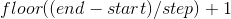 为一维 Tensor. `step` 是 tensor 中两个值之间的差距. 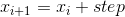

警告：

此功能已被弃用, 以支持 `torch.arange()`.

参数：

*   `start (float)` – 点集合的起始值
*   `end (float)` – 点集合的结束值
*   `step (float)` – 每对相邻点之间的间隔
*   `out (Tensor, 可选)` – 输出结果 `Tensor`


示例：

```py
>>> torch.range(1, 4)

 1
 2
 3
 4
[torch.FloatTensor of size 4]

>>> torch.range(1, 4, 0.5)

 1.0000
 1.5000
 2.0000
 2.5000
 3.0000
 3.5000
 4.0000
[torch.FloatTensor of size 7]

```

```py
torch.zeros(*sizes, out=None) → Tensor
```

返回填充了标量值为 `0` 的 Tensor, 其形状由可变参数 `sizes` 定义.

参数：

*   `sizes (int...)` – 定义输出 Tensor 形状的一组整数.
*   `out (Tensor, 可选)` – 输出结果 Tensor


示例：

```py
>>> torch.zeros(2, 3)

 0  0  0
 0  0  0
[torch.FloatTensor of size 2x3]

>>> torch.zeros(5)

 0
 0
 0
 0
 0
[torch.FloatTensor of size 5]

```

```py
torch.zeros_like(input, out=None) → Tensor
```

返回一个用标量值 `0` 填充的 Tensor, 其大小与 `input` 相同.

参数：

*   `input (Tensor)` – 输入的大小将决定输出的大小.
*   `out (Tensor, 可选)` – 输出结果 Tensor


示例：

```py
>>> input = torch.FloatTensor(2, 3)
>>> torch.zeros_like(input)

 0  0  0
 0  0  0
[torch.FloatTensor of size 2x3]

```

### Indexing, Slicing, Joining, Mutating Ops (索引, 切片, 连接, 换位) 操作

```py
torch.cat(seq, dim=0, out=None) → Tensor
```

在给定维度上对输入的张量序列 `seq` 进行连接操作. 所有张量必须具有相同的形状(在 `cat` 维度中除外) 或为空.

`torch.cat()` 可以看做是 `torch.split()` 和 `torch.chunk()` 的逆操作.

`cat()` 可以通过下面的例子更好地理解.

参数：

*   `seq (_sequence of Tensors_)` – 可以是任何相同类型的 `Tensor` 的 Python 序列.
*   `dim (int, 可选)` – tensors 级联的维数
*   `out (Tensor, 可选)` – 输出参数


示例：

```py
>>> x = torch.randn(2, 3)
>>> x

 0.5983 -0.0341  2.4918
 1.5981 -0.5265 -0.8735
[torch.FloatTensor of size 2x3]

>>> torch.cat((x, x, x), 0)

 0.5983 -0.0341  2.4918
 1.5981 -0.5265 -0.8735
 0.5983 -0.0341  2.4918
 1.5981 -0.5265 -0.8735
 0.5983 -0.0341  2.4918
 1.5981 -0.5265 -0.8735
[torch.FloatTensor of size 6x3]

>>> torch.cat((x, x, x), 1)

 0.5983 -0.0341  2.4918  0.5983 -0.0341  2.4918  0.5983 -0.0341  2.4918
 1.5981 -0.5265 -0.8735  1.5981 -0.5265 -0.8735  1.5981 -0.5265 -0.8735
[torch.FloatTensor of size 2x9]

```

```py
torch.chunk(tensor, chunks, dim=0)
```

在给定维度(轴)上将输入张量进行分块处理.

参数：

*   `tensor (Tensor)` – 待分块的输入张量.
*   `chunks (int)` – 要返回的分块的个数.
*   `dim (int)` – 切分张量所需要沿着的维度.


```py
torch.gather(input, dim, index, out=None) → Tensor
```

沿给定轴 `dim` ,将输入索引张量 `index` 指定位置的值进行聚合.

对一个 3 维张量,输出可以定义为:

```py
out[i][j][k] = input[index[i][j][k]][j][k]  # if dim == 0
out[i][j][k] = input[i][index[i][j][k]][k]  # if dim == 1
out[i][j][k] = input[i][j][index[i][j][k]]  # if dim == 2

```

如果 `input` 是 size 为  且 `dim` = i 的 n 维张量,则 `index` 必须是具有 size 为 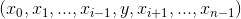 的 n 维张量,其中 y &gt;= 1 ,并且 `out` 将与 `index` 的 size 相同.

参数：

*   `input (Tensor)` – 源张量
*   `dim (int)` – 索引的轴
*   `index (LongTensor)` – 聚合元素的下标
*   `out (Tensor, 可选)` – 目标张量


示例：

```py
>>> t = torch.Tensor([[1,2],[3,4]])
>>> torch.gather(t, 1, torch.LongTensor([[0,0],[1,0]]))
 1  1
 4  3
[torch.FloatTensor of size 2x2]

```

```py
torch.index_select(input, dim, index, out=None) → Tensor
```

沿着指定维度 `dim` 对输入进行切片,取 `index` 中指定的相应项 ( `index` 为一个 `LongTensor` ),然后返回到一个新的张量.

> 返回的张量与原始张量 `Tensor` 有相同的维度(在指定轴上).

注解：

返回的张量不与原始张量共享内存空间.

参数：

*   `input (Tensor)` – 输入张量
*   `dim (int)` – 索引的轴
*   `index (LongTensor)` – 包含索引下标的一维张量
*   `out (Tensor, 可选)` – 输出参数/目标张量


示例：

```py
>>> x = torch.randn(3, 4)
>>> x

 1.2045  2.4084  0.4001  1.1372
 0.5596  1.5677  0.6219 -0.7954
 1.3635 -1.2313 -0.5414 -1.8478
[torch.FloatTensor of size 3x4]

>>> indices = torch.LongTensor([0, 2])
>>> torch.index_select(x, 0, indices)

 1.2045  2.4084  0.4001  1.1372
 1.3635 -1.2313 -0.5414 -1.8478
[torch.FloatTensor of size 2x4]

>>> torch.index_select(x, 1, indices)

 1.2045  0.4001
 0.5596  0.6219
 1.3635 -0.5414
[torch.FloatTensor of size 3x2]

```

```py
torch.masked_select(input, mask, out=None) → Tensor
```

根据掩码张量 `mask` 中的二元值,取输入张量中的指定项 ( `mask` 为一个 `ByteTensor` ),将取值返回到一个新的一维张量.

张量 `mask` 与 `input` 的 shape 或维度不需要相同,但是他们必须是 [broadcastable](notes/broadcasting.html#broadcasting-semantics) .

注解：

返回的张量不与原始张量共享内存空间.

参数：

*   `input (Tensor)` – 输入张量
*   `mask (ByteTensor)` – 掩码张量,包含了二元索引值
*   `out (Tensor, 可选)` – 输出参数/目标张量


示例：

```py
>>> x = torch.randn(3, 4)
>>> x

 1.2045  2.4084  0.4001  1.1372
 0.5596  1.5677  0.6219 -0.7954
 1.3635 -1.2313 -0.5414 -1.8478
[torch.FloatTensor of size 3x4]

>>> mask = x.ge(0.5)
>>> mask

 1  1  0  1
 1  1  1  0
 1  0  0  0
[torch.ByteTensor of size 3x4]

>>> torch.masked_select(x, mask)

 1.2045
 2.4084
 1.1372
 0.5596
 1.5677
 0.6219
 1.3635
[torch.FloatTensor of size 7]

```

```py
torch.nonzero(input, out=None) → LongTensor
```

返回一个包含输入 `input` 中非零元素索引的张量. 输出张量中的每行包含 `input` 中非零元素的索引.

如果输入张量 `input` 有 `n` 维,则输出的索引张量 `out` 的 size 为 `z x n` , 这里 `z` 是输入张量 `input` 中所有非零元素的个数.

参数：

*   `input (Tensor)` – 输入张量/源张量
*   `out (LongTensor, 可选)` – 包含索引值的输出张量


示例：

```py
>>> torch.nonzero(torch.Tensor([1, 1, 1, 0, 1]))

 0
 1
 2
 4
[torch.LongTensor of size 4x1]

>>> torch.nonzero(torch.Tensor([[0.6, 0.0, 0.0, 0.0],
...                             [0.0, 0.4, 0.0, 0.0],
...                             [0.0, 0.0, 1.2, 0.0],
...                             [0.0, 0.0, 0.0,-0.4]]))

 0  0
 1  1
 2  2
 3  3
[torch.LongTensor of size 4x2]

```

```py
torch.split(tensor, split_size, dim=0)
```

将输入张量分割成相等 size 的 chunks (如果可分).

如果沿指定维的张量形状大小不能被 `split_size` 整分, 则最后一个分块会小于其它分块.

参数：

*   `tensor (Tensor)` – 待分割张量.
*   `split_size (int)` – 单个分块的 size 大小.
*   `dim (int)` – 沿着此维进行分割.


```py
torch.squeeze(input, dim=None, out=None)
```

将 `input` 张量 size 中的 `1` 去除并返回.

如果 `input` 的 shape 如  ,那么输出 shape 就为: 

当给定 `dim` 时,那么挤压操作只在给定维度上.例如, `input` 的 shape 为: 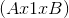 , `squeeze(input, 0)` 将会保持张量不变,只有用 `squeeze(input, 1)` , shape 会变成 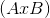 .

注解：

作为上述的一个例外,size 为 1 的一维张量不会改变维度.

注解：

返回张量与输入张量共享内存,所以改变其中一个的内容会改变另一个.

参数：

*   `input (Tensor)` – 输入张量
*   `dim (int, 可选)` – 如果给定 `dim` 时,则 `input` 只会在给定维度执行挤压
*   `out (Tensor, 可选)` – 结果张量


示例：

```py
>>> x = torch.zeros(2,1,2,1,2)
>>> x.size()
(2L, 1L, 2L, 1L, 2L)
>>> y = torch.squeeze(x)
>>> y.size()
(2L, 2L, 2L)
>>> y = torch.squeeze(x, 0)
>>> y.size()
(2L, 1L, 2L, 1L, 2L)
>>> y = torch.squeeze(x, 1)
>>> y.size()
(2L, 2L, 1L, 2L)

```

```py
torch.stack(sequence, dim=0, out=None)
```

沿着一个新维度对输入张量序列进行连接.

序列中所有的张量都应该为相同 size .

参数：

*   `sequence (_Sequence_)` – 待连接的张量序列.
*   `dim (int)` – 插入的维度.必须介于 0 与待连接的张量序列数(包含）之间.


```py
torch.t(input, out=None) → Tensor
```

预期 `input` 为一个矩阵 (2 维张量), 并转置 0, 1 维.

可以被视为函数 `transpose(input, 0, 1)` 的简写函数.

参数：

*   `input (Tensor)` – 输入张量
*   `out (Tensor, 可选)` – 结果张量


示例：

```py
>>> x = torch.randn(2, 3)
>>> x

 0.4834  0.6907  1.3417
-0.1300  0.5295  0.2321
[torch.FloatTensor of size 2x3]

>>> torch.t(x)

 0.4834 -0.1300
 0.6907  0.5295
 1.3417  0.2321
[torch.FloatTensor of size 3x2]

```

```py
torch.take(input, indices) → Tensor
```

在给定的索引处返回一个新的 `Tensor` ,其元素为 `input` . 输入张量被看作是一维张量.结果与索引具有相同的 shape .

参数：

*   `input (Tensor)` – 输入张量
*   `indices (LongTensor)` – 进入 `Tensor` 的索引


示例：

```py
>>> src = torch.Tensor([[4, 3, 5],
...                     [6, 7, 8]])
>>> torch.take(src, torch.LongTensor([0, 2, 5]))
 4
 5
 8
[torch.FloatTensor of size 3]

```

```py
torch.transpose(input, dim0, dim1, out=None) → Tensor
```

返回输入矩阵 `input` 的转置.交换给定维度 `dim0` 和 `dim1` .

`out` 张量与 `input` 张量共享内存,所以改变其中一个会导致另外一个也被修改.

参数：

*   `input (Tensor)` – 输入张量
*   `dim0 (int)` – 转置的第一个维度
*   `dim1 (int)` – 转置的第二个维度


示例：

```py
>>> x = torch.randn(2, 3)
>>> x

 0.5983 -0.0341  2.4918
 1.5981 -0.5265 -0.8735
[torch.FloatTensor of size 2x3]

>>> torch.transpose(x, 0, 1)

 0.5983  1.5981
-0.0341 -0.5265
 2.4918 -0.8735
[torch.FloatTensor of size 3x2]

```

```py
torch.unbind(tensor, dim=0)
```

移除一个张量的维度.

移除指定维后,返回一个元组,包含了沿着指定维切片后的各个切片 (已经没有了移除的维度).

参数：

*   `tensor (Tensor)` – 要执行 unbind 的张量/输入张量.
*   `dim (int)` – 要移除的维度.


```py
torch.unsqueeze(input, dim, out=None)
```

返回在指定位置插入维度 size 为 1 的新张量.

返回张量与输入张量共享内存,所以改变其中一个的内容会改变另一个.

如果 `dim` 为负,则将会被转化  .

参数：

*   `input (Tensor)` – 输入张量
*   `dim (int)` – 插入维度的索引
*   `out (Tensor, 可选)` – 结果张量


示例：

```py
>>> x = torch.Tensor([1, 2, 3, 4])
>>> torch.unsqueeze(x, 0)
 1  2  3  4
[torch.FloatTensor of size 1x4]
>>> torch.unsqueeze(x, 1)
 1
 2
 3
 4
[torch.FloatTensor of size 4x1]

```

## Random sampling (随机采样)

```py
torch.manual_seed(seed)
```

设置生成随机数的种子,并返回一个 `torch._C.Generator` 对象.

参数：`seed (int 或 long)` – 种子.


```py
torch.initial_seed()
```

返回用于生成随机数字的初始种子 (python `long`) .

```py
torch.get_rng_state()
```

以ByteTensor的形式返回随机数发生器的状态.

```py
torch.set_rng_state(new_state)
```

设置随机数发生器的参数.

参数：`new_state (torch.ByteTensor)` – 理想状态


`torch.default_generator = <torch._C.Generator object at 0x28bcc10>`

```py
torch.bernoulli(input, out=None) → Tensor
```

从伯努利分布中抽取二进制随机数 (0 或 1).

The `input` 张量包含用于抽取二进制随机数的概率. 因此, `input` 中的所有值必须在这个范围内: 

根据 `input` 张量第 `i` 个概率值, 输出张量的第 `i` 个元素将取值为1.

返回的 `out` 张量的值只有 0 或者 1 并且大小与 `input` 张量相同.

参数：

*   `input (Tensor)` – 伯努利分布的概率值
*   `out (Tensor, 可选)` – 输出张量


示例：

```py
>>> a = torch.Tensor(3, 3).uniform_(0, 1) # generate a uniform random matrix with range [0, 1]
>>> a

 0.7544  0.8140  0.9842
 0.5282  0.0595  0.6445
 0.1925  0.9553  0.9732
[torch.FloatTensor of size 3x3]

>>> torch.bernoulli(a)

 1  1  1
 0  0  1
 0  1  1
[torch.FloatTensor of size 3x3]

>>> a = torch.ones(3, 3) # probability of drawing "1" is 1
>>> torch.bernoulli(a)

 1  1  1
 1  1  1
 1  1  1
[torch.FloatTensor of size 3x3]

>>> a = torch.zeros(3, 3) # probability of drawing "1" is 0
>>> torch.bernoulli(a)

 0  0  0
 0  0  0
 0  0  0
[torch.FloatTensor of size 3x3]

```

```py
torch.multinomial(input, num_samples, replacement=False, out=None) → LongTensor
```

返回一个张量, 其中每一行包含在 `input` 张量对应行中多项式分布取样的 `num_samples` 索引.

注解：

`input` 的每行值不需要总和为 1 (我们只使用这些值作为权重), 但必须是非负且非零和的.

取样时从左向右排列(第一个样本在第一列).

如果 `input` 是一个向量, 则 `out` 是一个大小为 `num_samples` 的向量.

如果 `input` 是一个 `m` 行的矩阵, 则 `out` 是一个 `m × n` 的矩阵.

如果参数 `replacement` 是 `True`, 则可重复取样. 否则, 样本在每行不能被重复取样.

参数 `num_samples` 必须小于 `input` 长度 (如果是一个矩阵, 则是 `input` 的列数).

参数：

*   `input (Tensor)` – 包含概率值的张量
*   `num_samples (int)` – 抽取的样本数
*   `replacement (bool, 可选)` – 是否重复抽取样本
*   `out (Tensor, 可选)` – 输出 `Tensor`


示例：

```py
>>> weights = torch.Tensor([0, 10, 3, 0]) # create a Tensor of weights
>>> torch.multinomial(weights, 4)

 1
 2
 0
 0
[torch.LongTensor of size 4]

>>> torch.multinomial(weights, 4, replacement=True)

 1
 2
 1
 2
[torch.LongTensor of size 4]

```

```py
torch.normal()
```

```py
torch.normal(means, std, out=None)
```

返回一个随机数张量, 随机数从给定平均值和标准差的离散正态分布中抽取.

参数 `means` 是一个包含每个输出元素的正态分布均值的张量.

参数 `std` 是一个包含每个输出元素的正态分布标准差的张量.

其中 `means` 和 `std` 的形状不需要匹配, 但是每个张量中的元素总数需要相同.

注解：

当形状不匹配时, `means` 的形状将作为返回输出张量的形状.

参数：

*   `means (Tensor)` – 均值
*   `std (Tensor)` – 标准差
*   `out (Tensor, 可选)` – 输出张量


示例：

```py
torch.normal(means=torch.arange(1, 11), std=torch.arange(1, 0, -0.1))

 1.5104
 1.6955
 2.4895
 4.9185
 4.9895
 6.9155
 7.3683
 8.1836
 8.7164
 9.8916
[torch.FloatTensor of size 10]

```

```py
torch.normal(mean=0.0, std, out=None)
```

功能与上面函数类似, 但所有被抽取的元素共享均值.

参数：

*   `means (float, 可选)` – 所有分布的均值
*   `std (Tensor)` – 每个元素标准差的张量
*   `out (Tensor, 可选)` – 输出张量


示例：

```py
>>> torch.normal(mean=0.5, std=torch.arange(1, 6))

 0.5723
 0.0871
 -0.3783
 -2.5689
 10.7893
[torch.FloatTensor of size 5]

```

```py
torch.normal(means, std=1.0, out=None)
```

功能与上面函数类似, 但所有被抽取的元素共享标准差.

参数：

*   `means (Tensor)` – 每个元素均值的张量
*   `std (float, 可选)` – 所有分布的标准差
*   `out (Tensor, 可选)` – 输出张量


示例：

```py
>>> torch.normal(means=torch.arange(1, 6))

 1.1681
 2.8884
 3.7718
 2.5616
 4.2500
[torch.FloatTensor of size 5]

```

```py
torch.rand(*sizes, out=None) → Tensor
```

在区间 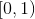 中, 返回一个填充了均匀分布的随机数的张量.

这个张量的形状由可变参数 `sizes` 来定义.

参数：

*   `sizes (int...)` – 定义输出张量形状的整数集.
*   `out (Tensor, 可选)` – 结果张量


示例：

```py
>>> torch.rand(4)

 0.9193
 0.3347
 0.3232
 0.7715
[torch.FloatTensor of size 4]

>>> torch.rand(2, 3)

 0.5010  0.5140  0.0719
 0.1435  0.5636  0.0538
[torch.FloatTensor of size 2x3]

```

```py
torch.randn(*sizes, out=None) → Tensor
```

返回一个从正态分布中填充随机数的张量, 其均值为 0 , 方差为 1 .

这个张量的形状被可变参数 `sizes` 定义.

参数：

*   `sizes (int...)` – 定义输出张量形状的整数集.
*   `out (Tensor, 可选)` – 结果张量


示例：

```py
>>> torch.randn(4)

-0.1145
 0.0094
-1.1717
 0.9846
[torch.FloatTensor of size 4]

>>> torch.randn(2, 3)

 1.4339  0.3351 -1.0999
 1.5458 -0.9643 -0.3558
[torch.FloatTensor of size 2x3]

```

```py
torch.randperm(n, out=None) → LongTensor
```

返回一个从 `0` to `n - 1` 的整数的随机排列.

参数：`n (int)` – 上限 (唯一的)


示例：

```py
>>> torch.randperm(4)

 2
 1
 3
 0
[torch.LongTensor of size 4]

```

### In-place random sampling (直接随机采样)

在Tensors模块上还定义了许多 in-place 随机采样函数,可以点击参考它们的文档:

*   `torch.Tensor.bernoulli_()`](tensors.html#torch.Tensor.bernoulli_ "torch.Tensor.bernoulli_") - 是 [`torch.bernoulli()` 的 in-place 版本
*   [`torch.Tensor.cauchy_()`](tensors.html#torch.Tensor.cauchy_ "torch.Tensor.cauchy_") - 从柯西分布中抽取数字
*   [`torch.Tensor.exponential_()`](tensors.html#torch.Tensor.exponential_ "torch.Tensor.exponential_") - 从指数分布中抽取数字
*   [`torch.Tensor.geometric_()`](tensors.html#torch.Tensor.geometric_ "torch.Tensor.geometric_") - 从几何分布中抽取元素
*   [`torch.Tensor.log_normal_()`](tensors.html#torch.Tensor.log_normal_ "torch.Tensor.log_normal_") - 对数正态分布中的样本
*   `torch.Tensor.normal_()`](tensors.html#torch.Tensor.normal_ "torch.Tensor.normal_") - 是 [`torch.normal()` 的 in-place 版本
*   [`torch.Tensor.random_()`](tensors.html#torch.Tensor.random_ "torch.Tensor.random_") - 离散均匀分布中采样的数字
*   [`torch.Tensor.uniform_()`](tensors.html#torch.Tensor.uniform_ "torch.Tensor.uniform_") - 正态分布中采样的数字

## Serialization (序列化)

```py
torch.save(obj, f, pickle_module=<module 'cPickle' from '/usr/lib64/python2.7/lib-dynload/cPickle.so'>, pickle_protocol=2)
```

将一个对象保存到一个磁盘文件中.

另见: [保存模型的推荐方法](notes/serialization.html#recommend-saving-models)

参数: obj: 要保存的对象 f: 类文件对象 (必须实现返回文件描述符的 fileno 方法) 或包含文件名的字符串 pickle_module: 用于 pickling 元数据和对象的模块 pickle_protocol: 可以指定来覆盖默认协议

```py
torch.load(f, map_location=None, pickle_module=<module 'cPickle' from '/usr/lib64/python2.7/lib-dynload/cPickle.so'>)
```

从磁盘文件中加载一个用 `torch.save()` 保存的对象.

| Func: | `torch.load` 使用 Python 的解封 (unpickling) 设施, 但特殊对待张量下的存储 (storages). |
| --- | --- |

它们首先在 CPU 上反序列化, 然后移动到所保存的设备上. 如果这个过程失败了 (例如, 因为运行时的系统没有确定的设备), 将会抛出异常. 然而, 使用 map_location 参数, 存储可以被动态地重新映射到另一组设备上.

如果 map_location 是可调用对象, 则对于每个序列化存储, 它都将以两个参数调用一次: storage 和 location. 参数 storage 是驻留在 CPU 上的存储的初始反序列化. 每个序列化后的存储都有一个与之关联的位置标签, 它标识了保存它的设备, 而此标签是传递给 map_location 的第二个参数. 对于 CPU 张量, 内建的位置标签是 ‘cpu’, 对于 CUDA 张量, 内建的位置标签是 ‘cuda:device_id’ (例如 ‘cuda:2’). map_location 要么返回 None , 要么返回一个存储. 如果 map_location 返回存储, 它将用作已移动到正确设备上的, 最终反序列化的对象. 否则, 如果没有指明 map_location, 即返回 None, `torch.load` 会回落到默认的行为.

如果 map_location 是一个字典, 它用于将出现在文件 (键) 中的位置标签, 重新映射到另一个位置标签, 它出现在值中并指明在哪里存放存储.

用户扩展可以使用 register_package 来注册他们自己的位置标签, 以及标记和反序列化方法.

参数: f: 一个类文件对象 (必须实现返回文件描述符的 fileno, 以及 seek 方法), 或者包含文件名的字符串. map_location: 一个函数或者一个指明如何重新映射存储位置的字典 pickle_module: 用于解封 (unpickling) 元数据和对象的模块 (必须匹配用于序列化文件的 pickle_module) 示例:

```py
>>> torch.load('tensors.pt')
# Load all tensors onto the CPU
>>> torch.load('tensors.pt', map_location=lambda storage, loc: storage)
# Load all tensors onto GPU 1
>>> torch.load('tensors.pt', map_location=lambda storage, loc: storage.cuda(1))
# Map tensors from GPU 1 to GPU 0
>>> torch.load('tensors.pt', map_location={'cuda:1':'cuda:0'})

```

## Parallelism (并行化)

```py
torch.get_num_threads() → int
```

获得 OpenMP 并行化操作的线程数目

```py
torch.set_num_threads(int)
```

设置 OpenMP 并行化操作的线程数目

## Math operations (数学操作)

### Pointwise Ops (逐点操作)

```py
torch.abs(input, out=None) → Tensor
```

计算给定 `input` 张量的元素的绝对值.

示例：

```py
>>> torch.abs(torch.FloatTensor([-1, -2, 3]))
FloatTensor([1, 2, 3])

```

```py
torch.acos(input, out=None) → Tensor
```

用 `input` 元素的反余弦返回一个新的张量.

参数：

*   `input (Tensor)` – the input `Tensor`
*   `out (Tensor, 可选)` – The result `Tensor`


示例：

```py
>>> a = torch.randn(4)
>>> a

-0.6366
 0.2718
 0.4469
 1.3122
[torch.FloatTensor of size 4]

>>> torch.acos(a)
 2.2608
 1.2956
 1.1075
 nan
[torch.FloatTensor of size 4]

```

```py
torch.add()
```

```py
torch.add(input, value, out=None)
```

将标量值 `value` 添加到输入张量 attr:`input` 的每个元素并返回一个新的结果张量.


如果输入张量 `input` 是 FloatTensor 或者 DoubleTensor 类型, 则 `value` 必须为实数, 否则为整数.

参数：

*   `input (Tensor)` – 输入 `Tensor`
*   `value (Number)` – 要添加到 `input` 每个元素的数
*   `out (Tensor, 可选)` – 结果 `Tensor`


示例：

```py
>>> a = torch.randn(4)
>>> a

 0.4050
-1.2227
 1.8688
-0.4185
[torch.FloatTensor of size 4]

>>> torch.add(a, 20)

 20.4050
 18.7773
 21.8688
 19.5815
[torch.FloatTensor of size 4]

```

```py
torch.add(input, value=1, other, out=None)
```

张量 `other` 的每个元素乘以标量值 `value` 并加到张量 `input` 上, 返回生成的张量 `out` .

张量 `input` 的形状与张量 `other` 的形状必须 [broadcastable](notes/broadcasting.html#broadcasting-semantics).

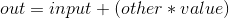

如果张量 `other` 是 FloatTensor 或者 DoubleTensor 类型, 则 `value` 必须为实数, 否则为整数.

参数：

*   `input (Tensor)` – 第一个输入 `Tensor`
*   `value (Number)` – 张量 `other` 的标量乘数
*   `other (Tensor)` – 第二个输入 `Tensor`
*   `out (Tensor, 可选)` – 结果 `Tensor`


示例：

```py
>>> import torch
>>> a = torch.randn(4)
>>> a

-0.9310
 2.0330
 0.0852
-0.2941
[torch.FloatTensor of size 4]

>>> b = torch.randn(2, 2)
>>> b

 1.0663  0.2544
-0.1513  0.0749
[torch.FloatTensor of size 2x2]

>>> torch.add(a, 10, b)
 9.7322
 4.5770
-1.4279
 0.4552
[torch.FloatTensor of size 4]

```

```py
torch.addcdiv(tensor, value=1, tensor1, tensor2, out=None) → Tensor
```

将张量 `tensor1` 逐元素除以张量 `tensor2`, 然后乘以标量值 `value` 并加到张量 `tensor` 上.

张量 `tensor`, 张量 `tensor1`, 张量 `tensor2` 的形状必须 [broadcastable](notes/broadcasting.html#broadcasting-semantics).

对于类型为 `FloatTensor` 或者 `DoubleTensor` 的张量输入, `value` 必须为实数, 否则为整数.

参数：

*   `tensor (Tensor)` – 张量, 对 `tensor1 ./ tensor2` 进行相加
*   `value (Number, 可选)` – 标量, 对 `tensor1 ./ tensor2` 进行相乘
*   `tensor1 (Tensor)` – 分子张量, 即作为被除数
*   `tensor2 (Tensor)` – 分母张量, 即作为除数
*   `out (Tensor, 可选)` – 输出张量


示例：

```py
>>> t = torch.randn(2, 3)
>>> t1 = torch.randn(1, 6)
>>> t2 = torch.randn(6, 1)
>>> torch.addcdiv(t, 0.1, t1, t2)

 0.0122 -0.0188 -0.2354
 0.7396 -1.5721  1.2878
[torch.FloatTensor of size 2x3]

```

```py
torch.addcmul(tensor, value=1, tensor1, tensor2, out=None) → Tensor
```

将张量 `tensor1` 逐元素与张量 `tensor2` 相乘, 然后乘以标量值 `value` 并加到张量 `tensor` 上.

张量 `tensor`, 张量 `tensor1`, 张量 `tensor2` 的形状必须 [broadcastable](notes/broadcasting.html#broadcasting-semantics).

对于类型为 `FloatTensor` 或者 `DoubleTensor` 的张量输入, `value` 必须为实数, 否则为整数. :param tensor: 张量, 对 `tensor1 .* tensor2` 进行相加 :type tensor: Tensor :param value: 标量, 对 `tensor1 .* tensor2` 进行相乘 :type value: Number, 可选 :param tensor1: 张量, 作为乘子1 :type tensor1: Tensor :param tensor2: 张量, 作为乘子2 :type tensor2: Tensor :param out: 输出张量 :type out: Tensor, 可选

示例：

```py
>>> t = torch.randn(2, 3)
>>> t1 = torch.randn(1, 6)
>>> t2 = torch.randn(6, 1)
>>> torch.addcmul(t, 0.1, t1, t2)

 0.0122 -0.0188 -0.2354
 0.7396 -1.5721  1.2878
[torch.FloatTensor of size 2x3]

```

```py
torch.asin(input, out=None) → Tensor
```

返回一个新的 `Tensor` , 其元素为张量 `input` 的每个元素的反正弦.

参数：

*   `input (Tensor)` – 输入 `Tensor`
*   `out (Tensor, 可选)` – 结果 `Tensor`


示例：

```py
>>> a = torch.randn(4)
>>> a
-0.6366
 0.2718
 0.4469
 1.3122
[torch.FloatTensor of size 4]

>>> torch.asin(a)
-0.6900
 0.2752
 0.4633
 nan
[torch.FloatTensor of size 4]

```

```py
torch.atan(input, out=None) → Tensor
```

返回一个新的 `Tensor` , 其元素为张量 `input` 的每个元素的反正切.

参数：

*   `input (Tensor)` – 输入 `Tensor`
*   `out (Tensor, 可选)` – 结果 `Tensor`


示例：

```py
>>> a = torch.randn(4)
>>> a
-0.6366
 0.2718
 0.4469
 1.3122
[torch.FloatTensor of size 4]

>>> torch.atan(a)
-0.5669
 0.2653
 0.4203
 0.9196
[torch.FloatTensor of size 4]

```

```py
torch.atan2(input1, input2, out=None) → Tensor
```

返回一个新的张量 `Tensor` , 其元素是输入张量 `input1` 和输入张量 `input2` 元素的反正切.

输入张量 `input1` 的形状和输入张量 `input2` 的形状必须可 [broadcastable](notes/broadcasting.html#broadcasting-semantics).

参数：

*   `input1 (Tensor)` – 第一个输入 `Tensor`
*   `input2 (Tensor)` – 第二个输入 `Tensor`
*   `out (Tensor, 可选)` – 结果 `Tensor`


示例：

```py
>>> a = torch.randn(4)
>>> a
-0.6366
 0.2718
 0.4469
 1.3122
[torch.FloatTensor of size 4]

>>> torch.atan2(a, torch.randn(4))
-2.4167
 2.9755
 0.9363
 1.6613
[torch.FloatTensor of size 4]

```

```py
torch.ceil(input, out=None) → Tensor
```

返回一个新的张量 `Tensor` , 其元素是张量 `input` 的元素向上取整(取不小于每个元素的最小整数).

参数：

*   `input (Tensor)` – 输入 `Tensor`
*   `out (Tensor, 可选)` – 结果 `Tensor`


示例：

```py
>>> a = torch.randn(4)
>>> a

 1.3869
 0.3912
-0.8634
-0.5468
[torch.FloatTensor of size 4]

>>> torch.ceil(a)

 2
 1
-0
-0
[torch.FloatTensor of size 4]

```

```py
torch.clamp(input, min, max, out=None) → Tensor
```

将输入张量 `input` 所有元素限制在区间 `[min, max]` 中并返回一个结果张量.

```py
      | min, if x_i < min
y_i = | x_i, if min <= x_i <= max
      | max, if x_i > max

```

如果输入张量 `input` 的类型 `FloatTensor` 或者 `DoubleTensor`, 那么参数 `min` 和 `max` 必须为实数, 否则为整数.

参数：

*   `input (Tensor)` – 输入 `Tensor`
*   `min (Number)` – 限制范围下限
*   `max (Number)` – 限制范围上限
*   `out (Tensor, 可选)` – 结果 `Tensor`


示例：

```py
>>> a = torch.randn(4)
>>> a

 1.3869
 0.3912
-0.8634
-0.5468
[torch.FloatTensor of size 4]

>>> torch.clamp(a, min=-0.5, max=0.5)

 0.5000
 0.3912
-0.5000
-0.5000
[torch.FloatTensor of size 4]

```

```py
torch.clamp(input, *, min, out=None) → Tensor
```

张量 `input` 的所有元素值大于或者等于 `min`.

如果张量 `input` 的类型是 `FloatTensor` 或者 `DoubleTensor`, 则 `value` 必须是实数, 否则应该是整数.

参数：

*   `input (Tensor)` – 输入 `Tensor`
*   `value (Number)` – 输出中每个元素的最小值
*   `out (Tensor, 可选)` – 结果 `Tensor`


示例：

```py
>>> a = torch.randn(4)
>>> a

 1.3869
 0.3912
-0.8634
-0.5468
[torch.FloatTensor of size 4]

>>> torch.clamp(a, min=0.5)

 1.3869
 0.5000
 0.5000
 0.5000
[torch.FloatTensor of size 4]

```

```py
torch.clamp(input, *, max, out=None) → Tensor
```

张量 `input` 的所有元素值小于或者等于 `max`.

如果张量 `input` 的类型是 `FloatTensor` 或者 `DoubleTensor`, 则 `value` 必须是实数, 否则应该是整数.

参数：

*   `input (Tensor)` – 输入 `Tensor`
*   `value (Number)` – 输出中每个元素的最大值
*   `out (Tensor, 可选)` – 结果 `Tensor`


示例：

```py
>>> a = torch.randn(4)
>>> a

 1.3869
 0.3912
-0.8634
-0.5468
[torch.FloatTensor of size 4]

>>> torch.clamp(a, max=0.5)

 0.5000
 0.3912
-0.8634
-0.5468
[torch.FloatTensor of size 4]

```

```py
torch.cos(input, out=None) → Tensor
```

返回一个新的张量 `Tensor` , 其元素是张量 `input` 每个元素的余弦.

参数：

*   `input (Tensor)` – 输入 `Tensor`
*   `out (Tensor, 可选)` – 结果 `Tensor`


示例：

```py
>>> a = torch.randn(4)
>>> a
-0.6366
 0.2718
 0.4469
 1.3122
[torch.FloatTensor of size 4]

>>> torch.cos(a)
 0.8041
 0.9633
 0.9018
 0.2557
[torch.FloatTensor of size 4]

```

```py
torch.cosh(input, out=None) → Tensor
```

返回一个新的张量 `Tensor` , 其元素是张量 `input` 每个元素的双曲余弦.

参数：

*   `input (Tensor)` – 输入 `Tensor`
*   `out (Tensor, 可选)` – 结果 `Tensor`


示例：

```py
>>> a = torch.randn(4)
>>> a
-0.6366
 0.2718
 0.4469
 1.3122
[torch.FloatTensor of size 4]

>>> torch.cosh(a)
 1.2095
 1.0372
 1.1015
 1.9917
[torch.FloatTensor of size 4]

```

```py
torch.div()
```

```py
torch.div(input, value, out=None)
```

将张量 `input` 的元素逐一除以标量值 `value` , 其结果作为一个新的张量返回.

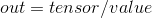

如果张量 `input` 的类型是 `FloatTensor` 或者 `DoubleTensor`, 则标量值 `value` 必须是实数, 否则应该是整数.

参数：

*   `input (Tensor)` – 输入 `Tensor`
*   `value (Number)` – 除数, 被张量 `input` 的元素除
*   `out (Tensor, 可选)` – 结果 `Tensor`


示例：

```py
>>> a = torch.randn(5)
>>> a

-0.6147
-1.1237
-0.1604
-0.6853
 0.1063
[torch.FloatTensor of size 5]

>>> torch.div(a, 0.5)

-1.2294
-2.2474
-0.3208
-1.3706
 0.2126
[torch.FloatTensor of size 5]

```

```py
torch.div(input, other, out=None)
```

张量 `input` 的元素与张量 `other` 的元素逐一相除. 返回一个新的结果张量 `out` . 张量 `input` 与张量 `other` 的形状必须可 [broadcastable](notes/broadcasting.html#broadcasting-semantics).

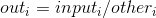

参数：

*   `input (Tensor)` – 分子 `Tensor` (被除数)
*   `other (Tensor)` – 分母 `Tensor` (除数)
*   `out (Tensor, 可选)` – 结果 `Tensor`


示例：

```py
>>> a = torch.randn(4,4)
>>> a

-0.1810  0.4017  0.2863 -0.1013
 0.6183  2.0696  0.9012 -1.5933
 0.5679  0.4743 -0.0117 -0.1266
-0.1213  0.9629  0.2682  1.5968
[torch.FloatTensor of size 4x4]

>>> b = torch.randn(8, 2)
>>> b

 0.8774  0.7650
 0.8866  1.4805
-0.6490  1.1172
 1.4259 -0.8146
 1.4633 -0.1228
 0.4643 -0.6029
 0.3492  1.5270
 1.6103 -0.6291
[torch.FloatTensor of size 8x2]

>>> torch.div(a, b)

-0.2062  0.5251  0.3229 -0.0684
-0.9528  1.8525  0.6320  1.9559
 0.3881 -3.8625 -0.0253  0.2099
-0.3473  0.6306  0.1666 -2.5381
[torch.FloatTensor of size 4x4]

```

```py
torch.erf(tensor, out=None) → Tensor
```

计算每个元素的误差函数.

示例：

```py
>>> torch.erf(torch.Tensor([0, -1., 10.]))
torch.FloatTensor([0., -0.8427, 1.])

```

```py
torch.erfinv(tensor, out=None) → Tensor
```

计算每个元素的反向误差函数.

示例：

```py
>>> torch.erfinv(torch.Tensor([0, 0.5., -1.]))
torch.FloatTensor([0., 0.4769, -inf])

```

```py
torch.exp(tensor, out=None) → Tensor
```

计算每个元素的指数.

示例：

```py
>>> torch.exp(torch.Tensor([0, math.log(2)]))
torch.FloatTensor([1, 2])

```

```py
torch.floor(input, out=None) → Tensor
```

返回一个新的张量 `Tensor` , 其元素是张量 `input` 的元素向下取整(取不大于每个元素的最大整数).

参数：

*   `input (Tensor)` – 输入 `Tensor`
*   `out (Tensor, 可选)` – 结果 `Tensor`


示例：

```py
>>> a = torch.randn(4)
>>> a

 1.3869
 0.3912
-0.8634
-0.5468
[torch.FloatTensor of size 4]

>>> torch.floor(a)

 1
 0
-1
-1
[torch.FloatTensor of size 4]

```

```py
torch.fmod(input, divisor, out=None) → Tensor
```

计算除法余数.

被除数和除数可能同时含有整数和浮点数. 这时余数的正负与被除数 `tensor` 相同.

当除数 `divisor` 是一个张量时r, 张量 `input` 和张量 `divisor` 的形状必须可 [broadcastable](notes/broadcasting.html#broadcasting-semantics).

参数：

*   `input (Tensor)` – 被除数
*   `divisor (Tensor 或 float)` – 除数. 可能是一个数或者是一个与被除数相同形状的张量.
*   `out (Tensor, 可选)` – 输出张量


示例：

```py
>>> torch.fmod(torch.Tensor([-3, -2, -1, 1, 2, 3]), 2)
torch.FloatTensor([-1, -0, -1, 1, 0, 1])
>>> torch.fmod(torch.Tensor([1, 2, 3, 4, 5]), 1.5)
torch.FloatTensor([1.0, 0.5, 0.0, 1.0, 0.5])

```

See also

`torch.remainder()`, 其计算等价于 Python’s `%` 操作符的元素余数

```py
torch.frac(tensor, out=None) → Tensor
```

计算张量 `tensor` 每个元素的分数部分.

示例：

```py
>>> torch.frac(torch.Tensor([1, 2.5, -3.2])
torch.FloatTensor([0, 0.5, -0.2])

```

```py
torch.lerp(start, end, weight, out=None)
```

基于标量值 `weight`: , 在张量 `start` 与张量 `end` 之间做线性插值 并返回结果张量 `out` .

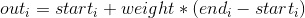

张量 `start` 和张量 `end` 的形状必须可 [broadcastable](notes/broadcasting.html#broadcasting-semantics).

参数：

*   `start (Tensor)` – 起始点 `Tensor`
*   `end (Tensor)` – 终点 `Tensor`
*   `weight (float)` – 插值公式的权重
*   `out (Tensor, 可选)` – 结果 `Tensor`


示例：

```py
>>> start = torch.arange(1, 5)
>>> end = torch.Tensor(4).fill_(10)
>>> start

 1
 2
 3
 4
[torch.FloatTensor of size 4]

>>> end

 10
 10
 10
 10
[torch.FloatTensor of size 4]

>>> torch.lerp(start, end, 0.5)

 5.5000
 6.0000
 6.5000
 7.0000
[torch.FloatTensor of size 4]

```

```py
torch.log(input, out=None) → Tensor
```

返回一个新的张量 `Tensor` , 其元素是张量 `input` 所有元素的自然对数.

参数：

*   `input (Tensor)` – 输入 `Tensor`
*   `out (Tensor, 可选)` – 结果 `Tensor`


示例：

```py
>>> a = torch.randn(5)
>>> a

-0.4183
 0.3722
-0.3091
 0.4149
 0.5857
[torch.FloatTensor of size 5]

>>> torch.log(a)

 nan
-0.9883
 nan
-0.8797
-0.5349
[torch.FloatTensor of size 5]

```

```py
torch.log1p(input, out=None) → Tensor
```

返回一个新的张量 `Tensor` , 其元素是(1 + `input`) 的自然对数.


注解：

对于较小的张量 `input` 的值, 此函数比 `torch.log()` 更精确.

参数：

*   `input (Tensor)` – 输入 `Tensor`
*   `out (Tensor, 可选)` – 结果 `Tensor`


示例：

```py
>>> a = torch.randn(5)
>>> a

-0.4183
 0.3722
-0.3091
 0.4149
 0.5857
[torch.FloatTensor of size 5]

>>> torch.log1p(a)

-0.5418
 0.3164
-0.3697
 0.3471
 0.4611
[torch.FloatTensor of size 5]

```

```py
torch.mul()
```

```py
torch.mul(input, value, out=None)
```

将输入张量 `input` 的每个元素与标量值 `value` 相乘并返回一个新的结果张量.

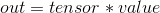

如果张量 `input` 的类型为 `FloatTensor` or `DoubleTensor`, 则 `value` 应该是实数, 否则为整数.

参数：

*   `input (Tensor)` – 输入 `Tensor`
*   `value (Number)` – 与张量 `input` 每个元素相乘的数
*   `out (Tensor, 可选)` – 结果 `Tensor`


示例：

```py
>>> a = torch.randn(3)
>>> a

-0.9374
-0.5254
-0.6069
[torch.FloatTensor of size 3]

>>> torch.mul(a, 100)

-93.7411
-52.5374
-60.6908
[torch.FloatTensor of size 3]

```

```py
torch.mul(input, other, out=None)
```

张量 `input` 的元素与张量 `other` 的元素逐一相乘. 其结果作为一个新的张量返回.

张量 `input` 和张量 `other` 的形状必须可 [broadcastable](notes/broadcasting.html#broadcasting-semantics).


参数：

*   `input (Tensor)` – 第一个乘数 `Tensor`
*   `other (Tensor)` – 第二个乘数 `Tensor`
*   `out (Tensor, 可选)` – 结果 `Tensor`


示例：

```py
>>> a = torch.randn(4,4)
>>> a

-0.7280  0.0598 -1.4327 -0.5825
-0.1427 -0.0690  0.0821 -0.3270
-0.9241  0.5110  0.4070 -1.1188
-0.8308  0.7426 -0.6240 -1.1582
[torch.FloatTensor of size 4x4]

>>> b = torch.randn(2, 8)
>>> b

 0.0430 -1.0775  0.6015  1.1647 -0.6549  0.0308 -0.1670  1.0742
-1.2593  0.0292 -0.0849  0.4530  1.2404 -0.4659 -0.1840  0.5974
[torch.FloatTensor of size 2x8]

>>> torch.mul(a, b)

-0.0313 -0.0645 -0.8618 -0.6784
 0.0934 -0.0021 -0.0137 -0.3513
 1.1638  0.0149 -0.0346 -0.5068
-1.0304 -0.3460  0.1148 -0.6919
[torch.FloatTensor of size 4x4]

```

```py
torch.neg(input, out=None) → Tensor
```

返回一个新的张量 `Tensor` , 其元素是张量 `input` 的元素的负值.


参数：

*   `input (Tensor)` – 输入 `Tensor`
*   `out (Tensor, 可选)` – 结果 `Tensor`


示例：

```py
>>> a = torch.randn(5)
>>> a

-0.4430
 1.1690
-0.8836
-0.4565
 0.2968
[torch.FloatTensor of size 5]

>>> torch.neg(a)

 0.4430
-1.1690
 0.8836
 0.4565
-0.2968
[torch.FloatTensor of size 5]

```

```py
torch.pow()
```

```py
torch.pow(input, exponent, out=None)
```

对输入张量 `input` 按元素求 `exponent` 次幂值并返回结果张量(其值作为结果张量的元素).

幂值 `exponent` 可以是一个单一的浮点数 `float` 或者是一个与张量 `input` 有相同元素数的张量 `Tensor` .

当指数 `exponent` 是一个标量时, 执行操作:


当指数 `exponent` 是一个张量, 执行操作:

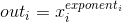

当幂值 `exponent` 是一个张量, 张量 `input` 和张量 `exponent` 的形状必须可 [broadcastable](notes/broadcasting.html#broadcasting-semantics).

参数：

*   `input (Tensor)` – 输入 `Tensor`
*   `exponent (float 或 Tensor)` – 指数
*   `out (Tensor, 可选)` – 结果 `Tensor`


示例：

```py
>>> a = torch.randn(4)
>>> a

-0.5274
-0.8232
-2.1128
 1.7558
[torch.FloatTensor of size 4]

>>> torch.pow(a, 2)

 0.2781
 0.6776
 4.4640
 3.0829
[torch.FloatTensor of size 4]

>>> exp = torch.arange(1, 5)
>>> a = torch.arange(1, 5)
>>> a

 1
 2
 3
 4
[torch.FloatTensor of size 4]

>>> exp

 1
 2
 3
 4
[torch.FloatTensor of size 4]

>>> torch.pow(a, exp)

 1
 4
 27
 256
[torch.FloatTensor of size 4]

```

```py
torch.pow(base, input, out=None)
```

`base` 是一个标量浮点值, `input` 是一个张量. 返回的张量 `out` 的形状与张量 `input` 的形状相同.

执行操作:


参数：

*   `base (float)` – 幂运算的底数
*   `input (Tensor)` – 指数
*   `out (Tensor, 可选)` – 结果 `Tensor`


示例：

```py
>>> exp = torch.arange(1, 5)
>>> base = 2
>>> torch.pow(base, exp)

 2
 4
 8
 16
[torch.FloatTensor of size 4]

```

```py
torch.reciprocal(input, out=None) → Tensor
```

返回一个新的 `Tensor` , 其元素是张量 `input` 元素的倒数, i.e. 

参数：

*   `input (Tensor)` – 输入 `Tensor`
*   `out (Tensor, 可选)` – 结果 `Tensor`


示例：

```py
>>> a = torch.randn(4)
>>> a

 1.3869
 0.3912
-0.8634
-0.5468
[torch.FloatTensor of size 4]

>>> torch.reciprocal(a)

 0.7210
 2.5565
-1.1583
-1.8289
[torch.FloatTensor of size 4]

```

```py
torch.remainder(input, divisor, out=None) → Tensor
```

计算元素的除法的余数.

除数与被除数可能同时包含整数或浮点数. 余数与除数有相同的符号.

当除数 `divisor` 是一个张量, 张量 `input` 的形状和张量 `divisor` 得形状必须可 [broadcastable](notes/broadcasting.html#broadcasting-semantics).

参数：

*   `input (Tensor)` – 被除数
*   `divisor (Tensor 或 float)` – 除数. 可能是一个数或者可能是一个与被除数大小相同的张量
*   `out (Tensor, 可选)` – 输出张量


示例：

```py
>>> torch.remainder(torch.Tensor([-3, -2, -1, 1, 2, 3]), 2)
torch.FloatTensor([1, 0, 1, 1, 0, 1])
>>> torch.remainder(torch.Tensor([1, 2, 3, 4, 5]), 1.5)
torch.FloatTensor([1.0, 0.5, 0.0, 1.0, 0.5])

```

See also

`torch.fmod()` 同样计算除法余数, 等效于C库函数中的 `fmod()`

```py
torch.round(input, out=None) → Tensor
```

返回一个新的张量 `Tensor` , 其元素是输入张量的元素四舍五入到最近的整数.

参数：

*   `input (Tensor)` – 输入 `Tensor`
*   `out (Tensor, 可选)` – 结果 `Tensor`


示例：

```py
>>> a = torch.randn(4)
>>> a

 1.2290
 1.3409
-0.5662
-0.0899
[torch.FloatTensor of size 4]

>>> torch.round(a)

 1
 1
-1
-0
[torch.FloatTensor of size 4]

```

```py
torch.rsqrt(input, out=None) → Tensor
```

返回一个新的张量 `Tensor` , 其元素是张量 `input` 元素的平方根的倒数.

参数：

*   `input (Tensor)` – 输入 `Tensor`
*   `out (Tensor, 可选)` – 结果 `Tensor`


示例：

```py
>>> a = torch.randn(4)
>>> a

 1.2290
 1.3409
-0.5662
-0.0899
[torch.FloatTensor of size 4]

>>> torch.rsqrt(a)

 0.9020
 0.8636
 nan
 nan
[torch.FloatTensor of size 4]

```

```py
torch.sigmoid(input, out=None) → Tensor
```

返回一个新的张量 `Tensor` , 其元素是张量 `input` 元素的sigmoid值.

参数：

*   `input (Tensor)` – 输入 `Tensor`
*   `out (Tensor, 可选)` – 结果 `Tensor`


示例：

```py
>>> a = torch.randn(4)
>>> a

-0.4972
 1.3512
 0.1056
-0.2650
[torch.FloatTensor of size 4]

>>> torch.sigmoid(a)

 0.3782
 0.7943
 0.5264
 0.4341
[torch.FloatTensor of size 4]

```

```py
torch.sign(input, out=None) → Tensor
```

返回一个新的张量 `Tensor` , 其元素是张量 `input` 元素的符号.

参数：

*   `input (Tensor)` – 输入 `Tensor`
*   `out (Tensor, 可选)` – 结果 `Tensor`


示例：

```py
>>> a = torch.randn(4)
>>> a
-0.6366
 0.2718
 0.4469
 1.3122
[torch.FloatTensor of size 4]

>>> torch.sign(a)

-1
 1
 1
 1
[torch.FloatTensor of size 4]

```

```py
torch.sin(input, out=None) → Tensor
```

返回一个新的张量 `Tensor` , 其元素是张量 `input` 元素的正弦.

参数：

*   `input (Tensor)` – 输入 `Tensor`
*   `out (Tensor, 可选)` – 结果 `Tensor`


示例：

```py
>>> a = torch.randn(4)
>>> a
-0.6366
 0.2718
 0.4469
 1.3122
[torch.FloatTensor of size 4]

>>> torch.sin(a)
-0.5944
 0.2684
 0.4322
 0.9667
[torch.FloatTensor of size 4]

```

```py
torch.sinh(input, out=None) → Tensor
```

返回一个新的张量 `Tensor` , 其元素是张量 `input` 元素的双曲正弦.

参数：

*   `input (Tensor)` – 输入 `Tensor`
*   `out (Tensor, 可选)` – 结果 `Tensor`


示例：

```py
>>> a = torch.randn(4)
>>> a
-0.6366
 0.2718
 0.4469
 1.3122
[torch.FloatTensor of size 4]

>>> torch.sinh(a)
-0.6804
 0.2751
 0.4619
 1.7225
[torch.FloatTensor of size 4]

```

```py
torch.sqrt(input, out=None) → Tensor
```

返回一个新的张量 `Tensor` , 其元素是张量 `input` 元素的平方根.

参数：

*   `input (Tensor)` – 输入 `Tensor`
*   `out (Tensor, 可选)` – 结果 `Tensor`


示例：

```py
>>> a = torch.randn(4)
>>> a

 1.2290
 1.3409
-0.5662
-0.0899
[torch.FloatTensor of size 4]

>>> torch.sqrt(a)

 1.1086
 1.1580
 nan
 nan
[torch.FloatTensor of size 4]

```

```py
torch.tan(input, out=None) → Tensor
```

返回一个新的张量 `Tensor` , 其元素是张量 `input` 元素的正切.

参数：

*   `input (Tensor)` – 输入 `Tensor`
*   `out (Tensor, 可选)` – 结果 `Tensor`


示例：

```py
>>> a = torch.randn(4)
>>> a
-0.6366
 0.2718
 0.4469
 1.3122
[torch.FloatTensor of size 4]

>>> torch.tan(a)
-0.7392
 0.2786
 0.4792
 3.7801
[torch.FloatTensor of size 4]

```

```py
torch.tanh(input, out=None) → Tensor
```

返回一个新的张量 `Tensor` , 其元素是张量 `input` 元素的双曲正切.

参数：

*   `input (Tensor)` – 输入 `Tensor`
*   `out (Tensor, 可选)` – 结果 `Tensor`


示例：

```py
>>> a = torch.randn(4)
>>> a
-0.6366
 0.2718
 0.4469
 1.3122
[torch.FloatTensor of size 4]

>>> torch.tanh(a)
-0.5625
 0.2653
 0.4193
 0.8648
[torch.FloatTensor of size 4]

```

```py
torch.trunc(input, out=None) → Tensor
```

返回一个新的张量 `Tensor` , 其元素是张量 `input` 元素的截断整数值 (直接去除小数部分) .

参数：

*   `input (Tensor)` – 输入 `Tensor`
*   `out (Tensor, 可选)` – 输出 `Tensor`


示例：

```py
>>> a = torch.randn(4)
>>> a

-0.4972
 1.3512
 0.1056
-0.2650
[torch.FloatTensor of size 4]

>>> torch.trunc(a)

-0
 1
 0
-0
[torch.FloatTensor of size 4]

```

### Reduction Ops (归约操作)

```py
torch.cumprod(input, dim, out=None) → Tensor
```

返回元素 `input` 在给定维度 `dim` 下的累积积.

例如, 如果 `input` 是一个N元张量, 结果也是一个N元张量, 元素为: 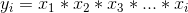

参数：

*   `input (Tensor)` – 输入 `Tensor`
*   `dim (int)` – 进行操作的维度
*   `out (Tensor, 可选)` – 输出 `Tensor`


示例：

```py
>>> a = torch.randn(10)
>>> a

 1.1148
 1.8423
 1.4143
-0.4403
 1.2859
-1.2514
-0.4748
 1.1735
-1.6332
-0.4272
[torch.FloatTensor of size 10]

>>> torch.cumprod(a, dim=0)

 1.1148
 2.0537
 2.9045
-1.2788
-1.6444
 2.0578
-0.9770
-1.1466
 1.8726
-0.8000
[torch.FloatTensor of size 10]

>>> a[5] = 0.0
>>> torch.cumprod(a, dim=0)

 1.1148
 2.0537
 2.9045
-1.2788
-1.6444
-0.0000
 0.0000
 0.0000
-0.0000
 0.0000
[torch.FloatTensor of size 10]

```

```py
torch.cumsum(input, dim, out=None) → Tensor
```

返回元素 `input` 在给定维度 `dim` 下的累积和.

例如, 如果 `input` 是一个N元张量, 结果将也是一个N元张量, 元素为: 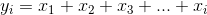

参数：

*   `input (Tensor)` – 输入 `Tensor`
*   `dim (int)` – 进行操作的维度
*   `out (Tensor, 可选)` – 输出 `Tensor`


示例：

```py
>>> a = torch.randn(10)
>>> a

-0.6039
-0.2214
-0.3705
-0.0169
 1.3415
-0.1230
 0.9719
 0.6081
-0.1286
 1.0947
[torch.FloatTensor of size 10]

>>> torch.cumsum(a, dim=0)

-0.6039
-0.8253
-1.1958
-1.2127
 0.1288
 0.0058
 0.9777
 1.5858
 1.4572
 2.5519
[torch.FloatTensor of size 10]

```

```py
torch.dist(input, other, p=2) → float
```

返回(`input` - `other`)的p-范数 `input` 和 `other` 的形状必须满足 [broadcastable](notes/broadcasting.html#broadcasting-semantics).

参数：

*   `input (Tensor)` – 输入 `Tensor`
*   `other (Tensor)` – 右侧输入 `Tensor`
*   `p (float, 可选)` – 所计算的范数.


示例：

```py
>>> x = torch.randn(4)
>>> x

 0.2505
-0.4571
-0.3733
 0.7807
[torch.FloatTensor of size 4]

>>> y = torch.randn(4)
>>> y

 0.7782
-0.5185
 1.4106
-2.4063
[torch.FloatTensor of size 4]

>>> torch.dist(x, y, 3.5)
3.302832063224223
>>> torch.dist(x, y, 3)
3.3677282206393286
>>> torch.dist(x, y, 0)
inf
>>> torch.dist(x, y, 1)
5.560028076171875

```

```py
torch.mean()
```

```py
torch.mean(input) → float
```

返回张量 `input` 所有元素的均值.

参数：`input (Tensor)` – 输入 `Tensor`


示例：

```py
>>> a = torch.randn(1, 3)
>>> a

-0.2946 -0.9143  2.1809
[torch.FloatTensor of size 1x3]

>>> torch.mean(a)
0.32398951053619385

```

```py
torch.mean(input, dim, keepdim=False, out=None) → Tensor
```

返回张量 `input` 在给定维度 `dim` 上每行的均值.

如果 `keepdim` 是 `True`, 输出张量的大小与输入张量 `input` 相同, 除了维度 `dim` 是1. 另外, `dim` 被挤压 (参看 `torch.squeeze()` ), 导致输出张量减少一维.

参数：

*   `input (Tensor)` – 输入 `Tensor`
*   `dim (int)` – 要减少的维度
*   `keepdim (bool, 可选)` – 输出张量的维度 `dim` 保持与否
*   `out (Tensor)` – 输出张量


示例：

```py
>>> a = torch.randn(4, 4)
>>> a

-1.2738 -0.3058  0.1230 -1.9615
 0.8771 -0.5430 -0.9233  0.9879
 1.4107  0.0317 -0.6823  0.2255
-1.3854  0.4953 -0.2160  0.2435
[torch.FloatTensor of size 4x4]

>>> torch.mean(a, 1)

-0.8545
 0.0997
 0.2464
-0.2157
[torch.FloatTensor of size 4]

>>> torch.mean(a, 1, True)

-0.8545
 0.0997
 0.2464
-0.2157
[torch.FloatTensor of size 4x1]

```

```py
torch.median()
```

```py
torch.median(input) → float
```

返回输出张量 `input` 所有元素的中位数.

参数：`input (Tensor)` – the input `Tensor`


示例：

```py
>>> a = torch.randn(1, 3)
>>> a

 0.4729 -0.2266 -0.2085
[torch.FloatTensor of size 1x3]

>>> torch.median(a)
-0.2085

```

```py
torch.median(input, dim=-1, keepdim=False, values=None, indices=None) -> (Tensor, LongTensor)
```

返回输出张量 `input` 在给定维度 `dim` 下每行的中位数. 同时返回一个包含中位数的索引 `LongTensor`.

`dim` 的缺省值为输入张量 `input` 的最后一维.

如果 `keepdim` 是 `True`, 输出张量与输入张量 `input` 形状相同, 除了维数 `dim` 是1. 另外, `dim` 被挤压 (参看 `torch.squeeze()` ), 导致输出张量比输入张量 `input` 少一维.

参数：

*   `input (Tensor)` – 输入张量 `Tensor`
*   `dim (int)` – 要减少的维度
*   `keepdim (bool)` – 输出张量的维度 `dim` 保留与否
*   `values (Tensor, 可选)` – 结果张量
*   `indices (Tensor, 可选)` – 结果张量索引


示例：

```py
>>> a

 -0.6891 -0.6662
 0.2697  0.7412
 0.5254 -0.7402
 0.5528 -0.2399
[torch.FloatTensor of size 4x2]

>>> a = torch.randn(4, 5)
>>> a

 0.4056 -0.3372  1.0973 -2.4884  0.4334
 2.1336  0.3841  0.1404 -0.1821 -0.7646
-0.2403  1.3975 -2.0068  0.1298  0.0212
-1.5371 -0.7257 -0.4871 -0.2359 -1.1724
[torch.FloatTensor of size 4x5]

>>> torch.median(a, 1)
(
 0.4056
 0.1404
 0.0212
-0.7257
[torch.FloatTensor of size 4]
,
 0
 2
 4
 1
[torch.LongTensor of size 4]
)

```

```py
torch.mode(input, dim=-1, keepdim=False, values=None, indices=None) -> (Tensor, LongTensor)
```

返回输入张量 `input` 在给定维数 `dim` 下每行元素的众数值. 同时也返回众数值的索引 `LongTensor`.

维度 `dim` 的缺省值是输入张量 `input` 的最后一维. .

如果 `keepdim` 是 `True`, 输出张量的大小与输入张量 `input` 相同, 除了维度 `dim` 是1. 另外, `dim` 被挤压 (参看 `torch.squeeze()` ), 导致输出张量减少一维.

注解：

这个函数至今没有为 `torch.cuda.Tensor` 定义.

参数：

*   `input (Tensor)` – 输入张量 `Tensor`
*   `dim (int)` – 要减少的维度
*   `keepdim (bool)` – 输出张量的维度 `dim` 保持与否
*   `values (Tensor, 可选)` – 结果张量
*   `indices (Tensor, 可选)` – 结果索引张量


示例：

```py
>>> a

 -0.6891 -0.6662
 0.2697  0.7412
 0.5254 -0.7402
 0.5528 -0.2399
[torch.FloatTensor of size 4x2]

>>> a = torch.randn(4, 5)
>>> a

 0.4056 -0.3372  1.0973 -2.4884  0.4334
 2.1336  0.3841  0.1404 -0.1821 -0.7646
-0.2403  1.3975 -2.0068  0.1298  0.0212
-1.5371 -0.7257 -0.4871 -0.2359 -1.1724
[torch.FloatTensor of size 4x5]

>>> torch.mode(a, 1)
(
-2.4884
-0.7646
-2.0068
-1.5371
[torch.FloatTensor of size 4]
,
 3
 4
 2
 0
[torch.LongTensor of size 4]
)

```

```py
torch.norm()
```

```py
torch.norm(input, p=2) → float
```

返回输入张量 `input` 的p-范数

参数：

*   `input (Tensor)` – 输入张量 `Tensor`
*   `p (float, 可选)` – 范数计算中的幂指数值


示例：

```py
>>> a = torch.randn(1, 3)
>>> a

-0.4376 -0.5328  0.9547
[torch.FloatTensor of size 1x3]

>>> torch.norm(a, 3)
1.0338925067372466

```

```py
torch.norm(input, p, dim, keepdim=False, out=None) → Tensor
```

返回输入张量 `input` 在给定维度 `dim` 下每行元素的p-范数.

如果 `keepdim` 是 `True`, 输出张量的大小与输入张量 `input` 相同, 除非维度 `dim` 是1. 另外, `dim` 被挤压 (参看 `torch.squeeze()` ), 导致输出张量减少一维.

参数：

*   `input (Tensor)` – 输入张量 `Tensor`
*   `p (float)` – 范数计算中的幂指数值
*   `dim (int)` – 要减少的维度
*   `keepdim (bool)` – 输出张量的维度 `dim` 保持与否
*   `out (Tensor, 可选)` – 结果张量


示例：

```py
>>> a = torch.randn(4, 2)
>>> a

-0.6891 -0.6662
 0.2697  0.7412
 0.5254 -0.7402
 0.5528 -0.2399
[torch.FloatTensor of size 4x2]

>>> torch.norm(a, 2, 1)

 0.9585
 0.7888
 0.9077
 0.6026
[torch.FloatTensor of size 4]

>>> torch.norm(a, 0, 1, True)

 2
 2
 2
 2
[torch.FloatTensor of size 4x1]

```

```py
torch.prod()
```

```py
torch.prod(input) → float
```

返回输入张量 `input` 所有元素的乘积.

参数：`input (Tensor)` – 输入张量 `Tensor`


示例：

```py
>>> a = torch.randn(1, 3)
>>> a

 0.6170  0.3546  0.0253
[torch.FloatTensor of size 1x3]

>>> torch.prod(a)
0.005537458061418483

```

```py
torch.prod(input, dim, keepdim=False, out=None) → Tensor
```

返回输入张量 `input` 在给定维度 `dim` 下每行元素的积.

如果 `keepdim` 是 `True`, 输出张量的大小与输入张量 `input` 相同, 除了维度 `dim` 是1. 另外, `dim` 被挤压 (参看 `torch.squeeze()` ), 导致输出张量减少一维.

参数：

*   `input (Tensor)` – 输入张量 `Tensor`
*   `dim (int)` – 要减少的维度
*   `keepdim (bool)` – 输出张量的维度 `dim` 保持与否
*   `out (Tensor, 可选)` – 结果张量


示例：

```py
>>> a = torch.randn(4, 2)
>>> a

 0.1598 -0.6884
-0.1831 -0.4412
-0.9925 -0.6244
-0.2416 -0.8080
[torch.FloatTensor of size 4x2]

>>> torch.prod(a, 1)

-0.1100
 0.0808
 0.6197
 0.1952
[torch.FloatTensor of size 4]

```

```py
torch.std()
```

```py
torch.std(input, unbiased=True) → float
```

返回输入张量 `input` 所有元素的标准差.

如果 `unbiased` 是 `False` , 那么标准差将通过有偏估计计算.否则, Bessel’s correction 将被使用.

参数：

*   `input (Tensor)` – 输入 `Tensor`
*   `unbiased (bool)` – 是否使用无偏估计


示例：

```py
>>> a = torch.randn(1, 3)
>>> a

-1.3063  1.4182 -0.3061
[torch.FloatTensor of size 1x3]

>>> torch.std(a)
1.3782334731508061

```

```py
torch.std(input, dim, keepdim=False, unbiased=True, out=None) → Tensor
```

返回输入张量 `input` 在给定维度 `dim` 下每行元素的标准差.

如果 `keepdim` 是 `True`, 输出张量的大小与输入张量 `input` 相同, 除了维度 `dim` 是 1. 另外, `dim` 被挤压 (参看 `torch.squeeze()` ), 导致输出张量减少一维.

如果 `unbiased` 是 `False` , 那么标准差将通过有偏估计来计算. 否则, Bessel’s correction 将被使用.

参数：

*   `input (Tensor)` – 输入 `Tensor`
*   `dim (int)` – 要减少的维度
*   `keepdim (bool)` – 输出张量的维度 `dim` 保持与否
*   `unbiased (bool)` – 是否使用无偏估计
*   `out (Tensor, 可选)` – 结果张量


示例：

```py
>>> a = torch.randn(4, 4)
>>> a

 0.1889 -2.4856  0.0043  1.8169
-0.7701 -0.4682 -2.2410  0.4098
 0.1919 -1.1856 -1.0361  0.9085
 0.0173  1.0662  0.2143 -0.5576
[torch.FloatTensor of size 4x4]

>>> torch.std(a, dim=1)

 1.7756
 1.1025
 1.0045
 0.6725
[torch.FloatTensor of size 4]

```

```py
torch.sum()
```

```py
torch.sum(input) → float
```

返回输入张量 `input` 所有元素的和.

参数：`input (Tensor)` – 输入张量 `Tensor`


示例：

```py
>>> a = torch.randn(1, 3)
>>> a

 0.6170  0.3546  0.0253
[torch.FloatTensor of size 1x3]

>>> torch.sum(a)
0.9969287421554327

```

```py
torch.sum(input, dim, keepdim=False, out=None) → Tensor
```

返回输入张量 `input` 在给定维度 `dim` 下每行元素的和.

如果 `keepdim` 是 `True`, 输出张量的大小与输入张量 `input` 相同, 除了维度 `dim` 是 1. 另外, `dim` 被挤压 (参看 `torch.squeeze()` ), 导致输出张量减少一维.

参数：

*   `input (Tensor)` – 输入张量 `Tensor`
*   `dim (int)` – 要减少的维度
*   `keepdim (bool)` – 输出张量的维度 `dim` 保持与否
*   `out (Tensor, 可选)` – 结果张量


示例：

```py
>>> a = torch.randn(4, 4)
>>> a

-0.4640  0.0609  0.1122  0.4784
-1.3063  1.6443  0.4714 -0.7396
-1.3561 -0.1959  1.0609 -1.9855
 2.6833  0.5746 -0.5709 -0.4430
[torch.FloatTensor of size 4x4]

>>> torch.sum(a, 1)

 0.1874
 0.0698
-2.4767
 2.2440
[torch.FloatTensor of size 4]

```

```py
torch.var()
```

```py
torch.var(input, unbiased=True) → float
```

返回输入张量 `input` 的方差.

如果 `unbiased` 是 `False` , 方差的计算将通过有偏估计计算. 否则, Bessel’s correction 将会被使用.

参数：

*   `input (Tensor)` – 输入张量 `Tensor`
*   `unbiased (bool)` – 是否使用无偏估计


示例：

```py
>>> a = torch.randn(1, 3)
>>> a

-1.3063  1.4182 -0.3061
[torch.FloatTensor of size 1x3]

>>> torch.var(a)
1.899527506513334

```

```py
torch.var(input, dim, keepdim=False, unbiased=True, out=None) → Tensor
```

返回输入张量 `input` 在给定维度 `dim` 下每行的方差.

如果 `keepdim` 是 `True`, 输出张量的大小与输入张量 `input` 相同, 除了维度 `dim` 是 1. 另外, `dim` 被挤压 (参看 `torch.squeeze()`), 导致输出张量减少一维.

如果 `unbiased` 是``False``, 方差的计算将通过有偏估计计算. 否则, Bessel’s correction 将会被使用.

参数：

*   `input (Tensor)` – 输入张量 `Tensor`
*   `dim (int)` – 要减少的维度
*   `keepdim (bool)` – 输出张量的维度 `dim` 保留与否
*   `unbiased (bool)` – 是否使用无偏估计
*   `out (Tensor, 可选)` – 结果张量


示例：

```py
>>> a = torch.randn(4, 4)
>>> a

-1.2738 -0.3058  0.1230 -1.9615
 0.8771 -0.5430 -0.9233  0.9879
 1.4107  0.0317 -0.6823  0.2255
-1.3854  0.4953 -0.2160  0.2435
[torch.FloatTensor of size 4x4]

>>> torch.var(a, 1)

 0.8859
 0.9509
 0.7548
 0.6949
[torch.FloatTensor of size 4]

```

### Comparison Ops (比较操作)

```py
torch.eq(input, other, out=None) → Tensor
```

比较元素是否相等

第二个元素可以是一个数字或 [broadcastable](notes/broadcasting.html#broadcasting-semantics) 为与第一个参数形状相同的张量.

参数：

*   `input (Tensor)` – 待比较张量
*   `other (Tensor 或 float)` – 比较张量或数
*   `out (Tensor, 可选)` – 输出张量, 须为 ByteTensor 类型或与 input (Tensor) 同类型


返回值：一个 torch.ByteTensor 张量, 待比较和要比较张量逐位置比较, 相等为 1 , 不等为 0


示例：

```py
>>> torch.eq(torch.Tensor([[1, 2], [3, 4]]), torch.Tensor([[1, 1], [4, 4]]))
1  0
0  1
[torch.ByteTensor of size 2x2]

```

```py
torch.equal(tensor1, tensor2) → bool
```

如果两个张量有相同的形状和元素值, 则返回 `True` , 否则 `False` .

示例：

```py
>>> torch.equal(torch.Tensor([1, 2]), torch.Tensor([1, 2]))
True

```

```py
torch.ge(input, other, out=None) → Tensor
```

逐元素比较 `input` 和 `other` , 即是否 **input&gt;=other** .

第二个参数可以为一个数或形状可 [broadcastable](notes/broadcasting.html#broadcasting-semantics) 为和第一个参数相同类型的张量.

参数：

*   `input (Tensor)` – 待对比的张量
*   `other (Tensor 或 float)` – 对比的张量或 `float` 值
*   `out (Tensor, 可选)` – 输出张量. 必须为 `ByteTensor` 或者与第一个参数 `tensor` 相同类型.


返回值：一个 `torch.ByteTensor` 张量, 包含了每个位置的比较结果(是否 input &gt;= other ).

返回类型：`Tensor`

示例：

```py
>>> torch.ge(torch.Tensor([[1, 2], [3, 4]]), torch.Tensor([[1, 1], [4, 4]]))
 1  1
 0  1
[torch.ByteTensor of size 2x2]

```

```py
torch.gt(input, other, out=None) → Tensor
```

逐元素比较 `input` 和 `other` , 即是否 **input&gt;other** 如果两个张量有相同的形状和元素值, 则返回 `True` ,否则 `False`.

第二个参数可以为一个数或形状可 [broadcastable](notes/broadcasting.html#broadcasting-semantics) 为和第一个参数相同类型的张量.

参数：

*   `input (Tensor)` – 待对比的张量
*   `other (Tensor 或 float)` – 对比的张量或 `float` 值
*   `out (Tensor, 可选)` – 输出张量. 必须为 `ByteTensor` 或者与第一个参数 `tensor` 相同类型.


返回值：一个 `torch.ByteTensor` 张量, 包含了每个位置的比较结果(是否 input &gt; other ).

返回类型：`Tensor`

示例：

```py
>>> torch.gt(torch.Tensor([[1, 2], [3, 4]]), torch.Tensor([[1, 1], [4, 4]]))
 0  1
 0  0
[torch.ByteTensor of size 2x2]

```

```py
torch.kthvalue(input, k, dim=None, keepdim=False, out=None) -> (Tensor, LongTensor)
```

取输入张量 `input` 指定维上第 `k` 个最小值. 如果不指定 `dim` , 则默认为 `input` 的最后一维.

返回一个元组 `(values,indices)` ,其中 `indices` 是原始输入张量 `input` 中沿 `dim` 维的第 `k` 个最小值下标.

如果 `keepdim` 为 `True` , `values` 和 `indices` 张量都和 `input` 大小相同, 除了在所有值都为1的 `dim` 维度上. 如果 `keepdim` 为 `False` , `dim` 被压缩. (参见 `torch.squeeze()` ), 使 `values` 和 `indices` 两个张量比 `input` 张量小一个的维度.

参数：

*   `input (Tensor)` – 输入 `Tensor`
*   `k (int)` – 第 `k` 个最小值
*   `dim (int, 可选)` – 沿着此维进行排序
*   `keepdim (bool)` – 输出张量是否保持维度 `dim` 不变
*   `out (tuple, 可选)` – 输出元组 ( Tensor, LongTensor ) 可选参数(作为输出 buffers )


示例：

```py
>>> x = torch.arange(1, 6)
>>> x

 1
 2
 3
 4
 5
[torch.FloatTensor of size 5]

>>> torch.kthvalue(x, 4)
(
 4
[torch.FloatTensor of size 1]
,
 3
[torch.LongTensor of size 1]
)

>>> x=torch.arange(1,7).resize_(2,3)
>>> x

1  2  3
4  5  6
[torch.FloatTensor of size 2x3]

>>> torch.kthvalue(x,2,0,True)
(
4  5  6
[torch.FloatTensor of size 1x3]
 ,
1  1  1
[torch.LongTensor of size 1x3]
)

```

```py
torch.le(input, other, out=None) → Tensor
```

逐元素比较 `input` 和 `other` , 即是否 **input&lt;=other** 如果两个张量有相同的形状和元素值, 则返回 `True` ,否则 `False` .

第二个参数可以为一个数或形状可 [broadcastable](notes/broadcasting.html#broadcasting-semantics) 为和第一个参数相同类型的张量.

参数：

*   `input (Tensor)` – 待对比的张量
*   `other (Tensor 或 float)` – 对比的张量或 `float` 值
*   `out (Tensor, 可选)` – 输出张量. 必须为 `ByteTensor` 或者与第一个参数 `tensor` 相同类型.


返回值：一个 `torch.ByteTensor` 张量, 包含了每个位置的比较结果(是否 input &lt;= other ).

返回类型：`Tensor`

示例：

```py
>>> torch.le(torch.Tensor([[1, 2], [3, 4]]), torch.Tensor([[1, 1], [4, 4]]))
 1  0
 1  1
[torch.ByteTensor of size 2x2]

```

```py
torch.lt(input, other, out=None) → Tensor
```

逐元素比较 `input` 和 `other` , 即是否 **input&lt;other** 如果两个张量有相同的形状和元素值, 则返回 `True` ,否则 `False` .

第二个参数可以为一个数或形状可 [broadcastable](notes/broadcasting.html#broadcasting-semantics) 为和第一个参数相同类型的张量.

参数：

*   `input (Tensor)` – 待对比的张量
*   `other (Tensor 或 float)` – 对比的张量或 `float` 值
*   `out (Tensor, 可选)` – 输出张量. 必须为 `ByteTensor` 或者与第一个参数 `tensor` 相同类型.


返回值：一个 `torch.ByteTensor` 张量, 包含了每个位置的比较结果(是否 input &lt; other ).

返回类型：`Tensor`

示例：

```py
>>> torch.lt(torch.Tensor([[1, 2], [3, 4]]), torch.Tensor([[1, 1], [4, 4]]))
 0  0
 1  0
[torch.ByteTensor of size 2x2]

```

```py
torch.max()
```

```py
torch.max(input) → float
```

返回输入 `input` 张量所有元素的最大值.

参数：`input (Tensor)` – 输入 `Tensor`


示例：

```py
>>> a = torch.randn(1, 3)
>>> a

 0.4729 -0.2266 -0.2085
[torch.FloatTensor of size 1x3]

>>> torch.max(a)
0.4729

```

```py
torch.max(input, dim, keepdim=False, out=None) -> (Tensor, LongTensor)
```

返回输入张量 `input` 在给定维度 `dim` 上每行的最大值, 并同时返回每个最大值的位置索引.

如果 `keepdim` 为 `True` , `values` 和 `indices` 张量都和 `input` 尺寸相同, 除了在所有值都为 1 的 `dim` 维度上. 如果 `keepdim` 为 `False` , `dim` 被压缩. (参见 `torch.squeeze()` ), 使 `values` 和 `indices` 两个张量比 `input` 张量小一个的维度.

参数：

*   `input (Tensor)` – 输入 `Tensor`
*   `k (int)` – 第 `k` 个最小值
*   `dim (int, 可选)` – 沿着此维进行排序
*   `keepdim (bool)` – 输出张量是否保持维度 `dim` 不变
*   `out (tuple, 可选)` – 输出元组 (max, max_indices)


示例：

```py
>> a = torch.randn(4, 4)
>> a

0.0692  0.3142  1.2513 -0.5428
0.9288  0.8552 -0.2073  0.6409
1.0695 -0.0101 -2.4507 -1.2230
0.7426 -0.7666  0.4862 -0.6628
torch.FloatTensor of size 4x4]

>>> torch.max(a, 1)
(
 1.2513
 0.9288
 1.0695
 0.7426
[torch.FloatTensor of size 4]
,
 2
 0
 0
 0
[torch.LongTensor of size 4]
)

```

```py
torch.max(input, other, out=None) → Tensor
```

输入 `input` 每一个元素和对应的比较张量 `other` 进行比较, 留下较大的元素 `max`.

要比较的张量 `input` 与比较张量 `other` 不必大小一致, 但它们一定要能 [broadcastable](notes/broadcasting.html#broadcasting-semantics) .

参数：

*   `input (Tensor)` – 要比较张量 `Tensor`
*   `other (Tensor)` – 比较张量 `Tensor`
*   `out (Tensor, 可选)` – 输出张量 `Tensor`


示例：

```py
>>> a = torch.randn(4)
>>> a

 1.3869
 0.3912
-0.8634
-0.5468
[torch.FloatTensor of size 4]

>>> b = torch.randn(4)
>>> b

 1.0067
-0.8010
 0.6258
 0.3627
[torch.FloatTensor of size 4]

>>> torch.max(a, b)

 1.3869
 0.3912
 0.6258
 0.3627
[torch.FloatTensor of size 4]

```

```py
torch.min()
```

```py
torch.min(input) → float
```

返回输入张量 `input` 所有元素的最小值.

参数：`input (Tensor)` – 输入 `Tensor`


示例：

```py
>>> a = torch.randn(1, 3)
>>> a

 0.4729 -0.2266 -0.2085
[torch.FloatTensor of size 1x3]

>>> torch.min(a)
-0.22663167119026184

```

```py
torch.min(input, dim, keepdim=False, out=None) -> (Tensor, LongTensor)
```

返回输入张量 `input` 在给定维度 `dim` 下每行元素的最小值. 其中第二个返回值是每个被找出的最小值的索引位置 ( argmin ) .

如果 `keepdim` 是 `True`, 输出张量的大小与输入张量 `input` 相同, 除了维数 `dim` 是 1 . 另外, `dim` 被挤压 (参看 `torch.squeeze()` ), 导致输出张量比输入张量 `input` 少一维.

参数：

*   `input (Tensor)` – 输入张量 `Tensor`
*   `dim (int)` – 要减少的维度
*   `keepdim (bool)` – 输出张量的维度 `dim` 保持与否
*   `out (tuple, 可选)` – 两个输出张量的结果元组 (min, min_indices)


示例：

```py
>> a = torch.randn(4, 4)
>> a

0.0692  0.3142  1.2513 -0.5428
0.9288  0.8552 -0.2073  0.6409
1.0695 -0.0101 -2.4507 -1.2230
0.7426 -0.7666  0.4862 -0.6628
torch.FloatTensor of size 4x4]

>> torch.min(a, 1)

0.5428
0.2073
2.4507
0.7666
torch.FloatTensor of size 4]

3
2
2
1
torch.LongTensor of size 4]

```

```py
torch.min(input, other, out=None) → Tensor
```

输入 `input` 每一个元素和对应的比较张量 `other` 进行比较, 留下较小的元素 `min` .

要比较的张量 `input` 与比较张量 `other` 不必尺寸一致, 但它们一定要能广播 [broadcastable](notes/broadcasting.html#broadcasting-semantics) .

参数：

*   `input (Tensor)` – 第一个张量 `Tensor`
*   `other (Tensor)` – 第二个张量 `Tensor`
*   `out (Tensor, 可选)` – 输出的张量 `Tensor`


示例：

```py
>>> a = torch.randn(4)
>>> a

 1.3869
 0.3912
-0.8634
-0.5468
[torch.FloatTensor of size 4]

>>> b = torch.randn(4)
>>> b

 1.0067
-0.8010
 0.6258
 0.3627
[torch.FloatTensor of size 4]

>>> torch.min(a, b)

 1.0067
-0.8010
-0.8634
-0.5468
[torch.FloatTensor of size 4]

```

```py
torch.ne(input, other, out=None) → Tensor
```

逐元素比较 `input` 和 `other` , 即是否 **tensor != other** 如果两个张量有相同的形状和元素值, 则返回 `True` , 否则 `False` .

第二个参数可以为一个数或形状广播 [broadcastable](notes/broadcasting.html#broadcasting-semantics) 为和第一个参数相同类型的张量.

参数：

*   `input (Tensor)` – 待对比的张量
*   `other (Tensor 或 float)` – 对比的张量或 `float` 值
*   `out (Tensor, 可选)` – 输出张量. 必须为 `ByteTensor` 或者与第一个参数 `tensor` 相同类型.


返回值：一个 `torch.ByteTensor` 张量, 包含了每个位置的比较结果 (是否 input != other ) .

返回类型：`Tensor`

示例：

```py
>>> torch.ne(torch.Tensor([[1, 2], [3, 4]]), torch.Tensor([[1, 1], [4, 4]]))
 0  1
 1  0
[torch.ByteTensor of size 2x2]

```

```py
torch.sort(input, dim=None, descending=False, out=None) -> (Tensor, LongTensor)
```

对输入张量 `input` 沿着指定维按升序排序.

如果不给定 `dim` ,则默认为输入的最后一维.

如果指定参数 `descending` 为 `True` , 则按降序排序.

返回元组 (sorted_tensor, sorted_indices) , sorted_indices 为原始输入中的下标.

参数：

*   `input (Tensor)` – 要对比的张量
*   `dim (int, 可选)` – 沿着此维排序
*   `descending (bool, 可选)` – 布尔值, 控制升降排序
*   `out (tuple, 可选)` – 输出张量. 必须为 ByteTensor 或者与第一个参数 tensor 相同类型.


示例：

```py
>>> x = torch.randn(3, 4)
>>> sorted, indices = torch.sort(x)
>>> sorted

-1.6747  0.0610  0.1190  1.4137
-1.4782  0.7159  1.0341  1.3678
-0.3324 -0.0782  0.3518  0.4763
[torch.FloatTensor of size 3x4]

>>> indices

 0  1  3  2
 2  1  0  3
 3  1  0  2
[torch.LongTensor of size 3x4]

>>> sorted, indices = torch.sort(x, 0)
>>> sorted

-1.6747 -0.0782 -1.4782 -0.3324
 0.3518  0.0610  0.4763  0.1190
 1.0341  0.7159  1.4137  1.3678
[torch.FloatTensor of size 3x4]

>>> indices

 0  2  1  2
 2  0  2  0
 1  1  0  1
[torch.LongTensor of size 3x4]

```

```py
torch.topk(input, k, dim=None, largest=True, sorted=True, out=None) -> (Tensor, LongTensor)
```

沿给定 dim 维度返回输入张量 `input` 中 `k` 个最大值. 如果不指定 `dim` , 则默认为 `input` 的最后一维. 如果为 `largest` 为 `False` ,则返回最小的 `k` 个值. 返回一个元组 `(values, indices)` , 其中 indices 是原始输入张量 input 中测元素下标. 如果设定布尔值 `sorted` 为 `True` , 将会确保返回的 `k` 个值被排序.

参数：

*   `input (Tensor)` – 输入张量
*   `k (int)` – “top-k” 中的 k
*   `dim (int, 可选)` – 排序的维
*   `largest (bool, 可选)` – 布尔值, 控制返回最大或最小值
*   `sorted (bool, 可选)` – 布尔值, 控制返回值是否排序
*   `out (tuple, 可选)` – 可选输出张量 (Tensor, LongTensor) output buffers


示例：

```py
>>> x = torch.arange(1, 6)
>>> x

 1
 2
 3
 4
 5
[torch.FloatTensor of size 5]

>>> torch.topk(x, 3)
(
 5
 4
 3
[torch.FloatTensor of size 3]
,
 4
 3
 2
[torch.LongTensor of size 3]
)
>>> torch.topk(x, 3, 0, largest=False)
(
 1
 2
 3
[torch.FloatTensor of size 3]
,
 0
 1
 2
[torch.LongTensor of size 3]
)

```

### Other Operations (其它操作)

```py
torch.cross(input, other, dim=-1, out=None) → Tensor
```

返回沿着维度 `dim` 上, 两个张量 `input` 和 `other` 的向量积 (叉积), `input` 和 `other` 必须有相同的形状, 且指定的 `dim` 维上 `size` 必须为 3.

如果不指定 `dim`, 则默认为第一个尺度为 3 的维.

参数：

*   `input (Tensor)` – 输入 `Tensor`
*   `other (Tensor)` – 第二个输入 `Tensor`
*   `dim (int, 可选)` – 沿着此维进行叉积操作.
*   `out (Tensor, 可选)` – 结果 `Tensor`


示例：

```py
>>> a = torch.randn(4, 3)
>>> a

-0.6652 -1.0116 -0.6857
 0.2286  0.4446 -0.5272
 0.0476  0.2321  1.9991
 0.6199  1.1924 -0.9397
[torch.FloatTensor of size 4x3]

>>> b = torch.randn(4, 3)
>>> b

-0.1042 -1.1156  0.1947
 0.9947  0.1149  0.4701
-1.0108  0.8319 -0.0750
 0.9045 -1.3754  1.0976
[torch.FloatTensor of size 4x3]

>>> torch.cross(a, b, dim=1)

-0.9619  0.2009  0.6367
 0.2696 -0.6318 -0.4160
-1.6805 -2.0171  0.2741
 0.0163 -1.5304 -1.9311
[torch.FloatTensor of size 4x3]

>>> torch.cross(a, b)

-0.9619  0.2009  0.6367
 0.2696 -0.6318 -0.4160
-1.6805 -2.0171  0.2741
 0.0163 -1.5304 -1.9311
[torch.FloatTensor of size 4x3]

```

```py
torch.diag(input, diagonal=0, out=None) → Tensor
```

*   如果输入是一个向量( `1D` 张量), 则返回一个以 `input` 为对角线元素的 `2D` 方阵.
*   如果输入是一个矩阵( `2D` 张量), 则返回一个包含 `input` 对角线元素的1D张量.

参数 `diagonal` 指定对角线:

*   `diagonal` = 0, 主对角线.
*   `diagonal` &gt; 0, 主对角线之上.
*   `diagonal` &lt; 0, 主对角线之下.

参数：

*   `input (Tensor)` – 输入 `Tensor`
*   `diagonal (int, 可选)` – 指定对角线
*   `out (Tensor, 可选)` – 输出 `Tensor`


示例：

获得以 `input` 为对角线的方阵:

```py
>>> a = torch.randn(3)
>>> a

 1.0480
-2.3405
-1.1138
[torch.FloatTensor of size 3]

>>> torch.diag(a)

 1.0480  0.0000  0.0000
 0.0000 -2.3405  0.0000
 0.0000  0.0000 -1.1138
[torch.FloatTensor of size 3x3]

>>> torch.diag(a, 1)

 0.0000  1.0480  0.0000  0.0000
 0.0000  0.0000 -2.3405  0.0000
 0.0000  0.0000  0.0000 -1.1138
 0.0000  0.0000  0.0000  0.0000
[torch.FloatTensor of size 4x4]

```

获得给定矩阵的第k条对角线:

```py
>>> a = torch.randn(3, 3)
>>> a

-1.5328 -1.3210 -1.5204
 0.8596  0.0471 -0.2239
-0.6617  0.0146 -1.0817
[torch.FloatTensor of size 3x3]

>>> torch.diag(a, 0)

-1.5328
 0.0471
-1.0817
[torch.FloatTensor of size 3]

>>> torch.diag(a, 1)

-1.3210
-0.2239
[torch.FloatTensor of size 2]

```

```py
torch.histc(input, bins=100, min=0, max=0, out=None) → Tensor
```

计算输入张量的直方图.

以 `min` 和 `max` 为 `range` 边界, 将其均分成 `bins` 个直条, 然后将排序好的数据划分到各个直条 `(bins)` 中. 如果 `min` 和 `max` 都为 0, 则利用数据中的最大最小值作为边界.

参数：

*   `input (Tensor)` – 输入张量
*   `bins (int)` – 直方图 `bins` (直条)的个数(默认100个)
*   `min (int)` – `range` 的下边界(包含)
*   `max (int)` – `range` 的上边界(包含)
*   `out (Tensor, 可选)` – 结果张量


返回值：直方图

返回类型：`Tensor`

示例：

```py
>>> torch.histc(torch.FloatTensor([1, 2, 1]), bins=4, min=0, max=3)
FloatTensor([0, 2, 1, 0])

```

```py
torch.renorm(input, p, dim, maxnorm, out=None) → Tensor
```

返回一个张量, 包含规范化后的各个子张量, 使得沿着 `dim` 维划分的各子张量的 `p` 范数小于 `maxnorm`

注解：

如果 p 范数的值小于 `maxnorm`, 则当前子张量不需要修改.

参数：

*   `input (Tensor)` – 输入 `Tensor`
*   `p (float)` – 范数的 `p`
*   `dim (int)` – 沿着此维切片, 得到张量子集
*   `maxnorm (float)` – 每个子张量的范数的最大值
*   `out (Tensor, 可选)` – 结果张量


示例：

```py
>>> x = torch.ones(3, 3)
>>> x[1].fill_(2)
>>> x[2].fill_(3)
>>> x

 1  1  1
 2  2  2
 3  3  3
[torch.FloatTensor of size 3x3]

>>> torch.renorm(x, 1, 0, 5)

 1.0000  1.0000  1.0000
 1.6667  1.6667  1.6667
 1.6667  1.6667  1.6667
[torch.FloatTensor of size 3x3]

```

```py
torch.trace(input) → float
```

返回输入 2 维矩阵对角线元素的和(迹).

示例：

```py
>>> x = torch.arange(1, 10).view(3, 3)
>>> x

 1  2  3
 4  5  6
 7  8  9
[torch.FloatTensor of size 3x3]

>>> torch.trace(x)
15.0

```

```py
torch.tril(input, diagonal=0, out=None) → Tensor
```

返回一个张量, 包含输入矩阵 ( `2D` 张量)的下三角部分, 其余部分被设为 0.

这里所说的下三角部分为矩阵指定对角线 `diagonal` 在线里的和下面的元素.

参数 `diagonal` 控制对角线.

*   `diagonal` = 0, 主对角线.
*   `diagonal` &gt; 0, 主对角线之上.
*   `diagonal` &lt; 0, 主对角线之下.

参数：

*   `input (Tensor)` – 输入 `Tensor`
*   `diagonal (int, 可选)` – 指定对角线
*   `out (Tensor, 可选)` – 输出 `Tensor`


示例：

```py
>>> a = torch.randn(3,3)
>>> a

 1.3225  1.7304  1.4573
-0.3052 -0.3111 -0.1809
 1.2469  0.0064 -1.6250
[torch.FloatTensor of size 3x3]

>>> torch.tril(a)

 1.3225  0.0000  0.0000
-0.3052 -0.3111  0.0000
 1.2469  0.0064 -1.6250
[torch.FloatTensor of size 3x3]

>>> torch.tril(a, diagonal=1)

 1.3225  1.7304  0.0000
-0.3052 -0.3111 -0.1809
 1.2469  0.0064 -1.6250
[torch.FloatTensor of size 3x3]

>>> torch.tril(a, diagonal=-1)

 0.0000  0.0000  0.0000
-0.3052  0.0000  0.0000
 1.2469  0.0064  0.0000
[torch.FloatTensor of size 3x3]

```

```py
torch.triu(input, diagonal=0, out=None) → Tensor
```

返回一个张量, 包含输入矩阵 ( `2D` 张量)的上三角部分, 其余部分被设为 0.

这里所说的下三角部分为矩阵指定对角线 `diagonal` 在线里的和上面的元素.

参数 `diagonal` 控制对角线.

*   `diagonal` = 0, 主对角线.
*   `diagonal` &gt; 0, 主对角线之上.
*   `diagonal` &lt; 0, 主对角线之下.

参数：

*   `input (Tensor)` – 输入 `Tensor`
*   `diagonal (int, 可选)` – 指定对角线
*   `out (Tensor, 可选)` – 输出 `Tensor`


示例：

```py
>>> a = torch.randn(3,3)
>>> a

 1.3225  1.7304  1.4573
-0.3052 -0.3111 -0.1809
 1.2469  0.0064 -1.6250
[torch.FloatTensor of size 3x3]

>>> torch.triu(a)

 1.3225  1.7304  1.4573
 0.0000 -0.3111 -0.1809
 0.0000  0.0000 -1.6250
[torch.FloatTensor of size 3x3]

>>> torch.triu(a, diagonal=1)

 0.0000  1.7304  1.4573
 0.0000  0.0000 -0.1809
 0.0000  0.0000  0.0000
[torch.FloatTensor of size 3x3]

>>> torch.triu(a, diagonal=-1)

 1.3225  1.7304  1.4573
-0.3052 -0.3111 -0.1809
 0.0000  0.0064 -1.6250
[torch.FloatTensor of size 3x3]

```

### BLAS and LAPACK Operations (BLAS和LAPACK操作)

```py
torch.addbmm(beta=1, mat, alpha=1, batch1, batch2, out=None) → Tensor
```

执行保存在 `batch1` 和 `batch2` 中的矩阵的批量点乘, 伴随着一个减少的相加步骤 (所有的矩阵乘法沿第一维累加). `mat` 被相加到最终的结果中.

`batch1` 和 `batch2` 必须是三维的张量, 且每个包含相同数量的矩阵.

如果 `batch1` 是一个 `b x n x m` 的张量, `batch2` 是一个 `b x m x p`的张量, 那么 `mat` 必须是 [broadcastable](notes/broadcasting.html#broadcasting-semantics) 且是一个 `n x p` 的张量, 同时 attr:`out` 将是一个 `n x p` 的张量.

换句话说, 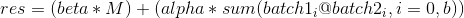

对于 `FloatTensor` 或者 `DoubleTensor` 类型的输入, 参数 `beta` 和 `alpha` 必须是实数, 否则他们应该是整数.

参数：

*   `beta (Number, 可选)` – 作用于 `mat` 的乘子 (系数)
*   `mat (Tensor)` – 要被相加的矩阵
*   `alpha (Number, 可选)` – 作用于 `batch1 @ batch2` 的乘子
*   `batch1 (Tensor)` – 要相乘的第一批矩阵
*   `batch2 (Tensor)` – 要相乘的第二批矩阵
*   `out (Tensor, 可选)` – 输出的张量结果


示例：

```py
>>> M = torch.randn(3, 5)
>>> batch1 = torch.randn(10, 3, 4)
>>> batch2 = torch.randn(10, 4, 5)
>>> torch.addbmm(M, batch1, batch2)

 -3.1162  11.0071   7.3102   0.1824  -7.6892
 1.8265   6.0739   0.4589  -0.5641  -5.4283
 -9.3387  -0.1794  -1.2318  -6.8841  -4.7239
[torch.FloatTensor of size 3x5]

```

```py
torch.addmm(beta=1, mat, alpha=1, mat1, mat2, out=None) → Tensor
```

执行矩阵 `mat1` 和 `mat2` 的相乘. 矩阵 `mat` 将与相乘的最终计算结果相加.

如果 `mat1` 是一个 `n x m` 的张量, `mat2` 是一个 `m x p`的张量, 那么 `mat` 必须是 [broadcastable](notes/broadcasting.html#broadcasting-semantics) 且是一个 `n x p` 的张量, 同时 attr:`out` 将是一个 `n x p` 的张量.

换句话说, 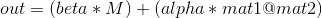

对于 `FloatTensor` 或者 `DoubleTensor` 类型的输入, 参数 `beta` 和 `alpha` 必须是实数, 否则他们应该是整数.

参数：

*   `beta (Number, 可选)` – 作用于`mat`的乘子
*   `mat (Tensor)` – 要被相加的矩阵
*   `alpha (Number, 可选)` – 作用于`mat1 @ mat2`的乘子
*   `mat1 (Tensor)` – 要相乘的第一个矩阵
*   `mat2 (Tensor)` – 要相乘的第二个矩阵
*   `out (Tensor, 可选)` – 输出结果


示例：

```py
>>> M = torch.randn(2, 3)
>>> mat1 = torch.randn(2, 3)
>>> mat2 = torch.randn(3, 3)
>>> torch.addmm(M, mat1, mat2)

-0.4095 -1.9703  1.3561
 5.7674 -4.9760  2.7378
[torch.FloatTensor of size 2x3]

```

```py
torch.addmv(beta=1, tensor, alpha=1, mat, vec, out=None) → Tensor
```

执行矩阵 `mat` 和向量 `vec` 的相乘. 矩阵 `tensor` 将与相乘的最终计算结果相加.

如果 `mat` 是一个 `n x m` 的张量, `vec` 是一个长度为 `m` 的一维张量, 那么 :`tensor` 必须是 [broadcastable](notes/broadcasting.html#broadcasting-semantics) 且是一个长度为 `n` 的一维张量, 同时 attr:`out` 将是一个长度为 `n` 的一维张量.

`alpha` 和 `beta` 分别是 `mat * vec` 和 `tensor` 的缩放因子.

换句话说, 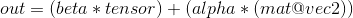

对于 `FloatTensor` 或者 `DoubleTensor` 类型的输入, 参数 `beta` 和 `alpha` 必须是实数, 否则他们应该是整数.

参数：

*   `beta (Number, 可选)` – 作用于 `tensor` 的乘子
*   `tensor (Tensor)` – 要被相加的向量
*   `alpha (Number, 可选)` – 作用于 `mat @ vec` 的乘子
*   `mat (Tensor)` – 要被相乘的矩阵
*   `vec (Tensor)` – 要被要乘的向量
*   `out (Tensor, 可选)` – 输出结果


示例：

```py
>>> M = torch.randn(2)
>>> mat = torch.randn(2, 3)
>>> vec = torch.randn(3)
>>> torch.addmv(M, mat, vec)

-2.0939
-2.2950
[torch.FloatTensor of size 2]

```

```py
torch.addr(beta=1, mat, alpha=1, vec1, vec2, out=None) → Tensor
```

执行向量 `vec1` 和 `vec2` 的外积, 并把外积计算结果与矩阵 `mat` 相加.

可选值 `beta` 和 `alpha` 是标量, 分别与 `mat` 和  相乘.

换句话说, 

如果 `vec1` 是一个长度为 `n` 的向量, `vec2` 是一个长度为 `m` 的向量, 那么 `mat` 必须是 [broadcastable](notes/broadcasting.html#broadcasting-semantics) 且是一个大小为 `n x m` 的矩阵, 同时 `out` 将是一个大小为 `n x m` 的矩阵.

对于 `FloatTensor` 或者 `DoubleTensor` 类型的输入, 参数 `beta` 和 `alpha` 必须是实数, 否则他们应该是整数.

参数：

*   `beta (Number, 可选)` – 作用于 `mat` 的乘子
*   `mat (Tensor)` – 要被相加的矩阵
*   `alpha (Number, 可选)` – 作用于 `vec1` 和 `vec2` 外积计算结果的乘子
*   `vec1 (Tensor)` – 外积计算的第一个向量
*   `vec2 (Tensor)` – 外积计算的第二个向量
*   `out (Tensor, 可选)` – 输出结果


示例：

```py
>>> vec1 = torch.arange(1, 4)
>>> vec2 = torch.arange(1, 3)
>>> M = torch.zeros(3, 2)
>>> torch.addr(M, vec1, vec2)
 1  2
 2  4
 3  6
[torch.FloatTensor of size 3x2]

```

```py
torch.baddbmm(beta=1, mat, alpha=1, batch1, batch2, out=None) → Tensor
```

执行保存在 `batch1` 和 `batch2` 中的矩阵的批量点乘. `mat` 被相加到最终的结果中.

`batch1` 和 `batch2` 必须是三维的张量, 且每个包含相同数量的矩阵.

如果 `batch1` 是一个 `b x n x m` 的张量, `batch2` 是一个 `b x m x p`的张量, 那么 `mat` 必须是 [broadcastable](notes/broadcasting.html#broadcasting-semantics) 且是一个 `b x n x p` 的张量, 同时 attr:`out` 将是一个 `b x n x p` 的张量.

换句话说, 

对于 `FloatTensor` 或者 `DoubleTensor` 类型的输入, 参数 `beta` 和 `alpha` 必须是实数, 否则他们应该是整数.

参数：

*   `beta (Number, 可选)` – 作用于 `mat` 的乘子 (系数)
*   `mat (Tensor)` – 要被相加的张量
*   `alpha (Number, 可选)` – 作用于 `batch1 @ batch2` 的乘子
*   `batch1 (Tensor)` – 要相乘的第一批矩阵
*   `batch2 (Tensor)` – 要相乘的第二批矩阵
*   `out (Tensor, 可选)` – 输出的张量结果


示例：

```py
>>> M = torch.randn(10, 3, 5)
>>> batch1 = torch.randn(10, 3, 4)
>>> batch2 = torch.randn(10, 4, 5)
>>> torch.baddbmm(M, batch1, batch2).size()
torch.Size([10, 3, 5])

```

```py
torch.bmm(batch1, batch2, out=None) → Tensor
```

执行保存在 `batch1` 和 `batch2` 中的矩阵的批量点乘.

`batch1` 和 `batch2` 必须是三维的张量, 且每个包含相同数量的矩阵.

如果 `batch1` 是一个 `b x n x m` 的张量, `batch2` 是一个 `b x m x p` 的张量, `out` 将是一个 `b x n x p` 的张量.

注解：

这个函数不能参考 broadcast](notes/broadcasting.html#broadcasting-semantics). 对于广播矩阵相乘, 参见 [`torch.matmul()`.

参数：

*   `batch1 (Tensor)` – 要相乘的第一批矩阵
*   `batch2 (Tensor)` – 要相乘的第二批矩阵
*   `out (Tensor, 可选)` – 输出结果


示例：

```py
>>> batch1 = torch.randn(10, 3, 4)
>>> batch2 = torch.randn(10, 4, 5)
>>> res = torch.bmm(batch1, batch2)
>>> res.size()
torch.Size([10, 3, 5])

```

```py
torch.btrifact(A, info=None, pivot=True) → Tensor, IntTensor
```

批量 LU 分解.

返回一个包含 LU 分解和枢轴的元组. 对于每个 minibatch 示例, 如果分解成功, 可选参数 `info` 将提供分解信息. `info` 的值来自 dgetrf, 若是非零值, 则表示有错误发生. 如果 cuda 被使用的话, 具体的值来自 cublas, 否则来自 LAPACK. 如果设置了 pivot, 那么旋转操作将被执行.

参数：`A (Tensor)` – 要分解的张量.


示例：

```py
>>> A = torch.randn(2, 3, 3)
>>> A_LU = A.btrifact()

```

```py
torch.btrisolve(b, LU_data, LU_pivots) → Tensor
```

批量 LU 解.

返回线性系统 Ax = b 的 LU 解.

参数：

*   `b (Tensor)` – RHS tensor.
*   `LU_data (Tensor)` – Pivoted LU factorization of A from btrifact.
*   `LU_pivots (IntTensor)` – Pivots of the LU factorization.


示例：

```py
>>> A = torch.randn(2, 3, 3)
>>> b = torch.randn(2, 3)
>>> A_LU = torch.btrifact(A)
>>> x = b.btrisolve(*A_LU)
>>> torch.norm(A.bmm(x.unsqueeze(2)) - b)
6.664001874625056e-08

```

```py
torch.dot(tensor1, tensor2) → float
```

计算两个张量的点乘 (内积).

注解：

这个函数不支持 [broadcast](notes/broadcasting.html#broadcasting-semantics).

示例：

```py
>>> torch.dot(torch.Tensor([2, 3]), torch.Tensor([2, 1]))
7.0

```

```py
torch.eig(a, eigenvectors=False, out=None) -> (Tensor, Tensor)
```

计算实数方阵的特征值和特征向量.

参数：

*   `a (Tensor)` – 一个要被计算特征值与特征向量的方阵
*   `eigenvectors (bool)` – 若为 `True`, 表示特征值与特征向量都被计算. 否则, 仅计算特征值.
*   `out (tuple, 可选)` – 输出张量


返回值：包含以下的元组：

*   `e (Tensor)`: `a` 的左特征值
*   `v (Tensor)`: 如果 `eigenvectors` 为 `True`, 表示 `a` 的特征向量; 否则是一个空的张量

返回类型：返回一个元组, `(Tensor, Tensor)`

```py
torch.gels(B, A, out=None) → Tensor
```

计算秩为 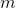 的， 大小为 m x n 的矩阵 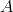 最小二乘和最小范数问题的解

如果 !m &gt;= n](img/tex-67ab86856a95fdd869cf2a0fff67d8be.gif), [`gels()` 求解最小二乘问题:


如果 !m &lt; n](img/tex-ad3a40ab7b4c9be133873408eb36bcc1.gif), [`gels()` 求解最小范数问题:


返回的矩阵 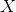 的头 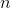 行包含解信息. 其余行包含剩余信息: 从第  行开始的每列的 euclidean 范数, 是对应列的剩余.

参数：

*   `B (Tensor)` – The matrix 
*   `A (Tensor)` – The  by  matrix 
*   `out (tuple, 可选)` – Optional destination tensor


返回值：包含以下的元组：

*   `X (Tensor)`: 最小二乘解
*   `qr (Tensor)`: QR 分解的详细信息


返回类型：`(Tensor, Tensor)`

注解：

不管输入矩阵的步长如何, 返回来的矩阵将总是被转置. 也就是, 他们的步长是 `(1, m)` 而不是 `(m, 1)`.

示例：

```py
>>> A = torch.Tensor([[1, 1, 1],
...                   [2, 3, 4],
...                   [3, 5, 2],
...                   [4, 2, 5],
...                   [5, 4, 3]])
>>> B = torch.Tensor([[-10, -3],
 [ 12, 14],
 [ 14, 12],
 [ 16, 16],
 [ 18, 16]])
>>> X, _ = torch.gels(B, A)
>>> X
2.0000  1.0000
1.0000  1.0000
1.0000  2.0000
[torch.FloatTensor of size 3x2]

```

```py
torch.geqrf(input, out=None) -> (Tensor, Tensor)
```

这是直接调用 LAPACK 的低层函数.

通常您应该使用 `torch.qr()` 来代替之.

计算 `input` 的 QR 分解, 但不构造 `Q` 和 `R` 作为显示分开的矩阵.

然而, 这样直接调用 LAPACK 的底层函数 `?geqrf`, 会产生一连串的 ‘elementary reflectors’.

更多信息请参见 [LAPACK documentation](https://software.intel.com/en-us/node/521004) .

参数：

*   `input (Tensor)` – the input matrix
*   `out (tuple, 可选)` – The result tuple of (Tensor, Tensor)


```py
torch.ger(vec1, vec2, out=None) → Tensor
```

计算 `vec1` 和 `vec2` 的外积. 如果 `vec1` 是一个长度为 `n` 的向量, `vec2` 是一个长度为 `m` 的向量, 那么 `out` 必须是一个 `n x m` 的矩阵.

注解：

这个函数不支持 [broadcast](notes/broadcasting.html#broadcasting-semantics).

参数：

*   `vec1 (Tensor)` – 1D input vector
*   `vec2 (Tensor)` – 1D input vector
*   `out (Tensor, 可选)` – optional output matrix


示例：

```py
>>> v1 = torch.arange(1, 5)
>>> v2 = torch.arange(1, 4)
>>> torch.ger(v1, v2)

 1   2   3
 2   4   6
 3   6   9
 4   8  12
[torch.FloatTensor of size 4x3]

```

```py
torch.gesv(B, A, out=None) -> (Tensor, Tensor)
```

`X, LU = torch.gesv(B, A)` , 该函数返回线性系统  的解.

`LU` 包含 `A` 的 LU 分解因子 `L` 和 `U`.

`A` 必须是方阵, 且是非奇异的 (2维可逆张量).

如果 `A` 是一个 `m x m` 矩阵, `B` 是一个 `m x k` 的矩阵, 那么结果 `LU` 的大小为 `m x m`, `X` 的大小为 `m x k` .

注解：

Irrespective of the original strides, the returned matrices `X` and `LU` will be transposed, i.e. with strides `(1, m)` instead of `(m, 1)`.

参数：

*   `B (Tensor)` – input matrix of `m x k` dimensions
*   `A (Tensor)` – input square matrix of `m x m` dimensions
*   `out (Tensor, 可选)` – optional output matrix


示例：

```py
>>> A = torch.Tensor([[6.80, -2.11,  5.66,  5.97,  8.23],
...                   [-6.05, -3.30,  5.36, -4.44,  1.08],
...                   [-0.45,  2.58, -2.70,  0.27,  9.04],
...                   [8.32,  2.71,  4.35,  -7.17,  2.14],
...                   [-9.67, -5.14, -7.26,  6.08, -6.87]]).t()
>>> B = torch.Tensor([[4.02,  6.19, -8.22, -7.57, -3.03],
...                   [-1.56,  4.00, -8.67,  1.75,  2.86],
...                   [9.81, -4.09, -4.57, -8.61,  8.99]]).t()
>>> X, LU = torch.gesv(B, A)
>>> torch.dist(B, torch.mm(A, X))
9.250057093890353e-06

```

```py
torch.inverse(input, out=None) → Tensor
```

计算方阵 `input` 的逆.

注解：

Irrespective of the original strides, the returned matrix will be transposed, i.e. with strides `(1, m)` instead of `(m, 1)`

参数：

*   `input (Tensor)` – the input 2D square `Tensor`
*   `out (Tensor, 可选)` – the optional output `Tensor`


示例：

```py
>>> x = torch.rand(10, 10)
>>> x

 0.7800  0.2267  0.7855  0.9479  0.5914  0.7119  0.4437  0.9131  0.1289  0.1982
 0.0045  0.0425  0.2229  0.4626  0.6210  0.0207  0.6338  0.7067  0.6381  0.8196
 0.8350  0.7810  0.8526  0.9364  0.7504  0.2737  0.0694  0.5899  0.8516  0.3883
 0.6280  0.6016  0.5357  0.2936  0.7827  0.2772  0.0744  0.2627  0.6326  0.9153
 0.7897  0.0226  0.3102  0.0198  0.9415  0.9896  0.3528  0.9397  0.2074  0.6980
 0.5235  0.6119  0.6522  0.3399  0.3205  0.5555  0.8454  0.3792  0.4927  0.6086
 0.1048  0.0328  0.5734  0.6318  0.9802  0.4458  0.0979  0.3320  0.3701  0.0909
 0.2616  0.3485  0.4370  0.5620  0.5291  0.8295  0.7693  0.1807  0.0650  0.8497
 0.1655  0.2192  0.6913  0.0093  0.0178  0.3064  0.6715  0.5101  0.2561  0.3396
 0.4370  0.4695  0.8333  0.1180  0.4266  0.4161  0.0699  0.4263  0.8865  0.2578
[torch.FloatTensor of size 10x10]

>>> x = torch.rand(10, 10)
>>> y = torch.inverse(x)
>>> z = torch.mm(x, y)
>>> z

 1.0000  0.0000  0.0000 -0.0000  0.0000  0.0000  0.0000  0.0000 -0.0000 -0.0000
 0.0000  1.0000 -0.0000  0.0000  0.0000  0.0000 -0.0000 -0.0000 -0.0000 -0.0000
 0.0000  0.0000  1.0000 -0.0000 -0.0000  0.0000  0.0000  0.0000 -0.0000 -0.0000
 0.0000  0.0000  0.0000  1.0000  0.0000  0.0000  0.0000 -0.0000 -0.0000  0.0000
 0.0000  0.0000 -0.0000 -0.0000  1.0000  0.0000  0.0000 -0.0000 -0.0000 -0.0000
 0.0000  0.0000  0.0000 -0.0000  0.0000  1.0000 -0.0000 -0.0000 -0.0000 -0.0000
 0.0000  0.0000  0.0000 -0.0000  0.0000  0.0000  1.0000  0.0000 -0.0000  0.0000
 0.0000  0.0000 -0.0000 -0.0000  0.0000  0.0000 -0.0000  1.0000 -0.0000  0.0000
-0.0000  0.0000 -0.0000 -0.0000  0.0000  0.0000 -0.0000 -0.0000  1.0000 -0.0000
-0.0000  0.0000 -0.0000 -0.0000 -0.0000  0.0000 -0.0000 -0.0000  0.0000  1.0000
[torch.FloatTensor of size 10x10]

>>> torch.max(torch.abs(z - torch.eye(10))) # Max nonzero
5.096662789583206e-07

```

```py
torch.matmul(tensor1, tensor2, out=None)
```

Matrix product of two tensors.

The behavior depends on the dimensionality of the tensors as follows:

*   If both tensors are 1-dimensional, the dot product (scalar) is returned.
*   If both arguments are 2-dimensional, the matrix-matrix product is returned.
*   If the first argument is 1-dimensional and the second argument is 2-dimensional, a 1 is prepended to its dimension for the purpose of the matrix multiply. After the matrix multiply, the prepended dimension is removed.
*   If the first argument is 2-dimensional and the second argument is 1-dimensional, the matrix-vector product is returned.
*   If both arguments are at least 1-dimensional and at least one argument is N-dimensional (where N &gt; 2), then a batched matrix multiply is returned. If the first argument is 1-dimensional, a 1 is prepended to its dimension for the purpose of the batched matrix multiply and removed after. If the second argument is 1-dimensional, a 1 is appended to its dimension for the purpose of the batched matrix multiple and removed after. The non-matrix (i.e. batch) dimensions are [broadcasted](notes/broadcasting.html#broadcasting-semantics) (and thus must be broadcastable). For example, if `tensor1` is a `j x 1 x n x m` Tensor and `tensor2` is a `k x m x p` Tensor, `out` will be an `j x k x n x p` Tensor.

注解：

The 1-dimensional dot product version of this function does not support an `out` parameter.

参数：

*   `tensor1 (Tensor)` – First tensor to be multiplied
*   `tensor2 (Tensor)` – Second tensor to be multiplied
*   `out (Tensor, 可选)` – Output tensor


```py
torch.mm(mat1, mat2, out=None) → Tensor
```

执行 `mat1` 和 `mat2` 的矩阵乘法.

如果 `mat1` 是一个 `n x m` 张量, `mat2` 是一个 `m x p` 张量, `out` 将是一个 `n x p` 张量.

注解：

这个函数不支持 broadcast](notes/broadcasting.html#broadcasting-semantics). 要使用支持广播矩阵乘法, 参见 [`torch.matmul()`.

参数：

*   `mat1 (Tensor)` – First matrix to be multiplied
*   `mat2 (Tensor)` – Second matrix to be multiplied
*   `out (Tensor, 可选)` – Output tensor


示例：

```py
>>> mat1 = torch.randn(2, 3)
>>> mat2 = torch.randn(3, 3)
>>> torch.mm(mat1, mat2)
 0.0519 -0.3304  1.2232
 4.3910 -5.1498  2.7571
[torch.FloatTensor of size 2x3]

```

```py
torch.mv(mat, vec, out=None) → Tensor
```

执行矩阵 `mat` 与向量 `vec` 的乘法操作.

如果 `mat` 是一个 `n x m` 张量, `vec` 是一个大小为 `m` 的一维张量, `out` 将是一个大小为 `n` 的张量.

注解：

这个函数不支持 [broadcast](notes/broadcasting.html#broadcasting-semantics).

参数：

*   `mat (Tensor)` – matrix to be multiplied
*   `vec (Tensor)` – vector to be multiplied
*   `out (Tensor, 可选)` – Output tensor


示例：

```py
>>> mat = torch.randn(2, 3)
>>> vec = torch.randn(3)
>>> torch.mv(mat, vec)
-2.0939
-2.2950
[torch.FloatTensor of size 2]

```

```py
torch.orgqr()
```

```py
torch.ormqr()
```

```py
torch.potrf(a, out=None)
```

potrf(a, upper, out=None)

计算半正定矩阵 `a`: 的 Cholesky 分解. 返回结果 `u`, 若 `upper` 设为 `True` 或未提供时, `u` 是一个上三角矩阵, 使得  成立; 若 `upper` 设为 `False`, `u` 是一个下三角矩阵, 使得  成立.

参数：

*   `a (Tensor)` – the input 2D `Tensor`, a symmetric positive semidefinite matrix
*   `upper (bool, 可选)` – Return upper (default) or lower triangular matrix
*   `out (Tensor, 可选)` – A Tensor for u


示例：

```py
>>> a = torch.randn(3,3)
>>> a = torch.mm(a, a.t()) # make symmetric positive definite
>>> u = torch.potrf(a)
>>> a

 2.3563  3.2318 -0.9406
 3.2318  4.9557 -2.1618
-0.9406 -2.1618  2.2443
[torch.FloatTensor of size 3x3]

>>> u

 1.5350  2.1054 -0.6127
 0.0000  0.7233 -1.2053
 0.0000  0.0000  0.6451
[torch.FloatTensor of size 3x3]

>>> torch.mm(u.t(),u)

 2.3563  3.2318 -0.9406
 3.2318  4.9557 -2.1618
-0.9406 -2.1618  2.2443
[torch.FloatTensor of size 3x3]

```

```py
torch.potri(u, out=None)
```

potri(u, upper, out=None)

给定一个半正定矩阵的 Cholesky 分解因子 `u`, 计算该半正定矩阵的逆. 返回矩阵 `inv`, 若 `upper` 设为 `True` 或为提供, `u` 是一个上三角矩阵, 使得 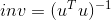 成立; 若 `upper` 设为 `False`, `u` 是一个下三角矩阵, 使得  成立.

参数：

*   `u (Tensor)` – the input 2D `Tensor`, a upper or lower triangular Cholesky factor
*   `upper (bool, 可选)` – Flag if upper (default) or lower triangular matrix
*   `out (Tensor, 可选)` – A Tensor for inv


示例：

```py
>>> a = torch.randn(3,3)
>>> a = torch.mm(a, a.t()) # make symmetric positive definite
>>> u = torch.potrf(a)
>>> a

 2.3563  3.2318 -0.9406
 3.2318  4.9557 -2.1618
-0.9406 -2.1618  2.2443
[torch.FloatTensor of size 3x3]

>>> torch.potri(u)

 12.5724 -10.1765  -4.5333
-10.1765   8.5852   4.0047
 -4.5333   4.0047   2.4031
[torch.FloatTensor of size 3x3]

>>> a.inverse()

 12.5723 -10.1765  -4.5333
-10.1765   8.5852   4.0047
 -4.5333   4.0047   2.4031
[torch.FloatTensor of size 3x3]

```

```py
torch.potrs(b, u, out=None)
```

potrs(b, u, upper, out=None)

Solves a linear system of equations with a positive semidefinite matrix to be inverted given its given a Cholesky factor matrix `u`: returns matrix `c` If `upper` is `True` or not provided, `u` is and upper triangular such that 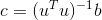. If `upper` is `False`, `u` is and lower triangular such that .

注解：

`b` is always a 2D `Tensor`, use `b.unsqueeze(1)` to convert a vector.

参数：

*   `b (Tensor)` – the right hand side 2D `Tensor`
*   `u (Tensor)` – the input 2D `Tensor`, a upper or lower triangular Cholesky factor
*   `upper (bool, 可选)` – Return upper (default) or lower triangular matrix
*   `out (Tensor, 可选)` – A Tensor for c


示例：

```py
>>> a = torch.randn(3,3)
>>> a = torch.mm(a, a.t()) # make symmetric positive definite
>>> u = torch.potrf(a)
>>> a

 2.3563  3.2318 -0.9406
 3.2318  4.9557 -2.1618
-0.9406 -2.1618  2.2443
[torch.FloatTensor of size 3x3]

>>> b = torch.randn(3,2)
>>> b

-0.3119 -1.8224
-0.2798  0.1789
-0.3735  1.7451
[torch.FloatTensor of size 3x2]

>>> torch.potrs(b,u)

 0.6187 -32.6438
-0.7234  27.0703
-0.6039  13.1717
[torch.FloatTensor of size 3x2]

>>> torch.mm(a.inverse(),b)

 0.6187 -32.6436
-0.7234  27.0702
-0.6039  13.1717
[torch.FloatTensor of size 3x2]

```

```py
torch.pstrf(a, out=None)
```

pstrf(a, upper, out=None)

Computes the pivoted Cholesky decomposition of a positive semidefinite matrix `a`: returns matrices `u` and `piv`. If `upper` is `True` or not provided, `u` is and upper triangular such that 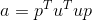, with `p` the permutation given by `piv`. If `upper` is `False`, `u` is and lower triangular such that 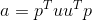.

参数：

*   `a (Tensor)` – the input 2D `Tensor`
*   `upper (bool, 可选)` – Return upper (default) or lower triangular matrix
*   `out (tuple, 可选)` – A tuple of u and piv Tensors


示例：

```py
>>> a = torch.randn(3,3)
>>> a = torch.mm(a, a.t()) # make symmetric positive definite
>>> a

 5.4417 -2.5280  1.3643
-2.5280  2.9689 -2.1368
 1.3643 -2.1368  4.6116
[torch.FloatTensor of size 3x3]

>>> u,piv = torch.pstrf(a)
>>> u

 2.3328  0.5848 -1.0837
 0.0000  2.0663 -0.7274
 0.0000  0.0000  1.1249
[torch.FloatTensor of size 3x3]

>>> piv

 0
 2
 1
[torch.IntTensor of size 3]

>>> p = torch.eye(3).index_select(0,piv.long()).index_select(0,piv.long()).t() # make pivot permutation
>>> torch.mm(torch.mm(p.t(),torch.mm(u.t(),u)),p) # reconstruct

 5.4417  1.3643 -2.5280
 1.3643  4.6116 -2.1368
-2.5280 -2.1368  2.9689
[torch.FloatTensor of size 3x3]

```

```py
torch.qr(input, out=None) -> (Tensor, Tensor)
```

计算矩阵 `input` 的 QR 分解. 返回矩阵 `q` 和 `r` 使得 , 且 `q` 是一个 正交矩阵, `r` 是一个上三角矩阵.

This returns the thin (reduced) QR factorization.

注解：

如果矩阵 `input` 中的元素太大, 那么精度可能会丢失.

注解：

尽管该函数总是能给您一个有效的分解, 但在不同平台上结果可能不同 - 取决于该平台上 LAPACK 的实现.

注解：

Irrespective of the original strides, the returned matrix `q` will be transposed, i.e. with strides `(1, m)` instead of `(m, 1)`.

参数：

*   `input (Tensor)` – the input 2D `Tensor`
*   `out (tuple, 可选)` – A tuple of Q and R Tensors


示例：

```py
>>> a = torch.Tensor([[12, -51, 4], [6, 167, -68], [-4, 24, -41]])
>>> q, r = torch.qr(a)
>>> q

-0.8571  0.3943  0.3314
-0.4286 -0.9029 -0.0343
 0.2857 -0.1714  0.9429
[torch.FloatTensor of size 3x3]

>>> r

 -14.0000  -21.0000   14.0000
 0.0000 -175.0000   70.0000
 0.0000    0.0000  -35.0000
[torch.FloatTensor of size 3x3]

>>> torch.mm(q, r).round()

 12  -51    4
 6  167  -68
 -4   24  -41
[torch.FloatTensor of size 3x3]

>>> torch.mm(q.t(), q).round()

 1 -0  0
-0  1  0
 0  0  1
[torch.FloatTensor of size 3x3]

```

```py
torch.svd(input, some=True, out=None) -> (Tensor, Tensor, Tensor)
```

`U, S, V = torch.svd(A)` 返回大小为 `(n x m)` 的实矩阵 `A` 的奇异值分解, 使得 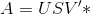.

`U` 的大小为 `n x n`

`S` 的大小为`n x m`

`V` 的大小为 `m x m`.

`some` 表示将被计算的奇异值的总数. 如果 `some=True`, 它将计算指定的 some 数量个奇异值, 如果 `some=False`, 则计算所有奇异值.

注解：

Irrespective of the original strides, the returned matrix `U` will be transposed, i.e. with strides `(1, n)` instead of `(n, 1)`.

参数：

*   `input (Tensor)` – the input 2D Tensor
*   `some (bool, 可选)` – controls the number of singular values to be computed
*   `out (tuple, 可选)` – the result tuple


示例：

```py
>>> a = torch.Tensor([[8.79,  6.11, -9.15,  9.57, -3.49,  9.84],
...                   [9.93,  6.91, -7.93,  1.64,  4.02,  0.15],
...                   [9.83,  5.04,  4.86,  8.83,  9.80, -8.99],
...                   [5.45, -0.27,  4.85,  0.74, 10.00, -6.02],
...                   [3.16,  7.98,  3.01,  5.80,  4.27, -5.31]]).t()
>>> a

 8.7900   9.9300   9.8300   5.4500   3.1600
 6.1100   6.9100   5.0400  -0.2700   7.9800
 -9.1500  -7.9300   4.8600   4.8500   3.0100
 9.5700   1.6400   8.8300   0.7400   5.8000
 -3.4900   4.0200   9.8000  10.0000   4.2700
 9.8400   0.1500  -8.9900  -6.0200  -5.3100
[torch.FloatTensor of size 6x5]

>>> u, s, v = torch.svd(a)
>>> u

-0.5911  0.2632  0.3554  0.3143  0.2299
-0.3976  0.2438 -0.2224 -0.7535 -0.3636
-0.0335 -0.6003 -0.4508  0.2334 -0.3055
-0.4297  0.2362 -0.6859  0.3319  0.1649
-0.4697 -0.3509  0.3874  0.1587 -0.5183
 0.2934  0.5763 -0.0209  0.3791 -0.6526
[torch.FloatTensor of size 6x5]

>>> s

 27.4687
 22.6432
 8.5584
 5.9857
 2.0149
[torch.FloatTensor of size 5]

>>> v

-0.2514  0.8148 -0.2606  0.3967 -0.2180
-0.3968  0.3587  0.7008 -0.4507  0.1402
-0.6922 -0.2489 -0.2208  0.2513  0.5891
-0.3662 -0.3686  0.3859  0.4342 -0.6265
-0.4076 -0.0980 -0.4932 -0.6227 -0.4396
[torch.FloatTensor of size 5x5]

>>> torch.dist(a, torch.mm(torch.mm(u, torch.diag(s)), v.t()))
8.934150226306685e-06

```

```py
torch.symeig(input, eigenvectors=False, upper=True, out=None) -> (Tensor, Tensor)
```

`e, V = torch.symeig(input)` 返回实对称矩阵 `input` 的特征值和特征向量.

`input` 和 `V` 是 `m x m` 矩阵, `e` 是一个 `m` 维的向量.

这个函数计算矩阵 `input` 的所有特征值 (和向量), 使得 `input = V diag(e) V’`.

布尔参数 `eigenvectors` 定义了是否计算特征向量. 如果它为 `False`, 那么只有特征值会被计算. 如果它为 `True`, 特征值和特征向量都会被计算.

由于输入矩阵 `input` 被假定是对称的, 因此默认地只有它的上三角部分会被使用.

如果 `upper` 是 `False`, 那么它的下三角部分会被使用.

Note: Irrespective of the original strides, the returned matrix `V` will be transposed, i.e. with strides `(1, m)` instead of `(m, 1)`.

参数：

*   `input (Tensor)` – the input symmetric matrix
*   `eigenvectors (boolean, 可选)` – controls whether eigenvectors have to be computed
*   `upper (boolean, 可选)` – controls whether to consider upper-triangular or lower-triangular region
*   `out (tuple, 可选)` – The result tuple of (Tensor, Tensor)


Examples:

```py
>>> a = torch.Tensor([[ 1.96,  0.00,  0.00,  0.00,  0.00],
...                   [-6.49,  3.80,  0.00,  0.00,  0.00],
...                   [-0.47, -6.39,  4.17,  0.00,  0.00],
...                   [-7.20,  1.50, -1.51,  5.70,  0.00],
...                   [-0.65, -6.34,  2.67,  1.80, -7.10]]).t()

>>> e, v = torch.symeig(a, eigenvectors=True)
>>> e

-11.0656
 -6.2287
 0.8640
 8.8655
 16.0948
[torch.FloatTensor of size 5]

>>> v

-0.2981 -0.6075  0.4026 -0.3745  0.4896
-0.5078 -0.2880 -0.4066 -0.3572 -0.6053
-0.0816 -0.3843 -0.6600  0.5008  0.3991
-0.0036 -0.4467  0.4553  0.6204 -0.4564
-0.8041  0.4480  0.1725  0.3108  0.1622
[torch.FloatTensor of size 5x5]

```

```py
torch.trtrs()
```