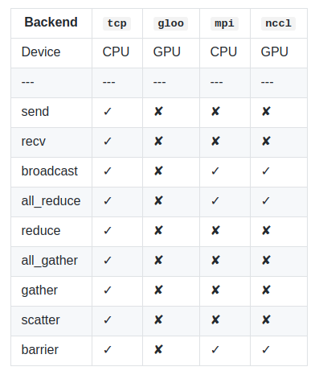
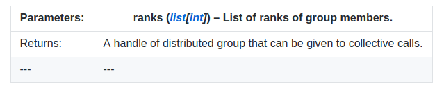

# 分布式通信包(已弃用）-torch.distributed.deprecated
**警告**

torch.distributed.deprecated 是 torch.distributed 的早期版本，当前已被弃用，并且很快将被删除。请参照使用 torch.distributed 的文档，这是PyTorch最新的分布式通信包。

torch.distributed提供类似MPI的接口，用于跨多机网络交换张量数据。它提供一些不同的后台并且支持不同的初始化方法。

当前的torch.distributed.deprecated支持四个后台，每个都有不同的功能。这个表展示了对于CPU/GPU张量来说，哪些函数是可以使用的。只有在用于构建PyTorch的实现支持时，MPI才支持cuda。

## 基础

torch.distributed.deprecated为在一台或多台机器上运行的多个计算节点上的多进程并行性提供PyTorch支持和通信原语。torch.nn.parallel.deprecated.DistributedDataParallel()类以此功能为基础，提供同步分布式训练，作为任何PyTorch模型的包装器。这与Multiprocessing包提供的那种并行性不同，[torch.multiprocessing](https://github.com/luxinfeng/pytorch-doc-zh/blob/master/docs/1.0/multiprocessing.html)和[torch.nn.DataParallel()](https://github.com/luxinfeng/pytorch-doc-zh/blob/master/docs/1.0/nn.html#torch.nn.DataParallel)支持多个联网的计算机，并且用户必须为每个进程显式地启动主要训练脚本的独立副本。

在单机同步的情况下，torch.distributed.deprecated或者torch.nn.parallel.deprecated.DistributedDataParallel()包装器仍比其他数据并行方法有优势，包括[torch.nn.DataParallel()](https://github.com/luxinfeng/pytorch-doc-zh/blob/master/docs/1.0/nn.html#torch.nn.DataParallel):
* 每个进程都维护自己的优化器，并在每次迭代时执行完整的优化步骤。虽然这可能看似多余，但由于梯度已经聚集在一起并且在整个过程中进行平均，因此对于每个过程都是相同的，这意味着不需要参数广播步骤，从而减少了在节点之间传输张量所花费的时间
* 每个进程都包含一个独立的Python解释器，消除了额外的解释器开销以及来自单个Python进程驱动多个执行单元、模型副本或者GPUs的“GIL-thrashing”

## 初始化

在调用任何其他方法之前，需要使用[torch.distributed.deprecated.init_process_group(）](https://github.com/luxinfeng/pytorch-doc-zh/blob/master/docs/1.0/distributed_deprecated.md#torch.distributed.deprecated.init_process_group)函数初始化包。这将阻止所有进程加入。

    torch.distributed.deprecated.init_process_group(backend, init_method='env://', **kwargs)

初始化分布式包

参数：
* backend(str)-待使用后台的名字。取决于构建时配置有效值，包括：tco,mpi,gloo以及nccl。
* init_method(str,optional)-指定如何初始化包的URL
* world_size(int,optional)-参与的进程数量
* rank(int,optional)-当前进程的等级
* group_name(str,optional)-组名。可以参考初始化方法的描述。

设置backend == mpi，需要在支持MPI的系统上用源码构建。如果您想使用支持CUDA的Open MPI，请使用Open MPI主要版本2及更高版本。

**注意**

此方法初始化CUDA上下文。 因此，如果多个进程在单个计算机上运行但使用不同的GPU，请确保在此方法之前使用[torch.cuda.set_device(）](https://github.com/luxinfeng/pytorch-doc-zh/blob/master/docs/1.0/cuda.html#torch.cuda.set_device)以避免在第一个可见设备上不必要地创建上下文。

    torch.distributed.deprecated.get_rank()

返回当前进程的等级。Rank是分配给分布式组中每个进程的唯一标识符。 它们总是连续的整数，范围从0到world_size  -  1(包括）。

    torch.distributed.deprecated.get_world_size()

返回分布式组中进程的数量。

当前支持三种初始化方法：

## TCP初始化

有两种使用TCP初始化的方法，两种方法都需要从所有进程可以访问的网络地址和所需的world_size。 第一种方法需要指定属于rank 0进程的地址。 此初始化方法要求所有进程都具有手动指定的等级。

或者，地址必须是有效的IP多播地址，在这种情况下，可以自动分配等级。 多播初始化还支持group_name参数，该参数允许您为多个作业使用相同的地址，只要它们使用不同的组名称即可。

    import torch.distributed.deprecated as dist

    #Use address of one of the machines
    dist.init_process_group(backend, init_method='tcp://10.1.1.20:23456', rank=args.rank, world_size=4)

    #or a multicast address - rank will be assigned automatically if unspecified
    dist.init_process_group(backend,init_method='tcp://[ff15:1e18:5d4c:4cf0:d02d:b659:53ba:b0a7]:23456',world_size=4)

## 共享文件系统初始化

另一种初始化方法使用从组中的所有机器共享和可见的文件系统，以及期望的world_size。 URL应以file：//开头，并包含共享文件系统上不存在的文件(在现有目录中）的路径。 此初始化方法还支持group_name参数，该参数允许您为多个作业使用相同的共享文件路径，只要它们使用不同的组名称即可。

**警告**

此方法假定文件系统支持使用fcntl进行锁定 - 大多数本地系统和NFS都支持它

    import torch.distributed.deprecated as dist

    #Rank will be assigned automatically if unspecified
    dist.init_process_group(backend, init_method='file:///mnt/nfs/sharedfile',
                        world_size=4, group_name=args.group)

## 环境变量初始化

此方法将从环境变量中读取配置，从而可以完全自定义信息的获取方式。 要设置的变量是：

* MASTER_PORT-必要；必须是机器上的自由端口且等级为0
* MASTER_ADDR-必要(除非等级为0）；等级为0的节点的地址
* WORLD_SIZE-必要；可以在这里设置，也可以在调用初始化函数中
* RANK-必要；可以在这里设置，也可以在调用初始化函数中

等级为0的机器将用于设置所有连接。

这是默认方法，这意味着不必指定init_method(或者可以是env：//）。

## 组

默认情况下，集合体在默认组(也称为世界）上运行，并要求所有进程都进入分布式函数调用。但是，一些工作负载可以从更细粒度的通信中受益。 这是分布式群体发挥作用的地方。[new_group()](https://github.com/luxinfeng/pytorch-doc-zh/blob/master/docs/1.0/distributed_deprecated.md#torch.distributed.deprecated.new_group)函数可以用来创建具有所有进程的任意子集的新组。它返回一个不透明的组句柄，可以作为所有集合体的组参数给出(集合体是分布式函数，用于在某些众所周知的编程模式中交换信息）。

    torch.distributed.deprecated.new_group(ranks=None)

创建一个新的分布式组。

此功能要求主组中的所有进程(即，作为分布式作业一部分的所有进程）都进入此功能，即使它们不是该组的成员也是如此。 此外，应在所有进程中以相同的顺序创建组。

## 点到点通讯

    torch.distributed.deprecated.send(tensor, dst)

同步发送张量。

参数：

* tensor(Tensor)-接受数据的张量
* dst(int)-目的等级

      orch.distributed.deprecated.recv(tensor, src=None)

同步接收张量。

参数：

* tensor(Tensor)-接收数据的张量
* src(int,optional)-源等级，如果未指定，将会接受任意进程的数据

[isend(）](https://github.com/luxinfeng/pytorch-doc-zh/blob/master/docs/1.0/distributed_deprecated.md#torch.distributed.deprecated.isend)和[irecv(）](https://github.com/luxinfeng/pytorch-doc-zh/blob/master/docs/1.0/distributed_deprecated.md#torch.distributed.deprecated.irecv)在使用时返回分布式请求对象。 通常，此对象的类型未指定，因为它们永远不应手动创建，但它们保证支持两种方法：

* is_completed()-操作完成返回真
* wait()-将阻止该过程，直到操作完成。 is_completed(）保证一旦返回就返回True。

当使用MPI后台时，[isend()](https://github.com/luxinfeng/pytorch-doc-zh/blob/master/docs/1.0/distributed_deprecated.md#torch.distributed.deprecated.isend)和[irecv()](https://github.com/luxinfeng/pytorch-doc-zh/blob/master/docs/1.0/distributed_deprecated.md#torch.distributed.deprecated.irecv)支持非插队特性，这样可以保证信息的顺序。关于更多细节，请访问 http://mpi-forum.org/docs/mpi-2.2/mpi22-report/node54.htm#Node54

    torch.distributed.deprecated.isend(tensor, dst)

异步发送张量。

参数：

* tensor(Tensor)-发送的张量
* dst(int)-目的等级

    torch.distributed.deprecated.irecv(tensor, src)

异步接收张量

参数：

* tensor(Tensor)-接收数据的张量
* src(int)-源等级

## 集体函数

    torch.distributed.deprecated.broadcast(tensor, src, group=<object object>)

将张量广播到整个组。

tensor必须在参与集合体的所有过程中具有相同数量的元素。

参数：

* tensor(Tensor)-如果src是当前进程的等级，则发送数据，否则张量则用于保存接收的数据。
* src(int)-源等级
* group(optional)-整体的组

      torch.distributed.deprecated.all_reduce(tensor, op=<object object>, group=<object object>)

减少所有机器上的张量数据，以便获得最终结果。

在所有进程中调用张量将按位相同。

参数：

* tensor(Tensor)-集体的输入和输出，该函数原地运行
* op(optional)-一个来自torch.distributed.deprecated.reduce_op枚举的值。指定一个操作用于逐元素减少
* group(optional)-整体的组

      torch.distributed.deprecated.reduce(tensor, dst, op=<object object>, group=<object object>)  

减少所有机器的张量数据。

只有等级为dst的进程将接收最终结果。

参数：

* tensor(tensor)-集体的输入和输出，该函数原地运行
* dst(int)-目的等级
* op(optional)-一个来自torch.distributed.deprecated.reduce_op枚举的值。指定一个操作用于逐元素减少
* group(optional)-整体的组

      torch.distributed.deprecated.all_gather(tensor_list, tensor, group=<object object>)

从列表中收集整个组的张量。

参数：

* tensor_list(list[Tensor])-输出列表。它包括用来作为整体输出的正确尺寸的张量。
* tensor(tensor)-在当前进程进行广播的张量
* group(optional)-整体的组

      torch.distributed.deprecated.gather(tensor, **kwargs)

从单个进程中收集张量列表。

参数：

* tensor(Tensor)-输入的张量
* dst(int)-目的等级。除了接收数据的进程外，其余进程都需要这个值
* gather_list(list[Tensor])-用于接收数据的适当大小的张量列表。 仅在接收进程中需要。
* group(optional)-整体的组

      torch.distributed.deprecated.scatter(tensor, **kwargs)

将张量列表分散到组中的所有进程。

每个进程将只接收一个张量并将其数据存储在tensor参数中。

参数：

* tensor(Tensor） - 输出张量。
* src(int） - 源排名。除发送数据的进程外，在所有进程中都是必需的。
* scatter_list(list [ Tensor ]） - 要分散的张量列表。仅在发送数据的过程中需要。
* group(optional)-整体的组

      torch.distributed.deprecated.barrier(group = < object  object >）

同步所有进程。

此集合会阻止进程，直到整个组进入此函数。

## 多GPU整体函数

如果每个节点上有多个GPU，则在使用NCCL后端时，支持每个节点内多个GPU之间的分布式集合操作。这些函数可以潜在地提高整体分布式训练性能，并通过传递张量列表轻松使用。传递的张量列表中的每个Tensor需要位于调用该函数的主机的单独GPU设备上。请注意，张量列表的长度在所有分布式进程中需要相同。另请注意，目前只有NCCL后端支持多GPU整体函数。[broadcast_multigpu()](https://github.com/luxinfeng/pytorch-doc-zh/blob/master/docs/1.0/distributed_deprecated.md#torch.distributed.deprecated.broadcast_multigpu)[all_reduce_multigpu()](https://github.com/luxinfeng/pytorch-doc-zh/blob/master/docs/1.0/distributed_deprecated.md#torch.distributed.deprecated.all_reduce_multigpu)[reduce_multigpu()](https://github.com/luxinfeng/pytorch-doc-zh/blob/master/docs/1.0/distributed_deprecated.md#torch.distributed.deprecated.reduce_multigpu)[all_gather_multigpu()](https://github.com/luxinfeng/pytorch-doc-zh/blob/master/docs/1.0/distributed_deprecated.md#torch.distributed.deprecated.all_gather_multigpu)

例如，如果我们用于分布式训练的系统有2个节点，每个节点有8个GPU。在16个GPU中的每一个上，都有一个我们希望减少的张量。以下代码可以作为参考：

代码在节点0上运行：

    import torch
    import torch.distributed.deprecated as dist

    dist.init_process_group(backend="nccl",
                            init_method="file:///distributed_test",
                            world_size=2,
                            rank=0)
    tensor_list = []
    for dev_idx in range(torch.cuda.device_count()):
        tensor_list.append(torch.FloatTensor([1]).cuda(dev_idx))

    dist.all_reduce_multigpu(tensor_list)

代码在节点1上运行：

    import torch
    import torch.distributed.deprecated as dist

    dist.init_process_group(backend="nccl",
                            init_method="file:///distributed_test",
                            world_size=2,
                            rank=1)
    tensor_list = []
    for dev_idx in range(torch.cuda.device_count()):
        tensor_list.append(torch.FloatTensor([1]).cuda(dev_idx))

    dist.all_reduce_multigpu(tensor_list)

调用结束后，两个节点上的16个张量均具有16的全减值。

    torch.distributed.deprecated.broadcast_multigpu(tensor_list, src, group=<object object>)

使用每个节点多个GPU张量将张量广播到整个组。

tensor必须在参与集合体的所有进程的所有GPU中具有相同数量的元素。列表中的每个张量必须位于不同的GPU上。

**注意**

目前仅支持NCCL后端。tensor_list应该只包含GPU张量。

参数：
* tensor_list(List _ [ Tensor ] _) - 整体的输入和输出张量列表。该函数原地运行，并要求每个张量在不同的GPU上为GPU张量。您还需要确保len(tensor_list)调用此函数的所有分布式进程都是相同的。
*  op(optional） - torch.distributed.deprecated.reduce_op枚举中的一个值。指定用于逐元素减少的操作。
* group(optional)-整体的组

      torch.distributed.deprecated.reduce_multigpu(tensor_list，dst，op = < object  object >，group = < object  object >）

减少所有计算机上多个GPU的张量数据。每个张量：attr tensor_list应该驻留在一个单独的GPU上。

只有tensor_list[0]的GPU上的等级为dst的进程可以接收最终值。

**注意**

目前仅支持NCCL后端。tensor_list应该只包含GPU张量。

参数：
* tensor_list(List _ [ Tensor ] _) -整体的输入和输出张量列表。该函数原地运行，并要求每个张量在不同的GPU上为GPU张量。您还需要确保len(tensor_list)调用此函数的所有分布式进程都是相同的。
* dst(int)-目的等级
* op(optional） - torch.distributed.deprecated.reduce_op枚举中的一个值。指定用于逐元素减少的操作。
* group(optional)-整体的组

      torch.distributed.deprecated.all_gather_multigpu(output_tensor_lists，input_tensor_list，group = < object  object >）

从列表中收集整个组的张量。每个张量input_tensor_list应位于单独的GPU上。

**注意**

目前仅支持NCCL后端。output_tensor_lists和input_tensor_list应该只包含GPU张量。

参数：
* output_tensor_lists(List _ [ List [ Tensor ] __] _） - 输出列表。它应该在每个GPU上包含正确大小的张量，以用于整体的输出。例如，output_tensor_lists[i]包含驻留在GPU上的all_gather结果input_tensor_list[i]。请注意，每个元素output_tensor_lists[i]的大小都是world_size * len(input_tensor_list)，因为函数都会从组中的每个GPU中收集结果。为了解释每个元素output_tensor_list[i]，请注意input_tensor_list[j]等级k将出现在output_tensor_list[i][rank * world_size + j]另外注意len(output_tensor_lists)，并且因此，每个元素的大小output_tensor_lists(每个元素是一个列表len(output_tensor_lists[i])）对于调用此函数的所有分布式进程都需要相同。
* input_tensor_list(List _ [ Tensor ] _） - 要从当前进程广播的张量列表(在不同的GPU上）。请注意，len(input_tensor_list)调用此函数的所有分布式进程需要相同。
* group(optional)-整体的组

## 启动实用程序

该torch.distributed.deprecated软件包还提供了一个启动实用程序torch.distributed.deprecated.launch。

torch.distributed.launch 是一个模块，它在每个训练节点上产生多个分布式训练过程。

该实用程序可用于单节点分布式训练，其中将生成每个节点的一个或多个进程。该应用程序可以用CPU或者GPU训练。这可以实现良好改进的单节点训练性能。它还可以用于多节点分布式训练，通过在每个节点上产生多个进程来获得良好改进的多节点分布式训练性能。这对于具有多个具有直接GPU支持的Infiniband接口的系统尤其有利，因为所有这些接口都可用于聚合通信带宽。

在单节点分布式训练或多节点分布式训练的两种情况下，该实用程序将为每个节点启动给定数量的进程(--nproc_per_node）。如果用于GPU训练，则此数字需要小于或等于当前系统上的GPU数量(nproc_per_node），并且每个进程将在GPU 0到GPU(nproc_per_node - 1）的单个GPU上运行。

### 如何使用这个模块：
1. 单节点多进程分布式训练

       >>>python -m torch.distributed.launch --nproc_per_node=NUM_GPUS_YOU_HAVE
       YOUR_TRAINING_SCRIPT.py(--arg1 --arg2 --arg3 and all other arguments of your training script)

1. 多节点多进程分布式训练:(比如，两个节点)

节点1：(IP:192.168.1.1,一个自由接口：1234)

    >>> python -m torch.distributed.launch --nproc_per_node=NUM_GPUS_YOU_HAVE
    --nnodes=2 --node_rank=0 --master_addr="192.168.1.1"
    --master_port=1234 YOUR_TRAINING_SCRIPT.py (--arg1 --arg2 --arg3
    and all other arguments of your training script)

节点2：

    >>> python -m torch.distributed.launch --nproc_per_node=NUM_GPUS_YOU_HAVE
     --nnodes=2 --node_rank=1 --master_addr="192.168.1.1"
     --master_port=1234 YOUR_TRAINING_SCRIPT.py (--arg1 --arg2 --arg3
    and all other arguments of your training script)

 1. 要查找此模块提供的可选参数：

        >>> python -m torch.distributed.launch --help

**重要提示**

1. 此实用和多进程分布式(单节点或多节点）GPU训练目前仅使用NCCL分布式后端实现最佳性能。因此，NCCL后端是用于GPU训练的推荐后端。
2. 在训练程序中，必须解析命令行参数：--local_rank=LOCAL_PROCESS_RANK，该参数将由此模块提供。如果您的训练计划使用GPU，则应确保您的代码仅在LOCAL_PROCESS_RANK的GPU设备上运行。这可以通过以下方式完成：

解析local_rank参数

    >>> import argparse
    >>> parser = argparse.ArgumentParser()
    >>> parser.add_argument("--local_rank", type=int)
    >>> args = parser.parse_args()

使用其中一个将您的设备设置为本地等级

    >>> torch.cuda.set_device(arg.local_rank)  # before your code runs

或

    >>> with torch.cuda.device(arg.local_rank):
    >>>    # your code to run

3. 在训练程序中，您应该在开始时调用以下函数来启动分布式后端。您需要确保init_method使用env://，这是init_method此模块唯一支持的。

       torch.distributed.init_process_group(backend='YOUR BACKEND',
                                     init_method='env://')

4. 在你的训练程序中，你可以选择常规分布式函数或使用[torch.nn.parallel.DistributedDataParallel()](https://github.com/luxinfeng/pytorch-doc-zh/blob/master/docs/1.0/nn.html#torch.nn.parallel.DistributedDataParallel)。如果计划使用GPU训练，并且您希望使用[torch.nn.parallel.DistributedDataParallel()](https://github.com/luxinfeng/pytorch-doc-zh/blob/master/docs/1.0/nn.html#torch.nn.parallel.DistributedDataParallel)模块，以下是如何配置它。

       model = torch.nn.parallel.DistributedDataParallel(model，
                                                       device_ids = [arg.local_rank]，
                                                       output_device = arg.local_rank）

请确保将device_ids参数设置为您的代码将在其上运行的唯一GPU设备ID。这通常是程序的本地排名。换句话说，为了使用这个实用程序，device_ids需要是[args.local_rank]，并且output_device需要是args.local_rank。

**警告**

local_rank并非全局唯一：它在计算机上的每个进程唯一。因此，不要使用它来决定是否应该写入网络文件系统。有关如何正确执行此操作可能出错的示例，请参阅https://github.com/pytorch/pytorch/issues/12042。
