# 概率分布 - torch.distributions

> 译者：[hijkzzz](https://github.com/hijkzzz)

`distributions` 包含可参数化的概率分布和采样函数. 这允许构造用于优化的随机计算图和随机梯度估计器.  这个包一般遵循 [TensorFlow Distributions](https://arxiv.org/abs/1711.10604) 包的设计.

通常, 不可能直接通过随机样本反向传播.  但是, 有两种主要方法可创建可以反向传播的代理函数.  即得分函数估计器/似然比估计器/REINFORCE和pathwise derivative估计器.  REINFORCE通常被视为强化学习中策略梯度方法的基础, 并且pathwise derivative估计器常见于变分自动编码器中的重新参数化技巧. 得分函数仅需要样本的值 , pathwise derivative 需要导数 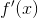. 接下来的部分将在一个强化学习示例中讨论这两个问题.  有关详细信息, 请参阅 [Gradient Estimation Using Stochastic Computation Graphs](https://arxiv.org/abs/1506.05254) .

## 得分函数

当概率密度函数相对于其参数可微分时, 我们只需要`sample()`和`log_prob()`来实现REINFORCE:

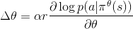

 是参数,  是学习速率,  是奖励 并且  是在状态  以及给定策略 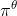执行动作  的概率.

在实践中, 我们将从网络输出中采样一个动作, 将这个动作应用于一个环境中, 然后使用`log_prob`构造一个等效的损失函数. 请注意, 我们使用负数是因为优化器使用梯度下降, 而上面的规则假设梯度上升. 有了确定的策略, REINFORCE的实现代码如下:

```py
probs = policy_network(state)
# Note that this is equivalent to what used to be called multinomial
m = Categorical(probs)
action = m.sample()
next_state, reward = env.step(action)
loss = -m.log_prob(action) * reward
loss.backward()

```

## Pathwise derivative

实现这些随机/策略梯度的另一种方法是使用来自`rsample()`方法的重新参数化技巧, 其中参数化随机变量可以通过无参数随机变量的参数确定性函数构造.  因此, 重新参数化的样本变得可微分.  实现Pathwise derivative的代码如下:

```py
params = policy_network(state)
m = Normal(*params)
# Any distribution with .has_rsample == True could work based on the application
action = m.rsample()
next_state, reward = env.step(action)  # Assuming that reward is differentiable
loss = -reward
loss.backward()

```

## 分布

```py
class torch.distributions.distribution.Distribution(batch_shape=torch.Size([]), event_shape=torch.Size([]), validate_args=None)
```

基类: [`object`](https://docs.python.org/3/library/functions.html#object "(in Python v3.7)")

Distribution是概率分布的抽象基类.

```py
arg_constraints
```

从参数名称返回字典到 [`Constraint`](#torch.distributions.constraints.Constraint "torch.distributions.constraints.Constraint") 对象(应该满足这个分布的每个参数）.不是张量的arg不需要出现在这个字典中.

```py
batch_shape
```

返回批量参数的形状.

```py
cdf(value)
```

返回`value`处的累积密度/质量函数估计.

| 参数: | **value** ([_Tensor_](tensors.html#torch.Tensor "torch.Tensor")) – |


```py
entropy()
```

返回分布的熵, 批量的形状为 batch_shape.

| 返回值: | Tensor 形状为 batch_shape. |


```py
enumerate_support(expand=True)
```

返回包含离散分布支持的所有值的张量. 结果将在维度0上枚举, 所以结果的形状将是 `(cardinality,) + batch_shape + event_shape` (对于单变量分布 `event_shape = ()`).

注意, 这在lock-step中枚举了所有批处理张量`[[0, 0], [1, 1], …]`. 当 `expand=False`, 枚举沿着维度 0进行, 但是剩下的批处理维度是单维度, `[[0], [1], ..`.

遍历整个笛卡尔积的使用 `itertools.product(m.enumerate_support())`.

| 参数: | **expand** ([_bool_](https://docs.python.org/3/library/functions.html#bool "(in Python v3.7)")) – 是否扩展对批处理dim的支持以匹配分布的 `batch_shape`. |

| 返回值: | 张量在维上0迭代. |


```py
event_shape
```

返回单个样本的形状 (非批量).

```py
expand(batch_shape, _instance=None)
```

返回一个新的分布实例(或填充派生类提供的现有实例), 其批处理维度扩展为 `batch_shape`.  这个方法调用 [`expand`](tensors.html#torch.Tensor.expand "torch.Tensor.expand") 在分布的参数上. 因此, 这不会为扩展的分布实例分配新的内存.  此外, 第一次创建实例时, 这不会在中重复任何参数检查或参数广播在 `__init__.py`.

参数: 

*   **batch_shape** (_torch.Size_) – 所需的扩展尺寸.
*   **_instance** – 由需要重写`.expand`的子类提供的新实例.


| 返回值: | 批处理维度扩展为`batch_size`的新分布实例. |


```py
icdf(value)
```

 返回按`value`计算的反向累积密度/质量函数.

| 参数: | **value** ([_Tensor_](tensors.html#torch.Tensor "torch.Tensor")) – |


```py
log_prob(value)
```

返回按`value`计算的概率密度/质量函数的对数.

| 参数: | **value** ([_Tensor_](tensors.html#torch.Tensor "torch.Tensor")) – |


```py
mean
```

返回分布的平均值.

```py
perplexity()
```

返回分布的困惑度, 批量的关于 batch_shape.

| 返回值: | 形状为 batch_shape 的张量. |


```py
rsample(sample_shape=torch.Size([]))
```

如果分布的参数是批量的, 则生成sample_shape形状的重新参数化样本或sample_shape形状的批量重新参数化样本.

```py
sample(sample_shape=torch.Size([]))
```

如果分布的参数是批量的, 则生成sample_shape形状的样本或sample_shape形状的批量样本.

```py
sample_n(n)
```

如果分布参数是分批的, 则生成n个样本或n批样本.

```py
stddev
```

返回分布的标准差.

```py
support
```

返回[`Constraint`](#torch.distributions.constraints.Constraint "torch.distributions.constraints.Constraint") 对象表示该分布的支持.

```py
variance
```

返回分布的方差.

## ExponentialFamily

```py
class torch.distributions.exp_family.ExponentialFamily(batch_shape=torch.Size([]), event_shape=torch.Size([]), validate_args=None)
```

基类: [`torch.distributions.distribution.Distribution`](#torch.distributions.distribution.Distribution "torch.distributions.distribution.Distribution")

指数族是指数族概率分布的抽象基类, 其概率质量/密度函数的形式定义如下

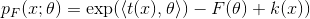

 表示自然参数,  表示充分统计量,  是给定族的对数归一化函数   是carrier measure.

注意

该类是`Distribution`类与指数族分布之间的中介, 主要用于检验`.entropy()`和解析KL散度方法的正确性. 我们使用这个类来计算熵和KL散度使用AD框架和Bregman散度 (出自: Frank Nielsen and Richard Nock, Entropies and Cross-entropies of Exponential Families).

```py
entropy()
```

利用对数归一化器的Bregman散度计算熵的方法.

## Bernoulli

```py
class torch.distributions.bernoulli.Bernoulli(probs=None, logits=None, validate_args=None)
```

基类: [`torch.distributions.exp_family.ExponentialFamily`](#torch.distributions.exp_family.ExponentialFamily "torch.distributions.exp_family.ExponentialFamily")

创建参数化的伯努利分布, 根据 [`probs`](#torch.distributions.bernoulli.Bernoulli.probs "torch.distributions.bernoulli.Bernoulli.probs") 或者 [`logits`](#torch.distributions.bernoulli.Bernoulli.logits "torch.distributions.bernoulli.Bernoulli.logits") (但不是同时都有).

样本是二值的 (0 或者 1). 取值 `1` 伴随概率 `p` , 或者 `0` 伴随概率 `1 - p`.

例子:

```py
>>> m = Bernoulli(torch.tensor([0.3]))
>>> m.sample()  # 30% chance 1; 70% chance 0
tensor([ 0.])

```

参数: 

*   **probs** (_Number__,_ [_Tensor_](tensors.html#torch.Tensor "torch.Tensor")) – the probabilty of sampling `1`
*   **logits** (_Number__,_ [_Tensor_](tensors.html#torch.Tensor "torch.Tensor")) – the log-odds of sampling `1`


```py
arg_constraints = {'logits': Real(), 'probs': Interval(lower_bound=0.0, upper_bound=1.0)}
```

```py
entropy()
```

```py
enumerate_support(expand=True)
```

```py
expand(batch_shape, _instance=None)
```

```py
has_enumerate_support = True
```

```py
log_prob(value)
```

```py
logits
```

```py
mean
```

```py
param_shape
```

```py
probs
```

```py
sample(sample_shape=torch.Size([]))
```

```py
support = Boolean()
```

```py
variance
```

## Beta

```py
class torch.distributions.beta.Beta(concentration1, concentration0, validate_args=None)
```

基类: [`torch.distributions.exp_family.ExponentialFamily`](#torch.distributions.exp_family.ExponentialFamily "torch.distributions.exp_family.ExponentialFamily")

Beta 分布, 参数为 [`concentration1`](#torch.distributions.beta.Beta.concentration1 "torch.distributions.beta.Beta.concentration1") 和 [`concentration0`](#torch.distributions.beta.Beta.concentration0 "torch.distributions.beta.Beta.concentration0").

例子:

```py
>>> m = Beta(torch.tensor([0.5]), torch.tensor([0.5]))
>>> m.sample()  # Beta distributed with concentration concentration1 and concentration0
tensor([ 0.1046])

```

参数: 

*   **concentration1** ([_float_](https://docs.python.org/3/library/functions.html#float "(in Python v3.7)") _or_ [_Tensor_](tensors.html#torch.Tensor "torch.Tensor")) – 分布的第一个浓度参数(通常称为alpha）
*   **concentration0** ([_float_](https://docs.python.org/3/library/functions.html#float "(in Python v3.7)") _or_ [_Tensor_](tensors.html#torch.Tensor "torch.Tensor")) – 分布的第二个浓度参数(通常称为beta)


```py
arg_constraints = {'concentration0': GreaterThan(lower_bound=0.0), 'concentration1': GreaterThan(lower_bound=0.0)}
```

```py
concentration0
```

```py
concentration1
```

```py
entropy()
```

```py
expand(batch_shape, _instance=None)
```

```py
has_rsample = True
```

```py
log_prob(value)
```

```py
mean
```

```py
rsample(sample_shape=())
```

```py
support = Interval(lower_bound=0.0, upper_bound=1.0)
```

```py
variance
```

## Binomial

```py
class torch.distributions.binomial.Binomial(total_count=1, probs=None, logits=None, validate_args=None)
```

基类: [`torch.distributions.distribution.Distribution`](#torch.distributions.distribution.Distribution "torch.distributions.distribution.Distribution")

创建一个Binomial 分布, 参数为 `total_count` 和 [`probs`](#torch.distributions.binomial.Binomial.probs "torch.distributions.binomial.Binomial.probs") 或者 [`logits`](#torch.distributions.binomial.Binomial.logits "torch.distributions.binomial.Binomial.logits") (但不是同时都有使用). `total_count` 必须和 [`probs`] 之间可广播(#torch.distributions.binomial.Binomial.probs "torch.distributions.binomial.Binomial.probs")/[`logits`](#torch.distributions.binomial.Binomial.logits "torch.distributions.binomial.Binomial.logits").

例子:

```py
>>> m = Binomial(100, torch.tensor([0 , .2, .8, 1]))
>>> x = m.sample()
tensor([   0.,   22.,   71.,  100.])

>>> m = Binomial(torch.tensor([[5.], [10.]]), torch.tensor([0.5, 0.8]))
>>> x = m.sample()
tensor([[ 4.,  5.],
 [ 7.,  6.]])

```

参数: 

*   **total_count** ([_int_](https://docs.python.org/3/library/functions.html#int "(in Python v3.7)") _or_ [_Tensor_](tensors.html#torch.Tensor "torch.Tensor")) – 伯努利试验次数
*   **probs** ([_Tensor_](tensors.html#torch.Tensor "torch.Tensor")) – 事件概率
*   **logits** ([_Tensor_](tensors.html#torch.Tensor "torch.Tensor")) – 事件 log-odds


```py
arg_constraints = {'logits': Real(), 'probs': Interval(lower_bound=0.0, upper_bound=1.0), 'total_count': IntegerGreaterThan(lower_bound=0)}
```

```py
enumerate_support(expand=True)
```

```py
expand(batch_shape, _instance=None)
```

```py
has_enumerate_support = True
```

```py
log_prob(value)
```

```py
logits
```

```py
mean
```

```py
param_shape
```

```py
probs
```

```py
sample(sample_shape=torch.Size([]))
```

```py
support
```

```py
variance
```

## Categorical

```py
class torch.distributions.categorical.Categorical(probs=None, logits=None, validate_args=None)
```

基类: [`torch.distributions.distribution.Distribution`](#torch.distributions.distribution.Distribution "torch.distributions.distribution.Distribution")

创建一个 categorical 分布, 参数为 [`probs`](#torch.distributions.categorical.Categorical.probs "torch.distributions.categorical.Categorical.probs") 或者 [`logits`](#torch.distributions.categorical.Categorical.logits "torch.distributions.categorical.Categorical.logits") (但不是同时都有).

注意

它等价于从 [`torch.multinomial()`](torch.html#torch.multinomial "torch.multinomial") 的采样.

样本是整数来自 `K` 是 `probs.size(-1)`.

如果 [`probs`](#torch.distributions.categorical.Categorical.probs "torch.distributions.categorical.Categorical.probs") 是 1D 的, 长度为`K`, 每个元素是在该索引处对类进行抽样的相对概率.

如果 [`probs`](#torch.distributions.categorical.Categorical.probs "torch.distributions.categorical.Categorical.probs") 是 2D 的, 它被视为一组相对概率向量.

注意

[`probs`](#torch.distributions.categorical.Categorical.probs "torch.distributions.categorical.Categorical.probs")  必须是非负的、有限的并且具有非零和, 并且它将被归一化为和为1.

请参阅: [`torch.multinomial()`](torch.html#torch.multinomial "torch.multinomial")

例子:

```py
>>> m = Categorical(torch.tensor([ 0.25, 0.25, 0.25, 0.25 ]))
>>> m.sample()  # equal probability of 0, 1, 2, 3
tensor(3)

```

参数: 

*   **probs** ([_Tensor_](tensors.html#torch.Tensor "torch.Tensor")) – event probabilities
*   **logits** ([_Tensor_](tensors.html#torch.Tensor "torch.Tensor")) – event log probabilities


```py
arg_constraints = {'logits': Real(), 'probs': Simplex()}
```

```py
entropy()
```

```py
enumerate_support(expand=True)
```

```py
expand(batch_shape, _instance=None)
```

```py
has_enumerate_support = True
```

```py
log_prob(value)
```

```py
logits
```

```py
mean
```

```py
param_shape
```

```py
probs
```

```py
sample(sample_shape=torch.Size([]))
```

```py
support
```

```py
variance
```

## Cauchy

```py
class torch.distributions.cauchy.Cauchy(loc, scale, validate_args=None)
```

基类: [`torch.distributions.distribution.Distribution`](#torch.distributions.distribution.Distribution "torch.distributions.distribution.Distribution")

样本来自柯西(洛伦兹)分布. 均值为0的独立正态分布随机变量之比服从柯西分布. 

例子:

```py
>>> m = Cauchy(torch.tensor([0.0]), torch.tensor([1.0]))
>>> m.sample()  # sample from a Cauchy distribution with loc=0 and scale=1
tensor([ 2.3214])

```

参数: 

*   **loc** ([_float_](https://docs.python.org/3/library/functions.html#float "(in Python v3.7)") _or_ [_Tensor_](tensors.html#torch.Tensor "torch.Tensor")) – 分布的模态或中值.
*   **scale** ([_float_](https://docs.python.org/3/library/functions.html#float "(in Python v3.7)") _or_ [_Tensor_](tensors.html#torch.Tensor "torch.Tensor")) – half width at half maximum.


```py
arg_constraints = {'loc': Real(), 'scale': GreaterThan(lower_bound=0.0)}
```

```py
cdf(value)
```

```py
entropy()
```

```py
expand(batch_shape, _instance=None)
```

```py
has_rsample = True
```

```py
icdf(value)
```

```py
log_prob(value)
```

```py
mean
```

```py
rsample(sample_shape=torch.Size([]))
```

```py
support = Real()
```

```py
variance
```

## Chi2

```py
class torch.distributions.chi2.Chi2(df, validate_args=None)
```

基类: [`torch.distributions.gamma.Gamma`](#torch.distributions.gamma.Gamma "torch.distributions.gamma.Gamma")

 创建由形状参数[`df`](#torch.distributions.chi2.Chi2.df "torch.distributions.chi2.Chi2.df")参数化的Chi2分布.  这完全等同于 `Gamma(alpha=0.5*df, beta=0.5)`

例子:

```py
>>> m = Chi2(torch.tensor([1.0]))
>>> m.sample()  # Chi2 distributed with shape df=1
tensor([ 0.1046])

```

| 参数: | **df** ([_float_](https://docs.python.org/3/library/functions.html#float "(in Python v3.7)") _or_ [_Tensor_](tensors.html#torch.Tensor "torch.Tensor")) – 分布的形状参数 |


```py
arg_constraints = {'df': GreaterThan(lower_bound=0.0)}
```

```py
df
```

```py
expand(batch_shape, _instance=None)
```

## Dirichlet

```py
class torch.distributions.dirichlet.Dirichlet(concentration, validate_args=None)
```

基类: [`torch.distributions.exp_family.ExponentialFamily`](#torch.distributions.exp_family.ExponentialFamily "torch.distributions.exp_family.ExponentialFamily")

创建一个 Dirichlet 分布, 参数为`concentration`.

例子:

```py
>>> m = Dirichlet(torch.tensor([0.5, 0.5]))
>>> m.sample()  # Dirichlet distributed with concentrarion concentration
tensor([ 0.1046,  0.8954])

```

| 参数: | **concentration** ([_Tensor_](tensors.html#torch.Tensor "torch.Tensor")) –  分布的浓度参数(通常称为alpha） |


```py
arg_constraints = {'concentration': GreaterThan(lower_bound=0.0)}
```

```py
entropy()
```

```py
expand(batch_shape, _instance=None)
```

```py
has_rsample = True
```

```py
log_prob(value)
```

```py
mean
```

```py
rsample(sample_shape=())
```

```py
support = Simplex()
```

```py
variance
```

## Exponential

```py
class torch.distributions.exponential.Exponential(rate, validate_args=None)
```

基类: [`torch.distributions.exp_family.ExponentialFamily`](#torch.distributions.exp_family.ExponentialFamily "torch.distributions.exp_family.ExponentialFamily")

创建由`rate`参数化的指数分布.

例子:

```py
>>> m = Exponential(torch.tensor([1.0]))
>>> m.sample()  # Exponential distributed with rate=1
tensor([ 0.1046])

```

| 参数: | **rate** ([_float_](https://docs.python.org/3/library/functions.html#float "(in Python v3.7)") _or_ [_Tensor_](tensors.html#torch.Tensor "torch.Tensor")) – rate = 1 / 分布的scale  |


```py
arg_constraints = {'rate': GreaterThan(lower_bound=0.0)}
```

```py
cdf(value)
```

```py
entropy()
```

```py
expand(batch_shape, _instance=None)
```

```py
has_rsample = True
```

```py
icdf(value)
```

```py
log_prob(value)
```

```py
mean
```

```py
rsample(sample_shape=torch.Size([]))
```

```py
stddev
```

```py
support = GreaterThan(lower_bound=0.0)
```

```py
variance
```

## FisherSnedecor

```py
class torch.distributions.fishersnedecor.FisherSnedecor(df1, df2, validate_args=None)
```

基类: [`torch.distributions.distribution.Distribution`](#torch.distributions.distribution.Distribution "torch.distributions.distribution.Distribution")

创建由`df1`和`df2`参数化的Fisher-Snedecor分布

例子:

```py
>>> m = FisherSnedecor(torch.tensor([1.0]), torch.tensor([2.0]))
>>> m.sample()  # Fisher-Snedecor-distributed with df1=1 and df2=2
tensor([ 0.2453])

```

参数: 

*   **df1** ([_float_](https://docs.python.org/3/library/functions.html#float "(in Python v3.7)") _or_ [_Tensor_](tensors.html#torch.Tensor "torch.Tensor")) –  自由度参数1
*   **df2** ([_float_](https://docs.python.org/3/library/functions.html#float "(in Python v3.7)") _or_ [_Tensor_](tensors.html#torch.Tensor "torch.Tensor")) – 自由度参数2


```py
arg_constraints = {'df1': GreaterThan(lower_bound=0.0), 'df2': GreaterThan(lower_bound=0.0)}
```

```py
expand(batch_shape, _instance=None)
```

```py
has_rsample = True
```

```py
log_prob(value)
```

```py
mean
```

```py
rsample(sample_shape=torch.Size([]))
```

```py
support = GreaterThan(lower_bound=0.0)
```

```py
variance
```

## Gamma

```py
class torch.distributions.gamma.Gamma(concentration, rate, validate_args=None)
```

基类: [`torch.distributions.exp_family.ExponentialFamily`](#torch.distributions.exp_family.ExponentialFamily "torch.distributions.exp_family.ExponentialFamily")

创建由`concentration`和`rate`参数化的伽马分布. .

例子:

```py
>>> m = Gamma(torch.tensor([1.0]), torch.tensor([1.0]))
>>> m.sample()  # Gamma distributed with concentration=1 and rate=1
tensor([ 0.1046])

```

参数: 

*   **concentration** ([_float_](https://docs.python.org/3/library/functions.html#float "(in Python v3.7)") _or_ [_Tensor_](tensors.html#torch.Tensor "torch.Tensor")) – 分布的形状参数(通常称为alpha）
*   **rate** ([_float_](https://docs.python.org/3/library/functions.html#float "(in Python v3.7)") _or_ [_Tensor_](tensors.html#torch.Tensor "torch.Tensor")) – rate = 1 /  分布scale (通常称为beta )


```py
arg_constraints = {'concentration': GreaterThan(lower_bound=0.0), 'rate': GreaterThan(lower_bound=0.0)}
```

```py
entropy()
```

```py
expand(batch_shape, _instance=None)
```

```py
has_rsample = True
```

```py
log_prob(value)
```

```py
mean
```

```py
rsample(sample_shape=torch.Size([]))
```

```py
support = GreaterThan(lower_bound=0.0)
```

```py
variance
```

## Geometric

```py
class torch.distributions.geometric.Geometric(probs=None, logits=None, validate_args=None)
```

基类: [`torch.distributions.distribution.Distribution`](#torch.distributions.distribution.Distribution "torch.distributions.distribution.Distribution")

创建由`probs`参数化的几何分布, 其中`probs`是伯努利试验成功的概率. 它表示概率在 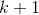 次伯努利试验中,  前 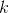 试验失败, 然后成功.

样本是非负整数 [0, ).

例子:

```py
>>> m = Geometric(torch.tensor([0.3]))
>>> m.sample()  # underlying Bernoulli has 30% chance 1; 70% chance 0
tensor([ 2.])

```

参数: 

*   **probs** (_Number__,_ [_Tensor_](tensors.html#torch.Tensor "torch.Tensor")) –  抽样`1`的概率 . 必须是在范围 (0, 1]
*   **logits** (_Number__,_ [_Tensor_](tensors.html#torch.Tensor "torch.Tensor")) – 抽样 `1`的log-odds.


```py
arg_constraints = {'logits': Real(), 'probs': Interval(lower_bound=0.0, upper_bound=1.0)}
```

```py
entropy()
```

```py
expand(batch_shape, _instance=None)
```

```py
log_prob(value)
```

```py
logits
```

```py
mean
```

```py
probs
```

```py
sample(sample_shape=torch.Size([]))
```

```py
support = IntegerGreaterThan(lower_bound=0)
```

```py
variance
```

## Gumbel

```py
class torch.distributions.gumbel.Gumbel(loc, scale, validate_args=None)
```

基类: [`torch.distributions.transformed_distribution.TransformedDistribution`](#torch.distributions.transformed_distribution.TransformedDistribution "torch.distributions.transformed_distribution.TransformedDistribution")

来自Gumbel分布的样本.

Examples:

```py
>>> m = Gumbel(torch.tensor([1.0]), torch.tensor([2.0]))
>>> m.sample()  # sample from Gumbel distribution with loc=1, scale=2
tensor([ 1.0124])

```

参数: 

*   **loc** ([_float_](https://docs.python.org/3/library/functions.html#float "(in Python v3.7)") _or_ [_Tensor_](tensors.html#torch.Tensor "torch.Tensor")) –  分布的位置参数
*   **scale** ([_float_](https://docs.python.org/3/library/functions.html#float "(in Python v3.7)") _or_ [_Tensor_](tensors.html#torch.Tensor "torch.Tensor")) –  分布的scale 参数


```py
arg_constraints = {'loc': Real(), 'scale': GreaterThan(lower_bound=0.0)}
```

```py
entropy()
```

```py
expand(batch_shape, _instance=None)
```

```py
mean
```

```py
stddev
```

```py
support = Real()
```

```py
variance
```

## HalfCauchy

```py
class torch.distributions.half_cauchy.HalfCauchy(scale, validate_args=None)
```

基类: [`torch.distributions.transformed_distribution.TransformedDistribution`](#torch.distributions.transformed_distribution.TransformedDistribution "torch.distributions.transformed_distribution.TransformedDistribution")

创建`scale`参数化的半正态分布:

```py
X ~ Cauchy(0, scale)
Y = |X| ~ HalfCauchy(scale)

```

例子:

```py
>>> m = HalfCauchy(torch.tensor([1.0]))
>>> m.sample()  # half-cauchy distributed with scale=1
tensor([ 2.3214])

```

| 参数: | **scale** ([_float_](https://docs.python.org/3/library/functions.html#float "(in Python v3.7)") _or_ [_Tensor_](tensors.html#torch.Tensor "torch.Tensor")) – 完全柯西分布的scale |


```py
arg_constraints = {'scale': GreaterThan(lower_bound=0.0)}
```

```py
cdf(value)
```

```py
entropy()
```

```py
expand(batch_shape, _instance=None)
```

```py
has_rsample = True
```

```py
icdf(prob)
```

```py
log_prob(value)
```

```py
mean
```

```py
scale
```

```py
support = GreaterThan(lower_bound=0.0)
```

```py
variance
```

## HalfNormal

```py
class torch.distributions.half_normal.HalfNormal(scale, validate_args=None)
```

基类: [`torch.distributions.transformed_distribution.TransformedDistribution`](#torch.distributions.transformed_distribution.TransformedDistribution "torch.distributions.transformed_distribution.TransformedDistribution")

创建按`scale`参数化的半正态分布:

```py
X ~ Normal(0, scale)
Y = |X| ~ HalfNormal(scale)

```

例子:

```py
>>> m = HalfNormal(torch.tensor([1.0]))
>>> m.sample()  # half-normal distributed with scale=1
tensor([ 0.1046])

```

| 参数: | **scale** ([_float_](https://docs.python.org/3/library/functions.html#float "(in Python v3.7)") _or_ [_Tensor_](tensors.html#torch.Tensor "torch.Tensor")) – 完全正态分布的scale |


```py
arg_constraints = {'scale': GreaterThan(lower_bound=0.0)}
```

```py
cdf(value)
```

```py
entropy()
```

```py
expand(batch_shape, _instance=None)
```

```py
has_rsample = True
```

```py
icdf(prob)
```

```py
log_prob(value)
```

```py
mean
```

```py
scale
```

```py
support = GreaterThan(lower_bound=0.0)
```

```py
variance
```

## Independent

```py
class torch.distributions.independent.Independent(base_distribution, reinterpreted_batch_ndims, validate_args=None)
```

基类: [`torch.distributions.distribution.Distribution`](#torch.distributions.distribution.Distribution "torch.distributions.distribution.Distribution")

重新解释一些分布的批量 dims 作为 event dims.

 这主要用于改变[`log_prob()`](#torch.distributions.independent.Independent.log_prob "torch.distributions.independent.Independent.log_prob")结果的形状.例如, 要创建与多元正态分布形状相同的对角正态分布(因此它们是可互换的), 您可以这样做:

```py
>>> loc = torch.zeros(3)
>>> scale = torch.ones(3)
>>> mvn = MultivariateNormal(loc, scale_tril=torch.diag(scale))
>>> [mvn.batch_shape, mvn.event_shape]
[torch.Size(()), torch.Size((3,))]
>>> normal = Normal(loc, scale)
>>> [normal.batch_shape, normal.event_shape]
[torch.Size((3,)), torch.Size(())]
>>> diagn = Independent(normal, 1)
>>> [diagn.batch_shape, diagn.event_shape]
[torch.Size(()), torch.Size((3,))]

```

参数: 

*   **base_distribution** ([_torch.distributions.distribution.Distribution_](#torch.distributions.distribution.Distribution "torch.distributions.distribution.Distribution")) – 基础分布
*   **reinterpreted_batch_ndims** ([_int_](https://docs.python.org/3/library/functions.html#int "(in Python v3.7)")) –要重解释的批量dims的数量


```py
arg_constraints = {}
```

```py
entropy()
```

```py
enumerate_support(expand=True)
```

```py
expand(batch_shape, _instance=None)
```

```py
has_enumerate_support
```

```py
has_rsample
```

```py
log_prob(value)
```

```py
mean
```

```py
rsample(sample_shape=torch.Size([]))
```

```py
sample(sample_shape=torch.Size([]))
```

```py
support
```

```py
variance
```

## Laplace

```py
class torch.distributions.laplace.Laplace(loc, scale, validate_args=None)
```

基类: [`torch.distributions.distribution.Distribution`](#torch.distributions.distribution.Distribution "torch.distributions.distribution.Distribution")

创建参数化的拉普拉斯分布, 参数是 `loc` 和 :attr:’scale’.

例子:

```py
>>> m = Laplace(torch.tensor([0.0]), torch.tensor([1.0]))
>>> m.sample()  # Laplace distributed with loc=0, scale=1
tensor([ 0.1046])

```

参数: 

*   **loc** ([_float_](https://docs.python.org/3/library/functions.html#float "(in Python v3.7)") _or_ [_Tensor_](tensors.html#torch.Tensor "torch.Tensor")) – 分布均值
*   **scale** ([_float_](https://docs.python.org/3/library/functions.html#float "(in Python v3.7)") _or_ [_Tensor_](tensors.html#torch.Tensor "torch.Tensor")) – 分布scale


```py
arg_constraints = {'loc': Real(), 'scale': GreaterThan(lower_bound=0.0)}
```

```py
cdf(value)
```

```py
entropy()
```

```py
expand(batch_shape, _instance=None)
```

```py
has_rsample = True
```

```py
icdf(value)
```

```py
log_prob(value)
```

```py
mean
```

```py
rsample(sample_shape=torch.Size([]))
```

```py
stddev
```

```py
support = Real()
```

```py
variance
```

## LogNormal

```py
class torch.distributions.log_normal.LogNormal(loc, scale, validate_args=None)
```

基类: [`torch.distributions.transformed_distribution.TransformedDistribution`](#torch.distributions.transformed_distribution.TransformedDistribution "torch.distributions.transformed_distribution.TransformedDistribution")

 创建参数化的对数正态分布, 参数为 [`loc`](#torch.distributions.log_normal.LogNormal.loc "torch.distributions.log_normal.LogNormal.loc") 和 [`scale`](#torch.distributions.log_normal.LogNormal.scale "torch.distributions.log_normal.LogNormal.scale"):

```py
X ~ Normal(loc, scale)
Y = exp(X) ~ LogNormal(loc, scale)

```

例子:

```py
>>> m = LogNormal(torch.tensor([0.0]), torch.tensor([1.0]))
>>> m.sample()  # log-normal distributed with mean=0 and stddev=1
tensor([ 0.1046])

```

参数: 

*   **loc** ([_float_](https://docs.python.org/3/library/functions.html#float "(in Python v3.7)") _or_ [_Tensor_](tensors.html#torch.Tensor "torch.Tensor")) –  分布对数平均值
*   **scale** ([_float_](https://docs.python.org/3/library/functions.html#float "(in Python v3.7)") _or_ [_Tensor_](tensors.html#torch.Tensor "torch.Tensor")) –  分布对数的标准差


```py
arg_constraints = {'loc': Real(), 'scale': GreaterThan(lower_bound=0.0)}
```

```py
entropy()
```

```py
expand(batch_shape, _instance=None)
```

```py
has_rsample = True
```

```py
loc
```

```py
mean
```

```py
scale
```

```py
support = GreaterThan(lower_bound=0.0)
```

```py
variance
```

## LowRankMultivariateNormal

```py
class torch.distributions.lowrank_multivariate_normal.LowRankMultivariateNormal(loc, cov_factor, cov_diag, validate_args=None)
```

基类: [`torch.distributions.distribution.Distribution`](#torch.distributions.distribution.Distribution "torch.distributions.distribution.Distribution")

使用由`cov_factor`和`cov_diag`参数化的低秩形式的协方差矩阵创建多元正态分布:

```py
covariance_matrix = cov_factor @ cov_factor.T + cov_diag

```

Example

```py
>>> m = LowRankMultivariateNormal(torch.zeros(2), torch.tensor([1, 0]), torch.tensor([1, 1]))
>>> m.sample()  # normally distributed with mean=`[0,0]`, cov_factor=`[1,0]`, cov_diag=`[1,1]`
tensor([-0.2102, -0.5429])

```

参数: 

*   **loc** ([_Tensor_](tensors.html#torch.Tensor "torch.Tensor")) – 分布的均值, 形状为 `batch_shape + event_shape`
*   **cov_factor** ([_Tensor_](tensors.html#torch.Tensor "torch.Tensor")) – 协方差矩阵低秩形式的因子部分, 形状为 `batch_shape + event_shape + (rank,)`
*   **cov_diag** ([_Tensor_](tensors.html#torch.Tensor "torch.Tensor")) – 协方差矩阵的低秩形式的对角部分, 形状为 `batch_shape + event_shape`


注意

避免了协方差矩阵的行列式和逆的计算, 当 `cov_factor.shape[1] << cov_factor.shape[0]` 由于 [Woodbury matrix identity](https://en.wikipedia.org/wiki/Woodbury_matrix_identity) 和 [matrix determinant lemma](https://en.wikipedia.org/wiki/Matrix_determinant_lemma).  由于这些公式, 我们只需要计算小尺寸“capacitance”矩阵的行列式和逆:

```py
capacitance = I + cov_factor.T @ inv(cov_diag) @ cov_factor

```

```py
arg_constraints = {'cov_diag': GreaterThan(lower_bound=0.0), 'cov_factor': Real(), 'loc': Real()}
```

```py
covariance_matrix
```

```py
entropy()
```

```py
expand(batch_shape, _instance=None)
```

```py
has_rsample = True
```

```py
log_prob(value)
```

```py
mean
```

```py
precision_matrix
```

```py
rsample(sample_shape=torch.Size([]))
```

```py
scale_tril
```

```py
support = Real()
```

```py
variance
```

## Multinomial

```py
class torch.distributions.multinomial.Multinomial(total_count=1, probs=None, logits=None, validate_args=None)
```

基类: [`torch.distributions.distribution.Distribution`](#torch.distributions.distribution.Distribution "torch.distributions.distribution.Distribution")

创建由`total_count`和`probs`或`logits`(但不是两者）参数化的多项式分布.  `probs`的最内层维度是对类别的索引.  所有其他维度索引批次. 

注意 `total_count` 不需要指定, 当只有 [`log_prob()`](#torch.distributions.multinomial.Multinomial.log_prob "torch.distributions.multinomial.Multinomial.log_prob") 被调用

注意

[`probs`](#torch.distributions.multinomial.Multinomial.probs "torch.distributions.multinomial.Multinomial.probs") 必须是非负的、有限的并且具有非零和, 并且它将被归一化为和为1.

*   [`sample()`](#torch.distributions.multinomial.Multinomial.sample "torch.distributions.multinomial.Multinomial.sample") 所有参数和样本都需要一个共享的`total_count`.
*   [`log_prob()`](#torch.distributions.multinomial.Multinomial.log_prob "torch.distributions.multinomial.Multinomial.log_prob")  允许每个参数和样本使用不同的`total_count`.

例子:

```py
>>> m = Multinomial(100, torch.tensor([ 1., 1., 1., 1.]))
>>> x = m.sample()  # equal probability of 0, 1, 2, 3
tensor([ 21.,  24.,  30.,  25.])

>>> Multinomial(probs=torch.tensor([1., 1., 1., 1.])).log_prob(x)
tensor([-4.1338])

```

参数: 

*   **total_count** ([_int_](https://docs.python.org/3/library/functions.html#int "(in Python v3.7)")) – 试验次数
*   **probs** ([_Tensor_](tensors.html#torch.Tensor "torch.Tensor")) – 事件概率
*   **logits** ([_Tensor_](tensors.html#torch.Tensor "torch.Tensor")) – 事件对数概率


```py
arg_constraints = {'logits': Real(), 'probs': Simplex()}
```

```py
expand(batch_shape, _instance=None)
```

```py
log_prob(value)
```

```py
logits
```

```py
mean
```

```py
param_shape
```

```py
probs
```

```py
sample(sample_shape=torch.Size([]))
```

```py
support
```

```py
variance
```

## MultivariateNormal

```py
class torch.distributions.multivariate_normal.MultivariateNormal(loc, covariance_matrix=None, precision_matrix=None, scale_tril=None, validate_args=None)
```

基类: [`torch.distributions.distribution.Distribution`](#torch.distributions.distribution.Distribution "torch.distributions.distribution.Distribution")

创建由均值向量和协方差矩阵参数化的多元正态(也称为高斯)分布.

多元正态分布可以用正定协方差矩阵来参数化或者一个正定的精度矩阵 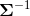  或者是一个正对角项的下三角矩阵 , 例如 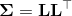. 这个三角矩阵可以通过协方差的Cholesky分解得到.

例子

```py
>>> m = MultivariateNormal(torch.zeros(2), torch.eye(2))
>>> m.sample()  # normally distributed with mean=`[0,0]` and covariance_matrix=`I`
tensor([-0.2102, -0.5429])

```

参数: 

*   **loc** ([_Tensor_](tensors.html#torch.Tensor "torch.Tensor")) – 分布的均值
*   **covariance_matrix** ([_Tensor_](tensors.html#torch.Tensor "torch.Tensor")) – 正定协方差矩阵
*   **precision_matrix** ([_Tensor_](tensors.html#torch.Tensor "torch.Tensor")) – 正定精度矩阵
*   **scale_tril** ([_Tensor_](tensors.html#torch.Tensor "torch.Tensor")) – 具有正值对角线的下三角协方差因子


注意

仅仅一个 [`covariance_matrix`](#torch.distributions.multivariate_normal.MultivariateNormal.covariance_matrix "torch.distributions.multivariate_normal.MultivariateNormal.covariance_matrix") 或者 [`precision_matrix`](#torch.distributions.multivariate_normal.MultivariateNormal.precision_matrix "torch.distributions.multivariate_normal.MultivariateNormal.precision_matrix") 或者 [`scale_tril`](#torch.distributions.multivariate_normal.MultivariateNormal.scale_tril "torch.distributions.multivariate_normal.MultivariateNormal.scale_tril") 可被指定.

使用 [`scale_tril`](#torch.distributions.multivariate_normal.MultivariateNormal.scale_tril "torch.distributions.multivariate_normal.MultivariateNormal.scale_tril")  会更有效率: 内部的所有计算都基于 [`scale_tril`](#torch.distributions.multivariate_normal.MultivariateNormal.scale_tril "torch.distributions.multivariate_normal.MultivariateNormal.scale_tril"). 如果 [`covariance_matrix`](#torch.distributions.multivariate_normal.MultivariateNormal.covariance_matrix "torch.distributions.multivariate_normal.MultivariateNormal.covariance_matrix") 或者 [`precision_matrix`](#torch.distributions.multivariate_normal.MultivariateNormal.precision_matrix "torch.distributions.multivariate_normal.MultivariateNormal.precision_matrix") 已经被传入, 它仅用于使用Cholesky分解计算相应的下三角矩阵.

```py
arg_constraints = {'covariance_matrix': PositiveDefinite(), 'loc': RealVector(), 'precision_matrix': PositiveDefinite(), 'scale_tril': LowerCholesky()}
```

```py
covariance_matrix
```

```py
entropy()
```

```py
expand(batch_shape, _instance=None)
```

```py
has_rsample = True
```

```py
log_prob(value)
```

```py
mean
```

```py
precision_matrix
```

```py
rsample(sample_shape=torch.Size([]))
```

```py
scale_tril
```

```py
support = Real()
```

```py
variance
```

## NegativeBinomial

```py
class torch.distributions.negative_binomial.NegativeBinomial(total_count, probs=None, logits=None, validate_args=None)
```

基类: [`torch.distributions.distribution.Distribution`](#torch.distributions.distribution.Distribution "torch.distributions.distribution.Distribution")

创建一个负二项分布, 即在达到`total_count`失败之前所需的独立相同伯努利试验的数量的分布. 每次伯努利试验成功的概率都是`probs`. 

参数: 

*   **total_count** ([_float_](https://docs.python.org/3/library/functions.html#float "(in Python v3.7)") _or_ [_Tensor_](tensors.html#torch.Tensor "torch.Tensor")) –  非负数伯努利试验停止的次数, 虽然分布仍然对实数有效
*   **probs** ([_Tensor_](tensors.html#torch.Tensor "torch.Tensor")) – 事件概率, 区间为 [0, 1)
*   **logits** ([_Tensor_](tensors.html#torch.Tensor "torch.Tensor")) – 事件对数几率 - 成功概率的几率


```py
arg_constraints = {'logits': Real(), 'probs': HalfOpenInterval(lower_bound=0.0, upper_bound=1.0), 'total_count': GreaterThanEq(lower_bound=0)}
```

```py
expand(batch_shape, _instance=None)
```

```py
log_prob(value)
```

```py
logits
```

```py
mean
```

```py
param_shape
```

```py
probs
```

```py
sample(sample_shape=torch.Size([]))
```

```py
support = IntegerGreaterThan(lower_bound=0)
```

```py
variance
```

## Normal

```py
class torch.distributions.normal.Normal(loc, scale, validate_args=None)
```

基类: [`torch.distributions.exp_family.ExponentialFamily`](#torch.distributions.exp_family.ExponentialFamily "torch.distributions.exp_family.ExponentialFamily")

创建由`loc`和`scale`参数化的正态(也称为高斯）分布

例子:

```py
>>> m = Normal(torch.tensor([0.0]), torch.tensor([1.0]))
>>> m.sample()  # normally distributed with loc=0 and scale=1
tensor([ 0.1046])

```

参数: 

*   **loc** ([_float_](https://docs.python.org/3/library/functions.html#float "(in Python v3.7)") _or_ [_Tensor_](tensors.html#torch.Tensor "torch.Tensor")) – 均值 (也被称为 mu)
*   **scale** ([_float_](https://docs.python.org/3/library/functions.html#float "(in Python v3.7)") _or_ [_Tensor_](tensors.html#torch.Tensor "torch.Tensor")) – 标准差(也被称为) sigma)


```py
arg_constraints = {'loc': Real(), 'scale': GreaterThan(lower_bound=0.0)}
```

```py
cdf(value)
```

```py
entropy()
```

```py
expand(batch_shape, _instance=None)
```

```py
has_rsample = True
```

```py
icdf(value)
```

```py
log_prob(value)
```

```py
mean
```

```py
rsample(sample_shape=torch.Size([]))
```

```py
sample(sample_shape=torch.Size([]))
```

```py
stddev
```

```py
support = Real()
```

```py
variance
```

## OneHotCategorical

```py
class torch.distributions.one_hot_categorical.OneHotCategorical(probs=None, logits=None, validate_args=None)
```

基类: [`torch.distributions.distribution.Distribution`](#torch.distributions.distribution.Distribution "torch.distributions.distribution.Distribution")

创建一个由`probs`或l`ogits`参数化的One Hot Categorical 分布

样本是大小为 `probs.size(-1)`热编码向量.

注意

`probs`必须是非负的, 有限的并且具有非零和, 并且它将被归一化为总和为1. 

请参见: `torch.distributions.Categorical()` 对于指定 [`probs`](#torch.distributions.one_hot_categorical.OneHotCategorical.probs "torch.distributions.one_hot_categorical.OneHotCategorical.probs") 和 [`logits`](#torch.distributions.one_hot_categorical.OneHotCategorical.logits "torch.distributions.one_hot_categorical.OneHotCategorical.logits").

例子:

```py
>>> m = OneHotCategorical(torch.tensor([ 0.25, 0.25, 0.25, 0.25 ]))
>>> m.sample()  # equal probability of 0, 1, 2, 3
tensor([ 0.,  0.,  0.,  1.])

```

参数: 

*   **probs** ([_Tensor_](tensors.html#torch.Tensor "torch.Tensor")) – event probabilities
*   **logits** ([_Tensor_](tensors.html#torch.Tensor "torch.Tensor")) – event log probabilities


```py
arg_constraints = {'logits': Real(), 'probs': Simplex()}
```

```py
entropy()
```

```py
enumerate_support(expand=True)
```

```py
expand(batch_shape, _instance=None)
```

```py
has_enumerate_support = True
```

```py
log_prob(value)
```

```py
logits
```

```py
mean
```

```py
param_shape
```

```py
probs
```

```py
sample(sample_shape=torch.Size([]))
```

```py
support = Simplex()
```

```py
variance
```

## Pareto

```py
class torch.distributions.pareto.Pareto(scale, alpha, validate_args=None)
```

基类: [`torch.distributions.transformed_distribution.TransformedDistribution`](#torch.distributions.transformed_distribution.TransformedDistribution "torch.distributions.transformed_distribution.TransformedDistribution")

来自Pareto Type 1分布的样本.

例子:

```py
>>> m = Pareto(torch.tensor([1.0]), torch.tensor([1.0]))
>>> m.sample()  # sample from a Pareto distribution with scale=1 and alpha=1
tensor([ 1.5623])

```

参数: 

*   **scale** ([_float_](https://docs.python.org/3/library/functions.html#float "(in Python v3.7)") _or_ [_Tensor_](tensors.html#torch.Tensor "torch.Tensor")) – 分布的Scale
*   **alpha** ([_float_](https://docs.python.org/3/library/functions.html#float "(in Python v3.7)") _or_ [_Tensor_](tensors.html#torch.Tensor "torch.Tensor")) – 分布的Shape


```py
arg_constraints = {'alpha': GreaterThan(lower_bound=0.0), 'scale': GreaterThan(lower_bound=0.0)}
```

```py
entropy()
```

```py
expand(batch_shape, _instance=None)
```

```py
mean
```

```py
support
```

```py
variance
```

## Poisson

```py
class torch.distributions.poisson.Poisson(rate, validate_args=None)
```

基类: [`torch.distributions.exp_family.ExponentialFamily`](#torch.distributions.exp_family.ExponentialFamily "torch.distributions.exp_family.ExponentialFamily")

创建按`rate`参数化的泊松分布

样本是非负整数, pmf是


例子:

```py
>>> m = Poisson(torch.tensor([4]))
>>> m.sample()
tensor([ 3.])

```

| 参数: | **rate** (_Number__,_ [_Tensor_](tensors.html#torch.Tensor "torch.Tensor")) – rate 参数 |


```py
arg_constraints = {'rate': GreaterThan(lower_bound=0.0)}
```

```py
expand(batch_shape, _instance=None)
```

```py
log_prob(value)
```

```py
mean
```

```py
sample(sample_shape=torch.Size([]))
```

```py
support = IntegerGreaterThan(lower_bound=0)
```

```py
variance
```

## RelaxedBernoulli

```py
class torch.distributions.relaxed_bernoulli.RelaxedBernoulli(temperature, probs=None, logits=None, validate_args=None)
```

基类: [`torch.distributions.transformed_distribution.TransformedDistribution`](#torch.distributions.transformed_distribution.TransformedDistribution "torch.distributions.transformed_distribution.TransformedDistribution")

创建一个RelaxedBernoulli分布, 通过[`temperature`](#torch.distributions.relaxed_bernoulli.RelaxedBernoulli.temperature "torch.distributions.relaxed_bernoulli.RelaxedBernoulli.temperature")参数化, 以及`probs`或`logits`(但不是两者）.  这是伯努利分布的松弛版本, 因此值在(0,1）中, 并且具有可重参数化的样本. 

例子:

```py
>>> m = RelaxedBernoulli(torch.tensor([2.2]),
 torch.tensor([0.1, 0.2, 0.3, 0.99]))
>>> m.sample()
tensor([ 0.2951,  0.3442,  0.8918,  0.9021])

```

参数: 

*   **temperature** ([_Tensor_](tensors.html#torch.Tensor "torch.Tensor")) – 松弛 temperature
*   **probs** (_Number__,_ [_Tensor_](tensors.html#torch.Tensor "torch.Tensor")) –采样 `1` 的概率
*   **logits** (_Number__,_ [_Tensor_](tensors.html#torch.Tensor "torch.Tensor")) – 采样 `1` 的对数概率


```py
arg_constraints = {'logits': Real(), 'probs': Interval(lower_bound=0.0, upper_bound=1.0)}
```

```py
expand(batch_shape, _instance=None)
```

```py
has_rsample = True
```

```py
logits
```

```py
probs
```

```py
support = Interval(lower_bound=0.0, upper_bound=1.0)
```

```py
temperature
```

## RelaxedOneHotCategorical

```py
class torch.distributions.relaxed_categorical.RelaxedOneHotCategorical(temperature, probs=None, logits=None, validate_args=None)
```

基类: [`torch.distributions.transformed_distribution.TransformedDistribution`](#torch.distributions.transformed_distribution.TransformedDistribution "torch.distributions.transformed_distribution.TransformedDistribution")

创建一个由温度参数化的`RelaxedOneHotCategorical`分布, 以及`probs`或`logits`.  这是`OneHotCategorical`分布的松弛版本, 因此它的样本是单一的, 并且可以重参数化. 

例子:

```py
>>> m = RelaxedOneHotCategorical(torch.tensor([2.2]),
 torch.tensor([0.1, 0.2, 0.3, 0.4]))
>>> m.sample()
tensor([ 0.1294,  0.2324,  0.3859,  0.2523])

```

参数: 

*   **temperature** ([_Tensor_](tensors.html#torch.Tensor "torch.Tensor")) – 松弛 temperature
*   **probs** ([_Tensor_](tensors.html#torch.Tensor "torch.Tensor")) – 事件概率
*   **logits** ([_Tensor_](tensors.html#torch.Tensor "torch.Tensor")) –对数事件概率.


```py
arg_constraints = {'logits': Real(), 'probs': Simplex()}
```

```py
expand(batch_shape, _instance=None)
```

```py
has_rsample = True
```

```py
logits
```

```py
probs
```

```py
support = Simplex()
```

```py
temperature
```

## StudentT

```py
class torch.distributions.studentT.StudentT(df, loc=0.0, scale=1.0, validate_args=None)
```

基类: [`torch.distributions.distribution.Distribution`](#torch.distributions.distribution.Distribution "torch.distributions.distribution.Distribution")

根据自由度`df`, 平均`loc`和`scale`创建学生t分布. 

例子:

```py
>>> m = StudentT(torch.tensor([2.0]))
>>> m.sample()  # Student's t-distributed with degrees of freedom=2
tensor([ 0.1046])

```

参数: 

*   **df** ([_float_](https://docs.python.org/3/library/functions.html#float "(in Python v3.7)") _or_ [_Tensor_](tensors.html#torch.Tensor "torch.Tensor")) – 自由度
*   **loc** ([_float_](https://docs.python.org/3/library/functions.html#float "(in Python v3.7)") _or_ [_Tensor_](tensors.html#torch.Tensor "torch.Tensor")) – 均值
*   **scale** ([_float_](https://docs.python.org/3/library/functions.html#float "(in Python v3.7)") _or_ [_Tensor_](tensors.html#torch.Tensor "torch.Tensor")) – 分布的scale


```py
arg_constraints = {'df': GreaterThan(lower_bound=0.0), 'loc': Real(), 'scale': GreaterThan(lower_bound=0.0)}
```

```py
entropy()
```

```py
expand(batch_shape, _instance=None)
```

```py
has_rsample = True
```

```py
log_prob(value)
```

```py
mean
```

```py
rsample(sample_shape=torch.Size([]))
```

```py
support = Real()
```

```py
variance
```

## TransformedDistribution

```py
class torch.distributions.transformed_distribution.TransformedDistribution(base_distribution, transforms, validate_args=None)
```

基类: [`torch.distributions.distribution.Distribution`](#torch.distributions.distribution.Distribution "torch.distributions.distribution.Distribution")

Distribution类的扩展, 它将一系列变换应用于基本分布. 假设f是所应用变换的组成:

```py
X ~ BaseDistribution
Y = f(X) ~ TransformedDistribution(BaseDistribution, f)
log p(Y) = log p(X) + log |det (dX/dY)|

```

注意 `.event_shape` of a [`TransformedDistribution`](#torch.distributions.transformed_distribution.TransformedDistribution "torch.distributions.transformed_distribution.TransformedDistribution") 是其基本分布及其变换的最大形状, 因为变换可以引入事件之间的相关性.

一个使用例子 [`TransformedDistribution`](#torch.distributions.transformed_distribution.TransformedDistribution "torch.distributions.transformed_distribution.TransformedDistribution"):

```py
# Building a Logistic Distribution
# X ~ Uniform(0, 1)
# f = a + b * logit(X)
# Y ~ f(X) ~ Logistic(a, b)
base_distribution = Uniform(0, 1)
transforms = [SigmoidTransform().inv, AffineTransform(loc=a, scale=b)]
logistic = TransformedDistribution(base_distribution, transforms)

```

有关更多示例, 请查看有关实现 [`Gumbel`](#torch.distributions.gumbel.Gumbel "torch.distributions.gumbel.Gumbel"), [`HalfCauchy`](#torch.distributions.half_cauchy.HalfCauchy "torch.distributions.half_cauchy.HalfCauchy"), [`HalfNormal`](#torch.distributions.half_normal.HalfNormal "torch.distributions.half_normal.HalfNormal"), [`LogNormal`](#torch.distributions.log_normal.LogNormal "torch.distributions.log_normal.LogNormal"), [`Pareto`](#torch.distributions.pareto.Pareto "torch.distributions.pareto.Pareto"), [`Weibull`](#torch.distributions.weibull.Weibull "torch.distributions.weibull.Weibull"), [`RelaxedBernoulli`](#torch.distributions.relaxed_bernoulli.RelaxedBernoulli "torch.distributions.relaxed_bernoulli.RelaxedBernoulli") 和 [`RelaxedOneHotCategorical`](#torch.distributions.relaxed_categorical.RelaxedOneHotCategorical "torch.distributions.relaxed_categorical.RelaxedOneHotCategorical")

```py
arg_constraints = {}
```

```py
cdf(value)
```

通过逆变换和计算基分布的分数来计算累积分布函数.

```py
expand(batch_shape, _instance=None)
```

```py
has_rsample
```

```py
icdf(value)
```

使用transform(s)计算逆累积分布函数, 并计算基分布的分数.

```py
log_prob(value)
```

通过反转变换并使用基本分布的分数和日志abs det jacobian计算分数来对样本进行评分

```py
rsample(sample_shape=torch.Size([]))
```

如果分布参数是批处理的, 则生成sample_shape形状的重新参数化样本或sample_shape形状的重新参数化样本批次.  首先从基本分布中采样, 并对列表中的每个变换应用`transform()`

```py
sample(sample_shape=torch.Size([]))
```

如果分布参数是批处理的, 则生成sample_shape形样本或sample_shape形样本批处理.  首先从基本分布中采样, 并对列表中的每个变换应用`transform()`. 

```py
support
```

## Uniform

```py
class torch.distributions.uniform.Uniform(low, high, validate_args=None)
```

基类: [`torch.distributions.distribution.Distribution`](#torch.distributions.distribution.Distribution "torch.distributions.distribution.Distribution")


从半开区间`[low, high)`生成均匀分布的随机样本

例子:

```py
>>> m = Uniform(torch.tensor([0.0]), torch.tensor([5.0]))
>>> m.sample()  # uniformly distributed in the range [0.0, 5.0)
tensor([ 2.3418])

```

参数: 

*   **low** ([_float_](https://docs.python.org/3/library/functions.html#float "(in Python v3.7)") _or_ [_Tensor_](tensors.html#torch.Tensor "torch.Tensor")) –  下限(含）.
*   **high** ([_float_](https://docs.python.org/3/library/functions.html#float "(in Python v3.7)") _or_ [_Tensor_](tensors.html#torch.Tensor "torch.Tensor")) – 上限(排除).


```py
arg_constraints = {'high': Dependent(), 'low': Dependent()}
```

```py
cdf(value)
```

```py
entropy()
```

```py
expand(batch_shape, _instance=None)
```

```py
has_rsample = True
```

```py
icdf(value)
```

```py
log_prob(value)
```

```py
mean
```

```py
rsample(sample_shape=torch.Size([]))
```

```py
stddev
```

```py
support
```

```py
variance
```

## Weibull

```py
class torch.distributions.weibull.Weibull(scale, concentration, validate_args=None)
```

基类: [`torch.distributions.transformed_distribution.TransformedDistribution`](#torch.distributions.transformed_distribution.TransformedDistribution "torch.distributions.transformed_distribution.TransformedDistribution")

来自双参数Weibull分布的样本.

Example

```py
>>> m = Weibull(torch.tensor([1.0]), torch.tensor([1.0]))
>>> m.sample()  # sample from a Weibull distribution with scale=1, concentration=1
tensor([ 0.4784])

```

参数: 

*   **scale** ([_float_](https://docs.python.org/3/library/functions.html#float "(in Python v3.7)") _or_ [_Tensor_](tensors.html#torch.Tensor "torch.Tensor")) – Scale (lambda).
*   **concentration** ([_float_](https://docs.python.org/3/library/functions.html#float "(in Python v3.7)") _or_ [_Tensor_](tensors.html#torch.Tensor "torch.Tensor")) – Concentration (k/shape).


```py
arg_constraints = {'concentration': GreaterThan(lower_bound=0.0), 'scale': GreaterThan(lower_bound=0.0)}
```

```py
entropy()
```

```py
expand(batch_shape, _instance=None)
```

```py
mean
```

```py
support = GreaterThan(lower_bound=0.0)
```

```py
variance
```

## `KL Divergence`

```py
torch.distributions.kl.kl_divergence(p, q)
```

计算Kullback-Leibler散度  对于两个分布.


参数: 

*   **p** ([_Distribution_](#torch.distributions.distribution.Distribution "torch.distributions.distribution.Distribution")) – `Distribution` 对象.
*   **q** ([_Distribution_](#torch.distributions.distribution.Distribution "torch.distributions.distribution.Distribution")) – `Distribution` 对象.


| 返回值: | 批量的 KL 散度, 形状为 `batch_shape`. |

| 返回类型： | [Tensor](tensors.html#torch.Tensor "torch.Tensor") |

| 异常: | [`NotImplementedError`](https://docs.python.org/3/library/exceptions.html#NotImplementedError "(in Python v3.7)") – 如果分布类型尚未通过注册 [`register_kl()`](#torch.distributions.kl.register_kl "torch.distributions.kl.register_kl"). |


```py
torch.distributions.kl.register_kl(type_p, type_q)
```

装饰器注册[`kl_divergence()`](#torch.distributions.kl.kl_divergence "torch.distributions.kl.kl_divergence")的成对函数

```py
@register_kl(Normal, Normal)
def kl_normal_normal(p, q):
    # insert implementation here

```

Lookup返回由子类排序的最具体(type,type)匹配.  如果匹配不明确, 则会引发`RuntimeWarning`.  例如, 解决模棱两可的情况

```py
@register_kl(BaseP, DerivedQ)
def kl_version1(p, q): ...
@register_kl(DerivedP, BaseQ)
def kl_version2(p, q): ...

```

你应该注册第三个最具体的实现, 例如:

```py
register_kl(DerivedP, DerivedQ)(kl_version1)  # Break the tie.

```

参数: 

*   **type_p** ([_type_](https://docs.python.org/3/library/functions.html#type "(in Python v3.7)")) – 子类 `Distribution`.
*   **type_q** ([_type_](https://docs.python.org/3/library/functions.html#type "(in Python v3.7)")) – 子类 `Distribution`.


## `Transforms`

```py
class torch.distributions.transforms.Transform(cache_size=0)
```

有可计算的log det jacobians进行可逆变换的抽象类.  它们主要用于 `torch.distributions.TransformedDistribution`.

缓存对于其反转昂贵或数值不稳定的变换很有用.  请注意, 必须注意记忆值, 因为可以颠倒自动记录图.  例如, 以下操作有或没有缓存:

```py
y = t(x)
t.log_abs_det_jacobian(x, y).backward()  # x will receive gradients.

```

但是, 由于依赖性反转, 缓存时会出现以下错误:

```py
y = t(x)
z = t.inv(y)
grad(z.sum(), [y])  # error because z is x

```

 派生类应该实现`_call()`或`_inverse()`中的一个或两个.  设置`bijective=True`的派生类也应该实现`log_abs_det_jacobian()`

| 参数: | **cache_size** ([_int_](https://docs.python.org/3/library/functions.html#int "(in Python v3.7)")) – 缓存大小.  如果为零, 则不进行缓存.  如果是, 则缓存最新的单个值.  仅支持0和1 |

| Variables: | 

*   **domain** ([`Constraint`](#torch.distributions.constraints.Constraint "torch.distributions.constraints.Constraint")) –  表示该变换有效输入的约束.
*   **codomain** ([`Constraint`](#torch.distributions.constraints.Constraint "torch.distributions.constraints.Constraint")) – 表示此转换的有效输出的约束, 这些输出是逆变换的输入.
*   **bijective** ([_bool_](https://docs.python.org/3/library/functions.html#bool "(in Python v3.7)")) –  这个变换是否是双射的. 变换 `t` 是双射的 如果 `t.inv(t(x)) == x` 并且 `t(t.inv(y)) == y` 对于每一个 `x` 和 `y`. 不是双射的变换应该至少保持较弱的伪逆属性 `t(t.inv(t(x)) == t(x)` and `t.inv(t(t.inv(y))) == t.inv(y)`.
*   **sign** ([_int_](https://docs.python.org/3/library/functions.html#int "(in Python v3.7)") _or_ [_Tensor_](tensors.html#torch.Tensor "torch.Tensor")) – 对于双射单变量变换, 它应该是+1或-1, 这取决于变换是单调递增还是递减.
*   **event_dim** ([_int_](https://docs.python.org/3/library/functions.html#int "(in Python v3.7)")) – 变换event_shape中相关的维数.  这对于逐点变换应该是0, 对于在矢量上共同作用的变换是1, 对于在矩阵上共同作用的变换是2, 等等.


```py
inv
```

返回逆[`Transform`](#torch.distributions.transforms.Transform "torch.distributions.transforms.Transform"). 满足 `t.inv.inv is t`.

```py
sign
```

如果适用, 返回雅可比行列式的符号.  一般来说, 这只适用于双射变换.

```py
log_abs_det_jacobian(x, y)
```

计算 log det jacobian `log |dy/dx|` 给定输入和输出.

```py
class torch.distributions.transforms.ComposeTransform(parts)
```

在一个链中组合多个转换. 正在组合的转换负责缓存.

| 参数: | **parts** (list of [`Transform`](#torch.distributions.transforms.Transform "torch.distributions.transforms.Transform")) – 列表 transforms. |


```py
class torch.distributions.transforms.ExpTransform(cache_size=0)
```

转换通过映射 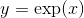.

```py
class torch.distributions.transforms.PowerTransform(exponent, cache_size=0)
```

转换通过映射 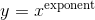.

```py
class torch.distributions.transforms.SigmoidTransform(cache_size=0)
```

转换通过映射  and 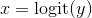.

```py
class torch.distributions.transforms.AbsTransform(cache_size=0)
```

转换通过映射 .

```py
class torch.distributions.transforms.AffineTransform(loc, scale, event_dim=0, cache_size=0)
```

通过逐点仿射映射进行转换 .

参数: 

*   **loc** ([_Tensor_](tensors.html#torch.Tensor "torch.Tensor") _or_ [_float_](https://docs.python.org/3/library/functions.html#float "(in Python v3.7)")) – Location.
*   **scale** ([_Tensor_](tensors.html#torch.Tensor "torch.Tensor") _or_ [_float_](https://docs.python.org/3/library/functions.html#float "(in Python v3.7)")) – Scale.
*   **event_dim** ([_int_](https://docs.python.org/3/library/functions.html#int "(in Python v3.7)")) – 可选的 `event_shape` 大小. T对于单变量随机变量, 该值应为零, 对于矢量分布, 1应为零, 对于矩阵的分布, 应为2.


```py
class torch.distributions.transforms.SoftmaxTransform(cache_size=0)
```

从无约束空间到单纯形的转换, 通过  然后归一化.

这不是双射的, 不能用于HMC.  然而, 这主要是协调的(除了最终的归一化）, 因此适合于坐标方式的优化算法. 

```py
class torch.distributions.transforms.StickBreakingTransform(cache_size=0)
```

将无约束空间通过 stick-breaking 过程转化为一个额外维度的单纯形. 

这种变换是`Dirichlet`分布的破棒构造中的迭代sigmoid变换:第一个逻辑通过sigmoid变换成第一个概率和所有其他概率, 然后这个过程重复出现. 

这是双射的, 适合在HMC中使用; 然而, 它将坐标混合在一起, 不太适合优化.

```py
class torch.distributions.transforms.LowerCholeskyTransform(cache_size=0)
```

将无约束矩阵转换为具有非负对角项的下三角矩阵.

这对于根据Cholesky分解来参数化正定矩阵是有用的.

## `Constraints`

The following constraints are implemented:

*   `constraints.boolean`
*   `constraints.dependent`
*   `constraints.greater_than(lower_bound)`
*   `constraints.integer_interval(lower_bound, upper_bound)`
*   `constraints.interval(lower_bound, upper_bound)`
*   `constraints.lower_cholesky`
*   `constraints.lower_triangular`
*   `constraints.nonnegative_integer`
*   `constraints.positive`
*   `constraints.positive_definite`
*   `constraints.positive_integer`
*   `constraints.real`
*   `constraints.real_vector`
*   `constraints.simplex`
*   `constraints.unit_interval`

```py
class torch.distributions.constraints.Constraint
```

constraints 的抽象基类.

constraint对象表示变量有效的区域, 例如,  其中可以优化变量

```py
check(value)
```

返回一个字节张量 `sample_shape + batch_shape` 指示值中的每个事件是否满足此约束.

```py
torch.distributions.constraints.dependent_property
```

alias of `torch.distributions.constraints._DependentProperty`

```py
torch.distributions.constraints.integer_interval
```

alias of `torch.distributions.constraints._IntegerInterval`

```py
torch.distributions.constraints.greater_than
```

alias of `torch.distributions.constraints._GreaterThan`

```py
torch.distributions.constraints.greater_than_eq
```

alias of `torch.distributions.constraints._GreaterThanEq`

```py
torch.distributions.constraints.less_than
```

alias of `torch.distributions.constraints._LessThan`

```py
torch.distributions.constraints.interval
```

alias of `torch.distributions.constraints._Interval`

```py
torch.distributions.constraints.half_open_interval
```

alias of `torch.distributions.constraints._HalfOpenInterval`

## `Constraint Registry`

PyTorch 提供两个全局 [`ConstraintRegistry`](#torch.distributions.constraint_registry.ConstraintRegistry "torch.distributions.constraint_registry.ConstraintRegistry") 对象 , 链接 [`Constraint`](#torch.distributions.constraints.Constraint "torch.distributions.constraints.Constraint") 对象到 [`Transform`](#torch.distributions.transforms.Transform "torch.distributions.transforms.Transform") 对象. 这些对象既有输入约束, 也有返回变换, 但是它们对双射性有不同的保证.

1.  `biject_to(constraint)`  查找一个双射的 [`Transform`](#torch.distributions.transforms.Transform "torch.distributions.transforms.Transform") 从 `constraints.real` 到给定的 `constraint`.  返回的转换保证具有 `.bijective = True` 并且应该实现了 `.log_abs_det_jacobian()`.
2.  `transform_to(constraint)` 查找一个不一定是双射的 [`Transform`](#torch.distributions.transforms.Transform "torch.distributions.transforms.Transform") 从 `constraints.real` 到给定的 `constraint`. 返回的转换不保证实现 `.log_abs_det_jacobian()`.

`transform_to()`注册表对于对概率分布的约束参数执行无约束优化非常有用, 这些参数由每个分布的`.arg_constraints`指示.  这些变换通常会过度参数化空间以避免旋转; 因此, 它们更适合像Adam那样的坐标优化算法

```py
loc = torch.zeros(100, requires_grad=True)
unconstrained = torch.zeros(100, requires_grad=True)
scale = transform_to(Normal.arg_constraints['scale'])(unconstrained)
loss = -Normal(loc, scale).log_prob(data).sum()

```

`biject_to()` 注册表对于Hamiltonian Monte Carlo非常有用, 其中来自具有约束. `.support`的概率分布的样本在无约束空间中传播, 并且算法通常是旋转不变的

```py
dist = Exponential(rate)
unconstrained = torch.zeros(100, requires_grad=True)
sample = biject_to(dist.support)(unconstrained)
potential_energy = -dist.log_prob(sample).sum()

```

注意

一个 `transform_to` 和 `biject_to` 不同的例子是 `constraints.simplex`: `transform_to(constraints.simplex)` 返回一个 [`SoftmaxTransform`](#torch.distributions.transforms.SoftmaxTransform "torch.distributions.transforms.SoftmaxTransform") 简单地对其输入进行指数化和归一化;  这是一种廉价且主要是坐标的操作, 适用于像SVI这样的算法. 相反, `biject_to(constraints.simplex)` 返回一个 [`StickBreakingTransform`](#torch.distributions.transforms.StickBreakingTransform "torch.distributions.transforms.StickBreakingTransform") 将其输入生成一个较小维度的空间; 这是一种更昂贵的数值更少的数值稳定的变换, 但对于像HM​​C这样的算法是必需的. 

`biject_to` 和 `transform_to` 对象可以通过用户定义的约束进行扩展, 并使用`.register()`方法进行转换, 作为单例约束的函数

```py
transform_to.register(my_constraint, my_transform)

```

或作为参数化约束的装饰器:

```py
@transform_to.register(MyConstraintClass)
def my_factory(constraint):
    assert isinstance(constraint, MyConstraintClass)
    return MyTransform(constraint.param1, constraint.param2)

```

 您可以通过创建新的[`ConstraintRegistry`](#torch.distributions.constraint_registry.ConstraintRegistry "torch.distributions.constraint_registry.ConstraintRegistry")创建自己的注册表.

```py
class torch.distributions.constraint_registry.ConstraintRegistry
```

注册表, 将约束链接到转换.

```py
register(constraint, factory=None)
```

在此注册表注册一个 [`Constraint`](#torch.distributions.constraints.Constraint "torch.distributions.constraints.Constraint") 子类. 用法:

```py
@my_registry.register(MyConstraintClass)
def construct_transform(constraint):
    assert isinstance(constraint, MyConstraint)
    return MyTransform(constraint.arg_constraints)

```

参数: 

*   **constraint** (subclass of [`Constraint`](#torch.distributions.constraints.Constraint "torch.distributions.constraints.Constraint")) –  [`Constraint`]的子类(#torch.distributions.constraints.Constraint "torch.distributions.constraints.Constraint"), 或者派生类的对象.
*   **factory** (_callable_) – 可调用对象, 输入 constraint 对象返回 [`Transform`](#torch.distributions.transforms.Transform "torch.distributions.transforms.Transform") 对象.


