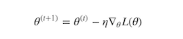

# 使用PyTorch进行深度学习

> 译者：[bdqfork](https://github.com/bdqfork)
>
> 校对者：[FontTian](https://github.com/fonttian)

**作者**: [Robert Guthrie](https://github.com/rguthrie3/DeepLearningForNLPInPytorch)

## 深度学习构建模块：仿射变换, 非线性函数以及目标函数

深度学习表现为使用更巧妙的方法将线性函数和非线性函数进行组合。非线性函数的引入使得训练出来的模型更加强大。在本节中，我们将学习这些核心组件，建立目标函数，并理解模型是如何构建的。

### 仿射变换

深度学习的核心组件之一是仿射变换，仿射变换是一个关于矩阵*A*和向量*x*，*b*的*f(x)*函数，如下所示：


需要训练的参数就是该公式中的*A*和*b*。

PyTorch以及大多数的深度学习框架所做的事情都与传统的线性代数有些不同。它的映射输入是行而不是列。也就是说，下面代码输出的第*i*行是输入的第*i*行进行*A*变换，并加上偏移项的结果。看下面的例子：

```py
# Author: Robert Guthrie

import torch
import torch.nn as nn
import torch.nn.functional as F
import torch.optim as optim

torch.manual_seed(1)

```

```py
lin = nn.Linear(5, 3)  # maps from R^5 to R^3, parameters A, b
# data is 2x5.  A maps from 5 to 3... can we map "data" under A?
data = torch.randn(2, 5)
print(lin(data))  # yes

```

输出:

```py
tensor([[ 0.1755, -0.3268, -0.5069],
        [-0.6602,  0.2260,  0.1089]], grad_fn=<AddmmBackward>)

```

### 非线性函数

首先，注意以下这个例子，它将解释为什么我们需要非线性函数。假设我们有两个仿射变换 *f(x) = Ax + b* 和 *g(x) = Cx + d* 。那么 *f(g(x))* 又是什么呢？


*AC* 是一个矩阵，*Ad + b*是一个向量，可以看出，两个仿射变换的组合还是一个仿射变换。

由此可以看出，使用以上方法将多个仿射变换组合成的长链式的神经网络，相对于单个仿射变换并没有性能上的提升。

但是如果我们在两个仿射变换之间引入非线性，那么结果就大不一样了，我们可以构建出一个高性能的模型。

最常用的核心的非线性函数有：*tanh(x)*，*σ(x)*，*ReLU(x)*。你可能会想：“为什么是这些函数？明明有其他更多的非线性函数。”这些函数常用的原因是它们拥有可以容易计算的梯度，而计算梯度是学习的本质。例如


注意：尽管你可能在AI课程的介绍中学习了一些神经网络，在这些神经网络中*σ(x)*是默认非线性的，但是通常在实际使用的过程中都会避开它们。这是因为当参数的绝对值增长时，梯度会很快消失。小梯度意味着很难学习。因此大部分人默认选择*tanh*或者*ReLU*。

```py
# In pytorch, most non-linearities are in torch.functional (we have it imported as F)
# Note that non-linearites typically don't have parameters like affine maps do.
# That is, they don't have weights that are updated during training.
data = torch.randn(2, 2)
print(data)
print(F.relu(data))

```

输出:

```py
tensor([[-0.5404, -2.2102],
        [ 2.1130, -0.0040]])
tensor([[0.0000, 0.0000],
        [2.1130, 0.0000]])

```

### Softmax和概率

*Softmax(x)*也是一个非线性函数，但它的特殊之处在于，它通常是神经网络的最后一个操作。这是因为它接受实数向量，并且返回一个概率分布。它的定义如下。设*x*为实数向量(正、负，无论什么，没有约束）。然后*Softmax(x)*的第*i*个分量是：


很明显，输出的是一个概率分布：每一个元素都非负且和为1。

你也可以认为这只是一个对输入的元素进行的求幂运算符，使所有的内容都非负，然后除以规范化常量。

```py
# Softmax is also in torch.nn.functional
data = torch.randn(5)
print(data)
print(F.softmax(data, dim=0))
print(F.softmax(data, dim=0).sum())  # Sums to 1 because it is a distribution!
print(F.log_softmax(data, dim=0))  # theres also log_softmax

```

输出:

```py
tensor([ 1.3800, -1.3505,  0.3455,  0.5046,  1.8213])
tensor([0.2948, 0.0192, 0.1048, 0.1228, 0.4584])
tensor(1.)
tensor([-1.2214, -3.9519, -2.2560, -2.0969, -0.7801])

```

### 目标函数

目标函数正是神经网络通过训练来最小化的函数(因此，它常常被称作损失函数或者成本函数）。这需要首先选择一个训练数据实例，通过神经网络运行它并计算输出的损失。然后通过损失函数的导数来更新模型的参数。因此直观来讲，如果它的结果是错误的，而模型完全信任他，那么损失将会很高。反之，当模型信任计算结果而结果正确时，损失会很低。

在你的训练实例中最小化损失函数的目的是使你的网络拥有很好的泛化能力，可以在开发数据集，测试数据集以及实际生产中拥有很小的损失。损失函数的一个例子是负对数似然损失函数，这个函数经常在多级分类中出现。在监督多级分类中，这意味着训练网络最小化正确输出的负对数概率(等效的于最大化正确输出的对数概率）。

## 优化和训练

那么，我们该怎么计算函数实例的损失函数呢？我们应该做什么呢？我们在之前了解到TensorFlow中的Tensor知道如何计算梯度以及计算梯度相关的东西。由于我们的损失正是一个Tensor，因此我们可以使用所有与梯度有关的参数来计算梯度。然后我们可以进行标准梯度更新。设 *θ*为我们的参数，*L(θ)*为损失函数，*η*一个正的学习率。然后：



目前，有大量的算法和积极的研究试图做一些除了这种普通的梯度更新以外的事情。许多人尝试去基于训练时发生的事情来改变学习率。但是，你不需要担心这些特殊的算法到底在干什么，除非你真的很感兴趣。Torch提供了大量的算法在torch.optim包中，且全部都是透明的。在语法上使用复杂的算法和使用最简单的梯度更新一样简单。但是尝试不同的更新算法和在更新算法中使用不同的参数(例如不同的初始学习率）对于优化你的网络的性能很重要。通常，仅仅将普通的*SGD*替换成一个例如*Adam*或者*RMSProp*优化器都可以显著的提升性能。

## 使用PyTorch创建网络组件

在我们继续关注NLP之前，让我们先使用PyTorch构建一个只用仿射变换和非线性函数组成的网络示例。我们也将了解如何计算损失函数，使用PyTorch内置的负对数似然函数，以及通过反向传播更新参数。

所有的网络组件应该继承nn.Module并覆盖forward()方法。继承nn.Module提供给了一些方法给你的组件。例如，它可以跟踪可训练的参数，你可以通过`.to(device)`方法在CPU和GPU之间交换它们。`.to(device)`方法中的device可以是CPU设备`torch.device("cpu")`或者CUDA设备`torch.device("cuda:0")`。

让我们写一个神经网络的示例，它接受一些稀疏的BOW(词袋模式)表示，然后输出分布在两个标签上的概率：“English”和“Spanish”。这个模型只是一个逻辑回归。

### 示例: 基于逻辑回归与词袋模式的文本分类器

我们的模型将会把BOW表示映射成标签上的对数概率。我们为词汇中的每个词指定一个索引。例如，我们所有的词汇是两个单词“hello”和"world"，用0和1表示。句子“hello hello hello hello”的表示是

```py
[4,0]
```

对于“hello world world hello”, 则表示成

```py
[2,2]
```

通常表示成

```py
[Count(hello),Count(world)]
```

用x来表示这个BOW向量。网络的输出是:


也就是说，我们数据传入一个仿射变换然后做对数归一化`logsoftmax`。

```py
data = [("me gusta comer en la cafeteria".split(), "SPANISH"),
        ("Give it to me".split(), "ENGLISH"),
        ("No creo que sea una buena idea".split(), "SPANISH"),
        ("No it is not a good idea to get lost at sea".split(), "ENGLISH")]

test_data = [("Yo creo que si".split(), "SPANISH"),
             ("it is lost on me".split(), "ENGLISH")]

# word_to_ix maps each word in the vocab to a unique integer, which will be its
# index into the Bag of words vector
word_to_ix = {}
for sent, _ in data + test_data:
    for word in sent:
        if word not in word_to_ix:
            word_to_ix[word] = len(word_to_ix)
print(word_to_ix)

VOCAB_SIZE = len(word_to_ix)
NUM_LABELS = 2

class BoWClassifier(nn.Module):  # inheriting from nn.Module!

    def __init__(self, num_labels, vocab_size):
        # calls the init function of nn.Module.  Dont get confused by syntax,
        # just always do it in an nn.Module
        super(BoWClassifier, self).__init__()

        # Define the parameters that you will need.  In this case, we need A and b,
        # the parameters of the affine mapping.
        # Torch defines nn.Linear(), which provides the affine map.
        # Make sure you understand why the input dimension is vocab_size
        # and the output is num_labels!
        self.linear = nn.Linear(vocab_size, num_labels)

        # NOTE! The non-linearity log softmax does not have parameters! So we don't need
        # to worry about that here

    def forward(self, bow_vec):
        # Pass the input through the linear layer,
        # then pass that through log_softmax.
        # Many non-linearities and other functions are in torch.nn.functional
        return F.log_softmax(self.linear(bow_vec), dim=1)

def make_bow_vector(sentence, word_to_ix):
    vec = torch.zeros(len(word_to_ix))
    for word in sentence:
        vec[word_to_ix[word]] += 1
    return vec.view(1, -1)

def make_target(label, label_to_ix):
    return torch.LongTensor([label_to_ix[label]])

model = BoWClassifier(NUM_LABELS, VOCAB_SIZE)

# the model knows its parameters.  The first output below is A, the second is b.
# Whenever you assign a component to a class variable in the __init__ function
# of a module, which was done with the line
# self.linear = nn.Linear(...)
# Then through some Python magic from the PyTorch devs, your module
# (in this case, BoWClassifier) will store knowledge of the nn.Linear's parameters
for param in model.parameters():
    print(param)

# To run the model, pass in a BoW vector
# Here we don't need to train, so the code is wrapped in torch.no_grad()
with torch.no_grad():
    sample = data[0]
    bow_vector = make_bow_vector(sample[0], word_to_ix)
    log_probs = model(bow_vector)
    print(log_probs)

```

输出:

```py
{'me': 0, 'gusta': 1, 'comer': 2, 'en': 3, 'la': 4, 'cafeteria': 5, 'Give': 6, 'it': 7, 'to': 8, 'No': 9, 'creo': 10, 'que': 11, 'sea': 12, 'una': 13, 'buena': 14, 'idea': 15, 'is': 16, 'not': 17, 'a': 18, 'good': 19, 'get': 20, 'lost': 21, 'at': 22, 'Yo': 23, 'si': 24, 'on': 25}
Parameter containing:
tensor([[ 0.1194,  0.0609, -0.1268,  0.1274,  0.1191,  0.1739, -0.1099, -0.0323,
         -0.0038,  0.0286, -0.1488, -0.1392,  0.1067, -0.0460,  0.0958,  0.0112,
          0.0644,  0.0431,  0.0713,  0.0972, -0.1816,  0.0987, -0.1379, -0.1480,
          0.0119, -0.0334],
        [ 0.1152, -0.1136, -0.1743,  0.1427, -0.0291,  0.1103,  0.0630, -0.1471,
          0.0394,  0.0471, -0.1313, -0.0931,  0.0669,  0.0351, -0.0834, -0.0594,
          0.1796, -0.0363,  0.1106,  0.0849, -0.1268, -0.1668,  0.1882,  0.0102,
          0.1344,  0.0406]], requires_grad=True)
Parameter containing:
tensor([0.0631, 0.1465], requires_grad=True)
tensor([[-0.5378, -0.8771]])

```

上面的哪一个值对应的是ENGLISH的对数概率，哪一个是SPANISH的对数概率？我们还没有定义，但是如果我必须要定义我们想要训练的东西。

```py
label_to_ix = {"SPANISH": 0, "ENGLISH": 1}

```

让我们来训练吧! 我们将实例传入来获取对数概率，计算损失函数，计算损失函数的梯度，然后使用一个梯度步长来更新参数。在PyTorch的nn包里提供了损失函数。nn.NLLLoss()是我们想要的负对数似然损失函数。torch.optim中也定义了优化方法。这里，我们只使用*SGD*。

注意，因为NLLLoss的输入是一个对数概率的向量以及目标标签。它不会为我们计算对数概率。这也是为什么我们最后一层网络是*log_softmax*的原因。损失函数nn.CrossEntropyLoss()除了对结果额外计算了logsoftmax之外和NLLLoss()没什么区别。

```py
# Run on test data before we train, just to see a before-and-after
with torch.no_grad():
    for instance, label in test_data:
        bow_vec = make_bow_vector(instance, word_to_ix)
        log_probs = model(bow_vec)
        print(log_probs)

# Print the matrix column corresponding to "creo"
print(next(model.parameters())[:, word_to_ix["creo"]])

loss_function = nn.NLLLoss()
optimizer = optim.SGD(model.parameters(), lr=0.1)

# Usually you want to pass over the training data several times.
# 100 is much bigger than on a real data set, but real datasets have more than
# two instances.  Usually, somewhere between 5 and 30 epochs is reasonable.
for epoch in range(100):
    for instance, label in data:
        # Step 1\. Remember that PyTorch accumulates gradients.
        # We need to clear them out before each instance
        model.zero_grad()

        # Step 2\. Make our BOW vector and also we must wrap the target in a
        # Tensor as an integer. For example, if the target is SPANISH, then
        # we wrap the integer 0\. The loss function then knows that the 0th
        # element of the log probabilities is the log probability
        # corresponding to SPANISH
        bow_vec = make_bow_vector(instance, word_to_ix)
        target = make_target(label, label_to_ix)

        # Step 3\. Run our forward pass.
        log_probs = model(bow_vec)

        # Step 4\. Compute the loss, gradients, and update the parameters by
        # calling optimizer.step()
        loss = loss_function(log_probs, target)
        loss.backward()
        optimizer.step()

with torch.no_grad():
    for instance, label in test_data:
        bow_vec = make_bow_vector(instance, word_to_ix)
        log_probs = model(bow_vec)
        print(log_probs)

# Index corresponding to Spanish goes up, English goes down!
print(next(model.parameters())[:, word_to_ix["creo"]])

```

输出:

```py
tensor([[-0.9297, -0.5020]])
tensor([[-0.6388, -0.7506]])
tensor([-0.1488, -0.1313], grad_fn=<SelectBackward>)
tensor([[-0.2093, -1.6669]])
tensor([[-2.5330, -0.0828]])
tensor([ 0.2803, -0.5605], grad_fn=<SelectBackward>)

```

我们得到了正确的结果！你可以看到Spanish的对数概率比第一个例子中的高的多，English的对数概率在第二个测试数据中更高，结果也应该是这样。

现在你了解了如何创建一个PyTorch组件，将数据传入并进行梯度更新。现在我们已经可以开始进行深度学习上的自然语言处理了。
