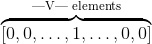
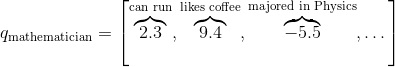
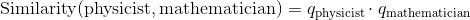
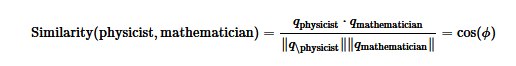
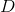
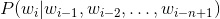
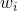
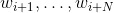
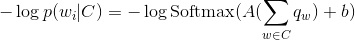

# 词嵌入：编码形式的词汇语义

> 译者：[巩子惠](https://github.com/sight007)

词嵌入是一种由真实数字组成的稠密向量，每个向量都代表了单词表里的一个单词。 在自然语言处理中，总会遇到这样的情况：特征全是单词！但是，如何在电脑上表述一个单词呢？你在电脑上存储的单词的`ascii`码，但是它仅仅代表单词怎么拼写，没有说明单词的内在含义(你也许能够从词缀中了解它的词性，或者从大小写中得到一些属性，但仅此而已)。 更重要的是，你能把这些`ascii`码字符组合成什么含义？当代表词汇表、输入数据是维的情况下，我们往往想从神经网络中得到数据密集的结果，但是结果只有很少的几个维度(例如，预测的数据只有几个标签时）。我们如何从大的数据维度空间中得到稍小一点的维度空间？

放弃使用`ascii`码字符的形式表示单词，换用`one-hot encoding`会怎么样了？好吧，这个单词就能这样表示：



其中，1 表示的独有位置，其他位置全是0。其他的词都类似，在另外不一样的位置有一个1代表它，其他位置也都是0。
这种表达除了占用巨大的空间外，还有个很大的缺陷。 它只是简单的把词看做一个单独个体，认为它们之间毫无联系。 我们真正想要的是能够表达单词之间一些相似的含义。为什么要这样做呢？来看下面的例子：

假如我们正在搭建一个语言模型，训练数据有下面一些句子：

*   The mathematician ran to the store.
*   The physicist ran to the store.
*   The mathematician solved the open problem.

现在又得到一个没见过的新句子:

*   The physicist solved the open problem.

我们的模型可能在这个句子上表现的还不错，但是，如果利用了下面两个事实，模型会表现更佳：

*   我们发现数学家和物理学家在句子里有相同的作用，所以在某种程度上，他们有语义的联系。
*   当看见物理学家在新句子中的作用时，我们发现数学家也有起着相同的作用。

然后我们就推测，物理学家在上面的句子里也类似于数学家吗？ 这就是我们所指的相似性理念： 指的是语义相似，而不是简单的拼写相似。 这就是一种通过连接我们发现的和没发现的一些内容相似点、用于解决语言数据稀疏性的技术。 这个例子依赖于一个基本的语言假设： 那些在相似语句中出现的单词，在语义上也是相互关联的。 这就叫做 [distributional hypothesis(分布式假设）](https://en.wikipedia.org/wiki/Distributional_semantics)。

## Getting Dense Word Embeddings(密集词嵌入）

我们如何解决这个问题呢？也就是，怎么编码单词中的语义相似性？ 也许我们会想到一些语义属性。 举个例子，我们发现数学家和物理学家都能跑， 所以也许可以给含有“能跑”语义属性的单词打高分，考虑一下其他的属性，想象一下你可能会在这些属性上给普通的单词打什么分。

如果每个属性都表示一个维度，那我们也许可以用一个向量表示一个单词，就像这样：




那么，我们就这可以通过下面的方法得到这些单词之间的相似性：



尽管通常情况下需要进行长度归一化：



是两个向量的夹角。 这就意味着，完全相似的单词相似度为1。完全不相似的单词相似度为-1。

你可以把本章开头介绍的`one-hot`稀疏向量看做是我们新定义向量的一种特殊形式，那里的单词相似度为0， 现在我们给每个单词一些独特的语义属性。 这些向量数据密集，也就是说它们数字通常都非零。

但是新的这些向量存在一个严重的问题： 你可以想到数千种不同的语义属性，它们可能都与决定相似性有关，而且，到底如何设置不同属性的值呢？深度学习的中心思想是用神经网络来学习特征的表示，而不是程序员去设计它们。 所以为什么不把词嵌入只当做模型参数，而是通过训练来更新呢？ 这就才是我们要确切做的事。我们将用神经网络做一些潜在语义属性，但是原则上，学习才是关键。 注意，词嵌入可能无法解释。就是说，尽管使用我们上面手动制作的向量，能够发现数学家和物理学家都喜欢喝咖啡的相似性， 如果我们允许神经网络来学习词嵌入，那么就会发现数学家和物理学家在第二维度有个较大的值，它所代表的含义很不清晰。 它们在一些潜在语义上是相似的，但是对我们来说无法解释。

总结一下，**词嵌入是单词语义的表示，有效地编码语义信息可能与手头的任务有关**。你也可以嵌入其他的东西：语音标签，解析树，其他任何东西！特征嵌入是这个领域的核心思想。

## Pytorch中的词嵌入

在我们举例或练习之前，这里有一份关于如何在`Pytorch`和常见的深度学习中使用词嵌入的简要介绍。 与制作`one-hot`向量时对每个单词定义一个特殊的索引类似，当我们使用词向量时也需要为每个单词定义一个索引。这些索引将是查询表的关键点。意思就是，词嵌入被被存储在一个的向量中，其中是词嵌入的维度。词被被分配的索引`i`，表示在向量的第`i`行存储它的嵌入。在所有的代码中，从单词到索引的映射是一个叫`word_to_ix`的字典。

能使用词嵌入的模块是`torch.nn.Embedding`，这里面有两个参数：词汇表的大小和词嵌入的维度。

索引这张表时，你必须使用`torch.LongTensor`(因为索引是整数，不是浮点数）。

```py
# 作者: Robert Guthrie

import torch
import torch.nn as nn
import torch.nn.functional as F
import torch.optim as optim

torch.manual_seed(1)

```

```py
word_to_ix = {"hello": 0, "world": 1}
embeds = nn.Embedding(2, 5)  # 2 words in vocab, 5 dimensional embeddings
lookup_tensor = torch.tensor([word_to_ix["hello"]], dtype=torch.long)
hello_embed = embeds(lookup_tensor)
print(hello_embed)

```

输出：

```py
tensor([[ 0.6614,  0.2669,  0.0617,  0.6213, -0.4519]],
       grad_fn=<EmbeddingBackward>)

```

## 例子： N-Gram语言模型

回想一下，在`n-gram`语言模型中,给定一个单词序列向量，我们要计算的是



是单词序列的第`i`个单词。
在本例中，我们将在训练样例上计算损失函数，并且用反向传播算法更新参数。
```py
CONTEXT_SIZE = 2
EMBEDDING_DIM = 10
# 我们用莎士比亚的十四行诗 Sonnet 2
test_sentence = """When forty winters shall besiege thy brow,
And dig deep trenches in thy beauty's field,
Thy youth's proud livery so gazed on now,
Will be a totter'd weed of small worth held:
Then being asked, where all thy beauty lies,
Where all the treasure of thy lusty days;
To say, within thine own deep sunken eyes,
Were an all-eating shame, and thriftless praise.
How much more praise deserv'd thy beauty's use,
If thou couldst answer 'This fair child of mine
Shall sum my count, and make my old excuse,'
Proving his beauty by succession thine!
This were to be new made when thou art old,
And see thy blood warm when thou feel'st it cold.""".split()
# 应该对输入变量进行标记，但暂时忽略。
# 创建一系列的元组，每个元组都是([ word_i-2, word_i-1 ], target word)的形式。
trigrams = [([test_sentence[i], test_sentence[i + 1]], test_sentence[i + 2])
            for i in range(len(test_sentence) - 2)]
# 输出前3行，先看下是什么样子。
print(trigrams[:3])

vocab = set(test_sentence)
word_to_ix = {word: i for i, word in enumerate(vocab)}

class NGramLanguageModeler(nn.Module):

    def __init__(self, vocab_size, embedding_dim, context_size):
        super(NGramLanguageModeler, self).__init__()
        self.embeddings = nn.Embedding(vocab_size, embedding_dim)
        self.linear1 = nn.Linear(context_size * embedding_dim, 128)
        self.linear2 = nn.Linear(128, vocab_size)

    def forward(self, inputs):
        embeds = self.embeddings(inputs).view((1, -1))
        out = F.relu(self.linear1(embeds))
        out = self.linear2(out)
        log_probs = F.log_softmax(out, dim=1)
        return log_probs

losses = []
loss_function = nn.NLLLoss()
model = NGramLanguageModeler(len(vocab), EMBEDDING_DIM, CONTEXT_SIZE)
optimizer = optim.SGD(model.parameters(), lr=0.001)

for epoch in range(10):
    total_loss = 0
    for context, target in trigrams:

        # 步骤 1\. 准备好进入模型的数据 (例如将单词转换成整数索引,并将其封装在变量中)
        context_idxs = torch.tensor([word_to_ix[w] for w in context], dtype=torch.long)

        # 步骤 2\. 回调torch累乘梯度
        # 在传入一个新实例之前，需要把旧实例的梯度置零。
        model.zero_grad()

        # 步骤 3\. 继续运行代码，得到单词的log概率值。
        log_probs = model(context_idxs)

        # 步骤 4\. 计算损失函数(再次注意，Torch需要将目标单词封装在变量里）。
        loss = loss_function(log_probs, torch.tensor([word_to_ix[target]], dtype=torch.long))

        # 步骤 5\. 反向传播更新梯度
        loss.backward()
        optimizer.step()

        # 通过调tensor.item()得到单个Python数值。
        total_loss += loss.item()
    losses.append(total_loss)
print(losses)  # 用训练数据每次迭代，损失函数都会下降。

```

输出：

```py
[(['When', 'forty'], 'winters'), (['forty', 'winters'], 'shall'), (['winters', 'shall'], 'besiege')]
[518.6343855857849, 516.0739576816559, 513.5321269035339, 511.0085496902466, 508.5003893375397, 506.0077188014984, 503.52977323532104, 501.06553316116333, 498.6121823787689, 496.16915798187256]

```

## 练习：计算连续词袋模型的词向量

连续词袋模型(`CBOW`）在`NLP`深度学习中使用很频繁。它是一个模型，尝试通过目标词前后几个单词的文本，来预测目标词。这有别于语言模型，因为`CBOW`不是序列的，也不必是概率性的。 `CBOW`常用于快速地训练词向量，得到的嵌入用来初始化一些复杂模型的嵌入。通常情况下，这被称为`预训练嵌入`。 它几乎总能帮忙把模型性能提升几个百分点。

`CBOW`模型如下所示： 给定一个单词 ，代表两边的滑窗距，如和，并将所有的上下文词统称为 ，`CBOW`试图最小化



其中是单词的嵌入。

在`Pytorch`中，通过填充下面的类来实现这个模型，有两条需要注意：

*   考虑下你需要定义哪些参数。
*   确保你知道每步操作后的结构，如果想重构，请使用`.view()`

```py
CONTEXT_SIZE = 2  # 左右各两个词
raw_text = """We are about to study the idea of a computational process.
Computational processes are abstract beings that inhabit computers.
As they evolve, processes manipulate other abstract things called data.
The evolution of a process is directed by a pattern of rules
called a program. People create programs to direct processes. In effect,
we conjure the spirits of the computer with our spells.""".split()

# 通过对`raw_text`使用set()函数，我们进行去重操作
vocab = set(raw_text)
vocab_size = len(vocab)

word_to_ix = {word: i for i, word in enumerate(vocab)}
data = []
for i in range(2, len(raw_text) - 2):
    context = [raw_text[i - 2], raw_text[i - 1],
               raw_text[i + 1], raw_text[i + 2]]
    target = raw_text[i]
    data.append((context, target))
print(data[:5])

class CBOW(nn.Module):

    def __init__(self):
        pass

    def forward(self, inputs):
        pass

# 创建模型并且训练。这里有些函数帮你在使用模块之前制作数据。

def make_context_vector(context, word_to_ix):
    idxs = [word_to_ix[w] for w in context]
    return torch.tensor(idxs, dtype=torch.long)

make_context_vector(data[0][0], word_to_ix)  # example

```

输出：

```py
[(['We', 'are', 'to', 'study'], 'about'), (['are', 'about', 'study', 'the'], 'to'), (['about', 'to', 'the', 'idea'], 'study'), (['to', 'study', 'idea', 'of'], 'the'), (['study', 'the', 'of', 'a'], 'idea')]

```
