# torch.nn

## Parameters(参数）

```py
class torch.nn.Parameter
```


Parameters对象是一种会被视为模块参数(module parameter）的Tensor张量。

Parameters类是[`Tensor`](tensors.html#torch.Tensor "torch.Tensor") 的子类, 不过相对于它的父类，Parameters类有一个很重要的特性就是当其在 [`Module`](#torch.nn.Module "torch.nn.Module")类中被使用并被当做这个[`Module`](#torch.nn.Module "torch.nn.Module")类的模块属性的时候，那么这个Parameters对象会被自动地添加到这个[`Module`](#torch.nn.Module "torch.nn.Module")类的参数列表(list of parameters)之中，同时也就会被添加入此[`Module`](#torch.nn.Module "torch.nn.Module")类的 [`parameters()`](#torch.nn.Module.parameters "torch.nn.Module.parameters")方法所返回的参数迭代器中。而Parameters类的父类Tensor类也可以被用为构建模块的属性，但不会被加入参数列表。这样主要是因为，有时可能需要在模型中存储一些非模型参数的临时状态，比如RNN中的最后一个隐状态。而通过使用非[`Parameter`](#torch.nn.Parameter "torch.nn.Parameter")的Tensor类，可以将这些临时变量注册(register)为模型的属性的同时使其不被加入参数列表。

Parameters: 

*   **data** ([_Tensor_](tensors.html#torch.Tensor "torch.Tensor")) – 参数张量(parameter tensor).
*   **requires_grad** ([_bool_](https://docs.python.org/3/library/functions.html#bool "(in Python v3.7)")_,_ _optional_) – 参数是否需要梯度， 默认为 `True`。更多细节请看 [如何将子图踢出反向传播过程](notes/autograd.html#excluding-subgraphs)。 


## Containers(容器）

### Module(模块）

```py
class torch.nn.Module
```

模块(Module）是所有神经网络模型的基类。

你创建模型的时候也应该继承这个类哦。

模块(Module)中还可以包含其他的模块，你可以将一个模块赋值成为另一个模块的属性，从而成为这个模块的一个子模块。而通过不断的赋值，你可以将不同的模块组织成一个树结构:

```py
import torch.nn as nn
import torch.nn.functional as F

class Model(nn.Module):
    def __init__(self):
        super(Model, self).__init__()
        self.conv1 = nn.Conv2d(1, 20, 5) # 当前的nn.Conv2d模块就被赋值成为Model模块的一个子模块，成为“树结构”的叶子
        self.conv2 = nn.Conv2d(20, 20, 5)

    def forward(self, x):
       x = F.relu(self.conv1(x))
       return F.relu(self.conv2(x))

```

通过赋值这种方式添加的子模块将会被模型注册(register)，而后当调用模块的一些参数转换函数([`to()`](#torch.nn.Module.to "torch.nn.Module.to")）的时候，子模块的参数也会一并转换。

```py
add_module(name, module)
```
向当前模块添加一个子模块。
此子模块可以作为当前模块的属性被访问到，而属性名就是add_module()函数中的name参数。

add_module()函数参数: 

*   **name** (_string_) – 子模块的名字. 函数调用完成后，可以通过访问当前模块的此字段来访问该子模块。
*   **parameter** ([_Module_](#torch.nn.Module "torch.nn.Module")) – 要添加到当前模块的子模块。


```py
apply(fn)
```


apply()函数的主要作用是将 `fn` 递归地应用于模块的所有子模块(`.children()`函数的返回值）以及模块自身。此函数的一个经典应用就是初始化模型的所有参数这一过程(同样参见于 torch-nn-init)。

| Parameters: | **fn** ([`Module`](#torch.nn.Module "torch.nn.Module") -&gt; None) – 要应用于所有子模型的函数 |
| --- | --- |
| Returns: | self |
| --- | --- |
| Return type: | [Module](#torch.nn.Module "torch.nn.Module") |
| --- | --- |

例子:

```py
>>> def init_weights(m):
 print(m)
 if type(m) == nn.Linear:
 m.weight.data.fill_(1.0)
 print(m.weight)

>>> net = nn.Sequential(nn.Linear(2, 2), nn.Linear(2, 2))
>>> net.apply(init_weights) # 将init_weights()函数应用于模块的所有子模块
Linear(in_features=2, out_features=2, bias=True)
Parameter containing:
tensor([[ 1.,  1.],
 [ 1.,  1.]])
Linear(in_features=2, out_features=2, bias=True)
Parameter containing:
tensor([[ 1.,  1.],
 [ 1.,  1.]])
Sequential(
 (0): Linear(in_features=2, out_features=2, bias=True)
 (1): Linear(in_features=2, out_features=2, bias=True)
)
Sequential(
 (0): Linear(in_features=2, out_features=2, bias=True)
 (1): Linear(in_features=2, out_features=2, bias=True)
)

```

```py
buffers(recurse=True)
```
返回模块的缓冲区的迭代器

| Parameters: | **recurse** ([_bool_](https://docs.python.org/3/library/functions.html#bool "(in Python v3.7)")) – 如果设置为True，产生的缓冲区迭代器会遍历模块自己与所有子模块，否则只会遍历模块的直连的成员。 |
| --- | --- |
| Yields: | _torch.Tensor_ – 模型缓冲区 |
| --- | --- |

举例:

```py
>>> for buf in model.buffers():
>>>     print(type(buf.data), buf.size())
<class 'torch.FloatTensor'> (20L,)
<class 'torch.FloatTensor'> (20L, 1L, 5L, 5L)

```

```py
children()
```

返回一个当前所有子模块的迭代器
Returns an iterator over immediate children modules.

| Yields: | _Module_ – 子模块 |
| --- | --- |

```py
cpu()
```

将模型的所有参数(parameter)和缓冲区(buffer)都转移到CPU内存中。

| Returns: | self |
| --- | --- |
| Return type: | [Module](#torch.nn.Module "torch.nn.Module") |
| --- | --- |

```py
cuda(device=None)
```

将模型的所有参数和缓冲区都转移到CUDA设备内存中。

因为cuda()函数同时会将处理模块中的所有参数并缓存这些参数的对象。所以如果想让模块在GPU上进行优化操作，一定要在构建优化器之前调用模块的cuda()函数。

| Parameters: | **device** ([_int_](https://docs.python.org/3/library/functions.html#int "(in Python v3.7)")_,_ _optional_) – 如果设备编号被指定，所有的参数都会被拷贝到编号指定设备上 |
| --- | --- |
| Returns: | self |
| --- | --- |
| Return type: | [Module](#torch.nn.Module "torch.nn.Module") |
| --- | --- |

```py
double()
```

将所有的浮点数类型的参数(parameters)和缓冲区(buffers)转换为`double`数据类型。

| Returns: | self |
| --- | --- |
| Return type: | [Module](#torch.nn.Module "torch.nn.Module") |
| --- | --- |

```py
dump_patches = False
```

这个字段可以为[`load_state_dict()`](#torch.nn.Module.load_state_dict "torch.nn.Module.load_state_dict")提供 BC 支持(BC support实在不懂是什么意思-.-）。 在 [`state_dict()`](#torch.nn.Module.state_dict "torch.nn.Module.state_dict")函数返回的状态字典(state dict）中， 有一个名为`_metadata`的属性中存储了这个state_dict的版本号。`_metadata`是一个遵从了状态字典(state dict）的命名规范的关键字字典， 要想了解这个`_metadata`在加载状态(loading state dict）的时候是怎么用的，可以看一下 `_load_from_state_dict`部分的文档。


如果新的参数/缓冲区被添加于/移除自这个模块之中时，这个版本号数字会随之发生变化。同时模块的`_load_from_state_dict`方法会比较版本号的信息并依据此状态词典(state dict）的变化做出一些适当的调整。

```py
eval()
```

将模块转换为测试模式。

这个函数只对特定的模块类型有效，如 [`Dropout`](#torch.nn.Dropout "torch.nn.Dropout")和`BatchNorm`等等。如果想了解这些特定模块在训练/测试模式下各自的运作细节，可以看一下这些特殊模块的文档部分。

```py
extra_repr()
```

为模块设置额外的展示信息(extra representation)。

如果想要打印展示(print)你的模块的一些定制的额外信息，那你应该在你的模块中复现这个函数。单行和多行的字符串都可以被接受。


```py
float()
```

将所有浮点数类型的参数(parameters)和缓冲区(buffers)转换为`float`数据类型。

| Returns: | self |
| --- | --- |
| Return type: | [Module](#torch.nn.Module "torch.nn.Module") |
| --- | --- |

```py
forward(*input)
```

定义了每次模块被调用之后所进行的计算过程。

应该被Module类的所有子类重写。

Note

尽管模块的前向操作都被定义在这个函数里面，但是当你要进行模块的前向操作的时候，还是要直接调用模块[`Module`](#torch.nn.Module "torch.nn.Module") 的实例函数，而不是直接调用这个forward()函数。这主要是因为前者会照顾到注册在此模块之上的钩子函数(the registered hooks）的运行，而后者则不会。

```py
half()
```

将所有的浮点数类型的参数(parameters)和缓冲区(buffers)转换为`half`数据类型。

| Returns: | self |
| --- | --- |
| Return type: | [Module](#torch.nn.Module "torch.nn.Module") |
| --- | --- |

```py
load_state_dict(state_dict, strict=True)
```

将[`state_dict`](#torch.nn.Module.state_dict "torch.nn.Module.state_dict")中的参数(parameters）和缓冲区(buffers）拷贝到模块和其子模块之中。如果`strict`被设置为`True`，那么[`state_dict`](#torch.nn.Module.state_dict "torch.nn.Module.state_dict")中的键值(keys）必须与模型的[`state_dict()`]函数所返回的键值(keys）信息保持完全的一致。

load_state_dict()函数参数： 

*   **state_dict** ([_dict_](https://docs.python.org/3/library/stdtypes.html#dict "(in Python v3.7)")) – 一个包含了参数和持久缓冲区的字典。
*   **strict** ([_bool_](https://docs.python.org/3/library/functions.html#bool "(in Python v3.7)")_,_ _optional_) – 是否严格要求 [`state_dict`](#torch.nn.Module.state_dict "torch.nn.Module.state_dict") 中的键值(keys）与模型 [`state_dict()`](#torch.nn.Module.state_dict "torch.nn.Module.state_dict") 函数返回的键值(keys）信息保持完全一致。 默认： `True`


```py
modules()
```

返回一个当前模块内所有模块(包括自身）的迭代器。

| Yields: | _Module_ – a module in the network |
| --- | --- |

Note

注意重复的模块只会被返回一次。比在下面这个例子中，`l`就只会被返回一次。

例子:

```py
>>> l = nn.Linear(2, 2)
>>> net = nn.Sequential(l, l)
>>> for idx, m in enumerate(net.modules()):
 print(idx, '->', m)

0 -> Sequential (
 (0): Linear (2 -> 2)
 (1): Linear (2 -> 2)
)
1 -> Linear (2 -> 2)

```

```py
named_buffers(prefix='', recurse=True)
```

返回一个模块缓冲区的迭代器，每次返回的元素是由缓冲区的名字和缓冲区自身组成的元组。

named_buffers()函数的参数: 

*   **prefix** ([_str_](https://docs.python.org/3/library/stdtypes.html#str "(in Python v3.7)")) – 要添加在所有缓冲区名字之前的前缀。
*   **recurse** ([_bool_](https://docs.python.org/3/library/functions.html#bool "(in Python v3.7)")) – 如果设置为True，那样迭代器中不光会返回这个模块自身直连成员的缓冲区，同时也会递归返回其子模块的缓冲区。否则，只返回这个模块直连成员的缓冲区。


| Yields: | _(string, torch.Tensor)_ – 包含了缓冲区的名字和缓冲区自身的元组 |
| --- | --- |

例子:

```py
>>> for name, buf in self.named_buffers():
>>>    if name in ['running_var']:
>>>        print(buf.size())

```

```py
named_children()
```

返回一个当前模型直连的子模块的迭代器，每次返回的元素是由子模块的名字和子模块自身组成的元组。


| Yields: | _(string, Module)_ – 包含了子模块的名字和子模块自身的元组 |
| --- | --- |

例子：

```py
>>> for name, module in model.named_children():
>>>     if name in ['conv4', 'conv5']:
>>>         print(module)

```

```py
named_modules(memo=None, prefix='')
```

返回一个当前模块内所有模块(包括自身）的迭代器，每次返回的元素是由模块的名字和模块自身组成的元组。


| Yields: | _(string, Module)_ – 模块名字和模块自身组成的元组 |
| --- | --- |

Note

重复的模块只会被返回一次。在下面的例子中，`l`只被返回了一次。

例子：

```py
>>> l = nn.Linear(2, 2)
>>> net = nn.Sequential(l, l)
>>> for idx, m in enumerate(net.named_modules()):
 print(idx, '->', m)

0 -> ('', Sequential (
 (0): Linear (2 -> 2)
 (1): Linear (2 -> 2)
))
1 -> ('0', Linear (2 -> 2))

```

```py
named_parameters(prefix='', recurse=True)
```

返回一个当前模块内所有参数的迭代器，每次返回的元素是由参数的名字和参数自身组成的元组。

named_parameters()函数参数：

*   **prefix** ([_str_](https://docs.python.org/3/library/stdtypes.html#str "(in Python v3.7)")) – 要在所有参数名字前面添加的前缀。
*   **recurse** ([_bool_](https://docs.python.org/3/library/functions.html#bool "(in Python v3.7)")) – 如果设置为True，那样迭代器中不光会返回这个模块自身直连成员的参数，同时也会返回其子模块的参数。否则，只返回这个模块直连成员的参数。


| Yields: | _(string, Parameter)_ – 参数名字和参数自身组成的元组 |
| --- | --- |

例子:

```py
>>> for name, param in self.named_parameters():
>>>    if name in ['bias']:
>>>        print(param.size())

```

```py
parameters(recurse=True)
```

返回一个遍历模块所有参数的迭代器。
parameters()函数一个经典的应用就是实践中经常将此函数的返回值传入优化器。

| Parameters: | **recurse** ([_bool_](https://docs.python.org/3/library/functions.html#bool "(in Python v3.7)")) –  如果设置为True，那样迭代器中不光会返回这个模块自身直连成员的参数，同时也会递归返回其子模块的参数。否则，只返回这个模块直连成员的参数。 |
| --- | --- |
| Yields: | _Parameter_ – 模块参数 |
| --- | --- |

例子:

```py
>>> for param in model.parameters():
>>>     print(type(param.data), param.size())
<class 'torch.FloatTensor'> (20L,)
<class 'torch.FloatTensor'> (20L, 1L, 5L, 5L)

```

```py
register_backward_hook(hook)
```

在模块上注册一个挂载在反向操作之后的钩子函数。(挂载在backward之后这个点上的钩子函数）

对于每次输入，当模块关于此次输入的反向梯度的计算过程完成，该钩子函数都会被调用一次。此钩子函数需要遵从以下函数签名：


```py
hook(module, grad_input, grad_output) -> Tensor or None

```

如果模块的输入或输出是多重的(multiple inputs or outputs），那 `grad_input` 和 `grad_output` 应当是元组数据。 钩子函数不能对输入的参数`grad_input` 和 `grad_output`进行任何更改，但是可以选择性地根据输入的参数返回一个新的梯度回去，而这个新的梯度在后续的计算中会替换掉`grad_input`。

| Returns: | 一个句柄(handle），这个handle的特点就是通过调用`handle.remove()`函数就可以将这个添加于模块之上的钩子移除掉。|
| --- | --- |
| Return type: | `torch.utils.hooks.RemovableHandle` |
| --- | --- |

Warning

对于一些具有很多复杂操作的[`Module`](#torch.nn.Module "torch.nn.Module")，当前的hook实现版本还不能达到完全理想的效果。举个例子，有些错误的情况下，函数的输入参数`grad_input` 和 `grad_output`中可能只是真正的输入和输出变量的一个子集。对于此类的[`Module`](#torch.nn.Module "torch.nn.Module")，你应该使用[`torch.Tensor.register_hook()`]直接将钩子挂载到某个特定的输入输出的变量上，而不是当前的模块。

```py
register_buffer(name, tensor)
```

往模块上添加一个持久缓冲区。

这个函数的经常会被用于向模块添加不会被认为是模块参数(model parameter）的缓冲区。举个栗子，BatchNorm的`running_mean`就不是一个参数，但却属于持久状态。

所添加的缓冲区可以通过给定的名字(name参数)以访问模块的属性的方式进行访问。

register_buffer()函数的参数: 

*   **name** (_string_) – 要添加的缓冲区的名字。所添加的缓冲区可以通过此名字以访问模块的属性的方式进行访问。
*   **tensor** ([_Tensor_](tensors.html#torch.Tensor "torch.Tensor")) – 需要注册到模块上的缓冲区。


例子:

```py
>>> self.register_buffer('running_mean', torch.zeros(num_features))

```

```py
register_forward_hook(hook)
```

在模块上注册一个挂载在前向操作之后的钩子函数。(挂载在forward操作结束之后这个点）

此钩子函数在每次模块的 [`forward()`](#torch.nn.Module.forward "torch.nn.Module.forward")函数运行结束产生output之后就会被触发。此钩子函数需要遵从以下函数签名：

```py
hook(module, input, output) -> None

```

此钩子函数不能进行会修改 input 和 output 这两个参数的操作。

| Returns: | 一个句柄(handle），这个handle的特点就是通过调用`handle.remove()`函数就可以将这个添加于模块之上的钩子移除掉。 |
| --- | --- |
| Return type: | `torch.utils.hooks.RemovableHandle` |
| --- | --- |

```py
register_forward_pre_hook(hook)
```

在模块上注册一个挂载在前向操作之前的钩子函数。(挂载在forward操作开始之前这个点）


此钩子函数在每次模块的 [`forward()`](#torch.nn.Module.forward "torch.nn.Module.forward")函数运行开始之前会被触发。此钩子函数需要遵从以下函数签名：
The hook will be called every time before [`forward()`](#torch.nn.Module.forward "torch.nn.Module.forward") is invoked. It should have the following signature:

```py
hook(module, input) -> None

```

此钩子函数不能进行会修改 input 这个参数的操作。

| Returns: | 一个句柄(handle），这个handle的特点就是通过调用`handle.remove()`函数就可以将这个添加于模块之上的钩子移除掉。 |
| --- | --- |
| Return type: | `torch.utils.hooks.RemovableHandle` |
| --- | --- |

```py
register_parameter(name, param)
```

向模块添加一个参数(parameter）。

所添加的参数(parameter）可以通过给定的名字(name参数)以访问模块的属性的方式进行访问。

register_parameter()函数的参数： 

*   **name** (_string_) – 所添加的参数的名字. 所添加的参数(parameter）可以通过此名字以访问模块的属性的方式进行访问
*   **parameter** ([_Parameter_](#torch.nn.Parameter "torch.nn.Parameter")) – 要添加到模块之上的参数。


```py
state_dict(destination=None, prefix='', keep_vars=False)
```

返回一个包含了模块当前所有状态(state)的字典(dictionary)。

所有的参数和持久缓冲区都被囊括在其中。字典的键值就是响应的参数和缓冲区的名字(name)。


| Returns: | 一个包含了模块当前所有状态的字典 |
| --- | --- |
| Return type: | [dict](https://docs.python.org/3/library/stdtypes.html#dict "(in Python v3.7)") |
| --- | --- |

例子:

```py
>>> module.state_dict().keys()
['bias', 'weight']

```

```py
to(*args, **kwargs)
```

移动 并且/或者(and/or）转换所有的参数和缓冲区。

这个函数可以这样调用：

```py
to(device=None, dtype=None, non_blocking=False)
```

```py
to(dtype, non_blocking=False)
```

```py
to(tensor, non_blocking=False)
```

此函数的函数签名跟[`torch.Tensor.to()`](tensors.html#torch.Tensor.to "torch.Tensor.to")函数的函数签名很相似，只不过这个函数`dtype`参数只接受浮点数类型的dtype，如float， double， half (floating point desired `dtype` s）。同时，这个方法只会将浮点数类型的参数和缓冲区(the floating point parameters and buffers）转化为`dtype`(如果输入参数中给定的话）的数据类型。而对于整数类型的参数和缓冲区(the integral parameters and buffers），即便输入参数中给定了`dtype`，也不会进行转换操作，而如果给定了 `device`参数，移动操作则会正常进行。当`non_blocking`参数被设置为True之后，此函数会尽可能地相对于 host 进行异步的 转换/移动 操作，比如，将存储在固定内存(pinned memory）上的CPU Tensors移动到CUDA设备上这一过程既是如此。

例子在下面。

Note

这个方法对模块的修改都是in-place操作。

to()函数的参数: 

*   **device** (`torch.device`) – 想要将这个模块中的参数和缓冲区转移到的设备。
*   **dtype** (`torch.dtype`) – 想要将这个模块中浮点数的参数和缓冲区转化为的浮点数数据类型。
*   **tensor** ([_torch.Tensor_](tensors.html#torch.Tensor "torch.Tensor")) – 一个Tensor，如果被指定，其dtype和device信息，将分别起到上面两个参数的作用，也就是说，这个模块的浮点数的参数和缓冲区的数据类型将会被转化为这个Tensor的dtype类型，同时被转移到此Tensor所处的设备device上去。


| Returns: | self |
| --- | --- |
| Return type: | [Module](#torch.nn.Module "torch.nn.Module") |
| --- | --- |

例子:

```py
>>> linear = nn.Linear(2, 2)
>>> linear.weight
Parameter containing:
tensor([[ 0.1913, -0.3420],
 [-0.5113, -0.2325]])
>>> linear.to(torch.double)
Linear(in_features=2, out_features=2, bias=True)
>>> linear.weight
Parameter containing:
tensor([[ 0.1913, -0.3420],
 [-0.5113, -0.2325]], dtype=torch.float64)
>>> gpu1 = torch.device("cuda:1")
>>> linear.to(gpu1, dtype=torch.half, non_blocking=True)
Linear(in_features=2, out_features=2, bias=True)
>>> linear.weight
Parameter containing:
tensor([[ 0.1914, -0.3420],
 [-0.5112, -0.2324]], dtype=torch.float16, device='cuda:1')
>>> cpu = torch.device("cpu")
>>> linear.to(cpu)
Linear(in_features=2, out_features=2, bias=True)
>>> linear.weight
Parameter containing:
tensor([[ 0.1914, -0.3420],
 [-0.5112, -0.2324]], dtype=torch.float16)

```

```py
train(mode=True)
```

将模块转换成训练模式。

这个函数只对特定的模块类型有效，如 [`Dropout`](#torch.nn.Dropout "torch.nn.Dropout")和`BatchNorm`等等。如果想了解这些特定模块在训练/测试模式下各自的运作细节，可以看一下这些特殊模块的文档部分。

| Returns: | self |
| --- | --- |
| Return type: | [Module](#torch.nn.Module "torch.nn.Module") |
| --- | --- |

```py
type(dst_type)
```

将所有的参数和缓冲区转化为 `dst_type`的数据类型。

| Parameters: | **dst_type** ([_type_](https://docs.python.org/3/library/functions.html#type "(in Python v3.7)") _or_ _string_) – 要转化的数据类型 |
| --- | --- |
| Returns: | self |
| --- | --- |
| Return type: | [Module](#torch.nn.Module "torch.nn.Module") |
| --- | --- |

```py
zero_grad()
```

讲模块所有参数的梯度设置为0。

### Sequential

```py
class torch.nn.Sequential(*args)
```

一种顺序容器。传入Sequential构造器中的模块会被按照他们传入的顺序依次添加到Sequential之上。相应的，一个由模块组成的顺序词典也可以被传入到Sequential的构造器中。

为了方便大家理解，举个简单的例子：

```py
# 构建Sequential的例子
model = nn.Sequential(
          nn.Conv2d(1,20,5),
          nn.ReLU(),
          nn.Conv2d(20,64,5),
          nn.ReLU()
        )

# 利用OrderedDict构建Sequential的例子
model = nn.Sequential(OrderedDict([
          ('conv1', nn.Conv2d(1,20,5)),
          ('relu1', nn.ReLU()),
          ('conv2', nn.Conv2d(20,64,5)),
          ('relu2', nn.ReLU())
        ]))

```

### ModuleList (模块列表)

```py
class torch.nn.ModuleList(modules=None)
```

ModuleList的作用是将一堆模块(module）存储在一个列表之中。

ModuleList 可以按一般的python列表的索引方式进行索引，但ModuleList中的模块都已被正确注册，并且对所有的Module method可见。

| Parameters: | **modules** (_iterable__,_ _optional_) – 一个要添加到ModuleList中的由模块组成的可迭代结构(an iterable of modules)|
| --- | --- |

例子:

```py
class MyModule(nn.Module):
    def __init__(self):
        super(MyModule, self).__init__()
        self.linears = nn.ModuleList([nn.Linear(10, 10) for i in range(10)])

    def forward(self, x):
        # ModuleList可以被当作一个迭代器，同时也可以使用index索引
        for i, l in enumerate(self.linears):
            x = self.linears[i // 2](x) + l(x)
        return x

```

```py
append(module)
```

将一个模块添加到ModuleList的末尾，与python list的append()一致。

| Parameters: | **module** ([_nn.Module_](#torch.nn.Module "torch.nn.Module")) – 要添加的模块 |
| --- | --- |

```py
extend(modules)
```

将一个由模块组成的可迭代结构添加到ModuleList的末尾，与python list的extend()一致。

| Parameters: | **modules** (_iterable_) – 要添加到ModuleList末尾的由模块组成的可迭代结构 |
| --- | --- |

```py
insert(index, module)
```

将给定的`module`插入到ModuleList的`index`位置。

insert()函数的参数: 

*   **index** ([_int_](https://docs.python.org/3/library/functions.html#int "(in Python v3.7)")) – 要插入的位置
*   **module** ([_nn.Module_](#torch.nn.Module "torch.nn.Module")) – 要插入的模块


### ModuleDict (模块词典)

```py
class torch.nn.ModuleDict(modules=None)
```

ModuleDict的作用是将一堆模块(module）存储在一个词典之中。


ModuleDict 可以按一般的python词典的索引方式进行索引，但ModuleDict中的模块都已被正确注册，并且对所有的Module method可见。

| Parameters: | **modules** (_iterable__,_ _optional_) – 一个由(string: module)映射组成的映射集合(词典）或者 一个由(string, module)键/值对组成的可迭代结构 |
| --- | --- |

Example:

```py
class MyModule(nn.Module):
    def __init__(self):
        super(MyModule, self).__init__()
        self.choices = nn.ModuleDict({
                'conv': nn.Conv2d(10, 10, 3),
                'pool': nn.MaxPool2d(3)
        })
        self.activations = nn.ModuleDict([
                ['lrelu', nn.LeakyReLU()],
                ['prelu', nn.PReLU()]
        ])

    def forward(self, x, choice, act):
        x = self.choices[choice](x)
        x = self.activations[act](x)
        return x

```

```py
clear()
```
移除ModuleDict中所有的元素。

```py
items()
```

返回一个由ModuleDict中的键/值对组成的可迭代结构。

```py
keys()
```

返回一个由ModuleDict中的键组成的可迭代结构。

```py
pop(key)
```
将`key`这个键从ModuleDict中删除，并将其对应的模块返回。

| Parameters: | **key** (_string_) – 要从ModuleDict中弹出的键 |
| --- | --- |

```py
update(modules)
```

通过传入的映射或者由键/值对组成的可迭代结构对当前的ModuleDict进行更新，如果传入对象与当前ModuleDict中存在键重复，当前ModuleDict中这些重复的键所对应的值将被覆盖。

| Parameters: | **modules** (_iterable_) – 一个由(string: `Module`)映射组成的映射集合(词典）或者 一个由(string: `Module`)键/值对组成的可迭代结构 |
| --- | --- |

```py
values()
```

返回一个由ModuleDict中的值组成的可迭代结构。

### ParameterList (参数列表)

```py
class torch.nn.ParameterList(parameters=None)
```
ParameterList的作用是将一堆参数(parameter）存储到一个列表中。

ParameterList 可以按一般的python列表的索引方式进行索引，但ParameterList中的参数(parameter）都已被正确注册，并且对所有的Module method可见。


| Parameters: | **parameters** (_iterable__,_ _optional_) – 要添加到ParameterList之上的由parameter组成的可迭代结构 |
| --- | --- |

例子:

```py
class MyModule(nn.Module):
    def __init__(self):
        super(MyModule, self).__init__()
        self.params = nn.ParameterList([nn.Parameter(torch.randn(10, 10)) for i in range(10)])

    def forward(self, x):
        # ParameterList可以被当作一个迭代器，同时也可以使用index索引
        for i, p in enumerate(self.params):
            x = self.params[i // 2].mm(x) + p.mm(x)
        return x

```

```py
append(parameter)
```

将一个parameter添加到ParameterList的末尾。

| Parameters: | **parameter** ([_nn.Parameter_](#torch.nn.Parameter "torch.nn.Parameter")) – 要添加的参数 |
| --- | --- |

```py
extend(parameters)
```

将一个由parameter组成的Python可迭代结构添加到ParameterList的末尾。

| Parameters: | **parameters** (_iterable_) – 要添加到ParameterList的末尾的由parameter组成的Python可迭代结构 |
| --- | --- |

### ParameterDict (参数词典)

```py
class torch.nn.ParameterDict(parameters=None)
```

ParameterDict的作用是将一堆参数(Parameter）存储在一个词典之中。

ParameterDict 可以按一般的python词典的索引方式进行索引，但ParameterDictt中的参数都已被正确注册，并且对所有的Module method可见。

| Parameters: | **parameters** (_iterable__,_ _optional_) – 一个由(string:[`Parameter`](#torch.nn.Parameter "torch.nn.Parameter"))映射组成的映射集合(词典）或者 一个由(string, [`Parameter`](#torch.nn.Parameter "torch.nn.Parameter"))键/值对组成的可迭代结构 |
| --- | --- |

例子:

```py
class MyModule(nn.Module):
    def __init__(self):
        super(MyModule, self).__init__()
        self.params = nn.ParameterDict({
                'left': nn.Parameter(torch.randn(5, 10)),
                'right': nn.Parameter(torch.randn(5, 10))
        })

    def forward(self, x, choice):
        x = self.params[choice].mm(x)
        return x

```

```py
clear()
```
移除ParameterDict中所有的元素。

```py
items()
```

返回一个由ParameterDict中的键/值对组成的可迭代结构。

```py
keys()
```

返回一个由 ParameterDict中的键组成的可迭代结构。

```py
pop(key)
```

将key这个键从ParameterDict中删除，并将其对应的模块返回。

| Parameters: | **key** (_string_) – 要从ParameterDict中弹出的键 |
| --- | --- |

```py
update(parameters)
```

通过传入的映射或者由键/值对组成的可迭代结构对当前的ParameterDict进行更新，如果传入对象与当前ParameterDict中存在键重复，当前ParameterDict中这些重复的键所对应的值将被覆盖。

| Parameters: | **parameters** (_iterable_) – modules (iterable) – 一个由(string: [`Parameter`](#torch.nn.Parameter "torch.nn.Parameter"))映射组成的映射集合(词典）或者 一个由(string: [`Parameter`](#torch.nn.Parameter "torch.nn.Parameter"))键/值对组成的可迭代结构 |
| --- | --- |

```py
values()
```

返回一个由ParameterDict中的值组成的可迭代结构。

## Convolution layers (卷积层)

### Conv1d

```py
class torch.nn.Conv1d(in_channels, out_channels, kernel_size, stride=1, padding=0, dilation=1, groups=1, bias=True)
```

利用指定大小的一维卷积核对输入的多通道一维输入信号进行一维卷积操作的卷积层。

在最简单的情况下，对于输入大小为，输出大小为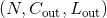的一维卷积层，其卷积计算过程可以如下表述：


这里的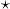符号实际上是一个互相关([cross-correlation](https://en.wikipedia.org/wiki/Cross-correlation)） 操作符(大家可以自己查一下互相关和真卷积的区别，互相关因为实现起来很简单，所以一般的深度学习框架都是用互相关操作取代真卷积）,  is a batch size, 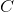 代表通道的数量,  代表信号序列的长度。

*   `stride` 参数控制了互相关操作(伪卷积）的步长，参数的数据类型一般是单个数字或者一个只有一个元素的元组。

*   `padding` 参数控制了要在一维卷积核的输入信号的各维度各边上要补齐0的层数。

*   `dilation` 参数控制了卷积核中各元素之间的距离；这也被称为多孔算法(à trous algorithm)。这个概念有点难解释，这个链接[link](https://github.com/vdumoulin/conv_arithmetic/blob/master/README.md)用可视化的方法很好地解释了`dilation`的作用。

*   `groups` 控制了输入输出之间的连接(connections）的数量。`in_channels` 和 `out_channels` 必须能被 `groups` 整除。举个栗子， 

    &gt; *   当 groups=1, 此Conv1d层会使用一个卷积层进行所有输入到输出的卷积操作。
    
    &gt; *   当 groups=2, 此时Conv1d层会产生两个并列的卷积层。同时，输入通道被分为两半，两个卷积层分别处理一半的输入通道，同时各自产生一半的输出通道。最后这两个卷积层的输出会被concatenated一起，作为此Conv1d层的输出。
    
    &gt; *   当 groups= `in_channels`, 每个输入通道都会被单独的一组卷积层处理，这个组的大小是

Note

取决于你卷积核的大小，有些时候输入数据中某些列(最后几列）可能不会参与计算(比如列数整除卷积核大小有余数，而又没有padding，那最后的余数列一般不会参与卷积计算），这主要是因为pytorch中的互相关操作[cross-correlation](https://en.wikipedia.org/wiki/Cross-correlation)是保证计算正确的操作(valid operation)， 而不是满操作(full operation)。所以实际操作中，还是要亲尽量选择好合适的padding参数哦。

Note

当`groups == in_channels` 并且 `out_channels == K * in_channels`(其中K是正整数）的时候，这个操作也被称为深度卷积。
举个创建深度卷积层的例子，对于一个大小为  的输入，要构建一个深度乘数为`K`的深度卷积层，可以通过以下参数来创建：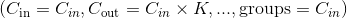。

Note

当程序的运行环境是使用了CuDNN的CUDA环境的时候，一些非确定性的算法(nondeterministic algorithm）可能会被采用以提高整个计算的性能。如果不想使用这些非确定性的算法，你可以通过设置`torch.backends.cudnn.deterministic = True`来让整个计算过程保持确定性(可能会损失一定的计算性能）。对于后端(background)，你可以看一下这一部分[Reproducibility](notes/randomness.html)了解其相关信息。

Conv1d的参数: 

*   **in_channels** ([_int_](https://docs.python.org/3/library/functions.html#int "(in Python v3.7)")) – 输入通道个数
*   **out_channels** ([_int_](https://docs.python.org/3/library/functions.html#int "(in Python v3.7)")) – 输出通道个数
*   **kernel_size** ([_int_](https://docs.python.org/3/library/functions.html#int "(in Python v3.7)") _or_ [_tuple_](https://docs.python.org/3/library/stdtypes.html#tuple "(in Python v3.7)")) – 卷积核大小
*   **stride** ([_int_](https://docs.python.org/3/library/functions.html#int "(in Python v3.7)") _or_ [_tuple_](https://docs.python.org/3/library/stdtypes.html#tuple "(in Python v3.7)")_,_ _optional_) – 卷积操作的步长。 默认： 1
*   **padding** ([_int_](https://docs.python.org/3/library/functions.html#int "(in Python v3.7)") _or_ [_tuple_](https://docs.python.org/3/library/stdtypes.html#tuple "(in Python v3.7)")_,_ _optional_) – 输入数据各维度各边上要补齐0的层数。 默认： 0
*   **dilation** ([_int_](https://docs.python.org/3/library/functions.html#int "(in Python v3.7)") _or_ [_tuple_](https://docs.python.org/3/library/stdtypes.html#tuple "(in Python v3.7)")_,_ _optional_) – 卷积核各元素之间的距离。 默认： 1
*   **groups** ([_int_](https://docs.python.org/3/library/functions.html#int "(in Python v3.7)")_,_ _optional_) – 输入通道与输出通道之间相互隔离的连接的个数。 默认：1
*   **bias** ([_bool_](https://docs.python.org/3/library/functions.html#bool "(in Python v3.7)")_,_ _optional_) – 如果被置为 `True`，向输出增加一个偏差量，此偏差是可学习参数。 默认：`True`


```py
Shape:
```

*   输入: 

*   输出: 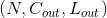 其中

    

| 内部Variables： | 

*   **weight** ([_Tensor_](tensors.html#torch.Tensor "torch.Tensor")) – Conv1d模块中的一个大小为(out_channels, in_channels, kernel_size)的权重张量，这些权重可训练学习(learnable)。这些权重的初始值的采样空间是， 其中。
*   **bias** ([_Tensor_](tensors.html#torch.Tensor "torch.Tensor")) – 模块的偏差项，大小为(out_channels)，可训练学习。如果构造Conv1d时构造函数中的`bias` 被置为 `True`，那么这些权重的初始值的采样空间是， 其中 。

例子:

```py
>>> m = nn.Conv1d(16, 33, 3, stride=2)
>>> input = torch.randn(20, 16, 50)
>>> output = m(input)

```

### Conv2d

```py
class torch.nn.Conv2d(in_channels, out_channels, kernel_size, stride=1, padding=0, dilation=1, groups=1, bias=True)
```
利用指定大小的二维卷积核对输入的多通道二维输入信号进行二维卷积操作的卷积层。

在最简单的情况下，对于输入大小为，输出大小为的二维维卷积层，其卷积计算过程可以如下表述：


这里的符号实际上是一个二维互相关([cross-correlation](https://en.wikipedia.org/wiki/Cross-correlation)） 操作符(大家可以自己查一下互相关和真卷积的区别，互相关因为实现起来很简单，所以一般的深度学习框架都是用互相关操作取代真卷积）,  is a batch size,  代表通道的数量, 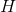 是输入的二维数据的像素高度，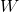 是输入的二维数据的像素宽度。


*   `stride` 参数控制了互相关操作(伪卷积）的步长，参数的数据类型一般是单个数字或者一个只有一个元素的元组。

*   `padding` 参数控制了要在二维卷积核的输入信号的各维度各边上要补齐0的层数。

*   `dilation` 参数控制了卷积核中各元素之间的距离；这也被称为多孔算法(à trous algorithm)。这个概念有点难解释，这个链接[link](https://github.com/vdumoulin/conv_arithmetic/blob/master/README.md)用可视化的方法很好地解释了`dilation`的作用。

*   `groups` 控制了输入输出之间的连接(connections）的数量。`in_channels` 和 `out_channels` 必须能被 `groups` 整除。举个栗子， 

    &gt; *   当 groups=1, 此Conv1d层会使用一个卷积层进行所有输入到输出的卷积操作。
    
    &gt; *   当 groups=2, 此时Conv1d层会产生两个并列的卷积层。同时，输入通道被分为两半，两个卷积层分别处理一半的输入通道，同时各自产生一半的输出通道。最后这两个卷积层的输出会被concatenated一起，作为此Conv1d层的输出。
    
    &gt; *   当 groups= `in_channels`, 每个输入通道都会被单独的一组卷积层处理，这个组的大小是


`kernel_size`, `stride`, `padding`, `dilation`这几个参数均支持一下输入形式：

> *   一个 `int` 数字 – 二维数据的高和宽这两个维度都会采用这一个数字。
> *   一个由两个int数字组成的`tuple`– 这种情况下，二维数据的高这一维度会采用元组中的第一个`int`数字，宽这一维度会采用第二个`int`数字。

Note

取决于你卷积核的大小，有些时候输入数据中某些列(最后几列）可能不会参与计算(比如列数整除卷积核大小有余数，而又没有padding，那最后的余数列一般不会参与卷积计算），这主要是因为pytorch中的互相关操作[cross-correlation](https://en.wikipedia.org/wiki/Cross-correlation)是保证计算正确的操作(valid operation)， 而不是满操作(full operation)。所以实际操作中，还是要亲尽量选择好合适的padding参数哦。

Note
当`groups == in_channels` 并且 `out_channels == K * in_channels`(其中K是正整数）的时候，这个操作也被称为深度卷积。

换句话说，对于一个大小为的输入，要构建一个深度乘数为`K`的深度卷积层，可以通过以下参数来创建：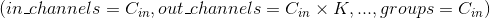。

Note

当程序的运行环境是使用了CuDNN的CUDA环境的时候，一些非确定性的算法(nondeterministic algorithm）可能会被采用以提高整个计算的性能。如果不想使用这些非确定性的算法，你可以通过设置`torch.backends.cudnn.deterministic = True`来让整个计算过程保持确定性(可能会损失一定的计算性能）。对于后端(background)，你可以看一下这一部分[Reproducibility](notes/randomness.html)了解其相关信息。

Conv2d的参数: 

*   **in_channels** ([_int_](https://docs.python.org/3/library/functions.html#int "(in Python v3.7)")) – 输入通道个数
*   **out_channels** ([_int_](https://docs.python.org/3/library/functions.html#int "(in Python v3.7)")) – 输出通道个数
*   **kernel_size** ([_int_](https://docs.python.org/3/library/functions.html#int "(in Python v3.7)") _or_ [_tuple_](https://docs.python.org/3/library/stdtypes.html#tuple "(in Python v3.7)")) – 卷积核大小
*   **stride** ([_int_](https://docs.python.org/3/library/functions.html#int "(in Python v3.7)") _or_ [_tuple_](https://docs.python.org/3/library/stdtypes.html#tuple "(in Python v3.7)")_,_ _optional_) –卷积操作的步长。 默认： 1
*   **padding** ([_int_](https://docs.python.org/3/library/functions.html#int "(in Python v3.7)") _or_ [_tuple_](https://docs.python.org/3/library/stdtypes.html#tuple "(in Python v3.7)")_,_ _optional_) – 输入数据各维度各边上要补齐0的层数。 默认： 0
*   **dilation** ([_int_](https://docs.python.org/3/library/functions.html#int "(in Python v3.7)") _or_ [_tuple_](https://docs.python.org/3/library/stdtypes.html#tuple "(in Python v3.7)")_,_ _optional_) –卷积核各元素之间的距离。 默认： 1
*   **groups** ([_int_](https://docs.python.org/3/library/functions.html#int "(in Python v3.7)")_,_ _optional_) – 输入通道与输出通道之间相互隔离的连接的个数。 默认：1
*   **bias** ([_bool_](https://docs.python.org/3/library/functions.html#bool "(in Python v3.7)")_,_ _optional_) – 如果被置为 `True`，向输出增加一个偏差量，此偏差是可学习参数。 默认：`True`

```py
Shape:
```

*   输入: 

*   输出: 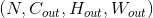 其中

    

    

| 内部Variables: | 

*   **weight** ([_Tensor_](tensors.html#torch.Tensor "torch.Tensor")) – Conv2d模块中的一个大小为 (out_channels, in_channels, kernel_size[0], kernel_size[1])的权重张量，这些权重可训练学习(learnable)。这些权重的初始值的采样空间是 ， 其中。
*   **bias** ([_Tensor_](tensors.html#torch.Tensor "torch.Tensor")) – 块的偏差项，大小为(out_channels)，可训练学习。如果构造Conv2d时构造函数中的`bias` 被置为 `True`，那么这些权重的初始值的采样空间是，其中。


例子:

```py
>>> # With square kernels and equal stride
>>> m = nn.Conv2d(16, 33, 3, stride=2)
>>> # non-square kernels and unequal stride and with padding
>>> m = nn.Conv2d(16, 33, (3, 5), stride=(2, 1), padding=(4, 2))
>>> # non-square kernels and unequal stride and with padding and dilation
>>> m = nn.Conv2d(16, 33, (3, 5), stride=(2, 1), padding=(4, 2), dilation=(3, 1))
>>> input = torch.randn(20, 16, 50, 100)
>>> output = m(input)

```

### Conv3d

```py
class torch.nn.Conv3d(in_channels, out_channels, kernel_size, stride=1, padding=0, dilation=1, groups=1, bias=True)
```

利用指定大小的三维卷积核对输入的多通道三维输入信号进行三维卷积操作的卷积层。

最简单的情况下，对于输入大小为，输出大小为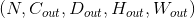 的三维卷积层，其卷积计算过程可以如下表述：

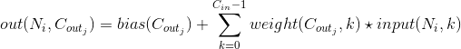

这里的 符号实际上是一个三维互相关 [cross-correlation](https://en.wikipedia.org/wiki/Cross-correlation) 操作符。

*   `stride` 数控制了互相关操作(伪卷积）的步长。

*   `padding` 参数控制了要在三维卷积核的输入信号的各维度各边上要补齐0的层数。

*   `dilation` 参数控制了卷积核中各元素之间的距离；这也被称为多孔算法(à trous algorithm)。这个概念有点难解释，这个链接[link](https://github.com/vdumoulin/conv_arithmetic/blob/master/README.md)用可视化的方法很好地解释了`dilation`的作用。

*   `groups` 控制了输入输出之间的连接(connections）的数量。`in_channels` 和 `out_channels` 必须能被 `groups` 整除。举个栗子，

   &gt; *   当 groups=1, 此Conv3d层会使用一个卷积层进行对所有输入到输出的卷积操作。
   
   &gt; *   当 groups=2, 此时Conv3d层会产生两个并列的卷积层。同时，输入通道被分为两半，两个卷积层分别处理一半的输入通道，同时各自产生一半的输出通道。最后这两个卷积层的输出会被concatenated一起，作为此Conv3d层的输出。
   
   &gt; *   当 groups= in_channels, 每个输入通道都会被单独的一组卷积层处理，这个组的大小是 .

`kernel_size`, `stride`, `padding`, `dilation`这几个参数均支持一下输入形式：

> *   一个 `int` 数字 – 三维维数据的深度，高和宽这三个维度都会采用这一个数字。
> *   一个由三个int数字组成的`tuple`– 这种情况下，三维数据的深度这一维度会采用元组中的第一个`int`数字，高这一维度会采用元组中的第二个`int`数字，宽这一维度会采用第三个`int`数字。


Note

取决于你卷积核的大小，有些时候输入数据中某些列(最后几列）可能不会参与计算(比如列数整除卷积核大小有余数，而又没有padding，那最后的余数列一般不会参与卷积计算），这主要是因为pytorch中的互相关操作[cross-correlation](https://en.wikipedia.org/wiki/Cross-correlation)是保证计算正确的操作(valid operation)， 而不是满操作(full operation)。所以实际操作中，还是要亲尽量选择好合适的padding参数哦。

Note

当`groups == in_channels` 并且 `out_channels == K * in_channels`(其中K是正整数）的时候，这个操作也被称为深度卷积。

换句话说，对于一个大小为   的输入，要构建一个深度乘数为`K`的深度卷积层，可以通过以下参数来创建：。

Note

当程序的运行环境是使用了CuDNN的CUDA环境的时候，一些非确定性的算法(nondeterministic algorithm）可能会被采用以提高整个计算的性能。如果不想使用这些非确定性的算法，你可以通过设置`torch.backends.cudnn.deterministic = True`来让整个计算过程保持确定性(可能会损失一定的计算性能）。对于后端(background)，你可以看一下这一部分[Reproducibility](notes/randomness.html)了解其相关信息。

Parameters: 

*   **in_channels** ([_int_](https://docs.python.org/3/library/functions.html#int "(in Python v3.7)")) – 输入通道的个数
*   **out_channels** ([_int_](https://docs.python.org/3/library/functions.html#int "(in Python v3.7)")) – 卷积操作输出通道的个数
*   **kernel_size** ([_int_](https://docs.python.org/3/library/functions.html#int "(in Python v3.7)") _or_ [_tuple_](https://docs.python.org/3/library/stdtypes.html#tuple "(in Python v3.7)")) – 卷积核大小
*   **stride** ([_int_](https://docs.python.org/3/library/functions.html#int "(in Python v3.7)") _or_ [_tuple_](https://docs.python.org/3/library/stdtypes.html#tuple "(in Python v3.7)")_,_ _optional_) – 卷积操作的步长。 默认： 1
*   **padding** ([_int_](https://docs.python.org/3/library/functions.html#int "(in Python v3.7)") _or_ [_tuple_](https://docs.python.org/3/library/stdtypes.html#tuple "(in Python v3.7)")_,_ _optional_) – 输入数据各维度各边上要补齐0的层数。 默认： 0
*   **dilation** ([_int_](https://docs.python.org/3/library/functions.html#int "(in Python v3.7)") _or_ [_tuple_](https://docs.python.org/3/library/stdtypes.html#tuple "(in Python v3.7)")_,_ _optional_) – 卷积核各元素之间的距离。 默认： 1
*   **groups** ([_int_](https://docs.python.org/3/library/functions.html#int "(in Python v3.7)")_,_ _optional_) – 输入通道与输出通道之间相互隔离的连接的个数。 默认：1
*   **bias** ([_bool_](https://docs.python.org/3/library/functions.html#bool "(in Python v3.7)")_,_ _optional_) – 如果被置为 `True`，向输出增加一个偏差量，此偏差是可学习参数。 默认：`True`


```py
Shape:
```

*   输入: 

*   输出:  where

    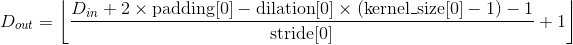

    

    

| 内部Variables: | 

*   **weight** ([_Tensor_](tensors.html#torch.Tensor "torch.Tensor")) – Conv3d模块中的一个大小为 (out_channels, in_channels, kernel_size[0], kernel_size[1], kernel_size[2]) 的权重张量，这些权重可训练学习(learnable)。这些权重的初始值的采样空间是，其中。
*   **bias** ([_Tensor_](tensors.html#torch.Tensor "torch.Tensor")) – 模块的偏差项，大小为(out_channels)，可训练学习。如果构造Conv1d时构造函数中的`bias` 被置为 `True`，那么这些权重的初始值的采样空间是  ，其中 。


例子:

```py
>>> # With square kernels and equal stride
>>> m = nn.Conv3d(16, 33, 3, stride=2)
>>> # non-square kernels and unequal stride and with padding
>>> m = nn.Conv3d(16, 33, (3, 5, 2), stride=(2, 1, 1), padding=(4, 2, 0))
>>> input = torch.randn(20, 16, 10, 50, 100)
>>> output = m(input)

```

### ConvTranspose1d

```py
class torch.nn.ConvTranspose1d(in_channels, out_channels, kernel_size, stride=1, padding=0, output_padding=0, groups=1, bias=True, dilation=1)
```

利用指定大小的一维转置卷积核对输入的多通道一维输入信号进行转置卷积(当然此卷积也是互相关操作，cross-correlation）操作的模块。

该模块可以看作是Conv1d相对于其输入的梯度(the gradient of Conv1d with respect to its input， 直译)， 转置卷积又被称为小数步长卷积或是反卷积(尽管这不是一个真正意义上的反卷积）。

*   `stride` 控制了转置卷积操作的步长

*   `padding` 控制了要在输入的各维度的各边上补齐0的层数，与Conv1d不同的地方，此padding参数与实际补齐0的层数的关系为`层数 = kernel_size - 1 - padding`，详情请见下面的note。

  *   `output_padding` 控制了转置卷积操作输出的各维度的长度增量，但注意这个参数不是说要往转置卷积的输出上pad 0，而是直接控制转置卷积的输出大小为根据此参数pad后的大小。更多的详情请见下面的note。

*   `dilation` 控制了卷积核中各点之间的空间距离；这也被称为多孔算法(à trous algorithm)。这个概念有点难解释，这个链接[link](https://github.com/vdumoulin/conv_arithmetic/blob/master/README.md)用可视化的方法很好地解释了dilation的作用。

*   `groups` 控制了输入输出之间的连接(connections）的数量。`in_channels` 和 `out_channels` 必须能被 `groups` 整除。举个栗子，

    &gt; *   当 groups=1, 此Conv1d层会使用一个卷积层进行所有输入到输出的卷积操作。
    
    &gt; *   当 groups=2, 此时Conv1d层会产生两个并列的卷积层。同时，输入通道被分为两半，两个卷积层分别处理一半的输入通道，同时各自产生一半的输出通道。最后这两个卷积层的输出会被concatenated一起，作为此Conv1d层的输出。
    
    &gt; *   当 groups= `in_channels`, 每个输入通道都会被单独的一组卷积层处理，这个组的大小是。

Note

取决于你卷积核的大小，有些时候输入数据中某些列(最后几列）可能不会参与计算(比如列数整除卷积核大小有余数，而又没有padding，那最后的余数列一般不会参与卷积计算），这主要是因为pytorch中的互相关操作[cross-correlation](https://en.wikipedia.org/wiki/Cross-correlation)是保证计算正确的操作(valid operation)， 而不是满操作(full operation)。所以实际操作中，还是要亲尽量选择好合适的padding参数哦。

Note

`padding` 参数控制了要在输入的各维度各边上补齐0的层数，与在Conv1d中不同的是，在转置卷积操作过程中，此padding参数与实际补齐0的层数的关系为`层数 = kernel_size - 1 - padding`， 这样设置的主要原因是当使用相同的参数构建[`Conv1d`](#torch.nn.Conv1d "torch.nn.Conv1d") 和[`ConvTranspose1d`](#torch.nn.ConvTranspose1d "torch.nn.ConvTranspose1d")模块的时候，这种设置能够实现两个模块有正好相反的输入输出的大小，即Conv1d的输出大小是其对应的ConvTranspose1d模块的输入大小，而ConvTranspose1d的输出大小又恰好是其对应的Conv1d模块的输入大小。然而，当`stride > 1`的时候，[`Conv1d`](#torch.nn.Conv1d "torch.nn.Conv1d") 的一个输出大小可能会对应多个输入大小，上一个note中就详细的介绍了这种情况，这样的情况下要保持前面提到两种模块的输入输出保持反向一致，那就要用到 `output_padding`参数了，这个参数可以增加转置卷积输出的某一维度的大小，以此来达到前面提到的同参数构建的[`Conv1d`](#torch.nn.Conv1d "torch.nn.Conv1d") 和[`ConvTranspose1d`](#torch.nn.ConvTranspose1d "torch.nn.ConvTranspose1d")模块的输入输出方向一致。 但注意这个参数不是说要往转置卷积的输出上pad 0，而是直接控制转置卷积的输出各维度的大小为根据此参数pad后的大小。

Note

当程序的运行环境是使用了CuDNN的CUDA环境的时候，一些非确定性的算法(nondeterministic algorithm）可能会被采用以提高整个计算的性能。如果不想使用这些非确定性的算法，你可以通过设置`torch.backends.cudnn.deterministic = True`来让整个计算过程保持确定性(可能会损失一定的计算性能）。对于后端(background)，你可以看一下这一部分[Reproducibility](notes/randomness.html)了解其相关信息。

Parameters: 


*   **in_channels** ([_int_](https://docs.python.org/3/library/functions.html#int "(in Python v3.7)")) – 输入通道的个数
*   **out_channels** ([_int_](https://docs.python.org/3/library/functions.html#int "(in Python v3.7)")) – 卷积操作输出通道的个数
*   **kernel_size** ([_int_](https://docs.python.org/3/library/functions.html#int "(in Python v3.7)") _or_ [_tuple_](https://docs.python.org/3/library/stdtypes.html#tuple "(in Python v3.7)")) – 卷积核大小
*   **stride** ([_int_](https://docs.python.org/3/library/functions.html#int "(in Python v3.7)") _or_ [_tuple_](https://docs.python.org/3/library/stdtypes.html#tuple "(in Python v3.7)")_,_ _optional_) – 卷积操作的步长。 默认： 1
*   **padding** ([_int_](https://docs.python.org/3/library/functions.html#int "(in Python v3.7)") _or_ [_tuple_](https://docs.python.org/3/library/stdtypes.html#tuple "(in Python v3.7)")_,_ _optional_) – `kernel_size - 1 - padding` 层 0 会被补齐到输入数据的各边上。 默认： 0
*   **output_padding** ([_int_](https://docs.python.org/3/library/functions.html#int "(in Python v3.7)") _or_ [_tuple_](https://docs.python.org/3/library/stdtypes.html#tuple "(in Python v3.7)")_,_ _optional_) – 输出的各维度要增加的大小。默认：0 
*   **groups** ([_int_](https://docs.python.org/3/library/functions.html#int "(in Python v3.7)")_,_ _optional_) – 输入通道与输出通道之间相互隔离的连接的个数。 默认：1
*   **bias** ([_bool_](https://docs.python.org/3/library/functions.html#bool "(in Python v3.7)")_,_ _optional_) – 如果被置为 `True`，向输出增加一个偏差量，此偏差是可学习参数。 默认：`True`
*   **dilation** ([_int_](https://docs.python.org/3/library/functions.html#int "(in Python v3.7)") _or_ [_tuple_](https://docs.python.org/3/library/stdtypes.html#tuple "(in Python v3.7)")_,_ _optional_) – 卷积核各元素之间的距离。 默认： 1


```py
Shape:
```

*   输入: 

*   输出:  其中，

    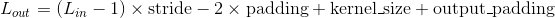

| Variables: | 

*   **weight** ([_Tensor_](tensors.html#torch.Tensor "torch.Tensor")) –  模块中的一个大小为 (in_channels, out_channels, kernel_size[0])的权重张量，这些权重可训练学习(learnable)。这些权重的初始值的采样空间是，其中 。
*   **bias** ([_Tensor_](tensors.html#torch.Tensor "torch.Tensor")) – 模块的偏差项，大小为 (out_channels)， 如果构造函数中的 `bias` 被置为 `True`，那么这些权重的初始值的采样空间是  ，其中 。


### ConvTranspose2d

```py
class torch.nn.ConvTranspose2d(in_channels, out_channels, kernel_size, stride=1, padding=0, output_padding=0, groups=1, bias=True, dilation=1)
```

利用指定大小的二维转置卷积核对输入的多通道二维输入信号进行转置卷积(当然此卷积也是互相关操作，cross-correlation）操作的模块。

该模块可以看作是Conv2d相对于其输入的梯度(the gradient of Conv2d with respect to its input， 直译)， 转置卷积又被称为小数步长卷积或是反卷积(尽管这不是一个真正意义上的反卷积）。

*   `stride` 控制了转置卷积操作的步长 

*   `padding` 控制了要在输入的各维度的各边上补齐0的层数，与Conv1d不同的地方，此padding参数与实际补齐0的层数的关系为`层数 = kernel_size - 1 - padding`，详情请见下面的note。

  *   `output_padding` 控制了转置卷积操作输出的各维度的长度增量，但注意这个参数不是说要往转置卷积的输出上pad 0，而是直接控制转置卷积的输出大小为根据此参数pad后的大小。更多的详情请见下面的note。

*   `dilation` 控制了卷积核中各点之间的空间距离；这也被称为多孔算法(à trous algorithm)。这个概念有点难解释，这个链接[link](https://github.com/vdumoulin/conv_arithmetic/blob/master/README.md)用可视化的方法很好地解释了dilation的作用。

*   `groups` 控制了输入输出之间的连接(connections）的数量。`in_channels` 和 `out_channels` 必须能被 `groups` 整除。举个栗子，

    &gt; *   当 groups=1, 此Conv1d层会使用一个卷积层进行所有输入到输出的卷积操作。
    
    &gt; *   当 groups=2, 此时Conv1d层会产生两个并列的卷积层。同时，输入通道被分为两半，两个卷积层分别处理一半的输入通道，同时各自产生一半的输出通道。最后这两个卷积层的输出会被concatenated一起，作为此Conv1d层的输出。
    
    &gt; *   当 groups= `in_channels`, 每个输入通道都会被单独的一组卷积层处理，这个组的大小是。
    
`kernel_size`, `stride`, `padding`, `output_padding` 这几个参数均支持一下输入形式：

> *   一个 `int` 数字 – 二维维数据的高和宽这两个维度都会采用这一个数字。
> *   一个由两个int数字组成的`tuple`– 这种情况下，二维数据的高这一维度会采用元组中的第一个`int`数字，宽这一维度会采用第二个`int`数字。

Note

取决于你卷积核的大小，有些时候输入数据中某些列(最后几列）可能不会参与计算(比如列数整除卷积核大小有余数，而又没有padding，那最后的余数列一般不会参与卷积计算），这主要是因为pytorch中的互相关操作[cross-correlation](https://en.wikipedia.org/wiki/Cross-correlation)是保证计算正确的操作(valid operation)， 而不是满操作(full operation)。所以实际操作中，还是要亲尽量选择好合适的padding参数哦。


Note

`padding` 参数控制了要在输入的各维度各边上补齐0的层数，与在Conv1d中不同的是，在转置卷积操作过程中，此padding参数与实际补齐0的层数的关系为`层数 = kernel_size - 1 - padding`， 这样设置的主要原因是当使用相同的参数构建[`Conv2d`](#torch.nn.Conv2d "torch.nn.Conv2d") 和[`ConvTranspose2d`](#torch.nn.ConvTranspose2d "torch.nn.ConvTranspose2d")模块的时候，这种设置能够实现两个模块有正好相反的输入输出的大小，即Conv2d的输出大小是其对应的ConvTranspose2d模块的输入大小，而ConvTranspose2d的输出大小又恰好是其对应的Conv2d模块的输入大小。然而，当`stride > 1`的时候，[`Conv2d`](#torch.nn.Conv2d "torch.nn.Conv2d") 的一个输出大小可能会对应多个输入大小，上一个note中就详细的介绍了这种情况，这样的情况下要保持前面提到两种模块的输入输出保持反向一致，那就要用到 `output_padding`参数了，这个参数可以增加转置卷积输出的某一维度的大小，以此来达到前面提到的同参数构建的[`Conv2d`](#torch.nn.Conv2d "torch.nn.Conv2d") 和[`ConvTranspose2d`](#torch.nn.ConvTranspose2d "torch.nn.ConvTranspose2d")模块的输入输出方向一致。 但注意这个参数不是说要往转置卷积的输出上pad 0，而是直接控制转置卷积的输出各维度的大小为根据此参数pad后的大小。

Note

当程序的运行环境是使用了CuDNN的CUDA环境的时候，一些非确定性的算法(nondeterministic algorithm）可能会被采用以提高整个计算的性能。如果不想使用这些非确定性的算法，你可以通过设置`torch.backends.cudnn.deterministic = True`来让整个计算过程保持确定性(可能会损失一定的计算性能）。对于后端(background)，你可以看一下这一部分[Reproducibility](notes/randomness.html)了解其相关信息。

Parameters:

*   **in_channels** ([_int_](https://docs.python.org/3/library/functions.html#int "(in Python v3.7)")) – 输入通道的个数
*   **out_channels** ([_int_](https://docs.python.org/3/library/functions.html#int "(in Python v3.7)")) – 卷积操作输出通道的个数
*   **kernel_size** ([_int_](https://docs.python.org/3/library/functions.html#int "(in Python v3.7)") _or_ [_tuple_](https://docs.python.org/3/library/stdtypes.html#tuple "(in Python v3.7)")) – 卷积核大小
*   **stride** ([_int_](https://docs.python.org/3/library/functions.html#int "(in Python v3.7)") _or_ [_tuple_](https://docs.python.org/3/library/stdtypes.html#tuple "(in Python v3.7)")_,_ _optional_) – 卷积操作的步长。 默认： 1
*   **padding** ([_int_](https://docs.python.org/3/library/functions.html#int "(in Python v3.7)") _or_ [_tuple_](https://docs.python.org/3/library/stdtypes.html#tuple "(in Python v3.7)")_,_ _optional_) – `kernel_size - 1 - padding` 层 0 会被补齐到输入数据的各边上。 默认： 0
*   **output_padding** ([_int_](https://docs.python.org/3/library/functions.html#int "(in Python v3.7)") _or_ [_tuple_](https://docs.python.org/3/library/stdtypes.html#tuple "(in Python v3.7)")_,_ _optional_) – 输出的各维度要增加的大小。默认：0 
*   **groups** ([_int_](https://docs.python.org/3/library/functions.html#int "(in Python v3.7)")_,_ _optional_) – 输入通道与输出通道之间相互隔离的连接的个数。 默认：1
*   **bias** ([_bool_](https://docs.python.org/3/library/functions.html#bool "(in Python v3.7)")_,_ _optional_) – 如果被置为 `True`，向输出增加一个偏差量，此偏差是可学习参数。 默认：`True`
*   **dilation** ([_int_](https://docs.python.org/3/library/functions.html#int "(in Python v3.7)") _or_ [_tuple_](https://docs.python.org/3/library/stdtypes.html#tuple "(in Python v3.7)")_,_ _optional_) – 卷积核各元素之间的距离。 默认： 1


```py
Shape:
```

*   输入: 
*   输出:  其中

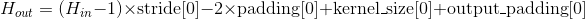


| Variables: | 

*   **weight** ([_Tensor_](tensors.html#torch.Tensor "torch.Tensor")) –  模块中的一个大小为 (in_channels, out_channels, kernel_size[0], kernel_size[1])的权重张量，这些权重可训练学习(learnable)。这些权重的初始值的采样空间是，其中 。
*   **bias** ([_Tensor_](tensors.html#torch.Tensor "torch.Tensor")) – 模块的偏差项，大小为 (out_channels)， 如果构造函数中的 `bias` 被置为 `True`，那么这些权重的初始值的采样空间是  ，其中 。


例子:

```py
>>> # With square kernels and equal stride
>>> m = nn.ConvTranspose2d(16, 33, 3, stride=2)
>>> # non-square kernels and unequal stride and with padding
>>> m = nn.ConvTranspose2d(16, 33, (3, 5), stride=(2, 1), padding=(4, 2))
>>> input = torch.randn(20, 16, 50, 100)
>>> output = m(input)
>>> # exact output size can be also specified as an argument
>>> input = torch.randn(1, 16, 12, 12)
>>> downsample = nn.Conv2d(16, 16, 3, stride=2, padding=1)
>>> upsample = nn.ConvTranspose2d(16, 16, 3, stride=2, padding=1)
>>> h = downsample(input)
>>> h.size()
torch.Size([1, 16, 6, 6])
>>> output = upsample(h, output_size=input.size())
>>> output.size()
torch.Size([1, 16, 12, 12])

```

### ConvTranspose3d

```py
class torch.nn.ConvTranspose3d(in_channels, out_channels, kernel_size, stride=1, padding=0, output_padding=0, groups=1, bias=True, dilation=1)
```

利用指定大小的三维转置卷积核对输入的多通道三维输入信号进行转置卷积(当然此卷积也是互相关操作，cross-correlation）操作的模块。转置卷积的操作本质是将各通道输入与卷积核做乘法，然后返回各通道与此卷积核乘积结果之和(卷积的定义）。

该模块可以看作是Conv3d相对于其输入的梯度(the gradient of Conv3d with respect to its input， 直译)， 转置卷积又被称为小数步长卷积或是反卷积(尽管这不是一个真正意义上的反卷积）。

*   `stride` 控制了转置卷积操作的步长 

*   `padding` 控制了要在输入的各维度的各边上补齐0的层数，与Conv1d不同的地方，此padding参数与实际补齐0的层数的关系为`层数 = kernel_size - 1 - padding`，详情请见下面的note。

  *   `output_padding` 控制了转置卷积操作输出的各维度的长度增量，但注意这个参数不是说要往转置卷积的输出上pad 0，而是直接控制转置卷积的输出大小为根据此参数pad后的大小。更多的详情请见下面的note。

*   `dilation` 控制了卷积核中各点之间的空间距离；这也被称为多孔算法(à trous algorithm)。这个概念有点难解释，这个链接[link](https://github.com/vdumoulin/conv_arithmetic/blob/master/README.md)用可视化的方法很好地解释了dilation的作用。

*   `groups` 控制了输入输出之间的连接(connections）的数量。`in_channels` 和 `out_channels` 必须能被 `groups` 整除。举个栗子，

    &gt; *   当 groups=1, 此Conv1d层会使用一个卷积层进行所有输入到输出的卷积操作。
    
    &gt; *   当 groups=2, 此时Conv1d层会产生两个并列的卷积层。同时，输入通道被分为两半，两个卷积层分别处理一半的输入通道，同时各自产生一半的输出通道。最后这两个卷积层的输出会被concatenated一起，作为此Conv1d层的输出。
    
    &gt; *   当 groups= `in_channels`, 每个输入通道都会被单独的一组卷积层处理，这个组的大小是。
    
`kernel_size`, `stride`, `padding`, `output_padding` 这几个参数均支持一下输入形式：

> *   一个 `int` 数字 – 三维维数据的深度，高和宽这两个维度都会采用这一个数字。
> *   一个由三个int数字组成的`tuple`– 这种情况下，三维数据的深度这一维度会采用元组中的第一个`int`数字，高这一维度会采用元组中的第二个`int`数字，宽这一维度会采用第三个`int`数字。

Note

取决于你卷积核的大小，有些时候输入数据中某些列(最后几列）可能不会参与计算(比如列数整除卷积核大小有余数，而又没有padding，那最后的余数列一般不会参与卷积计算），这主要是因为pytorch中的互相关操作[cross-correlation](https://en.wikipedia.org/wiki/Cross-correlation)是保证计算正确的操作(valid operation)， 而不是满操作(full operation)。所以实际操作中，还是要亲尽量选择好合适的padding参数哦。


Note

`padding` 参数控制了要在输入的各维度各边上补齐0的层数，与在Conv3d中不同的是，在转置卷积操作过程中，此padding参数与实际补齐0的层数的关系为`层数 = kernel_size - 1 - padding`， 这样设置的主要原因是当使用相同的参数构建[`Conv3d`](#torch.nn.Conv3d "torch.nn.Conv3d") 和[`ConvTranspose3d`](#torch.nn.ConvTranspose3d "torch.nn.ConvTranspose3d")模块的时候，这种设置能够实现两个模块有正好相反的输入输出的大小，即Conv3d的输出大小是其对应的ConvTranspose3d模块的输入大小，而ConvTranspose3d的输出大小又恰好是其对应的Conv3d模块的输入大小。然而，当`stride > 1`的时候，[`Conv3d`](#torch.nn.Conv3d "torch.nn.Conv3d") 的一个输出大小可能会对应多个输入大小，上一个note中就详细的介绍了这种情况，这样的情况下要保持前面提到两种模块的输入输出保持反向一致，那就要用到 `output_padding`参数了，这个参数可以增加转置卷积输出的某一维度的大小，以此来达到前面提到的同参数构建的[`Conv3d`](#torch.nn.Conv3d "torch.nn.Conv3d") 和[`ConvTranspose3d`](#torch.nn.ConvTranspose3d "torch.nn.ConvTranspose3d")模块的输入输出方向一致。 但注意这个参数不是说要往转置卷积的输出上pad 0，而是直接控制转置卷积的输出各维度的大小为根据此参数pad后的大小。

Note

当程序的运行环境是使用了CuDNN的CUDA环境的时候，一些非确定性的算法(nondeterministic algorithm）可能会被采用以提高整个计算的性能。如果不想使用这些非确定性的算法，你可以通过设置`torch.backends.cudnn.deterministic = True`来让整个计算过程保持确定性(可能会损失一定的计算性能）。对于后端(background)，你可以看一下这一部分[Reproducibility](notes/randomness.html)了解其相关信息。

Parameters:

*   **in_channels** ([_int_](https://docs.python.org/3/library/functions.html#int "(in Python v3.7)")) – 输入通道的个数
*   **out_channels** ([_int_](https://docs.python.org/3/library/functions.html#int "(in Python v3.7)")) – 卷积操作输出通道的个数
*   **kernel_size** ([_int_](https://docs.python.org/3/library/functions.html#int "(in Python v3.7)") _or_ [_tuple_](https://docs.python.org/3/library/stdtypes.html#tuple "(in Python v3.7)")) – 卷积核大小
*   **stride** ([_int_](https://docs.python.org/3/library/functions.html#int "(in Python v3.7)") _or_ [_tuple_](https://docs.python.org/3/library/stdtypes.html#tuple "(in Python v3.7)")_,_ _optional_) – 卷积操作的步长。 默认： 1
*   **padding** ([_int_](https://docs.python.org/3/library/functions.html#int "(in Python v3.7)") _or_ [_tuple_](https://docs.python.org/3/library/stdtypes.html#tuple "(in Python v3.7)")_,_ _optional_) – `kernel_size - 1 - padding` 层 0 会被补齐到输入数据的各边上。 默认： 0
*   **output_padding** ([_int_](https://docs.python.org/3/library/functions.html#int "(in Python v3.7)") _or_ [_tuple_](https://docs.python.org/3/library/stdtypes.html#tuple "(in Python v3.7)")_,_ _optional_) – 输出的各维度要增加的大小。默认：0 
*   **groups** ([_int_](https://docs.python.org/3/library/functions.html#int "(in Python v3.7)")_,_ _optional_) – 输入通道与输出通道之间相互隔离的连接的个数。 默认：1
*   **bias** ([_bool_](https://docs.python.org/3/library/functions.html#bool "(in Python v3.7)")_,_ _optional_) – 如果被置为 `True`，向输出增加一个偏差量，此偏差是可学习参数。 默认：`True`
*   **dilation** ([_int_](https://docs.python.org/3/library/functions.html#int "(in Python v3.7)") _or_ [_tuple_](https://docs.python.org/3/library/stdtypes.html#tuple "(in Python v3.7)")_,_ _optional_) – 卷积核各元素之间的距离。 默认： 1

```py
Shape:
```

*   输入: 
*   输出:  其中

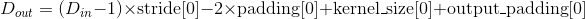

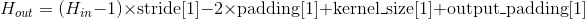

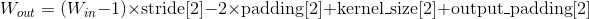

| Variables: | 

*   **weight** ([_Tensor_](tensors.html#torch.Tensor "torch.Tensor")) –  模块中的一个大小为 (in_channels, out_channels, kernel_size[0], kernel_size[1], kernel_size[2])的权重张量，这些权重可训练学习(learnable)。这些权重的初始值的采样空间是，其中 。
*   **bias** ([_Tensor_](tensors.html#torch.Tensor "torch.Tensor")) – 模块的偏差项，大小为 (out_channels)， 如果构造函数中的 `bias` 被置为 `True`，那么这些权重的初始值的采样空间是 ，其中 。

例子:

```py
>>> # With square kernels and equal stride
>>> m = nn.ConvTranspose3d(16, 33, 3, stride=2)
>>> # non-square kernels and unequal stride and with padding
>>> m = nn.ConvTranspose3d(16, 33, (3, 5, 2), stride=(2, 1, 1), padding=(0, 4, 2))
>>> input = torch.randn(20, 16, 10, 50, 100)
>>> output = m(input)

```

### Unfold

```py
class torch.nn.Unfold(kernel_size, dilation=1, padding=0, stride=1)
```

将一个batch的输入张量展开成由多个滑动局部块组成的形式。(im2col的扩展模块，起到基本类似im2col的作用）

以一个大小为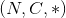的批次化(batched)输入张量为例，其中是batch的大小，是通道数量，代表了任意空间维度。那Unfold这个操作在此张量上的操作就是，将这个张量展开成由多个`kernel_size`大小的滑动块组成的大小为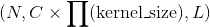的三维张量，其中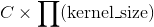是每个块中数的个数(每个块有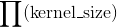个空间位置，每个空间位置存储一个通道大小为的向量），是块的个数：


(这张图有问题啊，编辑整理的时候注意修正一下）

其中 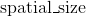 是由上面例子中的`input`各空间维度组成的，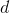遍历了各个空间维度。

因此，索引Fold操作的`output`的最后一个维度等价于索引某一个block，而索引操作的返回值是这个索引到的block中的所有值。


`padding`, `stride` 和 `dilation` 参数指明了滑动块的相关性质。

*   `stride` 控制了滑动块的步长。
*   `padding` 控制了在变换之前要向input的各维度各边上补齐的0的层数。 
*   `dilation` 控制了卷积核中各点之间的空间距离；这也被称为多孔算法(à trous algorithm)。这个概念有点难解释，这个链接[link](https://github.com/vdumoulin/conv_arithmetic/blob/master/README.md)用可视化的方法很好地解释了dilation的作用。

Parameters: 

*   **kernel_size** ([_int_](https://docs.python.org/3/library/functions.html#int "(in Python v3.7)") _or_ [_tuple_](https://docs.python.org/3/library/stdtypes.html#tuple "(in Python v3.7)")) – 滑动块的大小
*   **stride** ([_int_](https://docs.python.org/3/library/functions.html#int "(in Python v3.7)") _or_ [_tuple_](https://docs.python.org/3/library/stdtypes.html#tuple "(in Python v3.7)")_,_ _optional_) – 滑动块在输入各维度上的步长。默认: 1
*   **padding** ([_int_](https://docs.python.org/3/library/functions.html#int "(in Python v3.7)") _or_ [_tuple_](https://docs.python.org/3/library/stdtypes.html#tuple "(in Python v3.7)")_,_ _optional_) – 在输入各维度各边上补齐0的层数。
*   **dilation** ([_int_](https://docs.python.org/3/library/functions.html#int "(in Python v3.7)") _or_ [_tuple_](https://docs.python.org/3/library/stdtypes.html#tuple "(in Python v3.7)")_,_ _optional_) – 控制了各元素之间的距离(没有指明元素具体指的是谁的元素，猜测是输出的）。默认：1 


*   如果 `kernel_size`, `dilation`, `padding` 或者 `stride`的值是一个int，或是一个长度为1的int元组，在相关操作的时候各个空间维度上都会使用这同一个值。 
*   如果输出向量有两个空间维度，那么此Fold操作有时又被称为`im2col`。

Note
[`Fold`](#torch.nn.Fold "torch.nn.Fold")在执行类`col2im`的操作的时候，主要是是通过集成此im(输出张量）分裂出所有对应位置的col(输入的滑动块）来复原原im。而[`Unfold`](#torch.nn.Unfold "torch.nn.Unfold")则是通过从输入张量中不断拷贝数值到相应的block中来生成由滑动块组成的输出张量。所以，如果滑动块之间如果有数值重叠，那这些滑动块之间并不是互逆的。

Warning

目前，只有四维张量(比如批次化的图像张量）支持这个操作。

```py
Shape:
```

*   输入: 
*   输出: 

Examples:

```py
>>> unfold = nn.Unfold(kernel_size=(2, 3))
>>> input = torch.randn(2, 5, 3, 4)
>>> output = unfold(input)
>>> # each patch contains 30 values (2x3=6 vectors, each of 5 channels)
>>> # 4 blocks (2x3 kernels) in total in the 3x4 input
>>> output.size()
torch.Size([2, 30, 4])

>>> # Convolution is equivalent with Unfold + Matrix Multiplication + Fold (or view to output shape)
>>> inp = torch.randn(1, 3, 10, 12)
>>> w = torch.randn(2, 3, 4, 5)
>>> inp_unf = torch.nn.functional.unfold(inp, (4, 5))
>>> out_unf = inp_unf.transpose(1, 2).matmul(w.view(w.size(0), -1).t()).transpose(1, 2)
>>> out = torch.nn.functional.fold(out_unf, (7, 8), (1, 1))
>>> # or equivalently (and avoiding a copy),
>>> # out = out_unf.view(1, 2, 7, 8)
>>> (torch.nn.functional.conv2d(inp, w) - out).abs().max()
tensor(1.9073e-06)

```

### Fold

```py
class torch.nn.Fold(output_size, kernel_size, dilation=1, padding=0, stride=1)
```

将由滑动局部块组成的数组集合为一个大张量。(类col2im)

考虑一个包含了很多个滑动局部块的输入张量，比如，一批图像分割块(patches of images)的集合，大小为，其中是batch大小，  是一个块中的数值个数(每个块有个空间位置，每个空间位置存储一个通道大小为的向量），是滑动块的个数。(这些大小参数严格遵循了[`Unfold`](#torch.nn.Unfold "torch.nn.Unfold")操作的输出向量的大小规定。）Fold操作通过求和重叠值的方式来将这些局部块集合为一个大小为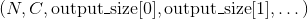的`output`张量。与 [`Unfold`](#torch.nn.Unfold "torch.nn.Unfold")类似，这些参数必须满足：


其中遍历了各个空间维度。

*   `output_size` 描述了要生成的output的各空间维度的大小。有时，同样数量的滑动块，可能会产生多种`input`的形状，比如，当`stride > 0`的时候，这时候，设置`output_size`参数就会显得极为重要。

`padding`, `stride` 和 `dilation` 参数指明了滑动块的相关性质。

*   `stride` 控制了滑动块的步长。
*   `padding` 控制了在变换之前要向input的各维度各边上补齐的0的层数。 
*   `dilation` 控制了卷积核中各点之间的空间距离；这也被称为多孔算法(à trous algorithm)。这个概念有点难解释，这个链接[link](https://github.com/vdumoulin/conv_arithmetic/blob/master/README.md)用可视化的方法很好地解释了dilation的作用。

Parameters: 

*   **output_size** ([_int_](https://docs.python.org/3/library/functions.html#int "(in Python v3.7)") _or_ [_tuple_](https://docs.python.org/3/library/stdtypes.html#tuple "(in Python v3.7)")) –  输出向量的各空间维度的大小 (i.e., `input.sizes()[2:]`)

*   **kernel_size** ([_int_](https://docs.python.org/3/library/functions.html#int "(in Python v3.7)") _or_ [_tuple_](https://docs.python.org/3/library/stdtypes.html#tuple "(in Python v3.7)")) – 滑动块的大小
*   **stride** ([_int_](https://docs.python.org/3/library/functions.html#int "(in Python v3.7)") _or_ [_tuple_](https://docs.python.org/3/library/stdtypes.html#tuple "(in Python v3.7)")_,_ _optional_) – 滑动块在输入各维度上的步长。默认: 1
*   **padding** ([_int_](https://docs.python.org/3/library/functions.html#int "(in Python v3.7)") _or_ [_tuple_](https://docs.python.org/3/library/stdtypes.html#tuple "(in Python v3.7)")_,_ _optional_) – 在输入各维度各边上补齐0的层数。
*   **dilation** ([_int_](https://docs.python.org/3/library/functions.html#int "(in Python v3.7)") _or_ [_tuple_](https://docs.python.org/3/library/stdtypes.html#tuple "(in Python v3.7)")_,_ _optional_) – 控制了各元素之间的距离(没有指明元素具体指的是谁的元素，猜测是输出的）。默认：1 


*   如果`output_size`， `kernel_size`, `dilation`, `padding` 或者 `stride`是一个int或者长度为1的int元组，在相关操作的时候各个空间维度上都会使用这同一个值。 
*   如果此输出向量的空间维度数为2，那么此Fold操作有时又被称为`col2im`。

Note
[`Fold`](#torch.nn.Fold "torch.nn.Fold")在执行类`col2im`的操作的时候，主要是是通过集成此im(输出张量）分裂出所有对应位置的col(输入的滑动块）来复原原im。而[`Unfold`](#torch.nn.Unfold "torch.nn.Unfold")则是通过从输入张量中不断拷贝数值到相应的block中来生成由滑动块组成的输出张量。所以，如果滑动块之间如果有数值重叠，那这些滑动块之间并不是互逆的。

Warning

目前，只有四维张量(比如批次化的图像张量）支持这个操作。


```py
Shape:
```

*   输入: 
*   输出:  

举例:

```py
>>> fold = nn.Fold(output_size=(4, 5), kernel_size=(2, 2))
>>> input = torch.randn(1, 3 * 2 * 2, 1)
>>> output = fold(input)
>>> output.size()

```

` 卷积层部分Fold 与 Unfold 是1.0新增的内容，猜测其主要目的是开放col2im和im2col这两个通过矩阵乘法实现卷积操作的前序接口，要好好理解这部分可能要了解一下现在主流框架通过大矩阵乘法来实现卷积操作这一通用做法了，这一篇文章就介绍的很好[Implementing convolution as a matrix multiplication](https://buptldy.github.io/2016/10/01/2016-10-01-im2col/)，这一段如果感觉我的直译晦涩难懂，那我深感抱歉并建议看一下英文原版，虽然我觉得英文原版介绍的也是晦涩难懂`

## 池化层(Pooling layers）

### MaxPool1d

```py
class torch.nn.MaxPool1d(kernel_size, stride=None, padding=0, dilation=1, return_indices=False, ceil_mode=False)
```
对输入的多通道信号执行一维最大池化操作。

最简单的情况下，对于输入大小为  ，输出大小为的池化操作，此池化过程可表述如下：


`padding` 参数控制了要在输入信号的各维度各边上要补齐0的层数。
`dilation` 参数控制了池化核中各元素之间的距离；这也被称为多孔算法(à trous algorithm)。这个概念有点难解释，这个链接[link](https://github.com/vdumoulin/conv_arithmetic/blob/master/README.md)用可视化的方法很好地解释了`dilation`的作用。

Parameters: 

*   **kernel_size** – 最大池化操作的滑动窗大小
*   **stride** – 滑动窗的步长，默认值是 `kernel_size`
*   **padding** – 要在输入信号的各维度各边上要补齐0的层数
*   **dilation** – 滑动窗中各元素之间的距离
*   **return_indices** – 如果此参数被设置为`True`， 那么此池化层在返回输出信号的同时还会返回一连串滑动窗最大值的索引位置，即每个滑动窗的最大值位置信息。这些信息可以在后面的上采样[`torch.nn.MaxUnpool1d`](#torch.nn.MaxUnpool1d "torch.nn.MaxUnpool1d")中被用到。
*   **ceil_mode** – 如果此参数被设置为True，计算输出信号大小的时候，会使用向上取整，代替默认的向下取整的操作


```py
Shape:
```

*   输入: 

*   输出:  其中

    

例子:

```py
>>> # pool of size=3, stride=2
>>> m = nn.MaxPool1d(3, stride=2)
>>> input = torch.randn(20, 16, 50)
>>> output = m(input)

```

### MaxPool2d

```py
class torch.nn.MaxPool2d(kernel_size, stride=None, padding=0, dilation=1, return_indices=False, ceil_mode=False)
```

对输入的多通道信号执行二维最大池化操作。

最简单的情况下，对于输入大小为  ，输出大小为，`kernel_size`为的池化操作，此池化过程可表述如下：


`padding` 参数控制了要在输入信号的各维度各边上要补齐0的层数。
`dilation` 参数控制了池化核中各元素之间的距离；这也被称为多孔算法(à trous algorithm)。这个概念有点难解释，这个链接[link](https://github.com/vdumoulin/conv_arithmetic/blob/master/README.md)用可视化的方法很好地解释了`dilation`的作用。

`kernel_size`, `stride`, `padding`, `dilation` 等参数均支持以下类型输入：

> *   一个单独的 `int` – 此时这个`int`会同时控制池化滑动窗的宽和高这两个维度的大小
> *   一个由两个`int`组成的`tuple` – 这种情况下，高这一维度会采用元组中的第一个`int`数字，宽这一维度会采用第二个`int`数字。

Parameters: 

*   **kernel_size** – 最大池化操作的滑动窗大小
*   **stride** – 滑动窗的步长，默认值是 `kernel_size`
*   **padding** – 要在输入信号的各维度各边上要补齐0的层数
*   **dilation** – 滑动窗中各元素之间的距离
*   **return_indices** – 如果此参数被设置为`True`， 那么此池化层在返回输出信号的同时还会返回一连串滑动窗最大值的索引位置，即每个滑动窗的最大值位置信息。这些信息可以在后面的上采样[`torch.nn.MaxUnpool2d`](#torch.nn.MaxUnpool2d "torch.nn.MaxUnpool2d")中被用到。
*   **ceil_mode** – 如果此参数被设置为True，计算输出信号大小的时候，会使用向上取整，代替默认的向下取整的操作

```py
Shape:
```

*   输入: 

*   输出: , 其中

    

    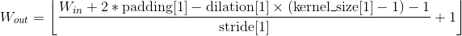

例子:

```py
>>> # pool of square window of size=3, stride=2
>>> m = nn.MaxPool2d(3, stride=2)
>>> # pool of non-square window
>>> m = nn.MaxPool2d((3, 2), stride=(2, 1))
>>> input = torch.randn(20, 16, 50, 32)
>>> output = m(input)

```

### MaxPool3d

```py
class torch.nn.MaxPool3d(kernel_size, stride=None, padding=0, dilation=1, return_indices=False, ceil_mode=False)
```

对输入的多通道信号执行三维最大池化操作。

最简单的情况下，对于输入大小为  ，输出大小为，`kernel_size`为  的池化操作，此池化过程可表述如下：


`padding` 参数控制了要在输入信号的各维度各边上要补齐0的层数。
`dilation` 参数控制了池化核中各元素之间的距离；这也被称为多孔算法(à trous algorithm)。这个概念有点难解释，这个链接[link](https://github.com/vdumoulin/conv_arithmetic/blob/master/README.md)用可视化的方法很好地解释了`dilation`的作用。

`kernel_size`, `stride`, `padding`, `dilation` 等参数均支持以下类型输入：

> *   一个单独的 `int` – 此时这个`int`会同时控制池化滑动窗的深度，宽和高这三个维度的大小
> *   一个由三个`int`组成的`tuple` – 这种情况下，深度这一维度会采用元组中的第一个`int`数字，高这一维度会采用元组中的第二个`int`数字，宽这一维度会采用第三个`int`数字。


Parameters: 

*   **kernel_size** – 最大池化操作的滑动窗大小
*   **stride** – 滑动窗的步长，默认值是 `kernel_size`
*   **padding** – 要在输入信号的各维度各边上要补齐0的层数
*   **dilation** – 滑动窗中各元素之间的距离
*   **return_indices** – 如果此参数被设置为`True`， 那么此池化层在返回输出信号的同时还会返回一连串滑动窗最大值的索引位置，即每个滑动窗的最大值位置信息。这些信息可以在后面的上采样[`torch.nn.MaxUnpool3d`](#torch.nn.MaxUnpool3d "torch.nn.MaxUnpool3d")中被用到。
*   **ceil_mode** – 如果此参数被设置为True，计算输出信号大小的时候，会使用向上取整，代替默认的向下取整的操作

```py
Shape:
```

*   输入: 

*   输出: , 其中

    

    

    

例子:

```py
>>> # pool of square window of size=3, stride=2
>>> m = nn.MaxPool3d(3, stride=2)
>>> # pool of non-square window
>>> m = nn.MaxPool3d((3, 2, 2), stride=(2, 1, 2))
>>> input = torch.randn(20, 16, 50,44, 31)
>>> output = m(input)

```

### MaxUnpool1d

```py
class torch.nn.MaxUnpool1d(kernel_size, stride=None, padding=0)
```

[`MaxPool1d`](#torch.nn.MaxPool1d "torch.nn.MaxPool1d")的逆过程，不过并不是完全的逆过程，因为在[`MaxPool1d`](#torch.nn.MaxPool1d "torch.nn.MaxPool1d")的过程中，池化窗区域内的非最大值都已经丢失。 [`MaxUnpool1d`](#torch.nn.MaxUnpool1d "torch.nn.MaxUnpool1d")的输入是[`MaxPool1d`](#torch.nn.MaxPool1d "torch.nn.MaxPool1d")的输出，其中也包括包括滑动窗最大值的索引(即return_indices所控制的输出），逆池化操作的过程就是将[`MaxPool1d`](#torch.nn.MaxPool1d "torch.nn.MaxPool1d")过程中产生的最大值插回到原来的位置，并将非最大值区域置为0。

Note

[`MaxPool1d`](#torch.nn.MaxPool1d "torch.nn.MaxPool1d")操作可以将多个大小不同的输入映射到相同的输出大小。因此，池化操作的反过程，[`MaxUnpool1d`](#torch.nn.MaxUnpool1d "torch.nn.MaxUnpool1d")的上采样过程的输出大小就不唯一了。为了适应这一点，可以在设置控制上采样输出大小的(`output_size`）参数。 具体用法，请参阅下面的输入和示例

Parameters: 

*   **kernel_size** ([_int_](https://docs.python.org/3/library/functions.html#int "(in Python v3.7)") _or_ [_tuple_](https://docs.python.org/3/library/stdtypes.html#tuple "(in Python v3.7)")) – 最大池化窗的大小
*   **stride** ([_int_](https://docs.python.org/3/library/functions.html#int "(in Python v3.7)") _or_ [_tuple_](https://docs.python.org/3/library/stdtypes.html#tuple "(in Python v3.7)")) – 最大池化窗的步长。默认`kernel_size`
*   **padding** ([_int_](https://docs.python.org/3/library/functions.html#int "(in Python v3.7)") _or_ [_tuple_](https://docs.python.org/3/library/stdtypes.html#tuple "(in Python v3.7)")) – 输入信号的各维度各边要补齐0的层数


```py
Inputs:
```

*   `input`: 要执行上采样操作的张量
*   `indices`: [`MaxPool1d`](#torch.nn.MaxPool1d "torch.nn.MaxPool1d")池化过程中输出的池化窗最大值的位置索引
*   `output_size` (选填): 指定的输出大小

```py
Shape:
```

*   输入: 

*   输出: , 其中

    

    也可以使用`output_size`指定输出的大小

例子:

```py
>>> pool = nn.MaxPool1d(2, stride=2, return_indices=True)
>>> unpool = nn.MaxUnpool1d(2, stride=2)
>>> input = torch.tensor([[[1., 2, 3, 4, 5, 6, 7, 8]]])
>>> output, indices = pool(input)
>>> unpool(output, indices)
tensor([[[ 0.,  2.,  0.,  4.,  0.,  6.,  0., 8.]]])

>>> # Example showcasing the use of output_size
>>> input = torch.tensor([[[1., 2, 3, 4, 5, 6, 7, 8, 9]]])
>>> output, indices = pool(input)
>>> unpool(output, indices, output_size=input.size())
tensor([[[ 0.,  2.,  0.,  4.,  0.,  6.,  0., 8.,  0.]]])

>>> unpool(output, indices)
tensor([[[ 0.,  2.,  0.,  4.,  0.,  6.,  0., 8.]]])

```

### MaxUnpool2d

```py
class torch.nn.MaxUnpool2d(kernel_size, stride=None, padding=0)
```

[`MaxPool2d`](#torch.nn.MaxPool2d "torch.nn.MaxPool2d")的逆过程，不过并不是完全的逆过程，因为在[`MaxPool2d`](#torch.nn.MaxPool2d "torch.nn.MaxPool2d")的过程中，池化窗区域内的非最大值都已经丢失。 [`MaxUnpool2d`](#torch.nn.MaxUnpool2d "torch.nn.MaxUnpool2d")的输入是[`MaxPool2d`](#torch.nn.MaxPool2d "torch.nn.MaxPool2d")的输出，其中也包括包括滑动窗最大值的索引(即return_indices所控制的输出），逆池化操作的过程就是将[`MaxPool2d`](#torch.nn.MaxPool2d "torch.nn.MaxPool2d")过程中产生的最大值插回到原来的位置，并将非最大值区域置为0。

Note

[`MaxPool2d`](#torch.nn.MaxPool2d "torch.nn.MaxPool2d")操作可以将多个大小不同的输入映射到相同的输出大小。因此，池化操作的反过程，[`MaxUnpool2d`](#torch.nn.MaxUnpool2d "torch.nn.MaxUnpool2d")的上采样过程的输出大小就不唯一了。为了适应这一点，可以在设置控制上采样输出大小的(`output_size`）参数。 具体用法，请参阅下面的输入和示例

Parameters: 

*   **kernel_size** ([_int_](https://docs.python.org/3/library/functions.html#int "(in Python v3.7)") _or_ [_tuple_](https://docs.python.org/3/library/stdtypes.html#tuple "(in Python v3.7)")) – 最大池化窗的大小
*   **stride** ([_int_](https://docs.python.org/3/library/functions.html#int "(in Python v3.7)") _or_ [_tuple_](https://docs.python.org/3/library/stdtypes.html#tuple "(in Python v3.7)")) – 最大池化窗的步长。默认`kernel_size`
*   **padding** ([_int_](https://docs.python.org/3/library/functions.html#int "(in Python v3.7)") _or_ [_tuple_](https://docs.python.org/3/library/stdtypes.html#tuple "(in Python v3.7)")) – 输入信号的各维度各边要补齐0的层数

```py
Inputs:
```

*   `input`: 要执行上采样操作的张量
*   `indices`: [`MaxPool2d`](#torch.nn.MaxPool2d "torch.nn.MaxPool2d")池化过程中输出的池化窗最大值的位置索引
*   `output_size` (选填): 指定的输出大小

```py
Shape:
```

*   输入: 

*   输出: , 其中

    

    

    也可以使用`output_size`指定输出的大小

例子:

```py
>>> pool = nn.MaxPool2d(2, stride=2, return_indices=True)
>>> unpool = nn.MaxUnpool2d(2, stride=2)
>>> input = torch.tensor([[[[ 1.,  2,  3,  4],
 [ 5,  6,  7,  8],
 [ 9, 10, 11, 12],
 [13, 14, 15, 16]]]])
>>> output, indices = pool(input)
>>> unpool(output, indices)
tensor([[[[  0.,   0.,   0.,   0.],
 [  0.,   6.,   0.,   8.],
 [  0.,   0.,   0.,   0.],
 [  0.,  14.,   0.,  16.]]]])

>>> # specify a different output size than input size
>>> unpool(output, indices, output_size=torch.Size([1, 1, 5, 5]))
tensor([[[[  0.,   0.,   0.,   0.,   0.],
 [  6.,   0.,   8.,   0.,   0.],
 [  0.,   0.,   0.,  14.,   0.],
 [ 16.,   0.,   0.,   0.,   0.],
 [  0.,   0.,   0.,   0.,   0.]]]])

```

### MaxUnpool3d

```py
class torch.nn.MaxUnpool3d(kernel_size, stride=None, padding=0)
```

[`MaxPool3d`](#torch.nn.MaxPool3d "torch.nn.MaxPool3d")的逆过程，不过并不是完全的逆过程，因为在[`MaxPool3d`](#torch.nn.MaxPool3d "torch.nn.MaxPool3d")的过程中，池化窗区域内的非最大值都已经丢失。 [`MaxUnpool3d`](#torch.nn.MaxUnpool3d "torch.nn.MaxUnpool3d")的输入是[`MaxPool3d`](#torch.nn.MaxPool3d "torch.nn.MaxPool3d")的输出，其中也包括包括滑动窗最大值的索引(即return_indices所控制的输出），逆池化操作的过程就是将[`MaxPool3d`](#torch.nn.MaxPool3d "torch.nn.MaxPool3d")过程中产生的最大值插回到原来的位置，并将非最大值区域置为0。

Note

[`MaxPool3d`](#torch.nn.MaxPool3d "torch.nn.MaxPool3d")操作可以将多个大小不同的输入映射到相同的输出大小。因此，池化操作的反过程，[`MaxUnpool3d`](#torch.nn.MaxUnpool3d "torch.nn.MaxUnpool3d")的上采样过程的输出大小就不唯一了。为了适应这一点，可以在设置控制上采样输出大小的(`output_size`）参数。 具体用法，请参阅下面的输入和示例

Parameters: 

*   **kernel_size** ([_int_](https://docs.python.org/3/library/functions.html#int "(in Python v3.7)") _or_ [_tuple_](https://docs.python.org/3/library/stdtypes.html#tuple "(in Python v3.7)")) – 最大池化窗的大小
*   **stride** ([_int_](https://docs.python.org/3/library/functions.html#int "(in Python v3.7)") _or_ [_tuple_](https://docs.python.org/3/library/stdtypes.html#tuple "(in Python v3.7)")) – 最大池化窗的步长。默认`kernel_size`
*   **padding** ([_int_](https://docs.python.org/3/library/functions.html#int "(in Python v3.7)") _or_ [_tuple_](https://docs.python.org/3/library/stdtypes.html#tuple "(in Python v3.7)")) – 输入信号的各维度各边要补齐0的层数

```py
Inputs:
```

*   `input`: 要执行上采样操作的张量
*   `indices`: [`MaxPool3d`](#torch.nn.MaxPool3d "torch.nn.MaxPool3d")池化过程中输出的池化窗最大值的位置索引
*   `output_size` (选填): 指定的输出大小

```py
Shape:
```

*   输入: 

*   输出: , 其中

    

    

    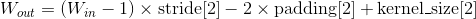

    也可以使用`output_size`指定输出的大小

例子:

```py
>>> # pool of square window of size=3, stride=2
>>> pool = nn.MaxPool3d(3, stride=2, return_indices=True)
>>> unpool = nn.MaxUnpool3d(3, stride=2)
>>> output, indices = pool(torch.randn(20, 16, 51, 33, 15))
>>> unpooled_output = unpool(output, indices)
>>> unpooled_output.size()
torch.Size([20, 16, 51, 33, 15])

```

### AvgPool1d

```py
class torch.nn.AvgPool1d(kernel_size, stride=None, padding=0, ceil_mode=False, count_include_pad=True)
```

对输入的多通道信号执行一维平均池化操作。

最简单的情况下，对于输入大小为  ，输出大小为，`kernel_size`为的池化操作，此池化过程可表述如下：

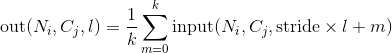

`padding` 参数控制了要在输入信号的各维度各边上要补齐0的层数。

`kernel_size`, `stride`, `padding`, `dilation` 等参数均支持输入一个int或者由一个int组成的tuple。

Parameters: 

*   **kernel_size** – 平均池化操作的滑动窗大小
*   **stride** – 滑动窗的步长，默认值是 `kernel_size`
*   **padding** – 要在输入信号的各维度各边上要补齐0的层数
*   **ceil_mode** – 如果此参数被设置为True，计算输出信号大小的时候，会使用向上取整，代替默认的向下取整的操作
*   **count_include_pad** – 如果被设置为True, 那么在进行平均运算的时候也会将用于补齐的0加入运算。

```py
Shape:
```

*   输入: 

*   输出: , 其中

    

例子:

```py
>>> # pool with window of size=3, stride=2
>>> m = nn.AvgPool1d(3, stride=2)
>>> m(torch.tensor([[[1.,2,3,4,5,6,7]]]))
tensor([[[ 2.,  4.,  6.]]])

```

### AvgPool2d

```py
class torch.nn.AvgPool2d(kernel_size, stride=None, padding=0, ceil_mode=False, count_include_pad=True)
```
对输入的多通道信号执行二维平均池化操作。
最简单的情况下，对于输入大小为   ，输出大小为，`kernel_size`为的池化操作，此池化过程可表述如下：


`padding` 参数控制了要在输入信号的各维度各边上要补齐0的层数。

`kernel_size`, `stride`, `padding`等参数均支持以下类型输入：

> *   一个单独的 `int` – 此时这个`int`会同时控制池化滑动窗的宽和高这两个维度的大小
> *   一个由两个`int`组成的`tuple` – 这种情况下，高这一维度会采用元组中的第一个`int`数字，宽这一维度会采用第二个`int`数字。


Parameters: 

*   **kernel_size** – 平均池化操作的滑动窗大小
*   **stride** – 滑动窗的步长，默认值是 `kernel_size`
*   **padding** – 要在输入信号的各维度各边上要补齐0的层数
*   **ceil_mode** – 如果此参数被设置为True，计算输出信号大小的时候，会使用向上取整，代替默认的向下取整的操作
*   **count_include_pad** – 如果被设置为True, 那么在进行平均运算的时候也会将用于补齐的0加入运算。


```py
Shape:
```

*   输入: 

*   输出: , 其中

    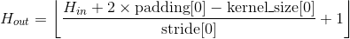

    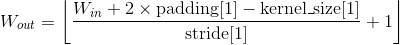

例子:

```py
>>> # pool of square window of size=3, stride=2
>>> m = nn.AvgPool2d(3, stride=2)
>>> # pool of non-square window
>>> m = nn.AvgPool2d((3, 2), stride=(2, 1))
>>> input = torch.randn(20, 16, 50, 32)
>>> output = m(input)

```

### AvgPool3d

```py
class torch.nn.AvgPool3d(kernel_size, stride=None, padding=0, ceil_mode=False, count_include_pad=True)
```
对输入的多通道信号执行三维平均池化操作。
最简单的情况下，对于输入大小为，输出大小为，`kernel_size`为的池化操作，此池化过程可表述如下：

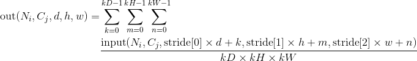

`padding` 参数控制了要在输入信号的各维度各边上要补齐0的层数。

`kernel_size`, `stride`, `padding`等参数均支持以下类型输入：

> *   一个单独的 `int` – 此时这个`int`会同时控制池化滑动窗的深度，宽和高这两个维度的大小
> *   一个由三个`int`组成的`tuple` – 这种情况下，深度这一维度会采用元组中的第一个`int`数字，高这一维度会采用元组中的第二个`int`数字，宽这一维度会采用第三个`int`数字。

Parameters: 

*   **kernel_size** – 平均池化操作的滑动窗大小
*   **stride** – 滑动窗的步长，默认值是 `kernel_size`
*   **padding** – 要在输入信号的各维度各边上要补齐0的层数
*   **ceil_mode** – 如果此参数被设置为True，计算输出信号大小的时候，会使用向上取整，代替默认的向下取整的操作
*   **count_include_pad** – 如果被设置为True, 那么在进行平均运算的时候也会将用于补齐的0加入运算。

```py
Shape:
```

*   输入: 

*   输出: , 其中

    

    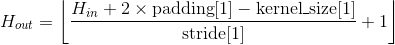

    

例子:

```py
>>> # pool of square window of size=3, stride=2
>>> m = nn.AvgPool3d(3, stride=2)
>>> # pool of non-square window
>>> m = nn.AvgPool3d((3, 2, 2), stride=(2, 1, 2))
>>> input = torch.randn(20, 16, 50,44, 31)
>>> output = m(input)

```

### FractionalMaxPool2d

```py
class torch.nn.FractionalMaxPool2d(kernel_size, output_size=None, output_ratio=None, return_indices=False, _random_samples=None)
```
对输入的多通道信号执行小数级二维最大池化操作。`小数级`指的是此操作的输出大小与输入大小成指定的小数倍数关系。

Ben Graham的这篇文章[Fractional MaxPooling](http://arxiv.org/abs/1412.6071)中详细地介绍了小数级二维最大池化的基本思想和技术细节。

小数级二维最大池化的基本思想就是将最大池化操作应用于个由随机步长大小采集的区域中，这些步长大小是由输出目标的大小决定的。小数级二维最大池化的输出特征的数量等于输入通道的数量。

Parameters: 

*   **kernel_size** – 执行最大操作的窗口大小。支持的数据类型包括一个单独的数字k(生成一个大小为k x k的正方形kernal)，或者一个元组 `(kh x kw)`
*   **output_size** – 池化输出目标大小，具体形式是 `oH x oW`。支持的数据类型包括一个单独的数字`oH`，或者一个元组 `(oH, oW)`，注意此处`oH x oW`与`kernal_size`中的`kh x ow`相呼应，两者成一定的小数级倍数关系
*   **output_ratio** – 如果想让输出目标的大小是输入目标大小的ratio倍，可以通过设置此参数来实现。此参数可以是一个小数数字或者小数元组，数字范围是(0, 1)
*   **return_indices** – 如果此参数设置为`True`, 那么在池化操作结束后，返回池化输出结果的同时也会返回每个池化区域中，最大值的位置信息。这些信息在`nn.MaxUnpool2d()`可以被用到。此参数默认为`False`


例子

```py
>>> # pool of square window of size=3, and target output size 13x12
>>> m = nn.FractionalMaxPool2d(3, output_size=(13, 12))
>>> # pool of square window and target output size being half of input image size
>>> m = nn.FractionalMaxPool2d(3, output_ratio=(0.5, 0.5))
>>> input = torch.randn(20, 16, 50, 32)
>>> output = m(input)

```

### LPPool1d

```py
class torch.nn.LPPool1d(norm_type, kernel_size, stride=None, ceil_mode=False)
```
对输入的多通道信号执行一维幂平均池化操作。

对于每个池化窗口，此池化操作的计算方式如下：

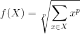

*   当p为无穷大的时候时，等价于最大池化操作
*   当`p=1`时，等价于求和池化操作(一定程度上等价于平均池化）

Note

如果某个特殊的输入导致这个输入关于幂指数`p`的求和是0，那上述池化函数在这一点是没有意义的。在实际实现过程中，此点的梯度被设置为0。

Parameters: 

*   kernel_size: 池化窗口的大小
*   stride：池化窗口移动的步长。默认值是`kernel_size`
*   ceil_mode: 当此参数被设置为`True`时，在计算输出大小的时候将使用向下取整代替向上取整

```py
Shape:
```

*   输入: 

*   输出: ，其中

    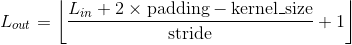

```py
例子:
```

```py
>>> # power-2 pool of window of length 3, with stride 2.
>>> m = nn.LPPool1d(2, 3, stride=2)
>>> input = torch.randn(20, 16, 50)
>>> output = m(input)

```

### LPPool2d

```py
class torch.nn.LPPool2d(norm_type, kernel_size, stride=None, ceil_mode=False)
```

对输入的多通道信号执行二维幂平均池化操作。

对于每个池化窗口，此池化操作的计算方式如下：


*   当p等于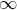时候时，等价于最大池化操作
*   当`p=1`时，等价于求和池化操作(一定程度上等价于平均池化）

参数`kernel_size`, `stride`支持的数据类型：

*   `int`，池化窗口的宽和高相等
*   `tuple`数组(两个数字的），第一个元素是池化窗口的高，第二个是宽

Note

如果某个特殊的输入导致这个输入关于幂指数`p`的求和是0，那上述池化函数在这一点是没有意义的。在实际实现过程中，此点的梯度被设置为0。

Parameters: 

*   kernel_size: 池化窗口的大小
*   stride：池化窗口移动的步长。默认值是`kernel_size`
*   ceil_mode: 当此参数被设置为`True`时，在计算输出大小的时候将使用向下取整代替向上取整

```py
Shape:
```

*   输入: 

*   输出: , 其中

    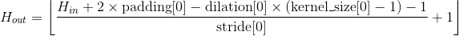

    

例子:

```py
>>> # power-2 pool of square window of size=3, stride=2
>>> m = nn.LPPool2d(2, 3, stride=2)
>>> # pool of non-square window of power 1.2
>>> m = nn.LPPool2d(1.2, (3, 2), stride=(2, 1))
>>> input = torch.randn(20, 16, 50, 32)
>>> output = m(input)

```

### AdaptiveMaxPool1d

```py
class torch.nn.AdaptiveMaxPool1d(output_size, return_indices=False)
```

对输入的多通道信号进行1维的自适应最大池化操作。

此池化层可以通过指定输出大小H，将任意输入大小的输入强行的池化到指定的输出大小。不过输入和输出特征的通道数不会变化。

Parameters: 

*   **output_size** – 指定的输出大小H
*   **return_indices** – 如果此参数设置为`True`, 那么在池化操作结束后，返回池化输出结果的同时也会返回每个池化区域中，最大值的位置信息。这些信息在`nn.MaxUnpool1d()`可以被用到。此参数默认为`False`

例子

```py
>>> # target output size of 5
>>> m = nn.AdaptiveMaxPool1d(5)
>>> input = torch.randn(1, 64, 8)
>>> output = m(input)

```

### AdaptiveMaxPool2d

```py
class torch.nn.AdaptiveMaxPool2d(output_size, return_indices=False)
```

对输入的多通道信号进行2维的自适应最大池化操作。

此池化层可以通过指定输出大小H x W，将任意输入大小的输入强行的池化到指定的输出大小。不过输入和输出特征的通道数不会变化。

Parameters: 

*   **output_size** – 指定的输出大小H x W。此参数支持的数据类型可以是一个元组(H, W)，又或者是一个单独的`int` H(等价于H x H）。H 和 W这两个参数支持输入一个`int`又或者是`None`, `None`表示此输出维度的大小等价于输入数据此维度的大小
*   **return_indices** – 如果此参数设置为`True`, 那么在池化操作结束后，返回池化输出结果的同时也会返回每个池化区域中，最大值的位置信息。这些信息在`nn.MaxUnpool2d()`可以被用到。此参数默认为`False`

例子

```py
>>> # target output size of 5x7
>>> m = nn.AdaptiveMaxPool2d((5,7))
>>> input = torch.randn(1, 64, 8, 9)
>>> output = m(input)
>>> # target output size of 7x7 (square)
>>> m = nn.AdaptiveMaxPool2d(7)
>>> input = torch.randn(1, 64, 10, 9)
>>> output = m(input)
>>> # target output size of 10x7
>>> m = nn.AdaptiveMaxPool2d((None, 7))
>>> input = torch.randn(1, 64, 10, 9)
>>> output = m(input)

```

### AdaptiveMaxPool3d

```py
class torch.nn.AdaptiveMaxPool3d(output_size, return_indices=False)
```
对输入的多通道信号进行3维的自适应最大池化操作。

此池化层可以通过指定输出大小D x H x W，将任意输入大小的输入强行的池化到指定的输出大小。不过输入和输出特征的通道数不会变化。

Parameters: 

*   **output_size** – 指定的输出大小D x H x W。此参数支持的数据类型可以是一个元组(D, H, W)，又或者是一个单独的`int` D(等价于D x D x D)。D, H 和 W这三个参数支持输入一个`int`又或者是`None`, `None`表示此输出维度的大小等价于输入数据此维度的大小
*   **return_indices** – 如果此参数设置为`True`, 那么在池化操作结束后，返回池化输出结果的同时也会返回每个池化区域中，最大值的位置信息。这些信息在`nn.MaxUnpool3d()`可以被用到。此参数默认为`False`

例子

```py
>>> # target output size of 5x7x9
>>> m = nn.AdaptiveMaxPool3d((5,7,9))
>>> input = torch.randn(1, 64, 8, 9, 10)
>>> output = m(input)
>>> # target output size of 7x7x7 (cube)
>>> m = nn.AdaptiveMaxPool3d(7)
>>> input = torch.randn(1, 64, 10, 9, 8)
>>> output = m(input)
>>> # target output size of 7x9x8
>>> m = nn.AdaptiveMaxPool3d((7, None, None))
>>> input = torch.randn(1, 64, 10, 9, 8)
>>> output = m(input)

```

### AdaptiveAvgPool1d

```py
class torch.nn.AdaptiveAvgPool1d(output_size)
```

对输入的多通道信号进行1维的自适应平均池化操作。

此池化层可以通过指定输出大小H，将任意输入大小的输入强行的池化到指定的输出大小。不过输入和输出特征的通道数不会变化。

Parameters: 

*   **output_size** – 指定的输出大小H

例子

```py
>>> # target output size of 5
>>> m = nn.AdaptiveAvgPool1d(5)
>>> input = torch.randn(1, 64, 8)
>>> output = m(input)

```

### AdaptiveAvgPool2d

```py
class torch.nn.AdaptiveAvgPool2d(output_size)
```

对输入的多通道信号进行2维的自适应平均池化操作。

此池化层可以通过指定输出大小H x W，将任意输入大小的输入强行的池化到指定的输出大小。不过输入和输出特征的通道数不会变化。

Parameters: 

*   **output_size** – 指定的输出大小H x W。此参数支持的数据类型可以是一个元组(H, W)，又或者是一个单独的`int` H(等价于H x H）。H 和 W这两个参数支持输入一个`int`又或者是`None`, `None`表示此输出维度的大小等价于输入数据此维度的大小

例子


```py
>>> # target output size of 5x7
>>> m = nn.AdaptiveAvgPool2d((5,7))
>>> input = torch.randn(1, 64, 8, 9)
>>> output = m(input)
>>> # target output size of 7x7 (square)
>>> m = nn.AdaptiveAvgPool2d(7)
>>> input = torch.randn(1, 64, 10, 9)
>>> output = m(input)
>>> # target output size of 10x7
>>> m = nn.AdaptiveMaxPool2d((None, 7))
>>> input = torch.randn(1, 64, 10, 9)
>>> output = m(input)

```

### AdaptiveAvgPool3d

```py
class torch.nn.AdaptiveAvgPool3d(output_size)
```

对输入的多通道信号进行3维的自适应平均池化操作。

此池化层可以通过指定输出大小D x H x W，将任意输入大小的输入强行的池化到指定的输出大小。不过输入和输出特征的通道数不会变化。

Parameters: 

*   **output_size** – 指定的输出大小D x H x W。此参数支持的数据类型可以是一个元组(D, H, W)，又或者是一个单独的`int` D(等价于D x D x D)。D, H 和 W这三个参数支持输入一个`int`又或者是`None`, `None`表示此输出维度的大小等价于输入数据此维度的大小

例子


```py
>>> # target output size of 5x7x9
>>> m = nn.AdaptiveAvgPool3d((5,7,9))
>>> input = torch.randn(1, 64, 8, 9, 10)
>>> output = m(input)
>>> # target output size of 7x7x7 (cube)
>>> m = nn.AdaptiveAvgPool3d(7)
>>> input = torch.randn(1, 64, 10, 9, 8)
>>> output = m(input)
>>> # target output size of 7x9x8
>>> m = nn.AdaptiveMaxPool3d((7, None, None))
>>> input = torch.randn(1, 64, 10, 9, 8)
>>> output = m(input)

```

## 填充层(Padding layers）

### ReflectionPad1d

```py
class torch.nn.ReflectionPad1d(padding)
```

以输入张量的各边界为轴，通过对输入张量数据的进行镜像复制的方式来对输入张量进行填充操作。

对于`N`维的填充操作，调用[`torch.nn.functional.pad()`](#torch.nn.functional.pad "torch.nn.functional.pad")。

| Parameters: | **padding** ([_int_](https://docs.python.org/3/library/functions.html#int "(in Python v3.7)")_,_ [_tuple_](https://docs.python.org/3/library/stdtypes.html#tuple "(in Python v3.7)")) – 要填充的范围大小。如果输入数据是一个`int`, 那各个边界上都会填充同样大小的数据。如果是一个两个元素的元组，那么按照 (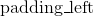, )的大小设定来在各边上填充。 |
| --- | --- |

```py
Shape:
```

*   输入: 
*   输出:  其中 

示例:

```py
>>> m = nn.ReflectionPad1d(2)
>>> input = torch.arange(8, dtype=torch.float).reshape(1, 2, 4)
>>> input
tensor([[[0., 1., 2., 3.],
 [4., 5., 6., 7.]]])
>>> m(input)
tensor([[[2., 1., 0., 1., 2., 3., 2., 1.],
 [6., 5., 4., 5., 6., 7., 6., 5.]]])
>>> m(input)
tensor([[[2., 1., 0., 1., 2., 3., 2., 1.],
 [6., 5., 4., 5., 6., 7., 6., 5.]]])
>>> # using different paddings for different sides
>>> m = nn.ReflectionPad1d((3, 1))
>>> m(input)
tensor([[[3., 2., 1., 0., 1., 2., 3., 2.],
 [7., 6., 5., 4., 5., 6., 7., 6.]]])

```

### ReflectionPad2d

```py
class torch.nn.ReflectionPad2d(padding)
```

以输入张量的各边界为轴，通过对输入张量数据的进行镜像复制的方式来对输入张量进行填充操作。

对于`N`维的填充操作，调用[`torch.nn.functional.pad()`](#torch.nn.functional.pad "torch.nn.functional.pad")。

| Parameters: | **padding** ([_int_](https://docs.python.org/3/library/functions.html#int "(in Python v3.7)")_,_ [_tuple_](https://docs.python.org/3/library/stdtypes.html#tuple "(in Python v3.7)")) – 要填充的范围大小。如果输入数据是一个`int`, 那各个边界上都会填充同样大小的数据。如果是一个四个元素的元组，那么按照(, , , )的大小设定来在各边上填充。  |
| --- | --- |

```py
Shape:
```

*   输入: 

*   输出:  其中

     

示例:

```py
>>> m = nn.ReflectionPad2d(2)
>>> input = torch.arange(9, dtype=torch.float).reshape(1, 1, 3, 3)
>>> input
tensor([[[[0., 1., 2.],
 [3., 4., 5.],
 [6., 7., 8.]]]])
>>> m(input)
tensor([[[[8., 7., 6., 7., 8., 7., 6.],
 [5., 4., 3., 4., 5., 4., 3.],
 [2., 1., 0., 1., 2., 1., 0.],
 [5., 4., 3., 4., 5., 4., 3.],
 [8., 7., 6., 7., 8., 7., 6.],
 [5., 4., 3., 4., 5., 4., 3.],
 [2., 1., 0., 1., 2., 1., 0.]]]])
>>> # using different paddings for different sides
>>> m = nn.ReflectionPad2d((1, 1, 2, 0))
>>> m(input)
tensor([[[[7., 6., 7., 8., 7.],
 [4., 3., 4., 5., 4.],
 [1., 0., 1., 2., 1.],
 [4., 3., 4., 5., 4.],
 [7., 6., 7., 8., 7.]]]])

```

### ReplicationPad1d

```py
class torch.nn.ReplicationPad1d(padding)
```

通过复制输入张量边界元素的方式对输入张量进行填充操作。

对于`N`维的填充操作，调用[`torch.nn.functional.pad()`](#torch.nn.functional.pad "torch.nn.functional.pad")。


| Parameters: | **padding** ([_int_](https://docs.python.org/3/library/functions.html#int "(in Python v3.7)")_,_ [_tuple_](https://docs.python.org/3/library/stdtypes.html#tuple "(in Python v3.7)")) – 要填充的范围大小。如果输入数据是一个`int`, 那各个边界上都会填充同样大小的数据。如果是一个两个元素的元组，那么按照 (, )的大小设定来在各边上填充。 |
| --- | --- |

```py
Shape:
```

*   输入: 
*   输出:  其中 

示例:

```py
>>> m = nn.ReplicationPad1d(2)
>>> input = torch.arange(8, dtype=torch.float).reshape(1, 2, 4)
>>> input
tensor([[[0., 1., 2., 3.],
 [4., 5., 6., 7.]]])
>>> m(input)
tensor([[[0., 0., 0., 1., 2., 3., 3., 3.],
 [4., 4., 4., 5., 6., 7., 7., 7.]]])
>>> # using different paddings for different sides
>>> m = nn.ReplicationPad1d((3, 1))
>>> m(input)
tensor([[[0., 0., 0., 0., 1., 2., 3., 3.],
 [4., 4., 4., 4., 5., 6., 7., 7.]]])

```

### ReplicationPad2d

```py
class torch.nn.ReplicationPad2d(padding)
```
通过复制输入张量边界元素的方式对输入张量进行填充操作。

对于`N`维的填充操作，调用[`torch.nn.functional.pad()`](#torch.nn.functional.pad "torch.nn.functional.pad")。

| Parameters: | **padding** ([_int_](https://docs.python.org/3/library/functions.html#int "(in Python v3.7)")_,_ [_tuple_](https://docs.python.org/3/library/stdtypes.html#tuple "(in Python v3.7)")) – 要填充的范围大小。如果输入数据是一个`int`, 那各个边界上都会填充同样大小的数据。如果是一个四个元素的元组，那么按照(, , , )的大小设定来在各边上填充。|
| --- | --- |

```py
Shape:
```

*   输入: 
*   输出:  其中  

示例:

```py
>>> m = nn.ReplicationPad2d(2)
>>> input = torch.arange(9, dtype=torch.float).reshape(1, 1, 3, 3)
>>> input
tensor([[[[0., 1., 2.],
 [3., 4., 5.],
 [6., 7., 8.]]]])
>>> m(input)
tensor([[[[0., 0., 0., 1., 2., 2., 2.],
 [0., 0., 0., 1., 2., 2., 2.],
 [0., 0., 0., 1., 2., 2., 2.],
 [3., 3., 3., 4., 5., 5., 5.],
 [6., 6., 6., 7., 8., 8., 8.],
 [6., 6., 6., 7., 8., 8., 8.],
 [6., 6., 6., 7., 8., 8., 8.]]]])
>>> # using different paddings for different sides
>>> m = nn.ReplicationPad2d((1, 1, 2, 0))
>>> m(input)
tensor([[[[0., 0., 1., 2., 2.],
 [0., 0., 1., 2., 2.],
 [0., 0., 1., 2., 2.],
 [3., 3., 4., 5., 5.],
 [6., 6., 7., 8., 8.]]]])

```

### ReplicationPad3d

```py
class torch.nn.ReplicationPad3d(padding)
```

通过复制输入张量边界元素的方式对输入张量进行填充操作。

对于`N`维的填充操作，调用[`torch.nn.functional.pad()`](#torch.nn.functional.pad "torch.nn.functional.pad")。

| Parameters: | **padding** ([_int_](https://docs.python.org/3/library/functions.html#int "(in Python v3.7)")_,_ [_tuple_](https://docs.python.org/3/library/stdtypes.html#tuple "(in Python v3.7)")) – 要填充的范围大小。如果输入数据是一个`int`, 那各个边界上都会填充同样大小的数据。如果是一个六个元素的元组，那么按照(, , , , 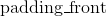, 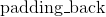)的大小设定来在各边上填充。|
| --- | --- |

```py
Shape:
```

*   输入: 
*   输出:  其中   

示例:

```py
>>> m = nn.ReplicationPad3d(3)
>>> input = torch.randn(16, 3, 8, 320, 480)
>>> output = m(input)
>>> # using different paddings for different sides
>>> m = nn.ReplicationPad3d((3, 3, 6, 6, 1, 1))
>>> output = m(input)

```

### ZeroPad2d

```py
class torch.nn.ZeroPad2d(padding)
```

通过在各边上填充0的方式对输入张量进行填充操作。

对于`N`维的填充操作，调用[`torch.nn.functional.pad()`](#torch.nn.functional.pad "torch.nn.functional.pad")。

| Parameters: | **padding** ([_int_](https://docs.python.org/3/library/functions.html#int "(in Python v3.7)")_,_ [_tuple_](https://docs.python.org/3/library/stdtypes.html#tuple "(in Python v3.7)")) – 要填充的范围大小。如果输入数据是一个`int`, 那各个边界上都会填充同样大小的数据。如果是一个四个元素的元组，那么按照(, , , )的大小设定来在各边上填充。|
| --- | --- |

```py
Shape:
```

*   输入: 
*   输出:  其中  

示例:

```py
>>> m = nn.ZeroPad2d(2)
>>> input = torch.randn(1, 1, 3, 3)
>>> input
tensor([[[[-0.1678, -0.4418,  1.9466],
 [ 0.9604, -0.4219, -0.5241],
 [-0.9162, -0.5436, -0.6446]]]])
>>> m(input)
tensor([[[[ 0.0000,  0.0000,  0.0000,  0.0000,  0.0000,  0.0000,  0.0000],
 [ 0.0000,  0.0000,  0.0000,  0.0000,  0.0000,  0.0000,  0.0000],
 [ 0.0000,  0.0000, -0.1678, -0.4418,  1.9466,  0.0000,  0.0000],
 [ 0.0000,  0.0000,  0.9604, -0.4219, -0.5241,  0.0000,  0.0000],
 [ 0.0000,  0.0000, -0.9162, -0.5436, -0.6446,  0.0000,  0.0000],
 [ 0.0000,  0.0000,  0.0000,  0.0000,  0.0000,  0.0000,  0.0000],
 [ 0.0000,  0.0000,  0.0000,  0.0000,  0.0000,  0.0000,  0.0000]]]])
>>> # using different paddings for different sides
>>> m = nn.ZeroPad2d((1, 1, 2, 0))
>>> m(input)
tensor([[[[ 0.0000,  0.0000,  0.0000,  0.0000,  0.0000],
 [ 0.0000,  0.0000,  0.0000,  0.0000,  0.0000],
 [ 0.0000, -0.1678, -0.4418,  1.9466,  0.0000],
 [ 0.0000,  0.9604, -0.4219, -0.5241,  0.0000],
 [ 0.0000, -0.9162, -0.5436, -0.6446,  0.0000]]]])

```

### ConstantPad1d

```py
class torch.nn.ConstantPad1d(padding, value)
```


通过在各边上填充固定数字的方式对输入张量进行填充操作

对于`N`维的填充操作，调用[`torch.nn.functional.pad()`](#torch.nn.functional.pad "torch.nn.functional.pad")。

| Parameters: | **padding** ([_int_](https://docs.python.org/3/library/functions.html#int "(in Python v3.7)")_,_ [_tuple_](https://docs.python.org/3/library/stdtypes.html#tuple "(in Python v3.7)")) – 要填充的范围大小。如果输入数据是一个`int`, 那各个边界上都会填充同样大小的数据。如果是一个两个元素的元组，那么按照 (, )的大小设定来在各边上填充。|
| --- | --- |

```py
Shape:
```

*   输入: 
*   输出:  其中 

示例:

```py
>>> m = nn.ConstantPad1d(2, 3.5)
>>> input = torch.randn(1, 2, 4)
>>> input
tensor([[[-1.0491, -0.7152, -0.0749,  0.8530],
 [-1.3287,  1.8966,  0.1466, -0.2771]]])
>>> m(input)
tensor([[[ 3.5000,  3.5000, -1.0491, -0.7152, -0.0749,  0.8530,  3.5000,
 3.5000],
 [ 3.5000,  3.5000, -1.3287,  1.8966,  0.1466, -0.2771,  3.5000,
 3.5000]]])
>>> m = nn.ConstantPad1d(2, 3.5)
>>> input = torch.randn(1, 2, 3)
>>> input
tensor([[[ 1.6616,  1.4523, -1.1255],
 [-3.6372,  0.1182, -1.8652]]])
>>> m(input)
tensor([[[ 3.5000,  3.5000,  1.6616,  1.4523, -1.1255,  3.5000,  3.5000],
 [ 3.5000,  3.5000, -3.6372,  0.1182, -1.8652,  3.5000,  3.5000]]])
>>> # using different paddings for different sides
>>> m = nn.ConstantPad1d((3, 1), 3.5)
>>> m(input)
tensor([[[ 3.5000,  3.5000,  3.5000,  1.6616,  1.4523, -1.1255,  3.5000],
 [ 3.5000,  3.5000,  3.5000, -3.6372,  0.1182, -1.8652,  3.5000]]])

```

### ConstantPad2d

```py
class torch.nn.ConstantPad2d(padding, value)
```

通过在各边上填充固定数字的方式对输入张量进行填充操作

对于`N`维的填充操作，调用[`torch.nn.functional.pad()`](#torch.nn.functional.pad "torch.nn.functional.pad")。

| Parameters: | **padding** ([_int_](https://docs.python.org/3/library/functions.html#int "(in Python v3.7)")_,_ [_tuple_](https://docs.python.org/3/library/stdtypes.html#tuple "(in Python v3.7)")) – 要填充的范围大小。如果输入数据是一个`int`, 那各个边界上都会填充同样大小的数据。如果是一个四个元素的元组，那么按照(, , , )的大小设定来在各边上填充。|
| --- | --- |

```py
Shape:
```

*   输入: 
*   输出:  其中  

示例:

```py
>>> m = nn.ConstantPad2d(2, 3.5)
>>> input = torch.randn(1, 2, 2)
>>> input
tensor([[[ 1.6585,  0.4320],
 [-0.8701, -0.4649]]])
>>> m(input)
tensor([[[ 3.5000,  3.5000,  3.5000,  3.5000,  3.5000,  3.5000],
 [ 3.5000,  3.5000,  3.5000,  3.5000,  3.5000,  3.5000],
 [ 3.5000,  3.5000,  1.6585,  0.4320,  3.5000,  3.5000],
 [ 3.5000,  3.5000, -0.8701, -0.4649,  3.5000,  3.5000],
 [ 3.5000,  3.5000,  3.5000,  3.5000,  3.5000,  3.5000],
 [ 3.5000,  3.5000,  3.5000,  3.5000,  3.5000,  3.5000]]])
>>> m(input)
tensor([[[ 3.5000,  3.5000,  3.5000,  3.5000,  3.5000,  3.5000],
 [ 3.5000,  3.5000,  3.5000,  3.5000,  3.5000,  3.5000],
 [ 3.5000,  3.5000,  1.6585,  0.4320,  3.5000,  3.5000],
 [ 3.5000,  3.5000, -0.8701, -0.4649,  3.5000,  3.5000],
 [ 3.5000,  3.5000,  3.5000,  3.5000,  3.5000,  3.5000],
 [ 3.5000,  3.5000,  3.5000,  3.5000,  3.5000,  3.5000]]])
>>> # using different paddings for different sides
>>> m = nn.ConstantPad2d((3, 0, 2, 1), 3.5)
>>> m(input)
tensor([[[ 3.5000,  3.5000,  3.5000,  3.5000,  3.5000],
 [ 3.5000,  3.5000,  3.5000,  3.5000,  3.5000],
 [ 3.5000,  3.5000,  3.5000,  1.6585,  0.4320],
 [ 3.5000,  3.5000,  3.5000, -0.8701, -0.4649],
 [ 3.5000,  3.5000,  3.5000,  3.5000,  3.5000]]])

```

### ConstantPad3d

```py
class torch.nn.ConstantPad3d(padding, value)
```

通过在各边上填充固定数字的方式对输入张量进行填充操作

对于`N`维的填充操作，调用[`torch.nn.functional.pad()`](#torch.nn.functional.pad "torch.nn.functional.pad")。

| Parameters: | **padding** ([_int_](https://docs.python.org/3/library/functions.html#int "(in Python v3.7)")_,_ [_tuple_](https://docs.python.org/3/library/stdtypes.html#tuple "(in Python v3.7)")) – 要填充的范围大小。如果输入数据是一个`int`, 那各个边界上都会填充同样大小的数据。如果是一个六个元素的元组，那么按照(, , , , , )的大小设定来在各边上填充。 |
| --- | --- |

```py
Shape:
```

*   输入: 
*   输出:  其中   

示例:

```py
>>> m = nn.ConstantPad3d(3, 3.5)
>>> input = torch.randn(16, 3, 10, 20, 30)
>>> output = m(input)
>>> # using different paddings for different sides
>>> m = nn.ConstantPad3d((3, 3, 6, 6, 0, 1), 3.5)
>>> output = m(input)

```

## 非线性激活(加权求和，非线性) ( Non-linear activations (weighted sum, nonlinearity))

### ELU

```py
class torch.nn.ELU(alpha=1.0, inplace=False)
```

将下面的元素级函数应用到输入张量上：

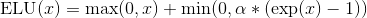

Parameters: 

*   **alpha** – ELU操作的值。 默认： 1.0
*   **inplace** – 是否进行原位操作。 默认： `False`


```py
Shape:
```

*   输入:  其中 `*` 代表支持任意大小的附加维度
*   输出: , 与输入向量保持一样的形状大小


示例:

```py
>>> m = nn.ELU()
>>> input = torch.randn(2)
>>> output = m(input)

```

### Hardshrink

```py
class torch.nn.Hardshrink(lambd=0.5)
```
将下面的元素级hard shrinkage函数应用到输入张量上：

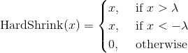

| Parameters: | **lambd** – Hardshrink运算中的  值。 默认: 0.5 |
| --- | --- |

```py
Shape:
```

*   输入:  其中 `*` 代表支持任意大小的附加维度
*   输出: , 与输入向量保持一样的形状大小


示例:

```py
>>> m = nn.Hardshrink()
>>> input = torch.randn(2)
>>> output = m(input)

```

### Hardtanh

```py
class torch.nn.Hardtanh(min_val=-1.0, max_val=1.0, inplace=False, min_value=None, max_value=None)
```

将下面的元素级HardTanh函数应用到输入张量上。

HardTanh函数定义如下:


线性区域 的大小可以通过设置`min_val` 参数 `max_val`来进行调整。

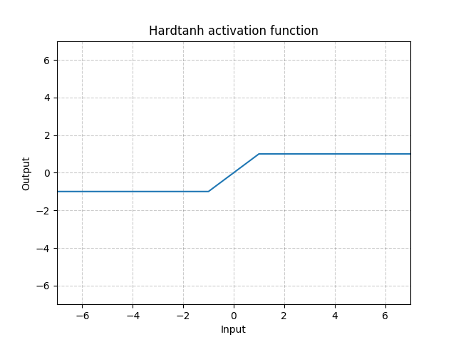

参数: 

*   **min_val** – 线性区域的下限. 默认: -1
*   **max_val** – 线性区域的上限. 默认: 1
*   **inplace** – 是否进行原位操作。 默认： `False`


之前版本的`min_value` 和 `max_value` 参数已经被废弃掉了，改为`min_val` 和 `max_val`参数。

```py
Shape:
```

*   输入:  其中 `*` 代表支持任意大小的附加维度
*   输出: , 与输入向量保持一样的形状大小

示例:

```py
>>> m = nn.Hardtanh(-2, 2)
>>> input = torch.randn(2)
>>> output = m(input)

```

### LeakyReLU

```py
class torch.nn.LeakyReLU(negative_slope=0.01, inplace=False)
```

将下面的元素级函数应用到输入张量上：

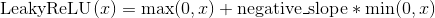

或

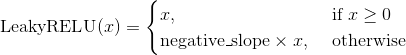

Parameters: 

*   **negative_slope** – 控制负数范围函数的斜率。 默认: 1e-2
*   **inplace** – 是否进行原位操作。 默认： `False`


```py
Shape:
```

*   输入:  其中 `*` 代表支持任意大小的附加维度
*   输出: , 与输入向量保持一样的形状大小


示例:

```py
>>> m = nn.LeakyReLU(0.1)
>>> input = torch.randn(2)
>>> output = m(input)

```

### LogSigmoid

```py
class torch.nn.LogSigmoid
```

将下面的元素级函数LogSigmoid应用到输入张量上：(此处漏了一张图，后期补一下)

```py
Shape:
```

*   输入:  其中 `*` 代表支持任意大小的附加维度
*   输出: , 与输入向量保持一样的形状大小

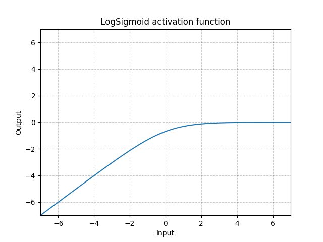

示例:

```py
>>> m = nn.LogSigmoid()
>>> input = torch.randn(2)
>>> output = m(input)

```

### PReLU

```py
class torch.nn.PReLU(num_parameters=1, init=0.25)
```

将下面的元素级函数应用到输入张量上：


或

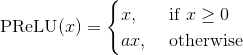

此处  是一个可学习的参数。 如果在调用`nn.PReLU()`函数的时候没有传入参数，那么会默认在所有的输入通道上应用同一个 参数。 如果以`nn.PReLU(nChannels)`这种方式调用， 每个输入通道都会有一个单独的 参数。

Note

想要学一个好的参数，最好不要用weight decay。

Note

通道维度是输入张量的第二个维度。当输入张量的维度数 &lt; 2的时候，那此输入张量就没有通道维度，而此时其通道数被认为是1。

Parameters: 

*   **num_parameters** ([_int_](https://docs.python.org/3/library/functions.html#int "(in Python v3.7)")) – 要进行训练学习的  参数的数量。尽管此函数的输入是一个整形，但此函数要求输入的整形只能为两个值，1或者输入张量的通道数。默认：1 
*   **init** ([_float_](https://docs.python.org/3/library/functions.html#float "(in Python v3.7)")) – 的初始值，默认: 0.25


```py
Shape:
```

*   输入:  其中 `*` 代表支持任意大小的附加维度
*   输出: , 与输入向量保持一样的形状大小

| Variables: | **weight** ([_Tensor_](tensors.html#torch.Tensor "torch.Tensor")) – 大小为`num_parameters`的可学习参数。The attr:`dtype` is default to(这句话有点问题， to后面漏掉了） |
| --- | --- |

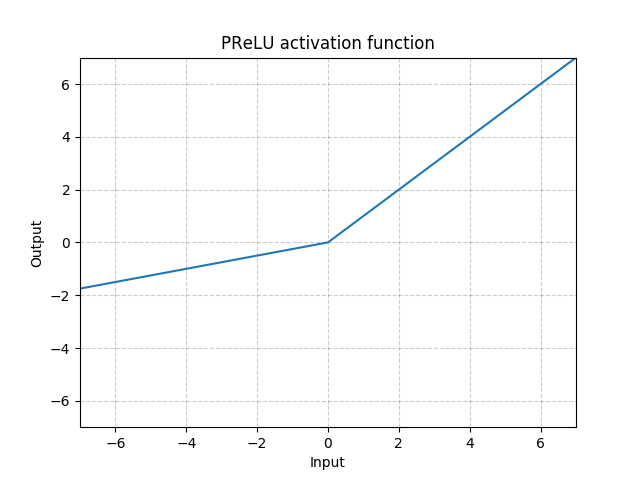

示例:

```py
>>> m = nn.PReLU()
>>> input = torch.randn(2)
>>> output = m(input)

```

### ReLU

```py
class torch.nn.ReLU(inplace=False)
```

将元素级线性整流函数函数应用到输入张量上
Applies the rectified linear unit function element-wise 


| Parameters: | **inplace** – 是否进行原位操作。 默认： `False` |
| --- | --- |

```py
Shape:
```

*   输入:  其中 `*` 代表支持任意大小的附加维度
*   输出: , 与输入向量保持一样的形状大小

示例:

```py
>>> m = nn.ReLU()
>>> input = torch.randn(2)
>>> output = m(input)

```

### ReLU6

```py
class torch.nn.ReLU6(inplace=False)
```

将下面的元素级函数应用到输入张量上:


| Parameters: | **inplace** – 是否进行原位操作。 默认： `False` |
| --- | --- |

```py
Shape:
```

*   输入:  其中 `*` 代表支持任意大小的附加维度
*   输出: , 与输入向量保持一样的形状大小

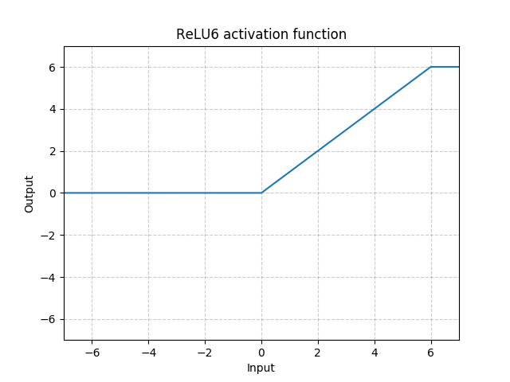

示例:

```py
>>> m = nn.ReLU6()
>>> input = torch.randn(2)
>>> output = m(input)

```

### RReLU

```py
class torch.nn.RReLU(lower=0.125, upper=0.3333333333333333, inplace=False)
```
将元素级随机线性整流函数函数应用到输入张量上，详情此文章：

[Empirical Evaluation of Rectified Activations in Convolutional Network](https://arxiv.org/abs/1505.00853).

此函数定义如下:


其中  是从此均匀分布中采样而来：.

> 详见: [https://arxiv.org/pdf/1505.00853.pdf](https://arxiv.org/pdf/1505.00853.pdf)

Parameters: 

*   **lower** – 均匀分布下限， 默认: 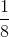
*   **upper** – 均匀分布上限，默认: 
*   **inplace** – 是否进行原位操作。 默认： `False`


```py
Shape:
```

*   输入:  其中 `*` 代表支持任意大小的附加维度
*   输出: , 与输入向量保持一样的形状大小

示例:

```py
>>> m = nn.RReLU(0.1, 0.3)
>>> input = torch.randn(2)
>>> output = m(input)

```

### SELU

```py
class torch.nn.SELU(inplace=False)
```

将下面的元素级函数应用到输入张量上:

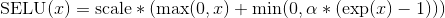

其中  而且 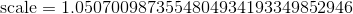.


More details can be found in the paper [Self-Normalizing Neural Networks](https://arxiv.org/abs/1706.02515) .

| Parameters: | **inplace** ([_bool_](https://docs.python.org/3/library/functions.html#bool "(in Python v3.7)")_,_ _optional_) – 是否进行原位操作。 默认： `False` |
| --- | --- |

```py
Shape:
```

*   输入:  其中 `*` 代表支持任意大小的附加维度
*   输出: , 与输入向量保持一样的形状大小

示例:


```py
>>> m = nn.SELU()
>>> input = torch.randn(2)
>>> output = m(input)

```

### CELU

```py
class torch.nn.CELU(alpha=1.0, inplace=False)
```

将下面的元素级函数应用到输入张量上：


更多细节请见paper: [Continuously Differentiable Exponential Linear Units](https://arxiv.org/abs/1704.07483) .

Parameters: 

*   **alpha** – CELU操作中的  值，默认: 1.0
*   **inplace** – 是否进行原位操作。 默认： `False`


```py
Shape:
```

*   输入:  其中 `*` 代表支持任意大小的附加维度
*   输出: , 与输入向量保持一样的形状大小


示例:

```py
>>> m = nn.CELU()
>>> input = torch.randn(2)
>>> output = m(input)

```

### Sigmoid

```py
class torch.nn.Sigmoid
```

将下面的元素级函数应用到输入张量上：


```py
Shape:
```

*   输入:  其中 `*` 代表支持任意大小的附加维度
*   输出: , 与输入向量保持一样的形状大小


示例:

```py
>>> m = nn.Sigmoid()
>>> input = torch.randn(2)
>>> output = m(input)

```

### Softplus

```py
class torch.nn.Softplus(beta=1, threshold=20)
```

将下面的元素级函数应用到输入张量上:


SoftPlus是一个平滑的类ReLU函数，可以用于将输出结果规范到全正。

为了数值稳定性，在实现此函数的过程中，当 `x` 超过某个特定值之后，我们会将此函数转化为一个线性函数。

Parameters: 

*   **beta** – Softplus操作的  值，默认: 1
*   **threshold** – 将函数转化为线性函数的阈值， 默认: 20


```py
Shape:
```

*   输入:  其中 `*` 代表支持任意大小的附加维度
*   输出: , 与输入向量保持一样的形状大小


示例:

```py
>>> m = nn.Softplus()
>>> input = torch.randn(2)
>>> output = m(input)

```

### Softshrink

```py
class torch.nn.Softshrink(lambd=0.5)
```

将下面的元素级软收缩函数应用到输入张量上:


| Parameters: | **lambd** – 软收缩运算的值，默认: 0.5 |
| --- | --- |

```py
Shape:
```

*   输入:  其中 `*` 代表支持任意大小的附加维度
*   输出: , 与输入向量保持一样的形状大小


示例:

```py
>>> m = nn.Softshrink()
>>> input = torch.randn(2)
>>> output = m(input)

```

### Softsign

```py
class torch.nn.Softsign
```

将下面的元素级函数应用到输入张量上:


```py
Shape:
```

*   输入:  其中 `*` 代表支持任意大小的附加维度
*   输出: , 与输入向量保持一样的形状大小


示例:

```py
>>> m = nn.Softsign()
>>> input = torch.randn(2)
>>> output = m(input)

```

### Tanh

```py
class torch.nn.Tanh
```

将下面的元素级函数应用到输入张量上:


```py
Shape:
```

*   输入:  其中 `*` 代表支持任意大小的附加维度
*   输出: , 与输入向量保持一样的形状大小


示例:

```py
>>> m = nn.Tanh()
>>> input = torch.randn(2)
>>> output = m(input)

```

### Tanhshrink

```py
class torch.nn.Tanhshrink
```

将下面的元素级函数应用到输入张量上:


```py
Shape:
```

*   输入:  其中 `*` 代表支持任意大小的附加维度
*   输出: , 与输入向量保持一样的形状大小


示例:

```py
>>> m = nn.Tanhshrink()
>>> input = torch.randn(2)
>>> output = m(input)

```

### Threshold

```py
class torch.nn.Threshold(threshold, value, inplace=False)
```

使用阈值过滤输入张量的每个元素

阈值被定义如下：


Parameters: 

*   **threshold** – 阈值大小 
*   **value** – 小于阈值的元素的替换值
*   **inplace** – 是否进行原位操作。 默认： `False`


```py
Shape:
```

*   输入:  其中 `*` 代表支持任意大小的附加维度
*   输出: , 与输入向量保持一样的形状大小

示例:

```py
>>> m = nn.Threshold(0.1, 20)
>>> input = torch.randn(2)
>>> output = m(input)

```

## Non-linear activations (other)

### Softmin

```py
class torch.nn.Softmin(dim=None)
```

Applies the Softmin function to an n-dimensional input Tensor rescaling them so that the elements of the n-dimensional output Tensor lie in the range `(0, 1)` and sum to 1


```py
Shape:
```

*   Input: any shape
*   Output: same as input

| Parameters: | **dim** ([_int_](https://docs.python.org/3/library/functions.html#int "(in Python v3.7)")) – A dimension along which Softmin will be computed (so every slice along dim will sum to 1). |
| --- | --- |
| Returns: | a Tensor of the same dimension and shape as the input, with values in the range [0, 1] |
| --- | --- |

Examples:

```py
>>> m = nn.Softmin()
>>> input = torch.randn(2, 3)
>>> output = m(input)

```

### Softmax

```py
class torch.nn.Softmax(dim=None)
```

Applies the Softmax function to an n-dimensional input Tensor rescaling them so that the elements of the n-dimensional output Tensor lie in the range (0,1) and sum to 1

Softmax is defined as:


```py
Shape:
```

*   Input: any shape
*   Output: same as input

| Returns: | a Tensor of the same dimension and shape as the input with values in the range [0, 1] |
| --- | --- |
| Parameters: | **dim** ([_int_](https://docs.python.org/3/library/functions.html#int "(in Python v3.7)")) – A dimension along which Softmax will be computed (so every slice along dim will sum to 1). |
| --- | --- |

Note

This module doesn’t work directly with NLLLoss, which expects the Log to be computed between the Softmax and itself. Use `LogSoftmax` instead (it’s faster and has better numerical properties).

Examples:

```py
>>> m = nn.Softmax()
>>> input = torch.randn(2, 3)
>>> output = m(input)

```

### Softmax2d

```py
class torch.nn.Softmax2d
```

Applies SoftMax over features to each spatial location.

When given an image of `Channels x Height x Width`, it will apply `Softmax` to each location 

```py
Shape:
```

*   Input: 
*   Output:  (same shape as input)

| Returns: | a Tensor of the same dimension and shape as the input with values in the range [0, 1] |
| --- | --- |

Examples:

```py
>>> m = nn.Softmax2d()
>>> # you softmax over the 2nd dimension
>>> input = torch.randn(2, 3, 12, 13)
>>> output = m(input)

```

### LogSoftmax

```py
class torch.nn.LogSoftmax(dim=None)
```

Applies the  function to an n-dimensional input Tensor. The LogSoftmax formulation can be simplified as:


```py
Shape:
```

*   Input: any shape
*   Output: same as input

| Parameters: | **dim** ([_int_](https://docs.python.org/3/library/functions.html#int "(in Python v3.7)")) – A dimension along which Softmax will be computed (so every slice along dim will sum to 1). |
| --- | --- |
| Returns: | a Tensor of the same dimension and shape as the input with values in the range [-inf, 0) |
| --- | --- |

Examples:

```py
>>> m = nn.LogSoftmax()
>>> input = torch.randn(2, 3)
>>> output = m(input)

```

### AdaptiveLogSoftmaxWithLoss

```py
class torch.nn.AdaptiveLogSoftmaxWithLoss(in_features, n_classes, cutoffs, div_value=4.0, head_bias=False)
```

Efficient softmax approximation as described in [Efficient softmax approximation for GPUs](https://arxiv.org/abs/1609.04309) by Edouard Grave, Armand Joulin, Moustapha Cissé, David Grangier, and Hervé Jégou.

Adaptive softmax is an approximate strategy for training models with large output spaces. It is most effective when the label distribution is highly imbalanced, for example in natural language modelling, where the word frequency distribution approximately follows the [Zipf’s law](https://en.wikipedia.org/wiki/Zipf%27s_law).

Adaptive softmax partitions the labels into several clusters, according to their frequency. These clusters may contain different number of targets each. Additionally, clusters containing less frequent labels assign lower dimensional embeddings to those labels, which speeds up the computation. For each minibatch, only clusters for which at least one target is present are evaluated.

The idea is that the clusters which are accessed frequently (like the first one, containing most frequent labels), should also be cheap to compute – that is, contain a small number of assigned labels.

We highly recommend taking a look at the original paper for more details.

*   `cutoffs` should be an ordered Sequence of integers sorted in the increasing order. It controls number of clusters and the partitioning of targets into clusters. For example setting `cutoffs = [10, 100, 1000]` means that first `10` targets will be assigned to the ‘head’ of the adaptive softmax, targets `11, 12, …, 100` will be assigned to the first cluster, and targets `101, 102, …, 1000` will be assigned to the second cluster, while targets `1001, 1002, …, n_classes - 1` will be assigned to the last, third cluster
*   `div_value` is used to compute the size of each additional cluster, which is given as , where  is the cluster index (with clusters for less frequent words having larger indices, and indices starting from ).
*   `head_bias` if set to True, adds a bias term to the ‘head’ of the adaptive softmax. See paper for details. Set to False in the official implementation.

Warning

Labels passed as inputs to this module should be sorted accoridng to their frequency. This means that the most frequent label should be represented by the index `0`, and the least frequent label should be represented by the index `n_classes - 1`.

Note

This module returns a `NamedTuple` with `output` and `loss` fields. See further documentation for details.

Note

To compute log-probabilities for all classes, the `log_prob` method can be used.

Parameters: 

*   **in_features** ([_int_](https://docs.python.org/3/library/functions.html#int "(in Python v3.7)")) – Number of features in the input tensor
*   **n_classes** ([_int_](https://docs.python.org/3/library/functions.html#int "(in Python v3.7)")) – Number of classes in the dataset.
*   **cutoffs** (_Sequence_) – Cutoffs used to assign targets to their buckets.
*   **div_value** ([_float_](https://docs.python.org/3/library/functions.html#float "(in Python v3.7)")_,_ _optional_) – value used as an exponent to compute sizes of the clusters. Default: 4.0


| Returns: | 

*   **output** is a Tensor of size `N` containing computed target log probabilities for each example
*   **loss** is a Scalar representing the computed negative log likelihood loss


| Return type: | `NamedTuple` with `output` and `loss` fields |
| --- | --- |

```py
Shape:
```

*   input: 
*   target:  where each value satisfies 
*   output: 
*   loss: `Scalar`

```py
log_prob(input)
```

Computes log probabilities for all 

| Parameters: | **input** ([_Tensor_](tensors.html#torch.Tensor "torch.Tensor")) – a minibatch of examples |
| --- | --- |
| Returns: | log-probabilities of for each class  in range , where  is a parameter passed to `AdaptiveLogSoftmaxWithLoss` constructor. |
| --- | --- |

```py
Shape:
```

*   Input: 
*   Output: 

```py
predict(input)
```

This is equivalent to `self.log_pob(input).argmax(dim=1)`, but is more efficient in some cases.

| Parameters: | **input** ([_Tensor_](tensors.html#torch.Tensor "torch.Tensor")) – a minibatch of examples |
| --- | --- |
| Returns: | a class with the highest probability for each example |
| --- | --- |
| Return type: | output ([Tensor](tensors.html#torch.Tensor "torch.Tensor")) |
| --- | --- |

```py
Shape:
```

*   Input: 
*   Output: 

## Normalization layers

### BatchNorm1d

```py
class torch.nn.BatchNorm1d(num_features, eps=1e-05, momentum=0.1, affine=True, track_running_stats=True)
```

Applies Batch Normalization over a 2D or 3D input (a mini-batch of 1D inputs with optional additional channel dimension) as described in the paper [Batch Normalization: Accelerating Deep Network Training by Reducing Internal Covariate Shift](https://arxiv.org/abs/1502.03167) .


The mean and standard-deviation are calculated per-dimension over the mini-batches and  and  are learnable parameter vectors of size `C` (where `C` is the input size). By default, the elements of  are sampled from  and the elements of  are set to 0.

Also by default, during training this layer keeps running estimates of its computed mean and variance, which are then used for normalization during evaluation. The running estimates are kept with a default `momentum` of 0.1.

If `track_running_stats` is set to `False`, this layer then does not keep running estimates, and batch statistics are instead used during evaluation time as well.

Note

This `momentum` argument is different from one used in optimizer classes and the conventional notion of momentum. Mathematically, the update rule for running statistics here is , where  is the estimated statistic and  is the new observed value.

Because the Batch Normalization is done over the `C` dimension, computing statistics on `(N, L)` slices, it’s common terminology to call this Temporal Batch Normalization.

Parameters: 

*   **num_features** –  from an expected input of size  or  from input of size 
*   **eps** – a value added to the denominator for numerical stability. Default: 1e-5
*   **momentum** – the value used for the running_mean and running_var computation. Can be set to `None` for cumulative moving average (i.e. simple average). Default: 0.1
*   **affine** – a boolean value that when set to `True`, this module has learnable affine parameters. Default: `True`
*   **track_running_stats** – a boolean value that when set to `True`, this module tracks the running mean and variance, and when set to `False`, this module does not track such statistics and always uses batch statistics in both training and eval modes. Default: `True`


```py
Shape:
```

*   Input:  or 
*   Output:  or  (same shape as input)

Examples:

```py
>>> # With Learnable Parameters
>>> m = nn.BatchNorm1d(100)
>>> # Without Learnable Parameters
>>> m = nn.BatchNorm1d(100, affine=False)
>>> input = torch.randn(20, 100)
>>> output = m(input)

```

### BatchNorm2d

```py
class torch.nn.BatchNorm2d(num_features, eps=1e-05, momentum=0.1, affine=True, track_running_stats=True)
```

Applies Batch Normalization over a 4D input (a mini-batch of 2D inputs with additional channel dimension) as described in the paper [Batch Normalization: Accelerating Deep Network Training by Reducing Internal Covariate Shift](https://arxiv.org/abs/1502.03167) .


The mean and standard-deviation are calculated per-dimension over the mini-batches and  and  are learnable parameter vectors of size `C` (where `C` is the input size). By default, the elements of  are sampled from  and the elements of  are set to 0.

Also by default, during training this layer keeps running estimates of its computed mean and variance, which are then used for normalization during evaluation. The running estimates are kept with a default `momentum` of 0.1.

If `track_running_stats` is set to `False`, this layer then does not keep running estimates, and batch statistics are instead used during evaluation time as well.

Note

This `momentum` argument is different from one used in optimizer classes and the conventional notion of momentum. Mathematically, the update rule for running statistics here is , where  is the estimated statistic and  is the new observed value.

Because the Batch Normalization is done over the `C` dimension, computing statistics on `(N, H, W)` slices, it’s common terminology to call this Spatial Batch Normalization.

Parameters: 

*   **num_features** –  from an expected input of size 
*   **eps** – a value added to the denominator for numerical stability. Default: 1e-5
*   **momentum** – the value used for the running_mean and running_var computation. Can be set to `None` for cumulative moving average (i.e. simple average). Default: 0.1
*   **affine** – a boolean value that when set to `True`, this module has learnable affine parameters. Default: `True`
*   **track_running_stats** – a boolean value that when set to `True`, this module tracks the running mean and variance, and when set to `False`, this module does not track such statistics and always uses batch statistics in both training and eval modes. Default: `True`


```py
Shape:
```

*   Input: 
*   Output:  (same shape as input)

Examples:

```py
>>> # With Learnable Parameters
>>> m = nn.BatchNorm2d(100)
>>> # Without Learnable Parameters
>>> m = nn.BatchNorm2d(100, affine=False)
>>> input = torch.randn(20, 100, 35, 45)
>>> output = m(input)

```

### BatchNorm3d

```py
class torch.nn.BatchNorm3d(num_features, eps=1e-05, momentum=0.1, affine=True, track_running_stats=True)
```

Applies Batch Normalization over a 5D input (a mini-batch of 3D inputs with additional channel dimension) as described in the paper [Batch Normalization: Accelerating Deep Network Training by Reducing Internal Covariate Shift](https://arxiv.org/abs/1502.03167) .


The mean and standard-deviation are calculated per-dimension over the mini-batches and  and  are learnable parameter vectors of size `C` (where `C` is the input size). By default, the elements of  are sampled from  and the elements of  are set to 0.

Also by default, during training this layer keeps running estimates of its computed mean and variance, which are then used for normalization during evaluation. The running estimates are kept with a default `momentum` of 0.1.

If `track_running_stats` is set to `False`, this layer then does not keep running estimates, and batch statistics are instead used during evaluation time as well.

Note

This `momentum` argument is different from one used in optimizer classes and the conventional notion of momentum. Mathematically, the update rule for running statistics here is , where  is the estimated statistic and  is the new observed value.

Because the Batch Normalization is done over the `C` dimension, computing statistics on `(N, D, H, W)` slices, it’s common terminology to call this Volumetric Batch Normalization or Spatio-temporal Batch Normalization.

Parameters: 

*   **num_features** –  from an expected input of size 
*   **eps** – a value added to the denominator for numerical stability. Default: 1e-5
*   **momentum** – the value used for the running_mean and running_var computation. Can be set to `None` for cumulative moving average (i.e. simple average). Default: 0.1
*   **affine** – a boolean value that when set to `True`, this module has learnable affine parameters. Default: `True`
*   **track_running_stats** – a boolean value that when set to `True`, this module tracks the running mean and variance, and when set to `False`, this module does not track such statistics and always uses batch statistics in both training and eval modes. Default: `True`


```py
Shape:
```

*   Input: 
*   Output:  (same shape as input)

Examples:

```py
>>> # With Learnable Parameters
>>> m = nn.BatchNorm3d(100)
>>> # Without Learnable Parameters
>>> m = nn.BatchNorm3d(100, affine=False)
>>> input = torch.randn(20, 100, 35, 45, 10)
>>> output = m(input)

```

### GroupNorm

```py
class torch.nn.GroupNorm(num_groups, num_channels, eps=1e-05, affine=True)
```

Applies Group Normalization over a mini-batch of inputs as described in the paper [Group Normalization](https://arxiv.org/abs/1803.08494) .


The input channels are separated into `num_groups` groups, each containing `num_channels / num_groups` channels. The mean and standard-deviation are calculated separately over the each group.  and  are learnable per-channel affine transform parameter vectorss of size `num_channels` if `affine` is `True`.

This layer uses statistics computed from input data in both training and evaluation modes.

Parameters: 

*   **num_groups** ([_int_](https://docs.python.org/3/library/functions.html#int "(in Python v3.7)")) – number of groups to separate the channels into
*   **num_channels** ([_int_](https://docs.python.org/3/library/functions.html#int "(in Python v3.7)")) – number of channels expected in input
*   **eps** – a value added to the denominator for numerical stability. Default: 1e-5
*   **affine** – a boolean value that when set to `True`, this module has learnable per-channel affine parameters initialized to ones (for weights) and zeros (for biases). Default: `True`.


```py
Shape:
```

*   Input: 
*   Output:  (same shape as input)

Examples:

```py
>>> input = torch.randn(20, 6, 10, 10)
>>> # Separate 6 channels into 3 groups
>>> m = nn.GroupNorm(3, 6)
>>> # Separate 6 channels into 6 groups (equivalent with InstanceNorm)
>>> m = nn.GroupNorm(6, 6)
>>> # Put all 6 channels into a single group (equivalent with LayerNorm)
>>> m = nn.GroupNorm(1, 6)
>>> # Activating the module
>>> output = m(input)

```

### InstanceNorm1d

```py
class torch.nn.InstanceNorm1d(num_features, eps=1e-05, momentum=0.1, affine=False, track_running_stats=False)
```

Applies Instance Normalization over a 2D or 3D input (a mini-batch of 1D inputs with optional additional channel dimension) as described in the paper [Instance Normalization: The Missing Ingredient for Fast Stylization](https://arxiv.org/abs/1607.08022) .


The mean and standard-deviation are calculated per-dimension separately for each object in a mini-batch.  and  are learnable parameter vectors of size `C` (where `C` is the input size) if `affine` is `True`.

By default, this layer uses instance statistics computed from input data in both training and evaluation modes.

If `track_running_stats` is set to `True`, during training this layer keeps running estimates of its computed mean and variance, which are then used for normalization during evaluation. The running estimates are kept with a default `momentum` of 0.1.

Note

This `momentum` argument is different from one used in optimizer classes and the conventional notion of momentum. Mathematically, the update rule for running statistics here is , where  is the estimated statistic and  is the new observed value.

Note

[`InstanceNorm1d`](#torch.nn.InstanceNorm1d "torch.nn.InstanceNorm1d") and [`LayerNorm`](#torch.nn.LayerNorm "torch.nn.LayerNorm") are very similar, but have some subtle differences. [`InstanceNorm1d`](#torch.nn.InstanceNorm1d "torch.nn.InstanceNorm1d") is applied on each channel of channeled data like multidimensional time series, but [`LayerNorm`](#torch.nn.LayerNorm "torch.nn.LayerNorm") is usually applied on entire sample and often in NLP tasks. Additionaly, [`LayerNorm`](#torch.nn.LayerNorm "torch.nn.LayerNorm") applies elementwise affine transform, while [`InstanceNorm1d`](#torch.nn.InstanceNorm1d "torch.nn.InstanceNorm1d") usually don’t apply affine transform.

Parameters: 

*   **num_features** –  from an expected input of size  or  from input of size 
*   **eps** – a value added to the denominator for numerical stability. Default: 1e-5
*   **momentum** – the value used for the running_mean and running_var computation. Default: 0.1
*   **affine** – a boolean value that when set to `True`, this module has learnable affine parameters, initialized the same way as done for batch normalization. Default: `False`.
*   **track_running_stats** – a boolean value that when set to `True`, this module tracks the running mean and variance, and when set to `False`, this module does not track such statistics and always uses batch statistics in both training and eval modes. Default: `False`


```py
Shape:
```

*   Input: 
*   Output:  (same shape as input)

Examples:

```py
>>> # Without Learnable Parameters
>>> m = nn.InstanceNorm1d(100)
>>> # With Learnable Parameters
>>> m = nn.InstanceNorm1d(100, affine=True)
>>> input = torch.randn(20, 100, 40)
>>> output = m(input)

```

### InstanceNorm2d

```py
class torch.nn.InstanceNorm2d(num_features, eps=1e-05, momentum=0.1, affine=False, track_running_stats=False)
```

Applies Instance Normalization over a 4D input (a mini-batch of 2D inputs with additional channel dimension) as described in the paper [Instance Normalization: The Missing Ingredient for Fast Stylization](https://arxiv.org/abs/1607.08022) .


The mean and standard-deviation are calculated per-dimension separately for each object in a mini-batch.  and  are learnable parameter vectors of size `C` (where `C` is the input size) if `affine` is `True`.

By default, this layer uses instance statistics computed from input data in both training and evaluation modes.

If `track_running_stats` is set to `True`, during training this layer keeps running estimates of its computed mean and variance, which are then used for normalization during evaluation. The running estimates are kept with a default `momentum` of 0.1.

Note

This `momentum` argument is different from one used in optimizer classes and the conventional notion of momentum. Mathematically, the update rule for running statistics here is , where  is the estimated statistic and  is the new observed value.

Note

[`InstanceNorm2d`](#torch.nn.InstanceNorm2d "torch.nn.InstanceNorm2d") and [`LayerNorm`](#torch.nn.LayerNorm "torch.nn.LayerNorm") are very similar, but have some subtle differences. [`InstanceNorm2d`](#torch.nn.InstanceNorm2d "torch.nn.InstanceNorm2d") is applied on each channel of channeled data like RGB images, but [`LayerNorm`](#torch.nn.LayerNorm "torch.nn.LayerNorm") is usually applied on entire sample and often in NLP tasks. Additionaly, [`LayerNorm`](#torch.nn.LayerNorm "torch.nn.LayerNorm") applies elementwise affine transform, while [`InstanceNorm2d`](#torch.nn.InstanceNorm2d "torch.nn.InstanceNorm2d") usually don’t apply affine transform.

Parameters: 

*   **num_features** –  from an expected input of size 
*   **eps** – a value added to the denominator for numerical stability. Default: 1e-5
*   **momentum** – the value used for the running_mean and running_var computation. Default: 0.1
*   **affine** – a boolean value that when set to `True`, this module has learnable affine parameters, initialized the same way as done for batch normalization. Default: `False`.
*   **track_running_stats** – a boolean value that when set to `True`, this module tracks the running mean and variance, and when set to `False`, this module does not track such statistics and always uses batch statistics in both training and eval modes. Default: `False`


```py
Shape:
```

*   Input: 
*   Output:  (same shape as input)

Examples:

```py
>>> # Without Learnable Parameters
>>> m = nn.InstanceNorm2d(100)
>>> # With Learnable Parameters
>>> m = nn.InstanceNorm2d(100, affine=True)
>>> input = torch.randn(20, 100, 35, 45)
>>> output = m(input)

```

### InstanceNorm3d

```py
class torch.nn.InstanceNorm3d(num_features, eps=1e-05, momentum=0.1, affine=False, track_running_stats=False)
```

Applies Instance Normalization over a 5D input (a mini-batch of 3D inputs with additional channel dimension) as described in the paper [Instance Normalization: The Missing Ingredient for Fast Stylization](https://arxiv.org/abs/1607.08022) .


The mean and standard-deviation are calculated per-dimension separately for each object in a mini-batch.  and  are learnable parameter vectors of size C (where C is the input size) if `affine` is `True`.

By default, this layer uses instance statistics computed from input data in both training and evaluation modes.

If `track_running_stats` is set to `True`, during training this layer keeps running estimates of its computed mean and variance, which are then used for normalization during evaluation. The running estimates are kept with a default `momentum` of 0.1.

Note

This `momentum` argument is different from one used in optimizer classes and the conventional notion of momentum. Mathematically, the update rule for running statistics here is , where  is the estimated statistic and  is the new observed value.

Note

[`InstanceNorm3d`](#torch.nn.InstanceNorm3d "torch.nn.InstanceNorm3d") and [`LayerNorm`](#torch.nn.LayerNorm "torch.nn.LayerNorm") are very similar, but have some subtle differences. [`InstanceNorm3d`](#torch.nn.InstanceNorm3d "torch.nn.InstanceNorm3d") is applied on each channel of channeled data like 3D models with RGB color, but [`LayerNorm`](#torch.nn.LayerNorm "torch.nn.LayerNorm") is usually applied on entire sample and often in NLP tasks. Additionaly, [`LayerNorm`](#torch.nn.LayerNorm "torch.nn.LayerNorm") applies elementwise affine transform, while [`InstanceNorm3d`](#torch.nn.InstanceNorm3d "torch.nn.InstanceNorm3d") usually don’t apply affine transform.

Parameters: 

*   **num_features** –  from an expected input of size 
*   **eps** – a value added to the denominator for numerical stability. Default: 1e-5
*   **momentum** – the value used for the running_mean and running_var computation. Default: 0.1
*   **affine** – a boolean value that when set to `True`, this module has learnable affine parameters, initialized the same way as done for batch normalization. Default: `False`.
*   **track_running_stats** – a boolean value that when set to `True`, this module tracks the running mean and variance, and when set to `False`, this module does not track such statistics and always uses batch statistics in both training and eval modes. Default: `False`


```py
Shape:
```

*   Input: 
*   Output:  (same shape as input)

Examples:

```py
>>> # Without Learnable Parameters
>>> m = nn.InstanceNorm3d(100)
>>> # With Learnable Parameters
>>> m = nn.InstanceNorm3d(100, affine=True)
>>> input = torch.randn(20, 100, 35, 45, 10)
>>> output = m(input)

```

### LayerNorm

```py
class torch.nn.LayerNorm(normalized_shape, eps=1e-05, elementwise_affine=True)
```

Applies Layer Normalization over a mini-batch of inputs as described in the paper [Layer Normalization](https://arxiv.org/abs/1607.06450) .


The mean and standard-deviation are calculated separately over the last certain number dimensions which have to be of the shape specified by `normalized_shape`.  and  are learnable affine transform parameters of `normalized_shape` if `elementwise_affine` is `True`.

Note

Unlike Batch Normalization and Instance Normalization, which applies scalar scale and bias for each entire channel/plane with the `affine` option, Layer Normalization applies per-element scale and bias with `elementwise_affine`.

This layer uses statistics computed from input data in both training and evaluation modes.

Parameters: 

*   **normalized_shape** ([_int_](https://docs.python.org/3/library/functions.html#int "(in Python v3.7)") _or_ [_list_](https://docs.python.org/3/library/stdtypes.html#list "(in Python v3.7)") _or_ _torch.Size_) –

    input shape from an expected input of size

    

    If a single integer is used, it is treated as a singleton list, and this module will normalize over the last dimension which is expected to be of that specific size.

*   **eps** – a value added to the denominator for numerical stability. Default: 1e-5
*   **elementwise_affine** – a boolean value that when set to `True`, this module has learnable per-element affine parameters initialized to ones (for weights) and zeros (for biases). Default: `True`.


```py
Shape:
```

*   Input: 
*   Output:  (same shape as input)

Examples:

```py
>>> input = torch.randn(20, 5, 10, 10)
>>> # With Learnable Parameters
>>> m = nn.LayerNorm(input.size()[1:])
>>> # Without Learnable Parameters
>>> m = nn.LayerNorm(input.size()[1:], elementwise_affine=False)
>>> # Normalize over last two dimensions
>>> m = nn.LayerNorm([10, 10])
>>> # Normalize over last dimension of size 10
>>> m = nn.LayerNorm(10)
>>> # Activating the module
>>> output = m(input)

```

### LocalResponseNorm

```py
class torch.nn.LocalResponseNorm(size, alpha=0.0001, beta=0.75, k=1.0)
```

Applies local response normalization over an input signal composed of several input planes, where channels occupy the second dimension. Applies normalization across channels.


Parameters: 

*   **size** – amount of neighbouring channels used for normalization
*   **alpha** – multiplicative factor. Default: 0.0001
*   **beta** – exponent. Default: 0.75
*   **k** – additive factor. Default: 1


```py
Shape:
```

*   Input: 
*   Output:  (same shape as input)

Examples:

```py
>>> lrn = nn.LocalResponseNorm(2)
>>> signal_2d = torch.randn(32, 5, 24, 24)
>>> signal_4d = torch.randn(16, 5, 7, 7, 7, 7)
>>> output_2d = lrn(signal_2d)
>>> output_4d = lrn(signal_4d)

```

## Recurrent layers

### RNN

```py
class torch.nn.RNN(*args, **kwargs)
```

Applies a multi-layer Elman RNN with  or  non-linearity to an input sequence.

For each element in the input sequence, each layer computes the following function:


where  is the hidden state at time `t`,  is the input at time `t`, and  is the hidden state of the previous layer at time `t-1` or the initial hidden state at time `0`. If `nonlinearity` is `‘relu’`, then `ReLU` is used instead of `tanh`.

Parameters: 

*   **input_size** – The number of expected features in the input `x`
*   **hidden_size** – The number of features in the hidden state `h`
*   **num_layers** – Number of recurrent layers. E.g., setting `num_layers=2` would mean stacking two RNNs together to form a `stacked RNN`, with the second RNN taking in outputs of the first RNN and computing the final results. Default: 1
*   **nonlinearity** – The non-linearity to use. Can be either ‘tanh’ or ‘relu’. Default: ‘tanh’
*   **bias** – If `False`, then the layer does not use bias weights `b_ih` and `b_hh`. Default: `True`
*   **batch_first** – If `True`, then the input and output tensors are provided as `(batch, seq, feature)`. Default: `False`
*   **dropout** – If non-zero, introduces a `Dropout` layer on the outputs of each RNN layer except the last layer, with dropout probability equal to `dropout`. Default: 0
*   **bidirectional** – If `True`, becomes a bidirectional RNN. Default: `False`


```py
Inputs: input, h_0
```

*   **input** of shape `(seq_len, batch, input_size)`: tensor containing the features of the input sequence. The input can also be a packed variable length sequence. See [`torch.nn.utils.rnn.pack_padded_sequence()`](#torch.nn.utils.rnn.pack_padded_sequence "torch.nn.utils.rnn.pack_padded_sequence") or [`torch.nn.utils.rnn.pack_sequence()`](#torch.nn.utils.rnn.pack_sequence "torch.nn.utils.rnn.pack_sequence") for details.
*   **h_0** of shape `(num_layers * num_directions, batch, hidden_size)`: tensor containing the initial hidden state for each element in the batch. Defaults to zero if not provided. If the RNN is bidirectional, num_directions should be 2, else it should be 1.

```py
Outputs: output, h_n
```

*   **output** of shape `(seq_len, batch, num_directions * hidden_size)`: tensor containing the output features (`h_k`) from the last layer of the RNN, for each `k`. If a [`torch.nn.utils.rnn.PackedSequence`](#torch.nn.utils.rnn.PackedSequence "torch.nn.utils.rnn.PackedSequence") has been given as the input, the output will also be a packed sequence.

    For the unpacked case, the directions can be separated using `output.view(seq_len, batch, num_directions, hidden_size)`, with forward and backward being direction `0` and `1` respectively. Similarly, the directions can be separated in the packed case.

*   **h_n** (num_layers * num_directions, batch, hidden_size): tensor containing the hidden state for `k = seq_len`.

    Like _output_, the layers can be separated using `h_n.view(num_layers, num_directions, batch, hidden_size)`.

| Variables: | 

*   **weight_ih_l[k]** – the learnable input-hidden weights of the k-th layer, of shape `(hidden_size * input_size)` for `k = 0`. Otherwise, the shape is `(hidden_size * hidden_size)`
*   **weight_hh_l[k]** – the learnable hidden-hidden weights of the k-th layer, of shape `(hidden_size * hidden_size)`
*   **bias_ih_l[k]** – the learnable input-hidden bias of the k-th layer, of shape `(hidden_size)`
*   **bias_hh_l[k]** – the learnable hidden-hidden bias of the k-th layer, of shape `(hidden_size)`


Note

All the weights and biases are initialized from  where 

Note

If the following conditions are satisfied: 1) cudnn is enabled, 2) input data is on the GPU 3) input data has dtype `torch.float16` 4) V100 GPU is used, 5) input data is not in `PackedSequence` format persistent algorithm can be selected to improve performance.

Examples:

```py
>>> rnn = nn.RNN(10, 20, 2)
>>> input = torch.randn(5, 3, 10)
>>> h0 = torch.randn(2, 3, 20)
>>> output, hn = rnn(input, h0)

```

### LSTM

```py
class torch.nn.LSTM(*args, **kwargs)
```

Applies a multi-layer long short-term memory (LSTM) RNN to an input sequence.

For each element in the input sequence, each layer computes the following function:


where  is the hidden state at time `t`,  is the cell state at time `t`,  is the input at time `t`,  is the hidden state of the layer at time `t-1` or the initial hidden state at time `0`, and , , ,  are the input, forget, cell, and output gates, respectively.  is the sigmoid function.

In a multilayer LSTM, the input  of the  -th layer () is the hidden state  of the previous layer multiplied by dropout  where each  is a Bernoulli random variable which is  with probability `dropout`.

Parameters: 

*   **input_size** – The number of expected features in the input `x`
*   **hidden_size** – The number of features in the hidden state `h`
*   **num_layers** – Number of recurrent layers. E.g., setting `num_layers=2` would mean stacking two LSTMs together to form a `stacked LSTM`, with the second LSTM taking in outputs of the first LSTM and computing the final results. Default: 1
*   **bias** – If `False`, then the layer does not use bias weights `b_ih` and `b_hh`. Default: `True`
*   **batch_first** – If `True`, then the input and output tensors are provided as (batch, seq, feature). Default: `False`
*   **dropout** – If non-zero, introduces a `Dropout` layer on the outputs of each LSTM layer except the last layer, with dropout probability equal to `dropout`. Default: 0
*   **bidirectional** – If `True`, becomes a bidirectional LSTM. Default: `False`


```py
Inputs: input, (h_0, c_0)
```

*   **input** of shape `(seq_len, batch, input_size)`: tensor containing the features of the input sequence. The input can also be a packed variable length sequence. See [`torch.nn.utils.rnn.pack_padded_sequence()`](#torch.nn.utils.rnn.pack_padded_sequence "torch.nn.utils.rnn.pack_padded_sequence") or [`torch.nn.utils.rnn.pack_sequence()`](#torch.nn.utils.rnn.pack_sequence "torch.nn.utils.rnn.pack_sequence") for details.

*   **h_0** of shape `(num_layers * num_directions, batch, hidden_size)`: tensor containing the initial hidden state for each element in the batch. If the RNN is bidirectional, num_directions should be 2, else it should be 1.

*   **c_0** of shape `(num_layers * num_directions, batch, hidden_size)`: tensor containing the initial cell state for each element in the batch.

    If `(h_0, c_0)` is not provided, both **h_0** and **c_0** default to zero.

```py
Outputs: output, (h_n, c_n)
```

*   **output** of shape `(seq_len, batch, num_directions * hidden_size)`: tensor containing the output features `(h_t)` from the last layer of the LSTM, for each t. If a [`torch.nn.utils.rnn.PackedSequence`](#torch.nn.utils.rnn.PackedSequence "torch.nn.utils.rnn.PackedSequence") has been given as the input, the output will also be a packed sequence.

    For the unpacked case, the directions can be separated using `output.view(seq_len, batch, num_directions, hidden_size)`, with forward and backward being direction `0` and `1` respectively. Similarly, the directions can be separated in the packed case.

*   **h_n** of shape `(num_layers * num_directions, batch, hidden_size)`: tensor containing the hidden state for `t = seq_len`.

    Like _output_, the layers can be separated using `h_n.view(num_layers, num_directions, batch, hidden_size)` and similarly for _c_n_.

*   **c_n** (num_layers * num_directions, batch, hidden_size): tensor containing the cell state for `t = seq_len`

| Variables: | 

*   **weight_ih_l[k]** – the learnable input-hidden weights of the  layer `(W_ii&#124;W_if&#124;W_ig&#124;W_io)`, of shape `(4*hidden_size x input_size)`
*   **weight_hh_l[k]** – the learnable hidden-hidden weights of the  layer `(W_hi&#124;W_hf&#124;W_hg&#124;W_ho)`, of shape `(4*hidden_size x hidden_size)`
*   **bias_ih_l[k]** – the learnable input-hidden bias of the  layer `(b_ii&#124;b_if&#124;b_ig&#124;b_io)`, of shape `(4*hidden_size)`
*   **bias_hh_l[k]** – the learnable hidden-hidden bias of the  layer `(b_hi&#124;b_hf&#124;b_hg&#124;b_ho)`, of shape `(4*hidden_size)`


Note

All the weights and biases are initialized from  where 

Note

If the following conditions are satisfied: 1) cudnn is enabled, 2) input data is on the GPU 3) input data has dtype `torch.float16` 4) V100 GPU is used, 5) input data is not in `PackedSequence` format persistent algorithm can be selected to improve performance.

Examples:

```py
>>> rnn = nn.LSTM(10, 20, 2)
>>> input = torch.randn(5, 3, 10)
>>> h0 = torch.randn(2, 3, 20)
>>> c0 = torch.randn(2, 3, 20)
>>> output, (hn, cn) = rnn(input, (h0, c0))

```

### GRU

```py
class torch.nn.GRU(*args, **kwargs)
```

Applies a multi-layer gated recurrent unit (GRU) RNN to an input sequence.

For each element in the input sequence, each layer computes the following function:


where  is the hidden state at time `t`,  is the input at time `t`,  is the hidden state of the layer at time `t-1` or the initial hidden state at time `0`, and , ,  are the reset, update, and new gates, respectively.  is the sigmoid function.

In a multilayer GRU, the input  of the  -th layer () is the hidden state  of the previous layer multiplied by dropout  where each  is a Bernoulli random variable which is  with probability `dropout`.

Parameters: 

*   **input_size** – The number of expected features in the input `x`
*   **hidden_size** – The number of features in the hidden state `h`
*   **num_layers** – Number of recurrent layers. E.g., setting `num_layers=2` would mean stacking two GRUs together to form a `stacked GRU`, with the second GRU taking in outputs of the first GRU and computing the final results. Default: 1
*   **bias** – If `False`, then the layer does not use bias weights `b_ih` and `b_hh`. Default: `True`
*   **batch_first** – If `True`, then the input and output tensors are provided as (batch, seq, feature). Default: `False`
*   **dropout** – If non-zero, introduces a `Dropout` layer on the outputs of each GRU layer except the last layer, with dropout probability equal to `dropout`. Default: 0
*   **bidirectional** – If `True`, becomes a bidirectional GRU. Default: `False`


```py
Inputs: input, h_0
```

*   **input** of shape `(seq_len, batch, input_size)`: tensor containing the features of the input sequence. The input can also be a packed variable length sequence. See [`torch.nn.utils.rnn.pack_padded_sequence()`](#torch.nn.utils.rnn.pack_padded_sequence "torch.nn.utils.rnn.pack_padded_sequence") for details.
*   **h_0** of shape `(num_layers * num_directions, batch, hidden_size)`: tensor containing the initial hidden state for each element in the batch. Defaults to zero if not provided. If the RNN is bidirectional, num_directions should be 2, else it should be 1.

```py
Outputs: output, h_n
```

*   **output** of shape `(seq_len, batch, num_directions * hidden_size)`: tensor containing the output features h_t from the last layer of the GRU, for each t. If a [`torch.nn.utils.rnn.PackedSequence`](#torch.nn.utils.rnn.PackedSequence "torch.nn.utils.rnn.PackedSequence") has been given as the input, the output will also be a packed sequence. For the unpacked case, the directions can be separated using `output.view(seq_len, batch, num_directions, hidden_size)`, with forward and backward being direction `0` and `1` respectively.

    Similarly, the directions can be separated in the packed case.

*   **h_n** of shape `(num_layers * num_directions, batch, hidden_size)`: tensor containing the hidden state for `t = seq_len`

    Like _output_, the layers can be separated using `h_n.view(num_layers, num_directions, batch, hidden_size)`.

| Variables: | 

*   **weight_ih_l[k]** – the learnable input-hidden weights of the  layer (W_ir&#124;W_iz&#124;W_in), of shape `(3*hidden_size x input_size)`
*   **weight_hh_l[k]** – the learnable hidden-hidden weights of the  layer (W_hr&#124;W_hz&#124;W_hn), of shape `(3*hidden_size x hidden_size)`
*   **bias_ih_l[k]** – the learnable input-hidden bias of the  layer (b_ir&#124;b_iz&#124;b_in), of shape `(3*hidden_size)`
*   **bias_hh_l[k]** – the learnable hidden-hidden bias of the  layer (b_hr&#124;b_hz&#124;b_hn), of shape `(3*hidden_size)`


Note

All the weights and biases are initialized from  where 

Note

If the following conditions are satisfied: 1) cudnn is enabled, 2) input data is on the GPU 3) input data has dtype `torch.float16` 4) V100 GPU is used, 5) input data is not in `PackedSequence` format persistent algorithm can be selected to improve performance.

Examples:

```py
>>> rnn = nn.GRU(10, 20, 2)
>>> input = torch.randn(5, 3, 10)
>>> h0 = torch.randn(2, 3, 20)
>>> output, hn = rnn(input, h0)

```

### RNNCell

```py
class torch.nn.RNNCell(input_size, hidden_size, bias=True, nonlinearity='tanh')
```

An Elman RNN cell with tanh or ReLU non-linearity.


If `nonlinearity` is `‘relu’`, then ReLU is used in place of tanh.

Parameters: 

*   **input_size** – The number of expected features in the input `x`
*   **hidden_size** – The number of features in the hidden state `h`
*   **bias** – If `False`, then the layer does not use bias weights `b_ih` and `b_hh`. Default: `True`
*   **nonlinearity** – The non-linearity to use. Can be either ‘tanh’ or ‘relu’. Default: ‘tanh’


```py
Inputs: input, hidden
```

*   **input** of shape `(batch, input_size)`: tensor containing input features
*   **hidden** of shape `(batch, hidden_size)`: tensor containing the initial hidden state for each element in the batch. Defaults to zero if not provided.

```py
Outputs: h’
```

*   **h’** of shape `(batch, hidden_size)`: tensor containing the next hidden state for each element in the batch

| Variables: | 

*   **weight_ih** – the learnable input-hidden weights, of shape `(hidden_size x input_size)`
*   **weight_hh** – the learnable hidden-hidden weights, of shape `(hidden_size x hidden_size)`
*   **bias_ih** – the learnable input-hidden bias, of shape `(hidden_size)`
*   **bias_hh** – the learnable hidden-hidden bias, of shape `(hidden_size)`


Note

All the weights and biases are initialized from  where 

Examples:

```py
>>> rnn = nn.RNNCell(10, 20)
>>> input = torch.randn(6, 3, 10)
>>> hx = torch.randn(3, 20)
>>> output = []
>>> for i in range(6):
 hx = rnn(input[i], hx)
 output.append(hx)

```

### LSTMCell

```py
class torch.nn.LSTMCell(input_size, hidden_size, bias=True)
```

A long short-term memory (LSTM) cell.


where  is the sigmoid function.

Parameters: 

*   **input_size** – The number of expected features in the input `x`
*   **hidden_size** – The number of features in the hidden state `h`
*   **bias** – If `False`, then the layer does not use bias weights `b_ih` and `b_hh`. Default: `True`


```py
Inputs: input, (h_0, c_0)
```

*   **input** of shape `(batch, input_size)`: tensor containing input features

*   **h_0** of shape `(batch, hidden_size)`: tensor containing the initial hidden state for each element in the batch.

*   **c_0** of shape `(batch, hidden_size)`: tensor containing the initial cell state for each element in the batch.

    If `(h_0, c_0)` is not provided, both **h_0** and **c_0** default to zero.

```py
Outputs: h_1, c_1
```

*   **h_1** of shape `(batch, hidden_size)`: tensor containing the next hidden state for each element in the batch
*   **c_1** of shape `(batch, hidden_size)`: tensor containing the next cell state for each element in the batch

| Variables: | 

*   **weight_ih** – the learnable input-hidden weights, of shape `(4*hidden_size x input_size)`
*   **weight_hh** – the learnable hidden-hidden weights, of shape `(4*hidden_size x hidden_size)`
*   **bias_ih** – the learnable input-hidden bias, of shape `(4*hidden_size)`
*   **bias_hh** – the learnable hidden-hidden bias, of shape `(4*hidden_size)`


Note

All the weights and biases are initialized from  where 

Examples:

```py
>>> rnn = nn.LSTMCell(10, 20)
>>> input = torch.randn(6, 3, 10)
>>> hx = torch.randn(3, 20)
>>> cx = torch.randn(3, 20)
>>> output = []
>>> for i in range(6):
 hx, cx = rnn(input[i], (hx, cx))
 output.append(hx)

```

### GRUCell

```py
class torch.nn.GRUCell(input_size, hidden_size, bias=True)
```

A gated recurrent unit (GRU) cell


where  is the sigmoid function.

Parameters: 

*   **input_size** – The number of expected features in the input `x`
*   **hidden_size** – The number of features in the hidden state `h`
*   **bias** – If `False`, then the layer does not use bias weights `b_ih` and `b_hh`. Default: `True`


```py
Inputs: input, hidden
```

*   **input** of shape `(batch, input_size)`: tensor containing input features
*   **hidden** of shape `(batch, hidden_size)`: tensor containing the initial hidden state for each element in the batch. Defaults to zero if not provided.

```py
Outputs: h’
```

*   **h’** of shape `(batch, hidden_size)`: tensor containing the next hidden state for each element in the batch

| Variables: | 

*   **weight_ih** – the learnable input-hidden weights, of shape `(3*hidden_size x input_size)`
*   **weight_hh** – the learnable hidden-hidden weights, of shape `(3*hidden_size x hidden_size)`
*   **bias_ih** – the learnable input-hidden bias, of shape `(3*hidden_size)`
*   **bias_hh** – the learnable hidden-hidden bias, of shape `(3*hidden_size)`


Note

All the weights and biases are initialized from  where 

Examples:

```py
>>> rnn = nn.GRUCell(10, 20)
>>> input = torch.randn(6, 3, 10)
>>> hx = torch.randn(3, 20)
>>> output = []
>>> for i in range(6):
 hx = rnn(input[i], hx)
 output.append(hx)

```

## Linear layers

### Linear

```py
class torch.nn.Linear(in_features, out_features, bias=True)
```

Applies a linear transformation to the incoming data: 

Parameters: 

*   **in_features** – size of each input sample
*   **out_features** – size of each output sample
*   **bias** – If set to False, the layer will not learn an additive bias. Default: `True`


```py
Shape:
```

*   Input:  where  means any number of additional dimensions
*   Output:  where all but the last dimension are the same shape as the input.

| Variables: | 

*   **weight** – the learnable weights of the module of shape . The values are initialized from , where 
*   **bias** – the learnable bias of the module of shape . If `bias` is `True`, the values are initialized from  where 


Examples:

```py
>>> m = nn.Linear(20, 30)
>>> input = torch.randn(128, 20)
>>> output = m(input)
>>> print(output.size())
torch.Size([128, 30])

```

### Bilinear

```py
class torch.nn.Bilinear(in1_features, in2_features, out_features, bias=True)
```

Applies a bilinear transformation to the incoming data: 

Parameters: 

*   **in1_features** – size of each first input sample
*   **in2_features** – size of each second input sample
*   **out_features** – size of each output sample
*   **bias** – If set to False, the layer will not learn an additive bias. Default: `True`


```py
Shape:
```

*   Input: ,  where  means any number of additional dimensions. All but the last dimension of the inputs should be the same.
*   Output:  where all but the last dimension are the same shape as the input.

| Variables: | 

*   **weight** – the learnable weights of the module of shape . The values are initialized from , where 
*   **bias** – the learnable bias of the module of shape  If `bias` is `True`, the values are initialized from , where 


Examples:

```py
>>> m = nn.Bilinear(20, 30, 40)
>>> input1 = torch.randn(128, 20)
>>> input2 = torch.randn(128, 30)
>>> output = m(input1, input2)
>>> print(output.size())
torch.Size([128, 40])

```

## Dropout layers

### Dropout

```py
class torch.nn.Dropout(p=0.5, inplace=False)
```

During training, randomly zeroes some of the elements of the input tensor with probability `p` using samples from a Bernoulli distribution. Each channel will be zeroed out independently on every forward call.

This has proven to be an effective technique for regularization and preventing the co-adaptation of neurons as described in the paper [Improving neural networks by preventing co-adaptation of feature detectors](https://arxiv.org/abs/1207.0580) .

Furthermore, the outputs are scaled by a factor of  during training. This means that during evaluation the module simply computes an identity function.

Parameters: 

*   **p** – probability of an element to be zeroed. Default: 0.5
*   **inplace** – If set to `True`, will do this operation in-place. Default: `False`


```py
Shape:
```

*   Input: `Any`. Input can be of any shape
*   Output: `Same`. Output is of the same shape as input

Examples:

```py
>>> m = nn.Dropout(p=0.2)
>>> input = torch.randn(20, 16)
>>> output = m(input)

```

### Dropout2d

```py
class torch.nn.Dropout2d(p=0.5, inplace=False)
```

Randomly zero out entire channels (a channel is a 2D feature map, e.g., the -th channel of the -th sample in the batched input is a 2D tensor ) of the input tensor). Each channel will be zeroed out independently on every forward call. with probability `p` using samples from a Bernoulli distribution.

Usually the input comes from `nn.Conv2d` modules.

As described in the paper [Efficient Object Localization Using Convolutional Networks](http://arxiv.org/abs/1411.4280) , if adjacent pixels within feature maps are strongly correlated (as is normally the case in early convolution layers) then i.i.d. dropout will not regularize the activations and will otherwise just result in an effective learning rate decrease.

In this case, `nn.Dropout2d()` will help promote independence between feature maps and should be used instead.

Parameters: 

*   **p** ([_float_](https://docs.python.org/3/library/functions.html#float "(in Python v3.7)")_,_ _optional_) – probability of an element to be zero-ed.
*   **inplace** ([_bool_](https://docs.python.org/3/library/functions.html#bool "(in Python v3.7)")_,_ _optional_) – If set to `True`, will do this operation in-place


```py
Shape:
```

*   Input: 
*   Output:  (same shape as input)

Examples:

```py
>>> m = nn.Dropout2d(p=0.2)
>>> input = torch.randn(20, 16, 32, 32)
>>> output = m(input)

```

### Dropout3d

```py
class torch.nn.Dropout3d(p=0.5, inplace=False)
```

Randomly zero out entire channels (a channel is a 3D feature map, e.g., the -th channel of the -th sample in the batched input is a 3D tensor ) of the input tensor). Each channel will be zeroed out independently on every forward call. with probability `p` using samples from a Bernoulli distribution.

Usually the input comes from `nn.Conv3d` modules.

As described in the paper [Efficient Object Localization Using Convolutional Networks](http://arxiv.org/abs/1411.4280) , if adjacent pixels within feature maps are strongly correlated (as is normally the case in early convolution layers) then i.i.d. dropout will not regularize the activations and will otherwise just result in an effective learning rate decrease.

In this case, `nn.Dropout3d()` will help promote independence between feature maps and should be used instead.

Parameters: 

*   **p** ([_float_](https://docs.python.org/3/library/functions.html#float "(in Python v3.7)")_,_ _optional_) – probability of an element to be zeroed.
*   **inplace** ([_bool_](https://docs.python.org/3/library/functions.html#bool "(in Python v3.7)")_,_ _optional_) – If set to `True`, will do this operation in-place


```py
Shape:
```

*   Input: 
*   Output:  (same shape as input)

Examples:

```py
>>> m = nn.Dropout3d(p=0.2)
>>> input = torch.randn(20, 16, 4, 32, 32)
>>> output = m(input)

```

### AlphaDropout

```py
class torch.nn.AlphaDropout(p=0.5, inplace=False)
```

Applies Alpha Dropout over the input.

Alpha Dropout is a type of Dropout that maintains the self-normalizing property. For an input with zero mean and unit standard deviation, the output of Alpha Dropout maintains the original mean and standard deviation of the input. Alpha Dropout goes hand-in-hand with SELU activation function, which ensures that the outputs have zero mean and unit standard deviation.

During training, it randomly masks some of the elements of the input tensor with probability _p_ using samples from a bernoulli distribution. The elements to masked are randomized on every forward call, and scaled and shifted to maintain zero mean and unit standard deviation.

During evaluation the module simply computes an identity function.

More details can be found in the paper [Self-Normalizing Neural Networks](https://arxiv.org/abs/1706.02515) .

Parameters: 

*   **p** ([_float_](https://docs.python.org/3/library/functions.html#float "(in Python v3.7)")) – probability of an element to be dropped. Default: 0.5
*   **inplace** ([_bool_](https://docs.python.org/3/library/functions.html#bool "(in Python v3.7)")_,_ _optional_) – If set to `True`, will do this operation in-place


```py
Shape:
```

*   Input: `Any`. Input can be of any shape
*   Output: `Same`. Output is of the same shape as input

Examples:

```py
>>> m = nn.AlphaDropout(p=0.2)
>>> input = torch.randn(20, 16)
>>> output = m(input)

```

## Sparse layers

### Embedding

```py
class torch.nn.Embedding(num_embeddings, embedding_dim, padding_idx=None, max_norm=None, norm_type=2.0, scale_grad_by_freq=False, sparse=False, _weight=None)
```

A simple lookup table that stores embeddings of a fixed dictionary and size.

This module is often used to store word embeddings and retrieve them using indices. The input to the module is a list of indices, and the output is the corresponding word embeddings.

Parameters: 

*   **num_embeddings** ([_int_](https://docs.python.org/3/library/functions.html#int "(in Python v3.7)")) – size of the dictionary of embeddings
*   **embedding_dim** ([_int_](https://docs.python.org/3/library/functions.html#int "(in Python v3.7)")) – the size of each embedding vector
*   **padding_idx** ([_int_](https://docs.python.org/3/library/functions.html#int "(in Python v3.7)")_,_ _optional_) – If given, pads the output with the embedding vector at `padding_idx` (initialized to zeros) whenever it encounters the index.
*   **max_norm** ([_float_](https://docs.python.org/3/library/functions.html#float "(in Python v3.7)")_,_ _optional_) – If given, each embedding vector with norm larger than `max_norm` is renormalized to have norm `max_norm`.
*   **norm_type** ([_float_](https://docs.python.org/3/library/functions.html#float "(in Python v3.7)")_,_ _optional_) – The p of the p-norm to compute for the `max_norm` option. Default `2`.
*   **scale_grad_by_freq** (_boolean__,_ _optional_) – If given, this will scale gradients by the inverse of frequency of the words in the mini-batch. Default `False`.
*   **sparse** ([_bool_](https://docs.python.org/3/library/functions.html#bool "(in Python v3.7)")_,_ _optional_) – If `True`, gradient w.r.t. `weight` matrix will be a sparse tensor. See Notes for more details regarding sparse gradients.


| Variables: | **weight** ([_Tensor_](tensors.html#torch.Tensor "torch.Tensor")) – the learnable weights of the module of shape (num_embeddings, embedding_dim) initialized from  |
| --- | --- |

Shape:

> *   Input: LongTensor of arbitrary shape containing the indices to extract
> *   Output: `(*, embedding_dim)`, where `*` is the input shape

Note

Keep in mind that only a limited number of optimizers support sparse gradients: currently it’s `optim.SGD` (`CUDA` and `CPU`), `optim.SparseAdam` (`CUDA` and `CPU`) and `optim.Adagrad` (`CPU`)

Note

With `padding_idx` set, the embedding vector at `padding_idx` is initialized to all zeros. However, note that this vector can be modified afterwards, e.g., using a customized initialization method, and thus changing the vector used to pad the output. The gradient for this vector from [`Embedding`](#torch.nn.Embedding "torch.nn.Embedding") is always zero.

Examples:

```py
>>> # an Embedding module containing 10 tensors of size 3
>>> embedding = nn.Embedding(10, 3)
>>> # a batch of 2 samples of 4 indices each
>>> input = torch.LongTensor([[1,2,4,5],[4,3,2,9]])
>>> embedding(input)
tensor([[[-0.0251, -1.6902,  0.7172],
 [-0.6431,  0.0748,  0.6969],
 [ 1.4970,  1.3448, -0.9685],
 [-0.3677, -2.7265, -0.1685]],

 [[ 1.4970,  1.3448, -0.9685],
 [ 0.4362, -0.4004,  0.9400],
 [-0.6431,  0.0748,  0.6969],
 [ 0.9124, -2.3616,  1.1151]]])

>>> # example with padding_idx
>>> embedding = nn.Embedding(10, 3, padding_idx=0)
>>> input = torch.LongTensor([[0,2,0,5]])
>>> embedding(input)
tensor([[[ 0.0000,  0.0000,  0.0000],
 [ 0.1535, -2.0309,  0.9315],
 [ 0.0000,  0.0000,  0.0000],
 [-0.1655,  0.9897,  0.0635]]])

```

```py
classmethod from_pretrained(embeddings, freeze=True, sparse=False)
```

Creates Embedding instance from given 2-dimensional FloatTensor.

Parameters: 

*   **embeddings** ([_Tensor_](tensors.html#torch.Tensor "torch.Tensor")) – FloatTensor containing weights for the Embedding. First dimension is being passed to Embedding as ‘num_embeddings’, second as ‘embedding_dim’.
*   **freeze** (_boolean__,_ _optional_) – If `True`, the tensor does not get updated in the learning process. Equivalent to `embedding.weight.requires_grad = False`. Default: `True`
*   **sparse** ([_bool_](https://docs.python.org/3/library/functions.html#bool "(in Python v3.7)")_,_ _optional_) – if `True`, gradient w.r.t. weight matrix will be a sparse tensor. See Notes for more details regarding sparse gradients.


Examples:

```py
>>> # FloatTensor containing pretrained weights
>>> weight = torch.FloatTensor([[1, 2.3, 3], [4, 5.1, 6.3]])
>>> embedding = nn.Embedding.from_pretrained(weight)
>>> # Get embeddings for index 1
>>> input = torch.LongTensor([1])
>>> embedding(input)
tensor([[ 4.0000,  5.1000,  6.3000]])

```

### EmbeddingBag

```py
class torch.nn.EmbeddingBag(num_embeddings, embedding_dim, max_norm=None, norm_type=2.0, scale_grad_by_freq=False, mode='mean', sparse=False)
```

Computes sums or means of ‘bags’ of embeddings, without instantiating the intermediate embeddings.

For bags of constant length, this class

> *   with `mode="sum"` is equivalent to [`Embedding`](#torch.nn.Embedding "torch.nn.Embedding") followed by `torch.sum(dim=1)`,
> *   with `mode="mean"` is equivalent to [`Embedding`](#torch.nn.Embedding "torch.nn.Embedding") followed by `torch.mean(dim=1)`,
> *   with `mode="max"` is equivalent to [`Embedding`](#torch.nn.Embedding "torch.nn.Embedding") followed by `torch.max(dim=1)`.

However, [`EmbeddingBag`](#torch.nn.EmbeddingBag "torch.nn.EmbeddingBag") is much more time and memory efficient than using a chain of these operations.

Parameters: 

*   **num_embeddings** ([_int_](https://docs.python.org/3/library/functions.html#int "(in Python v3.7)")) – size of the dictionary of embeddings
*   **embedding_dim** ([_int_](https://docs.python.org/3/library/functions.html#int "(in Python v3.7)")) – the size of each embedding vector
*   **max_norm** ([_float_](https://docs.python.org/3/library/functions.html#float "(in Python v3.7)")_,_ _optional_) – If given, each embedding vector with norm larger than `max_norm` is renormalized to have norm `max_norm`.
*   **norm_type** ([_float_](https://docs.python.org/3/library/functions.html#float "(in Python v3.7)")_,_ _optional_) – The p of the p-norm to compute for the `max_norm` option. Default `2`.
*   **scale_grad_by_freq** (_boolean__,_ _optional_) – if given, this will scale gradients by the inverse of frequency of the words in the mini-batch. Default `False`. Note: this option is not supported when `mode="max"`.
*   **mode** (_string__,_ _optional_) – `"sum"`, `"mean"` or `"max"`. Specifies the way to reduce the bag. Default: `"mean"`
*   **sparse** ([_bool_](https://docs.python.org/3/library/functions.html#bool "(in Python v3.7)")_,_ _optional_) – if `True`, gradient w.r.t. `weight` matrix will be a sparse tensor. See Notes for more details regarding sparse gradients. Note: this option is not supported when `mode="max"`.


| Variables: | **weight** ([_Tensor_](tensors.html#torch.Tensor "torch.Tensor")) – the learnable weights of the module of shape `(num_embeddings x embedding_dim)` initialized from . |
| --- | --- |

Inputs: `input` (LongTensor) and `offsets` (LongTensor, optional)

> *   If `input` is 2D of shape `B x N`,
>     
>     
>     
>     it will be treated as `B` bags (sequences) each of fixed length `N`, and this will return `B` values aggregated in a way depending on the `mode`. `offsets` is ignored and required to be `None` in this case.
>     
>     
> *   If `input` is 1D of shape `N`,
>     
>     
>     
>     it will be treated as a concatenation of multiple bags (sequences). `offsets` is required to be a 1D tensor containing the starting index positions of each bag in `input`. Therefore, for `offsets` of shape `B`, `input` will be viewed as having `B` bags. Empty bags (i.e., having 0-length) will have returned vectors filled by zeros.

Output shape: `B x embedding_dim`

Examples:

```py
>>> # an Embedding module containing 10 tensors of size 3
>>> embedding_sum = nn.EmbeddingBag(10, 3, mode='sum')
>>> # a batch of 2 samples of 4 indices each
>>> input = torch.LongTensor([1,2,4,5,4,3,2,9])
>>> offsets = torch.LongTensor([0,4])
>>> embedding_sum(input, offsets)
tensor([[-0.8861, -5.4350, -0.0523],
 [ 1.1306, -2.5798, -1.0044]])

```

## Distance functions

### CosineSimilarity

```py
class torch.nn.CosineSimilarity(dim=1, eps=1e-08)
```

Returns cosine similarity between  and , computed along dim.


Parameters: 

*   **dim** ([_int_](https://docs.python.org/3/library/functions.html#int "(in Python v3.7)")_,_ _optional_) – Dimension where cosine similarity is computed. Default: 1
*   **eps** ([_float_](https://docs.python.org/3/library/functions.html#float "(in Python v3.7)")_,_ _optional_) – Small value to avoid division by zero. Default: 1e-8


```py
Shape:
```

*   Input1:  where D is at position `dim`
*   Input2: , same shape as the Input1
*   Output: 

Examples:

```py
>>> input1 = torch.randn(100, 128)
>>> input2 = torch.randn(100, 128)
>>> cos = nn.CosineSimilarity(dim=1, eps=1e-6)
>>> output = cos(input1, input2)

```

### PairwiseDistance

```py
class torch.nn.PairwiseDistance(p=2.0, eps=1e-06, keepdim=False)
```

Computes the batchwise pairwise distance between vectors ,  using the p-norm:


Parameters: 

*   **p** (_real_) – the norm degree. Default: 2
*   **eps** ([_float_](https://docs.python.org/3/library/functions.html#float "(in Python v3.7)")_,_ _optional_) – Small value to avoid division by zero. Default: 1e-6
*   **keepdim** ([_bool_](https://docs.python.org/3/library/functions.html#bool "(in Python v3.7)")_,_ _optional_) – Determines whether or not to keep the batch dimension. Default: False


```py
Shape:
```

*   Input1:  where `D = vector dimension`
*   Input2: , same shape as the Input1
*   Output: . If `keepdim` is `False`, then .

Examples:

```py
>>> pdist = nn.PairwiseDistance(p=2)
>>> input1 = torch.randn(100, 128)
>>> input2 = torch.randn(100, 128)
>>> output = pdist(input1, input2)

```

## Loss functions

### L1Loss

```py
class torch.nn.L1Loss(size_average=None, reduce=None, reduction='mean')
```

Creates a criterion that measures the mean absolute error (MAE) between each element in the input `x` and target `y`.

The loss can be described as:


where  is the batch size. If reduce is `True`, then:


`x` and `y` are tensors of arbitrary shapes with a total of `n` elements each.

The sum operation still operates over all the elements, and divides by `n`.

The division by `n` can be avoided if one sets the constructor argument `size_average=False`.

Parameters: 

*   **size_average** ([_bool_](https://docs.python.org/3/library/functions.html#bool "(in Python v3.7)")_,_ _optional_) – Deprecated (see `reduction`). By default, the losses are averaged over each loss element in the batch. Note that for some losses, there multiple elements per sample. If the field `size_average` is set to `False`, the losses are instead summed for each minibatch. Ignored when reduce is `False`. Default: `True`
*   **reduce** ([_bool_](https://docs.python.org/3/library/functions.html#bool "(in Python v3.7)")_,_ _optional_) – Deprecated (see `reduction`). By default, the losses are averaged or summed over observations for each minibatch depending on `size_average`. When `reduce` is `False`, returns a loss per batch element instead and ignores `size_average`. Default: `True`
*   **reduction** (_string__,_ _optional_) – Specifies the reduction to apply to the output: ‘none’ &#124; ‘mean’ &#124; ‘sum’. ‘none’: no reduction will be applied, ‘mean’: the sum of the output will be divided by the number of elements in the output, ‘sum’: the output will be summed. Note: `size_average` and `reduce` are in the process of being deprecated, and in the meantime, specifying either of those two args will override `reduction`. Default: ‘mean’


```py
Shape:
```

*   Input:  where `*` means, any number of additional dimensions
*   Target: , same shape as the input
*   Output: scalar. If reduce is `False`, then , same shape as the input

Examples:

```py
>>> loss = nn.L1Loss()
>>> input = torch.randn(3, 5, requires_grad=True)
>>> target = torch.randn(3, 5)
>>> output = loss(input, target)
>>> output.backward()

```

### MSELoss

```py
class torch.nn.MSELoss(size_average=None, reduce=None, reduction='mean')
```

Creates a criterion that measures the mean squared error (squared L2 norm) between each element in the input `x` and target `y`.

The loss can be described as:


where  is the batch size. If reduce is `True`, then:


The sum operation still operates over all the elements, and divides by `n`.

The division by `n` can be avoided if one sets `size_average` to `False`.

To get a batch of losses, a loss per batch element, set `reduce` to `False`. These losses are not averaged and are not affected by `size_average`.

Parameters: 

*   **size_average** ([_bool_](https://docs.python.org/3/library/functions.html#bool "(in Python v3.7)")_,_ _optional_) – Deprecated (see `reduction`). By default, the losses are averaged over each loss element in the batch. Note that for some losses, there multiple elements per sample. If the field `size_average` is set to `False`, the losses are instead summed for each minibatch. Ignored when reduce is `False`. Default: `True`
*   **reduce** ([_bool_](https://docs.python.org/3/library/functions.html#bool "(in Python v3.7)")_,_ _optional_) – Deprecated (see `reduction`). By default, the losses are averaged or summed over observations for each minibatch depending on `size_average`. When `reduce` is `False`, returns a loss per batch element instead and ignores `size_average`. Default: `True`
*   **reduction** (_string__,_ _optional_) – Specifies the reduction to apply to the output: ‘none’ &#124; ‘mean’ &#124; ‘sum’. ‘none’: no reduction will be applied, ‘mean’: the sum of the output will be divided by the number of elements in the output, ‘sum’: the output will be summed. Note: `size_average` and `reduce` are in the process of being deprecated, and in the meantime, specifying either of those two args will override `reduction`. Default: ‘mean’


```py
Shape:
```

*   Input:  where `*` means, any number of additional dimensions
*   Target: , same shape as the input

Examples:

```py
>>> loss = nn.MSELoss()
>>> input = torch.randn(3, 5, requires_grad=True)
>>> target = torch.randn(3, 5)
>>> output = loss(input, target)
>>> output.backward()

```

### CrossEntropyLoss

```py
class torch.nn.CrossEntropyLoss(weight=None, size_average=None, ignore_index=-100, reduce=None, reduction='mean')
```

This criterion combines `nn.LogSoftmax()` and `nn.NLLLoss()` in one single class.

It is useful when training a classification problem with `C` classes. If provided, the optional argument `weight` should be a 1D `Tensor` assigning weight to each of the classes. This is particularly useful when you have an unbalanced training set.

The `input` is expected to contain scores for each class.

`input` has to be a Tensor of size either  or  with  for the `K`-dimensional case (described later).

This criterion expects a class index (0 to `C-1`) as the `target` for each value of a 1D tensor of size `minibatch`

The loss can be described as:


or in the case of the `weight` argument being specified:


The losses are averaged across observations for each minibatch.

Can also be used for higher dimension inputs, such as 2D images, by providing an input of size  with , where  is the number of dimensions, and a target of appropriate shape (see below).

Parameters: 

*   **weight** ([_Tensor_](tensors.html#torch.Tensor "torch.Tensor")_,_ _optional_) – a manual rescaling weight given to each class. If given, has to be a Tensor of size `C`
*   **size_average** ([_bool_](https://docs.python.org/3/library/functions.html#bool "(in Python v3.7)")_,_ _optional_) – Deprecated (see `reduction`). By default, the losses are averaged over each loss element in the batch. Note that for some losses, there multiple elements per sample. If the field `size_average` is set to `False`, the losses are instead summed for each minibatch. Ignored when reduce is `False`. Default: `True`
*   **ignore_index** ([_int_](https://docs.python.org/3/library/functions.html#int "(in Python v3.7)")_,_ _optional_) – Specifies a target value that is ignored and does not contribute to the input gradient. When `size_average` is `True`, the loss is averaged over non-ignored targets.
*   **reduce** ([_bool_](https://docs.python.org/3/library/functions.html#bool "(in Python v3.7)")_,_ _optional_) – Deprecated (see `reduction`). By default, the losses are averaged or summed over observations for each minibatch depending on `size_average`. When `reduce` is `False`, returns a loss per batch element instead and ignores `size_average`. Default: `True`
*   **reduction** (_string__,_ _optional_) – Specifies the reduction to apply to the output: ‘none’ &#124; ‘mean’ &#124; ‘sum’. ‘none’: no reduction will be applied, ‘mean’: the sum of the output will be divided by the number of elements in the output, ‘sum’: the output will be summed. Note: `size_average` and `reduce` are in the process of being deprecated, and in the meantime, specifying either of those two args will override `reduction`. Default: ‘mean’


```py
Shape:
```

*   ```py
    Input: \((N, C)\) where C = number of classes, or
    ```

     with  in the case of `K`-dimensional loss.
*   ```py
    Target: \((N)\) where each value is \(0 \leq \text{targets}[i] \leq C-1\), or
    ```

     with  in the case of K-dimensional loss.
*   ```py
    Output: scalar. If reduce is False, then the same size
    ```

    as the target: , or  with  in the case of K-dimensional loss.

Examples:

```py
>>> loss = nn.CrossEntropyLoss()
>>> input = torch.randn(3, 5, requires_grad=True)
>>> target = torch.empty(3, dtype=torch.long).random_(5)
>>> output = loss(input, target)
>>> output.backward()

```

### CTCLoss

```py
class torch.nn.CTCLoss(blank=0, reduction='mean')
```

The Connectionist Temporal Classification loss.

Parameters: 

*   **blank** ([_int_](https://docs.python.org/3/library/functions.html#int "(in Python v3.7)")_,_ _optional_) – blank label. Default .
*   **reduction** (_string__,_ _optional_) – Specifies the reduction to apply to the output: ‘none’ &#124; ‘mean’ &#124; ‘sum’. ‘none’: no reduction will be applied, ‘mean’: the output losses will be divided by the target lengths and then the mean over the batch is taken. Default: ‘mean’


```py
Inputs:
```

```py
log_probs: Tensor of size \((T, N, C)\) where C = number of characters in alphabet including blank,
```

<cite>T = input length</cite>, and <cite>N = batch size</cite>. The logarithmized probabilities of the outputs (e.g. obtained with [`torch.nn.functional.log_softmax()`](#torch.nn.functional.log_softmax "torch.nn.functional.log_softmax")).

```py
targets: Tensor of size \((N, S)\) or (sum(target_lengths)).
```

Targets (cannot be blank). In the second form, the targets are assumed to be concatenated.

```py
input_lengths: Tuple or tensor of size \((N)\).
```

Lengths of the inputs (must each be )

```py
target_lengths: Tuple or tensor of size  \((N)\).
```

Lengths of the targets

Example:

```py
>>> ctc_loss = nn.CTCLoss()
>>> log_probs = torch.randn(50, 16, 20).log_softmax(2).detach().requires_grad_()
>>> targets = torch.randint(1, 20, (16, 30), dtype=torch.long)
>>> input_lengths = torch.full((16,), 50, dtype=torch.long)
>>> target_lengths = torch.randint(10,30,(16,), dtype=torch.long)
>>> loss = ctc_loss(log_probs, targets, input_lengths, target_lengths)
>>> loss.backward()

```

```py
Reference:
```

A. Graves et al.: Connectionist Temporal Classification: Labelling Unsegmented Sequence Data with Recurrent Neural Networks: [https://www.cs.toronto.edu/~graves/icml_2006.pdf](https://www.cs.toronto.edu/~graves/icml_2006.pdf)

Note

In order to use CuDNN, the following must be satisfied: `targets` must be in concatenated format, all `input_lengths` must be `T`. , `target_lengths` , the integer arguments must be of dtype `torch.int32`.

The regular implementation uses the (more common in PyTorch) `torch.long` dtype.

Note

In some circumstances when using the CUDA backend with CuDNN, this operator may select a nondeterministic algorithm to increase performance. If this is undesirable, you can try to make the operation deterministic (potentially at a performance cost) by setting `torch.backends.cudnn.deterministic = True`. Please see the notes on [Reproducibility](notes/randomness.html) for background.

### NLLLoss

```py
class torch.nn.NLLLoss(weight=None, size_average=None, ignore_index=-100, reduce=None, reduction='mean')
```

The negative log likelihood loss. It is useful to train a classification problem with `C` classes.

If provided, the optional argument `weight` should be a 1D Tensor assigning weight to each of the classes. This is particularly useful when you have an unbalanced training set.

The input given through a forward call is expected to contain log-probabilities of each class. `input` has to be a Tensor of size either  or  with  for the `K`-dimensional case (described later).

Obtaining log-probabilities in a neural network is easily achieved by adding a `LogSoftmax` layer in the last layer of your network. You may use `CrossEntropyLoss` instead, if you prefer not to add an extra layer.

The target that this loss expects is a class index `(0 to C-1, where C = number of classes)`

If `reduce` is `False`, the loss can be described as:


where  is the batch size. If `reduce` is `True` (default), then


Can also be used for higher dimension inputs, such as 2D images, by providing an input of size  with , where  is the number of dimensions, and a target of appropriate shape (see below). In the case of images, it computes NLL loss per-pixel.

Parameters: 

*   **weight** ([_Tensor_](tensors.html#torch.Tensor "torch.Tensor")_,_ _optional_) – a manual rescaling weight given to each class. If given, it has to be a Tensor of size `C`. Otherwise, it is treated as if having all ones.
*   **size_average** ([_bool_](https://docs.python.org/3/library/functions.html#bool "(in Python v3.7)")_,_ _optional_) – Deprecated (see `reduction`). By default, the losses are averaged over each loss element in the batch. Note that for some losses, there multiple elements per sample. If the field `size_average` is set to `False`, the losses are instead summed for each minibatch. Ignored when reduce is `False`. Default: `True`
*   **ignore_index** ([_int_](https://docs.python.org/3/library/functions.html#int "(in Python v3.7)")_,_ _optional_) – Specifies a target value that is ignored and does not contribute to the input gradient. When `size_average` is `True`, the loss is averaged over non-ignored targets.
*   **reduce** ([_bool_](https://docs.python.org/3/library/functions.html#bool "(in Python v3.7)")_,_ _optional_) – Deprecated (see `reduction`). By default, the losses are averaged or summed over observations for each minibatch depending on `size_average`. When `reduce` is `False`, returns a loss per batch element instead and ignores `size_average`. Default: `True`
*   **reduction** (_string__,_ _optional_) – Specifies the reduction to apply to the output: ‘none’ &#124; ‘mean’ &#124; ‘sum’. ‘none’: no reduction will be applied, ‘mean’: the sum of the output will be divided by the number of elements in the output, ‘sum’: the output will be summed. Note: `size_average` and `reduce` are in the process of being deprecated, and in the meantime, specifying either of those two args will override `reduction`. Default: ‘mean’


```py
Shape:
```

*   ```py
    Input: \((N, C)\) where C = number of classes, or
    ```

     with  in the case of `K`-dimensional loss.
*   ```py
    Target: \((N)\) where each value is \(0 \leq \text{targets}[i] \leq C-1\), or
    ```

     with  in the case of K-dimensional loss.
*   ```py
    Output: scalar. If reduce is False, then the same size
    ```

    as the target: , or  with  in the case of K-dimensional loss.

Examples:

```py
>>> m = nn.LogSoftmax()
>>> loss = nn.NLLLoss()
>>> # input is of size N x C = 3 x 5
>>> input = torch.randn(3, 5, requires_grad=True)
>>> # each element in target has to have 0 <= value < C
>>> target = torch.tensor([1, 0, 4])
>>> output = loss(m(input), target)
>>> output.backward()
>>>
>>>
>>> # 2D loss example (used, for example, with image inputs)
>>> N, C = 5, 4
>>> loss = nn.NLLLoss()
>>> # input is of size N x C x height x width
>>> data = torch.randn(N, 16, 10, 10)
>>> conv = nn.Conv2d(16, C, (3, 3))
>>> m = nn.LogSoftmax()
>>> # each element in target has to have 0 <= value < C
>>> target = torch.empty(N, 8, 8, dtype=torch.long).random_(0, C)
>>> output = loss(m(conv(data)), target)
>>> output.backward()

```

### PoissonNLLLoss

```py
class torch.nn.PoissonNLLLoss(log_input=True, full=False, size_average=None, eps=1e-08, reduce=None, reduction='mean')
```

Negative log likelihood loss with Poisson distribution of target.

The loss can be described as:


The last term can be omitted or approximated with Stirling formula. The approximation is used for target values more than 1\. For targets less or equal to 1 zeros are added to the loss.

Parameters: 

*   **log_input** ([_bool_](https://docs.python.org/3/library/functions.html#bool "(in Python v3.7)")_,_ _optional_) – if `True` the loss is computed as , if `False` the loss is .
*   **full** ([_bool_](https://docs.python.org/3/library/functions.html#bool "(in Python v3.7)")_,_ _optional_) –

    whether to compute full loss, i. e. to add the Stirling approximation term

    

*   **size_average** ([_bool_](https://docs.python.org/3/library/functions.html#bool "(in Python v3.7)")_,_ _optional_) – Deprecated (see `reduction`). By default, the losses are averaged over each loss element in the batch. Note that for some losses, there multiple elements per sample. If the field `size_average` is set to `False`, the losses are instead summed for each minibatch. Ignored when reduce is `False`. Default: `True`
*   **eps** ([_float_](https://docs.python.org/3/library/functions.html#float "(in Python v3.7)")_,_ _optional_) – Small value to avoid evaluation of  when `log_input == False`. Default: 1e-8
*   **reduce** ([_bool_](https://docs.python.org/3/library/functions.html#bool "(in Python v3.7)")_,_ _optional_) – Deprecated (see `reduction`). By default, the losses are averaged or summed over observations for each minibatch depending on `size_average`. When `reduce` is `False`, returns a loss per batch element instead and ignores `size_average`. Default: `True`
*   **reduction** (_string__,_ _optional_) – Specifies the reduction to apply to the output: ‘none’ &#124; ‘mean’ &#124; ‘sum’. ‘none’: no reduction will be applied, ‘mean’: the sum of the output will be divided by the number of elements in the output, ‘sum’: the output will be summed. Note: `size_average` and `reduce` are in the process of being deprecated, and in the meantime, specifying either of those two args will override `reduction`. Default: ‘mean’


Examples:

```py
>>> loss = nn.PoissonNLLLoss()
>>> log_input = torch.randn(5, 2, requires_grad=True)
>>> target = torch.randn(5, 2)
>>> output = loss(log_input, target)
>>> output.backward()

```

### KLDivLoss

```py
class torch.nn.KLDivLoss(size_average=None, reduce=None, reduction='mean')
```

The [Kullback-Leibler divergence](https://en.wikipedia.org/wiki/Kullback-Leibler_divergence) Loss

KL divergence is a useful distance measure for continuous distributions and is often useful when performing direct regression over the space of (discretely sampled) continuous output distributions.

As with [`NLLLoss`](#torch.nn.NLLLoss "torch.nn.NLLLoss"), the `input` given is expected to contain _log-probabilities_. However, unlike [`NLLLoss`](#torch.nn.NLLLoss "torch.nn.NLLLoss"), `input` is not restricted to a 2D Tensor. The targets are given as _probabilities_ (i.e. without taking the logarithm).

This criterion expects a `target` `Tensor` of the same size as the `input` `Tensor`.

The unreduced (i.e. with `reduce` set to `False`) loss can be described as:


where the index  spans all dimensions of `input` and  has the same shape as `input`. If `reduce` is `True` (the default), then:


In default reduction mode ‘mean’, the losses are averaged for each minibatch over observations **as well as** over dimensions. ‘batchmean’ mode gives the correct KL divergence where losses are averaged over batch dimension only. ‘mean’ mode’s behavior will be changed to the same as ‘batchmean’ in the next major release.

Parameters: 

*   **size_average** ([_bool_](https://docs.python.org/3/library/functions.html#bool "(in Python v3.7)")_,_ _optional_) – Deprecated (see `reduction`). By default, the losses are averaged over each loss element in the batch. Note that for some losses, there multiple elements per sample. If the field `size_average` is set to `False`, the losses are instead summed for each minibatch. Ignored when reduce is `False`. Default: `True`
*   **reduce** ([_bool_](https://docs.python.org/3/library/functions.html#bool "(in Python v3.7)")_,_ _optional_) – Deprecated (see `reduction`). By default, the losses are averaged or summed over observations for each minibatch depending on `size_average`. When `reduce` is `False`, returns a loss per batch element instead and ignores `size_average`. Default: `True`
*   **reduction** (_string__,_ _optional_) – Specifies the reduction to apply to the output: ‘none’ &#124; ‘batchmean’ &#124; ‘sum’ &#124; ‘mean’. ‘none’: no reduction will be applied. ‘batchmean’: the sum of the output will be divided by batchsize. ‘sum’: the output will be summed. ‘mean’: the output will be divided by the number of elements in the output. Default: ‘mean’


:param .. note:: `size_average` and `reduce` are in the process of being deprecated,: and in the meantime, specifying either of those two args will override `reduction`. :param .. note:: `reduction=’mean’` doesn’t return the true kl divergence value, please use: `reduction=’batchmean’` which aligns with KL math definition.

> In the next major release, ‘mean’ will be changed to be the same as ‘batchmean’.

```py
Shape:
```

*   input:  where `*` means, any number of additional dimensions
*   target: , same shape as the input
*   ```py
    output: scalar by default. If reduce is False, then \((N, *)\),
    ```

    the same shape as the input

### BCELoss

```py
class torch.nn.BCELoss(weight=None, size_average=None, reduce=None, reduction='mean')
```

Creates a criterion that measures the Binary Cross Entropy between the target and the output:

The loss can be described as:


where  is the batch size. If reduce is `True`, then


This is used for measuring the error of a reconstruction in for example an auto-encoder. Note that the targets `y` should be numbers between 0 and 1.

Parameters: 

*   **weight** ([_Tensor_](tensors.html#torch.Tensor "torch.Tensor")_,_ _optional_) – a manual rescaling weight given to the loss of each batch element. If given, has to be a Tensor of size “nbatch”.
*   **size_average** ([_bool_](https://docs.python.org/3/library/functions.html#bool "(in Python v3.7)")_,_ _optional_) – Deprecated (see `reduction`). By default, the losses are averaged over each loss element in the batch. Note that for some losses, there multiple elements per sample. If the field `size_average` is set to `False`, the losses are instead summed for each minibatch. Ignored when reduce is `False`. Default: `True`
*   **reduce** ([_bool_](https://docs.python.org/3/library/functions.html#bool "(in Python v3.7)")_,_ _optional_) – Deprecated (see `reduction`). By default, the losses are averaged or summed over observations for each minibatch depending on `size_average`. When `reduce` is `False`, returns a loss per batch element instead and ignores `size_average`. Default: `True`
*   **reduction** (_string__,_ _optional_) – Specifies the reduction to apply to the output: ‘none’ &#124; ‘mean’ &#124; ‘sum’. ‘none’: no reduction will be applied, ‘mean’: the sum of the output will be divided by the number of elements in the output, ‘sum’: the output will be summed. Note: `size_average` and `reduce` are in the process of being deprecated, and in the meantime, specifying either of those two args will override `reduction`. Default: ‘mean’


```py
Shape:
```

*   Input:  where `*` means, any number of additional dimensions
*   Target: , same shape as the input
*   Output: scalar. If `reduce` is False, then `(N, *)`, same shape as input.

Examples:

```py
>>> m = nn.Sigmoid()
>>> loss = nn.BCELoss()
>>> input = torch.randn(3, requires_grad=True)
>>> target = torch.empty(3).random_(2)
>>> output = loss(m(input), target)
>>> output.backward()

```

### BCEWithLogitsLoss

```py
class torch.nn.BCEWithLogitsLoss(weight=None, size_average=None, reduce=None, reduction='mean', pos_weight=None)
```

This loss combines a `Sigmoid` layer and the `BCELoss` in one single class. This version is more numerically stable than using a plain `Sigmoid` followed by a `BCELoss` as, by combining the operations into one layer, we take advantage of the log-sum-exp trick for numerical stability.

The loss can be described as:


where  is the batch size. If reduce is `True`, then


This is used for measuring the error of a reconstruction in for example an auto-encoder. Note that the targets `t[i]` should be numbers between 0 and 1.

It’s possible to trade off recall and precision by adding weights to positive examples. In this case the loss can be described as:


where  is the positive weight of class .  increases the recall,  increases the precision.

For example, if a dataset contains 100 positive and 300 negative examples of a single class, then `pos_weight` for the class should be equal to . The loss would act as if the dataset contains  positive examples.

Parameters: 

*   **weight** ([_Tensor_](tensors.html#torch.Tensor "torch.Tensor")_,_ _optional_) – a manual rescaling weight given to the loss of each batch element. If given, has to be a Tensor of size “nbatch”.
*   **size_average** ([_bool_](https://docs.python.org/3/library/functions.html#bool "(in Python v3.7)")_,_ _optional_) – Deprecated (see `reduction`). By default, the losses are averaged over each loss element in the batch. Note that for some losses, there multiple elements per sample. If the field `size_average` is set to `False`, the losses are instead summed for each minibatch. Ignored when reduce is `False`. Default: `True`
*   **reduce** ([_bool_](https://docs.python.org/3/library/functions.html#bool "(in Python v3.7)")_,_ _optional_) – Deprecated (see `reduction`). By default, the losses are averaged or summed over observations for each minibatch depending on `size_average`. When `reduce` is `False`, returns a loss per batch element instead and ignores `size_average`. Default: `True`
*   **reduction** (_string__,_ _optional_) – Specifies the reduction to apply to the output: ‘none’ &#124; ‘mean’ &#124; ‘sum’. ‘none’: no reduction will be applied, ‘mean’: the sum of the output will be divided by the number of elements in the output, ‘sum’: the output will be summed. Note: `size_average` and `reduce` are in the process of being deprecated, and in the meantime, specifying either of those two args will override `reduction`. Default: ‘mean’
*   **pos_weight** – a weight of positive examples. Must be a vector with length equal to the number of classes.


### MarginRankingLoss

```py
class torch.nn.MarginRankingLoss(margin=0.0, size_average=None, reduce=None, reduction='mean')
```

Creates a criterion that measures the loss given inputs `x1`, `x2`, two 1D mini-batch `Tensor`s, and a label 1D mini-batch tensor `y` with values (`1` or `-1`).

If `y == 1` then it assumed the first input should be ranked higher (have a larger value) than the second input, and vice-versa for `y == -1`.

The loss function for each sample in the mini-batch is:


Parameters: 

*   **margin** ([_float_](https://docs.python.org/3/library/functions.html#float "(in Python v3.7)")_,_ _optional_) – Has a default value of `0`.
*   **size_average** ([_bool_](https://docs.python.org/3/library/functions.html#bool "(in Python v3.7)")_,_ _optional_) – Deprecated (see `reduction`). By default, the losses are averaged over each loss element in the batch. Note that for some losses, there multiple elements per sample. If the field `size_average` is set to `False`, the losses are instead summed for each minibatch. Ignored when reduce is `False`. Default: `True`
*   **reduce** ([_bool_](https://docs.python.org/3/library/functions.html#bool "(in Python v3.7)")_,_ _optional_) – Deprecated (see `reduction`). By default, the losses are averaged or summed over observations for each minibatch depending on `size_average`. When `reduce` is `False`, returns a loss per batch element instead and ignores `size_average`. Default: `True`
*   **reduction** (_string__,_ _optional_) – Specifies the reduction to apply to the output: ‘none’ &#124; ‘mean’ &#124; ‘sum’. ‘none’: no reduction will be applied, ‘mean’: the sum of the output will be divided by the number of elements in the output, ‘sum’: the output will be summed. Note: `size_average` and `reduce` are in the process of being deprecated, and in the meantime, specifying either of those two args will override `reduction`. Default: ‘mean’


```py
Shape:
```

*   Input:  where `N` is the batch size and `D` is the size of a sample.
*   Target: 
*   Output: scalar. If `reduce` is False, then `(N)`.

### HingeEmbeddingLoss

```py
class torch.nn.HingeEmbeddingLoss(margin=1.0, size_average=None, reduce=None, reduction='mean')
```

Measures the loss given an input tensor `x` and a labels tensor `y` containing values (`1` or `-1`). This is usually used for measuring whether two inputs are similar or dissimilar, e.g. using the L1 pairwise distance as `x`, and is typically used for learning nonlinear embeddings or semi-supervised learning.

The loss function for -th sample in the mini-batch is


and the total loss functions is


where .

Parameters: 

*   **margin** ([_float_](https://docs.python.org/3/library/functions.html#float "(in Python v3.7)")_,_ _optional_) – Has a default value of `1`.
*   **size_average** ([_bool_](https://docs.python.org/3/library/functions.html#bool "(in Python v3.7)")_,_ _optional_) – Deprecated (see `reduction`). By default, the losses are averaged over each loss element in the batch. Note that for some losses, there multiple elements per sample. If the field `size_average` is set to `False`, the losses are instead summed for each minibatch. Ignored when reduce is `False`. Default: `True`
*   **reduce** ([_bool_](https://docs.python.org/3/library/functions.html#bool "(in Python v3.7)")_,_ _optional_) – Deprecated (see `reduction`). By default, the losses are averaged or summed over observations for each minibatch depending on `size_average`. When `reduce` is `False`, returns a loss per batch element instead and ignores `size_average`. Default: `True`
*   **reduction** (_string__,_ _optional_) – Specifies the reduction to apply to the output: ‘none’ &#124; ‘mean’ &#124; ‘sum’. ‘none’: no reduction will be applied, ‘mean’: the sum of the output will be divided by the number of elements in the output, ‘sum’: the output will be summed. Note: `size_average` and `reduce` are in the process of being deprecated, and in the meantime, specifying either of those two args will override `reduction`. Default: ‘mean’


```py
Shape:
```

*   Input: Tensor of arbitrary shape. The sum operation operates over all the elements.
*   Target: Same shape as input.
*   Output: scalar. If reduce is `False`, then same shape as the input

### MultiLabelMarginLoss

```py
class torch.nn.MultiLabelMarginLoss(size_average=None, reduce=None, reduction='mean')
```

Creates a criterion that optimizes a multi-class multi-classification hinge loss (margin-based loss) between input `x` (a 2D mini-batch `Tensor`) and output `y` (which is a 2D `Tensor` of target class indices). For each sample in the mini-batch:


where  to ,  to , , and  for all  and .

`y` and `x` must have the same size.

The criterion only considers a contiguous block of non-negative targets that starts at the front.

This allows for different samples to have variable amounts of target classes

Parameters: 

*   **size_average** ([_bool_](https://docs.python.org/3/library/functions.html#bool "(in Python v3.7)")_,_ _optional_) – Deprecated (see `reduction`). By default, the losses are averaged over each loss element in the batch. Note that for some losses, there multiple elements per sample. If the field `size_average` is set to `False`, the losses are instead summed for each minibatch. Ignored when reduce is `False`. Default: `True`
*   **reduce** ([_bool_](https://docs.python.org/3/library/functions.html#bool "(in Python v3.7)")_,_ _optional_) – Deprecated (see `reduction`). By default, the losses are averaged or summed over observations for each minibatch depending on `size_average`. When `reduce` is `False`, returns a loss per batch element instead and ignores `size_average`. Default: `True`
*   **reduction** (_string__,_ _optional_) – Specifies the reduction to apply to the output: ‘none’ &#124; ‘mean’ &#124; ‘sum’. ‘none’: no reduction will be applied, ‘mean’: the sum of the output will be divided by the number of elements in the output, ‘sum’: the output will be summed. Note: `size_average` and `reduce` are in the process of being deprecated, and in the meantime, specifying either of those two args will override `reduction`. Default: ‘mean’


```py
Shape:
```

*   Input:  or  where `N` is the batch size and `C` is the number of classes.
*   Target:  or , same shape as the input.
*   Output: scalar. If `reduce` is False, then `(N)`.

### SmoothL1Loss

```py
class torch.nn.SmoothL1Loss(size_average=None, reduce=None, reduction='mean')
```

Creates a criterion that uses a squared term if the absolute element-wise error falls below 1 and an L1 term otherwise. It is less sensitive to outliers than the `MSELoss` and in some cases prevents exploding gradients (e.g. see “Fast R-CNN” paper by Ross Girshick). Also known as the Huber loss:


where  is given by:


`x` and `y` arbitrary shapes with a total of `n` elements each the sum operation still operates over all the elements, and divides by `n`.

The division by `n` can be avoided if one sets `size_average` to `False`

Parameters: 

*   **size_average** ([_bool_](https://docs.python.org/3/library/functions.html#bool "(in Python v3.7)")_,_ _optional_) – Deprecated (see `reduction`). By default, the losses are averaged over each loss element in the batch. Note that for some losses, there multiple elements per sample. If the field `size_average` is set to `False`, the losses are instead summed for each minibatch. Ignored when reduce is `False`. Default: `True`
*   **reduce** ([_bool_](https://docs.python.org/3/library/functions.html#bool "(in Python v3.7)")_,_ _optional_) – Deprecated (see `reduction`). By default, the losses are averaged or summed over observations for each minibatch depending on `size_average`. When `reduce` is `False`, returns a loss per batch element instead and ignores `size_average`. Default: `True`
*   **reduction** (_string__,_ _optional_) – Specifies the reduction to apply to the output: ‘none’ &#124; ‘mean’ &#124; ‘sum’. ‘none’: no reduction will be applied, ‘mean’: the sum of the output will be divided by the number of elements in the output, ‘sum’: the output will be summed. Note: `size_average` and `reduce` are in the process of being deprecated, and in the meantime, specifying either of those two args will override `reduction`. Default: ‘mean’


```py
Shape:
```

*   Input:  where `*` means, any number of additional dimensions
*   Target: , same shape as the input
*   Output: scalar. If reduce is `False`, then , same shape as the input

### SoftMarginLoss

```py
class torch.nn.SoftMarginLoss(size_average=None, reduce=None, reduction='mean')
```

Creates a criterion that optimizes a two-class classification logistic loss between input tensor `x` and target tensor `y` (containing 1 or -1).


Parameters: 

*   **size_average** ([_bool_](https://docs.python.org/3/library/functions.html#bool "(in Python v3.7)")_,_ _optional_) – Deprecated (see `reduction`). By default, the losses are averaged over each loss element in the batch. Note that for some losses, there multiple elements per sample. If the field `size_average` is set to `False`, the losses are instead summed for each minibatch. Ignored when reduce is `False`. Default: `True`
*   **reduce** ([_bool_](https://docs.python.org/3/library/functions.html#bool "(in Python v3.7)")_,_ _optional_) – Deprecated (see `reduction`). By default, the losses are averaged or summed over observations for each minibatch depending on `size_average`. When `reduce` is `False`, returns a loss per batch element instead and ignores `size_average`. Default: `True`
*   **reduction** (_string__,_ _optional_) – Specifies the reduction to apply to the output: ‘none’ &#124; ‘mean’ &#124; ‘sum’. ‘none’: no reduction will be applied, ‘mean’: the sum of the output will be divided by the number of elements in the output, ‘sum’: the output will be summed. Note: `size_average` and `reduce` are in the process of being deprecated, and in the meantime, specifying either of those two args will override `reduction`. Default: ‘mean’


```py
Shape:
```

*   Input: Tensor of arbitrary shape.
*   Target: Same shape as input.
*   Output: scalar. If reduce is `False`, then same shape as the input

### MultiLabelSoftMarginLoss

```py
class torch.nn.MultiLabelSoftMarginLoss(weight=None, size_average=None, reduce=None, reduction='mean')
```

Creates a criterion that optimizes a multi-label one-versus-all loss based on max-entropy, between input `x` and target `y` of size `(N, C)`. For each sample in the minibatch:


where `i == 0` to `x.nElement()-1`, `y[i] in {0,1}`.

Parameters: 

*   **weight** ([_Tensor_](tensors.html#torch.Tensor "torch.Tensor")_,_ _optional_) – a manual rescaling weight given to each class. If given, it has to be a Tensor of size `C`. Otherwise, it is treated as if having all ones.
*   **size_average** ([_bool_](https://docs.python.org/3/library/functions.html#bool "(in Python v3.7)")_,_ _optional_) – Deprecated (see `reduction`). By default, the losses are averaged over each loss element in the batch. Note that for some losses, there multiple elements per sample. If the field `size_average` is set to `False`, the losses are instead summed for each minibatch. Ignored when reduce is `False`. Default: `True`
*   **reduce** ([_bool_](https://docs.python.org/3/library/functions.html#bool "(in Python v3.7)")_,_ _optional_) – Deprecated (see `reduction`). By default, the losses are averaged or summed over observations for each minibatch depending on `size_average`. When `reduce` is `False`, returns a loss per batch element instead and ignores `size_average`. Default: `True`
*   **reduction** (_string__,_ _optional_) – Specifies the reduction to apply to the output: ‘none’ &#124; ‘mean’ &#124; ‘sum’. ‘none’: no reduction will be applied, ‘mean’: the sum of the output will be divided by the number of elements in the output, ‘sum’: the output will be summed. Note: `size_average` and `reduce` are in the process of being deprecated, and in the meantime, specifying either of those two args will override `reduction`. Default: ‘mean’


```py
Shape:
```

*   Input:  where `N` is the batch size and `C` is the number of classes.
*   Target: , same shape as the input.
*   Output: scalar. If `reduce` is False, then `(N)`.

### CosineEmbeddingLoss

```py
class torch.nn.CosineEmbeddingLoss(margin=0.0, size_average=None, reduce=None, reduction='mean')
```

Creates a criterion that measures the loss given input tensors ,  and a `Tensor` label `y` with values 1 or -1. This is used for measuring whether two inputs are similar or dissimilar, using the cosine distance, and is typically used for learning nonlinear embeddings or semi-supervised learning.

The loss function for each sample is:


Parameters: 

*   **margin** ([_float_](https://docs.python.org/3/library/functions.html#float "(in Python v3.7)")_,_ _optional_) – Should be a number from `-1` to `1`, `0` to `0.5` is suggested. If `margin` is missing, the default value is `0`.
*   **size_average** ([_bool_](https://docs.python.org/3/library/functions.html#bool "(in Python v3.7)")_,_ _optional_) – Deprecated (see `reduction`). By default, the losses are averaged over each loss element in the batch. Note that for some losses, there multiple elements per sample. If the field `size_average` is set to `False`, the losses are instead summed for each minibatch. Ignored when reduce is `False`. Default: `True`
*   **reduce** ([_bool_](https://docs.python.org/3/library/functions.html#bool "(in Python v3.7)")_,_ _optional_) – Deprecated (see `reduction`). By default, the losses are averaged or summed over observations for each minibatch depending on `size_average`. When `reduce` is `False`, returns a loss per batch element instead and ignores `size_average`. Default: `True`
*   **reduction** (_string__,_ _optional_) – Specifies the reduction to apply to the output: ‘none’ &#124; ‘mean’ &#124; ‘sum’. ‘none’: no reduction will be applied, ‘mean’: the sum of the output will be divided by the number of elements in the output, ‘sum’: the output will be summed. Note: `size_average` and `reduce` are in the process of being deprecated, and in the meantime, specifying either of those two args will override `reduction`. Default: ‘mean’


### MultiMarginLoss

```py
class torch.nn.MultiMarginLoss(p=1, margin=1.0, weight=None, size_average=None, reduce=None, reduction='mean')
```

Creates a criterion that optimizes a multi-class classification hinge loss (margin-based loss) between input `x` (a 2D mini-batch `Tensor`) and output `y` (which is a 1D tensor of target class indices, ):

For each mini-batch sample, the loss in terms of the 1D input `x` and scalar output `y` is:


where `i == 0` to `x.size(0)` and .

Optionally, you can give non-equal weighting on the classes by passing a 1D `weight` tensor into the constructor.

The loss function then becomes:


Parameters: 

*   **p** ([_int_](https://docs.python.org/3/library/functions.html#int "(in Python v3.7)")_,_ _optional_) – Has a default value of `1`. `1` and `2` are the only supported values
*   **margin** ([_float_](https://docs.python.org/3/library/functions.html#float "(in Python v3.7)")_,_ _optional_) – Has a default value of `1`.
*   **weight** ([_Tensor_](tensors.html#torch.Tensor "torch.Tensor")_,_ _optional_) – a manual rescaling weight given to each class. If given, it has to be a Tensor of size `C`. Otherwise, it is treated as if having all ones.
*   **size_average** ([_bool_](https://docs.python.org/3/library/functions.html#bool "(in Python v3.7)")_,_ _optional_) – Deprecated (see `reduction`). By default, the losses are averaged over each loss element in the batch. Note that for some losses, there multiple elements per sample. If the field `size_average` is set to `False`, the losses are instead summed for each minibatch. Ignored when reduce is `False`. Default: `True`
*   **reduce** ([_bool_](https://docs.python.org/3/library/functions.html#bool "(in Python v3.7)")_,_ _optional_) – Deprecated (see `reduction`). By default, the losses are averaged or summed over observations for each minibatch depending on `size_average`. When `reduce` is `False`, returns a loss per batch element instead and ignores `size_average`. Default: `True`
*   **reduction** (_string__,_ _optional_) – Specifies the reduction to apply to the output: ‘none’ &#124; ‘mean’ &#124; ‘sum’. ‘none’: no reduction will be applied, ‘mean’: the sum of the output will be divided by the number of elements in the output, ‘sum’: the output will be summed. Note: `size_average` and `reduce` are in the process of being deprecated, and in the meantime, specifying either of those two args will override `reduction`. Default: ‘mean’


### TripletMarginLoss

```py
class torch.nn.TripletMarginLoss(margin=1.0, p=2.0, eps=1e-06, swap=False, size_average=None, reduce=None, reduction='mean')
```

Creates a criterion that measures the triplet loss given an input tensors x1, x2, x3 and a margin with a value greater than 0. This is used for measuring a relative similarity between samples. A triplet is composed by `a`, `p` and `n`: anchor, positive examples and negative example respectively. The shapes of all input tensors should be .

The distance swap is described in detail in the paper [Learning shallow convolutional feature descriptors with triplet losses](http://www.iis.ee.ic.ac.uk/%7Evbalnt/shallow_descr/TFeat_paper.pdf) by V. Balntas, E. Riba et al.

The loss function for each sample in the mini-batch is:


where


Parameters: 

*   **margin** ([_float_](https://docs.python.org/3/library/functions.html#float "(in Python v3.7)")_,_ _optional_) – Default: `1`.
*   **p** ([_int_](https://docs.python.org/3/library/functions.html#int "(in Python v3.7)")_,_ _optional_) – The norm degree for pairwise distance. Default: `2`.
*   **swap** ([_float_](https://docs.python.org/3/library/functions.html#float "(in Python v3.7)")_,_ _optional_) – The distance swap is described in detail in the paper `Learning shallow convolutional feature descriptors with triplet losses` by V. Balntas, E. Riba et al. Default: `False`.
*   **size_average** ([_bool_](https://docs.python.org/3/library/functions.html#bool "(in Python v3.7)")_,_ _optional_) – Deprecated (see `reduction`). By default, the losses are averaged over each loss element in the batch. Note that for some losses, there multiple elements per sample. If the field `size_average` is set to `False`, the losses are instead summed for each minibatch. Ignored when reduce is `False`. Default: `True`
*   **reduce** ([_bool_](https://docs.python.org/3/library/functions.html#bool "(in Python v3.7)")_,_ _optional_) – Deprecated (see `reduction`). By default, the losses are averaged or summed over observations for each minibatch depending on `size_average`. When `reduce` is `False`, returns a loss per batch element instead and ignores `size_average`. Default: `True`
*   **reduction** (_string__,_ _optional_) – Specifies the reduction to apply to the output: ‘none’ &#124; ‘mean’ &#124; ‘sum’. ‘none’: no reduction will be applied, ‘mean’: the sum of the output will be divided by the number of elements in the output, ‘sum’: the output will be summed. Note: `size_average` and `reduce` are in the process of being deprecated, and in the meantime, specifying either of those two args will override `reduction`. Default: ‘mean’


```py
Shape:
```

*   Input:  where `D` is the vector dimension.
*   Output: scalar. If `reduce` is False, then `(N)`.

```py
>>> triplet_loss = nn.TripletMarginLoss(margin=1.0, p=2)
>>> input1 = torch.randn(100, 128, requires_grad=True)
>>> input2 = torch.randn(100, 128, requires_grad=True)
>>> input3 = torch.randn(100, 128, requires_grad=True)
>>> output = triplet_loss(input1, input2, input3)
>>> output.backward()

```

## Vision layers

### PixelShuffle

```py
class torch.nn.PixelShuffle(upscale_factor)
```

Rearranges elements in a tensor of shape  to a tensor of shape .

This is useful for implementing efficient sub-pixel convolution with a stride of .

Look at the paper: [Real-Time Single Image and Video Super-Resolution Using an Efficient Sub-Pixel Convolutional Neural Network](https://arxiv.org/abs/1609.05158) by Shi et. al (2016) for more details.

| Parameters: | **upscale_factor** ([_int_](https://docs.python.org/3/library/functions.html#int "(in Python v3.7)")) – factor to increase spatial resolution by |
| --- | --- |

```py
Shape:
```

*   Input: 
*   Output: 

Examples:

```py
>>> pixel_shuffle = nn.PixelShuffle(3)
>>> input = torch.randn(1, 9, 4, 4)
>>> output = pixel_shuffle(input)
>>> print(output.size())
torch.Size([1, 1, 12, 12])

```

### Upsample

```py
class torch.nn.Upsample(size=None, scale_factor=None, mode='nearest', align_corners=None)
```

Upsamples a given multi-channel 1D (temporal), 2D (spatial) or 3D (volumetric) data.

The input data is assumed to be of the form `minibatch x channels x [optional depth] x [optional height] x width`. Hence, for spatial inputs, we expect a 4D Tensor and for volumetric inputs, we expect a 5D Tensor.

The algorithms available for upsampling are nearest neighbor and linear, bilinear and trilinear for 3D, 4D and 5D input Tensor, respectively.

One can either give a `scale_factor` or the target output `size` to calculate the output size. (You cannot give both, as it is ambiguous)

Parameters: 

*   **size** ([_tuple_](https://docs.python.org/3/library/stdtypes.html#tuple "(in Python v3.7)")_,_ _optional_) – a tuple of ints `([optional D_out], [optional H_out], W_out)` output sizes
*   **scale_factor** (_int / tuple of python:ints__,_ _optional_) – the multiplier for the image height / width / depth
*   **mode** (_string__,_ _optional_) – the upsampling algorithm: one of `nearest`, `linear`, `bilinear` and `trilinear`. Default: `nearest`
*   **align_corners** ([_bool_](https://docs.python.org/3/library/functions.html#bool "(in Python v3.7)")_,_ _optional_) – if True, the corner pixels of the input and output tensors are aligned, and thus preserving the values at those pixels. This only has effect when `mode` is `linear`, `bilinear`, or `trilinear`. Default: False


```py
Shape:
```

*   Input: ,  or 
*   Output: ,  or , where


Warning

With `align_corners = True`, the linearly interpolating modes (`linear`, `bilinear`, and `trilinear`) don’t proportionally align the output and input pixels, and thus the output values can depend on the input size. This was the default behavior for these modes up to version 0.3.1\. Since then, the default behavior is `align_corners = False`. See below for concrete examples on how this affects the outputs.

Note

If you want downsampling/general resizing, you should use `interpolate()`.

Examples:

```py
>>> input = torch.arange(1, 5).view(1, 1, 2, 2).float()
>>> input
tensor([[[[ 1.,  2.],
 [ 3.,  4.]]]])

>>> m = nn.Upsample(scale_factor=2, mode='nearest')
>>> m(input)
tensor([[[[ 1.,  1.,  2.,  2.],
 [ 1.,  1.,  2.,  2.],
 [ 3.,  3.,  4.,  4.],
 [ 3.,  3.,  4.,  4.]]]])

>>> m = nn.Upsample(scale_factor=2, mode='bilinear')  # align_corners=False
>>> m(input)
tensor([[[[ 1.0000,  1.2500,  1.7500,  2.0000],
 [ 1.5000,  1.7500,  2.2500,  2.5000],
 [ 2.5000,  2.7500,  3.2500,  3.5000],
 [ 3.0000,  3.2500,  3.7500,  4.0000]]]])

>>> m = nn.Upsample(scale_factor=2, mode='bilinear', align_corners=True)
>>> m(input)
tensor([[[[ 1.0000,  1.3333,  1.6667,  2.0000],
 [ 1.6667,  2.0000,  2.3333,  2.6667],
 [ 2.3333,  2.6667,  3.0000,  3.3333],
 [ 3.0000,  3.3333,  3.6667,  4.0000]]]])

>>> # Try scaling the same data in a larger tensor
>>>
>>> input_3x3 = torch.zeros(3, 3).view(1, 1, 3, 3)
>>> input_3x3[:, :, :2, :2].copy_(input)
tensor([[[[ 1.,  2.],
 [ 3.,  4.]]]])
>>> input_3x3
tensor([[[[ 1.,  2.,  0.],
 [ 3.,  4.,  0.],
 [ 0.,  0.,  0.]]]])

>>> m = nn.Upsample(scale_factor=2, mode='bilinear')  # align_corners=False
>>> # Notice that values in top left corner are the same with the small input (except at boundary)
>>> m(input_3x3)
tensor([[[[ 1.0000,  1.2500,  1.7500,  1.5000,  0.5000,  0.0000],
 [ 1.5000,  1.7500,  2.2500,  1.8750,  0.6250,  0.0000],
 [ 2.5000,  2.7500,  3.2500,  2.6250,  0.8750,  0.0000],
 [ 2.2500,  2.4375,  2.8125,  2.2500,  0.7500,  0.0000],
 [ 0.7500,  0.8125,  0.9375,  0.7500,  0.2500,  0.0000],
 [ 0.0000,  0.0000,  0.0000,  0.0000,  0.0000,  0.0000]]]])

>>> m = nn.Upsample(scale_factor=2, mode='bilinear', align_corners=True)
>>> # Notice that values in top left corner are now changed
>>> m(input_3x3)
tensor([[[[ 1.0000,  1.4000,  1.8000,  1.6000,  0.8000,  0.0000],
 [ 1.8000,  2.2000,  2.6000,  2.2400,  1.1200,  0.0000],
 [ 2.6000,  3.0000,  3.4000,  2.8800,  1.4400,  0.0000],
 [ 2.4000,  2.7200,  3.0400,  2.5600,  1.2800,  0.0000],
 [ 1.2000,  1.3600,  1.5200,  1.2800,  0.6400,  0.0000],
 [ 0.0000,  0.0000,  0.0000,  0.0000,  0.0000,  0.0000]]]])

```

### UpsamplingNearest2d

```py
class torch.nn.UpsamplingNearest2d(size=None, scale_factor=None)
```

Applies a 2D nearest neighbor upsampling to an input signal composed of several input channels.

To specify the scale, it takes either the `size` or the `scale_factor` as it’s constructor argument.

When `size` is given, it is the output size of the image `(h, w)`.

Parameters: 

*   **size** ([_tuple_](https://docs.python.org/3/library/stdtypes.html#tuple "(in Python v3.7)")_,_ _optional_) – a tuple of ints `(H_out, W_out)` output sizes
*   **scale_factor** ([_int_](https://docs.python.org/3/library/functions.html#int "(in Python v3.7)")_,_ _optional_) – the multiplier for the image height or width


Warning

This class is deprecated in favor of `interpolate()`.

```py
Shape:
```

*   Input: 
*   Output:  where


Examples:

```py
>>> input = torch.arange(1, 5).view(1, 1, 2, 2)
>>> input
tensor([[[[ 1.,  2.],
 [ 3.,  4.]]]])

>>> m = nn.UpsamplingNearest2d(scale_factor=2)
>>> m(input)
tensor([[[[ 1.,  1.,  2.,  2.],
 [ 1.,  1.,  2.,  2.],
 [ 3.,  3.,  4.,  4.],
 [ 3.,  3.,  4.,  4.]]]])

```

### UpsamplingBilinear2d

```py
class torch.nn.UpsamplingBilinear2d(size=None, scale_factor=None)
```

Applies a 2D bilinear upsampling to an input signal composed of several input channels.

To specify the scale, it takes either the `size` or the `scale_factor` as it’s constructor argument.

When `size` is given, it is the output size of the image `(h, w)`.

Parameters: 

*   **size** ([_tuple_](https://docs.python.org/3/library/stdtypes.html#tuple "(in Python v3.7)")_,_ _optional_) – a tuple of ints `(H_out, W_out)` output sizes
*   **scale_factor** ([_int_](https://docs.python.org/3/library/functions.html#int "(in Python v3.7)")_,_ _optional_) – the multiplier for the image height or width


Warning

This class is deprecated in favor of `interpolate()`. It is equivalent to `nn.functional.interpolate(..., mode='bilinear', align_corners=True)`.

```py
Shape:
```

*   Input: 
*   Output:  where


Examples:

```py
>>> input = torch.arange(1, 5).view(1, 1, 2, 2)
>>> input
tensor([[[[ 1.,  2.],
 [ 3.,  4.]]]])

>>> m = nn.UpsamplingBilinear2d(scale_factor=2)
>>> m(input)
tensor([[[[ 1.0000,  1.3333,  1.6667,  2.0000],
 [ 1.6667,  2.0000,  2.3333,  2.6667],
 [ 2.3333,  2.6667,  3.0000,  3.3333],
 [ 3.0000,  3.3333,  3.6667,  4.0000]]]])

```

## DataParallel layers (multi-GPU, distributed)

### DataParallel

```py
class torch.nn.DataParallel(module, device_ids=None, output_device=None, dim=0)
```

Implements data parallelism at the module level.

This container parallelizes the application of the given `module` by splitting the input across the specified devices by chunking in the batch dimension (other objects will be copied once per device). In the forward pass, the module is replicated on each device, and each replica handles a portion of the input. During the backwards pass, gradients from each replica are summed into the original module.

The batch size should be larger than the number of GPUs used.

See also: [Use nn.DataParallel instead of multiprocessing](notes/cuda.html#cuda-nn-dataparallel-instead)

Arbitrary positional and keyword inputs are allowed to be passed into DataParallel EXCEPT Tensors. All tensors will be scattered on dim specified (default 0). Primitive types will be broadcasted, but all other types will be a shallow copy and can be corrupted if written to in the model’s forward pass.

The parallelized `module` must have its parameters and buffers on `device_ids[0]` before running this [`DataParallel`](#torch.nn.DataParallel "torch.nn.DataParallel") module.

Warning

In each forward, `module` is **replicated** on each device, so any updates to the runing module in `forward` will be lost. For example, if `module` has a counter attribute that is incremented in each `forward`, it will always stay at the initial value becasue the update is done on the replicas which are destroyed after `forward`. However, [`DataParallel`](#torch.nn.DataParallel "torch.nn.DataParallel") guarantees that the replica on `device[0]` will have its parameters and buffers sharing storage with the base parallelized `module`. So **in-place** updates to the parameters or buffers on `device[0]` will be recorded. E.g., [`BatchNorm2d`](#torch.nn.BatchNorm2d "torch.nn.BatchNorm2d") and [`spectral_norm()`](#torch.nn.utils.spectral_norm "torch.nn.utils.spectral_norm") rely on this behavior to update the buffers.

Warning

Forward and backward hooks defined on `module` and its submodules will be invoked `len(device_ids)` times, each with inputs located on a particular device. Particularly, the hooks are only guaranteed to be executed in correct order with respect to operations on corresponding devices. For example, it is not guaranteed that hooks set via [`register_forward_pre_hook()`](#torch.nn.Module.register_forward_pre_hook "torch.nn.Module.register_forward_pre_hook") be executed before `all` `len(device_ids)` [`forward()`](#torch.nn.Module.forward "torch.nn.Module.forward") calls, but that each such hook be executed before the corresponding [`forward()`](#torch.nn.Module.forward "torch.nn.Module.forward") call of that device.

Warning

When `module` returns a scalar (i.e., 0-dimensional tensor) in `forward()`, this wrapper will return a vector of length equal to number of devices used in data parallelism, containing the result from each device.

Note

There is a subtlety in using the `pack sequence -&gt; recurrent network -&gt; unpack sequence` pattern in a [`Module`](#torch.nn.Module "torch.nn.Module") wrapped in [`DataParallel`](#torch.nn.DataParallel "torch.nn.DataParallel"). See [My recurrent network doesn’t work with data parallelism](notes/faq.html#pack-rnn-unpack-with-data-parallelism) section in FAQ for details.

Parameters: 

*   **module** ([_Module_](#torch.nn.Module "torch.nn.Module")) – module to be parallelized
*   **device_ids** (_list of python:int_ _or_ [_torch.device_](tensor_attributes.html#torch.torch.device "torch.torch.device")) – CUDA devices (default: all devices)
*   **output_device** ([_int_](https://docs.python.org/3/library/functions.html#int "(in Python v3.7)") _or_ [_torch.device_](tensor_attributes.html#torch.torch.device "torch.torch.device")) – device location of output (default: device_ids[0])


| Variables: | **module** ([_Module_](#torch.nn.Module "torch.nn.Module")) – the module to be parallelized |
| --- | --- |

Example:

```py
>>> net = torch.nn.DataParallel(model, device_ids=[0, 1, 2])
>>> output = net(input_var)

```

### DistributedDataParallel

```py
class torch.nn.parallel.DistributedDataParallel(module, device_ids=None, output_device=None, dim=0, broadcast_buffers=True, process_group=None, bucket_cap_mb=25, check_reduction=False)
```

Implements distributed data parallelism that is based on torch.distributed package at the module level.

This container parallelizes the application of the given module by splitting the input across the specified devices by chunking in the batch dimension. The module is replicated on each machine and each device, and each such replica handles a portion of the input. During the backwards pass, gradients from each node are averaged.

The batch size should be larger than the number of GPUs used locally. It should also be an integer multiple of the number of GPUs so that each chunk is the same size (so that each GPU processes the same number of samples).

See also: [Basics](distributed.html#distributed-basics) and [Use nn.DataParallel instead of multiprocessing](notes/cuda.html#cuda-nn-dataparallel-instead). The same constraints on input as in [`torch.nn.DataParallel`](#torch.nn.DataParallel "torch.nn.DataParallel") apply.

Creation of this class requires that `torch.distributed` to be already initialized, by calling [`torch.distributed.init_process_group()`](distributed.html#torch.distributed.init_process_group "torch.distributed.init_process_group")

`DistributedDataParallel` can be used in the following two ways:

1.  Single-Process Multi-GPU

In this case, a single process will be spawned on each host/node and each process will operate on all the GPUs of the node where it’s running. To use `DistributedDataParallel` in this way, you can simply construct the model as the following:

```py
>>> torch.distributed.init_process_group(backend="nccl")
>>> model = DistributedDataParallel(model) # device_ids will include all GPU devices be default

```

1.  Multi-Process Single-GPU

This is the highly recommended way to use `DistributedDataParallel`, with multiple processes, each of which operates on a single GPU. This is currently the fastest approach to do data parallel training using PyTorch and applies to both single-node(multi-GPU) and multi-node data parallel training. It is proven to be significantly faster than [`torch.nn.DataParallel`](#torch.nn.DataParallel "torch.nn.DataParallel") for single-node multi-GPU data parallel training.

Here is how to use it: on each host with N GPUs, you should spawn up N processes, while ensuring that each process invidually works on a single GPU from 0 to N-1\. Therefore, it is your job to ensure that your training script operates on a single given GPU by calling:

```py
>>> torch.cuda.set_device(i)

```

where i is from 0 to N-1\. In each process, you should refer the following to construct this module:

```py
>>> torch.distributed.init_process_group(backend='nccl', world_size=4, init_method='...')
>>> model = DistributedDataParallel(model, device_ids=[i], output_device=i)

```

In order to spawn up multiple processes per node, you can use either `torch.distributed.launch` or `torch.multiprocessing.spawn`

Note

`nccl` backend is currently the fastest and highly recommended backend to be used with Multi-Process Single-GPU distributed training and this applies to both single-node and multi-node distributed training

Warning

This module works only with the `gloo` and `nccl` backends.

Warning

Constructor, forward method, and differentiation of the output (or a function of the output of this module) is a distributed synchronization point. Take that into account in case different processes might be executing different code.

Warning

This module assumes all parameters are registered in the model by the time it is created. No parameters should be added nor removed later. Same applies to buffers.

Warning

This module assumes all parameters are registered in the model of each distributed processes are in the same order. The module itself will conduct gradient all-reduction following the reverse order of the registered parameters of the model. In other wise, it is users’ responsibility to ensure that each distributed process has the exact same model and thus the exact parameter registeration order.

Warning

This module assumes all buffers and gradients are dense.

Warning

This module doesn’t work with [`torch.autograd.grad()`](autograd.html#torch.autograd.grad "torch.autograd.grad") (i.e. it will only work if gradients are to be accumulated in `.grad` attributes of parameters).

Warning

If you plan on using this module with a `nccl` backend or a `gloo` backend (that uses Infiniband), together with a DataLoader that uses multiple workers, please change the multiprocessing start method to `forkserver` (Python 3 only) or `spawn`. Unfortunately Gloo (that uses Infiniband) and NCCL2 are not fork safe, and you will likely experience deadlocks if you don’t change this setting.

Warning

Forward and backward hooks defined on `module` and its submodules won’t be invoked anymore, unless the hooks are initialized in the `forward()` method.

Warning

You should never try to change your model’s parameters after wrapping up your model with DistributedDataParallel. In other words, when wrapping up your model with DistributedDataParallel, the constructor of DistributedDataParallel will register the additional gradient reduction functions on all the parameters of the model itself at the time of construction. If you change the model’s parameters after the DistributedDataParallel construction, this is not supported and unexpected behaviors can happen, since some parameters’ gradient reduction functions might not get called.

Note

Parameters are never broadcast between processes. The module performs an all-reduce step on gradients and assumes that they will be modified by the optimizer in all processes in the same way. Buffers (e.g. BatchNorm stats) are broadcast from the module in process of rank 0, to all other replicas in the system in every iteration.

Parameters: 

*   **module** ([_Module_](#torch.nn.Module "torch.nn.Module")) – module to be parallelized
*   **device_ids** (_list of python:int_ _or_ [_torch.device_](tensor_attributes.html#torch.torch.device "torch.torch.device")) – CUDA devices (default: all devices)
*   **output_device** ([_int_](https://docs.python.org/3/library/functions.html#int "(in Python v3.7)") _or_ [_torch.device_](tensor_attributes.html#torch.torch.device "torch.torch.device")) – device location of output (default: device_ids[0])
*   **broadcast_buffers** ([_bool_](https://docs.python.org/3/library/functions.html#bool "(in Python v3.7)")) – flag that enables syncing (broadcasting) buffers of the module at beginning of the forward function. (default: True)
*   **process_group** – the process group to be used for distributed data all-reduction. If None, the default process group, which is created by ``torch.distributed.init_process_group``, will be used. (default: None)
*   **bucket_cap_mb** – DistributedDataParallel will bucket parameters into multiple buckets so that gradient reduction of each bucket can potentially overlap with backward computation. bucket_cap_mb controls the bucket size in MegaBytes (MB) (default: 25)
*   **check_reduction** – when setting to True, it enables DistributedDataParallel to automatically check if the previous iteration’s backward reductions were successfully issued at the beginning of every iteration’s forward function. You normally don’t need this option enabled unless you are observing weird behaviors such as different ranks are getting different gradients, which should not happen if DistributedDataParallel is corrected used. (default: False)


| Variables: | **module** ([_Module_](#torch.nn.Module "torch.nn.Module")) – the module to be parallelized |
| --- | --- |

```py
Example::
```

```py
>>> torch.distributed.init_process_group(backend='nccl', world_size=4, init_method='...')
>>> net = torch.nn.DistributedDataParallel(model, pg)

```

### DistributedDataParallelCPU

```py
class torch.nn.parallel.DistributedDataParallelCPU(module)
```

Implements distributed data parallelism for CPU at the module level.

This module supports the `mpi` and `gloo` backends.

This container parallelizes the application of the given module by splitting the input across the specified devices by chunking in the batch dimension. The module is replicated on each machine, and each such replica handles a portion of the input. During the backwards pass, gradients from each node are averaged.

This module could be used in conjunction with the DistributedSampler, (see :class `torch.utils.data.distributed.DistributedSampler`) which will load a subset of the original datset for each node with the same batch size. So strong scaling should be configured like this:

n = 1, batch size = 12

n = 2, batch size = 64

n = 4, batch size = 32

n = 8, batch size = 16

Creation of this class requires the distributed package to be already initialized in the process group mode (see [`torch.distributed.init_process_group()`](distributed.html#torch.distributed.init_process_group "torch.distributed.init_process_group")).

Warning

Constructor, forward method, and differentiation of the output (or a function of the output of this module) is a distributed synchronization point. Take that into account in case different node might be executing different code.

Warning

This module assumes all parameters are registered in the model by the time it is created. No parameters should be added nor removed later.

Warning

This module assumes all gradients are dense.

Warning

This module doesn’t work with [`torch.autograd.grad()`](autograd.html#torch.autograd.grad "torch.autograd.grad") (i.e. it will only work if gradients are to be accumulated in `.grad` attributes of parameters).

Warning

Forward and backward hooks defined on `module` and its submodules won’t be invoked anymore, unless the hooks are initialized in the `forward()` method.

Note

Parameters are broadcast between nodes in the __init__() function. The module performs an all-reduce step on gradients and assumes that they will be modified by the optimizer in all nodes in the same way.

| Parameters: | **module** – module to be parallelized |
| --- | --- |

Example:

```py
>>> torch.distributed.init_process_group(world_size=4, init_method='...')
>>> net = torch.nn.DistributedDataParallelCPU(model)

```

## Utilities

### clip_grad_norm_

```py
torch.nn.utils.clip_grad_norm_(parameters, max_norm, norm_type=2)
```

Clips gradient norm of an iterable of parameters.

The norm is computed over all gradients together, as if they were concatenated into a single vector. Gradients are modified in-place.

Parameters: 

*   **parameters** (_Iterable__[_[_Tensor_](tensors.html#torch.Tensor "torch.Tensor")_] or_ [_Tensor_](tensors.html#torch.Tensor "torch.Tensor")) – an iterable of Tensors or a single Tensor that will have gradients normalized
*   **max_norm** ([_float_](https://docs.python.org/3/library/functions.html#float "(in Python v3.7)") _or_ [_int_](https://docs.python.org/3/library/functions.html#int "(in Python v3.7)")) – max norm of the gradients
*   **norm_type** ([_float_](https://docs.python.org/3/library/functions.html#float "(in Python v3.7)") _or_ [_int_](https://docs.python.org/3/library/functions.html#int "(in Python v3.7)")) – type of the used p-norm. Can be `'inf'` for infinity norm.


| Returns: | Total norm of the parameters (viewed as a single vector). |
| --- | --- |

### clip_grad_value_

```py
torch.nn.utils.clip_grad_value_(parameters, clip_value)
```

Clips gradient of an iterable of parameters at specified value.

Gradients are modified in-place.

Parameters: 

*   **parameters** (_Iterable__[_[_Tensor_](tensors.html#torch.Tensor "torch.Tensor")_] or_ [_Tensor_](tensors.html#torch.Tensor "torch.Tensor")) – an iterable of Tensors or a single Tensor that will have gradients normalized
*   **clip_value** ([_float_](https://docs.python.org/3/library/functions.html#float "(in Python v3.7)") _or_ [_int_](https://docs.python.org/3/library/functions.html#int "(in Python v3.7)")) – maximum allowed value of the gradients The gradients are clipped in the range [-clip_value, clip_value]


### parameters_to_vector

```py
torch.nn.utils.parameters_to_vector(parameters)
```

Convert parameters to one vector

| Parameters: | **parameters** (_Iterable__[_[_Tensor_](tensors.html#torch.Tensor "torch.Tensor")_]_) – an iterator of Tensors that are the parameters of a model. |
| --- | --- |
| Returns: | The parameters represented by a single vector |
| --- | --- |

### vector_to_parameters

```py
torch.nn.utils.vector_to_parameters(vec, parameters)
```

Convert one vector to the parameters

Parameters: 

*   **vec** ([_Tensor_](tensors.html#torch.Tensor "torch.Tensor")) – a single vector represents the parameters of a model.
*   **parameters** (_Iterable__[_[_Tensor_](tensors.html#torch.Tensor "torch.Tensor")_]_) – an iterator of Tensors that are the parameters of a model.


### weight_norm

```py
torch.nn.utils.weight_norm(module, name='weight', dim=0)
```

Applies weight normalization to a parameter in the given module.


Weight normalization is a reparameterization that decouples the magnitude of a weight tensor from its direction. This replaces the parameter specified by `name` (e.g. “weight”) with two parameters: one specifying the magnitude (e.g. “weight_g”) and one specifying the direction (e.g. “weight_v”). Weight normalization is implemented via a hook that recomputes the weight tensor from the magnitude and direction before every `forward()` call.

By default, with `dim=0`, the norm is computed independently per output channel/plane. To compute a norm over the entire weight tensor, use `dim=None`.

See [https://arxiv.org/abs/1602.07868](https://arxiv.org/abs/1602.07868)

Parameters: 

*   **module** ([_nn.Module_](#torch.nn.Module "torch.nn.Module")) – containing module
*   **name** ([_str_](https://docs.python.org/3/library/stdtypes.html#str "(in Python v3.7)")_,_ _optional_) – name of weight parameter
*   **dim** ([_int_](https://docs.python.org/3/library/functions.html#int "(in Python v3.7)")_,_ _optional_) – dimension over which to compute the norm


| Returns: | The original module with the weight norm hook |
| --- | --- |

Example:

```py
>>> m = weight_norm(nn.Linear(20, 40), name='weight')
Linear (20 -> 40)
>>> m.weight_g.size()
torch.Size([40, 1])
>>> m.weight_v.size()
torch.Size([40, 20])

```

### remove_weight_norm

```py
torch.nn.utils.remove_weight_norm(module, name='weight')
```

Removes the weight normalization reparameterization from a module.

Parameters: 

*   **module** ([_nn.Module_](#torch.nn.Module "torch.nn.Module")) – containing module
*   **name** ([_str_](https://docs.python.org/3/library/stdtypes.html#str "(in Python v3.7)")_,_ _optional_) – name of weight parameter


Example

```py
>>> m = weight_norm(nn.Linear(20, 40))
>>> remove_weight_norm(m)

```

### spectral_norm

```py
torch.nn.utils.spectral_norm(module, name='weight', n_power_iterations=1, eps=1e-12, dim=None)
```

Applies spectral normalization to a parameter in the given module.


Spectral normalization stabilizes the training of discriminators (critics) in Generaive Adversarial Networks (GANs) by rescaling the weight tensor with spectral norm  of the weight matrix calculated using power iteration method. If the dimension of the weight tensor is greater than 2, it is reshaped to 2D in power iteration method to get spectral norm. This is implemented via a hook that calculates spectral norm and rescales weight before every `forward()` call.

See [Spectral Normalization for Generative Adversarial Networks](https://arxiv.org/abs/1802.05957) .

Parameters: 

*   **module** ([_nn.Module_](#torch.nn.Module "torch.nn.Module")) – containing module
*   **name** ([_str_](https://docs.python.org/3/library/stdtypes.html#str "(in Python v3.7)")_,_ _optional_) – name of weight parameter
*   **n_power_iterations** ([_int_](https://docs.python.org/3/library/functions.html#int "(in Python v3.7)")_,_ _optional_) – number of power iterations to calculate spectal norm
*   **eps** ([_float_](https://docs.python.org/3/library/functions.html#float "(in Python v3.7)")_,_ _optional_) – epsilon for numerical stability in calculating norms
*   **dim** ([_int_](https://docs.python.org/3/library/functions.html#int "(in Python v3.7)")_,_ _optional_) – dimension corresponding to number of outputs, the default is 0, except for modules that are instances of ConvTranspose1/2/3d, when it is 1


| Returns: | The original module with the spectal norm hook |
| --- | --- |

Example:

```py
>>> m = spectral_norm(nn.Linear(20, 40))
Linear (20 -> 40)
>>> m.weight_u.size()
torch.Size([20])

```

### remove_spectral_norm

```py
torch.nn.utils.remove_spectral_norm(module, name='weight')
```

Removes the spectral normalization reparameterization from a module.

Parameters: 

*   **module** ([_nn.Module_](#torch.nn.Module "torch.nn.Module")) – containing module
*   **name** ([_str_](https://docs.python.org/3/library/stdtypes.html#str "(in Python v3.7)")_,_ _optional_) – name of weight parameter


Example

```py
>>> m = spectral_norm(nn.Linear(40, 10))
>>> remove_spectral_norm(m)

```

### PackedSequence

```py
torch.nn.utils.rnn.PackedSequence(data, batch_sizes=None)
```

Holds the data and list of `batch_sizes` of a packed sequence.

All RNN modules accept packed sequences as inputs.

Note

Instances of this class should never be created manually. They are meant to be instantiated by functions like [`pack_padded_sequence()`](#torch.nn.utils.rnn.pack_padded_sequence "torch.nn.utils.rnn.pack_padded_sequence").

Batch sizes represent the number elements at each sequence step in the batch, not the varying sequence lengths passed to [`pack_padded_sequence()`](#torch.nn.utils.rnn.pack_padded_sequence "torch.nn.utils.rnn.pack_padded_sequence"). For instance, given data `abc` and `x` the [`PackedSequence`](#torch.nn.utils.rnn.PackedSequence "torch.nn.utils.rnn.PackedSequence") would contain data `axbc` with `batch_sizes=[2,1,1]`.

| Variables: | 

*   **data** ([_Tensor_](tensors.html#torch.Tensor "torch.Tensor")) – Tensor containing packed sequence
*   **batch_sizes** ([_Tensor_](tensors.html#torch.Tensor "torch.Tensor")) – Tensor of integers holding information about the batch size at each sequence step


### pack_padded_sequence

```py
torch.nn.utils.rnn.pack_padded_sequence(input, lengths, batch_first=False)
```

Packs a Tensor containing padded sequences of variable length.

Input can be of size `T x B x *` where `T` is the length of the longest sequence (equal to `lengths[0]`), `B` is the batch size, and `*` is any number of dimensions (including 0). If `batch_first` is True `B x T x *` inputs are expected.

The sequences should be sorted by length in a decreasing order, i.e. `input[:,0]` should be the longest sequence, and `input[:,B-1]` the shortest one.

Note

This function accepts any input that has at least two dimensions. You can apply it to pack the labels, and use the output of the RNN with them to compute the loss directly. A Tensor can be retrieved from a [`PackedSequence`](#torch.nn.utils.rnn.PackedSequence "torch.nn.utils.rnn.PackedSequence") object by accessing its `.data` attribute.

Parameters: 

*   **input** ([_Tensor_](tensors.html#torch.Tensor "torch.Tensor")) – padded batch of variable length sequences.
*   **lengths** ([_Tensor_](tensors.html#torch.Tensor "torch.Tensor")) – list of sequences lengths of each batch element.
*   **batch_first** ([_bool_](https://docs.python.org/3/library/functions.html#bool "(in Python v3.7)")_,_ _optional_) – if `True`, the input is expected in `B x T x *` format.


| Returns: | a [`PackedSequence`](#torch.nn.utils.rnn.PackedSequence "torch.nn.utils.rnn.PackedSequence") object |
| --- | --- |

### pad_packed_sequence

```py
torch.nn.utils.rnn.pad_packed_sequence(sequence, batch_first=False, padding_value=0.0, total_length=None)
```

Pads a packed batch of variable length sequences.

It is an inverse operation to [`pack_padded_sequence()`](#torch.nn.utils.rnn.pack_padded_sequence "torch.nn.utils.rnn.pack_padded_sequence").

The returned Tensor’s data will be of size `T x B x *`, where `T` is the length of the longest sequence and `B` is the batch size. If `batch_first` is True, the data will be transposed into `B x T x *` format.

Batch elements will be ordered decreasingly by their length.

Note

`total_length` is useful to implement the `pack sequence -&gt; recurrent network -&gt; unpack sequence` pattern in a [`Module`](#torch.nn.Module "torch.nn.Module") wrapped in [`DataParallel`](#torch.nn.DataParallel "torch.nn.DataParallel"). See [this FAQ section](notes/faq.html#pack-rnn-unpack-with-data-parallelism) for details.

Parameters: 

*   **sequence** (_PackedSequence_) – batch to pad
*   **batch_first** ([_bool_](https://docs.python.org/3/library/functions.html#bool "(in Python v3.7)")_,_ _optional_) – if `True`, the output will be in `B x T x *` format.
*   **padding_value** ([_float_](https://docs.python.org/3/library/functions.html#float "(in Python v3.7)")_,_ _optional_) – values for padded elements.
*   **total_length** ([_int_](https://docs.python.org/3/library/functions.html#int "(in Python v3.7)")_,_ _optional_) – if not `None`, the output will be padded to have length `total_length`. This method will throw [`ValueError`](https://docs.python.org/3/library/exceptions.html#ValueError "(in Python v3.7)") if `total_length` is less than the max sequence length in `sequence`.


| Returns: | Tuple of Tensor containing the padded sequence, and a Tensor containing the list of lengths of each sequence in the batch. |
| --- | --- |

### pad_sequence

```py
torch.nn.utils.rnn.pad_sequence(sequences, batch_first=False, padding_value=0)
```

Pad a list of variable length Tensors with zero

`pad_sequence` stacks a list of Tensors along a new dimension, and pads them to equal length. For example, if the input is list of sequences with size `L x *` and if batch_first is False, and `T x B x *` otherwise.

`B` is batch size. It is equal to the number of elements in `sequences`. `T` is length of the longest sequence. `L` is length of the sequence. `*` is any number of trailing dimensions, including none.

Example

```py
>>> from torch.nn.utils.rnn import pad_sequence
>>> a = torch.ones(25, 300)
>>> b = torch.ones(22, 300)
>>> c = torch.ones(15, 300)
>>> pad_sequence([a, b, c]).size()
torch.Size([25, 3, 300])

```

Note

This function returns a Tensor of size `T x B x *` or `B x T x *` where `T` is the length of the longest sequence. This function assumes trailing dimensions and type of all the Tensors in sequences are same.

Parameters: 

*   **sequences** ([_list_](https://docs.python.org/3/library/stdtypes.html#list "(in Python v3.7)")_[_[_Tensor_](tensors.html#torch.Tensor "torch.Tensor")_]_) – list of variable length sequences.
*   **batch_first** ([_bool_](https://docs.python.org/3/library/functions.html#bool "(in Python v3.7)")_,_ _optional_) – output will be in `B x T x *` if True, or in `T x B x *` otherwise
*   **padding_value** ([_float_](https://docs.python.org/3/library/functions.html#float "(in Python v3.7)")_,_ _optional_) – value for padded elements. Default: 0.


| Returns: | Tensor of size `T x B x *` if `batch_first` is `False`. Tensor of size `B x T x *` otherwise |
| --- | --- |

### pack_sequence

```py
torch.nn.utils.rnn.pack_sequence(sequences)
```

Packs a list of variable length Tensors

`sequences` should be a list of Tensors of size `L x *`, where `L` is the length of a sequence and `*` is any number of trailing dimensions, including zero. They should be sorted in the order of decreasing length.

Example

```py
>>> from torch.nn.utils.rnn import pack_sequence
>>> a = torch.tensor([1,2,3])
>>> b = torch.tensor([4,5])
>>> c = torch.tensor([6])
>>> pack_sequence([a, b, c])
PackedSequence(data=tensor([ 1,  4,  6,  2,  5,  3]), batch_sizes=tensor([ 3,  2,  1]))

```

| Parameters: | **sequences** ([_list_](https://docs.python.org/3/library/stdtypes.html#list "(in Python v3.7)")_[_[_Tensor_](tensors.html#torch.Tensor "torch.Tensor")_]_) – A list of sequences of decreasing length. |
| --- | --- |
| Returns: | a [`PackedSequence`](#torch.nn.utils.rnn.PackedSequence "torch.nn.utils.rnn.PackedSequence") object |
| --- | --- |

