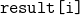
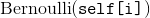
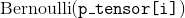
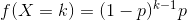
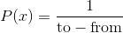
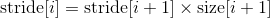

# torch.Tensor

A [`torch.Tensor`](#torch.Tensor "torch.Tensor") is a multi-dimensional matrix containing elements of a single data type.

Torch defines eight CPU tensor types and eight GPU tensor types:

| Data type | dtype | CPU tensor | GPU tensor |
| --- | --- | --- | --- |
| 32-bit floating point | `torch.float32` or `torch.float` | `torch.FloatTensor` | `torch.cuda.FloatTensor` |
| 64-bit floating point | `torch.float64` or `torch.double` | `torch.DoubleTensor` | `torch.cuda.DoubleTensor` |
| 16-bit floating point | `torch.float16` or `torch.half` | `torch.HalfTensor` | `torch.cuda.HalfTensor` |
| 8-bit integer (unsigned) | `torch.uint8` | [`torch.ByteTensor`](#torch.ByteTensor "torch.ByteTensor") | `torch.cuda.ByteTensor` |
| 8-bit integer (signed) | `torch.int8` | `torch.CharTensor` | `torch.cuda.CharTensor` |
| 16-bit integer (signed) | `torch.int16` or `torch.short` | `torch.ShortTensor` | `torch.cuda.ShortTensor` |
| 32-bit integer (signed) | `torch.int32` or `torch.int` | `torch.IntTensor` | `torch.cuda.IntTensor` |
| 64-bit integer (signed) | `torch.int64` or `torch.long` | `torch.LongTensor` | `torch.cuda.LongTensor` |

[`torch.Tensor`](#torch.Tensor "torch.Tensor") is an alias for the default tensor type (`torch.FloatTensor`).

A tensor can be constructed from a Python [`list`](https://docs.python.org/3/library/stdtypes.html#list "(in Python v3.7)") or sequence using the [`torch.tensor()`](torch.html#torch.tensor "torch.tensor") constructor:

```py
>>> torch.tensor([[1., -1.], [1., -1.]])
tensor([[ 1.0000, -1.0000],
 [ 1.0000, -1.0000]])
>>> torch.tensor(np.array([[1, 2, 3], [4, 5, 6]]))
tensor([[ 1,  2,  3],
 [ 4,  5,  6]])

```

Warning

[`torch.tensor()`](torch.html#torch.tensor "torch.tensor") always copies `data`. If you have a Tensor `data` and just want to change its `requires_grad` flag, use [`requires_grad_()`](#torch.Tensor.requires_grad_ "torch.Tensor.requires_grad_") or [`detach()`](autograd.html#torch.Tensor.detach "torch.Tensor.detach") to avoid a copy. If you have a numpy array and want to avoid a copy, use [`torch.as_tensor()`](torch.html#torch.as_tensor "torch.as_tensor").

A tensor of specific data type can be constructed by passing a [`torch.dtype`](tensor_attributes.html#torch.torch.dtype "torch.torch.dtype") and/or a [`torch.device`](tensor_attributes.html#torch.torch.device "torch.torch.device") to a constructor or tensor creation op:

```py
>>> torch.zeros([2, 4], dtype=torch.int32)
tensor([[ 0,  0,  0,  0],
 [ 0,  0,  0,  0]], dtype=torch.int32)
>>> cuda0 = torch.device('cuda:0')
>>> torch.ones([2, 4], dtype=torch.float64, device=cuda0)
tensor([[ 1.0000,  1.0000,  1.0000,  1.0000],
 [ 1.0000,  1.0000,  1.0000,  1.0000]], dtype=torch.float64, device='cuda:0')

```

The contents of a tensor can be accessed and modified using Python’s indexing and slicing notation:

```py
>>> x = torch.tensor([[1, 2, 3], [4, 5, 6]])
>>> print(x[1][2])
tensor(6)
>>> x[0][1] = 8
>>> print(x)
tensor([[ 1,  8,  3],
 [ 4,  5,  6]])

```

Use [`torch.Tensor.item()`](#torch.Tensor.item "torch.Tensor.item") to get a Python number from a tensor containing a single value:

```py
>>> x = torch.tensor([[1]])
>>> x
tensor([[ 1]])
>>> x.item()
1
>>> x = torch.tensor(2.5)
>>> x
tensor(2.5000)
>>> x.item()
2.5

```

A tensor can be created with `requires_grad=True` so that [`torch.autograd`](autograd.html#module-torch.autograd "torch.autograd") records operations on them for automatic differentiation.

```py
>>> x = torch.tensor([[1., -1.], [1., 1.]], requires_grad=True)
>>> out = x.pow(2).sum()
>>> out.backward()
>>> x.grad
tensor([[ 2.0000, -2.0000],
 [ 2.0000,  2.0000]])

```

Each tensor has an associated `torch.Storage`, which holds its data. The tensor class provides multi-dimensional, [strided](https://en.wikipedia.org/wiki/Stride_of_an_array) view of a storage and defines numeric operations on it.

Note

For more information on the [`torch.dtype`](tensor_attributes.html#torch.torch.dtype "torch.torch.dtype"), [`torch.device`](tensor_attributes.html#torch.torch.device "torch.torch.device"), and [`torch.layout`](tensor_attributes.html#torch.torch.layout "torch.torch.layout") attributes of a [`torch.Tensor`](#torch.Tensor "torch.Tensor"), see [Tensor Attributes](tensor_attributes.html#tensor-attributes-doc).

Note

Methods which mutate a tensor are marked with an underscore suffix. For example, `torch.FloatTensor.abs_()` computes the absolute value in-place and returns the modified tensor, while `torch.FloatTensor.abs()` computes the result in a new tensor.

Note

To change an existing tensor’s [`torch.device`](tensor_attributes.html#torch.torch.device "torch.torch.device") and/or [`torch.dtype`](tensor_attributes.html#torch.torch.dtype "torch.torch.dtype"), consider using [`to()`](#torch.Tensor.to "torch.Tensor.to") method on the tensor.

```py
class torch.Tensor
```

There are a few main ways to create a tensor, depending on your use case.

*   To create a tensor with pre-existing data, use [`torch.tensor()`](torch.html#torch.tensor "torch.tensor").
*   To create a tensor with specific size, use `torch.*` tensor creation ops (see [Creation Ops](torch.html#tensor-creation-ops)).
*   To create a tensor with the same size (and similar types) as another tensor, use `torch.*_like` tensor creation ops (see [Creation Ops](torch.html#tensor-creation-ops)).
*   To create a tensor with similar type but different size as another tensor, use `tensor.new_*` creation ops.

```py
new_tensor(data, dtype=None, device=None, requires_grad=False) → Tensor
```

Returns a new Tensor with `data` as the tensor data. By default, the returned Tensor has the same [`torch.dtype`](tensor_attributes.html#torch.torch.dtype "torch.torch.dtype") and [`torch.device`](tensor_attributes.html#torch.torch.device "torch.torch.device") as this tensor.

Warning

[`new_tensor()`](#torch.Tensor.new_tensor "torch.Tensor.new_tensor") always copies `data`. If you have a Tensor `data` and want to avoid a copy, use [`torch.Tensor.requires_grad_()`](#torch.Tensor.requires_grad_ "torch.Tensor.requires_grad_") or [`torch.Tensor.detach()`](autograd.html#torch.Tensor.detach "torch.Tensor.detach"). If you have a numpy array and want to avoid a copy, use [`torch.from_numpy()`](torch.html#torch.from_numpy "torch.from_numpy").

Warning

When data is a tensor &lt;cite&gt;x&lt;/cite&gt;, [`new_tensor()`](#torch.Tensor.new_tensor "torch.Tensor.new_tensor") reads out ‘the data’ from whatever it is passed, and constructs a leaf variable. Therefore `tensor.new_tensor(x)` is equivalent to `x.clone().detach()` and `tensor.new_tensor(x, requires_grad=True)` is equivalent to `x.clone().detach().requires_grad_(True)`. The equivalents using `clone()` and `detach()` are recommended.

| Parameters: | 

*   **data** (_array_like_) – The returned Tensor copies `data`.
*   **dtype** ([`torch.dtype`](tensor_attributes.html#torch.torch.dtype "torch.torch.dtype"), optional) – the desired type of returned tensor. Default: if None, same [`torch.dtype`](tensor_attributes.html#torch.torch.dtype "torch.torch.dtype") as this tensor.
*   **device** ([`torch.device`](tensor_attributes.html#torch.torch.device "torch.torch.device"), optional) – the desired device of returned tensor. Default: if None, same [`torch.device`](tensor_attributes.html#torch.torch.device "torch.torch.device") as this tensor.
*   **requires_grad** ([_bool_](https://docs.python.org/3/library/functions.html#bool "(in Python v3.7)")_,_ _optional_) – If autograd should record operations on the returned tensor. Default: `False`.

 |
| --- | --- |

Example:

```py
>>> tensor = torch.ones((2,), dtype=torch.int8)
>>> data = [[0, 1], [2, 3]]
>>> tensor.new_tensor(data)
tensor([[ 0,  1],
 [ 2,  3]], dtype=torch.int8)

```

```py
new_full(size, fill_value, dtype=None, device=None, requires_grad=False) → Tensor
```

Returns a Tensor of size [`size`](#torch.Tensor.size "torch.Tensor.size") filled with `fill_value`. By default, the returned Tensor has the same [`torch.dtype`](tensor_attributes.html#torch.torch.dtype "torch.torch.dtype") and [`torch.device`](tensor_attributes.html#torch.torch.device "torch.torch.device") as this tensor.

| Parameters: | 

*   **fill_value** (_scalar_) – the number to fill the output tensor with.
*   **dtype** ([`torch.dtype`](tensor_attributes.html#torch.torch.dtype "torch.torch.dtype"), optional) – the desired type of returned tensor. Default: if None, same [`torch.dtype`](tensor_attributes.html#torch.torch.dtype "torch.torch.dtype") as this tensor.
*   **device** ([`torch.device`](tensor_attributes.html#torch.torch.device "torch.torch.device"), optional) – the desired device of returned tensor. Default: if None, same [`torch.device`](tensor_attributes.html#torch.torch.device "torch.torch.device") as this tensor.
*   **requires_grad** ([_bool_](https://docs.python.org/3/library/functions.html#bool "(in Python v3.7)")_,_ _optional_) – If autograd should record operations on the returned tensor. Default: `False`.

 |
| --- | --- |

Example:

```py
>>> tensor = torch.ones((2,), dtype=torch.float64)
>>> tensor.new_full((3, 4), 3.141592)
tensor([[ 3.1416,  3.1416,  3.1416,  3.1416],
 [ 3.1416,  3.1416,  3.1416,  3.1416],
 [ 3.1416,  3.1416,  3.1416,  3.1416]], dtype=torch.float64)

```

```py
new_empty(size, dtype=None, device=None, requires_grad=False) → Tensor
```

Returns a Tensor of size [`size`](#torch.Tensor.size "torch.Tensor.size") filled with uninitialized data. By default, the returned Tensor has the same [`torch.dtype`](tensor_attributes.html#torch.torch.dtype "torch.torch.dtype") and [`torch.device`](tensor_attributes.html#torch.torch.device "torch.torch.device") as this tensor.

| Parameters: | 

*   **dtype** ([`torch.dtype`](tensor_attributes.html#torch.torch.dtype "torch.torch.dtype"), optional) – the desired type of returned tensor. Default: if None, same [`torch.dtype`](tensor_attributes.html#torch.torch.dtype "torch.torch.dtype") as this tensor.
*   **device** ([`torch.device`](tensor_attributes.html#torch.torch.device "torch.torch.device"), optional) – the desired device of returned tensor. Default: if None, same [`torch.device`](tensor_attributes.html#torch.torch.device "torch.torch.device") as this tensor.
*   **requires_grad** ([_bool_](https://docs.python.org/3/library/functions.html#bool "(in Python v3.7)")_,_ _optional_) – If autograd should record operations on the returned tensor. Default: `False`.

 |
| --- | --- |

Example:

```py
>>> tensor = torch.ones(())
>>> tensor.new_empty((2, 3))
tensor([[ 5.8182e-18,  4.5765e-41, -1.0545e+30],
 [ 3.0949e-41,  4.4842e-44,  0.0000e+00]])

```

```py
new_ones(size, dtype=None, device=None, requires_grad=False) → Tensor
```

Returns a Tensor of size [`size`](#torch.Tensor.size "torch.Tensor.size") filled with `1`. By default, the returned Tensor has the same [`torch.dtype`](tensor_attributes.html#torch.torch.dtype "torch.torch.dtype") and [`torch.device`](tensor_attributes.html#torch.torch.device "torch.torch.device") as this tensor.

| Parameters: | 

*   **size** (_int..._) – a list, tuple, or `torch.Size` of integers defining the shape of the output tensor.
*   **dtype** ([`torch.dtype`](tensor_attributes.html#torch.torch.dtype "torch.torch.dtype"), optional) – the desired type of returned tensor. Default: if None, same [`torch.dtype`](tensor_attributes.html#torch.torch.dtype "torch.torch.dtype") as this tensor.
*   **device** ([`torch.device`](tensor_attributes.html#torch.torch.device "torch.torch.device"), optional) – the desired device of returned tensor. Default: if None, same [`torch.device`](tensor_attributes.html#torch.torch.device "torch.torch.device") as this tensor.
*   **requires_grad** ([_bool_](https://docs.python.org/3/library/functions.html#bool "(in Python v3.7)")_,_ _optional_) – If autograd should record operations on the returned tensor. Default: `False`.

 |
| --- | --- |

Example:

```py
>>> tensor = torch.tensor((), dtype=torch.int32)
>>> tensor.new_ones((2, 3))
tensor([[ 1,  1,  1],
 [ 1,  1,  1]], dtype=torch.int32)

```

```py
new_zeros(size, dtype=None, device=None, requires_grad=False) → Tensor
```

Returns a Tensor of size [`size`](#torch.Tensor.size "torch.Tensor.size") filled with `0`. By default, the returned Tensor has the same [`torch.dtype`](tensor_attributes.html#torch.torch.dtype "torch.torch.dtype") and [`torch.device`](tensor_attributes.html#torch.torch.device "torch.torch.device") as this tensor.

| Parameters: | 

*   **size** (_int..._) – a list, tuple, or `torch.Size` of integers defining the shape of the output tensor.
*   **dtype** ([`torch.dtype`](tensor_attributes.html#torch.torch.dtype "torch.torch.dtype"), optional) – the desired type of returned tensor. Default: if None, same [`torch.dtype`](tensor_attributes.html#torch.torch.dtype "torch.torch.dtype") as this tensor.
*   **device** ([`torch.device`](tensor_attributes.html#torch.torch.device "torch.torch.device"), optional) – the desired device of returned tensor. Default: if None, same [`torch.device`](tensor_attributes.html#torch.torch.device "torch.torch.device") as this tensor.
*   **requires_grad** ([_bool_](https://docs.python.org/3/library/functions.html#bool "(in Python v3.7)")_,_ _optional_) – If autograd should record operations on the returned tensor. Default: `False`.

 |
| --- | --- |

Example:

```py
>>> tensor = torch.tensor((), dtype=torch.float64)
>>> tensor.new_zeros((2, 3))
tensor([[ 0.,  0.,  0.],
 [ 0.,  0.,  0.]], dtype=torch.float64)

```

```py
is_cuda
```

Is `True` if the Tensor is stored on the GPU, `False` otherwise.

```py
device
```

Is the [`torch.device`](tensor_attributes.html#torch.torch.device "torch.torch.device") where this Tensor is.

```py
abs() → Tensor
```

See [`torch.abs()`](torch.html#torch.abs "torch.abs")

```py
abs_() → Tensor
```

In-place version of [`abs()`](#torch.Tensor.abs "torch.Tensor.abs")

```py
acos() → Tensor
```

See [`torch.acos()`](torch.html#torch.acos "torch.acos")

```py
acos_() → Tensor
```

In-place version of [`acos()`](#torch.Tensor.acos "torch.Tensor.acos")

```py
add(value) → Tensor
```

add(value=1, other) -&gt; Tensor

See [`torch.add()`](torch.html#torch.add "torch.add")

```py
add_(value) → Tensor
```

add_(value=1, other) -&gt; Tensor

In-place version of [`add()`](#torch.Tensor.add "torch.Tensor.add")

```py
addbmm(beta=1, mat, alpha=1, batch1, batch2) → Tensor
```

See [`torch.addbmm()`](torch.html#torch.addbmm "torch.addbmm")

```py
addbmm_(beta=1, mat, alpha=1, batch1, batch2) → Tensor
```

In-place version of [`addbmm()`](#torch.Tensor.addbmm "torch.Tensor.addbmm")

```py
addcdiv(value=1, tensor1, tensor2) → Tensor
```

See [`torch.addcdiv()`](torch.html#torch.addcdiv "torch.addcdiv")

```py
addcdiv_(value=1, tensor1, tensor2) → Tensor
```

In-place version of [`addcdiv()`](#torch.Tensor.addcdiv "torch.Tensor.addcdiv")

```py
addcmul(value=1, tensor1, tensor2) → Tensor
```

See [`torch.addcmul()`](torch.html#torch.addcmul "torch.addcmul")

```py
addcmul_(value=1, tensor1, tensor2) → Tensor
```

In-place version of [`addcmul()`](#torch.Tensor.addcmul "torch.Tensor.addcmul")

```py
addmm(beta=1, mat, alpha=1, mat1, mat2) → Tensor
```

See [`torch.addmm()`](torch.html#torch.addmm "torch.addmm")

```py
addmm_(beta=1, mat, alpha=1, mat1, mat2) → Tensor
```

In-place version of [`addmm()`](#torch.Tensor.addmm "torch.Tensor.addmm")

```py
addmv(beta=1, tensor, alpha=1, mat, vec) → Tensor
```

See [`torch.addmv()`](torch.html#torch.addmv "torch.addmv")

```py
addmv_(beta=1, tensor, alpha=1, mat, vec) → Tensor
```

In-place version of [`addmv()`](#torch.Tensor.addmv "torch.Tensor.addmv")

```py
addr(beta=1, alpha=1, vec1, vec2) → Tensor
```

See [`torch.addr()`](torch.html#torch.addr "torch.addr")

```py
addr_(beta=1, alpha=1, vec1, vec2) → Tensor
```

In-place version of [`addr()`](#torch.Tensor.addr "torch.Tensor.addr")

```py
allclose(other, rtol=1e-05, atol=1e-08, equal_nan=False) → Tensor
```

See [`torch.allclose()`](torch.html#torch.allclose "torch.allclose")

```py
apply_(callable) → Tensor
```

Applies the function `callable` to each element in the tensor, replacing each element with the value returned by `callable`.

Note

This function only works with CPU tensors and should not be used in code sections that require high performance.

```py
argmax(dim=None, keepdim=False)
```

See [`torch.argmax()`](torch.html#torch.argmax "torch.argmax")

```py
argmin(dim=None, keepdim=False)
```

See [`torch.argmin()`](torch.html#torch.argmin "torch.argmin")

```py
asin() → Tensor
```

See [`torch.asin()`](torch.html#torch.asin "torch.asin")

```py
asin_() → Tensor
```

In-place version of [`asin()`](#torch.Tensor.asin "torch.Tensor.asin")

```py
atan() → Tensor
```

See [`torch.atan()`](torch.html#torch.atan "torch.atan")

```py
atan2(other) → Tensor
```

See [`torch.atan2()`](torch.html#torch.atan2 "torch.atan2")

```py
atan2_(other) → Tensor
```

In-place version of [`atan2()`](#torch.Tensor.atan2 "torch.Tensor.atan2")

```py
atan_() → Tensor
```

In-place version of [`atan()`](#torch.Tensor.atan "torch.Tensor.atan")

```py
baddbmm(beta=1, alpha=1, batch1, batch2) → Tensor
```

See [`torch.baddbmm()`](torch.html#torch.baddbmm "torch.baddbmm")

```py
baddbmm_(beta=1, alpha=1, batch1, batch2) → Tensor
```

In-place version of [`baddbmm()`](#torch.Tensor.baddbmm "torch.Tensor.baddbmm")

```py
bernoulli(*, generator=None) → Tensor
```

Returns a result tensor where each  is independently sampled from . `self` must have floating point `dtype`, and the result will have the same `dtype`.

See [`torch.bernoulli()`](torch.html#torch.bernoulli "torch.bernoulli")

```py
bernoulli_()
```

```py
bernoulli_(p=0.5, *, generator=None) → Tensor
```

Fills each location of `self` with an independent sample from . `self` can have integral `dtype`.

```py
bernoulli_(p_tensor, *, generator=None) → Tensor
```

`p_tensor` should be a tensor containing probabilities to be used for drawing the binary random number.

The  element of `self` tensor will be set to a value sampled from .

`self` can have integral `dtype`, but :attr`p_tensor` must have floating point `dtype`.

See also [`bernoulli()`](#torch.Tensor.bernoulli "torch.Tensor.bernoulli") and [`torch.bernoulli()`](torch.html#torch.bernoulli "torch.bernoulli")

```py
bmm(batch2) → Tensor
```

See [`torch.bmm()`](torch.html#torch.bmm "torch.bmm")

```py
byte() → Tensor
```

`self.byte()` is equivalent to `self.to(torch.uint8)`. See [`to()`](#torch.Tensor.to "torch.Tensor.to").

```py
btrifact(info=None, pivot=True)
```

See [`torch.btrifact()`](torch.html#torch.btrifact "torch.btrifact")

```py
btrifact_with_info(pivot=True) -> (Tensor, Tensor, Tensor)
```

See [`torch.btrifact_with_info()`](torch.html#torch.btrifact_with_info "torch.btrifact_with_info")

```py
btrisolve(LU_data, LU_pivots) → Tensor
```

See [`torch.btrisolve()`](torch.html#torch.btrisolve "torch.btrisolve")

```py
cauchy_(median=0, sigma=1, *, generator=None) → Tensor
```

Fills the tensor with numbers drawn from the Cauchy distribution:


```py
ceil() → Tensor
```

See [`torch.ceil()`](torch.html#torch.ceil "torch.ceil")

```py
ceil_() → Tensor
```

In-place version of [`ceil()`](#torch.Tensor.ceil "torch.Tensor.ceil")

```py
char() → Tensor
```

`self.char()` is equivalent to `self.to(torch.int8)`. See [`to()`](#torch.Tensor.to "torch.Tensor.to").

```py
cholesky(upper=False) → Tensor
```

See [`torch.cholesky()`](torch.html#torch.cholesky "torch.cholesky")

```py
chunk(chunks, dim=0) → List of Tensors
```

See [`torch.chunk()`](torch.html#torch.chunk "torch.chunk")

```py
clamp(min, max) → Tensor
```

See [`torch.clamp()`](torch.html#torch.clamp "torch.clamp")

```py
clamp_(min, max) → Tensor
```

In-place version of [`clamp()`](#torch.Tensor.clamp "torch.Tensor.clamp")

```py
clone() → Tensor
```

Returns a copy of the `self` tensor. The copy has the same size and data type as `self`.

Note

Unlike &lt;cite&gt;copy_()&lt;/cite&gt;, this function is recorded in the computation graph. Gradients propagating to the cloned tensor will propagate to the original tensor.

```py
contiguous() → Tensor
```

Returns a contiguous tensor containing the same data as `self` tensor. If `self` tensor is contiguous, this function returns the `self` tensor.

```py
copy_(src, non_blocking=False) → Tensor
```

Copies the elements from `src` into `self` tensor and returns `self`.

The `src` tensor must be [broadcastable](notes/broadcasting.html#broadcasting-semantics) with the `self` tensor. It may be of a different data type or reside on a different device.

| Parameters: | 

*   **src** ([_Tensor_](#torch.Tensor "torch.Tensor")) – the source tensor to copy from
*   **non_blocking** ([_bool_](https://docs.python.org/3/library/functions.html#bool "(in Python v3.7)")) – if `True` and this copy is between CPU and GPU, the copy may occur asynchronously with respect to the host. For other cases, this argument has no effect.

 |
| --- | --- |

```py
cos() → Tensor
```

See [`torch.cos()`](torch.html#torch.cos "torch.cos")

```py
cos_() → Tensor
```

In-place version of [`cos()`](#torch.Tensor.cos "torch.Tensor.cos")

```py
cosh() → Tensor
```

See [`torch.cosh()`](torch.html#torch.cosh "torch.cosh")

```py
cosh_() → Tensor
```

In-place version of [`cosh()`](#torch.Tensor.cosh "torch.Tensor.cosh")

```py
cpu() → Tensor
```

Returns a copy of this object in CPU memory.

If this object is already in CPU memory and on the correct device, then no copy is performed and the original object is returned.

```py
cross(other, dim=-1) → Tensor
```

See [`torch.cross()`](torch.html#torch.cross "torch.cross")

```py
cuda(device=None, non_blocking=False) → Tensor
```

Returns a copy of this object in CUDA memory.

If this object is already in CUDA memory and on the correct device, then no copy is performed and the original object is returned.

| Parameters: | 

*   **device** ([`torch.device`](tensor_attributes.html#torch.torch.device "torch.torch.device")) – The destination GPU device. Defaults to the current CUDA device.
*   **non_blocking** ([_bool_](https://docs.python.org/3/library/functions.html#bool "(in Python v3.7)")) – If `True` and the source is in pinned memory, the copy will be asynchronous with respect to the host. Otherwise, the argument has no effect. Default: `False`.

 |
| --- | --- |

```py
cumprod(dim, dtype=None) → Tensor
```

See [`torch.cumprod()`](torch.html#torch.cumprod "torch.cumprod")

```py
cumsum(dim, dtype=None) → Tensor
```

See [`torch.cumsum()`](torch.html#torch.cumsum "torch.cumsum")

```py
data_ptr() → int
```

Returns the address of the first element of `self` tensor.

```py
det() → Tensor
```

See [`torch.det()`](torch.html#torch.det "torch.det")

```py
diag(diagonal=0) → Tensor
```

See [`torch.diag()`](torch.html#torch.diag "torch.diag")

```py
diag_embed(offset=0, dim1=-2, dim2=-1) → Tensor
```

See [`torch.diag_embed()`](torch.html#torch.diag_embed "torch.diag_embed")

```py
dim() → int
```

Returns the number of dimensions of `self` tensor.

```py
dist(other, p=2) → Tensor
```

See [`torch.dist()`](torch.html#torch.dist "torch.dist")

```py
div(value) → Tensor
```

See [`torch.div()`](torch.html#torch.div "torch.div")

```py
div_(value) → Tensor
```

In-place version of [`div()`](#torch.Tensor.div "torch.Tensor.div")

```py
dot(tensor2) → Tensor
```

See [`torch.dot()`](torch.html#torch.dot "torch.dot")

```py
double() → Tensor
```

`self.double()` is equivalent to `self.to(torch.float64)`. See [`to()`](#torch.Tensor.to "torch.Tensor.to").

```py
eig(eigenvectors=False) -> (Tensor, Tensor)
```

See [`torch.eig()`](torch.html#torch.eig "torch.eig")

```py
element_size() → int
```

Returns the size in bytes of an individual element.

Example:

```py
>>> torch.tensor([]).element_size()
4
>>> torch.tensor([], dtype=torch.uint8).element_size()
1

```

```py
eq(other) → Tensor
```

See [`torch.eq()`](torch.html#torch.eq "torch.eq")

```py
eq_(other) → Tensor
```

In-place version of [`eq()`](#torch.Tensor.eq "torch.Tensor.eq")

```py
equal(other) → bool
```

See [`torch.equal()`](torch.html#torch.equal "torch.equal")

```py
erf() → Tensor
```

See [`torch.erf()`](torch.html#torch.erf "torch.erf")

```py
erf_() → Tensor
```

In-place version of [`erf()`](#torch.Tensor.erf "torch.Tensor.erf")

```py
erfc() → Tensor
```

See [`torch.erfc()`](torch.html#torch.erfc "torch.erfc")

```py
erfc_() → Tensor
```

In-place version of [`erfc()`](#torch.Tensor.erfc "torch.Tensor.erfc")

```py
erfinv() → Tensor
```

See [`torch.erfinv()`](torch.html#torch.erfinv "torch.erfinv")

```py
erfinv_() → Tensor
```

In-place version of [`erfinv()`](#torch.Tensor.erfinv "torch.Tensor.erfinv")

```py
exp() → Tensor
```

See [`torch.exp()`](torch.html#torch.exp "torch.exp")

```py
exp_() → Tensor
```

In-place version of [`exp()`](#torch.Tensor.exp "torch.Tensor.exp")

```py
expm1() → Tensor
```

See [`torch.expm1()`](torch.html#torch.expm1 "torch.expm1")

```py
expm1_() → Tensor
```

In-place version of [`expm1()`](#torch.Tensor.expm1 "torch.Tensor.expm1")

```py
expand(*sizes) → Tensor
```

Returns a new view of the `self` tensor with singleton dimensions expanded to a larger size.

Passing -1 as the size for a dimension means not changing the size of that dimension.

Tensor can be also expanded to a larger number of dimensions, and the new ones will be appended at the front. For the new dimensions, the size cannot be set to -1.

Expanding a tensor does not allocate new memory, but only creates a new view on the existing tensor where a dimension of size one is expanded to a larger size by setting the `stride` to 0\. Any dimension of size 1 can be expanded to an arbitrary value without allocating new memory.

| Parameters: | ***sizes** (_torch.Size_ _or_ _int..._) – the desired expanded size |
| --- | --- |

Example:

```py
>>> x = torch.tensor([[1], [2], [3]])
>>> x.size()
torch.Size([3, 1])
>>> x.expand(3, 4)
tensor([[ 1,  1,  1,  1],
 [ 2,  2,  2,  2],
 [ 3,  3,  3,  3]])
>>> x.expand(-1, 4)   # -1 means not changing the size of that dimension
tensor([[ 1,  1,  1,  1],
 [ 2,  2,  2,  2],
 [ 3,  3,  3,  3]])

```

```py
expand_as(other) → Tensor
```

Expand this tensor to the same size as `other`. `self.expand_as(other)` is equivalent to `self.expand(other.size())`.

Please see [`expand()`](#torch.Tensor.expand "torch.Tensor.expand") for more information about `expand`.

| Parameters: | **other** ([`torch.Tensor`](#torch.Tensor "torch.Tensor")) – The result tensor has the same size as `other`. |
| --- | --- |

```py
exponential_(lambd=1, *, generator=None) → Tensor
```

Fills `self` tensor with elements drawn from the exponential distribution:


```py
fill_(value) → Tensor
```

Fills `self` tensor with the specified value.

```py
flatten(input, start_dim=0, end_dim=-1) → Tensor
```

see [`torch.flatten()`](torch.html#torch.flatten "torch.flatten")

```py
flip(dims) → Tensor
```

See [`torch.flip()`](torch.html#torch.flip "torch.flip")

```py
float() → Tensor
```

`self.float()` is equivalent to `self.to(torch.float32)`. See [`to()`](#torch.Tensor.to "torch.Tensor.to").

```py
floor() → Tensor
```

See [`torch.floor()`](torch.html#torch.floor "torch.floor")

```py
floor_() → Tensor
```

In-place version of [`floor()`](#torch.Tensor.floor "torch.Tensor.floor")

```py
fmod(divisor) → Tensor
```

See [`torch.fmod()`](torch.html#torch.fmod "torch.fmod")

```py
fmod_(divisor) → Tensor
```

In-place version of [`fmod()`](#torch.Tensor.fmod "torch.Tensor.fmod")

```py
frac() → Tensor
```

See [`torch.frac()`](torch.html#torch.frac "torch.frac")

```py
frac_() → Tensor
```

In-place version of [`frac()`](#torch.Tensor.frac "torch.Tensor.frac")

```py
gather(dim, index) → Tensor
```

See [`torch.gather()`](torch.html#torch.gather "torch.gather")

```py
ge(other) → Tensor
```

See [`torch.ge()`](torch.html#torch.ge "torch.ge")

```py
ge_(other) → Tensor
```

In-place version of [`ge()`](#torch.Tensor.ge "torch.Tensor.ge")

```py
gels(A) → Tensor
```

See [`torch.gels()`](torch.html#torch.gels "torch.gels")

```py
geometric_(p, *, generator=None) → Tensor
```

Fills `self` tensor with elements drawn from the geometric distribution:



```py
geqrf() -> (Tensor, Tensor)
```

See [`torch.geqrf()`](torch.html#torch.geqrf "torch.geqrf")

```py
ger(vec2) → Tensor
```

See [`torch.ger()`](torch.html#torch.ger "torch.ger")

```py
gesv(A) → Tensor, Tensor
```

See [`torch.gesv()`](torch.html#torch.gesv "torch.gesv")

```py
get_device() -> Device ordinal (Integer)
```

For CUDA tensors, this function returns the device ordinal of the GPU on which the tensor resides. For CPU tensors, an error is thrown.

Example:

```py
>>> x = torch.randn(3, 4, 5, device='cuda:0')
>>> x.get_device()
0
>>> x.cpu().get_device()  # RuntimeError: get_device is not implemented for type torch.FloatTensor

```

```py
gt(other) → Tensor
```

See [`torch.gt()`](torch.html#torch.gt "torch.gt")

```py
gt_(other) → Tensor
```

In-place version of [`gt()`](#torch.Tensor.gt "torch.Tensor.gt")

```py
half() → Tensor
```

`self.half()` is equivalent to `self.to(torch.float16)`. See [`to()`](#torch.Tensor.to "torch.Tensor.to").

```py
histc(bins=100, min=0, max=0) → Tensor
```

See [`torch.histc()`](torch.html#torch.histc "torch.histc")

```py
index_add_(dim, index, tensor) → Tensor
```

Accumulate the elements of [`tensor`](torch.html#torch.tensor "torch.tensor") into the `self` tensor by adding to the indices in the order given in `index`. For example, if `dim == 0` and `index[i] == j`, then the `i`th row of [`tensor`](torch.html#torch.tensor "torch.tensor") is added to the `j`th row of `self`.

The [`dim`](#torch.Tensor.dim "torch.Tensor.dim")th dimension of [`tensor`](torch.html#torch.tensor "torch.tensor") must have the same size as the length of `index` (which must be a vector), and all other dimensions must match `self`, or an error will be raised.

Note

When using the CUDA backend, this operation may induce nondeterministic behaviour that is not easily switched off. Please see the notes on [Reproducibility](notes/randomness.html) for background.

| Parameters: | 

*   **dim** ([_int_](https://docs.python.org/3/library/functions.html#int "(in Python v3.7)")) – dimension along which to index
*   **index** (_LongTensor_) – indices of [`tensor`](torch.html#torch.tensor "torch.tensor") to select from
*   **tensor** ([_Tensor_](#torch.Tensor "torch.Tensor")) – the tensor containing values to add

 |
| --- | --- |

Example:

```py
>>> x = torch.ones(5, 3)
>>> t = torch.tensor([[1, 2, 3], [4, 5, 6], [7, 8, 9]], dtype=torch.float)
>>> index = torch.tensor([0, 4, 2])
>>> x.index_add_(0, index, t)
tensor([[  2.,   3.,   4.],
 [  1.,   1.,   1.],
 [  8.,   9.,  10.],
 [  1.,   1.,   1.],
 [  5.,   6.,   7.]])

```

```py
index_copy_(dim, index, tensor) → Tensor
```

Copies the elements of [`tensor`](torch.html#torch.tensor "torch.tensor") into the `self` tensor by selecting the indices in the order given in `index`. For example, if `dim == 0` and `index[i] == j`, then the `i`th row of [`tensor`](torch.html#torch.tensor "torch.tensor") is copied to the `j`th row of `self`.

The [`dim`](#torch.Tensor.dim "torch.Tensor.dim")th dimension of [`tensor`](torch.html#torch.tensor "torch.tensor") must have the same size as the length of `index` (which must be a vector), and all other dimensions must match `self`, or an error will be raised.

| Parameters: | 

*   **dim** ([_int_](https://docs.python.org/3/library/functions.html#int "(in Python v3.7)")) – dimension along which to index
*   **index** (_LongTensor_) – indices of [`tensor`](torch.html#torch.tensor "torch.tensor") to select from
*   **tensor** ([_Tensor_](#torch.Tensor "torch.Tensor")) – the tensor containing values to copy

 |
| --- | --- |

Example:

```py
>>> x = torch.zeros(5, 3)
>>> t = torch.tensor([[1, 2, 3], [4, 5, 6], [7, 8, 9]], dtype=torch.float)
>>> index = torch.tensor([0, 4, 2])
>>> x.index_copy_(0, index, t)
tensor([[ 1.,  2.,  3.],
 [ 0.,  0.,  0.],
 [ 7.,  8.,  9.],
 [ 0.,  0.,  0.],
 [ 4.,  5.,  6.]])

```

```py
index_fill_(dim, index, val) → Tensor
```

Fills the elements of the `self` tensor with value `val` by selecting the indices in the order given in `index`.

| Parameters: | 

*   **dim** ([_int_](https://docs.python.org/3/library/functions.html#int "(in Python v3.7)")) – dimension along which to index
*   **index** (_LongTensor_) – indices of `self` tensor to fill in
*   **val** ([_float_](https://docs.python.org/3/library/functions.html#float "(in Python v3.7)")) – the value to fill with

 |
| --- | --- |

```py
Example::
```

```py
>>> x = torch.tensor([[1, 2, 3], [4, 5, 6], [7, 8, 9]], dtype=torch.float)
>>> index = torch.tensor([0, 2])
>>> x.index_fill_(1, index, -1)
tensor([[-1.,  2., -1.],
 [-1.,  5., -1.],
 [-1.,  8., -1.]])

```

```py
index_put_(indices, value, accumulate=False) → Tensor
```

Puts values from the tensor `value` into the tensor `self` using the indices specified in `indices` (which is a tuple of Tensors). The expression `tensor.index_put_(indices, value)` is equivalent to `tensor[indices] = value`. Returns `self`.

If `accumulate` is `True`, the elements in [`tensor`](torch.html#torch.tensor "torch.tensor") are added to `self`. If accumulate is `False`, the behavior is undefined if indices contain duplicate elements.

| Parameters: | 

*   **indices** (_tuple of LongTensor_) – tensors used to index into &lt;cite&gt;self&lt;/cite&gt;.
*   **value** ([_Tensor_](#torch.Tensor "torch.Tensor")) – tensor of same dtype as &lt;cite&gt;self&lt;/cite&gt;.
*   **accumulate** ([_bool_](https://docs.python.org/3/library/functions.html#bool "(in Python v3.7)")) – whether to accumulate into self

 |
| --- | --- |

```py
index_select(dim, index) → Tensor
```

See [`torch.index_select()`](torch.html#torch.index_select "torch.index_select")

```py
int() → Tensor
```

`self.int()` is equivalent to `self.to(torch.int32)`. See [`to()`](#torch.Tensor.to "torch.Tensor.to").

```py
inverse() → Tensor
```

See [`torch.inverse()`](torch.html#torch.inverse "torch.inverse")

```py
is_contiguous() → bool
```

Returns True if `self` tensor is contiguous in memory in C order.

```py
is_pinned()
```

Returns true if this tensor resides in pinned memory

```py
is_set_to(tensor) → bool
```

Returns True if this object refers to the same `THTensor` object from the Torch C API as the given tensor.

```py
is_signed()
```

```py
item() → number
```

Returns the value of this tensor as a standard Python number. This only works for tensors with one element. For other cases, see [`tolist()`](#torch.Tensor.tolist "torch.Tensor.tolist").

This operation is not differentiable.

Example:

```py
>>> x = torch.tensor([1.0])
>>> x.item()
1.0

```

```py
kthvalue(k, dim=None, keepdim=False) -> (Tensor, LongTensor)
```

See [`torch.kthvalue()`](torch.html#torch.kthvalue "torch.kthvalue")

```py
le(other) → Tensor
```

See [`torch.le()`](torch.html#torch.le "torch.le")

```py
le_(other) → Tensor
```

In-place version of [`le()`](#torch.Tensor.le "torch.Tensor.le")

```py
lerp(start, end, weight) → Tensor
```

See [`torch.lerp()`](torch.html#torch.lerp "torch.lerp")

```py
lerp_(start, end, weight) → Tensor
```

In-place version of [`lerp()`](#torch.Tensor.lerp "torch.Tensor.lerp")

```py
log() → Tensor
```

See [`torch.log()`](torch.html#torch.log "torch.log")

```py
log_() → Tensor
```

In-place version of [`log()`](#torch.Tensor.log "torch.Tensor.log")

```py
logdet() → Tensor
```

See [`torch.logdet()`](torch.html#torch.logdet "torch.logdet")

```py
log10() → Tensor
```

See [`torch.log10()`](torch.html#torch.log10 "torch.log10")

```py
log10_() → Tensor
```

In-place version of [`log10()`](#torch.Tensor.log10 "torch.Tensor.log10")

```py
log1p() → Tensor
```

See [`torch.log1p()`](torch.html#torch.log1p "torch.log1p")

```py
log1p_() → Tensor
```

In-place version of [`log1p()`](#torch.Tensor.log1p "torch.Tensor.log1p")

```py
log2() → Tensor
```

See [`torch.log2()`](torch.html#torch.log2 "torch.log2")

```py
log2_() → Tensor
```

In-place version of [`log2()`](#torch.Tensor.log2 "torch.Tensor.log2")

```py
log_normal_(mean=1, std=2, *, generator=None)
```

Fills `self` tensor with numbers samples from the log-normal distribution parameterized by the given mean  and standard deviation . Note that [`mean`](torch.html#torch.mean "torch.mean") and [`std`](torch.html#torch.std "torch.std") are the mean and standard deviation of the underlying normal distribution, and not of the returned distribution:


```py
logsumexp(dim, keepdim=False) → Tensor
```

See [`torch.logsumexp()`](torch.html#torch.logsumexp "torch.logsumexp")

```py
long() → Tensor
```

`self.long()` is equivalent to `self.to(torch.int64)`. See [`to()`](#torch.Tensor.to "torch.Tensor.to").

```py
lt(other) → Tensor
```

See [`torch.lt()`](torch.html#torch.lt "torch.lt")

```py
lt_(other) → Tensor
```

In-place version of [`lt()`](#torch.Tensor.lt "torch.Tensor.lt")

```py
map_(tensor, callable)
```

Applies `callable` for each element in `self` tensor and the given [`tensor`](torch.html#torch.tensor "torch.tensor") and stores the results in `self` tensor. `self` tensor and the given [`tensor`](torch.html#torch.tensor "torch.tensor") must be [broadcastable](notes/broadcasting.html#broadcasting-semantics).

The `callable` should have the signature:

```py
def callable(a, b) -> number

```

```py
masked_scatter_(mask, source)
```

Copies elements from `source` into `self` tensor at positions where the `mask` is one. The shape of `mask` must be [broadcastable](notes/broadcasting.html#broadcasting-semantics) with the shape of the underlying tensor. The `source` should have at least as many elements as the number of ones in `mask`

| Parameters: | 

*   **mask** ([_ByteTensor_](#torch.ByteTensor "torch.ByteTensor")) – the binary mask
*   **source** ([_Tensor_](#torch.Tensor "torch.Tensor")) – the tensor to copy from

 |
| --- | --- |

Note

The `mask` operates on the `self` tensor, not on the given `source` tensor.

```py
masked_fill_(mask, value)
```

Fills elements of `self` tensor with `value` where `mask` is one. The shape of `mask` must be [broadcastable](notes/broadcasting.html#broadcasting-semantics) with the shape of the underlying tensor.

| Parameters: | 

*   **mask** ([_ByteTensor_](#torch.ByteTensor "torch.ByteTensor")) – the binary mask
*   **value** ([_float_](https://docs.python.org/3/library/functions.html#float "(in Python v3.7)")) – the value to fill in with

 |
| --- | --- |

```py
masked_select(mask) → Tensor
```

See [`torch.masked_select()`](torch.html#torch.masked_select "torch.masked_select")

```py
matmul(tensor2) → Tensor
```

See [`torch.matmul()`](torch.html#torch.matmul "torch.matmul")

```py
matrix_power(n) → Tensor
```

See [`torch.matrix_power()`](torch.html#torch.matrix_power "torch.matrix_power")

```py
max(dim=None, keepdim=False) -> Tensor or (Tensor, Tensor)
```

See [`torch.max()`](torch.html#torch.max "torch.max")

```py
mean(dim=None, keepdim=False) -> Tensor or (Tensor, Tensor)
```

See [`torch.mean()`](torch.html#torch.mean "torch.mean")

```py
median(dim=None, keepdim=False) -> (Tensor, LongTensor)
```

See [`torch.median()`](torch.html#torch.median "torch.median")

```py
min(dim=None, keepdim=False) -> Tensor or (Tensor, Tensor)
```

See [`torch.min()`](torch.html#torch.min "torch.min")

```py
mm(mat2) → Tensor
```

See [`torch.mm()`](torch.html#torch.mm "torch.mm")

```py
mode(dim=None, keepdim=False) -> (Tensor, LongTensor)
```

See [`torch.mode()`](torch.html#torch.mode "torch.mode")

```py
mul(value) → Tensor
```

See [`torch.mul()`](torch.html#torch.mul "torch.mul")

```py
mul_(value)
```

In-place version of [`mul()`](#torch.Tensor.mul "torch.Tensor.mul")

```py
multinomial(num_samples, replacement=False, *, generator=None) → Tensor
```

See [`torch.multinomial()`](torch.html#torch.multinomial "torch.multinomial")

```py
mv(vec) → Tensor
```

See [`torch.mv()`](torch.html#torch.mv "torch.mv")

```py
mvlgamma(p) → Tensor
```

See [`torch.mvlgamma()`](torch.html#torch.mvlgamma "torch.mvlgamma")

```py
mvlgamma_(p) → Tensor
```

In-place version of [`mvlgamma()`](#torch.Tensor.mvlgamma "torch.Tensor.mvlgamma")

```py
narrow(dimension, start, length) → Tensor
```

See [`torch.narrow()`](torch.html#torch.narrow "torch.narrow")

Example:

```py
>>> x = torch.tensor([[1, 2, 3], [4, 5, 6], [7, 8, 9]])
>>> x.narrow(0, 0, 2)
tensor([[ 1,  2,  3],
 [ 4,  5,  6]])
>>> x.narrow(1, 1, 2)
tensor([[ 2,  3],
 [ 5,  6],
 [ 8,  9]])

```

```py
ndimension() → int
```

Alias for [`dim()`](#torch.Tensor.dim "torch.Tensor.dim")

```py
ne(other) → Tensor
```

See [`torch.ne()`](torch.html#torch.ne "torch.ne")

```py
ne_(other) → Tensor
```

In-place version of [`ne()`](#torch.Tensor.ne "torch.Tensor.ne")

```py
neg() → Tensor
```

See [`torch.neg()`](torch.html#torch.neg "torch.neg")

```py
neg_() → Tensor
```

In-place version of [`neg()`](#torch.Tensor.neg "torch.Tensor.neg")

```py
nelement() → int
```

Alias for [`numel()`](#torch.Tensor.numel "torch.Tensor.numel")

```py
nonzero() → LongTensor
```

See [`torch.nonzero()`](torch.html#torch.nonzero "torch.nonzero")

```py
norm(p='fro', dim=None, keepdim=False)
```

See :func: &lt;cite&gt;torch.norm&lt;/cite&gt;

```py
normal_(mean=0, std=1, *, generator=None) → Tensor
```

Fills `self` tensor with elements samples from the normal distribution parameterized by [`mean`](torch.html#torch.mean "torch.mean") and [`std`](torch.html#torch.std "torch.std").

```py
numel() → int
```

See [`torch.numel()`](torch.html#torch.numel "torch.numel")

```py
numpy() → numpy.ndarray
```

Returns `self` tensor as a NumPy `ndarray`. This tensor and the returned `ndarray` share the same underlying storage. Changes to `self` tensor will be reflected in the `ndarray` and vice versa.

```py
orgqr(input2) → Tensor
```

See [`torch.orgqr()`](torch.html#torch.orgqr "torch.orgqr")

```py
ormqr(input2, input3, left=True, transpose=False) → Tensor
```

See [`torch.ormqr()`](torch.html#torch.ormqr "torch.ormqr")

```py
permute(*dims) → Tensor
```

Permute the dimensions of this tensor.

| Parameters: | ***dims** (_int..._) – The desired ordering of dimensions |
| --- | --- |

Example

```py
>>> x = torch.randn(2, 3, 5)
>>> x.size()
torch.Size([2, 3, 5])
>>> x.permute(2, 0, 1).size()
torch.Size([5, 2, 3])

```

```py
pin_memory()
```

```py
pinverse() → Tensor
```

See [`torch.pinverse()`](torch.html#torch.pinverse "torch.pinverse")

```py
potrf(upper=True)
```

See [`torch.cholesky()`](torch.html#torch.cholesky "torch.cholesky")

```py
potri(upper=True) → Tensor
```

See [`torch.potri()`](torch.html#torch.potri "torch.potri")

```py
potrs(input2, upper=True) → Tensor
```

See [`torch.potrs()`](torch.html#torch.potrs "torch.potrs")

```py
pow(exponent) → Tensor
```

See [`torch.pow()`](torch.html#torch.pow "torch.pow")

```py
pow_(exponent) → Tensor
```

In-place version of [`pow()`](#torch.Tensor.pow "torch.Tensor.pow")

```py
prod(dim=None, keepdim=False, dtype=None) → Tensor
```

See [`torch.prod()`](torch.html#torch.prod "torch.prod")

```py
pstrf(upper=True, tol=-1) -> (Tensor, IntTensor)
```

See [`torch.pstrf()`](torch.html#torch.pstrf "torch.pstrf")

```py
put_(indices, tensor, accumulate=False) → Tensor
```

Copies the elements from [`tensor`](torch.html#torch.tensor "torch.tensor") into the positions specified by indices. For the purpose of indexing, the `self` tensor is treated as if it were a 1-D tensor.

If `accumulate` is `True`, the elements in [`tensor`](torch.html#torch.tensor "torch.tensor") are added to `self`. If accumulate is `False`, the behavior is undefined if indices contain duplicate elements.

| Parameters: | 

*   **indices** (_LongTensor_) – the indices into self
*   **tensor** ([_Tensor_](#torch.Tensor "torch.Tensor")) – the tensor containing values to copy from
*   **accumulate** ([_bool_](https://docs.python.org/3/library/functions.html#bool "(in Python v3.7)")) – whether to accumulate into self

 |
| --- | --- |

Example:

```py
>>> src = torch.tensor([[4, 3, 5],
 [6, 7, 8]])
>>> src.put_(torch.tensor([1, 3]), torch.tensor([9, 10]))
tensor([[  4,   9,   5],
 [ 10,   7,   8]])

```

```py
qr() -> (Tensor, Tensor)
```

See [`torch.qr()`](torch.html#torch.qr "torch.qr")

```py
random_(from=0, to=None, *, generator=None) → Tensor
```

Fills `self` tensor with numbers sampled from the discrete uniform distribution over `[from, to - 1]`. If not specified, the values are usually only bounded by `self` tensor’s data type. However, for floating point types, if unspecified, range will be `[0, 2^mantissa]` to ensure that every value is representable. For example, &lt;cite&gt;torch.tensor(1, dtype=torch.double).random_()&lt;/cite&gt; will be uniform in `[0, 2^53]`.

```py
reciprocal() → Tensor
```

See [`torch.reciprocal()`](torch.html#torch.reciprocal "torch.reciprocal")

```py
reciprocal_() → Tensor
```

In-place version of [`reciprocal()`](#torch.Tensor.reciprocal "torch.Tensor.reciprocal")

```py
remainder(divisor) → Tensor
```

See [`torch.remainder()`](torch.html#torch.remainder "torch.remainder")

```py
remainder_(divisor) → Tensor
```

In-place version of [`remainder()`](#torch.Tensor.remainder "torch.Tensor.remainder")

```py
renorm(p, dim, maxnorm) → Tensor
```

See [`torch.renorm()`](torch.html#torch.renorm "torch.renorm")

```py
renorm_(p, dim, maxnorm) → Tensor
```

In-place version of [`renorm()`](#torch.Tensor.renorm "torch.Tensor.renorm")

```py
repeat(*sizes) → Tensor
```

Repeats this tensor along the specified dimensions.

Unlike [`expand()`](#torch.Tensor.expand "torch.Tensor.expand"), this function copies the tensor’s data.

Warning

`torch.repeat()` behaves differently from [numpy.repeat](https://docs.scipy.org/doc/numpy/reference/generated/numpy.repeat.html), but is more similar to [numpy.tile](https://docs.scipy.org/doc/numpy/reference/generated/numpy.tile.html).

| Parameters: | **sizes** (_torch.Size_ _or_ _int..._) – The number of times to repeat this tensor along each dimension |
| --- | --- |

Example:

```py
>>> x = torch.tensor([1, 2, 3])
>>> x.repeat(4, 2)
tensor([[ 1,  2,  3,  1,  2,  3],
 [ 1,  2,  3,  1,  2,  3],
 [ 1,  2,  3,  1,  2,  3],
 [ 1,  2,  3,  1,  2,  3]])
>>> x.repeat(4, 2, 1).size()
torch.Size([4, 2, 3])

```

```py
requires_grad_(requires_grad=True) → Tensor
```

Change if autograd should record operations on this tensor: sets this tensor’s [`requires_grad`](autograd.html#torch.Tensor.requires_grad "torch.Tensor.requires_grad") attribute in-place. Returns this tensor.

`require_grad_()`’s main use case is to tell autograd to begin recording operations on a Tensor `tensor`. If `tensor` has `requires_grad=False` (because it was obtained through a DataLoader, or required preprocessing or initialization), `tensor.requires_grad_()` makes it so that autograd will begin to record operations on `tensor`.

| Parameters: | **requires_grad** ([_bool_](https://docs.python.org/3/library/functions.html#bool "(in Python v3.7)")) – If autograd should record operations on this tensor. Default: `True`. |
| --- | --- |

Example:

```py
>>> # Let's say we want to preprocess some saved weights and use
>>> # the result as new weights.
>>> saved_weights = [0.1, 0.2, 0.3, 0.25]
>>> loaded_weights = torch.tensor(saved_weights)
>>> weights = preprocess(loaded_weights)  # some function
>>> weights
tensor([-0.5503,  0.4926, -2.1158, -0.8303])

>>> # Now, start to record operations done to weights
>>> weights.requires_grad_()
>>> out = weights.pow(2).sum()
>>> out.backward()
>>> weights.grad
tensor([-1.1007,  0.9853, -4.2316, -1.6606])

```

```py
reshape(*shape) → Tensor
```

Returns a tensor with the same data and number of elements as `self` but with the specified shape. This method returns a view if `shape` is compatible with the current shape. See [`torch.Tensor.view()`](#torch.Tensor.view "torch.Tensor.view") on when it is possible to return a view.

See [`torch.reshape()`](torch.html#torch.reshape "torch.reshape")

| Parameters: | **shape** (_tuple of python:ints_ _or_ _int..._) – the desired shape |
| --- | --- |

```py
reshape_as(other) → Tensor
```

Returns this tensor as the same shape as `other`. `self.reshape_as(other)` is equivalent to `self.reshape(other.sizes())`. This method returns a view if `other.sizes()` is compatible with the current shape. See [`torch.Tensor.view()`](#torch.Tensor.view "torch.Tensor.view") on when it is possible to return a view.

Please see [`reshape()`](torch.html#torch.reshape "torch.reshape") for more information about `reshape`.

| Parameters: | **other** ([`torch.Tensor`](#torch.Tensor "torch.Tensor")) – The result tensor has the same shape as `other`. |
| --- | --- |

```py
resize_(*sizes) → Tensor
```

Resizes `self` tensor to the specified size. If the number of elements is larger than the current storage size, then the underlying storage is resized to fit the new number of elements. If the number of elements is smaller, the underlying storage is not changed. Existing elements are preserved but any new memory is uninitialized.

Warning

This is a low-level method. The storage is reinterpreted as C-contiguous, ignoring the current strides (unless the target size equals the current size, in which case the tensor is left unchanged). For most purposes, you will instead want to use [`view()`](#torch.Tensor.view "torch.Tensor.view"), which checks for contiguity, or [`reshape()`](#torch.Tensor.reshape "torch.Tensor.reshape"), which copies data if needed. To change the size in-place with custom strides, see [`set_()`](#torch.Tensor.set_ "torch.Tensor.set_").

| Parameters: | **sizes** (_torch.Size_ _or_ _int..._) – the desired size |
| --- | --- |

Example:

```py
>>> x = torch.tensor([[1, 2], [3, 4], [5, 6]])
>>> x.resize_(2, 2)
tensor([[ 1,  2],
 [ 3,  4]])

```

```py
resize_as_(tensor) → Tensor
```

Resizes the `self` tensor to be the same size as the specified [`tensor`](torch.html#torch.tensor "torch.tensor"). This is equivalent to `self.resize_(tensor.size())`.

```py
round() → Tensor
```

See [`torch.round()`](torch.html#torch.round "torch.round")

```py
round_() → Tensor
```

In-place version of [`round()`](#torch.Tensor.round "torch.Tensor.round")

```py
rsqrt() → Tensor
```

See [`torch.rsqrt()`](torch.html#torch.rsqrt "torch.rsqrt")

```py
rsqrt_() → Tensor
```

In-place version of [`rsqrt()`](#torch.Tensor.rsqrt "torch.Tensor.rsqrt")

```py
scatter_(dim, index, src) → Tensor
```

Writes all values from the tensor `src` into `self` at the indices specified in the `index` tensor. For each value in `src`, its output index is specified by its index in `src` for `dimension != dim` and by the corresponding value in `index` for `dimension = dim`.

For a 3-D tensor, `self` is updated as:

```py
self[index[i][j][k]][j][k] = src[i][j][k]  # if dim == 0
self[i][index[i][j][k]][k] = src[i][j][k]  # if dim == 1
self[i][j][index[i][j][k]] = src[i][j][k]  # if dim == 2

```

This is the reverse operation of the manner described in [`gather()`](#torch.Tensor.gather "torch.Tensor.gather").

`self`, `index` and `src` (if it is a Tensor) should have same number of dimensions. It is also required that `index.size(d) &lt;= src.size(d)` for all dimensions `d`, and that `index.size(d) &lt;= self.size(d)` for all dimensions `d != dim`.

Moreover, as for [`gather()`](#torch.Tensor.gather "torch.Tensor.gather"), the values of `index` must be between `0` and `self.size(dim) - 1` inclusive, and all values in a row along the specified dimension [`dim`](#torch.Tensor.dim "torch.Tensor.dim") must be unique.

| Parameters: | 

*   **dim** ([_int_](https://docs.python.org/3/library/functions.html#int "(in Python v3.7)")) – the axis along which to index
*   **index** (_LongTensor_) – the indices of elements to scatter, can be either empty or the same size of src. When empty, the operation returns identity
*   **src** ([_Tensor_](#torch.Tensor "torch.Tensor") _or_ [_float_](https://docs.python.org/3/library/functions.html#float "(in Python v3.7)")) – the source element(s) to scatter

 |
| --- | --- |

Example:

```py
>>> x = torch.rand(2, 5)
>>> x
tensor([[ 0.3992,  0.2908,  0.9044,  0.4850,  0.6004],
 [ 0.5735,  0.9006,  0.6797,  0.4152,  0.1732]])
>>> torch.zeros(3, 5).scatter_(0, torch.tensor([[0, 1, 2, 0, 0], [2, 0, 0, 1, 2]]), x)
tensor([[ 0.3992,  0.9006,  0.6797,  0.4850,  0.6004],
 [ 0.0000,  0.2908,  0.0000,  0.4152,  0.0000],
 [ 0.5735,  0.0000,  0.9044,  0.0000,  0.1732]])

>>> z = torch.zeros(2, 4).scatter_(1, torch.tensor([[2], [3]]), 1.23)
>>> z
tensor([[ 0.0000,  0.0000,  1.2300,  0.0000],
 [ 0.0000,  0.0000,  0.0000,  1.2300]])

```

```py
scatter_add_(dim, index, other) → Tensor
```

Adds all values from the tensor `other` into `self` at the indices specified in the `index` tensor in a similar fashion as [`scatter_()`](#torch.Tensor.scatter_ "torch.Tensor.scatter_"). For each value in `other`, it is added to an index in `self` which is specified by its index in `other` for `dimension != dim` and by the corresponding value in `index` for `dimension = dim`.

For a 3-D tensor, `self` is updated as:

```py
self[index[i][j][k]][j][k] += other[i][j][k]  # if dim == 0
self[i][index[i][j][k]][k] += other[i][j][k]  # if dim == 1
self[i][j][index[i][j][k]] += other[i][j][k]  # if dim == 2

```

`self`, `index` and `other` should have same number of dimensions. It is also required that `index.size(d) &lt;= other.size(d)` for all dimensions `d`, and that `index.size(d) &lt;= self.size(d)` for all dimensions `d != dim`.

Moreover, as for [`gather()`](#torch.Tensor.gather "torch.Tensor.gather"), the values of `index` must be between `0` and `self.size(dim) - 1` inclusive, and all values in a row along the specified dimension [`dim`](#torch.Tensor.dim "torch.Tensor.dim") must be unique.

Note

When using the CUDA backend, this operation may induce nondeterministic behaviour that is not easily switched off. Please see the notes on [Reproducibility](notes/randomness.html) for background.

| Parameters: | 

*   **dim** ([_int_](https://docs.python.org/3/library/functions.html#int "(in Python v3.7)")) – the axis along which to index
*   **index** (_LongTensor_) – the indices of elements to scatter and add, can be either empty or the same size of src. When empty, the operation returns identity.
*   **other** ([_Tensor_](#torch.Tensor "torch.Tensor")) – the source elements to scatter and add

 |
| --- | --- |

Example:

```py
>>> x = torch.rand(2, 5)
>>> x
tensor([[0.7404, 0.0427, 0.6480, 0.3806, 0.8328],
 [0.7953, 0.2009, 0.9154, 0.6782, 0.9620]])
>>> torch.ones(3, 5).scatter_add_(0, torch.tensor([[0, 1, 2, 0, 0], [2, 0, 0, 1, 2]]), x)
tensor([[1.7404, 1.2009, 1.9154, 1.3806, 1.8328],
 [1.0000, 1.0427, 1.0000, 1.6782, 1.0000],
 [1.7953, 1.0000, 1.6480, 1.0000, 1.9620]])

```

```py
select(dim, index) → Tensor
```

Slices the `self` tensor along the selected dimension at the given index. This function returns a tensor with the given dimension removed.

| Parameters: | 

*   **dim** ([_int_](https://docs.python.org/3/library/functions.html#int "(in Python v3.7)")) – the dimension to slice
*   **index** ([_int_](https://docs.python.org/3/library/functions.html#int "(in Python v3.7)")) – the index to select with

 |
| --- | --- |

Note

[`select()`](#torch.Tensor.select "torch.Tensor.select") is equivalent to slicing. For example, `tensor.select(0, index)` is equivalent to `tensor[index]` and `tensor.select(2, index)` is equivalent to `tensor[:,:,index]`.

```py
set_(source=None, storage_offset=0, size=None, stride=None) → Tensor
```

Sets the underlying storage, size, and strides. If `source` is a tensor, `self` tensor will share the same storage and have the same size and strides as `source`. Changes to elements in one tensor will be reflected in the other.

If `source` is a `Storage`, the method sets the underlying storage, offset, size, and stride.

| Parameters: | 

*   **source** ([_Tensor_](#torch.Tensor "torch.Tensor") _or_ _Storage_) – the tensor or storage to use
*   **storage_offset** ([_int_](https://docs.python.org/3/library/functions.html#int "(in Python v3.7)")_,_ _optional_) – the offset in the storage
*   **size** (_torch.Size__,_ _optional_) – the desired size. Defaults to the size of the source.
*   **stride** ([_tuple_](https://docs.python.org/3/library/stdtypes.html#tuple "(in Python v3.7)")_,_ _optional_) – the desired stride. Defaults to C-contiguous strides.

 |
| --- | --- |

```py
share_memory_()
```

Moves the underlying storage to shared memory.

This is a no-op if the underlying storage is already in shared memory and for CUDA tensors. Tensors in shared memory cannot be resized.

```py
short() → Tensor
```

`self.short()` is equivalent to `self.to(torch.int16)`. See [`to()`](#torch.Tensor.to "torch.Tensor.to").

```py
sigmoid() → Tensor
```

See [`torch.sigmoid()`](torch.html#torch.sigmoid "torch.sigmoid")

```py
sigmoid_() → Tensor
```

In-place version of [`sigmoid()`](#torch.Tensor.sigmoid "torch.Tensor.sigmoid")

```py
sign() → Tensor
```

See [`torch.sign()`](torch.html#torch.sign "torch.sign")

```py
sign_() → Tensor
```

In-place version of [`sign()`](#torch.Tensor.sign "torch.Tensor.sign")

```py
sin() → Tensor
```

See [`torch.sin()`](torch.html#torch.sin "torch.sin")

```py
sin_() → Tensor
```

In-place version of [`sin()`](#torch.Tensor.sin "torch.Tensor.sin")

```py
sinh() → Tensor
```

See [`torch.sinh()`](torch.html#torch.sinh "torch.sinh")

```py
sinh_() → Tensor
```

In-place version of [`sinh()`](#torch.Tensor.sinh "torch.Tensor.sinh")

```py
size() → torch.Size
```

Returns the size of the `self` tensor. The returned value is a subclass of [`tuple`](https://docs.python.org/3/library/stdtypes.html#tuple "(in Python v3.7)").

Example:

```py
>>> torch.empty(3, 4, 5).size()
torch.Size([3, 4, 5])

```

```py
slogdet() -> (Tensor, Tensor)
```

See [`torch.slogdet()`](torch.html#torch.slogdet "torch.slogdet")

```py
sort(dim=None, descending=False) -> (Tensor, LongTensor)
```

See [`torch.sort()`](torch.html#torch.sort "torch.sort")

```py
split(split_size, dim=0)
```

See [`torch.split()`](torch.html#torch.split "torch.split")

```py
sparse_mask(input, mask) → Tensor
```

Returns a new SparseTensor with values from Tensor `input` filtered by indices of `mask` and values are ignored. `input` and `mask` must have the same shape.

| Parameters: | 

*   **input** ([_Tensor_](#torch.Tensor "torch.Tensor")) – an input Tensor
*   **mask** (_SparseTensor_) – a SparseTensor which we filter `input` based on its indices

 |
| --- | --- |

Example:

```py
>>> nnz = 5
>>> dims = [5, 5, 2, 2]
>>> I = torch.cat([torch.randint(0, dims[0], size=(nnz,)),
 torch.randint(0, dims[1], size=(nnz,))], 0).reshape(2, nnz)
>>> V = torch.randn(nnz, dims[2], dims[3])
>>> size = torch.Size(dims)
>>> S = torch.sparse_coo_tensor(I, V, size).coalesce()
>>> D = torch.randn(dims)
>>> D.sparse_mask(S)
tensor(indices=tensor([[0, 0, 0, 2],
 [0, 1, 4, 3]]),
 values=tensor([[[ 1.6550,  0.2397],
 [-0.1611, -0.0779]],

 [[ 0.2326, -1.0558],
 [ 1.4711,  1.9678]],

 [[-0.5138, -0.0411],
 [ 1.9417,  0.5158]],

 [[ 0.0793,  0.0036],
 [-0.2569, -0.1055]]]),
 size=(5, 5, 2, 2), nnz=4, layout=torch.sparse_coo)

```

```py
sqrt() → Tensor
```

See [`torch.sqrt()`](torch.html#torch.sqrt "torch.sqrt")

```py
sqrt_() → Tensor
```

In-place version of [`sqrt()`](#torch.Tensor.sqrt "torch.Tensor.sqrt")

```py
squeeze(dim=None) → Tensor
```

See [`torch.squeeze()`](torch.html#torch.squeeze "torch.squeeze")

```py
squeeze_(dim=None) → Tensor
```

In-place version of [`squeeze()`](#torch.Tensor.squeeze "torch.Tensor.squeeze")

```py
std(dim=None, unbiased=True, keepdim=False) → Tensor
```

See [`torch.std()`](torch.html#torch.std "torch.std")

```py
storage() → torch.Storage
```

Returns the underlying storage

```py
storage_offset() → int
```

Returns `self` tensor’s offset in the underlying storage in terms of number of storage elements (not bytes).

Example:

```py
>>> x = torch.tensor([1, 2, 3, 4, 5])
>>> x.storage_offset()
0
>>> x[3:].storage_offset()
3

```

```py
storage_type()
```

```py
stride(dim) → tuple or int
```

Returns the stride of `self` tensor.

Stride is the jump necessary to go from one element to the next one in the specified dimension [`dim`](#torch.Tensor.dim "torch.Tensor.dim"). A tuple of all strides is returned when no argument is passed in. Otherwise, an integer value is returned as the stride in the particular dimension [`dim`](#torch.Tensor.dim "torch.Tensor.dim").

| Parameters: | **dim** ([_int_](https://docs.python.org/3/library/functions.html#int "(in Python v3.7)")_,_ _optional_) – the desired dimension in which stride is required |
| --- | --- |

Example:

```py
>>> x = torch.tensor([[1, 2, 3, 4, 5], [6, 7, 8, 9, 10]])
>>> x.stride()
(5, 1)
>>>x.stride(0)
5
>>> x.stride(-1)
1

```

```py
sub(value, other) → Tensor
```

Subtracts a scalar or tensor from `self` tensor. If both `value` and `other` are specified, each element of `other` is scaled by `value` before being used.

When `other` is a tensor, the shape of `other` must be [broadcastable](notes/broadcasting.html#broadcasting-semantics) with the shape of the underlying tensor.

```py
sub_(x) → Tensor
```

In-place version of [`sub()`](#torch.Tensor.sub "torch.Tensor.sub")

```py
sum(dim=None, keepdim=False, dtype=None) → Tensor
```

See [`torch.sum()`](torch.html#torch.sum "torch.sum")

```py
svd(some=True, compute_uv=True) -> (Tensor, Tensor, Tensor)
```

See [`torch.svd()`](torch.html#torch.svd "torch.svd")

```py
symeig(eigenvectors=False, upper=True) -> (Tensor, Tensor)
```

See [`torch.symeig()`](torch.html#torch.symeig "torch.symeig")

```py
t() → Tensor
```

See [`torch.t()`](torch.html#torch.t "torch.t")

```py
t_() → Tensor
```

In-place version of [`t()`](#torch.Tensor.t "torch.Tensor.t")

```py
to(*args, **kwargs) → Tensor
```

Performs Tensor dtype and/or device conversion. A [`torch.dtype`](tensor_attributes.html#torch.torch.dtype "torch.torch.dtype") and [`torch.device`](tensor_attributes.html#torch.torch.device "torch.torch.device") are inferred from the arguments of `self.to(*args, **kwargs)`.

Note

If the `self` Tensor already has the correct [`torch.dtype`](tensor_attributes.html#torch.torch.dtype "torch.torch.dtype") and [`torch.device`](tensor_attributes.html#torch.torch.device "torch.torch.device"), then `self` is returned. Otherwise, the returned tensor is a copy of `self` with the desired [`torch.dtype`](tensor_attributes.html#torch.torch.dtype "torch.torch.dtype") and [`torch.device`](tensor_attributes.html#torch.torch.device "torch.torch.device").

Here are the ways to call `to`:

```py
to(dtype, non_blocking=False, copy=False) → Tensor
```

Returns a Tensor with the specified `dtype`

```py
to(device=None, dtype=None, non_blocking=False, copy=False) → Tensor
```

Returns a Tensor with the specified [`device`](#torch.Tensor.device "torch.Tensor.device") and (optional) `dtype`. If `dtype` is `None` it is inferred to be `self.dtype`. When `non_blocking`, tries to convert asynchronously with respect to the host if possible, e.g., converting a CPU Tensor with pinned memory to a CUDA Tensor. When `copy` is set, a new Tensor is created even when the Tensor already matches the desired conversion.

```py
to(other, non_blocking=False, copy=False) → Tensor
```

Returns a Tensor with same [`torch.dtype`](tensor_attributes.html#torch.torch.dtype "torch.torch.dtype") and [`torch.device`](tensor_attributes.html#torch.torch.device "torch.torch.device") as the Tensor `other`. When `non_blocking`, tries to convert asynchronously with respect to the host if possible, e.g., converting a CPU Tensor with pinned memory to a CUDA Tensor. When `copy` is set, a new Tensor is created even when the Tensor already matches the desired conversion.

Example:

```py
>>> tensor = torch.randn(2, 2)  # Initially dtype=float32, device=cpu
>>> tensor.to(torch.float64)
tensor([[-0.5044,  0.0005],
 [ 0.3310, -0.0584]], dtype=torch.float64)

>>> cuda0 = torch.device('cuda:0')
>>> tensor.to(cuda0)
tensor([[-0.5044,  0.0005],
 [ 0.3310, -0.0584]], device='cuda:0')

>>> tensor.to(cuda0, dtype=torch.float64)
tensor([[-0.5044,  0.0005],
 [ 0.3310, -0.0584]], dtype=torch.float64, device='cuda:0')

>>> other = torch.randn((), dtype=torch.float64, device=cuda0)
>>> tensor.to(other, non_blocking=True)
tensor([[-0.5044,  0.0005],
 [ 0.3310, -0.0584]], dtype=torch.float64, device='cuda:0')

```

```py
take(indices) → Tensor
```

See [`torch.take()`](torch.html#torch.take "torch.take")

```py
tan()
```

```py
tan_() → Tensor
```

In-place version of [`tan()`](#torch.Tensor.tan "torch.Tensor.tan")

```py
tanh() → Tensor
```

See [`torch.tanh()`](torch.html#torch.tanh "torch.tanh")

```py
tanh_() → Tensor
```

In-place version of [`tanh()`](#torch.Tensor.tanh "torch.Tensor.tanh")

```py
tolist()
```

” tolist() -&gt; list or number

Returns the tensor as a (nested) list. For scalars, a standard Python number is returned, just like with [`item()`](#torch.Tensor.item "torch.Tensor.item"). Tensors are automatically moved to the CPU first if necessary.

This operation is not differentiable.

Examples:

```py
>>> a = torch.randn(2, 2)
>>> a.tolist()
[[0.012766935862600803, 0.5415473580360413],
 [-0.08909505605697632, 0.7729271650314331]]
>>> a[0,0].tolist()
0.012766935862600803

```

```py
topk(k, dim=None, largest=True, sorted=True) -> (Tensor, LongTensor)
```

See [`torch.topk()`](torch.html#torch.topk "torch.topk")

```py
to_sparse(sparseDims) → Tensor
```

Returns a sparse copy of the tensor. PyTorch supports sparse tensors in [coordinate format](sparse.html#sparse-docs). :param sparseDims: the number of sparse dimensions to include in the new sparse tensor :type sparseDims: int, optional

```py
Example::
```

```py
>>> d = torch.tensor([[0, 0, 0], [9, 0, 10], [0, 0, 0]])
>>> d
tensor([[ 0,  0,  0],
 [ 9,  0, 10],
 [ 0,  0,  0]])
>>> d.to_sparse()
tensor(indices=tensor([[1, 1],
 [0, 2]]),
 values=tensor([ 9, 10]),
 size=(3, 3), nnz=2, layout=torch.sparse_coo)
>>> d.to_sparse(1)
tensor(indices=tensor([[1]]),
 values=tensor([[ 9,  0, 10]]),
 size=(3, 3), nnz=1, layout=torch.sparse_coo)

```

```py
trace() → Tensor
```

See [`torch.trace()`](torch.html#torch.trace "torch.trace")

```py
transpose(dim0, dim1) → Tensor
```

See [`torch.transpose()`](torch.html#torch.transpose "torch.transpose")

```py
transpose_(dim0, dim1) → Tensor
```

In-place version of [`transpose()`](#torch.Tensor.transpose "torch.Tensor.transpose")

```py
tril(k=0) → Tensor
```

See [`torch.tril()`](torch.html#torch.tril "torch.tril")

```py
tril_(k=0) → Tensor
```

In-place version of [`tril()`](#torch.Tensor.tril "torch.Tensor.tril")

```py
triu(k=0) → Tensor
```

See [`torch.triu()`](torch.html#torch.triu "torch.triu")

```py
triu_(k=0) → Tensor
```

In-place version of [`triu()`](#torch.Tensor.triu "torch.Tensor.triu")

```py
trtrs(A, upper=True, transpose=False, unitriangular=False) -> (Tensor, Tensor)
```

See [`torch.trtrs()`](torch.html#torch.trtrs "torch.trtrs")

```py
trunc() → Tensor
```

See [`torch.trunc()`](torch.html#torch.trunc "torch.trunc")

```py
trunc_() → Tensor
```

In-place version of [`trunc()`](#torch.Tensor.trunc "torch.Tensor.trunc")

```py
type(dtype=None, non_blocking=False, **kwargs) → str or Tensor
```

Returns the type if &lt;cite&gt;dtype&lt;/cite&gt; is not provided, else casts this object to the specified type.

If this is already of the correct type, no copy is performed and the original object is returned.

| Parameters: | 

*   **dtype** ([_type_](https://docs.python.org/3/library/functions.html#type "(in Python v3.7)") _or_ _string_) – The desired type
*   **non_blocking** ([_bool_](https://docs.python.org/3/library/functions.html#bool "(in Python v3.7)")) – If `True`, and the source is in pinned memory and destination is on the GPU or vice versa, the copy is performed asynchronously with respect to the host. Otherwise, the argument has no effect.
*   ****kwargs** – For compatibility, may contain the key `async` in place of the `non_blocking` argument. The `async` arg is deprecated.

 |
| --- | --- |

```py
type_as(tensor) → Tensor
```

Returns this tensor cast to the type of the given tensor.

This is a no-op if the tensor is already of the correct type. This is equivalent to:

```py
self.type(tensor.type())

```

```py
Params:
```

tensor (Tensor): the tensor which has the desired type

```py
unfold(dim, size, step) → Tensor
```

Returns a tensor which contains all slices of size [`size`](#torch.Tensor.size "torch.Tensor.size") from `self` tensor in the dimension [`dim`](#torch.Tensor.dim "torch.Tensor.dim").

Step between two slices is given by `step`.

If &lt;cite&gt;sizedim&lt;/cite&gt; is the size of dimension dim for `self`, the size of dimension [`dim`](#torch.Tensor.dim "torch.Tensor.dim") in the returned tensor will be &lt;cite&gt;(sizedim - size) / step + 1&lt;/cite&gt;.

An additional dimension of size size is appended in the returned tensor.

| Parameters: | 

*   **dim** ([_int_](https://docs.python.org/3/library/functions.html#int "(in Python v3.7)")) – dimension in which unfolding happens
*   **size** ([_int_](https://docs.python.org/3/library/functions.html#int "(in Python v3.7)")) – the size of each slice that is unfolded
*   **step** ([_int_](https://docs.python.org/3/library/functions.html#int "(in Python v3.7)")) – the step between each slice

 |
| --- | --- |

Example:

```py
>>> x = torch.arange(1., 8)
>>> x
tensor([ 1.,  2.,  3.,  4.,  5.,  6.,  7.])
>>> x.unfold(0, 2, 1)
tensor([[ 1.,  2.],
 [ 2.,  3.],
 [ 3.,  4.],
 [ 4.,  5.],
 [ 5.,  6.],
 [ 6.,  7.]])
>>> x.unfold(0, 2, 2)
tensor([[ 1.,  2.],
 [ 3.,  4.],
 [ 5.,  6.]])

```

```py
uniform_(from=0, to=1) → Tensor
```

Fills `self` tensor with numbers sampled from the continuous uniform distribution:



```py
unique(sorted=False, return_inverse=False, dim=None)
```

Returns the unique scalar elements of the tensor as a 1-D tensor.

See [`torch.unique()`](torch.html#torch.unique "torch.unique")

```py
unsqueeze(dim) → Tensor
```

See [`torch.unsqueeze()`](torch.html#torch.unsqueeze "torch.unsqueeze")

```py
unsqueeze_(dim) → Tensor
```

In-place version of [`unsqueeze()`](#torch.Tensor.unsqueeze "torch.Tensor.unsqueeze")

```py
var(dim=None, unbiased=True, keepdim=False) → Tensor
```

See [`torch.var()`](torch.html#torch.var "torch.var")

```py
view(*shape) → Tensor
```

Returns a new tensor with the same data as the `self` tensor but of a different `shape`.

The returned tensor shares the same data and must have the same number of elements, but may have a different size. For a tensor to be viewed, the new view size must be compatible with its original size and stride, i.e., each new view dimension must either be a subspace of an original dimension, or only span across original dimensions  that satisfy the following contiguity-like condition that ,



Otherwise, [`contiguous()`](#torch.Tensor.contiguous "torch.Tensor.contiguous") needs to be called before the tensor can be viewed. See also: [`reshape()`](torch.html#torch.reshape "torch.reshape"), which returns a view if the shapes are compatible, and copies (equivalent to calling [`contiguous()`](#torch.Tensor.contiguous "torch.Tensor.contiguous")) otherwise.

| Parameters: | **shape** (_torch.Size_ _or_ _int..._) – the desired size |
| --- | --- |

Example:

```py
>>> x = torch.randn(4, 4)
>>> x.size()
torch.Size([4, 4])
>>> y = x.view(16)
>>> y.size()
torch.Size([16])
>>> z = x.view(-1, 8)  # the size -1 is inferred from other dimensions
>>> z.size()
torch.Size([2, 8])

```

```py
view_as(other) → Tensor
```

View this tensor as the same size as `other`. `self.view_as(other)` is equivalent to `self.view(other.size())`.

Please see [`view()`](#torch.Tensor.view "torch.Tensor.view") for more information about `view`.

| Parameters: | **other** ([`torch.Tensor`](#torch.Tensor "torch.Tensor")) – The result tensor has the same size as `other`. |
| --- | --- |

```py
zero_() → Tensor
```

Fills `self` tensor with zeros.

```py
class torch.ByteTensor
```

The following methods are unique to [`torch.ByteTensor`](#torch.ByteTensor "torch.ByteTensor").

```py
all()
```

```py
all() → bool
```

Returns True if all elements in the tensor are non-zero, False otherwise.

Example:

```py
>>> a = torch.randn(1, 3).byte() % 2
>>> a
tensor([[1, 0, 0]], dtype=torch.uint8)
>>> a.all()
tensor(0, dtype=torch.uint8)

```

```py
all(dim, keepdim=False, out=None) → Tensor
```

Returns True if all elements in each row of the tensor in the given dimension `dim` are non-zero, False otherwise.

If `keepdim` is `True`, the output tensor is of the same size as `input` except in the dimension `dim` where it is of size 1. Otherwise, `dim` is squeezed (see [`torch.squeeze()`](torch.html#torch.squeeze "torch.squeeze")), resulting in the output tensor having 1 fewer dimension than `input`.

| Parameters: | 

*   **dim** ([_int_](https://docs.python.org/3/library/functions.html#int "(in Python v3.7)")) – the dimension to reduce
*   **keepdim** ([_bool_](https://docs.python.org/3/library/functions.html#bool "(in Python v3.7)")) – whether the output tensor has `dim` retained or not
*   **out** ([_Tensor_](#torch.Tensor "torch.Tensor")_,_ _optional_) – the output tensor

 |
| --- | --- |

Example:

```py
>>> a = torch.randn(4, 2).byte() % 2
>>> a
tensor([[0, 0],
 [0, 0],
 [0, 1],
 [1, 1]], dtype=torch.uint8)
>>> a.all(dim=1)
tensor([0, 0, 0, 1], dtype=torch.uint8)

```

```py
any()
```

```py
any() → bool
```

Returns True if any elements in the tensor are non-zero, False otherwise.

Example:

```py
>>> a = torch.randn(1, 3).byte() % 2
>>> a
tensor([[0, 0, 1]], dtype=torch.uint8)
>>> a.any()
tensor(1, dtype=torch.uint8)

```

```py
any(dim, keepdim=False, out=None) → Tensor
```

Returns True if any elements in each row of the tensor in the given dimension `dim` are non-zero, False otherwise.

If `keepdim` is `True`, the output tensor is of the same size as `input` except in the dimension `dim` where it is of size 1. Otherwise, `dim` is squeezed (see [`torch.squeeze()`](torch.html#torch.squeeze "torch.squeeze")), resulting in the output tensor having 1 fewer dimension than `input`.

| Parameters: | 

*   **dim** ([_int_](https://docs.python.org/3/library/functions.html#int "(in Python v3.7)")) – the dimension to reduce
*   **keepdim** ([_bool_](https://docs.python.org/3/library/functions.html#bool "(in Python v3.7)")) – whether the output tensor has `dim` retained or not
*   **out** ([_Tensor_](#torch.Tensor "torch.Tensor")_,_ _optional_) – the output tensor

 |
| --- | --- |

Example:

```py
>>> a = torch.randn(4, 2).byte() % 2
>>> a
tensor([[1, 0],
 [0, 0],
 [0, 1],
 [0, 0]], dtype=torch.uint8)
>>> a.any(dim=1)
tensor([1, 0, 1, 0], dtype=torch.uint8)

```

