# torch

> 译者：[cluster](https://github.com/infdahai)

torch package 包含 多维张量和之前定义过数学运算的数据结构。此外，它提供了支持许多高效序列化的张量(或者任意类型) 的程序集，以及一些有用工具。

它支持CUDA环境，使你可以在NVIDIA GPU进行张量运算(要求compute capability 版本3.0及以上)

## Tensors

```py
torch.is_tensor(obj)
```

如果`obj`是一个PyTorch张量，则返回True.


| Parameters: | **obj** (_Object_) – Object to test |
| --- | --- |

```py
torch.is_storage(obj)
```

如果`obj`是一个PyTorch 存储对象，则返回True.


| Parameters: | **obj** (_Object_) – Object to test |
| --- | --- |

```py
torch.set_default_dtype(d)
```

将`d`设置为默认浮点类型(dtype). 该类型将在 [`torch.tensor()`](#torch.tensor "torch.tensor") 中作为类型推断的默认浮点类型。初始默认浮点类型为`torch.float32`。


| Parameters: | **d** ([`torch.dtype`](tensor_attributes.html#torch.torch.dtype "torch.torch.dtype")) – 默认浮点类型 |
| --- | --- |

Example:

```py
>>> torch.tensor([1.2, 3]).dtype           # 初始默认浮点类型为 torch.float32
torch.float32
>>> torch.set_default_dtype(torch.float64)
>>> torch.tensor([1.2, 3]).dtype           # 一个新的浮点类型的张量
torch.float64

```

```py
torch.get_default_dtype() → torch.dtype
```

获取当前默认浮点类型 [`torch.dtype`](tensor_attributes.html#torch.torch.dtype "torch.torch.dtype").

Example:

```py
>>> torch.get_default_dtype()  # 初始的默认浮点类型是 torch.float32
torch.float32
>>> torch.set_default_dtype(torch.float64)
>>> torch.get_default_dtype()  # 默认浮点类型为 torch.float64
torch.float64
>>> torch.set_default_tensor_type(torch.FloatTensor)  # 设置默认张量类型也会影响默认浮点类型
>>> torch.get_default_dtype()  # 变化到 torch.float32( 此类型(dtype)来自于torch.FloatTensor )
torch.float32

```

```py
torch.set_default_tensor_type(t)
```

设置默认的 `torch.Tensor` 类型到浮点张量类型 [`t`](#torch.t "torch.t"). 该类型将在 [`torch.tensor()`](#torch.tensor "torch.tensor") 中作为类型推断的默认浮点类型。
初始默认浮点张量类型为 `torch.FloatTensor`.

| Parameters: | **t** ([_type_](https://docs.python.org/3/library/functions.html#type "(in Python v3.7)") _or_ _string_) – 浮点张量的类型或者它的名称 |
| --- | --- |

Example:

```py
>>> torch.tensor([1.2, 3]).dtype    # 初始默认浮点类型为 torch.float32
torch.float32
>>> torch.set_default_tensor_type(torch.DoubleTensor)
>>> torch.tensor([1.2, 3]).dtype    # 一个新的浮点张量
torch.float64

```

```py
torch.numel(input) → int
```

返回 `input` 张量中元素总数.

| Parameters: | **input** ([_Tensor_](tensors.html#torch.Tensor "torch.Tensor")) – the input tensor |
| --- | --- |

Example:

```py
>>> a = torch.randn(1, 2, 3, 4, 5)
>>> torch.numel(a)
120
>>> a = torch.zeros(4,4)
>>> torch.numel(a)
16

```

```py
torch.set_printoptions(precision=None, threshold=None, edgeitems=None, linewidth=None, profile=None)
```

设置打印选项. 从 NumPy 剽窃过来的（滑稽）

Parameters: 

*   **precision** – 浮点输出的有效位数 (默认为 4).
*   **threshold** – 输出时的阈值，当数组元素总和超过阈值，会被截断输出 (默认为 1000).
*   **edgeitems** – Number of array items in summary at beginning and end of each dimension (default = 3).
*   **linewidth** – 每一行输出的字符长度 (默认为80). 阈值矩阵将忽略该参数.
*   **profile** – 打印输出的美观程度 默认值为Sane. 可以用后面括号中的选项覆盖( `default`, `short`, `full`).


```py
torch.set_flush_denormal(mode) → bool
```

CPU不支持非规格化浮点数 .

如果你的系统支持非规格化数字模式(flush denormal mode)并且可成功配置该模式则返回 `True` . [`set_flush_denormal()`](#torch.set_flush_denormal "torch.set_flush_denormal") 可以使用在支持SSE3的x86架构.

| Parameters: | **mode** ([_bool_](https://docs.python.org/3/library/functions.html#bool "(in Python v3.7)")) – 是否开启  flush denormal mode |
| --- | --- |

Example:

```py
>>> torch.set_flush_denormal(True)
True
>>> torch.tensor([1e-323], dtype=torch.float64)
tensor([ 0.], dtype=torch.float64)
>>> torch.set_flush_denormal(False)
True
>>> torch.tensor([1e-323], dtype=torch.float64)
tensor(9.88131e-324 *
 [ 1.0000], dtype=torch.float64)

```

### Creation Ops

Note

随机采样创造随机数的方式在 [Random sampling](#random-sampling) 列举。其中包括 [`torch.rand()`](#torch.rand "torch.rand") [`torch.rand_like()`](#torch.rand_like "torch.rand_like") [`torch.randn()`](#torch.randn "torch.randn") [`torch.randn_like()`](#torch.randn_like "torch.randn_like") [`torch.randint()`](#torch.randint "torch.randint") [`torch.randint_like()`](#torch.randint_like "torch.randint_like") [`torch.randperm()`](#torch.randperm "torch.randperm") . 你可以使用 [`torch.empty()`](#torch.empty "torch.empty") ，并使用 [In-place random sampling](#inplace-random-sampling) 方法去从更宽泛的范围采样,生成 [`torch.Tensor`](tensors.html#torch.Tensor "torch.Tensor") .

```py
torch.tensor(data, dtype=None, device=None, requires_grad=False) → Tensor
```

用 `data` 构建张量.

Warning

[`torch.tensor()`](#torch.tensor "torch.tensor") 会拷贝 `data`. 如果你有一个张量( `data` )，并且想要避免拷贝, 请使用 [`torch.Tensor.requires_grad_()`](tensors.html#torch.Tensor.requires_grad_ "torch.Tensor.requires_grad_") 或者 [`torch.Tensor.detach()`](autograd.html#torch.Tensor.detach "torch.Tensor.detach"). 如果你有一个NumPy数组(`ndarray`) 并且想要避免拷贝, 请使用 [`torch.from_numpy()`](#torch.from_numpy "torch.from_numpy").

Warning

当 data 为一个名为 `x` 的张量， [`torch.tensor()`](#torch.tensor "torch.tensor") 读取 ‘the data’ (无论传输了什么), 都会构建一个 leaf variable(计算图模型中事先创建的、而非运算得到的变量). 因此 `torch.tensor(x)` 等价于 `x.clone().detach()` ，同时 `torch.tensor(x, requires_grad=True)` 等价于 `x.clone().detach().requires_grad_(True)`. 我们推荐这种使用 `clone()` and `detach()` 的写法.

Parameters: 

*   **data** (_array_like_) – 初始化张量的数据. 允许的类型有 list, tuple, NumPy `ndarray`, scalar(标量), 以及其他类型.
*   **dtype** ([`torch.dtype`](tensor_attributes.html#torch.torch.dtype "torch.torch.dtype"), optional) – 返回的张量所要求的数据类型. 默认: 如果此参数为 `None`,从 `data`中推断数据类型.
*   **device** ([`torch.device`](tensor_attributes.html#torch.torch.device "torch.torch.device"), optional) – 返回的张量所要求的硬件. 默认: 如果此参数为 `None`,对当前张量类型使用当前硬件(参考 [`torch.set_default_tensor_type()`](#torch.set_default_tensor_type "torch.set_default_tensor_type")). `device` 可以为 提供CPU张量类型的CPU和 支持CUDA张量类型的CUDA设备.
*   **requires_grad** ([_bool_](https://docs.python.org/3/library/functions.html#bool "(in Python v3.7)")_,_ _optional_) – 对返回的张量自动求导时是否需要记录操作. 默认: `False`.


Example:

```py
>>> torch.tensor([[0.1, 1.2], [2.2, 3.1], [4.9, 5.2]])
tensor([[ 0.1000,  1.2000],
 [ 2.2000,  3.1000],
 [ 4.9000,  5.2000]])

>>> torch.tensor([0, 1])  # Type inference on data
tensor([ 0,  1])

>>> torch.tensor([[0.11111, 0.222222, 0.3333333]],
 dtype=torch.float64,
 device=torch.device('cuda:0'))  # creates a torch.cuda.DoubleTensor
tensor([[ 0.1111,  0.2222,  0.3333]], dtype=torch.float64, device='cuda:0')

>>> torch.tensor(3.14159)  # Create a scalar (zero-dimensional tensor)
tensor(3.1416)

>>> torch.tensor([])  # Create an empty tensor (of size (0,))
tensor([])

```

```py
torch.sparse_coo_tensor(indices, values, size=None, dtype=None, device=None, requires_grad=False) → Tensor
```

Constructs a sparse tensors in COO(rdinate) format with non-zero elements at the given `indices` with the given `values`. A sparse tensor can be `uncoalesced`, in that case, there are duplicate coordinates in the indices, and the value at that index is the sum of all duplicate value entries: [torch.sparse](https://pytorch.org/docs/stable/sparse.html).

Parameters: 

*   **indices** (_array_like_) – Initial data for the tensor. Can be a list, tuple, NumPy `ndarray`, scalar, and other types. Will be cast to a `torch.LongTensor` internally. The indices are the coordinates of the non-zero values in the matrix, and thus should be two-dimensional where the first dimension is the number of tensor dimensions and the second dimension is the number of non-zero values.
*   **values** (_array_like_) – Initial values for the tensor. Can be a list, tuple, NumPy `ndarray`, scalar, and other types.
*   **size** (list, tuple, or `torch.Size`, optional) – Size of the sparse tensor. If not provided the size will be inferred as the minimum size big enough to hold all non-zero elements.
*   **dtype** ([`torch.dtype`](tensor_attributes.html#torch.torch.dtype "torch.torch.dtype"), optional) – the desired data type of returned tensor. Default: if None, infers data type from `values`.
*   **device** ([`torch.device`](tensor_attributes.html#torch.torch.device "torch.torch.device"), optional) – the desired device of returned tensor. Default: if None, uses the current device for the default tensor type (see [`torch.set_default_tensor_type()`](#torch.set_default_tensor_type "torch.set_default_tensor_type")). `device` will be the CPU for CPU tensor types and the current CUDA device for CUDA tensor types.
*   **requires_grad** ([_bool_](https://docs.python.org/3/library/functions.html#bool "(in Python v3.7)")_,_ _optional_) – If autograd should record operations on the returned tensor. Default: `False`.


Example:

```py
>>> i = torch.tensor([[0, 1, 1],
 [2, 0, 2]])
>>> v = torch.tensor([3, 4, 5], dtype=torch.float32)
>>> torch.sparse_coo_tensor(i, v, [2, 4])
tensor(indices=tensor([[0, 1, 1],
 [2, 0, 2]]),
 values=tensor([3., 4., 5.]),
 size=(2, 4), nnz=3, layout=torch.sparse_coo)

>>> torch.sparse_coo_tensor(i, v)  # Shape inference
tensor(indices=tensor([[0, 1, 1],
 [2, 0, 2]]),
 values=tensor([3., 4., 5.]),
 size=(2, 3), nnz=3, layout=torch.sparse_coo)

>>> torch.sparse_coo_tensor(i, v, [2, 4],
 dtype=torch.float64,
 device=torch.device('cuda:0'))
tensor(indices=tensor([[0, 1, 1],
 [2, 0, 2]]),
 values=tensor([3., 4., 5.]),
 device='cuda:0', size=(2, 4), nnz=3, dtype=torch.float64,
 layout=torch.sparse_coo)

# Create an empty sparse tensor with the following invariants:
#   1\. sparse_dim + dense_dim = len(SparseTensor.shape)
#   2\. SparseTensor._indices().shape = (sparse_dim, nnz)
#   3\. SparseTensor._values().shape = (nnz, SparseTensor.shape[sparse_dim:])
#
# For instance, to create an empty sparse tensor with nnz = 0, dense_dim = 0 and
# sparse_dim = 1 (hence indices is a 2D tensor of shape = (1, 0))
>>> S = torch.sparse_coo_tensor(torch.empty([1, 0]), [], [1])
tensor(indices=tensor([], size=(1, 0)),
 values=tensor([], size=(0,)),
 size=(1,), nnz=0, layout=torch.sparse_coo)

# and to create an empty sparse tensor with nnz = 0, dense_dim = 1 and
# sparse_dim = 1
>>> S = torch.sparse_coo_tensor(torch.empty([1, 0]), torch.empty([0, 2]), [1, 2])
tensor(indices=tensor([], size=(1, 0)),
 values=tensor([], size=(0, 2)),
 size=(1, 2), nnz=0, layout=torch.sparse_coo)

```

```py
torch.as_tensor(data, dtype=None, device=None) → Tensor
```

Convert the data into a `torch.Tensor`. If the data is already a `Tensor` with the same `dtype` and `device`, no copy will be performed, otherwise a new `Tensor` will be returned with computational graph retained if data `Tensor` has `requires_grad=True`. Similarly, if the data is an `ndarray` of the corresponding `dtype` and the `device` is the cpu, no copy will be performed.

Parameters: 

*   **data** (_array_like_) – Initial data for the tensor. Can be a list, tuple, NumPy `ndarray`, scalar, and other types.
*   **dtype** ([`torch.dtype`](tensor_attributes.html#torch.torch.dtype "torch.torch.dtype"), optional) – the desired data type of returned tensor. Default: if `None`, infers data type from `data`.
*   **device** ([`torch.device`](tensor_attributes.html#torch.torch.device "torch.torch.device"), optional) – the desired device of returned tensor. Default: if `None`, uses the current device for the default tensor type (see [`torch.set_default_tensor_type()`](#torch.set_default_tensor_type "torch.set_default_tensor_type")). `device` will be the CPU for CPU tensor types and the current CUDA device for CUDA tensor types.


Example:

```py
>>> a = numpy.array([1, 2, 3])
>>> t = torch.as_tensor(a)
>>> t
tensor([ 1,  2,  3])
>>> t[0] = -1
>>> a
array([-1,  2,  3])

>>> a = numpy.array([1, 2, 3])
>>> t = torch.as_tensor(a, device=torch.device('cuda'))
>>> t
tensor([ 1,  2,  3])
>>> t[0] = -1
>>> a
array([1,  2,  3])

```

```py
torch.from_numpy(ndarray) → Tensor
```

Creates a [`Tensor`](tensors.html#torch.Tensor "torch.Tensor") from a [`numpy.ndarray`](https://docs.scipy.org/doc/numpy/reference/generated/numpy.ndarray.html#numpy.ndarray "(in NumPy v1.15)").

The returned tensor and `ndarray` share the same memory. Modifications to the tensor will be reflected in the `ndarray` and vice versa. The returned tensor is not resizable.

Example:

```py
>>> a = numpy.array([1, 2, 3])
>>> t = torch.from_numpy(a)
>>> t
tensor([ 1,  2,  3])
>>> t[0] = -1
>>> a
array([-1,  2,  3])

```

```py
torch.zeros(*sizes, out=None, dtype=None, layout=torch.strided, device=None, requires_grad=False) → Tensor
```

Returns a tensor filled with the scalar value `0`, with the shape defined by the variable argument `sizes`.

Parameters: 

*   **sizes** (_int..._) – a sequence of integers defining the shape of the output tensor. Can be a variable number of arguments or a collection like a list or tuple.
*   **out** ([_Tensor_](tensors.html#torch.Tensor "torch.Tensor")_,_ _optional_) – the output tensor
*   **dtype** ([`torch.dtype`](tensor_attributes.html#torch.torch.dtype "torch.torch.dtype"), optional) – the desired data type of returned tensor. Default: if `None`, uses a global default (see [`torch.set_default_tensor_type()`](#torch.set_default_tensor_type "torch.set_default_tensor_type")).
*   **layout** ([`torch.layout`](tensor_attributes.html#torch.torch.layout "torch.torch.layout"), optional) – the desired layout of returned Tensor. Default: `torch.strided`.
*   **device** ([`torch.device`](tensor_attributes.html#torch.torch.device "torch.torch.device"), optional) – the desired device of returned tensor. Default: if `None`, uses the current device for the default tensor type (see [`torch.set_default_tensor_type()`](#torch.set_default_tensor_type "torch.set_default_tensor_type")). `device` will be the CPU for CPU tensor types and the current CUDA device for CUDA tensor types.
*   **requires_grad** ([_bool_](https://docs.python.org/3/library/functions.html#bool "(in Python v3.7)")_,_ _optional_) – If autograd should record operations on the returned tensor. Default: `False`.


Example:

```py
>>> torch.zeros(2, 3)
tensor([[ 0.,  0.,  0.],
 [ 0.,  0.,  0.]])

>>> torch.zeros(5)
tensor([ 0.,  0.,  0.,  0.,  0.])

```

```py
torch.zeros_like(input, dtype=None, layout=None, device=None, requires_grad=False) → Tensor
```

Returns a tensor filled with the scalar value `0`, with the same size as `input`. `torch.zeros_like(input)` is equivalent to `torch.zeros(input.size(), dtype=input.dtype, layout=input.layout, device=input.device)`.

Warning

As of 0.4, this function does not support an `out` keyword. As an alternative, the old `torch.zeros_like(input, out=output)` is equivalent to `torch.zeros(input.size(), out=output)`.

Parameters: 

*   **input** ([_Tensor_](tensors.html#torch.Tensor "torch.Tensor")) – the size of `input` will determine size of the output tensor
*   **dtype** ([`torch.dtype`](tensor_attributes.html#torch.torch.dtype "torch.torch.dtype"), optional) – the desired data type of returned Tensor. Default: if `None`, defaults to the dtype of `input`.
*   **layout** ([`torch.layout`](tensor_attributes.html#torch.torch.layout "torch.torch.layout"), optional) – the desired layout of returned tensor. Default: if `None`, defaults to the layout of `input`.
*   **device** ([`torch.device`](tensor_attributes.html#torch.torch.device "torch.torch.device"), optional) – the desired device of returned tensor. Default: if `None`, defaults to the device of `input`.
*   **requires_grad** ([_bool_](https://docs.python.org/3/library/functions.html#bool "(in Python v3.7)")_,_ _optional_) – If autograd should record operations on the returned tensor. Default: `False`.


Example:

```py
>>> input = torch.empty(2, 3)
>>> torch.zeros_like(input)
tensor([[ 0.,  0.,  0.],
 [ 0.,  0.,  0.]])

```

```py
torch.ones(*sizes, out=None, dtype=None, layout=torch.strided, device=None, requires_grad=False) → Tensor
```

Returns a tensor filled with the scalar value `1`, with the shape defined by the variable argument `sizes`.

Parameters: 

*   **sizes** (_int..._) – a sequence of integers defining the shape of the output tensor. Can be a variable number of arguments or a collection like a list or tuple.
*   **out** ([_Tensor_](tensors.html#torch.Tensor "torch.Tensor")_,_ _optional_) – the output tensor
*   **dtype** ([`torch.dtype`](tensor_attributes.html#torch.torch.dtype "torch.torch.dtype"), optional) – the desired data type of returned tensor. Default: if `None`, uses a global default (see [`torch.set_default_tensor_type()`](#torch.set_default_tensor_type "torch.set_default_tensor_type")).
*   **layout** ([`torch.layout`](tensor_attributes.html#torch.torch.layout "torch.torch.layout"), optional) – the desired layout of returned Tensor. Default: `torch.strided`.
*   **device** ([`torch.device`](tensor_attributes.html#torch.torch.device "torch.torch.device"), optional) – the desired device of returned tensor. Default: if `None`, uses the current device for the default tensor type (see [`torch.set_default_tensor_type()`](#torch.set_default_tensor_type "torch.set_default_tensor_type")). `device` will be the CPU for CPU tensor types and the current CUDA device for CUDA tensor types.
*   **requires_grad** ([_bool_](https://docs.python.org/3/library/functions.html#bool "(in Python v3.7)")_,_ _optional_) – If autograd should record operations on the returned tensor. Default: `False`.


Example:

```py
>>> torch.ones(2, 3)
tensor([[ 1.,  1.,  1.],
 [ 1.,  1.,  1.]])

>>> torch.ones(5)
tensor([ 1.,  1.,  1.,  1.,  1.])

```

```py
torch.ones_like(input, dtype=None, layout=None, device=None, requires_grad=False) → Tensor
```

Returns a tensor filled with the scalar value `1`, with the same size as `input`. `torch.ones_like(input)` is equivalent to `torch.ones(input.size(), dtype=input.dtype, layout=input.layout, device=input.device)`.

Warning

As of 0.4, this function does not support an `out` keyword. As an alternative, the old `torch.ones_like(input, out=output)` is equivalent to `torch.ones(input.size(), out=output)`.

Parameters: 

*   **input** ([_Tensor_](tensors.html#torch.Tensor "torch.Tensor")) – the size of `input` will determine size of the output tensor
*   **dtype** ([`torch.dtype`](tensor_attributes.html#torch.torch.dtype "torch.torch.dtype"), optional) – the desired data type of returned Tensor. Default: if `None`, defaults to the dtype of `input`.
*   **layout** ([`torch.layout`](tensor_attributes.html#torch.torch.layout "torch.torch.layout"), optional) – the desired layout of returned tensor. Default: if `None`, defaults to the layout of `input`.
*   **device** ([`torch.device`](tensor_attributes.html#torch.torch.device "torch.torch.device"), optional) – the desired device of returned tensor. Default: if `None`, defaults to the device of `input`.
*   **requires_grad** ([_bool_](https://docs.python.org/3/library/functions.html#bool "(in Python v3.7)")_,_ _optional_) – If autograd should record operations on the returned tensor. Default: `False`.


Example:

```py
>>> input = torch.empty(2, 3)
>>> torch.ones_like(input)
tensor([[ 1.,  1.,  1.],
 [ 1.,  1.,  1.]])

```

```py
torch.arange(start=0, end, step=1, out=None, dtype=None, layout=torch.strided, device=None, requires_grad=False) → Tensor
```

Returns a 1-D tensor of size  with values from the interval `[start, end)` taken with common difference `step` beginning from `start`.

Note that non-integer `step` is subject to floating point rounding errors when comparing against `end`; to avoid inconsistency, we advise adding a small epsilon to `end` in such cases.


Parameters: 

*   **start** (_Number_) – the starting value for the set of points. Default: `0`.
*   **end** (_Number_) – the ending value for the set of points
*   **step** (_Number_) – the gap between each pair of adjacent points. Default: `1`.
*   **out** ([_Tensor_](tensors.html#torch.Tensor "torch.Tensor")_,_ _optional_) – the output tensor
*   **dtype** ([`torch.dtype`](tensor_attributes.html#torch.torch.dtype "torch.torch.dtype"), optional) – the desired data type of returned tensor. Default: if `None`, uses a global default (see [`torch.set_default_tensor_type()`](#torch.set_default_tensor_type "torch.set_default_tensor_type")). If `dtype` is not given, infer the data type from the other input arguments. If any of `start`, `end`, or `stop` are floating-point, the `dtype` is inferred to be the default dtype, see [`get_default_dtype()`](#torch.get_default_dtype "torch.get_default_dtype"). Otherwise, the `dtype` is inferred to be `torch.int64`.
*   **layout** ([`torch.layout`](tensor_attributes.html#torch.torch.layout "torch.torch.layout"), optional) – the desired layout of returned Tensor. Default: `torch.strided`.
*   **device** ([`torch.device`](tensor_attributes.html#torch.torch.device "torch.torch.device"), optional) – the desired device of returned tensor. Default: if `None`, uses the current device for the default tensor type (see [`torch.set_default_tensor_type()`](#torch.set_default_tensor_type "torch.set_default_tensor_type")). `device` will be the CPU for CPU tensor types and the current CUDA device for CUDA tensor types.
*   **requires_grad** ([_bool_](https://docs.python.org/3/library/functions.html#bool "(in Python v3.7)")_,_ _optional_) – If autograd should record operations on the returned tensor. Default: `False`.


Example:

```py
>>> torch.arange(5)
tensor([ 0,  1,  2,  3,  4])
>>> torch.arange(1, 4)
tensor([ 1,  2,  3])
>>> torch.arange(1, 2.5, 0.5)
tensor([ 1.0000,  1.5000,  2.0000])

```

```py
torch.range(start=0, end, step=1, out=None, dtype=None, layout=torch.strided, device=None, requires_grad=False) → Tensor
```

Returns a 1-D tensor of size  with values from `start` to `end` with step `step`. Step is the gap between two values in the tensor.


Warning

This function is deprecated in favor of [`torch.arange()`](#torch.arange "torch.arange").

Parameters: 

*   **start** ([_float_](https://docs.python.org/3/library/functions.html#float "(in Python v3.7)")) – the starting value for the set of points. Default: `0`.
*   **end** ([_float_](https://docs.python.org/3/library/functions.html#float "(in Python v3.7)")) – the ending value for the set of points
*   **step** ([_float_](https://docs.python.org/3/library/functions.html#float "(in Python v3.7)")) – the gap between each pair of adjacent points. Default: `1`.
*   **out** ([_Tensor_](tensors.html#torch.Tensor "torch.Tensor")_,_ _optional_) – the output tensor
*   **dtype** ([`torch.dtype`](tensor_attributes.html#torch.torch.dtype "torch.torch.dtype"), optional) – the desired data type of returned tensor. Default: if `None`, uses a global default (see [`torch.set_default_tensor_type()`](#torch.set_default_tensor_type "torch.set_default_tensor_type")).
*   **layout** ([`torch.layout`](tensor_attributes.html#torch.torch.layout "torch.torch.layout"), optional) – the desired layout of returned Tensor. Default: `torch.strided`.
*   **device** ([`torch.device`](tensor_attributes.html#torch.torch.device "torch.torch.device"), optional) – the desired device of returned tensor. Default: if `None`, uses the current device for the default tensor type (see [`torch.set_default_tensor_type()`](#torch.set_default_tensor_type "torch.set_default_tensor_type")). `device` will be the CPU for CPU tensor types and the current CUDA device for CUDA tensor types.
*   **requires_grad** ([_bool_](https://docs.python.org/3/library/functions.html#bool "(in Python v3.7)")_,_ _optional_) – If autograd should record operations on the returned tensor. Default: `False`.


Example:

```py
>>> torch.range(1, 4)
tensor([ 1.,  2.,  3.,  4.])
>>> torch.range(1, 4, 0.5)
tensor([ 1.0000,  1.5000,  2.0000,  2.5000,  3.0000,  3.5000,  4.0000])

```

```py
torch.linspace(start, end, steps=100, out=None, dtype=None, layout=torch.strided, device=None, requires_grad=False) → Tensor
```

Returns a one-dimensional tensor of `steps` equally spaced points between `start` and `end`.

The output tensor is 1-D of size `steps`.

Parameters: 

*   **start** ([_float_](https://docs.python.org/3/library/functions.html#float "(in Python v3.7)")) – the starting value for the set of points
*   **end** ([_float_](https://docs.python.org/3/library/functions.html#float "(in Python v3.7)")) – the ending value for the set of points
*   **steps** ([_int_](https://docs.python.org/3/library/functions.html#int "(in Python v3.7)")) – number of points to sample between `start` and `end`. Default: `100`.
*   **out** ([_Tensor_](tensors.html#torch.Tensor "torch.Tensor")_,_ _optional_) – the output tensor
*   **dtype** ([`torch.dtype`](tensor_attributes.html#torch.torch.dtype "torch.torch.dtype"), optional) – the desired data type of returned tensor. Default: if `None`, uses a global default (see [`torch.set_default_tensor_type()`](#torch.set_default_tensor_type "torch.set_default_tensor_type")).
*   **layout** ([`torch.layout`](tensor_attributes.html#torch.torch.layout "torch.torch.layout"), optional) – the desired layout of returned Tensor. Default: `torch.strided`.
*   **device** ([`torch.device`](tensor_attributes.html#torch.torch.device "torch.torch.device"), optional) – the desired device of returned tensor. Default: if `None`, uses the current device for the default tensor type (see [`torch.set_default_tensor_type()`](#torch.set_default_tensor_type "torch.set_default_tensor_type")). `device` will be the CPU for CPU tensor types and the current CUDA device for CUDA tensor types.
*   **requires_grad** ([_bool_](https://docs.python.org/3/library/functions.html#bool "(in Python v3.7)")_,_ _optional_) – If autograd should record operations on the returned tensor. Default: `False`.


Example:

```py
>>> torch.linspace(3, 10, steps=5)
tensor([  3.0000,   4.7500,   6.5000,   8.2500,  10.0000])
>>> torch.linspace(-10, 10, steps=5)
tensor([-10.,  -5.,   0.,   5.,  10.])
>>> torch.linspace(start=-10, end=10, steps=5)
tensor([-10.,  -5.,   0.,   5.,  10.])

```

```py
torch.logspace(start, end, steps=100, out=None, dtype=None, layout=torch.strided, device=None, requires_grad=False) → Tensor
```

Returns a one-dimensional tensor of `steps` points logarithmically spaced between  and .

The output tensor is 1-D of size `steps`.

Parameters: 

*   **start** ([_float_](https://docs.python.org/3/library/functions.html#float "(in Python v3.7)")) – the starting value for the set of points
*   **end** ([_float_](https://docs.python.org/3/library/functions.html#float "(in Python v3.7)")) – the ending value for the set of points
*   **steps** ([_int_](https://docs.python.org/3/library/functions.html#int "(in Python v3.7)")) – number of points to sample between `start` and `end`. Default: `100`.
*   **out** ([_Tensor_](tensors.html#torch.Tensor "torch.Tensor")_,_ _optional_) – the output tensor
*   **dtype** ([`torch.dtype`](tensor_attributes.html#torch.torch.dtype "torch.torch.dtype"), optional) – the desired data type of returned tensor. Default: if `None`, uses a global default (see [`torch.set_default_tensor_type()`](#torch.set_default_tensor_type "torch.set_default_tensor_type")).
*   **layout** ([`torch.layout`](tensor_attributes.html#torch.torch.layout "torch.torch.layout"), optional) – the desired layout of returned Tensor. Default: `torch.strided`.
*   **device** ([`torch.device`](tensor_attributes.html#torch.torch.device "torch.torch.device"), optional) – the desired device of returned tensor. Default: if `None`, uses the current device for the default tensor type (see [`torch.set_default_tensor_type()`](#torch.set_default_tensor_type "torch.set_default_tensor_type")). `device` will be the CPU for CPU tensor types and the current CUDA device for CUDA tensor types.
*   **requires_grad** ([_bool_](https://docs.python.org/3/library/functions.html#bool "(in Python v3.7)")_,_ _optional_) – If autograd should record operations on the returned tensor. Default: `False`.


Example:

```py
>>> torch.logspace(start=-10, end=10, steps=5)
tensor([ 1.0000e-10,  1.0000e-05,  1.0000e+00,  1.0000e+05,  1.0000e+10])
>>> torch.logspace(start=0.1, end=1.0, steps=5)
tensor([  1.2589,   2.1135,   3.5481,   5.9566,  10.0000])

```

```py
torch.eye(n, m=None, out=None, dtype=None, layout=torch.strided, device=None, requires_grad=False) → Tensor
```

Returns a 2-D tensor with ones on the diagonal and zeros elsewhere.

Parameters: 

*   **n** ([_int_](https://docs.python.org/3/library/functions.html#int "(in Python v3.7)")) – the number of rows
*   **m** ([_int_](https://docs.python.org/3/library/functions.html#int "(in Python v3.7)")_,_ _optional_) – the number of columns with default being `n`
*   **out** ([_Tensor_](tensors.html#torch.Tensor "torch.Tensor")_,_ _optional_) – the output tensor
*   **dtype** ([`torch.dtype`](tensor_attributes.html#torch.torch.dtype "torch.torch.dtype"), optional) – the desired data type of returned tensor. Default: if `None`, uses a global default (see [`torch.set_default_tensor_type()`](#torch.set_default_tensor_type "torch.set_default_tensor_type")).
*   **layout** ([`torch.layout`](tensor_attributes.html#torch.torch.layout "torch.torch.layout"), optional) – the desired layout of returned Tensor. Default: `torch.strided`.
*   **device** ([`torch.device`](tensor_attributes.html#torch.torch.device "torch.torch.device"), optional) – the desired device of returned tensor. Default: if `None`, uses the current device for the default tensor type (see [`torch.set_default_tensor_type()`](#torch.set_default_tensor_type "torch.set_default_tensor_type")). `device` will be the CPU for CPU tensor types and the current CUDA device for CUDA tensor types.
*   **requires_grad** ([_bool_](https://docs.python.org/3/library/functions.html#bool "(in Python v3.7)")_,_ _optional_) – If autograd should record operations on the returned tensor. Default: `False`.


| Returns: | A 2-D tensor with ones on the diagonal and zeros elsewhere |
| --- | --- |
| Return type: | [Tensor](tensors.html#torch.Tensor "torch.Tensor") |
| --- | --- |

Example:

```py
>>> torch.eye(3)
tensor([[ 1.,  0.,  0.],
 [ 0.,  1.,  0.],
 [ 0.,  0.,  1.]])

```

```py
torch.empty(*sizes, out=None, dtype=None, layout=torch.strided, device=None, requires_grad=False) → Tensor
```

Returns a tensor filled with uninitialized data. The shape of the tensor is defined by the variable argument `sizes`.

Parameters: 

*   **sizes** (_int..._) – a sequence of integers defining the shape of the output tensor. Can be a variable number of arguments or a collection like a list or tuple.
*   **out** ([_Tensor_](tensors.html#torch.Tensor "torch.Tensor")_,_ _optional_) – the output tensor
*   **dtype** ([`torch.dtype`](tensor_attributes.html#torch.torch.dtype "torch.torch.dtype"), optional) – the desired data type of returned tensor. Default: if `None`, uses a global default (see [`torch.set_default_tensor_type()`](#torch.set_default_tensor_type "torch.set_default_tensor_type")).
*   **layout** ([`torch.layout`](tensor_attributes.html#torch.torch.layout "torch.torch.layout"), optional) – the desired layout of returned Tensor. Default: `torch.strided`.
*   **device** ([`torch.device`](tensor_attributes.html#torch.torch.device "torch.torch.device"), optional) – the desired device of returned tensor. Default: if `None`, uses the current device for the default tensor type (see [`torch.set_default_tensor_type()`](#torch.set_default_tensor_type "torch.set_default_tensor_type")). `device` will be the CPU for CPU tensor types and the current CUDA device for CUDA tensor types.
*   **requires_grad** ([_bool_](https://docs.python.org/3/library/functions.html#bool "(in Python v3.7)")_,_ _optional_) – If autograd should record operations on the returned tensor. Default: `False`.


Example:

```py
>>> torch.empty(2, 3)
tensor(1.00000e-08 *
 [[ 6.3984,  0.0000,  0.0000],
 [ 0.0000,  0.0000,  0.0000]])

```

```py
torch.empty_like(input, dtype=None, layout=None, device=None, requires_grad=False) → Tensor
```

Returns an uninitialized tensor with the same size as `input`. `torch.empty_like(input)` is equivalent to `torch.empty(input.size(), dtype=input.dtype, layout=input.layout, device=input.device)`.

Parameters: 

*   **input** ([_Tensor_](tensors.html#torch.Tensor "torch.Tensor")) – the size of `input` will determine size of the output tensor
*   **dtype** ([`torch.dtype`](tensor_attributes.html#torch.torch.dtype "torch.torch.dtype"), optional) – the desired data type of returned Tensor. Default: if `None`, defaults to the dtype of `input`.
*   **layout** ([`torch.layout`](tensor_attributes.html#torch.torch.layout "torch.torch.layout"), optional) – the desired layout of returned tensor. Default: if `None`, defaults to the layout of `input`.
*   **device** ([`torch.device`](tensor_attributes.html#torch.torch.device "torch.torch.device"), optional) – the desired device of returned tensor. Default: if `None`, defaults to the device of `input`.
*   **requires_grad** ([_bool_](https://docs.python.org/3/library/functions.html#bool "(in Python v3.7)")_,_ _optional_) – If autograd should record operations on the returned tensor. Default: `False`.


Example:

```py
>>> torch.empty((2,3), dtype=torch.int64)
tensor([[ 9.4064e+13,  2.8000e+01,  9.3493e+13],
 [ 7.5751e+18,  7.1428e+18,  7.5955e+18]])

```

```py
torch.full(size, fill_value, out=None, dtype=None, layout=torch.strided, device=None, requires_grad=False) → Tensor
```

Returns a tensor of size `size` filled with `fill_value`.

Parameters: 

*   **size** (_int..._) – a list, tuple, or `torch.Size` of integers defining the shape of the output tensor.
*   **fill_value** – the number to fill the output tensor with.
*   **out** ([_Tensor_](tensors.html#torch.Tensor "torch.Tensor")_,_ _optional_) – the output tensor
*   **dtype** ([`torch.dtype`](tensor_attributes.html#torch.torch.dtype "torch.torch.dtype"), optional) – the desired data type of returned tensor. Default: if `None`, uses a global default (see [`torch.set_default_tensor_type()`](#torch.set_default_tensor_type "torch.set_default_tensor_type")).
*   **layout** ([`torch.layout`](tensor_attributes.html#torch.torch.layout "torch.torch.layout"), optional) – the desired layout of returned Tensor. Default: `torch.strided`.
*   **device** ([`torch.device`](tensor_attributes.html#torch.torch.device "torch.torch.device"), optional) – the desired device of returned tensor. Default: if `None`, uses the current device for the default tensor type (see [`torch.set_default_tensor_type()`](#torch.set_default_tensor_type "torch.set_default_tensor_type")). `device` will be the CPU for CPU tensor types and the current CUDA device for CUDA tensor types.
*   **requires_grad** ([_bool_](https://docs.python.org/3/library/functions.html#bool "(in Python v3.7)")_,_ _optional_) – If autograd should record operations on the returned tensor. Default: `False`.


Example:

```py
>>> torch.full((2, 3), 3.141592)
tensor([[ 3.1416,  3.1416,  3.1416],
 [ 3.1416,  3.1416,  3.1416]])

```

```py
torch.full_like(input, fill_value, out=None, dtype=None, layout=torch.strided, device=None, requires_grad=False) → Tensor
```

Returns a tensor with the same size as `input` filled with `fill_value`. `torch.full_like(input, fill_value)` is equivalent to `torch.full_like(input.size(), fill_value, dtype=input.dtype, layout=input.layout, device=input.device)`.

Parameters: 

*   **input** ([_Tensor_](tensors.html#torch.Tensor "torch.Tensor")) – the size of `input` will determine size of the output tensor
*   **fill_value** – the number to fill the output tensor with.
*   **dtype** ([`torch.dtype`](tensor_attributes.html#torch.torch.dtype "torch.torch.dtype"), optional) – the desired data type of returned Tensor. Default: if `None`, defaults to the dtype of `input`.
*   **layout** ([`torch.layout`](tensor_attributes.html#torch.torch.layout "torch.torch.layout"), optional) – the desired layout of returned tensor. Default: if `None`, defaults to the layout of `input`.
*   **device** ([`torch.device`](tensor_attributes.html#torch.torch.device "torch.torch.device"), optional) – the desired device of returned tensor. Default: if `None`, defaults to the device of `input`.
*   **requires_grad** ([_bool_](https://docs.python.org/3/library/functions.html#bool "(in Python v3.7)")_,_ _optional_) – If autograd should record operations on the returned tensor. Default: `False`.


### Indexing, Slicing, Joining, Mutating Ops

```py
torch.cat(tensors, dim=0, out=None) → Tensor
```

Concatenates the given sequence of `seq` tensors in the given dimension. All tensors must either have the same shape (except in the concatenating dimension) or be empty.

[`torch.cat()`](#torch.cat "torch.cat") can be seen as an inverse operation for [`torch.split()`](#torch.split "torch.split") and [`torch.chunk()`](#torch.chunk "torch.chunk").

[`torch.cat()`](#torch.cat "torch.cat") can be best understood via examples.

Parameters: 

*   **tensors** (_sequence of Tensors_) – any python sequence of tensors of the same type. Non-empty tensors provided must have the same shape, except in the cat dimension.
*   **dim** ([_int_](https://docs.python.org/3/library/functions.html#int "(in Python v3.7)")_,_ _optional_) – the dimension over which the tensors are concatenated
*   **out** ([_Tensor_](tensors.html#torch.Tensor "torch.Tensor")_,_ _optional_) – the output tensor


Example:

```py
>>> x = torch.randn(2, 3)
>>> x
tensor([[ 0.6580, -1.0969, -0.4614],
 [-0.1034, -0.5790,  0.1497]])
>>> torch.cat((x, x, x), 0)
tensor([[ 0.6580, -1.0969, -0.4614],
 [-0.1034, -0.5790,  0.1497],
 [ 0.6580, -1.0969, -0.4614],
 [-0.1034, -0.5790,  0.1497],
 [ 0.6580, -1.0969, -0.4614],
 [-0.1034, -0.5790,  0.1497]])
>>> torch.cat((x, x, x), 1)
tensor([[ 0.6580, -1.0969, -0.4614,  0.6580, -1.0969, -0.4614,  0.6580,
 -1.0969, -0.4614],
 [-0.1034, -0.5790,  0.1497, -0.1034, -0.5790,  0.1497, -0.1034,
 -0.5790,  0.1497]])

```

```py
torch.chunk(tensor, chunks, dim=0) → List of Tensors
```

Splits a tensor into a specific number of chunks.

Last chunk will be smaller if the tensor size along the given dimension `dim` is not divisible by `chunks`.

Parameters: 

*   **tensor** ([_Tensor_](tensors.html#torch.Tensor "torch.Tensor")) – the tensor to split
*   **chunks** ([_int_](https://docs.python.org/3/library/functions.html#int "(in Python v3.7)")) – number of chunks to return
*   **dim** ([_int_](https://docs.python.org/3/library/functions.html#int "(in Python v3.7)")) – dimension along which to split the tensor


```py
torch.gather(input, dim, index, out=None) → Tensor
```

Gathers values along an axis specified by `dim`.

For a 3-D tensor the output is specified by:

```py
out[i][j][k] = input[index[i][j][k]][j][k]  # if dim == 0
out[i][j][k] = input[i][index[i][j][k]][k]  # if dim == 1
out[i][j][k] = input[i][j][index[i][j][k]]  # if dim == 2

```

If `input` is an n-dimensional tensor with size  and `dim = i`, then `index` must be an -dimensional tensor with size  where  and `out` will have the same size as `index`.

Parameters: 

*   **input** ([_Tensor_](tensors.html#torch.Tensor "torch.Tensor")) – the source tensor
*   **dim** ([_int_](https://docs.python.org/3/library/functions.html#int "(in Python v3.7)")) – the axis along which to index
*   **index** (_LongTensor_) – the indices of elements to gather
*   **out** ([_Tensor_](tensors.html#torch.Tensor "torch.Tensor")_,_ _optional_) – the destination tensor


Example:

```py
>>> t = torch.tensor([[1,2],[3,4]])
>>> torch.gather(t, 1, torch.tensor([[0,0],[1,0]]))
tensor([[ 1,  1],
 [ 4,  3]])

```

```py
torch.index_select(input, dim, index, out=None) → Tensor
```

Returns a new tensor which indexes the `input` tensor along dimension `dim` using the entries in `index` which is a `LongTensor`.

The returned tensor has the same number of dimensions as the original tensor (`input`). The `dim`th dimension has the same size as the length of `index`; other dimensions have the same size as in the original tensor.

Note

The returned tensor does **not** use the same storage as the original tensor. If `out` has a different shape than expected, we silently change it to the correct shape, reallocating the underlying storage if necessary.

Parameters: 

*   **input** ([_Tensor_](tensors.html#torch.Tensor "torch.Tensor")) – the input tensor
*   **dim** ([_int_](https://docs.python.org/3/library/functions.html#int "(in Python v3.7)")) – the dimension in which we index
*   **index** (_LongTensor_) – the 1-D tensor containing the indices to index
*   **out** ([_Tensor_](tensors.html#torch.Tensor "torch.Tensor")_,_ _optional_) – the output tensor


Example:

```py
>>> x = torch.randn(3, 4)
>>> x
tensor([[ 0.1427,  0.0231, -0.5414, -1.0009],
 [-0.4664,  0.2647, -0.1228, -1.1068],
 [-1.1734, -0.6571,  0.7230, -0.6004]])
>>> indices = torch.tensor([0, 2])
>>> torch.index_select(x, 0, indices)
tensor([[ 0.1427,  0.0231, -0.5414, -1.0009],
 [-1.1734, -0.6571,  0.7230, -0.6004]])
>>> torch.index_select(x, 1, indices)
tensor([[ 0.1427, -0.5414],
 [-0.4664, -0.1228],
 [-1.1734,  0.7230]])

```

```py
torch.masked_select(input, mask, out=None) → Tensor
```

Returns a new 1-D tensor which indexes the `input` tensor according to the binary mask `mask` which is a `ByteTensor`.

The shapes of the `mask` tensor and the `input` tensor don’t need to match, but they must be [broadcastable](notes/broadcasting.html#broadcasting-semantics).

Note

The returned tensor does **not** use the same storage as the original tensor

Parameters: 

*   **input** ([_Tensor_](tensors.html#torch.Tensor "torch.Tensor")) – the input data
*   **mask** ([_ByteTensor_](tensors.html#torch.ByteTensor "torch.ByteTensor")) – the tensor containing the binary mask to index with
*   **out** ([_Tensor_](tensors.html#torch.Tensor "torch.Tensor")_,_ _optional_) – the output tensor


Example:

```py
>>> x = torch.randn(3, 4)
>>> x
tensor([[ 0.3552, -2.3825, -0.8297,  0.3477],
 [-1.2035,  1.2252,  0.5002,  0.6248],
 [ 0.1307, -2.0608,  0.1244,  2.0139]])
>>> mask = x.ge(0.5)
>>> mask
tensor([[ 0,  0,  0,  0],
 [ 0,  1,  1,  1],
 [ 0,  0,  0,  1]], dtype=torch.uint8)
>>> torch.masked_select(x, mask)
tensor([ 1.2252,  0.5002,  0.6248,  2.0139])

```

```py
torch.narrow(input, dimension, start, length) → Tensor
```

Returns a new tensor that is a narrowed version of `input` tensor. The dimension `dim` is input from `start` to `start + length`. The returned tensor and `input` tensor share the same underlying storage.

Parameters: 

*   **input** ([_Tensor_](tensors.html#torch.Tensor "torch.Tensor")) – the tensor to narrow
*   **dimension** ([_int_](https://docs.python.org/3/library/functions.html#int "(in Python v3.7)")) – the dimension along which to narrow
*   **start** ([_int_](https://docs.python.org/3/library/functions.html#int "(in Python v3.7)")) – the starting dimension
*   **length** ([_int_](https://docs.python.org/3/library/functions.html#int "(in Python v3.7)")) – the distance to the ending dimension


Example:

```py
>>> x = torch.tensor([[1, 2, 3], [4, 5, 6], [7, 8, 9]])
>>> torch.narrow(x, 0, 0, 2)
tensor([[ 1,  2,  3],
 [ 4,  5,  6]])
>>> torch.narrow(x, 1, 1, 2)
tensor([[ 2,  3],
 [ 5,  6],
 [ 8,  9]])

```

```py
torch.nonzero(input, out=None) → LongTensor
```

Returns a tensor containing the indices of all non-zero elements of `input`. Each row in the result contains the indices of a non-zero element in `input`.

If `input` has `n` dimensions, then the resulting indices tensor `out` is of size , where  is the total number of non-zero elements in the `input` tensor.

Parameters: 

*   **input** ([_Tensor_](tensors.html#torch.Tensor "torch.Tensor")) – the input tensor
*   **out** (_LongTensor__,_ _optional_) – the output tensor containing indices


Example:

```py
>>> torch.nonzero(torch.tensor([1, 1, 1, 0, 1]))
tensor([[ 0],
 [ 1],
 [ 2],
 [ 4]])
>>> torch.nonzero(torch.tensor([[0.6, 0.0, 0.0, 0.0],
 [0.0, 0.4, 0.0, 0.0],
 [0.0, 0.0, 1.2, 0.0],
 [0.0, 0.0, 0.0,-0.4]]))
tensor([[ 0,  0],
 [ 1,  1],
 [ 2,  2],
 [ 3,  3]])

```

```py
torch.reshape(input, shape) → Tensor
```

Returns a tensor with the same data and number of elements as `input`, but with the specified shape. When possible, the returned tensor will be a view of `input`. Otherwise, it will be a copy. Contiguous inputs and inputs with compatible strides can be reshaped without copying, but you should not depend on the copying vs. viewing behavior.

See [`torch.Tensor.view()`](tensors.html#torch.Tensor.view "torch.Tensor.view") on when it is possible to return a view.

A single dimension may be -1, in which case it’s inferred from the remaining dimensions and the number of elements in `input`.

Parameters: 

*   **input** ([_Tensor_](tensors.html#torch.Tensor "torch.Tensor")) – the tensor to be reshaped
*   **shape** (_tuple of python:ints_) – the new shape


Example:

```py
>>> a = torch.arange(4.)
>>> torch.reshape(a, (2, 2))
tensor([[ 0.,  1.],
 [ 2.,  3.]])
>>> b = torch.tensor([[0, 1], [2, 3]])
>>> torch.reshape(b, (-1,))
tensor([ 0,  1,  2,  3])

```

```py
torch.split(tensor, split_size_or_sections, dim=0)
```

Splits the tensor into chunks.

If `split_size_or_sections` is an integer type, then [`tensor`](#torch.tensor "torch.tensor") will be split into equally sized chunks (if possible). Last chunk will be smaller if the tensor size along the given dimension `dim` is not divisible by `split_size`.

If `split_size_or_sections` is a list, then [`tensor`](#torch.tensor "torch.tensor") will be split into `len(split_size_or_sections)` chunks with sizes in `dim` according to `split_size_or_sections`.

Parameters: 

*   **tensor** ([_Tensor_](tensors.html#torch.Tensor "torch.Tensor")) – tensor to split.
*   **split_size_or_sections** ([_int_](https://docs.python.org/3/library/functions.html#int "(in Python v3.7)")_) or_ _(_[_list_](https://docs.python.org/3/library/stdtypes.html#list "(in Python v3.7)")_(_[_int_](https://docs.python.org/3/library/functions.html#int "(in Python v3.7)")_)_) – size of a single chunk or list of sizes for each chunk
*   **dim** ([_int_](https://docs.python.org/3/library/functions.html#int "(in Python v3.7)")) – dimension along which to split the tensor.


```py
torch.squeeze(input, dim=None, out=None) → Tensor
```

Returns a tensor with all the dimensions of `input` of size `1` removed.

For example, if `input` is of shape:  then the `out` tensor will be of shape: .

When `dim` is given, a squeeze operation is done only in the given dimension. If `input` is of shape: , `squeeze(input, 0)` leaves the tensor unchanged, but `squeeze(input, 1)` will squeeze the tensor to the shape .

Note

The returned tensor shares the storage with the input tensor, so changing the contents of one will change the contents of the other.

Parameters: 

*   **input** ([_Tensor_](tensors.html#torch.Tensor "torch.Tensor")) – the input tensor
*   **dim** ([_int_](https://docs.python.org/3/library/functions.html#int "(in Python v3.7)")_,_ _optional_) – if given, the input will be squeezed only in this dimension
*   **out** ([_Tensor_](tensors.html#torch.Tensor "torch.Tensor")_,_ _optional_) – the output tensor


Example:

```py
>>> x = torch.zeros(2, 1, 2, 1, 2)
>>> x.size()
torch.Size([2, 1, 2, 1, 2])
>>> y = torch.squeeze(x)
>>> y.size()
torch.Size([2, 2, 2])
>>> y = torch.squeeze(x, 0)
>>> y.size()
torch.Size([2, 1, 2, 1, 2])
>>> y = torch.squeeze(x, 1)
>>> y.size()
torch.Size([2, 2, 1, 2])

```

```py
torch.stack(seq, dim=0, out=None) → Tensor
```

Concatenates sequence of tensors along a new dimension.

All tensors need to be of the same size.

Parameters: 

*   **seq** (_sequence of Tensors_) – sequence of tensors to concatenate
*   **dim** ([_int_](https://docs.python.org/3/library/functions.html#int "(in Python v3.7)")) – dimension to insert. Has to be between 0 and the number of dimensions of concatenated tensors (inclusive)
*   **out** ([_Tensor_](tensors.html#torch.Tensor "torch.Tensor")_,_ _optional_) – the output tensor


```py
torch.t(input) → Tensor
```

Expects `input` to be a matrix (2-D tensor) and transposes dimensions 0 and 1.

Can be seen as a short-hand function for `transpose(input, 0, 1)`.

| Parameters: | **input** ([_Tensor_](tensors.html#torch.Tensor "torch.Tensor")) – the input tensor |
| --- | --- |

Example:

```py
>>> x = torch.randn(2, 3)
>>> x
tensor([[ 0.4875,  0.9158, -0.5872],
 [ 0.3938, -0.6929,  0.6932]])
>>> torch.t(x)
tensor([[ 0.4875,  0.3938],
 [ 0.9158, -0.6929],
 [-0.5872,  0.6932]])

```

```py
torch.take(input, indices) → Tensor
```

Returns a new tensor with the elements of `input` at the given indices. The input tensor is treated as if it were viewed as a 1-D tensor. The result takes the same shape as the indices.

Parameters: 

*   **input** ([_Tensor_](tensors.html#torch.Tensor "torch.Tensor")) – the input tensor
*   **indices** (_LongTensor_) – the indices into tensor


Example:

```py
>>> src = torch.tensor([[4, 3, 5],
 [6, 7, 8]])
>>> torch.take(src, torch.tensor([0, 2, 5]))
tensor([ 4,  5,  8])

```

```py
torch.transpose(input, dim0, dim1) → Tensor
```

Returns a tensor that is a transposed version of `input`. The given dimensions `dim0` and `dim1` are swapped.

The resulting `out` tensor shares it’s underlying storage with the `input` tensor, so changing the content of one would change the content of the other.

Parameters: 

*   **input** ([_Tensor_](tensors.html#torch.Tensor "torch.Tensor")) – the input tensor
*   **dim0** ([_int_](https://docs.python.org/3/library/functions.html#int "(in Python v3.7)")) – the first dimension to be transposed
*   **dim1** ([_int_](https://docs.python.org/3/library/functions.html#int "(in Python v3.7)")) – the second dimension to be transposed


Example:

```py
>>> x = torch.randn(2, 3)
>>> x
tensor([[ 1.0028, -0.9893,  0.5809],
 [-0.1669,  0.7299,  0.4942]])
>>> torch.transpose(x, 0, 1)
tensor([[ 1.0028, -0.1669],
 [-0.9893,  0.7299],
 [ 0.5809,  0.4942]])

```

```py
torch.unbind(tensor, dim=0) → seq
```

Removes a tensor dimension.

Returns a tuple of all slices along a given dimension, already without it.

Parameters: 

*   **tensor** ([_Tensor_](tensors.html#torch.Tensor "torch.Tensor")) – the tensor to unbind
*   **dim** ([_int_](https://docs.python.org/3/library/functions.html#int "(in Python v3.7)")) – dimension to remove


Example:

```py
>>> torch.unbind(torch.tensor([[1, 2, 3],
>>>                            [4, 5, 6],
>>>                            [7, 8, 9]]))
(tensor([1, 2, 3]), tensor([4, 5, 6]), tensor([7, 8, 9]))

```

```py
torch.unsqueeze(input, dim, out=None) → Tensor
```

Returns a new tensor with a dimension of size one inserted at the specified position.

The returned tensor shares the same underlying data with this tensor.

A `dim` value within the range `[-input.dim() - 1, input.dim() + 1)` can be used. Negative `dim` will correspond to [`unsqueeze()`](#torch.unsqueeze "torch.unsqueeze") applied at `dim` = `dim + input.dim() + 1`.

Parameters: 

*   **input** ([_Tensor_](tensors.html#torch.Tensor "torch.Tensor")) – the input tensor
*   **dim** ([_int_](https://docs.python.org/3/library/functions.html#int "(in Python v3.7)")) – the index at which to insert the singleton dimension
*   **out** ([_Tensor_](tensors.html#torch.Tensor "torch.Tensor")_,_ _optional_) – the output tensor


Example:

```py
>>> x = torch.tensor([1, 2, 3, 4])
>>> torch.unsqueeze(x, 0)
tensor([[ 1,  2,  3,  4]])
>>> torch.unsqueeze(x, 1)
tensor([[ 1],
 [ 2],
 [ 3],
 [ 4]])

```

```py
torch.where(condition, x, y) → Tensor
```

Return a tensor of elements selected from either `x` or `y`, depending on `condition`.

The operation is defined as:


Note

The tensors `condition`, `x`, `y` must be [broadcastable](notes/broadcasting.html#broadcasting-semantics).

Parameters: 

*   **condition** ([_ByteTensor_](tensors.html#torch.ByteTensor "torch.ByteTensor")) – When True (nonzero), yield x, otherwise yield y
*   **x** ([_Tensor_](tensors.html#torch.Tensor "torch.Tensor")) – values selected at indices where `condition` is `True`
*   **y** ([_Tensor_](tensors.html#torch.Tensor "torch.Tensor")) – values selected at indices where `condition` is `False`


| Returns: | A tensor of shape equal to the broadcasted shape of `condition`, `x`, `y` |
| --- | --- |
| Return type: | [Tensor](tensors.html#torch.Tensor "torch.Tensor") |
| --- | --- |

Example:

```py
>>> x = torch.randn(3, 2)
>>> y = torch.ones(3, 2)
>>> x
tensor([[-0.4620,  0.3139],
 [ 0.3898, -0.7197],
 [ 0.0478, -0.1657]])
>>> torch.where(x > 0, x, y)
tensor([[ 1.0000,  0.3139],
 [ 0.3898,  1.0000],
 [ 0.0478,  1.0000]])

```

## Random sampling

```py
torch.manual_seed(seed)
```

Sets the seed for generating random numbers. Returns a `torch._C.Generator` object.

| Parameters: | **seed** ([_int_](https://docs.python.org/3/library/functions.html#int "(in Python v3.7)")) – The desired seed. |
| --- | --- |

```py
torch.initial_seed()
```

Returns the initial seed for generating random numbers as a Python `long`.

```py
torch.get_rng_state()
```

Returns the random number generator state as a `torch.ByteTensor`.

```py
torch.set_rng_state(new_state)
```

Sets the random number generator state.

| Parameters: | **new_state** ([_torch.ByteTensor_](tensors.html#torch.ByteTensor "torch.ByteTensor")) – The desired state |
| --- | --- |

```py
torch.default_generator = <torch._C.Generator object>
```

```py
torch.bernoulli(input, *, generator=None, out=None) → Tensor
```

Draws binary random numbers (0 or 1) from a Bernoulli distribution.

The `input` tensor should be a tensor containing probabilities to be used for drawing the binary random number. Hence, all values in `input` have to be in the range: 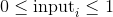.

The  element of the output tensor will draw a value  according to the  probability value given in `input`.

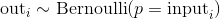

The returned `out` tensor only has values 0 or 1 and is of the same shape as `input`.

`out` can have integral `dtype`, but :attr`input` must have floating point `dtype`.

Parameters: 

*   **input** ([_Tensor_](tensors.html#torch.Tensor "torch.Tensor")) – the input tensor of probability values for the Bernoulli distribution
*   **out** ([_Tensor_](tensors.html#torch.Tensor "torch.Tensor")_,_ _optional_) – the output tensor


Example:

```py
>>> a = torch.empty(3, 3).uniform_(0, 1)  # generate a uniform random matrix with range [0, 1]
>>> a
tensor([[ 0.1737,  0.0950,  0.3609],
 [ 0.7148,  0.0289,  0.2676],
 [ 0.9456,  0.8937,  0.7202]])
>>> torch.bernoulli(a)
tensor([[ 1.,  0.,  0.],
 [ 0.,  0.,  0.],
 [ 1.,  1.,  1.]])

>>> a = torch.ones(3, 3) # probability of drawing "1" is 1
>>> torch.bernoulli(a)
tensor([[ 1.,  1.,  1.],
 [ 1.,  1.,  1.],
 [ 1.,  1.,  1.]])
>>> a = torch.zeros(3, 3) # probability of drawing "1" is 0
>>> torch.bernoulli(a)
tensor([[ 0.,  0.,  0.],
 [ 0.,  0.,  0.],
 [ 0.,  0.,  0.]])

```

```py
torch.multinomial(input, num_samples, replacement=False, out=None) → LongTensor
```

Returns a tensor where each row contains `num_samples` indices sampled from the multinomial probability distribution located in the corresponding row of tensor `input`.

Note

The rows of `input` do not need to sum to one (in which case we use the values as weights), but must be non-negative, finite and have a non-zero sum.

Indices are ordered from left to right according to when each was sampled (first samples are placed in first column).

If `input` is a vector, `out` is a vector of size `num_samples`.

If `input` is a matrix with `m` rows, `out` is an matrix of shape .

If replacement is `True`, samples are drawn with replacement.

If not, they are drawn without replacement, which means that when a sample index is drawn for a row, it cannot be drawn again for that row.

This implies the constraint that `num_samples` must be lower than `input` length (or number of columns of `input` if it is a matrix).

Parameters: 

*   **input** ([_Tensor_](tensors.html#torch.Tensor "torch.Tensor")) – the input tensor containing probabilities
*   **num_samples** ([_int_](https://docs.python.org/3/library/functions.html#int "(in Python v3.7)")) – number of samples to draw
*   **replacement** ([_bool_](https://docs.python.org/3/library/functions.html#bool "(in Python v3.7)")_,_ _optional_) – whether to draw with replacement or not
*   **out** ([_Tensor_](tensors.html#torch.Tensor "torch.Tensor")_,_ _optional_) – the output tensor


Example:

```py
>>> weights = torch.tensor([0, 10, 3, 0], dtype=torch.float) # create a tensor of weights
>>> torch.multinomial(weights, 4)
tensor([ 1,  2,  0,  0])
>>> torch.multinomial(weights, 4, replacement=True)
tensor([ 2,  1,  1,  1])

```

```py
torch.normal()
```

```py
torch.normal(mean, std, out=None) → Tensor
```

Returns a tensor of random numbers drawn from separate normal distributions whose mean and standard deviation are given.

The [`mean`](#torch.mean "torch.mean") is a tensor with the mean of each output element’s normal distribution

The [`std`](#torch.std "torch.std") is a tensor with the standard deviation of each output element’s normal distribution

The shapes of [`mean`](#torch.mean "torch.mean") and [`std`](#torch.std "torch.std") don’t need to match, but the total number of elements in each tensor need to be the same.

Note

When the shapes do not match, the shape of [`mean`](#torch.mean "torch.mean") is used as the shape for the returned output tensor

Parameters: 

*   **mean** ([_Tensor_](tensors.html#torch.Tensor "torch.Tensor")) – the tensor of per-element means
*   **std** ([_Tensor_](tensors.html#torch.Tensor "torch.Tensor")) – the tensor of per-element standard deviations
*   **out** ([_Tensor_](tensors.html#torch.Tensor "torch.Tensor")_,_ _optional_) – the output tensor


Example:

```py
>>> torch.normal(mean=torch.arange(1., 11.), std=torch.arange(1, 0, -0.1))
tensor([  1.0425,   3.5672,   2.7969,   4.2925,   4.7229,   6.2134,
 8.0505,   8.1408,   9.0563,  10.0566])

```

```py
torch.normal(mean=0.0, std, out=None) → Tensor
```

Similar to the function above, but the means are shared among all drawn elements.

Parameters: 

*   **mean** ([_float_](https://docs.python.org/3/library/functions.html#float "(in Python v3.7)")_,_ _optional_) – the mean for all distributions
*   **std** ([_Tensor_](tensors.html#torch.Tensor "torch.Tensor")) – the tensor of per-element standard deviations
*   **out** ([_Tensor_](tensors.html#torch.Tensor "torch.Tensor")_,_ _optional_) – the output tensor


Example:

```py
>>> torch.normal(mean=0.5, std=torch.arange(1., 6.))
tensor([-1.2793, -1.0732, -2.0687,  5.1177, -1.2303])

```

```py
torch.normal(mean, std=1.0, out=None) → Tensor
```

Similar to the function above, but the standard-deviations are shared among all drawn elements.

Parameters: 

*   **mean** ([_Tensor_](tensors.html#torch.Tensor "torch.Tensor")) – the tensor of per-element means
*   **std** ([_float_](https://docs.python.org/3/library/functions.html#float "(in Python v3.7)")_,_ _optional_) – the standard deviation for all distributions
*   **out** ([_Tensor_](tensors.html#torch.Tensor "torch.Tensor")_,_ _optional_) – the output tensor


Example:

```py
>>> torch.normal(mean=torch.arange(1., 6.))
tensor([ 1.1552,  2.6148,  2.6535,  5.8318,  4.2361])

```

```py
torch.rand(*sizes, out=None, dtype=None, layout=torch.strided, device=None, requires_grad=False) → Tensor
```

Returns a tensor filled with random numbers from a uniform distribution on the interval 

The shape of the tensor is defined by the variable argument `sizes`.

Parameters: 

*   **sizes** (_int..._) – a sequence of integers defining the shape of the output tensor. Can be a variable number of arguments or a collection like a list or tuple.
*   **out** ([_Tensor_](tensors.html#torch.Tensor "torch.Tensor")_,_ _optional_) – the output tensor
*   **dtype** ([`torch.dtype`](tensor_attributes.html#torch.torch.dtype "torch.torch.dtype"), optional) – the desired data type of returned tensor. Default: if `None`, uses a global default (see [`torch.set_default_tensor_type()`](#torch.set_default_tensor_type "torch.set_default_tensor_type")).
*   **layout** ([`torch.layout`](tensor_attributes.html#torch.torch.layout "torch.torch.layout"), optional) – the desired layout of returned Tensor. Default: `torch.strided`.
*   **device** ([`torch.device`](tensor_attributes.html#torch.torch.device "torch.torch.device"), optional) – the desired device of returned tensor. Default: if `None`, uses the current device for the default tensor type (see [`torch.set_default_tensor_type()`](#torch.set_default_tensor_type "torch.set_default_tensor_type")). `device` will be the CPU for CPU tensor types and the current CUDA device for CUDA tensor types.
*   **requires_grad** ([_bool_](https://docs.python.org/3/library/functions.html#bool "(in Python v3.7)")_,_ _optional_) – If autograd should record operations on the returned tensor. Default: `False`.


Example:

```py
>>> torch.rand(4)
tensor([ 0.5204,  0.2503,  0.3525,  0.5673])
>>> torch.rand(2, 3)
tensor([[ 0.8237,  0.5781,  0.6879],
 [ 0.3816,  0.7249,  0.0998]])

```

```py
torch.rand_like(input, dtype=None, layout=None, device=None, requires_grad=False) → Tensor
```

Returns a tensor with the same size as `input` that is filled with random numbers from a uniform distribution on the interval . `torch.rand_like(input)` is equivalent to `torch.rand(input.size(), dtype=input.dtype, layout=input.layout, device=input.device)`.

Parameters: 

*   **input** ([_Tensor_](tensors.html#torch.Tensor "torch.Tensor")) – the size of `input` will determine size of the output tensor
*   **dtype** ([`torch.dtype`](tensor_attributes.html#torch.torch.dtype "torch.torch.dtype"), optional) – the desired data type of returned Tensor. Default: if `None`, defaults to the dtype of `input`.
*   **layout** ([`torch.layout`](tensor_attributes.html#torch.torch.layout "torch.torch.layout"), optional) – the desired layout of returned tensor. Default: if `None`, defaults to the layout of `input`.
*   **device** ([`torch.device`](tensor_attributes.html#torch.torch.device "torch.torch.device"), optional) – the desired device of returned tensor. Default: if `None`, defaults to the device of `input`.
*   **requires_grad** ([_bool_](https://docs.python.org/3/library/functions.html#bool "(in Python v3.7)")_,_ _optional_) – If autograd should record operations on the returned tensor. Default: `False`.


```py
torch.randint(low=0, high, size, out=None, dtype=None, layout=torch.strided, device=None, requires_grad=False) → Tensor
```

Returns a tensor filled with random integers generated uniformly between `low` (inclusive) and `high` (exclusive).

The shape of the tensor is defined by the variable argument `size`.

Parameters: 

*   **low** ([_int_](https://docs.python.org/3/library/functions.html#int "(in Python v3.7)")_,_ _optional_) – Lowest integer to be drawn from the distribution. Default: 0.
*   **high** ([_int_](https://docs.python.org/3/library/functions.html#int "(in Python v3.7)")) – One above the highest integer to be drawn from the distribution.
*   **size** ([_tuple_](https://docs.python.org/3/library/stdtypes.html#tuple "(in Python v3.7)")) – a tuple defining the shape of the output tensor.
*   **out** ([_Tensor_](tensors.html#torch.Tensor "torch.Tensor")_,_ _optional_) – the output tensor
*   **dtype** ([`torch.dtype`](tensor_attributes.html#torch.torch.dtype "torch.torch.dtype"), optional) – the desired data type of returned tensor. Default: if `None`, uses a global default (see [`torch.set_default_tensor_type()`](#torch.set_default_tensor_type "torch.set_default_tensor_type")).
*   **layout** ([`torch.layout`](tensor_attributes.html#torch.torch.layout "torch.torch.layout"), optional) – the desired layout of returned Tensor. Default: `torch.strided`.
*   **device** ([`torch.device`](tensor_attributes.html#torch.torch.device "torch.torch.device"), optional) – the desired device of returned tensor. Default: if `None`, uses the current device for the default tensor type (see [`torch.set_default_tensor_type()`](#torch.set_default_tensor_type "torch.set_default_tensor_type")). `device` will be the CPU for CPU tensor types and the current CUDA device for CUDA tensor types.
*   **requires_grad** ([_bool_](https://docs.python.org/3/library/functions.html#bool "(in Python v3.7)")_,_ _optional_) – If autograd should record operations on the returned tensor. Default: `False`.


Example:

```py
>>> torch.randint(3, 5, (3,))
tensor([4, 3, 4])

>>> torch.randint(10, (2, 2))
tensor([[0, 2],
 [5, 5]])

>>> torch.randint(3, 10, (2, 2))
tensor([[4, 5],
 [6, 7]])

```

```py
torch.randint_like(input, low=0, high, dtype=None, layout=torch.strided, device=None, requires_grad=False) → Tensor
```

Returns a tensor with the same shape as Tensor `input` filled with random integers generated uniformly between `low` (inclusive) and `high` (exclusive).

Parameters: 

*   **input** ([_Tensor_](tensors.html#torch.Tensor "torch.Tensor")) – the size of `input` will determine size of the output tensor
*   **low** ([_int_](https://docs.python.org/3/library/functions.html#int "(in Python v3.7)")_,_ _optional_) – Lowest integer to be drawn from the distribution. Default: 0.
*   **high** ([_int_](https://docs.python.org/3/library/functions.html#int "(in Python v3.7)")) – One above the highest integer to be drawn from the distribution.
*   **dtype** ([`torch.dtype`](tensor_attributes.html#torch.torch.dtype "torch.torch.dtype"), optional) – the desired data type of returned Tensor. Default: if `None`, defaults to the dtype of `input`.
*   **layout** ([`torch.layout`](tensor_attributes.html#torch.torch.layout "torch.torch.layout"), optional) – the desired layout of returned tensor. Default: if `None`, defaults to the layout of `input`.
*   **device** ([`torch.device`](tensor_attributes.html#torch.torch.device "torch.torch.device"), optional) – the desired device of returned tensor. Default: if `None`, defaults to the device of `input`.
*   **requires_grad** ([_bool_](https://docs.python.org/3/library/functions.html#bool "(in Python v3.7)")_,_ _optional_) – If autograd should record operations on the returned tensor. Default: `False`.


```py
torch.randn(*sizes, out=None, dtype=None, layout=torch.strided, device=None, requires_grad=False) → Tensor
```

Returns a tensor filled with random numbers from a normal distribution with mean `0` and variance `1` (also called the standard normal distribution).


The shape of the tensor is defined by the variable argument `sizes`.

Parameters: 

*   **sizes** (_int..._) – a sequence of integers defining the shape of the output tensor. Can be a variable number of arguments or a collection like a list or tuple.
*   **out** ([_Tensor_](tensors.html#torch.Tensor "torch.Tensor")_,_ _optional_) – the output tensor
*   **dtype** ([`torch.dtype`](tensor_attributes.html#torch.torch.dtype "torch.torch.dtype"), optional) – the desired data type of returned tensor. Default: if `None`, uses a global default (see [`torch.set_default_tensor_type()`](#torch.set_default_tensor_type "torch.set_default_tensor_type")).
*   **layout** ([`torch.layout`](tensor_attributes.html#torch.torch.layout "torch.torch.layout"), optional) – the desired layout of returned Tensor. Default: `torch.strided`.
*   **device** ([`torch.device`](tensor_attributes.html#torch.torch.device "torch.torch.device"), optional) – the desired device of returned tensor. Default: if `None`, uses the current device for the default tensor type (see [`torch.set_default_tensor_type()`](#torch.set_default_tensor_type "torch.set_default_tensor_type")). `device` will be the CPU for CPU tensor types and the current CUDA device for CUDA tensor types.
*   **requires_grad** ([_bool_](https://docs.python.org/3/library/functions.html#bool "(in Python v3.7)")_,_ _optional_) – If autograd should record operations on the returned tensor. Default: `False`.


Example:

```py
>>> torch.randn(4)
tensor([-2.1436,  0.9966,  2.3426, -0.6366])
>>> torch.randn(2, 3)
tensor([[ 1.5954,  2.8929, -1.0923],
 [ 1.1719, -0.4709, -0.1996]])

```

```py
torch.randn_like(input, dtype=None, layout=None, device=None, requires_grad=False) → Tensor
```

Returns a tensor with the same size as `input` that is filled with random numbers from a normal distribution with mean 0 and variance 1. `torch.randn_like(input)` is equivalent to `torch.randn(input.size(), dtype=input.dtype, layout=input.layout, device=input.device)`.

Parameters: 

*   **input** ([_Tensor_](tensors.html#torch.Tensor "torch.Tensor")) – the size of `input` will determine size of the output tensor
*   **dtype** ([`torch.dtype`](tensor_attributes.html#torch.torch.dtype "torch.torch.dtype"), optional) – the desired data type of returned Tensor. Default: if `None`, defaults to the dtype of `input`.
*   **layout** ([`torch.layout`](tensor_attributes.html#torch.torch.layout "torch.torch.layout"), optional) – the desired layout of returned tensor. Default: if `None`, defaults to the layout of `input`.
*   **device** ([`torch.device`](tensor_attributes.html#torch.torch.device "torch.torch.device"), optional) – the desired device of returned tensor. Default: if `None`, defaults to the device of `input`.
*   **requires_grad** ([_bool_](https://docs.python.org/3/library/functions.html#bool "(in Python v3.7)")_,_ _optional_) – If autograd should record operations on the returned tensor. Default: `False`.


```py
torch.randperm(n, out=None, dtype=torch.int64, layout=torch.strided, device=None, requires_grad=False) → LongTensor
```

Returns a random permutation of integers from `0` to `n - 1`.

Parameters: 

*   **n** ([_int_](https://docs.python.org/3/library/functions.html#int "(in Python v3.7)")) – the upper bound (exclusive)
*   **out** ([_Tensor_](tensors.html#torch.Tensor "torch.Tensor")_,_ _optional_) – the output tensor
*   **dtype** ([`torch.dtype`](tensor_attributes.html#torch.torch.dtype "torch.torch.dtype"), optional) – the desired data type of returned tensor. Default: `torch.int64`.
*   **layout** ([`torch.layout`](tensor_attributes.html#torch.torch.layout "torch.torch.layout"), optional) – the desired layout of returned Tensor. Default: `torch.strided`.
*   **device** ([`torch.device`](tensor_attributes.html#torch.torch.device "torch.torch.device"), optional) – the desired device of returned tensor. Default: if `None`, uses the current device for the default tensor type (see [`torch.set_default_tensor_type()`](#torch.set_default_tensor_type "torch.set_default_tensor_type")). `device` will be the CPU for CPU tensor types and the current CUDA device for CUDA tensor types.
*   **requires_grad** ([_bool_](https://docs.python.org/3/library/functions.html#bool "(in Python v3.7)")_,_ _optional_) – If autograd should record operations on the returned tensor. Default: `False`.


Example:

```py
>>> torch.randperm(4)
tensor([2, 1, 0, 3])

```

### In-place random sampling

There are a few more in-place random sampling functions defined on Tensors as well. Click through to refer to their documentation:

*   [`torch.Tensor.bernoulli_()`](tensors.html#torch.Tensor.bernoulli_ "torch.Tensor.bernoulli_") - in-place version of [`torch.bernoulli()`](#torch.bernoulli "torch.bernoulli")
*   [`torch.Tensor.cauchy_()`](tensors.html#torch.Tensor.cauchy_ "torch.Tensor.cauchy_") - numbers drawn from the Cauchy distribution
*   [`torch.Tensor.exponential_()`](tensors.html#torch.Tensor.exponential_ "torch.Tensor.exponential_") - numbers drawn from the exponential distribution
*   [`torch.Tensor.geometric_()`](tensors.html#torch.Tensor.geometric_ "torch.Tensor.geometric_") - elements drawn from the geometric distribution
*   [`torch.Tensor.log_normal_()`](tensors.html#torch.Tensor.log_normal_ "torch.Tensor.log_normal_") - samples from the log-normal distribution
*   [`torch.Tensor.normal_()`](tensors.html#torch.Tensor.normal_ "torch.Tensor.normal_") - in-place version of [`torch.normal()`](#torch.normal "torch.normal")
*   [`torch.Tensor.random_()`](tensors.html#torch.Tensor.random_ "torch.Tensor.random_") - numbers sampled from the discrete uniform distribution
*   [`torch.Tensor.uniform_()`](tensors.html#torch.Tensor.uniform_ "torch.Tensor.uniform_") - numbers sampled from the continuous uniform distribution

## Serialization

```py
torch.save(obj, f, pickle_module=<module 'pickle' from '/scratch/rzou/pt/release-env/lib/python3.7/pickle.py'>, pickle_protocol=2)
```

Saves an object to a disk file.

See also: [Recommended approach for saving a model](notes/serialization.html#recommend-saving-models)

Parameters: 

*   **obj** – saved object
*   **f** – a file-like object (has to implement write and flush) or a string containing a file name
*   **pickle_module** – module used for pickling metadata and objects
*   **pickle_protocol** – can be specified to override the default protocol


Warning

If you are using Python 2, torch.save does NOT support StringIO.StringIO as a valid file-like object. This is because the write method should return the number of bytes written; StringIO.write() does not do this.

Please use something like io.BytesIO instead.

Example

```py
>>> # Save to file
>>> x = torch.tensor([0, 1, 2, 3, 4])
>>> torch.save(x, 'tensor.pt')
>>> # Save to io.BytesIO buffer
>>> buffer = io.BytesIO()
>>> torch.save(x, buffer)

```

```py
torch.load(f, map_location=None, pickle_module=<module 'pickle' from '/scratch/rzou/pt/release-env/lib/python3.7/pickle.py'>)
```

Loads an object saved with [`torch.save()`](#torch.save "torch.save") from a file.

[`torch.load()`](#torch.load "torch.load") uses Python’s unpickling facilities but treats storages, which underlie tensors, specially. They are first deserialized on the CPU and are then moved to the device they were saved from. If this fails (e.g. because the run time system doesn’t have certain devices), an exception is raised. However, storages can be dynamically remapped to an alternative set of devices using the `map_location` argument.

If `map_location` is a callable, it will be called once for each serialized storage with two arguments: storage and location. The storage argument will be the initial deserialization of the storage, residing on the CPU. Each serialized storage has a location tag associated with it which identifies the device it was saved from, and this tag is the second argument passed to map_location. The builtin location tags are `‘cpu’` for CPU tensors and `‘cuda:device_id’` (e.g. `‘cuda:2’`) for CUDA tensors. `map_location` should return either None or a storage. If `map_location` returns a storage, it will be used as the final deserialized object, already moved to the right device. Otherwise,  will fall back to the default behavior, as if `map_location` wasn’t specified.

If `map_location` is a string, it should be a device tag, where all tensors should be loaded.

Otherwise, if `map_location` is a dict, it will be used to remap location tags appearing in the file (keys), to ones that specify where to put the storages (values).

User extensions can register their own location tags and tagging and deserialization methods using `register_package`.

Parameters: 

*   **f** – a file-like object (has to implement read, readline, tell, and seek), or a string containing a file name
*   **map_location** – a function, torch.device, string or a dict specifying how to remap storage locations
*   **pickle_module** – module used for unpickling metadata and objects (has to match the pickle_module used to serialize file)


Note

When you call [`torch.load()`](#torch.load "torch.load") on a file which contains GPU tensors, those tensors will be loaded to GPU by default. You can call `torch.load(.., map_location=’cpu’)` and then `load_state_dict()` to avoid GPU RAM surge when loading a model checkpoint.

Example

```py
>>> torch.load('tensors.pt')
# Load all tensors onto the CPU
>>> torch.load('tensors.pt', map_location=torch.device('cpu'))
# Load all tensors onto the CPU, using a function
>>> torch.load('tensors.pt', map_location=lambda storage, loc: storage)
# Load all tensors onto GPU 1
>>> torch.load('tensors.pt', map_location=lambda storage, loc: storage.cuda(1))
# Map tensors from GPU 1 to GPU 0
>>> torch.load('tensors.pt', map_location={'cuda:1':'cuda:0'})
# Load tensor from io.BytesIO object
>>> with open('tensor.pt') as f:
 buffer = io.BytesIO(f.read())
>>> torch.load(buffer)

```

## Parallelism

```py
torch.get_num_threads() → int
```

Gets the number of OpenMP threads used for parallelizing CPU operations

```py
torch.set_num_threads(int)
```

Sets the number of OpenMP threads used for parallelizing CPU operations

## Locally disabling gradient computation

The context managers `torch.no_grad()`, `torch.enable_grad()`, and `torch.set_grad_enabled()` are helpful for locally disabling and enabling gradient computation. See [Locally disabling gradient computation](autograd.html#locally-disable-grad) for more details on their usage.

Examples:

```py
>>> x = torch.zeros(1, requires_grad=True)
>>> with torch.no_grad():
...     y = x * 2
>>> y.requires_grad
False

>>> is_train = False
>>> with torch.set_grad_enabled(is_train):
...     y = x * 2
>>> y.requires_grad
False

>>> torch.set_grad_enabled(True)  # this can also be used as a function
>>> y = x * 2
>>> y.requires_grad
True

>>> torch.set_grad_enabled(False)
>>> y = x * 2
>>> y.requires_grad
False

```

## Math operations

### Pointwise Ops

```py
torch.abs(input, out=None) → Tensor
```

Computes the element-wise absolute value of the given `input` tensor.

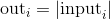

Parameters: 

*   **input** ([_Tensor_](tensors.html#torch.Tensor "torch.Tensor")) – the input tensor
*   **out** ([_Tensor_](tensors.html#torch.Tensor "torch.Tensor")_,_ _optional_) – the output tensor


Example:

```py
>>> torch.abs(torch.tensor([-1, -2, 3]))
tensor([ 1,  2,  3])

```

```py
torch.acos(input, out=None) → Tensor
```

Returns a new tensor with the arccosine of the elements of `input`.

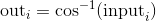

Parameters: 

*   **input** ([_Tensor_](tensors.html#torch.Tensor "torch.Tensor")) – the input tensor
*   **out** ([_Tensor_](tensors.html#torch.Tensor "torch.Tensor")_,_ _optional_) – the output tensor


Example:

```py
>>> a = torch.randn(4)
>>> a
tensor([ 0.3348, -0.5889,  0.2005, -0.1584])
>>> torch.acos(a)
tensor([ 1.2294,  2.2004,  1.3690,  1.7298])

```

```py
torch.add()
```

```py
torch.add(input, value, out=None)
```

Adds the scalar `value` to each element of the input `input` and returns a new resulting tensor.

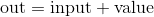

If `input` is of type FloatTensor or DoubleTensor, `value` must be a real number, otherwise it should be an integer.

Parameters: 

*   **input** ([_Tensor_](tensors.html#torch.Tensor "torch.Tensor")) – the input tensor
*   **value** (_Number_) – the number to be added to each element of `input`


| Keyword Arguments: |
| --- |
|   | **out** ([_Tensor_](tensors.html#torch.Tensor "torch.Tensor")_,_ _optional_) – the output tensor |

Example:

```py
>>> a = torch.randn(4)
>>> a
tensor([ 0.0202,  1.0985,  1.3506, -0.6056])
>>> torch.add(a, 20)
tensor([ 20.0202,  21.0985,  21.3506,  19.3944])

```

```py
torch.add(input, value=1, other, out=None)
```

Each element of the tensor `other` is multiplied by the scalar `value` and added to each element of the tensor `input`. The resulting tensor is returned.

The shapes of `input` and `other` must be [broadcastable](notes/broadcasting.html#broadcasting-semantics).


If `other` is of type FloatTensor or DoubleTensor, `value` must be a real number, otherwise it should be an integer.

Parameters: 

*   **input** ([_Tensor_](tensors.html#torch.Tensor "torch.Tensor")) – the first input tensor
*   **value** (_Number_) – the scalar multiplier for `other`
*   **other** ([_Tensor_](tensors.html#torch.Tensor "torch.Tensor")) – the second input tensor


| Keyword Arguments: |
| --- |
|   | **out** ([_Tensor_](tensors.html#torch.Tensor "torch.Tensor")_,_ _optional_) – the output tensor |

Example:

```py
>>> a = torch.randn(4)
>>> a
tensor([-0.9732, -0.3497,  0.6245,  0.4022])
>>> b = torch.randn(4, 1)
>>> b
tensor([[ 0.3743],
 [-1.7724],
 [-0.5811],
 [-0.8017]])
>>> torch.add(a, 10, b)
tensor([[  2.7695,   3.3930,   4.3672,   4.1450],
 [-18.6971, -18.0736, -17.0994, -17.3216],
 [ -6.7845,  -6.1610,  -5.1868,  -5.4090],
 [ -8.9902,  -8.3667,  -7.3925,  -7.6147]])

```

```py
torch.addcdiv(tensor, value=1, tensor1, tensor2, out=None) → Tensor
```

Performs the element-wise division of `tensor1` by `tensor2`, multiply the result by the scalar `value` and add it to [`tensor`](#torch.tensor "torch.tensor").

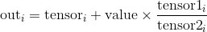

The shapes of [`tensor`](#torch.tensor "torch.tensor"), `tensor1`, and `tensor2` must be [broadcastable](notes/broadcasting.html#broadcasting-semantics).

For inputs of type `FloatTensor` or `DoubleTensor`, `value` must be a real number, otherwise an integer.

Parameters: 

*   **tensor** ([_Tensor_](tensors.html#torch.Tensor "torch.Tensor")) – the tensor to be added
*   **value** (_Number__,_ _optional_) – multiplier for 
*   **tensor1** ([_Tensor_](tensors.html#torch.Tensor "torch.Tensor")) – the numerator tensor
*   **tensor2** ([_Tensor_](tensors.html#torch.Tensor "torch.Tensor")) – the denominator tensor
*   **out** ([_Tensor_](tensors.html#torch.Tensor "torch.Tensor")_,_ _optional_) – the output tensor


Example:

```py
>>> t = torch.randn(1, 3)
>>> t1 = torch.randn(3, 1)
>>> t2 = torch.randn(1, 3)
>>> torch.addcdiv(t, 0.1, t1, t2)
tensor([[-0.2312, -3.6496,  0.1312],
 [-1.0428,  3.4292, -0.1030],
 [-0.5369, -0.9829,  0.0430]])

```

```py
torch.addcmul(tensor, value=1, tensor1, tensor2, out=None) → Tensor
```

Performs the element-wise multiplication of `tensor1` by `tensor2`, multiply the result by the scalar `value` and add it to [`tensor`](#torch.tensor "torch.tensor").

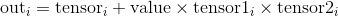

The shapes of [`tensor`](#torch.tensor "torch.tensor"), `tensor1`, and `tensor2` must be [broadcastable](notes/broadcasting.html#broadcasting-semantics).

For inputs of type `FloatTensor` or `DoubleTensor`, `value` must be a real number, otherwise an integer.

Parameters: 

*   **tensor** ([_Tensor_](tensors.html#torch.Tensor "torch.Tensor")) – the tensor to be added
*   **value** (_Number__,_ _optional_) – multiplier for 
*   **tensor1** ([_Tensor_](tensors.html#torch.Tensor "torch.Tensor")) – the tensor to be multiplied
*   **tensor2** ([_Tensor_](tensors.html#torch.Tensor "torch.Tensor")) – the tensor to be multiplied
*   **out** ([_Tensor_](tensors.html#torch.Tensor "torch.Tensor")_,_ _optional_) – the output tensor


Example:

```py
>>> t = torch.randn(1, 3)
>>> t1 = torch.randn(3, 1)
>>> t2 = torch.randn(1, 3)
>>> torch.addcmul(t, 0.1, t1, t2)
tensor([[-0.8635, -0.6391,  1.6174],
 [-0.7617, -0.5879,  1.7388],
 [-0.8353, -0.6249,  1.6511]])

```

```py
torch.asin(input, out=None) → Tensor
```

Returns a new tensor with the arcsine of the elements of `input`.


Parameters: 

*   **input** ([_Tensor_](tensors.html#torch.Tensor "torch.Tensor")) – the input tensor
*   **out** ([_Tensor_](tensors.html#torch.Tensor "torch.Tensor")_,_ _optional_) – the output tensor


Example:

```py
>>> a = torch.randn(4)
>>> a
tensor([-0.5962,  1.4985, -0.4396,  1.4525])
>>> torch.asin(a)
tensor([-0.6387,     nan, -0.4552,     nan])

```

```py
torch.atan(input, out=None) → Tensor
```

Returns a new tensor with the arctangent of the elements of `input`.

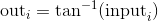

Parameters: 

*   **input** ([_Tensor_](tensors.html#torch.Tensor "torch.Tensor")) – the input tensor
*   **out** ([_Tensor_](tensors.html#torch.Tensor "torch.Tensor")_,_ _optional_) – the output tensor


Example:

```py
>>> a = torch.randn(4)
>>> a
tensor([ 0.2341,  0.2539, -0.6256, -0.6448])
>>> torch.atan(a)
tensor([ 0.2299,  0.2487, -0.5591, -0.5727])

```

```py
torch.atan2(input1, input2, out=None) → Tensor
```

Returns a new tensor with the arctangent of the elements of `input1` and `input2`.

The shapes of `input1` and `input2` must be [broadcastable](notes/broadcasting.html#broadcasting-semantics).

Parameters: 

*   **input1** ([_Tensor_](tensors.html#torch.Tensor "torch.Tensor")) – the first input tensor
*   **input2** ([_Tensor_](tensors.html#torch.Tensor "torch.Tensor")) – the second input tensor
*   **out** ([_Tensor_](tensors.html#torch.Tensor "torch.Tensor")_,_ _optional_) – the output tensor


Example:

```py
>>> a = torch.randn(4)
>>> a
tensor([ 0.9041,  0.0196, -0.3108, -2.4423])
>>> torch.atan2(a, torch.randn(4))
tensor([ 0.9833,  0.0811, -1.9743, -1.4151])

```

```py
torch.ceil(input, out=None) → Tensor
```

Returns a new tensor with the ceil of the elements of `input`, the smallest integer greater than or equal to each element.

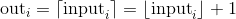

Parameters: 

*   **input** ([_Tensor_](tensors.html#torch.Tensor "torch.Tensor")) – the input tensor
*   **out** ([_Tensor_](tensors.html#torch.Tensor "torch.Tensor")_,_ _optional_) – the output tensor


Example:

```py
>>> a = torch.randn(4)
>>> a
tensor([-0.6341, -1.4208, -1.0900,  0.5826])
>>> torch.ceil(a)
tensor([-0., -1., -1.,  1.])

```

```py
torch.clamp(input, min, max, out=None) → Tensor
```

Clamp all elements in `input` into the range `[` [`min`](#torch.min "torch.min"), [`max`](#torch.max "torch.max") `]` and return a resulting tensor:

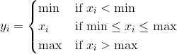

If `input` is of type `FloatTensor` or `DoubleTensor`, args [`min`](#torch.min "torch.min") and [`max`](#torch.max "torch.max") must be real numbers, otherwise they should be integers.

Parameters: 

*   **input** ([_Tensor_](tensors.html#torch.Tensor "torch.Tensor")) – the input tensor
*   **min** (_Number_) – lower-bound of the range to be clamped to
*   **max** (_Number_) – upper-bound of the range to be clamped to
*   **out** ([_Tensor_](tensors.html#torch.Tensor "torch.Tensor")_,_ _optional_) – the output tensor


Example:

```py
>>> a = torch.randn(4)
>>> a
tensor([-1.7120,  0.1734, -0.0478, -0.0922])
>>> torch.clamp(a, min=-0.5, max=0.5)
tensor([-0.5000,  0.1734, -0.0478, -0.0922])

```

```py
torch.clamp(input, *, min, out=None) → Tensor
```

Clamps all elements in `input` to be larger or equal [`min`](#torch.min "torch.min").

If `input` is of type `FloatTensor` or `DoubleTensor`, `value` should be a real number, otherwise it should be an integer.

Parameters: 

*   **input** ([_Tensor_](tensors.html#torch.Tensor "torch.Tensor")) – the input tensor
*   **value** (_Number_) – minimal value of each element in the output
*   **out** ([_Tensor_](tensors.html#torch.Tensor "torch.Tensor")_,_ _optional_) – the output tensor


Example:

```py
>>> a = torch.randn(4)
>>> a
tensor([-0.0299, -2.3184,  2.1593, -0.8883])
>>> torch.clamp(a, min=0.5)
tensor([ 0.5000,  0.5000,  2.1593,  0.5000])

```

```py
torch.clamp(input, *, max, out=None) → Tensor
```

Clamps all elements in `input` to be smaller or equal [`max`](#torch.max "torch.max").

If `input` is of type `FloatTensor` or `DoubleTensor`, `value` should be a real number, otherwise it should be an integer.

Parameters: 

*   **input** ([_Tensor_](tensors.html#torch.Tensor "torch.Tensor")) – the input tensor
*   **value** (_Number_) – maximal value of each element in the output
*   **out** ([_Tensor_](tensors.html#torch.Tensor "torch.Tensor")_,_ _optional_) – the output tensor


Example:

```py
>>> a = torch.randn(4)
>>> a
tensor([ 0.7753, -0.4702, -0.4599,  1.1899])
>>> torch.clamp(a, max=0.5)
tensor([ 0.5000, -0.4702, -0.4599,  0.5000])

```

```py
torch.cos(input, out=None) → Tensor
```

Returns a new tensor with the cosine of the elements of `input`.


Parameters: 

*   **input** ([_Tensor_](tensors.html#torch.Tensor "torch.Tensor")) – the input tensor
*   **out** ([_Tensor_](tensors.html#torch.Tensor "torch.Tensor")_,_ _optional_) – the output tensor


Example:

```py
>>> a = torch.randn(4)
>>> a
tensor([ 1.4309,  1.2706, -0.8562,  0.9796])
>>> torch.cos(a)
tensor([ 0.1395,  0.2957,  0.6553,  0.5574])

```

```py
torch.cosh(input, out=None) → Tensor
```

Returns a new tensor with the hyperbolic cosine of the elements of `input`.

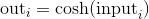

Parameters: 

*   **input** ([_Tensor_](tensors.html#torch.Tensor "torch.Tensor")) – the input tensor
*   **out** ([_Tensor_](tensors.html#torch.Tensor "torch.Tensor")_,_ _optional_) – the output tensor


Example:

```py
>>> a = torch.randn(4)
>>> a
tensor([ 0.1632,  1.1835, -0.6979, -0.7325])
>>> torch.cosh(a)
tensor([ 1.0133,  1.7860,  1.2536,  1.2805])

```

```py
torch.div()
```

```py
torch.div(input, value, out=None) → Tensor
```

Divides each element of the input `input` with the scalar `value` and returns a new resulting tensor.


If `input` is of type `FloatTensor` or `DoubleTensor`, `value` should be a real number, otherwise it should be an integer

Parameters: 

*   **input** ([_Tensor_](tensors.html#torch.Tensor "torch.Tensor")) – the input tensor
*   **value** (_Number_) – the number to be divided to each element of `input`
*   **out** ([_Tensor_](tensors.html#torch.Tensor "torch.Tensor")_,_ _optional_) – the output tensor


Example:

```py
>>> a = torch.randn(5)
>>> a
tensor([ 0.3810,  1.2774, -0.2972, -0.3719,  0.4637])
>>> torch.div(a, 0.5)
tensor([ 0.7620,  2.5548, -0.5944, -0.7439,  0.9275])

```

```py
torch.div(input, other, out=None) → Tensor
```

Each element of the tensor `input` is divided by each element of the tensor `other`. The resulting tensor is returned. The shapes of `input` and `other` must be [broadcastable](notes/broadcasting.html#broadcasting-semantics).

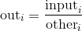

Parameters: 

*   **input** ([_Tensor_](tensors.html#torch.Tensor "torch.Tensor")) – the numerator tensor
*   **other** ([_Tensor_](tensors.html#torch.Tensor "torch.Tensor")) – the denominator tensor
*   **out** ([_Tensor_](tensors.html#torch.Tensor "torch.Tensor")_,_ _optional_) – the output tensor


Example:

```py
>>> a = torch.randn(4, 4)
>>> a
tensor([[-0.3711, -1.9353, -0.4605, -0.2917],
 [ 0.1815, -1.0111,  0.9805, -1.5923],
 [ 0.1062,  1.4581,  0.7759, -1.2344],
 [-0.1830, -0.0313,  1.1908, -1.4757]])
>>> b = torch.randn(4)
>>> b
tensor([ 0.8032,  0.2930, -0.8113, -0.2308])
>>> torch.div(a, b)
tensor([[-0.4620, -6.6051,  0.5676,  1.2637],
 [ 0.2260, -3.4507, -1.2086,  6.8988],
 [ 0.1322,  4.9764, -0.9564,  5.3480],
 [-0.2278, -0.1068, -1.4678,  6.3936]])

```

```py
torch.digamma(input, out=None) → Tensor
```

Computes the logarithmic derivative of the gamma function on `input`.

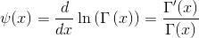

| Parameters: | **input** ([_Tensor_](tensors.html#torch.Tensor "torch.Tensor")) – the tensor to compute the digamma function on |
| --- | --- |

Example:

```py
>>> a = torch.tensor([1, 0.5])
>>> torch.digamma(a)
tensor([-0.5772, -1.9635])

```

```py
torch.erf(tensor, out=None) → Tensor
```

Computes the error function of each element. The error function is defined as follows:


Parameters: 

*   **tensor** ([_Tensor_](tensors.html#torch.Tensor "torch.Tensor")) – the input tensor
*   **out** ([_Tensor_](tensors.html#torch.Tensor "torch.Tensor")_,_ _optional_) – the output tensor


Example:

```py
>>> torch.erf(torch.tensor([0, -1., 10.]))
tensor([ 0.0000, -0.8427,  1.0000])

```

```py
torch.erfc(input, out=None) → Tensor
```

Computes the complementary error function of each element of `input`. The complementary error function is defined as follows:


Parameters: 

*   **tensor** ([_Tensor_](tensors.html#torch.Tensor "torch.Tensor")) – the input tensor
*   **out** ([_Tensor_](tensors.html#torch.Tensor "torch.Tensor")_,_ _optional_) – the output tensor


Example:

```py
>>> torch.erfc(torch.tensor([0, -1., 10.]))
tensor([ 1.0000, 1.8427,  0.0000])

```

```py
torch.erfinv(input, out=None) → Tensor
```

Computes the inverse error function of each element of `input`. The inverse error function is defined in the range 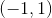 as:


Parameters: 

*   **input** ([_Tensor_](tensors.html#torch.Tensor "torch.Tensor")) – the input tensor
*   **out** ([_Tensor_](tensors.html#torch.Tensor "torch.Tensor")_,_ _optional_) – the output tensor


Example:

```py
>>> torch.erfinv(torch.tensor([0, 0.5, -1.]))
tensor([ 0.0000,  0.4769,    -inf])

```

```py
torch.exp(input, out=None) → Tensor
```

Returns a new tensor with the exponential of the elements of the input tensor `input`.


Parameters: 

*   **input** ([_Tensor_](tensors.html#torch.Tensor "torch.Tensor")) – the input tensor
*   **out** ([_Tensor_](tensors.html#torch.Tensor "torch.Tensor")_,_ _optional_) – the output tensor


Example:

```py
>>> torch.exp(torch.tensor([0, math.log(2.)]))
tensor([ 1.,  2.])

```

```py
torch.expm1(input, out=None) → Tensor
```

Returns a new tensor with the exponential of the elements minus 1 of `input`.


Parameters: 

*   **input** ([_Tensor_](tensors.html#torch.Tensor "torch.Tensor")) – the input tensor
*   **out** ([_Tensor_](tensors.html#torch.Tensor "torch.Tensor")_,_ _optional_) – the output tensor


Example:

```py
>>> torch.expm1(torch.tensor([0, math.log(2.)]))
tensor([ 0.,  1.])

```

```py
torch.floor(input, out=None) → Tensor
```

Returns a new tensor with the floor of the elements of `input`, the largest integer less than or equal to each element.

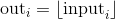

Parameters: 

*   **input** ([_Tensor_](tensors.html#torch.Tensor "torch.Tensor")) – the input tensor
*   **out** ([_Tensor_](tensors.html#torch.Tensor "torch.Tensor")_,_ _optional_) – the output tensor


Example:

```py
>>> a = torch.randn(4)
>>> a
tensor([-0.8166,  1.5308, -0.2530, -0.2091])
>>> torch.floor(a)
tensor([-1.,  1., -1., -1.])

```

```py
torch.fmod(input, divisor, out=None) → Tensor
```

Computes the element-wise remainder of division.

The dividend and divisor may contain both for integer and floating point numbers. The remainder has the same sign as the dividend `input`.

When `divisor` is a tensor, the shapes of `input` and `divisor` must be [broadcastable](notes/broadcasting.html#broadcasting-semantics).

Parameters: 

*   **input** ([_Tensor_](tensors.html#torch.Tensor "torch.Tensor")) – the dividend
*   **divisor** ([_Tensor_](tensors.html#torch.Tensor "torch.Tensor") _or_ [_float_](https://docs.python.org/3/library/functions.html#float "(in Python v3.7)")) – the divisor, which may be either a number or a tensor of the same shape as the dividend
*   **out** ([_Tensor_](tensors.html#torch.Tensor "torch.Tensor")_,_ _optional_) – the output tensor


Example:

```py
>>> torch.fmod(torch.tensor([-3., -2, -1, 1, 2, 3]), 2)
tensor([-1., -0., -1.,  1.,  0.,  1.])
>>> torch.fmod(torch.tensor([1., 2, 3, 4, 5]), 1.5)
tensor([ 1.0000,  0.5000,  0.0000,  1.0000,  0.5000])

```

```py
torch.frac(input, out=None) → Tensor
```

Computes the fractional portion of each element in `input`.


Example:

```py
>>> torch.frac(torch.tensor([1, 2.5, -3.2]))
tensor([ 0.0000,  0.5000, -0.2000])

```

```py
torch.lerp(start, end, weight, out=None)
```

Does a linear interpolation of two tensors `start` and `end` based on a scalar `weight` and returns the resulting `out` tensor.

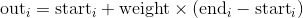

The shapes of `start` and `end` must be [broadcastable](notes/broadcasting.html#broadcasting-semantics).

Parameters: 

*   **start** ([_Tensor_](tensors.html#torch.Tensor "torch.Tensor")) – the tensor with the starting points
*   **end** ([_Tensor_](tensors.html#torch.Tensor "torch.Tensor")) – the tensor with the ending points
*   **weight** ([_float_](https://docs.python.org/3/library/functions.html#float "(in Python v3.7)")) – the weight for the interpolation formula
*   **out** ([_Tensor_](tensors.html#torch.Tensor "torch.Tensor")_,_ _optional_) – the output tensor


Example:

```py
>>> start = torch.arange(1., 5.)
>>> end = torch.empty(4).fill_(10)
>>> start
tensor([ 1.,  2.,  3.,  4.])
>>> end
tensor([ 10.,  10.,  10.,  10.])
>>> torch.lerp(start, end, 0.5)
tensor([ 5.5000,  6.0000,  6.5000,  7.0000])

```

```py
torch.log(input, out=None) → Tensor
```

Returns a new tensor with the natural logarithm of the elements of `input`.


Parameters: 

*   **input** ([_Tensor_](tensors.html#torch.Tensor "torch.Tensor")) – the input tensor
*   **out** ([_Tensor_](tensors.html#torch.Tensor "torch.Tensor")_,_ _optional_) – the output tensor


Example:

```py
>>> a = torch.randn(5)
>>> a
tensor([-0.7168, -0.5471, -0.8933, -1.4428, -0.1190])
>>> torch.log(a)
tensor([ nan,  nan,  nan,  nan,  nan])

```

```py
torch.log10(input, out=None) → Tensor
```

Returns a new tensor with the logarithm to the base 10 of the elements of `input`.


Parameters: 

*   **input** ([_Tensor_](tensors.html#torch.Tensor "torch.Tensor")) – the input tensor
*   **out** ([_Tensor_](tensors.html#torch.Tensor "torch.Tensor")_,_ _optional_) – the output tensor


Example:

```py
>>> a = torch.rand(5)
>>> a
tensor([ 0.5224,  0.9354,  0.7257,  0.1301,  0.2251])

>>> torch.log10(a)
tensor([-0.2820, -0.0290, -0.1392, -0.8857, -0.6476])

```

```py
torch.log1p(input, out=None) → Tensor
```

Returns a new tensor with the natural logarithm of (1 + `input`).

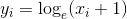

Note

This function is more accurate than [`torch.log()`](#torch.log "torch.log") for small values of `input`

Parameters: 

*   **input** ([_Tensor_](tensors.html#torch.Tensor "torch.Tensor")) – the input tensor
*   **out** ([_Tensor_](tensors.html#torch.Tensor "torch.Tensor")_,_ _optional_) – the output tensor


Example:

```py
>>> a = torch.randn(5)
>>> a
tensor([-1.0090, -0.9923,  1.0249, -0.5372,  0.2492])
>>> torch.log1p(a)
tensor([    nan, -4.8653,  0.7055, -0.7705,  0.2225])

```

```py
torch.log2(input, out=None) → Tensor
```

Returns a new tensor with the logarithm to the base 2 of the elements of `input`.


Parameters: 

*   **input** ([_Tensor_](tensors.html#torch.Tensor "torch.Tensor")) – the input tensor
*   **out** ([_Tensor_](tensors.html#torch.Tensor "torch.Tensor")_,_ _optional_) – the output tensor


Example:

```py
>>> a = torch.rand(5)
>>> a
tensor([ 0.8419,  0.8003,  0.9971,  0.5287,  0.0490])

>>> torch.log2(a)
tensor([-0.2483, -0.3213, -0.0042, -0.9196, -4.3504])

```

```py
torch.mul()
```

```py
torch.mul(input, value, out=None)
```

Multiplies each element of the input `input` with the scalar `value` and returns a new resulting tensor.

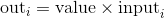

If `input` is of type `FloatTensor` or `DoubleTensor`, `value` should be a real number, otherwise it should be an integer

Parameters: 

*   **input** ([_Tensor_](tensors.html#torch.Tensor "torch.Tensor")) – the input tensor
*   **value** (_Number_) – the number to be multiplied to each element of `input`
*   **out** ([_Tensor_](tensors.html#torch.Tensor "torch.Tensor")_,_ _optional_) – the output tensor


Example:

```py
>>> a = torch.randn(3)
>>> a
tensor([ 0.2015, -0.4255,  2.6087])
>>> torch.mul(a, 100)
tensor([  20.1494,  -42.5491,  260.8663])

```

```py
torch.mul(input, other, out=None)
```

Each element of the tensor `input` is multiplied by each element of the Tensor `other`. The resulting tensor is returned.

The shapes of `input` and `other` must be [broadcastable](notes/broadcasting.html#broadcasting-semantics).


Parameters: 

*   **input** ([_Tensor_](tensors.html#torch.Tensor "torch.Tensor")) – the first multiplicand tensor
*   **other** ([_Tensor_](tensors.html#torch.Tensor "torch.Tensor")) – the second multiplicand tensor
*   **out** ([_Tensor_](tensors.html#torch.Tensor "torch.Tensor")_,_ _optional_) – the output tensor


Example:

```py
>>> a = torch.randn(4, 1)
>>> a
tensor([[ 1.1207],
 [-0.3137],
 [ 0.0700],
 [ 0.8378]])
>>> b = torch.randn(1, 4)
>>> b
tensor([[ 0.5146,  0.1216, -0.5244,  2.2382]])
>>> torch.mul(a, b)
tensor([[ 0.5767,  0.1363, -0.5877,  2.5083],
 [-0.1614, -0.0382,  0.1645, -0.7021],
 [ 0.0360,  0.0085, -0.0367,  0.1567],
 [ 0.4312,  0.1019, -0.4394,  1.8753]])

```

```py
torch.mvlgamma(input, p) → Tensor
```

Computes the multivariate log-gamma function with dimension 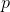 element-wise, given by


where  and 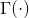 is the Gamma function.

If any of the elements are less than or equal to 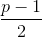, then an error is thrown.

Parameters: 

*   **input** ([_Tensor_](tensors.html#torch.Tensor "torch.Tensor")) – the tensor to compute the multivariate log-gamma function
*   **p** ([_int_](https://docs.python.org/3/library/functions.html#int "(in Python v3.7)")) – the number of dimensions


Example:

```py
>>> a = torch.empty(2, 3).uniform_(1, 2)
>>> a
tensor([[1.6835, 1.8474, 1.1929],
 [1.0475, 1.7162, 1.4180]])
>>> torch.mvlgamma(a, 2)
tensor([[0.3928, 0.4007, 0.7586],
 [1.0311, 0.3901, 0.5049]])

```

```py
torch.neg(input, out=None) → Tensor
```

Returns a new tensor with the negative of the elements of `input`.


Parameters: 

*   **input** ([_Tensor_](tensors.html#torch.Tensor "torch.Tensor")) – the input tensor
*   **out** ([_Tensor_](tensors.html#torch.Tensor "torch.Tensor")_,_ _optional_) – the output tensor


Example:

```py
>>> a = torch.randn(5)
>>> a
tensor([ 0.0090, -0.2262, -0.0682, -0.2866,  0.3940])
>>> torch.neg(a)
tensor([-0.0090,  0.2262,  0.0682,  0.2866, -0.3940])

```

```py
torch.pow()
```

```py
torch.pow(input, exponent, out=None) → Tensor
```

Takes the power of each element in `input` with `exponent` and returns a tensor with the result.

`exponent` can be either a single `float` number or a `Tensor` with the same number of elements as `input`.

When `exponent` is a scalar value, the operation applied is:

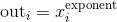

When `exponent` is a tensor, the operation applied is:


When `exponent` is a tensor, the shapes of `input` and `exponent` must be [broadcastable](notes/broadcasting.html#broadcasting-semantics).

Parameters: 

*   **input** ([_Tensor_](tensors.html#torch.Tensor "torch.Tensor")) – the input tensor
*   **exponent** ([_float_](https://docs.python.org/3/library/functions.html#float "(in Python v3.7)") _or_ _tensor_) – the exponent value
*   **out** ([_Tensor_](tensors.html#torch.Tensor "torch.Tensor")_,_ _optional_) – the output tensor


Example:

```py
>>> a = torch.randn(4)
>>> a
tensor([ 0.4331,  1.2475,  0.6834, -0.2791])
>>> torch.pow(a, 2)
tensor([ 0.1875,  1.5561,  0.4670,  0.0779])
>>> exp = torch.arange(1., 5.)

>>> a = torch.arange(1., 5.)
>>> a
tensor([ 1.,  2.,  3.,  4.])
>>> exp
tensor([ 1.,  2.,  3.,  4.])
>>> torch.pow(a, exp)
tensor([   1.,    4.,   27.,  256.])

```

```py
torch.pow(base, input, out=None) → Tensor
```

`base` is a scalar `float` value, and `input` is a tensor. The returned tensor `out` is of the same shape as `input`

The operation applied is:

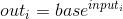

Parameters: 

*   **base** ([_float_](https://docs.python.org/3/library/functions.html#float "(in Python v3.7)")) – the scalar base value for the power operation
*   **input** ([_Tensor_](tensors.html#torch.Tensor "torch.Tensor")) – the exponent tensor
*   **out** ([_Tensor_](tensors.html#torch.Tensor "torch.Tensor")_,_ _optional_) – the output tensor


Example:

```py
>>> exp = torch.arange(1., 5.)
>>> base = 2
>>> torch.pow(base, exp)
tensor([  2.,   4.,   8.,  16.])

```

```py
torch.reciprocal(input, out=None) → Tensor
```

Returns a new tensor with the reciprocal of the elements of `input`


Parameters: 

*   **input** ([_Tensor_](tensors.html#torch.Tensor "torch.Tensor")) – the input tensor
*   **out** ([_Tensor_](tensors.html#torch.Tensor "torch.Tensor")_,_ _optional_) – the output tensor


Example:

```py
>>> a = torch.randn(4)
>>> a
tensor([-0.4595, -2.1219, -1.4314,  0.7298])
>>> torch.reciprocal(a)
tensor([-2.1763, -0.4713, -0.6986,  1.3702])

```

```py
torch.remainder(input, divisor, out=None) → Tensor
```

Computes the element-wise remainder of division.

The divisor and dividend may contain both for integer and floating point numbers. The remainder has the same sign as the divisor.

When `divisor` is a tensor, the shapes of `input` and `divisor` must be [broadcastable](notes/broadcasting.html#broadcasting-semantics).

Parameters: 

*   **input** ([_Tensor_](tensors.html#torch.Tensor "torch.Tensor")) – the dividend
*   **divisor** ([_Tensor_](tensors.html#torch.Tensor "torch.Tensor") _or_ [_float_](https://docs.python.org/3/library/functions.html#float "(in Python v3.7)")) – the divisor that may be either a number or a Tensor of the same shape as the dividend
*   **out** ([_Tensor_](tensors.html#torch.Tensor "torch.Tensor")_,_ _optional_) – the output tensor


Example:

```py
>>> torch.remainder(torch.tensor([-3., -2, -1, 1, 2, 3]), 2)
tensor([ 1.,  0.,  1.,  1.,  0.,  1.])
>>> torch.remainder(torch.tensor([1., 2, 3, 4, 5]), 1.5)
tensor([ 1.0000,  0.5000,  0.0000,  1.0000,  0.5000])

```

See also

[`torch.fmod()`](#torch.fmod "torch.fmod"), which computes the element-wise remainder of division equivalently to the C library function `fmod()`.

```py
torch.round(input, out=None) → Tensor
```

Returns a new tensor with each of the elements of `input` rounded to the closest integer.

Parameters: 

*   **input** ([_Tensor_](tensors.html#torch.Tensor "torch.Tensor")) – the input tensor
*   **out** ([_Tensor_](tensors.html#torch.Tensor "torch.Tensor")_,_ _optional_) – the output tensor


Example:

```py
>>> a = torch.randn(4)
>>> a
tensor([ 0.9920,  0.6077,  0.9734, -1.0362])
>>> torch.round(a)
tensor([ 1.,  1.,  1., -1.])

```

```py
torch.rsqrt(input, out=None) → Tensor
```

Returns a new tensor with the reciprocal of the square-root of each of the elements of `input`.

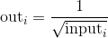

Parameters: 

*   **input** ([_Tensor_](tensors.html#torch.Tensor "torch.Tensor")) – the input tensor
*   **out** ([_Tensor_](tensors.html#torch.Tensor "torch.Tensor")_,_ _optional_) – the output tensor


Example:

```py
>>> a = torch.randn(4)
>>> a
tensor([-0.0370,  0.2970,  1.5420, -0.9105])
>>> torch.rsqrt(a)
tensor([    nan,  1.8351,  0.8053,     nan])

```

```py
torch.sigmoid(input, out=None) → Tensor
```

Returns a new tensor with the sigmoid of the elements of `input`.


Parameters: 

*   **input** ([_Tensor_](tensors.html#torch.Tensor "torch.Tensor")) – the input tensor
*   **out** ([_Tensor_](tensors.html#torch.Tensor "torch.Tensor")_,_ _optional_) – the output tensor


Example:

```py
>>> a = torch.randn(4)
>>> a
tensor([ 0.9213,  1.0887, -0.8858, -1.7683])
>>> torch.sigmoid(a)
tensor([ 0.7153,  0.7481,  0.2920,  0.1458])

```

```py
torch.sign(input, out=None) → Tensor
```

Returns a new tensor with the sign of the elements of `input`.

Parameters: 

*   **input** ([_Tensor_](tensors.html#torch.Tensor "torch.Tensor")) – the input tensor
*   **out** ([_Tensor_](tensors.html#torch.Tensor "torch.Tensor")_,_ _optional_) – the output tensor


Example:

```py
>>> a = torch.tensor([0.7, -1.2, 0., 2.3])
>>> a
tensor([ 0.7000, -1.2000,  0.0000,  2.3000])
>>> torch.sign(a)
tensor([ 1., -1.,  0.,  1.])

```

```py
torch.sin(input, out=None) → Tensor
```

Returns a new tensor with the sine of the elements of `input`.


Parameters: 

*   **input** ([_Tensor_](tensors.html#torch.Tensor "torch.Tensor")) – the input tensor
*   **out** ([_Tensor_](tensors.html#torch.Tensor "torch.Tensor")_,_ _optional_) – the output tensor


Example:

```py
>>> a = torch.randn(4)
>>> a
tensor([-0.5461,  0.1347, -2.7266, -0.2746])
>>> torch.sin(a)
tensor([-0.5194,  0.1343, -0.4032, -0.2711])

```

```py
torch.sinh(input, out=None) → Tensor
```

Returns a new tensor with the hyperbolic sine of the elements of `input`.

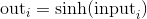

Parameters: 

*   **input** ([_Tensor_](tensors.html#torch.Tensor "torch.Tensor")) – the input tensor
*   **out** ([_Tensor_](tensors.html#torch.Tensor "torch.Tensor")_,_ _optional_) – the output tensor


Example:

```py
>>> a = torch.randn(4)
>>> a
tensor([ 0.5380, -0.8632, -0.1265,  0.9399])
>>> torch.sinh(a)
tensor([ 0.5644, -0.9744, -0.1268,  1.0845])

```

```py
torch.sqrt(input, out=None) → Tensor
```

Returns a new tensor with the square-root of the elements of `input`.


Parameters: 

*   **input** ([_Tensor_](tensors.html#torch.Tensor "torch.Tensor")) – the input tensor
*   **out** ([_Tensor_](tensors.html#torch.Tensor "torch.Tensor")_,_ _optional_) – the output tensor


Example:

```py
>>> a = torch.randn(4)
>>> a
tensor([-2.0755,  1.0226,  0.0831,  0.4806])
>>> torch.sqrt(a)
tensor([    nan,  1.0112,  0.2883,  0.6933])

```

```py
torch.tan(input, out=None) → Tensor
```

Returns a new tensor with the tangent of the elements of `input`.

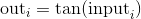

Parameters: 

*   **input** ([_Tensor_](tensors.html#torch.Tensor "torch.Tensor")) – the input tensor
*   **out** ([_Tensor_](tensors.html#torch.Tensor "torch.Tensor")_,_ _optional_) – the output tensor


Example:

```py
>>> a = torch.randn(4)
>>> a
tensor([-1.2027, -1.7687,  0.4412, -1.3856])
>>> torch.tan(a)
tensor([-2.5930,  4.9859,  0.4722, -5.3366])

```

```py
torch.tanh(input, out=None) → Tensor
```

Returns a new tensor with the hyperbolic tangent of the elements of `input`.


Parameters: 

*   **input** ([_Tensor_](tensors.html#torch.Tensor "torch.Tensor")) – the input tensor
*   **out** ([_Tensor_](tensors.html#torch.Tensor "torch.Tensor")_,_ _optional_) – the output tensor


Example:

```py
>>> a = torch.randn(4)
>>> a
tensor([ 0.8986, -0.7279,  1.1745,  0.2611])
>>> torch.tanh(a)
tensor([ 0.7156, -0.6218,  0.8257,  0.2553])

```

```py
torch.trunc(input, out=None) → Tensor
```

Returns a new tensor with the truncated integer values of the elements of `input`.

Parameters: 

*   **input** ([_Tensor_](tensors.html#torch.Tensor "torch.Tensor")) – the input tensor
*   **out** ([_Tensor_](tensors.html#torch.Tensor "torch.Tensor")_,_ _optional_) – the output tensor


Example:

```py
>>> a = torch.randn(4)
>>> a
tensor([ 3.4742,  0.5466, -0.8008, -0.9079])
>>> torch.trunc(a)
tensor([ 3.,  0., -0., -0.])

```

### Reduction Ops

```py
torch.argmax(input, dim=None, keepdim=False)
```

Returns the indices of the maximum values of a tensor across a dimension.

This is the second value returned by [`torch.max()`](#torch.max "torch.max"). See its documentation for the exact semantics of this method.

Parameters: 

*   **input** ([_Tensor_](tensors.html#torch.Tensor "torch.Tensor")) – the input tensor
*   **dim** ([_int_](https://docs.python.org/3/library/functions.html#int "(in Python v3.7)")) – the dimension to reduce. If `None`, the argmax of the flattened input is returned.
*   **keepdim** ([_bool_](https://docs.python.org/3/library/functions.html#bool "(in Python v3.7)")) – whether the output tensors have `dim` retained or not. Ignored if `dim=None`.


Example:

```py
>>> a = torch.randn(4, 4)
>>> a
tensor([[ 1.3398,  0.2663, -0.2686,  0.2450],
 [-0.7401, -0.8805, -0.3402, -1.1936],
 [ 0.4907, -1.3948, -1.0691, -0.3132],
 [-1.6092,  0.5419, -0.2993,  0.3195]])

>>> torch.argmax(a, dim=1)
tensor([ 0,  2,  0,  1])

```

```py
torch.argmin(input, dim=None, keepdim=False)
```

Returns the indices of the minimum values of a tensor across a dimension.

This is the second value returned by [`torch.min()`](#torch.min "torch.min"). See its documentation for the exact semantics of this method.

Parameters: 

*   **input** ([_Tensor_](tensors.html#torch.Tensor "torch.Tensor")) – the input tensor
*   **dim** ([_int_](https://docs.python.org/3/library/functions.html#int "(in Python v3.7)")) – the dimension to reduce. If `None`, the argmin of the flattened input is returned.
*   **keepdim** ([_bool_](https://docs.python.org/3/library/functions.html#bool "(in Python v3.7)")) – whether the output tensors have `dim` retained or not. Ignored if `dim=None`.


Example:

```py
>>> a = torch.randn(4, 4)
>>> a
tensor([[ 0.1139,  0.2254, -0.1381,  0.3687],
 [ 1.0100, -1.1975, -0.0102, -0.4732],
 [-0.9240,  0.1207, -0.7506, -1.0213],
 [ 1.7809, -1.2960,  0.9384,  0.1438]])

>>> torch.argmin(a, dim=1)
tensor([ 2,  1,  3,  1])

```

```py
torch.cumprod(input, dim, dtype=None) → Tensor
```

Returns the cumulative product of elements of `input` in the dimension `dim`.

For example, if `input` is a vector of size N, the result will also be a vector of size N, with elements.


Parameters: 

*   **input** ([_Tensor_](tensors.html#torch.Tensor "torch.Tensor")) – the input tensor
*   **dim** ([_int_](https://docs.python.org/3/library/functions.html#int "(in Python v3.7)")) – the dimension to do the operation over
*   **dtype** ([`torch.dtype`](tensor_attributes.html#torch.torch.dtype "torch.torch.dtype"), optional) – the desired data type of returned tensor. If specified, the input tensor is casted to `dtype` before the operation is performed. This is useful for preventing data type overflows. Default: None.


Example:

```py
>>> a = torch.randn(10)
>>> a
tensor([ 0.6001,  0.2069, -0.1919,  0.9792,  0.6727,  1.0062,  0.4126,
 -0.2129, -0.4206,  0.1968])
>>> torch.cumprod(a, dim=0)
tensor([ 0.6001,  0.1241, -0.0238, -0.0233, -0.0157, -0.0158, -0.0065,
 0.0014, -0.0006, -0.0001])

>>> a[5] = 0.0
>>> torch.cumprod(a, dim=0)
tensor([ 0.6001,  0.1241, -0.0238, -0.0233, -0.0157, -0.0000, -0.0000,
 0.0000, -0.0000, -0.0000])

```

```py
torch.cumsum(input, dim, out=None, dtype=None) → Tensor
```

Returns the cumulative sum of elements of `input` in the dimension `dim`.

For example, if `input` is a vector of size N, the result will also be a vector of size N, with elements.

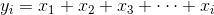

Parameters: 

*   **input** ([_Tensor_](tensors.html#torch.Tensor "torch.Tensor")) – the input tensor
*   **dim** ([_int_](https://docs.python.org/3/library/functions.html#int "(in Python v3.7)")) – the dimension to do the operation over
*   **dtype** ([`torch.dtype`](tensor_attributes.html#torch.torch.dtype "torch.torch.dtype"), optional) – the desired data type of returned tensor. If specified, the input tensor is casted to `dtype` before the operation is performed. This is useful for preventing data type overflows. Default: None.


Example:

```py
>>> a = torch.randn(10)
>>> a
tensor([-0.8286, -0.4890,  0.5155,  0.8443,  0.1865, -0.1752, -2.0595,
 0.1850, -1.1571, -0.4243])
>>> torch.cumsum(a, dim=0)
tensor([-0.8286, -1.3175, -0.8020,  0.0423,  0.2289,  0.0537, -2.0058,
 -1.8209, -2.9780, -3.4022])

```

```py
torch.dist(input, other, p=2) → Tensor
```

Returns the p-norm of (`input` - `other`)

The shapes of `input` and `other` must be [broadcastable](notes/broadcasting.html#broadcasting-semantics).

Parameters: 

*   **input** ([_Tensor_](tensors.html#torch.Tensor "torch.Tensor")) – the input tensor
*   **other** ([_Tensor_](tensors.html#torch.Tensor "torch.Tensor")) – the Right-hand-side input tensor
*   **p** ([_float_](https://docs.python.org/3/library/functions.html#float "(in Python v3.7)")_,_ _optional_) – the norm to be computed


Example:

```py
>>> x = torch.randn(4)
>>> x
tensor([-1.5393, -0.8675,  0.5916,  1.6321])
>>> y = torch.randn(4)
>>> y
tensor([ 0.0967, -1.0511,  0.6295,  0.8360])
>>> torch.dist(x, y, 3.5)
tensor(1.6727)
>>> torch.dist(x, y, 3)
tensor(1.6973)
>>> torch.dist(x, y, 0)
tensor(inf)
>>> torch.dist(x, y, 1)
tensor(2.6537)

```

```py
torch.logsumexp(input, dim, keepdim=False, out=None)
```

Returns the log of summed exponentials of each row of the `input` tensor in the given dimension `dim`. The computation is numerically stabilized.

For summation index  given by `dim` and other indices , the result is

> 

If `keepdim` is `True`, the output tensor is of the same size as `input` except in the dimension `dim` where it is of size 1. Otherwise, `dim` is squeezed (see [`torch.squeeze()`](#torch.squeeze "torch.squeeze")), resulting in the output tensor having 1 fewer dimension than `input`.

Parameters: 

*   **input** ([_Tensor_](tensors.html#torch.Tensor "torch.Tensor")) – the input tensor
*   **dim** ([_int_](https://docs.python.org/3/library/functions.html#int "(in Python v3.7)") _or_ _tuple of python:ints_) – the dimension or dimensions to reduce
*   **keepdim** ([_bool_](https://docs.python.org/3/library/functions.html#bool "(in Python v3.7)")) – whether the output tensor has `dim` retained or not
*   **out** ([_Tensor_](tensors.html#torch.Tensor "torch.Tensor")_,_ _optional_) – the output tensor


```py
Example::
```

```py
>>> a = torch.randn(3, 3)
>>> torch.logsumexp(a, 1)
tensor([ 0.8442,  1.4322,  0.8711])

```

```py
torch.mean()
```

```py
torch.mean(input) → Tensor
```

Returns the mean value of all elements in the `input` tensor.

| Parameters: | **input** ([_Tensor_](tensors.html#torch.Tensor "torch.Tensor")) – the input tensor |
| --- | --- |

Example:

```py
>>> a = torch.randn(1, 3)
>>> a
tensor([[ 0.2294, -0.5481,  1.3288]])
>>> torch.mean(a)
tensor(0.3367)

```

```py
torch.mean(input, dim, keepdim=False, out=None) → Tensor
```

Returns the mean value of each row of the `input` tensor in the given dimension `dim`. If `dim` is a list of dimensions, reduce over all of them.

If `keepdim` is `True`, the output tensor is of the same size as `input` except in the dimension(s) `dim` where it is of size 1. Otherwise, `dim` is squeezed (see [`torch.squeeze()`](#torch.squeeze "torch.squeeze")), resulting in the output tensor having 1 (or `len(dim)`) fewer dimension(s).

Parameters: 

*   **input** ([_Tensor_](tensors.html#torch.Tensor "torch.Tensor")) – the input tensor
*   **dim** ([_int_](https://docs.python.org/3/library/functions.html#int "(in Python v3.7)")) – the dimension to reduce
*   **keepdim** ([_bool_](https://docs.python.org/3/library/functions.html#bool "(in Python v3.7)")_,_ _optional_) – whether the output tensor has `dim` retained or not
*   **out** ([_Tensor_](tensors.html#torch.Tensor "torch.Tensor")) – the output tensor


Example:

```py
>>> a = torch.randn(4, 4)
>>> a
tensor([[-0.3841,  0.6320,  0.4254, -0.7384],
 [-0.9644,  1.0131, -0.6549, -1.4279],
 [-0.2951, -1.3350, -0.7694,  0.5600],
 [ 1.0842, -0.9580,  0.3623,  0.2343]])
>>> torch.mean(a, 1)
tensor([-0.0163, -0.5085, -0.4599,  0.1807])
>>> torch.mean(a, 1, True)
tensor([[-0.0163],
 [-0.5085],
 [-0.4599],
 [ 0.1807]])

```

```py
torch.median()
```

```py
torch.median(input) → Tensor
```

Returns the median value of all elements in the `input` tensor.

| Parameters: | **input** ([_Tensor_](tensors.html#torch.Tensor "torch.Tensor")) – the input tensor |
| --- | --- |

Example:

```py
>>> a = torch.randn(1, 3)
>>> a
tensor([[ 1.5219, -1.5212,  0.2202]])
>>> torch.median(a)
tensor(0.2202)

```

```py
torch.median(input, dim=-1, keepdim=False, values=None, indices=None) -> (Tensor, LongTensor)
```

Returns the median value of each row of the `input` tensor in the given dimension `dim`. Also returns the index location of the median value as a `LongTensor`.

By default, `dim` is the last dimension of the `input` tensor.

If `keepdim` is `True`, the output tensors are of the same size as `input` except in the dimension `dim` where they are of size 1. Otherwise, `dim` is squeezed (see [`torch.squeeze()`](#torch.squeeze "torch.squeeze")), resulting in the outputs tensor having 1 fewer dimension than `input`.

Parameters: 

*   **input** ([_Tensor_](tensors.html#torch.Tensor "torch.Tensor")) – the input tensor
*   **dim** ([_int_](https://docs.python.org/3/library/functions.html#int "(in Python v3.7)")) – the dimension to reduce
*   **keepdim** ([_bool_](https://docs.python.org/3/library/functions.html#bool "(in Python v3.7)")) – whether the output tensors have `dim` retained or not
*   **values** ([_Tensor_](tensors.html#torch.Tensor "torch.Tensor")_,_ _optional_) – the output tensor
*   **indices** ([_Tensor_](tensors.html#torch.Tensor "torch.Tensor")_,_ _optional_) – the output index tensor


Example:

```py
>>> a = torch.randn(4, 5)
>>> a
tensor([[ 0.2505, -0.3982, -0.9948,  0.3518, -1.3131],
 [ 0.3180, -0.6993,  1.0436,  0.0438,  0.2270],
 [-0.2751,  0.7303,  0.2192,  0.3321,  0.2488],
 [ 1.0778, -1.9510,  0.7048,  0.4742, -0.7125]])
>>> torch.median(a, 1)
(tensor([-0.3982,  0.2270,  0.2488,  0.4742]), tensor([ 1,  4,  4,  3]))

```

```py
torch.mode(input, dim=-1, keepdim=False, values=None, indices=None) -> (Tensor, LongTensor)
```

Returns the mode value of each row of the `input` tensor in the given dimension `dim`. Also returns the index location of the mode value as a `LongTensor`.

By default, `dim` is the last dimension of the `input` tensor.

If `keepdim` is `True`, the output tensors are of the same size as `input` except in the dimension `dim` where they are of size 1. Otherwise, `dim` is squeezed (see [`torch.squeeze()`](#torch.squeeze "torch.squeeze")), resulting in the output tensors having 1 fewer dimension than `input`.

Note

This function is not defined for `torch.cuda.Tensor` yet.

Parameters: 

*   **input** ([_Tensor_](tensors.html#torch.Tensor "torch.Tensor")) – the input tensor
*   **dim** ([_int_](https://docs.python.org/3/library/functions.html#int "(in Python v3.7)")) – the dimension to reduce
*   **keepdim** ([_bool_](https://docs.python.org/3/library/functions.html#bool "(in Python v3.7)")) – whether the output tensors have `dim` retained or not
*   **values** ([_Tensor_](tensors.html#torch.Tensor "torch.Tensor")_,_ _optional_) – the output tensor
*   **indices** ([_Tensor_](tensors.html#torch.Tensor "torch.Tensor")_,_ _optional_) – the output index tensor


Example:

```py
>>> a = torch.randn(4, 5)
>>> a
tensor([[-1.2808, -1.0966, -1.5946, -0.1148,  0.3631],
 [ 1.1395,  1.1452, -0.6383,  0.3667,  0.4545],
 [-0.4061, -0.3074,  0.4579, -1.3514,  1.2729],
 [-1.0130,  0.3546, -1.4689, -0.1254,  0.0473]])
>>> torch.mode(a, 1)
(tensor([-1.5946, -0.6383, -1.3514, -1.4689]), tensor([ 2,  2,  3,  2]))

```

```py
torch.norm(input, p='fro', dim=None, keepdim=False, out=None)
```

Returns the matrix norm or vector norm of a given tensor.

Parameters: 

*   **input** ([_Tensor_](tensors.html#torch.Tensor "torch.Tensor")) – the input tensor
*   **p** ([_int_](https://docs.python.org/3/library/functions.html#int "(in Python v3.7)")_,_ [_float_](https://docs.python.org/3/library/functions.html#float "(in Python v3.7)")_,_ _inf__,_ _-inf__,_ _'fro'__,_ _'nuc'__,_ _optional_) –

    the order of norm. Default: `'fro'` The following norms can be calculated:

    &#124; ord &#124; matrix norm &#124; vector norm &#124;
    &#124; --- &#124; --- &#124; --- &#124;
    &#124; None &#124; Frobenius norm &#124; 2-norm &#124;
    &#124; ’fro’ &#124; Frobenius norm &#124; – &#124;
    &#124; ‘nuc’ &#124; nuclear norm &#124; – &#124;
    &#124; Other &#124; as vec norm when dim is None &#124; sum(abs(x)**ord)**(1./ord) &#124;

*   **dim** ([_int_](https://docs.python.org/3/library/functions.html#int "(in Python v3.7)")_,_ _2-tuple of python:ints__,_ _2-list of python:ints__,_ _optional_) – If it is an int, vector norm will be calculated, if it is 2-tuple of ints, matrix norm will be calculated. If the value is None, matrix norm will be calculated when the input tensor only has two dimensions, vector norm will be calculated when the input tensor only has one dimension. If the input tensor has more than two dimensions, the vector norm will be applied to last dimension.
*   **keepdim** ([_bool_](https://docs.python.org/3/library/functions.html#bool "(in Python v3.7)")_,_ _optional_) – whether the output tensors have `dim` retained or not. Ignored if `dim` = `None` and `out` = `None`. Default: `False`
*   **out** ([_Tensor_](tensors.html#torch.Tensor "torch.Tensor")_,_ _optional_) – the output tensor. Ignored if `dim` = `None` and `out` = `None`.


Example:

```py
>>> import torch
>>> a = torch.arange(9, dtype= torch.float) - 4
>>> b = a.reshape((3, 3))
>>> torch.norm(a)
tensor(7.7460)
>>> torch.norm(b)
tensor(7.7460)
>>> torch.norm(a, float('inf'))
tensor(4.)
>>> torch.norm(b, float('inf'))
tensor([4., 3., 4.])
>>> c = torch.tensor([[ 1, 2, 3],[-1, 1, 4]] , dtype= torch.float)
>>> torch.norm(c, dim=0)
tensor([1.4142, 2.2361, 5.0000])
>>> torch.norm(c, dim=1)
tensor([3.7417, 4.2426])
>>> torch.norm(c, p=1, dim=1)
tensor([6., 6.])
>>> d = torch.arange(8, dtype= torch.float).reshape(2,2,2)
>>> torch.norm(d, dim=(1,2))
tensor([ 3.7417, 11.2250])
>>> torch.norm(d[0, :, :]), torch.norm(d[1, :, :])
(tensor(3.7417), tensor(11.2250))

```

```py
torch.prod()
```

```py
torch.prod(input, dtype=None) → Tensor
```

Returns the product of all elements in the `input` tensor.

Parameters: 

*   **input** ([_Tensor_](tensors.html#torch.Tensor "torch.Tensor")) – the input tensor
*   **dtype** ([`torch.dtype`](tensor_attributes.html#torch.torch.dtype "torch.torch.dtype"), optional) – the desired data type of returned tensor. If specified, the input tensor is casted to `dtype` before the operation is performed. This is useful for preventing data type overflows. Default: None.


Example:

```py
>>> a = torch.randn(1, 3)
>>> a
tensor([[-0.8020,  0.5428, -1.5854]])
>>> torch.prod(a)
tensor(0.6902)

```

```py
torch.prod(input, dim, keepdim=False, dtype=None) → Tensor
```

Returns the product of each row of the `input` tensor in the given dimension `dim`.

If `keepdim` is `True`, the output tensor is of the same size as `input` except in the dimension `dim` where it is of size 1. Otherwise, `dim` is squeezed (see [`torch.squeeze()`](#torch.squeeze "torch.squeeze")), resulting in the output tensor having 1 fewer dimension than `input`.

Parameters: 

*   **input** ([_Tensor_](tensors.html#torch.Tensor "torch.Tensor")) – the input tensor
*   **dim** ([_int_](https://docs.python.org/3/library/functions.html#int "(in Python v3.7)")) – the dimension to reduce
*   **keepdim** ([_bool_](https://docs.python.org/3/library/functions.html#bool "(in Python v3.7)")) – whether the output tensor has `dim` retained or not
*   **dtype** ([`torch.dtype`](tensor_attributes.html#torch.torch.dtype "torch.torch.dtype"), optional) – the desired data type of returned tensor. If specified, the input tensor is casted to `dtype` before the operation is performed. This is useful for preventing data type overflows. Default: None.


Example:

```py
>>> a = torch.randn(4, 2)
>>> a
tensor([[ 0.5261, -0.3837],
 [ 1.1857, -0.2498],
 [-1.1646,  0.0705],
 [ 1.1131, -1.0629]])
>>> torch.prod(a, 1)
tensor([-0.2018, -0.2962, -0.0821, -1.1831])

```

```py
torch.std()
```

```py
torch.std(input, unbiased=True) → Tensor
```

Returns the standard-deviation of all elements in the `input` tensor.

If `unbiased` is `False`, then the standard-deviation will be calculated via the biased estimator. Otherwise, Bessel’s correction will be used.

Parameters: 

*   **input** ([_Tensor_](tensors.html#torch.Tensor "torch.Tensor")) – the input tensor
*   **unbiased** ([_bool_](https://docs.python.org/3/library/functions.html#bool "(in Python v3.7)")) – whether to use the unbiased estimation or not


Example:

```py
>>> a = torch.randn(1, 3)
>>> a
tensor([[-0.8166, -1.3802, -0.3560]])
>>> torch.std(a)
tensor(0.5130)

```

```py
torch.std(input, dim, keepdim=False, unbiased=True, out=None) → Tensor
```

Returns the standard-deviation of each row of the `input` tensor in the given dimension `dim`.

If `keepdim` is `True`, the output tensor is of the same size as `input` except in the dimension `dim` where it is of size 1. Otherwise, `dim` is squeezed (see [`torch.squeeze()`](#torch.squeeze "torch.squeeze")), resulting in the output tensor having 1 fewer dimension than `input`.

If `unbiased` is `False`, then the standard-deviation will be calculated via the biased estimator. Otherwise, Bessel’s correction will be used.

Parameters: 

*   **input** ([_Tensor_](tensors.html#torch.Tensor "torch.Tensor")) – the input tensor
*   **dim** ([_int_](https://docs.python.org/3/library/functions.html#int "(in Python v3.7)")) – the dimension to reduce
*   **keepdim** ([_bool_](https://docs.python.org/3/library/functions.html#bool "(in Python v3.7)")) – whether the output tensor has `dim` retained or not
*   **unbiased** ([_bool_](https://docs.python.org/3/library/functions.html#bool "(in Python v3.7)")) – whether to use the unbiased estimation or not
*   **out** ([_Tensor_](tensors.html#torch.Tensor "torch.Tensor")_,_ _optional_) – the output tensor


Example:

```py
>>> a = torch.randn(4, 4)
>>> a
tensor([[ 0.2035,  1.2959,  1.8101, -0.4644],
 [ 1.5027, -0.3270,  0.5905,  0.6538],
 [-1.5745,  1.3330, -0.5596, -0.6548],
 [ 0.1264, -0.5080,  1.6420,  0.1992]])
>>> torch.std(a, dim=1)
tensor([ 1.0311,  0.7477,  1.2204,  0.9087])

```

```py
torch.sum()
```

```py
torch.sum(input, dtype=None) → Tensor
```

Returns the sum of all elements in the `input` tensor.

Parameters: 

*   **input** ([_Tensor_](tensors.html#torch.Tensor "torch.Tensor")) – the input tensor
*   **dtype** ([`torch.dtype`](tensor_attributes.html#torch.torch.dtype "torch.torch.dtype"), optional) – the desired data type of returned tensor. If specified, the input tensor is casted to `dtype` before the operation is performed. This is useful for preventing data type overflows. Default: None.


Example:

```py
>>> a = torch.randn(1, 3)
>>> a
tensor([[ 0.1133, -0.9567,  0.2958]])
>>> torch.sum(a)
tensor(-0.5475)

```

```py
torch.sum(input, dim, keepdim=False, dtype=None) → Tensor
```

Returns the sum of each row of the `input` tensor in the given dimension `dim`. If `dim` is a list of dimensions, reduce over all of them.

If `keepdim` is `True`, the output tensor is of the same size as `input` except in the dimension(s) `dim` where it is of size 1. Otherwise, `dim` is squeezed (see [`torch.squeeze()`](#torch.squeeze "torch.squeeze")), resulting in the output tensor having 1 (or `len(dim)`) fewer dimension(s).

Parameters: 

*   **input** ([_Tensor_](tensors.html#torch.Tensor "torch.Tensor")) – the input tensor
*   **dim** ([_int_](https://docs.python.org/3/library/functions.html#int "(in Python v3.7)") _or_ _tuple of python:ints_) – the dimension or dimensions to reduce
*   **keepdim** ([_bool_](https://docs.python.org/3/library/functions.html#bool "(in Python v3.7)")) – whether the output tensor has `dim` retained or not
*   **dtype** ([`torch.dtype`](tensor_attributes.html#torch.torch.dtype "torch.torch.dtype"), optional) – the desired data type of returned tensor. If specified, the input tensor is casted to `dtype` before the operation is performed. This is useful for preventing data type overflows. Default: None.


Example:

```py
>>> a = torch.randn(4, 4)
>>> a
tensor([[ 0.0569, -0.2475,  0.0737, -0.3429],
 [-0.2993,  0.9138,  0.9337, -1.6864],
 [ 0.1132,  0.7892, -0.1003,  0.5688],
 [ 0.3637, -0.9906, -0.4752, -1.5197]])
>>> torch.sum(a, 1)
tensor([-0.4598, -0.1381,  1.3708, -2.6217])
>>> b = torch.arange(4 * 5 * 6).view(4, 5, 6)
>>> torch.sum(b, (2, 1))
tensor([  435.,  1335.,  2235.,  3135.])

```

```py
torch.unique(input, sorted=False, return_inverse=False, dim=None)
```

Returns the unique scalar elements of the input tensor as a 1-D tensor.

Parameters: 

*   **input** ([_Tensor_](tensors.html#torch.Tensor "torch.Tensor")) – the input tensor
*   **sorted** ([_bool_](https://docs.python.org/3/library/functions.html#bool "(in Python v3.7)")) – Whether to sort the unique elements in ascending order before returning as output.
*   **return_inverse** ([_bool_](https://docs.python.org/3/library/functions.html#bool "(in Python v3.7)")) – Whether to also return the indices for where elements in the original input ended up in the returned unique list.
*   **dim** ([_int_](https://docs.python.org/3/library/functions.html#int "(in Python v3.7)")) – the dimension to apply unique. If `None`, the unique of the flattened input is returned. default: `None`


| Returns: | A tensor or a tuple of tensors containing

&gt; *   **output** (_Tensor_): the output list of unique scalar elements.
&gt; *   **inverse_indices** (_Tensor_): (optional) if `return_inverse` is True, there will be a 2nd returned tensor (same shape as input) representing the indices for where elements in the original input map to in the output; otherwise, this function will only return a single tensor.


| Return type: | ([Tensor](tensors.html#torch.Tensor "torch.Tensor"), [Tensor](tensors.html#torch.Tensor "torch.Tensor") (optional)) |
| --- | --- |

Example:

```py
>>> output = torch.unique(torch.tensor([1, 3, 2, 3], dtype=torch.long))
>>> output
tensor([ 2,  3,  1])

>>> output, inverse_indices = torch.unique(
 torch.tensor([1, 3, 2, 3], dtype=torch.long), sorted=True, return_inverse=True)
>>> output
tensor([ 1,  2,  3])
>>> inverse_indices
tensor([ 0,  2,  1,  2])

>>> output, inverse_indices = torch.unique(
 torch.tensor([[1, 3], [2, 3]], dtype=torch.long), sorted=True, return_inverse=True)
>>> output
tensor([ 1,  2,  3])
>>> inverse_indices
tensor([[ 0,  2],
 [ 1,  2]])

```

```py
torch.var()
```

```py
torch.var(input, unbiased=True) → Tensor
```

Returns the variance of all elements in the `input` tensor.

If `unbiased` is `False`, then the variance will be calculated via the biased estimator. Otherwise, Bessel’s correction will be used.

Parameters: 

*   **input** ([_Tensor_](tensors.html#torch.Tensor "torch.Tensor")) – the input tensor
*   **unbiased** ([_bool_](https://docs.python.org/3/library/functions.html#bool "(in Python v3.7)")) – whether to use the unbiased estimation or not


Example:

```py
>>> a = torch.randn(1, 3)
>>> a
tensor([[-0.3425, -1.2636, -0.4864]])
>>> torch.var(a)
tensor(0.2455)

```

```py
torch.var(input, dim, keepdim=False, unbiased=True, out=None) → Tensor
```

Returns the variance of each row of the `input` tensor in the given dimension `dim`.

If `keepdim` is `True`, the output tensors are of the same size as `input` except in the dimension `dim` where they are of size 1. Otherwise, `dim` is squeezed (see [`torch.squeeze()`](#torch.squeeze "torch.squeeze")), resulting in the outputs tensor having 1 fewer dimension than `input`.

If `unbiased` is `False`, then the variance will be calculated via the biased estimator. Otherwise, Bessel’s correction will be used.

Parameters: 

*   **input** ([_Tensor_](tensors.html#torch.Tensor "torch.Tensor")) – the input tensor
*   **dim** ([_int_](https://docs.python.org/3/library/functions.html#int "(in Python v3.7)")) – the dimension to reduce
*   **keepdim** ([_bool_](https://docs.python.org/3/library/functions.html#bool "(in Python v3.7)")) – whether the output tensor has `dim` retained or not
*   **unbiased** ([_bool_](https://docs.python.org/3/library/functions.html#bool "(in Python v3.7)")) – whether to use the unbiased estimation or not
*   **out** ([_Tensor_](tensors.html#torch.Tensor "torch.Tensor")_,_ _optional_) – the output tensor


Example:

```py
>>> a = torch.randn(4, 4)
>>> a
tensor([[-0.3567,  1.7385, -1.3042,  0.7423],
 [ 1.3436, -0.1015, -0.9834, -0.8438],
 [ 0.6056,  0.1089, -0.3112, -1.4085],
 [-0.7700,  0.6074, -0.1469,  0.7777]])
>>> torch.var(a, 1)
tensor([ 1.7444,  1.1363,  0.7356,  0.5112])

```

### Comparison Ops

```py
torch.allclose(self, other, rtol=1e-05, atol=1e-08, equal_nan=False) → bool
```

This function checks if all `self` and `other` satisfy the condition:

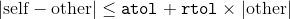

elementwise, for all elements of `self` and `other`. The behaviour of this function is analogous to [numpy.allclose](https://docs.scipy.org/doc/numpy/reference/generated/numpy.allclose.html)

Parameters: 

*   **self** ([_Tensor_](tensors.html#torch.Tensor "torch.Tensor")) – first tensor to compare
*   **other** ([_Tensor_](tensors.html#torch.Tensor "torch.Tensor")) – second tensor to compare
*   **atol** ([_float_](https://docs.python.org/3/library/functions.html#float "(in Python v3.7)")_,_ _optional_) – absolute tolerance. Default: 1e-08
*   **rtol** ([_float_](https://docs.python.org/3/library/functions.html#float "(in Python v3.7)")_,_ _optional_) – relative tolerance. Default: 1e-05
*   **equal_nan** ([_float_](https://docs.python.org/3/library/functions.html#float "(in Python v3.7)")_,_ _optional_) – if `True`, then two `NaN` s will be compared as equal. Default: `False`


Example:

```py
>>> torch.allclose(torch.tensor([10000., 1e-07]), torch.tensor([10000.1, 1e-08]))
False
>>> torch.allclose(torch.tensor([10000., 1e-08]), torch.tensor([10000.1, 1e-09]))
True
>>> torch.allclose(torch.tensor([1.0, float('nan')]), torch.tensor([1.0, float('nan')]))
False
>>> torch.allclose(torch.tensor([1.0, float('nan')]), torch.tensor([1.0, float('nan')]), equal_nan=True)
True

```

```py
torch.argsort(input, dim=None, descending=False)
```

Returns the indices that sort a tensor along a given dimension in ascending order by value.

This is the second value returned by [`torch.sort()`](#torch.sort "torch.sort"). See its documentation for the exact semantics of this method.

Parameters: 

*   **input** ([_Tensor_](tensors.html#torch.Tensor "torch.Tensor")) – the input tensor
*   **dim** ([_int_](https://docs.python.org/3/library/functions.html#int "(in Python v3.7)")_,_ _optional_) – the dimension to sort along
*   **descending** ([_bool_](https://docs.python.org/3/library/functions.html#bool "(in Python v3.7)")_,_ _optional_) – controls the sorting order (ascending or descending)


Example:

```py
>>> a = torch.randn(4, 4)
>>> a
tensor([[ 0.0785,  1.5267, -0.8521,  0.4065],
 [ 0.1598,  0.0788, -0.0745, -1.2700],
 [ 1.2208,  1.0722, -0.7064,  1.2564],
 [ 0.0669, -0.2318, -0.8229, -0.9280]])

>>> torch.argsort(a, dim=1)
tensor([[2, 0, 3, 1],
 [3, 2, 1, 0],
 [2, 1, 0, 3],
 [3, 2, 1, 0]])

```

```py
torch.eq(input, other, out=None) → Tensor
```

Computes element-wise equality

The second argument can be a number or a tensor whose shape is [broadcastable](notes/broadcasting.html#broadcasting-semantics) with the first argument.

Parameters: 

*   **input** ([_Tensor_](tensors.html#torch.Tensor "torch.Tensor")) – the tensor to compare
*   **other** ([_Tensor_](tensors.html#torch.Tensor "torch.Tensor") _or_ [_float_](https://docs.python.org/3/library/functions.html#float "(in Python v3.7)")) – the tensor or value to compare
*   **out** ([_Tensor_](tensors.html#torch.Tensor "torch.Tensor")_,_ _optional_) – the output tensor. Must be a `ByteTensor`


| Returns: | A `torch.ByteTensor` containing a 1 at each location where comparison is true |
| --- | --- |
| Return type: | [Tensor](tensors.html#torch.Tensor "torch.Tensor") |
| --- | --- |

Example:

```py
>>> torch.eq(torch.tensor([[1, 2], [3, 4]]), torch.tensor([[1, 1], [4, 4]]))
tensor([[ 1,  0],
 [ 0,  1]], dtype=torch.uint8)

```

```py
torch.equal(tensor1, tensor2) → bool
```

`True` if two tensors have the same size and elements, `False` otherwise.

Example:

```py
>>> torch.equal(torch.tensor([1, 2]), torch.tensor([1, 2]))
True

```

```py
torch.ge(input, other, out=None) → Tensor
```

Computes 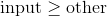 element-wise.

The second argument can be a number or a tensor whose shape is [broadcastable](notes/broadcasting.html#broadcasting-semantics) with the first argument.

Parameters: 

*   **input** ([_Tensor_](tensors.html#torch.Tensor "torch.Tensor")) – the tensor to compare
*   **other** ([_Tensor_](tensors.html#torch.Tensor "torch.Tensor") _or_ [_float_](https://docs.python.org/3/library/functions.html#float "(in Python v3.7)")) – the tensor or value to compare
*   **out** ([_Tensor_](tensors.html#torch.Tensor "torch.Tensor")_,_ _optional_) – the output tensor that must be a `ByteTensor`


| Returns: | A `torch.ByteTensor` containing a 1 at each location where comparison is true |
| --- | --- |
| Return type: | [Tensor](tensors.html#torch.Tensor "torch.Tensor") |
| --- | --- |

Example:

```py
>>> torch.ge(torch.tensor([[1, 2], [3, 4]]), torch.tensor([[1, 1], [4, 4]]))
tensor([[ 1,  1],
 [ 0,  1]], dtype=torch.uint8)

```

```py
torch.gt(input, other, out=None) → Tensor
```

Computes 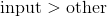 element-wise.

The second argument can be a number or a tensor whose shape is [broadcastable](notes/broadcasting.html#broadcasting-semantics) with the first argument.

Parameters: 

*   **input** ([_Tensor_](tensors.html#torch.Tensor "torch.Tensor")) – the tensor to compare
*   **other** ([_Tensor_](tensors.html#torch.Tensor "torch.Tensor") _or_ [_float_](https://docs.python.org/3/library/functions.html#float "(in Python v3.7)")) – the tensor or value to compare
*   **out** ([_Tensor_](tensors.html#torch.Tensor "torch.Tensor")_,_ _optional_) – the output tensor that must be a `ByteTensor`


| Returns: | A `torch.ByteTensor` containing a 1 at each location where comparison is true |
| --- | --- |
| Return type: | [Tensor](tensors.html#torch.Tensor "torch.Tensor") |
| --- | --- |

Example:

```py
>>> torch.gt(torch.tensor([[1, 2], [3, 4]]), torch.tensor([[1, 1], [4, 4]]))
tensor([[ 0,  1],
 [ 0,  0]], dtype=torch.uint8)

```

```py
torch.isfinite(tensor)
```

Returns a new tensor with boolean elements representing if each element is `Finite` or not.

| Parameters: | **tensor** ([_Tensor_](tensors.html#torch.Tensor "torch.Tensor")) – A tensor to check |
| --- | --- |
| Returns: | A `torch.ByteTensor` containing a 1 at each location of finite elements and 0 otherwise |
| --- | --- |
| Return type: | [Tensor](tensors.html#torch.Tensor "torch.Tensor") |
| --- | --- |

Example:

```py
>>> torch.isfinite(torch.tensor([1, float('inf'), 2, float('-inf'), float('nan')]))
tensor([ 1,  0,  1,  0,  0], dtype=torch.uint8)

```

```py
torch.isinf(tensor)
```

Returns a new tensor with boolean elements representing if each element is `+/-INF` or not.

| Parameters: | **tensor** ([_Tensor_](tensors.html#torch.Tensor "torch.Tensor")) – A tensor to check |
| --- | --- |
| Returns: | A `torch.ByteTensor` containing a 1 at each location of `+/-INF` elements and 0 otherwise |
| --- | --- |
| Return type: | [Tensor](tensors.html#torch.Tensor "torch.Tensor") |
| --- | --- |

Example:

```py
>>> torch.isinf(torch.tensor([1, float('inf'), 2, float('-inf'), float('nan')]))
tensor([ 0,  1,  0,  1,  0], dtype=torch.uint8)

```

```py
torch.isnan(tensor)
```

Returns a new tensor with boolean elements representing if each element is `NaN` or not.

| Parameters: | **tensor** ([_Tensor_](tensors.html#torch.Tensor "torch.Tensor")) – A tensor to check |
| --- | --- |
| Returns: | A `torch.ByteTensor` containing a 1 at each location of `NaN` elements. |
| --- | --- |
| Return type: | [Tensor](tensors.html#torch.Tensor "torch.Tensor") |
| --- | --- |

Example:

```py
>>> torch.isnan(torch.tensor([1, float('nan'), 2]))
tensor([ 0,  1,  0], dtype=torch.uint8)

```

```py
torch.kthvalue(input, k, dim=None, keepdim=False, out=None) -> (Tensor, LongTensor)
```

Returns the `k` th smallest element of the given `input` tensor along a given dimension.

If `dim` is not given, the last dimension of the `input` is chosen.

A tuple of `(values, indices)` is returned, where the `indices` is the indices of the kth-smallest element in the original `input` tensor in dimension `dim`.

If `keepdim` is `True`, both the `values` and `indices` tensors are the same size as `input`, except in the dimension `dim` where they are of size 1\. Otherwise, `dim` is squeezed (see [`torch.squeeze()`](#torch.squeeze "torch.squeeze")), resulting in both the `values` and `indices` tensors having 1 fewer dimension than the `input` tensor.

Parameters: 

*   **input** ([_Tensor_](tensors.html#torch.Tensor "torch.Tensor")) – the input tensor
*   **k** ([_int_](https://docs.python.org/3/library/functions.html#int "(in Python v3.7)")) – k for the k-th smallest element
*   **dim** ([_int_](https://docs.python.org/3/library/functions.html#int "(in Python v3.7)")_,_ _optional_) – the dimension to find the kth value along
*   **keepdim** ([_bool_](https://docs.python.org/3/library/functions.html#bool "(in Python v3.7)")) – whether the output tensors have `dim` retained or not
*   **out** ([_tuple_](https://docs.python.org/3/library/stdtypes.html#tuple "(in Python v3.7)")_,_ _optional_) – the output tuple of (Tensor, LongTensor) can be optionally given to be used as output buffers


Example:

```py
>>> x = torch.arange(1., 6.)
>>> x
tensor([ 1.,  2.,  3.,  4.,  5.])
>>> torch.kthvalue(x, 4)
(tensor(4.), tensor(3))

>>> x=torch.arange(1.,7.).resize_(2,3)
>>> x
tensor([[ 1.,  2.,  3.],
 [ 4.,  5.,  6.]])
>>> torch.kthvalue(x,2,0,True)
(tensor([[ 4.,  5.,  6.]]), tensor([[ 1,  1,  1]]))

```

```py
torch.le(input, other, out=None) → Tensor
```

Computes 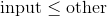 element-wise.

The second argument can be a number or a tensor whose shape is [broadcastable](notes/broadcasting.html#broadcasting-semantics) with the first argument.

Parameters: 

*   **input** ([_Tensor_](tensors.html#torch.Tensor "torch.Tensor")) – the tensor to compare
*   **other** ([_Tensor_](tensors.html#torch.Tensor "torch.Tensor") _or_ [_float_](https://docs.python.org/3/library/functions.html#float "(in Python v3.7)")) – the tensor or value to compare
*   **out** ([_Tensor_](tensors.html#torch.Tensor "torch.Tensor")_,_ _optional_) – the output tensor that must be a `ByteTensor`


| Returns: | A `torch.ByteTensor` containing a 1 at each location where comparison is true |
| --- | --- |
| Return type: | [Tensor](tensors.html#torch.Tensor "torch.Tensor") |
| --- | --- |

Example:

```py
>>> torch.le(torch.tensor([[1, 2], [3, 4]]), torch.tensor([[1, 1], [4, 4]]))
tensor([[ 1,  0],
 [ 1,  1]], dtype=torch.uint8)

```

```py
torch.lt(input, other, out=None) → Tensor
```

Computes 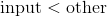 element-wise.

The second argument can be a number or a tensor whose shape is [broadcastable](notes/broadcasting.html#broadcasting-semantics) with the first argument.

Parameters: 

*   **input** ([_Tensor_](tensors.html#torch.Tensor "torch.Tensor")) – the tensor to compare
*   **other** ([_Tensor_](tensors.html#torch.Tensor "torch.Tensor") _or_ [_float_](https://docs.python.org/3/library/functions.html#float "(in Python v3.7)")) – the tensor or value to compare
*   **out** ([_Tensor_](tensors.html#torch.Tensor "torch.Tensor")_,_ _optional_) – the output tensor that must be a `ByteTensor`


| Returns: | A `torch.ByteTensor` containing a 1 at each location where comparison is true |
| --- | --- |
| Return type: | [Tensor](tensors.html#torch.Tensor "torch.Tensor") |
| --- | --- |

Example:

```py
>>> torch.lt(torch.tensor([[1, 2], [3, 4]]), torch.tensor([[1, 1], [4, 4]]))
tensor([[ 0,  0],
 [ 1,  0]], dtype=torch.uint8)

```

```py
torch.max()
```

```py
torch.max(input) → Tensor
```

Returns the maximum value of all elements in the `input` tensor.

| Parameters: | **input** ([_Tensor_](tensors.html#torch.Tensor "torch.Tensor")) – the input tensor |
| --- | --- |

Example:

```py
>>> a = torch.randn(1, 3)
>>> a
tensor([[ 0.6763,  0.7445, -2.2369]])
>>> torch.max(a)
tensor(0.7445)

```

```py
torch.max(input, dim, keepdim=False, out=None) -> (Tensor, LongTensor)
```

Returns the maximum value of each row of the `input` tensor in the given dimension `dim`. The second return value is the index location of each maximum value found (argmax).

If `keepdim` is `True`, the output tensors are of the same size as `input` except in the dimension `dim` where they are of size 1. Otherwise, `dim` is squeezed (see [`torch.squeeze()`](#torch.squeeze "torch.squeeze")), resulting in the output tensors having 1 fewer dimension than `input`.

Parameters: 

*   **input** ([_Tensor_](tensors.html#torch.Tensor "torch.Tensor")) – the input tensor
*   **dim** ([_int_](https://docs.python.org/3/library/functions.html#int "(in Python v3.7)")) – the dimension to reduce
*   **keepdim** ([_bool_](https://docs.python.org/3/library/functions.html#bool "(in Python v3.7)")) – whether the output tensors have `dim` retained or not
*   **out** ([_tuple_](https://docs.python.org/3/library/stdtypes.html#tuple "(in Python v3.7)")_,_ _optional_) – the result tuple of two output tensors (max, max_indices)


Example:

```py
>>> a = torch.randn(4, 4)
>>> a
tensor([[-1.2360, -0.2942, -0.1222,  0.8475],
 [ 1.1949, -1.1127, -2.2379, -0.6702],
 [ 1.5717, -0.9207,  0.1297, -1.8768],
 [-0.6172,  1.0036, -0.6060, -0.2432]])
>>> torch.max(a, 1)
(tensor([ 0.8475,  1.1949,  1.5717,  1.0036]), tensor([ 3,  0,  0,  1]))

```

```py
torch.max(input, other, out=None) → Tensor
```

Each element of the tensor `input` is compared with the corresponding element of the tensor `other` and an element-wise maximum is taken.

The shapes of `input` and `other` don’t need to match, but they must be [broadcastable](notes/broadcasting.html#broadcasting-semantics).

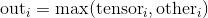

Note

When the shapes do not match, the shape of the returned output tensor follows the [broadcasting rules](notes/broadcasting.html#broadcasting-semantics).

Parameters: 

*   **input** ([_Tensor_](tensors.html#torch.Tensor "torch.Tensor")) – the input tensor
*   **other** ([_Tensor_](tensors.html#torch.Tensor "torch.Tensor")) – the second input tensor
*   **out** ([_Tensor_](tensors.html#torch.Tensor "torch.Tensor")_,_ _optional_) – the output tensor


Example:

```py
>>> a = torch.randn(4)
>>> a
tensor([ 0.2942, -0.7416,  0.2653, -0.1584])
>>> b = torch.randn(4)
>>> b
tensor([ 0.8722, -1.7421, -0.4141, -0.5055])
>>> torch.max(a, b)
tensor([ 0.8722, -0.7416,  0.2653, -0.1584])

```

```py
torch.min()
```

```py
torch.min(input) → Tensor
```

Returns the minimum value of all elements in the `input` tensor.

| Parameters: | **input** ([_Tensor_](tensors.html#torch.Tensor "torch.Tensor")) – the input tensor |
| --- | --- |

Example:

```py
>>> a = torch.randn(1, 3)
>>> a
tensor([[ 0.6750,  1.0857,  1.7197]])
>>> torch.min(a)
tensor(0.6750)

```

```py
torch.min(input, dim, keepdim=False, out=None) -> (Tensor, LongTensor)
```

Returns the minimum value of each row of the `input` tensor in the given dimension `dim`. The second return value is the index location of each minimum value found (argmin).

If `keepdim` is `True`, the output tensors are of the same size as `input` except in the dimension `dim` where they are of size 1. Otherwise, `dim` is squeezed (see [`torch.squeeze()`](#torch.squeeze "torch.squeeze")), resulting in the output tensors having 1 fewer dimension than `input`.

Parameters: 

*   **input** ([_Tensor_](tensors.html#torch.Tensor "torch.Tensor")) – the input tensor
*   **dim** ([_int_](https://docs.python.org/3/library/functions.html#int "(in Python v3.7)")) – the dimension to reduce
*   **keepdim** ([_bool_](https://docs.python.org/3/library/functions.html#bool "(in Python v3.7)")) – whether the output tensors have `dim` retained or not
*   **out** ([_tuple_](https://docs.python.org/3/library/stdtypes.html#tuple "(in Python v3.7)")_,_ _optional_) – the tuple of two output tensors (min, min_indices)


Example:

```py
>>> a = torch.randn(4, 4)
>>> a
tensor([[-0.6248,  1.1334, -1.1899, -0.2803],
 [-1.4644, -0.2635, -0.3651,  0.6134],
 [ 0.2457,  0.0384,  1.0128,  0.7015],
 [-0.1153,  2.9849,  2.1458,  0.5788]])
>>> torch.min(a, 1)
(tensor([-1.1899, -1.4644,  0.0384, -0.1153]), tensor([ 2,  0,  1,  0]))

```

```py
torch.min(input, other, out=None) → Tensor
```

Each element of the tensor `input` is compared with the corresponding element of the tensor `other` and an element-wise minimum is taken. The resulting tensor is returned.

The shapes of `input` and `other` don’t need to match, but they must be [broadcastable](notes/broadcasting.html#broadcasting-semantics).

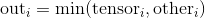

Note

When the shapes do not match, the shape of the returned output tensor follows the [broadcasting rules](notes/broadcasting.html#broadcasting-semantics).

Parameters: 

*   **input** ([_Tensor_](tensors.html#torch.Tensor "torch.Tensor")) – the input tensor
*   **other** ([_Tensor_](tensors.html#torch.Tensor "torch.Tensor")) – the second input tensor
*   **out** ([_Tensor_](tensors.html#torch.Tensor "torch.Tensor")_,_ _optional_) – the output tensor


Example:

```py
>>> a = torch.randn(4)
>>> a
tensor([ 0.8137, -1.1740, -0.6460,  0.6308])
>>> b = torch.randn(4)
>>> b
tensor([-0.1369,  0.1555,  0.4019, -0.1929])
>>> torch.min(a, b)
tensor([-0.1369, -1.1740, -0.6460, -0.1929])

```

```py
torch.ne(input, other, out=None) → Tensor
```

Computes 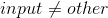 element-wise.

The second argument can be a number or a tensor whose shape is [broadcastable](notes/broadcasting.html#broadcasting-semantics) with the first argument.

Parameters: 

*   **input** ([_Tensor_](tensors.html#torch.Tensor "torch.Tensor")) – the tensor to compare
*   **other** ([_Tensor_](tensors.html#torch.Tensor "torch.Tensor") _or_ [_float_](https://docs.python.org/3/library/functions.html#float "(in Python v3.7)")) – the tensor or value to compare
*   **out** ([_Tensor_](tensors.html#torch.Tensor "torch.Tensor")_,_ _optional_) – the output tensor that must be a `ByteTensor`


| Returns: | A `torch.ByteTensor` containing a 1 at each location where comparison is true. |
| --- | --- |
| Return type: | [Tensor](tensors.html#torch.Tensor "torch.Tensor") |
| --- | --- |

Example:

```py
>>> torch.ne(torch.tensor([[1, 2], [3, 4]]), torch.tensor([[1, 1], [4, 4]]))
tensor([[ 0,  1],
 [ 1,  0]], dtype=torch.uint8)

```

```py
torch.sort(input, dim=None, descending=False, out=None) -> (Tensor, LongTensor)
```

Sorts the elements of the `input` tensor along a given dimension in ascending order by value.

If `dim` is not given, the last dimension of the `input` is chosen.

If `descending` is `True` then the elements are sorted in descending order by value.

A tuple of (sorted_tensor, sorted_indices) is returned, where the sorted_indices are the indices of the elements in the original `input` tensor.

Parameters: 

*   **input** ([_Tensor_](tensors.html#torch.Tensor "torch.Tensor")) – the input tensor
*   **dim** ([_int_](https://docs.python.org/3/library/functions.html#int "(in Python v3.7)")_,_ _optional_) – the dimension to sort along
*   **descending** ([_bool_](https://docs.python.org/3/library/functions.html#bool "(in Python v3.7)")_,_ _optional_) – controls the sorting order (ascending or descending)
*   **out** ([_tuple_](https://docs.python.org/3/library/stdtypes.html#tuple "(in Python v3.7)")_,_ _optional_) – the output tuple of (`Tensor`, `LongTensor`) that can be optionally given to be used as output buffers


Example:

```py
>>> x = torch.randn(3, 4)
>>> sorted, indices = torch.sort(x)
>>> sorted
tensor([[-0.2162,  0.0608,  0.6719,  2.3332],
 [-0.5793,  0.0061,  0.6058,  0.9497],
 [-0.5071,  0.3343,  0.9553,  1.0960]])
>>> indices
tensor([[ 1,  0,  2,  3],
 [ 3,  1,  0,  2],
 [ 0,  3,  1,  2]])

>>> sorted, indices = torch.sort(x, 0)
>>> sorted
tensor([[-0.5071, -0.2162,  0.6719, -0.5793],
 [ 0.0608,  0.0061,  0.9497,  0.3343],
 [ 0.6058,  0.9553,  1.0960,  2.3332]])
>>> indices
tensor([[ 2,  0,  0,  1],
 [ 0,  1,  1,  2],
 [ 1,  2,  2,  0]])

```

```py
torch.topk(input, k, dim=None, largest=True, sorted=True, out=None) -> (Tensor, LongTensor)
```

Returns the `k` largest elements of the given `input` tensor along a given dimension.

If `dim` is not given, the last dimension of the `input` is chosen.

If `largest` is `False` then the `k` smallest elements are returned.

A tuple of `(values, indices)` is returned, where the `indices` are the indices of the elements in the original `input` tensor.

The boolean option `sorted` if `True`, will make sure that the returned `k` elements are themselves sorted

Parameters: 

*   **input** ([_Tensor_](tensors.html#torch.Tensor "torch.Tensor")) – the input tensor
*   **k** ([_int_](https://docs.python.org/3/library/functions.html#int "(in Python v3.7)")) – the k in “top-k”
*   **dim** ([_int_](https://docs.python.org/3/library/functions.html#int "(in Python v3.7)")_,_ _optional_) – the dimension to sort along
*   **largest** ([_bool_](https://docs.python.org/3/library/functions.html#bool "(in Python v3.7)")_,_ _optional_) – controls whether to return largest or smallest elements
*   **sorted** ([_bool_](https://docs.python.org/3/library/functions.html#bool "(in Python v3.7)")_,_ _optional_) – controls whether to return the elements in sorted order
*   **out** ([_tuple_](https://docs.python.org/3/library/stdtypes.html#tuple "(in Python v3.7)")_,_ _optional_) – the output tuple of (Tensor, LongTensor) that can be optionally given to be used as output buffers


Example:

```py
>>> x = torch.arange(1., 6.)
>>> x
tensor([ 1.,  2.,  3.,  4.,  5.])
>>> torch.topk(x, 3)
(tensor([ 5.,  4.,  3.]), tensor([ 4,  3,  2]))

```

### Spectral Ops

```py
torch.fft(input, signal_ndim, normalized=False) → Tensor
```

Complex-to-complex Discrete Fourier Transform

This method computes the complex-to-complex discrete Fourier transform. Ignoring the batch dimensions, it computes the following expression:


where  = `signal_ndim` is number of dimensions for the signal, and 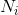 is the size of signal dimension .

This method supports 1D, 2D and 3D complex-to-complex transforms, indicated by `signal_ndim`. `input` must be a tensor with last dimension of size 2, representing the real and imaginary components of complex numbers, and should have at least `signal_ndim + 1` dimensions with optionally arbitrary number of leading batch dimensions. If `normalized` is set to `True`, this normalizes the result by dividing it with  so that the operator is unitary.

Returns the real and the imaginary parts together as one tensor of the same shape of `input`.

The inverse of this function is [`ifft()`](#torch.ifft "torch.ifft").

Note

For CUDA tensors, an LRU cache is used for cuFFT plans to speed up repeatedly running FFT methods on tensors of same geometry with same same configuration.

Changing `torch.backends.cuda.cufft_plan_cache.max_size` (default is 4096 on CUDA 10 and newer, and 1023 on older CUDA versions) controls the capacity of this cache. Some cuFFT plans may allocate GPU memory. You can use `torch.backends.cuda.cufft_plan_cache.size` to query the number of plans currently in cache, and `torch.backends.cuda.cufft_plan_cache.clear()` to clear the cache.

Warning

For CPU tensors, this method is currently only available with MKL. Use `torch.backends.mkl.is_available()` to check if MKL is installed.

Parameters: 

*   **input** ([_Tensor_](tensors.html#torch.Tensor "torch.Tensor")) – the input tensor of at least `signal_ndim` `+ 1` dimensions
*   **signal_ndim** ([_int_](https://docs.python.org/3/library/functions.html#int "(in Python v3.7)")) – the number of dimensions in each signal. `signal_ndim` can only be 1, 2 or 3
*   **normalized** ([_bool_](https://docs.python.org/3/library/functions.html#bool "(in Python v3.7)")_,_ _optional_) – controls whether to return normalized results. Default: `False`


| Returns: | A tensor containing the complex-to-complex Fourier transform result |
| --- | --- |
| Return type: | [Tensor](tensors.html#torch.Tensor "torch.Tensor") |
| --- | --- |

Example:

```py
>>> # unbatched 2D FFT
>>> x = torch.randn(4, 3, 2)
>>> torch.fft(x, 2)
tensor([[[-0.0876,  1.7835],
 [-2.0399, -2.9754],
 [ 4.4773, -5.0119]],

 [[-1.5716,  2.7631],
 [-3.8846,  5.2652],
 [ 0.2046, -0.7088]],

 [[ 1.9938, -0.5901],
 [ 6.5637,  6.4556],
 [ 2.9865,  4.9318]],

 [[ 7.0193,  1.1742],
 [-1.3717, -2.1084],
 [ 2.0289,  2.9357]]])
>>> # batched 1D FFT
>>> torch.fft(x, 1)
tensor([[[ 1.8385,  1.2827],
 [-0.1831,  1.6593],
 [ 2.4243,  0.5367]],

 [[-0.9176, -1.5543],
 [-3.9943, -2.9860],
 [ 1.2838, -2.9420]],

 [[-0.8854, -0.6860],
 [ 2.4450,  0.0808],
 [ 1.3076, -0.5768]],

 [[-0.1231,  2.7411],
 [-0.3075, -1.7295],
 [-0.5384, -2.0299]]])
>>> # arbitrary number of batch dimensions, 2D FFT
>>> x = torch.randn(3, 3, 5, 5, 2)
>>> y = torch.fft(x, 2)
>>> y.shape
torch.Size([3, 3, 5, 5, 2])

```

```py
torch.ifft(input, signal_ndim, normalized=False) → Tensor
```

Complex-to-complex Inverse Discrete Fourier Transform

This method computes the complex-to-complex inverse discrete Fourier transform. Ignoring the batch dimensions, it computes the following expression:


where  = `signal_ndim` is number of dimensions for the signal, and  is the size of signal dimension .

The argument specifications are almost identical with [`fft()`](#torch.fft "torch.fft"). However, if `normalized` is set to `True`, this instead returns the results multiplied by , to become a unitary operator. Therefore, to invert a [`fft()`](#torch.fft "torch.fft"), the `normalized` argument should be set identically for [`fft()`](#torch.fft "torch.fft").

Returns the real and the imaginary parts together as one tensor of the same shape of `input`.

The inverse of this function is [`fft()`](#torch.fft "torch.fft").

Note

For CUDA tensors, an LRU cache is used for cuFFT plans to speed up repeatedly running FFT methods on tensors of same geometry with same same configuration.

Changing `torch.backends.cuda.cufft_plan_cache.max_size` (default is 4096 on CUDA 10 and newer, and 1023 on older CUDA versions) controls the capacity of this cache. Some cuFFT plans may allocate GPU memory. You can use `torch.backends.cuda.cufft_plan_cache.size` to query the number of plans currently in cache, and `torch.backends.cuda.cufft_plan_cache.clear()` to clear the cache.

Warning

For CPU tensors, this method is currently only available with MKL. Use `torch.backends.mkl.is_available()` to check if MKL is installed.

Parameters: 

*   **input** ([_Tensor_](tensors.html#torch.Tensor "torch.Tensor")) – the input tensor of at least `signal_ndim` `+ 1` dimensions
*   **signal_ndim** ([_int_](https://docs.python.org/3/library/functions.html#int "(in Python v3.7)")) – the number of dimensions in each signal. `signal_ndim` can only be 1, 2 or 3
*   **normalized** ([_bool_](https://docs.python.org/3/library/functions.html#bool "(in Python v3.7)")_,_ _optional_) – controls whether to return normalized results. Default: `False`


| Returns: | A tensor containing the complex-to-complex inverse Fourier transform result |
| --- | --- |
| Return type: | [Tensor](tensors.html#torch.Tensor "torch.Tensor") |
| --- | --- |

Example:

```py
>>> x = torch.randn(3, 3, 2)
>>> x
tensor([[[ 1.2766,  1.3680],
 [-0.8337,  2.0251],
 [ 0.9465, -1.4390]],

 [[-0.1890,  1.6010],
 [ 1.1034, -1.9230],
 [-0.9482,  1.0775]],

 [[-0.7708, -0.8176],
 [-0.1843, -0.2287],
 [-1.9034, -0.2196]]])
>>> y = torch.fft(x, 2)
>>> torch.ifft(y, 2)  # recover x
tensor([[[ 1.2766,  1.3680],
 [-0.8337,  2.0251],
 [ 0.9465, -1.4390]],

 [[-0.1890,  1.6010],
 [ 1.1034, -1.9230],
 [-0.9482,  1.0775]],

 [[-0.7708, -0.8176],
 [-0.1843, -0.2287],
 [-1.9034, -0.2196]]])

```

```py
torch.rfft(input, signal_ndim, normalized=False, onesided=True) → Tensor
```

Real-to-complex Discrete Fourier Transform

This method computes the real-to-complex discrete Fourier transform. It is mathematically equivalent with [`fft()`](#torch.fft "torch.fft") with differences only in formats of the input and output.

This method supports 1D, 2D and 3D real-to-complex transforms, indicated by `signal_ndim`. `input` must be a tensor with at least `signal_ndim` dimensions with optionally arbitrary number of leading batch dimensions. If `normalized` is set to `True`, this normalizes the result by dividing it with  so that the operator is unitary, where  is the size of signal dimension .

The real-to-complex Fourier transform results follow conjugate symmetry:

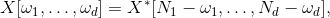

where the index arithmetic is computed modulus the size of the corresponding dimension, 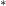 is the conjugate operator, and  = `signal_ndim`. `onesided` flag controls whether to avoid redundancy in the output results. If set to `True` (default), the output will not be full complex result of shape 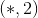, where  is the shape of `input`, but instead the last dimension will be halfed as of size .

The inverse of this function is [`irfft()`](#torch.irfft "torch.irfft").

Note

For CUDA tensors, an LRU cache is used for cuFFT plans to speed up repeatedly running FFT methods on tensors of same geometry with same same configuration.

Changing `torch.backends.cuda.cufft_plan_cache.max_size` (default is 4096 on CUDA 10 and newer, and 1023 on older CUDA versions) controls the capacity of this cache. Some cuFFT plans may allocate GPU memory. You can use `torch.backends.cuda.cufft_plan_cache.size` to query the number of plans currently in cache, and `torch.backends.cuda.cufft_plan_cache.clear()` to clear the cache.

Warning

For CPU tensors, this method is currently only available with MKL. Use `torch.backends.mkl.is_available()` to check if MKL is installed.

Parameters: 

*   **input** ([_Tensor_](tensors.html#torch.Tensor "torch.Tensor")) – the input tensor of at least `signal_ndim` dimensions
*   **signal_ndim** ([_int_](https://docs.python.org/3/library/functions.html#int "(in Python v3.7)")) – the number of dimensions in each signal. `signal_ndim` can only be 1, 2 or 3
*   **normalized** ([_bool_](https://docs.python.org/3/library/functions.html#bool "(in Python v3.7)")_,_ _optional_) – controls whether to return normalized results. Default: `False`
*   **onesided** ([_bool_](https://docs.python.org/3/library/functions.html#bool "(in Python v3.7)")_,_ _optional_) – controls whether to return half of results to avoid redundancy. Default: `True`


| Returns: | A tensor containing the real-to-complex Fourier transform result |
| --- | --- |
| Return type: | [Tensor](tensors.html#torch.Tensor "torch.Tensor") |
| --- | --- |

Example:

```py
>>> x = torch.randn(5, 5)
>>> torch.rfft(x, 2).shape
torch.Size([5, 3, 2])
>>> torch.rfft(x, 2, onesided=False).shape
torch.Size([5, 5, 2])

```

```py
torch.irfft(input, signal_ndim, normalized=False, onesided=True, signal_sizes=None) → Tensor
```

Complex-to-real Inverse Discrete Fourier Transform

This method computes the complex-to-real inverse discrete Fourier transform. It is mathematically equivalent with [`ifft()`](#torch.ifft "torch.ifft") with differences only in formats of the input and output.

The argument specifications are almost identical with [`ifft()`](#torch.ifft "torch.ifft"). Similar to [`ifft()`](#torch.ifft "torch.ifft"), if `normalized` is set to `True`, this normalizes the result by multiplying it with  so that the operator is unitary, where  is the size of signal dimension .

Due to the conjugate symmetry, `input` do not need to contain the full complex frequency values. Roughly half of the values will be sufficient, as is the case when `input` is given by [`rfft()`](#torch.rfft "torch.rfft") with `rfft(signal, onesided=True)`. In such case, set the `onesided` argument of this method to `True`. Moreover, the original signal shape information can sometimes be lost, optionally set `signal_sizes` to be the size of the original signal (without the batch dimensions if in batched mode) to recover it with correct shape.

Therefore, to invert an [`rfft()`](#torch.rfft "torch.rfft"), the `normalized` and `onesided` arguments should be set identically for [`irfft()`](#torch.irfft "torch.irfft"), and preferrably a `signal_sizes` is given to avoid size mismatch. See the example below for a case of size mismatch.

See [`rfft()`](#torch.rfft "torch.rfft") for details on conjugate symmetry.

The inverse of this function is [`rfft()`](#torch.rfft "torch.rfft").

Warning

Generally speaking, the input of this function should contain values following conjugate symmetry. Note that even if `onesided` is `True`, often symmetry on some part is still needed. When this requirement is not satisfied, the behavior of [`irfft()`](#torch.irfft "torch.irfft") is undefined. Since [`torch.autograd.gradcheck()`](autograd.html#torch.autograd.gradcheck "torch.autograd.gradcheck") estimates numerical Jacobian with point perturbations, [`irfft()`](#torch.irfft "torch.irfft") will almost certainly fail the check.

Note

For CUDA tensors, an LRU cache is used for cuFFT plans to speed up repeatedly running FFT methods on tensors of same geometry with same same configuration.

Changing `torch.backends.cuda.cufft_plan_cache.max_size` (default is 4096 on CUDA 10 and newer, and 1023 on older CUDA versions) controls the capacity of this cache. Some cuFFT plans may allocate GPU memory. You can use `torch.backends.cuda.cufft_plan_cache.size` to query the number of plans currently in cache, and `torch.backends.cuda.cufft_plan_cache.clear()` to clear the cache.

Warning

For CPU tensors, this method is currently only available with MKL. Use `torch.backends.mkl.is_available()` to check if MKL is installed.

Parameters: 

*   **input** ([_Tensor_](tensors.html#torch.Tensor "torch.Tensor")) – the input tensor of at least `signal_ndim` `+ 1` dimensions
*   **signal_ndim** ([_int_](https://docs.python.org/3/library/functions.html#int "(in Python v3.7)")) – the number of dimensions in each signal. `signal_ndim` can only be 1, 2 or 3
*   **normalized** ([_bool_](https://docs.python.org/3/library/functions.html#bool "(in Python v3.7)")_,_ _optional_) – controls whether to return normalized results. Default: `False`
*   **onesided** ([_bool_](https://docs.python.org/3/library/functions.html#bool "(in Python v3.7)")_,_ _optional_) – controls whether `input` was halfed to avoid redundancy, e.g., by [`rfft()`](#torch.rfft "torch.rfft"). Default: `True`
*   **signal_sizes** (list or `torch.Size`, optional) – the size of the original signal (without batch dimension). Default: `None`


| Returns: | A tensor containing the complex-to-real inverse Fourier transform result |
| --- | --- |
| Return type: | [Tensor](tensors.html#torch.Tensor "torch.Tensor") |
| --- | --- |

Example:

```py
>>> x = torch.randn(4, 4)
>>> torch.rfft(x, 2, onesided=True).shape
torch.Size([4, 3, 2])
>>>
>>> # notice that with onesided=True, output size does not determine the original signal size
>>> x = torch.randn(4, 5)

>>> torch.rfft(x, 2, onesided=True).shape
torch.Size([4, 3, 2])
>>>
>>> # now we use the original shape to recover x
>>> x
tensor([[-0.8992,  0.6117, -1.6091, -0.4155, -0.8346],
 [-2.1596, -0.0853,  0.7232,  0.1941, -0.0789],
 [-2.0329,  1.1031,  0.6869, -0.5042,  0.9895],
 [-0.1884,  0.2858, -1.5831,  0.9917, -0.8356]])
>>> y = torch.rfft(x, 2, onesided=True)
>>> torch.irfft(y, 2, onesided=True, signal_sizes=x.shape)  # recover x
tensor([[-0.8992,  0.6117, -1.6091, -0.4155, -0.8346],
 [-2.1596, -0.0853,  0.7232,  0.1941, -0.0789],
 [-2.0329,  1.1031,  0.6869, -0.5042,  0.9895],
 [-0.1884,  0.2858, -1.5831,  0.9917, -0.8356]])

```

```py
torch.stft(input, n_fft, hop_length=None, win_length=None, window=None, center=True, pad_mode='reflect', normalized=False, onesided=True)
```

Short-time Fourier transform (STFT).

Ignoring the optional batch dimension, this method computes the following expression:


where  is the index of the sliding window, and  is the frequency that . When `onesided` is the default value `True`,

*   `input` must be either a 1-D time sequence or a 2-D batch of time sequences.
*   If `hop_length` is `None` (default), it is treated as equal to `floor(n_fft / 4)`.
*   If `win_length` is `None` (default), it is treated as equal to `n_fft`.
*   `window` can be a 1-D tensor of size `win_length`, e.g., from [`torch.hann_window()`](#torch.hann_window "torch.hann_window"). If `window` is `None` (default), it is treated as if having  everywhere in the window. If 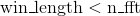, `window` will be padded on both sides to length `n_fft` before being applied.
*   If `center` is `True` (default), `input` will be padded on both sides so that the -th frame is centered at time . Otherwise, the -th frame begins at time .
*   `pad_mode` determines the padding method used on `input` when `center` is `True`. See [`torch.nn.functional.pad()`](nn.html#torch.nn.functional.pad "torch.nn.functional.pad") for all available options. Default is `"reflect"`.
*   If `onesided` is `True` (default), only values for  in 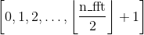 are returned because the real-to-complex Fourier transform satisfies the conjugate symmetry, i.e., .
*   If `normalized` is `True` (default is `False`), the function returns the normalized STFT results, i.e., multiplied by 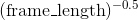.

Returns the real and the imaginary parts together as one tensor of size , where  is the optional batch size of `input`,  is the number of frequencies where STFT is applied,  is the total number of frames used, and each pair in the last dimension represents a complex number as the real part and the imaginary part.

Warning

This function changed signature at version 0.4.1\. Calling with the previous signature may cause error or return incorrect result.

Parameters: 

*   **input** ([_Tensor_](tensors.html#torch.Tensor "torch.Tensor")) – the input tensor
*   **n_fft** ([_int_](https://docs.python.org/3/library/functions.html#int "(in Python v3.7)")) – size of Fourier transform
*   **hop_length** ([_int_](https://docs.python.org/3/library/functions.html#int "(in Python v3.7)")_,_ _optional_) – the distance between neighboring sliding window frames. Default: `None` (treated as equal to `floor(n_fft / 4)`)
*   **win_length** ([_int_](https://docs.python.org/3/library/functions.html#int "(in Python v3.7)")_,_ _optional_) – the size of window frame and STFT filter. Default: `None` (treated as equal to `n_fft`)
*   **window** ([_Tensor_](tensors.html#torch.Tensor "torch.Tensor")_,_ _optional_) – the optional window function. Default: `None` (treated as window of all  s)
*   **center** ([_bool_](https://docs.python.org/3/library/functions.html#bool "(in Python v3.7)")_,_ _optional_) – whether to pad `input` on both sides so that the -th frame is centered at time . Default: `True`
*   **pad_mode** (_string__,_ _optional_) – controls the padding method used when `center` is `True`. Default: `"reflect"`
*   **normalized** ([_bool_](https://docs.python.org/3/library/functions.html#bool "(in Python v3.7)")_,_ _optional_) – controls whether to return the normalized STFT results Default: `False`
*   **onesided** ([_bool_](https://docs.python.org/3/library/functions.html#bool "(in Python v3.7)")_,_ _optional_) – controls whether to return half of results to avoid redundancy Default: `True`


| Returns: | A tensor containing the STFT result with shape described above |
| --- | --- |
| Return type: | [Tensor](tensors.html#torch.Tensor "torch.Tensor") |
| --- | --- |

```py
torch.bartlett_window(window_length, periodic=True, dtype=None, layout=torch.strided, device=None, requires_grad=False) → Tensor
```

Bartlett window function.

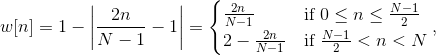

where  is the full window size.

The input `window_length` is a positive integer controlling the returned window size. `periodic` flag determines whether the returned window trims off the last duplicate value from the symmetric window and is ready to be used as a periodic window with functions like [`torch.stft()`](#torch.stft "torch.stft"). Therefore, if `periodic` is true, the  in above formula is in fact . Also, we always have `torch.bartlett_window(L, periodic=True)` equal to `torch.bartlett_window(L + 1, periodic=False)[:-1])`.

Note

If `window_length` 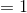, the returned window contains a single value 1.

Parameters: 

*   **window_length** ([_int_](https://docs.python.org/3/library/functions.html#int "(in Python v3.7)")) – the size of returned window
*   **periodic** ([_bool_](https://docs.python.org/3/library/functions.html#bool "(in Python v3.7)")_,_ _optional_) – If True, returns a window to be used as periodic function. If False, return a symmetric window.
*   **dtype** ([`torch.dtype`](tensor_attributes.html#torch.torch.dtype "torch.torch.dtype"), optional) – the desired data type of returned tensor. Default: if `None`, uses a global default (see [`torch.set_default_tensor_type()`](#torch.set_default_tensor_type "torch.set_default_tensor_type")). Only floating point types are supported.
*   **layout** ([`torch.layout`](tensor_attributes.html#torch.torch.layout "torch.torch.layout"), optional) – the desired layout of returned window tensor. Only `torch.strided` (dense layout) is supported.
*   **device** ([`torch.device`](tensor_attributes.html#torch.torch.device "torch.torch.device"), optional) – the desired device of returned tensor. Default: if `None`, uses the current device for the default tensor type (see [`torch.set_default_tensor_type()`](#torch.set_default_tensor_type "torch.set_default_tensor_type")). `device` will be the CPU for CPU tensor types and the current CUDA device for CUDA tensor types.
*   **requires_grad** ([_bool_](https://docs.python.org/3/library/functions.html#bool "(in Python v3.7)")_,_ _optional_) – If autograd should record operations on the returned tensor. Default: `False`.


| Returns: | A 1-D tensor of size 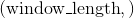 containing the window |
| --- | --- |
| Return type: | [Tensor](tensors.html#torch.Tensor "torch.Tensor") |
| --- | --- |

```py
torch.blackman_window(window_length, periodic=True, dtype=None, layout=torch.strided, device=None, requires_grad=False) → Tensor
```

Blackman window function.


where  is the full window size.

The input `window_length` is a positive integer controlling the returned window size. `periodic` flag determines whether the returned window trims off the last duplicate value from the symmetric window and is ready to be used as a periodic window with functions like [`torch.stft()`](#torch.stft "torch.stft"). Therefore, if `periodic` is true, the  in above formula is in fact . Also, we always have `torch.blackman_window(L, periodic=True)` equal to `torch.blackman_window(L + 1, periodic=False)[:-1])`.

Note

If `window_length` , the returned window contains a single value 1.

Parameters: 

*   **window_length** ([_int_](https://docs.python.org/3/library/functions.html#int "(in Python v3.7)")) – the size of returned window
*   **periodic** ([_bool_](https://docs.python.org/3/library/functions.html#bool "(in Python v3.7)")_,_ _optional_) – If True, returns a window to be used as periodic function. If False, return a symmetric window.
*   **dtype** ([`torch.dtype`](tensor_attributes.html#torch.torch.dtype "torch.torch.dtype"), optional) – the desired data type of returned tensor. Default: if `None`, uses a global default (see [`torch.set_default_tensor_type()`](#torch.set_default_tensor_type "torch.set_default_tensor_type")). Only floating point types are supported.
*   **layout** ([`torch.layout`](tensor_attributes.html#torch.torch.layout "torch.torch.layout"), optional) – the desired layout of returned window tensor. Only `torch.strided` (dense layout) is supported.
*   **device** ([`torch.device`](tensor_attributes.html#torch.torch.device "torch.torch.device"), optional) – the desired device of returned tensor. Default: if `None`, uses the current device for the default tensor type (see [`torch.set_default_tensor_type()`](#torch.set_default_tensor_type "torch.set_default_tensor_type")). `device` will be the CPU for CPU tensor types and the current CUDA device for CUDA tensor types.
*   **requires_grad** ([_bool_](https://docs.python.org/3/library/functions.html#bool "(in Python v3.7)")_,_ _optional_) – If autograd should record operations on the returned tensor. Default: `False`.


| Returns: | A 1-D tensor of size  containing the window |
| --- | --- |
| Return type: | [Tensor](tensors.html#torch.Tensor "torch.Tensor") |
| --- | --- |

```py
torch.hamming_window(window_length, periodic=True, alpha=0.54, beta=0.46, dtype=None, layout=torch.strided, device=None, requires_grad=False) → Tensor
```

Hamming window function.


where  is the full window size.

The input `window_length` is a positive integer controlling the returned window size. `periodic` flag determines whether the returned window trims off the last duplicate value from the symmetric window and is ready to be used as a periodic window with functions like [`torch.stft()`](#torch.stft "torch.stft"). Therefore, if `periodic` is true, the  in above formula is in fact . Also, we always have `torch.hamming_window(L, periodic=True)` equal to `torch.hamming_window(L + 1, periodic=False)[:-1])`.

Note

If `window_length` , the returned window contains a single value 1.

Note

This is a generalized version of [`torch.hann_window()`](#torch.hann_window "torch.hann_window").

Parameters: 

*   **window_length** ([_int_](https://docs.python.org/3/library/functions.html#int "(in Python v3.7)")) – the size of returned window
*   **periodic** ([_bool_](https://docs.python.org/3/library/functions.html#bool "(in Python v3.7)")_,_ _optional_) – If True, returns a window to be used as periodic function. If False, return a symmetric window.
*   **dtype** ([`torch.dtype`](tensor_attributes.html#torch.torch.dtype "torch.torch.dtype"), optional) – the desired data type of returned tensor. Default: if `None`, uses a global default (see [`torch.set_default_tensor_type()`](#torch.set_default_tensor_type "torch.set_default_tensor_type")). Only floating point types are supported.
*   **layout** ([`torch.layout`](tensor_attributes.html#torch.torch.layout "torch.torch.layout"), optional) – the desired layout of returned window tensor. Only `torch.strided` (dense layout) is supported.
*   **device** ([`torch.device`](tensor_attributes.html#torch.torch.device "torch.torch.device"), optional) – the desired device of returned tensor. Default: if `None`, uses the current device for the default tensor type (see [`torch.set_default_tensor_type()`](#torch.set_default_tensor_type "torch.set_default_tensor_type")). `device` will be the CPU for CPU tensor types and the current CUDA device for CUDA tensor types.
*   **requires_grad** ([_bool_](https://docs.python.org/3/library/functions.html#bool "(in Python v3.7)")_,_ _optional_) – If autograd should record operations on the returned tensor. Default: `False`.


| Returns: | A 1-D tensor of size  containing the window |
| --- | --- |
| Return type: | [Tensor](tensors.html#torch.Tensor "torch.Tensor") |
| --- | --- |

```py
torch.hann_window(window_length, periodic=True, dtype=None, layout=torch.strided, device=None, requires_grad=False) → Tensor
```

Hann window function.

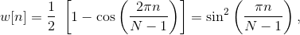

where  is the full window size.

The input `window_length` is a positive integer controlling the returned window size. `periodic` flag determines whether the returned window trims off the last duplicate value from the symmetric window and is ready to be used as a periodic window with functions like [`torch.stft()`](#torch.stft "torch.stft"). Therefore, if `periodic` is true, the  in above formula is in fact . Also, we always have `torch.hann_window(L, periodic=True)` equal to `torch.hann_window(L + 1, periodic=False)[:-1])`.

Note

If `window_length` , the returned window contains a single value 1.

Parameters: 

*   **window_length** ([_int_](https://docs.python.org/3/library/functions.html#int "(in Python v3.7)")) – the size of returned window
*   **periodic** ([_bool_](https://docs.python.org/3/library/functions.html#bool "(in Python v3.7)")_,_ _optional_) – If True, returns a window to be used as periodic function. If False, return a symmetric window.
*   **dtype** ([`torch.dtype`](tensor_attributes.html#torch.torch.dtype "torch.torch.dtype"), optional) – the desired data type of returned tensor. Default: if `None`, uses a global default (see [`torch.set_default_tensor_type()`](#torch.set_default_tensor_type "torch.set_default_tensor_type")). Only floating point types are supported.
*   **layout** ([`torch.layout`](tensor_attributes.html#torch.torch.layout "torch.torch.layout"), optional) – the desired layout of returned window tensor. Only `torch.strided` (dense layout) is supported.
*   **device** ([`torch.device`](tensor_attributes.html#torch.torch.device "torch.torch.device"), optional) – the desired device of returned tensor. Default: if `None`, uses the current device for the default tensor type (see [`torch.set_default_tensor_type()`](#torch.set_default_tensor_type "torch.set_default_tensor_type")). `device` will be the CPU for CPU tensor types and the current CUDA device for CUDA tensor types.
*   **requires_grad** ([_bool_](https://docs.python.org/3/library/functions.html#bool "(in Python v3.7)")_,_ _optional_) – If autograd should record operations on the returned tensor. Default: `False`.


| Returns: | A 1-D tensor of size  containing the window |
| --- | --- |
| Return type: | [Tensor](tensors.html#torch.Tensor "torch.Tensor") |
| --- | --- |

### Other Operations

```py
torch.bincount(self, weights=None, minlength=0) → Tensor
```

Count the frequency of each value in an array of non-negative ints.

The number of bins (size 1) is one larger than the largest value in `input` unless `input` is empty, in which case the result is a tensor of size 0\. If `minlength` is specified, the number of bins is at least `minlength` and if `input` is empty, then the result is tensor of size `minlength` filled with zeros. If `n` is the value at position `i`, `out[n] += weights[i]` if `weights` is specified else `out[n] += 1`.

Note

When using the CUDA backend, this operation may induce nondeterministic behaviour that is not easily switched off. Please see the notes on [Reproducibility](notes/randomness.html) for background.

Parameters: 

*   **input** ([_Tensor_](tensors.html#torch.Tensor "torch.Tensor")) – 1-d int tensor
*   **weights** ([_Tensor_](tensors.html#torch.Tensor "torch.Tensor")) – optional, weight for each value in the input tensor. Should be of same size as input tensor.
*   **minlength** ([_int_](https://docs.python.org/3/library/functions.html#int "(in Python v3.7)")) – optional, minimum number of bins. Should be non-negative.


| Returns: | a tensor of shape `Size([max(input) + 1])` if `input` is non-empty, else `Size(0)` |
| --- | --- |
| Return type: | output ([Tensor](tensors.html#torch.Tensor "torch.Tensor")) |
| --- | --- |

Example:

```py
>>> input = torch.randint(0, 8, (5,), dtype=torch.int64)
>>> weights = torch.linspace(0, 1, steps=5)
>>> input, weights
(tensor([4, 3, 6, 3, 4]),
 tensor([ 0.0000,  0.2500,  0.5000,  0.7500,  1.0000])

>>> torch.bincount(input)
tensor([0, 0, 0, 2, 2, 0, 1])

>>> input.bincount(weights)
tensor([0.0000, 0.0000, 0.0000, 1.0000, 1.0000, 0.0000, 0.5000])

```

```py
torch.broadcast_tensors(*tensors) → List of Tensors
```

Broadcasts the given tensors according to _broadcasting-semantics.

| Parameters: | ***tensors** – any number of tensors of the same type |
| --- | --- |

Example:

```py
>>> x = torch.arange(3).view(1, 3)
>>> y = torch.arange(2).view(2, 1)
>>> a, b = torch.broadcast_tensors(x, y)
>>> a.size()
torch.Size([2, 3])
>>> a
tensor([[0, 1, 2],
 [0, 1, 2]])

```

```py
torch.cross(input, other, dim=-1, out=None) → Tensor
```

Returns the cross product of vectors in dimension `dim` of `input` and `other`.

`input` and `other` must have the same size, and the size of their `dim` dimension should be 3.

If `dim` is not given, it defaults to the first dimension found with the size 3.

Parameters: 

*   **input** ([_Tensor_](tensors.html#torch.Tensor "torch.Tensor")) – the input tensor
*   **other** ([_Tensor_](tensors.html#torch.Tensor "torch.Tensor")) – the second input tensor
*   **dim** ([_int_](https://docs.python.org/3/library/functions.html#int "(in Python v3.7)")_,_ _optional_) – the dimension to take the cross-product in.
*   **out** ([_Tensor_](tensors.html#torch.Tensor "torch.Tensor")_,_ _optional_) – the output tensor


Example:

```py
>>> a = torch.randn(4, 3)
>>> a
tensor([[-0.3956,  1.1455,  1.6895],
 [-0.5849,  1.3672,  0.3599],
 [-1.1626,  0.7180, -0.0521],
 [-0.1339,  0.9902, -2.0225]])
>>> b = torch.randn(4, 3)
>>> b
tensor([[-0.0257, -1.4725, -1.2251],
 [-1.1479, -0.7005, -1.9757],
 [-1.3904,  0.3726, -1.1836],
 [-0.9688, -0.7153,  0.2159]])
>>> torch.cross(a, b, dim=1)
tensor([[ 1.0844, -0.5281,  0.6120],
 [-2.4490, -1.5687,  1.9792],
 [-0.8304, -1.3037,  0.5650],
 [-1.2329,  1.9883,  1.0551]])
>>> torch.cross(a, b)
tensor([[ 1.0844, -0.5281,  0.6120],
 [-2.4490, -1.5687,  1.9792],
 [-0.8304, -1.3037,  0.5650],
 [-1.2329,  1.9883,  1.0551]])

```

```py
torch.diag(input, diagonal=0, out=None) → Tensor
```

*   If `input` is a vector (1-D tensor), then returns a 2-D square tensor with the elements of `input` as the diagonal.
*   If `input` is a matrix (2-D tensor), then returns a 1-D tensor with the diagonal elements of `input`.

The argument [`diagonal`](#torch.diagonal "torch.diagonal") controls which diagonal to consider:

*   If [`diagonal`](#torch.diagonal "torch.diagonal") = 0, it is the main diagonal.
*   If [`diagonal`](#torch.diagonal "torch.diagonal") &gt; 0, it is above the main diagonal.
*   If [`diagonal`](#torch.diagonal "torch.diagonal") &lt; 0, it is below the main diagonal.

Parameters: 

*   **input** ([_Tensor_](tensors.html#torch.Tensor "torch.Tensor")) – the input tensor
*   **diagonal** ([_int_](https://docs.python.org/3/library/functions.html#int "(in Python v3.7)")_,_ _optional_) – the diagonal to consider
*   **out** ([_Tensor_](tensors.html#torch.Tensor "torch.Tensor")_,_ _optional_) – the output tensor


See also

[`torch.diagonal()`](#torch.diagonal "torch.diagonal") always returns the diagonal of its input.

[`torch.diagflat()`](#torch.diagflat "torch.diagflat") always constructs a tensor with diagonal elements specified by the input.

Examples:

Get the square matrix where the input vector is the diagonal:

```py
>>> a = torch.randn(3)
>>> a
tensor([ 0.5950,-0.0872, 2.3298])
>>> torch.diag(a)
tensor([[ 0.5950, 0.0000, 0.0000],
 [ 0.0000,-0.0872, 0.0000],
 [ 0.0000, 0.0000, 2.3298]])
>>> torch.diag(a, 1)
tensor([[ 0.0000, 0.5950, 0.0000, 0.0000],
 [ 0.0000, 0.0000,-0.0872, 0.0000],
 [ 0.0000, 0.0000, 0.0000, 2.3298],
 [ 0.0000, 0.0000, 0.0000, 0.0000]])

```

Get the k-th diagonal of a given matrix:

```py
>>> a = torch.randn(3, 3)
>>> a
tensor([[-0.4264, 0.0255,-0.1064],
 [ 0.8795,-0.2429, 0.1374],
 [ 0.1029,-0.6482,-1.6300]])
>>> torch.diag(a, 0)
tensor([-0.4264,-0.2429,-1.6300])
>>> torch.diag(a, 1)
tensor([ 0.0255, 0.1374])

```

```py
torch.diag_embed(input, offset=0, dim1=-2, dim2=-1) → Tensor
```

Creates a tensor whose diagonals of certain 2D planes (specified by `dim1` and `dim2`) are filled by `input`. To facilitate creating batched diagonal matrices, the 2D planes formed by the last two dimensions of the returned tensor are chosen by default.

The argument `offset` controls which diagonal to consider:

*   If `offset` = 0, it is the main diagonal.
*   If `offset` &gt; 0, it is above the main diagonal.
*   If `offset` &lt; 0, it is below the main diagonal.

The size of the new matrix will be calculated to make the specified diagonal of the size of the last input dimension. Note that for `offset` other than , the order of `dim1` and `dim2` matters. Exchanging them is equivalent to changing the sign of `offset`.

Applying [`torch.diagonal()`](#torch.diagonal "torch.diagonal") to the output of this function with the same arguments yields a matrix identical to input. However, [`torch.diagonal()`](#torch.diagonal "torch.diagonal") has different default dimensions, so those need to be explicitly specified.

Parameters: 

*   **input** ([_Tensor_](tensors.html#torch.Tensor "torch.Tensor")) – the input tensor. Must be at least 1-dimensional.
*   **offset** ([_int_](https://docs.python.org/3/library/functions.html#int "(in Python v3.7)")_,_ _optional_) – which diagonal to consider. Default: 0 (main diagonal).
*   **dim1** ([_int_](https://docs.python.org/3/library/functions.html#int "(in Python v3.7)")_,_ _optional_) – first dimension with respect to which to take diagonal. Default: -2.
*   **dim2** ([_int_](https://docs.python.org/3/library/functions.html#int "(in Python v3.7)")_,_ _optional_) – second dimension with respect to which to take diagonal. Default: -1.


Example:

```py
>>> a = torch.randn(2, 3)
>>> torch.diag_embed(a)
tensor([[[ 1.5410,  0.0000,  0.0000],
 [ 0.0000, -0.2934,  0.0000],
 [ 0.0000,  0.0000, -2.1788]],

 [[ 0.5684,  0.0000,  0.0000],
 [ 0.0000, -1.0845,  0.0000],
 [ 0.0000,  0.0000, -1.3986]]])

>>> torch.diag_embed(a, offset=1, dim1=0, dim2=2)
tensor([[[ 0.0000,  1.5410,  0.0000,  0.0000],
 [ 0.0000,  0.5684,  0.0000,  0.0000]],

 [[ 0.0000,  0.0000, -0.2934,  0.0000],
 [ 0.0000,  0.0000, -1.0845,  0.0000]],

 [[ 0.0000,  0.0000,  0.0000, -2.1788],
 [ 0.0000,  0.0000,  0.0000, -1.3986]],

 [[ 0.0000,  0.0000,  0.0000,  0.0000],
 [ 0.0000,  0.0000,  0.0000,  0.0000]]])

```

```py
torch.diagflat(input, diagonal=0) → Tensor
```

*   If `input` is a vector (1-D tensor), then returns a 2-D square tensor with the elements of `input` as the diagonal.
*   If `input` is a tensor with more than one dimension, then returns a 2-D tensor with diagonal elements equal to a flattened `input`.

The argument `offset` controls which diagonal to consider:

*   If `offset` = 0, it is the main diagonal.
*   If `offset` &gt; 0, it is above the main diagonal.
*   If `offset` &lt; 0, it is below the main diagonal.

Parameters: 

*   **input** ([_Tensor_](tensors.html#torch.Tensor "torch.Tensor")) – the input tensor
*   **offset** ([_int_](https://docs.python.org/3/library/functions.html#int "(in Python v3.7)")_,_ _optional_) – the diagonal to consider. Default: 0 (main diagonal).


Examples:

```py
>>> a = torch.randn(3)
>>> a
tensor([-0.2956, -0.9068,  0.1695])
>>> torch.diagflat(a)
tensor([[-0.2956,  0.0000,  0.0000],
 [ 0.0000, -0.9068,  0.0000],
 [ 0.0000,  0.0000,  0.1695]])
>>> torch.diagflat(a, 1)
tensor([[ 0.0000, -0.2956,  0.0000,  0.0000],
 [ 0.0000,  0.0000, -0.9068,  0.0000],
 [ 0.0000,  0.0000,  0.0000,  0.1695],
 [ 0.0000,  0.0000,  0.0000,  0.0000]])

>>> a = torch.randn(2, 2)
>>> a
tensor([[ 0.2094, -0.3018],
 [-0.1516,  1.9342]])
>>> torch.diagflat(a)
tensor([[ 0.2094,  0.0000,  0.0000,  0.0000],
 [ 0.0000, -0.3018,  0.0000,  0.0000],
 [ 0.0000,  0.0000, -0.1516,  0.0000],
 [ 0.0000,  0.0000,  0.0000,  1.9342]])

```

```py
torch.diagonal(input, offset=0, dim1=0, dim2=1) → Tensor
```

Returns a partial view of `input` with the its diagonal elements with respect to `dim1` and `dim2` appended as a dimension at the end of the shape.

The argument `offset` controls which diagonal to consider:

*   If `offset` = 0, it is the main diagonal.
*   If `offset` &gt; 0, it is above the main diagonal.
*   If `offset` &lt; 0, it is below the main diagonal.

Applying [`torch.diag_embed()`](#torch.diag_embed "torch.diag_embed") to the output of this function with the same arguments yields a diagonal matrix with the diagonal entries of the input. However, [`torch.diag_embed()`](#torch.diag_embed "torch.diag_embed") has different default dimensions, so those need to be explicitly specified.

Parameters: 

*   **input** ([_Tensor_](tensors.html#torch.Tensor "torch.Tensor")) – the input tensor. Must be at least 2-dimensional.
*   **offset** ([_int_](https://docs.python.org/3/library/functions.html#int "(in Python v3.7)")_,_ _optional_) – which diagonal to consider. Default: 0 (main diagonal).
*   **dim1** ([_int_](https://docs.python.org/3/library/functions.html#int "(in Python v3.7)")_,_ _optional_) – first dimension with respect to which to take diagonal. Default: 0.
*   **dim2** ([_int_](https://docs.python.org/3/library/functions.html#int "(in Python v3.7)")_,_ _optional_) – second dimension with respect to which to take diagonal. Default: 1.


Note

To take a batch diagonal, pass in dim1=-2, dim2=-1.

Examples:

```py
>>> a = torch.randn(3, 3)
>>> a
tensor([[-1.0854,  1.1431, -0.1752],
 [ 0.8536, -0.0905,  0.0360],
 [ 0.6927, -0.3735, -0.4945]])

>>> torch.diagonal(a, 0)
tensor([-1.0854, -0.0905, -0.4945])

>>> torch.diagonal(a, 1)
tensor([ 1.1431,  0.0360])

>>> x = torch.randn(2, 5, 4, 2)
>>> torch.diagonal(x, offset=-1, dim1=1, dim2=2)
tensor([[[-1.2631,  0.3755, -1.5977, -1.8172],
 [-1.1065,  1.0401, -0.2235, -0.7938]],

 [[-1.7325, -0.3081,  0.6166,  0.2335],
 [ 1.0500,  0.7336, -0.3836, -1.1015]]])

```

```py
torch.einsum(equation, *operands) → Tensor
```

This function provides a way of computing multilinear expressions (i.e. sums of products) using the Einstein summation convention.

Parameters: 

*   **equation** (_string_) – The equation is given in terms of lower case letters (indices) to be associated with each dimension of the operands and result. The left hand side lists the operands dimensions, separated by commas. There should be one index letter per tensor dimension. The right hand side follows after `-&gt;` and gives the indices for the output. If the `-&gt;` and right hand side are omitted, it implicitly defined as the alphabetically sorted list of all indices appearing exactly once in the left hand side. The indices not apprearing in the output are summed over after multiplying the operands entries. If an index appears several times for the same operand, a diagonal is taken. Ellipses `…` represent a fixed number of dimensions. If the right hand side is inferred, the ellipsis dimensions are at the beginning of the output.
*   **operands** (_list of Tensors_) – The operands to compute the Einstein sum of. Note that the operands are passed as a list, not as individual arguments.


Examples:

```py
>>> x = torch.randn(5)
>>> y = torch.randn(4)
>>> torch.einsum('i,j->ij', x, y)  # outer product
tensor([[-0.0570, -0.0286, -0.0231,  0.0197],
 [ 1.2616,  0.6335,  0.5113, -0.4351],
 [ 1.4452,  0.7257,  0.5857, -0.4984],
 [-0.4647, -0.2333, -0.1883,  0.1603],
 [-1.1130, -0.5588, -0.4510,  0.3838]])

>>> A = torch.randn(3,5,4)
>>> l = torch.randn(2,5)
>>> r = torch.randn(2,4)
>>> torch.einsum('bn,anm,bm->ba', l, A, r) # compare torch.nn.functional.bilinear
tensor([[-0.3430, -5.2405,  0.4494],
 [ 0.3311,  5.5201, -3.0356]])

>>> As = torch.randn(3,2,5)
>>> Bs = torch.randn(3,5,4)
>>> torch.einsum('bij,bjk->bik', As, Bs) # batch matrix multiplication
tensor([[[-1.0564, -1.5904,  3.2023,  3.1271],
 [-1.6706, -0.8097, -0.8025, -2.1183]],

 [[ 4.2239,  0.3107, -0.5756, -0.2354],
 [-1.4558, -0.3460,  1.5087, -0.8530]],

 [[ 2.8153,  1.8787, -4.3839, -1.2112],
 [ 0.3728, -2.1131,  0.0921,  0.8305]]])

>>> A = torch.randn(3, 3)
>>> torch.einsum('ii->i', A) # diagonal
tensor([-0.7825,  0.8291, -0.1936])

>>> A = torch.randn(4, 3, 3)
>>> torch.einsum('...ii->...i', A) # batch diagonal
tensor([[-1.0864,  0.7292,  0.0569],
 [-0.9725, -1.0270,  0.6493],
 [ 0.5832, -1.1716, -1.5084],
 [ 0.4041, -1.1690,  0.8570]])

>>> A = torch.randn(2, 3, 4, 5)
>>> torch.einsum('...ij->...ji', A).shape # batch permute
torch.Size([2, 3, 5, 4])

```

```py
torch.flatten(input, start_dim=0, end_dim=-1) → Tensor
```

Flattens a contiguous range of dims in a tensor.

Parameters: 

*   **input** ([_Tensor_](tensors.html#torch.Tensor "torch.Tensor")) – the input tensor
*   **start_dim** ([_int_](https://docs.python.org/3/library/functions.html#int "(in Python v3.7)")) – the first dim to flatten
*   **end_dim** ([_int_](https://docs.python.org/3/library/functions.html#int "(in Python v3.7)")) – the last dim to flatten


Example:

```py
>>> t = torch.tensor([[[1, 2],
 [3, 4]],
 [[5, 6],
 [7, 8]]])
>>> torch.flatten(t)
tensor([1, 2, 3, 4, 5, 6, 7, 8])
>>> torch.flatten(t, start_dim=1)
tensor([[1, 2, 3, 4],
 [5, 6, 7, 8]])

```

```py
torch.flip(input, dims) → Tensor
```

Reverse the order of a n-D tensor along given axis in dims.

Parameters: 

*   **input** ([_Tensor_](tensors.html#torch.Tensor "torch.Tensor")) – the input tensor
*   **dims** (_a list_ _or_ [_tuple_](https://docs.python.org/3/library/stdtypes.html#tuple "(in Python v3.7)")) – axis to flip on


Example:

```py
>>> x = torch.arange(8).view(2, 2, 2)
>>> x
tensor([[[ 0,  1],
 [ 2,  3]],

 [[ 4,  5],
 [ 6,  7]]])
>>> torch.flip(x, [0, 1])
tensor([[[ 6,  7],
 [ 4,  5]],

 [[ 2,  3],
 [ 0,  1]]])

```

```py
torch.histc(input, bins=100, min=0, max=0, out=None) → Tensor
```

Computes the histogram of a tensor.

The elements are sorted into equal width bins between [`min`](#torch.min "torch.min") and [`max`](#torch.max "torch.max"). If [`min`](#torch.min "torch.min") and [`max`](#torch.max "torch.max") are both zero, the minimum and maximum values of the data are used.

Parameters: 

*   **input** ([_Tensor_](tensors.html#torch.Tensor "torch.Tensor")) – the input tensor
*   **bins** ([_int_](https://docs.python.org/3/library/functions.html#int "(in Python v3.7)")) – number of histogram bins
*   **min** ([_int_](https://docs.python.org/3/library/functions.html#int "(in Python v3.7)")) – lower end of the range (inclusive)
*   **max** ([_int_](https://docs.python.org/3/library/functions.html#int "(in Python v3.7)")) – upper end of the range (inclusive)
*   **out** ([_Tensor_](tensors.html#torch.Tensor "torch.Tensor")_,_ _optional_) – the output tensor


| Returns: | Histogram represented as a tensor |
| --- | --- |
| Return type: | [Tensor](tensors.html#torch.Tensor "torch.Tensor") |
| --- | --- |

Example:

```py
>>> torch.histc(torch.tensor([1., 2, 1]), bins=4, min=0, max=3)
tensor([ 0.,  2.,  1.,  0.])

```

```py
torch.meshgrid(*tensors, **kwargs)
```

Take  tensors, each of which can be either scalar or 1-dimensional vector, and create  N-dimensional grids, where the :math:[`](#id2)i`th grid is defined by expanding the :math:[`](#id4)i`th input over dimensions defined by other inputs.

> ```py
> Args:
> ```
> 
> tensors (list of Tensor): list of scalars or 1 dimensional tensors. Scalars will be treated as tensors of size 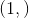 automatically
> 
> ```py
> Returns:
> ```
> 
> seq (sequence of Tensors): If the input has  tensors of size 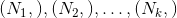, then the output would also has  tensors, where all tensors are of size 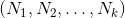.
> 
> Example:
> 
> ```py
> &gt;&gt;&gt; x = torch.tensor([1, 2, 3])
> &gt;&gt;&gt; y = torch.tensor([4, 5, 6])
> &gt;&gt;&gt; grid_x, grid_y = torch.meshgrid(x, y)
> &gt;&gt;&gt; grid_x
> tensor([[1, 1, 1],
>  [2, 2, 2],
>  [3, 3, 3]])
> &gt;&gt;&gt; grid_y
> tensor([[4, 5, 6],
>  [4, 5, 6],
>  [4, 5, 6]])
> 
> ```

```py
torch.renorm(input, p, dim, maxnorm, out=None) → Tensor
```

Returns a tensor where each sub-tensor of `input` along dimension `dim` is normalized such that the `p`-norm of the sub-tensor is lower than the value `maxnorm`

Note

If the norm of a row is lower than `maxnorm`, the row is unchanged

Parameters: 

*   **input** ([_Tensor_](tensors.html#torch.Tensor "torch.Tensor")) – the input tensor
*   **p** ([_float_](https://docs.python.org/3/library/functions.html#float "(in Python v3.7)")) – the power for the norm computation
*   **dim** ([_int_](https://docs.python.org/3/library/functions.html#int "(in Python v3.7)")) – the dimension to slice over to get the sub-tensors
*   **maxnorm** ([_float_](https://docs.python.org/3/library/functions.html#float "(in Python v3.7)")) – the maximum norm to keep each sub-tensor under
*   **out** ([_Tensor_](tensors.html#torch.Tensor "torch.Tensor")_,_ _optional_) – the output tensor


Example:

```py
>>> x = torch.ones(3, 3)
>>> x[1].fill_(2)
tensor([ 2.,  2.,  2.])
>>> x[2].fill_(3)
tensor([ 3.,  3.,  3.])
>>> x
tensor([[ 1.,  1.,  1.],
 [ 2.,  2.,  2.],
 [ 3.,  3.,  3.]])
>>> torch.renorm(x, 1, 0, 5)
tensor([[ 1.0000,  1.0000,  1.0000],
 [ 1.6667,  1.6667,  1.6667],
 [ 1.6667,  1.6667,  1.6667]])

```

```py
torch.tensordot(a, b, dims=2)
```

Returns a contraction of a and b over multiple dimensions.

[`tensordot`](#torch.tensordot "torch.tensordot") implements a generalizes the matrix product.

Parameters: 

*   **a** ([_Tensor_](tensors.html#torch.Tensor "torch.Tensor")) – Left tensor to contract
*   **b** ([_Tensor_](tensors.html#torch.Tensor "torch.Tensor")) – Right tensor to contract
*   **dims** ([_int_](https://docs.python.org/3/library/functions.html#int "(in Python v3.7)") _or_ _tuple of two lists of python:integers_) – number of dimensions to contract or explicit lists of dimensions for `a` and `b` respectively


When called with an integer argument `dims` = , and the number of dimensions of `a` and `b` is  and , respectively, it computes

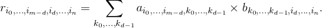

When called with `dims` of the list form, the given dimensions will be contracted in place of the last  of `a` and the first  of . The sizes in these dimensions must match, but [`tensordot`](#torch.tensordot "torch.tensordot") will deal with broadcasted dimensions.

Examples:

```py
>>> a = torch.arange(60.).reshape(3, 4, 5)
>>> b = torch.arange(24.).reshape(4, 3, 2)
>>> torch.tensordot(a, b, dims=([1, 0], [0, 1]))
tensor([[4400., 4730.],
 [4532., 4874.],
 [4664., 5018.],
 [4796., 5162.],
 [4928., 5306.]])

>>> a = torch.randn(3, 4, 5, device='cuda')
>>> b = torch.randn(4, 5, 6, device='cuda')
>>> c = torch.tensordot(a, b, dims=2).cpu()
tensor([[ 8.3504, -2.5436,  6.2922,  2.7556, -1.0732,  3.2741],
 [ 3.3161,  0.0704,  5.0187, -0.4079, -4.3126,  4.8744],
 [ 0.8223,  3.9445,  3.2168, -0.2400,  3.4117,  1.7780]])

```

```py
torch.trace(input) → Tensor
```

Returns the sum of the elements of the diagonal of the input 2-D matrix.

Example:

```py
>>> x = torch.arange(1., 10.).view(3, 3)
>>> x
tensor([[ 1.,  2.,  3.],
 [ 4.,  5.,  6.],
 [ 7.,  8.,  9.]])
>>> torch.trace(x)
tensor(15.)

```

```py
torch.tril(input, diagonal=0, out=None) → Tensor
```

Returns the lower triangular part of the matrix (2-D tensor) `input`, the other elements of the result tensor `out` are set to 0.

The lower triangular part of the matrix is defined as the elements on and below the diagonal.

The argument [`diagonal`](#torch.diagonal "torch.diagonal") controls which diagonal to consider. If [`diagonal`](#torch.diagonal "torch.diagonal") = 0, all elements on and below the main diagonal are retained. A positive value includes just as many diagonals above the main diagonal, and similarly a negative value excludes just as many diagonals below the main diagonal. The main diagonal are the set of indices  for  where  are the dimensions of the matrix.

Parameters: 

*   **input** ([_Tensor_](tensors.html#torch.Tensor "torch.Tensor")) – the input tensor
*   **diagonal** ([_int_](https://docs.python.org/3/library/functions.html#int "(in Python v3.7)")_,_ _optional_) – the diagonal to consider
*   **out** ([_Tensor_](tensors.html#torch.Tensor "torch.Tensor")_,_ _optional_) – the output tensor


Example:

```py
>>> a = torch.randn(3, 3)
>>> a
tensor([[-1.0813, -0.8619,  0.7105],
 [ 0.0935,  0.1380,  2.2112],
 [-0.3409, -0.9828,  0.0289]])
>>> torch.tril(a)
tensor([[-1.0813,  0.0000,  0.0000],
 [ 0.0935,  0.1380,  0.0000],
 [-0.3409, -0.9828,  0.0289]])

>>> b = torch.randn(4, 6)
>>> b
tensor([[ 1.2219,  0.5653, -0.2521, -0.2345,  1.2544,  0.3461],
 [ 0.4785, -0.4477,  0.6049,  0.6368,  0.8775,  0.7145],
 [ 1.1502,  3.2716, -1.1243, -0.5413,  0.3615,  0.6864],
 [-0.0614, -0.7344, -1.3164, -0.7648, -1.4024,  0.0978]])
>>> torch.tril(b, diagonal=1)
tensor([[ 1.2219,  0.5653,  0.0000,  0.0000,  0.0000,  0.0000],
 [ 0.4785, -0.4477,  0.6049,  0.0000,  0.0000,  0.0000],
 [ 1.1502,  3.2716, -1.1243, -0.5413,  0.0000,  0.0000],
 [-0.0614, -0.7344, -1.3164, -0.7648, -1.4024,  0.0000]])
>>> torch.tril(b, diagonal=-1)
tensor([[ 0.0000,  0.0000,  0.0000,  0.0000,  0.0000,  0.0000],
 [ 0.4785,  0.0000,  0.0000,  0.0000,  0.0000,  0.0000],
 [ 1.1502,  3.2716,  0.0000,  0.0000,  0.0000,  0.0000],
 [-0.0614, -0.7344, -1.3164,  0.0000,  0.0000,  0.0000]])

```

```py
torch.triu(input, diagonal=0, out=None) → Tensor
```

Returns the upper triangular part of the matrix (2-D tensor) `input`, the other elements of the result tensor `out` are set to 0.

The upper triangular part of the matrix is defined as the elements on and above the diagonal.

The argument [`diagonal`](#torch.diagonal "torch.diagonal") controls which diagonal to consider. If [`diagonal`](#torch.diagonal "torch.diagonal") = 0, all elements on and below the main diagonal are retained. A positive value excludes just as many diagonals above the main diagonal, and similarly a negative value includes just as many diagonals below the main diagonal. The main diagonal are the set of indices  for  where  are the dimensions of the matrix.

Parameters: 

*   **input** ([_Tensor_](tensors.html#torch.Tensor "torch.Tensor")) – the input tensor
*   **diagonal** ([_int_](https://docs.python.org/3/library/functions.html#int "(in Python v3.7)")_,_ _optional_) – the diagonal to consider
*   **out** ([_Tensor_](tensors.html#torch.Tensor "torch.Tensor")_,_ _optional_) – the output tensor


Example:

```py
>>> a = torch.randn(3, 3)
>>> a
tensor([[ 0.2309,  0.5207,  2.0049],
 [ 0.2072, -1.0680,  0.6602],
 [ 0.3480, -0.5211, -0.4573]])
>>> torch.triu(a)
tensor([[ 0.2309,  0.5207,  2.0049],
 [ 0.0000, -1.0680,  0.6602],
 [ 0.0000,  0.0000, -0.4573]])
>>> torch.triu(a, diagonal=1)
tensor([[ 0.0000,  0.5207,  2.0049],
 [ 0.0000,  0.0000,  0.6602],
 [ 0.0000,  0.0000,  0.0000]])
>>> torch.triu(a, diagonal=-1)
tensor([[ 0.2309,  0.5207,  2.0049],
 [ 0.2072, -1.0680,  0.6602],
 [ 0.0000, -0.5211, -0.4573]])

>>> b = torch.randn(4, 6)
>>> b
tensor([[ 0.5876, -0.0794, -1.8373,  0.6654,  0.2604,  1.5235],
 [-0.2447,  0.9556, -1.2919,  1.3378, -0.1768, -1.0857],
 [ 0.4333,  0.3146,  0.6576, -1.0432,  0.9348, -0.4410],
 [-0.9888,  1.0679, -1.3337, -1.6556,  0.4798,  0.2830]])
>>> torch.tril(b, diagonal=1)
tensor([[ 0.5876, -0.0794,  0.0000,  0.0000,  0.0000,  0.0000],
 [-0.2447,  0.9556, -1.2919,  0.0000,  0.0000,  0.0000],
 [ 0.4333,  0.3146,  0.6576, -1.0432,  0.0000,  0.0000],
 [-0.9888,  1.0679, -1.3337, -1.6556,  0.4798,  0.0000]])
>>> torch.tril(b, diagonal=-1)
tensor([[ 0.0000,  0.0000,  0.0000,  0.0000,  0.0000,  0.0000],
 [-0.2447,  0.0000,  0.0000,  0.0000,  0.0000,  0.0000],
 [ 0.4333,  0.3146,  0.0000,  0.0000,  0.0000,  0.0000],
 [-0.9888,  1.0679, -1.3337,  0.0000,  0.0000,  0.0000]])

```

### BLAS and LAPACK Operations

```py
torch.addbmm(beta=1, mat, alpha=1, batch1, batch2, out=None) → Tensor
```

Performs a batch matrix-matrix product of matrices stored in `batch1` and `batch2`, with a reduced add step (all matrix multiplications get accumulated along the first dimension). `mat` is added to the final result.

`batch1` and `batch2` must be 3-D tensors each containing the same number of matrices.

If `batch1` is a  tensor, `batch2` is a  tensor, `mat` must be [broadcastable](notes/broadcasting.html#broadcasting-semantics) with a  tensor and `out` will be a  tensor.


For inputs of type `FloatTensor` or `DoubleTensor`, arguments `beta` and `alpha` must be real numbers, otherwise they should be integers.

Parameters: 

*   **beta** (_Number__,_ _optional_) – multiplier for `mat` ()
*   **mat** ([_Tensor_](tensors.html#torch.Tensor "torch.Tensor")) – matrix to be added
*   **alpha** (_Number__,_ _optional_) – multiplier for `batch1 @ batch2` ()
*   **batch1** ([_Tensor_](tensors.html#torch.Tensor "torch.Tensor")) – the first batch of matrices to be multiplied
*   **batch2** ([_Tensor_](tensors.html#torch.Tensor "torch.Tensor")) – the second batch of matrices to be multiplied
*   **out** ([_Tensor_](tensors.html#torch.Tensor "torch.Tensor")_,_ _optional_) – the output tensor


Example:

```py
>>> M = torch.randn(3, 5)
>>> batch1 = torch.randn(10, 3, 4)
>>> batch2 = torch.randn(10, 4, 5)
>>> torch.addbmm(M, batch1, batch2)
tensor([[  6.6311,   0.0503,   6.9768, -12.0362,  -2.1653],
 [ -4.8185,  -1.4255,  -6.6760,   8.9453,   2.5743],
 [ -3.8202,   4.3691,   1.0943,  -1.1109,   5.4730]])

```

```py
torch.addmm(beta=1, mat, alpha=1, mat1, mat2, out=None) → Tensor
```

Performs a matrix multiplication of the matrices `mat1` and `mat2`. The matrix `mat` is added to the final result.

If `mat1` is a  tensor, `mat2` is a  tensor, then `mat` must be [broadcastable](notes/broadcasting.html#broadcasting-semantics) with a  tensor and `out` will be a  tensor.

`alpha` and `beta` are scaling factors on matrix-vector product between `mat1` and :attr`mat2` and the added matrix `mat` respectively.


For inputs of type `FloatTensor` or `DoubleTensor`, arguments `beta` and `alpha` must be real numbers, otherwise they should be integers.

Parameters: 

*   **beta** (_Number__,_ _optional_) – multiplier for `mat` ()
*   **mat** ([_Tensor_](tensors.html#torch.Tensor "torch.Tensor")) – matrix to be added
*   **alpha** (_Number__,_ _optional_) – multiplier for  ()
*   **mat1** ([_Tensor_](tensors.html#torch.Tensor "torch.Tensor")) – the first matrix to be multiplied
*   **mat2** ([_Tensor_](tensors.html#torch.Tensor "torch.Tensor")) – the second matrix to be multiplied
*   **out** ([_Tensor_](tensors.html#torch.Tensor "torch.Tensor")_,_ _optional_) – the output tensor


Example:

```py
>>> M = torch.randn(2, 3)
>>> mat1 = torch.randn(2, 3)
>>> mat2 = torch.randn(3, 3)
>>> torch.addmm(M, mat1, mat2)
tensor([[-4.8716,  1.4671, -1.3746],
 [ 0.7573, -3.9555, -2.8681]])

```

```py
torch.addmv(beta=1, tensor, alpha=1, mat, vec, out=None) → Tensor
```

Performs a matrix-vector product of the matrix `mat` and the vector `vec`. The vector [`tensor`](#torch.tensor "torch.tensor") is added to the final result.

If `mat` is a  tensor, `vec` is a 1-D tensor of size `m`, then [`tensor`](#torch.tensor "torch.tensor") must be [broadcastable](notes/broadcasting.html#broadcasting-semantics) with a 1-D tensor of size `n` and `out` will be 1-D tensor of size `n`.

`alpha` and `beta` are scaling factors on matrix-vector product between `mat` and `vec` and the added tensor [`tensor`](#torch.tensor "torch.tensor") respectively.


For inputs of type `FloatTensor` or `DoubleTensor`, arguments `beta` and `alpha` must be real numbers, otherwise they should be integers

Parameters: 

*   **beta** (_Number__,_ _optional_) – multiplier for [`tensor`](#torch.tensor "torch.tensor") ()
*   **tensor** ([_Tensor_](tensors.html#torch.Tensor "torch.Tensor")) – vector to be added
*   **alpha** (_Number__,_ _optional_) – multiplier for  ()
*   **mat** ([_Tensor_](tensors.html#torch.Tensor "torch.Tensor")) – matrix to be multiplied
*   **vec** ([_Tensor_](tensors.html#torch.Tensor "torch.Tensor")) – vector to be multiplied
*   **out** ([_Tensor_](tensors.html#torch.Tensor "torch.Tensor")_,_ _optional_) – the output tensor


Example:

```py
>>> M = torch.randn(2)
>>> mat = torch.randn(2, 3)
>>> vec = torch.randn(3)
>>> torch.addmv(M, mat, vec)
tensor([-0.3768, -5.5565])

```

```py
torch.addr(beta=1, mat, alpha=1, vec1, vec2, out=None) → Tensor
```

Performs the outer-product of vectors `vec1` and `vec2` and adds it to the matrix `mat`.

Optional values `beta` and `alpha` are scaling factors on the outer product between `vec1` and `vec2` and the added matrix `mat` respectively.


If `vec1` is a vector of size `n` and `vec2` is a vector of size `m`, then `mat` must be [broadcastable](notes/broadcasting.html#broadcasting-semantics) with a matrix of size  and `out` will be a matrix of size .

For inputs of type `FloatTensor` or `DoubleTensor`, arguments `beta` and `alpha` must be real numbers, otherwise they should be integers

Parameters: 

*   **beta** (_Number__,_ _optional_) – multiplier for `mat` ()
*   **mat** ([_Tensor_](tensors.html#torch.Tensor "torch.Tensor")) – matrix to be added
*   **alpha** (_Number__,_ _optional_) – multiplier for  ()
*   **vec1** ([_Tensor_](tensors.html#torch.Tensor "torch.Tensor")) – the first vector of the outer product
*   **vec2** ([_Tensor_](tensors.html#torch.Tensor "torch.Tensor")) – the second vector of the outer product
*   **out** ([_Tensor_](tensors.html#torch.Tensor "torch.Tensor")_,_ _optional_) – the output tensor


Example:

```py
>>> vec1 = torch.arange(1., 4.)
>>> vec2 = torch.arange(1., 3.)
>>> M = torch.zeros(3, 2)
>>> torch.addr(M, vec1, vec2)
tensor([[ 1.,  2.],
 [ 2.,  4.],
 [ 3.,  6.]])

```

```py
torch.baddbmm(beta=1, mat, alpha=1, batch1, batch2, out=None) → Tensor
```

Performs a batch matrix-matrix product of matrices in `batch1` and `batch2`. `mat` is added to the final result.

`batch1` and `batch2` must be 3-D tensors each containing the same number of matrices.

If `batch1` is a  tensor, `batch2` is a  tensor, then `mat` must be [broadcastable](notes/broadcasting.html#broadcasting-semantics) with a  tensor and `out` will be a  tensor. Both `alpha` and `beta` mean the same as the scaling factors used in [`torch.addbmm()`](#torch.addbmm "torch.addbmm").


For inputs of type `FloatTensor` or `DoubleTensor`, arguments `beta` and `alpha` must be real numbers, otherwise they should be integers.

Parameters: 

*   **beta** (_Number__,_ _optional_) – multiplier for `mat` ()
*   **mat** ([_Tensor_](tensors.html#torch.Tensor "torch.Tensor")) – the tensor to be added
*   **alpha** (_Number__,_ _optional_) – multiplier for  ()
*   **batch1** ([_Tensor_](tensors.html#torch.Tensor "torch.Tensor")) – the first batch of matrices to be multiplied
*   **batch2** ([_Tensor_](tensors.html#torch.Tensor "torch.Tensor")) – the second batch of matrices to be multiplied
*   **out** ([_Tensor_](tensors.html#torch.Tensor "torch.Tensor")_,_ _optional_) – the output tensor


Example:

```py
>>> M = torch.randn(10, 3, 5)
>>> batch1 = torch.randn(10, 3, 4)
>>> batch2 = torch.randn(10, 4, 5)
>>> torch.baddbmm(M, batch1, batch2).size()
torch.Size([10, 3, 5])

```

```py
torch.bmm(batch1, batch2, out=None) → Tensor
```

Performs a batch matrix-matrix product of matrices stored in `batch1` and `batch2`.

`batch1` and `batch2` must be 3-D tensors each containing the same number of matrices.

If `batch1` is a  tensor, `batch2` is a  tensor, `out` will be a  tensor.


Note

This function does not [broadcast](notes/broadcasting.html#broadcasting-semantics). For broadcasting matrix products, see [`torch.matmul()`](#torch.matmul "torch.matmul").

Parameters: 

*   **batch1** ([_Tensor_](tensors.html#torch.Tensor "torch.Tensor")) – the first batch of matrices to be multiplied
*   **batch2** ([_Tensor_](tensors.html#torch.Tensor "torch.Tensor")) – the second batch of matrices to be multiplied
*   **out** ([_Tensor_](tensors.html#torch.Tensor "torch.Tensor")_,_ _optional_) – the output tensor


Example:

```py
>>> batch1 = torch.randn(10, 3, 4)
>>> batch2 = torch.randn(10, 4, 5)
>>> res = torch.bmm(batch1, batch2)
>>> res.size()
torch.Size([10, 3, 5])

```

```py
torch.btrifact(A, info=None, pivot=True)
```

Batch LU factorization.

Returns a tuple containing the LU factorization and pivots. Pivoting is done if `pivot` is set.

The optional argument `info` stores information if the factorization succeeded for each minibatch example. The `info` is provided as an `IntTensor`, its values will be filled from dgetrf and a non-zero value indicates an error occurred. Specifically, the values are from cublas if cuda is being used, otherwise LAPACK.

Warning

The `info` argument is deprecated in favor of [`torch.btrifact_with_info()`](#torch.btrifact_with_info "torch.btrifact_with_info").

Parameters: 

*   **A** ([_Tensor_](tensors.html#torch.Tensor "torch.Tensor")) – the tensor to factor
*   **info** (_IntTensor__,_ _optional_) – (deprecated) an `IntTensor` to store values indicating whether factorization succeeds
*   **pivot** ([_bool_](https://docs.python.org/3/library/functions.html#bool "(in Python v3.7)")_,_ _optional_) – controls whether pivoting is done


| Returns: | A tuple containing factorization and pivots. |
| --- | --- |

Example:

```py
>>> A = torch.randn(2, 3, 3)
>>> A_LU, pivots = torch.btrifact(A)
>>> A_LU
tensor([[[ 1.3506,  2.5558, -0.0816],
 [ 0.1684,  1.1551,  0.1940],
 [ 0.1193,  0.6189, -0.5497]],

 [[ 0.4526,  1.2526, -0.3285],
 [-0.7988,  0.7175, -0.9701],
 [ 0.2634, -0.9255, -0.3459]]])

>>> pivots
tensor([[ 3,  3,  3],
 [ 3,  3,  3]], dtype=torch.int32)

```

```py
torch.btrifact_with_info(A, pivot=True) -> (Tensor, IntTensor, IntTensor)
```

Batch LU factorization with additional error information.

This is a version of [`torch.btrifact()`](#torch.btrifact "torch.btrifact") that always creates an info `IntTensor`, and returns it as the third return value.

Parameters: 

*   **A** ([_Tensor_](tensors.html#torch.Tensor "torch.Tensor")) – the tensor to factor
*   **pivot** ([_bool_](https://docs.python.org/3/library/functions.html#bool "(in Python v3.7)")_,_ _optional_) – controls whether pivoting is done


| Returns: | A tuple containing factorization, pivots, and an `IntTensor` where non-zero values indicate whether factorization for each minibatch sample succeeds. |
| --- | --- |

Example:

```py
>>> A = torch.randn(2, 3, 3)
>>> A_LU, pivots, info = A.btrifact_with_info()
>>> if info.nonzero().size(0) == 0:
>>>   print('LU factorization succeeded for all samples!')
LU factorization succeeded for all samples!

```

```py
torch.btrisolve(b, LU_data, LU_pivots) → Tensor
```

Batch LU solve.

Returns the LU solve of the linear system .

Parameters: 

*   **b** ([_Tensor_](tensors.html#torch.Tensor "torch.Tensor")) – the RHS tensor
*   **LU_data** ([_Tensor_](tensors.html#torch.Tensor "torch.Tensor")) – the pivoted LU factorization of A from [`btrifact()`](#torch.btrifact "torch.btrifact").
*   **LU_pivots** (_IntTensor_) – the pivots of the LU factorization


Example:

```py
>>> A = torch.randn(2, 3, 3)
>>> b = torch.randn(2, 3)
>>> A_LU = torch.btrifact(A)
>>> x = torch.btrisolve(b, *A_LU)
>>> torch.norm(torch.bmm(A, x.unsqueeze(2)) - b.unsqueeze(2))
tensor(1.00000e-07 *
 2.8312)

```

```py
torch.btriunpack(LU_data, LU_pivots, unpack_data=True, unpack_pivots=True)
```

Unpacks the data and pivots from a batched LU factorization (btrifact) of a tensor.

Returns a tuple of tensors as `(the pivots, the L tensor, the U tensor)`.

Parameters: 

*   **LU_data** ([_Tensor_](tensors.html#torch.Tensor "torch.Tensor")) – the packed LU factorization data
*   **LU_pivots** ([_Tensor_](tensors.html#torch.Tensor "torch.Tensor")) – the packed LU factorization pivots
*   **unpack_data** ([_bool_](https://docs.python.org/3/library/functions.html#bool "(in Python v3.7)")) – flag indicating if the data should be unpacked
*   **unpack_pivots** ([_bool_](https://docs.python.org/3/library/functions.html#bool "(in Python v3.7)")) – flag indicating if the pivots should be unpacked


Example:

```py
>>> A = torch.randn(2, 3, 3)
>>> A_LU, pivots = A.btrifact()
>>> P, A_L, A_U = torch.btriunpack(A_LU, pivots)
>>>
>>> # can recover A from factorization
>>> A_ = torch.bmm(P, torch.bmm(A_L, A_U))

```

```py
torch.chain_matmul(*matrices)
```

Returns the matrix product of the  2-D tensors. This product is efficiently computed using the matrix chain order algorithm which selects the order in which incurs the lowest cost in terms of arithmetic operations ([[CLRS]](https://mitpress.mit.edu/books/introduction-algorithms-third-edition)). Note that since this is a function to compute the product,  needs to be greater than or equal to 2; if equal to 2 then a trivial matrix-matrix product is returned. If  is 1, then this is a no-op - the original matrix is returned as is.

| Parameters: | **matrices** (_Tensors..._) – a sequence of 2 or more 2-D tensors whose product is to be determined. |
| --- | --- |
| Returns: | if the  tensor was of dimensions , then the product would be of dimensions . |
| --- | --- |
| Return type: | [Tensor](tensors.html#torch.Tensor "torch.Tensor") |
| --- | --- |

Example:

```py
>>> a = torch.randn(3, 4)
>>> b = torch.randn(4, 5)
>>> c = torch.randn(5, 6)
>>> d = torch.randn(6, 7)
>>> torch.chain_matmul(a, b, c, d)
tensor([[ -2.3375,  -3.9790,  -4.1119,  -6.6577,   9.5609, -11.5095,  -3.2614],
 [ 21.4038,   3.3378,  -8.4982,  -5.2457, -10.2561,  -2.4684,   2.7163],
 [ -0.9647,  -5.8917,  -2.3213,  -5.2284,  12.8615, -12.2816,  -2.5095]])

```

```py
torch.cholesky(A, upper=False, out=None) → Tensor
```

Computes the Cholesky decomposition of a symmetric positive-definite matrix  or for batches of symmetric positive-definite matrices.

If `upper` is `True`, the returned matrix `U` is upper-triangular, and the decomposition has the form:


If `upper` is `False`, the returned matrix `L` is lower-triangular, and the decomposition has the form:


If `upper` is `True`, and `A` is a batch of symmetric positive-definite matrices, then the returned tensor will be composed of upper-triangular Cholesky factors of each of the individual matrices. Similarly, when `upper` is `False`, the returned tensor will be composed of lower-triangular Cholesky factors of each of the individual matrices.

Parameters: 

*   **a** ([_Tensor_](tensors.html#torch.Tensor "torch.Tensor")) – the input tensor of size ([*](#id6), n, n) where `*` is zero or more batch dimensions consisting of symmetric positive-definite matrices.
*   **upper** ([_bool_](https://docs.python.org/3/library/functions.html#bool "(in Python v3.7)")_,_ _optional_) – flag that indicates whether to return a upper or lower triangular matrix. Default: `False`
*   **out** ([_Tensor_](tensors.html#torch.Tensor "torch.Tensor")_,_ _optional_) – the output matrix


Example:

```py
>>> a = torch.randn(3, 3)
>>> a = torch.mm(a, a.t()) # make symmetric positive-definite
>>> l = torch.cholesky(a)
>>> a
tensor([[ 2.4112, -0.7486,  1.4551],
 [-0.7486,  1.3544,  0.1294],
 [ 1.4551,  0.1294,  1.6724]])
>>> l
tensor([[ 1.5528,  0.0000,  0.0000],
 [-0.4821,  1.0592,  0.0000],
 [ 0.9371,  0.5487,  0.7023]])
>>> torch.mm(l, l.t())
tensor([[ 2.4112, -0.7486,  1.4551],
 [-0.7486,  1.3544,  0.1294],
 [ 1.4551,  0.1294,  1.6724]])
>>> a = torch.randn(3, 2, 2)
>>> a = torch.matmul(a, a.transpose(-1, -2)) + 1e-03 # make symmetric positive-definite
>>> l = torch.cholesky(a)
>>> z = torch.matmul(l, l.transpose(-1, -2))
>>> torch.max(torch.abs(z - a)) # Max non-zero
tensor(2.3842e-07)

```

```py
torch.dot(tensor1, tensor2) → Tensor
```

Computes the dot product (inner product) of two tensors.

Note

This function does not [broadcast](notes/broadcasting.html#broadcasting-semantics).

Example:

```py
>>> torch.dot(torch.tensor([2, 3]), torch.tensor([2, 1]))
tensor(7)

```

```py
torch.eig(a, eigenvectors=False, out=None) -> (Tensor, Tensor)
```

Computes the eigenvalues and eigenvectors of a real square matrix.

Parameters: 

*   **a** ([_Tensor_](tensors.html#torch.Tensor "torch.Tensor")) – the square matrix of shape  for which the eigenvalues and eigenvectors will be computed
*   **eigenvectors** ([_bool_](https://docs.python.org/3/library/functions.html#bool "(in Python v3.7)")) – `True` to compute both eigenvalues and eigenvectors; otherwise, only eigenvalues will be computed
*   **out** ([_tuple_](https://docs.python.org/3/library/stdtypes.html#tuple "(in Python v3.7)")_,_ _optional_) – the output tensors


| Returns: | A tuple containing

&gt; *   **e** (_Tensor_): Shape . Each row is an eigenvalue of `a`, where the first element is the real part and the second element is the imaginary part. The eigenvalues are not necessarily ordered.
&gt; *   **v** (_Tensor_): If `eigenvectors=False`, it’s an empty tensor. Otherwise, this tensor of shape  can be used to compute normalized (unit length) eigenvectors of corresponding eigenvalues `e` as follows. If the corresponding e[j] is a real number, column v[:, j] is the eigenvector corresponding to eigenvalue e[j]. If the corresponding e[j] and e[j + 1] eigenvalues form a complex conjugate pair, then the true eigenvectors can be computed as , .


| Return type: | ([Tensor](tensors.html#torch.Tensor "torch.Tensor"), [Tensor](tensors.html#torch.Tensor "torch.Tensor")) |
| --- | --- |

```py
torch.gels(B, A, out=None) → Tensor
```

Computes the solution to the least squares and least norm problems for a full rank matrix  of size  and a matrix  of size .

If , [`gels()`](#torch.gels "torch.gels") solves the least-squares problem:


If , [`gels()`](#torch.gels "torch.gels") solves the least-norm problem:


Returned tensor  has shape . The first  rows of  contains the solution. If , the residual sum of squares for the solution in each column is given by the sum of squares of elements in the remaining  rows of that column.

Parameters: 

*   **B** ([_Tensor_](tensors.html#torch.Tensor "torch.Tensor")) – the matrix 
*   **A** ([_Tensor_](tensors.html#torch.Tensor "torch.Tensor")) – the  by  matrix 
*   **out** ([_tuple_](https://docs.python.org/3/library/stdtypes.html#tuple "(in Python v3.7)")_,_ _optional_) – the optional destination tensor


| Returns: | A tuple containing:

&gt; *   **X** (_Tensor_): the least squares solution
&gt; *   **qr** (_Tensor_): the details of the QR factorization


| Return type: | ([Tensor](tensors.html#torch.Tensor "torch.Tensor"), [Tensor](tensors.html#torch.Tensor "torch.Tensor")) |
| --- | --- |

Note

The returned matrices will always be transposed, irrespective of the strides of the input matrices. That is, they will have stride `(1, m)` instead of `(m, 1)`.

Example:

```py
>>> A = torch.tensor([[1., 1, 1],
 [2, 3, 4],
 [3, 5, 2],
 [4, 2, 5],
 [5, 4, 3]])
>>> B = torch.tensor([[-10., -3],
 [ 12, 14],
 [ 14, 12],
 [ 16, 16],
 [ 18, 16]])
>>> X, _ = torch.gels(B, A)
>>> X
tensor([[  2.0000,   1.0000],
 [  1.0000,   1.0000],
 [  1.0000,   2.0000],
 [ 10.9635,   4.8501],
 [  8.9332,   5.2418]])

```

```py
torch.geqrf(input, out=None) -> (Tensor, Tensor)
```

This is a low-level function for calling LAPACK directly.

You’ll generally want to use [`torch.qr()`](#torch.qr "torch.qr") instead.

Computes a QR decomposition of `input`, but without constructing  and  as explicit separate matrices.

Rather, this directly calls the underlying LAPACK function `?geqrf` which produces a sequence of ‘elementary reflectors’.

See [LAPACK documentation for geqrf](https://software.intel.com/en-us/node/521004) for further details.

Parameters: 

*   **input** ([_Tensor_](tensors.html#torch.Tensor "torch.Tensor")) – the input matrix
*   **out** ([_tuple_](https://docs.python.org/3/library/stdtypes.html#tuple "(in Python v3.7)")_,_ _optional_) – the output tuple of (Tensor, Tensor)


```py
torch.ger(vec1, vec2, out=None) → Tensor
```

Outer product of `vec1` and `vec2`. If `vec1` is a vector of size  and `vec2` is a vector of size , then `out` must be a matrix of size .

Note

This function does not [broadcast](notes/broadcasting.html#broadcasting-semantics).

Parameters: 

*   **vec1** ([_Tensor_](tensors.html#torch.Tensor "torch.Tensor")) – 1-D input vector
*   **vec2** ([_Tensor_](tensors.html#torch.Tensor "torch.Tensor")) – 1-D input vector
*   **out** ([_Tensor_](tensors.html#torch.Tensor "torch.Tensor")_,_ _optional_) – optional output matrix


Example:

```py
>>> v1 = torch.arange(1., 5.)
>>> v2 = torch.arange(1., 4.)
>>> torch.ger(v1, v2)
tensor([[  1.,   2.,   3.],
 [  2.,   4.,   6.],
 [  3.,   6.,   9.],
 [  4.,   8.,  12.]])

```

```py
torch.gesv(B, A) -> (Tensor, Tensor)
```

This function returns the solution to the system of linear equations represented by  and the LU factorization of A, in order as a tuple `X, LU`.

`LU` contains `L` and `U` factors for LU factorization of `A`.

`torch.gesv(B, A)` can take in 2D inputs `B, A` or inputs that are batches of 2D matrices. If the inputs are batches, then returns batched outputs `X, LU`.

Note

The `out` keyword only supports 2D matrix inputs, that is, `B, A` must be 2D matrices.

Note

Irrespective of the original strides, the returned matrices `X` and `LU` will be transposed, i.e. with strides like `B.contiguous().transpose(-1, -2).strides()` and `A.contiguous().transpose(-1, -2).strides()` respectively.

Parameters: 

*   **B** ([_Tensor_](tensors.html#torch.Tensor "torch.Tensor")) – input matrix of size  , where  is zero or more batch dimensions.
*   **A** ([_Tensor_](tensors.html#torch.Tensor "torch.Tensor")) – input square matrix of size , where  is zero or more batch dimensions.
*   **out** (_(_[_Tensor_](tensors.html#torch.Tensor "torch.Tensor")_,_ [_Tensor_](tensors.html#torch.Tensor "torch.Tensor")_)__,_ _optional_) – optional output tuple.


Example:

```py
>>> A = torch.tensor([[6.80, -2.11,  5.66,  5.97,  8.23],
 [-6.05, -3.30,  5.36, -4.44,  1.08],
 [-0.45,  2.58, -2.70,  0.27,  9.04],
 [8.32,  2.71,  4.35,  -7.17,  2.14],
 [-9.67, -5.14, -7.26,  6.08, -6.87]]).t()
>>> B = torch.tensor([[4.02,  6.19, -8.22, -7.57, -3.03],
 [-1.56,  4.00, -8.67,  1.75,  2.86],
 [9.81, -4.09, -4.57, -8.61,  8.99]]).t()
>>> X, LU = torch.gesv(B, A)
>>> torch.dist(B, torch.mm(A, X))
tensor(1.00000e-06 *
 7.0977)

>>> # Batched solver example
>>> A = torch.randn(2, 3, 1, 4, 4)
>>> B = torch.randn(2, 3, 1, 4, 6)
>>> X, LU = torch.gesv(B, A)
>>> torch.dist(B, A.matmul(X))
tensor(1.00000e-06 *
 3.6386)

```

```py
torch.inverse(input, out=None) → Tensor
```

Takes the inverse of the square matrix `input`. `input` can be batches of 2D square tensors, in which case this function would return a tensor composed of individual inverses.

Note

Irrespective of the original strides, the returned tensors will be transposed, i.e. with strides like `input.contiguous().transpose(-2, -1).strides()`

Parameters: 

*   **input** ([_Tensor_](tensors.html#torch.Tensor "torch.Tensor")) – the input tensor of size ([*](#id8), n, n) where `*` is zero or more batch dimensions
*   **out** ([_Tensor_](tensors.html#torch.Tensor "torch.Tensor")_,_ _optional_) – the optional output tensor


Example:

```py
>>> x = torch.rand(4, 4)
>>> y = torch.inverse(x)
>>> z = torch.mm(x, y)
>>> z
tensor([[ 1.0000, -0.0000, -0.0000,  0.0000],
 [ 0.0000,  1.0000,  0.0000,  0.0000],
 [ 0.0000,  0.0000,  1.0000,  0.0000],
 [ 0.0000, -0.0000, -0.0000,  1.0000]])
>>> torch.max(torch.abs(z - torch.eye(4))) # Max non-zero
tensor(1.1921e-07)
>>> # Batched inverse example
>>> x = torch.randn(2, 3, 4, 4)
>>> y = torch.inverse(x)
>>> z = torch.matmul(x, y)
>>> torch.max(torch.abs(z - torch.eye(4).expand_as(x))) # Max non-zero
tensor(1.9073e-06)

```

```py
torch.det(A) → Tensor
```

Calculates determinant of a 2D square tensor.

Note

Backward through [`det()`](#torch.det "torch.det") internally uses SVD results when `A` is not invertible. In this case, double backward through [`det()`](#torch.det "torch.det") will be unstable in when `A` doesn’t have distinct singular values. See [`svd()`](#torch.svd "torch.svd") for details.

| Parameters: | **A** ([_Tensor_](tensors.html#torch.Tensor "torch.Tensor")) – The input 2D square tensor |
| --- | --- |

Example:

```py
>>> A = torch.randn(3, 3)
>>> torch.det(A)
tensor(3.7641)

```

```py
torch.logdet(A) → Tensor
```

Calculates log determinant of a 2D square tensor.

Note

Result is `-inf` if `A` has zero log determinant, and is `nan` if `A` has negative determinant.

Note

Backward through [`logdet()`](#torch.logdet "torch.logdet") internally uses SVD results when `A` is not invertible. In this case, double backward through [`logdet()`](#torch.logdet "torch.logdet") will be unstable in when `A` doesn’t have distinct singular values. See [`svd()`](#torch.svd "torch.svd") for details.

| Parameters: | **A** ([_Tensor_](tensors.html#torch.Tensor "torch.Tensor")) – The input 2D square tensor |
| --- | --- |

Example:

```py
>>> A = torch.randn(3, 3)
>>> torch.det(A)
tensor(0.2611)
>>> torch.logdet(A)
tensor(-1.3430)

```

```py
torch.slogdet(A) -> (Tensor, Tensor)
```

Calculates the sign and log value of a 2D square tensor’s determinant.

Note

If `A` has zero determinant, this returns `(0, -inf)`.

Note

Backward through [`slogdet()`](#torch.slogdet "torch.slogdet") internally uses SVD results when `A` is not invertible. In this case, double backward through [`slogdet()`](#torch.slogdet "torch.slogdet") will be unstable in when `A` doesn’t have distinct singular values. See [`svd()`](#torch.svd "torch.svd") for details.

| Parameters: | **A** ([_Tensor_](tensors.html#torch.Tensor "torch.Tensor")) – The input 2D square tensor |
| --- | --- |
| Returns: | A tuple containing the sign of the determinant, and the log value of the absolute determinant. |
| --- | --- |

Example:

```py
>>> A = torch.randn(3, 3)
>>> torch.det(A)
tensor(-4.8215)
>>> torch.logdet(A)
tensor(nan)
>>> torch.slogdet(A)
(tensor(-1.), tensor(1.5731))

```

```py
torch.matmul(tensor1, tensor2, out=None) → Tensor
```

Matrix product of two tensors.

The behavior depends on the dimensionality of the tensors as follows:

*   If both tensors are 1-dimensional, the dot product (scalar) is returned.
*   If both arguments are 2-dimensional, the matrix-matrix product is returned.
*   If the first argument is 1-dimensional and the second argument is 2-dimensional, a 1 is prepended to its dimension for the purpose of the matrix multiply. After the matrix multiply, the prepended dimension is removed.
*   If the first argument is 2-dimensional and the second argument is 1-dimensional, the matrix-vector product is returned.
*   If both arguments are at least 1-dimensional and at least one argument is N-dimensional (where N &gt; 2), then a batched matrix multiply is returned. If the first argument is 1-dimensional, a 1 is prepended to its dimension for the purpose of the batched matrix multiply and removed after. If the second argument is 1-dimensional, a 1 is appended to its dimension for the purpose of the batched matrix multiple and removed after. The non-matrix (i.e. batch) dimensions are [broadcasted](notes/broadcasting.html#broadcasting-semantics) (and thus must be broadcastable). For example, if `tensor1` is a  tensor and `tensor2` is a  tensor, `out` will be an  tensor.

Note

The 1-dimensional dot product version of this function does not support an `out` parameter.

Parameters: 

*   **tensor1** ([_Tensor_](tensors.html#torch.Tensor "torch.Tensor")) – the first tensor to be multiplied
*   **tensor2** ([_Tensor_](tensors.html#torch.Tensor "torch.Tensor")) – the second tensor to be multiplied
*   **out** ([_Tensor_](tensors.html#torch.Tensor "torch.Tensor")_,_ _optional_) – the output tensor


Example:

```py
>>> # vector x vector
>>> tensor1 = torch.randn(3)
>>> tensor2 = torch.randn(3)
>>> torch.matmul(tensor1, tensor2).size()
torch.Size([])
>>> # matrix x vector
>>> tensor1 = torch.randn(3, 4)
>>> tensor2 = torch.randn(4)
>>> torch.matmul(tensor1, tensor2).size()
torch.Size([3])
>>> # batched matrix x broadcasted vector
>>> tensor1 = torch.randn(10, 3, 4)
>>> tensor2 = torch.randn(4)
>>> torch.matmul(tensor1, tensor2).size()
torch.Size([10, 3])
>>> # batched matrix x batched matrix
>>> tensor1 = torch.randn(10, 3, 4)
>>> tensor2 = torch.randn(10, 4, 5)
>>> torch.matmul(tensor1, tensor2).size()
torch.Size([10, 3, 5])
>>> # batched matrix x broadcasted matrix
>>> tensor1 = torch.randn(10, 3, 4)
>>> tensor2 = torch.randn(4, 5)
>>> torch.matmul(tensor1, tensor2).size()
torch.Size([10, 3, 5])

```

```py
torch.matrix_power(input, n) → Tensor
```

Returns the matrix raised to the power `n` for square matrices. For batch of matrices, each individual matrix is raised to the power `n`.

If `n` is negative, then the inverse of the matrix (if invertible) is raised to the power `n`. For a batch of matrices, the batched inverse (if invertible) is raised to the power `n`. If `n` is 0, then an identity matrix is returned.

Parameters: 

*   **input** ([_Tensor_](tensors.html#torch.Tensor "torch.Tensor")) – the input tensor
*   **n** ([_int_](https://docs.python.org/3/library/functions.html#int "(in Python v3.7)")) – the power to raise the matrix to


Example:

```py
>>> a = torch.randn(2, 2, 2)
>>> a
tensor([[[-1.9975, -1.9610],
 [ 0.9592, -2.3364]],

 [[-1.2534, -1.3429],
 [ 0.4153, -1.4664]]])
>>> torch.matrix_power(a, 3)
tensor([[[  3.9392, -23.9916],
 [ 11.7357,  -0.2070]],

 [[  0.2468,  -6.7168],
 [  2.0774,  -0.8187]]])

```

```py
torch.matrix_rank(input, tol=None, bool symmetric=False) → Tensor
```

Returns the numerical rank of a 2-D tensor. The method to compute the matrix rank is done using SVD by default. If `symmetric` is `True`, then `input` is assumed to be symmetric, and the computation of the rank is done by obtaining the eigenvalues.

`tol` is the threshold below which the singular values (or the eigenvalues when `symmetric` is `True`) are considered to be 0\. If `tol` is not specified, `tol` is set to `S.max() * max(S.size()) * eps` where `S` is the singular values (or the eigenvalues when `symmetric` is `True`), and `eps` is the epsilon value for the datatype of `input`.

Parameters: 

*   **input** ([_Tensor_](tensors.html#torch.Tensor "torch.Tensor")) – the input 2-D tensor
*   **tol** ([_float_](https://docs.python.org/3/library/functions.html#float "(in Python v3.7)")_,_ _optional_) – the tolerance value. Default: `None`
*   **symmetric** ([_bool_](https://docs.python.org/3/library/functions.html#bool "(in Python v3.7)")_,_ _optional_) – indicates whether `input` is symmetric. Default: `False`


Example:

```py
>>> a = torch.eye(10)
>>> torch.matrix_rank(a)
tensor(10)
>>> b = torch.eye(10)
>>> b[0, 0] = 0
>>> torch.matrix_rank(b)
tensor(9)

```

```py
torch.mm(mat1, mat2, out=None) → Tensor
```

Performs a matrix multiplication of the matrices `mat1` and `mat2`.

If `mat1` is a  tensor, `mat2` is a  tensor, `out` will be a  tensor.

Note

This function does not [broadcast](notes/broadcasting.html#broadcasting-semantics). For broadcasting matrix products, see [`torch.matmul()`](#torch.matmul "torch.matmul").

Parameters: 

*   **mat1** ([_Tensor_](tensors.html#torch.Tensor "torch.Tensor")) – the first matrix to be multiplied
*   **mat2** ([_Tensor_](tensors.html#torch.Tensor "torch.Tensor")) – the second matrix to be multiplied
*   **out** ([_Tensor_](tensors.html#torch.Tensor "torch.Tensor")_,_ _optional_) – the output tensor


Example:

```py
>>> mat1 = torch.randn(2, 3)
>>> mat2 = torch.randn(3, 3)
>>> torch.mm(mat1, mat2)
tensor([[ 0.4851,  0.5037, -0.3633],
 [-0.0760, -3.6705,  2.4784]])

```

```py
torch.mv(mat, vec, out=None) → Tensor
```

Performs a matrix-vector product of the matrix `mat` and the vector `vec`.

If `mat` is a  tensor, `vec` is a 1-D tensor of size , `out` will be 1-D of size .

Note

This function does not [broadcast](notes/broadcasting.html#broadcasting-semantics).

Parameters: 

*   **mat** ([_Tensor_](tensors.html#torch.Tensor "torch.Tensor")) – matrix to be multiplied
*   **vec** ([_Tensor_](tensors.html#torch.Tensor "torch.Tensor")) – vector to be multiplied
*   **out** ([_Tensor_](tensors.html#torch.Tensor "torch.Tensor")_,_ _optional_) – the output tensor


Example:

```py
>>> mat = torch.randn(2, 3)
>>> vec = torch.randn(3)
>>> torch.mv(mat, vec)
tensor([ 1.0404, -0.6361])

```

```py
torch.orgqr(a, tau) → Tensor
```

Computes the orthogonal matrix `Q` of a QR factorization, from the `(a, tau)` tuple returned by [`torch.geqrf()`](#torch.geqrf "torch.geqrf").

This directly calls the underlying LAPACK function `?orgqr`. See [LAPACK documentation for orgqr](https://software.intel.com/en-us/mkl-developer-reference-c-orgqr) for further details.

Parameters: 

*   **a** ([_Tensor_](tensors.html#torch.Tensor "torch.Tensor")) – the `a` from [`torch.geqrf()`](#torch.geqrf "torch.geqrf").
*   **tau** ([_Tensor_](tensors.html#torch.Tensor "torch.Tensor")) – the `tau` from [`torch.geqrf()`](#torch.geqrf "torch.geqrf").


```py
torch.ormqr(a, tau, mat, left=True, transpose=False) -> (Tensor, Tensor)
```

Multiplies `mat` by the orthogonal `Q` matrix of the QR factorization formed by [`torch.geqrf()`](#torch.geqrf "torch.geqrf") that is represented by `(a, tau)`.

This directly calls the underlying LAPACK function `?ormqr`. See [LAPACK documentation for ormqr](https://software.intel.com/en-us/mkl-developer-reference-c-ormqr) for further details.

Parameters: 

*   **a** ([_Tensor_](tensors.html#torch.Tensor "torch.Tensor")) – the `a` from [`torch.geqrf()`](#torch.geqrf "torch.geqrf").
*   **tau** ([_Tensor_](tensors.html#torch.Tensor "torch.Tensor")) – the `tau` from [`torch.geqrf()`](#torch.geqrf "torch.geqrf").
*   **mat** ([_Tensor_](tensors.html#torch.Tensor "torch.Tensor")) – the matrix to be multiplied.


```py
torch.pinverse(input, rcond=1e-15) → Tensor
```

Calculates the pseudo-inverse (also known as the Moore-Penrose inverse) of a 2D tensor. Please look at [Moore-Penrose inverse](https://en.wikipedia.org/wiki/Moore%E2%80%93Penrose_inverse) for more details

Note

This method is implemented using the Singular Value Decomposition.

Note

The pseudo-inverse is not necessarily a continuous function in the elements of the matrix [[1]](https://epubs.siam.org/doi/10.1137/0117004). Therefore, derivatives are not always existent, and exist for a constant rank only [[2]](https://www.jstor.org/stable/2156365). However, this method is backprop-able due to the implementation by using SVD results, and could be unstable. Double-backward will also be unstable due to the usage of SVD internally. See [`svd()`](#torch.svd "torch.svd") for more details.

Parameters: 

*   **input** ([_Tensor_](tensors.html#torch.Tensor "torch.Tensor")) – The input 2D tensor of dimensions 
*   **rcond** ([_float_](https://docs.python.org/3/library/functions.html#float "(in Python v3.7)")) – A floating point value to determine the cutoff for small singular values. Default: 1e-15


| Returns: | The pseudo-inverse of `input` of dimensions  |
| --- | --- |

Example:

```py
>>> input = torch.randn(3, 5)
>>> input
tensor([[ 0.5495,  0.0979, -1.4092, -0.1128,  0.4132],
 [-1.1143, -0.3662,  0.3042,  1.6374, -0.9294],
 [-0.3269, -0.5745, -0.0382, -0.5922, -0.6759]])
>>> torch.pinverse(input)
tensor([[ 0.0600, -0.1933, -0.2090],
 [-0.0903, -0.0817, -0.4752],
 [-0.7124, -0.1631, -0.2272],
 [ 0.1356,  0.3933, -0.5023],
 [-0.0308, -0.1725, -0.5216]])

```

```py
torch.potrf(a, upper=True, out=None)
```

Computes the Cholesky decomposition of a symmetric positive-definite matrix .

For more information, regarding [`torch.potrf()`](#torch.potrf "torch.potrf"), please check [`torch.cholesky()`](#torch.cholesky "torch.cholesky").

Warning

torch.potrf is deprecated in favour of torch.cholesky and will be removed in the next release. Please use torch.cholesky instead and note that the `upper` argument in torch.cholesky defaults to `False`.

```py
torch.potri(u, upper=True, out=None) → Tensor
```

Computes the inverse of a positive semidefinite matrix given its Cholesky factor `u`: returns matrix `inv`

If `upper` is `True` or not provided, `u` is upper triangular such that the returned tensor is


If `upper` is `False`, `u` is lower triangular such that the returned tensor is


Parameters: 

*   **u** ([_Tensor_](tensors.html#torch.Tensor "torch.Tensor")) – the input 2-D tensor, a upper or lower triangular Cholesky factor
*   **upper** ([_bool_](https://docs.python.org/3/library/functions.html#bool "(in Python v3.7)")_,_ _optional_) – whether to return a upper (default) or lower triangular matrix
*   **out** ([_Tensor_](tensors.html#torch.Tensor "torch.Tensor")_,_ _optional_) – the output tensor for `inv`


Example:

```py
>>> a = torch.randn(3, 3)
>>> a = torch.mm(a, a.t()) # make symmetric positive definite
>>> u = torch.cholesky(a)
>>> a
tensor([[  0.9935,  -0.6353,   1.5806],
 [ -0.6353,   0.8769,  -1.7183],
 [  1.5806,  -1.7183,  10.6618]])
>>> torch.potri(u)
tensor([[ 1.9314,  1.2251, -0.0889],
 [ 1.2251,  2.4439,  0.2122],
 [-0.0889,  0.2122,  0.1412]])
>>> a.inverse()
tensor([[ 1.9314,  1.2251, -0.0889],
 [ 1.2251,  2.4439,  0.2122],
 [-0.0889,  0.2122,  0.1412]])

```

```py
torch.potrs(b, u, upper=True, out=None) → Tensor
```

Solves a linear system of equations with a positive semidefinite matrix to be inverted given its Cholesky factor matrix `u`.

If `upper` is `True` or not provided, `u` is upper triangular and `c` is returned such that:


If `upper` is `False`, `u` is and lower triangular and `c` is returned such that:


`torch.potrs(b, u)` can take in 2D inputs `b, u` or inputs that are batches of 2D matrices. If the inputs are batches, then returns batched outputs `c`

Note

The `out` keyword only supports 2D matrix inputs, that is, `b, u` must be 2D matrices.

Parameters: 

*   **b** ([_Tensor_](tensors.html#torch.Tensor "torch.Tensor")) – input matrix of size , where  is zero or more batch dimensions
*   **u** ([_Tensor_](tensors.html#torch.Tensor "torch.Tensor")) – input matrix of size , where  is zero of more batch dimensions composed of upper or lower triangular Cholesky factor
*   **upper** ([_bool_](https://docs.python.org/3/library/functions.html#bool "(in Python v3.7)")_,_ _optional_) – whether to return a upper (default) or lower triangular matrix
*   **out** ([_Tensor_](tensors.html#torch.Tensor "torch.Tensor")_,_ _optional_) – the output tensor for `c`


Example:

```py
>>> a = torch.randn(3, 3)
>>> a = torch.mm(a, a.t()) # make symmetric positive definite
>>> u = torch.cholesky(a)
>>> a
tensor([[ 0.7747, -1.9549,  1.3086],
 [-1.9549,  6.7546, -5.4114],
 [ 1.3086, -5.4114,  4.8733]])
>>> b = torch.randn(3, 2)
>>> b
tensor([[-0.6355,  0.9891],
 [ 0.1974,  1.4706],
 [-0.4115, -0.6225]])
>>> torch.potrs(b,u)
tensor([[ -8.1625,  19.6097],
 [ -5.8398,  14.2387],
 [ -4.3771,  10.4173]])
>>> torch.mm(a.inverse(),b)
tensor([[ -8.1626,  19.6097],
 [ -5.8398,  14.2387],
 [ -4.3771,  10.4173]])

```

```py
torch.pstrf(a, upper=True, out=None) -> (Tensor, Tensor)
```

Computes the pivoted Cholesky decomposition of a positive semidefinite matrix `a`. returns matrices `u` and `piv`.

If `upper` is `True` or not provided, `u` is upper triangular such that , with `p` the permutation given by `piv`.

If `upper` is `False`, `u` is lower triangular such that .

Parameters: 

*   **a** ([_Tensor_](tensors.html#torch.Tensor "torch.Tensor")) – the input 2-D tensor
*   **upper** ([_bool_](https://docs.python.org/3/library/functions.html#bool "(in Python v3.7)")_,_ _optional_) – whether to return a upper (default) or lower triangular matrix
*   **out** ([_tuple_](https://docs.python.org/3/library/stdtypes.html#tuple "(in Python v3.7)")_,_ _optional_) – tuple of `u` and `piv` tensors


Example:

```py
>>> a = torch.randn(3, 3)
>>> a = torch.mm(a, a.t()) # make symmetric positive definite
>>> a
tensor([[ 3.5405, -0.4577,  0.8342],
 [-0.4577,  1.8244, -0.1996],
 [ 0.8342, -0.1996,  3.7493]])
>>> u,piv = torch.pstrf(a)
>>> u
tensor([[ 1.9363,  0.4308, -0.1031],
 [ 0.0000,  1.8316, -0.2256],
 [ 0.0000,  0.0000,  1.3277]])
>>> piv
tensor([ 2,  0,  1], dtype=torch.int32)
>>> p = torch.eye(3).index_select(0,piv.long()).index_select(0,piv.long()).t() # make pivot permutation
>>> torch.mm(torch.mm(p.t(),torch.mm(u.t(),u)),p) # reconstruct
tensor([[ 3.5405, -0.4577,  0.8342],
 [-0.4577,  1.8244, -0.1996],
 [ 0.8342, -0.1996,  3.7493]])

```

```py
torch.qr(input, out=None) -> (Tensor, Tensor)
```

Computes the QR decomposition of a matrix `input`, and returns matrices `Q` and `R` such that , with  being an orthogonal matrix and  being an upper triangular matrix.

This returns the thin (reduced) QR factorization.

Note

precision may be lost if the magnitudes of the elements of `input` are large

Note

While it should always give you a valid decomposition, it may not give you the same one across platforms - it will depend on your LAPACK implementation.

Note

Irrespective of the original strides, the returned matrix  will be transposed, i.e. with strides `(1, m)` instead of `(m, 1)`.

Parameters: 

*   **input** ([_Tensor_](tensors.html#torch.Tensor "torch.Tensor")) – the input 2-D tensor
*   **out** ([_tuple_](https://docs.python.org/3/library/stdtypes.html#tuple "(in Python v3.7)")_,_ _optional_) – tuple of `Q` and `R` tensors


Example:

```py
>>> a = torch.tensor([[12., -51, 4], [6, 167, -68], [-4, 24, -41]])
>>> q, r = torch.qr(a)
>>> q
tensor([[-0.8571,  0.3943,  0.3314],
 [-0.4286, -0.9029, -0.0343],
 [ 0.2857, -0.1714,  0.9429]])
>>> r
tensor([[ -14.0000,  -21.0000,   14.0000],
 [   0.0000, -175.0000,   70.0000],
 [   0.0000,    0.0000,  -35.0000]])
>>> torch.mm(q, r).round()
tensor([[  12.,  -51.,    4.],
 [   6.,  167.,  -68.],
 [  -4.,   24.,  -41.]])
>>> torch.mm(q.t(), q).round()
tensor([[ 1.,  0.,  0.],
 [ 0.,  1., -0.],
 [ 0., -0.,  1.]])

```

```py
torch.svd(input, some=True, compute_uv=True, out=None) -> (Tensor, Tensor, Tensor)
```

`U, S, V = torch.svd(A)` returns the singular value decomposition of a real matrix `A` of size `(n x m)` such that .

`U` is of shape .

`S` is a diagonal matrix of shape , represented as a vector of size  containing the non-negative diagonal entries.

`V` is of shape .

If `some` is `True` (default), the returned `U` and `V` matrices will contain only  orthonormal columns.

If `compute_uv` is `False`, the returned `U` and `V` matrices will be zero matrices of shape  and  respectively. `some` will be ignored here.

Note

The implementation of SVD on CPU uses the LAPACK routine `?gesdd` (a divide-and-conquer algorithm) instead of `?gesvd` for speed. Analogously, the SVD on GPU uses the MAGMA routine `gesdd` as well.

Note

Irrespective of the original strides, the returned matrix `U` will be transposed, i.e. with strides `(1, n)` instead of `(n, 1)`.

Note

Extra care needs to be taken when backward through `U` and `V` outputs. Such operation is really only stable when `input` is full rank with all distinct singular values. Otherwise, `NaN` can appear as the gradients are not properly defined. Also, notice that double backward will usually do an additional backward through `U` and `V` even if the original backward is only on `S`.

Note

When `some` = `False`, the gradients on `U[:, min(n, m):]` and `V[:, min(n, m):]` will be ignored in backward as those vectors can be arbitrary bases of the subspaces.

Note

When `compute_uv` = `False`, backward cannot be performed since `U` and `V` from the forward pass is required for the backward operation.

Parameters: 

*   **input** ([_Tensor_](tensors.html#torch.Tensor "torch.Tensor")) – the input 2-D tensor
*   **some** ([_bool_](https://docs.python.org/3/library/functions.html#bool "(in Python v3.7)")_,_ _optional_) – controls the shape of returned `U` and `V`
*   **out** ([_tuple_](https://docs.python.org/3/library/stdtypes.html#tuple "(in Python v3.7)")_,_ _optional_) – the output tuple of tensors


Example:

```py
>>> a = torch.tensor([[8.79,  6.11, -9.15,  9.57, -3.49,  9.84],
 [9.93,  6.91, -7.93,  1.64,  4.02,  0.15],
 [9.83,  5.04,  4.86,  8.83,  9.80, -8.99],
 [5.45, -0.27,  4.85,  0.74, 10.00, -6.02],
 [3.16,  7.98,  3.01,  5.80,  4.27, -5.31]]).t()

>>> u, s, v = torch.svd(a)
>>> u
tensor([[-0.5911,  0.2632,  0.3554,  0.3143,  0.2299],
 [-0.3976,  0.2438, -0.2224, -0.7535, -0.3636],
 [-0.0335, -0.6003, -0.4508,  0.2334, -0.3055],
 [-0.4297,  0.2362, -0.6859,  0.3319,  0.1649],
 [-0.4697, -0.3509,  0.3874,  0.1587, -0.5183],
 [ 0.2934,  0.5763, -0.0209,  0.3791, -0.6526]])
>>> s
tensor([ 27.4687,  22.6432,   8.5584,   5.9857,   2.0149])
>>> v
tensor([[-0.2514,  0.8148, -0.2606,  0.3967, -0.2180],
 [-0.3968,  0.3587,  0.7008, -0.4507,  0.1402],
 [-0.6922, -0.2489, -0.2208,  0.2513,  0.5891],
 [-0.3662, -0.3686,  0.3859,  0.4342, -0.6265],
 [-0.4076, -0.0980, -0.4933, -0.6227, -0.4396]])
>>> torch.dist(a, torch.mm(torch.mm(u, torch.diag(s)), v.t()))
tensor(1.00000e-06 *
 9.3738)

```

```py
torch.symeig(input, eigenvectors=False, upper=True, out=None) -> (Tensor, Tensor)
```

This function returns eigenvalues and eigenvectors of a real symmetric matrix `input`, represented by a tuple .

`input` and  are  matrices and  is a  dimensional vector.

This function calculates all eigenvalues (and vectors) of `input` such that .

The boolean argument `eigenvectors` defines computation of eigenvectors or eigenvalues only.

If it is `False`, only eigenvalues are computed. If it is `True`, both eigenvalues and eigenvectors are computed.

Since the input matrix `input` is supposed to be symmetric, only the upper triangular portion is used by default.

If `upper` is `False`, then lower triangular portion is used.

Note: Irrespective of the original strides, the returned matrix `V` will be transposed, i.e. with strides `(1, m)` instead of `(m, 1)`.

Parameters: 

*   **input** ([_Tensor_](tensors.html#torch.Tensor "torch.Tensor")) – the input symmetric matrix
*   **eigenvectors** (_boolean__,_ _optional_) – controls whether eigenvectors have to be computed
*   **upper** (_boolean__,_ _optional_) – controls whether to consider upper-triangular or lower-triangular region
*   **out** ([_tuple_](https://docs.python.org/3/library/stdtypes.html#tuple "(in Python v3.7)")_,_ _optional_) – the output tuple of (Tensor, Tensor)


| Returns: | A tuple containing

&gt; *   **e** (_Tensor_): Shape . Each element is an eigenvalue of `input`, The eigenvalues are in ascending order.
&gt; *   **V** (_Tensor_): Shape . If `eigenvectors=False`, it’s a tensor filled with zeros. Otherwise, this tensor contains the orthonormal eigenvectors of the `input`.


| Return type: | ([Tensor](tensors.html#torch.Tensor "torch.Tensor"), [Tensor](tensors.html#torch.Tensor "torch.Tensor")) |
| --- | --- |

Examples:

```py
>>> a = torch.tensor([[ 1.96,  0.00,  0.00,  0.00,  0.00],
 [-6.49,  3.80,  0.00,  0.00,  0.00],
 [-0.47, -6.39,  4.17,  0.00,  0.00],
 [-7.20,  1.50, -1.51,  5.70,  0.00],
 [-0.65, -6.34,  2.67,  1.80, -7.10]]).t()
>>> e, v = torch.symeig(a, eigenvectors=True)
>>> e
tensor([-11.0656,  -6.2287,   0.8640,   8.8655,  16.0948])
>>> v
tensor([[-0.2981, -0.6075,  0.4026, -0.3745,  0.4896],
 [-0.5078, -0.2880, -0.4066, -0.3572, -0.6053],
 [-0.0816, -0.3843, -0.6600,  0.5008,  0.3991],
 [-0.0036, -0.4467,  0.4553,  0.6204, -0.4564],
 [-0.8041,  0.4480,  0.1725,  0.3108,  0.1622]])

```

```py
torch.trtrs(b, A, upper=True, transpose=False, unitriangular=False) -> (Tensor, Tensor)
```

Solves a system of equations with a triangular coefficient matrix  and multiple right-hand sides `b`.

In particular, solves  and assumes  is upper-triangular with the default keyword arguments.

Parameters: 

*   **A** ([_Tensor_](tensors.html#torch.Tensor "torch.Tensor")) – the input triangular coefficient matrix
*   **b** ([_Tensor_](tensors.html#torch.Tensor "torch.Tensor")) – multiple right-hand sides. Each column of  is a right-hand side for the system of equations.
*   **upper** ([_bool_](https://docs.python.org/3/library/functions.html#bool "(in Python v3.7)")_,_ _optional_) – whether to solve the upper-triangular system of equations (default) or the lower-triangular system of equations. Default: True.
*   **transpose** ([_bool_](https://docs.python.org/3/library/functions.html#bool "(in Python v3.7)")_,_ _optional_) – whether  should be transposed before being sent into the solver. Default: False.
*   **unitriangular** ([_bool_](https://docs.python.org/3/library/functions.html#bool "(in Python v3.7)")_,_ _optional_) – whether  is unit triangular. If True, the diagonal elements of  are assumed to be 1 and not referenced from . Default: False.


| Returns: | A tuple  where  is a clone of  and  is the solution to  (or whatever variant of the system of equations, depending on the keyword arguments.) |
| --- | --- |

```py
Shape:
```

*   A: 
*   b: 
*   output[0]: 
*   output[1]: 

Examples:

```py
>>> A = torch.randn(2, 2).triu()
>>> A
tensor([[ 1.1527, -1.0753],
 [ 0.0000,  0.7986]])
>>> b = torch.randn(2, 3)
>>> b
tensor([[-0.0210,  2.3513, -1.5492],
 [ 1.5429,  0.7403, -1.0243]])
>>> torch.trtrs(b, A)
(tensor([[ 1.7840,  2.9045, -2.5405],
 [ 1.9319,  0.9269, -1.2826]]), tensor([[ 1.1527, -1.0753],
 [ 0.0000,  0.7986]]))

```

## Utilities

```py
torch.compiled_with_cxx11_abi()
```

Returns whether PyTorch was built with _GLIBCXX_USE_CXX11_ABI=1

