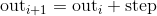
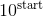
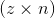
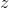
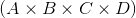

## Tensors

> 译者：[dyywinner](https://github.com/dyywinner)
       [cluster](https://github.com/infdahai)

```py
torch.is_tensor(obj)
```

如果`obj`是一个PyTorch张量，则返回True.


| Parameters: | **obj** (_Object_) – Object to test |
| --- | --- |

```py
torch.is_storage(obj)
```

如果`obj`是一个PyTorch 存储对象，则返回True.


| Parameters: | **obj** (_Object_) – Object to test |
| --- | --- |

```py
torch.set_default_dtype(d)
```

将`d`设置为默认浮点类型(dtype). 该类型将在 [`torch.tensor()`](#torch.tensor "torch.tensor") 中作为类型推断的默认浮点类型。初始默认浮点类型为`torch.float32`。


| Parameters: | **d** ([`torch.dtype`](tensor_attributes.html#torch.torch.dtype "torch.torch.dtype")) – 默认浮点类型 |
| --- | --- |

Example:

```py
>>> torch.tensor([1.2, 3]).dtype           # 初始默认浮点类型为 torch.float32
floating point is torch.float32
torch.float32
>>> torch.set_default_dtype(torch.float64)
>>> torch.tensor([1.2, 3]).dtype           # 一个新的浮点类型的张量
torch.float64

```

```py
torch.get_default_dtype() → torch.dtype
```

获取当前默认浮点类型 [`torch.dtype`](tensor_attributes.html#torch.torch.dtype "torch.torch.dtype").

Example:

```py
>>> torch.get_default_dtype()  # 初始的默认浮点类型是 torch.float32
torch.float32
>>> torch.set_default_dtype(torch.float64)
>>> torch.get_default_dtype()  # 默认浮点类型为 torch.float64
torch.float64
>>> torch.set_default_tensor_type(torch.FloatTensor)  # 设置默认张量类型也会影响默认浮点类型
>>> torch.get_default_dtype()  # 变化到 torch.float32( 此类型(dtype)来自于torch.FloatTensor )
torch.float32

```

```py
torch.set_default_tensor_type(t)
```

设置默认的 `torch.Tensor` 类型到浮点张量类型 [`t`](#torch.t "torch.t"). 该类型将在 [`torch.tensor()`](#torch.tensor "torch.tensor") 中作为类型推断的默认浮点类型。
初始默认浮点张量类型为 `torch.FloatTensor`.

| Parameters: | **t** ([_type_](https://docs.python.org/3/library/functions.html#type "(in Python v3.7)") _or_ _string_) – 浮点张量的类型或者它的名称 |
| --- | --- |

Example:

```py
>>> torch.tensor([1.2, 3]).dtype    # 初始默认浮点类型为 torch.float32
torch.float32
>>> torch.set_default_tensor_type(torch.DoubleTensor)
>>> torch.tensor([1.2, 3]).dtype    # 一个新的浮点张量
torch.float64

```

```py
torch.numel(input) → int
```

返回 `input` 张量中元素总数.

| Parameters: | **input** ([_Tensor_](tensors.html#torch.Tensor "torch.Tensor")) – the input tensor |
| --- | --- |

Example:

```py
>>> a = torch.randn(1, 2, 3, 4, 5)
>>> torch.numel(a)
120
>>> a = torch.zeros(4,4)
>>> torch.numel(a)
16

```

```py
torch.set_printoptions(precision=None, threshold=None, edgeitems=None, linewidth=None, profile=None)
```

设置打印选项. 从 NumPy 剽窃过来的(滑稽）

Parameters: 

*   **precision** – 浮点输出的有效位数 (默认为 4).
*   **threshold** – 输出时的阈值，当数组元素总和超过阈值，会被截断输出 (默认为 1000).
*   **edgeitems** – 每个维度所统计的数组条目数量(默认：3).
*   **linewidth** – 每一行输出的字符长度 (默认为80). 阈值矩阵将忽略该参数.
*   **profile** – 打印输出的美观程度 默认值为Sane. 可以用后面括号中的选项覆盖( `default`, `short`, `full`).


```py
torch.set_flush_denormal(mode) → bool
```

CPU不支持非规格化浮点数 .

如果你的系统支持非规格化数字模式(flush denormal mode)并且可成功配置该模式则返回 `True` . [`set_flush_denormal()`](#torch.set_flush_denormal "torch.set_flush_denormal") 可以使用在支持SSE3的x86架构.

| Parameters: | **mode** ([_bool_](https://docs.python.org/3/library/functions.html#bool "(in Python v3.7)")) – 是否开启  flush denormal mode |
| --- | --- |

Example:

```py
>>> torch.set_flush_denormal(True)
True
>>> torch.tensor([1e-323], dtype=torch.float64)
tensor([ 0.], dtype=torch.float64)
>>> torch.set_flush_denormal(False)
True
>>> torch.tensor([1e-323], dtype=torch.float64)
tensor(9.88131e-324 *
 [ 1.0000], dtype=torch.float64)

```

### Creation Ops

Note

随机采样创造随机数的方式在 [Random sampling](#random-sampling) 列举。其中包括 [`torch.rand()`](#torch.rand "torch.rand") [`torch.rand_like()`](#torch.rand_like "torch.rand_like") [`torch.randn()`](#torch.randn "torch.randn") [`torch.randn_like()`](#torch.randn_like "torch.randn_like") [`torch.randint()`](#torch.randint "torch.randint") [`torch.randint_like()`](#torch.randint_like "torch.randint_like") [`torch.randperm()`](#torch.randperm "torch.randperm") . 你可以使用 [`torch.empty()`](#torch.empty "torch.empty") ，并使用 [In-place random sampling](#inplace-random-sampling) 方法去从更宽泛的范围采样,生成 [`torch.Tensor`](tensors.html#torch.Tensor "torch.Tensor") .

```py
torch.tensor(data, dtype=None, device=None, requires_grad=False) → Tensor
```

用 `data` 构建张量.

Warning

[`torch.tensor()`](#torch.tensor "torch.tensor") 会拷贝 `data`. 如果你有一个张量( `data` )，并且想要避免拷贝, 请使用 [`torch.Tensor.requires_grad_()`](tensors.html#torch.Tensor.requires_grad_ "torch.Tensor.requires_grad_") 或者 [`torch.Tensor.detach()`](autograd.html#torch.Tensor.detach "torch.Tensor.detach"). 如果你有一个NumPy数组(`ndarray`) 并且想要避免拷贝, 请使用 [`torch.from_numpy()`](#torch.from_numpy "torch.from_numpy").

Warning

当 data 为一个名为 `x` 的张量， [`torch.tensor()`](#torch.tensor "torch.tensor") 读取 ‘the data’ (无论传输了什么), 都会构建一个 leaf variable(计算图模型中事先创建的、而非运算得到的变量). 因此 `torch.tensor(x)` 等价于 `x.clone().detach()` ，同时 `torch.tensor(x, requires_grad=True)` 等价于 `x.clone().detach().requires_grad_(True)`. 我们推荐这种使用 `clone()` and `detach()` 的写法.

Parameters: 

*   **data** (_array_like_) – 初始化张量的数据. 允许的类型有 list, tuple, NumPy `ndarray`, scalar(标量), 以及其他类型.
*   **dtype** ([`torch.dtype`](tensor_attributes.html#torch.torch.dtype "torch.torch.dtype"), optional) – 返回的张量所要求的数据类型. 默认: 如果此参数为 `None`,从 `data`中推断数据类型.
*   **device** ([`torch.device`](tensor_attributes.html#torch.torch.device "torch.torch.device"), optional) – 返回的张量所要求的硬件. 默认: 如果此参数为 `None`,对当前张量类型使用当前硬件(参考 [`torch.set_default_tensor_type()`](#torch.set_default_tensor_type "torch.set_default_tensor_type")). `device` 可以为 提供CPU张量类型的CPU和 支持CUDA张量类型的CUDA设备.
*   **requires_grad** ([_bool_](https://docs.python.org/3/library/functions.html#bool "(in Python v3.7)")_,_ _optional_) – 对返回的张量自动求导时是否需要记录操作. 默认: `False`.


Example:

```py
>>> torch.tensor([[0.1, 1.2], [2.2, 3.1], [4.9, 5.2]])
tensor([[ 0.1000,  1.2000],
       [ 2.2000,  3.1000],
       [ 4.9000,  5.2000]])

>>> torch.tensor([0, 1])  # 输入数据推断
tensor([ 0,  1])

>>> torch.tensor([[0.11111, 0.222222, 0.3333333]],
                 dtype=torch.float64,
                 device=torch.device('cuda:0'))  # 创建一个 torch.cuda.DoubleTensor
tensor([[ 0.1111,  0.2222,  0.3333]], dtype=torch.float64, 
device='cuda:0')

>>> torch.tensor(3.14159)  # 创建一个标量 (零维张量)
tensor(3.1416)

>>> torch.tensor([])  # 创建一个空张量 (形状是 (0,))
tensor([])

```

```py
torch.sparse_coo_tensor(indices, values, size=None, dtype=None, device=None, requires_grad=False) → Tensor
```

用非0元素值`values`和下标`indices`在COO(顺序标注)构建一个稀疏矩阵。一个稀疏向量可以是`未合并的`(`uncoalesced`), 在这种情况下,在索引中会存在有重复坐标 ,这个索引的值是所有重复值数量的和: [torch.sparse](https://pytorch.org/docs/stable/sparse.html).

Parameters: 

*   **indices** (_array_like_) – 给张量初始化数据。可以是列表,元组,Numpy矩阵(`ndarry`类型),标量和其他类型。之后将在内部被映射成`torch.LongTensor`。 因此矩阵中的非零元素下标的坐标,需要是二维的，并且第一维是张量的维度，第二维是非零元素数量。
*   **values** (_array_like_) – 初始化张量的值。可以是列表,元组,Numpy矩阵(`ndarry`类型),标量和其他类型。
*   **size** (list, tuple, or `torch.Size`, optional) – 稀疏矩阵的形状。如果不提供size形状，将会被自动优化为可以装下所有非零元素的最小大小。
*   **dtype** ([`torch.dtype`](tensor_attributes.html#torch.torch.dtype "torch.torch.dtype"), optional) – 张量返回值的期望数据类型。如果没有，则默认为`values`。
*   **device** ([`torch.device`](tensor_attributes.html#torch.torch.device "torch.torch.device"), optional) – 返回的张量所要求的硬件. 默认: 如果此参数为 `None`,对当前张量类型使用当前硬件(参考 [`torch.set_default_tensor_type()`](#torch.set_default_tensor_type "torch.set_default_tensor_type")). `device` 可以为 提供CPU张量类型的CPU和 支持CUDA张量类型的CUDA设备.torch.set_default_tensor_type "torch.set_default_tensor_type")). `device` will be the CPU for CPU tensor types and the current CUDA device for CUDA tensor types.
*   **requires_grad** ([_bool_](https://docs.python.org/3/library/functions.html#bool "(in Python v3.7)")_,_ _optional_) – 对返回的张量自动求导时是否需要记录操作. 默认: `False`.


Example:

```py
>>> i = torch.tensor([[0, 1, 1],
                      [2, 0, 2]])
>>> v = torch.tensor([3, 4, 5], dtype=torch.float32)
>>> torch.sparse_coo_tensor(i, v, [2, 4])
tensor(indices=tensor([[0, 1, 1],
                       [2, 0, 2]]),
       values=tensor([3., 4., 5.]),
       size=(2, 4), nnz=3, layout=torch.sparse_coo)

>>> torch.sparse_coo_tensor(i, v)  # Shape inference
tensor(indices=tensor([[0, 1, 1],
                       [2, 0, 2]]),
       values=tensor([3., 4., 5.]),
       size=(2, 3), nnz=3, layout=torch.sparse_coo)

>>> torch.sparse_coo_tensor(i, v, [2, 4],
                            dtype=torch.float64,
                            device=torch.device('cuda:0'))
tensor(indices=tensor([[0, 1, 1],
                       [2, 0, 2]]),
       values=tensor([3., 4., 5.]),
       device='cuda:0', size=(2, 4), nnz=3, dtype=torch.float64,
       layout=torch.sparse_coo)

# 使用下列常量创建一个空稀疏张量:
#   1\. sparse_dim + dense_dim = len(SparseTensor.shape)
#   2\. SparseTensor._indices().shape = (sparse_dim, nnz)
#   3\. SparseTensor._values().shape = (nnz, SparseTensor.shape[sparse_dim:])
#
# 比如，使用nnz = 0, dense_dim = 0和
# sparse_dim = 1 (这里的下标是一个二维张量形状shape = (1, 0)) 来创建一个空稀疏矩阵
>>> S = torch.sparse_coo_tensor(torch.empty([1, 0]), [], [1])
tensor(indices=tensor([], size=(1, 0)),
       values=tensor([], size=(0,)),
       size=(1,), nnz=0, layout=torch.sparse_coo)

# 然后使用nnz = 0, dense_dim = 1 和 sparse_dim = 1
# 来创建一个空稀疏矩阵
>>> S = torch.sparse_coo_tensor(torch.empty([1, 0]), torch.empty([0, 2]), [1, 2])
tensor(indices=tensor([], size=(1, 0)),
       values=tensor([], size=(0, 2)),
       size=(1, 2), nnz=0, layout=torch.sparse_coo)

```

```py
torch.as_tensor(data, dtype=None, device=None) → Tensor
```

转换 `data` 到 `torch.Tensor` 类型. 如果 `data` 已经是相同 `dtype` 和 `device` 的张量， 那就不会执行拷贝，否则将会返回一个新的张量(如果 data `Tensor` 中 `requires_grad=True`,则返回的张量计算图会被保留)相似地，如果 data `dtype` 为 `ndarry` 并且 `device` 为CPU，则拷贝不会发生。

Parameters:

*   **data** (_array_like_) – 提供张量初始化的数据结构。可能是ist, tuple, NumPy `ndarray`, scalar 或其他类型。
*   **dtype** ([`torch.dtype`](tensor_attributes.html#torch.torch.dtype "torch.torch.dtype"), optional) – 提供张量初始化的值。可能是ist, tuple, NumPy `ndarray`, scalar 或其他类型。
*   **device** ([`torch.device`](tensor_attributes.html#torch.torch.device "torch.torch.device"), optional) – 返回张量所需要的设备。默认：若为空，则当前的设备提供给默认张量类型(see [`torch.set_default_tensor_type()`](#torch.set_default_tensor_type "torch.set_default_tensor_type")). `device` 将为支持CPU张量的CPU和支持CUDA张量类型的CUDA设备。


Example:

```py
>>> a = numpy.array([1, 2, 3])
>>> t = torch.as_tensor(a)
>>> t
tensor([ 1,  2,  3])
>>> t[0] = -1
>>> a
array([-1,  2,  3])

>>> a = numpy.array([1, 2, 3])
>>> t = torch.as_tensor(a, device=torch.device('cuda'))
>>> t
tensor([ 1,  2,  3])
>>> t[0] = -1
>>> a
array([1,  2,  3])

```

```py
torch.from_numpy(ndarray) → Tensor
```

 从一个 [`numpy.ndarray`](https://docs.scipy.org/doc/numpy/reference/generated/numpy.ndarray.html#numpy.ndarray "(in NumPy v1.15)") 创建一个 [`Tensor`](tensors.html#torch.Tensor "torch.Tensor").

返回的张量和 `ndarry` 共享相同的内存。 对张量的修饰将会反映在 `ndarry`，反之亦然。返回的张量 大小不可变。

Example:

```py
>>> a = numpy.array([1, 2, 3])
>>> t = torch.from_numpy(a)
>>> t
tensor([ 1,  2,  3])
>>> t[0] = -1
>>> a
array([-1,  2,  3])

```

```py
torch.zeros(*sizes, out=None, dtype=None, layout=torch.strided, device=None, requires_grad=False) → Tensor
```

返回一个用标量 `0` 填充的张量，其中可变长参数 `sizes` 定义了该张量形状(shape).

Parameters:

*   **sizes** (_int..._) – 定义输出张量形状的整数序列. 可以是可变长的参数 或者是像 列表元组这样的集合。
*   **out** ([_Tensor_](tensors.html#torch.Tensor "torch.Tensor")_,_ _optional_) – 输出张量
*   **dtype** ([`torch.dtype`](tensor_attributes.html#torch.torch.dtype "torch.torch.dtype"), optional) – 返回张量的数据类型. 默认: 如果为 `None`, 使用全局默认值 (参考 [`torch.set_default_tensor_type()`](#torch.set_default_tensor_type "torch.set_default_tensor_type")).
*   **layout** ([`torch.layout`](tensor_attributes.html#torch.torch.layout "torch.torch.layout"), optional) – 返回张量的层数. Default: `torch.strided`.
*   # TODO
*   **device** ([`torch.device`](tensor_attributes.html#torch.torch.device "torch.torch.device"), optional) – 返回张量所需的设备. 默认: 如果为 `None`, 则当前的设备提供给默认张量类型(see [`torch.set_default_tensor_type()`](#torch.set_default_tensor_type "torch.set_default_tensor_type")). `device` 将为支持CPU张量的CPU和支持CUDA张量类型的CUDA设备。
*   **requires_grad** ([_bool_](https://docs.python.org/3/library/functions.html#bool "(in Python v3.7)")_,_ _optional_) – 自动梯度计算是否需要记录在返回张量上的操作。默认: `False`.


Example:

```py
>>> torch.zeros(2, 3)
tensor([[ 0.,  0.,  0.],
 [ 0.,  0.,  0.]])

>>> torch.zeros(5)
tensor([ 0.,  0.,  0.,  0.,  0.])

```

```py
torch.zeros_like(input, dtype=None, layout=None, device=None, requires_grad=False) → Tensor
```

返回用标量`0`填充的张量，大小和`input`的`size`一样. `torch.zeros_like(input)` 等价于 `torch.zeros(input.size(), dtype=input.dtype, layout=input.layout, device=input.device)`.

Warning

截止到 0.4, 该函数不再支持`out`关键字. 同时，老版的 `torch.zeros_like(input, out=output)` 等价于 `torch.zeros(input.size(), out=output)`.

Parameters: 

*   **input** ([_Tensor_](tensors.html#torch.Tensor "torch.Tensor")) – `input`的`size`属性决定输出张量大小
*   **dtype** ([`torch.dtype`](tensor_attributes.html#torch.torch.dtype "torch.torch.dtype"), optional) – 返回张量的数据类型. 默认: 如果为 `None`, 使用`input`的`dtype`属性 .
*   **layout** ([`torch.layout`](tensor_attributes.html#torch.torch.layout "torch.torch.layout"), optional) – 返回张量的层数. Default: 默认为`input`的`layout`属性.
*   **device** ([`torch.device`](tensor_attributes.html#torch.torch.device "torch.torch.device"), optional) – 返回张量所需的设备. 默认: 如果为 `None`, 则为`input`的`device`属性.
*   **requires_grad** ([_bool_](https://docs.python.org/3/library/functions.html#bool "(in Python v3.7)")_,_ _optional_) – 自动梯度计算是否需要记录在返回张量上的操作。默认: `False`.

Example:

```py
>>> input = torch.empty(2, 3)
>>> torch.zeros_like(input)
tensor([[ 0.,  0.,  0.],
 [ 0.,  0.,  0.]])

```

```py
torch.ones(*sizes, out=None, dtype=None, layout=torch.strided, device=None, requires_grad=False) → Tensor
```

返回一个用标量 `1` 填充的张量，其中可变长参数 `sizes` 定义了该张量形状(shape).

Parameters:

*   **sizes** (_int..._) – 定义输出张量形状的整数序列. 可以是可变长的参数 或者是像 列表元组这样的集合。
*   **out** ([_Tensor_](tensors.html#torch.Tensor "torch.Tensor")_,_ _optional_) – 输出张量
*   **dtype** ([`torch.dtype`](tensor_attributes.html#torch.torch.dtype "torch.torch.dtype"), optional) – 返回张量的数据类型. 默认: 如果为 `None`, 使用全局默认值 (参考 [`torch.set_default_tensor_type()`](#torch.set_default_tensor_type "torch.set_default_tensor_type")).
*   **layout** ([`torch.layout`](tensor_attributes.html#torch.torch.layout "torch.torch.layout"), optional) – 返回张量的层数. Default: `torch.strided`.
*   **device** ([`torch.device`](tensor_attributes.html#torch.torch.device "torch.torch.device"), optional) – 返回张量所需的设备. 默认: 如果为 `None`, 则当前的设备提供给默认张量类型(see [`torch.set_default_tensor_type()`](#torch.set_default_tensor_type "torch.set_default_tensor_type")). `device` 将为支持CPU张量的CPU和支持CUDA张量类型的CUDA设备。
*   **requires_grad** ([_bool_](https://docs.python.org/3/library/functions.html#bool "(in Python v3.7)")_,_ _optional_) – 自动梯度计算是否需要记录在返回张量上的操作。默认: `False`.


Example:

```py
>>> torch.ones(2, 3)
tensor([[ 1.,  1.,  1.],
 [ 1.,  1.,  1.]])

>>> torch.ones(5)
tensor([ 1.,  1.,  1.,  1.,  1.])

```

```py
torch.ones_like(input, dtype=None, layout=None, device=None, requires_grad=False) → Tensor
```

返回用标量`1`填充的张量，大小和`input`的`size`一样. `torch.ones_like(input)` 等价于 `torch.ones(input.size(), dtype=input.dtype, layout=input.layout, device=input.device)`

Warning

截止到 0.4, 该函数不再支持`out`关键字. 同时，老版的 `torch.ones_like(input, out=output)` 等价于 `torch.ones(input.size(), out=output)`.

Parameters: 

*   **input** ([_Tensor_](tensors.html#torch.Tensor "torch.Tensor")) – `input`的`size`属性决定输出张量大小
*   **dtype** ([`torch.dtype`](tensor_attributes.html#torch.torch.dtype "torch.torch.dtype"), optional) – 返回张量的数据类型. 默认: 如果为 `None`, 使用`input`的`dtype`属性 .
*   **layout** ([`torch.layout`](tensor_attributes.html#torch.torch.layout "torch.torch.layout"), optional) – 返回张量的层数. Default: 默认为`input`的`layout`属性.
*   **device** ([`torch.device`](tensor_attributes.html#torch.torch.device "torch.torch.device"), optional) – 返回张量所需的设备. 默认: 如果为 `None`, 则为`input`的`device`属性.
*   **requires_grad** ([_bool_](https://docs.python.org/3/library/functions.html#bool "(in Python v3.7)")_,_ _optional_) – 自动梯度计算是否需要记录在返回张量上的操作。默认: `False`.

Example:

```py
>>> input = torch.empty(2, 3)
>>> torch.ones_like(input)
tensor([[ 1.,  1.,  1.],
 [ 1.,  1.,  1.]])

```

```py
torch.arange(start=0, end, step=1, out=None, dtype=None, layout=torch.strided, device=None, requires_grad=False) → Tensor
```

返回一个一维张量，大小为，值为区间 `[start,end)`内，以`step`为步距,从`start`开始的数列.

注意: 非整型数 `step` 和 `end` 比较时存在浮点四舍五入误差;为避免不一致，建议在`end`后面加上一个小的epsilon.



Parameters: 

*   **start** (_Number_) – 点集的起始值. 默认为`0`.
*   **end** (_Number_) – 点集的终值.
*   **step** (_Number_) – 每对相邻点之间的距离 . 默认为 `1`.
*   **out** ([_Tensor_](tensors.html#torch.Tensor "torch.Tensor")_,_ _optional_) – 输出的张量
*   **dtype** ([`torch.dtype`](tensor_attributes.html#torch.torch.dtype "torch.torch.dtype"), optional) – 返回张量的数据类型. 默认: 如果为 `None`, 使用全局默认值. (参考 [`torch.set_default_tensor_type()`](#torch.set_default_tensor_type "torch.set_default_tensor_type")). 若 `dtype` 未提供, 则从其他输入参数推断数据类型. 如果 `start`, `end`, `stop` 中存在浮点数, 则 `dtype` 会使用默认数据类型, 请查看 [`get_default_dtype()`](#torch.get_default_dtype "torch.get_default_dtype"). 否则,  `dtype` 会使用 `torch.int64`.
*   **layout** ([`torch.layout`](tensor_attributes.html#torch.torch.layout "torch.torch.layout"), optional) – 返回张量的层数. Default: `torch.strided`.
*   **device** ([`torch.device`](tensor_attributes.html#torch.torch.device "torch.torch.device"), optional) – 返回张量所需的设备. 默认: 如果为 `None`, 则当前的设备提供给默认张量类型(see [`torch.set_default_tensor_type()`](#torch.set_default_tensor_type "torch.set_default_tensor_type")). `device` 将为支持CPU张量的CPU和支持CUDA张量类型的CUDA设备。
*   **requires_grad** ([_bool_](https://docs.python.org/3/library/functions.html#bool "(in Python v3.7)")_,_ _optional_) – 自动梯度计算是否需要记录在返回张量上的操作。默认: `False`.


Example:

```py
>>> torch.arange(5)
tensor([ 0,  1,  2,  3,  4])
>>> torch.arange(1, 4)
tensor([ 1,  2,  3])
>>> torch.arange(1, 2.5, 0.5)
tensor([ 1.0000,  1.5000,  2.0000])

```

```py
torch.range(start=0, end, step=1, out=None, dtype=None, layout=torch.strided, device=None, requires_grad=False) → Tensor
```

返回一个一维张量，大小为，值从`start`到`end`，以`step`为步距的数列.


Warning

这个函数被弃用，改为 [`torch.arange()`](#torch.arange "torch.arange").

Parameters: 

*   **start** (_Number_) – 点集的起始值. 默认为`0`.
*   **end** (_Number_) – 点集的终值.
*   **step** (_Number_) – 每对相邻点之间的距离 . 默认为 `1`.
*   **out** ([_Tensor_](tensors.html#torch.Tensor "torch.Tensor")_,_ _optional_) – 输出的张量
*   **dtype** ([`torch.dtype`](tensor_attributes.html#torch.torch.dtype "torch.torch.dtype"), optional) – 返回张量的数据类型. 默认: 如果为 `None`, 使用全局默认值. (参考 [`torch.set_default_tensor_type()`](#torch.set_default_tensor_type "torch.set_default_tensor_type")). 若 `dtype` 未提供, 则从其他输入参数推断数据类型. 如果 `start`, `end`, `stop` 中存在浮点数, 则 `dtype` 会使用默认数据类型, 请查看 [`get_default_dtype()`](#torch.get_default_dtype "torch.get_default_dtype"). 否则,  `dtype` 会使用 `torch.int64`.
*   **layout** ([`torch.layout`](tensor_attributes.html#torch.torch.layout "torch.torch.layout"), optional) – 返回张量的层数. Default: `torch.strided`.
*   **device** ([`torch.device`](tensor_attributes.html#torch.torch.device "torch.torch.device"), optional) – 返回张量所需的设备. 默认: 如果为 `None`, 则当前的设备提供给默认张量类型(see [`torch.set_default_tensor_type()`](#torch.set_default_tensor_type "torch.set_default_tensor_type")). `device` 将为支持CPU张量的CPU和支持CUDA张量类型的CUDA设备。
*   **requires_grad** ([_bool_](https://docs.python.org/3/library/functions.html#bool "(in Python v3.7)")_,_ _optional_) – 自动梯度计算是否需要记录在返回张量上的操作。默认: `False`.


Example:

```py
>>> torch.range(1, 4)
tensor([ 1.,  2.,  3.,  4.])
>>> torch.range(1, 4, 0.5)
tensor([ 1.0000,  1.5000,  2.0000,  2.5000,  3.0000,  3.5000,  4.0000])

```

```py
torch.linspace(start, end, steps=100, out=None, dtype=None, layout=torch.strided, device=None, requires_grad=False) → Tensor
```

返回共`steps`数量在`start` 和 `end`之间的等距点，从而组成的一维张量.

输出张量大小为`steps`，维度为一维.

Parameters: 

*   **start** ([_float_](https://docs.python.org/3/library/functions.html#float "(in Python v3.7)")) – 点集的起始值. 
*   **end** ([_float_](https://docs.python.org/3/library/functions.html#float "(in Python v3.7)")) –点集的终值.
*   **steps** ([_int_](https://docs.python.org/3/library/functions.html#int "(in Python v3.7)")) –  `start` 和 `end`之间的样本点数目. 默认: `100`.
*   **out** ([_Tensor_](tensors.html#torch.Tensor "torch.Tensor")_,_ _optional_) – 输出张量
*   **dtype** ([`torch.dtype`](tensor_attributes.html#torch.torch.dtype "torch.torch.dtype"), optional) – 返回张量的数据类型. 默认: 如果为 `None`, 使用全局默认值. (参考 [`torch.set_default_tensor_type()`](#torch.set_default_tensor_type "torch.set_default_tensor_type")).
*   **layout** ([`torch.layout`](tensor_attributes.html#torch.torch.layout "torch.torch.layout"), optional) – 返回张量的层数. Default: `torch.strided`.
*   **device** ([`torch.device`](tensor_attributes.html#torch.torch.device "torch.torch.device"), optional) – 返回张量所需的设备. 默认: 如果为 `None`, 则当前的设备提供给默认张量类型(see [`torch.set_default_tensor_type()`](#torch.set_default_tensor_type "torch.set_default_tensor_type")). `device` 将为支持CPU张量的CPU和支持CUDA张量类型的CUDA设备。
*   **requires_grad** ([_bool_](https://docs.python.org/3/library/functions.html#bool "(in Python v3.7)")_,_ _optional_) – 自动梯度计算是否需要记录在返回张量上的操作。默认: `False`.

Example:

```py
>>> torch.linspace(3, 10, steps=5)
tensor([  3.0000,   4.7500,   6.5000,   8.2500,  10.0000])
>>> torch.linspace(-10, 10, steps=5)
tensor([-10.,  -5.,   0.,   5.,  10.])
>>> torch.linspace(start=-10, end=10, steps=5)
tensor([-10.,  -5.,   0.,   5.,  10.])

```

```py
torch.logspace(start, end, steps=100, out=None, dtype=None, layout=torch.strided, device=None, requires_grad=False) → Tensor
```

返回共有`steps`数量的一维张量，点集由 和 之间对数分布的点组成.

输出张量大小为`steps`，维度为一维.

Parameters: 

*   **start** ([_float_](https://docs.python.org/3/library/functions.html#float "(in Python v3.7)")) – 点集的起始值. 
*   **end** ([_float_](https://docs.python.org/3/library/functions.html#float "(in Python v3.7)")) –点集的终值.
*   **steps** ([_int_](https://docs.python.org/3/library/functions.html#int "(in Python v3.7)")) –  `start` 和 `end`之间的样本点数目. 默认: `100`.
*   **out** ([_Tensor_](tensors.html#torch.Tensor "torch.Tensor")_,_ _optional_) – 输出张量
*   **dtype** ([`torch.dtype`](tensor_attributes.html#torch.torch.dtype "torch.torch.dtype"), optional) – 返回张量的数据类型. 默认: 如果为 `None`, 使用全局默认值. (参考 [`torch.set_default_tensor_type()`](#torch.set_default_tensor_type "torch.set_default_tensor_type")).
*   **layout** ([`torch.layout`](tensor_attributes.html#torch.torch.layout "torch.torch.layout"), optional) – 返回张量的层数. Default: `torch.strided`.
*   **device** ([`torch.device`](tensor_attributes.html#torch.torch.device "torch.torch.device"), optional) – 返回张量所需的设备. 默认: 如果为 `None`, 则当前的设备提供给默认张量类型(see [`torch.set_default_tensor_type()`](#torch.set_default_tensor_type "torch.set_default_tensor_type")). `device` 将为支持CPU张量的CPU和支持CUDA张量类型的CUDA设备。
*   **requires_grad** ([_bool_](https://docs.python.org/3/library/functions.html#bool "(in Python v3.7)")_,_ _optional_) – 自动梯度计算是否需要记录在返回张量上的操作。默认: `False`.

Example:

```py
>>> torch.logspace(start=-10, end=10, steps=5)
tensor([ 1.0000e-10,  1.0000e-05,  1.0000e+00,  1.0000e+05,  1.0000e+10])
>>> torch.logspace(start=0.1, end=1.0, steps=5)
tensor([  1.2589,   2.1135,   3.5481,   5.9566,  10.0000])

```

```py
torch.eye(n, m=None, out=None, dtype=None, layout=torch.strided, device=None, requires_grad=False) → Tensor
```

返回二维张量，对角线上是1，其它地方是0.

Parameters: 

*   **n** ([_int_](https://docs.python.org/3/library/functions.html#int "(in Python v3.7)")) – the number of rows
*   **m** ([_int_](https://docs.python.org/3/library/functions.html#int "(in Python v3.7)")_,_ _optional_) – the number of columns with default being `n`
*   **out** ([_Tensor_](tensors.html#torch.Tensor "torch.Tensor")_,_ _optional_) – the output tensor
*   **dtype** ([`torch.dtype`](tensor_attributes.html#torch.torch.dtype "torch.torch.dtype"), optional) – the desired data type of returned tensor. Default: if `None`, uses a global default (see [`torch.set_default_tensor_type()`](#torch.set_default_tensor_type "torch.set_default_tensor_type")).
*   **layout** ([`torch.layout`](tensor_attributes.html#torch.torch.layout "torch.torch.layout"), optional) – the desired layout of returned Tensor. Default: `torch.strided`.
*   **device** ([`torch.device`](tensor_attributes.html#torch.torch.device "torch.torch.device"), optional) – the desired device of returned tensor. Default: if `None`, uses the current device for the default tensor type (see [`torch.set_default_tensor_type()`](#torch.set_default_tensor_type "torch.set_default_tensor_type")). `device` will be the CPU for CPU tensor types and the current CUDA device for CUDA tensor types.
*   **requires_grad** ([_bool_](https://docs.python.org/3/library/functions.html#bool "(in Python v3.7)")_,_ _optional_) – If autograd should record operations on the returned tensor. Default: `False`.


| Returns: | A 2-D tensor with ones on the diagonal and zeros elsewhere |
| --- | --- |
| Return type: | [Tensor](tensors.html#torch.Tensor "torch.Tensor") |
| --- | --- |

Example:

```py
>>> torch.eye(3)
tensor([[ 1.,  0.,  0.],
 [ 0.,  1.,  0.],
 [ 0.,  0.,  1.]])

```

```py
torch.empty(*sizes, out=None, dtype=None, layout=torch.strided, device=None, requires_grad=False) → Tensor
```

Returns a tensor filled with uninitialized data. The shape of the tensor is defined by the variable argument `sizes`.

Parameters: 

*   **sizes** (_int..._) – a sequence of integers defining the shape of the output tensor. Can be a variable number of arguments or a collection like a list or tuple.
*   **out** ([_Tensor_](tensors.html#torch.Tensor "torch.Tensor")_,_ _optional_) – the output tensor
*   **dtype** ([`torch.dtype`](tensor_attributes.html#torch.torch.dtype "torch.torch.dtype"), optional) – the desired data type of returned tensor. Default: if `None`, uses a global default (see [`torch.set_default_tensor_type()`](#torch.set_default_tensor_type "torch.set_default_tensor_type")).
*   **layout** ([`torch.layout`](tensor_attributes.html#torch.torch.layout "torch.torch.layout"), optional) – the desired layout of returned Tensor. Default: `torch.strided`.
*   **device** ([`torch.device`](tensor_attributes.html#torch.torch.device "torch.torch.device"), optional) – the desired device of returned tensor. Default: if `None`, uses the current device for the default tensor type (see [`torch.set_default_tensor_type()`](#torch.set_default_tensor_type "torch.set_default_tensor_type")). `device` will be the CPU for CPU tensor types and the current CUDA device for CUDA tensor types.
*   **requires_grad** ([_bool_](https://docs.python.org/3/library/functions.html#bool "(in Python v3.7)")_,_ _optional_) – If autograd should record operations on the returned tensor. Default: `False`.


Example:

```py
>>> torch.empty(2, 3)
tensor(1.00000e-08 *
 [[ 6.3984,  0.0000,  0.0000],
 [ 0.0000,  0.0000,  0.0000]])

```

```py
torch.empty_like(input, dtype=None, layout=None, device=None, requires_grad=False) → Tensor
```

Returns an uninitialized tensor with the same size as `input`. `torch.empty_like(input)` is equivalent to `torch.empty(input.size(), dtype=input.dtype, layout=input.layout, device=input.device)`.

Parameters: 

*   **input** ([_Tensor_](tensors.html#torch.Tensor "torch.Tensor")) – the size of `input` will determine size of the output tensor
*   **dtype** ([`torch.dtype`](tensor_attributes.html#torch.torch.dtype "torch.torch.dtype"), optional) – the desired data type of returned Tensor. Default: if `None`, defaults to the dtype of `input`.
*   **layout** ([`torch.layout`](tensor_attributes.html#torch.torch.layout "torch.torch.layout"), optional) – the desired layout of returned tensor. Default: if `None`, defaults to the layout of `input`.
*   **device** ([`torch.device`](tensor_attributes.html#torch.torch.device "torch.torch.device"), optional) – the desired device of returned tensor. Default: if `None`, defaults to the device of `input`.
*   **requires_grad** ([_bool_](https://docs.python.org/3/library/functions.html#bool "(in Python v3.7)")_,_ _optional_) – If autograd should record operations on the returned tensor. Default: `False`.


Example:

```py
>>> torch.empty((2,3), dtype=torch.int64)
tensor([[ 9.4064e+13,  2.8000e+01,  9.3493e+13],
 [ 7.5751e+18,  7.1428e+18,  7.5955e+18]])

```

```py
torch.full(size, fill_value, out=None, dtype=None, layout=torch.strided, device=None, requires_grad=False) → Tensor
```

Returns a tensor of size `size` filled with `fill_value`.

Parameters: 

*   **size** (_int..._) – a list, tuple, or `torch.Size` of integers defining the shape of the output tensor.
*   **fill_value** – the number to fill the output tensor with.
*   **out** ([_Tensor_](tensors.html#torch.Tensor "torch.Tensor")_,_ _optional_) – the output tensor
*   **dtype** ([`torch.dtype`](tensor_attributes.html#torch.torch.dtype "torch.torch.dtype"), optional) – the desired data type of returned tensor. Default: if `None`, uses a global default (see [`torch.set_default_tensor_type()`](#torch.set_default_tensor_type "torch.set_default_tensor_type")).
*   **layout** ([`torch.layout`](tensor_attributes.html#torch.torch.layout "torch.torch.layout"), optional) – the desired layout of returned Tensor. Default: `torch.strided`.
*   **device** ([`torch.device`](tensor_attributes.html#torch.torch.device "torch.torch.device"), optional) – the desired device of returned tensor. Default: if `None`, uses the current device for the default tensor type (see [`torch.set_default_tensor_type()`](#torch.set_default_tensor_type "torch.set_default_tensor_type")). `device` will be the CPU for CPU tensor types and the current CUDA device for CUDA tensor types.
*   **requires_grad** ([_bool_](https://docs.python.org/3/library/functions.html#bool "(in Python v3.7)")_,_ _optional_) – If autograd should record operations on the returned tensor. Default: `False`.


Example:

```py
>>> torch.full((2, 3), 3.141592)
tensor([[ 3.1416,  3.1416,  3.1416],
 [ 3.1416,  3.1416,  3.1416]])

```

```py
torch.full_like(input, fill_value, out=None, dtype=None, layout=torch.strided, device=None, requires_grad=False) → Tensor
```

Returns a tensor with the same size as `input` filled with `fill_value`. `torch.full_like(input, fill_value)` is equivalent to `torch.full_like(input.size(), fill_value, dtype=input.dtype, layout=input.layout, device=input.device)`.

Parameters: 

*   **input** ([_Tensor_](tensors.html#torch.Tensor "torch.Tensor")) – the size of `input` will determine size of the output tensor
*   **fill_value** – the number to fill the output tensor with.
*   **dtype** ([`torch.dtype`](tensor_attributes.html#torch.torch.dtype "torch.torch.dtype"), optional) – the desired data type of returned Tensor. Default: if `None`, defaults to the dtype of `input`.
*   **layout** ([`torch.layout`](tensor_attributes.html#torch.torch.layout "torch.torch.layout"), optional) – the desired layout of returned tensor. Default: if `None`, defaults to the layout of `input`.
*   **device** ([`torch.device`](tensor_attributes.html#torch.torch.device "torch.torch.device"), optional) – the desired device of returned tensor. Default: if `None`, defaults to the device of `input`.
*   **requires_grad** ([_bool_](https://docs.python.org/3/library/functions.html#bool "(in Python v3.7)")_,_ _optional_) – If autograd should record operations on the returned tensor. Default: `False`.


### Indexing, Slicing, Joining, Mutating Ops

```py
torch.cat(tensors, dim=0, out=None) → Tensor
```

Concatenates the given sequence of `seq` tensors in the given dimension. All tensors must either have the same shape (except in the concatenating dimension) or be empty.

[`torch.cat()`](#torch.cat "torch.cat") can be seen as an inverse operation for [`torch.split()`](#torch.split "torch.split") and [`torch.chunk()`](#torch.chunk "torch.chunk").

[`torch.cat()`](#torch.cat "torch.cat") can be best understood via examples.

Parameters: 

*   **tensors** (_sequence of Tensors_) – any python sequence of tensors of the same type. Non-empty tensors provided must have the same shape, except in the cat dimension.
*   **dim** ([_int_](https://docs.python.org/3/library/functions.html#int "(in Python v3.7)")_,_ _optional_) – the dimension over which the tensors are concatenated
*   **out** ([_Tensor_](tensors.html#torch.Tensor "torch.Tensor")_,_ _optional_) – the output tensor


Example:

```py
>>> x = torch.randn(2, 3)
>>> x
tensor([[ 0.6580, -1.0969, -0.4614],
 [-0.1034, -0.5790,  0.1497]])
>>> torch.cat((x, x, x), 0)
tensor([[ 0.6580, -1.0969, -0.4614],
 [-0.1034, -0.5790,  0.1497],
 [ 0.6580, -1.0969, -0.4614],
 [-0.1034, -0.5790,  0.1497],
 [ 0.6580, -1.0969, -0.4614],
 [-0.1034, -0.5790,  0.1497]])
>>> torch.cat((x, x, x), 1)
tensor([[ 0.6580, -1.0969, -0.4614,  0.6580, -1.0969, -0.4614,  0.6580,
 -1.0969, -0.4614],
 [-0.1034, -0.5790,  0.1497, -0.1034, -0.5790,  0.1497, -0.1034,
 -0.5790,  0.1497]])

```

```py
torch.chunk(tensor, chunks, dim=0) → List of Tensors
```

Splits a tensor into a specific number of chunks.

Last chunk will be smaller if the tensor size along the given dimension `dim` is not divisible by `chunks`.

Parameters: 

*   **tensor** ([_Tensor_](tensors.html#torch.Tensor "torch.Tensor")) – the tensor to split
*   **chunks** ([_int_](https://docs.python.org/3/library/functions.html#int "(in Python v3.7)")) – number of chunks to return
*   **dim** ([_int_](https://docs.python.org/3/library/functions.html#int "(in Python v3.7)")) – dimension along which to split the tensor


```py
torch.gather(input, dim, index, out=None) → Tensor
```

Gathers values along an axis specified by `dim`.

For a 3-D tensor the output is specified by:

```py
out[i][j][k] = input[index[i][j][k]][j][k]  # if dim == 0
out[i][j][k] = input[i][index[i][j][k]][k]  # if dim == 1
out[i][j][k] = input[i][j][index[i][j][k]]  # if dim == 2

```

If `input` is an n-dimensional tensor with size  and `dim = i`, then `index` must be an -dimensional tensor with size  where  and `out` will have the same size as `index`.

Parameters: 

*   **input** ([_Tensor_](tensors.html#torch.Tensor "torch.Tensor")) – the source tensor
*   **dim** ([_int_](https://docs.python.org/3/library/functions.html#int "(in Python v3.7)")) – the axis along which to index
*   **index** (_LongTensor_) – the indices of elements to gather
*   **out** ([_Tensor_](tensors.html#torch.Tensor "torch.Tensor")_,_ _optional_) – the destination tensor


Example:

```py
>>> t = torch.tensor([[1,2],[3,4]])
>>> torch.gather(t, 1, torch.tensor([[0,0],[1,0]]))
tensor([[ 1,  1],
 [ 4,  3]])

```

```py
torch.index_select(input, dim, index, out=None) → Tensor
```

Returns a new tensor which indexes the `input` tensor along dimension `dim` using the entries in `index` which is a `LongTensor`.

The returned tensor has the same number of dimensions as the original tensor (`input`). The `dim`th dimension has the same size as the length of `index`; other dimensions have the same size as in the original tensor.

Note

The returned tensor does **not** use the same storage as the original tensor. If `out` has a different shape than expected, we silently change it to the correct shape, reallocating the underlying storage if necessary.

Parameters: 

*   **input** ([_Tensor_](tensors.html#torch.Tensor "torch.Tensor")) – the input tensor
*   **dim** ([_int_](https://docs.python.org/3/library/functions.html#int "(in Python v3.7)")) – the dimension in which we index
*   **index** (_LongTensor_) – the 1-D tensor containing the indices to index
*   **out** ([_Tensor_](tensors.html#torch.Tensor "torch.Tensor")_,_ _optional_) – the output tensor


Example:

```py
>>> x = torch.randn(3, 4)
>>> x
tensor([[ 0.1427,  0.0231, -0.5414, -1.0009],
 [-0.4664,  0.2647, -0.1228, -1.1068],
 [-1.1734, -0.6571,  0.7230, -0.6004]])
>>> indices = torch.tensor([0, 2])
>>> torch.index_select(x, 0, indices)
tensor([[ 0.1427,  0.0231, -0.5414, -1.0009],
 [-1.1734, -0.6571,  0.7230, -0.6004]])
>>> torch.index_select(x, 1, indices)
tensor([[ 0.1427, -0.5414],
 [-0.4664, -0.1228],
 [-1.1734,  0.7230]])

```

```py
torch.masked_select(input, mask, out=None) → Tensor
```

Returns a new 1-D tensor which indexes the `input` tensor according to the binary mask `mask` which is a `ByteTensor`.

The shapes of the `mask` tensor and the `input` tensor don’t need to match, but they must be [broadcastable](notes/broadcasting.html#broadcasting-semantics).

Note

The returned tensor does **not** use the same storage as the original tensor

Parameters: 

*   **input** ([_Tensor_](tensors.html#torch.Tensor "torch.Tensor")) – the input data
*   **mask** ([_ByteTensor_](tensors.html#torch.ByteTensor "torch.ByteTensor")) – the tensor containing the binary mask to index with
*   **out** ([_Tensor_](tensors.html#torch.Tensor "torch.Tensor")_,_ _optional_) – the output tensor


Example:

```py
>>> x = torch.randn(3, 4)
>>> x
tensor([[ 0.3552, -2.3825, -0.8297,  0.3477],
 [-1.2035,  1.2252,  0.5002,  0.6248],
 [ 0.1307, -2.0608,  0.1244,  2.0139]])
>>> mask = x.ge(0.5)
>>> mask
tensor([[ 0,  0,  0,  0],
 [ 0,  1,  1,  1],
 [ 0,  0,  0,  1]], dtype=torch.uint8)
>>> torch.masked_select(x, mask)
tensor([ 1.2252,  0.5002,  0.6248,  2.0139])

```

```py
torch.narrow(input, dimension, start, length) → Tensor
```

Returns a new tensor that is a narrowed version of `input` tensor. The dimension `dim` is input from `start` to `start + length`. The returned tensor and `input` tensor share the same underlying storage.

Parameters: 

*   **input** ([_Tensor_](tensors.html#torch.Tensor "torch.Tensor")) – the tensor to narrow
*   **dimension** ([_int_](https://docs.python.org/3/library/functions.html#int "(in Python v3.7)")) – the dimension along which to narrow
*   **start** ([_int_](https://docs.python.org/3/library/functions.html#int "(in Python v3.7)")) – the starting dimension
*   **length** ([_int_](https://docs.python.org/3/library/functions.html#int "(in Python v3.7)")) – the distance to the ending dimension


Example:

```py
>>> x = torch.tensor([[1, 2, 3], [4, 5, 6], [7, 8, 9]])
>>> torch.narrow(x, 0, 0, 2)
tensor([[ 1,  2,  3],
 [ 4,  5,  6]])
>>> torch.narrow(x, 1, 1, 2)
tensor([[ 2,  3],
 [ 5,  6],
 [ 8,  9]])

```

```py
torch.nonzero(input, out=None) → LongTensor
```

Returns a tensor containing the indices of all non-zero elements of `input`. Each row in the result contains the indices of a non-zero element in `input`.

If `input` has `n` dimensions, then the resulting indices tensor `out` is of size , where  is the total number of non-zero elements in the `input` tensor.

Parameters: 

*   **input** ([_Tensor_](tensors.html#torch.Tensor "torch.Tensor")) – the input tensor
*   **out** (_LongTensor__,_ _optional_) – the output tensor containing indices


Example:

```py
>>> torch.nonzero(torch.tensor([1, 1, 1, 0, 1]))
tensor([[ 0],
 [ 1],
 [ 2],
 [ 4]])
>>> torch.nonzero(torch.tensor([[0.6, 0.0, 0.0, 0.0],
 [0.0, 0.4, 0.0, 0.0],
 [0.0, 0.0, 1.2, 0.0],
 [0.0, 0.0, 0.0,-0.4]]))
tensor([[ 0,  0],
 [ 1,  1],
 [ 2,  2],
 [ 3,  3]])

```

```py
torch.reshape(input, shape) → Tensor
```

Returns a tensor with the same data and number of elements as `input`, but with the specified shape. When possible, the returned tensor will be a view of `input`. Otherwise, it will be a copy. Contiguous inputs and inputs with compatible strides can be reshaped without copying, but you should not depend on the copying vs. viewing behavior.

See [`torch.Tensor.view()`](tensors.html#torch.Tensor.view "torch.Tensor.view") on when it is possible to return a view.

A single dimension may be -1, in which case it’s inferred from the remaining dimensions and the number of elements in `input`.

Parameters: 

*   **input** ([_Tensor_](tensors.html#torch.Tensor "torch.Tensor")) – the tensor to be reshaped
*   **shape** (_tuple of python:ints_) – the new shape


Example:

```py
>>> a = torch.arange(4.)
>>> torch.reshape(a, (2, 2))
tensor([[ 0.,  1.],
 [ 2.,  3.]])
>>> b = torch.tensor([[0, 1], [2, 3]])
>>> torch.reshape(b, (-1,))
tensor([ 0,  1,  2,  3])

```

```py
torch.split(tensor, split_size_or_sections, dim=0)
```

Splits the tensor into chunks.

If `split_size_or_sections` is an integer type, then [`tensor`](#torch.tensor "torch.tensor") will be split into equally sized chunks (if possible). Last chunk will be smaller if the tensor size along the given dimension `dim` is not divisible by `split_size`.

If `split_size_or_sections` is a list, then [`tensor`](#torch.tensor "torch.tensor") will be split into `len(split_size_or_sections)` chunks with sizes in `dim` according to `split_size_or_sections`.

Parameters: 

*   **tensor** ([_Tensor_](tensors.html#torch.Tensor "torch.Tensor")) – tensor to split.
*   **split_size_or_sections** ([_int_](https://docs.python.org/3/library/functions.html#int "(in Python v3.7)")_) or_ _(_[_list_](https://docs.python.org/3/library/stdtypes.html#list "(in Python v3.7)")_(_[_int_](https://docs.python.org/3/library/functions.html#int "(in Python v3.7)")_)_) – size of a single chunk or list of sizes for each chunk
*   **dim** ([_int_](https://docs.python.org/3/library/functions.html#int "(in Python v3.7)")) – dimension along which to split the tensor.


```py
torch.squeeze(input, dim=None, out=None) → Tensor
```

Returns a tensor with all the dimensions of `input` of size `1` removed.

For example, if `input` is of shape:  then the `out` tensor will be of shape: .

When `dim` is given, a squeeze operation is done only in the given dimension. If `input` is of shape: , `squeeze(input, 0)` leaves the tensor unchanged, but `squeeze(input, 1)` will squeeze the tensor to the shape .

Note

The returned tensor shares the storage with the input tensor, so changing the contents of one will change the contents of the other.

Parameters: 

*   **input** ([_Tensor_](tensors.html#torch.Tensor "torch.Tensor")) – the input tensor
*   **dim** ([_int_](https://docs.python.org/3/library/functions.html#int "(in Python v3.7)")_,_ _optional_) – if given, the input will be squeezed only in this dimension
*   **out** ([_Tensor_](tensors.html#torch.Tensor "torch.Tensor")_,_ _optional_) – the output tensor


Example:

```py
>>> x = torch.zeros(2, 1, 2, 1, 2)
>>> x.size()
torch.Size([2, 1, 2, 1, 2])
>>> y = torch.squeeze(x)
>>> y.size()
torch.Size([2, 2, 2])
>>> y = torch.squeeze(x, 0)
>>> y.size()
torch.Size([2, 1, 2, 1, 2])
>>> y = torch.squeeze(x, 1)
>>> y.size()
torch.Size([2, 2, 1, 2])

```

```py
torch.stack(seq, dim=0, out=None) → Tensor
```

Concatenates sequence of tensors along a new dimension.

All tensors need to be of the same size.

Parameters: 

*   **seq** (_sequence of Tensors_) – sequence of tensors to concatenate
*   **dim** ([_int_](https://docs.python.org/3/library/functions.html#int "(in Python v3.7)")) – dimension to insert. Has to be between 0 and the number of dimensions of concatenated tensors (inclusive)
*   **out** ([_Tensor_](tensors.html#torch.Tensor "torch.Tensor")_,_ _optional_) – the output tensor


```py
torch.t(input) → Tensor
```

Expects `input` to be a matrix (2-D tensor) and transposes dimensions 0 and 1.

Can be seen as a short-hand function for `transpose(input, 0, 1)`.

| Parameters: | **input** ([_Tensor_](tensors.html#torch.Tensor "torch.Tensor")) – the input tensor |
| --- | --- |

Example:

```py
>>> x = torch.randn(2, 3)
>>> x
tensor([[ 0.4875,  0.9158, -0.5872],
 [ 0.3938, -0.6929,  0.6932]])
>>> torch.t(x)
tensor([[ 0.4875,  0.3938],
 [ 0.9158, -0.6929],
 [-0.5872,  0.6932]])

```

```py
torch.take(input, indices) → Tensor
```

Returns a new tensor with the elements of `input` at the given indices. The input tensor is treated as if it were viewed as a 1-D tensor. The result takes the same shape as the indices.

Parameters: 

*   **input** ([_Tensor_](tensors.html#torch.Tensor "torch.Tensor")) – the input tensor
*   **indices** (_LongTensor_) – the indices into tensor


Example:

```py
>>> src = torch.tensor([[4, 3, 5],
 [6, 7, 8]])
>>> torch.take(src, torch.tensor([0, 2, 5]))
tensor([ 4,  5,  8])

```

```py
torch.transpose(input, dim0, dim1) → Tensor
```

Returns a tensor that is a transposed version of `input`. The given dimensions `dim0` and `dim1` are swapped.

The resulting `out` tensor shares it’s underlying storage with the `input` tensor, so changing the content of one would change the content of the other.

Parameters: 

*   **input** ([_Tensor_](tensors.html#torch.Tensor "torch.Tensor")) – the input tensor
*   **dim0** ([_int_](https://docs.python.org/3/library/functions.html#int "(in Python v3.7)")) – the first dimension to be transposed
*   **dim1** ([_int_](https://docs.python.org/3/library/functions.html#int "(in Python v3.7)")) – the second dimension to be transposed


Example:

```py
>>> x = torch.randn(2, 3)
>>> x
tensor([[ 1.0028, -0.9893,  0.5809],
 [-0.1669,  0.7299,  0.4942]])
>>> torch.transpose(x, 0, 1)
tensor([[ 1.0028, -0.1669],
 [-0.9893,  0.7299],
 [ 0.5809,  0.4942]])

```

```py
torch.unbind(tensor, dim=0) → seq
```

Removes a tensor dimension.

Returns a tuple of all slices along a given dimension, already without it.

Parameters: 

*   **tensor** ([_Tensor_](tensors.html#torch.Tensor "torch.Tensor")) – the tensor to unbind
*   **dim** ([_int_](https://docs.python.org/3/library/functions.html#int "(in Python v3.7)")) – dimension to remove


Example:

```py
>>> torch.unbind(torch.tensor([[1, 2, 3],
>>>                            [4, 5, 6],
>>>                            [7, 8, 9]]))
(tensor([1, 2, 3]), tensor([4, 5, 6]), tensor([7, 8, 9]))

```

```py
torch.unsqueeze(input, dim, out=None) → Tensor
```

Returns a new tensor with a dimension of size one inserted at the specified position.

The returned tensor shares the same underlying data with this tensor.

A `dim` value within the range `[-input.dim() - 1, input.dim() + 1)` can be used. Negative `dim` will correspond to [`unsqueeze()`](#torch.unsqueeze "torch.unsqueeze") applied at `dim` = `dim + input.dim() + 1`.

Parameters: 

*   **input** ([_Tensor_](tensors.html#torch.Tensor "torch.Tensor")) – the input tensor
*   **dim** ([_int_](https://docs.python.org/3/library/functions.html#int "(in Python v3.7)")) – the index at which to insert the singleton dimension
*   **out** ([_Tensor_](tensors.html#torch.Tensor "torch.Tensor")_,_ _optional_) – the output tensor


Example:

```py
>>> x = torch.tensor([1, 2, 3, 4])
>>> torch.unsqueeze(x, 0)
tensor([[ 1,  2,  3,  4]])
>>> torch.unsqueeze(x, 1)
tensor([[ 1],
 [ 2],
 [ 3],
 [ 4]])

```

```py
torch.where(condition, x, y) → Tensor
```

Return a tensor of elements selected from either `x` or `y`, depending on `condition`.

The operation is defined as:


Note

The tensors `condition`, `x`, `y` must be [broadcastable](notes/broadcasting.html#broadcasting-semantics).

Parameters: 

*   **condition** ([_ByteTensor_](tensors.html#torch.ByteTensor "torch.ByteTensor")) – When True (nonzero), yield x, otherwise yield y
*   **x** ([_Tensor_](tensors.html#torch.Tensor "torch.Tensor")) – values selected at indices where `condition` is `True`
*   **y** ([_Tensor_](tensors.html#torch.Tensor "torch.Tensor")) – values selected at indices where `condition` is `False`


| Returns: | A tensor of shape equal to the broadcasted shape of `condition`, `x`, `y` |
| --- | --- |
| Return type: | [Tensor](tensors.html#torch.Tensor "torch.Tensor") |
| --- | --- |

Example:

```py
>>> x = torch.randn(3, 2)
>>> y = torch.ones(3, 2)
>>> x
tensor([[-0.4620,  0.3139],
 [ 0.3898, -0.7197],
 [ 0.0478, -0.1657]])
>>> torch.where(x > 0, x, y)
tensor([[ 1.0000,  0.3139],
 [ 0.3898,  1.0000],
 [ 0.0478,  1.0000]])

```
