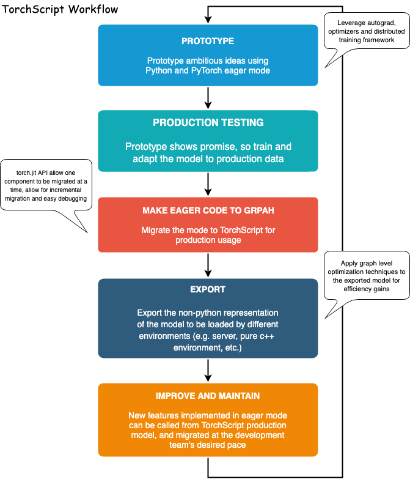
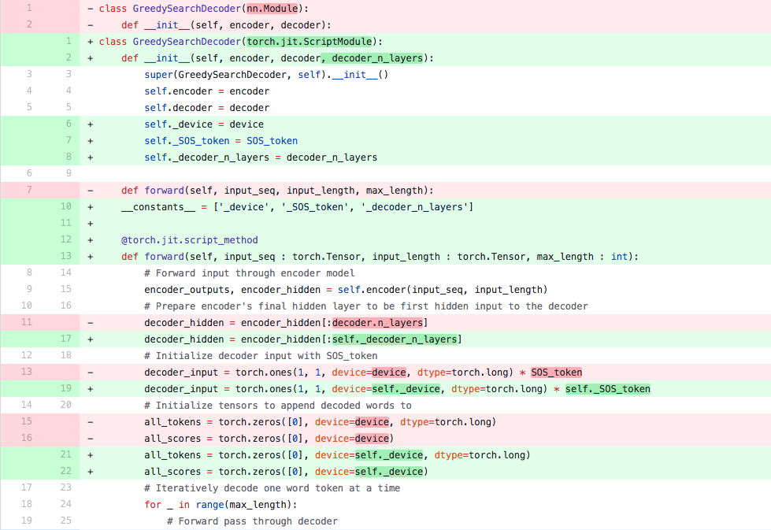

# 利用 TorchScript 部署 Seq2Seq 模型

> **作者：** [Matthew Inkawhich](https://github.com/MatthewInkawhich)
> 
> 译者：[Foxerlee](https://github.com/FoxerLee)
>
> 校验：[Foxerlee](https://github.com/FoxerLee)

本教程已经更新以适配 pyTorch 1.2 版本。

本教程将逐步介绍使用 TorchScript API 将 sequence-to-sequence 模型转换为 TorchScript 的过程。我们将转换的模型是[聊天机器人教程](https://pytorch.apachecn.org/docs/1.0/chatbot_tutorial.html)的 Chatbot 模型。您可以将本教程视为聊天机器人教程的“第 2 部分”，并部署自己的预训练模型，也可以从本文档开始使用我们提供的预训练模型。如果您选择使用我们提供的预训练模型，您也可以参考原始的聊天机器人教程，以获取有关数据预处理，模型理论和定义，以及模型训练的详细信息。

## 什么是 TorchScript？

在基于深度学习的项目的研究和开发阶段，能够与**及时**、命令行的界面(例如PyTorch的界面）进行交互是非常有利的。这使用户能够使用熟悉、惯用的 Python 编写 Python 的数据结构，控制流操作，print 语句和调试方法。尽管及时的界面对于研究和实验应用程序是一种有益的工具，但是当需要在生产环境中部署模型时，**基于图形**的模型表现将会更加适用。延迟的图形表示意味着可以进行无序执行等优化，并具有针对高度优化的硬件体系结构的能力。此外，基于图的表示形式还可以导出框架无关的模型。 PyTorch 提供了将及时模式代码增量转换为 TorchScript 的机制。TorchScript 是 Python 的静态可分析和可优化的子集，Torch 使用它以不依赖于 Python 而运行深度学习程序。

在 `torch.jit` 模块中可以找到将及时模式的 PyTorch 程序转换为 TorchScript 的 API。该模块中两种将及时模式模型转换为 TorchScript 图形表示形式的核心方式分别为：`tracing`--`追踪`和 `scripting`--`脚本`。`torch.jit.trace` 函数接受一个模块或函数以及一组示例的输入。然后通过输入的函数或模块运行输入示例，同时跟跟踪遇到的计算步骤，最后输出一个可以展示跟踪流程的基于图的函数。对于不涉及依赖数据的控制流的简单模块和功能(例如标准卷积神经网络），`tracing`--`追踪`非常有用。然而，如果一个有数据依赖的if语句和循环的函数被跟踪，则只记录示例输入沿执行路径调用的操作。换句话说，控制流本身并没有被捕获。为了转换包含依赖于数据的控制流的模块和功能，TorchScript 提供了 `scripting`--`脚本`机制。 `torch.jit.script` 函数/修饰器接受一个模块或函数，不需要示例输入。之后 `scripting`--`脚本` 显式化地将模型或函数转换为 TorchScript，包括所有控制流。使用脚本化的需要注意的一点是，它只支持 Python 的一个受限子集。因此您可能需要重写代码以使其与 TorchScript 语法兼容。

有关所有支持的功能的详细信息，请参阅 [TorchScript 语言参考](https://pytorch.apachecn.org/docs/1.2/jit.html)。 为了提供最大的灵活性，您还可以将 `tracing`--`追踪`和  `scripting`--`脚本`模式混合在一起使用而表现整个程序，这种方式可以通过增量的形式实现。



## 致谢

本教程的灵感来自以下内容：

  1. Yuan-Kuei Wu’s pytorch-chatbot implementation: [https://github.com/ywk991112/pytorch-chatbot](https://github.com/ywk991112/pytorch-chatbot)
  2. Sean Robertson’s practical-pytorch seq2seq-translation example: [https://github.com/spro/practical-pytorch/tree/master/seq2seq-translation](https://github.com/spro/practical-pytorch/tree/master/seq2seq-translation)
  3. FloydHub’s Cornell Movie Corpus preprocessing code: [https://github.com/floydhub/textutil-preprocess-cornell-movie-corpus](https://github.com/floydhub/textutil-preprocess-cornell-movie-corpus)

## 准备环境

首先，我们将导入所需的模块并设置一些常量。 如果您打算使用自己的模型，请确保正确设置了 `MAX_LENGTH` 常数。注意，此常数定义了训练期间允许的最大句子长度以及模型能够产生的最大长度输出。


```python 
from __future__ import absolute_import
from __future__ import division
from __future__ import print_function
from __future__ import unicode_literals

import torch
import torch.nn as nn
import torch.nn.functional as F
import re
import os
import unicodedata
import numpy as np

device = torch.device("cpu")


MAX_LENGTH = 10  # Maximum sentence length

# Default word tokens
PAD_token = 0  # Used for padding short sentences
SOS_token = 1  # Start-of-sentence token
EOS_token = 2  # End-of-sentence token
```   

## 模型概览

如前所述，我们使用的是 [sequence-to-sequence](https://arxiv.org/abs/1409.3215) (seq2seq) 模型。 当我们的输入是一个可变长度序列，而我们的输出也是一个可变长度序列，并且不要求输入的一对一映射时，就可以使用这种类型的模型。seq2seq 模型由两个协同工作的递归神经网络 (RNN) 组成：编码器 **encoder** 和解码器 **decoder**。


图片来源：[https://jeddy92.github.io/JEddy92.github.io/ts_seq2seq_intro/
](https://jeddy92.github.io/JEddy92.github.io/ts_seq2seq_intro/)

### 编码器(Encoder)

编码器 RNN 在输入语句中每次迭代一个标记(例如单词），每个步骤输出一个“输出”向量和一个“隐藏状态”向量。之后，隐藏状态向量将传递到下一个单位步骤，同时记录输出向量。编码器将序列中每个点代表的文本转换为高维空间中的一组点，解码器将使用这些点为给定的任务生成有意义的输出。

### 解码器(Decoder)

解码器 RNN 以逐个令牌的方式生成响应语句。它使用编码器的上下文向量和内部隐藏状态来生成序列中的下一个单词。它将持续生成单词，直到输出代表句子结尾的 *EOS_token*。 我们在解码器中使用注意机制  [attention mechanism](https://arxiv.org/abs/1409.0473) 来帮助它在生成输出时“注意”输入的某些部分。对于我们的模型，我们实现了 [Luong](https://arxiv.org/abs/1508.04025) 等人的“全球关注 Global attention”模块，并将其用作解码模型中的子模块。

## 数据处理

尽管我们的模型从概念上讲处理标记序列，但实际上，它们像所有机器学习模型一样处理数字。在这种情况下，训练之前建立的模型词汇表中的每个单词都将映射到一个整数索引。我们使用 `Voc` 对象存储单词到索引的映射以及词汇表中单词的总数。稍后我们将在运行模型之前加载这个对象。

另外，为了使我们能够进行评估，我们必须提供用于处理字符串输入的工具。`normalizeString` 函数将字符串中的所有字符转换为小写并删除所有非字母字符。`indexsFromSentence` 函数接受一个句子并返回包含的单词索引序列。

```python
class Voc:
    def __init__(self, name):
        self.name = name
        self.trimmed = False
        self.word2index = {}
        self.word2count = {}
        self.index2word = {PAD_token: "PAD", SOS_token: "SOS", EOS_token: "EOS"}
        self.num_words = 3  # Count SOS, EOS, PAD

    def addSentence(self, sentence):
        for word in sentence.split(' '):
            self.addWord(word)

    def addWord(self, word):
        if word not in self.word2index:
            self.word2index[word] = self.num_words
            self.word2count[word] = 1
            self.index2word[self.num_words] = word
            self.num_words += 1
        else:
            self.word2count[word] += 1

    # Remove words below a certain count threshold
    def trim(self, min_count):
        if self.trimmed:
            return
        self.trimmed = True
        keep_words = []
        for k, v in self.word2count.items():
            if v >= min_count:
                keep_words.append(k)

        print('keep_words {} / {} = {:.4f}'.format(
            len(keep_words), len(self.word2index), len(keep_words) / len(self.word2index)
        ))
        # Reinitialize dictionaries
        self.word2index = {}
        self.word2count = {}
        self.index2word = {PAD_token: "PAD", SOS_token: "SOS", EOS_token: "EOS"}
        self.num_words = 3 # Count default tokens
        for word in keep_words:
            self.addWord(word)


# Lowercase and remove non-letter characters
def normalizeString(s):
    s = s.lower()
    s = re.sub(r"([.!?])", r" \1", s)
    s = re.sub(r"[^a-zA-Z.!?]+", r" ", s)
    return s


# Takes string sentence, returns sentence of word indexes
def indexesFromSentence(voc, sentence):
    return [voc.word2index[word] for word in sentence.split(' ')] + [EOS_token]
```  

## 定义编码器

我们使用 `torch.nn.GRU` 模块实现了编码器的 RNN，该模块提供了一批句子 (嵌入单词的向量) 作为输入，并且它在内部一次遍历一个句子，计算出隐藏状态。我们将此模块初始化为双向的 RNN，这意味着我们有两个独立的 GRU：一个按时间顺序遍历序列，另一个以相反的顺序遍历。我们最终返回这两个 GRU 的输出之和。 由于我们的模型是使用批处理进行训练的，因此我们的 `EncoderRNN` 模型的前向 `forward` 函数需要添加一个可填充的批处理输入接口。要批处理可变长度的句子，我们在一个句子中最多允许使用 `MAX_LENGTH` 个标记，并且批处理中所有少于 `MAX_LENGTH` 标记的句子都将使用我们专用的 `PAD_token` 标记在尾部填充。为了使得批处理与 PyTorch RNN 模块可以一起使用，我们必须使用 `torch.nn.utils.rnn.pack_padded_sequence` 和 `torch.nn.utils.rnn.pad_packed_sequence` 数据转换函数对前向 `forward` 密令使用打包。请注意，前向功能还采用了 `input_lengths` 列表，其中包含批处理中每个句子的长度。 填充时，`torch.nn.utils.rnn.pack_padded_sequence` 函数将使用此输入。

### TorchScript 备注：

由于编码器的前向 `forward` 函数不包含任何与数据相关的控制流，因此我们将使用 `tracing` **跟踪**将其转换为 `script` 脚本模式。跟踪模块时，我们可以按原样保留模块的定义。 在进行评估之前，我们将在本文档末尾初始化所有模型。

```python
class EncoderRNN(nn.Module):
    def __init__(self, hidden_size, embedding, n_layers=1, dropout=0):
        super(EncoderRNN, self).__init__()
        self.n_layers = n_layers
        self.hidden_size = hidden_size
        self.embedding = embedding

        # Initialize GRU; the input_size and hidden_size params are both set to 'hidden_size'
        #   because our input size is a word embedding with number of features == hidden_size
        self.gru = nn.GRU(hidden_size, hidden_size, n_layers,
                          dropout=(0 if n_layers == 1 else dropout), bidirectional=True)

    def forward(self, input_seq, input_lengths, hidden=None):
        # type: (Tensor, Tensor, Optional[Tensor]) -> Tuple[Tensor, Tensor]
        # Convert word indexes to embeddings
        embedded = self.embedding(input_seq)
        # Pack padded batch of sequences for RNN module
        packed = torch.nn.utils.rnn.pack_padded_sequence(embedded, input_lengths)
        # Forward pass through GRU
        outputs, hidden = self.gru(packed, hidden)
        # Unpack padding
        outputs, _ = torch.nn.utils.rnn.pad_packed_sequence(outputs)
        # Sum bidirectional GRU outputs
        outputs = outputs[:, :, :self.hidden_size] + outputs[:, : ,self.hidden_size:]
        # Return output and final hidden state
        return outputs, hidden
```

## 定义解码器的注意力机制模块

接下来，我们将定义注意力模块 (`Attn`)。请注意，此模块将在我们的解码器模型中用作子模块。在 Luong 的论文中，他考虑了各种“得分函数”，这些函数将当前的解码器 RNN 输出和整个编码器输出作为输入，并返回注意力“能量”。此注意力能量张量的大小与编码器输出的大小相同，并且最终将两者相乘，从而生成加权张量，该张量的最大值表示在特定的解码时间步长下，查询语句中最重要的部分。

```python
# Luong attention layer
class Attn(torch.nn.Module):
    def __init__(self, method, hidden_size):
        super(Attn, self).__init__()
        self.method = method
        if self.method not in ['dot', 'general', 'concat']:
            raise ValueError(self.method, "is not an appropriate attention method.")
        self.hidden_size = hidden_size
        if self.method == 'general':
            self.attn = torch.nn.Linear(self.hidden_size, hidden_size)
        elif self.method == 'concat':
            self.attn = torch.nn.Linear(self.hidden_size * 2, hidden_size)
            self.v = torch.nn.Parameter(torch.FloatTensor(hidden_size))

    def dot_score(self, hidden, encoder_output):
        return torch.sum(hidden * encoder_output, dim=2)

    def general_score(self, hidden, encoder_output):
        energy = self.attn(encoder_output)
        return torch.sum(hidden * energy, dim=2)

    def concat_score(self, hidden, encoder_output):
        energy = self.attn(torch.cat((hidden.expand(encoder_output.size(0), -1, -1), encoder_output), 2)).tanh()
        return torch.sum(self.v * energy, dim=2)

    def forward(self, hidden, encoder_outputs):
        # Calculate the attention weights (energies) based on the given method
        if self.method == 'general':
            attn_energies = self.general_score(hidden, encoder_outputs)
        elif self.method == 'concat':
            attn_energies = self.concat_score(hidden, encoder_outputs)
        elif self.method == 'dot':
            attn_energies = self.dot_score(hidden, encoder_outputs)

        # Transpose max_length and batch_size dimensions
        attn_energies = attn_energies.t()

        # Return the softmax normalized probability scores (with added dimension)
        return F.softmax(attn_energies, dim=1).unsqueeze(1)
```

## 定义解码器

与 `EncoderRNN` 类似，在定义解码器的 RNN 时我们使用 `torch.nn.GRU` 模块。 但是在这里我们使用单向 GRU。十分需要注意的一点是，与编码器不同，每一次我们只向解码器 RNN 提供一个字。我们首先获得当前单词的嵌入并应用 [Dropout](https://pytorch.apachecn.org/docs/1.2/nn.html#torch.nn.Dropout)。接下来，我们将嵌入和上一步的隐藏状态传播到 GRU，并获得当前 GRU 的输出和隐藏状态。然后，我们使用 `Attn` 模块作为一个层，来获取注意力权重，然后将其乘以编码器的输出，以获取带参与的编码器输出。我们使用这个带参与的编码器输出作为上下文张量，它表示一个加权和，指示编码器输出中要注意的部分。之后，我们使用线性层和 softmax 归一化层来选择输出序列中的下一个单词。

```python
# TorchScript Notes:
# ~~~~~~~~~~~~~~~~~~~~~~
#
# Similarly to the ``EncoderRNN``, this module does not contain any
# data-dependent control flow. Therefore, we can once again use
# **tracing** to convert this model to TorchScript after it
# is initialized and its parameters are loaded.
#

class LuongAttnDecoderRNN(nn.Module):
    def __init__(self, attn_model, embedding, hidden_size, output_size, n_layers=1, dropout=0.1):
        super(LuongAttnDecoderRNN, self).__init__()

        # Keep for reference
        self.attn_model = attn_model
        self.hidden_size = hidden_size
        self.output_size = output_size
        self.n_layers = n_layers
        self.dropout = dropout

        # Define layers
        self.embedding = embedding
        self.embedding_dropout = nn.Dropout(dropout)
        self.gru = nn.GRU(hidden_size, hidden_size, n_layers, dropout=(0 if n_layers == 1 else dropout))
        self.concat = nn.Linear(hidden_size * 2, hidden_size)
        self.out = nn.Linear(hidden_size, output_size)

        self.attn = Attn(attn_model, hidden_size)

    def forward(self, input_step, last_hidden, encoder_outputs):
        # Note: we run this one step (word) at a time
        # Get embedding of current input word
        embedded = self.embedding(input_step)
        embedded = self.embedding_dropout(embedded)
        # Forward through unidirectional GRU
        rnn_output, hidden = self.gru(embedded, last_hidden)
        # Calculate attention weights from the current GRU output
        attn_weights = self.attn(rnn_output, encoder_outputs)
        # Multiply attention weights to encoder outputs to get new "weighted sum" context vector
        context = attn_weights.bmm(encoder_outputs.transpose(0, 1))
        # Concatenate weighted context vector and GRU output using Luong eq. 5
        rnn_output = rnn_output.squeeze(0)
        context = context.squeeze(1)
        concat_input = torch.cat((rnn_output, context), 1)
        concat_output = torch.tanh(self.concat(concat_input))
        # Predict next word using Luong eq. 6
        output = self.out(concat_output)
        output = F.softmax(output, dim=1)
        # Return output and final hidden state
        return output, hidden
```

## 定义评估部分

### 贪心搜索解码器(Greedy Search Decoder)

就像在聊天机器人教程中一样，我们使用贪心搜索解码器 `GreedySearchDecoder` 模块来简化实际的解码过程。该模块将训练好的编码器和解码器模型作为属性，驱动输入句子 (单词索引的向量) 的编码过程，并且以迭代的方式一次对一个单词解码其对应的输出响应队列。

对输入序列进行编码非常简单：只需将整个序列张量及其对应的长度向量传播给编码器。十分重要的一点是，该模块一次只处理一个输入序列，**而不是**处理一批序列。因此，当常量 1 用于声明张量大小时，它对应于批处理大小 1。要解码给定的解码器输出，我们必须迭代地向前遍历我们的解码器模型，该模型输出与一个与该单词对应的 softmax 分数，该分数表示这个单词在解码序列中是正确的下一个单词的概率。我们将解码器输入 `decoder_input` 初始化为包含 *SOS_token* 的张量。每次通过解码器后，我们都会贪心地将 softmax 概率最高的单词附加到解码的单词列表 `decoded_words` 中。我们还将这个词用作下一次迭代的解码器输入 `decoder_input`。如果解码的单词列表 `decoded_words` 列表的长度已达到 *MAX_LENGTH* 的长度，或者预测的单词是 *EOS_token*，则解码过程终止。

### TorchScript 备注：

此模块的前向 `forward` 方法在每次对一个输出字解码时，在 [0，*max_length*) 范围内进行迭代。因此，我们应该使用**脚本**将该模块转换为 TorchScript。不同于我们可以跟踪的编码器和解码器模型，我们必须对 `GreedySearchDecoder` 模块进行一些必要的更改，以初始化一个没有错误的对象。换句话说，我们必须确保我们的模块遵守 TorchScript 机制的规则，并且不使用 TorchScript 所包含的 Python 子集之外的任何语言特性。



#### 变化内容：

- 在构造函数参数中添加 `decoder_n_layers`
	- 这种变化是源于：我们传递给该模块的编码器和解码器模型将是 `TracedModule`(而不是 `Module`) 的子对象。 因此，我们无法使用 `coder.n_layers` 访问解码器的层数。 取而代之的是，我们计划使用 `decoder_n_layers`，并在模块构建过程中将此值传递给模块。
- 将新属性存储为常量
	- 在最初的实现中，我们可以在 `GreedySearchDecoder` 的前向 `forward` 函数中自由使用周围 (全局) 范围的变量。但是，既然我们正在使用脚本，我们就没有这种自由，因为脚本假设我们不一定必须坚持使用 Python 对象，尤其是在导出时。一个简单的解决方案是将这些全局值作为属性存储在构造函数中的模块中，并将它们添加到名为 `__constants__` 的特殊列表中，以便在使用前向 `forward` 方法构造图像时将它们用作文本值。 这种用法的一个例子是在 19 行，在这里我们使用常量属性 `self._device` 和 `self._SOS_token` 而不是使用全局值 `device` 和 `SOS_token`。
- 强制定义前向 `forward` 方法中参数的类型
	- 默认情况下，TorchScript 函数的所有参数均假定为张量 Tensor。如果需要传递其他类型的参数，则可以使用 [PEP 3107](https://www.python.org/dev/peps/pep-3107/) 中引入的函数类型注释。此外，可以使用 MyPy-style 样式类型注释声明不同类型的参数 (参加[文档](https://pytorch.apachecn.org/docs/1.2/jit.html#types))。
- 更改解码器输入 `decoder_input` 的初始化方法
	- 在原始实现中，我们使用 `torch.LongTensor([[SOS_token]])` 初始化了解码器输入张量。编写脚本时，不允许以这种文本方式初始化张量。相反，我们可以使用显式的张量函数 (例如 `torch.ones`) 来初始化张量。在这种情况下，我们可以通过 1 乘以存储在常量 `self._SOS_token` 中的 SOS_token 值来简单地实现复制解码器输入 `decoder_input` 的张量。

```python
class GreedySearchDecoder(nn.Module):
    def __init__(self, encoder, decoder, decoder_n_layers):
        super(GreedySearchDecoder, self).__init__()
        self.encoder = encoder
        self.decoder = decoder
        self._device = device
        self._SOS_token = SOS_token
        self._decoder_n_layers = decoder_n_layers

    __constants__ = ['_device', '_SOS_token', '_decoder_n_layers']

    def forward(self, input_seq : torch.Tensor, input_length : torch.Tensor, max_length : int):
        # Forward input through encoder model
        encoder_outputs, encoder_hidden = self.encoder(input_seq, input_length)
        # Prepare encoder's final hidden layer to be first hidden input to the decoder
        decoder_hidden = encoder_hidden[:self._decoder_n_layers]
        # Initialize decoder input with SOS_token
        decoder_input = torch.ones(1, 1, device=self._device, dtype=torch.long) * self._SOS_token
        # Initialize tensors to append decoded words to
        all_tokens = torch.zeros([0], device=self._device, dtype=torch.long)
        all_scores = torch.zeros([0], device=self._device)
        # Iteratively decode one word token at a time
        for _ in range(max_length):
            # Forward pass through decoder
            decoder_output, decoder_hidden = self.decoder(decoder_input, decoder_hidden, encoder_outputs)
            # Obtain most likely word token and its softmax score
            decoder_scores, decoder_input = torch.max(decoder_output, dim=1)
            # Record token and score
            all_tokens = torch.cat((all_tokens, decoder_input), dim=0)
            all_scores = torch.cat((all_scores, decoder_scores), dim=0)
            # Prepare current token to be next decoder input (add a dimension)
            decoder_input = torch.unsqueeze(decoder_input, 0)
        # Return collections of word tokens and scores
        return all_tokens, all_scores   
```

### 输入评估

接下来，我们定义一些函数来评估输入的值。评估 `evaluate` 函数接受正则化的字符串语句，将其处理为其对应的单词索引的张量 (批大小为 1)，并将该张量传递给命名为 `Searcher` 的 `GreedySearchDecoder` 实例以处理编码/解码过程。searcher 返回输出的单词索引向量和与每个解码的单词对应的 softmax 得分相对应的得分张量。最后一步是使用 `voc.index2word` 将每个单词索引转换回其字符串表示形式。

我们还定义了两个函数来评估输入句子。`validateInput` 函数提示用户输入并进行评估。它将一直请求用户输入，直到用户输入“q”或“quit”。

`validateExample` 函数仅将字符串输入语句作为参数，对其进行规范化，评估并输出响应。

 ```python
def evaluate(searcher, voc, sentence, max_length=MAX_LENGTH):
    ### Format input sentence as a batch
    # words -> indexes
    indexes_batch = [indexesFromSentence(voc, sentence)]
    # Create lengths tensor
    lengths = torch.tensor([len(indexes) for indexes in indexes_batch])
    # Transpose dimensions of batch to match models' expectations
    input_batch = torch.LongTensor(indexes_batch).transpose(0, 1)
    # Use appropriate device
    input_batch = input_batch.to(device)
    lengths = lengths.to(device)
    # Decode sentence with searcher
    tokens, scores = searcher(input_batch, lengths, max_length)
    # indexes -> words
    decoded_words = [voc.index2word[token.item()] for token in tokens]
    return decoded_words


# Evaluate inputs from user input (stdin)
def evaluateInput(searcher, voc):
    input_sentence = ''
    while(1):
        try:
            # Get input sentence
            input_sentence = input('> ')
            # Check if it is quit case
            if input_sentence == 'q' or input_sentence == 'quit': break
            # Normalize sentence
            input_sentence = normalizeString(input_sentence)
            # Evaluate sentence
            output_words = evaluate(searcher, voc, input_sentence)
            # Format and print response sentence
            output_words[:] = [x for x in output_words if not (x == 'EOS' or x == 'PAD')]
            print('Bot:', ' '.join(output_words))

        except KeyError:
            print("Error: Encountered unknown word.")

# Normalize input sentence and call evaluate()
def evaluateExample(sentence, searcher, voc):
    print("> " + sentence)
    # Normalize sentence
    input_sentence = normalizeString(sentence)
    # Evaluate sentence
    output_words = evaluate(searcher, voc, input_sentence)
    output_words[:] = [x for x in output_words if not (x == 'EOS' or x == 'PAD')]
    print('Bot:', ' '.join(output_words))
 ```  
   

## 加载预训练参数

好了，是时候加载我们的模型了！

### 使用本文提供的模型

要加载本文提供的模型：

  1. 在这里[下载模型](https://download.pytorch.org/models/tutorials/4000_checkpoint.tar)。
  2. 设置 `loadFilename` 变量为下载的检查点文件的路径。
  3. 取消 `checkpoint = torch.load(loadFilename)` 的注释，因为该模型在 CPU 上训练。

### 使用您自己的模型

加载您自己的预先训练的模型：

  1. 将 `loadFilename` 变量设置为要加载的检查点文件的路径。 请注意，如果您遵循了聊天机器人教程中保存模型的约定，则可能涉及更改 `model_name`，`encoder_n_layers`，`decoder_n_layers`，`hidden_size` 和 `checkpoint_iter` (因为这些值在模型路径中会被使用)。  
  2. 如果您在 CPU 上训练模型，请确保在 `checkpoint = torch.load(loadFilename)` 行读取检查点文件。 如果您在 GPU 上训练模型并且在 CPU 上运行本教程，请取消注释 `checkpoint = torch.load(loadFilename，map_location = torch.device('cpu'))` 行。

### TorchScript 备注

注意，我们像通常一样将参数初始化并加载到我们的编码器和解码器模型中。如果您对模型的某些部分使用跟踪模式 (*torch.jit.trace*)，则必须先调用 .to(device) 设置模型的设备选项，然后在追踪模型**之前**调用 .eval() 来将 dropout 层设置为测试模型。TracedModule 对象不继承 `to` 或 `eval` 方法。由于在本教程中，我们仅使用脚本而不是跟踪，因此只需要在执行评估之前执行此操作 (这与我们在命令行模式下通常执行的操作相同)。

```python
save_dir = os.path.join("data", "save")
corpus_name = "cornell movie-dialogs corpus"

# Configure models
model_name = 'cb_model'
attn_model = 'dot'
#attn_model = 'general'
#attn_model = 'concat'
hidden_size = 500
encoder_n_layers = 2
decoder_n_layers = 2
dropout = 0.1
batch_size = 64

# If you're loading your own model
# Set checkpoint to load from
checkpoint_iter = 4000
# loadFilename = os.path.join(save_dir, model_name, corpus_name,
#                             '{}-{}_{}'.format(encoder_n_layers, decoder_n_layers, hidden_size),
#                             '{}_checkpoint.tar'.format(checkpoint_iter))

# If you're loading the hosted model
loadFilename = 'data/4000_checkpoint.tar'

# Load model
# Force CPU device options (to match tensors in this tutorial)
checkpoint = torch.load(loadFilename, map_location=torch.device('cpu'))
encoder_sd = checkpoint['en']
decoder_sd = checkpoint['de']
encoder_optimizer_sd = checkpoint['en_opt']
decoder_optimizer_sd = checkpoint['de_opt']
embedding_sd = checkpoint['embedding']
voc = Voc(corpus_name)
voc.__dict__ = checkpoint['voc_dict']


print('Building encoder and decoder ...')
# Initialize word embeddings
embedding = nn.Embedding(voc.num_words, hidden_size)
embedding.load_state_dict(embedding_sd)
# Initialize encoder & decoder models
encoder = EncoderRNN(hidden_size, embedding, encoder_n_layers, dropout)
decoder = LuongAttnDecoderRNN(attn_model, embedding, hidden_size, voc.num_words, decoder_n_layers, dropout)
# Load trained model params
encoder.load_state_dict(encoder_sd)
decoder.load_state_dict(decoder_sd)
# Use appropriate device
encoder = encoder.to(device)
decoder = decoder.to(device)
# Set dropout layers to eval mode
encoder.eval()
decoder.eval()
print('Models built and ready to go!')
```  

输出：

```
Building encoder and decoder ...
Models built and ready to go!
```
 

## 转换模型为 TorchScript

### 编码器

如前所述，要将编码器模型转换为 TorchScript ，我们使用**脚本 scripting**。 编码器模型接受一个输入序列和相应的长度张量。因此，我们创建一个示例输入序列张量 `test_seq`，其大小适当 (MAX_LENGTH, 1)，包含适当范围[0, *voc.num_words*) 中的数字，并且具有适当的类型 (int64)。 我们还创建了一个 `test_seq_length` 标量，该标量实际上等于 `test_seq` 中单词的个数。下一步是使用 `torch.jit.trace` 函数来跟踪模型。 请注意，我们传递的第一个参数是我们要跟踪的模块，第二个参数是模块的前向 `forward` 方法的参数元组。

### 解码器

我们执行与跟踪编码器相同的过程来跟踪解码器。注意，我们将一组随机输入传播给 `traced_encoder` 以获得解码器所需的输出。这不是必需的，因为我们也可以简单地制造出具有正确形状，类型和值范围的张量。 这种方法之所以可行，是因为在我们的情况下，我们对张量的值没有任何限制，因为我们没有任何可能会超出范围输入的操作。

### 贪心搜索解码器(GreedySearchDecoder)

回想一下，由于存在依赖于数据的控制流，我们为搜索器模块编写了脚本。在脚本化的情况下，我们通过添加修饰符并确保实现符合脚本规则来预先完成转换工作。我们初始化脚本搜索器的方式与初始化未脚本化变量的方式相同。

    
```python
### Compile the whole greedy search model to TorchScript model
# Create artificial inputs
test_seq = torch.LongTensor(MAX_LENGTH, 1).random_(0, voc.num_words).to(device)
test_seq_length = torch.LongTensor([test_seq.size()[0]]).to(device)
# Trace the model
traced_encoder = torch.jit.trace(encoder, (test_seq, test_seq_length))

### Convert decoder model
# Create and generate artificial inputs
test_encoder_outputs, test_encoder_hidden = traced_encoder(test_seq, test_seq_length)
test_decoder_hidden = test_encoder_hidden[:decoder.n_layers]
test_decoder_input = torch.LongTensor(1, 1).random_(0, voc.num_words)
# Trace the model
traced_decoder = torch.jit.trace(decoder, (test_decoder_input, test_decoder_hidden, test_encoder_outputs))

### Initialize searcher module by wrapping ``torch.jit.script`` call
scripted_searcher = torch.jit.script(GreedySearchDecoder(traced_encoder, traced_decoder, decoder.n_layers))
```


## 图像输出

现在我们的模型为 TorchScript 形式，我们可以打印每个模型的图，以确保适当地捕获了计算图。由于TorchScript允许我们递归编译整个模型层次结构，并将编码器和解码器图内联到单个图中，因此我们只需要打印 *scripted_searcher* 图。

```python
print('scripted_searcher graph:\n', scripted_searcher.graph)
``` 
    
输出:

```
scripted_searcher graph:
 graph(%self : ClassType<GreedySearchDecoder>,
      %input_seq.1 : Tensor,
      %input_length.1 : Tensor,
      %max_length.1 : int):
  %20 : None = prim::Constant()
  %157 : int = prim::Constant[value=9223372036854775807](), scope: EncoderRNN # /var/lib/jenkins/workspace/beginner_source/deploy_seq2seq_hybrid_frontend_tutorial.py:310:0
  %152 : float = prim::Constant[value=0](), scope: EncoderRNN # /opt/conda/lib/python3.6/site-packages/torch/nn/utils/rnn.py:329:0
  %142 : float = prim::Constant[value=0.1](), scope: EncoderRNN/GRU[gru] # /opt/conda/lib/python3.6/site-packages/torch/nn/modules/rnn.py:683:0
  %141 : int = prim::Constant[value=2](), scope: EncoderRNN/GRU[gru] # /opt/conda/lib/python3.6/site-packages/torch/nn/modules/rnn.py:683:0
  %140 : bool = prim::Constant[value=1](), scope: EncoderRNN/GRU[gru] # /opt/conda/lib/python3.6/site-packages/torch/nn/modules/rnn.py:683:0
  %134 : int = prim::Constant[value=6](), scope: EncoderRNN/GRU[gru] # /opt/conda/lib/python3.6/site-packages/torch/nn/modules/rnn.py:692:0
  %132 : int = prim::Constant[value=500](), scope: EncoderRNN/GRU[gru] # /opt/conda/lib/python3.6/site-packages/torch/nn/modules/rnn.py:692:0
  %123 : int = prim::Constant[value=4](), scope: EncoderRNN # /opt/conda/lib/python3.6/site-packages/torch/nn/utils/rnn.py:272:0
  %122 : Device = prim::Constant[value="cpu"](), scope: EncoderRNN # /opt/conda/lib/python3.6/site-packages/torch/nn/utils/rnn.py:272:0
  %119 : bool = prim::Constant[value=0](), scope: EncoderRNN/Embedding[embedding] # /opt/conda/lib/python3.6/site-packages/torch/nn/functional.py:1484:0
  %118 : int = prim::Constant[value=-1](), scope: EncoderRNN/Embedding[embedding] # /opt/conda/lib/python3.6/site-packages/torch/nn/functional.py:1484:0
  %12 : int = prim::Constant[value=0]() # /var/lib/jenkins/workspace/beginner_source/deploy_seq2seq_hybrid_frontend_tutorial.py:560:25
  %14 : int = prim::Constant[value=1]() # /var/lib/jenkins/workspace/beginner_source/deploy_seq2seq_hybrid_frontend_tutorial.py:560:25
  %4 : ClassType<EncoderRNN> = prim::GetAttr[name="encoder"](%self)
  %99 : ClassType<Embedding> = prim::GetAttr[name="embedding"](%4)
  %weight.3 : Tensor = prim::GetAttr[name="weight"](%99)
  %101 : ClassType<GRU> = prim::GetAttr[name="gru"](%4)
  %102 : Tensor = prim::GetAttr[name="bias_hh_l0"](%101)
  %103 : Tensor = prim::GetAttr[name="bias_hh_l0_reverse"](%101)
  %104 : Tensor = prim::GetAttr[name="bias_hh_l1"](%101)
  %105 : Tensor = prim::GetAttr[name="bias_hh_l1_reverse"](%101)
  %106 : Tensor = prim::GetAttr[name="bias_ih_l0"](%101)
  %107 : Tensor = prim::GetAttr[name="bias_ih_l0_reverse"](%101)
  %108 : Tensor = prim::GetAttr[name="bias_ih_l1"](%101)
  %109 : Tensor = prim::GetAttr[name="bias_ih_l1_reverse"](%101)
  %110 : Tensor = prim::GetAttr[name="weight_hh_l0"](%101)
  %111 : Tensor = prim::GetAttr[name="weight_hh_l0_reverse"](%101)
  %112 : Tensor = prim::GetAttr[name="weight_hh_l1"](%101)
  %113 : Tensor = prim::GetAttr[name="weight_hh_l1_reverse"](%101)
  %114 : Tensor = prim::GetAttr[name="weight_ih_l0"](%101)
  %115 : Tensor = prim::GetAttr[name="weight_ih_l0_reverse"](%101)
  %116 : Tensor = prim::GetAttr[name="weight_ih_l1"](%101)
  %117 : Tensor = prim::GetAttr[name="weight_ih_l1_reverse"](%101)
  %input.7 : Float(10, 1, 500) = aten::embedding(%weight.3, %input_seq.1, %118, %119, %119), scope: EncoderRNN/Embedding[embedding] # /opt/conda/lib/python3.6/site-packages/torch/nn/functional.py:1484:0
  %lengths : Long(1) = aten::to(%input_length.1, %122, %123, %119, %119), scope: EncoderRNN # /opt/conda/lib/python3.6/site-packages/torch/nn/utils/rnn.py:272:0
  %input.1 : Float(10, 500), %batch_sizes : Long(10) = aten::_pack_padded_sequence(%input.7, %lengths, %119), scope: EncoderRNN # /opt/conda/lib/python3.6/site-packages/torch/nn/utils/rnn.py:282:0
  %133 : int[] = prim::ListConstruct(%123, %14, %132), scope: EncoderRNN/GRU[gru]
  %hx : Float(4, 1, 500) = aten::zeros(%133, %134, %12, %122, %119), scope: EncoderRNN/GRU[gru] # /opt/conda/lib/python3.6/site-packages/torch/nn/modules/rnn.py:692:0
  %139 : Tensor[] = prim::ListConstruct(%114, %110, %106, %102, %115, %111, %107, %103, %116, %112, %108, %104, %117, %113, %109, %105), scope: EncoderRNN/GRU[gru]
  %145 : Float(10, 1000), %146 : Float(4, 1, 500) = aten::gru(%input.1, %batch_sizes, %hx, %139, %140, %141, %142, %119, %140), scope: EncoderRNN/GRU[gru] # /opt/conda/lib/python3.6/site-packages/torch/nn/modules/rnn.py:683:0
  %148 : int = aten::size(%batch_sizes, %12), scope: EncoderRNN # /opt/conda/lib/python3.6/site-packages/torch/nn/utils/rnn.py:320:0
  %max_seq_length : Long() = prim::NumToTensor(%148), scope: EncoderRNN
  %150 : int = aten::Int(%max_seq_length), scope: EncoderRNN
  %outputs : Float(10, 1, 1000), %154 : Long(1) = aten::_pad_packed_sequence(%145, %batch_sizes, %119, %152, %150), scope: EncoderRNN # /opt/conda/lib/python3.6/site-packages/torch/nn/utils/rnn.py:329:0
  %159 : Float(10, 1, 1000) = aten::slice(%outputs, %12, %12, %157, %14), scope: EncoderRNN # /var/lib/jenkins/workspace/beginner_source/deploy_seq2seq_hybrid_frontend_tutorial.py:310:0
  %164 : Float(10, 1, 1000) = aten::slice(%159, %14, %12, %157, %14), scope: EncoderRNN # /var/lib/jenkins/workspace/beginner_source/deploy_seq2seq_hybrid_frontend_tutorial.py:310:0
  %169 : Float(10, 1, 500) = aten::slice(%164, %141, %12, %132, %14), scope: EncoderRNN # /var/lib/jenkins/workspace/beginner_source/deploy_seq2seq_hybrid_frontend_tutorial.py:310:0
  %174 : Float(10, 1, 1000) = aten::slice(%outputs, %12, %12, %157, %14), scope: EncoderRNN # /var/lib/jenkins/workspace/beginner_source/deploy_seq2seq_hybrid_frontend_tutorial.py:310:0
  %179 : Float(10, 1, 1000) = aten::slice(%174, %14, %12, %157, %14), scope: EncoderRNN # /var/lib/jenkins/workspace/beginner_source/deploy_seq2seq_hybrid_frontend_tutorial.py:310:0
  %184 : Float(10, 1, 500) = aten::slice(%179, %141, %132, %157, %14), scope: EncoderRNN # /var/lib/jenkins/workspace/beginner_source/deploy_seq2seq_hybrid_frontend_tutorial.py:310:0
  %186 : Float(10, 1, 500) = aten::add(%169, %184, %14), scope: EncoderRNN # /var/lib/jenkins/workspace/beginner_source/deploy_seq2seq_hybrid_frontend_tutorial.py:310:0
  %decoder_hidden.1 : Tensor = aten::slice(%146, %12, %12, %141, %14) # /var/lib/jenkins/workspace/beginner_source/deploy_seq2seq_hybrid_frontend_tutorial.py:560:25
  %19 : int[] = prim::ListConstruct(%14, %14)
  %22 : Tensor = aten::ones(%19, %123, %20, %122, %20) # /var/lib/jenkins/workspace/beginner_source/deploy_seq2seq_hybrid_frontend_tutorial.py:562:24
  %decoder_input.1 : Tensor = aten::mul(%22, %14) # /var/lib/jenkins/workspace/beginner_source/deploy_seq2seq_hybrid_frontend_tutorial.py:562:24
  %25 : int[] = prim::ListConstruct(%12)
  %all_tokens.1 : Tensor = aten::zeros(%25, %123, %20, %122, %20) # /var/lib/jenkins/workspace/beginner_source/deploy_seq2seq_hybrid_frontend_tutorial.py:564:21
  %31 : int[] = prim::ListConstruct(%12)
  %all_scores.1 : Tensor = aten::zeros(%31, %20, %20, %122, %20) # /var/lib/jenkins/workspace/beginner_source/deploy_seq2seq_hybrid_frontend_tutorial.py:565:21
  %all_tokens : Tensor, %all_scores : Tensor, %decoder_hidden : Tensor, %decoder_input : Tensor = prim::Loop(%max_length.1, %140, %all_tokens.1, %all_scores.1, %decoder_hidden.1, %decoder_input.1) # /var/lib/jenkins/workspace/beginner_source/deploy_seq2seq_hybrid_frontend_tutorial.py:567:8
    block0(%41 : int, %all_tokens.6 : Tensor, %all_scores.6 : Tensor, %decoder_hidden.5 : Tensor, %decoder_input.9 : Tensor):
      %42 : ClassType<LuongAttnDecoderRNN> = prim::GetAttr[name="decoder"](%self)
      %188 : ClassType<Embedding> = prim::GetAttr[name="embedding"](%42)
      %weight.1 : Tensor = prim::GetAttr[name="weight"](%188)
      %190 : ClassType<GRU> = prim::GetAttr[name="gru"](%42)
      %191 : Tensor = prim::GetAttr[name="bias_hh_l0"](%190)
      %192 : Tensor = prim::GetAttr[name="bias_hh_l1"](%190)
      %193 : Tensor = prim::GetAttr[name="bias_ih_l0"](%190)
      %194 : Tensor = prim::GetAttr[name="bias_ih_l1"](%190)
      %195 : Tensor = prim::GetAttr[name="weight_hh_l0"](%190)
      %196 : Tensor = prim::GetAttr[name="weight_hh_l1"](%190)
      %197 : Tensor = prim::GetAttr[name="weight_ih_l0"](%190)
      %198 : Tensor = prim::GetAttr[name="weight_ih_l1"](%190)
      %199 : ClassType<Linear> = prim::GetAttr[name="concat"](%42)
      %weight.2 : Tensor = prim::GetAttr[name="weight"](%199)
      %bias.1 : Tensor = prim::GetAttr[name="bias"](%199)
      %202 : ClassType<Linear> = prim::GetAttr[name="out"](%42)
      %weight : Tensor = prim::GetAttr[name="weight"](%202)
      %bias : Tensor = prim::GetAttr[name="bias"](%202)
      %input.2 : Float(1, 1, 500) = aten::embedding(%weight.1, %decoder_input.9, %118, %119, %119), scope: LuongAttnDecoderRNN/Embedding[embedding] # /opt/conda/lib/python3.6/site-packages/torch/nn/functional.py:1484:0
      %input.3 : Float(1, 1, 500) = aten::dropout(%input.2, %142, %119), scope: LuongAttnDecoderRNN/Dropout[embedding_dropout] # /opt/conda/lib/python3.6/site-packages/torch/nn/functional.py:807:0
      %212 : Tensor[] = prim::ListConstruct(%197, %195, %193, %191, %198, %196, %194, %192), scope: LuongAttnDecoderRNN/GRU[gru]
      %hidden : Float(1, 1, 500), %220 : Float(2, 1, 500) = aten::gru(%input.3, %decoder_hidden.5, %212, %140, %141, %142, %119, %119, %119), scope: LuongAttnDecoderRNN/GRU[gru] # /opt/conda/lib/python3.6/site-packages/torch/nn/modules/rnn.py:680:0
      %221 : Float(10, 1, 500) = aten::mul(%hidden, %186), scope: LuongAttnDecoderRNN/Attn[attn] # /var/lib/jenkins/workspace/beginner_source/deploy_seq2seq_hybrid_frontend_tutorial.py:344:0
      %223 : int[] = prim::ListConstruct(%141), scope: LuongAttnDecoderRNN/Attn[attn]
      %attn_energies : Float(10, 1) = aten::sum(%221, %223, %119, %20), scope: LuongAttnDecoderRNN/Attn[attn] # /var/lib/jenkins/workspace/beginner_source/deploy_seq2seq_hybrid_frontend_tutorial.py:344:0
      %input.4 : Float(1, 10) = aten::t(%attn_energies), scope: LuongAttnDecoderRNN/Attn[attn] # /var/lib/jenkins/workspace/beginner_source/deploy_seq2seq_hybrid_frontend_tutorial.py:364:0
      %230 : Float(1, 10) = aten::softmax(%input.4, %14, %20), scope: LuongAttnDecoderRNN/Attn[attn] # /opt/conda/lib/python3.6/site-packages/torch/nn/functional.py:1231:0
      %attn_weights : Float(1, 1, 10) = aten::unsqueeze(%230, %14), scope: LuongAttnDecoderRNN/Attn[attn] # /var/lib/jenkins/workspace/beginner_source/deploy_seq2seq_hybrid_frontend_tutorial.py:367:0
      %235 : Float(1, 10, 500) = aten::transpose(%186, %12, %14), scope: LuongAttnDecoderRNN # /var/lib/jenkins/workspace/beginner_source/deploy_seq2seq_hybrid_frontend_tutorial.py:428:0
      %context.1 : Float(1, 1, 500) = aten::bmm(%attn_weights, %235), scope: LuongAttnDecoderRNN # /var/lib/jenkins/workspace/beginner_source/deploy_seq2seq_hybrid_frontend_tutorial.py:428:0
      %rnn_output : Float(1, 500) = aten::squeeze(%hidden, %12), scope: LuongAttnDecoderRNN # /var/lib/jenkins/workspace/beginner_source/deploy_seq2seq_hybrid_frontend_tutorial.py:430:0
      %context : Float(1, 500) = aten::squeeze(%context.1, %14), scope: LuongAttnDecoderRNN # /var/lib/jenkins/workspace/beginner_source/deploy_seq2seq_hybrid_frontend_tutorial.py:431:0
      %241 : Tensor[] = prim::ListConstruct(%rnn_output, %context), scope: LuongAttnDecoderRNN
      %input.5 : Float(1, 1000) = aten::cat(%241, %14), scope: LuongAttnDecoderRNN # /var/lib/jenkins/workspace/beginner_source/deploy_seq2seq_hybrid_frontend_tutorial.py:432:0
      %244 : Float(1000, 500) = aten::t(%weight.2), scope: LuongAttnDecoderRNN/Linear[concat] # /opt/conda/lib/python3.6/site-packages/torch/nn/functional.py:1370:0
      %247 : Float(1, 500) = aten::addmm(%bias.1, %input.5, %244, %14, %14), scope: LuongAttnDecoderRNN/Linear[concat] # /opt/conda/lib/python3.6/site-packages/torch/nn/functional.py:1370:0
      %input.6 : Float(1, 500) = aten::tanh(%247), scope: LuongAttnDecoderRNN # /var/lib/jenkins/workspace/beginner_source/deploy_seq2seq_hybrid_frontend_tutorial.py:433:0
      %249 : Float(500, 7826) = aten::t(%weight), scope: LuongAttnDecoderRNN/Linear[out] # /opt/conda/lib/python3.6/site-packages/torch/nn/functional.py:1370:0
      %input : Float(1, 7826) = aten::addmm(%bias, %input.6, %249, %14, %14), scope: LuongAttnDecoderRNN/Linear[out] # /opt/conda/lib/python3.6/site-packages/torch/nn/functional.py:1370:0
      %255 : Float(1, 7826) = aten::softmax(%input, %14, %20), scope: LuongAttnDecoderRNN # /opt/conda/lib/python3.6/site-packages/torch/nn/functional.py:1231:0
      %decoder_scores.1 : Tensor, %decoder_input.3 : Tensor = aten::max(%255, %14, %119) # /var/lib/jenkins/workspace/beginner_source/deploy_seq2seq_hybrid_frontend_tutorial.py:571:44
      %59 : Tensor[] = prim::ListConstruct(%all_tokens.6, %decoder_input.3)
      %all_tokens.3 : Tensor = aten::cat(%59, %12) # /var/lib/jenkins/workspace/beginner_source/deploy_seq2seq_hybrid_frontend_tutorial.py:573:25
      %65 : Tensor[] = prim::ListConstruct(%all_scores.6, %decoder_scores.1)
      %all_scores.3 : Tensor = aten::cat(%65, %12) # /var/lib/jenkins/workspace/beginner_source/deploy_seq2seq_hybrid_frontend_tutorial.py:574:25
      %decoder_input.7 : Tensor = aten::unsqueeze(%decoder_input.3, %12) # /var/lib/jenkins/workspace/beginner_source/deploy_seq2seq_hybrid_frontend_tutorial.py:576:28
      -> (%140, %all_tokens.3, %all_scores.3, %220, %decoder_input.7)
  %73 : (Tensor, Tensor) = prim::TupleConstruct(%all_tokens, %all_scores)
  return (%73)
```

## 运行结果评估

最后，我们将使用 TorchScript 模型对聊天机器人模型进行评估。如果转换正确，模型的行为将与它们在即时模式表示中的行为完全相同。

默认情况下，我们计算一些常见的查询语句。如果您想自己与机器人聊天，取消对 `evaluateInput` 行的注释。

```python
# Use appropriate device
scripted_searcher.to(device)
# Set dropout layers to eval mode
scripted_searcher.eval()

# Evaluate examples
sentences = ["hello", "what's up?", "who are you?", "where am I?", "where are you from?"]
for s in sentences:
    evaluateExample(s, scripted_searcher, voc)

# Evaluate your input
#evaluateInput(traced_encoder, traced_decoder, scripted_searcher, voc)
```    

输出:

```
> hello
Bot: hello .
> what's up?
Bot: i m going to get my car .
> who are you?
Bot: i m the owner .
> where am I?
Bot: in the house .
> where are you from?
Bot: south america .
```   
    

## 保存模型

现在我们已经成功地将模型转换为 TorchScript，接下来将对其进行序列化，以便在非 python 部署环境中使用。为此，我们只需保存 `scripted_searcher` 模块，因为这是用于对聊天机器人模型运行推理的面向用户的接口。保存脚本模块时，使用 `script_module.save(PATH)` 代替 `torch.save(model, PATH)`。

```python
scripted_searcher.save("scripted_chatbot.pth")
```