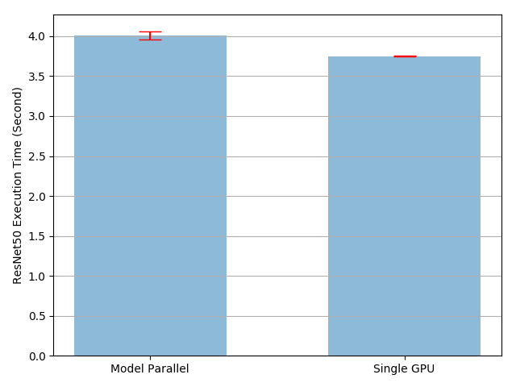

# 模型并行化最佳实践

> **作者**：[Shen Li](https://mrshenli.github.io)
>
> **译者**：[Hamish](https://sherlockbear.github.io)
>
> **校验**：[Hamish](https://sherlockbear.github.io)

模型并行化在分布式训练技术中被广泛使用。先前的文章已经解释了如何使用[DataParallel](https://pytorch.org/tutorials/beginner/blitz/data_parallel_tutorial.html)在多个GPU上训练神经网络。此功能将相同的模型复制到所有GPU，其中每个GPU负责消化输入数据的不同部分。尽管它可以极大地加快训练过程，但不适用于某些模型太大而无法被单个GPU容纳的用例。这篇文章展示了如何通过使用模型化来解决该问题，与`DataParallel`相比，模型并行化将单个模型拆分到不同的GPU上，而不是在每个GPU上复制整个模型(具体来说，模型`m`包含10层：使用`DataParallel`时，每个GPU都具有这10层中每个层的副本，而当在两个GPU上使用模型并行化时，每个GPU可以承载5层。

模型并行化的高级思想是将模型的不同子网络放置在不同的设备上，并相应地实现`forward`方法，以在设备之间传递中间输出。由于只需模型的一部分就能能在任何独立设备上运行，因此一组设备可以共同为更大的模型服务。在本文中，我们不会尝试构建庞大的模型并将其压缩到有限数量的GPU中。相反，本文着重展示模型并行化的思想。读者可以将这些想法应用到实际应用中。

## 基本用法

让我们从包含两个线性层的玩具模型开始。要在两个GPU上运行此模型，只需将每个线性层放在不同的GPU上，然后将输入和中间输出传递到匹配的层设备。

```python
import torch
import torch.nn as nn
import torch.optim as optim

class ToyModel(nn.Module):
    def __init__(self):
        super(ToyModel, self).__init__()
        self.net1 = torch.nn.Linear(10, 10).to('cuda:0')
        self.relu = torch.nn.ReLU()
        self.net2 = torch.nn.Linear(10, 5).to('cuda:1')

    def forward(self, x):
        x = self.relu(self.net1(x.to('cuda:0')))
        return self.net2(x.to('cuda:1'))
```

<!---这里不应该是四个to(device)调用么--->
请注意，除去五个`to(device)`调用将线性层和张量放置在适当的设备上之外，上面的`ToyModel`看起来非常类似于在单个GPU上实现它的方式。那是模型中唯一需要更改的地方。`backward()`和`torch.optim`将自动处理梯度，就像模型在一个GPU上一样。你只需确保调用损失函数时标签与输出在同一设备上。

```python
model = ToyModel()
loss_fn = nn.MSELoss()
optimizer = optim.SGD(model.parameters(), lr=0.001)

optimizer.zero_grad()
outputs = model(torch.randn(20, 10))
labels = torch.randn(20, 5).to('cuda:1')
loss_fn(outputs, labels).backward()
optimizer.step()
```

## 在现有模块上应用模型并行化

只需更改几行，就可以在多个GPU上运行现有的单GPU模块。以下代码显示了如何将`torchvision.models.reset50()`分解到两个GPU上。基本想法是从现有的`ResNet`模块继承，并在构建过程中将层划分到两个GPU。然后，通过传递对应的中间输出，覆写`forward`方法以将两个子网络拼合。

```python
from torchvision.models.resnet import ResNet, Bottleneck

num_classes = 1000


class ModelParallelResNet50(ResNet):
    def __init__(self, *args, **kwargs):
        super(ModelParallelResNet50, self).__init__(
            Bottleneck, [3, 4, 6, 3], num_classes=num_classes, *args, **kwargs)

        self.seq1 = nn.Sequential(
            self.conv1,
            self.bn1,
            self.relu,
            self.maxpool,

            self.layer1,
            self.layer2
        ).to('cuda:0')

        self.seq2 = nn.Sequential(
            self.layer3,
            self.layer4,
            self.avgpool,
        ).to('cuda:1')

        self.fc.to('cuda:1')

    def forward(self, x):
        x = self.seq2(self.seq1(x).to('cuda:1'))
        return self.fc(x.view(x.size(0), -1))
```

对于模型太大而无法放入单个GPU的情况，上述实现解决了该问题。但是，你可能已经注意到，if your model fits，这一实现将比在单个GPU上运行还要慢。这是因为在任何时间点，两个GPU中只有一个在工作，而另一个在那儿什么也没做。而由于中间输出需要在`layer2`和`layer3`之间从`cuda:0`复制到`cuda:1`，这导致性能进一步下降。

让我们进行实验以更定量地了解执行时间。在本实验中，我们通过运行随机输入和标签来训练`ModelParallelResNet50`和现有的`torchvision.models.reset50()`。训练后，模型不会产生任何有用的预测，但是我们可以对执行时间有一个合理的了解。

```python
import torchvision.models as models

num_batches = 3
batch_size = 120
image_w = 128
image_h = 128


def train(model):
    model.train(True)
    loss_fn = nn.MSELoss()
    optimizer = optim.SGD(model.parameters(), lr=0.001)

    one_hot_indices = torch.LongTensor(batch_size) \
                           .random_(0, num_classes) \
                           .view(batch_size, 1)

    for _ in range(num_batches):
        # generate random inputs and labels
        inputs = torch.randn(batch_size, 3, image_w, image_h)
        labels = torch.zeros(batch_size, num_classes) \
                      .scatter_(1, one_hot_indices, 1)

        # run forward pass
        optimizer.zero_grad()
        outputs = model(inputs.to('cuda:0'))

        # run backward pass
        labels = labels.to(outputs.device)
        loss_fn(outputs, labels).backward()
        optimizer.step()
```

上述`train(model)`方法使用`nn.MSELoss`作为损失函数，并使用`optim.SGD`作为优化器。它模拟了对`128 X 128`图像的训练，这些图像分为3个batch，每个batch包含120幅图像。然后，我们使用`timeit`来运行`train(model)`方法10次，并绘制带有标准差的执行时间。

```python
import matplotlib.pyplot as plt
plt.switch_backend('Agg')
import numpy as np
import timeit

num_repeat = 10

stmt = "train(model)"

setup = "model = ModelParallelResNet50()"
# globals arg is only available in Python 3. In Python 2, use the following
# import __builtin__
# __builtin__.__dict__.update(locals())
mp_run_times = timeit.repeat(
    stmt, setup, number=1, repeat=num_repeat, globals=globals())
mp_mean, mp_std = np.mean(mp_run_times), np.std(mp_run_times)

setup = "import torchvision.models as models;" + \
        "model = models.resnet50(num_classes=num_classes).to('cuda:0')"
rn_run_times = timeit.repeat(
    stmt, setup, number=1, repeat=num_repeat, globals=globals())
rn_mean, rn_std = np.mean(rn_run_times), np.std(rn_run_times)


def plot(means, stds, labels, fig_name):
    fig, ax = plt.subplots()
    ax.bar(np.arange(len(means)), means, yerr=stds,
           align='center', alpha=0.5, ecolor='red', capsize=10, width=0.6)
    ax.set_ylabel('ResNet50 Execution Time (Second)')
    ax.set_xticks(np.arange(len(means)))
    ax.set_xticklabels(labels)
    ax.yaxis.grid(True)
    plt.tight_layout()
    plt.savefig(fig_name)
    plt.close(fig)


plot([mp_mean, rn_mean],
     [mp_std, rn_std],
     ['Model Parallel', 'Single GPU'],
     'mp_vs_rn.png')
```



结果表明，模型并行实现的执行时间比现有的单GPU实现长`4.02 / 3.75-1 = 7％`。因此，我们可以得出结论，在GPU之间来回复制张量大约有7％的开销。这里有改进的空间，因为我们知道两个GPU之一在整个执行过程中处于空闲状态。一种选择是将每个批次进一步划分为拆分流水线，以便当一个拆分到达第二子网络时，可以将下一个拆分投入第一子网络。这样，两个连续的拆分可以在两个GPU上同时运行。

## 用流水线输入加速

在以下实验中，我们将每个120图像batch进一步划分为20图像分割。当PyTorch异步启动CUDA操作时，该实现无需生成多个线程即可实现并发。

```python
class PipelineParallelResNet50(ModelParallelResNet50):
    def __init__(self, split_size=20, *args, **kwargs):
        super(PipelineParallelResNet50, self).__init__(*args, **kwargs)
        self.split_size = split_size

    def forward(self, x):
        splits = iter(x.split(self.split_size, dim=0))
        s_next = next(splits)
        s_prev = self.seq1(s_next).to('cuda:1')
        ret = []

        for s_next in splits:
            # A. s_prev runs on cuda:1
            s_prev = self.seq2(s_prev)
            ret.append(self.fc(s_prev.view(s_prev.size(0), -1)))

            # B. s_next runs on cuda:0, which can run concurrently with A
            s_prev = self.seq1(s_next).to('cuda:1')

        s_prev = self.seq2(s_prev)
        ret.append(self.fc(s_prev.view(s_prev.size(0), -1)))

        return torch.cat(ret)


setup = "model = PipelineParallelResNet50()"
pp_run_times = timeit.repeat(
    stmt, setup, number=1, repeat=num_repeat, globals=globals())
pp_mean, pp_std = np.mean(pp_run_times), np.std(pp_run_times)

plot([mp_mean, rn_mean, pp_mean],
     [mp_std, rn_std, pp_std],
     ['Model Parallel', 'Single GPU', 'Pipelining Model Parallel'],
     'mp_vs_rn_vs_pp.png')
```

请注意，设备到设备的张量复制操作在源设备和目标设备上的当前线程上同步。如果创建多个线程，则必须确保复制操作正确同步。在完成复制操作之前写入源张量或读取/写入目标张量可能导致不确定的行为。上面的实现仅在源设备和目标设备上都使用默认线程，因此没有必要另外强制执行同步。


实验结果表明，对并行ResNet50进行建模的流水线输入可将训练过程大致加快`3.75 / 2.51-1 = 49％`。距离理想的100％加速还有很长的路要走。由于我们在管道并行实现中引入了新参数`split_sizes`，因此尚不清楚新参数如何影响整体训练时间。直观地讲，使用较小的`split_size`会导致许多小的CUDA内核启动，而使用较大的`split_size`结果会导致在第一次和最后一次拆分期间有较长的空闲时间。都不是最佳选择。对于此特定实验，可能会有最佳的`split_size`配置。让我们尝试通过使用几个不同的`split_size`值进行实验来找到它。

```python
means = []
stds = []
split_sizes = [1, 3, 5, 8, 10, 12, 20, 40, 60]

for split_size in split_sizes:
    setup = "model = PipelineParallelResNet50(split_size=%d)" % split_size
    pp_run_times = timeit.repeat(
        stmt, setup, number=1, repeat=num_repeat, globals=globals())
    means.append(np.mean(pp_run_times))
    stds.append(np.std(pp_run_times))

fig, ax = plt.subplots()
ax.plot(split_sizes, means)
ax.errorbar(split_sizes, means, yerr=stds, ecolor='red', fmt='ro')
ax.set_ylabel('ResNet50 Execution Time (Second)')
ax.set_xlabel('Pipeline Split Size')
ax.set_xticks(split_sizes)
ax.yaxis.grid(True)
plt.tight_layout()
plt.savefig("split_size_tradeoff.png")
plt.close(fig)
```


结果表明，将`split_size`设置为12可获得最快的训练速度，从而导致`3.75 / 2.43-1 = 54％`的加速比。仍有机会进一步加快训练过程。例如，对`cuda：0`的所有操作都放在其默认线程上。这意味着下一个拆分的计算不能与上一个拆分的复制操作重叠。但是，由于上一个和下一个拆分是不同的张量，因此将一个的计算与另一个的赋值操作重叠是没有问题的。实现需要在两个GPU上使用多个线程，并且不同的子网络结构需要不同的线程管理策略。由于没有通用的多线程解决方案适用于所有模型并行化用例，因此在本教程中将不再讨论。

**注：**

这篇文章显示了几个性能指标。在您自己的计算机上运行相同的代码时，您可能会看到不同的数字，因为结果取决于底层的硬件和软件。为了使您的环境获得最佳性能，一种正确的方法是首先生成曲线以找出最佳`split_size`，然后将该`split_size`用于流水线输入。

**脚本的总运行时间：** (5分钟51.519秒）
