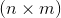

# torch.sparse

> 译者：[hijkzzz](https://github.com/hijkzzz)

警告

这个API目前还处于试验阶段, 可能在不久的将来会发生变化. 

Torch支持COO(rdinate )格式的稀疏张量, 这可以有效地存储和处理大多数元素为零的张量. 

稀疏张量表示为一对稠密张量:一个值张量和一个二维指标张量. 一个稀疏张量可以通过提供这两个张量, 以及稀疏张量的大小来构造(从这些张量是无法推导出来的!)假设我们要定义一个稀疏张量, 它的分量3在(0,2)处, 分量4在(1,0)处, 分量5在(1,2)处, 然后我们可以这样写

```py
>>> i = torch.LongTensor([[0, 1, 1],
 [2, 0, 2]])
>>> v = torch.FloatTensor([3, 4, 5])
>>> torch.sparse.FloatTensor(i, v, torch.Size([2,3])).to_dense()
 0  0  3
 4  0  5
[torch.FloatTensor of size 2x3]

```

注意, LongTensor的输入不是索引元组的列表. 如果你想这样写你的指标, 你应该在把它们传递给稀疏构造函数之前进行转置:

```py
>>> i = torch.LongTensor([[0, 2], [1, 0], [1, 2]])
>>> v = torch.FloatTensor([3,      4,      5    ])
>>> torch.sparse.FloatTensor(i.t(), v, torch.Size([2,3])).to_dense()
 0  0  3
 4  0  5
[torch.FloatTensor of size 2x3]

```

也可以构造混合稀疏张量, 其中只有前n个维度是稀疏的, 其余维度是密集的. 

```py
>>> i = torch.LongTensor([[2, 4]])
>>> v = torch.FloatTensor([[1, 3], [5, 7]])
>>> torch.sparse.FloatTensor(i, v).to_dense()
 0  0
 0  0
 1  3
 0  0
 5  7
[torch.FloatTensor of size 5x2]

```

可以通过指定其大小来构造空的稀疏张量：

```py
>>> torch.sparse.FloatTensor(2, 3)
SparseFloatTensor of size 2x3 with indices:
[torch.LongTensor with no dimension]
and values:
[torch.FloatTensor with no dimension]

```

```py
SparseTensor 具有以下不变量:
```

1.  sparse_dim + dense_dim = len(SparseTensor.shape)
2.  SparseTensor._indices().shape = (sparse_dim, nnz)
3.  SparseTensor._values().shape = (nnz, SparseTensor.shape[sparse_dim:])

因为SparseTensor._indices()总是一个二维张量, 最小的sparse_dim = 1. 因此, sparse_dim = 0的稀疏张量的表示就是一个稠密张量. 

注意

我们的稀疏张量格式允许_uncoalesced(未合并)_ 的稀疏张量, 其中索引中可能有重复的坐标;在这种情况下, 解释是索引处的值是所有重复值项的和. _uncoalesced_ 张量允许我们更有效地实现某些运算符. 

在大多数情况下, 你不需要关心一个稀疏张量是否coalesced(合并), 因为大多数操作在给出一个coalesced或uncoalesced稀疏张量的情况下都是一样的. 然而, 有两种情况您可能需要注意. 

第一, 如果您重复执行可以产生重复项的操作 (例如, [`torch.sparse.FloatTensor.add()`](#torch.sparse.FloatTensor.add "torch.sparse.FloatTensor.add")), 你应该偶尔将稀疏张量coalesced一起, 以防止它们变得太大.

第二, 一些运算符将根据它们是否coalesced产生不同的值 (例如, [`torch.sparse.FloatTensor._values()`](#torch.sparse.FloatTensor._values "torch.sparse.FloatTensor._values") and [`torch.sparse.FloatTensor._indices()`](#torch.sparse.FloatTensor._indices "torch.sparse.FloatTensor._indices"), 以及 [`torch.Tensor.sparse_mask()`](tensors.html#torch.Tensor.sparse_mask "torch.Tensor.sparse_mask")). 这些操作符以下划线作为前缀, 表示它们揭示了内部实现细节, 应该小心使用, 因为使用合并稀疏张量的代码可能无法使用未合并稀疏张量;一般来说, 在使用这些操作符之前显式地合并是最安全的. 

例如, 假设我们想通过直接操作[`torch.sparse.FloatTensor._values()`](#torch.sparse.FloatTensor._values "torch.sparse.FloatTensor._values").来实现一个操作符.标量乘法可以用很明显的方法实现, 因为乘法分布于加法之上;但是, 平方根不能直接实现, 因为`sqrt(a + b) != sqrt(a) + sqrt(b)`(如果给定一个uncoalesced的张量, 就会计算出这个结果). 

```py
class torch.sparse.FloatTensor
```

```py
add()
```

```py
add_()
```

```py
clone()
```

```py
dim()
```

```py
div()
```

```py
div_()
```

```py
get_device()
```

```py
hspmm()
```

```py
mm()
```

```py
mul()
```

```py
mul_()
```

```py
narrow_copy()
```

```py
resizeAs_()
```

```py
size()
```

```py
spadd()
```

```py
spmm()
```

```py
sspaddmm()
```

```py
sspmm()
```

```py
sub()
```

```py
sub_()
```

```py
t_()
```

```py
toDense()
```

```py
transpose()
```

```py
transpose_()
```

```py
zero_()
```

```py
coalesce()
```

```py
is_coalesced()
```

```py
_indices()
```

```py
_values()
```

```py
_nnz()
```

## 函数

```py
torch.sparse.addmm(mat, mat1, mat2, beta=1, alpha=1)
```

这个函数和 [`torch.addmm()`](torch.html#torch.addmm "torch.addmm") 在`forward`中做同样的事情, 除了它支持稀疏矩阵`mat1` 的 `backward`. `mat1`应具有 `sparse_dim = 2`.  请注意, `mat1`的梯度是一个合并的稀疏张量.

参数: 

*   **mat** ([_Tensor_](tensors.html#torch.Tensor "torch.Tensor")) – 被相加的稠密矩阵
*   **mat1** (_SparseTensor_) – 被相乘的稀疏矩阵
*   **mat2** ([_Tensor_](tensors.html#torch.Tensor "torch.Tensor")) – 被相乘的稠密矩阵
*   **beta** (_Number__,_ _optional_) – 乘数 `mat` ()
*   **alpha** (_Number__,_ _optional_) – 乘数  ()


```py
torch.sparse.mm(mat1, mat2)
```

执行稀疏矩阵`mat1` 和 稠密矩阵 `mat2`的矩阵乘法. 类似于 [`torch.mm()`](torch.html#torch.mm "torch.mm"), 如果 `mat1` 是一个  tensor, `mat2` 是一个  tensor, 输出将会是  稠密的 tensor. `mat1` 应具有 `sparse_dim = 2`. 此函数也支持两个矩阵的向后. 请注意, `mat1`的梯度是一个合并的稀疏张量

参数: 

*   **mat1** (_SparseTensor_) – 第一个要相乘的稀疏矩阵
*   **mat2** ([_Tensor_](tensors.html#torch.Tensor "torch.Tensor")) – 第二个要相乘的稠密矩阵


例子:

```py
>>> a = torch.randn(2, 3).to_sparse().requires_grad_(True)
>>> a
tensor(indices=tensor([[0, 0, 0, 1, 1, 1],
 [0, 1, 2, 0, 1, 2]]),
 values=tensor([ 1.5901,  0.0183, -0.6146,  1.8061, -0.0112,  0.6302]),
 size=(2, 3), nnz=6, layout=torch.sparse_coo, requires_grad=True)

>>> b = torch.randn(3, 2, requires_grad=True)
>>> b
tensor([[-0.6479,  0.7874],
 [-1.2056,  0.5641],
 [-1.1716, -0.9923]], requires_grad=True)

>>> y = torch.sparse.mm(a, b)
>>> y
tensor([[-0.3323,  1.8723],
 [-1.8951,  0.7904]], grad_fn=<SparseAddmmBackward>)
>>> y.sum().backward()
>>> a.grad
tensor(indices=tensor([[0, 0, 0, 1, 1, 1],
 [0, 1, 2, 0, 1, 2]]),
 values=tensor([ 0.1394, -0.6415, -2.1639,  0.1394, -0.6415, -2.1639]),
 size=(2, 3), nnz=6, layout=torch.sparse_coo)

```

```py
torch.sparse.sum(input, dim=None, dtype=None)
```

返回给定维度`dim`中每行SparseTensor `input`的总和. 如果 :attr::`dim` 是一个维度的`list`, reduce将在全部给定维度进行.如果包括全部的 `sparse_dim`, 此方法将返回 Tensor 代替 SparseTensor.

所有被求和的 `dim` 将被 squeezed (see [`torch.squeeze()`](torch.html#torch.squeeze "torch.squeeze")),导致速出 tensor 的 :attr::`dim` 小于 `input`.

backward 过程中, 仅仅 `input` 的 `nnz` 位置被反向传播.  请注意, `input`的梯度是合并的. 

参数: 

*   **input** ([_Tensor_](tensors.html#torch.Tensor "torch.Tensor")) – t输入 SparseTensor
*   **dim** ([_int_](https://docs.python.org/3/library/functions.html#int "(in Python v3.7)") _or_ _tuple of python:ints_) – 维度或者维度列表. Default: 所有维度.
*   **dtype** (`torch.dtype`, optional) – 返回 Tensor 的数据类型. 默认值: dtype 和 `input` 一致.


例子:

```py
>>> nnz = 3
>>> dims = [5, 5, 2, 3]
>>> I = torch.cat([torch.randint(0, dims[0], size=(nnz,)),
 torch.randint(0, dims[1], size=(nnz,))], 0).reshape(2, nnz)
>>> V = torch.randn(nnz, dims[2], dims[3])
>>> size = torch.Size(dims)
>>> S = torch.sparse_coo_tensor(I, V, size)
>>> S
tensor(indices=tensor([[2, 0, 3],
 [2, 4, 1]]),
 values=tensor([[[-0.6438, -1.6467,  1.4004],
 [ 0.3411,  0.0918, -0.2312]],

 [[ 0.5348,  0.0634, -2.0494],
 [-0.7125, -1.0646,  2.1844]],

 [[ 0.1276,  0.1874, -0.6334],
 [-1.9682, -0.5340,  0.7483]]]),
 size=(5, 5, 2, 3), nnz=3, layout=torch.sparse_coo)

# when sum over only part of sparse_dims, return a SparseTensor
>>> torch.sparse.sum(S, [1, 3])
tensor(indices=tensor([[0, 2, 3]]),
 values=tensor([[-1.4512,  0.4073],
 [-0.8901,  0.2017],
 [-0.3183, -1.7539]]),
 size=(5, 2), nnz=3, layout=torch.sparse_coo)

# when sum over all sparse dim, return a dense Tensor
# with summed dims squeezed
>>> torch.sparse.sum(S, [0, 1, 3])
tensor([-2.6596, -1.1450])

```

