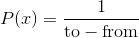

# torch.Tensor

> 译者：[hijkzzz](https://github.com/hijkzzz)

[`torch.Tensor`](#torch.Tensor "torch.Tensor") 是一种包含单一数据类型元素的多维矩阵.

Torch定义了八种CPU张量类型和八种GPU张量类型：

| Data type | dtype | CPU tensor | GPU tensor |
| --- | --- | --- | --- |
| 32-bit floating point | `torch.float32` or `torch.float` | `torch.FloatTensor` | `torch.cuda.FloatTensor` |
| 64-bit floating point | `torch.float64` or `torch.double` | `torch.DoubleTensor` | `torch.cuda.DoubleTensor` |
| 16-bit floating point | `torch.float16` or `torch.half` | `torch.HalfTensor` | `torch.cuda.HalfTensor` |
| 8-bit integer (unsigned) | `torch.uint8` | [`torch.ByteTensor`](#torch.ByteTensor "torch.ByteTensor") | `torch.cuda.ByteTensor` |
| 8-bit integer (signed) | `torch.int8` | `torch.CharTensor` | `torch.cuda.CharTensor` |
| 16-bit integer (signed) | `torch.int16` or `torch.short` | `torch.ShortTensor` | `torch.cuda.ShortTensor` |
| 32-bit integer (signed) | `torch.int32` or `torch.int` | `torch.IntTensor` | `torch.cuda.IntTensor` |
| 64-bit integer (signed) | `torch.int64` or `torch.long` | `torch.LongTensor` | `torch.cuda.LongTensor` |

[`torch.Tensor`](#torch.Tensor "torch.Tensor") 是默认的tensor类型 (`torch.FloatTensor`) 的简称.

Tensor 可以用[`torch.tensor()`](torch.html#torch.tensor "torch.tensor")转换Python的 [`list`](https://docs.python.org/3/library/stdtypes.html#list "(in Python v3.7)") 或序列​​生成：

```py
>>> torch.tensor([[1., -1.], [1., -1.]])
tensor([[ 1.0000, -1.0000],
 [ 1.0000, -1.0000]])
>>> torch.tensor(np.array([[1, 2, 3], [4, 5, 6]]))
tensor([[ 1,  2,  3],
 [ 4,  5,  6]])

```

警告

[`torch.tensor()`](torch.html#torch.tensor "torch.tensor") 总是拷贝 `data`. 如果你有一个 Tensor `data` 并且仅仅想改变它的 `requires_grad` 属性, 可用 [`requires_grad_()`](#torch.Tensor.requires_grad_ "torch.Tensor.requires_grad_") or [`detach()`](autograd.html#torch.Tensor.detach "torch.Tensor.detach") 来避免拷贝. 如果你有一个 numpy 数组并且想避免拷贝, 请使用 [`torch.as_tensor()`](torch.html#torch.as_tensor "torch.as_tensor").

指定数据类型的Tensor可以通过传递参数 [`torch.dtype`](tensor_attributes.html#torch.torch.dtype "torch.torch.dtype") 和/或者  [`torch.device`](tensor_attributes.html#torch.torch.device "torch.torch.device") 到构造函数生成：

```py
>>> torch.zeros([2, 4], dtype=torch.int32)
tensor([[ 0,  0,  0,  0],
 [ 0,  0,  0,  0]], dtype=torch.int32)
>>> cuda0 = torch.device('cuda:0')
>>> torch.ones([2, 4], dtype=torch.float64, device=cuda0)
tensor([[ 1.0000,  1.0000,  1.0000,  1.0000],
 [ 1.0000,  1.0000,  1.0000,  1.0000]], dtype=torch.float64, device='cuda:0')

```
Tensor的内容可以通过Python索引或者切片访问以及修改：

```py
>>> x = torch.tensor([[1, 2, 3], [4, 5, 6]])
>>> print(x[1][2])
tensor(6)
>>> x[0][1] = 8
>>> print(x)
tensor([[ 1,  8,  3],
 [ 4,  5,  6]])

```

使用 [`torch.Tensor.item()`](#torch.Tensor.item "torch.Tensor.item") 从只有一个值的Tensor中获取Python Number：

```py
>>> x = torch.tensor([[1]])
>>> x
tensor([[ 1]])
>>> x.item()
1
>>> x = torch.tensor(2.5)
>>> x
tensor(2.5000)
>>> x.item()
2.5

```

Tensor可以通过参数 `requires_grad=True` 创建, 这样 [`torch.autograd`](autograd.html#module-torch.autograd "torch.autograd") 会记录相关的运算实现自动求导.

```py
>>> x = torch.tensor([[1., -1.], [1., 1.]], requires_grad=True)
>>> out = x.pow(2).sum()
>>> out.backward()
>>> x.grad
tensor([[ 2.0000, -2.0000],
 [ 2.0000,  2.0000]])

```

每一个tensor都有一个相应的 `torch.Storage` 保存其数据. tensor 类提供了一个多维的、[strided](https://en.wikipedia.org/wiki/Stride_of_an_array)视图, 并定义了数值操作.

注意

更多关于 [`torch.dtype`](tensor_attributes.html#torch.torch.dtype "torch.torch.dtype"), [`torch.device`](tensor_attributes.html#torch.torch.device "torch.torch.device"), 和 [`torch.layout`](tensor_attributes.html#torch.torch.layout "torch.torch.layout")  等 [`torch.Tensor`](#torch.Tensor "torch.Tensor")的属性, 见 [Tensor Attributes](tensor_attributes.html#tensor-attributes-doc).

注意

注意：修改tensor的方法可以用一个下划线后缀来标示.比如, `torch.FloatTensor.abs_()` 会在原地计算绝对值并返回修改的张量, 而 `torch.FloatTensor.abs()` 将会在新张量中计算结果.

注意

为了改变已有的 tensor 的 [`torch.device`](tensor_attributes.html#torch.torch.device "torch.torch.device") 和/或者 [`torch.dtype`](tensor_attributes.html#torch.torch.dtype "torch.torch.dtype"), 考虑使用 [`to()`](#torch.Tensor.to "torch.Tensor.to") 方法.

```py
class torch.Tensor
```

这里有少数几种生成Tensor的方法, 取决于你的实际情况.

*  从已经存在的数据生成, 用 [`torch.tensor()`](torch.html#torch.tensor "torch.tensor").
*  生成特殊尺寸的Tensor, 用 `torch.*` creation ops (见 [Creation Ops](torch.html#tensor-creation-ops)).
*   生成与其它Tensor尺寸相同的Tensor (并且数据类型相同), 用 `torch.*_like` creation ops (见 [Creation Ops](torch.html#tensor-creation-ops)).
*   生成与其它Tesor数据类型相同但是尺寸不同的Tensor, 用 `tensor.new_*` creation ops.

```py
new_tensor(data, dtype=None, device=None, requires_grad=False) → Tensor
```

返回一个新的Tensor用 `data` 作为tensor data.默认情况下, 返回的Tensor有相同的 [`torch.dtype`](tensor_attributes.html#torch.torch.dtype "torch.torch.dtype") 和 [`torch.device`](tensor_attributes.html#torch.torch.device "torch.torch.device") .

警告

[`new_tensor()`](#torch.Tensor.new_tensor "torch.Tensor.new_tensor") 总是拷贝 `data`. 如果 你有一个 Tensor `data` 并且想避免拷贝, 使用 [`torch.Tensor.requires_grad_()`](#torch.Tensor.requires_grad_ "torch.Tensor.requires_grad_") 或者 [`torch.Tensor.detach()`](autograd.html#torch.Tensor.detach "torch.Tensor.detach"). 如果你有一个 numpy 数组并且想避免拷贝, 使用 [`torch.from_numpy()`](torch.html#torch.from_numpy "torch.from_numpy").

警告

当 data 是一个 tensor `x`, [`new_tensor()`](#torch.Tensor.new_tensor "torch.Tensor.new_tensor") 读取 x 的 ‘data’ 并且创建一个叶子变量. 因此 `tensor.new_tensor(x)` 等价于 `x.clone().detach()` 并且 `tensor.new_tensor(x, requires_grad=True)` 等价于 `x.clone().detach().requires_grad_(True)`. 推荐使用 `clone()` 和 `detach()`.

参数: 

*   **data** (_array_like_) – 返回的 Tensor 拷贝 `data`.
*   **dtype** ([`torch.dtype`](tensor_attributes.html#torch.torch.dtype "torch.torch.dtype"), 可选) – 期望返回的Tensor的数据类型. 默认值: 如果是 None, 等于 [`torch.dtype`](tensor_attributes.html#torch.torch.dtype "torch.torch.dtype").
*   **device** ([`torch.device`](tensor_attributes.html#torch.torch.device "torch.torch.device"), 可选) – 期望返回的Tesor所在设备. 默认值: 如果是 None, 等于 [`torch.device`](tensor_attributes.html#torch.torch.device "torch.torch.device").
*   **requires_grad** ([_bool_](https://docs.python.org/3/library/functions.html#bool "(in Python v3.7)")_,_ 可选) – 是否为自动求导记录相关的运算. 默认值: `False`.


例子:

```py
>>> tensor = torch.ones((2,), dtype=torch.int8)
>>> data = [[0, 1], [2, 3]]
>>> tensor.new_tensor(data)
tensor([[ 0,  1],
 [ 2,  3]], dtype=torch.int8)

```

```py
new_full(size, fill_value, dtype=None, device=None, requires_grad=False) → Tensor
```

返回一个Tesnor的尺寸等于 [`size`](#torch.Tensor.size "torch.Tensor.size") 用 `fill_value`填充. 默认情况下, 返回的 Tensor 具有与此Tensor相同的 [`torch.dtype`](tensor_attributes.html#torch.torch.dtype "torch.torch.dtype") 和 [`torch.device`](tensor_attributes.html#torch.torch.device "torch.torch.device").

参数: 

*   **fill_value** (_scalar_) – 用于填充的数值.
*   **dtype** ([`torch.dtype`](tensor_attributes.html#torch.torch.dtype "torch.torch.dtype"), 可选) – 期望返回的Tensor的数据类型. 默认值: 如果是 None, 等于 [`torch.dtype`](tensor_attributes.html#torch.torch.dtype "torch.torch.dtype").
*   **device** ([`torch.device`](tensor_attributes.html#torch.torch.device "torch.torch.device"), 可选) – 期望返回的Tesor所在设备. 默认值: 如果是 None, 等于 [`torch.device`](tensor_attributes.html#torch.torch.device "torch.torch.device").
*   **requires_grad** ([_bool_](https://docs.python.org/3/library/functions.html#bool "(in Python v3.7)")_,_ 可选) – 是否为自动求导记录相关的运算. 默认值: `False`.


例子:

```py
>>> tensor = torch.ones((2,), dtype=torch.float64)
>>> tensor.new_full((3, 4), 3.141592)
tensor([[ 3.1416,  3.1416,  3.1416,  3.1416],
 [ 3.1416,  3.1416,  3.1416,  3.1416],
 [ 3.1416,  3.1416,  3.1416,  3.1416]], dtype=torch.float64)

```

```py
new_empty(size, dtype=None, device=None, requires_grad=False) → Tensor
```

返回一个Tesnor的尺寸等于 [`size`](#torch.Tensor.size "torch.Tensor.size") 用 `未初始化的值`填充. 默认情况下, 返回的 Tensor 具有与此Tensor相同的 [`torch.dtype`](tensor_attributes.html#torch.torch.dtype "torch.torch.dtype") 和 [`torch.device`](tensor_attributes.html#torch.torch.device "torch.torch.device").


Parameters: 

*   **dtype** ([`torch.dtype`](tensor_attributes.html#torch.torch.dtype "torch.torch.dtype"), 可选) – 期望返回的Tensor的数据类型. 默认值: 如果是 None, 等于 [`torch.dtype`](tensor_attributes.html#torch.torch.dtype "torch.torch.dtype").
*   **device** ([`torch.device`](tensor_attributes.html#torch.torch.device "torch.torch.device"), 可选) – 期望返回的Tesor所在设备. 默认值: 如果是 None, 等于 [`torch.device`](tensor_attributes.html#torch.torch.device "torch.torch.device").
*   **requires_grad** ([_bool_](https://docs.python.org/3/library/functions.html#bool "(in Python v3.7)")_,_ 可选) – 是否为自动求导记录相关的运算. 默认值: `False`.


Example:

```py
>>> tensor = torch.ones(())
>>> tensor.new_empty((2, 3))
tensor([[ 5.8182e-18,  4.5765e-41, -1.0545e+30],
 [ 3.0949e-41,  4.4842e-44,  0.0000e+00]])

```

```py
new_ones(size, dtype=None, device=None, requires_grad=False) → Tensor
```

返回一个Tesnor的尺寸等于 [`size`](#torch.Tensor.size "torch.Tensor.size") 用 `1`填充. 默认情况下, 返回的 Tensor 具有与此Tensor相同的 [`torch.dtype`](tensor_attributes.html#torch.torch.dtype "torch.torch.dtype") 和 [`torch.device`](tensor_attributes.html#torch.torch.device "torch.torch.device").

Parameters: 

*   **size** (_int..._) – list, tuple, 或者 `torch.Size` 定义了输出Tensor的形状.
*   **dtype** ([`torch.dtype`](tensor_attributes.html#torch.torch.dtype "torch.torch.dtype"), 可选) – 期望返回的Tensor的数据类型. 默认值: 如果是 None, 等于 [`torch.dtype`](tensor_attributes.html#torch.torch.dtype "torch.torch.dtype").
*   **device** ([`torch.device`](tensor_attributes.html#torch.torch.device "torch.torch.device"), 可选) – 期望返回的Tesor所在设备. 默认值: 如果是 None, 等于 [`torch.device`](tensor_attributes.html#torch.torch.device "torch.torch.device").
*   **requires_grad** ([_bool_](https://docs.python.org/3/library/functions.html#bool "(in Python v3.7)")_,_ 可选) – 是否为自动求导记录相关的运算. 默认值: `False`.


例子:

```py
>>> tensor = torch.tensor((), dtype=torch.int32)
>>> tensor.new_ones((2, 3))
tensor([[ 1,  1,  1],
 [ 1,  1,  1]], dtype=torch.int32)

```

```py
new_zeros(size, dtype=None, device=None, requires_grad=False) → Tensor
```

返回一个Tesnor的尺寸等于 [`size`](#torch.Tensor.size "torch.Tensor.size") 用 `0`填充. 默认情况下, 返回的 Tensor 具有与此Tensor相同的 [`torch.dtype`](tensor_attributes.html#torch.torch.dtype "torch.torch.dtype") 和 [`torch.device`](tensor_attributes.html#torch.torch.device "torch.torch.device").

参数: 

*   **size** (_int..._) – list, tuple, 或者 `torch.Size` 定义了输出Tensor的形状.
*   **dtype** ([`torch.dtype`](tensor_attributes.html#torch.torch.dtype "torch.torch.dtype"), 可选) – 期望返回的Tensor的数据类型. 默认值: 如果是 None, 等于 [`torch.dtype`](tensor_attributes.html#torch.torch.dtype "torch.torch.dtype").
*   **device** ([`torch.device`](tensor_attributes.html#torch.torch.device "torch.torch.device"), 可选) – 期望返回的Tesor所在设备. 默认值: 如果是 None, 等于 [`torch.device`](tensor_attributes.html#torch.torch.device "torch.torch.device").
*   **requires_grad** ([_bool_](https://docs.python.org/3/library/functions.html#bool "(in Python v3.7)")_,_ 可选) – 是否为自动求导记录相关的运算. 默认值: `False`.


例子:

```py
>>> tensor = torch.tensor((), dtype=torch.float64)
>>> tensor.new_zeros((2, 3))
tensor([[ 0.,  0.,  0.],
 [ 0.,  0.,  0.]], dtype=torch.float64)

```

```py
is_cuda
```

`True` 如果 Tensor 在 GPU 上, 否则 `False`.

```py
device
```

 [`torch.device`](tensor_attributes.html#torch.torch.device "torch.torch.device") Tensor 所在的设备.

```py
abs() → Tensor
```

见 [`torch.abs()`](torch.html#torch.abs "torch.abs")

```py
abs_() → Tensor
```

原地版本的 [`abs()`](#torch.Tensor.abs "torch.Tensor.abs")

```py
acos() → Tensor
```

见 [`torch.acos()`](torch.html#torch.acos "torch.acos")

```py
acos_() → Tensor
```

原地版本的 [`acos()`](#torch.Tensor.acos "torch.Tensor.acos")

```py
add(value) → Tensor
```

add(value=1, other) -&gt; Tensor

见 [`torch.add()`](torch.html#torch.add "torch.add")

```py
add_(value) → Tensor
```

add_(value=1, other) -&gt; Tensor

原地版本的 [`add()`](#torch.Tensor.add "torch.Tensor.add")

```py
addbmm(beta=1, mat, alpha=1, batch1, batch2) → Tensor
```

见 [`torch.addbmm()`](torch.html#torch.addbmm "torch.addbmm")

```py
addbmm_(beta=1, mat, alpha=1, batch1, batch2) → Tensor
```

原地版本的 [`addbmm()`](#torch.Tensor.addbmm "torch.Tensor.addbmm")

```py
addcdiv(value=1, tensor1, tensor2) → Tensor
```

见 [`torch.addcdiv()`](torch.html#torch.addcdiv "torch.addcdiv")

```py
addcdiv_(value=1, tensor1, tensor2) → Tensor
```

原地版本的 [`addcdiv()`](#torch.Tensor.addcdiv "torch.Tensor.addcdiv")

```py
addcmul(value=1, tensor1, tensor2) → Tensor
```

见 [`torch.addcmul()`](torch.html#torch.addcmul "torch.addcmul")

```py
addcmul_(value=1, tensor1, tensor2) → Tensor
```

原地版本的 [`addcmul()`](#torch.Tensor.addcmul "torch.Tensor.addcmul")

```py
addmm(beta=1, mat, alpha=1, mat1, mat2) → Tensor
```

见 [`torch.addmm()`](torch.html#torch.addmm "torch.addmm")

```py
addmm_(beta=1, mat, alpha=1, mat1, mat2) → Tensor
```

原地版本的 [`addmm()`](#torch.Tensor.addmm "torch.Tensor.addmm")

```py
addmv(beta=1, tensor, alpha=1, mat, vec) → Tensor
```

见 [`torch.addmv()`](torch.html#torch.addmv "torch.addmv")

```py
addmv_(beta=1, tensor, alpha=1, mat, vec) → Tensor
```

原地版本的 [`addmv()`](#torch.Tensor.addmv "torch.Tensor.addmv")

```py
addr(beta=1, alpha=1, vec1, vec2) → Tensor
```

见 [`torch.addr()`](torch.html#torch.addr "torch.addr")

```py
addr_(beta=1, alpha=1, vec1, vec2) → Tensor
```

原地版本的 [`addr()`](#torch.Tensor.addr "torch.Tensor.addr")

```py
allclose(other, rtol=1e-05, atol=1e-08, equal_nan=False) → Tensor
```

见 [`torch.allclose()`](torch.html#torch.allclose "torch.allclose")

```py
apply_(callable) → Tensor
```

应用函数 `callable` 到Tensor中的每一个元素, 用 `callable`的返回值替换每一个元素.

注意

这个函数仅仅能在CPU上工作, 并且不要用于需要高性能的代码区域.

```py
argmax(dim=None, keepdim=False)
```

见 [`torch.argmax()`](torch.html#torch.argmax "torch.argmax")

```py
argmin(dim=None, keepdim=False)
```

见 [`torch.argmin()`](torch.html#torch.argmin "torch.argmin")

```py
asin() → Tensor
```

见 [`torch.asin()`](torch.html#torch.asin "torch.asin")

```py
asin_() → Tensor
```

原地版本的 [`asin()`](#torch.Tensor.asin "torch.Tensor.asin")

```py
atan() → Tensor
```

见 [`torch.atan()`](torch.html#torch.atan "torch.atan")

```py
atan2(other) → Tensor
```

见 [`torch.atan2()`](torch.html#torch.atan2 "torch.atan2")

```py
atan2_(other) → Tensor
```

原地版本的 [`atan2()`](#torch.Tensor.atan2 "torch.Tensor.atan2")

```py
atan_() → Tensor
```

原地版本的 [`atan()`](#torch.Tensor.atan "torch.Tensor.atan")

```py
baddbmm(beta=1, alpha=1, batch1, batch2) → Tensor
```

见 [`torch.baddbmm()`](torch.html#torch.baddbmm "torch.baddbmm")

```py
baddbmm_(beta=1, alpha=1, batch1, batch2) → Tensor
```

原地版本的 [`baddbmm()`](#torch.Tensor.baddbmm "torch.Tensor.baddbmm")

```py
bernoulli(*, generator=None) → Tensor
```

返回一个Tensor, 每一个  都是独立采样于 . `self` 必须是浮点型 `dtype`, 并且返回值有相同的 `dtype`.

见 [`torch.bernoulli()`](torch.html#torch.bernoulli "torch.bernoulli")

```py
bernoulli_()
```

```py
bernoulli_(p=0.5, *, generator=None) → Tensor
```

 从  独立采样填充 `self` 的每一个位置.`self` 可以是整型 `dtype`.

```py
bernoulli_(p_tensor, *, generator=None) → Tensor
```

`p_tensor` 必须是一个包含概率的 Tensor 用于取得二元随机数.

`self` tensor 的  元素将会被设置为采样于  的值.

`self` 可以有整型 `dtype`, 但是 :attr`p_tensor` 必须有浮点型 `dtype`.

可参考 [`bernoulli()`](#torch.Tensor.bernoulli "torch.Tensor.bernoulli") and [`torch.bernoulli()`](torch.html#torch.bernoulli "torch.bernoulli")

```py
bmm(batch2) → Tensor
```

见 [`torch.bmm()`](torch.html#torch.bmm "torch.bmm")

```py
byte() → Tensor
```

`self.byte()` is equivalent to `self.to(torch.uint8)`. See [`to()`](#torch.Tensor.to "torch.Tensor.to").

```py
btrifact(info=None, pivot=True)
```

见 [`torch.btrifact()`](torch.html#torch.btrifact "torch.btrifact")

```py
btrifact_with_info(pivot=True) -> (Tensor, Tensor, Tensor)
```

见 [`torch.btrifact_with_info()`](torch.html#torch.btrifact_with_info "torch.btrifact_with_info")

```py
btrisolve(LU_data, LU_pivots) → Tensor
```

见 [`torch.btrisolve()`](torch.html#torch.btrisolve "torch.btrisolve")

```py
cauchy_(median=0, sigma=1, *, generator=None) → Tensor
```

用取自 Cauchy 分布得值填充Tensor:


```py
ceil() → Tensor
```

见 [`torch.ceil()`](torch.html#torch.ceil "torch.ceil")

```py
ceil_() → Tensor
```

原地版本的 [`ceil()`](#torch.Tensor.ceil "torch.Tensor.ceil")

```py
char() → Tensor
```

`self.char()` 等价于 `self.to(torch.int8)`. 见 [`to()`](#torch.Tensor.to "torch.Tensor.to").

```py
cholesky(upper=False) → Tensor
```

见 [`torch.cholesky()`](torch.html#torch.cholesky "torch.cholesky")

```py
chunk(chunks, dim=0) → List of Tensors
```

见 [`torch.chunk()`](torch.html#torch.chunk "torch.chunk")

```py
clamp(min, max) → Tensor
```

见 [`torch.clamp()`](torch.html#torch.clamp "torch.clamp")

```py
clamp_(min, max) → Tensor
```

原地版本的 [`clamp()`](#torch.Tensor.clamp "torch.Tensor.clamp")

```py
clone() → Tensor
```

返回一份拷贝的 `self` tensor. 这份拷贝有 `self` 相同的数据和类型.

注意

与`copy_()`不同, 此函数会被记录在计算图中. 传给克隆tensor的梯度将传播到原始tensor.

```py
contiguous() → Tensor
```

返回一个连续的得Tensor, 其data与 `self` 相同. 如果 `self` tensor 是连续的, 此函数返回 `self` tensor 自身.

```py
copy_(src, non_blocking=False) → Tensor
```

从 `src` 拷贝元素到 `self` tensor 然后返回 `self`.

`src` tensor 必须与 `self` tensor 是 [broadcastable](notes/broadcasting.html#broadcasting-semantics). 但数据类型可以不同, 所在的设备也可以不同.

参数: 

*   **src** ([_Tensor_](#torch.Tensor "torch.Tensor")) – 源 tensor
*   **non_blocking** ([_bool_](https://docs.python.org/3/library/functions.html#bool "(in Python v3.7)")) – 如果是 `True` 并且这次复制在 CPU 和 GPU 之间进行, 这次复制将会是异步的. 其他情况则没有影响.


```py
cos() → Tensor
```

见 [`torch.cos()`](torch.html#torch.cos "torch.cos")

```py
cos_() → Tensor
```

原地版本的 [`cos()`](#torch.Tensor.cos "torch.Tensor.cos")

```py
cosh() → Tensor
```

见 [`torch.cosh()`](torch.html#torch.cosh "torch.cosh")

```py
cosh_() → Tensor
```

原地版本的 [`cosh()`](#torch.Tensor.cosh "torch.Tensor.cosh")

```py
cpu() → Tensor
```

返回一个拷贝对象于 CPU 内存中.

如果这个对象已经在 CPU 内存中, 并且在者正确的设备上, 那么将会返回其本身.

```py
cross(other, dim=-1) → Tensor
```

见 [`torch.cross()`](torch.html#torch.cross "torch.cross")

```py
cuda(device=None, non_blocking=False) → Tensor
```

返回一个拷贝对象于 CUDA 内存中.

如果这个对象已经在 CUDA 内存中, 并且在者正确的设备上, 那么将会返回其本身.

参数: 

*   **device** ([`torch.device`](tensor_attributes.html#torch.torch.device "torch.torch.device")) –目标GPU设备. 默认值是当前GPU.
*   **non_blocking** ([_bool_](https://docs.python.org/3/library/functions.html#bool "(in Python v3.7)")) – 如果是 `True` 并且源在pinned memory中, 这次拷贝将是异步的.否则此参数没有影响. 默认值: `False`.


```py
cumprod(dim, dtype=None) → Tensor
```

见 [`torch.cumprod()`](torch.html#torch.cumprod "torch.cumprod")

```py
cumsum(dim, dtype=None) → Tensor
```

见 [`torch.cumsum()`](torch.html#torch.cumsum "torch.cumsum")

```py
data_ptr() → int
```

返回 `self` tensor 的第一个元素的指针.

```py
det() → Tensor
```

见 [`torch.det()`](torch.html#torch.det "torch.det")

```py
diag(diagonal=0) → Tensor
```

见 [`torch.diag()`](torch.html#torch.diag "torch.diag")

```py
diag_embed(offset=0, dim1=-2, dim2=-1) → Tensor
```

见 [`torch.diag_embed()`](torch.html#torch.diag_embed "torch.diag_embed")

```py
dim() → int
```

返回 `self` tensor 的维度.

```py
dist(other, p=2) → Tensor
```

见 [`torch.dist()`](torch.html#torch.dist "torch.dist")

```py
div(value) → Tensor
```

见 [`torch.div()`](torch.html#torch.div "torch.div")

```py
div_(value) → Tensor
```

原地版本的 [`div()`](#torch.Tensor.div "torch.Tensor.div")

```py
dot(tensor2) → Tensor
```

见 [`torch.dot()`](torch.html#torch.dot "torch.dot")

```py
double() → Tensor
```

`self.double()` 等价于 `self.to(torch.float64)`. 见 [`to()`](#torch.Tensor.to "torch.Tensor.to").

```py
eig(eigenvectors=False) -> (Tensor, Tensor)
```

见 [`torch.eig()`](torch.html#torch.eig "torch.eig")

```py
element_size() → int
```

返回每个元素占用的字节数

Example:

```py
>>> torch.tensor([]).element_size()
4
>>> torch.tensor([], dtype=torch.uint8).element_size()
1

```

```py
eq(other) → Tensor
```

见 [`torch.eq()`](torch.html#torch.eq "torch.eq")

```py
eq_(other) → Tensor
```

原地版本的 [`eq()`](#torch.Tensor.eq "torch.Tensor.eq")

```py
equal(other) → bool
```

见 [`torch.equal()`](torch.html#torch.equal "torch.equal")

```py
erf() → Tensor
```

见 [`torch.erf()`](torch.html#torch.erf "torch.erf")

```py
erf_() → Tensor
```

原地版本的 [`erf()`](#torch.Tensor.erf "torch.Tensor.erf")

```py
erfc() → Tensor
```

见 [`torch.erfc()`](torch.html#torch.erfc "torch.erfc")

```py
erfc_() → Tensor
```

原地版本的 [`erfc()`](#torch.Tensor.erfc "torch.Tensor.erfc")

```py
erfinv() → Tensor
```

见 [`torch.erfinv()`](torch.html#torch.erfinv "torch.erfinv")

```py
erfinv_() → Tensor
```

原地版本的 [`erfinv()`](#torch.Tensor.erfinv "torch.Tensor.erfinv")

```py
exp() → Tensor
```

见 [`torch.exp()`](torch.html#torch.exp "torch.exp")

```py
exp_() → Tensor
```

原地版本的 [`exp()`](#torch.Tensor.exp "torch.Tensor.exp")

```py
expm1() → Tensor
```

见 [`torch.expm1()`](torch.html#torch.expm1 "torch.expm1")

```py
expm1_() → Tensor
```

原地版本的 [`expm1()`](#torch.Tensor.expm1 "torch.Tensor.expm1")

```py
expand(*sizes) → Tensor
```

返回一个新的 `self` tensor 的视图, 其中单一维度扩展到更大的尺寸.

传递`-1`意味着不改变该维度的大小.

tensor 也可以扩展到更大的维度, 新的维度将会附加在前面.对于新维度, 其大小不能设置为- 1.

扩展张量不会分配新的内存, 但只会在现有张量上创建一个新的视图, 其中通过将`stride`设置为0, 第一个尺寸的维度会扩展到更大的尺寸.大小为1的任何维度都可以扩展到任意值, 而无需分配新内存.

| 参数: | ***sizes** (_torch.Size_ _or_ _int..._) – 期望扩展的尺寸 |
| --- | --- |

例子:

```py
>>> x = torch.tensor([[1], [2], [3]])
>>> x.size()
torch.Size([3, 1])
>>> x.expand(3, 4)
tensor([[ 1,  1,  1,  1],
 [ 2,  2,  2,  2],
 [ 3,  3,  3,  3]])
>>> x.expand(-1, 4)   # -1 意味着不会改变该维度
tensor([[ 1,  1,  1,  1],
 [ 2,  2,  2,  2],
 [ 3,  3,  3,  3]])

```

```py
expand_as(other) → Tensor
```

扩展这个 tensor 使得其尺寸和 `other` 相同. `self.expand_as(other)` 等价于 `self.expand(other.size())`.

请看 [`expand()`](#torch.Tensor.expand "torch.Tensor.expand") 获得更多关于 `expand` 的信息.

| 参数: | **other** ([`torch.Tensor`](#torch.Tensor "torch.Tensor")) – 返回的 tensor 的尺寸和 `other`. 相同|
| --- | --- |

```py
exponential_(lambd=1, *, generator=None) → Tensor
```

用取自 `exponential 分布` 的元素填充 `self` tensor :


```py
fill_(value) → Tensor
```

用指定的值填充 `self`.

```py
flatten(input, start_dim=0, end_dim=-1) → Tensor
```

见 [`torch.flatten()`](torch.html#torch.flatten "torch.flatten")

```py
flip(dims) → Tensor
```

见 [`torch.flip()`](torch.html#torch.flip "torch.flip")

```py
float() → Tensor
```

`self.float()` 等价于 `self.to(torch.float32)`. See [`to()`](#torch.Tensor.to "torch.Tensor.to").

```py
floor() → Tensor
```

见 [`torch.floor()`](torch.html#torch.floor "torch.floor")

```py
floor_() → Tensor
```

原地版本的 [`floor()`](#torch.Tensor.floor "torch.Tensor.floor")

```py
fmod(divisor) → Tensor
```

见 [`torch.fmod()`](torch.html#torch.fmod "torch.fmod")

```py
fmod_(divisor) → Tensor
```

原地版本的 [`fmod()`](#torch.Tensor.fmod "torch.Tensor.fmod")

```py
frac() → Tensor
```

见 [`torch.frac()`](torch.html#torch.frac "torch.frac")

```py
frac_() → Tensor
```

原地版本的 [`frac()`](#torch.Tensor.frac "torch.Tensor.frac")

```py
gather(dim, index) → Tensor
```

见 [`torch.gather()`](torch.html#torch.gather "torch.gather")

```py
ge(other) → Tensor
```

见 [`torch.ge()`](torch.html#torch.ge "torch.ge")

```py
ge_(other) → Tensor
```

原地版本的 [`ge()`](#torch.Tensor.ge "torch.Tensor.ge")

```py
gels(A) → Tensor
```

见 [`torch.gels()`](torch.html#torch.gels "torch.gels")

```py
geometric_(p, *, generator=None) → Tensor
```

用取自`geometric 分布`的值填充 `self` :


```py
geqrf() -> (Tensor, Tensor)
```

见 [`torch.geqrf()`](torch.html#torch.geqrf "torch.geqrf")

```py
ger(vec2) → Tensor
```

见 [`torch.ger()`](torch.html#torch.ger "torch.ger")

```py
gesv(A) → Tensor, Tensor
```

见 [`torch.gesv()`](torch.html#torch.gesv "torch.gesv")

```py
get_device() -> Device ordinal (Integer)
```

对于 CUDA tensors, 这个函数返回一个 GPU 序号, 对应 tensor 所在的设备. 对于 CPU tensors, 抛出一个错误.

Example:

```py
>>> x = torch.randn(3, 4, 5, device='cuda:0')
>>> x.get_device()
0
>>> x.cpu().get_device()  # 运行时错误: get_device 没有在 torch.FloatTensor 上实现

```

```py
gt(other) → Tensor
```

见 [`torch.gt()`](torch.html#torch.gt "torch.gt")

```py
gt_(other) → Tensor
```

原地版本的 [`gt()`](#torch.Tensor.gt "torch.Tensor.gt")

```py
half() → Tensor
```

`self.half()` 等价于 `self.to(torch.float16)`. 见 [`to()`](#torch.Tensor.to "torch.Tensor.to").

```py
histc(bins=100, min=0, max=0) → Tensor
```

见 [`torch.histc()`](torch.html#torch.histc "torch.histc")

```py
index_add_(dim, index, tensor) → Tensor
```

根据参数`index` 中的索引的顺序, 累加 [`tensor`](torch.html#torch.tensor "torch.tensor") 中的元素到 `self` tensor, 例如, 如果 `dim == 0` 并且 `index[i] == j`, 则第 `i` 行 [`tensor`](torch.html#torch.tensor "torch.tensor") 会被加到第 `j`行.

[`tensor`](#torch.Tensor.dim "torch.Tensor.dim") 第 [`dim`](torch.html#torch.tensor "torch.tensor") 维度 必须和 `index`(必须是一个向量) 的长度相同, 并且其它维度必须和 `self` 匹配, 否则将会抛出一个错误.

注意

当使用 CUDA 作为后端, 这个操作可能导致不确定性行为, 且不容易关闭. 请看 [Reproducibility](notes/randomness.html).

Parameters: 

*   **dim** ([_int_](https://docs.python.org/3/library/functions.html#int "(in Python v3.7)")) – 要索引的维度
*   **index** (_LongTensor_) – 从 [`tensor`](torch.html#torch.tensor "torch.tensor") 中选择的索引
*   **tensor** ([_Tensor_](#torch.Tensor "torch.Tensor")) – 用于相加的tensor


例子:

```py
>>> x = torch.ones(5, 3)
>>> t = torch.tensor([[1, 2, 3], [4, 5, 6], [7, 8, 9]], dtype=torch.float)
>>> index = torch.tensor([0, 4, 2])
>>> x.index_add_(0, index, t)
tensor([[  2.,   3.,   4.],
 [  1.,   1.,   1.],
 [  8.,   9.,  10.],
 [  1.,   1.,   1.],
 [  5.,   6.,   7.]])

```

```py
index_copy_(dim, index, tensor) → Tensor
```

根据参数`index` 中的选择的索引, 复制 [`tensor`](torch.html#torch.tensor "torch.tensor") 中的元素到 `self` tensor, 例如, 如果 `dim == 0` 并且 `index[i] == j`, 则第 `i` 行 [`tensor`](torch.html#torch.tensor "torch.tensor") 会被加到第 `j`行.

[`tensor`](#torch.Tensor.dim "torch.Tensor.dim") 第 [`dim`](torch.html#torch.tensor "torch.tensor") 维度 必须和 `index`(必须是一个向量) 的长度相同, 并且其它维度必须和 `self` 匹配, 否则将会抛出一个错误.

Parameters: 

*   **dim** ([_int_](https://docs.python.org/3/library/functions.html#int "(in Python v3.7)")) – 要索引的维度
*   **index** (_LongTensor_) – 从 [`tensor`](torch.html#torch.tensor "torch.tensor") 中选择的索引
*   **tensor** ([_Tensor_](#torch.Tensor "torch.Tensor")) – 用于复制的tensor


例子:

```py
>>> x = torch.zeros(5, 3)
>>> t = torch.tensor([[1, 2, 3], [4, 5, 6], [7, 8, 9]], dtype=torch.float)
>>> index = torch.tensor([0, 4, 2])
>>> x.index_copy_(0, index, t)
tensor([[ 1.,  2.,  3.],
 [ 0.,  0.,  0.],
 [ 7.,  8.,  9.],
 [ 0.,  0.,  0.],
 [ 4.,  5.,  6.]])

```

```py
index_fill_(dim, index, val) → Tensor
```

根据 `index` 中指定的顺序索引, 用值 `val`填充 `self` tensor 中的元素.

参数: 

*   **dim** ([_int_](https://docs.python.org/3/library/functions.html#int "(in Python v3.7)")) – 指定索引对应的维度
*   **index** (_LongTensor_) –  `self` tensor 中将被填充的索引值
*   **val** ([_float_](https://docs.python.org/3/library/functions.html#float "(in Python v3.7)")) – 用于填充的值


例子:

```py
>>> x = torch.tensor([[1, 2, 3], [4, 5, 6], [7, 8, 9]], dtype=torch.float)
>>> index = torch.tensor([0, 2])
>>> x.index_fill_(1, index, -1)
tensor([[-1.,  2., -1.],
 [-1.,  5., -1.],
 [-1.,  8., -1.]])

```

```py
index_put_(indices, value, accumulate=False) → Tensor
```

根据 `indices` (是一个 Tensors 的tuple)中指定的索引, 取出 tensor `value` 中的值放入 tensor `self` . 表达式 `tensor.index_put_(indices, value)` 等价于 `tensor[indices] = value`. 返回 `self`.

如果 `accumulate` 等于 `True`,  [`tensor`](torch.html#torch.tensor "torch.tensor") 中的元素会被加到 `self`. 如果是 `False`, 且 `indices` 中含有重复的元素, 则行为是未定义的.

参数: 

*   **indices** (_tuple of LongTensor_) – tensors 用于索引 `self`.
*   **value** ([_Tensor_](#torch.Tensor "torch.Tensor")) – 与 `self` 有相同数据类型的 tensor.
*   **accumulate** ([_bool_](https://docs.python.org/3/library/functions.html#bool "(in Python v3.7)")) – 是否累加到自身


```py
index_select(dim, index) → Tensor
```

见 [`torch.index_select()`](torch.html#torch.index_select "torch.index_select")

```py
int() → Tensor
```

`self.int()` is equivalent to `self.to(torch.int32)`. See [`to()`](#torch.Tensor.to "torch.Tensor.to").

```py
inverse() → Tensor
```

见 [`torch.inverse()`](torch.html#torch.inverse "torch.inverse")

```py
is_contiguous() → bool
```

返回 True 如果 `self` tensor 在内存中是连续存储的.

```py
is_pinned()
```

返回 true 如果 tensor 储存在pinned memory

```py
is_set_to(tensor) → bool
```

返回 True 如果此对象在 Torch C API 中引用的 `THTensor` 对象和给定 tensor 是相同的.

```py
is_signed()
```

```py
item() → number
```

返回 tensor 中的值作为一个标准的 Python number. 仅在只有一个元素的时候有效. 对于其他情况, 见 [`tolist()`](#torch.Tensor.tolist "torch.Tensor.tolist").

这个操作是不可微分的.

例子:

```py
>>> x = torch.tensor([1.0])
>>> x.item()
1.0

```

```py
kthvalue(k, dim=None, keepdim=False) -> (Tensor, LongTensor)
```

见 [`torch.kthvalue()`](torch.html#torch.kthvalue "torch.kthvalue")

```py
le(other) → Tensor
```

见 [`torch.le()`](torch.html#torch.le "torch.le")

```py
le_(other) → Tensor
```

原地版本的 [`le()`](#torch.Tensor.le "torch.Tensor.le")

```py
lerp(start, end, weight) → Tensor
```

见 [`torch.lerp()`](torch.html#torch.lerp "torch.lerp")

```py
lerp_(start, end, weight) → Tensor
```

原地版本的 [`lerp()`](#torch.Tensor.lerp "torch.Tensor.lerp")

```py
log() → Tensor
```

见 [`torch.log()`](torch.html#torch.log "torch.log")

```py
log_() → Tensor
```

原地版本的 [`log()`](#torch.Tensor.log "torch.Tensor.log")

```py
logdet() → Tensor
```

见 [`torch.logdet()`](torch.html#torch.logdet "torch.logdet")

```py
log10() → Tensor
```

见 [`torch.log10()`](torch.html#torch.log10 "torch.log10")

```py
log10_() → Tensor
```

原地版本的 [`log10()`](#torch.Tensor.log10 "torch.Tensor.log10")

```py
log1p() → Tensor
```

见 [`torch.log1p()`](torch.html#torch.log1p "torch.log1p")

```py
log1p_() → Tensor
```

原地版本的 [`log1p()`](#torch.Tensor.log1p "torch.Tensor.log1p")

```py
log2() → Tensor
```

见 [`torch.log2()`](torch.html#torch.log2 "torch.log2")

```py
log2_() → Tensor
```

原地版本的 [`log2()`](#torch.Tensor.log2 "torch.Tensor.log2")

```py
log_normal_(mean=1, std=2, *, generator=None)
```

用 `mean` 和`std` 初始化的 `log-normal 分布` 中取出的值填充 `self`. 注意 [`mean`](torch.html#torch.mean "torch.mean") 和 [`std`](torch.html#torch.std "torch.std") 是下面的 normal 分布的平均值和标准差, 而不是返回的分布:


```py
logsumexp(dim, keepdim=False) → Tensor
```

见 [`torch.logsumexp()`](torch.html#torch.logsumexp "torch.logsumexp")

```py
long() → Tensor
```

`self.long()` is equivalent to `self.to(torch.int64)`. See [`to()`](#torch.Tensor.to "torch.Tensor.to").

```py
lt(other) → Tensor
```

见 [`torch.lt()`](torch.html#torch.lt "torch.lt")

```py
lt_(other) → Tensor
```

原地版本的 [`lt()`](#torch.Tensor.lt "torch.Tensor.lt")

```py
map_(tensor, callable)
```

对 `self` tensor 和 给定的 [`tensor`](torch.html#torch.tensor "torch.tensor") 中的每一个元素应用 `callable` 然后把结果存于 `self` tensor. `self` tensor 和给定的 [`tensor`](torch.html#torch.tensor "torch.tensor") 必须可广播 [broadcastable](notes/broadcasting.html#broadcasting-semantics).

`callable` 应该有下面的函数签名:

```py
def callable(a, b) -> number

```

```py
masked_scatter_(mask, source)
```

从 `source` 复制元素到 `self` tensor 当对应 `mask` 对应的值是 1.  `mask` 的形状必须和底层 tensor 可广播 [broadcastable](notes/broadcasting.html#broadcasting-semantics).  `source` 的元素数量至少和 `mask`里面的1一样多

Parameters: 

*   **mask** ([_ByteTensor_](#torch.ByteTensor "torch.ByteTensor")) – 二值掩码
*   **source** ([_Tensor_](#torch.Tensor "torch.Tensor")) – 源 tensor


注意

 `mask` 操作于 `self` tensor, 而不是给定的 `source` tensor.

```py
masked_fill_(mask, value)
```

用`value`填充 `self` tensor 中的元素, 当对应位置的 `mask` 是1. `mask` 的形状必须和底层 tensor [broadcastable](notes/broadcasting.html#broadcasting-semantics).

参数: 

*   **mask** ([_ByteTensor_](#torch.ByteTensor "torch.ByteTensor")) – 二值掩码
*   **value** ([_float_](https://docs.python.org/3/library/functions.html#float "(in Python v3.7)")) – 用于填充的值


```py
masked_select(mask) → Tensor
```

见 [`torch.masked_select()`](torch.html#torch.masked_select "torch.masked_select")

```py
matmul(tensor2) → Tensor
```

见 [`torch.matmul()`](torch.html#torch.matmul "torch.matmul")

```py
matrix_power(n) → Tensor
```

见 [`torch.matrix_power()`](torch.html#torch.matrix_power "torch.matrix_power")

```py
max(dim=None, keepdim=False) -> Tensor or (Tensor, Tensor)
```

见 [`torch.max()`](torch.html#torch.max "torch.max")

```py
mean(dim=None, keepdim=False) -> Tensor or (Tensor, Tensor)
```

见 [`torch.mean()`](torch.html#torch.mean "torch.mean")

```py
median(dim=None, keepdim=False) -> (Tensor, LongTensor)
```

见 [`torch.median()`](torch.html#torch.median "torch.median")

```py
min(dim=None, keepdim=False) -> Tensor or (Tensor, Tensor)
```

见 [`torch.min()`](torch.html#torch.min "torch.min")

```py
mm(mat2) → Tensor
```

见 [`torch.mm()`](torch.html#torch.mm "torch.mm")

```py
mode(dim=None, keepdim=False) -> (Tensor, LongTensor)
```

见 [`torch.mode()`](torch.html#torch.mode "torch.mode")

```py
mul(value) → Tensor
```

见 [`torch.mul()`](torch.html#torch.mul "torch.mul")

```py
mul_(value)
```

原地版本的 [`mul()`](#torch.Tensor.mul "torch.Tensor.mul")

```py
multinomial(num_samples, replacement=False, *, generator=None) → Tensor
```

见 [`torch.multinomial()`](torch.html#torch.multinomial "torch.multinomial")

```py
mv(vec) → Tensor
```

见 [`torch.mv()`](torch.html#torch.mv "torch.mv")

```py
mvlgamma(p) → Tensor
```

见 [`torch.mvlgamma()`](torch.html#torch.mvlgamma "torch.mvlgamma")

```py
mvlgamma_(p) → Tensor
```

原地版本的 [`mvlgamma()`](#torch.Tensor.mvlgamma "torch.Tensor.mvlgamma")

```py
narrow(dimension, start, length) → Tensor
```

见 [`torch.narrow()`](torch.html#torch.narrow "torch.narrow")

Example:

```py
>>> x = torch.tensor([[1, 2, 3], [4, 5, 6], [7, 8, 9]])
>>> x.narrow(0, 0, 2)
tensor([[ 1,  2,  3],
 [ 4,  5,  6]])
>>> x.narrow(1, 1, 2)
tensor([[ 2,  3],
 [ 5,  6],
 [ 8,  9]])

```

```py
ndimension() → int
```

Alias for [`dim()`](#torch.Tensor.dim "torch.Tensor.dim")

```py
ne(other) → Tensor
```

见 [`torch.ne()`](torch.html#torch.ne "torch.ne")

```py
ne_(other) → Tensor
```

原地版本的 [`ne()`](#torch.Tensor.ne "torch.Tensor.ne")

```py
neg() → Tensor
```

见 [`torch.neg()`](torch.html#torch.neg "torch.neg")

```py
neg_() → Tensor
```

原地版本的 [`neg()`](#torch.Tensor.neg "torch.Tensor.neg")

```py
nelement() → int
```

别名 [`numel()`](#torch.Tensor.numel "torch.Tensor.numel")

```py
nonzero() → LongTensor
```

见 [`torch.nonzero()`](torch.html#torch.nonzero "torch.nonzero")

```py
norm(p='fro', dim=None, keepdim=False)
```

见 :func: `torch.norm`

```py
normal_(mean=0, std=1, *, generator=None) → Tensor
```

用采样于 normal 分布的元素填充 `self` tensor, normal 分布使用参数 [`mean`](torch.html#torch.mean "torch.mean") and [`std`](torch.html#torch.std "torch.std")初始化.

```py
numel() → int
```

见 [`torch.numel()`](torch.html#torch.numel "torch.numel")

```py
numpy() → numpy.ndarray
```

返回 `self` tensor 作为一个 NumPy `ndarray`. 此 tensor 和返回的 `ndarray` 共享同一个底层存储. 改变`self` tensor 将会同时改变 `ndarray` .

```py
orgqr(input2) → Tensor
```

见 [`torch.orgqr()`](torch.html#torch.orgqr "torch.orgqr")

```py
ormqr(input2, input3, left=True, transpose=False) → Tensor
```

见 [`torch.ormqr()`](torch.html#torch.ormqr "torch.ormqr")

```py
permute(*dims) → Tensor
```

排列 tensor 的维度.

| 参数: | ***dims** (_int..._) – 维度的排列顺序 |
| --- | --- |

Example

```py
>>> x = torch.randn(2, 3, 5)
>>> x.size()
torch.Size([2, 3, 5])
>>> x.permute(2, 0, 1).size()
torch.Size([5, 2, 3])

```

```py
pin_memory()
```

```py
pinverse() → Tensor
```

见 [`torch.pinverse()`](torch.html#torch.pinverse "torch.pinverse")

```py
potrf(upper=True)
```

见 [`torch.cholesky()`](torch.html#torch.cholesky "torch.cholesky")

```py
potri(upper=True) → Tensor
```

见 [`torch.potri()`](torch.html#torch.potri "torch.potri")

```py
potrs(input2, upper=True) → Tensor
```

见 [`torch.potrs()`](torch.html#torch.potrs "torch.potrs")

```py
pow(exponent) → Tensor
```

见 [`torch.pow()`](torch.html#torch.pow "torch.pow")

```py
pow_(exponent) → Tensor
```

原地版本的 [`pow()`](#torch.Tensor.pow "torch.Tensor.pow")

```py
prod(dim=None, keepdim=False, dtype=None) → Tensor
```

见 [`torch.prod()`](torch.html#torch.prod "torch.prod")

```py
pstrf(upper=True, tol=-1) -> (Tensor, IntTensor)
```

见 [`torch.pstrf()`](torch.html#torch.pstrf "torch.pstrf")

```py
put_(indices, tensor, accumulate=False) → Tensor
```

从 [`tensor`](torch.html#torch.tensor "torch.tensor") 中复制元素到 indices 指定的位置. 对于目的索引,  `self` tensor 被当作一个 1-D tensor.

如果 `accumulate` 是 `True`, [`tensor`](torch.html#torch.tensor "torch.tensor") 中的元素被被加到 `self`. 如果 accumulate 是 `False`, 当 indices 中有重复索引时行为未定义.

Parameters: 

*   **indices** (_LongTensor_) – self 的索引位置
*   **tensor** ([_Tensor_](#torch.Tensor "torch.Tensor")) – 包含待复制元素的 tensor
*   **accumulate** ([_bool_](https://docs.python.org/3/library/functions.html#bool "(in Python v3.7)")) – 是否累加到 self


例子:

```py
>>> src = torch.tensor([[4, 3, 5],
 [6, 7, 8]])
>>> src.put_(torch.tensor([1, 3]), torch.tensor([9, 10]))
tensor([[  4,   9,   5],
 [ 10,   7,   8]])

```

```py
qr() -> (Tensor, Tensor)
```

见 [`torch.qr()`](torch.html#torch.qr "torch.qr")

```py
random_(from=0, to=None, *, generator=None) → Tensor
```

  用离散均匀分布介于  `[from, to - 1]` 采样的数字填充 `self` tensor. 如果没有特别指定, 这些采样的数值被 `self` tensor’s 数据类型界定. 然而, 对于浮点型, 如果没有特别指定, 范围将是 `[0, 2^mantissa]` 来确保每一个值是可表示的. 例如, `torch.tensor(1, dtype=torch.double).random_()` 将会被设为 `[0, 2^53]`.

```py
reciprocal() → Tensor
```

见 [`torch.reciprocal()`](torch.html#torch.reciprocal "torch.reciprocal")

```py
reciprocal_() → Tensor
```

原地版本的 [`reciprocal()`](#torch.Tensor.reciprocal "torch.Tensor.reciprocal")

```py
remainder(divisor) → Tensor
```

见 [`torch.remainder()`](torch.html#torch.remainder "torch.remainder")

```py
remainder_(divisor) → Tensor
```

原地版本的 [`remainder()`](#torch.Tensor.remainder "torch.Tensor.remainder")

```py
renorm(p, dim, maxnorm) → Tensor
```

见 [`torch.renorm()`](torch.html#torch.renorm "torch.renorm")

```py
renorm_(p, dim, maxnorm) → Tensor
```

原地版本的 [`renorm()`](#torch.Tensor.renorm "torch.Tensor.renorm")

```py
repeat(*sizes) → Tensor
```

在指定的维度重复这个 tensor.

不像 [`expand()`](#torch.Tensor.expand "torch.Tensor.expand"), 这个函数会拷贝底层数据.

警告

`torch.repeat()` 的行为和 [numpy.repeat](https://docs.scipy.org/doc/numpy/reference/generated/numpy.repeat.html) 不一样, 更类似于 [numpy.tile](https://docs.scipy.org/doc/numpy/reference/generated/numpy.tile.html).

| 参数: | **sizes** (_torch.Size_ _or_ _int..._) – 每个维度重复的次数 |
| --- | --- |

例子:

```py
>>> x = torch.tensor([1, 2, 3])
>>> x.repeat(4, 2)
tensor([[ 1,  2,  3,  1,  2,  3],
 [ 1,  2,  3,  1,  2,  3],
 [ 1,  2,  3,  1,  2,  3],
 [ 1,  2,  3,  1,  2,  3]])
>>> x.repeat(4, 2, 1).size()
torch.Size([4, 2, 3])

```

```py
requires_grad_(requires_grad=True) → Tensor
```

设置是否应该自动求导: 原地设置这个 tensor 的 [`requires_grad`](autograd.html#torch.Tensor.requires_grad "torch.Tensor.requires_grad") 属性.返回这个 tensor.

`require_grad_()` 的主要使用情况是告诉自动求导开始记录Tensor `tensor`上的操作. 如果 `tensor` 的 `requires_grad=False` (因为它是通过 DataLoader 获得或者需要预处理或初始化), `tensor.requires_grad_()` 将会使得自动求导开始生效.

| 参数: | **requires_grad** ([_bool_](https://docs.python.org/3/library/functions.html#bool "(in Python v3.7)")) – 是否自动求导应该记录相关操作. Default: `True`. |
| --- | --- |

例子:

```py
>>> # Let's say we want to preprocess some saved weights and use
>>> # the result as new weights.
>>> saved_weights = [0.1, 0.2, 0.3, 0.25]
>>> loaded_weights = torch.tensor(saved_weights)
>>> weights = preprocess(loaded_weights)  # some function
>>> weights
tensor([-0.5503,  0.4926, -2.1158, -0.8303])

>>> # Now, start to record operations done to weights
>>> weights.requires_grad_()
>>> out = weights.pow(2).sum()
>>> out.backward()
>>> weights.grad
tensor([-1.1007,  0.9853, -4.2316, -1.6606])

```

```py
reshape(*shape) → Tensor
```

返回一个 tensor, 其data和元素数量与 `self` 一样, 但是改变成指定的形状. 这个方法返回一个tensor的试图 如果 `shape` 和当前的形状是兼容的. 见 [`torch.Tensor.view()`](#torch.Tensor.view "torch.Tensor.view") 关于是什么时候返回一个 view.

见 [`torch.reshape()`](torch.html#torch.reshape "torch.reshape")

| 参数: | **shape** (_tuple of python:ints_ _or_ _int..._) – 期望变成的形状 |
| --- | --- |

```py
reshape_as(other) → Tensor
```

返回一个tensor形状与 `other` 相同. `self.reshape_as(other)` 等价于 `self.reshape(other.sizes())`. 这个方法返回一个tensor的试图 如果 `self.reshape(other.sizes())` 和当前的形状是兼容的. 见 [`torch.Tensor.view()`](#torch.Tensor.view "torch.Tensor.view") 关于是什么时候返回一个 view.

请参考 [`reshape()`](torch.html#torch.reshape "torch.reshape") 获得更多关于 `reshape` 的信息.

| 参数: | **other** ([`torch.Tensor`](#torch.Tensor "torch.Tensor")) – 返回的tensor形状与 `other` 一致. |
| --- | --- |

```py
resize_(*sizes) → Tensor
```

缩放 `self` tensor到指定的大小. 如果指定的元素数量比当前的要大, 底层的存储结构会缩放到合适的大小. 如果数量更小, 底层存储不变. 当前的元素都会被保留, 没有任何的新的初始化.

警告

这是一个底层的操作. 存储被重新解释为C-contiguous, 忽略当前stride(除非目标大小等于当前大小, 在这种情况下tensor保持不变）.在大多数情况下, 您将要使用 [`view()`](#torch.Tensor.view "torch.Tensor.view"), 它会检查连续性, 或者 [`reshape()`](#torch.Tensor.reshape "torch.Tensor.reshape"), 在必要的时候会拷贝数据. 如果想要改变大小并且自定义stride, 见 [`set_()`](#torch.Tensor.set_ "torch.Tensor.set_").

| 参数: | **sizes** (_torch.Size_ _or_ _int..._) – 期望的大小 |
| --- | --- |

例子:

```py
>>> x = torch.tensor([[1, 2], [3, 4], [5, 6]])
>>> x.resize_(2, 2)
tensor([[ 1,  2],
 [ 3,  4]])

```

```py
resize_as_(tensor) → Tensor
```

缩放 `self` tensor 的大小与参数 [`tensor`](torch.html#torch.tensor "torch.tensor") 相同. 等价于 `self.resize_(tensor.size())`.

```py
round() → Tensor
```

见 [`torch.round()`](torch.html#torch.round "torch.round")

```py
round_() → Tensor
```

原地版本的 [`round()`](#torch.Tensor.round "torch.Tensor.round")

```py
rsqrt() → Tensor
```

见 [`torch.rsqrt()`](torch.html#torch.rsqrt "torch.rsqrt")

```py
rsqrt_() → Tensor
```

原地版本的 [`rsqrt()`](#torch.Tensor.rsqrt "torch.Tensor.rsqrt")

```py
scatter_(dim, index, src) → Tensor
```

根据 `index` tensor 中指定的索引, 将所有 tensor `src` 中的值写入`self` . 对于  `src` 中的每一个值, 当 `dimension != dim`, 它的输出的索引由 `src` 中的索引指定, 当 `dimension = dim`,  由 `index` 中对应的值指定.

对于一个 3-D tensor, `self` 的更新规则如下:

```py
self[index[i][j][k]][j][k] = src[i][j][k]  # if dim == 0
self[i][index[i][j][k]][k] = src[i][j][k]  # if dim == 1
self[i][j][index[i][j][k]] = src[i][j][k]  # if dim == 2

```

这是 [`gather()`](#torch.Tensor.gather "torch.Tensor.gather") 中描述的方式的逆向操作.

`self`, `index` and `src` (if it is a Tensor) 应该有相同数量的维度. 同时也要求 `index.size(d) <= src.size(d)` 对于每一个维度 `d`, 而且 `index.size(d) <= self.size(d)` 对于每一个维度 `d != dim`.

此外, 关于 [`gather()`](#torch.Tensor.gather "torch.Tensor.gather"),  `index` 的值必须介于 `0` 和 `self.size(dim) - 1` (包括), 并且沿着指定维度[`dim`](#torch.Tensor.dim "torch.Tensor.dim")的行中的所有值必须是唯一的.

参数: 

*   **dim** ([_int_](https://docs.python.org/3/library/functions.html#int "(in Python v3.7)")) – 要索引的轴
*   **index** (_LongTensor_) – 需要 scatter 的元素的索引, 可以是空的，也可以与src大小相同。当为空时，操作返回恒等
*   **src** ([_Tensor_](#torch.Tensor "torch.Tensor") _or_ [_float_](https://docs.python.org/3/library/functions.html#float "(in Python v3.7)")) – scatter 源


例子:

```py
>>> x = torch.rand(2, 5)
>>> x
tensor([[ 0.3992,  0.2908,  0.9044,  0.4850,  0.6004],
 [ 0.5735,  0.9006,  0.6797,  0.4152,  0.1732]])
>>> torch.zeros(3, 5).scatter_(0, torch.tensor([[0, 1, 2, 0, 0], [2, 0, 0, 1, 2]]), x)
tensor([[ 0.3992,  0.9006,  0.6797,  0.4850,  0.6004],
 [ 0.0000,  0.2908,  0.0000,  0.4152,  0.0000],
 [ 0.5735,  0.0000,  0.9044,  0.0000,  0.1732]])

>>> z = torch.zeros(2, 4).scatter_(1, torch.tensor([[2], [3]]), 1.23)
>>> z
tensor([[ 0.0000,  0.0000,  1.2300,  0.0000],
 [ 0.0000,  0.0000,  0.0000,  1.2300]])

```

```py
scatter_add_(dim, index, other) → Tensor
```

根据 `index` tensor 中指定的索引(方式和[`scatter_()`](#torch.Tensor.scatter_ "torch.Tensor.scatter_")类似), 将所有 tensor `other` 中的值加到`self` . 对于  `other` 中的每一个值, 当 `dimension != dim`, 它的输出的索引由 `other` 中的索引指定, 当 `dimension = dim`,  由 `index` 中对应的值指定.

对于一个 3-D tensor, `self` 的更新规则如下:

```py
self[index[i][j][k]][j][k] += other[i][j][k]  # if dim == 0
self[i][index[i][j][k]][k] += other[i][j][k]  # if dim == 1
self[i][j][index[i][j][k]] += other[i][j][k]  # if dim == 2

```

`self`, `index` and `other` 应该有相同数量的维度. 也要求 `index.size(d) <= other.size(d)` 对于所有的维度 `d`, 并且 `index.size(d) <= self.size(d)` 对于所有的维度 `d != dim`.

此外, 关于 [`gather()`](#torch.Tensor.gather "torch.Tensor.gather"),  `index` 的值必须介于 `0` 和 `self.size(dim) - 1` (包括), 并且沿着指定维度[`dim`](#torch.Tensor.dim "torch.Tensor.dim")的行中的所有值必须是唯一的.

注意

当使用 CUDA 作为后端, 这个操作将导致不确定性行为, 并且难以停止. 请参考 [Reproducibility](notes/randomness.html) 获得相关背景.

参数: 

*   **dim** ([_int_](https://docs.python.org/3/library/functions.html#int "(in Python v3.7)")) – 要索引的轴
*   **index** (_LongTensor_) – 需要 scatter add 的元素的索引, 可以是空的，也可以与src大小相同。当为空时，操作返回恒等
*   **src** ([_Tensor_](#torch.Tensor "torch.Tensor") _or_ [_float_](https://docs.python.org/3/library/functions.html#float "(in Python v3.7)")) – scatter 源


例子:

```py
>>> x = torch.rand(2, 5)
>>> x
tensor([[0.7404, 0.0427, 0.6480, 0.3806, 0.8328],
 [0.7953, 0.2009, 0.9154, 0.6782, 0.9620]])
>>> torch.ones(3, 5).scatter_add_(0, torch.tensor([[0, 1, 2, 0, 0], [2, 0, 0, 1, 2]]), x)
tensor([[1.7404, 1.2009, 1.9154, 1.3806, 1.8328],
 [1.0000, 1.0427, 1.0000, 1.6782, 1.0000],
 [1.7953, 1.0000, 1.6480, 1.0000, 1.9620]])

```

```py
select(dim, index) → Tensor
```

沿着选择的维度在给定的索引处切取 `self` tensor.这个函数返回的 tensor 指定的维度被移除了.

参数: 

*   **dim** ([_int_](https://docs.python.org/3/library/functions.html#int "(in Python v3.7)")) – 要切片的维度
*   **index** ([_int_](https://docs.python.org/3/library/functions.html#int "(in Python v3.7)")) – 选择的索引


注意

[`select()`](#torch.Tensor.select "torch.Tensor.select") 等价于切片. 例如, `tensor.select(0, index)` 等价于 `tensor[index]` and `tensor.select(2, index)` 等价于 `tensor[:,:,index]`.

```py
set_(source=None, storage_offset=0, size=None, stride=None) → Tensor
```

设置底层存储, 大小, 和 strides. 如果 `source` 是一个 tensor, `self` tensor 将会和 `source` 共享底层存储, 并有用一样的大小和 strides. 在一个 tensor 中改变元素将会反应到另一个tensor.

如果 `source` 是一个 `Storage`, 此方法设置底层存储, offset, 大小, 和 stride.

参数: 

*   **source** ([_Tensor_](#torch.Tensor "torch.Tensor") _or_ _Storage_) – 要设置的 tensor 或者 storage
*   **storage_offset** ([_int_](https://docs.python.org/3/library/functions.html#int "(in Python v3.7)")_,_ _optional_) – storage 的 offset
*   **size** (_torch.Size__,_ _optional_) – 期望的大小.默认是 source 的大小.
*   **stride** ([_tuple_](https://docs.python.org/3/library/stdtypes.html#tuple "(in Python v3.7)")_,_ _optional_) – 期望的 stride.默认值是 C-contiguous strides.


```py
share_memory_()
```

移动底层存储到共享内存.

这是一个空操作如果底层存储已经在共享内存中或者是 CUDA tensors. 共享内存中的 tensor 不能 resize.

```py
short() → Tensor
```

`self.short()` 等价于 `self.to(torch.int16)`. 见 [`to()`](#torch.Tensor.to "torch.Tensor.to").

```py
sigmoid() → Tensor
```

见 [`torch.sigmoid()`](torch.html#torch.sigmoid "torch.sigmoid")

```py
sigmoid_() → Tensor
```

原地版本的 [`sigmoid()`](#torch.Tensor.sigmoid "torch.Tensor.sigmoid")

```py
sign() → Tensor
```

见 [`torch.sign()`](torch.html#torch.sign "torch.sign")

```py
sign_() → Tensor
```

原地版本的 [`sign()`](#torch.Tensor.sign "torch.Tensor.sign")

```py
sin() → Tensor
```

见 [`torch.sin()`](torch.html#torch.sin "torch.sin")

```py
sin_() → Tensor
```

原地版本的 [`sin()`](#torch.Tensor.sin "torch.Tensor.sin")

```py
sinh() → Tensor
```

见 [`torch.sinh()`](torch.html#torch.sinh "torch.sinh")

```py
sinh_() → Tensor
```

原地版本的 [`sinh()`](#torch.Tensor.sinh "torch.Tensor.sinh")

```py
size() → torch.Size
```

返回 `self` tensor 的尺寸. 返回值是  [`tuple`] 的子类(https://docs.python.org/3/library/stdtypes.html#tuple "(in Python v3.7)").

例如:

```py
>>> torch.empty(3, 4, 5).size()
torch.Size([3, 4, 5])

```

```py
slogdet() -> (Tensor, Tensor)
```

见 [`torch.slogdet()`](torch.html#torch.slogdet "torch.slogdet")

```py
sort(dim=None, descending=False) -> (Tensor, LongTensor)
```

见 [`torch.sort()`](torch.html#torch.sort "torch.sort")

```py
split(split_size, dim=0)
```

见 [`torch.split()`](torch.html#torch.split "torch.split")

```py
sparse_mask(input, mask) → Tensor
```

用  `mask` 的索引过滤 Tensor `input`, 返回一个新的 SparseTensor. `input` 和 `mask` 必须有相同的形状.

参数: 

*   **input** ([_Tensor_](#torch.Tensor "torch.Tensor")) – 输入 Tensor
*   **mask** (_SparseTensor_) – SparseTensor 用其索引过滤 `input` 


例子:

```py
>>> nnz = 5
>>> dims = [5, 5, 2, 2]
>>> I = torch.cat([torch.randint(0, dims[0], size=(nnz,)),
 torch.randint(0, dims[1], size=(nnz,))], 0).reshape(2, nnz)
>>> V = torch.randn(nnz, dims[2], dims[3])
>>> size = torch.Size(dims)
>>> S = torch.sparse_coo_tensor(I, V, size).coalesce()
>>> D = torch.randn(dims)
>>> D.sparse_mask(S)
tensor(indices=tensor([[0, 0, 0, 2],
 [0, 1, 4, 3]]),
 values=tensor([[[ 1.6550,  0.2397],
 [-0.1611, -0.0779]],

 [[ 0.2326, -1.0558],
 [ 1.4711,  1.9678]],

 [[-0.5138, -0.0411],
 [ 1.9417,  0.5158]],

 [[ 0.0793,  0.0036],
 [-0.2569, -0.1055]]]),
 size=(5, 5, 2, 2), nnz=4, layout=torch.sparse_coo)

```

```py
sqrt() → Tensor
```

见 [`torch.sqrt()`](torch.html#torch.sqrt "torch.sqrt")

```py
sqrt_() → Tensor
```

原地版本的 [`sqrt()`](#torch.Tensor.sqrt "torch.Tensor.sqrt")

```py
squeeze(dim=None) → Tensor
```

见 [`torch.squeeze()`](torch.html#torch.squeeze "torch.squeeze")

```py
squeeze_(dim=None) → Tensor
```

原地版本的 [`squeeze()`](#torch.Tensor.squeeze "torch.Tensor.squeeze")

```py
std(dim=None, unbiased=True, keepdim=False) → Tensor
```

见 [`torch.std()`](torch.html#torch.std "torch.std")

```py
storage() → torch.Storage
```

返回底层的 storage

```py
storage_offset() → int
```

根据存储元素的数量(而不是字节)，返回底层存储中的`tesor`偏移量(offset)。

例子:

```py
>>> x = torch.tensor([1, 2, 3, 4, 5])
>>> x.storage_offset()
0
>>> x[3:].storage_offset()
3

```

```py
storage_type()
```

```py
stride(dim) → tuple or int
```

返回 `self` tensor 的 stride.

stride 是必要的用于在指定的维度 [`dim`](#torch.Tensor.dim "torch.Tensor.dim") 找到下一个元素. 如果传入空, 则返回一个 tuple 包含所有维度的 stride. 否则, 将会返回一个 int 表示指定维度 [`dim`](#torch.Tensor.dim "torch.Tensor.dim") 的 stride.

| 参数: | **dim** ([_int_](https://docs.python.org/3/library/functions.html#int "(in Python v3.7)")_,_ _optional_) – 需要返回 stride 的维度 |
| --- | --- |

例子:

```py
>>> x = torch.tensor([[1, 2, 3, 4, 5], [6, 7, 8, 9, 10]])
>>> x.stride()
(5, 1)
>>>x.stride(0)
5
>>> x.stride(-1)
1

```

```py
sub(value, other) → Tensor
```

 `self` tensor 减去一个 scalar 或者 tensor. 如果 `value` 和 `other` 都被指定,  在相减之前, `other` 的每个元素将会用 `value` 缩放.

当 `other` 是一个 tensor,  `other` 的形状必须和底层存储是可广播的 [broadcastable](notes/broadcasting.html#broadcasting-semantics) .

```py
sub_(x) → Tensor
```

原地版本的 [`sub()`](#torch.Tensor.sub "torch.Tensor.sub")

```py
sum(dim=None, keepdim=False, dtype=None) → Tensor
```

见 [`torch.sum()`](torch.html#torch.sum "torch.sum")

```py
svd(some=True, compute_uv=True) -> (Tensor, Tensor, Tensor)
```

见 [`torch.svd()`](torch.html#torch.svd "torch.svd")

```py
symeig(eigenvectors=False, upper=True) -> (Tensor, Tensor)
```

见 [`torch.symeig()`](torch.html#torch.symeig "torch.symeig")

```py
t() → Tensor
```

见 [`torch.t()`](torch.html#torch.t "torch.t")

```py
t_() → Tensor
```

原地版本的 [`t()`](#torch.Tensor.t "torch.Tensor.t")

```py
to(*args, **kwargs) → Tensor
```

执行 tensor 类型或者设备转换. [`torch.dtype`](tensor_attributes.html#torch.torch.dtype "torch.torch.dtype") 和 [`torch.device`](tensor_attributes.html#torch.torch.device "torch.torch.device") 是从参数中推断的 `self.to(*args, **kwargs)`.

注意

如果 `self` Tensor 已经有正确的 [`torch.dtype`](tensor_attributes.html#torch.torch.dtype "torch.torch.dtype") 和 [`torch.device`](tensor_attributes.html#torch.torch.device "torch.torch.device"), 则 `self` 被返回. 否则, 将返回复制的 `self` 期望的 [`torch.dtype`](tensor_attributes.html#torch.torch.dtype "torch.torch.dtype") 和 [`torch.device`](tensor_attributes.html#torch.torch.device "torch.torch.device").

下面是调用的方法 `to`:

```py
to(dtype, non_blocking=False, copy=False) → Tensor
```

返回一个 Tensor 指定类型 `dtype`

```py
to(device=None, dtype=None, non_blocking=False, copy=False) → Tensor
```

返回一个 Tensor 并指定 [`device`](#torch.Tensor.device "torch.Tensor.device") 和 (可选的) `dtype`. 如果 `dtype` 是 `None` 则推断为 `self.dtype` . 当启用 `non_blocking`, 试图在主机上执行异步转换, 例如, 转换一个 pinned memory 的 CPU Tensor 到 CUDA Tensor. 当 `copy` 被设置, 一个新的 tensor 被创建.

```py
to(other, non_blocking=False, copy=False) → Tensor
```

返回一个 Tensor 并有和 Tensor `other` 相同的 [`torch.dtype`](tensor_attributes.html#torch.torch.dtype "torch.torch.dtype") 和 [`torch.device`](tensor_attributes.html#torch.torch.device "torch.torch.device"). 当启用 `non_blocking`, 试图在主机上执行异步转换, 例如, 转换一个 pinned memory 的 CPU Tensor 到 CUDA Tensor. 当 `copy` 被设置, 一个新的 tensor 被创建.

例子:

```py
>>> tensor = torch.randn(2, 2)  # Initially dtype=float32, device=cpu
>>> tensor.to(torch.float64)
tensor([[-0.5044,  0.0005],
 [ 0.3310, -0.0584]], dtype=torch.float64)

>>> cuda0 = torch.device('cuda:0')
>>> tensor.to(cuda0)
tensor([[-0.5044,  0.0005],
 [ 0.3310, -0.0584]], device='cuda:0')

>>> tensor.to(cuda0, dtype=torch.float64)
tensor([[-0.5044,  0.0005],
 [ 0.3310, -0.0584]], dtype=torch.float64, device='cuda:0')

>>> other = torch.randn((), dtype=torch.float64, device=cuda0)
>>> tensor.to(other, non_blocking=True)
tensor([[-0.5044,  0.0005],
 [ 0.3310, -0.0584]], dtype=torch.float64, device='cuda:0')

```

```py
take(indices) → Tensor
```

见 [`torch.take()`](torch.html#torch.take "torch.take")

```py
tan()
```

```py
tan_() → Tensor
```

原地版本的 [`tan()`](#torch.Tensor.tan "torch.Tensor.tan")

```py
tanh() → Tensor
```

见 [`torch.tanh()`](torch.html#torch.tanh "torch.tanh")

```py
tanh_() → Tensor
```

原地版本的 [`tanh()`](#torch.Tensor.tanh "torch.Tensor.tanh")

```py
tolist()
```

” tolist() -&gt; list or number

返回tensor 作为(嵌套的) list. 对于 scalars,一个标准的 Python number 被返回, 就像 [`item()`](#torch.Tensor.item "torch.Tensor.item") 一样. Tensors 会自动移动到 CPU 上如果有必要.

这个操作是不可微分的.

例子:

```py
>>> a = torch.randn(2, 2)
>>> a.tolist()
[[0.012766935862600803, 0.5415473580360413],
 [-0.08909505605697632, 0.7729271650314331]]
>>> a[0,0].tolist()
0.012766935862600803

```

```py
topk(k, dim=None, largest=True, sorted=True) -> (Tensor, LongTensor)
```

见 [`torch.topk()`](torch.html#torch.topk "torch.topk")

```py
to_sparse(sparseDims) → Tensor
```

返回一个稀疏复制的 tensor. PyTorch 支持 [coordinate 格式](sparse.html#sparse-docs) 的稀疏 tensors. :param sparseDims: 要包含在新稀疏tensor中的稀疏维数 :type sparseDims: int, 可选的

```py
例子::
```

```py
>>> d = torch.tensor([[0, 0, 0], [9, 0, 10], [0, 0, 0]])
>>> d
tensor([[ 0,  0,  0],
 [ 9,  0, 10],
 [ 0,  0,  0]])
>>> d.to_sparse()
tensor(indices=tensor([[1, 1],
 [0, 2]]),
 values=tensor([ 9, 10]),
 size=(3, 3), nnz=2, layout=torch.sparse_coo)
>>> d.to_sparse(1)
tensor(indices=tensor([[1]]),
 values=tensor([[ 9,  0, 10]]),
 size=(3, 3), nnz=1, layout=torch.sparse_coo)

```

```py
trace() → Tensor
```

见 [`torch.trace()`](torch.html#torch.trace "torch.trace")

```py
transpose(dim0, dim1) → Tensor
```

见 [`torch.transpose()`](torch.html#torch.transpose "torch.transpose")

```py
transpose_(dim0, dim1) → Tensor
```

原地版本的 [`transpose()`](#torch.Tensor.transpose "torch.Tensor.transpose")

```py
tril(k=0) → Tensor
```

见 [`torch.tril()`](torch.html#torch.tril "torch.tril")

```py
tril_(k=0) → Tensor
```

原地版本的 [`tril()`](#torch.Tensor.tril "torch.Tensor.tril")

```py
triu(k=0) → Tensor
```

见 [`torch.triu()`](torch.html#torch.triu "torch.triu")

```py
triu_(k=0) → Tensor
```

原地版本的 [`triu()`](#torch.Tensor.triu "torch.Tensor.triu")

```py
trtrs(A, upper=True, transpose=False, unitriangular=False) -> (Tensor, Tensor)
```

见 [`torch.trtrs()`](torch.html#torch.trtrs "torch.trtrs")

```py
trunc() → Tensor
```

见 [`torch.trunc()`](torch.html#torch.trunc "torch.trunc")

```py
trunc_() → Tensor
```

原地版本的 [`trunc()`](#torch.Tensor.trunc "torch.Tensor.trunc")

```py
type(dtype=None, non_blocking=False, **kwargs) → str or Tensor
```

返回 type 如果 `dtype` 没有被设置, 否则将会强制转换成 `dtype` 类型.

如果这已经是正确的类型，则不执行复制，并返回原始对象.

参数: 

*   **dtype** ([_type_](https://docs.python.org/3/library/functions.html#type "(in Python v3.7)") _or_ _string_) – 期望类型
*   **non_blocking** ([_bool_](https://docs.python.org/3/library/functions.html#bool "(in Python v3.7)")) –  如果 `True`，并且源在pinned memory中，目的地在GPU上，则拷贝相对于主机异步执行。否则，这个参数没有任何作用。
*   ****kwargs** – 为了兼容性, 可能包含 `async` 用来置换 `non_blocking` 参数.  `async` 参数被废弃了.


```py
type_as(tensor) → Tensor
```

返回 tensor 强制转换为 tensor 的数据类型.

如果这已经是正确的类型，则是空操作. 等价于:

```py
self.type(tensor.type())

```

```py
Params:
```

tensor (Tensor): 拥有目标数据类型的 tensor

```py
unfold(dim, size, step) → Tensor
```

返回一个 tensor 包含 `self` tensor 在维度 [`dim`](#torch.Tensor.dim "torch.Tensor.dim") 上的所有切片, 每一个的大小为 size.

 `step` 指定每一个切片的间距.

如果 `sizedim` 是 `self` dim 维度的大小, 返回的 tensor 的维度 [`dim`](#torch.Tensor.dim "torch.Tensor.dim") 大小是 `(sizedim - size) / step + 1`.

一个附加的size size的维度追加于返回的 tensor.

参数: 

*   **dim** ([_int_](https://docs.python.org/3/library/functions.html#int "(in Python v3.7)")) – 指定 unfold 的维度
*   **size** ([_int_](https://docs.python.org/3/library/functions.html#int "(in Python v3.7)")) – 指定每个slice的大小
*   **step** ([_int_](https://docs.python.org/3/library/functions.html#int "(in Python v3.7)")) – 指定步长


例子:

```py
>>> x = torch.arange(1., 8)
>>> x
tensor([ 1.,  2.,  3.,  4.,  5.,  6.,  7.])
>>> x.unfold(0, 2, 1)
tensor([[ 1.,  2.],
 [ 2.,  3.],
 [ 3.,  4.],
 [ 4.,  5.],
 [ 5.,  6.],
 [ 6.,  7.]])
>>> x.unfold(0, 2, 2)
tensor([[ 1.,  2.],
 [ 3.,  4.],
 [ 5.,  6.]])

```

```py
uniform_(from=0, to=1) → Tensor
```

用连续均匀分布的采样值填充 `self` tensor:



```py
unique(sorted=False, return_inverse=False, dim=None)
```

返回 tensor 中唯一的标量作为 1-D tensor.

见 [`torch.unique()`](torch.html#torch.unique "torch.unique")

```py
unsqueeze(dim) → Tensor
```

见 [`torch.unsqueeze()`](torch.html#torch.unsqueeze "torch.unsqueeze")

```py
unsqueeze_(dim) → Tensor
```

原地版本的 [`unsqueeze()`](#torch.Tensor.unsqueeze "torch.Tensor.unsqueeze")

```py
var(dim=None, unbiased=True, keepdim=False) → Tensor
```

见 [`torch.var()`](torch.html#torch.var "torch.var")

```py
view(*shape) → Tensor
```

返回一个新的 tersor, 和 `self` 有相同的数据, 但是有不同的 `shape`.

返回的 tensor 共享相同的数据，并且具有相同数量的元素，但是可能有不同的大小。要 `view()` 一个tensor，新视图大小必须与其原始大小和 stride 兼容, 例如, 每个新视图维度必须是原始维度的子空间，或者仅跨越原始维度  满足以下连续性条件 ,


否则在 `view()` 之前, [`contiguous()`](#torch.Tensor.contiguous "torch.Tensor.contiguous") 需要被调用. 可参考: [`reshape()`](torch.html#torch.reshape "torch.reshape"), 返回一个view 当形状是兼容的, 否则复制 (等价于调用 [`contiguous()`](#torch.Tensor.contiguous "torch.Tensor.contiguous")).

| 参数: | **shape** (_torch.Size_ _or_ _int..._) – the desired size |
| --- | --- |

例子:

```py
>>> x = torch.randn(4, 4)
>>> x.size()
torch.Size([4, 4])
>>> y = x.view(16)
>>> y.size()
torch.Size([16])
>>> z = x.view(-1, 8)  # the size -1 is inferred from other dimensions
>>> z.size()
torch.Size([2, 8])

```

```py
view_as(other) → Tensor
```

使用 `other` 的大小 View tensor . `self.view_as(other)` 等价于 `self.view(other.size())`.

请参考 [`view()`](#torch.Tensor.view "torch.Tensor.view") 获得更多信息关于 `view`.

| 参数: | **other** ([`torch.Tensor`](#torch.Tensor "torch.Tensor")) – 返回的tensor 和 `other` 大小相同. |
| --- | --- |

```py
zero_() → Tensor
```

用 0 填充 `self` tensor.

```py
class torch.ByteTensor
```

下面的方法是 [`torch.ByteTensor`](#torch.ByteTensor "torch.ByteTensor") 独占.

```py
all()
```

```py
all() → bool
```

返回 True 如果所有的元素非零, 否则 False.

例子:

```py
>>> a = torch.randn(1, 3).byte() % 2
>>> a
tensor([[1, 0, 0]], dtype=torch.uint8)
>>> a.all()
tensor(0, dtype=torch.uint8)

```

```py
all(dim, keepdim=False, out=None) → Tensor
```

返回 True 如果 tensor 在指定维度`dim`每一行的所有的元素非零, 否则 False.

如果 `keepdim` 是 `True`, 则输出 tensor 的大小与 `input`相同, 但尺寸为1的维度`dim`除外. 否则, `dim` 会被压缩 (见 [`torch.squeeze()`](torch.html#torch.squeeze "torch.squeeze")), 导致输出张量比`input`少1维.

Parameters: 

*   **dim** ([_int_](https://docs.python.org/3/library/functions.html#int "(in Python v3.7)")) – 要reduce的维度
*   **keepdim** ([_bool_](https://docs.python.org/3/library/functions.html#bool "(in Python v3.7)")) – output tensor 是否保留 `dim` 
*   **out** ([_Tensor_](#torch.Tensor "torch.Tensor")_,_ _可选的_) – output tensor


例子:

```py
>>> a = torch.randn(4, 2).byte() % 2
>>> a
tensor([[0, 0],
 [0, 0],
 [0, 1],
 [1, 1]], dtype=torch.uint8)
>>> a.all(dim=1)
tensor([0, 0, 0, 1], dtype=torch.uint8)

```

```py
any()
```

```py
any() → bool
```

返回 True 如果任意元素非零, 否则 False.

例子:

```py
>>> a = torch.randn(1, 3).byte() % 2
>>> a
tensor([[0, 0, 1]], dtype=torch.uint8)
>>> a.any()
tensor(1, dtype=torch.uint8)

```

```py
any(dim, keepdim=False, out=None) → Tensor
```

返回 True 如果 tensor 在指定维度`dim`每一行的任意的元素非零, 否则 False.

如果 `keepdim` 是 `True`, 则输出 tensor 的大小与 `input`相同, 但尺寸为1的维度`dim`除外. 否则, `dim` 会被压缩 (见 [`torch.squeeze()`](torch.html#torch.squeeze "torch.squeeze")), 导致输出张量比`input`少1维.

参数: 

*   **dim** ([_int_](https://docs.python.org/3/library/functions.html#int "(in Python v3.7)")) – 要减少的维度
*   **keepdim** ([_bool_](https://docs.python.org/3/library/functions.html#bool "(in Python v3.7)")) – output tensor 是否保留 `dim` 
*   **out** ([_Tensor_](#torch.Tensor "torch.Tensor")_,_ _可选的_) – output tensor


Example:

```py
>>> a = torch.randn(4, 2).byte() % 2
>>> a
tensor([[1, 0],
 [0, 0],
 [0, 1],
 [0, 0]], dtype=torch.uint8)
>>> a.any(dim=1)
tensor([1, 0, 1, 0], dtype=torch.uint8)

```

