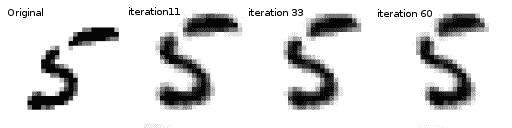
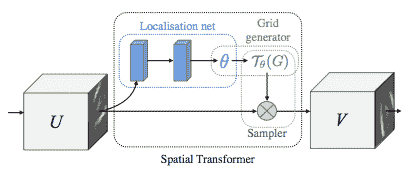
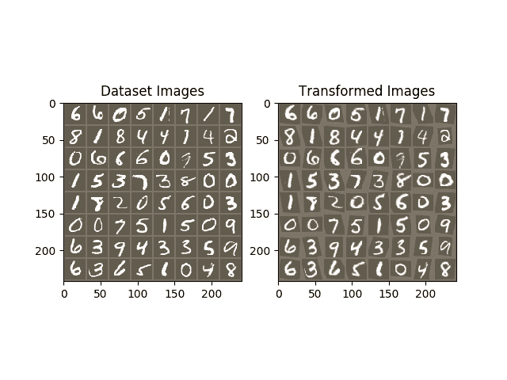

# 空间变压器网络教程

> 原文： [https://pytorch.org/tutorials/intermediate/spatial_transformer_tutorial.html](https://pytorch.org/tutorials/intermediate/spatial_transformer_tutorial.html)

注意

单击此处的[下载完整的示例代码](#sphx-glr-download-intermediate-spatial-transformer-tutorial-py)

**作者**： [Ghassen HAMROUNI](https://github.com/GHamrouni)



在本教程中，您将学习如何使用称为空间变换器网络的视觉注意力机制来扩充网络。 您可以在 [DeepMind 论文](https://arxiv.org/abs/1506.02025)中详细了解空间变压器网络。

空间变换器网络是对任何空间变换的可区别关注的概括。 空间变换器网络(简称 STN）允许神经网络学习如何对输入图像执行空间变换，以增强模型的几何不变性。 例如，它可以裁剪感兴趣的区域，缩放并校正图像的方向。 这可能是一个有用的机制，因为 CNN 不会对旋转和缩放以及更一般的仿射变换保持不变。

关于 STN 的最好的事情之一就是能够将它简单地插入到任何现有的 CNN 中。

```
# License: BSD
# Author: Ghassen Hamrouni

from __future__ import print_function
import torch
import torch.nn as nn
import torch.nn.functional as F
import torch.optim as optim
import torchvision
from torchvision import datasets, transforms
import matplotlib.pyplot as plt
import numpy as np

plt.ion()   # interactive mode

```

## 加载数据

在本文中，我们将尝试使用经典的 MNIST 数据集。 使用标准卷积网络和空间变换器网络。

```
device = torch.device("cuda" if torch.cuda.is_available() else "cpu")

# Training dataset
train_loader = torch.utils.data.DataLoader(
    datasets.MNIST(root='.', train=True, download=True,
                   transform=transforms.Compose([
                       transforms.ToTensor(),
                       transforms.Normalize((0.1307,), (0.3081,))
                   ])), batch_size=64, shuffle=True, num_workers=4)
# Test dataset
test_loader = torch.utils.data.DataLoader(
    datasets.MNIST(root='.', train=False, transform=transforms.Compose([
        transforms.ToTensor(),
        transforms.Normalize((0.1307,), (0.3081,))
    ])), batch_size=64, shuffle=True, num_workers=4)

```

出：

```
Downloading http://yann.lecun.com/exdb/mnist/train-images-idx3-ubyte.gz to ./MNIST/raw/train-images-idx3-ubyte.gz
Extracting ./MNIST/raw/train-images-idx3-ubyte.gz to ./MNIST/raw
Downloading http://yann.lecun.com/exdb/mnist/train-labels-idx1-ubyte.gz to ./MNIST/raw/train-labels-idx1-ubyte.gz
Extracting ./MNIST/raw/train-labels-idx1-ubyte.gz to ./MNIST/raw
Downloading http://yann.lecun.com/exdb/mnist/t10k-images-idx3-ubyte.gz to ./MNIST/raw/t10k-images-idx3-ubyte.gz
Extracting ./MNIST/raw/t10k-images-idx3-ubyte.gz to ./MNIST/raw
Downloading http://yann.lecun.com/exdb/mnist/t10k-labels-idx1-ubyte.gz to ./MNIST/raw/t10k-labels-idx1-ubyte.gz
Extracting ./MNIST/raw/t10k-labels-idx1-ubyte.gz to ./MNIST/raw
Processing...
Done!

```

## 描述空间变压器网络

空间变压器网络可归结为三个主要组成部分：

*   本地化网络是常规的 CNN，可以对转换参数进行回归。 永远不会从此数据集中显式学习变换，而是网络会自动学习增强全局精度的空间变换。
*   网格生成器在输入图像中生成与来自输出图像的每个像素相对应的坐标网格。
*   采样器使用转换的参数，并将其应用于输入图像。



Note

我们需要包含 affine_grid 和 grid_sample 模块的最新版本的 PyTorch。

```
class Net(nn.Module):
    def __init__(self):
        super(Net, self).__init__()
        self.conv1 = nn.Conv2d(1, 10, kernel_size=5)
        self.conv2 = nn.Conv2d(10, 20, kernel_size=5)
        self.conv2_drop = nn.Dropout2d()
        self.fc1 = nn.Linear(320, 50)
        self.fc2 = nn.Linear(50, 10)

        # Spatial transformer localization-network
        self.localization = nn.Sequential(
            nn.Conv2d(1, 8, kernel_size=7),
            nn.MaxPool2d(2, stride=2),
            nn.ReLU(True),
            nn.Conv2d(8, 10, kernel_size=5),
            nn.MaxPool2d(2, stride=2),
            nn.ReLU(True)
        )

        # Regressor for the 3 * 2 affine matrix
        self.fc_loc = nn.Sequential(
            nn.Linear(10 * 3 * 3, 32),
            nn.ReLU(True),
            nn.Linear(32, 3 * 2)
        )

        # Initialize the weights/bias with identity transformation
        self.fc_loc[2].weight.data.zero_()
        self.fc_loc[2].bias.data.copy_(torch.tensor([1, 0, 0, 0, 1, 0], dtype=torch.float))

    # Spatial transformer network forward function
    def stn(self, x):
        xs = self.localization(x)
        xs = xs.view(-1, 10 * 3 * 3)
        theta = self.fc_loc(xs)
        theta = theta.view(-1, 2, 3)

        grid = F.affine_grid(theta, x.size())
        x = F.grid_sample(x, grid)

        return x

    def forward(self, x):
        # transform the input
        x = self.stn(x)

        # Perform the usual forward pass
        x = F.relu(F.max_pool2d(self.conv1(x), 2))
        x = F.relu(F.max_pool2d(self.conv2_drop(self.conv2(x)), 2))
        x = x.view(-1, 320)
        x = F.relu(self.fc1(x))
        x = F.dropout(x, training=self.training)
        x = self.fc2(x)
        return F.log_softmax(x, dim=1)

model = Net().to(device)

```

## 训练模型

现在，让我们使用 SGD 算法训练模型。 网络正在以监督方式学习分类任务。 同时，该模型以端到端的方式自动学习 STN。

```
optimizer = optim.SGD(model.parameters(), lr=0.01)

def train(epoch):
    model.train()
    for batch_idx, (data, target) in enumerate(train_loader):
        data, target = data.to(device), target.to(device)

        optimizer.zero_grad()
        output = model(data)
        loss = F.nll_loss(output, target)
        loss.backward()
        optimizer.step()
        if batch_idx % 500 == 0:
            print('Train Epoch: {} [{}/{} ({:.0f}%)]\tLoss: {:.6f}'.format(
                epoch, batch_idx * len(data), len(train_loader.dataset),
                100\. * batch_idx / len(train_loader), loss.item()))
#
# A simple test procedure to measure STN the performances on MNIST.
#

def test():
    with torch.no_grad():
        model.eval()
        test_loss = 0
        correct = 0
        for data, target in test_loader:
            data, target = data.to(device), target.to(device)
            output = model(data)

            # sum up batch loss
            test_loss += F.nll_loss(output, target, size_average=False).item()
            # get the index of the max log-probability
            pred = output.max(1, keepdim=True)[1]
            correct += pred.eq(target.view_as(pred)).sum().item()

        test_loss /= len(test_loader.dataset)
        print('\nTest set: Average loss: {:.4f}, Accuracy: {}/{} ({:.0f}%)\n'
              .format(test_loss, correct, len(test_loader.dataset),
                      100\. * correct / len(test_loader.dataset)))

```

## 可视化 STN 结果

现在，我们将检查学习到的视觉注意力机制的结果。

我们定义了一个小的辅助函数，以便在训练时可视化转换。

```
def convert_image_np(inp):
    """Convert a Tensor to numpy image."""
    inp = inp.numpy().transpose((1, 2, 0))
    mean = np.array([0.485, 0.456, 0.406])
    std = np.array([0.229, 0.224, 0.225])
    inp = std * inp + mean
    inp = np.clip(inp, 0, 1)
    return inp

# We want to visualize the output of the spatial transformers layer
# after the training, we visualize a batch of input images and
# the corresponding transformed batch using STN.

def visualize_stn():
    with torch.no_grad():
        # Get a batch of training data
        data = next(iter(test_loader))[0].to(device)

        input_tensor = data.cpu()
        transformed_input_tensor = model.stn(data).cpu()

        in_grid = convert_image_np(
            torchvision.utils.make_grid(input_tensor))

        out_grid = convert_image_np(
            torchvision.utils.make_grid(transformed_input_tensor))

        # Plot the results side-by-side
        f, axarr = plt.subplots(1, 2)
        axarr[0].imshow(in_grid)
        axarr[0].set_title('Dataset Images')

        axarr[1].imshow(out_grid)
        axarr[1].set_title('Transformed Images')

for epoch in range(1, 20 + 1):
    train(epoch)
    test()

# Visualize the STN transformation on some input batch
visualize_stn()

plt.ioff()
plt.show()

```



Out:

```
Train Epoch: 1 [0/60000 (0%)]   Loss: 2.312544
Train Epoch: 1 [32000/60000 (53%)]      Loss: 0.865688

Test set: Average loss: 0.2105, Accuracy: 9426/10000 (94%)

Train Epoch: 2 [0/60000 (0%)]   Loss: 0.528199
Train Epoch: 2 [32000/60000 (53%)]      Loss: 0.273284

Test set: Average loss: 0.1150, Accuracy: 9661/10000 (97%)

Train Epoch: 3 [0/60000 (0%)]   Loss: 0.312562
Train Epoch: 3 [32000/60000 (53%)]      Loss: 0.496166

Test set: Average loss: 0.1130, Accuracy: 9661/10000 (97%)

Train Epoch: 4 [0/60000 (0%)]   Loss: 0.346181
Train Epoch: 4 [32000/60000 (53%)]      Loss: 0.206084

Test set: Average loss: 0.0875, Accuracy: 9730/10000 (97%)

Train Epoch: 5 [0/60000 (0%)]   Loss: 0.351175
Train Epoch: 5 [32000/60000 (53%)]      Loss: 0.388225

Test set: Average loss: 0.0659, Accuracy: 9802/10000 (98%)

Train Epoch: 6 [0/60000 (0%)]   Loss: 0.122667
Train Epoch: 6 [32000/60000 (53%)]      Loss: 0.258372

Test set: Average loss: 0.0791, Accuracy: 9759/10000 (98%)

Train Epoch: 7 [0/60000 (0%)]   Loss: 0.190197
Train Epoch: 7 [32000/60000 (53%)]      Loss: 0.154468

Test set: Average loss: 0.0647, Accuracy: 9791/10000 (98%)

Train Epoch: 8 [0/60000 (0%)]   Loss: 0.121149
Train Epoch: 8 [32000/60000 (53%)]      Loss: 0.288490

Test set: Average loss: 0.0583, Accuracy: 9821/10000 (98%)

Train Epoch: 9 [0/60000 (0%)]   Loss: 0.244609
Train Epoch: 9 [32000/60000 (53%)]      Loss: 0.023396

Test set: Average loss: 0.0685, Accuracy: 9778/10000 (98%)

Train Epoch: 10 [0/60000 (0%)]  Loss: 0.256878
Train Epoch: 10 [32000/60000 (53%)]     Loss: 0.091626

Test set: Average loss: 0.0684, Accuracy: 9783/10000 (98%)

Train Epoch: 11 [0/60000 (0%)]  Loss: 0.181910
Train Epoch: 11 [32000/60000 (53%)]     Loss: 0.113193

Test set: Average loss: 0.0492, Accuracy: 9856/10000 (99%)

Train Epoch: 12 [0/60000 (0%)]  Loss: 0.081072
Train Epoch: 12 [32000/60000 (53%)]     Loss: 0.082513

Test set: Average loss: 0.0670, Accuracy: 9800/10000 (98%)

Train Epoch: 13 [0/60000 (0%)]  Loss: 0.180748
Train Epoch: 13 [32000/60000 (53%)]     Loss: 0.194512

Test set: Average loss: 0.0439, Accuracy: 9874/10000 (99%)

Train Epoch: 14 [0/60000 (0%)]  Loss: 0.099560
Train Epoch: 14 [32000/60000 (53%)]     Loss: 0.084377

Test set: Average loss: 0.0416, Accuracy: 9880/10000 (99%)

Train Epoch: 15 [0/60000 (0%)]  Loss: 0.070021
Train Epoch: 15 [32000/60000 (53%)]     Loss: 0.241336

Test set: Average loss: 0.0588, Accuracy: 9820/10000 (98%)

Train Epoch: 16 [0/60000 (0%)]  Loss: 0.060536
Train Epoch: 16 [32000/60000 (53%)]     Loss: 0.053016

Test set: Average loss: 0.0405, Accuracy: 9877/10000 (99%)

Train Epoch: 17 [0/60000 (0%)]  Loss: 0.207369
Train Epoch: 17 [32000/60000 (53%)]     Loss: 0.069607

Test set: Average loss: 0.1006, Accuracy: 9685/10000 (97%)

Train Epoch: 18 [0/60000 (0%)]  Loss: 0.127503
Train Epoch: 18 [32000/60000 (53%)]     Loss: 0.070724

Test set: Average loss: 0.0659, Accuracy: 9814/10000 (98%)

Train Epoch: 19 [0/60000 (0%)]  Loss: 0.176861
Train Epoch: 19 [32000/60000 (53%)]     Loss: 0.116980

Test set: Average loss: 0.0413, Accuracy: 9871/10000 (99%)

Train Epoch: 20 [0/60000 (0%)]  Loss: 0.146933
Train Epoch: 20 [32000/60000 (53%)]     Loss: 0.245741

Test set: Average loss: 0.0346, Accuracy: 9892/10000 (99%)

```

**脚本的总运行时间：**(2 分钟 3.339 秒）

[`Download Python source code: spatial_transformer_tutorial.py`](../_downloads/8aa31a122008b8db8bbe28365db9ea47/spatial_transformer_tutorial.py) [`Download Jupyter notebook: spatial_transformer_tutorial.ipynb`](../_downloads/b0786fd6ca28ee4ff3f2aa27080cdf18/spatial_transformer_tutorial.ipynb)

[由狮身人面像画廊](https://sphinx-gallery.readthedocs.io)生成的画廊