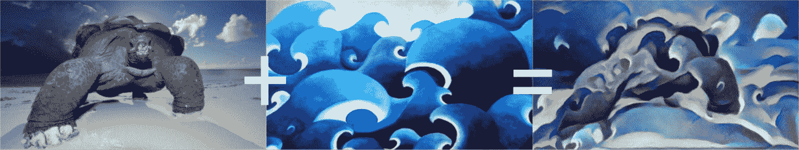
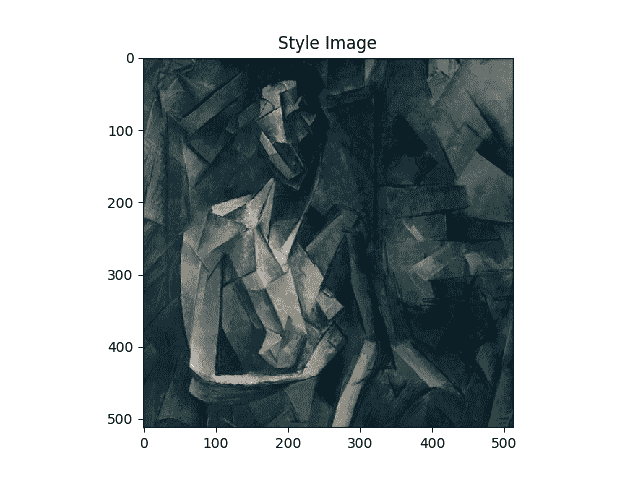
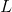
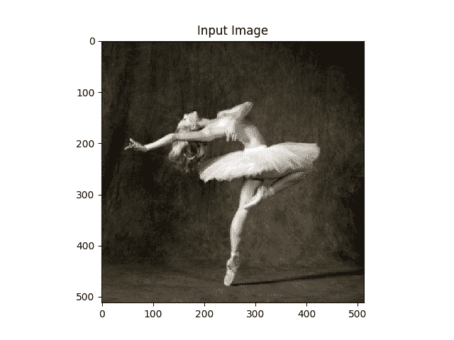
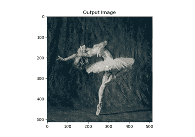

# 使用 PyTorch 进行神经传递

> 原文： [https://pytorch.org/tutorials/advanced/neural_style_tutorial.html](https://pytorch.org/tutorials/advanced/neural_style_tutorial.html)

注意

单击此处的[下载完整的示例代码](#sphx-glr-download-advanced-neural-style-tutorial-py)

**作者**： [Alexis Jacq](https://alexis-jacq.github.io)

**由**编辑：[温斯顿·鲱鱼](https://github.com/winston6)

## 介绍

本教程说明了如何实现由 Leon A. Gatys，Alexander S. Ecker 和 Matthias Bethge 开发的[神经样式算法](https://arxiv.org/abs/1508.06576)。 神经风格(Neural-Style）或神经传递(Neural-Transfer）使您可以拍摄图像并以新的艺术风格对其进行再现。 该算法获取三个图像，即输入图像，内容图像和样式图像，然后更改输入以使其类似于内容图像的内容和样式图像的艺术风格。



## 基本原理

原理很简单：我们定义了两个距离，一个为内容(），一个为样式(）。 测量两个图像之间的内容有多大不同，而测量两个图像之间的样式有多大不同。 然后，我们获取第三个图像(输入），并将其转换为最小化与内容图像的内容距离和与样式图像的样式距离。 现在我们可以导入必要的程序包并开始神经传递。

## 导入软件包并选择设备

以下是实现神经传递所需的软件包列表。

*   `torch`，`torch.nn`，`numpy`(使用 PyTorch 的神经网络必不可少的软件包）
*   `torch.optim`(有效梯度下降）
*   `PIL`，`PIL.Image`，`matplotlib.pyplot`(加载并显示图像）
*   `torchvision.transforms`(将 PIL 图像转换为张量）
*   `torchvision.models`(训练或负载预训练模型）
*   `copy`(用于深复制模型；系统软件包）

```
from __future__ import print_function

import torch
import torch.nn as nn
import torch.nn.functional as F
import torch.optim as optim

from PIL import Image
import matplotlib.pyplot as plt

import torchvision.transforms as transforms
import torchvision.models as models

import copy

```

接下来，我们需要选择要在哪个设备上运行网络并导入内容和样式图像。 在大图像上运行神经传递算法需要更长的时间，并且在 GPU 上运行时会更快。 我们可以使用`torch.cuda.is_available()`来检测是否有 GPU。 接下来，我们设置`torch.device`以在整个教程中使用。 `.to(device)`方法也用于将张量或模块移动到所需的设备。

```
device = torch.device("cuda" if torch.cuda.is_available() else "cpu")

```

## 加载图像

现在，我们将导入样式和内容图像。 原始的 PIL 图像的值在 0 到 255 之间，但是当转换为torch张量时，其值将转换为 0 到 1 之间。图像也需要调整大小以具有相同的尺寸。 需要注意的一个重要细节是，使用从 0 到 1 的张量值对torch库中的神经网络进行训练。如果尝试为网络提供 0 到 255 张量图像，则激活的特征图将无法感知预期的内容 和风格。 但是，使用 0 到 255 张量图像对 Caffe 库中的预训练网络进行训练。

Note

以下是下载运行本教程所需的图像的链接： [picasso.jpg](https://pytorch.org/tutorials/_static/img/neural-style/picasso.jpg) 和 [dance.jpg](https://pytorch.org/tutorials/_static/img/neural-style/dancing.jpg) 。 下载这两个图像并将它们添加到当前工作目录中名称为`images`的目录中。

```
# desired size of the output image
imsize = 512 if torch.cuda.is_available() else 128  # use small size if no gpu

loader = transforms.Compose([
    transforms.Resize(imsize),  # scale imported image
    transforms.ToTensor()])  # transform it into a torch tensor

def image_loader(image_name):
    image = Image.open(image_name)
    # fake batch dimension required to fit network's input dimensions
    image = loader(image).unsqueeze(0)
    return image.to(device, torch.float)

style_img = image_loader("./daimg/neural-style/picasso.jpg")
content_img = image_loader("./daimg/neural-style/dancing.jpg")

assert style_img.size() == content_img.size(), \
    "we need to import style and content images of the same size"

```

现在，让我们创建一个显示图像的功能，方法是将图像的副本转换为 PIL 格式，然后使用`plt.imshow`显示该副本。 我们将尝试显示内容和样式图像，以确保正确导入它们。

```
unloader = transforms.ToPILImage()  # reconvert into PIL image

plt.ion()

def imshow(tensor, title=None):
    image = tensor.cpu().clone()  # we clone the tensor to not do changes on it
    image = image.squeeze(0)      # remove the fake batch dimension
    image = unloader(image)
    plt.imshow(image)
    if title is not None:
        plt.title(title)
    plt.pause(0.001) # pause a bit so that plots are updated

plt.figure()
imshow(style_img, title='Style Image')

plt.figure()
imshow(content_img, title='Content Image')

```

*   
*   

## 损失函数

### 内容损失

内容损失是代表单个图层内容距离的加权版本的函数。 该功能获取网络处理输入中层的特征图，并返回图像和内容图像之间的加权内容距离。 为了计算内容距离，该功能必须知道内容图像的特征图(）。 我们将此功能实现为炬管模块，并使用以作为输入的构造函数。 距离是两组特征图之间的均方误差，可以使用`nn.MSELoss`进行计算。

我们将直接在用于计算内容距离的卷积层之后添加此内容丢失模块。 这样，每次向网络馈入输入图像时，都会在所需层上计算内容损失，并且由于自动渐变，将计算所有梯度。 现在，为了使内容丢失层透明，我们必须定义一种`forward`方法，该方法计算内容丢失，然后返回该层的输入。 计算出的损耗将保存为模块的参数。

```
class ContentLoss(nn.Module):

    def __init__(self, target,):
        super(ContentLoss, self).__init__()
        # we 'detach' the target content from the tree used
        # to dynamically compute the gradient: this is a stated value,
        # not a variable. Otherwise the forward method of the criterion
        # will throw an error.
        self.target = target.detach()

    def forward(self, input):
        self.loss = F.mse_loss(input, self.target)
        return input

```

Note

**重要细节**：尽管此模块名为`ContentLoss`，但它不是真正的 PyTorch Loss 函数。 如果要将内容损失定义为 PyTorch 损失函数，则必须创建一个 PyTorch autograd 函数以使用`backward`方法手动重新计算/实现渐变。

### 风格损失

样式丢失模块的实现类似于内容丢失模块。 在网络中它将充当透明层，计算该层的样式损失。 为了计算样式损失，我们需要计算语法矩阵。 gram 矩阵是给定矩阵与其转置矩阵相乘的结果。 在此应用程序中，给定的矩阵是图层的特征图的重塑版本。 被重塑以形成， x 矩阵，其中是第层特征图的数量，是任何矢量化特征图的长度 ]。 例如，的第一行对应于第一矢量化特征图。

最后，必须通过将每个元素除以矩阵中元素的总数来对 gram 矩阵进行归一化。 此归一化是为了抵消尺寸较大的矩阵在 Gram 矩阵中产生较大值的事实。 这些较大的值将导致第一层(在合并池之前）在梯度下降期间具有较大的影响。 样式特征往往位于网络的更深层，因此此标准化步骤至关重要。

```
def gram_matrix(input):
    a, b, c, d = input.size()  # a=batch size(=1)
    # b=number of feature maps
    # (c,d)=dimensions of a f. map (N=c*d)

    features = input.view(a * b, c * d)  # resise F_XL into \hat F_XL

    G = torch.mm(features, features.t())  # compute the gram product

    # we 'normalize' the values of the gram matrix
    # by dividing by the number of element in each feature maps.
    return G.div(a * b * c * d)

```

现在，样式丢失模块看起来几乎与内容丢失模块完全一样。 还使用和之间的均方误差来计算样式距离。

```
class StyleLoss(nn.Module):

    def __init__(self, target_feature):
        super(StyleLoss, self).__init__()
        self.target = gram_matrix(target_feature).detach()

    def forward(self, input):
        G = gram_matrix(input)
        self.loss = F.mse_loss(G, self.target)
        return input

```

## 导入模型

现在我们需要导入一个预训练的神经网络。 我们将使用 19 层 VGG 网络，就像本文中使用的那样。

PyTorch 的 VGG 实现是一个模块，分为两个子`Sequential`模块：`features`(包含卷积和池化层）和`classifier`(包含完全连接的层）。 我们将使用`features`模块，因为我们需要各个卷积层的输出来测量内容和样式损失。 某些层在训练期间的行为与评估不同，因此我们必须使用`.eval()`将网络设置为评估模式。

```
cnn = models.vgg19(pretrained=True).features.to(device).eval()

```

另外，在图像上训练 VGG 网络，每个通道的均值通过均值= [0.485，0.456，0.406]和 std = [0.229，0.224，0.225]归一化。 在将其发送到网络之前，我们将使用它们对图像进行规范化。

```
cnn_normalization_mean = torch.tensor([0.485, 0.456, 0.406]).to(device)
cnn_normalization_std = torch.tensor([0.229, 0.224, 0.225]).to(device)

# create a module to normalize input image so we can easily put it in a
# nn.Sequential
class Normalization(nn.Module):
    def __init__(self, mean, std):
        super(Normalization, self).__init__()
        # .view the mean and std to make them [C x 1 x 1] so that they can
        # directly work with image Tensor of shape [B x C x H x W].
        # B is batch size. C is number of channels. H is height and W is width.
        self.mean = torch.tensor(mean).view(-1, 1, 1)
        self.std = torch.tensor(std).view(-1, 1, 1)

    def forward(self, img):
        # normalize img
        return (img - self.mean) / self.std

```

`Sequential`模块包含子模块的有序列表。 例如，`vgg19.features`包含以正确的深度顺序排列的序列(Conv2d，ReLU，MaxPool2d，Conv2d，ReLU…）。 我们需要在检测到的卷积层之后立即添加内容丢失层和样式丢失层。 为此，我们必须创建一个新的`Sequential`模块，该模块具有正确插入的内容丢失和样式丢失模块。

```
# desired depth layers to compute style/content losses :
content_layers_default = ['conv_4']
style_layers_default = ['conv_1', 'conv_2', 'conv_3', 'conv_4', 'conv_5']

def get_style_model_and_losses(cnn, normalization_mean, normalization_std,
                               style_img, content_img,
                               content_layers=content_layers_default,
                               style_layers=style_layers_default):
    cnn = copy.deepcopy(cnn)

    # normalization module
    normalization = Normalization(normalization_mean, normalization_std).to(device)

    # just in order to have an iterable access to or list of content/syle
    # losses
    content_losses = []
    style_losses = []

    # assuming that cnn is a nn.Sequential, so we make a new nn.Sequential
    # to put in modules that are supposed to be activated sequentially
    model = nn.Sequential(normalization)

    i = 0  # increment every time we see a conv
    for layer in cnn.children():
        if isinstance(layer, nn.Conv2d):
            i += 1
            name = 'conv_{}'.format(i)
        elif isinstance(layer, nn.ReLU):
            name = 'relu_{}'.format(i)
            # The in-place version doesn't play very nicely with the ContentLoss
            # and StyleLoss we insert below. So we replace with out-of-place
            # ones here.
            layer = nn.ReLU(inplace=False)
        elif isinstance(layer, nn.MaxPool2d):
            name = 'pool_{}'.format(i)
        elif isinstance(layer, nn.BatchNorm2d):
            name = 'bn_{}'.format(i)
        else:
            raise RuntimeError('Unrecognized layer: {}'.format(layer.__class__.__name__))

        model.add_module(name, layer)

        if name in content_layers:
            # add content loss:
            target = model(content_img).detach()
            content_loss = ContentLoss(target)
            model.add_module("content_loss_{}".format(i), content_loss)
            content_losses.append(content_loss)

        if name in style_layers:
            # add style loss:
            target_feature = model(style_img).detach()
            style_loss = StyleLoss(target_feature)
            model.add_module("style_loss_{}".format(i), style_loss)
            style_losses.append(style_loss)

    # now we trim off the layers after the last content and style losses
    for i in range(len(model) - 1, -1, -1):
        if isinstance(model[i], ContentLoss) or isinstance(model[i], StyleLoss):
            break

    model = model[:(i + 1)]

    return model, style_losses, content_losses

```

接下来，我们选择输入图像。 您可以使用内容图像或白噪声的副本。

```
input_img = content_img.clone()
# if you want to use white noise instead uncomment the below line:
# input_img = torch.randn(content_img.data.size(), device=device)

# add the original input image to the figure:
plt.figure()
imshow(input_img, title='Input Image')

```



## 梯度下降

正如算法作者 Leon Gatys 在此处建议[一样，我们将使用 L-BFGS 算法来运行梯度下降。 与训练网络不同，我们希望训练输入图像，以最大程度地减少内容/样式损失。 我们将创建一个 PyTorch L-BFGS 优化器`optim.LBFGS`，并将图像作为张量传递给它进行优化。](https://discuss.pytorch.org/t/pytorch-tutorial-for-neural-transfert-of-artistic-style/336/20?u=alexis-jacq)

```
def get_input_optimizer(input_img):
    # this line to show that input is a parameter that requires a gradient
    optimizer = optim.LBFGS([input_img.requires_grad_()])
    return optimizer

```

最后，我们必须定义一个执行神经传递的函数。 对于网络的每次迭代，它都会被提供更新的输入并计算新的损耗。 我们将运行每个损失模块的`backward`方法来动态计算其梯度。 优化器需要“关闭”功能，该功能可以重新评估模数并返回损耗。

我们还有最后一个约束要解决。 网络可能会尝试使用超出图像的 0 到 1 张量范围的值来优化输入。 我们可以通过在每次网络运行时将输入值校正为 0 到 1 之间来解决此问题。

```
def run_style_transfer(cnn, normalization_mean, normalization_std,
                       content_img, style_img, input_img, num_steps=300,
                       style_weight=1000000, content_weight=1):
    """Run the style transfer."""
    print('Building the style transfer model..')
    model, style_losses, content_losses = get_style_model_and_losses(cnn,
        normalization_mean, normalization_std, style_img, content_img)
    optimizer = get_input_optimizer(input_img)

    print('Optimizing..')
    run = [0]
    while run[0] <= num_steps:

        def closure():
            # correct the values of updated input image
            input_img.data.clamp_(0, 1)

            optimizer.zero_grad()
            model(input_img)
            style_score = 0
            content_score = 0

            for sl in style_losses:
                style_score += sl.loss
            for cl in content_losses:
                content_score += cl.loss

            style_score *= style_weight
            content_score *= content_weight

            loss = style_score + content_score
            loss.backward()

            run[0] += 1
            if run[0] % 50 == 0:
                print("run {}:".format(run))
                print('Style Loss : {:4f} Content Loss: {:4f}'.format(
                    style_score.item(), content_score.item()))
                print()

            return style_score + content_score

        optimizer.step(closure)

    # a last correction...
    input_img.data.clamp_(0, 1)

    return input_img

```

最后，我们可以运行算法。

```
output = run_style_transfer(cnn, cnn_normalization_mean, cnn_normalization_std,
                            content_img, style_img, input_img)

plt.figure()
imshow(output, title='Output Image')

# sphinx_gallery_thumbnail_number = 4
plt.ioff()
plt.show()

```



出：

```
Building the style transfer model..
Optimizing..
run [50]:
Style Loss : 4.169305 Content Loss: 4.235329

run [100]:
Style Loss : 1.145476 Content Loss: 3.039176

run [150]:
Style Loss : 0.716769 Content Loss: 2.663749

run [200]:
Style Loss : 0.476047 Content Loss: 2.500893

run [250]:
Style Loss : 0.347092 Content Loss: 2.410895

run [300]:
Style Loss : 0.263698 Content Loss: 2.358449

```

**脚本的总运行时间：**(1 分钟 20.670 秒）

[`Download Python source code: neural_style_tutorial.py`](../_downloads/7d103bc16c40d35006cd24e65cf978d0/neural_style_tutorial.py) [`Download Jupyter notebook: neural_style_tutorial.ipynb`](../_downloads/f16c4cab7b50f6dea0beb900dee4bf0e/neural_style_tutorial.ipynb)

[由狮身人面像画廊](https://sphinx-gallery.readthedocs.io)生成的画廊