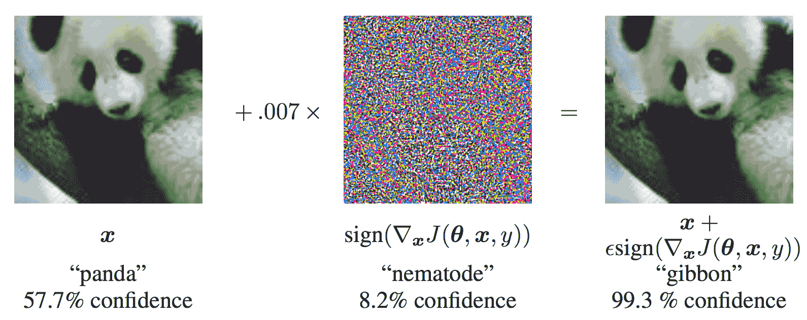
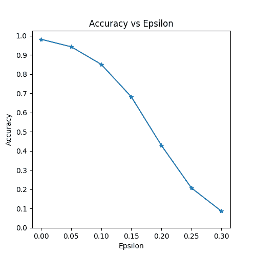
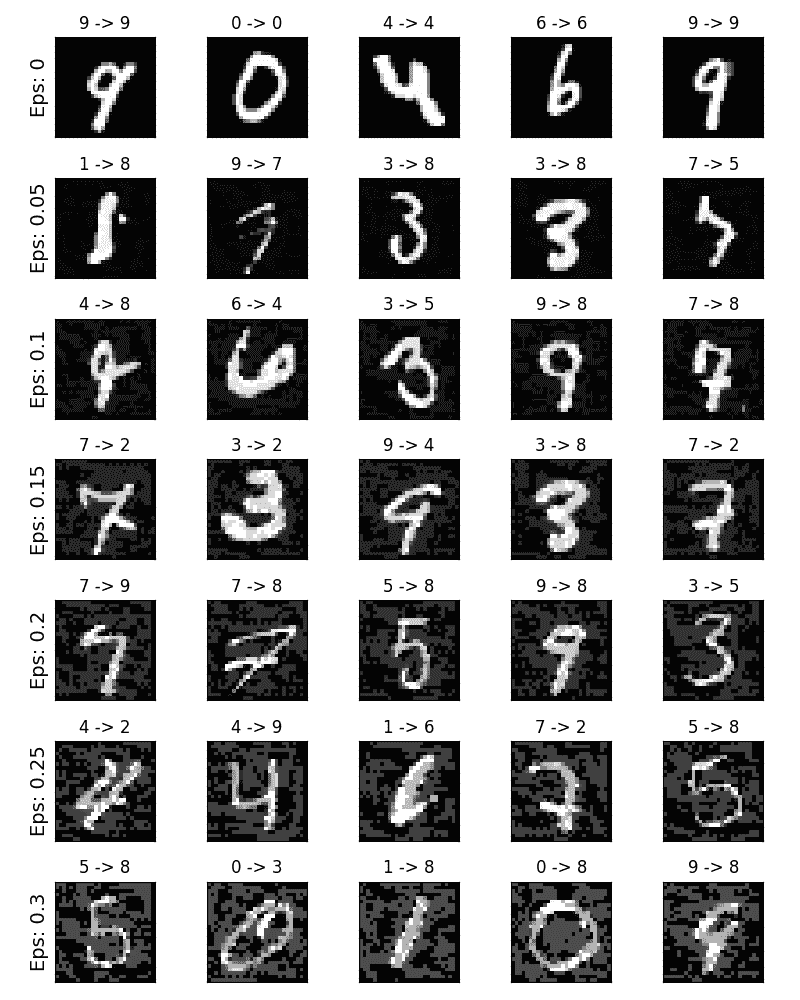

# 对抗示例生成

> 原文： [https://pytorch.org/tutorials/beginner/fgsm_tutorial.html](https://pytorch.org/tutorials/beginner/fgsm_tutorial.html)

注意

单击此处的[下载完整的示例代码](#sphx-glr-download-beginner-fgsm-tutorial-py)

**作者：** [Nathan Inkawhich](https://github.com/inkawhich)

如果您正在阅读本文，希望您能体会到某些机器学习模型的有效性。 研究不断推动 ML 模型更快，更准确和更高效。 但是，设计和训练模型的一个经常被忽略的方面是安全性和鲁棒性，尤其是在面对想要欺骗模型的对手的情况下。

本教程将提高您对 ML 模型的安全漏洞的认识，并深入了解对抗性机器学习的热门话题。 您可能会惊讶地发现，在图像_上添加无法察觉的扰动会导致_导致完全不同的模型性能。 鉴于这是一个教程，我们将通过图像分类器上的示例来探讨该主题。 具体来说，我们将使用第一种也是最流行的攻击方法之一，即快速梯度符号攻击(FGSM）来欺骗 MNIST 分类器。

## 威胁模型

就上下文而言，有多种类型的对抗性攻击，每种攻击者的目标和假设都不同。 但是，总的来说，总体目标是向输入数据添加最少的扰动，以引起所需的错误分类。 攻击者的知识有几种假设，其中两种是：**白盒**和**黑盒**。 _白盒_攻击假定攻击者具有完整的知识并可以访问模型，包括体系结构，输入，输出和权重。 _黑盒_攻击假定攻击者仅有权访问模型的输入和输出，并且对底层体系结构或权重一无所知。 目标也有几种类型，包括**错误分类**和**源/目标错误分类**。 _错误分类的目标是_，这意味着对手只希望输出分类错误，而不在乎新分类是什么。 _源/目标错误分类_意味着对手想要更改最初属于特定源类别的图像，以便将其分类为特定目标类别。

在这种情况下，FGSM 攻击是_白盒_攻击，目标是_错误分类_。 有了这些背景信息，我们现在就可以详细讨论攻击了。

## 快速梯度符号攻击

迄今为止，最早的也是最流行的对抗性攻击之一称为_快速梯度符号攻击(FGSM）_，由 Goodfellow 等描述。 等 [中的解释和利用对抗性示例](https://arxiv.org/abs/1412.6572)。 攻击非常强大，而且直观。 它旨在利用神经网络的学习方式_梯度_来攻击神经网络。 这个想法很简单，不是通过基于反向传播的梯度来调整权重来使损失最小化，攻击_会基于相同的反向传播的梯度来调整输入数据以使损失_最大化。 换句话说，攻击使用损失了输入数据的梯度，然后调整输入数据以使损失最大化。

在进入代码之前，让我们看一下著名的 [FGSM](https://arxiv.org/abs/1412.6572) 熊猫示例，并提取一些符号。



从图中可以看出，是正确分类为“熊猫”的原始输入图像，是的地面真实标签，代表模型参数，是损失，即 用于训练网络。 攻击将梯度反向传播回输入数据以计算。 然后，它会在使损失最大化的方向(即）上以小步长(图片中的或）调整输入数据。 当目标网络仍然明显是“熊猫”时，目标网络将由此产生的扰动图像误分类为为“长臂猿”。

希望本教程的动机已经明确，所以让我们跳入实施过程。

```
from __future__ import print_function
import torch
import torch.nn as nn
import torch.nn.functional as F
import torch.optim as optim
from torchvision import datasets, transforms
import numpy as np
import matplotlib.pyplot as plt

```

## 实作

在本节中，我们将讨论本教程的输入参数，定义受攻击的模型，然后编写攻击代码并运行一些测试。

### 输入项

本教程只有三个输入，定义如下：

*   **epsilons** -用于运行的 epsilon 值列表。 在列表中保留 0 很重要，因为它表示原始测试集上的模型性能。 同样，从直觉上讲，我们期望ε越大，扰动越明显，但是从降低模型准确性的角度来看，攻击越有效。 由于此处的数据范围是，因此 epsilon 值不得超过 1。
*   **pretrained_model** -使用 [pytorch / examples / mnist](https://github.com/pytorch/examples/tree/master/mnist) 训练的预训练 MNIST 模型的路径。 为简单起见，请在此处下载预训练模型[。](https://drive.google.com/drive/folders/1fn83DF14tWmit0RTKWRhPq5uVXt73e0h?usp=sharing)
*   **use_cuda** -布尔标志，如果需要和可用，则使用 CUDA。 请注意，具有 CUDA 的 GPU 在本教程中并不重要，因为 CPU 不会花费很多时间。

```
epsilons = [0, .05, .1, .15, .2, .25, .3]
pretrained_model = "data/lenet_mnist_model.pth"
use_cuda=True

```

### 受到攻击的模型

如前所述，受到攻击的模型与 [pytorch / examples / mnist](https://github.com/pytorch/examples/tree/master/mnist) 中的 MNIST 模型相同。 您可以训练并保存自己的 MNIST 模型，也可以下载并使用提供的模型。 这里的_网络_定义和测试数据加载器已从 MNIST 示例中复制而来。 本部分的目的是定义模型和数据加载器，然后初始化模型并加载预训练的权重。

```
# LeNet Model definition
class Net(nn.Module):
    def __init__(self):
        super(Net, self).__init__()
        self.conv1 = nn.Conv2d(1, 10, kernel_size=5)
        self.conv2 = nn.Conv2d(10, 20, kernel_size=5)
        self.conv2_drop = nn.Dropout2d()
        self.fc1 = nn.Linear(320, 50)
        self.fc2 = nn.Linear(50, 10)

    def forward(self, x):
        x = F.relu(F.max_pool2d(self.conv1(x), 2))
        x = F.relu(F.max_pool2d(self.conv2_drop(self.conv2(x)), 2))
        x = x.view(-1, 320)
        x = F.relu(self.fc1(x))
        x = F.dropout(x, training=self.training)
        x = self.fc2(x)
        return F.log_softmax(x, dim=1)

# MNIST Test dataset and dataloader declaration
test_loader = torch.utils.data.DataLoader(
    datasets.MNIST('../data', train=False, download=True, transform=transforms.Compose([
            transforms.ToTensor(),
            ])),
        batch_size=1, shuffle=True)

# Define what device we are using
print("CUDA Available: ",torch.cuda.is_available())
device = torch.device("cuda" if (use_cuda and torch.cuda.is_available()) else "cpu")

# Initialize the network
model = Net().to(device)

# Load the pretrained model
model.load_state_dict(torch.load(pretrained_model, map_location='cpu'))

# Set the model in evaluation mode. In this case this is for the Dropout layers
model.eval()

```

出：

```
Downloading http://yann.lecun.com/exdb/mnist/train-images-idx3-ubyte.gz to ../data/MNIST/raw/train-images-idx3-ubyte.gz
Extracting ../data/MNIST/raw/train-images-idx3-ubyte.gz to ../data/MNIST/raw
Downloading http://yann.lecun.com/exdb/mnist/train-labels-idx1-ubyte.gz to ../data/MNIST/raw/train-labels-idx1-ubyte.gz
Extracting ../data/MNIST/raw/train-labels-idx1-ubyte.gz to ../data/MNIST/raw
Downloading http://yann.lecun.com/exdb/mnist/t10k-images-idx3-ubyte.gz to ../data/MNIST/raw/t10k-images-idx3-ubyte.gz
Extracting ../data/MNIST/raw/t10k-images-idx3-ubyte.gz to ../data/MNIST/raw
Downloading http://yann.lecun.com/exdb/mnist/t10k-labels-idx1-ubyte.gz to ../data/MNIST/raw/t10k-labels-idx1-ubyte.gz
Extracting ../data/MNIST/raw/t10k-labels-idx1-ubyte.gz to ../data/MNIST/raw
Processing...
Done!
CUDA Available:  True

```

### FGSM 攻击

现在，我们可以通过干扰原始输入来定义创建对抗示例的函数。 `fgsm_attack`函数接受三个输入，_图像_是原始的干净图像(）， _epsilon_ 是像素级扰动量(），以及[HTG7 data_grad 是输入图像(）的损耗的梯度。 该函数然后创建扰动图像为


最后，为了维持数据的原始范围，将被摄动的图像裁剪为范围。

```
# FGSM attack code
def fgsm_attack(image, epsilon, data_grad):
    # Collect the element-wise sign of the data gradient
    sign_data_grad = data_grad.sign()
    # Create the perturbed image by adjusting each pixel of the input image
    perturbed_image = image + epsilon*sign_data_grad
    # Adding clipping to maintain [0,1] range
    perturbed_image = torch.clamp(perturbed_image, 0, 1)
    # Return the perturbed image
    return perturbed_image

```

### 测试功能

最后，本教程的主要结果来自`test`函数。 每次调用此测试功能都会在 MNIST 测试集中执行完整的测试步骤，并报告最终精度。 但是，请注意，此功能还需要 _epsilon_ 输入。 这是因为`test`函数报告了具有强度的对手所攻击的模型的准确性。 更具体地说，对于测试集中的每个样本，该函数都会计算输入数据(）的损耗梯度，使用`fgsm_attack`(）创建一个扰动图像，然后检查是否受到扰动 例子是对抗性的。 除了测试模型的准确性外，该功能还保存并返回了一些成功的对抗示例，以供以后可视化。

```
def test( model, device, test_loader, epsilon ):

    # Accuracy counter
    correct = 0
    adv_examples = []

    # Loop over all examples in test set
    for data, target in test_loader:

        # Send the data and label to the device
        data, target = data.to(device), target.to(device)

        # Set requires_grad attribute of tensor. Important for Attack
        data.requires_grad = True

        # Forward pass the data through the model
        output = model(data)
        init_pred = output.max(1, keepdim=True)[1] # get the index of the max log-probability

        # If the initial prediction is wrong, dont bother attacking, just move on
        if init_pred.item() != target.item():
            continue

        # Calculate the loss
        loss = F.nll_loss(output, target)

        # Zero all existing gradients
        model.zero_grad()

        # Calculate gradients of model in backward pass
        loss.backward()

        # Collect datagrad
        data_grad = data.grad.data

        # Call FGSM Attack
        perturbed_data = fgsm_attack(data, epsilon, data_grad)

        # Re-classify the perturbed image
        output = model(perturbed_data)

        # Check for success
        final_pred = output.max(1, keepdim=True)[1] # get the index of the max log-probability
        if final_pred.item() == target.item():
            correct += 1
            # Special case for saving 0 epsilon examples
            if (epsilon == 0) and (len(adv_examples) < 5):
                adv_ex = perturbed_data.squeeze().detach().cpu().numpy()
                adv_examples.append( (init_pred.item(), final_pred.item(), adv_ex))
        else:
            # Save some adv examples for visualization later
            if len(adv_examples) < 5:
                adv_ex = perturbed_data.squeeze().detach().cpu().numpy()
                adv_examples.append( (init_pred.item(), final_pred.item(), adv_ex))

    # Calculate final accuracy for this epsilon
    final_acc = correct/float(len(test_loader))
    print("Epsilon: {}\tTest Accuracy = {} / {} = {}".format(epsilon, correct, len(test_loader), final_acc))

    # Return the accuracy and an adversarial example
    return final_acc, adv_examples

```

### 奔跑攻击

实现的最后一部分是实际运行攻击。 在这里，我们为 _epsilons_ 输入中的每个 epsilon 值运行完整的测试步骤。 对于每个 epsilon，我们还将保存最终精度，并在接下来的部分中绘制一些成功的对抗示例。 请注意，随着ε值的增加，打印的精度如何降低。 另外，请注意的情况代表了原始的测试准确性，没有受到攻击。

```
accuracies = []
examples = []

# Run test for each epsilon
for eps in epsilons:
    acc, ex = test(model, device, test_loader, eps)
    accuracies.append(acc)
    examples.append(ex)

```

Out:

```
Epsilon: 0      Test Accuracy = 9810 / 10000 = 0.981
Epsilon: 0.05   Test Accuracy = 9426 / 10000 = 0.9426
Epsilon: 0.1    Test Accuracy = 8510 / 10000 = 0.851
Epsilon: 0.15   Test Accuracy = 6826 / 10000 = 0.6826
Epsilon: 0.2    Test Accuracy = 4301 / 10000 = 0.4301
Epsilon: 0.25   Test Accuracy = 2082 / 10000 = 0.2082
Epsilon: 0.3    Test Accuracy = 869 / 10000 = 0.0869

```

## 结果

### 精度与 Epsilon

第一个结果是精度与ε曲线的关系。 如前所述，随着ε的增加，我们期望测试精度会降低。 这是因为较大的ε意味着我们朝着将损失最大化的方向迈出了更大的一步。 请注意，即使 epsilon 值是线性间隔的，曲线中的趋势也不是线性的。 例如，在处的精度仅比低约 4％，但在处的精度比低 25％。 另外，请注意，对于和之间的 10 类分类器，模型的准确性达到了随机准确性。

```
plt.figure(figsize=(5,5))
plt.plot(epsilons, accuracies, "*-")
plt.yticks(np.arange(0, 1.1, step=0.1))
plt.xticks(np.arange(0, .35, step=0.05))
plt.title("Accuracy vs Epsilon")
plt.xlabel("Epsilon")
plt.ylabel("Accuracy")
plt.show()

```



### 对抗示例

还记得没有免费午餐的想法吗？ 在这种情况下，随着ε的增加，测试精度降低**，但**的扰动变得更容易察觉。 实际上，在攻击者必须考虑的准确性下降和可感知性之间要进行权衡。 在这里，我们展示了每个 epsilon 值的成功对抗示例。 绘图的每一行显示不同的ε值。 第一行是示例，代表原始的“干净”图像，没有干扰。 每张图像的标题均显示“原始分类-&gt;对抗分类”。 注意，扰动开始在变得明显，并且在变得非常明显。 然而，在所有情况下，尽管噪声增加，人类仍然能够识别正确的类别。

```
# Plot several examples of adversarial samples at each epsilon
cnt = 0
plt.figure(figsize=(8,10))
for i in range(len(epsilons)):
    for j in range(len(examples[i])):
        cnt += 1
        plt.subplot(len(epsilons),len(examples[0]),cnt)
        plt.xticks([], [])
        plt.yticks([], [])
        if j == 0:
            plt.ylabel("Eps: {}".format(epsilons[i]), fontsize=14)
        orig,adv,ex = examples[i][j]
        plt.title("{} -> {}".format(orig, adv))
        plt.imshow(ex, cmap="gray")
plt.tight_layout()
plt.show()

```



## 接下来要去哪里？

希望本教程对对抗性机器学习主题有所了解。 从这里可以找到许多潜在的方向。 这种攻击代表了对抗性攻击研究的最开始，并且由于随后有许多关于如何攻击和防御来自对手的 ML 模型的想法。 实际上，在 NIPS 2017 上有一个对抗性的攻击和防御竞赛，并且本文描述了该竞赛中使用的许多方法：[对抗性的攻击与防御竞赛](https://arxiv.org/pdf/1804.00097.pdf)。 国防方面的工作还引发了使机器学习模型总体上更健壮_健壮_的想法，以适应自然扰动和对抗制造的输入。

另一个方向是不同领域的对抗性攻击和防御。 对抗性研究不仅限于图像领域，请查看[对语音到文本模型的这种](https://arxiv.org/pdf/1801.01944.pdf)攻击。 但是，也许更多地了解对抗性机器学习的最好方法是弄脏您的手。 尝试实施与 NIPS 2017 竞赛不同的攻击，并查看其与 FGSM 的不同之处。 然后，尝试保护模型免受自己的攻击。

**脚本的总运行时间：**(3 分钟 14.922 秒）

[`Download Python source code: fgsm_tutorial.py`](../_downloads/c9aee5c8955d797c051f02c07927b0c0/fgsm_tutorial.py) [`Download Jupyter notebook: fgsm_tutorial.ipynb`](../_downloads/fba7866856a418520404ba3a11142335/fgsm_tutorial.ipynb)

[由狮身人面像画廊](https://sphinx-gallery.readthedocs.io)生成的画廊