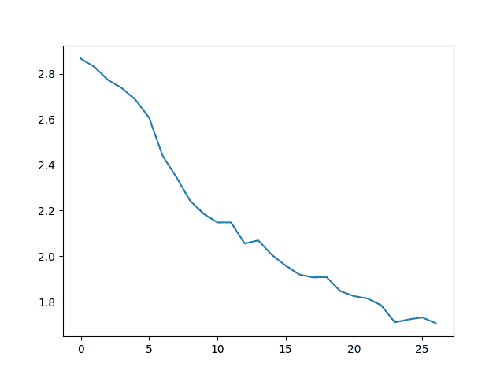
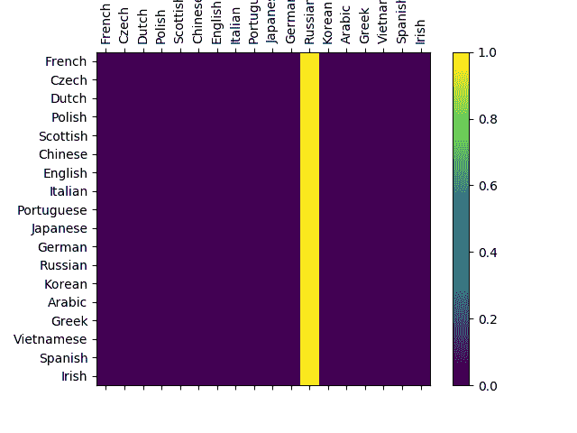

# NLP From Scratch: 使用char-RNN对姓氏进行分类

> 原文： [https://pytorch.org/tutorials/intermediate/char_rnn_classification_tutorial.html](https://pytorch.org/tutorials/intermediate/char_rnn_classification_tutorial.html)

注意

单击此处的[下载完整的示例代码](#sphx-glr-download-intermediate-char-rnn-classification-tutorial-py)

**译者**： [haiyang](https://github.com/hyl11)

本篇我们将构建并训练基本的字符级 RNN 来对单词进行分类。 本教程，以及后续两个教程，展示了如何“从头开始”针对 NLP 建模过程中所需的数据进行预处理，抛开*torchtext*的许多便利功能进行编码，能够让您了解在底层针对 NLP 建模所需的数据是如何预进行处理的。

字符级 RNN 将单词看做字符序列进行读取并在每个步骤输出预测结果和“隐藏状态”，然后将其先前的隐藏状态输入到下一步。 我们将最终的预测结果作为输出，即该单词属于哪个类别。

具体来说，我们将训练来自 18 种语言的数千种姓氏，并根据拼写方式预测该名称属于哪种语言，如下示例：

```
$ python predict.py Hinton
(-0.47) Scottish
(-1.52) English
(-3.57) Irish

$ python predict.py Schmidhuber
(-0.19) German
(-2.48) Czech
(-2.68) Dutch

```

**推荐读物：**

本篇教程假设您至少已经安装了 PyTorch，了解 Python 和 Tensors：

*   [https://pytorch.org/](https://pytorch.org/) 有关安装说明
*   [使用 PyTorch 进行深度学习：60 分钟的闪电战](../beginner/deep_learning_60min_blitz.html)如何快速开始使用 PyTorch
*   [根据示例学习Pytorch](../beginner/pytorch_with_examples.html)对 Pytorch 进行更广泛深入的了解
*   [PyTorch(以前的 Torch 用户）](../beginner/former_torchies_tutorial.html)(如果您以前是 Lua Torch 用户）

了解 RNN 及其工作方式也很重要：

*   [循环神经网络的超常效果](https://karpathy.github.io/2015/05/21/rnn-effectiveness/)显示了许多现实生活中的例子
*   [了解 LSTM 网络](https://colah.github.io/posts/2015-08-Understanding-LSTMs/)主要是关于 LSTM 的，但总体上也是有关 RNN 的

## 准备数据

Note

- 从[这里](https://download.pytorch.org/tutorial/data.zip)下载数据，并将其提取到当前目录。

`data/names`目录中包含 18 个文本文件，名为“ [Language] .txt”。 每个文件包含多行，每行一个姓氏，大多数都是罗马字符(但谨慎起见我们仍然需要从 Unicode 编码转换为 ASCII 编码）。

处理之后我们得到一个字典，字典包含每种语言的姓氏列表`{language: [names ...]}`。 通用变量`category`和`line`(在本例中分别为语言和姓氏）在后续还会使用。

```
from __future__ import unicode_literals, print_function, division
from io import open
import glob
import os

def findFiles(path): return glob.glob(path)

print(findFiles('data/names/*.txt'))

import unicodedata
import string

all_letters = string.ascii_letters + " .,;'"
n_letters = len(all_letters)

# Turn a Unicode string to plain ASCII, thanks to https://stackoverflow.com/a/518232/2809427
def unicodeToAscii(s):
    return ''.join(
        c for c in unicodedata.normalize('NFD', s)
        if unicodedata.category(c) != 'Mn'
        and c in all_letters
    )

print(unicodeToAscii('Ślusàrski'))

# Build the category_lines dictionary, a list of names per language
category_lines = {}
all_categories = []

# Read a file and split into lines
def readLines(filename):
    lines = open(filename, encoding='utf-8').read().strip().split('\n')
    return [unicodeToAscii(line) for line in lines]

for filename in findFiles('data/names/*.txt'):
    category = os.path.splitext(os.path.basename(filename))[0]
    all_categories.append(category)
    lines = readLines(filename)
    category_lines[category] = lines

n_categories = len(all_categories)

```

Out：

```
['data/names/French.txt', 'data/names/Czech.txt', 'data/names/Dutch.txt', 'data/names/Polish.txt', 'data/names/Scottish.txt', 'data/names/Chinese.txt', 'data/names/English.txt', 'data/names/Italian.txt', 'data/names/Portuguese.txt', 'data/names/Japanese.txt', 'data/names/German.txt', 'data/names/Russian.txt', 'data/names/Korean.txt', 'data/names/Arabic.txt', 'data/names/Greek.txt', 'data/names/Vietnamese.txt', 'data/names/Spanish.txt', 'data/names/Irish.txt']
Slusarski

```

经过上述处理，我们获得了变量`category_lines`，这是一个字典，字典索引为每个类别(语言）值为一个列表，列表包含多个行(姓氏）。 我们还保存了`all_categories`(类别（语言）列表）和`n_categories`（语言类别数量），以供后续使用。

```
print(category_lines['Italian'][:5])

```

Out:

```
['Abandonato', 'Abatangelo', 'Abatantuono', 'Abate', 'Abategiovanni']

```

### 将名称转换为张量

获取所有姓氏之后，我们需要将它们转换为张量。

为了表示单个字母，我们使用大小为`<1 x n_letters>`的“ one-hot vector”。 一个“one hot”向量是当前字母的索引处为 1，其余部分为 0 的向量，例如 `"b" = <0 1 0 0 0 ...>`。

我们将每行的所有字母的“one hot”向量连接成 2D 矩阵`<line_length x 1 x n_letters>`来表示一个单词（姓氏）。

额外的 1 维是因为 PyTorch 假设所有内容都是批量的-我们这里批量大小为 1 。

```
import torch

# Find letter index from all_letters, e.g. "a" = 0
def letterToIndex(letter):
    return all_letters.find(letter)

# Just for demonstration, turn a letter into a <1 x n_letters> Tensor
def letterToTensor(letter):
    tensor = torch.zeros(1, n_letters)
    tensor[0][letterToIndex(letter)] = 1
    return tensor

# Turn a line into a <line_length x 1 x n_letters>,
# or an array of one-hot letter vectors
def lineToTensor(line):
    tensor = torch.zeros(len(line), 1, n_letters)
    for li, letter in enumerate(line):
        tensor[li][0][letterToIndex(letter)] = 1
    return tensor

print(letterToTensor('J'))

print(lineToTensor('Jones').size())

```

Out:

```
tensor([[0., 0., 0., 0., 0., 0., 0., 0., 0., 0., 0., 0., 0., 0., 0., 0., 0., 0.,
         0., 0., 0., 0., 0., 0., 0., 0., 0., 0., 0., 0., 0., 0., 0., 0., 0., 1.,
         0., 0., 0., 0., 0., 0., 0., 0., 0., 0., 0., 0., 0., 0., 0., 0., 0., 0.,
         0., 0., 0.]])
torch.Size([5, 1, 57])

```

## 建立网络

在 Torch 中创建一个循环神经网络需要在多个时间步上克隆神经层的参数。 现在不同的时间步骤下网络层所保存的隐藏状态和梯度均由计算图自身处理，编程者无需关心，因此您可以向构建常见的前馈网络一样在Torch中简便的构建循环神经网络。

下图的 RNN 模块(主要从 [ the PyTorch for Torch users tutorial](https://pytorch.org/tutorials/beginner/former_torchies/nn_tutorial.html#example-2-recurrent-net) 复制）仅是 2 个线性层，它们读取输入和隐藏状态，并将其进行线性映射后，在讲输出结果通过 LogSoftmax 层作为本层输出。


```
import torch.nn as nn

class RNN(nn.Module):
    def __init__(self, input_size, hidden_size, output_size):
        super(RNN, self).__init__()

        self.hidden_size = hidden_size

        self.i2h = nn.Linear(input_size + hidden_size, hidden_size)
        self.i2o = nn.Linear(input_size + hidden_size, output_size)
        self.softmax = nn.LogSoftmax(dim=1)

    def forward(self, input, hidden):
        combined = torch.cat((input, hidden), 1)
        hidden = self.i2h(combined)
        output = self.i2o(combined)
        output = self.softmax(output)
        return output, hidden

    def initHidden(self):
        return torch.zeros(1, self.hidden_size)

n_hidden = 128
rnn = RNN(n_letters, n_hidden, n_categories)

```

要对该网络进行单步运行，我们需要传递输入(在本例中为当前字母的张量）和上一步的隐藏状态(首先将其初始化为零）。 该网络将返回输出(每种语言的概率）和下一个隐藏状态(我们将其保留用于下一步）。

```
input = letterToTensor('A')
hidden =torch.zeros(1, n_hidden)

output, next_hidden = rnn(input, hidden)

```

为了提高效率，我们不想为每个步骤创建一个新的 Tensor，因此我们将使用`lineToTensor`生成向量再进行切片，而不是多次使用`letterToTensor`。 这可以通过预先计算一批张量来进一步优化。

```
input = lineToTensor('Albert')
hidden = torch.zeros(1, n_hidden)

output, next_hidden = rnn(input[0], hidden)
print(output)

```

Out:

```
tensor([[-2.9504, -2.8402, -2.9195, -2.9136, -2.9799, -2.8207, -2.8258, -2.8399,
         -2.9098, -2.8815, -2.8313, -2.8628, -3.0440, -2.8689, -2.9391, -2.8381,
         -2.9202, -2.8717]], grad_fn=<LogSoftmaxBackward>)

```

如上，输出为`<1 x n_categories>`张量，其中每项对应于该类别的可能性(数值更高的可能性更大）。

## 训练

### 准备训练

在训练之前，我们需要设置一些辅助函数。 首先我们需要针对网络的输出（每个类别的可能性）进行处理，以输出其最可能的类别。 我们可以使用`Tensor.topk`来获得最大值的索引：

```
def categoryFromOutput(output):
    top_n, top_i = output.topk(1)
    category_i = top_i[0].item()
    return all_categories[category_i], category_i

print(categoryFromOutput(output))

```

Out:

```
('Chinese', 5)

```

我们还将需要一个快速获取训练示例的函数(姓氏及其语言）：

```
import random

def randomChoice(l):
    return l[random.randint(0, len(l) - 1)]

def randomTrainingExample():
    category = randomChoice(all_categories)
    line = randomChoice(category_lines[category])
    category_tensor = torch.tensor([all_categories.index(category)], dtype=torch.long)
    line_tensor = lineToTensor(line)
    return category, line, category_tensor, line_tensor

for i in range(10):
    category, line, category_tensor, line_tensor = randomTrainingExample()
    print('category =', category, '/ line =', line)

```

Out:

```
category = Italian / line = Pastore
category = Arabic / line = Toma
category = Irish / line = Tracey
category = Portuguese / line = Lobo
category = Arabic / line = Sleiman
category = Polish / line = Sokolsky
category = English / line = Farr
category = Polish / line = Winogrodzki
category = Russian / line = Adoratsky
category = Dutch / line = Robert

```

### 训练网络

现在，训练该网络所需要做的就是向它输入大量示例，让网络进行猜测，并告诉它该猜测是否错误。

`nn.NLLLoss`是比较合适的损失函数，因为 RNN 的最后一层是`nn.LogSoftmax`。

```
criterion = nn.NLLLoss()

```

每个训练循环将：

*   创建输入和目标张量
*   创建归零的初始隐藏状态
*   读入每个字母
    *   保存隐藏状态用于下个字母
*   比较最终输出与目标张量的差距
*   反向传播
*   返回输出和损失

```
learning_rate = 0.005 # If you set this too high, it might explode. If too low, it might not learn

def train(category_tensor, line_tensor):
    hidden = rnn.initHidden()

    rnn.zero_grad()

    for i in range(line_tensor.size()[0]):
        output, hidden = rnn(line_tensor[i], hidden)

    loss = criterion(output, category_tensor)
    loss.backward()

    # Add parameters' gradients to their values, multiplied by learning rate
    for p in rnn.parameters():
        p.data.add_(-learning_rate, p.grad.data)

    return output, loss.item()

```

现在，我们只需要使用大量示例来运行该网络即可。 由于`train`函数同时返回输出和损失，因此我们可以打印其猜测结果并跟踪绘制损失变化。 因为有 1000 个示例，所以我们每隔`print_every`个示例打印一次，并平均这段时间内的损失然后保存下来。

```
import time
import math

n_iters = 100000
print_every = 5000
plot_every = 1000

# Keep track of losses for plotting
current_loss = 0
all_losses = []

def timeSince(since):
    now = time.time()
    s = now - since
    m = math.floor(s / 60)
    s -= m * 60
    return '%dm %ds' % (m, s)

start = time.time()

for iter in range(1, n_iters + 1):
    category, line, category_tensor, line_tensor = randomTrainingExample()
    output, loss = train(category_tensor, line_tensor)
    current_loss += loss

    # Print iter number, loss, name and guess
    if iter % print_every == 0:
        guess, guess_i = categoryFromOutput(output)
        correct = '✓' if guess == category else '✗ (%s)' % category
        print('%d %d%% (%s) %.4f %s / %s %s' % (iter, iter / n_iters * 100, timeSince(start), loss, line, guess, correct))

    # Add current loss avg to list of losses
    if iter % plot_every == 0:
        all_losses.append(current_loss / plot_every)
        current_loss = 0

```

Out:

```
5000 5% (0m 12s) 3.1806 Olguin / Irish ✗ (Spanish)
10000 10% (0m 21s) 2.1254 Dubnov / Russian ✓
15000 15% (0m 29s) 3.1001 Quirke / Polish ✗ (Irish)
20000 20% (0m 38s) 0.9191 Jiang / Chinese ✓
25000 25% (0m 46s) 2.3233 Marti / Italian ✗ (Spanish)
30000 30% (0m 54s) nan Amari / Russian ✗ (Arabic)
35000 35% (1m 3s) nan Gudojnik / Russian ✓
40000 40% (1m 11s) nan Finn / Russian ✗ (Irish)
45000 45% (1m 20s) nan Napoliello / Russian ✗ (Italian)
50000 50% (1m 28s) nan Clark / Russian ✗ (Irish)
55000 55% (1m 37s) nan Roijakker / Russian ✗ (Dutch)
60000 60% (1m 46s) nan Kalb / Russian ✗ (Arabic)
65000 65% (1m 54s) nan Hanania / Russian ✗ (Arabic)
70000 70% (2m 3s) nan Theofilopoulos / Russian ✗ (Greek)
75000 75% (2m 11s) nan Pakulski / Russian ✗ (Polish)
80000 80% (2m 20s) nan Thistlethwaite / Russian ✗ (English)
85000 85% (2m 29s) nan Shadid / Russian ✗ (Arabic)
90000 90% (2m 37s) nan Finnegan / Russian ✗ (Irish)
95000 95% (2m 46s) nan Brannon / Russian ✗ (Irish)
100000 100% (2m 54s) nan Gomulka / Russian ✗ (Polish)

```

### 绘制结果

从`all_losses`绘制损失的变化情况可以显示网络学习情况：

```
import matplotlib.pyplot as plt
import matplotlib.ticker as ticker

plt.figure()
plt.plot(all_losses)

```



## 评估结果

为了查看网络在不同类别上的表现如何，我们将创建一个混淆矩阵，行对应于每种语言，列对应于网络猜测的语言。为了计算混淆矩阵，使用`evaluate()`函数通过训练好的网络运行一批样本，这一步类似于训练函数`train`，但是没有反向传播过程。

```
# Keep track of correct guesses in a confusion matrix
confusion = torch.zeros(n_categories, n_categories)
n_confusion = 10000

# Just return an output given a line
def evaluate(line_tensor):
    hidden = rnn.initHidden()

    for i in range(line_tensor.size()[0]):
        output, hidden = rnn(line_tensor[i], hidden)

    return output

# Go through a bunch of examples and record which are correctly guessed
for i in range(n_confusion):
    category, line, category_tensor, line_tensor = randomTrainingExample()
    output = evaluate(line_tensor)
    guess, guess_i = categoryFromOutput(output)
    category_i = all_categories.index(category)
    confusion[category_i][guess_i] += 1

# Normalize by dividing every row by its sum
for i in range(n_categories):
    confusion[i] = confusion[i] / confusion[i].sum()

# Set up plot
fig = plt.figure()
ax = fig.add_subplot(111)
cax = ax.matshow(confusion.numpy())
fig.colorbar(cax)

# Set up axes
ax.set_xticklabels([''] + all_categories, rotation=90)
ax.set_yticklabels([''] + all_categories)

# Force label at every tick
ax.xaxis.set_major_locator(ticker.MultipleLocator(1))
ax.yaxis.set_major_locator(ticker.MultipleLocator(1))

# sphinx_gallery_thumbnail_number = 2
plt.show()

```



主轴上的一些亮点代表神经网络容易猜错哪些语言，例如 中文和朝鲜语，西班牙语和意大利语。 神经网络在希腊语上表现很好，在英语上表现得很差(可能是因为与其他语言重叠较多）。

### 在用户输入上运行

```
def predict(input_line, n_predictions=3):
    print('\n> %s' % input_line)
    with torch.no_grad():
        output = evaluate(lineToTensor(input_line))

        # Get top N categories
        topv, topi = output.topk(n_predictions, 1, True)
        predictions = []

        for i in range(n_predictions):
            value = topv[0][i].item()
            category_index = topi[0][i].item()
            print('(%.2f) %s' % (value, all_categories[category_index]))
            predictions.append([value, all_categories[category_index]])

predict('Dovesky')
predict('Jackson')
predict('Satoshi')

```

Out:

```
> Dovesky
(nan) Russian
(nan) Arabic
(nan) Korean

> Jackson
(nan) Russian
(nan) Arabic
(nan) Korean

> Satoshi
(nan) Russian
(nan) Arabic
(nan) Korean

```

实际 [PyTorch 存储库](https://github.com/spro/practical-pytorch/tree/master/char-rnn-classification)中的脚本将上述代码分成几个文件：

*   `data.py`(加载文件）
*   `model.py`(定义 RNN）
*   `train.py`(进行训练）
*   `predict.py`(使用命令行参数运行`predict()`）
*   `server.py` (通过bottle.py将预测用作 JSON API）

运行`train.py`训练并保存网络。

将姓氏作为输入运行`predict.py`来查看预测结果：

```
$ python predict.py Hazaki
(-0.42) Japanese
(-1.39) Polish
(-3.51) Czech

```

运行`server.py`并访问[http://localhost:5533/您的名字](http://localhost:5533/Yourname)以获取预测的 JSON 格式输出。

## 练习题

*   尝试使用其他行-&gt;类别的数据集，例如：
    *   任何字词-&gt;语言
    *   名-&gt;性别
    *   角色名称-&gt;作家
    *   页面标题-&gt;博客或 subreddit
*   通过更大和/或形状更好的网络获得更好的结果
    *   添加更多线性层
    *   尝试`nn.LSTM`和`nn.GRU`层
    *   将多个这些 RNN 合并为更高级别的网络

**脚本的总运行时间：**(3 分 4.326 秒）

[`Download Python source code: char_rnn_classification_tutorial.py`](../_downloads/ccb15f8365bdae22a0a019e57216d7c6/char_rnn_classification_tutorial.py) [`Download Jupyter notebook: char_rnn_classification_tutorial.ipynb`](../_downloads/977c14818c75427641ccb85ad21ed6dc/char_rnn_classification_tutorial.ipynb)

[由狮身人面像画廊](https://sphinx-gallery.readthedocs.io)生成的画廊
