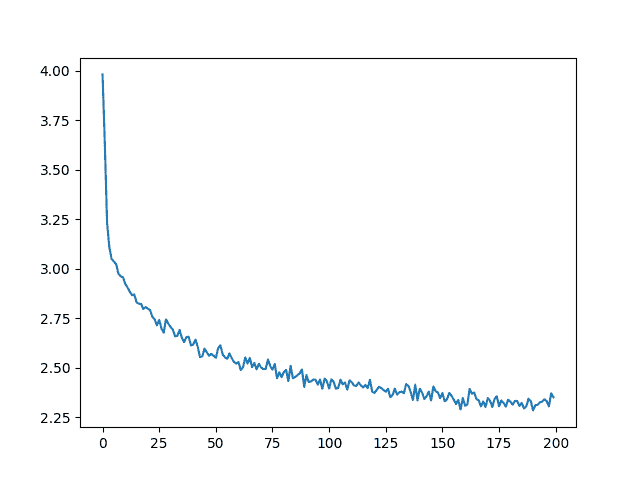

# NLP From Scratch: 生成名称与字符级RNN

> 原文： [https://pytorch.org/tutorials/intermediate/char_rnn_generation_tutorial.html](https://pytorch.org/tutorials/intermediate/char_rnn_generation_tutorial.html)

注意

单击此处的[下载完整的示例代码](#sphx-glr-download-intermediate-char-rnn-generation-tutorial-py)

**作者**： [Sean Robertson](https://github.com/spro/practical-pytorch)

这是我们关于“NLP From Scratch”的三个教程中的第二个。 在&lt;cite&gt;第一个教程&lt; / intermediate / char_rnn_classification_tutorial &gt;&lt;/cite&gt; 中，我们使用了 RNN 将名称分类为来源语言。 这次，我们将转过来并使用语言生成名称。

```
> python sample.py Russian RUS
Rovakov
Uantov
Shavakov

> python sample.py German GER
Gerren
Ereng
Rosher

> python sample.py Spanish SPA
Salla
Parer
Allan

> python sample.py Chinese CHI
Chan
Hang
Iun

```

我们仍在手工制作带有一些线性层的小型 RNN。 最大的区别在于，我们无需输入名称中的所有字母即可预测类别，而是输入类别并一次输出一个字母。 反复预测字符以形成语言(这也可以用单词或其他高阶结构来完成）通常称为“语言模型”。

**推荐读物：**

我假设您至少已经安装了 PyTorch，了解 Python 和了解 Tensors：

*   [https://pytorch.org/](https://pytorch.org/) 有关安装说明
*   [使用 PyTorch 进行深度学习：60 分钟的闪电战](../beginner/deep_learning_60min_blitz.html)通常开始使用 PyTorch
*   [使用示例](../beginner/pytorch_with_examples.html)学习 PyTorch 进行广泛而深入的概述
*   [PyTorch(以前的 Torch 用户）](../beginner/former_torchies_tutorial.html)(如果您以前是 Lua Torch 用户）

了解 RNN 及其工作方式也将很有用：

*   [循环神经网络的不合理效果](https://karpathy.github.io/2015/05/21/rnn-effectiveness/)显示了许多现实生活中的例子
*   [了解 LSTM 网络](https://colah.github.io/posts/2015-08-Understanding-LSTMs/)特别是关于 LSTM 的，但总体上也关于 RNN 的

我还建议上一个教程[从头开始进行 NLP：使用字符级 RNN 对名称进行分类](char_rnn_classification_tutorial.html)

## 准备数据

Note

从的下载数据，并将其提取到当前目录。

有关此过程的更多详细信息，请参见上一教程。 简而言之，有一堆纯文本文件`data/names/[Language].txt`，每行都有一个名称。 我们将行分割成一个数组，将 Unicode 转换为 ASCII，最后得到一个字典`{language: [names ...]}`。

```
from __future__ import unicode_literals, print_function, division
from io import open
import glob
import os
import unicodedata
import string

all_letters = string.ascii_letters + " .,;'-"
n_letters = len(all_letters) + 1 # Plus EOS marker

def findFiles(path): return glob.glob(path)

# Turn a Unicode string to plain ASCII, thanks to https://stackoverflow.com/a/518232/2809427
def unicodeToAscii(s):
    return ''.join(
        c for c in unicodedata.normalize('NFD', s)
        if unicodedata.category(c) != 'Mn'
        and c in all_letters
    )

# Read a file and split into lines
def readLines(filename):
    lines = open(filename, encoding='utf-8').read().strip().split('\n')
    return [unicodeToAscii(line) for line in lines]

# Build the category_lines dictionary, a list of lines per category
category_lines = {}
all_categories = []
for filename in findFiles('data/names/*.txt'):
    category = os.path.splitext(os.path.basename(filename))[0]
    all_categories.append(category)
    lines = readLines(filename)
    category_lines[category] = lines

n_categories = len(all_categories)

if n_categories == 0:
    raise RuntimeError('Data not found. Make sure that you downloaded data '
        'from https://download.pytorch.org/tutorial/data.zip and extract it to '
        'the current directory.')

print('# categories:', n_categories, all_categories)
print(unicodeToAscii("O'Néàl"))

```

出：

```
# categories: 18 ['French', 'Czech', 'Dutch', 'Polish', 'Scottish', 'Chinese', 'English', 'Italian', 'Portuguese', 'Japanese', 'German', 'Russian', 'Korean', 'Arabic', 'Greek', 'Vietnamese', 'Spanish', 'Irish']
O'Neal

```

## 建立网络

该网络使用最后一个教程的 RNN 扩展了[，并为类别张量附加了一个参数，该参数与其他张量串联在一起。 类别张量是一个热向量，就像字母输入一样。](#Creating-the-Network)

我们将输出解释为下一个字母的概率。 采样时，最有可能的输出字母用作下一个输入字母。

我添加了第二个线性层`o2o`(将隐藏和输出结合在一起之后），以使它具有更多的肌肉可以使用。 还有一个辍学层，[以给定的概率(此处为 0.1）将输入](https://arxiv.org/abs/1207.0580)的部分随机归零，通常用于模糊输入以防止过拟合。 在这里，我们在网络的末端使用它来故意添加一些混乱并增加采样种类。


```
import torch
import torch.nn as nn

class RNN(nn.Module):
    def __init__(self, input_size, hidden_size, output_size):
        super(RNN, self).__init__()
        self.hidden_size = hidden_size

        self.i2h = nn.Linear(n_categories + input_size + hidden_size, hidden_size)
        self.i2o = nn.Linear(n_categories + input_size + hidden_size, output_size)
        self.o2o = nn.Linear(hidden_size + output_size, output_size)
        self.dropout = nn.Dropout(0.1)
        self.softmax = nn.LogSoftmax(dim=1)

    def forward(self, category, input, hidden):
        input_combined = torch.cat((category, input, hidden), 1)
        hidden = self.i2h(input_combined)
        output = self.i2o(input_combined)
        output_combined = torch.cat((hidden, output), 1)
        output = self.o2o(output_combined)
        output = self.dropout(output)
        output = self.softmax(output)
        return output, hidden

    def initHidden(self):
        return torch.zeros(1, self.hidden_size)

```

## 训练

### 准备训练

首先，helper 函数获取随机对(类别，行）：

```
import random

# Random item from a list
def randomChoice(l):
    return l[random.randint(0, len(l) - 1)]

# Get a random category and random line from that category
def randomTrainingPair():
    category = randomChoice(all_categories)
    line = randomChoice(category_lines[category])
    return category, line

```

对于每个时间步(即，对于训练词中的每个字母），网络的输入将为`(category, current letter, hidden state)`，而输出将为`(next letter, next hidden state)`。 因此，对于每个训练集，我们都需要类别，一组输入字母和一组输出/目标字母。

由于我们正在预测每个时间步中当前字母的下一个字母，因此字母对是该行中连续字母的组-例如 对于`"ABCD&lt;EOS&gt;"`，我们将创建(“ A”，“ B”），(“ B”，“ C”），(“ C”，“ D”），(“ D”，“ EOS”）。


类别张量是大小为`&lt;1 x n_categories&gt;`的[一热张量](https://en.wikipedia.org/wiki/One-hot)。 训练时，我们会随时随地将其馈送到网络中-这是一种设计选择，它可能已被包含为初始隐藏状态或某些其他策略的一部分。

```
# One-hot vector for category
def categoryTensor(category):
    li = all_categories.index(category)
    tensor = torch.zeros(1, n_categories)
    tensor[0][li] = 1
    return tensor

# One-hot matrix of first to last letters (not including EOS) for input
def inputTensor(line):
    tensor = torch.zeros(len(line), 1, n_letters)
    for li in range(len(line)):
        letter = line[li]
        tensor[li][0][all_letters.find(letter)] = 1
    return tensor

# LongTensor of second letter to end (EOS) for target
def targetTensor(line):
    letter_indexes = [all_letters.find(line[li]) for li in range(1, len(line))]
    letter_indexes.append(n_letters - 1) # EOS
    return torch.LongTensor(letter_indexes)

```

为了方便训练，我们将使用`randomTrainingExample`函数来提取随机(类别，行）对，并将其转换为所需的(类别，输入，目标）张量。

```
# Make category, input, and target tensors from a random category, line pair
def randomTrainingExample():
    category, line = randomTrainingPair()
    category_tensor = categoryTensor(category)
    input_line_tensor = inputTensor(line)
    target_line_tensor = targetTensor(line)
    return category_tensor, input_line_tensor, target_line_tensor

```

### 训练网络

与仅使用最后一个输出的分类相反，我们在每个步骤进行预测，因此在每个步骤都计算损失。

autograd 的神奇之处在于，您可以简单地将每一步的损失相加，然后在末尾调用。

```
criterion = nn.NLLLoss()

learning_rate = 0.0005

def train(category_tensor, input_line_tensor, target_line_tensor):
    target_line_tensor.unsqueeze_(-1)
    hidden = rnn.initHidden()

    rnn.zero_grad()

    loss = 0

    for i in range(input_line_tensor.size(0)):
        output, hidden = rnn(category_tensor, input_line_tensor[i], hidden)
        l = criterion(output, target_line_tensor[i])
        loss += l

    loss.backward()

    for p in rnn.parameters():
        p.data.add_(-learning_rate, p.grad.data)

    return output, loss.item() / input_line_tensor.size(0)

```

为了跟踪训练需要多长时间，我添加了一个`timeSince(timestamp)`函数，该函数返回人类可读的字符串：

```
import time
import math

def timeSince(since):
    now = time.time()
    s = now - since
    m = math.floor(s / 60)
    s -= m * 60
    return '%dm %ds' % (m, s)

```

训练照常进行-召集训练多次，等待几分钟，每`print_every`个示例打印当前时间和损失，并在`all_losses`中将每个`plot_every`实例的平均损失存储下来，以便以后进行绘图。

```
rnn = RNN(n_letters, 128, n_letters)

n_iters = 100000
print_every = 5000
plot_every = 500
all_losses = []
total_loss = 0 # Reset every plot_every iters

start = time.time()

for iter in range(1, n_iters + 1):
    output, loss = train(*randomTrainingExample())
    total_loss += loss

    if iter % print_every == 0:
        print('%s (%d %d%%) %.4f' % (timeSince(start), iter, iter / n_iters * 100, loss))

    if iter % plot_every == 0:
        all_losses.append(total_loss / plot_every)
        total_loss = 0

```

Out:

```
0m 21s (5000 5%) 2.7607
0m 41s (10000 10%) 2.8047
1m 0s (15000 15%) 3.8541
1m 19s (20000 20%) 2.1222
1m 39s (25000 25%) 3.7181
1m 58s (30000 30%) 2.6274
2m 17s (35000 35%) 2.4538
2m 37s (40000 40%) 1.3385
2m 56s (45000 45%) 2.1603
3m 15s (50000 50%) 2.2497
3m 35s (55000 55%) 2.7588
3m 54s (60000 60%) 2.3754
4m 13s (65000 65%) 2.2863
4m 33s (70000 70%) 2.3610
4m 52s (75000 75%) 3.1793
5m 11s (80000 80%) 2.3203
5m 31s (85000 85%) 2.5548
5m 50s (90000 90%) 2.7351
6m 9s (95000 95%) 2.7740
6m 29s (100000 100%) 2.9683

```

### 绘制损失

绘制 all_losses 的历史损失可显示网络学习情况：

```
import matplotlib.pyplot as plt
import matplotlib.ticker as ticker

plt.figure()
plt.plot(all_losses)

```



## 网络采样

为了示例，我们给网络一个字母，询问下一个字母是什么，将其作为下一个字母输入，并重复直到 EOS 令牌。

*   为输入类别，起始字母和空隐藏状态创建张量
*   用起始字母创建一个字符串`output_name`
*   直到最大输出长度，
    *   将当前信件输入网络
    *   从最高输出中获取下一个字母，以及下一个隐藏状态
    *   如果字母是 EOS，请在此处停止
    *   如果是普通字母，请添加到`output_name`并继续
*   返回姓氏

Note

不必给它起一个开始字母，另一种策略是在训练中包括一个“字符串开始”令牌，并让网络选择自己的开始字母。

```
max_length = 20

# Sample from a category and starting letter
def sample(category, start_letter='A'):
    with torch.no_grad():  # no need to track history in sampling
        category_tensor = categoryTensor(category)
        input = inputTensor(start_letter)
        hidden = rnn.initHidden()

        output_name = start_letter

        for i in range(max_length):
            output, hidden = rnn(category_tensor, input[0], hidden)
            topv, topi = output.topk(1)
            topi = topi[0][0]
            if topi == n_letters - 1:
                break
            else:
                letter = all_letters[topi]
                output_name += letter
            input = inputTensor(letter)

        return output_name

# Get multiple samples from one category and multiple starting letters
def samples(category, start_letters='ABC'):
    for start_letter in start_letters:
        print(sample(category, start_letter))

samples('Russian', 'RUS')

samples('German', 'GER')

samples('Spanish', 'SPA')

samples('Chinese', 'CHI')

```

Out:

```
Rovakovak
Uariki
Sakilok
Gare
Eren
Rour
Salla
Pare
Alla
Cha
Honggg
Iun

```

## 练习题

*   尝试使用其他类别的数据集-&gt;行，例如：
    *   虚构系列-&gt;角色名称
    *   词性-&gt;词
    *   国家-&gt;城市
*   使用“句子开头”标记，以便可以在不选择开始字母的情况下进行采样
*   通过更大和/或形状更好的网络获得更好的结果
    *   尝试 nn.LSTM 和 nn.GRU 层
    *   将多个这些 RNN 合并为更高级别的网络

**脚本的总运行时间：**(6 分钟 29.292 秒）

[`Download Python source code: char_rnn_generation_tutorial.py`](../_downloads/8167177b6dd8ddf05bb9fe58744ac406/char_rnn_generation_tutorial.py) [`Download Jupyter notebook: char_rnn_generation_tutorial.ipynb`](../_downloads/a35c00bb5afae3962e1e7869c66872fa/char_rnn_generation_tutorial.ipynb)

[由狮身人面像画廊](https://sphinx-gallery.readthedocs.io)生成的画廊