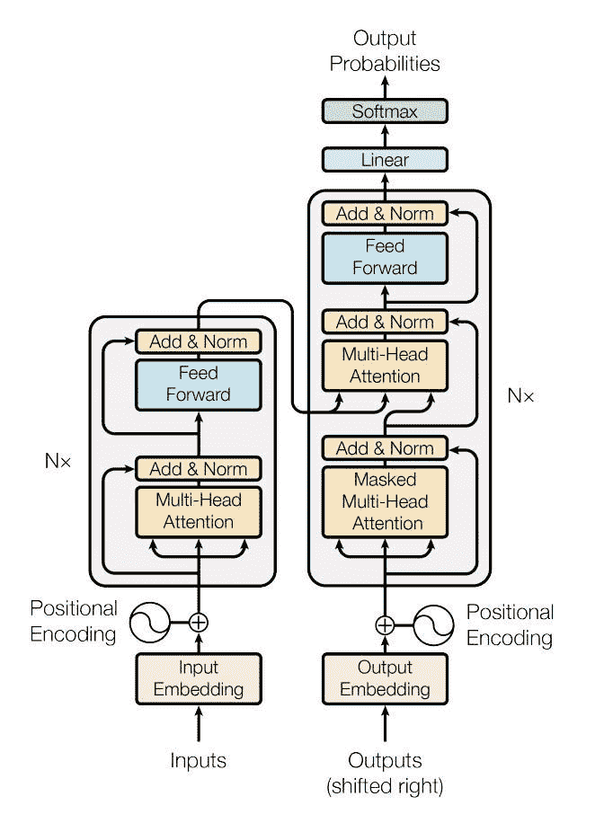
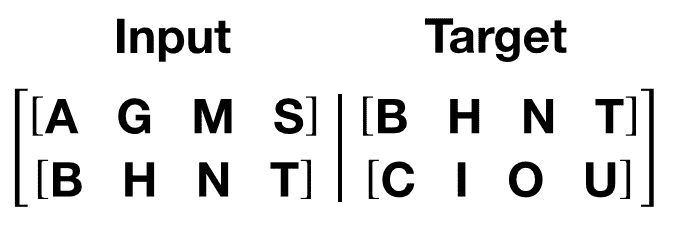

# 使用 nn.Transformer 和 TorchText 进行序列到序列建模

> 原文： [https://pytorch.org/tutorials/beginner/transformer_tutorial.html](https://pytorch.org/tutorials/beginner/transformer_tutorial.html)

注意

单击此处的[下载完整的示例代码](#sphx-glr-download-beginner-transformer-tutorial-py)

这是一个有关如何训练使用 [nn.Transformer](https://pytorch.org/docs/master/nn.html?highlight=nn%20transformer#torch.nn.Transformer) 模块的序列到序列模型的教程。

PyTorch 1.2 版本包括一个基于纸张[的标准变压器模块。 事实证明，该变压器模型在许多序列间问题上具有较高的质量，同时具有更高的可并行性。 `nn.Transformer`模块完全依赖于注意力机制(另一个最近实现为](https://arxiv.org/pdf/1706.03762.pdf) [nn.MultiheadAttention](https://pytorch.org/docs/master/nn.html?highlight=multiheadattention#torch.nn.MultiheadAttention) 的模块）来绘制输入和输出之间的全局依存关系。 `nn.Transformer`模块现在已高度模块化，因此可以轻松地修改/组成单个组件(例如本教程中的 [nn.TransformerEncoder](https://pytorch.org/docs/master/nn.html?highlight=nn%20transformerencoder#torch.nn.TransformerEncoder))。



## 定义模型

在本教程中，我们在语言建模任务上训练`nn.TransformerEncoder`模型。 语言建模任务是为给定单词(或单词序列）遵循单词序列的可能性分配概率。 令牌序列首先传递到嵌入层，然后传递到位置编码层以说明单词的顺序(有关更多详细信息，请参见下一段）。 `nn.TransformerEncoder`由多层 [nn.TransformerEncoderLayer](https://pytorch.org/docs/master/nn.html?highlight=transformerencoderlayer#torch.nn.TransformerEncoderLayer) 组成。 与输入序列一起，还需要一个正方形的注意掩码，因为`nn.TransformerEncoder`中的自注意层只允许出现在该序列中的较早位置。 对于语言建模任务，应屏蔽将来头寸上的所有标记。 为了获得实际的单词，`nn.TransformerEncoder`模型的输出将发送到最终的 Linear 层，然后是 log-Softmax 函数。

```
import math
import torch
import torch.nn as nn
import torch.nn.functional as F

class TransformerModel(nn.Module):

    def __init__(self, ntoken, ninp, nhead, nhid, nlayers, dropout=0.5):
        super(TransformerModel, self).__init__()
        from torch.nn import TransformerEncoder, TransformerEncoderLayer
        self.model_type = 'Transformer'
        self.src_mask = None
        self.pos_encoder = PositionalEncoding(ninp, dropout)
        encoder_layers = TransformerEncoderLayer(ninp, nhead, nhid, dropout)
        self.transformer_encoder = TransformerEncoder(encoder_layers, nlayers)
        self.encoder = nn.Embedding(ntoken, ninp)
        self.ninp = ninp
        self.decoder = nn.Linear(ninp, ntoken)

        self.init_weights()

    def _generate_square_subsequent_mask(self, sz):
        mask = (torch.triu(torch.ones(sz, sz)) == 1).transpose(0, 1)
        mask = mask.float().masked_fill(mask == 0, float('-inf')).masked_fill(mask == 1, float(0.0))
        return mask

    def init_weights(self):
        initrange = 0.1
        self.encoder.weight.data.uniform_(-initrange, initrange)
        self.decoder.bias.data.zero_()
        self.decoder.weight.data.uniform_(-initrange, initrange)

    def forward(self, src):
        if self.src_mask is None or self.src_mask.size(0) != len(src):
            device = src.device
            mask = self._generate_square_subsequent_mask(len(src)).to(device)
            self.src_mask = mask

        src = self.encoder(src) * math.sqrt(self.ninp)
        src = self.pos_encoder(src)
        output = self.transformer_encoder(src, self.src_mask)
        output = self.decoder(output)
        return output

```

`PositionalEncoding`模块注入一些有关令牌在序列中的相对或绝对位置的信息。 位置编码的尺寸与嵌入的尺寸相同，因此可以将两者相加。 在这里，我们使用不同频率的`sine`和`cosine`功能。

```
class PositionalEncoding(nn.Module):

    def __init__(self, d_model, dropout=0.1, max_len=5000):
        super(PositionalEncoding, self).__init__()
        self.dropout = nn.Dropout(p=dropout)

        pe = torch.zeros(max_len, d_model)
        position = torch.arange(0, max_len, dtype=torch.float).unsqueeze(1)
        div_term = torch.exp(torch.arange(0, d_model, 2).float() * (-math.log(10000.0) / d_model))
        pe[:, 0::2] = torch.sin(position * div_term)
        pe[:, 1::2] = torch.cos(position * div_term)
        pe = pe.unsqueeze(0).transpose(0, 1)
        self.register_buffer('pe', pe)

    def forward(self, x):
        x = x + self.pe[:x.size(0), :]
        return self.dropout(x)

```

## 加载和批处理数据

训练过程使用`torchtext`中的 Wikitext-2 数据集。 vocab 对象是基于训练数据集构建的，用于将标记数字化为张量。 从顺序数据开始，`batchify()`函数将数据集排列为列，以修剪掉数据分成大小为`batch_size`的批次后剩余的所有令牌。 例如，以字母为序列(总长度为 26）并且批大小为 4，我们将字母分为 4 个长度为 6 的序列：


这些列被模型视为独立的，这意味着无法了解`G`和`F`的依赖性，但可以进行更有效的批处理。

```
import torchtext
from torchtext.data.utils import get_tokenizer
TEXT = torchtext.data.Field(tokenize=get_tokenizer("basic_english"),
                            init_token='<sos>',
                            eos_token='<eos>',
                            lower=True)
train_txt, val_txt, test_txt = torchtext.datasets.WikiText2.splits(TEXT)
TEXT.build_vocab(train_txt)
device = torch.device("cuda" if torch.cuda.is_available() else "cpu")

def batchify(data, bsz):
    data = TEXT.numericalize([data.examples[0].text])
    # Divide the dataset into bsz parts.
    nbatch = data.size(0) // bsz
    # Trim off any extra elements that wouldn't cleanly fit (remainders).
    data = data.narrow(0, 0, nbatch * bsz)
    # Evenly divide the data across the bsz batches.
    data = data.view(bsz, -1).t().contiguous()
    return data.to(device)

batch_size = 20
eval_batch_size = 10
train_data = batchify(train_txt, batch_size)
val_data = batchify(val_txt, eval_batch_size)
test_data = batchify(test_txt, eval_batch_size)

```

出：

```
downloading wikitext-2-v1.zip
extracting

```

### 产生输入和目标序列的功能

`get_batch()`功能为变压器模型生成输入和目标序列。 它将源数据细分为长度为`bptt`的块。 对于语言建模任务，模型需要以下单词作为`Target`。 例如，如果`bptt`值为 2，则`i` = 0 时，我们将获得以下两个变量：



应该注意的是，这些块沿维度 0，与 Transformer 模型中的`S`维度一致。 批次尺寸`N`沿尺寸 1。

```
bptt = 35
def get_batch(source, i):
    seq_len = min(bptt, len(source) - 1 - i)
    data = source[i:i+seq_len]
    target = source[i+1:i+1+seq_len].view(-1)
    return data, target

```

## 启动实例

使用下面的超参数建立模型。 vocab 的大小等于 vocab 对象的长度。

```
ntokens = len(TEXT.vocab.stoi) # the size of vocabulary
emsize = 200 # embedding dimension
nhid = 200 # the dimension of the feedforward network model in nn.TransformerEncoder
nlayers = 2 # the number of nn.TransformerEncoderLayer in nn.TransformerEncoder
nhead = 2 # the number of heads in the multiheadattention models
dropout = 0.2 # the dropout value
model = TransformerModel(ntokens, emsize, nhead, nhid, nlayers, dropout).to(device)

```

## 运行模型

[CrossEntropyLoss](https://pytorch.org/docs/master/nn.html?highlight=crossentropyloss#torch.nn.CrossEntropyLoss) 用于跟踪损失， [SGD](https://pytorch.org/docs/master/optim.html?highlight=sgd#torch.optim.SGD) 实现随机梯度下降法作为优化器。 初始学习率设置为 5.0。 [StepLR](https://pytorch.org/docs/master/optim.html?highlight=steplr#torch.optim.lr_scheduler.StepLR) 用于通过历时调整学习速率。 在训练过程中，我们使用 [nn.utils.clip_grad_norm_](https://pytorch.org/docs/master/nn.html?highlight=nn%20utils%20clip_grad_norm#torch.nn.utils.clip_grad_norm_) 函数将所有梯度缩放在一起，以防止爆炸。

```
criterion = nn.CrossEntropyLoss()
lr = 5.0 # learning rate
optimizer = torch.optim.SGD(model.parameters(), lr=lr)
scheduler = torch.optim.lr_scheduler.StepLR(optimizer, 1.0, gamma=0.95)

import time
def train():
    model.train() # Turn on the train mode
    total_loss = 0.
    start_time = time.time()
    ntokens = len(TEXT.vocab.stoi)
    for batch, i in enumerate(range(0, train_data.size(0) - 1, bptt)):
        data, targets = get_batch(train_data, i)
        optimizer.zero_grad()
        output = model(data)
        loss = criterion(output.view(-1, ntokens), targets)
        loss.backward()
        torch.nn.utils.clip_grad_norm_(model.parameters(), 0.5)
        optimizer.step()

        total_loss += loss.item()
        log_interval = 200
        if batch % log_interval == 0 and batch > 0:
            cur_loss = total_loss / log_interval
            elapsed = time.time() - start_time
            print('| epoch {:3d} | {:5d}/{:5d} batches | '
                  'lr {:02.2f} | ms/batch {:5.2f} | '
                  'loss {:5.2f} | ppl {:8.2f}'.format(
                    epoch, batch, len(train_data) // bptt, scheduler.get_lr()[0],
                    elapsed * 1000 / log_interval,
                    cur_loss, math.exp(cur_loss)))
            total_loss = 0
            start_time = time.time()

def evaluate(eval_model, data_source):
    eval_model.eval() # Turn on the evaluation mode
    total_loss = 0.
    ntokens = len(TEXT.vocab.stoi)
    with torch.no_grad():
        for i in range(0, data_source.size(0) - 1, bptt):
            data, targets = get_batch(data_source, i)
            output = eval_model(data)
            output_flat = output.view(-1, ntokens)
            total_loss += len(data) * criterion(output_flat, targets).item()
    return total_loss / (len(data_source) - 1)

```

循环遍历。 如果验证损失是迄今为止迄今为止最好的，请保存模型。 在每个时期之后调整学习率。

```
best_val_loss = float("inf")
epochs = 3 # The number of epochs
best_model = None

for epoch in range(1, epochs + 1):
    epoch_start_time = time.time()
    train()
    val_loss = evaluate(model, val_data)
    print('-' * 89)
    print('| end of epoch {:3d} | time: {:5.2f}s | valid loss {:5.2f} | '
          'valid ppl {:8.2f}'.format(epoch, (time.time() - epoch_start_time),
                                     val_loss, math.exp(val_loss)))
    print('-' * 89)

    if val_loss < best_val_loss:
        best_val_loss = val_loss
        best_model = model

    scheduler.step()

```

Out:

```
| epoch   1 |   200/ 2981 batches | lr 5.00 | ms/batch 29.47 | loss  8.04 | ppl  3112.50
| epoch   1 |   400/ 2981 batches | lr 5.00 | ms/batch 28.38 | loss  6.78 | ppl   882.16
| epoch   1 |   600/ 2981 batches | lr 5.00 | ms/batch 28.38 | loss  6.38 | ppl   589.27
| epoch   1 |   800/ 2981 batches | lr 5.00 | ms/batch 28.40 | loss  6.23 | ppl   508.15
| epoch   1 |  1000/ 2981 batches | lr 5.00 | ms/batch 28.41 | loss  6.12 | ppl   454.63
| epoch   1 |  1200/ 2981 batches | lr 5.00 | ms/batch 28.40 | loss  6.09 | ppl   441.65
| epoch   1 |  1400/ 2981 batches | lr 5.00 | ms/batch 28.42 | loss  6.04 | ppl   418.77
| epoch   1 |  1600/ 2981 batches | lr 5.00 | ms/batch 28.41 | loss  6.04 | ppl   421.53
| epoch   1 |  1800/ 2981 batches | lr 5.00 | ms/batch 28.40 | loss  5.96 | ppl   387.98
| epoch   1 |  2000/ 2981 batches | lr 5.00 | ms/batch 28.41 | loss  5.96 | ppl   386.42
| epoch   1 |  2200/ 2981 batches | lr 5.00 | ms/batch 28.42 | loss  5.85 | ppl   346.77
| epoch   1 |  2400/ 2981 batches | lr 5.00 | ms/batch 28.42 | loss  5.89 | ppl   362.54
| epoch   1 |  2600/ 2981 batches | lr 5.00 | ms/batch 28.42 | loss  5.90 | ppl   364.01
| epoch   1 |  2800/ 2981 batches | lr 5.00 | ms/batch 28.43 | loss  5.80 | ppl   329.20
-----------------------------------------------------------------------------------------
| end of epoch   1 | time: 88.26s | valid loss  5.73 | valid ppl   307.01
-----------------------------------------------------------------------------------------
| epoch   2 |   200/ 2981 batches | lr 4.51 | ms/batch 28.58 | loss  5.79 | ppl   328.13
| epoch   2 |   400/ 2981 batches | lr 4.51 | ms/batch 28.42 | loss  5.77 | ppl   319.25
| epoch   2 |   600/ 2981 batches | lr 4.51 | ms/batch 28.42 | loss  5.60 | ppl   270.79
| epoch   2 |   800/ 2981 batches | lr 4.51 | ms/batch 28.44 | loss  5.63 | ppl   279.91
| epoch   2 |  1000/ 2981 batches | lr 4.51 | ms/batch 28.44 | loss  5.58 | ppl   265.99
| epoch   2 |  1200/ 2981 batches | lr 4.51 | ms/batch 28.44 | loss  5.61 | ppl   273.55
| epoch   2 |  1400/ 2981 batches | lr 4.51 | ms/batch 28.42 | loss  5.63 | ppl   277.59
| epoch   2 |  1600/ 2981 batches | lr 4.51 | ms/batch 28.45 | loss  5.66 | ppl   287.09
| epoch   2 |  1800/ 2981 batches | lr 4.51 | ms/batch 28.44 | loss  5.58 | ppl   266.00
| epoch   2 |  2000/ 2981 batches | lr 4.51 | ms/batch 28.44 | loss  5.61 | ppl   272.58
| epoch   2 |  2200/ 2981 batches | lr 4.51 | ms/batch 28.44 | loss  5.50 | ppl   244.59
| epoch   2 |  2400/ 2981 batches | lr 4.51 | ms/batch 28.44 | loss  5.57 | ppl   262.87
| epoch   2 |  2600/ 2981 batches | lr 4.51 | ms/batch 28.44 | loss  5.58 | ppl   265.65
| epoch   2 |  2800/ 2981 batches | lr 4.51 | ms/batch 28.44 | loss  5.51 | ppl   246.48
-----------------------------------------------------------------------------------------
| end of epoch   2 | time: 88.16s | valid loss  5.53 | valid ppl   253.40
-----------------------------------------------------------------------------------------
| epoch   3 |   200/ 2981 batches | lr 4.29 | ms/batch 28.58 | loss  5.55 | ppl   256.02
| epoch   3 |   400/ 2981 batches | lr 4.29 | ms/batch 28.43 | loss  5.55 | ppl   256.76
| epoch   3 |   600/ 2981 batches | lr 4.29 | ms/batch 28.46 | loss  5.36 | ppl   212.31
| epoch   3 |   800/ 2981 batches | lr 4.29 | ms/batch 28.44 | loss  5.42 | ppl   225.88
| epoch   3 |  1000/ 2981 batches | lr 4.29 | ms/batch 28.46 | loss  5.38 | ppl   217.24
| epoch   3 |  1200/ 2981 batches | lr 4.29 | ms/batch 28.45 | loss  5.41 | ppl   223.82
| epoch   3 |  1400/ 2981 batches | lr 4.29 | ms/batch 28.43 | loss  5.42 | ppl   226.87
| epoch   3 |  1600/ 2981 batches | lr 4.29 | ms/batch 28.44 | loss  5.47 | ppl   238.34
| epoch   3 |  1800/ 2981 batches | lr 4.29 | ms/batch 28.45 | loss  5.41 | ppl   223.13
| epoch   3 |  2000/ 2981 batches | lr 4.29 | ms/batch 28.45 | loss  5.44 | ppl   230.23
| epoch   3 |  2200/ 2981 batches | lr 4.29 | ms/batch 28.44 | loss  5.32 | ppl   205.28
| epoch   3 |  2400/ 2981 batches | lr 4.29 | ms/batch 28.44 | loss  5.40 | ppl   221.60
| epoch   3 |  2600/ 2981 batches | lr 4.29 | ms/batch 28.45 | loss  5.42 | ppl   224.76
| epoch   3 |  2800/ 2981 batches | lr 4.29 | ms/batch 28.44 | loss  5.34 | ppl   209.38
-----------------------------------------------------------------------------------------
| end of epoch   3 | time: 88.18s | valid loss  5.48 | valid ppl   240.75
-----------------------------------------------------------------------------------------

```

## 使用测试数据集评估模型

应用最佳模型以检查测试数据集的结果。

```
test_loss = evaluate(best_model, test_data)
print('=' * 89)
print('| End of training | test loss {:5.2f} | test ppl {:8.2f}'.format(
    test_loss, math.exp(test_loss)))
print('=' * 89)

```

Out:

```
=========================================================================================
| End of training | test loss  5.39 | test ppl   219.13
=========================================================================================

```

**脚本的总运行时间：**(4 分钟 39.556 秒）

[`Download Python source code: transformer_tutorial.py`](../_downloads/f53285338820248a7c04a947c5110f7b/transformer_tutorial.py) [`Download Jupyter notebook: transformer_tutorial.ipynb`](../_downloads/dca13261bbb4e9809d1a3aa521d22dd7/transformer_tutorial.ipynb)

[由狮身人面像画廊](https://sphinx-gallery.readthedocs.io)生成的画廊