# 强化学习(DQN）教程

> 原文： [https://pytorch.org/tutorials/intermediate/reinforcement_q_learning.html](https://pytorch.org/tutorials/intermediate/reinforcement_q_learning.html)

注意

单击此处的[下载完整的示例代码](#sphx-glr-download-intermediate-reinforcement-q-learning-py)

**作者**　　： [Adam Paszke](https://github.com/apaszke)

**翻译校验**： [Dynmi Wang](https://github.com/Dynmi)

本教程介绍了如何使用 PyTorch 在 [OpenAI Gym](https://gym.openai.com/) 上的 CartPole-v0 任务上训练深度 Q-learning(DQN)智能体。

**任务**

智能体必须在两个动作之间做出决定-向左或向右移动小车来使其上的杆保持直立。 您可以在 [Gym 网站](https://gym.openai.com/envs/CartPole-v0)上找到具有各种算法和可视化的官方排行榜。


当智能体观察环境的当前状态并选择一个动作时，环境将转换到新状态，并且还会返回表示该动作结果的奖励。 在此任务中，每前进一个时间步，奖励为+1，并且如果杆子掉落得太远或小车离中心的距离超过 2.4 个单位，则对局终止。 这意味着性能更好的操作方案将持续更长的时间，从而积累更大的回报。

Cartpole任务的设计为智能点输入代表环境状态(位置、速度等）的4个实际值。 但是，神经网络可以完全通过查看场景来解决任务，因此我们将以小车为中心的一部分屏幕作为输入。 因此，我们的结果无法直接与官方排行榜上的结果进行比较-我们的任务更加艰巨。 不幸的是，这确实减慢了训练速度，因为我们必须渲染所有帧。

严格地说，我们将以当前帧和前一个帧之间的差异来呈现状态。这将允许代理从一张图像中考虑杆子的速度。

**软件包**

首先，让我们导入所需的软件包。 首先，我们需要针对环境的[体育馆](https://gym.openai.com/docs)(使用 &lt;cite&gt;pip install Gym&lt;/cite&gt; 进行安装）。 我们还将使用 PyTorch 中的以下内容：

*   神经网络(`torch.nn`）
*   优化(`torch.optim`）
*   自动微分(`torch.autograd`）
*   专门做视觉处理的工具(`torchvision`-[单独的软件包](https://github.com/pytorch/vision)）。

```
import gym
import math
import random
import numpy as np
import matplotlib
import matplotlib.pyplot as plt
from collections import namedtuple
from itertools import count
from PIL import Image

import torch
import torch.nn as nn
import torch.optim as optim
import torch.nn.functional as F
import torchvision.transforms as T

env = gym.make('CartPole-v0').unwrapped

# set up matplotlib
is_ipython = 'inline' in matplotlib.get_backend()
if is_ipython:
    from IPython import display

plt.ion()

# if gpu is to be used
device = torch.device("cuda" if torch.cuda.is_available() else "cpu")

```

## 经验回放

我们将使用经验回放内存来训练我们的 DQN。 它存储智能体观察到的转换，使我们以后可以重用此数据。 通过从中随机抽样，可以构建成批的过渡。 实践表明，这极大稳定并改进了 DQN 训练过程。

为此，我们需要两个类：

*   `Transition`　  -一个命名元组，表示我们环境中的单个转换。 本质上它是将(state,action）对映射到紧随其后的(next_state,reward）结果，状态是屏幕差异图像，如下所述。
*   `ReplayMemory`　-一个有界大小的循环缓冲区，用于保存最近观察到的转换。 它还实现了`.sample()`方法，从经验库中随机选择一批transitions，方便直接拿去训练智能体。

```
Transition = namedtuple('Transition',
                        ('state', 'action', 'next_state', 'reward'))

class ReplayMemory(object):

    def __init__(self, capacity):
        self.capacity = capacity
        self.memory = []
        self.position = 0

    def push(self, *args):
        """Saves a transition."""
        if len(self.memory) < self.capacity:
            self.memory.append(None)
        self.memory[self.position] = Transition(*args)
        self.position = (self.position + 1) % self.capacity

    def sample(self, batch_size):
        return random.sample(self.memory, batch_size)

    def __len__(self):
        return len(self.memory)

```

现在我们来定义自己的模型。 首先快速回顾一下DQN基础知识。

## DQN 算法

我们的环境是确定的，故为简单起见，这里提出的所有方程也都是确定性的。 在强化学习文献中，它们还将包含对环境中随机转换的期望。

我们的目标是训练并得到一种试图最大化带衰减的累积奖励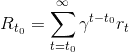的策略，其中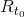也称为_收获_。 衰减率应该是和之间的常数，以确保总和收敛。 它使不确定的远期回报对于我们的智能体而言不如对它可以相当有信心的近期回报重要。

Q-learning背后的思想是，如果我们有一个函数，它可以告诉我们我们的回报是什么，如果我们要在特定状态下采取行动，那么我们可以轻松地构建一个最大化收获的策略：

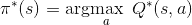

但是，我们并不了解世界的一切，因此我们无法访问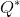。 但是，由于神经网络是通用的函数逼近器，因此我们可以轻松创建一个并训练它为类似于的函数。

对于我们的训练更新规则，我们将假设－－某些策略的每个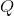函数都遵循 Bellman 方程：

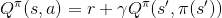

等式两边之间的差异称为时间差误差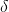：

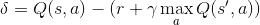

为了尽量减小这个错误，我们将使用 [Huber 损失](https://en.wikipedia.org/wiki/Huber_loss)。 当误差较小时，Huber 损失类似于均方误差；而当误差较大时，表现为平均绝对误差－－这使得当的估计值非常嘈杂时，对异常值的鲁棒性更强。 我们通过从经验回放中取样的一批转换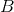来计算：

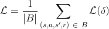


### Q－Network

我们的模型将是一个卷积神经网络，该卷积神经网络将吸收当前屏幕补丁与先前屏幕补丁之间的差异。 它有两个输出，分别表示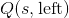和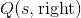(其中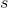是网络的输入）。 实际上，网络正尝试预测在给定当前输入的情况下执行每个action的_预期收获_。

```
class DQN(nn.Module):

    def __init__(self, h, w, outputs):
        super(DQN, self).__init__()
        self.conv1 = nn.Conv2d(3, 16, kernel_size=5, stride=2)
        self.bn1 = nn.BatchNorm2d(16)
        self.conv2 = nn.Conv2d(16, 32, kernel_size=5, stride=2)
        self.bn2 = nn.BatchNorm2d(32)
        self.conv3 = nn.Conv2d(32, 32, kernel_size=5, stride=2)
        self.bn3 = nn.BatchNorm2d(32)

        # Number of Linear input connections depends on output of conv2d layers
        # and therefore the input image size, so compute it.
        def conv2d_size_out(size, kernel_size = 5, stride = 2):
            return (size - (kernel_size - 1) - 1) // stride  + 1
        convw = conv2d_size_out(conv2d_size_out(conv2d_size_out(w)))
        convh = conv2d_size_out(conv2d_size_out(conv2d_size_out(h)))
        linear_input_size = convw * convh * 32
        self.head = nn.Linear(linear_input_size, outputs)

    # Called with either one element to determine next action, or a batch
    # during optimization. Returns tensor([[left0exp,right0exp]...]).
    def forward(self, x):
        x = F.relu(self.bn1(self.conv1(x)))
        x = F.relu(self.bn2(self.conv2(x)))
        x = F.relu(self.bn3(self.conv3(x)))
        return self.head(x.view(x.size(0), -1))

```

### 获取输入

以下代码是用于从环境中提取和处理渲染图像的实用程序。 它使用`torchvision`包，可轻松组合图像变换。 运行单元后，它将显示它提取的示例帧。 
```
resize = T.Compose([T.ToPILImage(),
                    T.Resize(40, interpolation=Image.CUBIC),
                    T.ToTensor()])

def get_cart_location(screen_width):
    world_width = env.x_threshold * 2
    scale = screen_width / world_width
    return int(env.state[0] * scale + screen_width / 2.0)  # MIDDLE OF CART

def get_screen():
    # Returned screen requested by gym is 400x600x3, but is sometimes larger
    # such as 800x1200x3\. Transpose it into torch order (CHW).
    screen = env.render(mode='rgb_array').transpose((2, 0, 1))
    # Cart is in the lower half, so strip off the top and bottom of the screen
    _, screen_height, screen_width = screen.shape
    screen = screen[:, int(screen_height*0.4):int(screen_height * 0.8)]
    view_width = int(screen_width * 0.6)
    cart_location = get_cart_location(screen_width)
    if cart_location < view_width // 2:
        slice_range = slice(view_width)
    elif cart_location > (screen_width - view_width // 2):
        slice_range = slice(-view_width, None)
    else:
        slice_range = slice(cart_location - view_width // 2,
                            cart_location + view_width // 2)
    # Strip off the edges, so that we have a square image centered on a cart
    screen = screen[:, :, slice_range]
    # Convert to float, rescale, convert to torch tensor
    # (this doesn't require a copy)
    screen = np.ascontiguousarray(screen, dtype=np.float32) / 255
    screen = torch.from_numpy(screen)
    # Resize, and add a batch dimension (BCHW)
    return resize(screen).unsqueeze(0).to(device)

env.reset()
plt.figure()
plt.imshow(get_screen().cpu().squeeze(0).permute(1, 2, 0).numpy(),
           interpolation='none')
plt.title('Example extracted screen')
plt.show()

```

## 训练

### 超参数和配置

该单元实例化我们的模型及其优化器，并定义超参数：

*   `select_action`-  将根据 epsilon-greedy策略选择一个行为。 简而言之，我们有时会使用我们的模型来选择行为，有时我们只会对其中一个进行统一采样。 选择随机行为的概率将从`EPS_START`开始，并朝`EPS_END`呈指数衰减。 `EPS_DECAY`控制衰减率。
*   `plot_durations`-  一个帮助绘制迭代次数持续时间，以及过去100迭代次数的平均值(官方评估中使用的度量）。 迭代次数将在包含主训练循环的单元下方，并在每次迭代之后更新。

```
BATCH_SIZE = 128
GAMMA = 0.999
EPS_START = 0.9
EPS_END = 0.05
EPS_DECAY = 200
TARGET_UPDATE = 10

# 获取屏幕大小，以便我们可以根据从ai-gym返回的形状正确初始化层。
# 这一点上的平常尺寸接近3x40x90，这是在get_screen(）中抑制和缩小的渲染缓冲区的结果。
init_screen = get_screen()
_, _, screen_height, screen_width = init_screen.shape

# Get number of actions from gym action space
n_actions = env.action_space.n

policy_net = DQN(screen_height, screen_width, n_actions).to(device)
target_net = DQN(screen_height, screen_width, n_actions).to(device)
target_net.load_state_dict(policy_net.state_dict())
target_net.eval()

optimizer = optim.RMSprop(policy_net.parameters())
memory = ReplayMemory(10000)

steps_done = 0

def select_action(state):
    global steps_done
    sample = random.random()
    eps_threshold = EPS_END + (EPS_START - EPS_END) * \
        math.exp(-1\. * steps_done / EPS_DECAY)
    steps_done += 1
    if sample > eps_threshold:
        with torch.no_grad():
            # t.max(1) will return largest column value of each row.
            # second column on max result is index of where max element was
            # found, so we pick action with the larger expected reward.
            return policy_net(state).max(1)[1].view(1, 1)
    else:
        return torch.tensor([[random.randrange(n_actions)]], device=device, dtype=torch.long)

episode_durations = []

def plot_durations():
    plt.figure(2)
    plt.clf()
    durations_t = torch.tensor(episode_durations, dtype=torch.float)
    plt.title('Training...')
    plt.xlabel('Episode')
    plt.ylabel('Duration')
    plt.plot(durations_t.numpy())
    # Take 100 episode averages and plot them too
    if len(durations_t) >= 100:
        means = durations_t.unfold(0, 100, 1).mean(1).view(-1)
        means = torch.cat((torch.zeros(99), means))
        plt.plot(means.numpy())

    plt.pause(0.001)  # pause a bit so that plots are updated
    if is_ipython:
        display.clear_output(wait=True)
        display.display(plt.gcf())

```

### 训练循环

最后，训练我们的模型，其实就是优化我们的智能体。

在这里，您可以找到执行优化步骤的`optimize_model`函数。 它首先对一批进行采样，将所有张量连接成一个张量，计算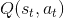和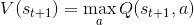，然后将它们组合成我们的损失。 根据定义，如果为对局结束状态，则设置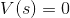。 我们还使用目标网络来计算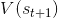，以提高稳定性。 目标网络的权重大部分时间保持不变，但每隔一段时间就会更新一次价值网络权重。这是一组固定的步骤，但为了简单起见，我们将使用迭代次数。

```
def optimize_model():
    if len(memory) < BATCH_SIZE:
        return
    transitions = memory.sample(BATCH_SIZE)
    # 转置批样本(有关详细说明，请参阅https://stackoverflow.com/a/19343/3343043）。
    # 这会将转换的批处理数组转换为批处理数组的转换。
    batch = Transition(*zip(*transitions))

    # 计算非最终状态的掩码并连接批处理元素(最终状态将是模拟结束后的状态）
    non_final_mask = torch.tensor(tuple(map(lambda s: s is not None,
                                          batch.next_state)), device=device, dtype=torch.bool)
    non_final_next_states = torch.cat([s for s in batch.next_state
                                                if s is not None])
    state_batch = torch.cat(batch.state)
    action_batch = torch.cat(batch.action)
    reward_batch = torch.cat(batch.reward)

    # 计算Q(s_t, a)-模型计算 Q(s_t)，然后选择所采取行动的列。
    # 这些是根据策略网络对每个批处理状态所采取的操作。
    state_action_values = policy_net(state_batch).gather(1, action_batch)

    # 计算下一个状态的V(s_{t+1})。
    # 非最终状态下一个状态的预期操作值是基于“旧”目标网络计算的；选择max(1)[0]的最佳奖励。
    # 这是基于掩码合并的，这样当状态为最终状态时，我们将获得预期状态值或0。

    next_state_values = torch.zeros(BATCH_SIZE, device=device)
    next_state_values[non_final_mask] = target_net(non_final_next_states).max(1)[0].detach()
    # 计算期望Q值
    expected_state_action_values = (next_state_values * GAMMA) + reward_batch

    # 计算Huber损失
    loss = F.smooth_l1_loss(state_action_values, expected_state_action_values.unsqueeze(1))

    # 优化模型
    optimizer.zero_grad()
    loss.backward()
    for param in policy_net.parameters():
        param.grad.data.clamp_(-1, 1)
    optimizer.step()

```

在下面，您可以找到主要的训练循环。 首先，我们重置环境并初始化`state` Tensor。 然后，我们采样一个动作，执行它，观察下一个屏幕和奖励(总是 1），并一次优化我们的模型。 当情节结束(我们的模型失败）时，我们重新开始循环。

下面，将 &lt;cite&gt;num_episodes&lt;/cite&gt; 设置得较小。 您应该下载笔记本并运行更多的片段，例如 300 多个片段，以实现有意义的持续时间改进。

```
num_episodes = 50
for i_episode in range(num_episodes):
    # Initialize the environment and state
    env.reset()
    last_screen = get_screen()
    current_screen = get_screen()
    state = current_screen - last_screen
    for t in count():
        # Select and perform an action
        action = select_action(state)
        _, reward, done, _ = env.step(action.item())
        reward = torch.tensor([reward], device=device)

        # Observe new state
        last_screen = current_screen
        current_screen = get_screen()
        if not done:
            next_state = current_screen - last_screen
        else:
            next_state = None

        # Store the transition in memory
        memory.push(state, action, next_state, reward)

        # Move to the next state
        state = next_state

        # Perform one step of the optimization (on the target network)
        optimize_model()
        if done:
            episode_durations.append(t + 1)
            plot_durations()
            break
    # Update the target network, copying all weights and biases in DQN
    if i_episode % TARGET_UPDATE == 0:
        target_net.load_state_dict(policy_net.state_dict())

print('Complete')
env.render()
env.close()
plt.ioff()
plt.show()

```

下面这张图是对整个DQN算法的总结：


行为可以是随机选择的，也可以是基于一个策略，从Gym环境中获取下一步的样本。我们将结果记录在经验回放库中，并在每次迭代中运行优化步骤。优化从经验回放中随机抽取一批来训练新策略。 “旧的”target_net也用于优化计算预期的Q值；它偶尔会更新以保持其最新。

**脚本的总运行时间：**(0 分钟 0.000 秒）

[`Download Python source code: reinforcement_q_learning.py`](../_downloads/b8954cc7b372cac10a92b8c6183846a3/reinforcement_q_learning.py) [`Download Jupyter notebook: reinforcement_q_learning.ipynb`](../_downloads/2b3f06b04b5e96e4772746c20fcb4dcc/reinforcement_q_learning.ipynb)

[由狮身人面像画廊](https://sphinx-gallery.readthedocs.io)生成的画廊
