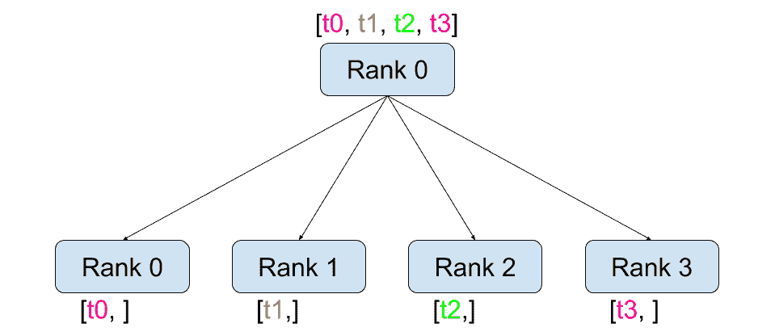
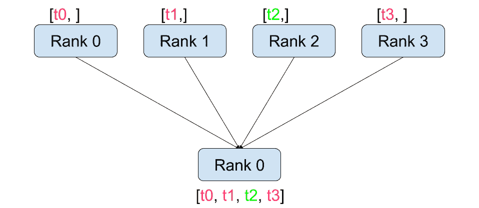
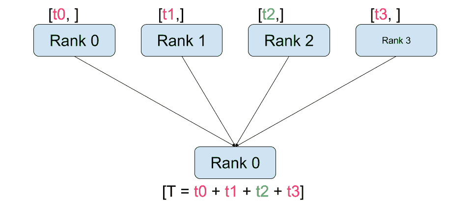
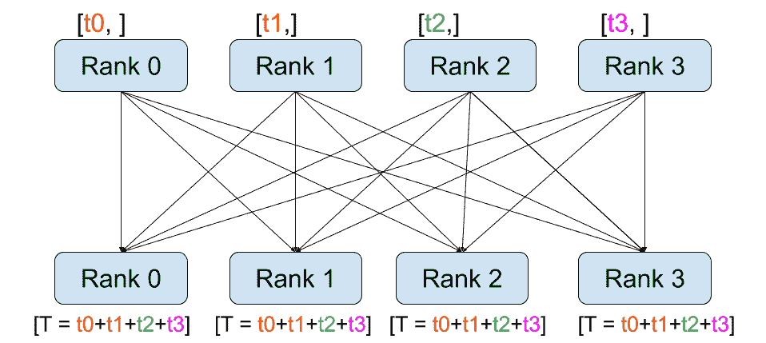
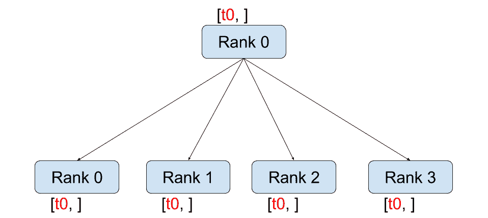
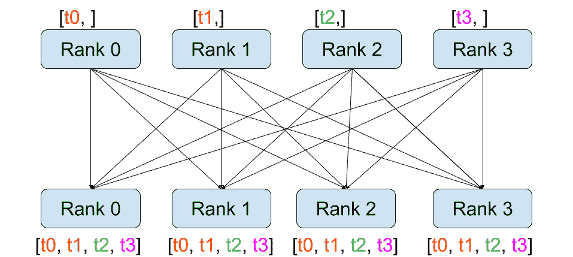

# 用 PyTorch 编写分布式应用程序

> 原文： [https://pytorch.org/tutorials/intermediate/dist_tuto.html](https://pytorch.org/tutorials/intermediate/dist_tuto.html)

**作者**：[SébArnold](https://seba1511.com)

在这个简短的教程中，我们将介绍 PyTorch 的分布式软件包。 我们将了解如何设置分布式设置，使用不同的交流策略以及如何仔细查看软件包的内部结构。

## 设定

PyTorch 中包含的分布式软件包(即`torch.distributed`）使研究人员和从业人员可以轻松地并行化他们在跨进程和机器集群的计算。 为此，它利用了传递消息的语义，从而允许每个进程将数据传递给其他任何进程。 与并行处理(HTG1）包相反，进程可以使用不同的通信后端，而不仅限于在同一台计算机上执行。

为了开始，我们需要能够同时运行多个进程的能力。 如果您有权访问计算群集，则应咨询本地系统管理员或使用您喜欢的协调工具。 (例如 [pdsh](https://linux.die.net/man/1/pdsh) ， [clustershell](https://cea-hpc.github.io/clustershell/) 或[其他](https://slurm.schedmd.com/)）。出于本教程的目的，我们将使用以下模板使用一台计算机并分叉多个进程。

```
"""run.py:"""
#!/usr/bin/env python
import os
import torch
import torch.distributed as dist
from torch.multiprocessing import Process

def run(rank, size):
    """ Distributed function to be implemented later. """
    pass

def init_process(rank, size, fn, backend='gloo'):
    """ Initialize the distributed environment. """
    os.environ['MASTER_ADDR'] = '127.0.0.1'
    os.environ['MASTER_PORT'] = '29500'
    dist.init_process_group(backend, rank=rank, world_size=size)
    fn(rank, size)

if __name__ == "__main__":
    size = 2
    processes = []
    for rank in range(size):
        p = Process(target=init_process, args=(rank, size, run))
        p.start()
        processes.append(p)

    for p in processes:
        p.join()

```

上面的脚本产生了两个进程，每个进程将设置分布式环境，初始化进程组(`dist.init_process_group`），最后执行给定的`run`函数。

让我们看一下`init_process`功能。 它确保每个进程将能够使用相同的 IP 地址和端口通过主机进行协调。 请注意，我们使用了`gloo`后端，但其他后端也可用。 (请参阅 [5.1 节](#communication-backends)），我们将在本教程的结尾部分介绍`dist.init_process_group`中发生的魔术，但实际上，它允许进程通过共享位置相互进行通信。

## 点对点通讯

[](../_images/send_recv.png)

发送和接收

数据从一个进程到另一个进程的传输称为点对点通信。 这些是通过`send`和`recv`功能或它们的_直接_对应部分`isend`和`irecv`实现的。

```
"""Blocking point-to-point communication."""

def run(rank, size):
    tensor = torch.zeros(1)
    if rank == 0:
        tensor += 1
        # Send the tensor to process 1
        dist.send(tensor=tensor, dst=1)
    else:
        # Receive tensor from process 0
        dist.recv(tensor=tensor, src=0)
    print('Rank ', rank, ' has data ', tensor[0])

```

在上面的示例中，两个进程都从零张量开始，然后进程 0 递增张量并将其发送到进程 1，以便它们都以 1.0 结尾。 请注意，进程 1 需要分配内存以存储它将接收的数据。

另请注意，`send` / `recv`被**阻塞**：两个过程都停止，直到通信完成。 另一方面，**无阻塞**； 脚本继续执行，方法返回`Work`对象，我们可以选择`wait()`对象。

```
"""Non-blocking point-to-point communication."""

def run(rank, size):
    tensor = torch.zeros(1)
    req = None
    if rank == 0:
        tensor += 1
        # Send the tensor to process 1
        req = dist.isend(tensor=tensor, dst=1)
        print('Rank 0 started sending')
    else:
        # Receive tensor from process 0
        req = dist.irecv(tensor=tensor, src=0)
        print('Rank 1 started receiving')
    req.wait()
    print('Rank ', rank, ' has data ', tensor[0])

```

使用立即数时，我们必须谨慎使用已发送和已接收的张量。 由于我们不知道何时将数据传递给其他进程，因此在`req.wait()`完成之前，我们既不应该修改发送的张量也不应该访问接收的张量。 换一种说法，

*   在`dist.isend()`之后写入`tensor`将导致不确定的行为。
*   在`dist.irecv()`之后从`tensor`读取将导致不确定的行为。

但是，在执行`req.wait()`之后，我们可以确保进行了通信，并且`tensor[0]`中存储的值为 1.0。

当我们希望对流程的通信进行精细控制时，点对点通信非常有用。 它们可用于实现精美的算法，例如[百度的 DeepSpeech](https://github.com/baidu-research/baidu-allreduce) 或 [Facebook 的大规模实验](https://research.fb.com/publications/imagenet1kin1h/)中使用的算法。(请参阅 [4.1 节](#our-own-ring-allreduce)）

## 集体交流

| [](../_images/scatter.png)分散 | [](../_images/gather.png)收集 |
| [](../_images/reduce.png)降低 | [](../_images/all_reduce.png)全减少 |
| [](../_images/broadcast.png)广播 | [](../_images/all_gather.png)全聚 |

与点对点通信相反，集合允许跨**组**中所有进程的通信模式。 小组是我们所有过程的子集。 要创建组，我们可以将等级列表传递给`dist.new_group(group)`。 默认情况下，集合在所有进程(也称为**世界**）上执行。 例如，为了获得所有过程中所有张量的总和，我们可以使用`dist.all_reduce(tensor, op, group)`集合。

```
""" All-Reduce example."""
def run(rank, size):
    """ Simple point-to-point communication. """
    group = dist.new_group([0, 1])
    tensor = torch.ones(1)
    dist.all_reduce(tensor, op=dist.reduce_op.SUM, group=group)
    print('Rank ', rank, ' has data ', tensor[0])

```

由于我们需要组中所有张量的总和，因此我们将`dist.reduce_op.SUM`用作化简运算符。 一般来说，任何可交换的数学运算都可以用作运算符。 PyTorch 开箱即用，带有 4 个这样的运算符，它们都在元素级运行：

*   `dist.reduce_op.SUM`，
*   `dist.reduce_op.PRODUCT`，
*   `dist.reduce_op.MAX`，
*   `dist.reduce_op.MIN`。

除了`dist.all_reduce(tensor, op, group)`之外，PyTorch 中目前共有 6 个集合体。

*   `dist.broadcast(tensor, src, group)`：将`tensor`从`src`复制到所有其他进程。
*   `dist.reduce(tensor, dst, op, group)`：将`op`应用于所有`tensor`，并将结果存储在`dst`中。
*   `dist.all_reduce(tensor, op, group)`：与 reduce 相同，但是结果存储在所有进程中。
*   `dist.scatter(tensor, src, scatter_list, group)`：将张量`scatter_list[i]`复制到过程。
*   `dist.gather(tensor, dst, gather_list, group)`：从`dst`中的所有进程复制`tensor`。
*   `dist.all_gather(tensor_list, tensor, group)`：将所有进程中的`tensor`从所有进程复制到`tensor_list`。
*   `dist.barrier(group)`：阻止&lt;cite&gt;组&lt;/cite&gt;中的所有进程，直到每个进程都进入此功能。

## 分布式训练

**注意：**您可以在此 GitHub 存储库的[中找到本节的示例脚本。](https://github.com/seba-1511/dist_tuto.pth/)

现在我们了解了分布式模块的工作原理，让我们用它编写一些有用的东西。 我们的目标是复制 [DistributedDataParallel](https://pytorch.org/docs/stable/nn.html#torch.nn.parallel.DistributedDataParallel) 的功能。 当然，这将是一个教学示例，在现实世界中，您应该使用上面链接的经过官方测试，优化的最佳版本。

很简单，我们想要实现随机梯度下降的分布式版本。 我们的脚本将允许所有进程在其数据批次上计算其模型的梯度，然后平均其梯度。 为了在更改进程数时确保相似的收敛结果，我们首先必须对数据集进行分区。 (您也可以使用 [tnt.dataset.SplitDataset](https://github.com/pytorch/tnt/blob/master/torchnet/dataset/splitdataset.py#L4) 代替下面的代码段。）

```
""" Dataset partitioning helper """
class Partition(object):

    def __init__(self, data, index):
        self.data = data
        self.index = index

    def __len__(self):
        return len(self.index)

    def __getitem__(self, index):
        data_idx = self.index[index]
        return self.data[data_idx]

class DataPartitioner(object):

    def __init__(self, data, sizes=[0.7, 0.2, 0.1], seed=1234):
        self.data = data
        self.partitions = []
        rng = Random()
        rng.seed(seed)
        data_len = len(data)
        indexes = [x for x in range(0, data_len)]
        rng.shuffle(indexes)

        for frac in sizes:
            part_len = int(frac * data_len)
            self.partitions.append(indexes[0:part_len])
            indexes = indexes[part_len:]

    def use(self, partition):
        return Partition(self.data, self.partitions[partition])

```

使用上面的代码片段，我们现在可以使用以下几行简单地对任何数据集进行分区：

```
""" Partitioning MNIST """
def partition_dataset():
    dataset = datasets.MNIST('./data', train=True, download=True,
                             transform=transforms.Compose([
                                 transforms.ToTensor(),
                                 transforms.Normalize((0.1307,), (0.3081,))
                             ]))
    size = dist.get_world_size()
    bsz = 128 / float(size)
    partition_sizes = [1.0 / size for _ in range(size)]
    partition = DataPartitioner(dataset, partition_sizes)
    partition = partition.use(dist.get_rank())
    train_set = torch.utils.data.DataLoader(partition,
                                         batch_size=bsz,
                                         shuffle=True)
    return train_set, bsz

```

假设我们有 2 个副本，则每个进程的`train_set`为 60000/2 = 30000 个样本。 我们还将批量大小除以副本数，以使_整体_批量大小保持为 128。

现在，我们可以编写通常的向前-向后优化训练代码，并添加一个函数调用以平均模型的梯度。 (以下内容主要是受 [PyTorch MNIST 官方示例](https://github.com/pytorch/examples/blob/master/mnist/main.py)的启发）。

```
""" Distributed Synchronous SGD Example """
def run(rank, size):
    torch.manual_seed(1234)
    train_set, bsz = partition_dataset()
    model = Net()
    optimizer = optim.SGD(model.parameters(),
                          lr=0.01, momentum=0.5)

    num_batches = ceil(len(train_set.dataset) / float(bsz))
    for epoch in range(10):
        epoch_loss = 0.0
        for data, target in train_set:
            optimizer.zero_grad()
            output = model(data)
            loss = F.nll_loss(output, target)
            epoch_loss += loss.item()
            loss.backward()
            average_gradients(model)
            optimizer.step()
        print('Rank ', dist.get_rank(), ', epoch ',
              epoch, ': ', epoch_loss / num_batches)

```

仍然需要执行`average_gradients(model)`函数，该函数只需要一个模型并在整个世界上平均其梯度即可。

```
""" Gradient averaging. """
def average_gradients(model):
    size = float(dist.get_world_size())
    for param in model.parameters():
        dist.all_reduce(param.grad.data, op=dist.reduce_op.SUM)
        param.grad.data /= size

```

_等_！ 我们成功实现了分布式同步 SGD，并且可以在大型计算机集群上训练任何模型。

**注意：**尽管从技术上来说最后一句话是是正确的，但要实现同步 SGD 的生产级实现，还需要[更多技巧。 同样，请使用经过测试和优化的](https://seba-1511.github.io/dist_blog)[。](https://pytorch.org/docs/stable/nn.html#torch.nn.parallel.DistributedDataParallel)

### 我们自己的环减少

另一个挑战是，假设我们要实现 DeepSpeech 的高效环网减少。 使用点对点集合很容易实现。

```
""" Implementation of a ring-reduce with addition. """
def allreduce(send, recv):
    rank = dist.get_rank()
    size = dist.get_world_size()
    send_buff = th.zeros(send.size())
    recv_buff = th.zeros(send.size())
    accum = th.zeros(send.size())
    accum[:] = send[:]

    left = ((rank - 1) + size) % size
    right = (rank + 1) % size

    for i in range(size - 1):
        if i % 2 == 0:
            # Send send_buff
            send_req = dist.isend(send_buff, right)
            dist.recv(recv_buff, left)
            accum[:] += recv[:]
        else:
            # Send recv_buff
            send_req = dist.isend(recv_buff, right)
            dist.recv(send_buff, left)
            accum[:] += send[:]
        send_req.wait()
    recv[:] = accum[:]

```

在上面的脚本中，`allreduce(send, recv)`函数的签名与 PyTorch 中的签名略有不同。 它需要一个`recv`张量，并将所有`send`张量的总和存储在其中。 作为练习留给读者，我们的版本与 DeepSpeech 中的版本之间仍然有一个区别：它们的实现将梯度张量划分为_个块_，以便最佳地利用通信带宽。 (提示： [torch.chunk](https://pytorch.org/docs/stable/torch.html#torch.chunk))

## 进阶主题

现在，我们准备发现`torch.distributed`的一些更高级的功能。 由于涉及的内容很多，因此本节分为两个小节：

1.  通讯后端：我们在这里学习如何使用 MPI 和 Gloo 进行 GPU-GPU 通讯。
2.  初始化方法：我们了解如何最好地设置`dist.init_process_group()`中的初始协调阶段。

### 通讯后端

`torch.distributed`最优雅的方面之一是它具有抽象能力，并且可以在不同的后端之上构建。 如前所述，目前在 PyTorch 中实现了三个后端：Glo，NCCL 和 MPI。 它们各自具有不同的规格和权衡，具体取决于所需的用例。 可以在中找到支持功能的对照表。

**Gloo 后端**

到目前为止，我们已经广泛使用 [Gloo 后端](https://github.com/facebookincubator/gloo)。 它作为开发平台非常方便，因为它已包含在预编译的 PyTorch 二进制文件中，并且可在 Linux(自 0.2 开始）和 macOS(自 1.3 开始）上运行。 它支持 CPU 上的所有点对点和集合操作，以及 GPU 上的所有集合操作。 CUDA 张量的集体运算的实现未像 NCCL 后端提供的那样优化。

如您所知，如果将`model`放在 GPU 上，我们的分布式 SGD 示例将无法正常工作。 为了使用多个 GPU，让我们还进行以下修改：

1.  使用`device = torch.device("cuda:{}".format(rank))`
2.  `model = Net()`  `model = Net().to(device)`
3.  使用`data, target = data.to(device), target.to(device)`

经过上述修改，我们的模型现在可以在两个 GPU 上训练，您可以使用`watch nvidia-smi`监视其使用情况。

**MPI 后端**

消息传递接口(MPI）是来自高性能计算领域的标准化工具。 它允许进行点对点和集体通信，并且是`torch.distributed` API 的主要灵感。 存在几种针对不同目的而优化的 MPI 实现(例如 [Open-MPI](https://www.open-mpi.org/) ， [MVAPICH2](http://mvapich.cse.ohio-state.edu/) ， [Intel MPI](https://software.intel.com/en-us/intel-mpi-library))。 使用 MPI 后端的优势在于 MPI 在大型计算机群集上的广泛可用性和高水平的优化。 [一些](https://developer.nvidia.com/mvapich) [最近的](https://developer.nvidia.com/ibm-spectrum-mpi) [实现](https://www.open-mpi.org/)也能够利用 CUDA IPC 和 GPU Direct 技术来避免通过 CPU 进行内存复制。

不幸的是，PyTorch 的二进制文件不能包含 MPI 实现，我们将不得不手动对其进行重新编译。 幸运的是，鉴于编译后，PyTorch 会单独查看以查找可用的 MPI 实现，因此此过程相当简单。 以下步骤通过从源安装 PyTorch [来安装 MPI 后端。](https://github.com/pytorch/pytorch#from-source)

1.  创建并激活您的 Anaconda 环境，按照[指南](https://github.com/pytorch/pytorch#from-source)的要求安装所有先决条件，但是**尚未**运行。
2.  选择并安装您喜欢的 MPI 实现。 请注意，启用支持 CUDA 的 MPI 可能需要一些其他步骤。 在我们的情况下，我们将坚持不支持 GPU 的 Open-MPI _：`conda install -c conda-forge openmpi`_
3.  现在，转到克隆的 PyTorch 存储库并执行`python setup.py install`。

为了测试我们新安装的后端，需要进行一些修改。

1.  将`if __name__ == '__main__':`下的内容替换为`init_process(0, 0, run, backend='mpi')`。
2.  运行`mpirun -n 4 python myscript.py`。

这些更改的原因是，MPI 需要在生成流程之前创建自己的环境。 MPI 也将生成自己的进程，并执行[初始化方法](#initialization-methods)中描述的握手，使`init_process_group`的`rank`和`size`参数多余。 实际上，这非常强大，因为您可以将附加参数传递给`mpirun`，以便为每个进程定制计算资源。 (诸如每个进程的内核数量，将计算机手动分配给特定等级，以及[等](https://www.open-mpi.org/faq/?category=running#mpirun-hostfile)之类的东西。）这样做，您应该获得与其他通信后端相同的熟悉输出。

**NCCL 后端**

[NCCL 后端](https://github.com/nvidia/nccl)提供了针对 CUDA 张量的集体操作的优化实现。 如果仅将 CUDA 张量用于集体操作，请考虑使用此后端以获得最佳性能。 NCCL 后端包含在具有 CUDA 支持的预构建二进制文件中。

### 初始化方法

为了完成本教程，我们来谈谈我们称为的第一个功能：`dist.init_process_group(backend, init_method)`。 特别是，我们将介绍负责每个过程之间初始协调步骤的不同初始化方法。 这些方法使您可以定义协调方式。 根据您的硬件设置，这些方法之一自然应该比其他方法更合适。 除了以下各节之外，您还应该查看[官方文档](https://pytorch.org/docs/stable/distributed.html#initialization)。

**环境变量**

在本教程中，我们一直在使用环境变量初始化方法。 通过在所有计算机上设置以下四个环境变量，所有进程将能够正确连接到主服务器，获取有关其他进程的信息，最后与它们握手。

*   `MASTER_PORT`：计算机上的空闲端口，它将托管等级为 0 的进程。
*   `MASTER_ADDR`：将以等级 0 托管进程的计算机的 IP 地址。
*   `WORLD_SIZE`：进程总数，这样主机可以知道要等待多少个工人。
*   `RANK`：每个进程的等级，因此他们将知道它是否是工人的主人。

**共享文件系统**

共享文件系统要求所有进程都有权访问共享文件系统，并将通过共享文件进行协调。 这意味着每个进程都将打开文件，写入文件信息，然后等到每个人都打开文件。 之后，所有必需的信息将可用于所有过程。 为了避免争用情况，文件系统必须通过 [fcntl](http://man7.org/linux/man-pages/man2/fcntl.2.html) 支持锁定。

```
dist.init_process_group(
    init_method='file:///mnt/nfs/sharedfile',
    rank=args.rank,
    world_size=4)

```

**TCP**

通过提供等级 0 和可访问的端口号的进程的 IP 地址，可以实现通过 TCP 进行初始化。 在这里，所有工作人员都可以连接到等级为 0 的流程，并交换有关如何相互联系的信息。

```
dist.init_process_group(
    init_method='tcp://10.1.1.20:23456',
    rank=args.rank,
    world_size=4)

```

<center>

**致谢**

</center>

我要感谢 PyTorch 开发人员在实现，文档和测试方面做得如此出色。 当代码不清楚时，我总是可以依靠[文档](https://pytorch.org/docs/stable/distributed.html)或[测试](https://github.com/pytorch/pytorch/blob/master/test/test_distributed.py)来找到答案。 我要特别感谢 Soumith Chintala，Adam Paszke 和 Natalia Gimelshein 提供的有见地的评论并回答了有关初稿的问题。