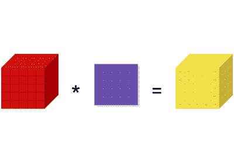
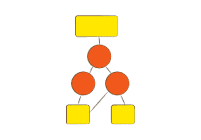
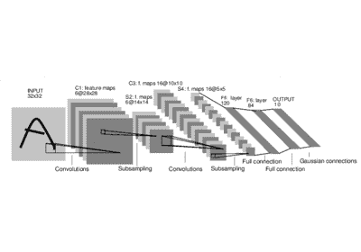
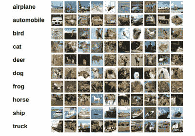
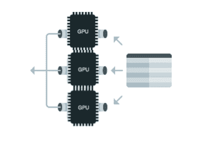

# 使用 PyTorch 进行深度学习：60 分钟的闪电战

> 原文： [https://pytorch.org/tutorials/beginner/deep_learning_60min_blitz.html](https://pytorch.org/tutorials/beginner/deep_learning_60min_blitz.html)

**作者**： [Soumith Chintala](http://soumith.ch)

<iframe allow="accelerometer; encrypted-media; gyroscope; picture-in-picture" allowfullscreen="" frameborder="0" height="315" src="https://www.youtube.com/embed/u7x8RXwLKcA" width="560"></iframe>

本教程的目标：

*   全面了解 PyTorch 的 Tensor 库和神经网络。
*   训练一个小型神经网络对图像进行分类

_本教程假定您对 numpy 有基本的了解。_

注意

确保已安装[torch](https://github.com/pytorch/pytorch)和[torchvision](https://github.com/pytorch/vision)软件包。

[什么是 PyTorch？](blitz/tensor_tutorial.html)

[Autograd：自动分化](blitz/autograd_tutorial.html)

[神经网络](blitz/neural_networks_tutorial.html)

[训练分类器](blitz/cifar10_tutorial.html)

[可选：数据并行](blitz/data_parallel_tutorial.html)
