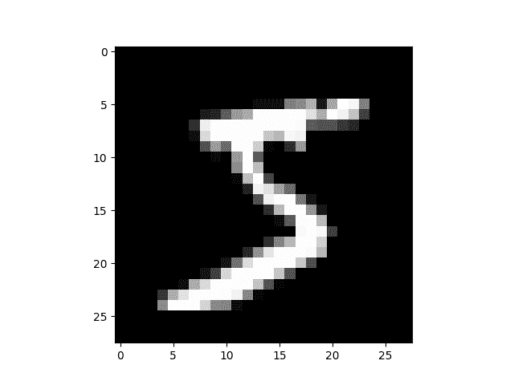

# torch.nn 到底是什么？

> 原文： [https://pytorch.org/tutorials/beginner/nn_tutorial.html](https://pytorch.org/tutorials/beginner/nn_tutorial.html)

注意

单击此处的[下载完整的示例代码](#sphx-glr-download-beginner-nn-tutorial-py)

作者：杰里米·霍华德(Jeremy Howard）， [fast.ai](https://www.fast.ai) 。 感谢 Rachel Thomas 和 Francisco Ingham。

我们建议将本教程作为笔记本而不是脚本来运行。 要下载笔记本(.ipynb）文件，请单击页面顶部的链接。

PyTorch 提供设计优雅的模块和类 [torch.nn](https://pytorch.org/docs/stable/nn.html) ， [torch.optim](https://pytorch.org/docs/stable/optim.html) ， [Dataset](https://pytorch.org/docs/stable/data.html?highlight=dataset#torch.utils.data.Dataset) 和 [DataLoader](https://pytorch.org/docs/stable/data.html?highlight=dataloader#torch.utils.data.DataLoader) 来帮助您创建和训练神经网络。 为了充分利用它们的功能并针对您的问题对其进行自定义，您需要真正地了解他们的工作。 为了建立这种理解，我们将首先在 MNIST 数据集上训练基本神经网络，而无需使用这些模型的任何功能； 我们最初只会使用最基本的 PyTorch 张量功能。 然后，我们将一次从`torch.nn`，`torch.optim`，`Dataset`或`DataLoader`中逐个添加一个功能，确切地显示每个功能，以及如何使代码更简洁或更灵活。

**本教程假定您已经安装了 PyTorch，并且熟悉张量操作的基础知识。** (如果您熟悉 Numpy 数组操作，将会发现此处使用的 PyTorch 张量操作几乎相同）。

## MNIST 数据设置

我们将使用经典的 [MNIST](http://deeplearning.net/data/mnist/) 数据集，该数据集由手绘数字的黑白图像组成(介于 0 到 9 之间）。

我们将使用 [pathlib](https://docs.python.org/3/library/pathlib.html) 处理路径(Python 3 标准库的一部分），并使用[请求](http://docs.python-requests.org/en/master/)下载数据集。 我们只会在使用模块时才导入它们，因此您可以确切地看到正在使用模块的每个细节。

```
from pathlib import Path
import requests

DATA_PATH = Path("data")
PATH = DATA_PATH / "mnist"

PATH.mkdir(parents=True, exist_ok=True)

URL = "http://deeplearning.net/data/mnist/"
FILENAME = "mnist.pkl.gz"

if not (PATH / FILENAME).exists():
        content = requests.get(URL + FILENAME).content
        (PATH / FILENAME).open("wb").write(content)

```

该数据集为 numpy 数组格式，并已使用 pickle(一种用于序列化数据的 python 特定格式）存储。

```
import pickle
import gzip

with gzip.open((PATH / FILENAME).as_posix(), "rb") as f:
        ((x_train, y_train), (x_valid, y_valid), _) = pickle.load(f, encoding="latin-1")

```

每个图像为 28 x 28，并存储被拍平长度为 784(= 28x28）的向量。 让我们来看一个； 我们需要先将其重塑为 2d。

```
from matplotlib import pyplot
import numpy as np

pyplot.imshow(x_train[0].reshape((28, 28)), cmap="gray")
print(x_train.shape)

```



Out：

```
(50000, 784)

```

PyTorch 使用`torch.tensor`而不是 numpy 数组，因此我们需要转换数据。

```
import torch

x_train, y_train, x_valid, y_valid = map(
    torch.tensor, (x_train, y_train, x_valid, y_valid)
)
n, c = x_train.shape
x_train, x_train.shape, y_train.min(), y_train.max()
print(x_train, y_train)
print(x_train.shape)
print(y_train.min(), y_train.max())

```

Out:

```
tensor([[0., 0., 0.,  ..., 0., 0., 0.],
        [0., 0., 0.,  ..., 0., 0., 0.],
        [0., 0., 0.,  ..., 0., 0., 0.],
        ...,
        [0., 0., 0.,  ..., 0., 0., 0.],
        [0., 0., 0.,  ..., 0., 0., 0.],
        [0., 0., 0.,  ..., 0., 0., 0.]]) tensor([5, 0, 4,  ..., 8, 4, 8])
torch.Size([50000, 784])
tensor(0) tensor(9)

```

## 从零开始的神经网络(无 torch.nn）

首先，我们仅使用 PyTorch 张量操作创建模型。 我们假设您已经熟悉神经网络的基础知识。 (如果您不是，则可以在 [course.fast.ai](https://course.fast.ai) 中学习它们）。

PyTorch 提供了创建随机或零填充张量的方法，我们将使用它们来为简单的线性模型创建权重和偏差。 这些只是常规张量，还有一个非常特殊的附加值：我们告诉 PyTorch 它们需要梯度。 这使 PyTorch 记录了在张量上完成的所有操作，因此它可以在反向传播时_自动_地计算梯度！

对于权重，我们在初始化之后设置`requires_grad` **，因为我们不希望该步骤包含在梯度中。 (请注意，PyTorch 中的尾随`_`表示该操作是就地执行的。）**

Note

我们在这里用 [Xavier 初始化](http://proceedings.mlr.press/v9/glorot10a/glorot10a.pdf)(通过乘以 1 / sqrt(n））来初始化权重。

```
import math

weights = torch.randn(784, 10) / math.sqrt(784)
weights.requires_grad_()
bias = torch.zeros(10, requires_grad=True)

```

由于 PyTorch 具有自动计算梯度的功能，我们可以将任何标准的 Python 函数(或可调用对象）用作模型！ 因此，让我们编写一个简单的矩阵乘法和广播加法来创建一个简单的线性模型。 我们还需要激活函数，因此我们将编写并使用 $log_softmax$ 。 请记住：尽管 PyTorch 提供了许多预先编写的损失函数，激活函数等，但是您可以使用纯 Python 轻松编写自己的函数。 PyTorch 甚至会自动为您的函数创建快速 GPU 或矢量化的 CPU 代码。

```
def log_softmax(x):
    return x - x.exp().sum(-1).log().unsqueeze(-1)

def model(xb):
    return log_softmax(xb @ weights + bias)

```

在上面，`@`代表点积运算。 我们将对一批数据(在这种情况下为 64 张图像）调用函数。 这是一个_前向传播_。 请注意，由于我们从随机权重开始，因此在这一阶段，我们的预测不会比随机预测更好。

```
bs = 64  # batch size

xb = x_train[0:bs]  # a mini-batch from x
preds = model(xb)  # predictions
preds[0], preds.shape
print(preds[0], preds.shape)

```

Out:

```
tensor([-2.0790, -2.6699, -2.2096, -1.6754, -1.7844, -2.8664, -2.2463, -2.7637,
        -3.0813, -2.6712], grad_fn=<SelectBackward>) torch.Size([64, 10])

```

如您所见，`preds`张量不仅包含张量值，还包含梯度函数。 稍后我们将使用它进行反向传播。

让我们实现负对数似然作为损失函数(同样，我们只能使用标准 Python）：

```
def nll(input, target):
    return -input[range(target.shape[0]), target].mean()

loss_func = nll

```

让我们用随机模型来检查损失，以便我们以后看向后传播后是否可以改善。

```
yb = y_train[0:bs]
print(loss_func(preds, yb))

```

Out:

```
tensor(2.3076, grad_fn=<NegBackward>)

```

我们还实现一个函数来计算模型的准确性。 对于每个预测，如果具有最大值的索引与目标值匹配，则该预测是正确的。

```
def accuracy(out, yb):
    preds = torch.argmax(out, dim=1)
    return (preds == yb).float().mean()

```

让我们检查一下随机模型的准确性，以便我们可以看出随着损失的增加，准确性是否有所提高。

```
print(accuracy(preds, yb))

```

Out:

```
tensor(0.1250)

```

现在，我们可以运行一个训练循环。 对于每次迭代，我们将：

*   选择一个小批量数据(大小为`bs`）
*   使用模型进行预测
*   计算损失
*   `loss.backward()`更新模型的梯度，在这种情况下为`weights`和`bias`。

现在，我们使用这些梯度来更新权重和偏差。 我们在`torch.no_grad()`上下文管理器中执行此操作，因为我们不希望在下一步的梯度计算中记录这些操作。 您可以在上阅读有关 PyTorch 的 Autograd 如何记录操作[的更多信息。](https://pytorch.org/docs/stable/notes/autograd.html)

然后，将梯度设置为零，以便为下一个循环做好准备。 否则，我们的梯度会记录所有已发生操作的运行记录(即`loss.backward()` 将梯度_添加_到已存储的内容中，而不是替换它们）。

TIP

您可以使用标准的 python 调试器逐步浏览 PyTorch 代码，从而可以在每一步检查各种变量值。 取消注释以下`set_trace()`即可尝试。

```
from IPython.core.debugger import set_trace

lr = 0.5  # learning rate
epochs = 2  # how many epochs to train for

for epoch in range(epochs):
    for i in range((n - 1) // bs + 1):
        #         set_trace()
        start_i = i * bs
        end_i = start_i + bs
        xb = x_train[start_i:end_i]
        yb = y_train[start_i:end_i]
        pred = model(xb)
        loss = loss_func(pred, yb)

        loss.backward()
        with torch.no_grad():
            weights -= weights.grad * lr
            bias -= bias.grad * lr
            weights.grad.zero_()
            bias.grad.zero_()

```

就是这样：我们完全从头开始创建并训练了一个最小的神经网络(在这种情况下，是逻辑回归，因为我们没有隐藏的层）！

让我们检查损失和准确性，并将其与我们之前获得的进行比较。 我们希望损失会减少，准确性会增加，而且确实如此。

```
print(loss_func(model(xb), yb), accuracy(model(xb), yb))

```

Out:

```
tensor(0.0799, grad_fn=<NegBackward>) tensor(1.)

```

## 使用 torch.nn.functional

现在，我们将重构代码，使其与以前相同，只是我们将开始利用 PyTorch 的`nn`类使其更加简洁和灵活。 从这里开始的每一步，我们都应该使代码中的一个或多个：更短，更易理解和/或更灵活。

第一步也是最简单的步骤，就是用`torch.nn.functional`(通常按照惯例将其导入到名称空间`F`中）替换我们的手写激活和损失函数，从而缩短代码长度。 该模块包含`torch.nn`库中的所有函数(而该库的其他部分包含类）。 除了广泛的损失和激活函数外，您还会在这里找到一些合适的函数来创建神经网络，例如池化函数。 (还有一些用于进行卷积，线性图层等的函数，但是正如我们将看到的那样，通常可以使用库的其他部分来更好地处理这些函数。）

如果您使用的是负对数似然损失和 log softmax 激活，那么 Pytorch 会提供将两者结合的单个函数`F.cross_entropy`。 因此，我们甚至可以从模型中删除激活函数。

```
import torch.nn.functional as F

loss_func = F.cross_entropy

def model(xb):
    return xb @ weights + bias

```

请注意，我们不再在`model`函数中调用`log_softmax`。 让我们确认我们的损失和准确性与以前相同：

```
print(loss_func(model(xb), yb), accuracy(model(xb), yb))

```

Out:

```
tensor(0.0799, grad_fn=<NllLossBackward>) tensor(1.)

```

## 使用 nn.Module 进行重构

接下来，我们将使用`nn.Module`和`nn.Parameter`进行更清晰，更简洁的训练循环。 我们将`nn.Module`子类化(它本身是一个类并且能够跟踪状态）。 在这种情况下，我们要创建一个类，该类包含前进步骤的权重，偏差和方法。 `nn.Module`具有许多我们将要使用的属性和方法(例如`.parameters()`和`.zero_grad()`）。

Note

`nn.Module`(大写 M）是 PyTorch 的特定概念，也是我们将经常使用的一个类。 `nn.Module`不要与(小写`m`）[模块](https://docs.python.org/3/tutorial/modules.html)的 Python 概念混淆，该模块是可以导入的 Python 代码文件。

```
from torch import nn

class Mnist_Logistic(nn.Module):
    def __init__(self):
        super().__init__()
        self.weights = nn.Parameter(torch.randn(784, 10) / math.sqrt(784))
        self.bias = nn.Parameter(torch.zeros(10))

    def forward(self, xb):
        return xb @ self.weights + self.bias

```

由于我们现在使用的是对象而不是仅使用函数，因此我们首先必须实例化模型：

```
model = Mnist_Logistic()

```

现在我们可以像以前一样计算损失。 请注意，`nn.Module`对象的使用就像它们是函数一样(即，它们是_可调用的_），但是在后台 Pytorch 会自动调用我们的`forward`方法。

```
print(loss_func(model(xb), yb))

```

Out:

```
tensor(2.4205, grad_fn=<NllLossBackward>)

```

以前，在我们的训练循环中，我们必须按名称更新每个参数的值，并手动将每个参数的 grads 分别归零，如下所示：

```
with torch.no_grad():
    weights -= weights.grad * lr
    bias -= bias.grad * lr
    weights.grad.zero_()
    bias.grad.zero_()

```

现在我们可以利用 model.parameters(）和 model.zero_grad(）(它们都由 PyTorch 为`nn.Module`定义）来使这些步骤更简洁，并且更不会出现忘记某些参数的错误，特别是在 我们有一个更复杂的模型：

```
with torch.no_grad():
    for p in model.parameters(): p -= p.grad * lr
    model.zero_grad()

```

我们将把小的训练循环包装在`fit`函数中，以便稍后再运行。

```
def fit():
    for epoch in range(epochs):
        for i in range((n - 1) // bs + 1):
            start_i = i * bs
            end_i = start_i + bs
            xb = x_train[start_i:end_i]
            yb = y_train[start_i:end_i]
            pred = model(xb)
            loss = loss_func(pred, yb)

            loss.backward()
            with torch.no_grad():
                for p in model.parameters():
                    p -= p.grad * lr
                model.zero_grad()

fit()

```

让我们仔细检查一下我们的损失是否下降了：

```
print(loss_func(model(xb), yb))

```

Out:

```
tensor(0.0796, grad_fn=<NllLossBackward>)

```

## 使用 nn.Linear 重构

我们继续重构我们的代码。 代替手动定义和初始化`self.weights`和`self.bias`并计算`xb  @ self.weights + self.bias`，我们将对线性层使用 Pytorch 类 [nn.Linear](https://pytorch.org/docs/stable/nn.html#linear-layers) ，这将为我们完成所有工作。 Pytorch 具有许多类型的预定义层，可以大大简化我们的代码，并且通常也可以使其速度更快。

```
class Mnist_Logistic(nn.Module):
    def __init__(self):
        super().__init__()
        self.lin = nn.Linear(784, 10)

    def forward(self, xb):
        return self.lin(xb)

```

我们用与以前相同的方式实例化模型并计算损失：

```
model = Mnist_Logistic()
print(loss_func(model(xb), yb))

```

Out:

```
tensor(2.3077, grad_fn=<NllLossBackward>)

```

我们仍然可以使用与以前相同的`fit`方法。

```
fit()

print(loss_func(model(xb), yb))

```

Out:

```
tensor(0.0824, grad_fn=<NllLossBackward>)

```

## 使用优化重构

Pytorch 还提供了一个包含各种优化算法的软件包`torch.optim`。 我们可以使用优化器中的`step`方法采取向前的步骤，而不是手动更新每个参数。

这就是我们将要替换之前手动编码的优化步骤：

```
with torch.no_grad():
    for p in model.parameters(): p -= p.grad * lr
    model.zero_grad()

```

我们只需使用下面的代替：

```
opt.step()
opt.zero_grad()

```

(`optim.zero_grad()`将梯度重置为 0，我们需要在计算下一个小批量的梯度之前调用它。）

```
from torch import optim

```

我们将定义一个小函数来创建模型和优化器，以便将来再次使用。

```
def get_model():
    model = Mnist_Logistic()
    return model, optim.SGD(model.parameters(), lr=lr)

model, opt = get_model()
print(loss_func(model(xb), yb))

for epoch in range(epochs):
    for i in range((n - 1) // bs + 1):
        start_i = i * bs
        end_i = start_i + bs
        xb = x_train[start_i:end_i]
        yb = y_train[start_i:end_i]
        pred = model(xb)
        loss = loss_func(pred, yb)

        loss.backward()
        opt.step()
        opt.zero_grad()

print(loss_func(model(xb), yb))

```

Out:

```
tensor(2.2542, grad_fn=<NllLossBackward>)
tensor(0.0811, grad_fn=<NllLossBackward>)

```

## 使用数据集进行重构

PyTorch 有一个抽象的 Dataset 类。 数据集可以是具有`__len__`函数(由 Python 的标准`len`函数调用）和具有`__getitem__`函数作为对其进行索引的一种方法。 [本教程](https://pytorch.org/tutorials/beginner/data_loading_tutorial.html)演示了一个不错的示例，该示例创建一个自定义`FacialLandmarkDataset`类作为`Dataset`的子类。

PyTorch 的 [TensorDataset](https://pytorch.org/docs/stable/_modules/torch/utils/data/dataset.html#TensorDataset) 是一个数据集包装张量。 通过定义索引的长度和方式，这也为我们提供了沿张量的一维进行迭代，索引和切片的方法。 这将使我们在训练的同一行中更容易访问自变量和因变量。

```
from torch.utils.data import TensorDataset

```

`x_train`和`y_train`都可以合并为一个`TensorDataset`，这将更易于迭代和切片。

```
train_ds = TensorDataset(x_train, y_train)

```

以前，我们不得不分别遍历 x 和 y 值的迷你批处理：

```
xb = x_train[start_i:end_i]
yb = y_train[start_i:end_i]

```

现在，我们可以将两个步骤一起执行：

```
xb,yb = train_ds[i*bs : i*bs+bs]

```

```
model, opt = get_model()

for epoch in range(epochs):
    for i in range((n - 1) // bs + 1):
        xb, yb = train_ds[i * bs: i * bs + bs]
        pred = model(xb)
        loss = loss_func(pred, yb)

        loss.backward()
        opt.step()
        opt.zero_grad()

print(loss_func(model(xb), yb))

```

Out:

```
tensor(0.0819, grad_fn=<NllLossBackward>)

```

## 使用 DataLoader 进行重构

Pytorch 的`DataLoader`负责批次管理。 您可以从任何`Dataset`创建一个`DataLoader`。 `DataLoader`使迭代迭代变得更加容易。 不必使用`train_ds[i*bs : i*bs+bs]`，DataLoader 会自动为我们提供每个小批量。

```
from torch.utils.data import DataLoader

train_ds = TensorDataset(x_train, y_train)
train_dl = DataLoader(train_ds, batch_size=bs)

```

以前，我们的循环遍历批处理(xb，yb），如下所示：

```
for i in range((n-1)//bs + 1):
    xb,yb = train_ds[i*bs : i*bs+bs]
    pred = model(xb)

```

现在，我们的循环更加简洁了，因为(xb，yb）是从数据加载器自动加载的：

```
for xb,yb in train_dl:
    pred = model(xb)

```

```
model, opt = get_model()

for epoch in range(epochs):
    for xb, yb in train_dl:
        pred = model(xb)
        loss = loss_func(pred, yb)

        loss.backward()
        opt.step()
        opt.zero_grad()

print(loss_func(model(xb), yb))

```

Out:

```
tensor(0.0822, grad_fn=<NllLossBackward>)

```

得益于 Pytorch 的`nn.Module`，`nn.Parameter`，`Dataset`和`DataLoader`，我们的训练循环现在变得更小，更容易理解。 现在，让我们尝试添加在实践中创建有效模型所需的基本功能。

## 添加验证

在第 1 部分中，我们只是试图建立一个合理的训练循环以用于我们的训练数据。 实际上，您**总是**也应该具有[验证集](https://www.fast.ai/2017/11/13/validation-sets/)，以便识别您是否过度拟合。

打乱训练数据顺序对于防止批次与过度拟合之间的相关性[很重要](https://www.quora.com/Does-the-order-of-training-data-matter-when-training-neural-networks)。 另一方面，无论我们是否打乱验证集，验证损失都是相同的。 由于打乱顺序需要花费更多时间，因此打乱验证集数据顺序没有任何意义。

我们将验证集的批次大小设为训练集的两倍。 这是因为验证集不需要反向传播，因此占用的内存更少(不需要存储渐变）。 我们利用这一优势来使用更大的批量，并更快地计算损失。

```
train_ds = TensorDataset(x_train, y_train)
train_dl = DataLoader(train_ds, batch_size=bs, shuffle=True)

valid_ds = TensorDataset(x_valid, y_valid)
valid_dl = DataLoader(valid_ds, batch_size=bs * 2)

```

我们将在每个 epoch 结束时计算并打印验证损失。

(请注意，我们总是在训练之前调用`model.train()`，并在推断之前调用`model.eval()`，因为诸如`nn.BatchNorm2d`和`nn.Dropout`之类的图层会使用它们，以确保这些不同阶段的行为正确。）

```
model, opt = get_model()

for epoch in range(epochs):
    model.train()
    for xb, yb in train_dl:
        pred = model(xb)
        loss = loss_func(pred, yb)

        loss.backward()
        opt.step()
        opt.zero_grad()

    model.eval()
    with torch.no_grad():
        valid_loss = sum(loss_func(model(xb), yb) for xb, yb in valid_dl)

    print(epoch, valid_loss / len(valid_dl))

```

Out:

```
0 tensor(0.2903)
1 tensor(0.3343)

```

## 创建 fit(）和 get_data(）

现在，我们将自己进行一些重构。 由于我们经历了两次相似的过程来计算训练集和验证集的损失，因此我们将其设为自己的函数`loss_batch`，该函数可计算一批损失。

我们将优化器传入训练集中，并使用它执行反向传播。 对于验证集，我们没有通过优化程序，因此该方法不会执行反向传播。

```
def loss_batch(model, loss_func, xb, yb, opt=None):
    loss = loss_func(model(xb), yb)

    if opt is not None:
        loss.backward()
        opt.step()
        opt.zero_grad()

    return loss.item(), len(xb)

```

`fit`运行必要的操作来训练我们的模型，并计算每个时期的训练和验证损失。

```
import numpy as np

def fit(epochs, model, loss_func, opt, train_dl, valid_dl):
    for epoch in range(epochs):
        model.train()
        for xb, yb in train_dl:
            loss_batch(model, loss_func, xb, yb, opt)

        model.eval()
        with torch.no_grad():
            losses, nums = zip(
                *[loss_batch(model, loss_func, xb, yb) for xb, yb in valid_dl]
            )
        val_loss = np.sum(np.multiply(losses, nums)) / np.sum(nums)

        print(epoch, val_loss)

```

`get_data`返回用于训练和验证集的数据加载器。

```
def get_data(train_ds, valid_ds, bs):
    return (
        DataLoader(train_ds, batch_size=bs, shuffle=True),
        DataLoader(valid_ds, batch_size=bs * 2),
    )

```

现在，我们获取数据加载器和拟合模型的整个过程可以在 3 行代码中运行：

```
train_dl, valid_dl = get_data(train_ds, valid_ds, bs)
model, opt = get_model()
fit(epochs, model, loss_func, opt, train_dl, valid_dl)

```

Out:

```
0 0.34931180425286296
1 0.28620736759901044

```

您可以使用这些基本的 3 行代码来训练各种各样的模型。 让我们看看是否可以使用它们来训练卷积神经网络(CNN）！

## 切换到 CNN

现在，我们将构建具有三个卷积层的神经网络。 由于上一节中的所有函数都不包含任何有关模型组合的内容，因此我们将能够使用它们来训练 CNN，而无需进行任何修改。

我们将使用 Pytorch 的预定义 [Conv2d](https://pytorch.org/docs/stable/nn.html#torch.nn.Conv2d) 类作为我们的卷积层。 我们定义具有 3 个卷积层的 CNN。 每个卷积后跟一个 ReLU。 最后，我们执行平均池化。 (请注意，`view`是 numpy 的`reshape`的 PyTorch 版本）

```
class Mnist_CNN(nn.Module):
    def __init__(self):
        super().__init__()
        self.conv1 = nn.Conv2d(1, 16, kernel_size=3, stride=2, padding=1)
        self.conv2 = nn.Conv2d(16, 16, kernel_size=3, stride=2, padding=1)
        self.conv3 = nn.Conv2d(16, 10, kernel_size=3, stride=2, padding=1)

    def forward(self, xb):
        xb = xb.view(-1, 1, 28, 28)
        xb = F.relu(self.conv1(xb))
        xb = F.relu(self.conv2(xb))
        xb = F.relu(self.conv3(xb))
        xb = F.avg_pool2d(xb, 4)
        return xb.view(-1, xb.size(1))

lr = 0.1

```

[动量](https://cs231n.github.io/neural-networks-3/#sgd)是随机梯度下降的一种变体，它也考虑了以前的更新，通常可以加快训练速度。

```
model = Mnist_CNN()
opt = optim.SGD(model.parameters(), lr=lr, momentum=0.9)

fit(epochs, model, loss_func, opt, train_dl, valid_dl)

```

Out:

```
0 0.33537127304077147
1 0.24059089585542678

```

## nn.Sequential

`torch.nn`还有另一个灵活的类，可以用来简化我们的代码： [Sequential](https://pytorch.org/docs/stable/nn.html#torch.nn.Sequential) 。 `Sequential`对象以顺序方式运行其中包含的每个模块。 这是编写神经网络的一种简单方法。

要利用此优势，我们需要能够从给定的函数轻松定义**自定义层**。 例如，PyTorch 没有_视图_图层，我们需要为网络创建一个图层。 `Lambda`将创建一个层，然后在使用`Sequential`定义网络时可以使用该层。

```
class Lambda(nn.Module):
    def __init__(self, func):
        super().__init__()
        self.func = func

    def forward(self, x):
        return self.func(x)

def preprocess(x):
    return x.view(-1, 1, 28, 28)

```

用`Sequential`创建的模型很简单：

```
model = nn.Sequential(
    Lambda(preprocess),
    nn.Conv2d(1, 16, kernel_size=3, stride=2, padding=1),
    nn.ReLU(),
    nn.Conv2d(16, 16, kernel_size=3, stride=2, padding=1),
    nn.ReLU(),
    nn.Conv2d(16, 10, kernel_size=3, stride=2, padding=1),
    nn.ReLU(),
    nn.AvgPool2d(4),
    Lambda(lambda x: x.view(x.size(0), -1)),
)

opt = optim.SGD(model.parameters(), lr=lr, momentum=0.9)

fit(epochs, model, loss_func, opt, train_dl, valid_dl)

```

Out:

```
0 0.4098783682346344
1 0.2799181687355041

```

## 包装 DataLoader

虽然我们的 CNN 网络很简洁，但是它只能在 MNIST 数据集上面有效，因为

*   MNIST 数据集假设输入为 28 * 28 长向量
*   MNIST 数据集假设 CNN 的最终网格尺寸为 4 * 4(这是因为

我们使用的平均池化卷积核的大小）

让我们摆脱这两个假设，因此我们的模型需要适用于任何 2d 单通道图像。 首先，我们可以删除初始的 Lambda 层，但将数据预处理移至生成器中：

```
def preprocess(x, y):
    return x.view(-1, 1, 28, 28), y

class WrappedDataLoader:
    def __init__(self, dl, func):
        self.dl = dl
        self.func = func

    def __len__(self):
        return len(self.dl)

    def __iter__(self):
        batches = iter(self.dl)
        for b in batches:
            yield (self.func(*b))

train_dl, valid_dl = get_data(train_ds, valid_ds, bs)
train_dl = WrappedDataLoader(train_dl, preprocess)
valid_dl = WrappedDataLoader(valid_dl, preprocess)

```

接下来，我们可以将`nn.AvgPool2d`替换为`nn.AdaptiveAvgPool2d`，这使我们可以定义所需的_输出_张量的大小，而不是所需的_输入_张量的大小。 结果，我们的模型将适用于任何大小的输入。

```
model = nn.Sequential(
    nn.Conv2d(1, 16, kernel_size=3, stride=2, padding=1),
    nn.ReLU(),
    nn.Conv2d(16, 16, kernel_size=3, stride=2, padding=1),
    nn.ReLU(),
    nn.Conv2d(16, 10, kernel_size=3, stride=2, padding=1),
    nn.ReLU(),
    nn.AdaptiveAvgPool2d(1),
    Lambda(lambda x: x.view(x.size(0), -1)),
)

opt = optim.SGD(model.parameters(), lr=lr, momentum=0.9)

```

试试看：

```
fit(epochs, model, loss_func, opt, train_dl, valid_dl)

```

Out:

```
0 0.34252993125915526
1 0.28579100420475007

```

## 使用您的 GPU

如果您足够幸运地能够使用具有 CUDA 功能的 GPU(您可以从大多数云提供商处以每小时$ 0.50 的价格租用一个 GPU），则可以使用它来加速代码。 首先检查您的 GPU 是否在 Pytorch 中正常工作：

```
print(torch.cuda.is_available())

```

Out:

```
True

```

然后为其创建一个设备对象：

```
dev = torch.device(
    "cuda") if torch.cuda.is_available() else torch.device("cpu")

```

让我们更新`preprocess`，将批次移至 GPU：

```
def preprocess(x, y):
    return x.view(-1, 1, 28, 28).to(dev), y.to(dev)

train_dl, valid_dl = get_data(train_ds, valid_ds, bs)
train_dl = WrappedDataLoader(train_dl, preprocess)
valid_dl = WrappedDataLoader(valid_dl, preprocess)

```

最后，我们可以将模型移至 GPU。

```
model.to(dev)
opt = optim.SGD(model.parameters(), lr=lr, momentum=0.9)

```

您应该发现它现在运行得更快：

```
fit(epochs, model, loss_func, opt, train_dl, valid_dl)

```

Out:

```
0 0.1909765040397644
1 0.180943009185791

```

## 总结思想

现在，我们有了一个通用的数据管道和训练循环，您可以将其用于使用 Pytorch 训练多种类型的模型。 要了解现在可以轻松进行模型训练，请查看 _mnist_sample_ 示例笔记本。

当然，您需要添加很多内容，例如数据增强，超参数调整，监控训练，转移学习等。 这些功能在 fastai 库中可用，该库是使用本教程中所示的相同设计方法开发的，为希望进一步推广模型的从业人员提供了自然的下一步。

我们承诺在本教程开始时将通过示例分别说明`torch.nn`，`torch.optim`，`Dataset`和`DataLoader`。 因此，让我们总结一下我们所看到的：

> *   **torch.nn**
>     *   `Module`：创建一个类似函数行为功能的，但可以包含状态(例如神经网络层权重）的可调用对象。它知道它包含的`Parameter`，并且可以将其所有梯度归零，通过其循环进行权重更新等 。
>     *   `Parameter`：张量的包装器，它告诉`Module`具有在反向传播期间需要更新的权重。仅更新具有 _require_grad_ 属性集的张量
>     *   `functional`：一个模块(通常按照常规导入到`F`名称空间中），包含激活函数，损失函数等。以及卷积和线性层之类的无状态版本。
> *   `torch.optim`：包含其中`SGD`之类的优化程序，这些优化程序可以在反向传播期间更新权重参数
> *   `Dataset`：一个具有`__len__`和`__getitem__`的抽象接口对象，包括 Pytorch 提供的类，例如`TensorDataset`
> *   `DataLoader`：获取任何`Dataset`并创建一个迭代器，该迭代器返回批量数据。

**脚本的总运行时间：**(1 分钟 7.131 秒）

[`Download Python source code: nn_tutorial.py`](../_downloads/a6246751179fbfb7cad9222ef1c16617/nn_tutorial.py) [`Download Jupyter notebook: nn_tutorial.ipynb`](../_downloads/5ddab57bb7482fbcc76722617dd47324/nn_tutorial.ipynb)

[由狮身人面像画廊](https://sphinx-gallery.readthedocs.io)生成的画廊