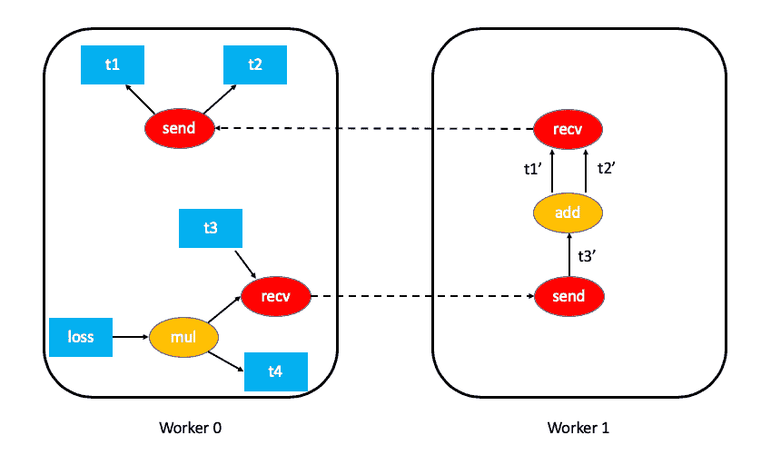
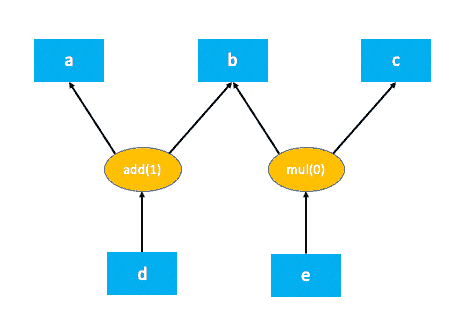
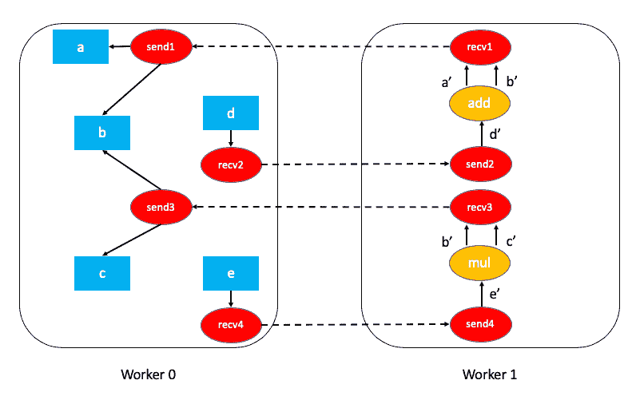
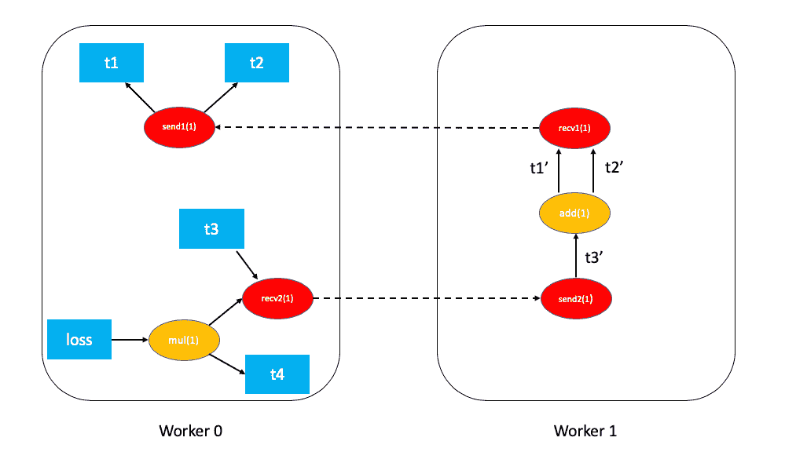

# 分布式 Autograd 设计

> 原文： [https://pytorch.org/docs/stable/notes/distributed_autograd.html](https://pytorch.org/docs/stable/notes/distributed_autograd.html)

警告

[分布式 RPC 框架](../rpc.html#distributed-rpc-framework)是实验性的，随时可能更改。

本说明将介绍分布式自动分级的详细设计，并逐步介绍其内部。 在继续之前，请确保您熟悉 [Autograd 机械手](autograd.html#autograd-mechanics)和[分布式 RPC 框架](../rpc.html#distributed-rpc-framework)。

## 背景

假设您有两个节点，并且在两个节点之间划分了一个非常简单的模型。 可以使用 [`torch.distributed.rpc`](../rpc.html#module-torch.distributed.rpc "torch.distributed.rpc") 如下实现：

```
import torch
import torch.distributed.rpc as rpc

def my_add(t1, t2):
  return torch.add(t1, t2)

# On worker 0:
t1 = torch.rand((3, 3), requires_grad=True)
t2 = torch.rand((3, 3), requires_grad=True)

# Perform some computation remotely.
t3 = rpc.rpc_sync("worker1", my_add, args=(t1, t2))

# Perform some computation locally based on remote result.
t4 = torch.rand((3, 3), requires_grad=True)
t5 = torch.mul(t3, t4)

# Compute some loss.
loss = t5.sum()

```

分布式 autograd 背后的主要动机是使用我们已经计算并记录所有需要梯度的张量的合适梯度的`loss`在这样的分布式模型上运行向后传递。

## 正向通过过程中的自动分级记录

PyTorch 在正向传递过程中会构建自动分级图，该图用于执行向后传递。 有关更多详细信息，请参见 [autograd 如何编码历史记录](autograd.html#how-autograd-encodes-history)。

对于分布式 autograd，我们需要在正向传递过程中跟踪所有 RPC，以确保正确执行向后传递。 为此，我们在执行 RPC 时将`send`和`recv`函数附加到自动缩放图。

*   `send`函数附加到 RPC 的源，并且其输出边指向 RPC 输入张量的 autograd 函数。 从目的地接收反向传递期间此功能的输入，作为适当的`recv`功能的输出。

*   `recv`函数附加到 RPC 的目标，并且使用输入张量从在目标上执行的运算符检索其输入。 在向后传递过程中，此函数的输出梯度将发送到源节点并发送到适当的`send`函数。

*   每个`send-recv`对都分配有一个全局唯一的`autograd_message_id`，以唯一地标识该对。 这对于在反向传递期间在远程节点上查找对应的功能很有用。

*   对于 [RRef](../rpc.html#rref) ，每当我们调用 [`torch.distributed.rpc.RRef.to_here()`](../rpc.html#torch.distributed.rpc.RRef.to_here "torch.distributed.rpc.RRef.to_here") 时，我们都会为所涉及的张量附加一个适当的`send-recv`对。

举例来说，这就是我们上面示例中的 autograd 图的样子(为简单起见，排除了 t5.sum(））：



## 分布式 Autograd 上下文

每个使用分布式 autograd 的正向和反向传递都分配有唯一的 [`torch.distributed.autograd.context`](../rpc.html#torch.distributed.autograd.context "torch.distributed.autograd.context") ，并且此上下文具有全局唯一的`autograd_context_id`。 根据需要在每个节点上创建此上下文。

此上下文具有以下目的：

1.  运行分布式后向遍历的多个节点可能会在同一张量上累积梯度，因此，在我们有机会运行优化器之前，张量的`.grad`字段将具有来自各种分布式后向遍历的梯度。 这类似于在本地多次调用 [`torch.autograd.backward()`](../autograd.html#torch.autograd.backward "torch.autograd.backward") 。 为了提供一种为每个后退通道分离梯度的方法，对于每个后退通道，梯度会累积在 [`torch.distributed.autograd.context`](../rpc.html#torch.distributed.autograd.context "torch.distributed.autograd.context") 中。

2.  在前向传递过程中，我们在这种情况下为每个自动分级传递存储`send`和`recv`函数。 这样可以确保我们保留对 autograd 图中适当节点的引用，以使其保持活动状态。 除此之外，在向后传递过程中很容易查找适当的`send`和`recv`功能。

3.  通常，我们还使用此上下文为每个分布式 autograd pass 存储一些元数据。

从用户的角度来看，自动分级上下文的设置如下：

```
import torch.distributed.autograd as dist_autograd
with dist_autograd.context() as context_id:
  loss = model.forward()
  dist_autograd.backward(loss)

```

## 分布式后向通行证

在本节中，我们概述了在分布式后向传递过程中准确计算依赖项的挑战，并描述了一些关于如何执行分布式后向传递的算法(需要权衡）。

### 计算依赖

考虑以下代码在单台计算机上运行

```
import torch
a = torch.rand((3, 3), requires_grad=True)
b = torch.rand((3, 3), requires_grad=True)
c = torch.rand((3, 3), requires_grad=True)
d = a + b
e = b * c
d.sum.().backward()

```

这就是上面代码的 autograd 图形：

[](../_images/local_dependencies.png)

autograd 引擎作为向后传递的一部分执行的第一步是计算 autograd 图中每个节点的依赖项数量。 这有助于 autograd 引擎知道何时可以执行图中的节点。 `add(1)`和`mul(0)`括号中的数字表示依赖项的数量。 如您所见，这意味着在向后传递期间，`add`节点需要 1 个输入，`mul`节点不需要任何输入(换句话说，不需要执行）。 本地 autograd 引擎通过遍历根节点中的图来计算这些依赖性(在这种情况下为`d`）。

autograd 图中的某些节点可能无法在向后传递中执行的事实对分布式 autograd 提出了挑战。 考虑使用 RPC 的这段代码。

```
import torch
import torch.distributed.rpc as rpc

a = torch.rand((3, 3), requires_grad=True)
b = torch.rand((3, 3), requires_grad=True)
c = torch.rand((3, 3), requires_grad=True)

d = rpc.rpc_sync("worker1", torch.add, args=(a, b))
e = rpc.rpc_sync("worker1", torch.mul, args=(b, c))
loss = d.sum()

```

上面的代码的相关自动分级图为：



计算此分布式 autograd 图的依赖项更具挑战性，并且需要一些开销(无论是在计算还是在网络通信方面）。

对于性能敏感的应用程序，我们可以通过假设每个`send`和`recv`函数在反向传递中都是有效的(大多数应用程序不执行未使用的 RPC）来避免很多开销。 这简化了分布式 autograd 算法，并且效率更高，但代价是应用程序需要意识到这些限制。 该算法称为 [FAST 模式算法](#id2)，下面将对其进行详细说明。

在一般情况下，可能不需要每个`send`和`recv`函数都有效作为反向传递的一部分。 为了解决这个问题，我们还有一个 [SMART 模式算法](#smart-mode-algorithm)，将在后面的部分中进行介绍。

### 快速模式算法

该算法的关键假设是，当我们运行向后传递时，每个`send`函数的相关性均为 1。 换句话说，我们假设将从另一个节点接收到 RPC 上的渐变。

算法如下：

1.  我们从具有向后遍历的根的工作程序开始(所有根必须是本地的）。

2.  查找当前[分布式 Autograd 上下文](#distributed-autograd-context)的所有`send`功能。

3.  从提供的根目录和我们检索到的所有`send`函数开始，本地计算依赖项。

4.  计算依赖关系后，使用提供的根启动本地 autograd 引擎。

5.  当 autograd 引擎执行`recv`功能时，`recv`功能会通过 RPC 将输入梯度发送到适当的工作程序。 每个`recv`函数都知道目标工作者 ID，因为它被记录为正向传递的一部分。 `recv`功能还将`autograd_context_id`和`autograd_message_id`发送到远程主机。

6.  当在远程主机上收到此请求时，我们使用`autograd_context_id`和`autograd_message_id`查找适当的`send`功能。

7.  如果这是工作人员第一次收到对给定`autograd_context_id`的请求，则它将如上面的第 1-3 点所述在本地计算依赖性。

8.  然后，将在 6 中检索到的`send`函数排队以便在该工作者的本地 autograd 引擎上执行。

9.  最后，我们不是在张量的`.grad`字段上累积梯度，而是根据[分布式自学背景](#distributed-autograd-context)分别累积梯度。 梯度存储在`Dict[Tensor, Tensor]`中，基本上是从 Tensor 到其相关梯度的映射，可以使用 [`get_gradients()`](../rpc.html#torch.distributed.autograd.get_gradients "torch.distributed.autograd.get_gradients") API 检索此映射。

例如，具有分布式 autograd 的完整代码如下：

```
import torch
import torch.distributed.autograd as dist_autograd
import torch.distributed.rpc as rpc

def my_add(t1, t2):
  return torch.add(t1, t2)

# On worker 0:

# Setup the autograd context.
with dist_autograd.context() as context_id:
  t1 = torch.rand((3, 3), requires_grad=True)
  t2 = torch.rand((3, 3), requires_grad=True)

  # Perform some computation remotely.
  t3 = rpc.rpc_sync("worker1", my_add, args=(t1, t2))

  # Perform some computation locally based on remote result.
  t4 = torch.rand((3, 3), requires_grad=True)
  t5 = torch.mul(t3, t4)

  # Compute some loss.
  loss = t5.sum()

  # Run the backward pass.
  dist_autograd.backward([loss])

  # Retrieve the gradients from the context.
  dist_autograd.get_gradients(context_id)

```

具有依赖关系的分布式 autograd 图如下所示：



应用于以上示例的 [FAST 模式算法](#id2)如下：

1.  在`Worker 0`上，我们从根`loss`和`send1`开始计算依赖关系。 结果，`send1`的依赖性为 1，`mul`对`Worker 0`的依赖性为 1。

2.  现在，我们在`Worker 0`上启动本地 autograd 引擎。 我们首先执行`mul`函数，将其输出在 autograd 上下文中累积为`t4`的梯度。 然后，我们执行`recv2`，它将梯度发送到`Worker 1`。

3.  由于这是`Worker 1`第一次听到有关此反向传递的信息，因此它将开始依赖性计算并适当地标记`send2`，`add`和`recv1`的依赖性。

4.  接下来，将`send2`排队在`Worker 1`的本地 autograd 引擎上，该引擎依次执行`add`和`recv1`。

5.  当执行`recv1`时，它将梯度发送到`Worker 0`。

6.  由于`Worker 0`已经计算了此向后传递的依赖性，因此它仅排队并在本地执行`send1`。

7.  最后，`t1`，`t2`和`t4`的梯度会累积在[分布式 Autograd 上下文](#distributed-autograd-context)中。

### SMART 模式算法

该算法的完整细节仍在研究中，但是对于一般概念，您可以参考 [RFC](https://github.com/pytorch/pytorch/issues/23110) 中的**分布式 Autograd Algorithm Smart 模式**部分。

## 分布式优化器

[`DistributedOptimizer`](../rpc.html#torch.distributed.optim.DistributedOptimizer "torch.distributed.optim.DistributedOptimizer") 的操作如下：

1.  获取要优化的远程参数列表 ([`RRef`](../rpc.html#torch.distributed.rpc.RRef "torch.distributed.rpc.RRef"))。 这些也可以是包装在本地`RRef`中的本地参数。

2.  将 [`Optimizer`](../optim.html#torch.optim.Optimizer "torch.optim.Optimizer") 类作为本地优化器，以在所有不同的`RRef`所有者上运行。

3.  分布式优化器在每个工作程序节点上创建本地`Optimizer`的实例，并将其保存`RRef`。

4.  当调用 [`torch.distributed.optim.DistributedOptimizer.step()`](../rpc.html#torch.distributed.optim.DistributedOptimizer.step "torch.distributed.optim.DistributedOptimizer.step") 时，分布式优化器使用 RPC 在适当的远程工作器上远程执行所有本地优化器。

5.  如果多个并发的分布式优化器正在更新工作器上的相同参数，则这些更新将通过锁序列化。

## 简单的端到端示例

综上所述，以下是使用分布式 autograd 和分布式优化器的简单的端到端示例。 如果将代码放入名为“ dist_autograd_simple.py”的文件中，则可以使用命令`MASTER_ADDR="localhost" MASTER_PORT=29500 python dist_autograd_simple.py`运行该代码：

```
import multiprocessing as mp
import torch
import torch.distributed.autograd as dist_autograd
from torch.distributed import rpc
from torch import optim
from torch.distributed.optim import DistributedOptimizer

def random_tensor():
    return torch.rand((3, 3), requires_grad=True)

def _run_process(rank, dst_rank, world_size):
    name = "worker{}".format(rank)
    dst_name = "worker{}".format(dst_rank)

    # Initialize RPC.
    rpc.init_rpc(
        name=name,
        rank=rank,
        world_size=world_size
    )

    # Use a distributed autograd context.
    with dist_autograd.context() as context_id:
        # Forward pass (create references on remote nodes).
        rref1 = rpc.remote(dst_name, random_tensor)
        rref2 = rpc.remote(dst_name, random_tensor)
        loss = rref1.to_here() + rref2.to_here()

        # Backward pass (run distributed autograd).
        dist_autograd.backward([loss.sum()])

        # Build DistributedOptimizer.
        dist_optim = DistributedOptimizer(
        optim.SGD,
        [rref1, rref2],
        lr=0.05,
        )

        # Run the distributed optimizer step.
        dist_optim.step()

def run_process(rank, dst_rank, world_size):
    _run_process(rank, dst_rank, world_size)
    rpc.shutdown()

processes = []

# Run world_size workers.
world_size = 2
for i in range(world_size):
    p = mp.Process(target=run_process, args=(i, (i + 1) % 2, world_size))
    p.start()
    processes.append(p)

for p in processes:
    p.join()

```