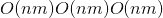

# 经常问的问题

> 原文： [https://pytorch.org/docs/stable/notes/faq.html](https://pytorch.org/docs/stable/notes/faq.html)

## 我的模型报告“ CUDA 运行时错误(2）：内存不足”

如错误消息所暗示，您的 GPU 内存已用完。 由于我们经常在 PyTorch 中处理大量数据，因此小错误可能会迅速导致您的程序用尽所有 GPU； 幸运的是，这些情况下的修复程序通常很简单。 以下是一些常见的检查事项：

**不要在整个训练循环中累积历史记录。** 默认情况下，涉及需要渐变的变量的计算将保留历史记录。 这意味着您应避免在计算中使用此类变量，这些变量将不受训练循环的影响，例如在跟踪统计信息时。 相反，您应该分离变量或访问其基础数据。

有时，可微变量发生时可能不是很明显。 考虑以下训练循环(从[源](https://discuss.pytorch.org/t/high-memory-usage-while-training/162)删节）：

```
total_loss = 0
for i in range(10000):
    optimizer.zero_grad()
    output = model(input)
    loss = criterion(output)
    loss.backward()
    optimizer.step()
    total_loss += loss

```

在这里，`total_loss`会在您的训练循环中累积历史记录，因为`loss`是具有自动分级历史记录的可微变量。 您可以改写 &lt;cite&gt;total_loss + = float(loss）&lt;/cite&gt;来解决此问题。

此问题的其他实例： [1](https://discuss.pytorch.org/t/resolved-gpu-out-of-memory-error-with-batch-size-1/3719) 。

**不要使用不需要的张量和变量。** 如果将 Tensor 或 Variable 分配给本地，Python 将不会取消分配，直到本地超出范围。 您可以使用`del x`释放此参考。 同样，如果将 Tensor 或 Variable 分配给对象的成员变量，则在对象超出范围之前它不会释放。 如果不使用不需要的临时存储，则将获得最佳的内存使用率。

当地人的范围可能会超出您的预期。 例如：

```
for i in range(5):
    intermediate = f(input[i])
    result += g(intermediate)
output = h(result)
return output

```

这里，即使`h`正在执行，`intermediate`仍保持活动状态，因为它的作用域超出了循环的结尾。 要提早释放它，使用完后应`del intermediate`。

**不要对太大的序列运行 RNN。** 通过 RNN 反向传播所需的内存量与 RNN 输入的长度成线性比例； 因此，如果您尝试向 RNN 输入过长的序列，则会耗尽内存。

这种现象的技术术语是[到时间](https://en.wikipedia.org/wiki/Backpropagation_through_time)的反向传播，关于如何实现截断 BPTT 的参考很​​多，包括[字语言模型](https://github.com/pytorch/examples/tree/master/word_language_model)示例； 截断由[本论坛帖子](https://discuss.pytorch.org/t/help-clarifying-repackage-hidden-in-word-language-model/226)中所述的`repackage`功能处理。

**请勿使用太大的线性图层。** 线性层`nn.Linear(m, n)`使用内存：也就是说，权重的内存要求与要素数量成正比关系。 以这种方式[穿透内存](https://github.com/pytorch/pytorch/issues/958)非常容易(请记住，您至少需要权重大小的两倍，因为您还需要存储渐变。）

## 我的 GPU 内存未正确释放

PyTorch 使用缓存内存分配器来加速内存分配。 因此，`nvidia-smi`中显示的值通常不能反映真实的内存使用情况。 有关 GPU 内存管理的更多详细信息，请参见[内存管理](cuda.html#cuda-memory-management)。

如果即使在退出 Python 后仍没有释放 GPU 内存，则很可能某些 Python 子进程仍然存在。 您可以通过`ps -elf | grep python`找到它们，然后使用`kill -9 [pid]`手动将其杀死。

## 我的数据加载器工作人员返回相同的随机数

您可能会使用其他库在数据集中生成随机数。 例如，当通过`fork`启动工作程序子流程时，NumPy 的 RNG 被复制。 请参阅 [`torch.utils.data.DataLoader`](../data.html#torch.utils.data.DataLoader "torch.utils.data.DataLoader") 的文档，以了解如何通过`worker_init_fn`选项在工人中正确设置随机种子。

## 我的经常性网络无法使用数据并行性

在 [`Module`](../nn.html#torch.nn.Module "torch.nn.Module") 与 [`DataParallel`](../nn.html#torch.nn.DataParallel "torch.nn.DataParallel") 或 [`data_parallel()`](../nn.functional.html#torch.nn.parallel.data_parallel "torch.nn.parallel.data_parallel") 中使用`pack sequence -&gt; recurrent network -&gt; unpack sequence`模式是很微妙的。 每个设备上每个`forward()`的输入仅是整个输入的一部分。 由于默认情况下，拆包操作 [`torch.nn.utils.rnn.pad_packed_sequence()`](../nn.html#torch.nn.utils.rnn.pad_packed_sequence "torch.nn.utils.rnn.pad_packed_sequence") 仅填充其看到的最长输入，即该特定设备上的最长输入，因此，将结果汇总在一起时会发生大小不匹配的情况。 因此，您可以改而利用 [`pad_packed_sequence()`](../nn.html#torch.nn.utils.rnn.pad_packed_sequence "torch.nn.utils.rnn.pad_packed_sequence") 的`total_length`自变量来确保`forward()`调用相同长度的返回序列。 例如，您可以编写：

```
from torch.nn.utils.rnn import pack_padded_sequence, pad_packed_sequence

class MyModule(nn.Module):
    # ... __init__, other methods, etc.

    # padded_input is of shape [B x T x *] (batch_first mode) and contains
    # the sequences sorted by lengths
    #   B is the batch size
    #   T is max sequence length
    def forward(self, padded_input, input_lengths):
        total_length = padded_input.size(1)  # get the max sequence length
        packed_input = pack_padded_sequence(padded_input, input_lengths,
                                            batch_first=True)
        packed_output, _ = self.my_lstm(packed_input)
        output, _ = pad_packed_sequence(packed_output, batch_first=True,
                                        total_length=total_length)
        return output

m = MyModule().cuda()
dp_m = nn.DataParallel(m)

```

此外，当批处理尺寸为`1`(即`batch_first=False`）且数据平行时，需要格外小心。 在这种情况下，pack_padded_sequence `padding_input`的第一个参数的形状将为`[T x B x *]`，并且应沿昏暗`1`分散，而第二个参数`input_lengths`的形状将为`[B]`，并且应沿昏暗[[Gate] `0`。 将需要额外的代码来操纵张量形状。