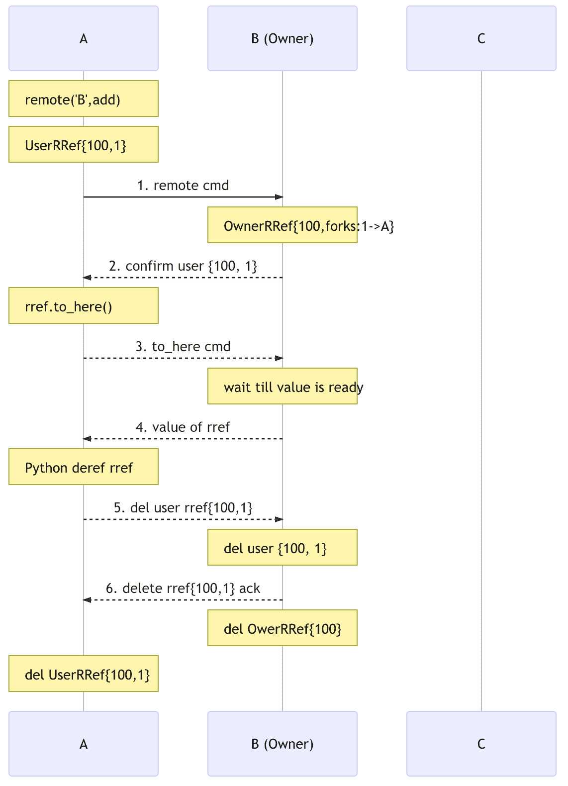
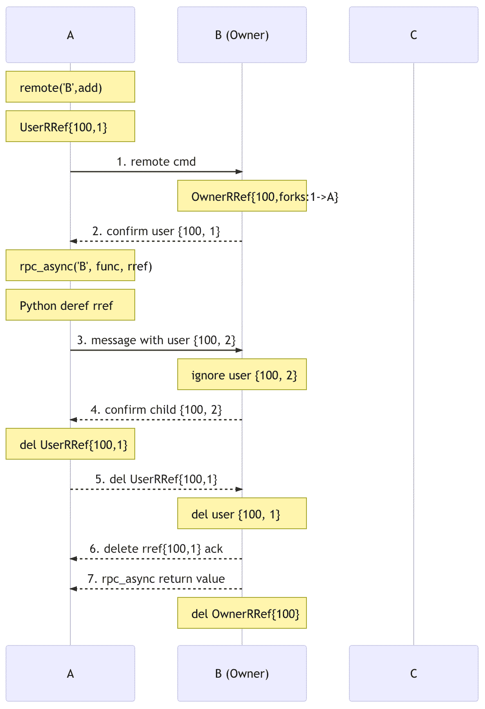
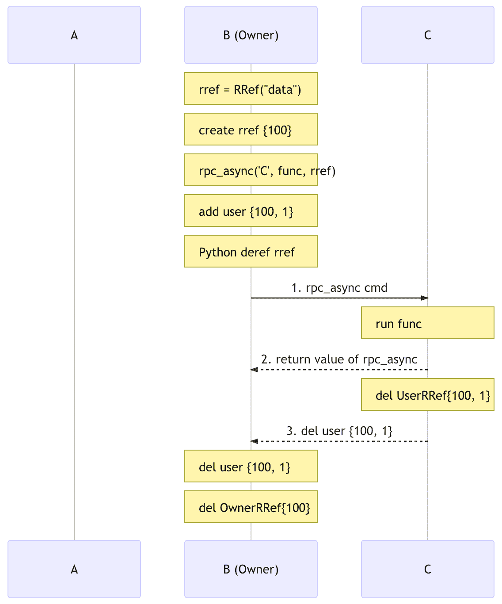
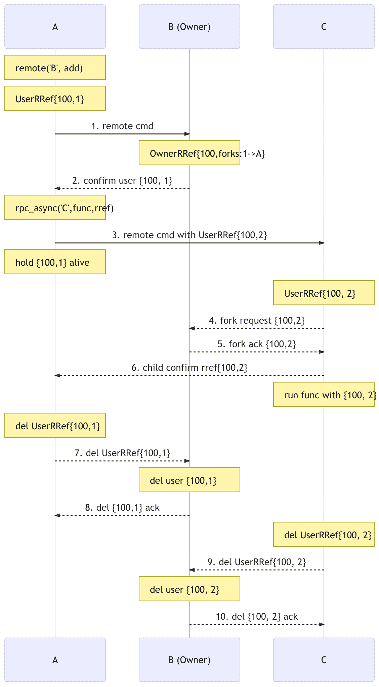

# 远程参考协议

> 原文： [https://pytorch.org/docs/stable/notes/rref.html](https://pytorch.org/docs/stable/notes/rref.html)

警告

[RRef](../rpc.html#rref) API 是实验性的，随时可能更改。

本说明描述了远程引用协议的设计细节，并逐步介绍了不同情况下的消息流。 在继续之前，请确保您熟悉[分布式 RPC 框架](../rpc.html#distributed-rpc-framework)。

## 背景

RRef 代表远程参考。 它是位于本地或远程工作人员上的对象的引用，并且透明地在内部进行引用计数。 从概念上讲，它可以视为分布式共享指针。 应用程序可以通过调用 [`remote()`](../rpc.html#torch.distributed.rpc.remote "torch.distributed.rpc.remote") 创建 RRef。 每个 RRef 都由 [`remote()`](../rpc.html#torch.distributed.rpc.remote "torch.distributed.rpc.remote") 呼叫的被调用方工作者(即所有者）拥有，并且可以由多个用户使用。 所有者存储实际数据，并跟踪全局参考计数。 每个 RRef 可以由全局`RRefId`唯一标识，该全局`RRefId`在创建时在 [`remote()`](../rpc.html#torch.distributed.rpc.remote "torch.distributed.rpc.remote") 调用的调用方上分配。

在所有者工作程序中，只有一个`OwnerRRef`实例包含真实数据，而在用户工作程序中，可以根据需要包含任意数量的`UserRRefs`，而`UserRRef`不保存数据。 所有者上的所有用法都将使用全局唯一的`RRefId`来检索唯一的`OwnerRRef`实例。 在 [`rpc_sync()`](../rpc.html#torch.distributed.rpc.rpc_sync "torch.distributed.rpc.rpc_sync") ， [`rpc_async()`](../rpc.html#torch.distributed.rpc.rpc_async "torch.distributed.rpc.rpc_async") 或 [`remote()`](../rpc.html#torch.distributed.rpc.remote "torch.distributed.rpc.remote") 调用中将`UserRRef`用作参数或返回值时，将创建该`UserRRef` 将会根据更新的参考计数通知所有者。 如果全局没有`UserRRef`实例，并且所有者上也没有对`OwnerRRef`的引用，则`OwnerRRef`及其数据将被删除。

## 假设条件

RRef 协议的设计基于以下假设。

*   **瞬态网络故障**：RRef 设计旨在通过重试消息来处理瞬态网络故障。 节点崩溃或永久性网络分区超出了范围。 当这些事件发生时，该应用程序可能会关闭所有工作人员，还原到先前的检查点，然后恢复训练。

*   **非幂等 UDF** ：我们假设提供给 [`rpc_sync()`](../rpc.html#torch.distributed.rpc.rpc_sync "torch.distributed.rpc.rpc_sync") ， [`rpc_async()`](../rpc.html#torch.distributed.rpc.rpc_async "torch.distributed.rpc.rpc_async") 或 [`remote()`](../rpc.html#torch.distributed.rpc.remote "torch.distributed.rpc.remote") 的用户功能(UDF） 不是幂等的，因此无法重试。 但是，内部 RRef 控制消息将成为幂等且可重试。

*   **消息传递无序**：我们不假定任何一对节点之间的消息传递顺序，因为发送者和接收者都使用多个线程。 无法保证首先处理哪个消息。

## RRef 生命周期

该协议的目标是在适当的时候删除`OwnerRRef`。 删除`OwnerRRef`的正确时机是在没有活动`UserRRef`实例且用户代码也没有保存对`OwnerRRef`的引用的情况下。 棘手的部分是确定是否存在任何活动的`UserRRef`实例。

### 设计推理

用户可以在以下三种情况下获得`UserRRef`：

1.  从所有者那里收到了`UserRRef`。

2.  接收到另一个用户的`UserRRef`。

3.  创建另一个工人拥有的新`UserRRef`。

情况 1 是最简单的，所有者将其 RRef 传递给用户，所有者调用 [`rpc_sync()`](../rpc.html#torch.distributed.rpc.rpc_sync "torch.distributed.rpc.rpc_sync") ， [`rpc_async()`](../rpc.html#torch.distributed.rpc.rpc_async "torch.distributed.rpc.rpc_async") 或 [`remote()`](../rpc.html#torch.distributed.rpc.remote "torch.distributed.rpc.remote") 使用其 RRef 作为参数。 在这种情况下，将在用户上创建一个新的`UserRRef`。 由于所有者是调用者，因此可以轻松地在`OwnerRRef`上更新其本地引用计数。

唯一的要求是任何`UserRRef`必须在销毁时通知所有者。 因此，我们需要第一个保证：

**G1。 删除任何“ UserRRef”时，都会通知所有者。**

由于邮件可能会延迟或出现乱序，因此我们还需要一项保证，以确保删除邮件不会过早处理。 如果 A 向 B 发送涉及 RRef 的消息，我们将 A 上的 RRef 称为父 RRef，将 B 上的 RRef 称为子 RRef。

**G2。 在所有者确认子 RRef 之前，不会删除父 RRef。**

在情况 2 和 3 中，所有者可能仅对 RRef 分支图有部分了解或根本不了解。 例如，可以在用户上构建 RRef，并且在所有者收到任何 RPC 调用之前，创建者用户可能已经与其他用户共享了 RRef，并且这些用户可以进一步共享 RRef。 一个不变性是，任何 RRef 的派生图始终都是一棵树，因为派生 RRef 总是在被调用方上创建一个新的`UserRRef`实例(除非被调用方是所有者），因此每个 RRef 都有一个父级。

所有者对树中任何`UserRRef`的视图分为三个阶段：

```
1) unknown -> 2) known -> 3) deleted.

```

所有者对整棵树的看法不断变化。 拥有者认为没有活动的`UserRRef`实例时，即删除`OwnerRRef`实例时，所有`UserRRef`实例都可能确实被删除或未知，因此所有者删除了其`OwnerRRef`实例。 危险的情况是某些分叉未知，而另一些被删除。

**G2** 简单地保证在拥有者知道其所有子级`UserRRef`实例之前，不能删除任何父级`UserRRef`。 但是，有可能在拥有者知道其父项`UserRRef`之前删除了子项`UserRRef`。

考虑下面的示例，其中`OwnerRRef`分支到 A，然后 A 分支到 Y，Y 分支到 Z：

```
OwnerRRef -> A -> Y -> Z

```

如果所有者在处理所有来自 Z 的消息(包括删除消息）之前先处理来自 Y 的所有消息，那么所有者将在知道 Y 之前就知道 Z 的删除。但这不会造成任何问题。 因为，Y 的祖先中至少有一个还活着(在本例中为 A），这将阻止所有者删除`OwnerRRef`。 更具体地说，如果所有者不知道 Y，则由于 **G2** 而无法删除 A，并且所有者知道 A，因为所有者是 A 的父母。

如果在用户上创建 RRef，事情会变得有些棘手：

```
OwnerRRef
    ^
    |
    A -> Y -> Z

```

如果 Z 在`UserRRef`上调用 [`to_here()`](../rpc.html#torch.distributed.rpc.RRef.to_here "torch.distributed.rpc.RRef.to_here") ，则所有者至少知道删除 Z 时的 A，否则， [`to_here()`](../rpc.html#torch.distributed.rpc.RRef.to_here "torch.distributed.rpc.RRef.to_here") 不会结束。 如果 Z 没有调用 [`to_here()`](../rpc.html#torch.distributed.rpc.RRef.to_here "torch.distributed.rpc.RRef.to_here") ，则所有者可能在从 A 和 Y 发送任何消息之前就已从 Z 接收了所有消息。在这种情况下，由于尚未获得`OwnerRRef`的真实数据 创建后，也没有要删除的内容。 就像 Z 根本不存在一样。 因此，仍然可以。

### 实作

**G1** 通过在`UserRRef`析构函数中发送删除消息来实现。 为了提供 **G2** ，无论何时将父级`UserRRef`派生，都将其置于上下文中，并由新的`ForkId`对其进行索引。 仅当父级`UserRRef`从子级收到确认消息(ACK）时，才会从上下文中删除该父级`UserRRef`，并且只有当所有者确认后，该子级才会发出 ACK。

## 协议方案

现在，让我们讨论以上设计如何在四种情况下转换为协议。

### 用户与所有者共享 RRef 作为返回值

```
import torch
import torch.distributed.rpc as rpc

# on worker A
rref = rpc.remote('B', torch.add, args=(torch.ones(2), 1))
# say the rref has RRefId 100 and ForkId 1
rref.to_here()

```

在这种情况下，在用户工作程序 A 上创建`UserRRef`，然后将其与远程消息一起传递给所有者工作程序 B，然后 B 创建`OwnerRRef`。 方法 [`remote()`](../rpc.html#torch.distributed.rpc.remote "torch.distributed.rpc.remote") 立即返回，这意味着`UserRRef`可以在所有者了解之前被分叉/使用。

在所有者上，当接收到 [`remote()`](../rpc.html#torch.distributed.rpc.remote "torch.distributed.rpc.remote") 调用时，它将创建`OwnerRRef`，并返回一个 ACK 来确认`{100, 1}`(`RRefId`，`ForkId`）。 仅在收到此 ACK 后，A 才能删除其`UserRRef`。 这涉及 **G1** 和 **G2** 。 **G1** 很明显。 对于 **G2** 而言，`OwnerRRef`是`UserRRef`的子级，并且`UserRRef`直到收到所有者的 ACK 才被删除。

[](https://user-images.githubusercontent.com/16999635/69164772-98181300-0abe-11ea-93a7-9ad9f757cd94.png)

上图显示了消息流，其中实心箭头包含用户功能，而虚线箭头是内置消息。 请注意，从 A 到 B 的前两个消息 ([`remote()`](../rpc.html#torch.distributed.rpc.remote "torch.distributed.rpc.remote") 和 [`to_here()`](../rpc.html#torch.distributed.rpc.RRef.to_here "torch.distributed.rpc.RRef.to_here"))可以按任何顺序到达 B，但最终的删除消息仅在以下情况下发送： ：

*   B 确认`UserRRef {100, 1}`(G2），并且

*   Python GC 同意删除本地`UserRRef`实例。 当 RRef 不再在范围内并且可以进行垃圾回收时，就会发生这种情况。

### 用户与所有者共享 RRef 作为参数

```
import torch
import torch.distributed.rpc as rpc

# on worker A and worker B
def func(rref):
  pass

# on worker A
rref = rpc.remote('B', torch.add, args=(torch.ones(2), 1))
# say the rref has RRefId 100 and ForkId 1
rpc.rpc_async('B', func, args=(rref, ))

```

在这种情况下，在 A 上创建`UserRRef`后，A 会将其用作对 B 的后续 RPC 调用中的参数。A 将使`UserRRef {100, 1}`保持活动状态，直到收到 B 的确认 (**G2** ， 而不是 RPC 调用的返回值）。 这是必要的，因为在接收到所有先前的消息之前，A 不应发出删除消息，否则，`OwnerRRef`可以在使用前删除，因为我们不能保证消息的传递顺序。 这是通过创建 RRef 的子项`ForkId`并将其保存在地图中，直到收到所有者确认该子项`ForkId`来完成的。 下图显示了消息流。

[](https://user-images.githubusercontent.com/16999635/69164845-b67e0e80-0abe-11ea-93fa-d24674e75a2b.png)

注意，`UserRRef`可以在功能完成甚至启动之前在 B 上删除。 但是，这是可以的，因为在 B 向子`ForkId`发送 ACK 时，它已经获取了`OwnerRRef`实例，这将防止它被过早删除。

### 所有者与用户共享 RRef

所有者对用户是最简单的情况，所有者可以在本地更新引用计数，并且不需要任何其他控制消息即可通知其他人。 关于 **G2** ，因为父级是所有者，所以它与父级立即从所有者接收 ACK 相同。

```
import torch
import torch.distributed.rpc as RRef, rpc

# on worker B and worker C
def func(rref):
  pass

# on worker B, creating a local RRef
rref = RRef("data")
# say the rref has RRefId 100
dist.rpc_async('C', func, args=(rref, ))

```

[](https://user-images.githubusercontent.com/16999635/69164921-c990de80-0abe-11ea-9250-d32ad00cf4ae.png)

上图显示了消息流。 请注意，当在 rpc_async 调用之后`OwnerRRef`退出作用域时，将不会删除它，因为如果存在任何已知的派生，则内部会存在一个使它保持活动状态的映射，在这种情况下为`UserRRef {100, 1}`。  (**G2** )

### 用户与用户共享 RRef

这是最复杂的情​​况，其中调用者用户(父级`UserRRef`），被调用者用户(子级`UserRRef`）和所有者都需要参与。

```
import torch
import torch.distributed.rpc as rpc

# on worker A and worker C
def func(rref):
  pass

# on worker A
rref = rpc.remote('B', torch.add, args=(torch.ones(2), 1))
# say the rref has RRefId 100 and ForkId 1
rpc.rpc_async('C', func, args=(rref, ))

```

[](https://user-images.githubusercontent.com/16999635/69164971-d6adcd80-0abe-11ea-971d-6b7af131f0fd.png)

当 C 从 A 接收到子项`UserRRef`时，它向所有者 B 发送一个派生请求。稍后，当 B 确认 C 上的`UserRRef`时，C 将并行执行两个操作：1）发送子项 ACK 到 A，然后 2）运行用户提供的功能。 在这段时间中，亲本(A）将保持其`UserRRef {100, 1}`存活以实现 **G2** 。