# torch

> 原文： [https://pytorch.org/docs/stable/torch.html](https://pytorch.org/docs/stable/torch.html)

torch程序包包含多维张量的数据结构，并定义了这些数据的数学运算。 此外，它提供了许多实用程序，可用于有效地序列化张量和任意类型，以及其他有用的实用程序。

它具有 CUDA 对应项，使您能够在具有计算能力&gt; = 3.0 的 NVIDIA GPU 上运行张量计算。

## 张量

* * *

```
torch.is_tensor(obj)¶
```

如果 &lt;cite&gt;obj&lt;/cite&gt; 是 PyTorch 张量，则返回 True。

参数

**obj** (_对象_）–要测试的对象

* * *

```
torch.is_storage(obj)¶
```

如果 &lt;cite&gt;obj&lt;/cite&gt; 是 PyTorch 存储对象，则返回 True。

Parameters

**obj** (_Object_) – Object to test

* * *

```
torch.is_floating_point(input) -> (bool)¶
```

如果`input`的数据类型是浮点数据类型，即`torch.float64`，`torch.float32`和`torch.float16`之一，则返回 True。

Parameters

**输入** ([_tensor_](tensors.html#torch.Tensor "torch.Tensor"))–要测试的 PyTorch 张量

* * *

```
torch.set_default_dtype(d)¶
```

将默认浮点 dtype 设置为`d`。 该类型将用作 [`torch.tensor()`](#torch.tensor "torch.tensor") 中类型推断的默认浮点类型。

默认浮点 dtype 最初为`torch.float32`。

Parameters

**d**  ([`torch.dtype`](tensor_attributes.html#torch.torch.dtype "torch.torch.dtype"))–浮点 dtype，使其成为默认值

例：

```
>>> torch.tensor([1.2, 3]).dtype           # initial default for floating point is torch.float32
torch.float32
>>> torch.set_default_dtype(torch.float64)
>>> torch.tensor([1.2, 3]).dtype           # a new floating point tensor
torch.float64

```

* * *

```
torch.get_default_dtype() → torch.dtype¶
```

获取当前的默认浮点数 [`torch.dtype`](tensor_attributes.html#torch.torch.dtype "torch.torch.dtype") 。

Example:

```
>>> torch.get_default_dtype()  # initial default for floating point is torch.float32
torch.float32
>>> torch.set_default_dtype(torch.float64)
>>> torch.get_default_dtype()  # default is now changed to torch.float64
torch.float64
>>> torch.set_default_tensor_type(torch.FloatTensor)  # setting tensor type also affects this
>>> torch.get_default_dtype()  # changed to torch.float32, the dtype for torch.FloatTensor
torch.float32

```

* * *

```
torch.set_default_tensor_type(t)¶
```

将默认的`torch.Tensor`类型设置为浮点张量类型`t`。 该类型还将用作 [`torch.tensor()`](#torch.tensor "torch.tensor") 中类型推断的默认浮点类型。

默认的浮点张量类型最初为`torch.FloatTensor`。

Parameters

**t**  (_python：type_ _或_ _字符串_）–浮点张量类型或其名称

Example:

```
>>> torch.tensor([1.2, 3]).dtype    # initial default for floating point is torch.float32
torch.float32
>>> torch.set_default_tensor_type(torch.DoubleTensor)
>>> torch.tensor([1.2, 3]).dtype    # a new floating point tensor
torch.float64

```

* * *

```
torch.numel(input) → int¶
```

返回`input`张量中的元素总数。

Parameters

**输入** ([_tensor_](tensors.html#torch.Tensor "torch.Tensor"))–输入张量。

Example:

```
>>> a = torch.randn(1, 2, 3, 4, 5)
>>> torch.numel(a)
120
>>> a = torch.zeros(4,4)
>>> torch.numel(a)
16

```

* * *

```
torch.set_printoptions(precision=None, threshold=None, edgeitems=None, linewidth=None, profile=None, sci_mode=None)¶
```

设置打印选项。 从 NumPy 无耻地拿走的物品

Parameters

*   **precision** –浮点输出的精度位数(默认= 4）。

*   **阈值** –触发汇总而不是完整的 &lt;cite&gt;repr&lt;/cite&gt; 的数组元素总数(默认= 1000）。

*   **edgeitems** -每个维的开始和结束处摘要中数组项目的数量(默认= 3）。

*   **线宽** –用于插入换行符的每行字符数(默认= 80）。 阈值矩阵将忽略此参数。

*   **配置文件** – Sane 默认用于漂亮的打印。 可以使用以上任何选项覆盖。 (&lt;cite&gt;默认&lt;/cite&gt;，&lt;cite&gt;短&lt;/cite&gt;，&lt;cite&gt;完整&lt;/cite&gt;中的任何一种）

*   **sci_mode** –启用(真）或禁用(假）科学计数法。 如果指定了 None(默认），则该值由 &lt;cite&gt;_Formatter&lt;/cite&gt; 定义

* * *

```
torch.set_flush_denormal(mode) → bool¶
```

禁用 CPU 上的非正常浮​​点数。

如果您的系统支持刷新非正规数并且已成功配置刷新非正规模式，则返回`True`。 [`set_flush_denormal()`](#torch.set_flush_denormal "torch.set_flush_denormal") 仅在支持 SSE3 的 x86 架构上受支持。

Parameters

**模式** (_bool_ )–控制是否启用冲洗非正常模式

Example:

```
>>> torch.set_flush_denormal(True)
True
>>> torch.tensor([1e-323], dtype=torch.float64)
tensor([ 0.], dtype=torch.float64)
>>> torch.set_flush_denormal(False)
True
>>> torch.tensor([1e-323], dtype=torch.float64)
tensor(9.88131e-324 *
       [ 1.0000], dtype=torch.float64)

```

### 创作行动

注意

随机抽样创建操作列在[随机抽样](#random-sampling)下，包括： [`torch.rand()`](#torch.rand "torch.rand") [`torch.rand_like()`](#torch.rand_like "torch.rand_like") [`torch.randn()`](#torch.randn "torch.randn") [`torch.randn_like()`](#torch.randn_like "torch.randn_like") [`torch.randint()`](#torch.randint "torch.randint") [`torch.randint_like()`](#torch.randint_like "torch.randint_like") [`torch.randperm()`](#torch.randperm "torch.randperm") 您也可以将 [`torch.empty()`](#torch.empty "torch.empty") 与[输入一起使用 位随机抽样](#inplace-random-sampling)方法来创建 [`torch.Tensor`](tensors.html#torch.Tensor "torch.Tensor") ，并从更广泛的分布范围内采样值。

* * *

```
torch.tensor(data, dtype=None, device=None, requires_grad=False, pin_memory=False) → Tensor¶
```

用`data`构造一个张量。

警告

[`torch.tensor()`](#torch.tensor "torch.tensor") 始终复制`data`。 如果您具有张量`data`并希望避免复制，请使用 [`torch.Tensor.requires_grad_()`](tensors.html#torch.Tensor.requires_grad_ "torch.Tensor.requires_grad_") 或 [`torch.Tensor.detach()`](autograd.html#torch.Tensor.detach "torch.Tensor.detach") 。 如果您有 NumPy `ndarray`并想避免复制，请使用 [`torch.as_tensor()`](#torch.as_tensor "torch.as_tensor") 。

Warning

当数据是张量 &lt;cite&gt;x&lt;/cite&gt; 时， [`torch.tensor()`](#torch.tensor "torch.tensor") 从传递的任何数据中读出“数据”，并构造一个叶子变量。 因此，`torch.tensor(x)`等同于`x.clone().detach()`，`torch.tensor(x, requires_grad=True)`等同于`x.clone().detach().requires_grad_(True)`。 建议使用`clone()`和`detach()`的等效项。

Parameters

*   **数据** (_array_like_ )–张量的初始数据。 可以是列表，元组，NumPy `ndarray`，标量和其他类型。

*   **dtype**  ([`torch.dtype`](tensor_attributes.html#torch.torch.dtype "torch.torch.dtype") ，可选）–返回张量的所需数据类型。 默认值：如果`None`，则从`data`推断数据类型。

*   **设备** ([`torch.device`](tensor_attributes.html#torch.torch.device "torch.torch.device") ，可选）–返回张量的所需设备。 默认值：如果`None`，则使用当前设备作为默认张量类型(请参见 [`torch.set_default_tensor_type()`](#torch.set_default_tensor_type "torch.set_default_tensor_type"))。 `device`将是用于 CPU 张量类型的 CPU，并且是用于 CUDA 张量类型的当前 CUDA 设备。

*   **require_grad**  (_bool_ _，_ _可选_）–如果 autograd 应该在返回的张量上记录操作。 默认值：`False`。

*   **pin_memory**  (_bool_ _，_ _可选_）–如果设置，返回的张量将分配在固定的内存中。 仅适用于 CPU 张量。 默认值：`False`。

Example:

```
>>> torch.tensor([[0.1, 1.2], [2.2, 3.1], [4.9, 5.2]])
tensor([[ 0.1000,  1.2000],
        [ 2.2000,  3.1000],
        [ 4.9000,  5.2000]])

>>> torch.tensor([0, 1])  # Type inference on data
tensor([ 0,  1])

>>> torch.tensor([[0.11111, 0.222222, 0.3333333]],
                 dtype=torch.float64,
                 device=torch.device('cuda:0'))  # creates a torch.cuda.DoubleTensor
tensor([[ 0.1111,  0.2222,  0.3333]], dtype=torch.float64, device='cuda:0')

>>> torch.tensor(3.14159)  # Create a scalar (zero-dimensional tensor)
tensor(3.1416)

>>> torch.tensor([])  # Create an empty tensor (of size (0,))
tensor([])

```

* * *

```
torch.sparse_coo_tensor(indices, values, size=None, dtype=None, device=None, requires_grad=False) → Tensor¶
```

在给定`values`和给定`values`的情况下，以非零元素构造 COO(rdinate）格式的稀疏张量。 稀疏张量可以是&lt;cite&gt;而不是&lt;/cite&gt;，在那种情况下，索引中有重复的坐标，并且该索引处的值是所有重复值条目的总和： [torch.sparse](https://pytorch.org/docs/stable/sparse.html) 。

Parameters

*   **索引** (_array_like_ )–张量的初始数据。 可以是列表，元组，NumPy `ndarray`，标量和其他类型。 将在内部强制转换为`torch.LongTensor`。 索引是矩阵中非零值的坐标，因此应为二维，其中第一维是张量维数，第二维是非零值数。

*   **值** (_array_like_ )–张量的初始值。 可以是列表，元组，NumPy `ndarray`，标量和其他类型。

*   **大小**(列表，元组或`torch.Size`，可选）–稀疏张量的大小。 如果未提供，则将推断大小为足以容纳所有非零元素的最小大小。

*   **dtype**  ([`torch.dtype`](tensor_attributes.html#torch.torch.dtype "torch.torch.dtype") ，可选）–返回张量的所需数据类型。 默认值：如果为 None，则从`values`推断数据类型。

*   **设备** ([`torch.device`](tensor_attributes.html#torch.torch.device "torch.torch.device") ，可选）–返回张量的所需设备。 默认值：如果为 None，则使用当前设备作为默认张量类型(请参见 [`torch.set_default_tensor_type()`](#torch.set_default_tensor_type "torch.set_default_tensor_type"))。 `device`将是用于 CPU 张量类型的 CPU，是用于 CUDA 张量类型的当前 CUDA 设备。

*   **requires_grad** (_bool__,_ _optional_) – If autograd should record operations on the returned tensor. Default: `False`.

Example:

```
>>> i = torch.tensor([[0, 1, 1],
                      [2, 0, 2]])
>>> v = torch.tensor([3, 4, 5], dtype=torch.float32)
>>> torch.sparse_coo_tensor(i, v, [2, 4])
tensor(indices=tensor([[0, 1, 1],
                       [2, 0, 2]]),
       values=tensor([3., 4., 5.]),
       size=(2, 4), nnz=3, layout=torch.sparse_coo)

>>> torch.sparse_coo_tensor(i, v)  # Shape inference
tensor(indices=tensor([[0, 1, 1],
                       [2, 0, 2]]),
       values=tensor([3., 4., 5.]),
       size=(2, 3), nnz=3, layout=torch.sparse_coo)

>>> torch.sparse_coo_tensor(i, v, [2, 4],
                            dtype=torch.float64,
                            device=torch.device('cuda:0'))
tensor(indices=tensor([[0, 1, 1],
                       [2, 0, 2]]),
       values=tensor([3., 4., 5.]),
       device='cuda:0', size=(2, 4), nnz=3, dtype=torch.float64,
       layout=torch.sparse_coo)

# Create an empty sparse tensor with the following invariants:
#   1\. sparse_dim + dense_dim = len(SparseTensor.shape)
#   2\. SparseTensor._indices().shape = (sparse_dim, nnz)
#   3\. SparseTensor._values().shape = (nnz, SparseTensor.shape[sparse_dim:])
#
# For instance, to create an empty sparse tensor with nnz = 0, dense_dim = 0 and
# sparse_dim = 1 (hence indices is a 2D tensor of shape = (1, 0))
>>> S = torch.sparse_coo_tensor(torch.empty([1, 0]), [], [1])
tensor(indices=tensor([], size=(1, 0)),
       values=tensor([], size=(0,)),
       size=(1,), nnz=0, layout=torch.sparse_coo)

# and to create an empty sparse tensor with nnz = 0, dense_dim = 1 and
# sparse_dim = 1
>>> S = torch.sparse_coo_tensor(torch.empty([1, 0]), torch.empty([0, 2]), [1, 2])
tensor(indices=tensor([], size=(1, 0)),
       values=tensor([], size=(0, 2)),
       size=(1, 2), nnz=0, layout=torch.sparse_coo)

```

* * *

```
torch.as_tensor(data, dtype=None, device=None) → Tensor¶
```

将数据转换为&lt;cite&gt;torch。张量&lt;/cite&gt;。 如果数据已经是具有相同 &lt;cite&gt;dtype&lt;/cite&gt; 和&lt;cite&gt;设备&lt;/cite&gt;的&lt;cite&gt;张量&lt;/cite&gt;，则不会执行任何复制，否则将使用新的&lt;cite&gt;张量&lt;/cite&gt;。 如果数据&lt;cite&gt;张量&lt;/cite&gt;具有`requires_grad=True`，则返回保留计算图的计算图。 同样，如果数据是对应的 &lt;cite&gt;dtype&lt;/cite&gt; 的`ndarray`，并且&lt;cite&gt;设备&lt;/cite&gt;是 cpu，则不会执行任何复制。

Parameters

*   **data** (_array_like_) – Initial data for the tensor. Can be a list, tuple, NumPy `ndarray`, scalar, and other types.

*   **dtype** ([`torch.dtype`](tensor_attributes.html#torch.torch.dtype "torch.torch.dtype"), optional) – the desired data type of returned tensor. Default: if `None`, infers data type from `data`.

*   **device** ([`torch.device`](tensor_attributes.html#torch.torch.device "torch.torch.device"), optional) – the desired device of returned tensor. Default: if `None`, uses the current device for the default tensor type (see [`torch.set_default_tensor_type()`](#torch.set_default_tensor_type "torch.set_default_tensor_type")). `device` will be the CPU for CPU tensor types and the current CUDA device for CUDA tensor types.

Example:

```
>>> a = numpy.array([1, 2, 3])
>>> t = torch.as_tensor(a)
>>> t
tensor([ 1,  2,  3])
>>> t[0] = -1
>>> a
array([-1,  2,  3])

>>> a = numpy.array([1, 2, 3])
>>> t = torch.as_tensor(a, device=torch.device('cuda'))
>>> t
tensor([ 1,  2,  3])
>>> t[0] = -1
>>> a
array([1,  2,  3])

```

* * *

```
torch.as_strided(input, size, stride, storage_offset=0) → Tensor¶
```

创建具有指定`size`，`stride`和`storage_offset`的现有&lt;cite&gt;炬管&lt;/cite&gt; `input`的视图。

Warning

创建的张量中的一个以上元素可以引用单个存储位置。 结果，就地操作(尤其是矢量化的操作）可能会导致错误的行为。 如果需要写张量，请先克隆它们。

许多 PyTorch 函数可返回张量视图，并在此函数内部实现。 这些功能，例如 [`torch.Tensor.expand()`](tensors.html#torch.Tensor.expand "torch.Tensor.expand") ，更易于阅读，因此更可取。

Parameters

*   **input** ([_Tensor_](tensors.html#torch.Tensor "torch.Tensor")) – the input tensor.

*   **大小**(_元组_ _或_ _python：ints_ )–输出张量的形状

*   **跨度**(_元组_ _或_ _python：ints_ )–输出张量的跨度

*   **storage_offset**  (_python：int_ _，_ _可选_）–输出张量的基础存储中的偏移量

Example:

```
>>> x = torch.randn(3, 3)
>>> x
tensor([[ 0.9039,  0.6291,  1.0795],
        [ 0.1586,  2.1939, -0.4900],
        [-0.1909, -0.7503,  1.9355]])
>>> t = torch.as_strided(x, (2, 2), (1, 2))
>>> t
tensor([[0.9039, 1.0795],
        [0.6291, 0.1586]])
>>> t = torch.as_strided(x, (2, 2), (1, 2), 1)
tensor([[0.6291, 0.1586],
        [1.0795, 2.1939]])

```

* * *

```
torch.from_numpy(ndarray) → Tensor¶
```

从`numpy.ndarray`创建 [`Tensor`](tensors.html#torch.Tensor "torch.Tensor") 。

返回的张量和`ndarray`共享相同的内存。 对张量的修改将反映在`ndarray`中，反之亦然。 返回的张量不可调整大小。

当前它接受具有`numpy.float64`，`numpy.float32`，`numpy.float16`，`numpy.int64`，`numpy.int32`，`numpy.int16`，`numpy.int8`，`numpy.uint8`和`numpy.bool` d 类型的`ndarray`。

Example:

```
>>> a = numpy.array([1, 2, 3])
>>> t = torch.from_numpy(a)
>>> t
tensor([ 1,  2,  3])
>>> t[0] = -1
>>> a
array([-1,  2,  3])

```

* * *

```
torch.zeros(*size, out=None, dtype=None, layout=torch.strided, device=None, requires_grad=False) → Tensor¶
```

返回一个由标量值 &lt;cite&gt;0&lt;/cite&gt; 填充的张量，其形状由变量参数`size`定义。

Parameters

*   **大小** (_python：int ..._ )–定义输出张量形状的整数序列。 可以是可变数量的参数，也可以是列表或元组之类的集合。

*   **输出** ([_tensor_](tensors.html#torch.Tensor "torch.Tensor") _，_ _可选_）–输出张量。

*   **dtype**  ([`torch.dtype`](tensor_attributes.html#torch.torch.dtype "torch.torch.dtype") ，可选）–返回张量的所需数据类型。 默认值：如果`None`使用全局默认值(请参见 [`torch.set_default_tensor_type()`](#torch.set_default_tensor_type "torch.set_default_tensor_type"))。

*   **布局** ([`torch.layout`](tensor_attributes.html#torch.torch.layout "torch.torch.layout") ，可选）–返回的 Tensor 所需的布局。 默认值：`torch.strided`。

*   **device** ([`torch.device`](tensor_attributes.html#torch.torch.device "torch.torch.device"), optional) – the desired device of returned tensor. Default: if `None`, uses the current device for the default tensor type (see [`torch.set_default_tensor_type()`](#torch.set_default_tensor_type "torch.set_default_tensor_type")). `device` will be the CPU for CPU tensor types and the current CUDA device for CUDA tensor types.

*   **requires_grad** (_bool__,_ _optional_) – If autograd should record operations on the returned tensor. Default: `False`.

Example:

```
>>> torch.zeros(2, 3)
tensor([[ 0.,  0.,  0.],
        [ 0.,  0.,  0.]])

>>> torch.zeros(5)
tensor([ 0.,  0.,  0.,  0.,  0.])

```

* * *

```
torch.zeros_like(input, dtype=None, layout=None, device=None, requires_grad=False) → Tensor¶
```

返回一个由标量值 &lt;cite&gt;0&lt;/cite&gt; 填充的张量，其大小与`input`相同。 `torch.zeros_like(input)`等效于`torch.zeros(input.size(), dtype=input.dtype, layout=input.layout, device=input.device)`。

Warning

从 0.4 开始，此功能不支持`out`关键字。 作为替代，旧的`torch.zeros_like(input, out=output)`等效于`torch.zeros(input.size(), out=output)`。

Parameters

*   **输入** ([_tensor_](tensors.html#torch.Tensor "torch.Tensor"))– `input`的大小将确定输出张量的大小。

*   **dtype**  ([`torch.dtype`](tensor_attributes.html#torch.torch.dtype "torch.torch.dtype") ，可选）–返回的 Tensor 的所需数据类型。 默认值：如果为`None`，则默认为`input`的 dtype。

*   **布局** ([`torch.layout`](tensor_attributes.html#torch.torch.layout "torch.torch.layout") ，可选）–返回张量的所需布局。 默认值：如果为`None`，则默认为`input`的布局。

*   **设备** ([`torch.device`](tensor_attributes.html#torch.torch.device "torch.torch.device") ，可选）–返回张量的所需设备。 默认值：如果为`None`，则默认为`input`的设备。

*   **requires_grad** (_bool__,_ _optional_) – If autograd should record operations on the returned tensor. Default: `False`.

Example:

```
>>> input = torch.empty(2, 3)
>>> torch.zeros_like(input)
tensor([[ 0.,  0.,  0.],
        [ 0.,  0.,  0.]])

```

* * *

```
torch.ones(*size, out=None, dtype=None, layout=torch.strided, device=None, requires_grad=False) → Tensor¶
```

返回一个由标量值 &lt;cite&gt;1&lt;/cite&gt; 填充的张量，其形状由变量自变量`size`定义。

Parameters

*   **size** (_python:int..._) – a sequence of integers defining the shape of the output tensor. Can be a variable number of arguments or a collection like a list or tuple.

*   **out** ([_Tensor_](tensors.html#torch.Tensor "torch.Tensor")_,_ _optional_) – the output tensor.

*   **dtype** ([`torch.dtype`](tensor_attributes.html#torch.torch.dtype "torch.torch.dtype"), optional) – the desired data type of returned tensor. Default: if `None`, uses a global default (see [`torch.set_default_tensor_type()`](#torch.set_default_tensor_type "torch.set_default_tensor_type")).

*   **layout** ([`torch.layout`](tensor_attributes.html#torch.torch.layout "torch.torch.layout"), optional) – the desired layout of returned Tensor. Default: `torch.strided`.

*   **device** ([`torch.device`](tensor_attributes.html#torch.torch.device "torch.torch.device"), optional) – the desired device of returned tensor. Default: if `None`, uses the current device for the default tensor type (see [`torch.set_default_tensor_type()`](#torch.set_default_tensor_type "torch.set_default_tensor_type")). `device` will be the CPU for CPU tensor types and the current CUDA device for CUDA tensor types.

*   **requires_grad** (_bool__,_ _optional_) – If autograd should record operations on the returned tensor. Default: `False`.

Example:

```
>>> torch.ones(2, 3)
tensor([[ 1.,  1.,  1.],
        [ 1.,  1.,  1.]])

>>> torch.ones(5)
tensor([ 1.,  1.,  1.,  1.,  1.])

```

* * *

```
torch.ones_like(input, dtype=None, layout=None, device=None, requires_grad=False) → Tensor¶
```

返回一个由标量值 &lt;cite&gt;1&lt;/cite&gt; 填充的张量，其大小与`input`相同。 `torch.ones_like(input)`等效于`torch.ones(input.size(), dtype=input.dtype, layout=input.layout, device=input.device)`。

Warning

从 0.4 开始，此功能不支持`out`关键字。 作为替代，旧的`torch.ones_like(input, out=output)`等效于`torch.ones(input.size(), out=output)`。

Parameters

*   **input** ([_Tensor_](tensors.html#torch.Tensor "torch.Tensor")) – the size of `input` will determine size of the output tensor.

*   **dtype** ([`torch.dtype`](tensor_attributes.html#torch.torch.dtype "torch.torch.dtype"), optional) – the desired data type of returned Tensor. Default: if `None`, defaults to the dtype of `input`.

*   **layout** ([`torch.layout`](tensor_attributes.html#torch.torch.layout "torch.torch.layout"), optional) – the desired layout of returned tensor. Default: if `None`, defaults to the layout of `input`.

*   **device** ([`torch.device`](tensor_attributes.html#torch.torch.device "torch.torch.device"), optional) – the desired device of returned tensor. Default: if `None`, defaults to the device of `input`.

*   **requires_grad** (_bool__,_ _optional_) – If autograd should record operations on the returned tensor. Default: `False`.

Example:

```
>>> input = torch.empty(2, 3)
>>> torch.ones_like(input)
tensor([[ 1.,  1.,  1.],
        [ 1.,  1.,  1.]])

```

* * *

```
torch.arange(start=0, end, step=1, out=None, dtype=None, layout=torch.strided, device=None, requires_grad=False) → Tensor¶
```

返回大小为的一维张量，该值具有从&lt;cite&gt;开始&lt;/cite&gt;开始具有公共差`step`的间隔`[start, end)`的值。

请注意，与`end`比较时，非整数`step`会出现浮点舍入错误； 为了避免不一致，在这种情况下，建议在`end`中添加一个小的ε。

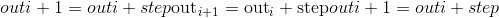

Parameters

*   **起始**(_编号_）–点集的起始值。 默认值：`0`。

*   **结束**(_编号_）–点集的结束值

*   **步骤**(_编号_）–每对相邻点之间的间隙。 默认值：`1`。

*   **out** ([_Tensor_](tensors.html#torch.Tensor "torch.Tensor")_,_ _optional_) – the output tensor.

*   **dtype**  ([`torch.dtype`](tensor_attributes.html#torch.torch.dtype "torch.torch.dtype") ，可选）–返回张量的所需数据类型。 默认值：如果`None`使用全局默认值(请参阅 [`torch.set_default_tensor_type()`](#torch.set_default_tensor_type "torch.set_default_tensor_type"))。 如果未提供 &lt;cite&gt;dtype&lt;/cite&gt; ，则从其他输入参数推断数据类型。 如果&lt;cite&gt;开始&lt;/cite&gt;，&lt;cite&gt;结束&lt;/cite&gt;或&lt;cite&gt;停止&lt;/cite&gt;中的任何一个是浮点，则推断 &lt;cite&gt;dtype&lt;/cite&gt; 为默认 dtype，请参见[ [`get_default_dtype()`](#torch.get_default_dtype "torch.get_default_dtype") 。 否则，将 &lt;cite&gt;dtype&lt;/cite&gt; 推断为 &lt;cite&gt;torch.int64&lt;/cite&gt; 。

*   **layout** ([`torch.layout`](tensor_attributes.html#torch.torch.layout "torch.torch.layout"), optional) – the desired layout of returned Tensor. Default: `torch.strided`.

*   **device** ([`torch.device`](tensor_attributes.html#torch.torch.device "torch.torch.device"), optional) – the desired device of returned tensor. Default: if `None`, uses the current device for the default tensor type (see [`torch.set_default_tensor_type()`](#torch.set_default_tensor_type "torch.set_default_tensor_type")). `device` will be the CPU for CPU tensor types and the current CUDA device for CUDA tensor types.

*   **requires_grad** (_bool__,_ _optional_) – If autograd should record operations on the returned tensor. Default: `False`.

Example:

```
>>> torch.arange(5)
tensor([ 0,  1,  2,  3,  4])
>>> torch.arange(1, 4)
tensor([ 1,  2,  3])
>>> torch.arange(1, 2.5, 0.5)
tensor([ 1.0000,  1.5000,  2.0000])

```

* * *

```
torch.range(start=0, end, step=1, out=None, dtype=None, layout=torch.strided, device=None, requires_grad=False) → Tensor¶
```

在步骤`step`中返回大小为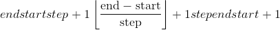的一维张量，其值从`start`到`end`。 阶跃是张量中两个值之间的差距。

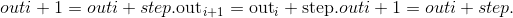

Warning

不推荐使用此功能，而推荐使用 [`torch.arange()`](#torch.arange "torch.arange") 。

Parameters

*   **start**  (_python：float_ )–点集的起始值。 默认值：`0`。

*   **end**  (_python：float_ )–点集的结束值

*   **步骤** (_python：float_ )–每对相邻点之间的间隙。 默认值：`1`。

*   **out** ([_Tensor_](tensors.html#torch.Tensor "torch.Tensor")_,_ _optional_) – the output tensor.

*   **dtype** ([`torch.dtype`](tensor_attributes.html#torch.torch.dtype "torch.torch.dtype"), optional) – the desired data type of returned tensor. Default: if `None`, uses a global default (see [`torch.set_default_tensor_type()`](#torch.set_default_tensor_type "torch.set_default_tensor_type")). If &lt;cite&gt;dtype&lt;/cite&gt; is not given, infer the data type from the other input arguments. If any of &lt;cite&gt;start&lt;/cite&gt;, &lt;cite&gt;end&lt;/cite&gt;, or &lt;cite&gt;stop&lt;/cite&gt; are floating-point, the &lt;cite&gt;dtype&lt;/cite&gt; is inferred to be the default dtype, see [`get_default_dtype()`](#torch.get_default_dtype "torch.get_default_dtype"). Otherwise, the &lt;cite&gt;dtype&lt;/cite&gt; is inferred to be &lt;cite&gt;torch.int64&lt;/cite&gt;.

*   **layout** ([`torch.layout`](tensor_attributes.html#torch.torch.layout "torch.torch.layout"), optional) – the desired layout of returned Tensor. Default: `torch.strided`.

*   **device** ([`torch.device`](tensor_attributes.html#torch.torch.device "torch.torch.device"), optional) – the desired device of returned tensor. Default: if `None`, uses the current device for the default tensor type (see [`torch.set_default_tensor_type()`](#torch.set_default_tensor_type "torch.set_default_tensor_type")). `device` will be the CPU for CPU tensor types and the current CUDA device for CUDA tensor types.

*   **requires_grad** (_bool__,_ _optional_) – If autograd should record operations on the returned tensor. Default: `False`.

Example:

```
>>> torch.range(1, 4)
tensor([ 1.,  2.,  3.,  4.])
>>> torch.range(1, 4, 0.5)
tensor([ 1.0000,  1.5000,  2.0000,  2.5000,  3.0000,  3.5000,  4.0000])

```

* * *

```
torch.linspace(start, end, steps=100, out=None, dtype=None, layout=torch.strided, device=None, requires_grad=False) → Tensor¶
```

返回`start`和`end`之间等距点的`steps`的一维张量。

输出张量为`steps`大小的 1-D。

Parameters

*   **开始** (_python：float_ )–点集的起始值

*   **end** (_python:float_) – the ending value for the set of points

*   **步骤** (_python：int_ )–在`start`和`end`之间采样的点数。 默认值：`100`。

*   **out** ([_Tensor_](tensors.html#torch.Tensor "torch.Tensor")_,_ _optional_) – the output tensor.

*   **dtype** ([`torch.dtype`](tensor_attributes.html#torch.torch.dtype "torch.torch.dtype"), optional) – the desired data type of returned tensor. Default: if `None`, uses a global default (see [`torch.set_default_tensor_type()`](#torch.set_default_tensor_type "torch.set_default_tensor_type")).

*   **layout** ([`torch.layout`](tensor_attributes.html#torch.torch.layout "torch.torch.layout"), optional) – the desired layout of returned Tensor. Default: `torch.strided`.

*   **device** ([`torch.device`](tensor_attributes.html#torch.torch.device "torch.torch.device"), optional) – the desired device of returned tensor. Default: if `None`, uses the current device for the default tensor type (see [`torch.set_default_tensor_type()`](#torch.set_default_tensor_type "torch.set_default_tensor_type")). `device` will be the CPU for CPU tensor types and the current CUDA device for CUDA tensor types.

*   **requires_grad** (_bool__,_ _optional_) – If autograd should record operations on the returned tensor. Default: `False`.

Example:

```
>>> torch.linspace(3, 10, steps=5)
tensor([  3.0000,   4.7500,   6.5000,   8.2500,  10.0000])
>>> torch.linspace(-10, 10, steps=5)
tensor([-10.,  -5.,   0.,   5.,  10.])
>>> torch.linspace(start=-10, end=10, steps=5)
tensor([-10.,  -5.,   0.,   5.,  10.])
>>> torch.linspace(start=-10, end=10, steps=1)
tensor([-10.])

```

* * *

```
torch.logspace(start, end, steps=100, base=10.0, out=None, dtype=None, layout=torch.strided, device=None, requires_grad=False) → Tensor¶
```

返回与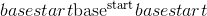和之间的底数`base`对数间隔的`steps`点的一维张量。

The output tensor is 1-D of size `steps`.

Parameters

*   **start** (_python:float_) – the starting value for the set of points

*   **end** (_python:float_) – the ending value for the set of points

*   **steps** (_python:int_) – number of points to sample between `start` and `end`. Default: `100`.

*   **基数** (_python：float_ )–对数函数的基数。 默认值：`10.0`。

*   **out** ([_Tensor_](tensors.html#torch.Tensor "torch.Tensor")_,_ _optional_) – the output tensor.

*   **dtype** ([`torch.dtype`](tensor_attributes.html#torch.torch.dtype "torch.torch.dtype"), optional) – the desired data type of returned tensor. Default: if `None`, uses a global default (see [`torch.set_default_tensor_type()`](#torch.set_default_tensor_type "torch.set_default_tensor_type")).

*   **layout** ([`torch.layout`](tensor_attributes.html#torch.torch.layout "torch.torch.layout"), optional) – the desired layout of returned Tensor. Default: `torch.strided`.

*   **device** ([`torch.device`](tensor_attributes.html#torch.torch.device "torch.torch.device"), optional) – the desired device of returned tensor. Default: if `None`, uses the current device for the default tensor type (see [`torch.set_default_tensor_type()`](#torch.set_default_tensor_type "torch.set_default_tensor_type")). `device` will be the CPU for CPU tensor types and the current CUDA device for CUDA tensor types.

*   **requires_grad** (_bool__,_ _optional_) – If autograd should record operations on the returned tensor. Default: `False`.

Example:

```
>>> torch.logspace(start=-10, end=10, steps=5)
tensor([ 1.0000e-10,  1.0000e-05,  1.0000e+00,  1.0000e+05,  1.0000e+10])
>>> torch.logspace(start=0.1, end=1.0, steps=5)
tensor([  1.2589,   2.1135,   3.5481,   5.9566,  10.0000])
>>> torch.logspace(start=0.1, end=1.0, steps=1)
tensor([1.2589])
>>> torch.logspace(start=2, end=2, steps=1, base=2)
tensor([4.0])

```

* * *

```
torch.eye(n, m=None, out=None, dtype=None, layout=torch.strided, device=None, requires_grad=False) → Tensor¶
```

返回一个二维张量，对角线上有一个，其他位置为零。

Parameters

*   **n**  (_python：int_ )–行数

*   **m**  (_python：int_ _，_ _可选_）–默认为`n`的列数

*   **out** ([_Tensor_](tensors.html#torch.Tensor "torch.Tensor")_,_ _optional_) – the output tensor.

*   **dtype** ([`torch.dtype`](tensor_attributes.html#torch.torch.dtype "torch.torch.dtype"), optional) – the desired data type of returned tensor. Default: if `None`, uses a global default (see [`torch.set_default_tensor_type()`](#torch.set_default_tensor_type "torch.set_default_tensor_type")).

*   **layout** ([`torch.layout`](tensor_attributes.html#torch.torch.layout "torch.torch.layout"), optional) – the desired layout of returned Tensor. Default: `torch.strided`.

*   **device** ([`torch.device`](tensor_attributes.html#torch.torch.device "torch.torch.device"), optional) – the desired device of returned tensor. Default: if `None`, uses the current device for the default tensor type (see [`torch.set_default_tensor_type()`](#torch.set_default_tensor_type "torch.set_default_tensor_type")). `device` will be the CPU for CPU tensor types and the current CUDA device for CUDA tensor types.

*   **requires_grad** (_bool__,_ _optional_) – If autograd should record operations on the returned tensor. Default: `False`.

退货

二维张量，对角线上有一个，其他位置为零

返回类型

[张量](tensors.html#torch.Tensor "torch.Tensor")

Example:

```
>>> torch.eye(3)
tensor([[ 1.,  0.,  0.],
        [ 0.,  1.,  0.],
        [ 0.,  0.,  1.]])

```

* * *

```
torch.empty(*size, out=None, dtype=None, layout=torch.strided, device=None, requires_grad=False, pin_memory=False) → Tensor¶
```

返回填充有未初始化数据的张量。 张量的形状由变量参数`size`定义。

Parameters

*   **size** (_python:int..._) – a sequence of integers defining the shape of the output tensor. Can be a variable number of arguments or a collection like a list or tuple.

*   **out** ([_Tensor_](tensors.html#torch.Tensor "torch.Tensor")_,_ _optional_) – the output tensor.

*   **dtype** ([`torch.dtype`](tensor_attributes.html#torch.torch.dtype "torch.torch.dtype"), optional) – the desired data type of returned tensor. Default: if `None`, uses a global default (see [`torch.set_default_tensor_type()`](#torch.set_default_tensor_type "torch.set_default_tensor_type")).

*   **layout** ([`torch.layout`](tensor_attributes.html#torch.torch.layout "torch.torch.layout"), optional) – the desired layout of returned Tensor. Default: `torch.strided`.

*   **device** ([`torch.device`](tensor_attributes.html#torch.torch.device "torch.torch.device"), optional) – the desired device of returned tensor. Default: if `None`, uses the current device for the default tensor type (see [`torch.set_default_tensor_type()`](#torch.set_default_tensor_type "torch.set_default_tensor_type")). `device` will be the CPU for CPU tensor types and the current CUDA device for CUDA tensor types.

*   **requires_grad** (_bool__,_ _optional_) – If autograd should record operations on the returned tensor. Default: `False`.

*   **pin_memory** (_bool__,_ _optional_) – If set, returned tensor would be allocated in the pinned memory. Works only for CPU tensors. Default: `False`.

Example:

```
>>> torch.empty(2, 3)
tensor(1.00000e-08 *
       [[ 6.3984,  0.0000,  0.0000],
        [ 0.0000,  0.0000,  0.0000]])

```

* * *

```
torch.empty_like(input, dtype=None, layout=None, device=None, requires_grad=False) → Tensor¶
```

返回与`input`相同大小的未初始化张量。 `torch.empty_like(input)`等效于`torch.empty(input.size(), dtype=input.dtype, layout=input.layout, device=input.device)`。

Parameters

*   **input** ([_Tensor_](tensors.html#torch.Tensor "torch.Tensor")) – the size of `input` will determine size of the output tensor.

*   **dtype** ([`torch.dtype`](tensor_attributes.html#torch.torch.dtype "torch.torch.dtype"), optional) – the desired data type of returned Tensor. Default: if `None`, defaults to the dtype of `input`.

*   **layout** ([`torch.layout`](tensor_attributes.html#torch.torch.layout "torch.torch.layout"), optional) – the desired layout of returned tensor. Default: if `None`, defaults to the layout of `input`.

*   **device** ([`torch.device`](tensor_attributes.html#torch.torch.device "torch.torch.device"), optional) – the desired device of returned tensor. Default: if `None`, defaults to the device of `input`.

*   **requires_grad** (_bool__,_ _optional_) – If autograd should record operations on the returned tensor. Default: `False`.

Example:

```
>>> torch.empty((2,3), dtype=torch.int64)
tensor([[ 9.4064e+13,  2.8000e+01,  9.3493e+13],
        [ 7.5751e+18,  7.1428e+18,  7.5955e+18]])

```

* * *

```
torch.empty_strided(size, stride, dtype=None, layout=None, device=None, requires_grad=False, pin_memory=False) → Tensor¶
```

返回填充有未初始化数据的张量。 张量的形状和步幅分别由变量参数`size`和`stride`定义。 `torch.empty_strided(size, stride)`等同于`torch.empty(size).as_strided(size, stride)`。

Warning

创建的张量中的一个以上元素可以引用单个存储位置。 结果，就地操作(尤其是矢量化的操作）可能会导致错误的行为。 如果需要写张量，请先克隆它们。

Parameters

*   **大小**(python：ints 的_元组）–输出张量的形状_

*   **跨度**(python：ints 的_元组）–输出张量的跨度_

*   **dtype** ([`torch.dtype`](tensor_attributes.html#torch.torch.dtype "torch.torch.dtype"), optional) – the desired data type of returned tensor. Default: if `None`, uses a global default (see [`torch.set_default_tensor_type()`](#torch.set_default_tensor_type "torch.set_default_tensor_type")).

*   **layout** ([`torch.layout`](tensor_attributes.html#torch.torch.layout "torch.torch.layout"), optional) – the desired layout of returned Tensor. Default: `torch.strided`.

*   **device** ([`torch.device`](tensor_attributes.html#torch.torch.device "torch.torch.device"), optional) – the desired device of returned tensor. Default: if `None`, uses the current device for the default tensor type (see [`torch.set_default_tensor_type()`](#torch.set_default_tensor_type "torch.set_default_tensor_type")). `device` will be the CPU for CPU tensor types and the current CUDA device for CUDA tensor types.

*   **requires_grad** (_bool__,_ _optional_) – If autograd should record operations on the returned tensor. Default: `False`.

*   **pin_memory** (_bool__,_ _optional_) – If set, returned tensor would be allocated in the pinned memory. Works only for CPU tensors. Default: `False`.

Example:

```
>>> a = torch.empty_strided((2, 3), (1, 2))
>>> a
tensor([[8.9683e-44, 4.4842e-44, 5.1239e+07],
        [0.0000e+00, 0.0000e+00, 3.0705e-41]])
>>> a.stride()
(1, 2)
>>> a.size()
torch.Size([2, 3])

```

* * *

```
torch.full(size, fill_value, out=None, dtype=None, layout=torch.strided, device=None, requires_grad=False) → Tensor¶
```

返回大小为`size`的张量，其中填充了`fill_value`。

Parameters

*   **大小** (_python：int ..._ )–定义输出张量形状的整数列表，元组或`torch.Size`。

*   **fill_value** –用来填充输出张量的数字。

*   **out** ([_Tensor_](tensors.html#torch.Tensor "torch.Tensor")_,_ _optional_) – the output tensor.

*   **dtype** ([`torch.dtype`](tensor_attributes.html#torch.torch.dtype "torch.torch.dtype"), optional) – the desired data type of returned tensor. Default: if `None`, uses a global default (see [`torch.set_default_tensor_type()`](#torch.set_default_tensor_type "torch.set_default_tensor_type")).

*   **layout** ([`torch.layout`](tensor_attributes.html#torch.torch.layout "torch.torch.layout"), optional) – the desired layout of returned Tensor. Default: `torch.strided`.

*   **device** ([`torch.device`](tensor_attributes.html#torch.torch.device "torch.torch.device"), optional) – the desired device of returned tensor. Default: if `None`, uses the current device for the default tensor type (see [`torch.set_default_tensor_type()`](#torch.set_default_tensor_type "torch.set_default_tensor_type")). `device` will be the CPU for CPU tensor types and the current CUDA device for CUDA tensor types.

*   **requires_grad** (_bool__,_ _optional_) – If autograd should record operations on the returned tensor. Default: `False`.

Example:

```
>>> torch.full((2, 3), 3.141592)
tensor([[ 3.1416,  3.1416,  3.1416],
        [ 3.1416,  3.1416,  3.1416]])

```

* * *

```
torch.full_like(input, fill_value, out=None, dtype=None, layout=torch.strided, device=None, requires_grad=False) → Tensor¶
```

返回与填充有`fill_value`的`input`大小相同的张量。 `torch.full_like(input, fill_value)`等同于`torch.full(input.size(), fill_value, dtype=input.dtype, layout=input.layout, device=input.device)`。

Parameters

*   **input** ([_Tensor_](tensors.html#torch.Tensor "torch.Tensor")) – the size of `input` will determine size of the output tensor.

*   **fill_value** – the number to fill the output tensor with.

*   **dtype** ([`torch.dtype`](tensor_attributes.html#torch.torch.dtype "torch.torch.dtype"), optional) – the desired data type of returned Tensor. Default: if `None`, defaults to the dtype of `input`.

*   **layout** ([`torch.layout`](tensor_attributes.html#torch.torch.layout "torch.torch.layout"), optional) – the desired layout of returned tensor. Default: if `None`, defaults to the layout of `input`.

*   **device** ([`torch.device`](tensor_attributes.html#torch.torch.device "torch.torch.device"), optional) – the desired device of returned tensor. Default: if `None`, defaults to the device of `input`.

*   **requires_grad** (_bool__,_ _optional_) – If autograd should record operations on the returned tensor. Default: `False`.

* * *

```
torch.quantize_per_tensor(input, scale, zero_point, dtype) → Tensor¶
```

将浮点张量转换为具有给定比例和零点的量化张量。

Parameters

*   **输入** ([_tensor_](tensors.html#torch.Tensor "torch.Tensor"))–浮点张量进行量化

*   **标度** (_python：float_ )–适用于量化公式的标度

*   **zero_point**  (_python：int_ )–映射为浮点零的整数值偏移

*   **dtype**  ([`torch.dtype`](tensor_attributes.html#torch.torch.dtype "torch.torch.dtype"))–返回张量的所需数据类型。 必须是量化的 dtypes 之一：`torch.quint8`，`torch.qint8`和`torch.qint32`

Returns

新量化的张量

Return type

[Tensor](tensors.html#torch.Tensor "torch.Tensor")

Example:

```
>>> torch.quantize_per_tensor(torch.tensor([-1.0, 0.0, 1.0, 2.0]), 0.1, 10, torch.quint8)
tensor([-1.,  0.,  1.,  2.], size=(4,), dtype=torch.quint8,
       quantization_scheme=torch.per_tensor_affine, scale=0.1, zero_point=10)
>>> torch.quantize_per_tensor(torch.tensor([-1.0, 0.0, 1.0, 2.0]), 0.1, 10, torch.quint8).int_repr()
tensor([ 0, 10, 20, 30], dtype=torch.uint8)

```

* * *

```
torch.quantize_per_channel(input, scales, zero_points, axis, dtype) → Tensor¶
```

将浮点张量转换为具有给定比例和零点的每通道量化张量。

Parameters

*   **input** ([_Tensor_](tensors.html#torch.Tensor "torch.Tensor")) – float tensor to quantize

*   **秤** ([_tensor_](tensors.html#torch.Tensor "torch.Tensor"))–要使用的一维浮标秤，尺寸应匹配`input.size(axis)`

*   **zero_points**  (_python：int_ )–要使用的整数 1D 张量偏移量，大小应与`input.size(axis)`相匹配

*   **轴** (_python：int_ )–应用每个通道量化的维度

*   **dtype** ([`torch.dtype`](tensor_attributes.html#torch.torch.dtype "torch.torch.dtype")) – the desired data type of returned tensor. Has to be one of the quantized dtypes: `torch.quint8`, `torch.qint8`, `torch.qint32`

Returns

A newly quantized tensor

Return type

[Tensor](tensors.html#torch.Tensor "torch.Tensor")

Example:

```
>>> x = torch.tensor([[-1.0, 0.0], [1.0, 2.0]])
>>> torch.quantize_per_channel(x, torch.tensor([0.1, 0.01]), torch.tensor([10, 0]), 0, torch.quint8)
tensor([[-1.,  0.],
        [ 1.,  2.]], size=(2, 2), dtype=torch.quint8,
       quantization_scheme=torch.per_channel_affine,
       scale=tensor([0.1000, 0.0100], dtype=torch.float64),
       zero_point=tensor([10,  0]), axis=0)
>>> torch.quantize_per_channel(x, torch.tensor([0.1, 0.01]), torch.tensor([10, 0]), 0, torch.quint8).int_repr()
tensor([[  0,  10],
        [100, 200]], dtype=torch.uint8)

```

### 索引，切片，联接，操作变更

* * *

```
torch.cat(tensors, dim=0, out=None) → Tensor¶
```

在给定维度上连接`seq`张量的给定序列。 所有张量必须具有相同的形状(在连接维中除外）或为空。

[`torch.cat()`](#torch.cat "torch.cat") 可以看作是 [`torch.split()`](#torch.split "torch.split") 和 [`torch.chunk()`](#torch.chunk "torch.chunk") 的逆运算。

通过示例可以更好地理解 [`torch.cat()`](#torch.cat "torch.cat") 。

Parameters

*   **张量**(张量_序列_）–同一类型的任何 python 张量序列。 提供的非空张量必须具有相同的形状，但猫的尺寸除外。

*   **暗淡的** (_python：int_ _，_ _可选_）–张量级联的尺寸

*   **out** ([_Tensor_](tensors.html#torch.Tensor "torch.Tensor")_,_ _optional_) – the output tensor.

Example:

```
>>> x = torch.randn(2, 3)
>>> x
tensor([[ 0.6580, -1.0969, -0.4614],
        [-0.1034, -0.5790,  0.1497]])
>>> torch.cat((x, x, x), 0)
tensor([[ 0.6580, -1.0969, -0.4614],
        [-0.1034, -0.5790,  0.1497],
        [ 0.6580, -1.0969, -0.4614],
        [-0.1034, -0.5790,  0.1497],
        [ 0.6580, -1.0969, -0.4614],
        [-0.1034, -0.5790,  0.1497]])
>>> torch.cat((x, x, x), 1)
tensor([[ 0.6580, -1.0969, -0.4614,  0.6580, -1.0969, -0.4614,  0.6580,
         -1.0969, -0.4614],
        [-0.1034, -0.5790,  0.1497, -0.1034, -0.5790,  0.1497, -0.1034,
         -0.5790,  0.1497]])

```

* * *

```
torch.chunk(input, chunks, dim=0) → List of Tensors¶
```

将张量拆分为特定数量的块。

如果沿给定维度`dim`的张量大小不能被`chunks`整除，则最后一块将较小。

Parameters

*   **输入** ([_tensor_](tensors.html#torch.Tensor "torch.Tensor"))–要分割的张量

*   **块** (_python：int_ )–要返回的块数

*   **暗淡的** (_python：int_ )–沿其张量分裂的尺寸

* * *

```
torch.gather(input, dim, index, out=None, sparse_grad=False) → Tensor¶
```

沿&lt;cite&gt;昏暗&lt;/cite&gt;指定的轴收集值。

对于 3-D 张量，输出指定为：

```
out[i][j][k] = input[index[i][j][k]][j][k]  # if dim == 0
out[i][j][k] = input[i][index[i][j][k]][k]  # if dim == 1
out[i][j][k] = input[i][j][index[i][j][k]]  # if dim == 2

```

如果`input`是大小为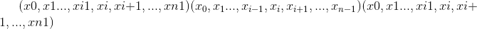和`dim = i`的 n 维张量，则`index`必须是大小为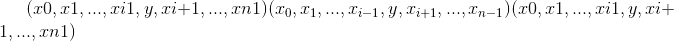的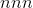-维张量，其中和`out`具有相同的大小 大小为`index`。

Parameters

*   **输入** ([_tensor_](tensors.html#torch.Tensor "torch.Tensor"))–源张量

*   **暗淡的** (_python：int_ )–沿其索引的轴

*   **索引** (_LongTensor_ )–要收集的元素的索引

*   **输出** ([_tensor_](tensors.html#torch.Tensor "torch.Tensor") _，_ _可选_）–目标张量

*   **sparse_grad**  (_bool_ _，_ _可选_）–如果`True`，则梯度 w.r.t. `input`将是一个稀疏张量。

Example:

```
>>> t = torch.tensor([[1,2],[3,4]])
>>> torch.gather(t, 1, torch.tensor([[0,0],[1,0]]))
tensor([[ 1,  1],
        [ 4,  3]])

```

* * *

```
torch.index_select(input, dim, index, out=None) → Tensor¶
```

返回一个新张量，该张量使用`index` LongTensor 中的`index`中的条目沿维度`dim`索引`input`张量。

返回的张量具有与原始张量(`input`）相同的维数。 `dim`的尺寸与`index`的长度相同； 其他尺寸与原始张量中的尺寸相同。

Note

返回的张量不与原始张量使用相同的存储空间**而不是**。 如果`out`的形状与预期的形状不同，我们将默默地将其更改为正确的形状，并在必要时重新分配基础存储。

Parameters

*   **input** ([_Tensor_](tensors.html#torch.Tensor "torch.Tensor")) – the input tensor.

*   **暗淡的** (_python：int_ )–我们索引的维度

*   **索引** (_LongTensor_ )–包含要索引的索引的一维张量

*   **out** ([_Tensor_](tensors.html#torch.Tensor "torch.Tensor")_,_ _optional_) – the output tensor.

Example:

```
>>> x = torch.randn(3, 4)
>>> x
tensor([[ 0.1427,  0.0231, -0.5414, -1.0009],
        [-0.4664,  0.2647, -0.1228, -1.1068],
        [-1.1734, -0.6571,  0.7230, -0.6004]])
>>> indices = torch.tensor([0, 2])
>>> torch.index_select(x, 0, indices)
tensor([[ 0.1427,  0.0231, -0.5414, -1.0009],
        [-1.1734, -0.6571,  0.7230, -0.6004]])
>>> torch.index_select(x, 1, indices)
tensor([[ 0.1427, -0.5414],
        [-0.4664, -0.1228],
        [-1.1734,  0.7230]])

```

* * *

```
torch.masked_select(input, mask, out=None) → Tensor¶
```

返回一个新的一维张量，该张量根据布尔值掩码`mask`为其 &lt;cite&gt;BoolTensor&lt;/cite&gt; 索引`input`张量。

`mask`张量和`input`张量的形状不需要匹配，但它们必须是[可广播的](notes/broadcasting.html#broadcasting-semantics)。

Note

返回的张量是否**而不是**使用与原始张量相同的存储

Parameters

*   **input** ([_Tensor_](tensors.html#torch.Tensor "torch.Tensor")) – the input tensor.

*   **掩码** (_ByteTensor_ )–包含二进制掩码的张量，以使用

*   **out** ([_Tensor_](tensors.html#torch.Tensor "torch.Tensor")_,_ _optional_) – the output tensor.

Example:

```
>>> x = torch.randn(3, 4)
>>> x
tensor([[ 0.3552, -2.3825, -0.8297,  0.3477],
        [-1.2035,  1.2252,  0.5002,  0.6248],
        [ 0.1307, -2.0608,  0.1244,  2.0139]])
>>> mask = x.ge(0.5)
>>> mask
tensor([[False, False, False, False],
        [False, True, True, True],
        [False, False, False, True]])
>>> torch.masked_select(x, mask)
tensor([ 1.2252,  0.5002,  0.6248,  2.0139])

```

* * *

```
torch.narrow(input, dim, start, length) → Tensor¶
```

返回一个新的张量，该张量是`input`张量的缩小版本。 尺寸`dim`从`start`输入到`start + length`。 返回的张量和`input`张量共享相同的基础存储。

Parameters

*   **输入** ([_tensor_](tensors.html#torch.Tensor "torch.Tensor"))–张量变窄

*   **暗淡的** (_python：int_ )–缩小范围

*   **开始** (_python：int_ )–起始尺寸

*   **长度** (_python：int_ )–到最终尺寸的距离

Example:

```
>>> x = torch.tensor([[1, 2, 3], [4, 5, 6], [7, 8, 9]])
>>> torch.narrow(x, 0, 0, 2)
tensor([[ 1,  2,  3],
        [ 4,  5,  6]])
>>> torch.narrow(x, 1, 1, 2)
tensor([[ 2,  3],
        [ 5,  6],
        [ 8,  9]])

```

* * *

```
torch.nonzero(input, *, out=None, as_tuple=False) → LongTensor or tuple of LongTensors¶
```

Note

[`torch.nonzero(..., as_tuple=False)`](#torch.nonzero "torch.nonzero") (默认值）返回一个二维张量，其中每一行都是非零值的索引。

[`torch.nonzero(..., as_tuple=True)`](#torch.nonzero "torch.nonzero") 返回一维索引张量的元组，允许进行高级索引，因此`x[x.nonzero(as_tuple=True)]`给出张量`x`的所有非零值。 在返回的元组中，每个索引张量都包含特定维度的非零索引。

有关这两种行为的更多详细信息，请参见下文。

**当** `as_tuple` **为“ False”(默认）**时：

返回一个张量，该张量包含`input`所有非零元素的索引。 结果中的每一行都包含`input`中非零元素的索引。 结果按字典顺序排序，最后一个索引更改最快(C 样式）。

如果`input`具有尺寸，则所得索引张量`out`的大小为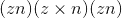，其中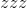是`input`张量中非零元素的总数。

**当** `as_tuple` **为“ True”** 时：

返回一维张量的元组，在`input`中每个维度一个张量，每个张量包含`input`所有非零元素的索引(在该维度中）。

如果`input`具有尺寸，则生成的元组包含大小的张量，其中是`input`张量中非零元素的总数。

作为一种特殊情况，当`input`具有零维和非零标量值时，会将其视为具有一个元素的一维张量。

Parameters

*   **input** ([_Tensor_](tensors.html#torch.Tensor "torch.Tensor")) – the input tensor.

*   **out**  (_LongTensor_ _，_ _可选_）–包含索引的输出张量

Returns

如果`as_tuple`为`False`，则包含索引的输出张量。 如果`as_tuple`为`True`，则每个维度都有一个 1-D 张量，其中包含沿着该维度的每个非零元素的索引。

Return type

LongTensor 或 LongTensor 的元组

Example:

```
>>> torch.nonzero(torch.tensor([1, 1, 1, 0, 1]))
tensor([[ 0],
        [ 1],
        [ 2],
        [ 4]])
>>> torch.nonzero(torch.tensor([[0.6, 0.0, 0.0, 0.0],
                                [0.0, 0.4, 0.0, 0.0],
                                [0.0, 0.0, 1.2, 0.0],
                                [0.0, 0.0, 0.0,-0.4]]))
tensor([[ 0,  0],
        [ 1,  1],
        [ 2,  2],
        [ 3,  3]])
>>> torch.nonzero(torch.tensor([1, 1, 1, 0, 1]), as_tuple=True)
(tensor([0, 1, 2, 4]),)
>>> torch.nonzero(torch.tensor([[0.6, 0.0, 0.0, 0.0],
                                [0.0, 0.4, 0.0, 0.0],
                                [0.0, 0.0, 1.2, 0.0],
                                [0.0, 0.0, 0.0,-0.4]]), as_tuple=True)
(tensor([0, 1, 2, 3]), tensor([0, 1, 2, 3]))
>>> torch.nonzero(torch.tensor(5), as_tuple=True)
(tensor([0]),)

```

* * *

```
torch.reshape(input, shape) → Tensor¶
```

返回具有与`input`相同的数据和元素数量，但具有指定形状的张量。 如果可能，返回的张量将是`input`的视图。 否则，它将是副本。 连续输入和具有兼容步幅的输入可以在不复制的情况下进行重塑，但是您不应该依赖复制与查看行为。

当可以返回视图时，请参见 [`torch.Tensor.view()`](tensors.html#torch.Tensor.view "torch.Tensor.view") 。

单个尺寸可能为-1，在这种情况下，它是根据`input`中的其余尺寸和元素数量推断出来的。

Parameters

*   **输入** ([_tensor_](tensors.html#torch.Tensor "torch.Tensor"))–要重塑的张量

*   **形状** (_python：ints_ 的元组）–新形状

Example:

```
>>> a = torch.arange(4.)
>>> torch.reshape(a, (2, 2))
tensor([[ 0.,  1.],
        [ 2.,  3.]])
>>> b = torch.tensor([[0, 1], [2, 3]])
>>> torch.reshape(b, (-1,))
tensor([ 0,  1,  2,  3])

```

* * *

```
torch.split(tensor, split_size_or_sections, dim=0)¶
```

将张量拆分为多个块。

如果`split_size_or_sections`是整数类型，则 [`tensor`](#torch.tensor "torch.tensor") 将被拆分为大小相等的块(如果可能）。 如果沿给定维度`dim`的张量大小不能被`split_size`整除，则最后一个块将较小。

如果`split_size_or_sections`是列表，则根据`split_size_or_sections`将 [`tensor`](#torch.tensor "torch.tensor") 拆分为`dim`，大小为`dim`。

Parameters

*   **张量** ([_tensor_](tensors.html#torch.Tensor "torch.Tensor"))–张量分裂。

*   **split_size_or_sections**  (_python：int_ _）或_ _(_ _列表_ _(_ _python ：int_ _）_）–单个块的大小或每个块的大小列表

*   **暗淡的** (_python：int_ )–沿其张量分裂的尺寸。

* * *

```
torch.squeeze(input, dim=None, out=None) → Tensor¶
```

返回一个张量，其中所有尺寸为 &lt;cite&gt;1&lt;/cite&gt; 的`input`尺寸均被删除。

例如，如果&lt;cite&gt;输入&lt;/cite&gt;的形状为：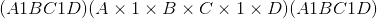，则张量中的&lt;cite&gt;张量将为：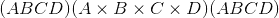。&lt;/cite&gt;

给定`dim`时，仅在给定尺寸上执行挤压操作。 如果&lt;cite&gt;输入&lt;/cite&gt;的形状为：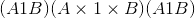，`squeeze(input, 0)`保持张量不变，但是`squeeze(input, 1)`会将张量压缩为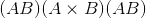形状。

Note

返回的张量与输入张量共享存储，因此更改一个张量的内容将更改另一个张量的内容。

Parameters

*   **input** ([_Tensor_](tensors.html#torch.Tensor "torch.Tensor")) – the input tensor.

*   **暗淡的** (_python：int_ _，_ _可选_）–如果给定，则仅在此维度上压缩输入

*   **out** ([_Tensor_](tensors.html#torch.Tensor "torch.Tensor")_,_ _optional_) – the output tensor.

Example:

```
>>> x = torch.zeros(2, 1, 2, 1, 2)
>>> x.size()
torch.Size([2, 1, 2, 1, 2])
>>> y = torch.squeeze(x)
>>> y.size()
torch.Size([2, 2, 2])
>>> y = torch.squeeze(x, 0)
>>> y.size()
torch.Size([2, 1, 2, 1, 2])
>>> y = torch.squeeze(x, 1)
>>> y.size()
torch.Size([2, 2, 1, 2])

```

* * *

```
torch.stack(tensors, dim=0, out=None) → Tensor¶
```

将张量的序列沿新维度连接起来。

所有张量都必须具有相同的大小。

Parameters

*   **张量**(_张量序列_）–连接的张量序列

*   **暗淡的** (_python：int_ )–插入的尺寸。 必须介于 0 和级联张量的维数之间(含）

*   **out** ([_Tensor_](tensors.html#torch.Tensor "torch.Tensor")_,_ _optional_) – the output tensor.

* * *

```
torch.t(input) → Tensor¶
```

期望`input`为&lt; = 2-D 张量，并转置尺寸 0 和 1。

将按原样返回 0-D 和 1-D 张量，并且可以将 2-D 张量视为`transpose(input, 0, 1)`的简写函数。

Parameters

**input** ([_Tensor_](tensors.html#torch.Tensor "torch.Tensor")) – the input tensor.

Example:

```
>>> x = torch.randn(())
>>> x
tensor(0.1995)
>>> torch.t(x)
tensor(0.1995)
>>> x = torch.randn(3)
>>> x
tensor([ 2.4320, -0.4608,  0.7702])
>>> torch.t(x)
tensor([.2.4320,.-0.4608,..0.7702])
>>> x = torch.randn(2, 3)
>>> x
tensor([[ 0.4875,  0.9158, -0.5872],
        [ 0.3938, -0.6929,  0.6932]])
>>> torch.t(x)
tensor([[ 0.4875,  0.3938],
        [ 0.9158, -0.6929],
        [-0.5872,  0.6932]])

```

* * *

```
torch.take(input, index) → Tensor¶
```

返回给定索引处带有`input`元素的新张量。 将输入张量视为视为一维张量。 结果采用与索引相同的形状。

Parameters

*   **input** ([_Tensor_](tensors.html#torch.Tensor "torch.Tensor")) – the input tensor.

*   **索引** (_LongTensor_ )–张量索引

Example:

```
>>> src = torch.tensor([[4, 3, 5],
                        [6, 7, 8]])
>>> torch.take(src, torch.tensor([0, 2, 5]))
tensor([ 4,  5,  8])

```

* * *

```
torch.transpose(input, dim0, dim1) → Tensor¶
```

返回一个张量，该张量是`input`的转置版本。 给定的尺寸`dim0`和`dim1`被交换。

产生的`out`张量与`input`张量共享其基础存储，因此更改一个内容将更改另一个内容。

Parameters

*   **input** ([_Tensor_](tensors.html#torch.Tensor "torch.Tensor")) – the input tensor.

*   **dim0**  (_python：int_ )–要转置的第一个维度

*   **dim1**  (_python：int_ )–要转置的第二维

Example:

```
>>> x = torch.randn(2, 3)
>>> x
tensor([[ 1.0028, -0.9893,  0.5809],
        [-0.1669,  0.7299,  0.4942]])
>>> torch.transpose(x, 0, 1)
tensor([[ 1.0028, -0.1669],
        [-0.9893,  0.7299],
        [ 0.5809,  0.4942]])

```

* * *

```
torch.unbind(input, dim=0) → seq¶
```

删除张量尺寸。

返回给定维度上所有切片的元组，已经没有它。

Parameters

*   **输入** ([_tensor_](tensors.html#torch.Tensor "torch.Tensor"))–要解除绑定的张量

*   **暗淡的** (_python：int_ )–要移除的尺寸

Example:

```
>>> torch.unbind(torch.tensor([[1, 2, 3],
>>>                            [4, 5, 6],
>>>                            [7, 8, 9]]))
(tensor([1, 2, 3]), tensor([4, 5, 6]), tensor([7, 8, 9]))

```

* * *

```
torch.unsqueeze(input, dim, out=None) → Tensor¶
```

返回在指定位置插入的尺寸为 1 的新张量。

返回的张量与此张量共享相同的基础数据。

可以使用`[-input.dim() - 1, input.dim() + 1)`范围内的`dim`值。 负的`dim`对应于`dim` = `dim + input.dim() + 1`处应用的 [`unsqueeze()`](#torch.unsqueeze "torch.unsqueeze") 。

Parameters

*   **input** ([_Tensor_](tensors.html#torch.Tensor "torch.Tensor")) – the input tensor.

*   **暗淡的** (_python：int_ )–插入单例尺寸的索引

*   **out** ([_Tensor_](tensors.html#torch.Tensor "torch.Tensor")_,_ _optional_) – the output tensor.

Example:

```
>>> x = torch.tensor([1, 2, 3, 4])
>>> torch.unsqueeze(x, 0)
tensor([[ 1,  2,  3,  4]])
>>> torch.unsqueeze(x, 1)
tensor([[ 1],
        [ 2],
        [ 3],
        [ 4]])

```

* * *

```
torch.where()¶
```

* * *

```
torch.where(condition, x, y) → Tensor
```

返回从`x`或`y`中选择的元素的张量，具体取决于`condition`。

该操作定义为：


Note

张量`condition`，`x`和`y`必须是[可广播的](notes/broadcasting.html#broadcasting-semantics)。

Parameters

*   **条件** ([_BoolTensor_](tensors.html#torch.BoolTensor "torch.BoolTensor"))–当为 True(非零）时，产生 x，否则产生 y

*   **x**  ([_tensor_](tensors.html#torch.Tensor "torch.Tensor"))–在`condition`为`True`的索引处选择的值

*   **y**  ([_tensor_](tensors.html#torch.Tensor "torch.Tensor"))–在`condition`为`False`的索引处选择的值

Returns

形状张量等于`condition`，`x`，`y`的广播形状

Return type

[Tensor](tensors.html#torch.Tensor "torch.Tensor")

Example:

```
>>> x = torch.randn(3, 2)
>>> y = torch.ones(3, 2)
>>> x
tensor([[-0.4620,  0.3139],
        [ 0.3898, -0.7197],
        [ 0.0478, -0.1657]])
>>> torch.where(x > 0, x, y)
tensor([[ 1.0000,  0.3139],
        [ 0.3898,  1.0000],
        [ 0.0478,  1.0000]])

```

* * *

```
torch.where(condition) → tuple of LongTensor
```

`torch.where(condition)`与`torch.nonzero(condition, as_tuple=True)`相同。

Note

另请参见 [`torch.nonzero()`](#torch.nonzero "torch.nonzero") 。

## 发电机

* * *

```
class torch._C.Generator(device='cpu') → Generator¶
```

创建并返回一个生成器对象，该对象管理产生伪随机数的算法的状态。 在许多[就地随机采样](#inplace-random-sampling)函数中用作关键字参数。

Parameters

**设备**(`torch.device`，可选）–生成器所需的设备。

Returns

一个 torch.Generator 对象。

Return type

[生成器](#torch._C.Generator "torch._C.Generator")

Example:

```
>>> g_cpu = torch.Generator()
>>> g_cuda = torch.Generator(device='cuda')

```

```
device¶
```

Generator.device-&gt;设备

获取生成器的当前设备。

Example:

```
>>> g_cpu = torch.Generator()
>>> g_cpu.device
device(type='cpu')

```

* * *

```
get_state() → Tensor¶
```

返回生成器状态为`torch.ByteTensor`。

Returns

一个`torch.ByteTensor`，其中包含将生成器还原到特定时间点的所有必要位。

Return type

[Tensor](tensors.html#torch.Tensor "torch.Tensor")

Example:

```
>>> g_cpu = torch.Generator()
>>> g_cpu.get_state()

```

* * *

```
initial_seed() → int¶
```

返回用于生成随机数的初始种子。

Example:

```
>>> g_cpu = torch.Generator()
>>> g_cpu.initial_seed()
2147483647

```

* * *

```
manual_seed(seed) → Generator¶
```

设置用于生成随机数的种子。 返回一个&lt;cite&gt;torch.生成器&lt;/cite&gt;对象。 建议设置一个大种子，即一个具有 0 和 1 位平衡的数字。 避免在种子中包含许多 0 位。

Parameters

**种子** (_python：int_ )–所需的种子。

Returns

An torch.Generator object.

Return type

[Generator](#torch._C.Generator "torch._C.Generator")

Example:

```
>>> g_cpu = torch.Generator()
>>> g_cpu.manual_seed(2147483647)

```

* * *

```
seed() → int¶
```

从 std :: random_device 或当前时间获取不确定的随机数，并将其用作生成器的种子。

Example:

```
>>> g_cpu = torch.Generator()
>>> g_cpu.seed()
1516516984916

```

* * *

```
set_state(new_state) → void¶
```

设置生成器状态。

Parameters

**new_state**  (_Torch.ByteTensor_ )–所需状态。

Example:

```
>>> g_cpu = torch.Generator()
>>> g_cpu_other = torch.Generator()
>>> g_cpu.set_state(g_cpu_other.get_state())

```

## 随机抽样

* * *

```
torch.seed()¶
```

将用于生成随机数的种子设置为不确定的随机数。 返回用于播种 RNG 的 64 位数字。

* * *

```
torch.manual_seed(seed)¶
```

设置用于生成随机数的种子。 返回一个&lt;cite&gt;torch.生成器&lt;/cite&gt;对象。

Parameters

**seed** (_python:int_) – The desired seed.

* * *

```
torch.initial_seed()¶
```

返回长为 Python &lt;cite&gt;long&lt;/cite&gt; 的用于生成随机数的初始种子。

* * *

```
torch.get_rng_state()¶
```

以 &lt;cite&gt;torch.ByteTensor&lt;/cite&gt; 的形式返回随机数生成器状态。

* * *

```
torch.set_rng_state(new_state)¶
```

设置随机数生成器状态。

Parameters

**new_state**  (_torch.ByteTensor_ )–所需状态

```
torch.default_generator Returns the default CPU torch.Generator¶
```

* * *

```
torch.bernoulli(input, *, generator=None, out=None) → Tensor¶
```

从伯努利分布中提取二进制随机数(0 或 1）。

`input`张量应为包含用于绘制二进制随机数的概率的张量。 因此，`input`中的所有值都必须在以下范围内：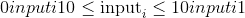。

输出张量的元素将根据`input`中给出的概率值绘制一个值。

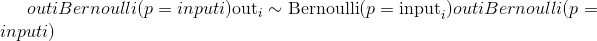

返回的`out`张量仅具有值 0 或 1，并且具有与`input`相同的形状。

`out`可以具有整数`dtype`，但是`input`必须具有浮点`dtype`。

Parameters

*   **输入** ([_tensor_](tensors.html#torch.Tensor "torch.Tensor"))–伯努利分布的概率值的输入张量

*   **生成器**(`torch.Generator`，可选）–用于采样的伪随机数生成器

*   **out** ([_Tensor_](tensors.html#torch.Tensor "torch.Tensor")_,_ _optional_) – the output tensor.

Example:

```
>>> a = torch.empty(3, 3).uniform_(0, 1)  # generate a uniform random matrix with range [0, 1]
>>> a
tensor([[ 0.1737,  0.0950,  0.3609],
        [ 0.7148,  0.0289,  0.2676],
        [ 0.9456,  0.8937,  0.7202]])
>>> torch.bernoulli(a)
tensor([[ 1.,  0.,  0.],
        [ 0.,  0.,  0.],
        [ 1.,  1.,  1.]])

>>> a = torch.ones(3, 3) # probability of drawing "1" is 1
>>> torch.bernoulli(a)
tensor([[ 1.,  1.,  1.],
        [ 1.,  1.,  1.],
        [ 1.,  1.,  1.]])
>>> a = torch.zeros(3, 3) # probability of drawing "1" is 0
>>> torch.bernoulli(a)
tensor([[ 0.,  0.,  0.],
        [ 0.,  0.,  0.],
        [ 0.,  0.,  0.]])

```

* * *

```
torch.multinomial(input, num_samples, replacement=False, *, generator=None, out=None) → LongTensor¶
```

返回一个张量，其中每行包含`num_samples`索引，这些索引是从位于张量`input`的相应行中的多项式概率分布中采样的。

Note

`input`的行不需要加总为 1(在这种情况下，我们将这些值用作权重），但必须为非负数，有限且总和为非零。

根据每个样本的采样时间，索引从左到右排序(第一个样本放在第一列中）。

如果`input`是向量，则`out`是大小`num_samples`的向量。

如果`input`是具有 &lt;cite&gt;m&lt;/cite&gt; 行的矩阵，则`out`是形状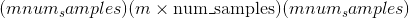的矩阵。

如果替换为`True`，则抽取样本进行替换。

如果没有，则它们将被替换而不会被绘制，这意味着当为一行绘制样本索引时，无法为该行再次绘制它。

Note

如果绘制时不进行替换，则`num_samples`必须小于`input`中非零元素的数目(如果是矩阵，则必须小于`input`每行中非零元素的最小数目）。

Parameters

*   **输入** ([_tensor_](tensors.html#torch.Tensor "torch.Tensor"))–包含概率的输入张量

*   **num_samples**  (_python：int_ )–要绘制的样本数

*   **替换** (_bool_ _，_ _可选_）–是否使用替换绘制

*   **generator** (`torch.Generator`, optional) – a pseudorandom number generator for sampling

*   **out** ([_Tensor_](tensors.html#torch.Tensor "torch.Tensor")_,_ _optional_) – the output tensor.

Example:

```
>>> weights = torch.tensor([0, 10, 3, 0], dtype=torch.float) # create a tensor of weights
>>> torch.multinomial(weights, 2)
tensor([1, 2])
>>> torch.multinomial(weights, 4) # ERROR!
RuntimeError: invalid argument 2: invalid multinomial distribution (with replacement=False,
not enough non-negative category to sample) at ../aten/src/TH/generic/THTensorRandom.cpp:320
>>> torch.multinomial(weights, 4, replacement=True)
tensor([ 2,  1,  1,  1])

```

* * *

```
torch.normal()¶
```

* * *

```
torch.normal(mean, std, *, generator=None, out=None) → Tensor
```

返回从均值和标准差给出的独立正态分布中得出的随机数张量。

[`mean`](#torch.mean "torch.mean") 是一个张量，每个输出元素的正态分布均值

[`std`](#torch.std "torch.std") 是一个张量，每个输出元素的正态分布的标准偏差

[`mean`](#torch.mean "torch.mean") 和 [`std`](#torch.std "torch.std") 的形状不需要匹配，但是每个张量中元素的总数必须相同。

Note

当形状不匹配时，将 [`mean`](#torch.mean "torch.mean") 的形状用作返回的输出张量的形状

Parameters

*   **均值** ([_tensor_](tensors.html#torch.Tensor "torch.Tensor"))–每个元素均值的张量

*   **std**  ([_tensor_](tensors.html#torch.Tensor "torch.Tensor"))–每个元素的标准偏差张量

*   **generator** (`torch.Generator`, optional) – a pseudorandom number generator for sampling

*   **out** ([_Tensor_](tensors.html#torch.Tensor "torch.Tensor")_,_ _optional_) – the output tensor.

Example:

```
>>> torch.normal(mean=torch.arange(1., 11.), std=torch.arange(1, 0, -0.1))
tensor([  1.0425,   3.5672,   2.7969,   4.2925,   4.7229,   6.2134,
          8.0505,   8.1408,   9.0563,  10.0566])

```

* * *

```
torch.normal(mean=0.0, std, out=None) → Tensor
```

与上面的功能相似，但均值在所有绘制的元素之间共享。

Parameters

*   **平均值** (_python：float_ _，_ _可选_）–所有分布的平均值

*   **std** ([_Tensor_](tensors.html#torch.Tensor "torch.Tensor")) – the tensor of per-element standard deviations

*   **out** ([_Tensor_](tensors.html#torch.Tensor "torch.Tensor")_,_ _optional_) – the output tensor.

Example:

```
>>> torch.normal(mean=0.5, std=torch.arange(1., 6.))
tensor([-1.2793, -1.0732, -2.0687,  5.1177, -1.2303])

```

* * *

```
torch.normal(mean, std=1.0, out=None) → Tensor
```

与上面的函数相似，但是标准偏差在所有绘制的元素之间共享。

Parameters

*   **mean** ([_Tensor_](tensors.html#torch.Tensor "torch.Tensor")) – the tensor of per-element means

*   **std**  (_python：float_ _，_ _可选_）–所有发行版的标准差

*   **out**  ([_tensor_](tensors.html#torch.Tensor "torch.Tensor") _，_ _可选_）–输出张量

Example:

```
>>> torch.normal(mean=torch.arange(1., 6.))
tensor([ 1.1552,  2.6148,  2.6535,  5.8318,  4.2361])

```

* * *

```
torch.normal(mean, std, size, *, out=None) → Tensor
```

与上述功能相似，但均值和标准差在所有绘制的元素之间共享。 所得张量的大小由`size`给出。

Parameters

*   **平均值** (_python：float_ )–所有分布的平均值

*   **std**  (_python：float_ )–所有分布的标准偏差

*   **大小** (_python：int ..._ )–定义输出张量形状的整数序列。

*   **out** ([_Tensor_](tensors.html#torch.Tensor "torch.Tensor")_,_ _optional_) – the output tensor.

Example:

```
>>> torch.normal(2, 3, size=(1, 4))
tensor([[-1.3987, -1.9544,  3.6048,  0.7909]])

```

* * *

```
torch.rand(*size, out=None, dtype=None, layout=torch.strided, device=None, requires_grad=False) → Tensor¶
```

从区间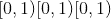返回均匀分布的随机张量

张量的形状由变量参数`size`定义。

Parameters

*   **size** (_python:int..._) – a sequence of integers defining the shape of the output tensor. Can be a variable number of arguments or a collection like a list or tuple.

*   **out** ([_Tensor_](tensors.html#torch.Tensor "torch.Tensor")_,_ _optional_) – the output tensor.

*   **dtype** ([`torch.dtype`](tensor_attributes.html#torch.torch.dtype "torch.torch.dtype"), optional) – the desired data type of returned tensor. Default: if `None`, uses a global default (see [`torch.set_default_tensor_type()`](#torch.set_default_tensor_type "torch.set_default_tensor_type")).

*   **layout** ([`torch.layout`](tensor_attributes.html#torch.torch.layout "torch.torch.layout"), optional) – the desired layout of returned Tensor. Default: `torch.strided`.

*   **device** ([`torch.device`](tensor_attributes.html#torch.torch.device "torch.torch.device"), optional) – the desired device of returned tensor. Default: if `None`, uses the current device for the default tensor type (see [`torch.set_default_tensor_type()`](#torch.set_default_tensor_type "torch.set_default_tensor_type")). `device` will be the CPU for CPU tensor types and the current CUDA device for CUDA tensor types.

*   **requires_grad** (_bool__,_ _optional_) – If autograd should record operations on the returned tensor. Default: `False`.

Example:

```
>>> torch.rand(4)
tensor([ 0.5204,  0.2503,  0.3525,  0.5673])
>>> torch.rand(2, 3)
tensor([[ 0.8237,  0.5781,  0.6879],
        [ 0.3816,  0.7249,  0.0998]])

```

* * *

```
torch.rand_like(input, dtype=None, layout=None, device=None, requires_grad=False) → Tensor¶
```

返回与`input`大小相同的张量，该张量由间隔上均匀分布的随机数填充。 `torch.rand_like(input)`等效于`torch.rand(input.size(), dtype=input.dtype, layout=input.layout, device=input.device)`。

Parameters

*   **input** ([_Tensor_](tensors.html#torch.Tensor "torch.Tensor")) – the size of `input` will determine size of the output tensor.

*   **dtype** ([`torch.dtype`](tensor_attributes.html#torch.torch.dtype "torch.torch.dtype"), optional) – the desired data type of returned Tensor. Default: if `None`, defaults to the dtype of `input`.

*   **layout** ([`torch.layout`](tensor_attributes.html#torch.torch.layout "torch.torch.layout"), optional) – the desired layout of returned tensor. Default: if `None`, defaults to the layout of `input`.

*   **device** ([`torch.device`](tensor_attributes.html#torch.torch.device "torch.torch.device"), optional) – the desired device of returned tensor. Default: if `None`, defaults to the device of `input`.

*   **requires_grad** (_bool__,_ _optional_) – If autograd should record operations on the returned tensor. Default: `False`.

* * *

```
torch.randint(low=0, high, size, *, generator=None, out=None, dtype=None, layout=torch.strided, device=None, requires_grad=False) → Tensor¶
```

返回一个由在`low`(包括）和`high`(不包括）之间均匀生成的随机整数填充的张量。

The shape of the tensor is defined by the variable argument `size`.

Parameters

*   **低** (_python：int_ _，_ _可选_）–从分布中得出的最低整数。 默认值：0

*   **高** (_python：int_ )–从分布中得出的最高整数之上一个。

*   **大小**(_元组_）–定义输出张量形状的元组。

*   **generator** (`torch.Generator`, optional) – a pseudorandom number generator for sampling

*   **out** ([_Tensor_](tensors.html#torch.Tensor "torch.Tensor")_,_ _optional_) – the output tensor.

*   **dtype** ([`torch.dtype`](tensor_attributes.html#torch.torch.dtype "torch.torch.dtype"), optional) – the desired data type of returned tensor. Default: if `None`, uses a global default (see [`torch.set_default_tensor_type()`](#torch.set_default_tensor_type "torch.set_default_tensor_type")).

*   **layout** ([`torch.layout`](tensor_attributes.html#torch.torch.layout "torch.torch.layout"), optional) – the desired layout of returned Tensor. Default: `torch.strided`.

*   **device** ([`torch.device`](tensor_attributes.html#torch.torch.device "torch.torch.device"), optional) – the desired device of returned tensor. Default: if `None`, uses the current device for the default tensor type (see [`torch.set_default_tensor_type()`](#torch.set_default_tensor_type "torch.set_default_tensor_type")). `device` will be the CPU for CPU tensor types and the current CUDA device for CUDA tensor types.

*   **requires_grad** (_bool__,_ _optional_) – If autograd should record operations on the returned tensor. Default: `False`.

Example:

```
>>> torch.randint(3, 5, (3,))
tensor([4, 3, 4])

>>> torch.randint(10, (2, 2))
tensor([[0, 2],
        [5, 5]])

>>> torch.randint(3, 10, (2, 2))
tensor([[4, 5],
        [6, 7]])

```

* * *

```
torch.randint_like(input, low=0, high, dtype=None, layout=torch.strided, device=None, requires_grad=False) → Tensor¶
```

返回具有与张量`input`相同形状的张量，其中填充了在`low`(包括）和`high`(排除）之间均匀生成的随机整数。

Parameters

*   **input** ([_Tensor_](tensors.html#torch.Tensor "torch.Tensor")) – the size of `input` will determine size of the output tensor.

*   **low** (_python:int__,_ _optional_) – Lowest integer to be drawn from the distribution. Default: 0.

*   **high** (_python:int_) – One above the highest integer to be drawn from the distribution.

*   **dtype** ([`torch.dtype`](tensor_attributes.html#torch.torch.dtype "torch.torch.dtype"), optional) – the desired data type of returned Tensor. Default: if `None`, defaults to the dtype of `input`.

*   **layout** ([`torch.layout`](tensor_attributes.html#torch.torch.layout "torch.torch.layout"), optional) – the desired layout of returned tensor. Default: if `None`, defaults to the layout of `input`.

*   **device** ([`torch.device`](tensor_attributes.html#torch.torch.device "torch.torch.device"), optional) – the desired device of returned tensor. Default: if `None`, defaults to the device of `input`.

*   **requires_grad** (_bool__,_ _optional_) – If autograd should record operations on the returned tensor. Default: `False`.

* * *

```
torch.randn(*size, out=None, dtype=None, layout=torch.strided, device=None, requires_grad=False) → Tensor¶
```

从平均值为 &lt;cite&gt;0&lt;/cite&gt; ，方差为 &lt;cite&gt;1&lt;/cite&gt; 的正态分布中返回一个填充有随机数的张量(也称为标准正态分布）。


The shape of the tensor is defined by the variable argument `size`.

Parameters

*   **size** (_python:int..._) – a sequence of integers defining the shape of the output tensor. Can be a variable number of arguments or a collection like a list or tuple.

*   **out** ([_Tensor_](tensors.html#torch.Tensor "torch.Tensor")_,_ _optional_) – the output tensor.

*   **dtype** ([`torch.dtype`](tensor_attributes.html#torch.torch.dtype "torch.torch.dtype"), optional) – the desired data type of returned tensor. Default: if `None`, uses a global default (see [`torch.set_default_tensor_type()`](#torch.set_default_tensor_type "torch.set_default_tensor_type")).

*   **layout** ([`torch.layout`](tensor_attributes.html#torch.torch.layout "torch.torch.layout"), optional) – the desired layout of returned Tensor. Default: `torch.strided`.

*   **device** ([`torch.device`](tensor_attributes.html#torch.torch.device "torch.torch.device"), optional) – the desired device of returned tensor. Default: if `None`, uses the current device for the default tensor type (see [`torch.set_default_tensor_type()`](#torch.set_default_tensor_type "torch.set_default_tensor_type")). `device` will be the CPU for CPU tensor types and the current CUDA device for CUDA tensor types.

*   **requires_grad** (_bool__,_ _optional_) – If autograd should record operations on the returned tensor. Default: `False`.

Example:

```
>>> torch.randn(4)
tensor([-2.1436,  0.9966,  2.3426, -0.6366])
>>> torch.randn(2, 3)
tensor([[ 1.5954,  2.8929, -1.0923],
        [ 1.1719, -0.4709, -0.1996]])

```

* * *

```
torch.randn_like(input, dtype=None, layout=None, device=None, requires_grad=False) → Tensor¶
```

返回一个与`input`相同大小的张量，该张量由均值 0 和方差 1 的正态分布的随机数填充。`torch.randn_like(input)`等效于`torch.randn(input.size(), dtype=input.dtype, layout=input.layout, device=input.device)`。

Parameters

*   **input** ([_Tensor_](tensors.html#torch.Tensor "torch.Tensor")) – the size of `input` will determine size of the output tensor.

*   **dtype** ([`torch.dtype`](tensor_attributes.html#torch.torch.dtype "torch.torch.dtype"), optional) – the desired data type of returned Tensor. Default: if `None`, defaults to the dtype of `input`.

*   **layout** ([`torch.layout`](tensor_attributes.html#torch.torch.layout "torch.torch.layout"), optional) – the desired layout of returned tensor. Default: if `None`, defaults to the layout of `input`.

*   **device** ([`torch.device`](tensor_attributes.html#torch.torch.device "torch.torch.device"), optional) – the desired device of returned tensor. Default: if `None`, defaults to the device of `input`.

*   **requires_grad** (_bool__,_ _optional_) – If autograd should record operations on the returned tensor. Default: `False`.

* * *

```
torch.randperm(n, out=None, dtype=torch.int64, layout=torch.strided, device=None, requires_grad=False) → LongTensor¶
```

返回从`0`到`n - 1`的整数的随机排列。

Parameters

*   **n**  (_python：int_ )–上限(不包括）

*   **out** ([_Tensor_](tensors.html#torch.Tensor "torch.Tensor")_,_ _optional_) – the output tensor.

*   **dtype**  ([`torch.dtype`](tensor_attributes.html#torch.torch.dtype "torch.torch.dtype") ，可选）–返回张量的所需数据类型。 默认值：`torch.int64`。

*   **layout** ([`torch.layout`](tensor_attributes.html#torch.torch.layout "torch.torch.layout"), optional) – the desired layout of returned Tensor. Default: `torch.strided`.

*   **device** ([`torch.device`](tensor_attributes.html#torch.torch.device "torch.torch.device"), optional) – the desired device of returned tensor. Default: if `None`, uses the current device for the default tensor type (see [`torch.set_default_tensor_type()`](#torch.set_default_tensor_type "torch.set_default_tensor_type")). `device` will be the CPU for CPU tensor types and the current CUDA device for CUDA tensor types.

*   **requires_grad** (_bool__,_ _optional_) – If autograd should record operations on the returned tensor. Default: `False`.

Example:

```
>>> torch.randperm(4)
tensor([2, 1, 0, 3])

```

### 就地随机抽样

在 Tensor 上还定义了一些就地随机采样函数。 单击以查看其文档：

*   [`torch.Tensor.bernoulli_()`](tensors.html#torch.Tensor.bernoulli_ "torch.Tensor.bernoulli_") - [`torch.bernoulli()`](#torch.bernoulli "torch.bernoulli") 的就地版本

*   [`torch.Tensor.cauchy_()`](tensors.html#torch.Tensor.cauchy_ "torch.Tensor.cauchy_") -从柯西分布中得出的数字

*   [`torch.Tensor.exponential_()`](tensors.html#torch.Tensor.exponential_ "torch.Tensor.exponential_") -从指数分布中得出的数字

*   [`torch.Tensor.geometric_()`](tensors.html#torch.Tensor.geometric_ "torch.Tensor.geometric_") -从几何分布中绘制的元素

*   [`torch.Tensor.log_normal_()`](tensors.html#torch.Tensor.log_normal_ "torch.Tensor.log_normal_") -来自对数正态分布的样本

*   [`torch.Tensor.normal_()`](tensors.html#torch.Tensor.normal_ "torch.Tensor.normal_") - [`torch.normal()`](#torch.normal "torch.normal") 的就地版本

*   [`torch.Tensor.random_()`](tensors.html#torch.Tensor.random_ "torch.Tensor.random_") -从离散均匀分布中采样的数字

*   [`torch.Tensor.uniform_()`](tensors.html#torch.Tensor.uniform_ "torch.Tensor.uniform_") -从连续均匀分布中采样的数字

### 准随机抽样

* * *

```
class torch.quasirandom.SobolEngine(dimension, scramble=False, seed=None)¶
```

[`torch.quasirandom.SobolEngine`](#torch.quasirandom.SobolEngine "torch.quasirandom.SobolEngine") 是用于生成(加扰）Sobol 序列的引擎。 Sobol 序列是低差异准随机序列的一个示例。

用于 Sobol 序列的引擎的这种实现方式能够对最大维度为 1111 的序列进行采样。它使用方向编号生成这些序列，并且这些编号已从[此处](http://web.maths.unsw.edu.au/~fkuo/sobol/joe-kuo-old.1111)改编而来。

参考文献

*   Art B. Owen。 争夺 Sobol 和 Niederreiter-Xing 点。 复杂性杂志，14(4）：466-489，1998 年 12 月。

*   I. M. Sobol。 立方体中点的分布和积分的准确评估。 嗯 Vychisl。 垫。 我在。 Phys。，7：784-802，1967。

Parameters

*   **尺寸** (_Int_ )–要绘制的序列的尺寸

*   **扰乱** (_bool_ _，_ _可选_）–将其设置为`True`将产生扰乱的 Sobol 序列。 加扰能够产生更好的 Sobol 序列。 默认值：`False`。

*   **种子** (_Int_ _，_ _可选_）–这是加扰的种子。 如果指定，则将随机数生成器的种子设置为此。 否则，它将使用随机种子。 默认值：`None`

例子：

```
>>> soboleng = torch.quasirandom.SobolEngine(dimension=5)
>>> soboleng.draw(3)
tensor([[0.5000, 0.5000, 0.5000, 0.5000, 0.5000],
        [0.7500, 0.2500, 0.7500, 0.2500, 0.7500],
        [0.2500, 0.7500, 0.2500, 0.7500, 0.2500]])

```

* * *

```
draw(n=1, out=None, dtype=torch.float32)¶
```

从 Sobol 序列中绘制`n`点序列的功能。 请注意，样本取决于先前的样本。 结果的大小为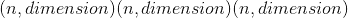。

Parameters

*   **n**  (_Int_ _，_ _可选_）–绘制点序列的长度。 默认值：1

*   **out**  ([_tensor_](tensors.html#torch.Tensor "torch.Tensor") _，_ _可选_）–输出张量

*   **dtype** (`torch.dtype`，可选）–返回的张量的所需数据类型。 默认值：`torch.float32`

* * *

```
fast_forward(n)¶
```

通过`n`步骤快速前进`SobolEngine`状态的功能。 这等效于不使用样本绘制`n`样本。

Parameters

**n**  (_Int_ )–快进的步数。

* * *

```
reset()¶
```

将`SobolEngine`重置为基本状态的功能。

## 序列化

* * *

```
torch.save(obj, f, pickle_module=<module 'pickle' from '/opt/conda/lib/python3.6/pickle.py'>, pickle_protocol=2, _use_new_zipfile_serialization=False)¶
```

将对象保存到磁盘文件。

另请参见：[推荐的模型保存方法](notes/serialization.html#recommend-saving-models)

Parameters

*   **obj** –保存的对象

*   **f** –类似于文件的对象(必须实现写入和刷新）或包含文件名的字符串

*   **pickle_module** –用于腌制元数据和对象的模块

*   **pickle_protocol** –可以指定为覆盖默认协议

Warning

如果使用的是 Python 2，则 [`torch.save()`](#torch.save "torch.save") 不支持`StringIO.StringIO`作为有效的类似文件的对象。 这是因为 write 方法应返回写入的字节数； `StringIO.write()`不这样做。

请改用`io.BytesIO`之类的东西。

例

```
>>> # Save to file
>>> x = torch.tensor([0, 1, 2, 3, 4])
>>> torch.save(x, 'tensor.pt')
>>> # Save to io.BytesIO buffer
>>> buffer = io.BytesIO()
>>> torch.save(x, buffer)

```

* * *

```
torch.load(f, map_location=None, pickle_module=<module 'pickle' from '/opt/conda/lib/python3.6/pickle.py'>, **pickle_load_args)¶
```

从文件加载用 [`torch.save()`](#torch.save "torch.save") 保存的对象。

[`torch.load()`](#torch.load "torch.load") 使用 Python 的解开工具，但会特别处理位于张量之下的存储。 它们首先在 CPU 上反序列化，然后移到保存它们的设备上。 如果失败(例如，因为运行时系统没有某些设备），则会引发异常。 但是，可以使用`map_location`参数将存储动态重新映射到一组备用设备。

如果`map_location`是可调用的，则将为每个序列化存储调用一次，并带有两个参数：storage 和 location。 storage 参数将是驻留在 CPU 上的存储的初始反序列化。 每个序列化存储都有一个与之关联的位置标签，该标签标识了从中进行保存的设备，该标签是传递给`map_location`的第二个参数。 内置位置标签是用于 CPU 张量的`'cpu'`和用于 CUDA 张量的`'cuda:device_id'`(例如`'cuda:2'`）。 `map_location`应该返回`None`或存储。 如果`map_location`返回存储，它将用作最终反序列化的对象，已经移至正确的设备。 否则， [`torch.load()`](#torch.load "torch.load") 将退回到默认行为，就像未指定`map_location`一样。

如果`map_location`是 [`torch.device`](tensor_attributes.html#torch.torch.device "torch.torch.device") 对象或与设备标签冲突的字符串，则它指示应加载所有张量的位置。

否则，如果`map_location`是字典，它将用于将文件(键）中出现的位置标签重新映射到指定将存储位置(值）放置的位置标签。

用户扩展可以使用`torch.serialization.register_package()`注册自己的位置标签以及标记和反序列化方法。

Parameters

*   **f** –类似于文件的对象(必须实现`read()`，：meth`readline`，：meth`tell`和：meth`seek`）或包含文件名的字符串

*   **map_location** –函数， [`torch.device`](tensor_attributes.html#torch.torch.device "torch.torch.device") ，字符串或指定如何重新映射存储位置的字典

*   **pickle_module** –用于解开元数据和对象的模块(必须与用于序列化文件的`pickle_module`匹配）

*   **pickle_load_args** –(仅适用于 Python 3）可选关键字参数传递给`pickle_module.load()`和`pickle_module.Unpickler()`，例如`errors=...`。

Note

当您在包含 GPU 张量的文件上调用 [`torch.load()`](#torch.load "torch.load") 时，这些张量将默认加载到 GPU。 您可以先调用`torch.load(.., map_location='cpu')`，然后再调用`load_state_dict()`，以避免在加载模型检查点时 GPU RAM 激增。

Note

默认情况下，我们将字节字符串解码为`utf-8`。 这是为了避免在 Python 3 中加载 Python 2 保存的文件时出现常见错误情况`UnicodeDecodeError: 'ascii' codec can't decode byte 0x...`。如果此默认设置不正确，则可以使用额外的`encoding`关键字参数来指定应如何加载这些对象，例如`encoding='latin1'`使用`latin1`编码将它们解码为字符串，`encoding='bytes'`将它们保留为字节数组，以后可以使用`byte_array.decode(...)`进行解码。

Example

```
>>> torch.load('tensors.pt')
# Load all tensors onto the CPU
>>> torch.load('tensors.pt', map_location=torch.device('cpu'))
# Load all tensors onto the CPU, using a function
>>> torch.load('tensors.pt', map_location=lambda storage, loc: storage)
# Load all tensors onto GPU 1
>>> torch.load('tensors.pt', map_location=lambda storage, loc: storage.cuda(1))
# Map tensors from GPU 1 to GPU 0
>>> torch.load('tensors.pt', map_location={'cuda:1':'cuda:0'})
# Load tensor from io.BytesIO object
>>> with open('tensor.pt', 'rb') as f:
        buffer = io.BytesIO(f.read())
>>> torch.load(buffer)
# Load a module with 'ascii' encoding for unpickling
>>> torch.load('module.pt', encoding='ascii')

```

## 平行性

* * *

```
torch.get_num_threads() → int¶
```

返回用于并行化 CPU 操作的线程数

* * *

```
torch.set_num_threads(int)¶
```

设置用于 CPU 上的内部运算并行的线程数。 警告：为确保使用正确的线程数，必须在运行 eager，JIT 或 autograd 代码之前调用 set_num_threads。

* * *

```
torch.get_num_interop_threads() → int¶
```

返回用于 CPU 上的互操作并行的线程数(例如，在 JIT 解释器中）

* * *

```
torch.set_num_interop_threads(int)¶
```

设置用于 CPU 上的互操作并行性(例如，在 JIT 解释器中）的线程数。 警告：只能在一次操作间并行工作开始之前(例如 JIT 执行）调用一次。

## 局部禁用梯度计算

上下文管理器`torch.no_grad()`，`torch.enable_grad()`和`torch.set_grad_enabled()`有助于局部禁用和启用梯度计算。 有关其用法的更多详细信息，请参见[局部禁用梯度计算](autograd.html#locally-disable-grad)。 这些上下文管理器是线程本地的，因此如果您使用`threading`模块等将工作发送到另一个线程，它们将无法工作。

Examples:

```
>>> x = torch.zeros(1, requires_grad=True)
>>> with torch.no_grad():
...     y = x * 2
>>> y.requires_grad
False

>>> is_train = False
>>> with torch.set_grad_enabled(is_train):
...     y = x * 2
>>> y.requires_grad
False

>>> torch.set_grad_enabled(True)  # this can also be used as a function
>>> y = x * 2
>>> y.requires_grad
True

>>> torch.set_grad_enabled(False)
>>> y = x * 2
>>> y.requires_grad
False

```

## 数学运算

### 逐点操作

* * *

```
torch.abs(input, out=None) → Tensor¶
```

计算给定`input`张量的按元素的绝对值。


Parameters

*   **input** ([_Tensor_](tensors.html#torch.Tensor "torch.Tensor")) – the input tensor.

*   **out** ([_Tensor_](tensors.html#torch.Tensor "torch.Tensor")_,_ _optional_) – the output tensor.

Example:

```
>>> torch.abs(torch.tensor([-1, -2, 3]))
tensor([ 1,  2,  3])

```

* * *

```
torch.acos(input, out=None) → Tensor¶
```

返回带有`input`元素的反余弦的新张量。

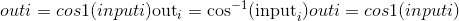

Parameters

*   **input** ([_Tensor_](tensors.html#torch.Tensor "torch.Tensor")) – the input tensor.

*   **out** ([_Tensor_](tensors.html#torch.Tensor "torch.Tensor")_,_ _optional_) – the output tensor.

Example:

```
>>> a = torch.randn(4)
>>> a
tensor([ 0.3348, -0.5889,  0.2005, -0.1584])
>>> torch.acos(a)
tensor([ 1.2294,  2.2004,  1.3690,  1.7298])

```

* * *

```
torch.add()¶
```

* * *

```
torch.add(input, other, out=None)
```

将标量`other`添加到输入`input`的每个元素中，并返回一个新的结果张量。

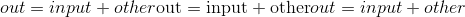

如果`input`的类型为 FloatTensor 或 DoubleTensor，则`other`必须为实数，否则应为整数。

Parameters

*   **input** ([_Tensor_](tensors.html#torch.Tensor "torch.Tensor")) – the input tensor.

*   **值**(_编号_）–要添加到`input`每个元素的编号

```
Keyword Arguments
```

**out** ([_Tensor_](tensors.html#torch.Tensor "torch.Tensor")_,_ _optional_) – the output tensor.

Example:

```
>>> a = torch.randn(4)
>>> a
tensor([ 0.0202,  1.0985,  1.3506, -0.6056])
>>> torch.add(a, 20)
tensor([ 20.0202,  21.0985,  21.3506,  19.3944])

```

* * *

```
torch.add(input, alpha=1, other, out=None)
```

张量`other`的每个元素乘以标量`alpha`，然后加到张量`input`的每个元素上。 返回结果张量。

`input`和`other`的形状必须是[可广播的](notes/broadcasting.html#broadcasting-semantics)。

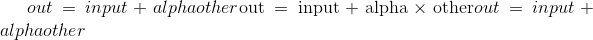

如果`other`的类型为 FloatTensor 或 DoubleTensor，则`alpha`必须为实数，否则应为整数。

Parameters

*   **输入** ([_tensor_](tensors.html#torch.Tensor "torch.Tensor"))–第一个输入张量

*   **alpha** (_数字_）– `other`的标量乘法器

*   **其他** ([_tensor_](tensors.html#torch.Tensor "torch.Tensor"))–第二个输入张量

```
Keyword Arguments
```

**out** ([_Tensor_](tensors.html#torch.Tensor "torch.Tensor")_,_ _optional_) – the output tensor.

Example:

```
>>> a = torch.randn(4)
>>> a
tensor([-0.9732, -0.3497,  0.6245,  0.4022])
>>> b = torch.randn(4, 1)
>>> b
tensor([[ 0.3743],
        [-1.7724],
        [-0.5811],
        [-0.8017]])
>>> torch.add(a, 10, b)
tensor([[  2.7695,   3.3930,   4.3672,   4.1450],
        [-18.6971, -18.0736, -17.0994, -17.3216],
        [ -6.7845,  -6.1610,  -5.1868,  -5.4090],
        [ -8.9902,  -8.3667,  -7.3925,  -7.6147]])

```

* * *

```
torch.addcdiv(input, value=1, tensor1, tensor2, out=None) → Tensor¶
```

执行`tensor1`除以`tensor2`的元素，将结果乘以标量`value`并将其加到`input`上。

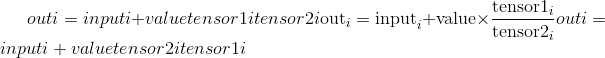

`input`，`tensor1`和`tensor2`的形状必须是[可广播](notes/broadcasting.html#broadcasting-semantics)。

对于类型为 &lt;cite&gt;FloatTensor&lt;/cite&gt; 或 &lt;cite&gt;DoubleTensor&lt;/cite&gt; 的输入，`value`必须为实数，否则为整数。

Parameters

*   **输入** ([_tensor_](tensors.html#torch.Tensor "torch.Tensor"))–要添加的张量

*   **值**(_编号_ _，_ _可选_）– 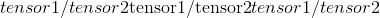的乘数

*   **张量 1**  ([_tensor_](tensors.html#torch.Tensor "torch.Tensor"))–分子张量

*   **张量 2**  ([_tensor_](tensors.html#torch.Tensor "torch.Tensor"))–分母张量

*   **out** ([_Tensor_](tensors.html#torch.Tensor "torch.Tensor")_,_ _optional_) – the output tensor.

Example:

```
>>> t = torch.randn(1, 3)
>>> t1 = torch.randn(3, 1)
>>> t2 = torch.randn(1, 3)
>>> torch.addcdiv(t, 0.1, t1, t2)
tensor([[-0.2312, -3.6496,  0.1312],
        [-1.0428,  3.4292, -0.1030],
        [-0.5369, -0.9829,  0.0430]])

```

* * *

```
torch.addcmul(input, value=1, tensor1, tensor2, out=None) → Tensor¶
```

对`tensor1`与`tensor2`进行元素逐项乘法，将结果与标量`value`相乘，然后将其与`input`相加。

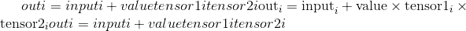

[`tensor`](#torch.tensor "torch.tensor") ，`tensor1`和`tensor2`的形状必须是[可广播的](notes/broadcasting.html#broadcasting-semantics)。

For inputs of type &lt;cite&gt;FloatTensor&lt;/cite&gt; or &lt;cite&gt;DoubleTensor&lt;/cite&gt;, `value` must be a real number, otherwise an integer.

Parameters

*   **input** ([_Tensor_](tensors.html#torch.Tensor "torch.Tensor")) – the tensor to be added

*   **值**(_编号_ _，_ _可选_）– 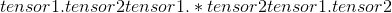的乘数

*   **张量 1**  ([_tensor_](tensors.html#torch.Tensor "torch.Tensor"))–要相乘的张量

*   **张量 2**  ([_tensor_](tensors.html#torch.Tensor "torch.Tensor"))–要相乘的张量

*   **out** ([_Tensor_](tensors.html#torch.Tensor "torch.Tensor")_,_ _optional_) – the output tensor.

Example:

```
>>> t = torch.randn(1, 3)
>>> t1 = torch.randn(3, 1)
>>> t2 = torch.randn(1, 3)
>>> torch.addcmul(t, 0.1, t1, t2)
tensor([[-0.8635, -0.6391,  1.6174],
        [-0.7617, -0.5879,  1.7388],
        [-0.8353, -0.6249,  1.6511]])

```

* * *

```
torch.angle(input, out=None) → Tensor¶
```

计算给定`input`张量的元素方向角(以弧度为单位）。


Parameters

*   **input** ([_Tensor_](tensors.html#torch.Tensor "torch.Tensor")) – the input tensor.

*   **out** ([_Tensor_](tensors.html#torch.Tensor "torch.Tensor")_,_ _optional_) – the output tensor.

Example:

```
>>> torch.angle(torch.tensor([-1 + 1j, -2 + 2j, 3 - 3j]))*180/3.14159
tensor([ 135.,  135,  -45])

```

* * *

```
torch.asin(input, out=None) → Tensor¶
```

返回带有`input`元素的反正弦值的新张量。

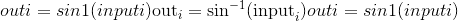

Parameters

*   **input** ([_Tensor_](tensors.html#torch.Tensor "torch.Tensor")) – the input tensor.

*   **out** ([_Tensor_](tensors.html#torch.Tensor "torch.Tensor")_,_ _optional_) – the output tensor.

Example:

```
>>> a = torch.randn(4)
>>> a
tensor([-0.5962,  1.4985, -0.4396,  1.4525])
>>> torch.asin(a)
tensor([-0.6387,     nan, -0.4552,     nan])

```

* * *

```
torch.atan(input, out=None) → Tensor¶
```

返回带有`input`元素的反正切的新张量。

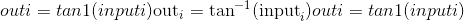

Parameters

*   **input** ([_Tensor_](tensors.html#torch.Tensor "torch.Tensor")) – the input tensor.

*   **out** ([_Tensor_](tensors.html#torch.Tensor "torch.Tensor")_,_ _optional_) – the output tensor.

Example:

```
>>> a = torch.randn(4)
>>> a
tensor([ 0.2341,  0.2539, -0.6256, -0.6448])
>>> torch.atan(a)
tensor([ 0.2299,  0.2487, -0.5591, -0.5727])

```

* * *

```
torch.atan2(input, other, out=None) → Tensor¶
```

考虑象限的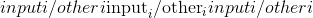元素逐级反正切。 返回一个新的张量，其矢量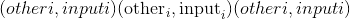与矢量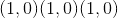之间的弧度为符号角。 (请注意，第二个参数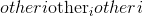是 x 坐标，而第一个参数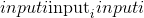是 y 坐标。）

`input`和`other`的形状必须是[可广播的](notes/broadcasting.html#broadcasting-semantics)。

Parameters

*   **input** ([_Tensor_](tensors.html#torch.Tensor "torch.Tensor")) – the first input tensor

*   **other** ([_Tensor_](tensors.html#torch.Tensor "torch.Tensor")) – the second input tensor

*   **out** ([_Tensor_](tensors.html#torch.Tensor "torch.Tensor")_,_ _optional_) – the output tensor.

Example:

```
>>> a = torch.randn(4)
>>> a
tensor([ 0.9041,  0.0196, -0.3108, -2.4423])
>>> torch.atan2(a, torch.randn(4))
tensor([ 0.9833,  0.0811, -1.9743, -1.4151])

```

* * *

```
torch.bitwise_not(input, out=None) → Tensor¶
```

计算给定输入张量的按位非。 输入张量必须是整数或布尔类型。 对于布尔张量，它计算逻辑非。

Parameters

*   **input** ([_Tensor_](tensors.html#torch.Tensor "torch.Tensor")) – the input tensor.

*   **out** ([_Tensor_](tensors.html#torch.Tensor "torch.Tensor")_,_ _optional_) – the output tensor.

Example

```
>>> torch.bitwise_not(torch.tensor([-1, -2, 3], dtype=torch.int8))
tensor([ 0,  1, -4], dtype=torch.int8)

```

* * *

```
torch.bitwise_xor(input, other, out=None) → Tensor¶
```

计算`input`和`other`的按位 XOR。 输入张量必须是整数或布尔类型。 对于布尔张量，它计算逻辑 XOR。

Parameters

*   **输入** –第一个输入张量

*   **其他** –第二个输入张量

*   **out** ([_Tensor_](tensors.html#torch.Tensor "torch.Tensor")_,_ _optional_) – the output tensor.

Example

```
>>> torch.bitwise_xor(torch.tensor([-1, -2, 3], dtype=torch.int8), torch.tensor([1, 0, 3], dtype=torch.int8))
tensor([-2, -2,  0], dtype=torch.int8)
>>> torch.bitwise_xor(torch.tensor([True, True, False]), torch.tensor([False, True, False]))
tensor([ True, False, False])

```

* * *

```
torch.ceil(input, out=None) → Tensor¶
```

返回带有`input`元素的 ceil 的新张量，该元素大于或等于每个元素的最小整数。

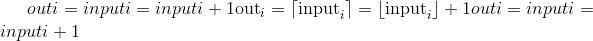

Parameters

*   **input** ([_Tensor_](tensors.html#torch.Tensor "torch.Tensor")) – the input tensor.

*   **out** ([_Tensor_](tensors.html#torch.Tensor "torch.Tensor")_,_ _optional_) – the output tensor.

Example:

```
>>> a = torch.randn(4)
>>> a
tensor([-0.6341, -1.4208, -1.0900,  0.5826])
>>> torch.ceil(a)
tensor([-0., -1., -1.,  1.])

```

* * *

```
torch.clamp(input, min, max, out=None) → Tensor¶
```

将`input`中的所有元素限制在 &lt;cite&gt;[&lt;/cite&gt; [`min`](#torch.min "torch.min") ， [`max`](#torch.max "torch.max") &lt;cite&gt;]&lt;/cite&gt; 范围内，并返回结果张量：

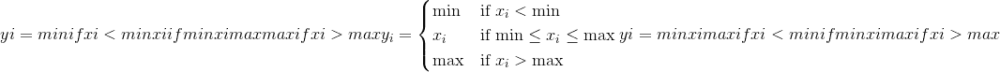

如果`input`的类型为 &lt;cite&gt;FloatTensor&lt;/cite&gt; 或 &lt;cite&gt;DoubleTensor&lt;/cite&gt; ，则参数 [`min`](#torch.min "torch.min") 和 [`max`](#torch.max "torch.max") 必须为实数，否则为实数 应该是整数。

Parameters

*   **input** ([_Tensor_](tensors.html#torch.Tensor "torch.Tensor")) – the input tensor.

*   **min** (_编号_）–要钳制的范围的下限

*   **最大**(_编号_）–要钳位的范围的上限

*   **out** ([_Tensor_](tensors.html#torch.Tensor "torch.Tensor")_,_ _optional_) – the output tensor.

Example:

```
>>> a = torch.randn(4)
>>> a
tensor([-1.7120,  0.1734, -0.0478, -0.0922])
>>> torch.clamp(a, min=-0.5, max=0.5)
tensor([-0.5000,  0.1734, -0.0478, -0.0922])

```

* * *

```
torch.clamp(input, *, min, out=None) → Tensor
```

将`input`中的所有元素限制为大于或等于 [`min`](#torch.min "torch.min") 。

如果`input`的类型为 &lt;cite&gt;FloatTensor&lt;/cite&gt; 或 &lt;cite&gt;DoubleTensor&lt;/cite&gt; ，则`value`应为实数，否则应为整数。

Parameters

*   **input** ([_Tensor_](tensors.html#torch.Tensor "torch.Tensor")) – the input tensor.

*   **值**(_编号_）–输出中每个元素的最小值

*   **out** ([_Tensor_](tensors.html#torch.Tensor "torch.Tensor")_,_ _optional_) – the output tensor.

Example:

```
>>> a = torch.randn(4)
>>> a
tensor([-0.0299, -2.3184,  2.1593, -0.8883])
>>> torch.clamp(a, min=0.5)
tensor([ 0.5000,  0.5000,  2.1593,  0.5000])

```

* * *

```
torch.clamp(input, *, max, out=None) → Tensor
```

将`input`中的所有元素限制为小于或等于 [`max`](#torch.max "torch.max") 。

If `input` is of type &lt;cite&gt;FloatTensor&lt;/cite&gt; or &lt;cite&gt;DoubleTensor&lt;/cite&gt;, `value` should be a real number, otherwise it should be an integer.

Parameters

*   **input** ([_Tensor_](tensors.html#torch.Tensor "torch.Tensor")) – the input tensor.

*   **值**(_编号_）–输出中每个元素的最大值

*   **out** ([_Tensor_](tensors.html#torch.Tensor "torch.Tensor")_,_ _optional_) – the output tensor.

Example:

```
>>> a = torch.randn(4)
>>> a
tensor([ 0.7753, -0.4702, -0.4599,  1.1899])
>>> torch.clamp(a, max=0.5)
tensor([ 0.5000, -0.4702, -0.4599,  0.5000])

```

* * *

```
torch.conj(input, out=None) → Tensor¶
```

计算给定`input`张量的逐元素共轭。

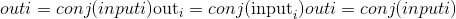

Parameters

*   **input** ([_Tensor_](tensors.html#torch.Tensor "torch.Tensor")) – the input tensor.

*   **out** ([_Tensor_](tensors.html#torch.Tensor "torch.Tensor")_,_ _optional_) – the output tensor.

Example:

```
>>> torch.conj(torch.tensor([-1 + 1j, -2 + 2j, 3 - 3j]))
tensor([-1 - 1j, -2 - 2j, 3 + 3j])

```

* * *

```
torch.cos(input, out=None) → Tensor¶
```

返回带有`input`元素的余弦的新张量。

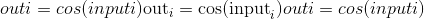

Parameters

*   **input** ([_Tensor_](tensors.html#torch.Tensor "torch.Tensor")) – the input tensor.

*   **out** ([_Tensor_](tensors.html#torch.Tensor "torch.Tensor")_,_ _optional_) – the output tensor.

Example:

```
>>> a = torch.randn(4)
>>> a
tensor([ 1.4309,  1.2706, -0.8562,  0.9796])
>>> torch.cos(a)
tensor([ 0.1395,  0.2957,  0.6553,  0.5574])

```

* * *

```
torch.cosh(input, out=None) → Tensor¶
```

返回具有`input`元素的双曲余弦的新张量。

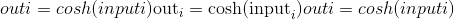

Parameters

*   **input** ([_Tensor_](tensors.html#torch.Tensor "torch.Tensor")) – the input tensor.

*   **out** ([_Tensor_](tensors.html#torch.Tensor "torch.Tensor")_,_ _optional_) – the output tensor.

Example:

```
>>> a = torch.randn(4)
>>> a
tensor([ 0.1632,  1.1835, -0.6979, -0.7325])
>>> torch.cosh(a)
tensor([ 1.0133,  1.7860,  1.2536,  1.2805])

```

* * *

```
torch.div()¶
```

* * *

```
torch.div(input, other, out=None) → Tensor
```

将输入`input`的每个元素除以标量`other`，然后返回一个新的结果张量。


如果`input`和`other`的 [`torch.dtype`](tensor_attributes.html#torch.torch.dtype "torch.torch.dtype") 不同，则根据类型提升[文档](tensor_attributes.html#type-promotion-doc)中所述的规则确定结果张量的 [`torch.dtype`](tensor_attributes.html#torch.torch.dtype "torch.torch.dtype") 。 ]。 如果指定了`out`，则结果必须是[可转换为](tensor_attributes.html#type-promotion-doc)到指定输出张量的 [`torch.dtype`](tensor_attributes.html#torch.torch.dtype "torch.torch.dtype") 。 整数除以零会导致不确定的行为。

Parameters

*   **input** ([_Tensor_](tensors.html#torch.Tensor "torch.Tensor")) – the input tensor.

*   **其他**(_编号_）–要划分为`input`每个元素的编号

```
Keyword Arguments
```

**out** ([_Tensor_](tensors.html#torch.Tensor "torch.Tensor")_,_ _optional_) – the output tensor.

Example:

```
>>> a = torch.randn(5)
>>> a
tensor([ 0.3810,  1.2774, -0.2972, -0.3719,  0.4637])
>>> torch.div(a, 0.5)
tensor([ 0.7620,  2.5548, -0.5944, -0.7439,  0.9275])

```

* * *

```
torch.div(input, other, out=None) → Tensor
```

张量`input`的每个元素除以张量`other`的每个元素。 返回结果张量。


`input`和`other`的形状必须是[可广播](notes/broadcasting.html#broadcasting-semantics)。 如果`input`和`other`的 [`torch.dtype`](tensor_attributes.html#torch.torch.dtype "torch.torch.dtype") 不同，则根据类型提升[文档](tensor_attributes.html#type-promotion-doc)中描述的规则确定结果张量的 [`torch.dtype`](tensor_attributes.html#torch.torch.dtype "torch.torch.dtype") 。 ]。 如果指定了`out`，则结果必须是[可转换为](tensor_attributes.html#type-promotion-doc)到指定输出张量的 [`torch.dtype`](tensor_attributes.html#torch.torch.dtype "torch.torch.dtype") 。 整数除以零会导致不确定的行为。

Parameters

*   **输入** ([_tensor_](tensors.html#torch.Tensor "torch.Tensor"))–分子张量

*   **其他** ([_tensor_](tensors.html#torch.Tensor "torch.Tensor"))–分母张量

```
Keyword Arguments
```

**out** ([_Tensor_](tensors.html#torch.Tensor "torch.Tensor")_,_ _optional_) – the output tensor.

Example:

```
>>> a = torch.randn(4, 4)
>>> a
tensor([[-0.3711, -1.9353, -0.4605, -0.2917],
        [ 0.1815, -1.0111,  0.9805, -1.5923],
        [ 0.1062,  1.4581,  0.7759, -1.2344],
        [-0.1830, -0.0313,  1.1908, -1.4757]])
>>> b = torch.randn(4)
>>> b
tensor([ 0.8032,  0.2930, -0.8113, -0.2308])
>>> torch.div(a, b)
tensor([[-0.4620, -6.6051,  0.5676,  1.2637],
        [ 0.2260, -3.4507, -1.2086,  6.8988],
        [ 0.1322,  4.9764, -0.9564,  5.3480],
        [-0.2278, -0.1068, -1.4678,  6.3936]])

```

* * *

```
torch.digamma(input, out=None) → Tensor¶
```

计算&lt;cite&gt;输入&lt;/cite&gt;上伽马函数的对数导数。

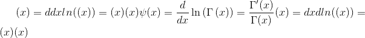

Parameters

**输入** ([_tensor_](tensors.html#torch.Tensor "torch.Tensor"))–用于计算 digamma 函数的张量

Example:

```
>>> a = torch.tensor([1, 0.5])
>>> torch.digamma(a)
tensor([-0.5772, -1.9635])

```

* * *

```
torch.erf(input, out=None) → Tensor¶
```

计算每个元素的误差函数。 错误函数定义如下：

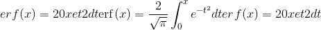

Parameters

*   **input** ([_Tensor_](tensors.html#torch.Tensor "torch.Tensor")) – the input tensor.

*   **out** ([_Tensor_](tensors.html#torch.Tensor "torch.Tensor")_,_ _optional_) – the output tensor.

Example:

```
>>> torch.erf(torch.tensor([0, -1., 10.]))
tensor([ 0.0000, -0.8427,  1.0000])

```

* * *

```
torch.erfc(input, out=None) → Tensor¶
```

计算`input`的每个元素的互补误差函数。 互补误差函数定义如下：


Parameters

*   **input** ([_Tensor_](tensors.html#torch.Tensor "torch.Tensor")) – the input tensor.

*   **out** ([_Tensor_](tensors.html#torch.Tensor "torch.Tensor")_,_ _optional_) – the output tensor.

Example:

```
>>> torch.erfc(torch.tensor([0, -1., 10.]))
tensor([ 1.0000, 1.8427,  0.0000])

```

* * *

```
torch.erfinv(input, out=None) → Tensor¶
```

计算`input`的每个元素的反误差函数。 逆误差函数在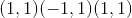范围内定义为：

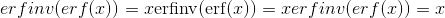

Parameters

*   **input** ([_Tensor_](tensors.html#torch.Tensor "torch.Tensor")) – the input tensor.

*   **out** ([_Tensor_](tensors.html#torch.Tensor "torch.Tensor")_,_ _optional_) – the output tensor.

Example:

```
>>> torch.erfinv(torch.tensor([0, 0.5, -1.]))
tensor([ 0.0000,  0.4769,    -inf])

```

* * *

```
torch.exp(input, out=None) → Tensor¶
```

返回具有输入张量`input`的元素指数的新张量。


Parameters

*   **input** ([_Tensor_](tensors.html#torch.Tensor "torch.Tensor")) – the input tensor.

*   **out** ([_Tensor_](tensors.html#torch.Tensor "torch.Tensor")_,_ _optional_) – the output tensor.

Example:

```
>>> torch.exp(torch.tensor([0, math.log(2.)]))
tensor([ 1.,  2.])

```

* * *

```
torch.expm1(input, out=None) → Tensor¶
```

返回一个新的张量，其元素的指数为`input`的负 1。

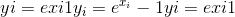

Parameters

*   **input** ([_Tensor_](tensors.html#torch.Tensor "torch.Tensor")) – the input tensor.

*   **out** ([_Tensor_](tensors.html#torch.Tensor "torch.Tensor")_,_ _optional_) – the output tensor.

Example:

```
>>> torch.expm1(torch.tensor([0, math.log(2.)]))
tensor([ 0.,  1.])

```

* * *

```
torch.floor(input, out=None) → Tensor¶
```

返回一个新的张量，该张量的元素为`input`的下限，即小于或等于每个元素的最大整数。

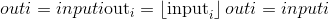

Parameters

*   **input** ([_Tensor_](tensors.html#torch.Tensor "torch.Tensor")) – the input tensor.

*   **out** ([_Tensor_](tensors.html#torch.Tensor "torch.Tensor")_,_ _optional_) – the output tensor.

Example:

```
>>> a = torch.randn(4)
>>> a
tensor([-0.8166,  1.5308, -0.2530, -0.2091])
>>> torch.floor(a)
tensor([-1.,  1., -1., -1.])

```

* * *

```
torch.fmod(input, other, out=None) → Tensor¶
```

计算除法元素的余数。

被除数和除数可以同时包含整数和浮点数。 其余部分与股息`input`具有相同的符号。

当`other`是张量时，`input`和`other`的形状必须是[可广播的](notes/broadcasting.html#broadcasting-semantics)。

Parameters

*   **输入** ([_tensor_](tensors.html#torch.Tensor "torch.Tensor"))–股息

*   **其他** ([_tensor_](tensors.html#torch.Tensor "torch.Tensor") _或_ _python：float_ )–除数，可以是数字或整数 与股息形状相同的张量

*   **out** ([_Tensor_](tensors.html#torch.Tensor "torch.Tensor")_,_ _optional_) – the output tensor.

Example:

```
>>> torch.fmod(torch.tensor([-3., -2, -1, 1, 2, 3]), 2)
tensor([-1., -0., -1.,  1.,  0.,  1.])
>>> torch.fmod(torch.tensor([1., 2, 3, 4, 5]), 1.5)
tensor([ 1.0000,  0.5000,  0.0000,  1.0000,  0.5000])

```

* * *

```
torch.frac(input, out=None) → Tensor¶
```

计算`input`中每个元素的分数部分。

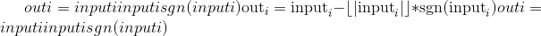

Example:

```
>>> torch.frac(torch.tensor([1, 2.5, -3.2]))
tensor([ 0.0000,  0.5000, -0.2000])

```

* * *

```
torch.imag(input, out=None) → Tensor¶
```

计算给定`input`张量的逐元素 imag 值。

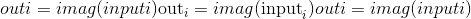

Parameters

*   **input** ([_Tensor_](tensors.html#torch.Tensor "torch.Tensor")) – the input tensor.

*   **out** ([_Tensor_](tensors.html#torch.Tensor "torch.Tensor")_,_ _optional_) – the output tensor.

Example:

```
>>> torch.imag(torch.tensor([-1 + 1j, -2 + 2j, 3 - 3j]))
tensor([ 1,  2,  -3])

```

* * *

```
torch.lerp(input, end, weight, out=None)¶
```

根据标量或张量`weight`对两个张量`start`(由`input`给出）和`end`进行线性插值，并返回所得的`out`张量。

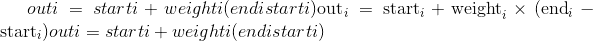

`start`和`end`的形状必须是[可广播的](notes/broadcasting.html#broadcasting-semantics)。 如果`weight`是张量，则`weight`，`start`和`end`的形状必须是[可广播的](notes/broadcasting.html#broadcasting-semantics)。

Parameters

*   **输入** ([_tensor_](tensors.html#torch.Tensor "torch.Tensor"))–具有起点的张量

*   **末端** ([_tensor_](tensors.html#torch.Tensor "torch.Tensor"))–具有终点的张量

*   **权重** (_python：float_ _或_ _tensor_）–插值公式的权重

*   **out** ([_Tensor_](tensors.html#torch.Tensor "torch.Tensor")_,_ _optional_) – the output tensor.

Example:

```
>>> start = torch.arange(1., 5.)
>>> end = torch.empty(4).fill_(10)
>>> start
tensor([ 1.,  2.,  3.,  4.])
>>> end
tensor([ 10.,  10.,  10.,  10.])
>>> torch.lerp(start, end, 0.5)
tensor([ 5.5000,  6.0000,  6.5000,  7.0000])
>>> torch.lerp(start, end, torch.full_like(start, 0.5))
tensor([ 5.5000,  6.0000,  6.5000,  7.0000])

```

* * *

```
torch.lgamma(input, out=None) → Tensor¶
```

计算`input`上伽马函数的对数。

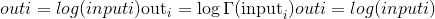

Parameters

*   **input** ([_Tensor_](tensors.html#torch.Tensor "torch.Tensor")) – the input tensor.

*   **out** ([_Tensor_](tensors.html#torch.Tensor "torch.Tensor")_,_ _optional_) – the output tensor.

Example:

```
>>> a = torch.arange(0.5, 2, 0.5)
>>> torch.lgamma(a)
tensor([ 0.5724,  0.0000, -0.1208])

```

* * *

```
torch.log(input, out=None) → Tensor¶
```

返回具有`input`元素的自然对数的新张量。


Parameters

*   **input** ([_Tensor_](tensors.html#torch.Tensor "torch.Tensor")) – the input tensor.

*   **out** ([_Tensor_](tensors.html#torch.Tensor "torch.Tensor")_,_ _optional_) – the output tensor.

Example:

```
>>> a = torch.randn(5)
>>> a
tensor([-0.7168, -0.5471, -0.8933, -1.4428, -0.1190])
>>> torch.log(a)
tensor([ nan,  nan,  nan,  nan,  nan])

```

* * *

```
torch.log10(input, out=None) → Tensor¶
```

返回以`input`元素的底数为底的对数的新张量。

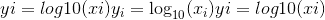

Parameters

*   **input** ([_Tensor_](tensors.html#torch.Tensor "torch.Tensor")) – the input tensor.

*   **out** ([_Tensor_](tensors.html#torch.Tensor "torch.Tensor")_,_ _optional_) – the output tensor.

Example:

```
>>> a = torch.rand(5)
>>> a
tensor([ 0.5224,  0.9354,  0.7257,  0.1301,  0.2251])

>>> torch.log10(a)
tensor([-0.2820, -0.0290, -0.1392, -0.8857, -0.6476])

```

* * *

```
torch.log1p(input, out=None) → Tensor¶
```

返回自然对数为(1 + `input`）的新张量。

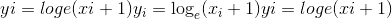

Note

对于较小的`input`值，此功能比 [`torch.log()`](#torch.log "torch.log") 更准确。

Parameters

*   **input** ([_Tensor_](tensors.html#torch.Tensor "torch.Tensor")) – the input tensor.

*   **out** ([_Tensor_](tensors.html#torch.Tensor "torch.Tensor")_,_ _optional_) – the output tensor.

Example:

```
>>> a = torch.randn(5)
>>> a
tensor([-1.0090, -0.9923,  1.0249, -0.5372,  0.2492])
>>> torch.log1p(a)
tensor([    nan, -4.8653,  0.7055, -0.7705,  0.2225])

```

* * *

```
torch.log2(input, out=None) → Tensor¶
```

返回以`input`元素的底数为对数的新张量。

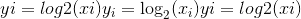

Parameters

*   **input** ([_Tensor_](tensors.html#torch.Tensor "torch.Tensor")) – the input tensor.

*   **out** ([_Tensor_](tensors.html#torch.Tensor "torch.Tensor")_,_ _optional_) – the output tensor.

Example:

```
>>> a = torch.rand(5)
>>> a
tensor([ 0.8419,  0.8003,  0.9971,  0.5287,  0.0490])

>>> torch.log2(a)
tensor([-0.2483, -0.3213, -0.0042, -0.9196, -4.3504])

```

* * *

```
torch.logical_not(input, out=None) → Tensor¶
```

计算给定输入张量的按元素逻辑非。 如果未指定，则输出张量将具有 bool dtype。 如果输入张量不是布尔张量，则将零视为`False`，将非零视为`True`。

Parameters

*   **input** ([_Tensor_](tensors.html#torch.Tensor "torch.Tensor")) – the input tensor.

*   **out** ([_Tensor_](tensors.html#torch.Tensor "torch.Tensor")_,_ _optional_) – the output tensor.

Example:

```
>>> torch.logical_not(torch.tensor([True, False]))
tensor([ False,  True])
>>> torch.logical_not(torch.tensor([0, 1, -10], dtype=torch.int8))
tensor([ True, False, False])
>>> torch.logical_not(torch.tensor([0., 1.5, -10.], dtype=torch.double))
tensor([ True, False, False])
>>> torch.logical_not(torch.tensor([0., 1., -10.], dtype=torch.double), out=torch.empty(3, dtype=torch.int16))
tensor([1, 0, 0], dtype=torch.int16)

```

* * *

```
torch.logical_xor(input, other, out=None) → Tensor¶
```

计算给定输入张量的逐元素逻辑 XOR。 零被视为`False`，非零被视为`True`。

Parameters

*   **input** ([_Tensor_](tensors.html#torch.Tensor "torch.Tensor")) – the input tensor.

*   **其他** ([_tensor_](tensors.html#torch.Tensor "torch.Tensor"))–用于计算 XOR 的张量

*   **out** ([_Tensor_](tensors.html#torch.Tensor "torch.Tensor")_,_ _optional_) – the output tensor.

Example:

```
>>> torch.logical_xor(torch.tensor([True, False, True]), torch.tensor([True, False, False]))
tensor([ False, False,  True])
>>> a = torch.tensor([0, 1, 10, 0], dtype=torch.int8)
>>> b = torch.tensor([4, 0, 1, 0], dtype=torch.int8)
>>> torch.logical_xor(a, b)
tensor([ True,  True, False, False])
>>> torch.logical_xor(a.double(), b.double())
tensor([ True,  True, False, False])
>>> torch.logical_xor(a.double(), b)
tensor([ True,  True, False, False])
>>> torch.logical_xor(a, b, out=torch.empty(4, dtype=torch.bool))
tensor([ True,  True, False, False])

```

* * *

```
torch.mul()¶
```

* * *

```
torch.mul(input, other, out=None)
```

将输入`input`的每个元素与标量`other`相乘，并返回一个新的结果张量。


如果`input`的类型为 &lt;cite&gt;FloatTensor&lt;/cite&gt; 或 &lt;cite&gt;DoubleTensor&lt;/cite&gt; ，则`other`应为实数，否则应为整数

Parameters

*   **{输入}** –

*   **值**(_数字_）–要与`input`的每个元素相乘的数字

*   **{out}** –

Example:

```
>>> a = torch.randn(3)
>>> a
tensor([ 0.2015, -0.4255,  2.6087])
>>> torch.mul(a, 100)
tensor([  20.1494,  -42.5491,  260.8663])

```

* * *

```
torch.mul(input, other, out=None)
```

张量`input`的每个元素乘以张量`other`的相应元素。 返回结果张量。

The shapes of `input` and `other` must be [broadcastable](notes/broadcasting.html#broadcasting-semantics).


Parameters

*   **输入** ([_tensor_](tensors.html#torch.Tensor "torch.Tensor"))–第一个被乘张量

*   **其他** ([_tensor_](tensors.html#torch.Tensor "torch.Tensor"))–第二个被乘张量

*   **out** ([_Tensor_](tensors.html#torch.Tensor "torch.Tensor")_,_ _optional_) – the output tensor.

Example:

```
>>> a = torch.randn(4, 1)
>>> a
tensor([[ 1.1207],
        [-0.3137],
        [ 0.0700],
        [ 0.8378]])
>>> b = torch.randn(1, 4)
>>> b
tensor([[ 0.5146,  0.1216, -0.5244,  2.2382]])
>>> torch.mul(a, b)
tensor([[ 0.5767,  0.1363, -0.5877,  2.5083],
        [-0.1614, -0.0382,  0.1645, -0.7021],
        [ 0.0360,  0.0085, -0.0367,  0.1567],
        [ 0.4312,  0.1019, -0.4394,  1.8753]])

```

* * *

```
torch.mvlgamma(input, p) → Tensor¶
```

计算元素对数为维度的多元对数伽马函数 ([[reference]](https://en.wikipedia.org/wiki/Multivariate_gamma_function))，公式为


其中和是伽玛函数。

如果任何元素小于或等于，那么将引发错误。

Parameters

*   **输入** ([_tensor_](tensors.html#torch.Tensor "torch.Tensor"))–用于计算多元对数伽马函数的张量

*   **p**  (_python：int_ )–尺寸数

Example:

```
>>> a = torch.empty(2, 3).uniform_(1, 2)
>>> a
tensor([[1.6835, 1.8474, 1.1929],
        [1.0475, 1.7162, 1.4180]])
>>> torch.mvlgamma(a, 2)
tensor([[0.3928, 0.4007, 0.7586],
        [1.0311, 0.3901, 0.5049]])

```

* * *

```
torch.neg(input, out=None) → Tensor¶
```

返回带有`input`元素负数的新张量。


Parameters

*   **input** ([_Tensor_](tensors.html#torch.Tensor "torch.Tensor")) – the input tensor.

*   **out** ([_Tensor_](tensors.html#torch.Tensor "torch.Tensor")_,_ _optional_) – the output tensor.

Example:

```
>>> a = torch.randn(5)
>>> a
tensor([ 0.0090, -0.2262, -0.0682, -0.2866,  0.3940])
>>> torch.neg(a)
tensor([-0.0090,  0.2262,  0.0682,  0.2866, -0.3940])

```

* * *

```
torch.polygamma(n, input, out=None) → Tensor¶
```

计算`input`上的 digamma 函数的导数。 被称为多伽玛函数的阶数。


Note

未实现此功能。

Parameters

*   **n**  (_python：int_ )– polygamma 函数的顺序

*   **input** ([_Tensor_](tensors.html#torch.Tensor "torch.Tensor")) – the input tensor.

*   **out** ([_Tensor_](tensors.html#torch.Tensor "torch.Tensor")_,_ _optional_) – the output tensor.

```
Example::
```

```
>>> a = torch.tensor([1, 0.5])
>>> torch.polygamma(1, a)
tensor([1.64493, 4.9348])

```

* * *

```
torch.pow()¶
```

* * *

```
torch.pow(input, exponent, out=None) → Tensor
```

用`exponent`取`input`中每个元素的幂，并返回张量与结果。

`exponent`可以是单个`float`数字，也可以是具有与`input`相同元素数的&lt;cite&gt;张量&lt;/cite&gt;。

当`exponent`为标量值时，应用的运算为：


当`exponent`是张量时，应用的运算是：


当`exponent`是张量时，`input`和`exponent`的形状必须是[可广播的](notes/broadcasting.html#broadcasting-semantics)。

Parameters

*   **input** ([_Tensor_](tensors.html#torch.Tensor "torch.Tensor")) – the input tensor.

*   **指数** (_python：float_ _或_ _tensor_）–指数值

*   **out** ([_Tensor_](tensors.html#torch.Tensor "torch.Tensor")_,_ _optional_) – the output tensor.

Example:

```
>>> a = torch.randn(4)
>>> a
tensor([ 0.4331,  1.2475,  0.6834, -0.2791])
>>> torch.pow(a, 2)
tensor([ 0.1875,  1.5561,  0.4670,  0.0779])
>>> exp = torch.arange(1., 5.)

>>> a = torch.arange(1., 5.)
>>> a
tensor([ 1.,  2.,  3.,  4.])
>>> exp
tensor([ 1.,  2.,  3.,  4.])
>>> torch.pow(a, exp)
tensor([   1.,    4.,   27.,  256.])

```

* * *

```
torch.pow(self, exponent, out=None) → Tensor
```

`self`是标量`float`值，`exponent`是张量。 返回的张量`out`与`exponent`的形状相同

应用的操作是：


Parameters

*   **自我** (_python：float_ )–幂运算的标量基值

*   **指数** ([_tensor_](tensors.html#torch.Tensor "torch.Tensor"))–指数张量

*   **out** ([_Tensor_](tensors.html#torch.Tensor "torch.Tensor")_,_ _optional_) – the output tensor.

Example:

```
>>> exp = torch.arange(1., 5.)
>>> base = 2
>>> torch.pow(base, exp)
tensor([  2.,   4.,   8.,  16.])

```

* * *

```
torch.real(input, out=None) → Tensor¶
```

计算给定`input`张量的逐元素实数值。


Parameters

*   **input** ([_Tensor_](tensors.html#torch.Tensor "torch.Tensor")) – the input tensor.

*   **out** ([_Tensor_](tensors.html#torch.Tensor "torch.Tensor")_,_ _optional_) – the output tensor.

Example:

```
>>> torch.real(torch.tensor([-1 + 1j, -2 + 2j, 3 - 3j]))
tensor([ -1,  -2,  3])

```

* * *

```
torch.reciprocal(input, out=None) → Tensor¶
```

返回带有`input`元素倒数的新张量


Parameters

*   **input** ([_Tensor_](tensors.html#torch.Tensor "torch.Tensor")) – the input tensor.

*   **out** ([_Tensor_](tensors.html#torch.Tensor "torch.Tensor")_,_ _optional_) – the output tensor.

Example:

```
>>> a = torch.randn(4)
>>> a
tensor([-0.4595, -2.1219, -1.4314,  0.7298])
>>> torch.reciprocal(a)
tensor([-2.1763, -0.4713, -0.6986,  1.3702])

```

* * *

```
torch.remainder(input, other, out=None) → Tensor¶
```

Computes the element-wise remainder of division.

除数和除数可以同时包含整数和浮点数。 其余部分与除数的符号相同。

When `other` is a tensor, the shapes of `input` and `other` must be [broadcastable](notes/broadcasting.html#broadcasting-semantics).

Parameters

*   **input** ([_Tensor_](tensors.html#torch.Tensor "torch.Tensor")) – the dividend

*   **其他** ([_tensor_](tensors.html#torch.Tensor "torch.Tensor") _或_ _python：float_ )–除数可以是数字或张量 与股息形状相同

*   **out** ([_Tensor_](tensors.html#torch.Tensor "torch.Tensor")_,_ _optional_) – the output tensor.

Example:

```
>>> torch.remainder(torch.tensor([-3., -2, -1, 1, 2, 3]), 2)
tensor([ 1.,  0.,  1.,  1.,  0.,  1.])
>>> torch.remainder(torch.tensor([1., 2, 3, 4, 5]), 1.5)
tensor([ 1.0000,  0.5000,  0.0000,  1.0000,  0.5000])

```

也可以看看

[`torch.fmod()`](#torch.fmod "torch.fmod") ，它等效于 C 库函数`fmod()`来计算元素的除法余数。

* * *

```
torch.round(input, out=None) → Tensor¶
```

返回一个新的张量，其中`input`的每个元素都舍入到最接近的整数。

Parameters

*   **input** ([_Tensor_](tensors.html#torch.Tensor "torch.Tensor")) – the input tensor.

*   **out** ([_Tensor_](tensors.html#torch.Tensor "torch.Tensor")_,_ _optional_) – the output tensor.

Example:

```
>>> a = torch.randn(4)
>>> a
tensor([ 0.9920,  0.6077,  0.9734, -1.0362])
>>> torch.round(a)
tensor([ 1.,  1.,  1., -1.])

```

* * *

```
torch.rsqrt(input, out=None) → Tensor¶
```

返回带有`input`的每个元素的平方根的倒数的新张量。


Parameters

*   **input** ([_Tensor_](tensors.html#torch.Tensor "torch.Tensor")) – the input tensor.

*   **out** ([_Tensor_](tensors.html#torch.Tensor "torch.Tensor")_,_ _optional_) – the output tensor.

Example:

```
>>> a = torch.randn(4)
>>> a
tensor([-0.0370,  0.2970,  1.5420, -0.9105])
>>> torch.rsqrt(a)
tensor([    nan,  1.8351,  0.8053,     nan])

```

* * *

```
torch.sigmoid(input, out=None) → Tensor¶
```

返回具有`input`元素的 S 形的新张量。


Parameters

*   **input** ([_Tensor_](tensors.html#torch.Tensor "torch.Tensor")) – the input tensor.

*   **out** ([_Tensor_](tensors.html#torch.Tensor "torch.Tensor")_,_ _optional_) – the output tensor.

Example:

```
>>> a = torch.randn(4)
>>> a
tensor([ 0.9213,  1.0887, -0.8858, -1.7683])
>>> torch.sigmoid(a)
tensor([ 0.7153,  0.7481,  0.2920,  0.1458])

```

* * *

```
torch.sign(input, out=None) → Tensor¶
```

返回带有`input`元素符号的新张量。


Parameters

*   **input** ([_Tensor_](tensors.html#torch.Tensor "torch.Tensor")) – the input tensor.

*   **out** ([_Tensor_](tensors.html#torch.Tensor "torch.Tensor")_,_ _optional_) – the output tensor.

Example:

```
>>> a = torch.tensor([0.7, -1.2, 0., 2.3])
>>> a
tensor([ 0.7000, -1.2000,  0.0000,  2.3000])
>>> torch.sign(a)
tensor([ 1., -1.,  0.,  1.])

```

* * *

```
torch.sin(input, out=None) → Tensor¶
```

返回带有`input`元素正弦值的新张量。


Parameters

*   **input** ([_Tensor_](tensors.html#torch.Tensor "torch.Tensor")) – the input tensor.

*   **out** ([_Tensor_](tensors.html#torch.Tensor "torch.Tensor")_,_ _optional_) – the output tensor.

Example:

```
>>> a = torch.randn(4)
>>> a
tensor([-0.5461,  0.1347, -2.7266, -0.2746])
>>> torch.sin(a)
tensor([-0.5194,  0.1343, -0.4032, -0.2711])

```

* * *

```
torch.sinh(input, out=None) → Tensor¶
```

返回具有`input`元素的双曲正弦值的新张量。


Parameters

*   **input** ([_Tensor_](tensors.html#torch.Tensor "torch.Tensor")) – the input tensor.

*   **out** ([_Tensor_](tensors.html#torch.Tensor "torch.Tensor")_,_ _optional_) – the output tensor.

Example:

```
>>> a = torch.randn(4)
>>> a
tensor([ 0.5380, -0.8632, -0.1265,  0.9399])
>>> torch.sinh(a)
tensor([ 0.5644, -0.9744, -0.1268,  1.0845])

```

* * *

```
torch.sqrt(input, out=None) → Tensor¶
```

返回具有`input`元素平方根的新张量。


Parameters

*   **input** ([_Tensor_](tensors.html#torch.Tensor "torch.Tensor")) – the input tensor.

*   **out** ([_Tensor_](tensors.html#torch.Tensor "torch.Tensor")_,_ _optional_) – the output tensor.

Example:

```
>>> a = torch.randn(4)
>>> a
tensor([-2.0755,  1.0226,  0.0831,  0.4806])
>>> torch.sqrt(a)
tensor([    nan,  1.0112,  0.2883,  0.6933])

```

* * *

```
torch.tan(input, out=None) → Tensor¶
```

返回带有`input`元素的切线的新张量。


Parameters

*   **input** ([_Tensor_](tensors.html#torch.Tensor "torch.Tensor")) – the input tensor.

*   **out** ([_Tensor_](tensors.html#torch.Tensor "torch.Tensor")_,_ _optional_) – the output tensor.

Example:

```
>>> a = torch.randn(4)
>>> a
tensor([-1.2027, -1.7687,  0.4412, -1.3856])
>>> torch.tan(a)
tensor([-2.5930,  4.9859,  0.4722, -5.3366])

```

* * *

```
torch.tanh(input, out=None) → Tensor¶
```

返回具有`input`元素的双曲正切值的新张量。


Parameters

*   **input** ([_Tensor_](tensors.html#torch.Tensor "torch.Tensor")) – the input tensor.

*   **out** ([_Tensor_](tensors.html#torch.Tensor "torch.Tensor")_,_ _optional_) – the output tensor.

Example:

```
>>> a = torch.randn(4)
>>> a
tensor([ 0.8986, -0.7279,  1.1745,  0.2611])
>>> torch.tanh(a)
tensor([ 0.7156, -0.6218,  0.8257,  0.2553])

```

* * *

```
torch.trunc(input, out=None) → Tensor¶
```

返回一个新的张量，该张量具有`input`元素的截断的整数值。

Parameters

*   **input** ([_Tensor_](tensors.html#torch.Tensor "torch.Tensor")) – the input tensor.

*   **out** ([_Tensor_](tensors.html#torch.Tensor "torch.Tensor")_,_ _optional_) – the output tensor.

Example:

```
>>> a = torch.randn(4)
>>> a
tensor([ 3.4742,  0.5466, -0.8008, -0.9079])
>>> torch.trunc(a)
tensor([ 3.,  0., -0., -0.])

```

### 减少操作

* * *

```
torch.argmax()¶
```

* * *

```
torch.argmax(input) → LongTensor
```

返回`input`张量中所有元素的最大值的索引。

这是 [`torch.max()`](#torch.max "torch.max") 返回的第二个值。 有关此方法的确切语义，请参见其文档。

Parameters

**input** ([_Tensor_](tensors.html#torch.Tensor "torch.Tensor")) – the input tensor.

Example:

```
>>> a = torch.randn(4, 4)
>>> a
tensor([[ 1.3398,  0.2663, -0.2686,  0.2450],
        [-0.7401, -0.8805, -0.3402, -1.1936],
        [ 0.4907, -1.3948, -1.0691, -0.3132],
        [-1.6092,  0.5419, -0.2993,  0.3195]])
>>> torch.argmax(a)
tensor(0)

```

* * *

```
torch.argmax(input, dim, keepdim=False) → LongTensor
```

返回一个维度上张量最大值的索引。

This is the second value returned by [`torch.max()`](#torch.max "torch.max"). See its documentation for the exact semantics of this method.

Parameters

*   **input** ([_Tensor_](tensors.html#torch.Tensor "torch.Tensor")) – the input tensor.

*   **暗淡的** (_python：int_ )–缩小的尺寸。 如果`None`，则返回扁平化输入的 argmax。

*   **keepdim**  (_bool_ )–输出张量是否保留`dim`。 忽略`dim=None`。

Example:

```
>>> a = torch.randn(4, 4)
>>> a
tensor([[ 1.3398,  0.2663, -0.2686,  0.2450],
        [-0.7401, -0.8805, -0.3402, -1.1936],
        [ 0.4907, -1.3948, -1.0691, -0.3132],
        [-1.6092,  0.5419, -0.2993,  0.3195]])
>>> torch.argmax(a, dim=1)
tensor([ 0,  2,  0,  1])

```

* * *

```
torch.argmin()¶
```

* * *

```
torch.argmin(input) → LongTensor
```

返回`input`张量中所有元素的最小值的索引。

这是 [`torch.min()`](#torch.min "torch.min") 返回的第二个值。 有关此方法的确切语义，请参见其文档。

Parameters

**input** ([_Tensor_](tensors.html#torch.Tensor "torch.Tensor")) – the input tensor.

Example:

```
>>> a = torch.randn(4, 4)
>>> a
tensor([[ 0.1139,  0.2254, -0.1381,  0.3687],
        [ 1.0100, -1.1975, -0.0102, -0.4732],
        [-0.9240,  0.1207, -0.7506, -1.0213],
        [ 1.7809, -1.2960,  0.9384,  0.1438]])
>>> torch.argmin(a)
tensor(13)

```

* * *

```
torch.argmin(input, dim, keepdim=False, out=None) → LongTensor
```

返回整个维度上张量的最小值的索引。

This is the second value returned by [`torch.min()`](#torch.min "torch.min"). See its documentation for the exact semantics of this method.

Parameters

*   **input** ([_Tensor_](tensors.html#torch.Tensor "torch.Tensor")) – the input tensor.

*   **暗淡的** (_python：int_ )–缩小的尺寸。 如果`None`，则返回扁平化输入的 argmin。

*   **keepdim** (_bool_) – whether the output tensor has `dim` retained or not. Ignored if `dim=None`.

Example:

```
>>> a = torch.randn(4, 4)
>>> a
tensor([[ 0.1139,  0.2254, -0.1381,  0.3687],
        [ 1.0100, -1.1975, -0.0102, -0.4732],
        [-0.9240,  0.1207, -0.7506, -1.0213],
        [ 1.7809, -1.2960,  0.9384,  0.1438]])
>>> torch.argmin(a, dim=1)
tensor([ 2,  1,  3,  1])

```

* * *

```
torch.dist(input, other, p=2) → Tensor¶
```

返回(`input`-`other`）的 p 范数

The shapes of `input` and `other` must be [broadcastable](notes/broadcasting.html#broadcasting-semantics).

Parameters

*   **input** ([_Tensor_](tensors.html#torch.Tensor "torch.Tensor")) – the input tensor.

*   **其他** ([_tensor_](tensors.html#torch.Tensor "torch.Tensor"))–右侧输入张量

*   **p**  (_python：float_ _，_ _可选_）–要计算的范数

Example:

```
>>> x = torch.randn(4)
>>> x
tensor([-1.5393, -0.8675,  0.5916,  1.6321])
>>> y = torch.randn(4)
>>> y
tensor([ 0.0967, -1.0511,  0.6295,  0.8360])
>>> torch.dist(x, y, 3.5)
tensor(1.6727)
>>> torch.dist(x, y, 3)
tensor(1.6973)
>>> torch.dist(x, y, 0)
tensor(inf)
>>> torch.dist(x, y, 1)
tensor(2.6537)

```

* * *

```
torch.logsumexp(input, dim, keepdim=False, out=None)¶
```

返回给定维度`dim`中`input`张量的每一行的总指数对数。 该计算在数值上是稳定的。

对于由&lt;cite&gt;昏暗&lt;/cite&gt;给出的总和指数和其他指数，结果为

> 

如果`keepdim`为`True`，则输出张量的大小与`input`相同，但尺寸为`dim`的大小为 1。否则，压缩`dim`(请参见 [`torch.squeeze()`](#torch.squeeze "torch.squeeze"))，导致输出张量的尺寸减少 1(或`len(dim)`）。

Parameters

*   **input** ([_Tensor_](tensors.html#torch.Tensor "torch.Tensor")) – the input tensor.

*   **暗淡的** (_python：int_ _或_ _python：ints_ 的元组）–要减小的尺寸。

*   **keepdim**  (_bool_ )–输出张量是否保留`dim`。

*   **out** ([_Tensor_](tensors.html#torch.Tensor "torch.Tensor")_,_ _optional_) – the output tensor.

```
Example::
```

```
>>> a = torch.randn(3, 3)
>>> torch.logsumexp(a, 1)
tensor([ 0.8442,  1.4322,  0.8711])

```

* * *

```
torch.mean()¶
```

* * *

```
torch.mean(input) → Tensor
```

返回`input`张量中所有元素的平均值。

Parameters

**input** ([_Tensor_](tensors.html#torch.Tensor "torch.Tensor")) – the input tensor.

Example:

```
>>> a = torch.randn(1, 3)
>>> a
tensor([[ 0.2294, -0.5481,  1.3288]])
>>> torch.mean(a)
tensor(0.3367)

```

* * *

```
torch.mean(input, dim, keepdim=False, out=None) → Tensor
```

返回给定维度`dim`中`input`张量的每一行的平均值。 如果`dim`是尺寸列表，请缩小所有尺寸。

If `keepdim` is `True`, the output tensor is of the same size as `input` except in the dimension(s) `dim` where it is of size 1. Otherwise, `dim` is squeezed (see [`torch.squeeze()`](#torch.squeeze "torch.squeeze")), resulting in the output tensor having 1 (or `len(dim)`) fewer dimension(s).

Parameters

*   **input** ([_Tensor_](tensors.html#torch.Tensor "torch.Tensor")) – the input tensor.

*   **dim** (_python:int_ _or_ _tuple of python:ints_) – the dimension or dimensions to reduce.

*   **keepdim** (_bool_) – whether the output tensor has `dim` retained or not.

*   **out** ([_Tensor_](tensors.html#torch.Tensor "torch.Tensor")_,_ _optional_) – the output tensor.

Example:

```
>>> a = torch.randn(4, 4)
>>> a
tensor([[-0.3841,  0.6320,  0.4254, -0.7384],
        [-0.9644,  1.0131, -0.6549, -1.4279],
        [-0.2951, -1.3350, -0.7694,  0.5600],
        [ 1.0842, -0.9580,  0.3623,  0.2343]])
>>> torch.mean(a, 1)
tensor([-0.0163, -0.5085, -0.4599,  0.1807])
>>> torch.mean(a, 1, True)
tensor([[-0.0163],
        [-0.5085],
        [-0.4599],
        [ 0.1807]])

```

* * *

```
torch.median()¶
```

* * *

```
torch.median(input) → Tensor
```

返回`input`张量中所有元素的中值。

Parameters

**input** ([_Tensor_](tensors.html#torch.Tensor "torch.Tensor")) – the input tensor.

Example:

```
>>> a = torch.randn(1, 3)
>>> a
tensor([[ 1.5219, -1.5212,  0.2202]])
>>> torch.median(a)
tensor(0.2202)

```

* * *

```
torch.median(input, dim=-1, keepdim=False, values=None, indices=None) -> (Tensor, LongTensor)
```

返回一个命名元组`(values, indices)`，其中`values`是在给定维度`dim`中`input`张量的每一行的中值。 `indices`是找到的每个中值的索引位置。

默认情况下，`dim`是`input`张量的最后一个尺寸。

如果`keepdim`为`True`，则输出张量的大小与`input`相同，只是尺寸为 1 的尺寸为`dim`。否则，将压缩`dim`(请参见 [`torch.squeeze()`](#torch.squeeze "torch.squeeze"))，导致输出张量的尺寸比`input`小 1。

Parameters

*   **input** ([_Tensor_](tensors.html#torch.Tensor "torch.Tensor")) – the input tensor.

*   **暗淡的** (_python：int_ )–缩小的尺寸。

*   **keepdim** (_bool_) – whether the output tensor has `dim` retained or not.

*   **值** ([_tensor_](tensors.html#torch.Tensor "torch.Tensor") _，_ _可选_）–输出张量

*   **索引** ([_tensor_](tensors.html#torch.Tensor "torch.Tensor") _，_ _可选_）–输出索引张量

Example:

```
>>> a = torch.randn(4, 5)
>>> a
tensor([[ 0.2505, -0.3982, -0.9948,  0.3518, -1.3131],
        [ 0.3180, -0.6993,  1.0436,  0.0438,  0.2270],
        [-0.2751,  0.7303,  0.2192,  0.3321,  0.2488],
        [ 1.0778, -1.9510,  0.7048,  0.4742, -0.7125]])
>>> torch.median(a, 1)
torch.return_types.median(values=tensor([-0.3982,  0.2270,  0.2488,  0.4742]), indices=tensor([1, 4, 4, 3]))

```

* * *

```
torch.mode(input, dim=-1, keepdim=False, values=None, indices=None) -> (Tensor, LongTensor)¶
```

返回一个命名元组`(values, indices)`，其中`values`是给定维度`dim`中`input`张量的每一行的众数值，即该行中最常出现的值，而`indices`是索引位置 找到的每个模式值。

By default, `dim` is the last dimension of the `input` tensor.

如果`keepdim`为`True`，则输出张量的大小与`input`相同，只是尺寸为 1 的尺寸为`dim`。否则，将压缩`dim`(请参见 [`torch.squeeze()`](#torch.squeeze "torch.squeeze"))，导致输出张量的尺寸比`input`小 1。

Note

尚未为`torch.cuda.Tensor`定义此功能。

Parameters

*   **input** ([_Tensor_](tensors.html#torch.Tensor "torch.Tensor")) – the input tensor.

*   **dim** (_python:int_) – the dimension to reduce.

*   **keepdim** (_bool_) – whether the output tensor has `dim` retained or not.

*   **values** ([_Tensor_](tensors.html#torch.Tensor "torch.Tensor")_,_ _optional_) – the output tensor

*   **indices** ([_Tensor_](tensors.html#torch.Tensor "torch.Tensor")_,_ _optional_) – the output index tensor

Example:

```
>>> a = torch.randint(10, (5,))
>>> a
tensor([6, 5, 1, 0, 2])
>>> b = a + (torch.randn(50, 1) * 5).long()
>>> torch.mode(b, 0)
torch.return_types.mode(values=tensor([6, 5, 1, 0, 2]), indices=tensor([2, 2, 2, 2, 2]))

```

* * *

```
torch.norm(input, p='fro', dim=None, keepdim=False, out=None, dtype=None)¶
```

返回给定张量的矩阵范数或向量范数。

Parameters

*   **输入** ([_tensor_](tensors.html#torch.Tensor "torch.Tensor"))–输入张量

*   **p**  (_python：int_ _，_ _python：float_ _，_ _inf_ _，_ _-inf_ _，_ _'来回_ _，_ _'nuc'_ _，_ _可选_）–

    规范的顺序。 默认值：`'fro'`可以计算以下规范：

    | 

    奥德

     | 

    矩阵范数

     | 

    向量范数

     |
    | --- | --- | --- |
    | 没有 | Frobenius 范数 | 2 范数 |
    | 来回 | Frobenius norm | – |
    | ‘nuc’ | 核规范 | – |
    | 其他 | 当 dim 为 None 时作为 vec 规范 | sum(abs(x）** ord）**(1./ord） |

*   **暗淡的** (_python：int_ _，_ _2 个元组的 python：ints_ _，_ _2 个列表 python：ints_ _，_ _可选_）–如果为 int，则将计算向量范数，如果为 int 的 2 元组，则将计算矩阵范数。 如果值为 None，则在输入张量只有二维时将计算矩阵范数，而在输入张量只有一维时将计算向量范数。 如果输入张量具有两个以上的维，则矢量范数将应用于最后一个维。

*   **keepdim**  (_bool_ _，_ _可选_）–输出张量是否保留`dim`。 如果`dim` = `None`和`out` = `None`则忽略。 默认值：`False`

*   **输出** ([_tensor_](tensors.html#torch.Tensor "torch.Tensor") _，_ _可选_）–输出张量。 如果`dim` = `None`和`out` = `None`则忽略。

*   **dtype**  ([`torch.dtype`](tensor_attributes.html#torch.torch.dtype "torch.torch.dtype") ，可选）–返回张量的所需数据类型。 如果已指定，则在执行操作时将输入张量强制转换为：attr：“ dtype”。 默认值：无。

Example:

```
>>> import torch
>>> a = torch.arange(9, dtype= torch.float) - 4
>>> b = a.reshape((3, 3))
>>> torch.norm(a)
tensor(7.7460)
>>> torch.norm(b)
tensor(7.7460)
>>> torch.norm(a, float('inf'))
tensor(4.)
>>> torch.norm(b, float('inf'))
tensor(4.)
>>> c = torch.tensor([[ 1, 2, 3],[-1, 1, 4]] , dtype= torch.float)
>>> torch.norm(c, dim=0)
tensor([1.4142, 2.2361, 5.0000])
>>> torch.norm(c, dim=1)
tensor([3.7417, 4.2426])
>>> torch.norm(c, p=1, dim=1)
tensor([6., 6.])
>>> d = torch.arange(8, dtype= torch.float).reshape(2,2,2)
>>> torch.norm(d, dim=(1,2))
tensor([ 3.7417, 11.2250])
>>> torch.norm(d[0, :, :]), torch.norm(d[1, :, :])
(tensor(3.7417), tensor(11.2250))

```

* * *

```
torch.prod()¶
```

* * *

```
torch.prod(input, dtype=None) → Tensor
```

返回`input`张量中所有元素的乘积。

Parameters

*   **input** ([_Tensor_](tensors.html#torch.Tensor "torch.Tensor")) – the input tensor.

*   **dtype**  ([`torch.dtype`](tensor_attributes.html#torch.torch.dtype "torch.torch.dtype") ，可选）–返回张量的所需数据类型。 如果指定，则在执行操作之前将输入张量转换为`dtype`。 这对于防止数据类型溢出很有用。 默认值：无。

Example:

```
>>> a = torch.randn(1, 3)
>>> a
tensor([[-0.8020,  0.5428, -1.5854]])
>>> torch.prod(a)
tensor(0.6902)

```

* * *

```
torch.prod(input, dim, keepdim=False, dtype=None) → Tensor
```

返回给定维度`dim`中`input`张量的每一行的乘积。

如果`keepdim`为`True`，则输出张量的大小与`input`相同，但尺寸为`dim`的大小为 1。否则，将压缩`dim`(请参见 [`torch.squeeze()`](#torch.squeeze "torch.squeeze"))，导致输出张量的尺寸比`input`小 1。

Parameters

*   **input** ([_Tensor_](tensors.html#torch.Tensor "torch.Tensor")) – the input tensor.

*   **dim** (_python:int_) – the dimension to reduce.

*   **keepdim** (_bool_) – whether the output tensor has `dim` retained or not.

*   **dtype** ([`torch.dtype`](tensor_attributes.html#torch.torch.dtype "torch.torch.dtype"), optional) – the desired data type of returned tensor. If specified, the input tensor is casted to `dtype` before the operation is performed. This is useful for preventing data type overflows. Default: None.

Example:

```
>>> a = torch.randn(4, 2)
>>> a
tensor([[ 0.5261, -0.3837],
        [ 1.1857, -0.2498],
        [-1.1646,  0.0705],
        [ 1.1131, -1.0629]])
>>> torch.prod(a, 1)
tensor([-0.2018, -0.2962, -0.0821, -1.1831])

```

* * *

```
torch.std()¶
```

* * *

```
torch.std(input, unbiased=True) → Tensor
```

返回`input`张量中所有元素的标准偏差。

如果`unbiased`为`False`，则将通过有偏估计量计算标准偏差。 否则，将使用贝塞尔的更正。

Parameters

*   **input** ([_Tensor_](tensors.html#torch.Tensor "torch.Tensor")) – the input tensor.

*   **无偏** (_bool_ )–是否使用无偏估计

Example:

```
>>> a = torch.randn(1, 3)
>>> a
tensor([[-0.8166, -1.3802, -0.3560]])
>>> torch.std(a)
tensor(0.5130)

```

* * *

```
torch.std(input, dim, keepdim=False, unbiased=True, out=None) → Tensor
```

返回`input`张量的每一行在标准`dim`中的标准偏差。 如果`dim`是尺寸列表，请缩小所有尺寸。

If `keepdim` is `True`, the output tensor is of the same size as `input` except in the dimension(s) `dim` where it is of size 1. Otherwise, `dim` is squeezed (see [`torch.squeeze()`](#torch.squeeze "torch.squeeze")), resulting in the output tensor having 1 (or `len(dim)`) fewer dimension(s).

If `unbiased` is `False`, then the standard-deviation will be calculated via the biased estimator. Otherwise, Bessel’s correction will be used.

Parameters

*   **input** ([_Tensor_](tensors.html#torch.Tensor "torch.Tensor")) – the input tensor.

*   **dim** (_python:int_ _or_ _tuple of python:ints_) – the dimension or dimensions to reduce.

*   **keepdim** (_bool_) – whether the output tensor has `dim` retained or not.

*   **unbiased** (_bool_) – whether to use the unbiased estimation or not

*   **out** ([_Tensor_](tensors.html#torch.Tensor "torch.Tensor")_,_ _optional_) – the output tensor.

Example:

```
>>> a = torch.randn(4, 4)
>>> a
tensor([[ 0.2035,  1.2959,  1.8101, -0.4644],
        [ 1.5027, -0.3270,  0.5905,  0.6538],
        [-1.5745,  1.3330, -0.5596, -0.6548],
        [ 0.1264, -0.5080,  1.6420,  0.1992]])
>>> torch.std(a, dim=1)
tensor([ 1.0311,  0.7477,  1.2204,  0.9087])

```

* * *

```
torch.std_mean()¶
```

* * *

```
torch.std_mean(input, unbiased=True) -> (Tensor, Tensor)
```

返回`input`张量中所有元素的标准差和均值。

If `unbiased` is `False`, then the standard-deviation will be calculated via the biased estimator. Otherwise, Bessel’s correction will be used.

Parameters

*   **input** ([_Tensor_](tensors.html#torch.Tensor "torch.Tensor")) – the input tensor.

*   **unbiased** (_bool_) – whether to use the unbiased estimation or not

Example:

```
>>> a = torch.randn(1, 3)
>>> a
tensor([[0.3364, 0.3591, 0.9462]])
>>> torch.std_mean(a)
(tensor(0.3457), tensor(0.5472))

```

* * *

```
torch.std(input, dim, keepdim=False, unbiased=True) -> (Tensor, Tensor)
```

返回`dim`张量中`input`张量的每一行的标准偏差和均值。 如果`dim`是尺寸列表，请缩小所有尺寸。

If `keepdim` is `True`, the output tensor is of the same size as `input` except in the dimension(s) `dim` where it is of size 1. Otherwise, `dim` is squeezed (see [`torch.squeeze()`](#torch.squeeze "torch.squeeze")), resulting in the output tensor having 1 (or `len(dim)`) fewer dimension(s).

If `unbiased` is `False`, then the standard-deviation will be calculated via the biased estimator. Otherwise, Bessel’s correction will be used.

Parameters

*   **input** ([_Tensor_](tensors.html#torch.Tensor "torch.Tensor")) – the input tensor.

*   **dim** (_python:int_ _or_ _tuple of python:ints_) – the dimension or dimensions to reduce.

*   **keepdim** (_bool_) – whether the output tensor has `dim` retained or not.

*   **unbiased** (_bool_) – whether to use the unbiased estimation or not

Example:

```
>>> a = torch.randn(4, 4)
>>> a
tensor([[ 0.5648, -0.5984, -1.2676, -1.4471],
        [ 0.9267,  1.0612,  1.1050, -0.6014],
        [ 0.0154,  1.9301,  0.0125, -1.0904],
        [-1.9711, -0.7748, -1.3840,  0.5067]])
>>> torch.std_mean(a, 1)
(tensor([0.9110, 0.8197, 1.2552, 1.0608]), tensor([-0.6871,  0.6229,  0.2169, -0.9058]))

```

* * *

```
torch.sum()¶
```

* * *

```
torch.sum(input, dtype=None) → Tensor
```

返回`input`张量中所有元素的总和。

Parameters

*   **input** ([_Tensor_](tensors.html#torch.Tensor "torch.Tensor")) – the input tensor.

*   **dtype** ([`torch.dtype`](tensor_attributes.html#torch.torch.dtype "torch.torch.dtype"), optional) – the desired data type of returned tensor. If specified, the input tensor is casted to `dtype` before the operation is performed. This is useful for preventing data type overflows. Default: None.

Example:

```
>>> a = torch.randn(1, 3)
>>> a
tensor([[ 0.1133, -0.9567,  0.2958]])
>>> torch.sum(a)
tensor(-0.5475)

```

* * *

```
torch.sum(input, dim, keepdim=False, dtype=None) → Tensor
```

返回给定维度`dim`中`input`张量的每一行的总和。 如果`dim`是尺寸列表，请缩小所有尺寸。

If `keepdim` is `True`, the output tensor is of the same size as `input` except in the dimension(s) `dim` where it is of size 1. Otherwise, `dim` is squeezed (see [`torch.squeeze()`](#torch.squeeze "torch.squeeze")), resulting in the output tensor having 1 (or `len(dim)`) fewer dimension(s).

Parameters

*   **input** ([_Tensor_](tensors.html#torch.Tensor "torch.Tensor")) – the input tensor.

*   **dim** (_python:int_ _or_ _tuple of python:ints_) – the dimension or dimensions to reduce.

*   **keepdim** (_bool_) – whether the output tensor has `dim` retained or not.

*   **dtype** ([`torch.dtype`](tensor_attributes.html#torch.torch.dtype "torch.torch.dtype"), optional) – the desired data type of returned tensor. If specified, the input tensor is casted to `dtype` before the operation is performed. This is useful for preventing data type overflows. Default: None.

Example:

```
>>> a = torch.randn(4, 4)
>>> a
tensor([[ 0.0569, -0.2475,  0.0737, -0.3429],
        [-0.2993,  0.9138,  0.9337, -1.6864],
        [ 0.1132,  0.7892, -0.1003,  0.5688],
        [ 0.3637, -0.9906, -0.4752, -1.5197]])
>>> torch.sum(a, 1)
tensor([-0.4598, -0.1381,  1.3708, -2.6217])
>>> b = torch.arange(4 * 5 * 6).view(4, 5, 6)
>>> torch.sum(b, (2, 1))
tensor([  435.,  1335.,  2235.,  3135.])

```

* * *

```
torch.unique(input, sorted=True, return_inverse=False, return_counts=False, dim=None)¶
```

返回输入张量的唯一元素。

Note

此功能与 [`torch.unique_consecutive()`](#torch.unique_consecutive "torch.unique_consecutive") 不同，因为该功能还消除了非连续的重复值。

Note

当前，在 CUDA 实现和 CPU 实现中，当指定 dim 时，无论 &lt;cite&gt;sort&lt;/cite&gt; 参数如何， &lt;cite&gt;torch.unique&lt;/cite&gt; 始终在开始时对张量进行排序。 排序可能会很慢，因此如果您的输入张量已被排序，建议使用 [`torch.unique_consecutive()`](#torch.unique_consecutive "torch.unique_consecutive") 以避免排序。

Parameters

*   **input** ([_Tensor_](tensors.html#torch.Tensor "torch.Tensor")) – the input tensor

*   **排序的** (_bool_ )–在返回为输出之前是否按升序对唯一元素进行排序。

*   **return_inverse**  (_bool_ )–是否还返回原始输入中元素在返回的唯一列表中所处位置的索引。

*   **return_counts**  (_bool_ )–是否还返回每个唯一元素的计数。

*   **暗淡的** (_python：int_ )–应用唯一尺寸。 如果`None`，则返回拼合输入的唯一性。 默认值：`None`

Returns

一个张量或张量的元组包含

> *   **输出**(_tensor_）：唯一标量元素的输出列表。
>     
>     
> *   **inverse_indices** (_tensor_）：(可选）如果`return_inverse`为 True，将有一个额外的返回张量(形状与输入相同）表示原始输入中元素所在位置的索引 映射到输出中； 否则，此函数将仅返回单个张量。
>     
>     
> *   **计数为**(_tensor_）：(可选）如果`return_counts`为 True，则将有一个额外的返回张量(与 output 或 output.size(dim）相同的形状，如果 dim 为 代表每个唯一值或张量的出现次数。

Return type

([张量](tensors.html#torch.Tensor "torch.Tensor")，[张量](tensors.html#torch.Tensor "torch.Tensor")(可选），[张量](tensors.html#torch.Tensor "torch.Tensor")(可选））

Example:

```
>>> output = torch.unique(torch.tensor([1, 3, 2, 3], dtype=torch.long))
>>> output
tensor([ 2,  3,  1])

>>> output, inverse_indices = torch.unique(
        torch.tensor([1, 3, 2, 3], dtype=torch.long), sorted=True, return_inverse=True)
>>> output
tensor([ 1,  2,  3])
>>> inverse_indices
tensor([ 0,  2,  1,  2])

>>> output, inverse_indices = torch.unique(
        torch.tensor([[1, 3], [2, 3]], dtype=torch.long), sorted=True, return_inverse=True)
>>> output
tensor([ 1,  2,  3])
>>> inverse_indices
tensor([[ 0,  2],
        [ 1,  2]])

```

* * *

```
torch.unique_consecutive(input, return_inverse=False, return_counts=False, dim=None)¶
```

从每个连续的等效元素组中除去除第一个元素外的所有元素。

Note

在此功能仅消除连续重复值的意义上，此功能与 [`torch.unique()`](#torch.unique "torch.unique") 不同。 此语义类似于 C ++中的 &lt;cite&gt;std :: unique&lt;/cite&gt; 。

Parameters

*   **input** ([_Tensor_](tensors.html#torch.Tensor "torch.Tensor")) – the input tensor

*   **return_inverse** (_bool_) – Whether to also return the indices for where elements in the original input ended up in the returned unique list.

*   **return_counts** (_bool_) – Whether to also return the counts for each unique element.

*   **dim** (_python:int_) – the dimension to apply unique. If `None`, the unique of the flattened input is returned. default: `None`

Returns

A tensor or a tuple of tensors containing

> *   **output** (_Tensor_): the output list of unique scalar elements.
>     
>     
> *   **inverse_indices** (_Tensor_): (optional) if `return_inverse` is True, there will be an additional returned tensor (same shape as input) representing the indices for where elements in the original input map to in the output; otherwise, this function will only return a single tensor.
>     
>     
> *   **counts** (_Tensor_): (optional) if `return_counts` is True, there will be an additional returned tensor (same shape as output or output.size(dim), if dim was specified) representing the number of occurrences for each unique value or tensor.

Return type

([Tensor](tensors.html#torch.Tensor "torch.Tensor"), [Tensor](tensors.html#torch.Tensor "torch.Tensor") (optional), [Tensor](tensors.html#torch.Tensor "torch.Tensor") (optional))

Example:

```
>>> x = torch.tensor([1, 1, 2, 2, 3, 1, 1, 2])
>>> output = torch.unique_consecutive(x)
>>> output
tensor([1, 2, 3, 1, 2])

>>> output, inverse_indices = torch.unique_consecutive(x, return_inverse=True)
>>> output
tensor([1, 2, 3, 1, 2])
>>> inverse_indices
tensor([0, 0, 1, 1, 2, 3, 3, 4])

>>> output, counts = torch.unique_consecutive(x, return_counts=True)
>>> output
tensor([1, 2, 3, 1, 2])
>>> counts
tensor([2, 2, 1, 2, 1])

```

* * *

```
torch.var()¶
```

* * *

```
torch.var(input, unbiased=True) → Tensor
```

返回`input`张量中所有元素的方差。

如果`unbiased`为`False`，则将通过有偏估计量计算方差。 否则，将使用贝塞尔的更正。

Parameters

*   **input** ([_Tensor_](tensors.html#torch.Tensor "torch.Tensor")) – the input tensor.

*   **unbiased** (_bool_) – whether to use the unbiased estimation or not

Example:

```
>>> a = torch.randn(1, 3)
>>> a
tensor([[-0.3425, -1.2636, -0.4864]])
>>> torch.var(a)
tensor(0.2455)

```

* * *

```
torch.var(input, dim, keepdim=False, unbiased=True, out=None) → Tensor
```

返回给定维度`dim`中`input`张量的每一行的方差。

If `keepdim` is `True`, the output tensor is of the same size as `input` except in the dimension(s) `dim` where it is of size 1. Otherwise, `dim` is squeezed (see [`torch.squeeze()`](#torch.squeeze "torch.squeeze")), resulting in the output tensor having 1 (or `len(dim)`) fewer dimension(s).

If `unbiased` is `False`, then the variance will be calculated via the biased estimator. Otherwise, Bessel’s correction will be used.

Parameters

*   **input** ([_Tensor_](tensors.html#torch.Tensor "torch.Tensor")) – the input tensor.

*   **dim** (_python:int_ _or_ _tuple of python:ints_) – the dimension or dimensions to reduce.

*   **keepdim** (_bool_) – whether the output tensor has `dim` retained or not.

*   **unbiased** (_bool_) – whether to use the unbiased estimation or not

*   **out** ([_Tensor_](tensors.html#torch.Tensor "torch.Tensor")_,_ _optional_) – the output tensor.

Example:

```
>>> a = torch.randn(4, 4)
>>> a
tensor([[-0.3567,  1.7385, -1.3042,  0.7423],
        [ 1.3436, -0.1015, -0.9834, -0.8438],
        [ 0.6056,  0.1089, -0.3112, -1.4085],
        [-0.7700,  0.6074, -0.1469,  0.7777]])
>>> torch.var(a, 1)
tensor([ 1.7444,  1.1363,  0.7356,  0.5112])

```

* * *

```
torch.var_mean()¶
```

* * *

```
torch.var_mean(input, unbiased=True) -> (Tensor, Tensor)
```

返回`input`张量中所有元素的方差和均值。

If `unbiased` is `False`, then the variance will be calculated via the biased estimator. Otherwise, Bessel’s correction will be used.

Parameters

*   **input** ([_Tensor_](tensors.html#torch.Tensor "torch.Tensor")) – the input tensor.

*   **unbiased** (_bool_) – whether to use the unbiased estimation or not

Example:

```
>>> a = torch.randn(1, 3)
>>> a
tensor([[0.0146, 0.4258, 0.2211]])
>>> torch.var_mean(a)
(tensor(0.0423), tensor(0.2205))

```

* * *

```
torch.var_mean(input, dim, keepdim=False, unbiased=True) -> (Tensor, Tensor)
```

返回给定维度`dim`中`input`张量的每一行的方差和均值。

If `keepdim` is `True`, the output tensor is of the same size as `input` except in the dimension(s) `dim` where it is of size 1. Otherwise, `dim` is squeezed (see [`torch.squeeze()`](#torch.squeeze "torch.squeeze")), resulting in the output tensor having 1 (or `len(dim)`) fewer dimension(s).

If `unbiased` is `False`, then the variance will be calculated via the biased estimator. Otherwise, Bessel’s correction will be used.

Parameters

*   **input** ([_Tensor_](tensors.html#torch.Tensor "torch.Tensor")) – the input tensor.

*   **dim** (_python:int_ _or_ _tuple of python:ints_) – the dimension or dimensions to reduce.

*   **keepdim** (_bool_) – whether the output tensor has `dim` retained or not.

*   **unbiased** (_bool_) – whether to use the unbiased estimation or not

Example:

```
>>> a = torch.randn(4, 4)
>>> a
tensor([[-1.5650,  2.0415, -0.1024, -0.5790],
        [ 0.2325, -2.6145, -1.6428, -0.3537],
        [-0.2159, -1.1069,  1.2882, -1.3265],
        [-0.6706, -1.5893,  0.6827,  1.6727]])
>>> torch.var_mean(a, 1)
(tensor([2.3174, 1.6403, 1.4092, 2.0791]), tensor([-0.0512, -1.0946, -0.3403,  0.0239]))

```

### 比较行动

* * *

```
torch.allclose(input, other, rtol=1e-05, atol=1e-08, equal_nan=False) → bool¶
```

此函数检查`input`和`other`是否都满足以下条件：


对于`input`和`other`的所有元素，都是逐元素的。 此函数的行为类似于 [numpy.allclose](https://docs.scipy.org/doc/numpy/reference/generated/numpy.allclose.html)

Parameters

*   **输入** ([_tensor_](tensors.html#torch.Tensor "torch.Tensor"))–比较的第一个张量

*   **其他** ([_tensor_](tensors.html#torch.Tensor "torch.Tensor"))–要比较的第二张量

*   **atol**  (_python：float_ _，_ _可选_）–绝对公差。 默认值：1e-08

*   **rtol**  (_python：float_ _，_ _可选_）–相对公差。 默认值：1e-05

*   **equal_nan**  (_bool_ _，_ _可选_）–如果`True`，则将两个`NaN` s 相等。 默认值：`False`

Example:

```
>>> torch.allclose(torch.tensor([10000., 1e-07]), torch.tensor([10000.1, 1e-08]))
False
>>> torch.allclose(torch.tensor([10000., 1e-08]), torch.tensor([10000.1, 1e-09]))
True
>>> torch.allclose(torch.tensor([1.0, float('nan')]), torch.tensor([1.0, float('nan')]))
False
>>> torch.allclose(torch.tensor([1.0, float('nan')]), torch.tensor([1.0, float('nan')]), equal_nan=True)
True

```

* * *

```
torch.argsort(input, dim=-1, descending=False, out=None) → LongTensor¶
```

返回按值升序对给定维度上的张量排序的索引。

这是 [`torch.sort()`](#torch.sort "torch.sort") 返回的第二个值。 有关此方法的确切语义，请参见其文档。

Parameters

*   **input** ([_Tensor_](tensors.html#torch.Tensor "torch.Tensor")) – the input tensor.

*   **暗淡的** (_python：int_ _，_ _可选_）–要排序的维度

*   **降序** (_bool_ _，_ _可选_）–控制排序顺序(升序或降序）

Example:

```
>>> a = torch.randn(4, 4)
>>> a
tensor([[ 0.0785,  1.5267, -0.8521,  0.4065],
        [ 0.1598,  0.0788, -0.0745, -1.2700],
        [ 1.2208,  1.0722, -0.7064,  1.2564],
        [ 0.0669, -0.2318, -0.8229, -0.9280]])

>>> torch.argsort(a, dim=1)
tensor([[2, 0, 3, 1],
        [3, 2, 1, 0],
        [2, 1, 0, 3],
        [3, 2, 1, 0]])

```

* * *

```
torch.eq(input, other, out=None) → Tensor¶
```

计算按元素相等

第二个参数可以是数字或张量，其形状可以与第一个参数一起广播为的[。](notes/broadcasting.html#broadcasting-semantics)

Parameters

*   **输入** ([_tensor_](tensors.html#torch.Tensor "torch.Tensor"))–要比较的张量

*   **其他** ([_tensor_](tensors.html#torch.Tensor "torch.Tensor") _或_ _python：float_ )–要比较的张量或值

*   **输出** ([_tensor_](tensors.html#torch.Tensor "torch.Tensor") _，_ _可选_）–输出张量。 必须是 &lt;cite&gt;ByteTensor&lt;/cite&gt;

Returns

`torch.BoolTensor`在每个比较为真的位置包含一个真

Return type

[Tensor](tensors.html#torch.Tensor "torch.Tensor")

Example:

```
>>> torch.eq(torch.tensor([[1, 2], [3, 4]]), torch.tensor([[1, 1], [4, 4]]))
tensor([[ 1,  0],
        [ 0,  1]], dtype=torch.uint8)

```

* * *

```
torch.equal(input, other) → bool¶
```

如果两个张量具有相同的大小和元素，则为`True`，否则为`False`。

Example:

```
>>> torch.equal(torch.tensor([1, 2]), torch.tensor([1, 2]))
True

```

* * *

```
torch.ge(input, other, out=None) → Tensor¶
```

逐元素计算。

The second argument can be a number or a tensor whose shape is [broadcastable](notes/broadcasting.html#broadcasting-semantics) with the first argument.

Parameters

*   **input** ([_Tensor_](tensors.html#torch.Tensor "torch.Tensor")) – the tensor to compare

*   **other** ([_Tensor_](tensors.html#torch.Tensor "torch.Tensor") _or_ _python:float_) – the tensor or value to compare

*   **输出** ([_tensor_](tensors.html#torch.Tensor "torch.Tensor") _，_ _可选_）–输出张量必须为 &lt;cite&gt;BoolTensor&lt;/cite&gt;

Returns

A `torch.BoolTensor` containing a True at each location where comparison is true

Return type

[Tensor](tensors.html#torch.Tensor "torch.Tensor")

Example:

```
>>> torch.ge(torch.tensor([[1, 2], [3, 4]]), torch.tensor([[1, 1], [4, 4]]))
tensor([[True, True], [False, True]])

```

* * *

```
torch.gt(input, other, out=None) → Tensor¶
```

逐元素计算。

The second argument can be a number or a tensor whose shape is [broadcastable](notes/broadcasting.html#broadcasting-semantics) with the first argument.

Parameters

*   **input** ([_Tensor_](tensors.html#torch.Tensor "torch.Tensor")) – the tensor to compare

*   **other** ([_Tensor_](tensors.html#torch.Tensor "torch.Tensor") _or_ _python:float_) – the tensor or value to compare

*   **out** ([_Tensor_](tensors.html#torch.Tensor "torch.Tensor")_,_ _optional_) – the output tensor that must be a &lt;cite&gt;BoolTensor&lt;/cite&gt;

Returns

A `torch.BoolTensor` containing a True at each location where comparison is true

Return type

[Tensor](tensors.html#torch.Tensor "torch.Tensor")

Example:

```
>>> torch.gt(torch.tensor([[1, 2], [3, 4]]), torch.tensor([[1, 1], [4, 4]]))
tensor([[False, True], [False, False]])

```

* * *

```
torch.isfinite()¶
```

返回带有布尔元素的新张量，布尔元素表示每个元素是否为&lt;cite&gt;有限&lt;/cite&gt;。

> ```
> Arguments:
> ```
> 
> 张量(张量）：要检查的张量
> 
> ```
> Returns:
> ```
> 
> 张量：`A torch.Tensor with dtype torch.bool`在有限元素的每个位置均包含 True，否则包含 False
> 
> Example:
> 
> ```
> &gt;&gt;&gt; torch.isfinite(torch.tensor([1, float('inf'), 2, float('-inf'), float('nan')]))
> tensor([True,  False,  True,  False,  False])
> 
> ```

* * *

```
torch.isinf(tensor)¶
```

返回带有布尔元素的新张量，该布尔元素表示每个元素是否为 &lt;cite&gt;+/- INF&lt;/cite&gt; 。

Parameters

**张量** ([_tensor_](tensors.html#torch.Tensor "torch.Tensor"))–要检查的张量

Returns

`A torch.Tensor with dtype torch.bool`在 &lt;cite&gt;+/- INF&lt;/cite&gt; 元素的每个位置均包含 True，否则包含 False

Return type

[Tensor](tensors.html#torch.Tensor "torch.Tensor")

Example:

```
>>> torch.isinf(torch.tensor([1, float('inf'), 2, float('-inf'), float('nan')]))
tensor([False,  True,  False,  True,  False])

```

* * *

```
torch.isnan()¶
```

返回带有布尔元素的新张量，布尔元素表示每个元素是否为 &lt;cite&gt;NaN&lt;/cite&gt; 。

Parameters

**输入** ([_tensor_](tensors.html#torch.Tensor "torch.Tensor"))–要检查的张量

Returns

在 &lt;cite&gt;NaN&lt;/cite&gt; 元素的每个位置包含 True 的`torch.BoolTensor`。

Return type

[Tensor](tensors.html#torch.Tensor "torch.Tensor")

Example:

```
>>> torch.isnan(torch.tensor([1, float('nan'), 2]))
tensor([False, True, False])

```

* * *

```
torch.kthvalue(input, k, dim=None, keepdim=False, out=None) -> (Tensor, LongTensor)¶
```

返回一个命名元组`(values, indices)`，其中`values`是在给定维度`dim`中`input`张量的每一行的第`k`个最小元素。 `indices`是找到的每个元素的索引位置。

如果未提供`dim`，则选择&lt;cite&gt;输入&lt;/cite&gt;的最后尺寸。

如果`keepdim`为`True`，则`values`和`indices`张量与`input`的大小相同，但尺寸为`dim`的张量为 1。否则，`dim`会受到挤压 (参见 [`torch.squeeze()`](#torch.squeeze "torch.squeeze"))，导致`values`和`indices`张量的尺寸都比`input`张量小 1。

Parameters

*   **input** ([_Tensor_](tensors.html#torch.Tensor "torch.Tensor")) – the input tensor.

*   **k**  (_python：int_ )–第 k 个最小元素的 k

*   **暗淡的** (_python：int_ _，_ _可选_）–沿第 k 个值查找尺寸

*   **keepdim** (_bool_) – whether the output tensor has `dim` retained or not.

*   **out** (_元组_ _，_ _可选_）–(Tensor，LongTensor）的输出元组可以可选地用作输出缓冲区

Example:

```
>>> x = torch.arange(1., 6.)
>>> x
tensor([ 1.,  2.,  3.,  4.,  5.])
>>> torch.kthvalue(x, 4)
torch.return_types.kthvalue(values=tensor(4.), indices=tensor(3))

>>> x=torch.arange(1.,7.).resize_(2,3)
>>> x
tensor([[ 1.,  2.,  3.],
        [ 4.,  5.,  6.]])
>>> torch.kthvalue(x, 2, 0, True)
torch.return_types.kthvalue(values=tensor([[4., 5., 6.]]), indices=tensor([[1, 1, 1]]))

```

* * *

```
torch.le(input, other, out=None) → Tensor¶
```

逐元素计算。

The second argument can be a number or a tensor whose shape is [broadcastable](notes/broadcasting.html#broadcasting-semantics) with the first argument.

Parameters

*   **input** ([_Tensor_](tensors.html#torch.Tensor "torch.Tensor")) – the tensor to compare

*   **other** ([_Tensor_](tensors.html#torch.Tensor "torch.Tensor") _or_ _python:float_) – the tensor or value to compare

*   **out** ([_Tensor_](tensors.html#torch.Tensor "torch.Tensor")_,_ _optional_) – the output tensor that must be a &lt;cite&gt;BoolTensor&lt;/cite&gt;

Returns

A `torch.BoolTensor` containing a True at each location where comparison is true

Return type

[Tensor](tensors.html#torch.Tensor "torch.Tensor")

Example:

```
>>> torch.le(torch.tensor([[1, 2], [3, 4]]), torch.tensor([[1, 1], [4, 4]]))
tensor([[True, False], [True, True]])

```

* * *

```
torch.lt(input, other, out=None) → Tensor¶
```

逐元素计算。

The second argument can be a number or a tensor whose shape is [broadcastable](notes/broadcasting.html#broadcasting-semantics) with the first argument.

Parameters

*   **input** ([_Tensor_](tensors.html#torch.Tensor "torch.Tensor")) – the tensor to compare

*   **other** ([_Tensor_](tensors.html#torch.Tensor "torch.Tensor") _or_ _python:float_) – the tensor or value to compare

*   **out** ([_Tensor_](tensors.html#torch.Tensor "torch.Tensor")_,_ _optional_) – the output tensor that must be a &lt;cite&gt;BoolTensor&lt;/cite&gt;

Returns

在每个比较为真的位置处包含“真”的 &lt;cite&gt;Torch.BoolTensor&lt;/cite&gt;

Return type

[Tensor](tensors.html#torch.Tensor "torch.Tensor")

Example:

```
>>> torch.lt(torch.tensor([[1, 2], [3, 4]]), torch.tensor([[1, 1], [4, 4]]))
tensor([[False, False], [True, False]])

```

* * *

```
torch.max()¶
```

* * *

```
torch.max(input) → Tensor
```

返回`input`张量中所有元素的最大值。

Parameters

**{input}** –

Example:

```
>>> a = torch.randn(1, 3)
>>> a
tensor([[ 0.6763,  0.7445, -2.2369]])
>>> torch.max(a)
tensor(0.7445)

```

* * *

```
torch.max(input, dim, keepdim=False, out=None) -> (Tensor, LongTensor)
```

返回一个命名元组`(values, indices)`，其中`values`是在给定维度`dim`中`input`张量的每一行的最大值。 `indices`是找到的每个最大值(argmax）的索引位置。

如果`keepdim`为`True`，则输出张量的大小与`input`相同，只是尺寸为 1 的尺寸为`dim`。否则，将压缩`dim`(请参见 [`torch.squeeze()`](#torch.squeeze "torch.squeeze"))，导致输出张量的尺寸比`input`小 1。

Parameters

*   **{input}** –

*   **{dim}** –

*   **默认** (_{keepdim}_ )– `False`。

*   **输出**(_元组_ _，_ _可选_）–两个输出张量的结果元组(max，max_indices）

Example:

```
>>> a = torch.randn(4, 4)
>>> a
tensor([[-1.2360, -0.2942, -0.1222,  0.8475],
        [ 1.1949, -1.1127, -2.2379, -0.6702],
        [ 1.5717, -0.9207,  0.1297, -1.8768],
        [-0.6172,  1.0036, -0.6060, -0.2432]])
>>> torch.max(a, 1)
torch.return_types.max(values=tensor([0.8475, 1.1949, 1.5717, 1.0036]), indices=tensor([3, 0, 0, 1]))

```

* * *

```
torch.max(input, other, out=None) → Tensor
```

将张量`input`的每个元素与张量`other`的对应元素进行比较，并获得逐个元素的最大值。

`input`和`other`的形状不需要匹配，但它们必须是[可广播的](notes/broadcasting.html#broadcasting-semantics)。


Note

当形状不匹配时，返回的输出张量的形状遵循[广播规则](notes/broadcasting.html#broadcasting-semantics)。

Parameters

*   **input** ([_Tensor_](tensors.html#torch.Tensor "torch.Tensor")) – the input tensor.

*   **other** ([_Tensor_](tensors.html#torch.Tensor "torch.Tensor")) – the second input tensor

*   **out** ([_Tensor_](tensors.html#torch.Tensor "torch.Tensor")_,_ _optional_) – the output tensor.

Example:

```
>>> a = torch.randn(4)
>>> a
tensor([ 0.2942, -0.7416,  0.2653, -0.1584])
>>> b = torch.randn(4)
>>> b
tensor([ 0.8722, -1.7421, -0.4141, -0.5055])
>>> torch.max(a, b)
tensor([ 0.8722, -0.7416,  0.2653, -0.1584])

```

* * *

```
torch.min()¶
```

* * *

```
torch.min(input) → Tensor
```

返回`input`张量中所有元素的最小值。

Parameters

**{input}** –

Example:

```
>>> a = torch.randn(1, 3)
>>> a
tensor([[ 0.6750,  1.0857,  1.7197]])
>>> torch.min(a)
tensor(0.6750)

```

* * *

```
torch.min(input, dim, keepdim=False, out=None) -> (Tensor, LongTensor)
```

返回一个命名元组`(values, indices)`，其中`values`是在给定维度`dim`中`input`张量的每一行的最小值。 `indices`是找到的每个最小值的索引位置(argmin）。

如果`keepdim`为`True`，则输出张量的大小与`input`相同，只是尺寸为 1 的尺寸为`dim`。否则，将压缩`dim`(请参见 [`torch.squeeze()`](#torch.squeeze "torch.squeeze"))，导致输出张量的尺寸比`input`小 1。

Parameters

*   **{input}** –

*   **{dim}** –

*   **{keepdim}** –

*   **输出**(_元组_ _，_ _可选_）–两个输出张量的元组(min，min_indices）

Example:

```
>>> a = torch.randn(4, 4)
>>> a
tensor([[-0.6248,  1.1334, -1.1899, -0.2803],
        [-1.4644, -0.2635, -0.3651,  0.6134],
        [ 0.2457,  0.0384,  1.0128,  0.7015],
        [-0.1153,  2.9849,  2.1458,  0.5788]])
>>> torch.min(a, 1)
torch.return_types.min(values=tensor([-1.1899, -1.4644,  0.0384, -0.1153]), indices=tensor([2, 0, 1, 0]))

```

* * *

```
torch.min(input, other, out=None) → Tensor
```

将张量`input`的每个元素与张量`other`的对应元素进行比较，并按元素取最小值。 返回结果张量。

The shapes of `input` and `other` don’t need to match, but they must be [broadcastable](notes/broadcasting.html#broadcasting-semantics).


Note

When the shapes do not match, the shape of the returned output tensor follows the [broadcasting rules](notes/broadcasting.html#broadcasting-semantics).

Parameters

*   **input** ([_Tensor_](tensors.html#torch.Tensor "torch.Tensor")) – the input tensor.

*   **other** ([_Tensor_](tensors.html#torch.Tensor "torch.Tensor")) – the second input tensor

*   **out** ([_Tensor_](tensors.html#torch.Tensor "torch.Tensor")_,_ _optional_) – the output tensor.

Example:

```
>>> a = torch.randn(4)
>>> a
tensor([ 0.8137, -1.1740, -0.6460,  0.6308])
>>> b = torch.randn(4)
>>> b
tensor([-0.1369,  0.1555,  0.4019, -0.1929])
>>> torch.min(a, b)
tensor([-0.1369, -1.1740, -0.6460, -0.1929])

```

* * *

```
torch.ne(input, other, out=None) → Tensor¶
```

逐元素计算。

The second argument can be a number or a tensor whose shape is [broadcastable](notes/broadcasting.html#broadcasting-semantics) with the first argument.

Parameters

*   **input** ([_Tensor_](tensors.html#torch.Tensor "torch.Tensor")) – the tensor to compare

*   **other** ([_Tensor_](tensors.html#torch.Tensor "torch.Tensor") _or_ _python:float_) – the tensor or value to compare

*   **out** ([_Tensor_](tensors.html#torch.Tensor "torch.Tensor")_,_ _optional_) – the output tensor that must be a &lt;cite&gt;BoolTensor&lt;/cite&gt;

Returns

`torch.BoolTensor`在比较为真的每个位置都包含“真”。

Return type

[Tensor](tensors.html#torch.Tensor "torch.Tensor")

Example:

```
>>> torch.ne(torch.tensor([[1, 2], [3, 4]]), torch.tensor([[1, 1], [4, 4]]))
tensor([[False, True], [True, False]])

```

* * *

```
torch.sort(input, dim=-1, descending=False, out=None) -> (Tensor, LongTensor)¶
```

沿给定维度按值升序对`input`张量的元素进行排序。

If `dim` is not given, the last dimension of the &lt;cite&gt;input&lt;/cite&gt; is chosen.

如果`descending`为`True`，则元素将按值降序排序。

返回一个(值，索引）的命名元组，其中&lt;cite&gt;值&lt;/cite&gt;是排序的值，&lt;cite&gt;索引&lt;/cite&gt;是原始&lt;cite&gt;输入&lt;/cite&gt;张量中元素的索引。

Parameters

*   **input** ([_Tensor_](tensors.html#torch.Tensor "torch.Tensor")) – the input tensor.

*   **dim** (_python:int__,_ _optional_) – the dimension to sort along

*   **descending** (_bool__,_ _optional_) – controls the sorting order (ascending or descending)

*   **输出**(_元组_ _，_ _可选_）–(&lt;cite&gt;张量&lt;/cite&gt;， &lt;cite&gt;LongTensor&lt;/cite&gt; )，可以选择将其用作输出缓冲区

Example:

```
>>> x = torch.randn(3, 4)
>>> sorted, indices = torch.sort(x)
>>> sorted
tensor([[-0.2162,  0.0608,  0.6719,  2.3332],
        [-0.5793,  0.0061,  0.6058,  0.9497],
        [-0.5071,  0.3343,  0.9553,  1.0960]])
>>> indices
tensor([[ 1,  0,  2,  3],
        [ 3,  1,  0,  2],
        [ 0,  3,  1,  2]])

>>> sorted, indices = torch.sort(x, 0)
>>> sorted
tensor([[-0.5071, -0.2162,  0.6719, -0.5793],
        [ 0.0608,  0.0061,  0.9497,  0.3343],
        [ 0.6058,  0.9553,  1.0960,  2.3332]])
>>> indices
tensor([[ 2,  0,  0,  1],
        [ 0,  1,  1,  2],
        [ 1,  2,  2,  0]])

```

* * *

```
torch.topk(input, k, dim=None, largest=True, sorted=True, out=None) -> (Tensor, LongTensor)¶
```

返回沿给定维度的给定`input`张量的`k`最大元素。

If `dim` is not given, the last dimension of the &lt;cite&gt;input&lt;/cite&gt; is chosen.

如果`largest`为`False`，则返回 &lt;cite&gt;k&lt;/cite&gt; 个最小的元素。

返回&lt;cite&gt;(值，索引）&lt;/cite&gt;的命名元组，其中&lt;cite&gt;索引&lt;/cite&gt;是原始&lt;cite&gt;输入&lt;/cite&gt;张量中元素的索引。

布尔选项`sorted`如果为`True`，将确保返回的 &lt;cite&gt;k&lt;/cite&gt; 元素本身已排序

Parameters

*   **input** ([_Tensor_](tensors.html#torch.Tensor "torch.Tensor")) – the input tensor.

*   **k**  (_python：int_ )–“ top-k”中的 k

*   **dim** (_python:int__,_ _optional_) – the dimension to sort along

*   **最大的** (_bool_ _，_ _可选_）–控制是返回最大还是最小元素

*   **排序的** (_bool_ _，_ _可选_）–控制是否按排序顺序返回元素

*   **out** (_元组_ _，_ _可选_）–可以选择提供(Tensor，LongTensor）的输出元组 缓冲区

Example:

```
>>> x = torch.arange(1., 6.)
>>> x
tensor([ 1.,  2.,  3.,  4.,  5.])
>>> torch.topk(x, 3)
torch.return_types.topk(values=tensor([5., 4., 3.]), indices=tensor([4, 3, 2]))

```

### 光谱操作

* * *

```
torch.fft(input, signal_ndim, normalized=False) → Tensor¶
```

复数到复数离散傅立叶变换

此方法计算复数到复数离散傅里叶变换。 忽略批次尺寸，它将计算以下表达式：


其中 = `signal_ndim`是信号尺寸的数量，是信号尺寸的尺寸。

此方法支持`signal_ndim`指示的 1D，2D 和 3D 复数到复数转换。 `input`必须是张量，其最后一个尺寸为 2，代表复数的实部和虚部，并且至少应具有`signal_ndim + 1`个尺寸，并可以选择任意数量的前批尺寸。 如果`normalized`设置为`True`，则通过将结果除以来对结果进行归一化，以使运算符为一元。

将实部和虚部一起返回为`input`形状相同的一个张量。

此函数的反函数为 [`ifft()`](#torch.ifft "torch.ifft") 。

Note

对于 CUDA 张量，LRU 缓存用于 cuFFT 计划，以加快在具有相同配置的相同几何形状的张量上重复运行 FFT 方法的速度。 有关如何监视和控制缓存的更多详细信息，请参见 [cuFFT 计划缓存](notes/cuda.html#cufft-plan-cache)。

Warning

对于 CPU 张量，此方法当前仅适用于 MKL。 使用`torch.backends.mkl.is_available()`检查是否安装了 MKL。

Parameters

*   **输入** ([_tensor_](tensors.html#torch.Tensor "torch.Tensor"))–至少`signal_ndim` `+ 1`尺寸的输入张量

*   **signal_ndim**  (_python：int_ )–每个信号中的维数。 `signal_ndim`只能是 1、2 或 3

*   **标准化的** (_bool_ _，_ _可选_）–控制是否返回标准化结果。 默认值：`False`

Returns

包含复数到复数傅里叶变换结果的张量

Return type

[Tensor](tensors.html#torch.Tensor "torch.Tensor")

Example:

```
>>> # unbatched 2D FFT
>>> x = torch.randn(4, 3, 2)
>>> torch.fft(x, 2)
tensor([[[-0.0876,  1.7835],
         [-2.0399, -2.9754],
         [ 4.4773, -5.0119]],

        [[-1.5716,  2.7631],
         [-3.8846,  5.2652],
         [ 0.2046, -0.7088]],

        [[ 1.9938, -0.5901],
         [ 6.5637,  6.4556],
         [ 2.9865,  4.9318]],

        [[ 7.0193,  1.1742],
         [-1.3717, -2.1084],
         [ 2.0289,  2.9357]]])
>>> # batched 1D FFT
>>> torch.fft(x, 1)
tensor([[[ 1.8385,  1.2827],
         [-0.1831,  1.6593],
         [ 2.4243,  0.5367]],

        [[-0.9176, -1.5543],
         [-3.9943, -2.9860],
         [ 1.2838, -2.9420]],

        [[-0.8854, -0.6860],
         [ 2.4450,  0.0808],
         [ 1.3076, -0.5768]],

        [[-0.1231,  2.7411],
         [-0.3075, -1.7295],
         [-0.5384, -2.0299]]])
>>> # arbitrary number of batch dimensions, 2D FFT
>>> x = torch.randn(3, 3, 5, 5, 2)
>>> y = torch.fft(x, 2)
>>> y.shape
torch.Size([3, 3, 5, 5, 2])

```

* * *

```
torch.ifft(input, signal_ndim, normalized=False) → Tensor¶
```

复数到逆离散傅立叶逆变换

此方法计算复杂到复杂的逆离散傅里叶变换。 忽略批次尺寸，它将计算以下表达式：


where  = `signal_ndim` is number of dimensions for the signal, and  is the size of signal dimension .

参数规范几乎与 [`fft()`](#torch.fft "torch.fft") 相同。 但是，如果将`normalized`设置为`True`，它将返回结果乘以的结果，从而成为一元运算符。 因此，要反转 [`fft()`](#torch.fft "torch.fft") ，应为 [`fft()`](#torch.fft "torch.fft") 设置`normalized`自变量。

Returns the real and the imaginary parts together as one tensor of the same shape of `input`.

此函数的反函数为 [`fft()`](#torch.fft "torch.fft") 。

Note

For CUDA tensors, an LRU cache is used for cuFFT plans to speed up repeatedly running FFT methods on tensors of same geometry with same configuration. See [cuFFT plan cache](notes/cuda.html#cufft-plan-cache) for more details on how to monitor and control the cache.

Warning

For CPU tensors, this method is currently only available with MKL. Use `torch.backends.mkl.is_available()` to check if MKL is installed.

Parameters

*   **input** ([_Tensor_](tensors.html#torch.Tensor "torch.Tensor")) – the input tensor of at least `signal_ndim` `+ 1` dimensions

*   **signal_ndim** (_python:int_) – the number of dimensions in each signal. `signal_ndim` can only be 1, 2 or 3

*   **normalized** (_bool__,_ _optional_) – controls whether to return normalized results. Default: `False`

Returns

包含复数到复数傅立叶逆变换结果的张量

Return type

[Tensor](tensors.html#torch.Tensor "torch.Tensor")

Example:

```
>>> x = torch.randn(3, 3, 2)
>>> x
tensor([[[ 1.2766,  1.3680],
         [-0.8337,  2.0251],
         [ 0.9465, -1.4390]],

        [[-0.1890,  1.6010],
         [ 1.1034, -1.9230],
         [-0.9482,  1.0775]],

        [[-0.7708, -0.8176],
         [-0.1843, -0.2287],
         [-1.9034, -0.2196]]])
>>> y = torch.fft(x, 2)
>>> torch.ifft(y, 2)  # recover x
tensor([[[ 1.2766,  1.3680],
         [-0.8337,  2.0251],
         [ 0.9465, -1.4390]],

        [[-0.1890,  1.6010],
         [ 1.1034, -1.9230],
         [-0.9482,  1.0775]],

        [[-0.7708, -0.8176],
         [-0.1843, -0.2287],
         [-1.9034, -0.2196]]])

```

* * *

```
torch.rfft(input, signal_ndim, normalized=False, onesided=True) → Tensor¶
```

实数到复杂离散傅里叶变换

此方法计算实数到复杂的离散傅里叶变换。 它在数学上等效于 [`fft()`](#torch.fft "torch.fft") ，只是输入和输出格式不同。

此方法支持 1D，2D 和 3D 实数到复杂的变换，由`signal_ndim`指示。 `input`必须是至少具有`signal_ndim`尺寸且可以选择任意数量的前导批尺寸的张量。 如果`normalized`设置为`True`，则通过将结果除以来标准化结果，以使运算符为 the，其中是信号维度的大小。

实数到复杂的傅立叶变换结果遵循共轭对称性：


其中索引算术是计算模量的相应尺寸的大小，是共轭算子， = `signal_ndim`。 `onesided`标志控制是否避免输出结果中的冗余。 如果设置为`True`(默认值），输出将不是形状的完全复杂结果，其中是`input`的形状，但是最后一个尺寸将是尺寸的一半 。

此函数的反函数为 [`irfft()`](#torch.irfft "torch.irfft") 。

Note

For CUDA tensors, an LRU cache is used for cuFFT plans to speed up repeatedly running FFT methods on tensors of same geometry with same configuration. See [cuFFT plan cache](notes/cuda.html#cufft-plan-cache) for more details on how to monitor and control the cache.

Warning

For CPU tensors, this method is currently only available with MKL. Use `torch.backends.mkl.is_available()` to check if MKL is installed.

Parameters

*   **输入** ([_tensor_](tensors.html#torch.Tensor "torch.Tensor"))–至少`signal_ndim`尺寸的输入张量

*   **signal_ndim** (_python:int_) – the number of dimensions in each signal. `signal_ndim` can only be 1, 2 or 3

*   **normalized** (_bool__,_ _optional_) – controls whether to return normalized results. Default: `False`

*   **单面** (_bool_ _，_ _可选_）–控制是否返回一半结果以避免重复。 默认值：`True`

Returns

包含实数到复数傅立叶变换结果的张量

Return type

[Tensor](tensors.html#torch.Tensor "torch.Tensor")

Example:

```
>>> x = torch.randn(5, 5)
>>> torch.rfft(x, 2).shape
torch.Size([5, 3, 2])
>>> torch.rfft(x, 2, onesided=False).shape
torch.Size([5, 5, 2])

```

* * *

```
torch.irfft(input, signal_ndim, normalized=False, onesided=True, signal_sizes=None) → Tensor¶
```

复数到实数离散傅里叶逆变换

此方法计算复数到实数的离散傅里叶逆变换。 它在数学上等效于 [`ifft()`](#torch.ifft "torch.ifft") ，只是输入和输出格式不同。

参数规范几乎与 [`ifft()`](#torch.ifft "torch.ifft") 相同。 与 [`ifft()`](#torch.ifft "torch.ifft") 相似，如果`normalized`设置为`True`，则通过将结果与相乘来对结果进行归一化，以使运算符为 ary，其中是信号的大小 尺寸。

Note

由于共轭对称性，`input`不需要包含完整的复数频率值。 大约一半的值就足够了，就像 [`rfft()`](#torch.rfft "torch.rfft") 和`rfft(signal, onesided=True)`给出`input`的情况一样。 在这种情况下，请将此方法的`onesided`参数设置为`True`。 此外，原始信号形状信息有时会丢失，可以选择将`signal_sizes`设置为原始信号的大小(如果处于批处理模式，则没有批处理尺寸），以恢复正确的形状。

因此，要反转 [`rfft()`](#torch.rfft "torch.rfft") ，应为 [`irfft()`](#torch.irfft "torch.irfft") 设置`normalized`和`onesided`自变量，并且最好使用`signal_sizes`以避免大小 不匹配。 有关大小不匹配的情况，请参见下面的示例。

有关共轭对称性的详细信息，请参见 [`rfft()`](#torch.rfft "torch.rfft") 。

此函数的反函数为 [`rfft()`](#torch.rfft "torch.rfft") 。

Warning

通常，此函数的输入应包含遵循共轭对称性的值。 请注意，即使`onesided`为`True`，仍然经常需要在某些部分上保持对称。 当不满足此要求时， [`irfft()`](#torch.irfft "torch.irfft") 的行为是不确定的。 由于 [`torch.autograd.gradcheck()`](autograd.html#torch.autograd.gradcheck "torch.autograd.gradcheck") 估计带有点扰动的数字雅可比行列式，因此 [`irfft()`](#torch.irfft "torch.irfft") 几乎肯定会失败。

Note

For CUDA tensors, an LRU cache is used for cuFFT plans to speed up repeatedly running FFT methods on tensors of same geometry with same configuration. See [cuFFT plan cache](notes/cuda.html#cufft-plan-cache) for more details on how to monitor and control the cache.

Warning

For CPU tensors, this method is currently only available with MKL. Use `torch.backends.mkl.is_available()` to check if MKL is installed.

Parameters

*   **input** ([_Tensor_](tensors.html#torch.Tensor "torch.Tensor")) – the input tensor of at least `signal_ndim` `+ 1` dimensions

*   **signal_ndim** (_python:int_) – the number of dimensions in each signal. `signal_ndim` can only be 1, 2 or 3

*   **normalized** (_bool__,_ _optional_) – controls whether to return normalized results. Default: `False`

*   **单面** (_bool_ _，_ _可选_）–控制`input`是否对半以避免冗余，例如通过 [`rfft()`](#torch.rfft "torch.rfft") 。 默认值：`True`

*   **signal_sizes** (列表或`torch.Size`，可选）–原始信号的大小(无批次尺寸）。 默认值：`None`

Returns

包含复数到实数傅立叶逆变换结果的张量

Return type

[Tensor](tensors.html#torch.Tensor "torch.Tensor")

Example:

```
>>> x = torch.randn(4, 4)
>>> torch.rfft(x, 2, onesided=True).shape
torch.Size([4, 3, 2])
>>>
>>> # notice that with onesided=True, output size does not determine the original signal size
>>> x = torch.randn(4, 5)

>>> torch.rfft(x, 2, onesided=True).shape
torch.Size([4, 3, 2])
>>>
>>> # now we use the original shape to recover x
>>> x
tensor([[-0.8992,  0.6117, -1.6091, -0.4155, -0.8346],
        [-2.1596, -0.0853,  0.7232,  0.1941, -0.0789],
        [-2.0329,  1.1031,  0.6869, -0.5042,  0.9895],
        [-0.1884,  0.2858, -1.5831,  0.9917, -0.8356]])
>>> y = torch.rfft(x, 2, onesided=True)
>>> torch.irfft(y, 2, onesided=True, signal_sizes=x.shape)  # recover x
tensor([[-0.8992,  0.6117, -1.6091, -0.4155, -0.8346],
        [-2.1596, -0.0853,  0.7232,  0.1941, -0.0789],
        [-2.0329,  1.1031,  0.6869, -0.5042,  0.9895],
        [-0.1884,  0.2858, -1.5831,  0.9917, -0.8356]])

```

* * *

```
torch.stft(input, n_fft, hop_length=None, win_length=None, window=None, center=True, pad_mode='reflect', normalized=False, onesided=True)¶
```

短时傅立叶变换(STFT）。

忽略可选的批处理维，此方法将计算以下表达式：


其中是滑动窗口的索引，是的频率。 当`onesided`为默认值`True`时，

*   `input`必须是一维时间序列或二维时间序列批次。

*   如果`hop_length`为`None`(默认值），则将其视为等于`floor(n_fft / 4)`。

*   如果`win_length`为`None`(默认值），则将其视为等于`n_fft`。

*   `window`可以是大小为`win_length`的一维张量，例如来自 [`torch.hann_window()`](#torch.hann_window "torch.hann_window") 。 如果`window`为`None`(默认），则将其视为窗口中到处都有。 如果使用，则将`window`的两面填充长度`n_fft`，然后再进行应用。

*   如果`center`为`True`(默认值），则将在两边都填充`input`，以使第帧位于时间的中心。 否则，第帧在时间开始。

*   `pad_mode`确定当`center`为`True`时在`input`上使用的填充方法。 有关所有可用选项，请参见 [`torch.nn.functional.pad()`](nn.functional.html#torch.nn.functional.pad "torch.nn.functional.pad") 。 默认值为`"reflect"`。

*   如果`onesided`为`True`(默认值），则仅返回中的值，因为实数到复数傅里叶变换满足共轭对称性，即。

*   如果`normalized`为`True`(默认为`False`），则该函数返回归一化的 STFT 结果，即乘以。

将实部和虚部一起返回为一个大小为的张量，其中是可选的`input`批大小，是应用 STFT 的频率数，是总数 所使用的帧数，最后一维中的每一对代表一个复数，作为实部和虚部。

Warning

此功能在版本 0.4.1 更改了签名。 使用前一个签名进行调用可能会导致错误或返回错误的结果。

Parameters

*   **input** ([_Tensor_](tensors.html#torch.Tensor "torch.Tensor")) – the input tensor

*   **n_fft**  (_python：int_ )–傅立叶变换的大小

*   **hop_length**  (_python：int_ _，_ _可选_）–相邻滑动窗口框架之间的距离。 默认值：`None`(等同于`floor(n_fft / 4)`）

*   **win_length**  (_python：int_ _，_ _可选_）–窗口框架和 STFT 过滤器的大小。 默认值：`None`(等同于`n_fft`）

*   **窗口** ([_tensor_](tensors.html#torch.Tensor "torch.Tensor") _，_ _可选_）–可选窗口功能。 默认值：`None`(被视为所有的窗口）

*   **中心** (_bool_ _，_ _可选_）–是否在两侧都填充`input`以便第个帧位于 集中在时间上。 默认值：`True`

*   **pad_mode** (_字符串_ _，_ _可选_）–控制当`center`为`True`时使用的填充方法。 默认值：`"reflect"`

*   **规范化的** (_bool_ _，_ _可选_）–控制是否返回规范化的 STFT 结果默认：`False`

*   **单面** (_bool_ _，_ _可选_）–控制是否返回一半结果以避免冗余默认值：`True`

Returns

包含 STFT 结果的张量具有上述形状

Return type

[Tensor](tensors.html#torch.Tensor "torch.Tensor")

* * *

```
torch.bartlett_window(window_length, periodic=True, dtype=None, layout=torch.strided, device=None, requires_grad=False) → Tensor¶
```

Bartlett 窗口功能。


其中是整个窗口的大小。

输入`window_length`是控制返回的窗口大小的正整数。 `periodic`标志确定返回的窗口是否从对称窗口中修剪掉最后一个重复值，并准备好用作具有 [`torch.stft()`](#torch.stft "torch.stft") 之类的周期性窗口。 因此，如果`periodic`为真，则上式中的实际上为。 另外，我们总是`torch.bartlett_window(L, periodic=True)`等于`torch.bartlett_window(L + 1, periodic=False)[:-1])`。

Note

如果`window_length` ，则返回的窗口包含单个值 1。

Parameters

*   **window_length**  (_python：int_ )–返回窗口的大小

*   **周期性** (_bool_ _，_ _可选_）–如果为 True，则返回用作周期性函数的窗口。 如果为 False，则返回一个对称窗口。

*   **dtype**  ([`torch.dtype`](tensor_attributes.html#torch.torch.dtype "torch.torch.dtype") ，可选）–返回张量的所需数据类型。 默认值：如果`None`使用全局默认值(请参见 [`torch.set_default_tensor_type()`](#torch.set_default_tensor_type "torch.set_default_tensor_type"))。 仅支持浮点类型。

*   **布局** ([`torch.layout`](tensor_attributes.html#torch.torch.layout "torch.torch.layout") ，可选）–返回的窗口张量的所需布局。 仅支持`torch.strided`(密集布局）。

*   **device** ([`torch.device`](tensor_attributes.html#torch.torch.device "torch.torch.device"), optional) – the desired device of returned tensor. Default: if `None`, uses the current device for the default tensor type (see [`torch.set_default_tensor_type()`](#torch.set_default_tensor_type "torch.set_default_tensor_type")). `device` will be the CPU for CPU tensor types and the current CUDA device for CUDA tensor types.

*   **requires_grad** (_bool__,_ _optional_) – If autograd should record operations on the returned tensor. Default: `False`.

Returns

包含窗口的大小为的一维张量

Return type

[Tensor](tensors.html#torch.Tensor "torch.Tensor")

* * *

```
torch.blackman_window(window_length, periodic=True, dtype=None, layout=torch.strided, device=None, requires_grad=False) → Tensor¶
```

布莱克曼窗口功能。


where  is the full window size.

输入`window_length`是控制返回的窗口大小的正整数。 `periodic`标志确定返回的窗口是否从对称窗口中修剪掉最后一个重复值，并准备好用作具有 [`torch.stft()`](#torch.stft "torch.stft") 之类的周期性窗口。 因此，如果`periodic`为真，则上式中的实际上为。 另外，我们总是`torch.blackman_window(L, periodic=True)`等于`torch.blackman_window(L + 1, periodic=False)[:-1])`。

Note

If `window_length` , the returned window contains a single value 1.

Parameters

*   **window_length** (_python:int_) – the size of returned window

*   **periodic** (_bool__,_ _optional_) – If True, returns a window to be used as periodic function. If False, return a symmetric window.

*   **dtype** ([`torch.dtype`](tensor_attributes.html#torch.torch.dtype "torch.torch.dtype"), optional) – the desired data type of returned tensor. Default: if `None`, uses a global default (see [`torch.set_default_tensor_type()`](#torch.set_default_tensor_type "torch.set_default_tensor_type")). Only floating point types are supported.

*   **layout** ([`torch.layout`](tensor_attributes.html#torch.torch.layout "torch.torch.layout"), optional) – the desired layout of returned window tensor. Only `torch.strided` (dense layout) is supported.

*   **device** ([`torch.device`](tensor_attributes.html#torch.torch.device "torch.torch.device"), optional) – the desired device of returned tensor. Default: if `None`, uses the current device for the default tensor type (see [`torch.set_default_tensor_type()`](#torch.set_default_tensor_type "torch.set_default_tensor_type")). `device` will be the CPU for CPU tensor types and the current CUDA device for CUDA tensor types.

*   **requires_grad** (_bool__,_ _optional_) – If autograd should record operations on the returned tensor. Default: `False`.

Returns

A 1-D tensor of size  containing the window

Return type

[Tensor](tensors.html#torch.Tensor "torch.Tensor")

* * *

```
torch.hamming_window(window_length, periodic=True, alpha=0.54, beta=0.46, dtype=None, layout=torch.strided, device=None, requires_grad=False) → Tensor¶
```

汉明窗功能。


where  is the full window size.

输入`window_length`是控制返回的窗口大小的正整数。 `periodic`标志确定返回的窗口是否从对称窗口中修剪掉最后一个重复值，并准备好用作具有 [`torch.stft()`](#torch.stft "torch.stft") 之类的周期性窗口。 因此，如果`periodic`为真，则上式中的实际上为。 另外，我们总是`torch.hamming_window(L, periodic=True)`等于`torch.hamming_window(L + 1, periodic=False)[:-1])`。

Note

If `window_length` , the returned window contains a single value 1.

Note

这是 [`torch.hann_window()`](#torch.hann_window "torch.hann_window") 的通用版本。

Parameters

*   **window_length** (_python:int_) – the size of returned window

*   **periodic** (_bool__,_ _optional_) – If True, returns a window to be used as periodic function. If False, return a symmetric window.

*   **alpha**  (_python：float_ _，_ _可选_）–上式中的系数

*   **beta**  (_python：float_ _，_ _可选_）–上式中的系数

*   **dtype** ([`torch.dtype`](tensor_attributes.html#torch.torch.dtype "torch.torch.dtype"), optional) – the desired data type of returned tensor. Default: if `None`, uses a global default (see [`torch.set_default_tensor_type()`](#torch.set_default_tensor_type "torch.set_default_tensor_type")). Only floating point types are supported.

*   **layout** ([`torch.layout`](tensor_attributes.html#torch.torch.layout "torch.torch.layout"), optional) – the desired layout of returned window tensor. Only `torch.strided` (dense layout) is supported.

*   **device** ([`torch.device`](tensor_attributes.html#torch.torch.device "torch.torch.device"), optional) – the desired device of returned tensor. Default: if `None`, uses the current device for the default tensor type (see [`torch.set_default_tensor_type()`](#torch.set_default_tensor_type "torch.set_default_tensor_type")). `device` will be the CPU for CPU tensor types and the current CUDA device for CUDA tensor types.

*   **requires_grad** (_bool__,_ _optional_) – If autograd should record operations on the returned tensor. Default: `False`.

Returns

A 1-D tensor of size  containing the window

Return type

[Tensor](tensors.html#torch.Tensor "torch.Tensor")

* * *

```
torch.hann_window(window_length, periodic=True, dtype=None, layout=torch.strided, device=None, requires_grad=False) → Tensor¶
```

汉恩窗口功能。


where  is the full window size.

输入`window_length`是控制返回的窗口大小的正整数。 `periodic`标志确定返回的窗口是否从对称窗口中修剪掉最后一个重复值，并准备好用作具有 [`torch.stft()`](#torch.stft "torch.stft") 之类的周期性窗口。 因此，如果`periodic`为真，则上式中的实际上为。 另外，我们总是`torch.hann_window(L, periodic=True)`等于`torch.hann_window(L + 1, periodic=False)[:-1])`。

Note

If `window_length` , the returned window contains a single value 1.

Parameters

*   **window_length** (_python:int_) – the size of returned window

*   **periodic** (_bool__,_ _optional_) – If True, returns a window to be used as periodic function. If False, return a symmetric window.

*   **dtype** ([`torch.dtype`](tensor_attributes.html#torch.torch.dtype "torch.torch.dtype"), optional) – the desired data type of returned tensor. Default: if `None`, uses a global default (see [`torch.set_default_tensor_type()`](#torch.set_default_tensor_type "torch.set_default_tensor_type")). Only floating point types are supported.

*   **layout** ([`torch.layout`](tensor_attributes.html#torch.torch.layout "torch.torch.layout"), optional) – the desired layout of returned window tensor. Only `torch.strided` (dense layout) is supported.

*   **device** ([`torch.device`](tensor_attributes.html#torch.torch.device "torch.torch.device"), optional) – the desired device of returned tensor. Default: if `None`, uses the current device for the default tensor type (see [`torch.set_default_tensor_type()`](#torch.set_default_tensor_type "torch.set_default_tensor_type")). `device` will be the CPU for CPU tensor types and the current CUDA device for CUDA tensor types.

*   **requires_grad** (_bool__,_ _optional_) – If autograd should record operations on the returned tensor. Default: `False`.

Returns

A 1-D tensor of size  containing the window

Return type

[Tensor](tensors.html#torch.Tensor "torch.Tensor")

### 其他作业

* * *

```
torch.bincount(input, weights=None, minlength=0) → Tensor¶
```

计算非负整数数组中每个值的频率。

除非`input`为空，否则 bin 的数量(大小 1）比`input`中的最大值大一个，在这种情况下，结果是大小为 0 的张量。如果指定`minlength`，则 bin 的数量为 至少`minlength`为空，如果`input`为空，则结果为大小为`minlength`的张量填充零。 如果`n`是位置`i`的值，则如果指定了`weights`则为`out[n] += weights[i]`，否则指定`out[n] += 1`。

Note

使用 CUDA 后端时，此操作可能会导致不确定的行为，不容易关闭。 有关背景，请参见[重现性](notes/randomness.html)的注释。

Parameters

*   **输入** ([_tensor_](tensors.html#torch.Tensor "torch.Tensor"))– 1-d int 张量

*   **权重** ([_tensor_](tensors.html#torch.Tensor "torch.Tensor"))–可选，输入张量中每个值的权重。 应具有与输入张量相同的大小。

*   **minlength**  (_python：int_ )–可选，最小存储箱数。 应该是非负的。

Returns

如果`input`为非空，则为`Size([max(input) + 1])`形状的张量，否则为`Size(0)`

Return type

输出([张量](tensors.html#torch.Tensor "torch.Tensor")）

Example:

```
>>> input = torch.randint(0, 8, (5,), dtype=torch.int64)
>>> weights = torch.linspace(0, 1, steps=5)
>>> input, weights
(tensor([4, 3, 6, 3, 4]),
 tensor([ 0.0000,  0.2500,  0.5000,  0.7500,  1.0000])

>>> torch.bincount(input)
tensor([0, 0, 0, 2, 2, 0, 1])

>>> input.bincount(weights)
tensor([0.0000, 0.0000, 0.0000, 1.0000, 1.0000, 0.0000, 0.5000])

```

* * *

```
torch.broadcast_tensors(*tensors) → List of Tensors¶
```

根据[广播语义](notes/broadcasting.html#broadcasting-semantics)广播给定张量。

Parameters

***张量** –任意数量的相同类型的张量

Warning

广播张量的一个以上元素可以引用单个存储位置。 结果，就地操作(尤其是矢量化的操作）可能会导致错误的行为。 如果需要写张量，请先克隆它们。

Example:

```
>>> x = torch.arange(3).view(1, 3)
>>> y = torch.arange(2).view(2, 1)
>>> a, b = torch.broadcast_tensors(x, y)
>>> a.size()
torch.Size([2, 3])
>>> a
tensor([[0, 1, 2],
        [0, 1, 2]])

```

* * *

```
torch.cartesian_prod(*tensors)¶
```

给定张量序列的笛卡尔积。 行为类似于 python 的 &lt;cite&gt;itertools.product&lt;/cite&gt; 。

Parameters

***张量** –任意数量的一维张量。

Returns

```
A tensor equivalent to converting all the input tensors into lists,
```

在这些列表上执行 &lt;cite&gt;itertools.product&lt;/cite&gt; ，最后将结果列表转换为张量。

Return type

[Tensor](tensors.html#torch.Tensor "torch.Tensor")

Example:

```
>>> a = [1, 2, 3]
>>> b = [4, 5]
>>> list(itertools.product(a, b))
[(1, 4), (1, 5), (2, 4), (2, 5), (3, 4), (3, 5)]
>>> tensor_a = torch.tensor(a)
>>> tensor_b = torch.tensor(b)
>>> torch.cartesian_prod(tensor_a, tensor_b)
tensor([[1, 4],
        [1, 5],
        [2, 4],
        [2, 5],
        [3, 4],
        [3, 5]])

```

* * *

```
torch.cdist(x1, x2, p=2, compute_mode='use_mm_for_euclid_dist_if_necessary')¶
```

计算批处理行向量的两个集合的每对之间的 p 范数距离。

Parameters

*   **x1**  ([_tensor_](tensors.html#torch.Tensor "torch.Tensor"))–形状为的输入张量。

*   **x2**  ([_tensor_](tensors.html#torch.Tensor "torch.Tensor"))–形状为的输入张量。

*   **p** -p 范数距离的 p 值，以计算每个向量对之间的距离。

*   **compute_mode** –'use_mm_for_euclid_dist_if_necessary'-如果 P &gt; 25 或 R &gt; 25'use_mm_for_euclid_dist'-将始终使用矩阵乘法方法来计算欧几里德距离(p = 2） 欧式距离(p = 2）'donot_use_mm_for_euclid_dist'-永远不会使用矩阵乘法方法来计算欧式距离(p = 2）默认值：use_mm_for_euclid_dist_if_necessary。

如果 x1 具有形状，而 x2 具有形状，则输出将具有形状。

如果，则此函数等效于 &lt;cite&gt;scipy.spatial.distance.cdist(input，'minkowski'，p = p）&lt;/cite&gt;。 当等于 &lt;cite&gt;scipy.spatial.distance.cdist(input，'hamming'）* M&lt;/cite&gt; 。 当时，最接近的 scipy 函数是 &lt;cite&gt;scipy.spatial.distance.cdist(xn，lambda x，y：np.abs(x-y）.max(））&lt;/cite&gt;。

Example

```
>>> a = torch.tensor([[0.9041,  0.0196], [-0.3108, -2.4423], [-0.4821,  1.059]])
>>> a
tensor([[ 0.9041,  0.0196],
        [-0.3108, -2.4423],
        [-0.4821,  1.0590]])
>>> b = torch.tensor([[-2.1763, -0.4713], [-0.6986,  1.3702]])
>>> b
tensor([[-2.1763, -0.4713],
        [-0.6986,  1.3702]])
>>> torch.cdist(a, b, p=2)
tensor([[3.1193, 2.0959],
        [2.7138, 3.8322],
        [2.2830, 0.3791]])

```

* * *

```
torch.combinations(input, r=2, with_replacement=False) → seq¶
```

计算给定张量的长度的组合。 当 &lt;cite&gt;with_replacement&lt;/cite&gt; 设置为 &lt;cite&gt;False&lt;/cite&gt; 时，该行为类似于 python 的 &lt;cite&gt;itertools.combinations&lt;/cite&gt; ；当 &lt;cite&gt;with_replacement&lt;/cite&gt; 设置为时，该行为与 &lt;cite&gt;itertools.combinations_with_replacement&lt;/cite&gt; 相似。 HTG10]设置为 &lt;cite&gt;True&lt;/cite&gt; 。

Parameters

*   **输入** ([_tensor_](tensors.html#torch.Tensor "torch.Tensor"))–一维矢量。

*   **r**  (_python：int_ _，_ _可选_）–要组合的元素数

*   **with_replacement** (_布尔值_ _，_ _可选_）–是否允许重复复制

Returns

等于将所有输入张量转换为列表的张量，对这些列表执行 &lt;cite&gt;itertools.combinations&lt;/cite&gt; 或 &lt;cite&gt;itertools.combinations_with_replacement&lt;/cite&gt; ，最后将结果列表转换为张量。

Return type

[Tensor](tensors.html#torch.Tensor "torch.Tensor")

Example:

```
>>> a = [1, 2, 3]
>>> list(itertools.combinations(a, r=2))
[(1, 2), (1, 3), (2, 3)]
>>> list(itertools.combinations(a, r=3))
[(1, 2, 3)]
>>> list(itertools.combinations_with_replacement(a, r=2))
[(1, 1), (1, 2), (1, 3), (2, 2), (2, 3), (3, 3)]
>>> tensor_a = torch.tensor(a)
>>> torch.combinations(tensor_a)
tensor([[1, 2],
        [1, 3],
        [2, 3]])
>>> torch.combinations(tensor_a, r=3)
tensor([[1, 2, 3]])
>>> torch.combinations(tensor_a, with_replacement=True)
tensor([[1, 1],
        [1, 2],
        [1, 3],
        [2, 2],
        [2, 3],
        [3, 3]])

```

* * *

```
torch.cross(input, other, dim=-1, out=None) → Tensor¶
```

返回向量在`input`和`other`的维度`dim`中的叉积。

`input`和`other`的大小必须相同，并且`dim`尺寸的大小应为 3。

如果未提供`dim`，则默认为找到的第一个尺寸为 3 的尺寸。

Parameters

*   **input** ([_Tensor_](tensors.html#torch.Tensor "torch.Tensor")) – the input tensor.

*   **other** ([_Tensor_](tensors.html#torch.Tensor "torch.Tensor")) – the second input tensor

*   **暗淡的** (_python：int_ _，_ _可选_）–取叉积的尺寸。

*   **out** ([_Tensor_](tensors.html#torch.Tensor "torch.Tensor")_,_ _optional_) – the output tensor.

Example:

```
>>> a = torch.randn(4, 3)
>>> a
tensor([[-0.3956,  1.1455,  1.6895],
        [-0.5849,  1.3672,  0.3599],
        [-1.1626,  0.7180, -0.0521],
        [-0.1339,  0.9902, -2.0225]])
>>> b = torch.randn(4, 3)
>>> b
tensor([[-0.0257, -1.4725, -1.2251],
        [-1.1479, -0.7005, -1.9757],
        [-1.3904,  0.3726, -1.1836],
        [-0.9688, -0.7153,  0.2159]])
>>> torch.cross(a, b, dim=1)
tensor([[ 1.0844, -0.5281,  0.6120],
        [-2.4490, -1.5687,  1.9792],
        [-0.8304, -1.3037,  0.5650],
        [-1.2329,  1.9883,  1.0551]])
>>> torch.cross(a, b)
tensor([[ 1.0844, -0.5281,  0.6120],
        [-2.4490, -1.5687,  1.9792],
        [-0.8304, -1.3037,  0.5650],
        [-1.2329,  1.9883,  1.0551]])

```

* * *

```
torch.cumprod(input, dim, out=None, dtype=None) → Tensor¶
```

返回维度为`dim`的`input`元素的累积积。

例如，如果`input`是大小为 N 的向量，则结果也将是大小为 N 的向量(带有元素）。


Parameters

*   **input** ([_Tensor_](tensors.html#torch.Tensor "torch.Tensor")) – the input tensor.

*   **暗淡的** (_python：int_ )–执行操作的尺寸

*   **dtype** ([`torch.dtype`](tensor_attributes.html#torch.torch.dtype "torch.torch.dtype"), optional) – the desired data type of returned tensor. If specified, the input tensor is casted to `dtype` before the operation is performed. This is useful for preventing data type overflows. Default: None.

*   **out** ([_Tensor_](tensors.html#torch.Tensor "torch.Tensor")_,_ _optional_) – the output tensor.

Example:

```
>>> a = torch.randn(10)
>>> a
tensor([ 0.6001,  0.2069, -0.1919,  0.9792,  0.6727,  1.0062,  0.4126,
        -0.2129, -0.4206,  0.1968])
>>> torch.cumprod(a, dim=0)
tensor([ 0.6001,  0.1241, -0.0238, -0.0233, -0.0157, -0.0158, -0.0065,
         0.0014, -0.0006, -0.0001])

>>> a[5] = 0.0
>>> torch.cumprod(a, dim=0)
tensor([ 0.6001,  0.1241, -0.0238, -0.0233, -0.0157, -0.0000, -0.0000,
         0.0000, -0.0000, -0.0000])

```

* * *

```
torch.cumsum(input, dim, out=None, dtype=None) → Tensor¶
```

返回维度为`dim`的`input`元素的累积和。

For example, if `input` is a vector of size N, the result will also be a vector of size N, with elements.


Parameters

*   **input** ([_Tensor_](tensors.html#torch.Tensor "torch.Tensor")) – the input tensor.

*   **dim** (_python:int_) – the dimension to do the operation over

*   **dtype** ([`torch.dtype`](tensor_attributes.html#torch.torch.dtype "torch.torch.dtype"), optional) – the desired data type of returned tensor. If specified, the input tensor is casted to `dtype` before the operation is performed. This is useful for preventing data type overflows. Default: None.

*   **out** ([_Tensor_](tensors.html#torch.Tensor "torch.Tensor")_,_ _optional_) – the output tensor.

Example:

```
>>> a = torch.randn(10)
>>> a
tensor([-0.8286, -0.4890,  0.5155,  0.8443,  0.1865, -0.1752, -2.0595,
         0.1850, -1.1571, -0.4243])
>>> torch.cumsum(a, dim=0)
tensor([-0.8286, -1.3175, -0.8020,  0.0423,  0.2289,  0.0537, -2.0058,
        -1.8209, -2.9780, -3.4022])

```

* * *

```
torch.diag(input, diagonal=0, out=None) → Tensor¶
```

*   如果`input`是矢量(1-D 张量），则返回以`input`的元素为对角线的 2-D 方形张量。

*   如果`input`是矩阵(2-D 张量），则返回带有`input`的对角元素的 1-D 张量。

参数 [`diagonal`](#torch.diagonal "torch.diagonal") 控制要考虑的对角线：

*   如果 [`diagonal`](#torch.diagonal "torch.diagonal") = 0，则它是主对角线。

*   如果 [`diagonal`](#torch.diagonal "torch.diagonal") &gt; 0，则它在主对角线上方。

*   如果 [`diagonal`](#torch.diagonal "torch.diagonal") &lt; 0，则它位于主对角线下方。

Parameters

*   **input** ([_Tensor_](tensors.html#torch.Tensor "torch.Tensor")) – the input tensor.

*   **对角线** (_python：int_ _，_ _可选_）–对角线

*   **out** ([_Tensor_](tensors.html#torch.Tensor "torch.Tensor")_,_ _optional_) – the output tensor.

See also

[`torch.diagonal()`](#torch.diagonal "torch.diagonal") 始终返回其输入的对角线。

[`torch.diagflat()`](#torch.diagflat "torch.diagflat") 始终使用输入指定的对角线元素构造张量。

Examples:

获取输入向量为对角线的方阵：

```
>>> a = torch.randn(3)
>>> a
tensor([ 0.5950,-0.0872, 2.3298])
>>> torch.diag(a)
tensor([[ 0.5950, 0.0000, 0.0000],
        [ 0.0000,-0.0872, 0.0000],
        [ 0.0000, 0.0000, 2.3298]])
>>> torch.diag(a, 1)
tensor([[ 0.0000, 0.5950, 0.0000, 0.0000],
        [ 0.0000, 0.0000,-0.0872, 0.0000],
        [ 0.0000, 0.0000, 0.0000, 2.3298],
        [ 0.0000, 0.0000, 0.0000, 0.0000]])

```

获取给定矩阵的第 k 个对角线：

```
>>> a = torch.randn(3, 3)
>>> a
tensor([[-0.4264, 0.0255,-0.1064],
        [ 0.8795,-0.2429, 0.1374],
        [ 0.1029,-0.6482,-1.6300]])
>>> torch.diag(a, 0)
tensor([-0.4264,-0.2429,-1.6300])
>>> torch.diag(a, 1)
tensor([ 0.0255, 0.1374])

```

* * *

```
torch.diag_embed(input, offset=0, dim1=-2, dim2=-1) → Tensor¶
```

创建一个张量，其某些 2D 平面(由`dim1`和`dim2`指定）的对角线由`input`填充。 为了便于创建批处理对角矩阵，默认情况下选择由返回张量的最后两个维构成的 2D 平面。

参数`offset`控制要考虑的对角线：

*   如果`offset` = 0，则它是主对角线。

*   如果`offset` &gt;为 0，则它​​在主对角线上方。

*   如果`offset` &lt;为 0，则它​​在主对角线下方。

将计算新矩阵的大小，以使指定的对角线成为最后一个输入尺寸的大小。 注意，对于以外的`offset`，`dim1`和`dim2`的顺序很重要。 交换它们等效于更改`offset`的符号。

将 [`torch.diagonal()`](#torch.diagonal "torch.diagonal") 应用于具有相同参数的该函数的输出，将产生与输入相同的矩阵。 但是， [`torch.diagonal()`](#torch.diagonal "torch.diagonal") 具有不同的默认尺寸，因此需要明确指定这些尺寸。

Parameters

*   **输入** ([_tensor_](tensors.html#torch.Tensor "torch.Tensor"))–输入张量。 必须至少为一维。

*   **偏移量** (_python：int_ _，_ _可选_）–要考虑的对角线。 默认值：0(主对角线）。

*   **dim1**  (_python：int_ _，_ _可选_）–取对角线的第一维。 默认值：-2。

*   **dim2**  (_python：int_ _，_ _可选_）–取对角线的第二维。 默认值：-1。

Example:

```
>>> a = torch.randn(2, 3)
>>> torch.diag_embed(a)
tensor([[[ 1.5410,  0.0000,  0.0000],
         [ 0.0000, -0.2934,  0.0000],
         [ 0.0000,  0.0000, -2.1788]],

        [[ 0.5684,  0.0000,  0.0000],
         [ 0.0000, -1.0845,  0.0000],
         [ 0.0000,  0.0000, -1.3986]]])

>>> torch.diag_embed(a, offset=1, dim1=0, dim2=2)
tensor([[[ 0.0000,  1.5410,  0.0000,  0.0000],
         [ 0.0000,  0.5684,  0.0000,  0.0000]],

        [[ 0.0000,  0.0000, -0.2934,  0.0000],
         [ 0.0000,  0.0000, -1.0845,  0.0000]],

        [[ 0.0000,  0.0000,  0.0000, -2.1788],
         [ 0.0000,  0.0000,  0.0000, -1.3986]],

        [[ 0.0000,  0.0000,  0.0000,  0.0000],
         [ 0.0000,  0.0000,  0.0000,  0.0000]]])

```

* * *

```
torch.diagflat(input, offset=0) → Tensor¶
```

*   If `input` is a vector (1-D tensor), then returns a 2-D square tensor with the elements of `input` as the diagonal.

*   如果`input`是一维以上的张量，则返回一个二维张量，其对角线元素等于展平的`input`。

The argument `offset` controls which diagonal to consider:

*   If `offset` = 0, it is the main diagonal.

*   If `offset` &gt; 0, it is above the main diagonal.

*   If `offset` &lt; 0, it is below the main diagonal.

Parameters

*   **input** ([_Tensor_](tensors.html#torch.Tensor "torch.Tensor")) – the input tensor.

*   **偏移量** (_python：int_ _，_ _可选_）–要考虑的对角线。 默认值：0(主对角线）。

Examples:

```
>>> a = torch.randn(3)
>>> a
tensor([-0.2956, -0.9068,  0.1695])
>>> torch.diagflat(a)
tensor([[-0.2956,  0.0000,  0.0000],
        [ 0.0000, -0.9068,  0.0000],
        [ 0.0000,  0.0000,  0.1695]])
>>> torch.diagflat(a, 1)
tensor([[ 0.0000, -0.2956,  0.0000,  0.0000],
        [ 0.0000,  0.0000, -0.9068,  0.0000],
        [ 0.0000,  0.0000,  0.0000,  0.1695],
        [ 0.0000,  0.0000,  0.0000,  0.0000]])

>>> a = torch.randn(2, 2)
>>> a
tensor([[ 0.2094, -0.3018],
        [-0.1516,  1.9342]])
>>> torch.diagflat(a)
tensor([[ 0.2094,  0.0000,  0.0000,  0.0000],
        [ 0.0000, -0.3018,  0.0000,  0.0000],
        [ 0.0000,  0.0000, -0.1516,  0.0000],
        [ 0.0000,  0.0000,  0.0000,  1.9342]])

```

* * *

```
torch.diagonal(input, offset=0, dim1=0, dim2=1) → Tensor¶
```

返回`input`的局部视图，其对角线元素相对于`dim1`和`dim2`附加为尺寸的末端形状。

The argument `offset` controls which diagonal to consider:

*   If `offset` = 0, it is the main diagonal.

*   If `offset` &gt; 0, it is above the main diagonal.

*   If `offset` &lt; 0, it is below the main diagonal.

将 [`torch.diag_embed()`](#torch.diag_embed "torch.diag_embed") 应用于具有相同参数的此函数的输出，将产生一个带有输入对角线项的对角矩阵。 但是， [`torch.diag_embed()`](#torch.diag_embed "torch.diag_embed") 具有不同的默认尺寸，因此需要明确指定这些尺寸。

Parameters

*   **输入** ([_tensor_](tensors.html#torch.Tensor "torch.Tensor"))–输入张量。 必须至少为二维。

*   **offset** (_python:int__,_ _optional_) – which diagonal to consider. Default: 0 (main diagonal).

*   **dim1**  (_python：int_ _，_ _可选_）–取对角线的第一维。 默认值：0

*   **dim2**  (_python：int_ _，_ _可选_）–取对角线的第二维。 默认值：1。

Note

要取一批对角线，请传入 dim1 = -2，dim2 = -1。

Examples:

```
>>> a = torch.randn(3, 3)
>>> a
tensor([[-1.0854,  1.1431, -0.1752],
        [ 0.8536, -0.0905,  0.0360],
        [ 0.6927, -0.3735, -0.4945]])

>>> torch.diagonal(a, 0)
tensor([-1.0854, -0.0905, -0.4945])

>>> torch.diagonal(a, 1)
tensor([ 1.1431,  0.0360])

>>> x = torch.randn(2, 5, 4, 2)
>>> torch.diagonal(x, offset=-1, dim1=1, dim2=2)
tensor([[[-1.2631,  0.3755, -1.5977, -1.8172],
         [-1.1065,  1.0401, -0.2235, -0.7938]],

        [[-1.7325, -0.3081,  0.6166,  0.2335],
         [ 1.0500,  0.7336, -0.3836, -1.1015]]])

```

* * *

```
torch.einsum(equation, *operands) → Tensor¶
```

此函数提供了一种使用爱因斯坦求和约定来计算多线性表达式(即乘积和）的方法。

Parameters

*   **公式**(_字符串_）–该公式以与操作数和结果的每个维相关联的小写字母(索引）形式给出。 左侧列出了操作数维，以逗号分隔。 每个张量维应该有一个索引字母。 右侧紧随&lt;cite&gt;-&gt;&lt;/cite&gt; 之后，并给出输出的索引。 如果省略&lt;cite&gt;-&gt;&lt;/cite&gt; 和右侧，则将其隐式定义为所有索引的按字母顺序排序的列表，这些列表在左侧仅出现一次。 在将操作数条目相乘后，将输出中不等于的索引相加。 如果同一操作数的索引出现多次，则采用对角线。 椭圆&lt;cite&gt;…&lt;/cite&gt;代表固定数量的尺寸。 如果推断出右侧，则省略号尺寸位于输出的开头。

*   **操作数** ([_tensor_](tensors.html#torch.Tensor "torch.Tensor"))–计算爱因斯坦总和的操作数。

Examples:

```
>>> x = torch.randn(5)
>>> y = torch.randn(4)
>>> torch.einsum('i,j->ij', x, y)  # outer product
tensor([[-0.0570, -0.0286, -0.0231,  0.0197],
        [ 1.2616,  0.6335,  0.5113, -0.4351],
        [ 1.4452,  0.7257,  0.5857, -0.4984],
        [-0.4647, -0.2333, -0.1883,  0.1603],
        [-1.1130, -0.5588, -0.4510,  0.3838]])

>>> A = torch.randn(3,5,4)
>>> l = torch.randn(2,5)
>>> r = torch.randn(2,4)
>>> torch.einsum('bn,anm,bm->ba', l, A, r) # compare torch.nn.functional.bilinear
tensor([[-0.3430, -5.2405,  0.4494],
        [ 0.3311,  5.5201, -3.0356]])

>>> As = torch.randn(3,2,5)
>>> Bs = torch.randn(3,5,4)
>>> torch.einsum('bij,bjk->bik', As, Bs) # batch matrix multiplication
tensor([[[-1.0564, -1.5904,  3.2023,  3.1271],
         [-1.6706, -0.8097, -0.8025, -2.1183]],

        [[ 4.2239,  0.3107, -0.5756, -0.2354],
         [-1.4558, -0.3460,  1.5087, -0.8530]],

        [[ 2.8153,  1.8787, -4.3839, -1.2112],
         [ 0.3728, -2.1131,  0.0921,  0.8305]]])

>>> A = torch.randn(3, 3)
>>> torch.einsum('ii->i', A) # diagonal
tensor([-0.7825,  0.8291, -0.1936])

>>> A = torch.randn(4, 3, 3)
>>> torch.einsum('...ii->...i', A) # batch diagonal
tensor([[-1.0864,  0.7292,  0.0569],
        [-0.9725, -1.0270,  0.6493],
        [ 0.5832, -1.1716, -1.5084],
        [ 0.4041, -1.1690,  0.8570]])

>>> A = torch.randn(2, 3, 4, 5)
>>> torch.einsum('...ij->...ji', A).shape # batch permute
torch.Size([2, 3, 5, 4])

```

* * *

```
torch.flatten(input, start_dim=0, end_dim=-1) → Tensor¶
```

展平张量中连续的暗淡范围。

Parameters

*   **input** ([_Tensor_](tensors.html#torch.Tensor "torch.Tensor")) – the input tensor.

*   **start_dim**  (_python：int_ )–第一个变暗的像素

*   **end_dim**  (_python：int_ )–最后一个变暗的像素

Example:

```
>>> t = torch.tensor([[[1, 2],
                       [3, 4]],
                      [[5, 6],
                       [7, 8]]])
>>> torch.flatten(t)
tensor([1, 2, 3, 4, 5, 6, 7, 8])
>>> torch.flatten(t, start_dim=1)
tensor([[1, 2, 3, 4],
        [5, 6, 7, 8]])

```

* * *

```
torch.flip(input, dims) → Tensor¶
```

沿给定轴反转 n-D 张量的顺序，以暗淡表示。

Parameters

*   **input** ([_Tensor_](tensors.html#torch.Tensor "torch.Tensor")) – the input tensor.

*   **使**变暗(_列表_ _或_ _元组_）–翻转轴

Example:

```
>>> x = torch.arange(8).view(2, 2, 2)
>>> x
tensor([[[ 0,  1],
         [ 2,  3]],

        [[ 4,  5],
         [ 6,  7]]])
>>> torch.flip(x, [0, 1])
tensor([[[ 6,  7],
         [ 4,  5]],

        [[ 2,  3],
         [ 0,  1]]])

```

* * *

```
torch.rot90(input, k, dims) → Tensor¶
```

在调光轴指定的平面中将 n-D 张量旋转 90 度。 如果 k &gt; 0，则旋转方向是从第一个轴到第二个轴，对于 k &lt; 0，旋转方向是从第二个轴到第一个轴。

Parameters

*   **input** ([_Tensor_](tensors.html#torch.Tensor "torch.Tensor")) – the input tensor.

*   **k**  (_python：int_ )–旋转次数

*   **使**变暗(_列表_ _或_ _元组_）–旋转轴

Example:

```
>>> x = torch.arange(4).view(2, 2)
>>> x
tensor([[0, 1],
        [2, 3]])
>>> torch.rot90(x, 1, [0, 1])
tensor([[1, 3],
        [0, 2]])

>>> x = torch.arange(8).view(2, 2, 2)
>>> x
tensor([[[0, 1],
         [2, 3]],

        [[4, 5],
         [6, 7]]])
>>> torch.rot90(x, 1, [1, 2])
tensor([[[1, 3],
         [0, 2]],

        [[5, 7],
         [4, 6]]])

```

* * *

```
torch.histc(input, bins=100, min=0, max=0, out=None) → Tensor¶
```

计算张量的直方图。

元素被分类为 [`min`](#torch.min "torch.min") 和 [`max`](#torch.max "torch.max") 之间的等宽单元。 如果 [`min`](#torch.min "torch.min") 和 [`max`](#torch.max "torch.max") 均为零，则使用数据的最小值和最大值。

Parameters

*   **input** ([_Tensor_](tensors.html#torch.Tensor "torch.Tensor")) – the input tensor.

*   **箱** (_python：int_ )–直方图箱数

*   **min**  (_python：int_ )–范围的下限(包括）

*   **最大** (_python：int_ )–范围的上限(包括）

*   **out** ([_Tensor_](tensors.html#torch.Tensor "torch.Tensor")_,_ _optional_) – the output tensor.

Returns

直方图表示为张量

Return type

[Tensor](tensors.html#torch.Tensor "torch.Tensor")

Example:

```
>>> torch.histc(torch.tensor([1., 2, 1]), bins=4, min=0, max=3)
tensor([ 0.,  2.,  1.,  0.])

```

* * *

```
torch.meshgrid(*tensors, **kwargs)¶
```

取张量(每个张量可以是标量或一维向量），并创建 N 维网格，其中通过扩展定义 &lt;sup&gt;第&lt;/sup&gt;网格。 &lt;sup&gt;和&lt;/sup&gt;输入超出其他输入定义的尺寸。

> ```
> Args:
> ```
> 
> 张量(张量列表）：标量或一维张量的列表。 标量将被自动视为大小为的张量
> 
> ```
> Returns:
> ```
> 
> seq(张量序列）：如果输入的张量为，则输出也将具有张量，其中所有张量均为。
> 
> Example:
> 
> ```
> &gt;&gt;&gt; x = torch.tensor([1, 2, 3])
> &gt;&gt;&gt; y = torch.tensor([4, 5, 6])
> &gt;&gt;&gt; grid_x, grid_y = torch.meshgrid(x, y)
> &gt;&gt;&gt; grid_x
> tensor([[1, 1, 1],
>         [2, 2, 2],
>         [3, 3, 3]])
> &gt;&gt;&gt; grid_y
> tensor([[4, 5, 6],
>         [4, 5, 6],
>         [4, 5, 6]])
> 
> ```

* * *

```
torch.renorm(input, p, dim, maxnorm, out=None) → Tensor¶
```

返回一个张量，其中`input`沿维度`dim`的每个子张量均被规范化，以使子张量的 &lt;cite&gt;p&lt;/cite&gt; -norm 小于值`maxnorm`

Note

如果某行的范数低于 &lt;cite&gt;maxnorm&lt;/cite&gt; ，则该行不变

Parameters

*   **input** ([_Tensor_](tensors.html#torch.Tensor "torch.Tensor")) – the input tensor.

*   **p**  (_python：float_ )–范数计算的能力

*   **暗淡的** (_python：int_ )–切片以获得子张量的维度

*   **maxnorm**  (_python：float_ )–保持每个子张量低于的最大规范

*   **out** ([_Tensor_](tensors.html#torch.Tensor "torch.Tensor")_,_ _optional_) – the output tensor.

Example:

```
>>> x = torch.ones(3, 3)
>>> x[1].fill_(2)
tensor([ 2.,  2.,  2.])
>>> x[2].fill_(3)
tensor([ 3.,  3.,  3.])
>>> x
tensor([[ 1.,  1.,  1.],
        [ 2.,  2.,  2.],
        [ 3.,  3.,  3.]])
>>> torch.renorm(x, 1, 0, 5)
tensor([[ 1.0000,  1.0000,  1.0000],
        [ 1.6667,  1.6667,  1.6667],
        [ 1.6667,  1.6667,  1.6667]])

```

* * *

```
torch.repeat_interleave()¶
```

* * *

```
torch.repeat_interleave(input, repeats, dim=None) → Tensor
```

重复张量的元素。

Warning

这与`torch.repeat()`不同，但与 &lt;cite&gt;numpy.repeat&lt;/cite&gt; 相似。

Parameters

*   **input** ([_Tensor_](tensors.html#torch.Tensor "torch.Tensor")) – the input tensor.

*   **重复** ([_tensor_](tensors.html#torch.Tensor "torch.Tensor") _或_ _python：int_ )–每个元素的重复次数。 重复播放以适合给定轴的形状。

*   **暗淡的** (_python：int_ _，_ _可选_）–沿其重复值的尺寸。 默认情况下，使用展平的输入数组，并返回展平的输出数组。

Returns

```
Repeated tensor which has the same shape as input, except along the
```

给定的轴。

Return type

[Tensor](tensors.html#torch.Tensor "torch.Tensor")

Example:

```
>>> x = torch.tensor([1, 2, 3])
>>> x.repeat_interleave(2)
tensor([1, 1, 2, 2, 3, 3])
>>> y = torch.tensor([[1, 2], [3, 4]])
>>> torch.repeat_interleave(y, 2)
tensor([1, 1, 2, 2, 3, 3, 4, 4])
>>> torch.repeat_interleave(y, 3, dim=1)
tensor([[1, 1, 1, 2, 2, 2],
        [3, 3, 3, 4, 4, 4]])
>>> torch.repeat_interleave(y, torch.tensor([1, 2]), dim=0)
tensor([[1, 2],
        [3, 4],
        [3, 4]])

```

* * *

```
torch.repeat_interleave(repeats) → Tensor
```

如果&lt;cite&gt;重复&lt;/cite&gt;为&lt;cite&gt;张量([n1，n2，n3，…]）&lt;/cite&gt;，则输出将为&lt;cite&gt;张量([0，0，…，1，1， …，2，2，…，…]）&lt;/cite&gt;，其中 &lt;cite&gt;0&lt;/cite&gt; 出现 &lt;cite&gt;n1&lt;/cite&gt; 次， &lt;cite&gt;1&lt;/cite&gt; 出现 &lt;cite&gt;n2&lt;/cite&gt; 次，[ &lt;cite&gt;2&lt;/cite&gt; 出现 &lt;cite&gt;n3&lt;/cite&gt; 次，等等。

* * *

```
torch.roll(input, shifts, dims=None) → Tensor¶
```

沿给定尺寸滚动张量。 移出最后位置的元素将重新引入第一个位置。 如果未指定尺寸，则张量将在滚动之前变平，然后恢复为原始形状。

Parameters

*   **input** ([_Tensor_](tensors.html#torch.Tensor "torch.Tensor")) – the input tensor.

*   **移位** (_python：int_ _或_ _python：ints_ 的元组）–张量元素移位的位数 。 如果 shifts 是一个元组，则 dims 必须是相同大小的元组，并且每个维度将滚动相应的值

*   **变暗** (_python：int_ _或_ _tuple of python：ints_ )–滚动轴

Example:

```
>>> x = torch.tensor([1, 2, 3, 4, 5, 6, 7, 8]).view(4, 2)
>>> x
tensor([[1, 2],
        [3, 4],
        [5, 6],
        [7, 8]])
>>> torch.roll(x, 1, 0)
tensor([[7, 8],
        [1, 2],
        [3, 4],
        [5, 6]])
>>> torch.roll(x, -1, 0)
tensor([[3, 4],
        [5, 6],
        [7, 8],
        [1, 2]])
>>> torch.roll(x, shifts=(2, 1), dims=(0, 1))
tensor([[6, 5],
        [8, 7],
        [2, 1],
        [4, 3]])

```

* * *

```
torch.tensordot(a, b, dims=2)¶
```

返回 a 和 b 在多个维度上的收缩。

[`tensordot`](#torch.tensordot "torch.tensordot") 实现了广义矩阵乘积。

Parameters

*   **a**  ([_tensor_](tensors.html#torch.Tensor "torch.Tensor"))–左张量收缩

*   **b**  ([_tensor_](tensors.html#torch.Tensor "torch.Tensor"))–右张量收缩

*   **变暗** (_python：int_ _或_ _python：integers_ 的两个列表的元组）–要收缩的尺寸数或尺寸的显式列表 分别用于`a`和`b`

当使用整数参数`dims` = 调用并且`a`和`b`的维数分别为和时，它将计算


当使用列表形式的`dims`调用时，给定的尺寸将代替`a`的最后一个和的第一个收缩。 这些尺寸的尺寸必须匹配，但是 [`tensordot`](#torch.tensordot "torch.tensordot") 将处理广播的尺寸。

Examples:

```
>>> a = torch.arange(60.).reshape(3, 4, 5)
>>> b = torch.arange(24.).reshape(4, 3, 2)
>>> torch.tensordot(a, b, dims=([1, 0], [0, 1]))
tensor([[4400., 4730.],
        [4532., 4874.],
        [4664., 5018.],
        [4796., 5162.],
        [4928., 5306.]])

>>> a = torch.randn(3, 4, 5, device='cuda')
>>> b = torch.randn(4, 5, 6, device='cuda')
>>> c = torch.tensordot(a, b, dims=2).cpu()
tensor([[ 8.3504, -2.5436,  6.2922,  2.7556, -1.0732,  3.2741],
        [ 3.3161,  0.0704,  5.0187, -0.4079, -4.3126,  4.8744],
        [ 0.8223,  3.9445,  3.2168, -0.2400,  3.4117,  1.7780]])

```

* * *

```
torch.trace(input) → Tensor¶
```

返回输入二维矩阵对角线元素的总和。

Example:

```
>>> x = torch.arange(1., 10.).view(3, 3)
>>> x
tensor([[ 1.,  2.,  3.],
        [ 4.,  5.,  6.],
        [ 7.,  8.,  9.]])
>>> torch.trace(x)
tensor(15.)

```

* * *

```
torch.tril(input, diagonal=0, out=None) → Tensor¶
```

返回矩阵(2-D 张量）或矩阵批次`input`的下三角部分，结果张量`out`的其他元素设置为 0。

矩阵的下三角部分定义为对角线之上和之下的元素。

参数 [`diagonal`](#torch.diagonal "torch.diagonal") 控制要考虑的对角线。 如果 [`diagonal`](#torch.diagonal "torch.diagonal") = 0，则保留主对角线上和下方的所有元素。 正值包括在主对角线上方的对角线，同样，负值排除在主对角线下方的对角线。 主对角线是的索引集，其中是矩阵的维数。

Parameters

*   **input** ([_Tensor_](tensors.html#torch.Tensor "torch.Tensor")) – the input tensor.

*   **diagonal** (_python:int__,_ _optional_) – the diagonal to consider

*   **out** ([_Tensor_](tensors.html#torch.Tensor "torch.Tensor")_,_ _optional_) – the output tensor.

Example:

```
>>> a = torch.randn(3, 3)
>>> a
tensor([[-1.0813, -0.8619,  0.7105],
        [ 0.0935,  0.1380,  2.2112],
        [-0.3409, -0.9828,  0.0289]])
>>> torch.tril(a)
tensor([[-1.0813,  0.0000,  0.0000],
        [ 0.0935,  0.1380,  0.0000],
        [-0.3409, -0.9828,  0.0289]])

>>> b = torch.randn(4, 6)
>>> b
tensor([[ 1.2219,  0.5653, -0.2521, -0.2345,  1.2544,  0.3461],
        [ 0.4785, -0.4477,  0.6049,  0.6368,  0.8775,  0.7145],
        [ 1.1502,  3.2716, -1.1243, -0.5413,  0.3615,  0.6864],
        [-0.0614, -0.7344, -1.3164, -0.7648, -1.4024,  0.0978]])
>>> torch.tril(b, diagonal=1)
tensor([[ 1.2219,  0.5653,  0.0000,  0.0000,  0.0000,  0.0000],
        [ 0.4785, -0.4477,  0.6049,  0.0000,  0.0000,  0.0000],
        [ 1.1502,  3.2716, -1.1243, -0.5413,  0.0000,  0.0000],
        [-0.0614, -0.7344, -1.3164, -0.7648, -1.4024,  0.0000]])
>>> torch.tril(b, diagonal=-1)
tensor([[ 0.0000,  0.0000,  0.0000,  0.0000,  0.0000,  0.0000],
        [ 0.4785,  0.0000,  0.0000,  0.0000,  0.0000,  0.0000],
        [ 1.1502,  3.2716,  0.0000,  0.0000,  0.0000,  0.0000],
        [-0.0614, -0.7344, -1.3164,  0.0000,  0.0000,  0.0000]])

```

* * *

```
torch.tril_indices(row, col, offset=0, dtype=torch.long, device='cpu', layout=torch.strided) → Tensor¶
```

返回 2×N 张量中`row`-`col`矩阵的下三角部分的索引，其中第一行包含所有索引的行坐标，第二行包含列坐标。 索引是根据行然后按列排序的。

The lower triangular part of the matrix is defined as the elements on and below the diagonal.

参数`offset`控制要考虑的对角线。 如果`offset` = 0，则保留主对角线上和下方的所有元素。 正值包括在主对角线上方的对角线，同样，负值排除在主对角线下方的对角线。 主要对角线是的索引集，其中是矩阵的尺寸。

注意：在“ cuda”上运行时，行* col 必须小于，以防止计算期间溢出。

Parameters

*   **行**(`int`）–二维矩阵中的行数。

*   **col** (`int`）–二维矩阵中的列数。

*   **偏移量**(`int`）–与主对角线的对角线偏移。 默认值：如果未提供，则为 0。

*   **dtype**  ([`torch.dtype`](tensor_attributes.html#torch.torch.dtype "torch.torch.dtype") ，可选）–返回张量的所需数据类型。 默认值：如果`None`，`torch.long`。

*   **device** ([`torch.device`](tensor_attributes.html#torch.torch.device "torch.torch.device"), optional) – the desired device of returned tensor. Default: if `None`, uses the current device for the default tensor type (see [`torch.set_default_tensor_type()`](#torch.set_default_tensor_type "torch.set_default_tensor_type")). `device` will be the CPU for CPU tensor types and the current CUDA device for CUDA tensor types.

*   **布局** ([`torch.layout`](tensor_attributes.html#torch.torch.layout "torch.torch.layout") ，可选）–当前仅支持`torch.strided`。

```
Example::
```

```
>>> a = torch.tril_indices(3, 3)
>>> a
tensor([[0, 1, 1, 2, 2, 2],
        [0, 0, 1, 0, 1, 2]])

```

```
>>> a = torch.tril_indices(4, 3, -1)
>>> a
tensor([[1, 2, 2, 3, 3, 3],
        [0, 0, 1, 0, 1, 2]])

```

```
>>> a = torch.tril_indices(4, 3, 1)
>>> a
tensor([[0, 0, 1, 1, 1, 2, 2, 2, 3, 3, 3],
        [0, 1, 0, 1, 2, 0, 1, 2, 0, 1, 2]])

```

* * *

```
torch.triu(input, diagonal=0, out=None) → Tensor¶
```

返回矩阵(2-D 张量）或矩阵批次`input`的上三角部分，结果张量`out`的其他元素设置为 0。

矩阵的上三角部分定义为对角线上方和上方的元素。

参数 [`diagonal`](#torch.diagonal "torch.diagonal") 控制要考虑的对角线。 如果 [`diagonal`](#torch.diagonal "torch.diagonal") = 0，则保留主对角线上和上方的所有元素。 正值排除主要对角线上方的对角线，同样，负值包括主要对角线下方的对角线。 主对角线是的索引集，其中是矩阵的维数。

Parameters

*   **input** ([_Tensor_](tensors.html#torch.Tensor "torch.Tensor")) – the input tensor.

*   **diagonal** (_python:int__,_ _optional_) – the diagonal to consider

*   **out** ([_Tensor_](tensors.html#torch.Tensor "torch.Tensor")_,_ _optional_) – the output tensor.

Example:

```
>>> a = torch.randn(3, 3)
>>> a
tensor([[ 0.2309,  0.5207,  2.0049],
        [ 0.2072, -1.0680,  0.6602],
        [ 0.3480, -0.5211, -0.4573]])
>>> torch.triu(a)
tensor([[ 0.2309,  0.5207,  2.0049],
        [ 0.0000, -1.0680,  0.6602],
        [ 0.0000,  0.0000, -0.4573]])
>>> torch.triu(a, diagonal=1)
tensor([[ 0.0000,  0.5207,  2.0049],
        [ 0.0000,  0.0000,  0.6602],
        [ 0.0000,  0.0000,  0.0000]])
>>> torch.triu(a, diagonal=-1)
tensor([[ 0.2309,  0.5207,  2.0049],
        [ 0.2072, -1.0680,  0.6602],
        [ 0.0000, -0.5211, -0.4573]])

>>> b = torch.randn(4, 6)
>>> b
tensor([[ 0.5876, -0.0794, -1.8373,  0.6654,  0.2604,  1.5235],
        [-0.2447,  0.9556, -1.2919,  1.3378, -0.1768, -1.0857],
        [ 0.4333,  0.3146,  0.6576, -1.0432,  0.9348, -0.4410],
        [-0.9888,  1.0679, -1.3337, -1.6556,  0.4798,  0.2830]])
>>> torch.triu(b, diagonal=1)
tensor([[ 0.0000, -0.0794, -1.8373,  0.6654,  0.2604,  1.5235],
        [ 0.0000,  0.0000, -1.2919,  1.3378, -0.1768, -1.0857],
        [ 0.0000,  0.0000,  0.0000, -1.0432,  0.9348, -0.4410],
        [ 0.0000,  0.0000,  0.0000,  0.0000,  0.4798,  0.2830]])
>>> torch.triu(b, diagonal=-1)
tensor([[ 0.5876, -0.0794, -1.8373,  0.6654,  0.2604,  1.5235],
        [-0.2447,  0.9556, -1.2919,  1.3378, -0.1768, -1.0857],
        [ 0.0000,  0.3146,  0.6576, -1.0432,  0.9348, -0.4410],
        [ 0.0000,  0.0000, -1.3337, -1.6556,  0.4798,  0.2830]])

```

* * *

```
torch.triu_indices(row, col, offset=0, dtype=torch.long, device='cpu', layout=torch.strided) → Tensor¶
```

返回 2×N 张量中`row` x `col`矩阵的上三角部分的索引，其中第一行包含所有索引的行坐标，第二行包含列坐标。 索引是根据行然后按列排序的。

The upper triangular part of the matrix is defined as the elements on and above the diagonal.

参数`offset`控制要考虑的对角线。 如果`offset` = 0，则保留主对角线上和上方的所有元素。 正值排除主要对角线上方的对角线，同样，负值包括主要对角线下方的对角线。 主要对角线是的索引集，其中是矩阵的尺寸。

NOTE: when running on ‘cuda’, row * col must be less than  to prevent overflow during calculation.

Parameters

*   **row** (`int`) – number of rows in the 2-D matrix.

*   **col** (`int`) – number of columns in the 2-D matrix.

*   **offset** (`int`) – diagonal offset from the main diagonal. Default: if not provided, 0.

*   **dtype** ([`torch.dtype`](tensor_attributes.html#torch.torch.dtype "torch.torch.dtype"), optional) – the desired data type of returned tensor. Default: if `None`, `torch.long`.

*   **device** ([`torch.device`](tensor_attributes.html#torch.torch.device "torch.torch.device"), optional) – the desired device of returned tensor. Default: if `None`, uses the current device for the default tensor type (see [`torch.set_default_tensor_type()`](#torch.set_default_tensor_type "torch.set_default_tensor_type")). `device` will be the CPU for CPU tensor types and the current CUDA device for CUDA tensor types.

*   **layout** ([`torch.layout`](tensor_attributes.html#torch.torch.layout "torch.torch.layout"), optional) – currently only support `torch.strided`.

```
Example::
```

```
>>> a = torch.triu_indices(3, 3)
>>> a
tensor([[0, 0, 0, 1, 1, 2],
        [0, 1, 2, 1, 2, 2]])

```

```
>>> a = torch.triu_indices(4, 3, -1)
>>> a
tensor([[0, 0, 0, 1, 1, 1, 2, 2, 3],
        [0, 1, 2, 0, 1, 2, 1, 2, 2]])

```

```
>>> a = torch.triu_indices(4, 3, 1)
>>> a
tensor([[0, 0, 1],
        [1, 2, 2]])

```

### BLAS 和 LAPACK 操作

* * *

```
torch.addbmm(beta=1, input, alpha=1, batch1, batch2, out=None) → Tensor¶
```

执行存储在`batch1`和`batch2`中的矩阵的批矩阵矩阵乘积，并减少加法步骤(所有矩阵乘法沿第一维累积）。 `input`被添加到最终结果中。

`batch1`和`batch2`必须是 3D 张量，每个张量包含相同数量的矩阵。

如果`batch1`是张量，`batch2`是张量，则`input`必须是[可广播的](notes/broadcasting.html#broadcasting-semantics)，带有张量，而`out`将是张量。 。


对于类型为 &lt;cite&gt;FloatTensor&lt;/cite&gt; 或 &lt;cite&gt;DoubleTensor&lt;/cite&gt; 的输入，参数`beta`和`alpha`必须为实数，否则应为整数。

Parameters

*   **beta** (_数字_ _，_ _可选_）– `input`(）的乘数

*   **输入** ([_tensor_](tensors.html#torch.Tensor "torch.Tensor"))–要添加的矩阵

*   **alpha** (_编号_ _，_ _可选_）– &lt;cite&gt;batch1 @ batch2&lt;/cite&gt; (）的乘数

*   **batch1**  ([_tensor_](tensors.html#torch.Tensor "torch.Tensor"))–第一批要相乘的矩阵

*   **batch2**  ([_tensor_](tensors.html#torch.Tensor "torch.Tensor"))–要相乘的第二批矩阵

*   **out** ([_Tensor_](tensors.html#torch.Tensor "torch.Tensor")_,_ _optional_) – the output tensor.

Example:

```
>>> M = torch.randn(3, 5)
>>> batch1 = torch.randn(10, 3, 4)
>>> batch2 = torch.randn(10, 4, 5)
>>> torch.addbmm(M, batch1, batch2)
tensor([[  6.6311,   0.0503,   6.9768, -12.0362,  -2.1653],
        [ -4.8185,  -1.4255,  -6.6760,   8.9453,   2.5743],
        [ -3.8202,   4.3691,   1.0943,  -1.1109,   5.4730]])

```

* * *

```
torch.addmm(beta=1, input, alpha=1, mat1, mat2, out=None) → Tensor¶
```

对矩阵`mat1`和`mat2`进行矩阵乘法。 矩阵`input`被添加到最终结果中。

如果`mat1`是张量，`mat2`是张量，那么`input`必须是[可广播的](notes/broadcasting.html#broadcasting-semantics)，带有张量，而`out`将是 张量。

`alpha`和`beta`分别是`mat1`和`mat2`与添加的矩阵`input`之间的矩阵向量乘积的比例因子。


对于类型为 &lt;cite&gt;FloatTensor&lt;/cite&gt; 或 &lt;cite&gt;DoubleTensor&lt;/cite&gt; 的输入，参数`beta`和`alpha`必须为实数，否则应为整数。

Parameters

*   **beta** (_Number__,_ _optional_) – multiplier for `input` ()

*   **input** ([_Tensor_](tensors.html#torch.Tensor "torch.Tensor")) – matrix to be added

*   **alpha** (_编号_ _，_ _可选_）– (）的乘数

*   **mat1**  ([_tensor_](tensors.html#torch.Tensor "torch.Tensor"))–要相乘的第一个矩阵

*   **mat2**  ([_tensor_](tensors.html#torch.Tensor "torch.Tensor"))–要相乘的第二个矩阵

*   **out** ([_Tensor_](tensors.html#torch.Tensor "torch.Tensor")_,_ _optional_) – the output tensor.

Example:

```
>>> M = torch.randn(2, 3)
>>> mat1 = torch.randn(2, 3)
>>> mat2 = torch.randn(3, 3)
>>> torch.addmm(M, mat1, mat2)
tensor([[-4.8716,  1.4671, -1.3746],
        [ 0.7573, -3.9555, -2.8681]])

```

* * *

```
torch.addmv(beta=1, input, alpha=1, mat, vec, out=None) → Tensor¶
```

执行矩阵`mat`与向量`vec`的矩阵向量积。 向量`input`被添加到最终结果中。

如果`mat`是张量，`vec`是大小 &lt;cite&gt;m&lt;/cite&gt; 的一维张量，则`input`必须是[可广播](notes/broadcasting.html#broadcasting-semantics)，且一维张量为 &lt;cite&gt;n&lt;/cite&gt; 和`out`大小将是 &lt;cite&gt;n&lt;/cite&gt; 大小的一维张量。

`alpha`和`beta`分别是`mat`和`vec`与添加的张量`input`之间的矩阵向量乘积的比例因子。


对于类型为 &lt;cite&gt;FloatTensor&lt;/cite&gt; 或 &lt;cite&gt;DoubleTensor&lt;/cite&gt; 的输入，参数`beta`和`alpha`必须为实数，否则应为整数

Parameters

*   **beta** (_Number__,_ _optional_) – multiplier for `input` ()

*   **输入** ([_tensor_](tensors.html#torch.Tensor "torch.Tensor"))–要添加的向量

*   **alpha** (_编号_ _，_ _可选_）– (）的乘数

*   **垫** ([_tensor_](tensors.html#torch.Tensor "torch.Tensor"))–要相乘的矩阵

*   **vec**  ([_tensor_](tensors.html#torch.Tensor "torch.Tensor"))–要相乘的向量

*   **out** ([_Tensor_](tensors.html#torch.Tensor "torch.Tensor")_,_ _optional_) – the output tensor.

Example:

```
>>> M = torch.randn(2)
>>> mat = torch.randn(2, 3)
>>> vec = torch.randn(3)
>>> torch.addmv(M, mat, vec)
tensor([-0.3768, -5.5565])

```

* * *

```
torch.addr(beta=1, input, alpha=1, vec1, vec2, out=None) → Tensor¶
```

执行向量`vec1`和`vec2`的外积并将其添加到矩阵`input`中。

可选值`beta`和`alpha`分别是`vec1`和`vec2`与添加矩阵`input`之间的外部乘积的比例因子。


如果`vec1`是 &lt;cite&gt;n&lt;/cite&gt; 大小的向量，而`vec2`是 &lt;cite&gt;m&lt;/cite&gt; 大小的向量，则`input`必须是[可广播](notes/broadcasting.html#broadcasting-semantics)且矩阵为 和`out`大小将是大小的矩阵。

For inputs of type &lt;cite&gt;FloatTensor&lt;/cite&gt; or &lt;cite&gt;DoubleTensor&lt;/cite&gt;, arguments `beta` and `alpha` must be real numbers, otherwise they should be integers

Parameters

*   **beta** (_Number__,_ _optional_) – multiplier for `input` ()

*   **input** ([_Tensor_](tensors.html#torch.Tensor "torch.Tensor")) – matrix to be added

*   **alpha** (_编号_ _，_ _可选_）– (）的乘数

*   **vec1**  ([_tensor_](tensors.html#torch.Tensor "torch.Tensor"))–外积的第一个向量

*   **vec2**  ([_tensor_](tensors.html#torch.Tensor "torch.Tensor"))–外积的第二向量

*   **out** ([_Tensor_](tensors.html#torch.Tensor "torch.Tensor")_,_ _optional_) – the output tensor.

Example:

```
>>> vec1 = torch.arange(1., 4.)
>>> vec2 = torch.arange(1., 3.)
>>> M = torch.zeros(3, 2)
>>> torch.addr(M, vec1, vec2)
tensor([[ 1.,  2.],
        [ 2.,  4.],
        [ 3.,  6.]])

```

* * *

```
torch.baddbmm(beta=1, input, alpha=1, batch1, batch2, out=None) → Tensor¶
```

在`batch1`和`batch2`中执行矩阵的批处理矩阵矩阵乘积。 `input`被添加到最终结果中。

`batch1`和`batch2`必须是 3D 张量，每个张量包含相同数量的矩阵。

如果`batch1`是张量，`batch2`是张量，那么`input`必须是[可广播的](notes/broadcasting.html#broadcasting-semantics)，带有张量，而`out`将是 张量。 `alpha`和`beta`的含义均与 [`torch.addbmm()`](#torch.addbmm "torch.addbmm") 中使用的缩放因子相同。


For inputs of type &lt;cite&gt;FloatTensor&lt;/cite&gt; or &lt;cite&gt;DoubleTensor&lt;/cite&gt;, arguments `beta` and `alpha` must be real numbers, otherwise they should be integers.

Parameters

*   **beta** (_Number__,_ _optional_) – multiplier for `input` ()

*   **input** ([_Tensor_](tensors.html#torch.Tensor "torch.Tensor")) – the tensor to be added

*   **alpha** (_编号_ _，_ _可选_）– (）的乘数

*   **batch1** ([_Tensor_](tensors.html#torch.Tensor "torch.Tensor")) – the first batch of matrices to be multiplied

*   **batch2** ([_Tensor_](tensors.html#torch.Tensor "torch.Tensor")) – the second batch of matrices to be multiplied

*   **out** ([_Tensor_](tensors.html#torch.Tensor "torch.Tensor")_,_ _optional_) – the output tensor.

Example:

```
>>> M = torch.randn(10, 3, 5)
>>> batch1 = torch.randn(10, 3, 4)
>>> batch2 = torch.randn(10, 4, 5)
>>> torch.baddbmm(M, batch1, batch2).size()
torch.Size([10, 3, 5])

```

* * *

```
torch.bmm(input, mat2, out=None) → Tensor¶
```

对`input`和`mat2`中存储的矩阵执行批处理矩阵矩阵乘积。

`input`和`mat2`必须是 3D 张量，每个张量包含相同数量的矩阵。

如果`input`是张量，`mat2`是张量，`out`将是张量。


Note

该功能不[广播](notes/broadcasting.html#broadcasting-semantics)。 有关广播矩阵产品，请参见 [`torch.matmul()`](#torch.matmul "torch.matmul") 。

Parameters

*   **输入** ([_tensor_](tensors.html#torch.Tensor "torch.Tensor"))–要相乘的第一批矩阵

*   **mat2**  ([_tensor_](tensors.html#torch.Tensor "torch.Tensor"))–第二批矩阵相乘

*   **out** ([_Tensor_](tensors.html#torch.Tensor "torch.Tensor")_,_ _optional_) – the output tensor.

Example:

```
>>> input = torch.randn(10, 3, 4)
>>> mat2 = torch.randn(10, 4, 5)
>>> res = torch.bmm(input, mat2)
>>> res.size()
torch.Size([10, 3, 5])

```

* * *

```
torch.chain_matmul(*matrices)¶
```

返回 2-D 张量的矩阵乘积。 使用矩阵链顺序算法可以有效地计算该乘积，该算法选择以算术运算 ([[CLRS]](https://mitpress.mit.edu/books/introduction-algorithms-third-edition))产生最低成本的顺序。 注意，由于这是一个计算乘积的函数，因此必须大于或等于 2；因此，必须大于或等于 2。 如果等于 2，则返回平凡的矩阵矩阵乘积。 如果为 1，则为空操作-原始矩阵按原样返回。

Parameters

**矩阵**(_张量..._ )–由 2 个或多个 2D 张量确定其乘积的序列。

Returns

如果张量的尺寸为，则乘积将为尺寸。

Return type

[Tensor](tensors.html#torch.Tensor "torch.Tensor")

Example:

```
>>> a = torch.randn(3, 4)
>>> b = torch.randn(4, 5)
>>> c = torch.randn(5, 6)
>>> d = torch.randn(6, 7)
>>> torch.chain_matmul(a, b, c, d)
tensor([[ -2.3375,  -3.9790,  -4.1119,  -6.6577,   9.5609, -11.5095,  -3.2614],
        [ 21.4038,   3.3378,  -8.4982,  -5.2457, -10.2561,  -2.4684,   2.7163],
        [ -0.9647,  -5.8917,  -2.3213,  -5.2284,  12.8615, -12.2816,  -2.5095]])

```

* * *

```
torch.cholesky(input, upper=False, out=None) → Tensor¶
```

计算对称正定矩阵或一批对称正定矩阵的 Cholesky 分解。

如果`upper`为`True`，则返回的矩阵`U`为上三角，分解形式为：


如果`upper`为`False`，则返回的矩阵`L`为下三角，分解形式为：


如果`upper`为`True`，并且为一批对称的正定矩阵，则返回的张量将由各个矩阵的上三角 Cholesky 因子组成。 同样，当`upper`为`False`时，返回的张量将由每个单独矩阵的下三角 Cholesky 因子组成。

Parameters

*   **输入** ([_tensor_](tensors.html#torch.Tensor "torch.Tensor"))–大小为的输入张量，其中 &lt;cite&gt;*&lt;/cite&gt; 为零或更多个批处理尺寸，包括 对称正定矩阵。

*   **上** (_bool_ _，_ _可选_）–指示是否返回上三角矩阵或下三角矩阵的标志。 默认值：`False`

*   **out**  ([_tensor_](tensors.html#torch.Tensor "torch.Tensor") _，_ _可选_）–输出矩阵

Example:

```
>>> a = torch.randn(3, 3)
>>> a = torch.mm(a, a.t()) # make symmetric positive-definite
>>> l = torch.cholesky(a)
>>> a
tensor([[ 2.4112, -0.7486,  1.4551],
        [-0.7486,  1.3544,  0.1294],
        [ 1.4551,  0.1294,  1.6724]])
>>> l
tensor([[ 1.5528,  0.0000,  0.0000],
        [-0.4821,  1.0592,  0.0000],
        [ 0.9371,  0.5487,  0.7023]])
>>> torch.mm(l, l.t())
tensor([[ 2.4112, -0.7486,  1.4551],
        [-0.7486,  1.3544,  0.1294],
        [ 1.4551,  0.1294,  1.6724]])
>>> a = torch.randn(3, 2, 2)
>>> a = torch.matmul(a, a.transpose(-1, -2)) + 1e-03 # make symmetric positive-definite
>>> l = torch.cholesky(a)
>>> z = torch.matmul(l, l.transpose(-1, -2))
>>> torch.max(torch.abs(z - a)) # Max non-zero
tensor(2.3842e-07)

```

* * *

```
torch.cholesky_inverse(input, upper=False, out=None) → Tensor¶
```

使用其 Cholesky 因子计算对称正定矩阵的逆：返回矩阵`inv`。 使用 LAPACK 例程`dpotri`和`spotri`(以及相应的 MAGMA 例程）计算逆。

如果`upper`为`False`，则为下三角，这样返回的张量为


如果`upper`为`True`，或未提供，则为上三角，使得返回的张量为


Parameters

*   **输入** ([_tensor_](tensors.html#torch.Tensor "torch.Tensor"))–输入二维张量，上或下三角 Cholesky 因子

*   **上部** (_bool_ _，_ _可选_）–是否返回下部(默认）或上部三角矩阵

*   **out**  ([_tensor_](tensors.html#torch.Tensor "torch.Tensor") _，_ _可选_）– &lt;cite&gt;inv&lt;/cite&gt; 的输出张量

Example:

```
>>> a = torch.randn(3, 3)
>>> a = torch.mm(a, a.t()) + 1e-05 * torch.eye(3) # make symmetric positive definite
>>> u = torch.cholesky(a)
>>> a
tensor([[  0.9935,  -0.6353,   1.5806],
        [ -0.6353,   0.8769,  -1.7183],
        [  1.5806,  -1.7183,  10.6618]])
>>> torch.cholesky_inverse(u)
tensor([[ 1.9314,  1.2251, -0.0889],
        [ 1.2251,  2.4439,  0.2122],
        [-0.0889,  0.2122,  0.1412]])
>>> a.inverse()
tensor([[ 1.9314,  1.2251, -0.0889],
        [ 1.2251,  2.4439,  0.2122],
        [-0.0889,  0.2122,  0.1412]])

```

* * *

```
torch.cholesky_solve(input, input2, upper=False, out=None) → Tensor¶
```

给定其 Cholesky 因子矩阵，以正半定矩阵解线性方程组。

如果`upper`为`False`，则为且下部三角形，并且返回 &lt;cite&gt;c&lt;/cite&gt; 使得：


如果`upper`为`True`，则不提供为上三角形，并且返回 &lt;cite&gt;c&lt;/cite&gt; ，使得：


&lt;cite&gt;torch.cholesky_solve(b，u）&lt;/cite&gt;可以接受 2D 输入 &lt;cite&gt;b，u&lt;/cite&gt; 或一批 2D 矩阵的输入。 如果输入为批次，则返回成批输出 &lt;cite&gt;c&lt;/cite&gt;

Parameters

*   **输入** ([_tensor_](tensors.html#torch.Tensor "torch.Tensor"))–大小为的输入矩阵，其中为零或更大批处理尺寸

*   **input2**  ([_tensor_](tensors.html#torch.Tensor "torch.Tensor"))–大小为的输入矩阵，其中为零个或多个由上或下三角组成的批处理尺寸 胆固醇系数

*   **上** (_bool_ _，_ _可选_）–是否考虑将 Cholesky 因子视为下三角矩阵还是上三角矩阵。 默认值：`False`。

*   **输出** ([_tensor_](tensors.html#torch.Tensor "torch.Tensor") _，_ _可选_）– &lt;cite&gt;c&lt;/cite&gt; 的输出张量

Example:

```
>>> a = torch.randn(3, 3)
>>> a = torch.mm(a, a.t()) # make symmetric positive definite
>>> u = torch.cholesky(a)
>>> a
tensor([[ 0.7747, -1.9549,  1.3086],
        [-1.9549,  6.7546, -5.4114],
        [ 1.3086, -5.4114,  4.8733]])
>>> b = torch.randn(3, 2)
>>> b
tensor([[-0.6355,  0.9891],
        [ 0.1974,  1.4706],
        [-0.4115, -0.6225]])
>>> torch.cholesky_solve(b, u)
tensor([[ -8.1625,  19.6097],
        [ -5.8398,  14.2387],
        [ -4.3771,  10.4173]])
>>> torch.mm(a.inverse(), b)
tensor([[ -8.1626,  19.6097],
        [ -5.8398,  14.2387],
        [ -4.3771,  10.4173]])

```

* * *

```
torch.dot(input, tensor) → Tensor¶
```

计算两个张量的点积(内积）。

Note

该功能不[广播](notes/broadcasting.html#broadcasting-semantics)。

Example:

```
>>> torch.dot(torch.tensor([2, 3]), torch.tensor([2, 1]))
tensor(7)

```

* * *

```
torch.eig(input, eigenvectors=False, out=None) -> (Tensor, Tensor)¶
```

计算实方矩阵的特征值和特征向量。

Note

由于特征值和特征向量可能很复杂，因此仅 [`torch.symeig()`](#torch.symeig "torch.symeig") 支持反向传递

Parameters

*   **输入** ([_tensor_](tensors.html#torch.Tensor "torch.Tensor"))–形状为的方阵，将为其计算特征值和特征向量

*   **特征向量** (_bool_ )– `True`以计算特征值和特征向量； 否则，将仅计算特征值

*   **out** (_元组_ _，_ _可选_）–输出张量

Returns

包含的 namedtuple(特征值，特征向量）

> *   **特征值**(_tensor_）：形状。 每行是`input`的特征值，其中第一个元素是实部，第二个元素是虚部。 特征值不一定是有序的。
>     
>     
> *   **特征向量**(_tensor_）：如果`eigenvectors=False`为空，则为张量。 否则，可以使用形状的张量来计算对应特征值的归一化(单位长度）特征向量，如下所示。 如果对应的&lt;cite&gt;特征值[j]&lt;/cite&gt; 是实数，则&lt;cite&gt;特征向量[：，j]&lt;/cite&gt; 列是与&lt;cite&gt;特征值[j]&lt;/cite&gt; 相对应的特征向量。 如果相应的&lt;cite&gt;特征值[j]&lt;/cite&gt; 和&lt;cite&gt;特征值[j + 1]&lt;/cite&gt; 形成复共轭对，则真实特征向量可以计算为，。

Return type

([张量](tensors.html#torch.Tensor "torch.Tensor")，[张量](tensors.html#torch.Tensor "torch.Tensor")）

* * *

```
torch.geqrf(input, out=None) -> (Tensor, Tensor)¶
```

这是直接调用 LAPACK 的底层函数。 该函数返回[eqg0f] 的 [LAPACK 文档中定义的 namedtuple(a，tau）。](https://software.intel.com/en-us/node/521004)

通常，您通常要使用 [`torch.qr()`](#torch.qr "torch.qr") 。

计算`input`的 QR 分解，但不将和构造为明确的单独矩阵。

而是直接调用基础的 LAPACK 函数&lt;cite&gt;？geqrf&lt;/cite&gt; ，该函数产生一系列“基本反射器”。

有关更多详细信息，请参见 geqrf 的 [LAPACK 文档。](https://software.intel.com/en-us/node/521004)

Parameters

*   **输入** ([_tensor_](tensors.html#torch.Tensor "torch.Tensor"))–输入矩阵

*   **out** (_元组_ _，_ _可选_）–(张量，张量）的输出元组

* * *

```
torch.ger(input, vec2, out=None) → Tensor¶
```

`input`和`vec2`的外部乘积。 如果`input`是大小为的向量，而`vec2`是大小为的向量，则`out`必须是大小为的矩阵。

Note

This function does not [broadcast](notes/broadcasting.html#broadcasting-semantics).

Parameters

*   **输入** ([_tensor_](tensors.html#torch.Tensor "torch.Tensor"))–一维输入向量

*   **vec2**  ([_tensor_](tensors.html#torch.Tensor "torch.Tensor"))–一维输入向量

*   **输出** ([_tensor_](tensors.html#torch.Tensor "torch.Tensor") _，_ _可选_）–可选输出矩阵

Example:

```
>>> v1 = torch.arange(1., 5.)
>>> v2 = torch.arange(1., 4.)
>>> torch.ger(v1, v2)
tensor([[  1.,   2.,   3.],
        [  2.,   4.,   6.],
        [  3.,   6.,   9.],
        [  4.,   8.,  12.]])

```

* * *

```
torch.inverse(input, out=None) → Tensor¶
```

取方阵`input`的逆。 `input`可以是 2D 方形张量的批处理，在这种情况下，此函数将返回由各个逆组成的张量。

Note

无论原始步幅如何，返回的张量都将被转置，即使用 &lt;cite&gt;input.contiguous(）。transpose(-2，-1）.stride(）&lt;/cite&gt;之类的步幅

Parameters

*   **输入** ([_tensor_](tensors.html#torch.Tensor "torch.Tensor"))–大小为的输入张量，其中 &lt;cite&gt;*&lt;/cite&gt; 为零或更大批处理尺寸

*   **out** ([_Tensor_](tensors.html#torch.Tensor "torch.Tensor")_,_ _optional_) – the output tensor.

Example:

```
>>> x = torch.rand(4, 4)
>>> y = torch.inverse(x)
>>> z = torch.mm(x, y)
>>> z
tensor([[ 1.0000, -0.0000, -0.0000,  0.0000],
        [ 0.0000,  1.0000,  0.0000,  0.0000],
        [ 0.0000,  0.0000,  1.0000,  0.0000],
        [ 0.0000, -0.0000, -0.0000,  1.0000]])
>>> torch.max(torch.abs(z - torch.eye(4))) # Max non-zero
tensor(1.1921e-07)
>>> # Batched inverse example
>>> x = torch.randn(2, 3, 4, 4)
>>> y = torch.inverse(x)
>>> z = torch.matmul(x, y)
>>> torch.max(torch.abs(z - torch.eye(4).expand_as(x))) # Max non-zero
tensor(1.9073e-06)

```

* * *

```
torch.det(input) → Tensor¶
```

计算平方矩阵或批次平方矩阵的行列式。

Note

当`input`不可逆时，向后通过 [`det()`](#torch.det "torch.det") 内部使用 SVD 结果。 在这种情况下，如果`input`没有不同的奇异值，则通过 [`det()`](#torch.det "torch.det") 向后翻倍将不稳定。 有关详细信息，请参见 [`svd()`](#torch.svd "torch.svd") 。

Parameters

**输入** ([_tensor_](tensors.html#torch.Tensor "torch.Tensor"))–大小为`(*, n, n)`的输入张量，其中`*`为零或更大的批量尺寸。

Example:

```
>>> A = torch.randn(3, 3)
>>> torch.det(A)
tensor(3.7641)

>>> A = torch.randn(3, 2, 2)
>>> A
tensor([[[ 0.9254, -0.6213],
         [-0.5787,  1.6843]],

        [[ 0.3242, -0.9665],
         [ 0.4539, -0.0887]],

        [[ 1.1336, -0.4025],
         [-0.7089,  0.9032]]])
>>> A.det()
tensor([1.1990, 0.4099, 0.7386])

```

* * *

```
torch.logdet(input) → Tensor¶
```

计算平方矩阵或批次平方矩阵的对数行列式。

Note

如果`input`的对数行列式为 0，则结果为`-inf`；如果`input`的行列式为负数，则结果为`nan`。

Note

当`input`不可逆时，向后通过 [`logdet()`](#torch.logdet "torch.logdet") 内部使用 SVD 结果。 在这种情况下，如果`input`没有不同的奇异值，则通过 [`logdet()`](#torch.logdet "torch.logdet") 向后翻倍将不稳定。 有关详细信息，请参见 [`svd()`](#torch.svd "torch.svd") 。

Parameters

**input** ([_Tensor_](tensors.html#torch.Tensor "torch.Tensor")) – the input tensor of size `(*, n, n)` where `*` is zero or more batch dimensions.

Example:

```
>>> A = torch.randn(3, 3)
>>> torch.det(A)
tensor(0.2611)
>>> torch.logdet(A)
tensor(-1.3430)
>>> A
tensor([[[ 0.9254, -0.6213],
         [-0.5787,  1.6843]],

        [[ 0.3242, -0.9665],
         [ 0.4539, -0.0887]],

        [[ 1.1336, -0.4025],
         [-0.7089,  0.9032]]])
>>> A.det()
tensor([1.1990, 0.4099, 0.7386])
>>> A.det().log()
tensor([ 0.1815, -0.8917, -0.3031])

```

* * *

```
torch.slogdet(input) -> (Tensor, Tensor)¶
```

计算平方矩阵或一批平方矩阵的行列式的正负号和对数绝对值。

Note

如果`input`的行列式为零，则返回`(0, -inf)`。

Note

当`input`不可逆时，向后通过 [`slogdet()`](#torch.slogdet "torch.slogdet") 内部使用 SVD 结果。 在这种情况下，如果`input`没有不同的奇异值，则通过 [`slogdet()`](#torch.slogdet "torch.slogdet") 向后翻倍将不稳定。 有关详细信息，请参见 [`svd()`](#torch.svd "torch.svd") 。

Parameters

**input** ([_Tensor_](tensors.html#torch.Tensor "torch.Tensor")) – the input tensor of size `(*, n, n)` where `*` is zero or more batch dimensions.

Returns

包含行列式的符号和绝对行列式的对数值的 namedtuple(符号，logabsdet）。

Example:

```
>>> A = torch.randn(3, 3)
>>> A
tensor([[ 0.0032, -0.2239, -1.1219],
        [-0.6690,  0.1161,  0.4053],
        [-1.6218, -0.9273, -0.0082]])
>>> torch.det(A)
tensor(-0.7576)
>>> torch.logdet(A)
tensor(nan)
>>> torch.slogdet(A)
torch.return_types.slogdet(sign=tensor(-1.), logabsdet=tensor(-0.2776))

```

* * *

```
torch.lstsq(input, A, out=None) → Tensor¶
```

计算大小为的满秩矩阵和大小为的矩阵的最小二乘和最小范数问题的解。

如果， [`lstsq()`](#torch.lstsq "torch.lstsq") 解决了最小二乘问题：


如果， [`lstsq()`](#torch.lstsq "torch.lstsq") 解决了最小范数问题：


返回的张量具有形状。 的前行包含解决方案。 如果为，则每列中解决方案的剩余平方和由该列其余行中元素的平方和得出。

Note

GPU 不支持的情况。

Parameters

*   **输入** ([_tensor_](tensors.html#torch.Tensor "torch.Tensor"))–矩阵

*   **A**  ([_tensor_](tensors.html#torch.Tensor "torch.Tensor"))–由矩阵构成的

*   **out** (_元组_ _，_ _可选_）–可选目标张量

Returns

一个命名元组(解决方案，QR），其中包含：

> *   **解**(_tensor_）：最小二乘解
>     
>     
> *   **QR**  (_Tensor_ )：QR 因式分解的详细信息

Return type

([Tensor](tensors.html#torch.Tensor "torch.Tensor"), [Tensor](tensors.html#torch.Tensor "torch.Tensor"))

Note

无论输入矩阵的跨度如何，返回的矩阵将始终进行转置。 即，他们将具有&lt;cite&gt;(1，m）&lt;/cite&gt;而不是&lt;cite&gt;(m，1）&lt;/cite&gt;的步幅。

Example:

```
>>> A = torch.tensor([[1., 1, 1],
                      [2, 3, 4],
                      [3, 5, 2],
                      [4, 2, 5],
                      [5, 4, 3]])
>>> B = torch.tensor([[-10., -3],
                      [ 12, 14],
                      [ 14, 12],
                      [ 16, 16],
                      [ 18, 16]])
>>> X, _ = torch.lstsq(B, A)
>>> X
tensor([[  2.0000,   1.0000],
        [  1.0000,   1.0000],
        [  1.0000,   2.0000],
        [ 10.9635,   4.8501],
        [  8.9332,   5.2418]])

```

* * *

```
torch.lu(A, pivot=True, get_infos=False, out=None)¶
```

计算矩阵或矩阵批次的 LU 分解`A`。 返回一个包含 LU 分解和`A`的枢轴的元组。 如果`pivot`设置为`True`，则完成旋转。

Note

该函数返回的枢轴为 1 索引。 如果`pivot`为`False`，则返回的枢轴是一个张量，该张量填充有适当大小的零。

Note

`pivot` = `False`的 LU 分解不适用于 CPU，尝试这样做会引发错误。 但是，CUDA 可使用`pivot` = `False`的 LU 分解。

Note

该函数不会检查分解是否成功，因为`get_infos`为`True`，因为返回元组的第三个元素中存在分解的状态。

Note

在 CUDA 设备上批量处理大小小于或等于 32 的平方矩阵的情况下，由于 MAGMA 库中的错误，对奇异矩阵重复进行 LU 因式分解(请参见岩浆问题 13）。

Parameters

*   **A**  ([_tensor_](tensors.html#torch.Tensor "torch.Tensor"))–大小的张量

*   **枢轴** (_bool_ _，_ _可选_）–控制是否完成枢轴。 默认值：`True`

*   **get_infos**  (_bool_ _，_ _可选_）–如果设置为`True`，则返回信息 IntTensor。 默认值：`False`

*   **输出**(_元组_ _，_ _可选_）–可选输出元组。 如果`get_infos`为`True`，则元组中的元素为 Tensor，IntTensor 和 IntTensor。 如果`get_infos`为`False`，则元组中的元素为 Tensor，IntTensor。 默认值：`None`

Returns

张量的元组包含

> *   **分解**(_tensor_）：大小的分解
>     
>     
> *   **枢轴** (_IntTensor_ )：大小为的枢轴
>     
>     
> *   **信息** (_IntTensor_ ，_可选_）：如果`get_infos`为`True`，则此张量为，其中非零值表示是否 矩阵分解或每个小批量成功或失败

Return type

([张量](tensors.html#torch.Tensor "torch.Tensor")，IntTensor，IntTensor(可选））

Example:

```
>>> A = torch.randn(2, 3, 3)
>>> A_LU, pivots = torch.lu(A)
>>> A_LU
tensor([[[ 1.3506,  2.5558, -0.0816],
         [ 0.1684,  1.1551,  0.1940],
         [ 0.1193,  0.6189, -0.5497]],

        [[ 0.4526,  1.2526, -0.3285],
         [-0.7988,  0.7175, -0.9701],
         [ 0.2634, -0.9255, -0.3459]]])
>>> pivots
tensor([[ 3,  3,  3],
        [ 3,  3,  3]], dtype=torch.int32)
>>> A_LU, pivots, info = torch.lu(A, get_infos=True)
>>> if info.nonzero().size(0) == 0:
...   print('LU factorization succeeded for all samples!')
LU factorization succeeded for all samples!

```

* * *

```
torch.lu_solve(input, LU_data, LU_pivots, out=None) → Tensor¶
```

使用 [`torch.lu()`](#torch.lu "torch.lu") 中 A 的部分枢轴 LU 分解，返回线性系统的 LU 解。

Parameters

*   **b**  ([_tensor_](tensors.html#torch.Tensor "torch.Tensor"))–尺寸为的 RHS 张量，其中为零或更大的批量尺寸。

*   **LU_data**  ([_tensor_](tensors.html#torch.Tensor "torch.Tensor"))– A 从 [`torch.lu()`](#torch.lu "torch.lu") 大小为的 A 的透视 LU 分解，其中为 零个或多个批次尺寸。

*   **LU_pivots**  (_IntTensor_ )– LU 分解的枢轴来自 [`torch.lu()`](#torch.lu "torch.lu") ，大小为，其中为零或更大的批生产尺寸。 `LU_pivots`的批次尺寸必须等于`LU_data`的批次尺寸。

*   **out** ([_Tensor_](tensors.html#torch.Tensor "torch.Tensor")_,_ _optional_) – the output tensor.

Example:

```
>>> A = torch.randn(2, 3, 3)
>>> b = torch.randn(2, 3, 1)
>>> A_LU = torch.lu(A)
>>> x = torch.lu_solve(b, *A_LU)
>>> torch.norm(torch.bmm(A, x) - b)
tensor(1.00000e-07 *
       2.8312)

```

* * *

```
torch.lu_unpack(LU_data, LU_pivots, unpack_data=True, unpack_pivots=True)¶
```

解压缩数据并从张量的 LU 分解中枢转。

返回张量的元组为`(the pivots, the L tensor, the U tensor)`。

Parameters

*   **LU_data**  ([_tensor_](tensors.html#torch.Tensor "torch.Tensor"))–打包 LU 分解数据

*   **LU_pivots**  ([_tensor_](tensors.html#torch.Tensor "torch.Tensor"))–压缩 LU 分解枢轴

*   **unpack_data**  (_bool_ )–指示是否应拆包数据的标志

*   **unpack_pivots**  (_bool_ )–指示是否应拆开枢轴的标志

Examples:

```
>>> A = torch.randn(2, 3, 3)
>>> A_LU, pivots = A.lu()
>>> P, A_L, A_U = torch.lu_unpack(A_LU, pivots)
>>>
>>> # can recover A from factorization
>>> A_ = torch.bmm(P, torch.bmm(A_L, A_U))

>>> # LU factorization of a rectangular matrix:
>>> A = torch.randn(2, 3, 2)
>>> A_LU, pivots = A.lu()
>>> P, A_L, A_U = torch.lu_unpack(A_LU, pivots)
>>> P
tensor([[[1., 0., 0.],
         [0., 1., 0.],
         [0., 0., 1.]],

        [[0., 0., 1.],
         [0., 1., 0.],
         [1., 0., 0.]]])
>>> A_L
tensor([[[ 1.0000,  0.0000],
         [ 0.4763,  1.0000],
         [ 0.3683,  0.1135]],

        [[ 1.0000,  0.0000],
         [ 0.2957,  1.0000],
         [-0.9668, -0.3335]]])
>>> A_U
tensor([[[ 2.1962,  1.0881],
         [ 0.0000, -0.8681]],

        [[-1.0947,  0.3736],
         [ 0.0000,  0.5718]]])
>>> A_ = torch.bmm(P, torch.bmm(A_L, A_U))
>>> torch.norm(A_ - A)
tensor(2.9802e-08)

```

* * *

```
torch.matmul(input, other, out=None) → Tensor¶
```

两个张量的矩阵乘积。

行为取决于张量的维数，如下所示：

*   如果两个张量都是一维的，则返回点积(标量）。

*   如果两个参数都是二维的，则返回矩阵矩阵乘积。

*   如果第一个自变量是一维的，第二个自变量是二维的，则为了矩阵乘法，会将 1 附加到其维上。 矩阵相乘后，将删除前置尺寸。

*   如果第一个参数为 2 维，第二个参数为 1 维，则返回矩阵向量乘积。

*   如果两个自变量至少为一维且至少一个自变量为 N 维(其中 N &gt; 2），则返回批处理矩阵乘法。 如果第一个自变量是一维的，则将 1 附加到其维的前面，以实现批量矩阵乘法并在之后将其删除。 如果第二个参数是一维的，则将 1 附加到其维上，以实现成批矩阵倍数的目的，然后将其删除。 非矩阵(即批处理）尺寸是[广播的](notes/broadcasting.html#broadcasting-semantics)(因此必须是可广播的）。 例如，如果`input`是张量，`other`是张量，则`out`将是张量。

Note

此功能的一维点积产品版本不支持`out`参数。

Parameters

*   **输入** ([_tensor_](tensors.html#torch.Tensor "torch.Tensor"))–要相乘的第一个张量

*   **其他** ([_tensor_](tensors.html#torch.Tensor "torch.Tensor"))–要相乘的第二张量

*   **out** ([_Tensor_](tensors.html#torch.Tensor "torch.Tensor")_,_ _optional_) – the output tensor.

Example:

```
>>> # vector x vector
>>> tensor1 = torch.randn(3)
>>> tensor2 = torch.randn(3)
>>> torch.matmul(tensor1, tensor2).size()
torch.Size([])
>>> # matrix x vector
>>> tensor1 = torch.randn(3, 4)
>>> tensor2 = torch.randn(4)
>>> torch.matmul(tensor1, tensor2).size()
torch.Size([3])
>>> # batched matrix x broadcasted vector
>>> tensor1 = torch.randn(10, 3, 4)
>>> tensor2 = torch.randn(4)
>>> torch.matmul(tensor1, tensor2).size()
torch.Size([10, 3])
>>> # batched matrix x batched matrix
>>> tensor1 = torch.randn(10, 3, 4)
>>> tensor2 = torch.randn(10, 4, 5)
>>> torch.matmul(tensor1, tensor2).size()
torch.Size([10, 3, 5])
>>> # batched matrix x broadcasted matrix
>>> tensor1 = torch.randn(10, 3, 4)
>>> tensor2 = torch.randn(4, 5)
>>> torch.matmul(tensor1, tensor2).size()
torch.Size([10, 3, 5])

```

* * *

```
torch.matrix_power(input, n) → Tensor¶
```

返回平方矩阵乘幂`n`的矩阵。 对于一批矩阵，将每个单独的矩阵提高到幂`n`。

如果`n`为负，则矩阵的逆(如果是可逆的）提高到幂`n`。 对于一批矩阵，将成批的逆(如果可逆）提高到幂`n`。 如果`n`为 0，则返回一个单位矩阵。

Parameters

*   **input** ([_Tensor_](tensors.html#torch.Tensor "torch.Tensor")) – the input tensor.

*   **n**  (_python：int_ )–将矩阵提升为

Example:

```
>>> a = torch.randn(2, 2, 2)
>>> a
tensor([[[-1.9975, -1.9610],
         [ 0.9592, -2.3364]],

        [[-1.2534, -1.3429],
         [ 0.4153, -1.4664]]])
>>> torch.matrix_power(a, 3)
tensor([[[  3.9392, -23.9916],
         [ 11.7357,  -0.2070]],

        [[  0.2468,  -6.7168],
         [  2.0774,  -0.8187]]])

```

* * *

```
torch.matrix_rank(input, tol=None, symmetric=False) → Tensor¶
```

返回二维张量的数值等级。 默认情况下，使用 SVD 完成计算矩阵等级的方法。 如果`symmetric`为`True`，则假定`input`是对称的，并且通过获得特征值来完成秩的计算。

`tol`是阈值，低于该阈值的奇异值(或当`symmetric`为`True`时的特征值）被视为 0。如果未指定`tol`，则`tol`设置为`S.max() * max(S.size()) * eps`，其中 &lt;cite&gt;S&lt;/cite&gt; 是奇异值(或`symmetric`是`True`时的特征值），`eps`是`input`数据类型的 epsilon 值。

Parameters

*   **输入** ([_tensor_](tensors.html#torch.Tensor "torch.Tensor"))–输入二维张量

*   **tol**  (_python：float_ _，_ _可选_）–公差值。 默认值：`None`

*   **对称** (_bool_ _，_ _可选_）–指示`input`是否对称。 默认值：`False`

Example:

```
>>> a = torch.eye(10)
>>> torch.matrix_rank(a)
tensor(10)
>>> b = torch.eye(10)
>>> b[0, 0] = 0
>>> torch.matrix_rank(b)
tensor(9)

```

* * *

```
torch.mm(input, mat2, out=None) → Tensor¶
```

对矩阵`input`和`mat2`进行矩阵乘法。

如果`input`是张量，`mat2`是张量，`out`将是张量。

Note

This function does not [broadcast](notes/broadcasting.html#broadcasting-semantics). For broadcasting matrix products, see [`torch.matmul()`](#torch.matmul "torch.matmul").

Parameters

*   **输入** ([_tensor_](tensors.html#torch.Tensor "torch.Tensor"))–要相乘的第一个矩阵

*   **mat2** ([_Tensor_](tensors.html#torch.Tensor "torch.Tensor")) – the second matrix to be multiplied

*   **out** ([_Tensor_](tensors.html#torch.Tensor "torch.Tensor")_,_ _optional_) – the output tensor.

Example:

```
>>> mat1 = torch.randn(2, 3)
>>> mat2 = torch.randn(3, 3)
>>> torch.mm(mat1, mat2)
tensor([[ 0.4851,  0.5037, -0.3633],
        [-0.0760, -3.6705,  2.4784]])

```

* * *

```
torch.mv(input, vec, out=None) → Tensor¶
```

执行矩阵`input`与向量`vec`的矩阵向量积。

如果`input`是张量，`vec`是大小的一维张量，则`out`将是大小的一维。

Note

This function does not [broadcast](notes/broadcasting.html#broadcasting-semantics).

Parameters

*   **输入** ([_tensor_](tensors.html#torch.Tensor "torch.Tensor"))–要相乘的矩阵

*   **vec** ([_Tensor_](tensors.html#torch.Tensor "torch.Tensor")) – vector to be multiplied

*   **out** ([_Tensor_](tensors.html#torch.Tensor "torch.Tensor")_,_ _optional_) – the output tensor.

Example:

```
>>> mat = torch.randn(2, 3)
>>> vec = torch.randn(3)
>>> torch.mv(mat, vec)
tensor([ 1.0404, -0.6361])

```

* * *

```
torch.orgqr(input, input2) → Tensor¶
```

根据 [`torch.geqrf()`](#torch.geqrf "torch.geqrf") 返回的&lt;cite&gt;(输入，input2）&lt;/cite&gt;元组，计算 QR 分解的正交矩阵 &lt;cite&gt;Q&lt;/cite&gt; 。

这将直接调用基础的 LAPACK 函数&lt;cite&gt;？orgqr&lt;/cite&gt; 。 有关更多详细信息，请参见 orgqr 的 [LAPACK 文档。](https://software.intel.com/en-us/mkl-developer-reference-c-orgqr)

Parameters

*   **输入** ([_tensor_](tensors.html#torch.Tensor "torch.Tensor"))–来自 [`torch.geqrf()`](#torch.geqrf "torch.geqrf") 的 &lt;cite&gt;a&lt;/cite&gt; 。

*   **input2**  ([_tensor_](tensors.html#torch.Tensor "torch.Tensor"))–来自 [`torch.geqrf()`](#torch.geqrf "torch.geqrf") 的 &lt;cite&gt;tau&lt;/cite&gt; 。

* * *

```
torch.ormqr(input, input2, input3, left=True, transpose=False) → Tensor¶
```

将&lt;cite&gt;垫&lt;/cite&gt;(由`input3`赋予）乘以 [`torch.geqrf()`](#torch.geqrf "torch.geqrf") 表示的 QR 因式分解的正交 &lt;cite&gt;Q&lt;/cite&gt; 矩阵，该矩阵由&lt;cite&gt;(a (tau）&lt;/cite&gt;(由[`input`，`input2`给予））。

这将直接调用基础的 LAPACK 函数&lt;cite&gt;？ormqr&lt;/cite&gt; 。 有关更多详细信息，请参见 ormqr 的 [LAPACK 文档。](https://software.intel.com/en-us/mkl-developer-reference-c-ormqr)

Parameters

*   **input** ([_Tensor_](tensors.html#torch.Tensor "torch.Tensor")) – the &lt;cite&gt;a&lt;/cite&gt; from [`torch.geqrf()`](#torch.geqrf "torch.geqrf").

*   **input2** ([_Tensor_](tensors.html#torch.Tensor "torch.Tensor")) – the &lt;cite&gt;tau&lt;/cite&gt; from [`torch.geqrf()`](#torch.geqrf "torch.geqrf").

*   **input3**  ([_tensor_](tensors.html#torch.Tensor "torch.Tensor"))–要相乘的矩阵。

* * *

```
torch.pinverse(input, rcond=1e-15) → Tensor¶
```

计算 2D 张量的伪逆(也称为 Moore-Penrose 逆）。 请查看 [Moore-Penrose 逆](https://en.wikipedia.org/wiki/Moore%E2%80%93Penrose_inverse)了解更多详细信息

Note

使用奇异值分解实现此方法。

Note

在矩阵 [[1]](https://epubs.siam.org/doi/10.1137/0117004) 的元素中，伪逆不一定是连续函数。 因此，导数并不总是存在，并且仅以恒定等级存在 [[2]](https://www.jstor.org/stable/2156365) 。 但是，由于使用 SVD 结果实现，因此该方法可向后传播，并且可能不稳定。 由于内部使用 SVD，因此双向后退也会变得不稳定。 有关更多详细信息，请参见 [`svd()`](#torch.svd "torch.svd") 。

Parameters

*   **输入** ([_tensor_](tensors.html#torch.Tensor "torch.Tensor"))–大小为的输入张量，其中为零或更大批处理尺寸

*   **rcond**  (_python：float_ )–一个浮点值，用于确定小的奇异值的截止值。 默认值：1e-15

Returns

尺寸为的`input`的伪逆。

Example:

```
>>> input = torch.randn(3, 5)
>>> input
tensor([[ 0.5495,  0.0979, -1.4092, -0.1128,  0.4132],
        [-1.1143, -0.3662,  0.3042,  1.6374, -0.9294],
        [-0.3269, -0.5745, -0.0382, -0.5922, -0.6759]])
>>> torch.pinverse(input)
tensor([[ 0.0600, -0.1933, -0.2090],
        [-0.0903, -0.0817, -0.4752],
        [-0.7124, -0.1631, -0.2272],
        [ 0.1356,  0.3933, -0.5023],
        [-0.0308, -0.1725, -0.5216]])
>>> # Batched pinverse example
>>> a = torch.randn(2,6,3)
>>> b = torch.pinverse(a)
>>> torch.matmul(b, a)
tensor([[[ 1.0000e+00,  1.6391e-07, -1.1548e-07],
        [ 8.3121e-08,  1.0000e+00, -2.7567e-07],
        [ 3.5390e-08,  1.4901e-08,  1.0000e+00]],

        [[ 1.0000e+00, -8.9407e-08,  2.9802e-08],
        [-2.2352e-07,  1.0000e+00,  1.1921e-07],
        [ 0.0000e+00,  8.9407e-08,  1.0000e+00]]])

```

* * *

```
torch.qr(input, some=True, out=None) -> (Tensor, Tensor)¶
```

计算矩阵或一批矩阵`input`的 QR 分解，并返回张量的命名元组(Q，R），使得其中是正交矩阵或一批正交矩阵，而是 上三角矩阵或一批上三角矩阵。

如果`some`为`True`，则此函数返回瘦(​​精简）QR 因式分解。 否则，如果`some`为`False`，则此函数返回完整的 QR 因式分解。

Note

如果`input`的元素的幅度较大，则可能会失去精度

Note

尽管它始终可以为您提供有效的分解，但在各个平台上可能不会给您相同的分解-这取决于您的 LAPACK 实现。

Parameters

*   **输入** ([_tensor_](tensors.html#torch.Tensor "torch.Tensor"))–大小为的输入张量，其中 &lt;cite&gt;*&lt;/cite&gt; 为零个或多个批处理尺寸，包括尺寸矩阵 。

*   **一些** (_bool_ _，_ _可选_）–设置为`True`可减少 QR 分解，将`False`进行完全 QR 分解。

*   **out** (_元组_ _，_ _可选_）– &lt;cite&gt;Q&lt;/cite&gt; 和 &lt;cite&gt;R&lt;/cite&gt; 张量的元组 `input = torch.matmul(Q, R)`。 &lt;cite&gt;Q&lt;/cite&gt; 和 &lt;cite&gt;R&lt;/cite&gt; 的尺寸分别为和，如果`some:`为`True`则为，否则为。

Example:

```
>>> a = torch.tensor([[12., -51, 4], [6, 167, -68], [-4, 24, -41]])
>>> q, r = torch.qr(a)
>>> q
tensor([[-0.8571,  0.3943,  0.3314],
        [-0.4286, -0.9029, -0.0343],
        [ 0.2857, -0.1714,  0.9429]])
>>> r
tensor([[ -14.0000,  -21.0000,   14.0000],
        [   0.0000, -175.0000,   70.0000],
        [   0.0000,    0.0000,  -35.0000]])
>>> torch.mm(q, r).round()
tensor([[  12.,  -51.,    4.],
        [   6.,  167.,  -68.],
        [  -4.,   24.,  -41.]])
>>> torch.mm(q.t(), q).round()
tensor([[ 1.,  0.,  0.],
        [ 0.,  1., -0.],
        [ 0., -0.,  1.]])
>>> a = torch.randn(3, 4, 5)
>>> q, r = torch.qr(a, some=False)
>>> torch.allclose(torch.matmul(q, r), a)
True
>>> torch.allclose(torch.matmul(q.transpose(-2, -1), q), torch.eye(5))
True

```

* * *

```
torch.solve(input, A, out=None) -> (Tensor, Tensor)¶
```

此函数将求解返回到由表示的线性方程组和 A 的 LU 分解，以便将其作为命名元&lt;cite&gt;解决方案 LU&lt;/cite&gt; 。

&lt;cite&gt;LU&lt;/cite&gt; 包含 &lt;cite&gt;L&lt;/cite&gt; 和 &lt;cite&gt;U&lt;/cite&gt; 因素，用于 &lt;cite&gt;A&lt;/cite&gt; 的 LU 分解。

&lt;cite&gt;torch.solve(B，A）&lt;/cite&gt;可以接受 2D 输入 &lt;cite&gt;B，A&lt;/cite&gt; 或一批 2D 矩阵的输入。 如果输入是批次，则返回批次输出&lt;cite&gt;解决方案 LU&lt;/cite&gt; 。

Note

不管原始步幅如何，返回的矩阵&lt;cite&gt;解决方案&lt;/cite&gt;和 &lt;cite&gt;LU&lt;/cite&gt; 都将转置，即，步幅类似 &lt;cite&gt;B.contiguous(）。transpose(-1，-2）。 stride(）&lt;/cite&gt;和 &lt;cite&gt;A.contiguous(）。transpose(-1，-2）.stride(）&lt;/cite&gt;。

Parameters

*   **输入** ([_tensor_](tensors.html#torch.Tensor "torch.Tensor"))–大小为的输入矩阵，其中为零或更大的批次尺寸。

*   **A**  ([_tensor_](tensors.html#torch.Tensor "torch.Tensor"))–大小为的输入方阵，其中为零或更大的批处理尺寸。

*   **输出**(_(_ [_tensor_](tensors.html#torch.Tensor "torch.Tensor") _，_ [_tensor_](tensors.html#torch.Tensor "torch.Tensor") _）_ _，_ _可选_）–可选输出元组。

Example:

```
>>> A = torch.tensor([[6.80, -2.11,  5.66,  5.97,  8.23],
                      [-6.05, -3.30,  5.36, -4.44,  1.08],
                      [-0.45,  2.58, -2.70,  0.27,  9.04],
                      [8.32,  2.71,  4.35,  -7.17,  2.14],
                      [-9.67, -5.14, -7.26,  6.08, -6.87]]).t()
>>> B = torch.tensor([[4.02,  6.19, -8.22, -7.57, -3.03],
                      [-1.56,  4.00, -8.67,  1.75,  2.86],
                      [9.81, -4.09, -4.57, -8.61,  8.99]]).t()
>>> X, LU = torch.solve(B, A)
>>> torch.dist(B, torch.mm(A, X))
tensor(1.00000e-06 *
       7.0977)

>>> # Batched solver example
>>> A = torch.randn(2, 3, 1, 4, 4)
>>> B = torch.randn(2, 3, 1, 4, 6)
>>> X, LU = torch.solve(B, A)
>>> torch.dist(B, A.matmul(X))
tensor(1.00000e-06 *
   3.6386)

```

* * *

```
torch.svd(input, some=True, compute_uv=True, out=None) -> (Tensor, Tensor, Tensor)¶
```

该函数返回一个命名元组`(U, S, V)`，它是输入实数矩阵或一批实数矩阵`input`这样的奇异值分解。

如果`some`为`True`(默认值），则该方法返回简化后的奇异值分解，即，如果`input`的最后两个维为`m`和`n`，则返回 &lt;cite&gt;U&lt;/cite&gt; 和 &lt;cite&gt;V&lt;/cite&gt; 矩阵将仅包含正交列。

如果`compute_uv`为`False`，则返回的 &lt;cite&gt;U&lt;/cite&gt; 和 &lt;cite&gt;V&lt;/cite&gt; 矩阵将分别为形状为和的零矩阵。 `some`在这里将被忽略。

Note

奇异值以降序返回。 如果`input`是一批矩阵，则该批中每个矩阵的奇异值将按降序返回。

Note

SVD 在 CPU 上的实现使用 LAPACK 例程&lt;cite&gt;？gesdd&lt;/cite&gt; (分治算法）代替&lt;cite&gt;？gesvd&lt;/cite&gt; 来提高速度。 类似地，GPU 上的 SVD 也使用 MAGMA 例程 &lt;cite&gt;gesdd&lt;/cite&gt; 。

Note

无论原始步幅如何，返回的矩阵 &lt;cite&gt;U&lt;/cite&gt; 都将转置，即步幅为`U.contiguous().transpose(-2, -1).stride()`

Note

向后通过 &lt;cite&gt;U&lt;/cite&gt; 和 &lt;cite&gt;V&lt;/cite&gt; 输出时，需要格外小心。 仅当`input`具有所有不同的奇异值的完整等级时，此类操作才真正稳定。 否则，由于未正确定义渐变，可能会出现`NaN`。 另外，请注意，即使原始后退仅出现在 &lt;cite&gt;S&lt;/cite&gt; 上，两次后退通常也会通过 &lt;cite&gt;U&lt;/cite&gt; 和 &lt;cite&gt;V&lt;/cite&gt; 进行额外的后退。

Note

当`some` = `False`时，`U[..., :, min(m, n):]`和`V[..., :, min(m, n):]`上的梯度将向后忽略，因为这些向量可以是子空间的任意基。

Note

当`compute_uv` = `False`时，由于向后操作需要来自正向的 &lt;cite&gt;U&lt;/cite&gt; 和 &lt;cite&gt;V&lt;/cite&gt; ，因此无法执行反向。

Parameters

*   **输入** ([_tensor_](tensors.html#torch.Tensor "torch.Tensor"))–大小为的输入张量，其中 &lt;cite&gt;*&lt;/cite&gt; 是零个或多个由组成的批量 矩阵。

*   **一些** (_bool_ _，_ _可选_）–控制返回的 &lt;cite&gt;U&lt;/cite&gt; 和 &lt;cite&gt;V&lt;/cite&gt;

*   **compute_uv**  (_bool_ _，_ _可选_）–选择是否计算 &lt;cite&gt;U&lt;/cite&gt; 和 &lt;cite&gt;V&lt;/cite&gt; 或不

*   **out** (_元组_ _，_ _可选_）–张量的输出元组

Example:

```
>>> a = torch.randn(5, 3)
>>> a
tensor([[ 0.2364, -0.7752,  0.6372],
        [ 1.7201,  0.7394, -0.0504],
        [-0.3371, -1.0584,  0.5296],
        [ 0.3550, -0.4022,  1.5569],
        [ 0.2445, -0.0158,  1.1414]])
>>> u, s, v = torch.svd(a)
>>> u
tensor([[ 0.4027,  0.0287,  0.5434],
        [-0.1946,  0.8833,  0.3679],
        [ 0.4296, -0.2890,  0.5261],
        [ 0.6604,  0.2717, -0.2618],
        [ 0.4234,  0.2481, -0.4733]])
>>> s
tensor([2.3289, 2.0315, 0.7806])
>>> v
tensor([[-0.0199,  0.8766,  0.4809],
        [-0.5080,  0.4054, -0.7600],
        [ 0.8611,  0.2594, -0.4373]])
>>> torch.dist(a, torch.mm(torch.mm(u, torch.diag(s)), v.t()))
tensor(8.6531e-07)
>>> a_big = torch.randn(7, 5, 3)
>>> u, s, v = torch.svd(a_big)
>>> torch.dist(a_big, torch.matmul(torch.matmul(u, torch.diag_embed(s)), v.transpose(-2, -1)))
tensor(2.6503e-06)

```

* * *

```
torch.symeig(input, eigenvectors=False, upper=True, out=None) -> (Tensor, Tensor)¶
```

此函数返回实数对称矩阵`input`或一批实数对称矩阵的特征值和特征向量，由一个命名元组(特征值，特征向量）表示。

此函数计算`input`的所有特征值(和向量），使得。

布尔参数`eigenvectors`定义特征向量和特征值或仅特征值的计算。

如果为`False`，则仅计算特征值。 如果为`True`，则同时计算特征值和特征向量。

由于假定输入矩阵`input`是对称的，因此默认情况下仅使用上三角部分。

如果`upper`为`False`，则使用下部三角形部分。

Note

特征值以升序返回。 如果`input`是一批矩阵，则该批中每个矩阵的特征值将以升序返回。

Note

无论原始步幅如何，返回的矩阵 &lt;cite&gt;V&lt;/cite&gt; 都将转置，即使用步幅 &lt;cite&gt;V.contiguous(）。transpose(-1，-2）.stride(）&lt;/cite&gt;。

Note

向后通过输出时，需要格外小心。 只有当所有特征值都不同时，这种操作才真正稳定。 否则，可能会出现`NaN`，因为未正确定义渐变。

Parameters

*   **输入** ([_tensor_](tensors.html#torch.Tensor "torch.Tensor"))–大小为的输入张量，其中 &lt;cite&gt;*&lt;/cite&gt; 为零或更多由对称矩阵组成的批处理尺寸。

*   **特征向量**(_布尔_ _，_ _可选_）–控制是否必须计算特征向量

*   **上部**(_布尔_ _，_ _可选_）–控制是考虑上三角区域还是下三角区域

*   **out** (_tuple__,_ _optional_) – the output tuple of (Tensor, Tensor)

Returns

A namedtuple (eigenvalues, eigenvectors) containing

> *   **特征值**(_tensor_）：形状。 特征值按升序排列。
>     
>     
> *   **特征向量**(_tensor_）：形状。 如果`eigenvectors=False`，则为张量为空。 否则，该张量包含`input`的正交特征向量。

Return type

([Tensor](tensors.html#torch.Tensor "torch.Tensor"), [Tensor](tensors.html#torch.Tensor "torch.Tensor"))

Examples:

```
>>> a = torch.randn(5, 5)
>>> a = a + a.t()  # To make a symmetric
>>> a
tensor([[-5.7827,  4.4559, -0.2344, -1.7123, -1.8330],
        [ 4.4559,  1.4250, -2.8636, -3.2100, -0.1798],
        [-0.2344, -2.8636,  1.7112, -5.5785,  7.1988],
        [-1.7123, -3.2100, -5.5785, -2.6227,  3.1036],
        [-1.8330, -0.1798,  7.1988,  3.1036, -5.1453]])
>>> e, v = torch.symeig(a, eigenvectors=True)
>>> e
tensor([-13.7012,  -7.7497,  -2.3163,   5.2477,   8.1050])
>>> v
tensor([[ 0.1643,  0.9034, -0.0291,  0.3508,  0.1817],
        [-0.2417, -0.3071, -0.5081,  0.6534,  0.4026],
        [-0.5176,  0.1223, -0.0220,  0.3295, -0.7798],
        [-0.4850,  0.2695, -0.5773, -0.5840,  0.1337],
        [ 0.6415, -0.0447, -0.6381, -0.0193, -0.4230]])
>>> a_big = torch.randn(5, 2, 2)
>>> a_big = a_big + a_big.transpose(-2, -1)  # To make a_big symmetric
>>> e, v = a_big.symeig(eigenvectors=True)
>>> torch.allclose(torch.matmul(v, torch.matmul(e.diag_embed(), v.transpose(-2, -1))), a_big)
True

```

* * *

```
torch.trapz()¶
```

* * *

```
torch.trapz(y, x, *, dim=-1) → Tensor
```

使用梯形法则估计&lt;cite&gt;暗&lt;/cite&gt;的。

Parameters

*   **y**  ([_tensor_](tensors.html#torch.Tensor "torch.Tensor"))–积分函数的值

*   **x**  ([_tensor_](tensors.html#torch.Tensor "torch.Tensor"))–函数 &lt;cite&gt;y&lt;/cite&gt; 的采样点。 如果 &lt;cite&gt;x&lt;/cite&gt; 不按升序排列，则其减小的时间间隔将对估计的积分产生负面影响(即遵循惯例）。

*   **暗淡的** (_python：int_ )–集成所沿的维度。 默认情况下，使用最后一个尺寸。

Returns

一个与输入形状相同的张量，除了删除了&lt;cite&gt;暗淡的&lt;/cite&gt;。 返回的张量的每个元素代表沿着&lt;cite&gt;暗淡&lt;/cite&gt;的估计积分。

Example:

```
>>> y = torch.randn((2, 3))
>>> y
tensor([[-2.1156,  0.6857, -0.2700],
        [-1.2145,  0.5540,  2.0431]])
>>> x = torch.tensor([[1, 3, 4], [1, 2, 3]])
>>> torch.trapz(y, x)
tensor([-1.2220,  0.9683])

```

* * *

```
torch.trapz(y, *, dx=1, dim=-1) → Tensor
```

如上所述，但是采样点以 &lt;cite&gt;dx&lt;/cite&gt; 的距离均匀间隔。

Parameters

*   **y** ([_Tensor_](tensors.html#torch.Tensor "torch.Tensor")) – The values of the function to integrate

*   **dx**  (_python：float_ )–采样 &lt;cite&gt;y&lt;/cite&gt; 的点之间的距离。

*   **dim** (_python:int_) – The dimension along which to integrate. By default, use the last dimension.

Returns

A Tensor with the same shape as the input, except with &lt;cite&gt;dim&lt;/cite&gt; removed. Each element of the returned tensor represents the estimated integral  along &lt;cite&gt;dim&lt;/cite&gt;.

* * *

```
torch.triangular_solve(input, A, upper=True, transpose=False, unitriangular=False) -> (Tensor, Tensor)¶
```

用三角系数矩阵和多个右侧求解方程组。

特别是，求解并假定为带有默认关键字参数的上三角。

&lt;cite&gt;torch.triangular_solve(b，A）&lt;/cite&gt;可以接受 2D 输入 &lt;cite&gt;b，A&lt;/cite&gt; 或一批 2D 矩阵的输入。 如果输入为批次，则返回成批输出 &lt;cite&gt;X&lt;/cite&gt;

Parameters

*   **输入** ([_tensor_](tensors.html#torch.Tensor "torch.Tensor"))–尺寸为的多个右侧，其中是零个以上的批次尺寸(）

*   **A**  ([_tensor_](tensors.html#torch.Tensor "torch.Tensor"))–大小为的输入三角系数矩阵，其中为零或更大的批处理尺寸

*   **上** (_bool_ _，_ _可选_）–是求解方程的上三角系统(默认）还是下三角系统 方程组。 默认值：`True`。

*   **换位**(_布尔_ _，_ _可选_）–在将发送到求解器之前是否应该对其进行换位。 默认值：`False`。

*   **单边形**(_布尔_ _，_ _可选_）– 是否为单位三角形。 如果为 True，则假定的对角元素为 1，并且未从引用。 默认值：`False`。

Returns

一个命名元组&lt;cite&gt;(解决方案，cloned_coefficient）&lt;/cite&gt;其中 &lt;cite&gt;cloned_coefficient&lt;/cite&gt; 是的克隆，而&lt;cite&gt;解决方案&lt;/cite&gt;是到的解决方案(或其他变体） 的方程组，具体取决于关键字参数。）

Examples:

```
>>> A = torch.randn(2, 2).triu()
>>> A
tensor([[ 1.1527, -1.0753],
        [ 0.0000,  0.7986]])
>>> b = torch.randn(2, 3)
>>> b
tensor([[-0.0210,  2.3513, -1.5492],
        [ 1.5429,  0.7403, -1.0243]])
>>> torch.triangular_solve(b, A)
torch.return_types.triangular_solve(
solution=tensor([[ 1.7841,  2.9046, -2.5405],
        [ 1.9320,  0.9270, -1.2826]]),
cloned_coefficient=tensor([[ 1.1527, -1.0753],
        [ 0.0000,  0.7986]]))

```

## 实用工具

* * *

```
torch.compiled_with_cxx11_abi()¶
```

返回 PyTorch 是否使用 _GLIBCXX_USE_CXX11_ABI = 1 构建

* * *

```
torch.result_type(tensor1, tensor2) → dtype¶
```

返回 [`torch.dtype`](tensor_attributes.html#torch.torch.dtype "torch.torch.dtype") ，这是对提供的输入张量执行算术运算得出的。 有关类型升级逻辑的更多信息，请参见类型升级[文档](tensor_attributes.html#type-promotion-doc)。

Parameters

*   **张量 1**  ([_tensor_](tensors.html#torch.Tensor "torch.Tensor") _或_ _数字_）–输入张量或数字

*   **张量 2**  ([_tensor_](tensors.html#torch.Tensor "torch.Tensor") _或_ _数字_）–输入张量或数字

Example:

```
>>> torch.result_type(torch.tensor([1, 2], dtype=torch.int), 1.0)
torch.float32
>>> torch.result_type(torch.tensor([1, 2], dtype=torch.uint8), torch.tensor(1))
torch.uint8

```

* * *

```
torch.can_cast(from, to) → bool¶
```

确定在类型提升[文档](tensor_attributes.html#type-promotion-doc)中描述的 PyTorch 转换规则下是否允许类型转换。

Parameters

*   中的** (_dpython：type_ )–原始的 [`torch.dtype`](tensor_attributes.html#torch.torch.dtype "torch.torch.dtype") 。**

*   **到** (_dpython：type_ )–目标 [`torch.dtype`](tensor_attributes.html#torch.torch.dtype "torch.torch.dtype") 。

Example:

```
>>> torch.can_cast(torch.double, torch.float)
True
>>> torch.can_cast(torch.float, torch.int)
False

```

* * *

```
torch.promote_types(type1, type2) → dtype¶
```

返回尺寸和标量种类最小的 [`torch.dtype`](tensor_attributes.html#torch.torch.dtype "torch.torch.dtype") ，其大小不小于 &lt;cite&gt;type1&lt;/cite&gt; 或 &lt;cite&gt;type2&lt;/cite&gt; 。 有关类型升级逻辑的更多信息，请参见类型升级[文档](tensor_attributes.html#type-promotion-doc)。

Parameters

*   **type1**  ([`torch.dtype`](tensor_attributes.html#torch.torch.dtype "torch.torch.dtype"))–

*   **type2**  ([`torch.dtype`](tensor_attributes.html#torch.torch.dtype "torch.torch.dtype"))–

Example:

```
>>> torch.promote_types(torch.int32, torch.float32))
torch.float32
>>> torch.promote_types(torch.uint8, torch.long)
torch.long

```