# torch.nn

> 原文： [https://pytorch.org/docs/stable/nn.html](https://pytorch.org/docs/stable/nn.html)

## 参数

* * *

```
class torch.nn.Parameter¶
```

一种被视为模块参数的 Tensor。

参数是 [`Tensor`](tensors.html#torch.Tensor "torch.Tensor") 子类，当与 [`Module`](#torch.nn.Module "torch.nn.Module") 一起使用时，具有非常特殊的属性-将它们分配为模块属性时，它们会自动添加到其列表中 参数，并会出现，例如 在 [`parameters()`](#torch.nn.Module.parameters "torch.nn.Module.parameters") 迭代器中。 分配张量不会产生这种效果。 这是因为可能要在模型中缓存一些临时状态，例如 RNN 的最后一个隐藏状态。 如果不存在 [`Parameter`](#torch.nn.Parameter "torch.nn.Parameter") 这样的类，这些临时人员也将被注册。

参数

*   **数据** ([_tensor_](tensors.html#torch.Tensor "torch.Tensor"))–参数张量。

*   **require_grad** (_布尔_ _，_ _可选_）–如果参数需要渐变。 有关更多详细信息，请参见[从后向](notes/autograd.html#excluding-subgraphs)中排除子图。 默认值： &lt;cite&gt;True&lt;/cite&gt;

## 货柜

### 模组

* * *

```
class torch.nn.Module¶
```

所有神经网络模块的基类。

您的模型也应该继承此类。

模块也可以包含其他模块，从而可以将它们嵌套在树形结构中。 您可以将子模块分配为常规属性：

```
import torch.nn as nn
import torch.nn.functional as F

class Model(nn.Module):
    def __init__(self):
        super(Model, self).__init__()
        self.conv1 = nn.Conv2d(1, 20, 5)
        self.conv2 = nn.Conv2d(20, 20, 5)

    def forward(self, x):
        x = F.relu(self.conv1(x))
        return F.relu(self.conv2(x))

```

以这种方式分配的子模块将被注册，并且当您调用 [`to()`](#torch.nn.Module.to "torch.nn.Module.to") 等时，也会转换其参数。

* * *

```
add_module(name, module)¶
```

将子模块添加到当前模块。

可以使用给定名称将模块作为属性访问。

Parameters

*   **名称**(_字符串_）–子模块的名称。 可以使用给定名称从该模块访问子模块

*   **模块** ([_模块_](#torch.nn.Module "torch.nn.Module"))–要添加到该模块的子模块。

* * *

```
apply(fn)¶
```

将`fn`递归应用于每个子模块(由`.children()`返回）以及自身。 典型的用法包括初始化模型的参数(另请参见 [torch.nn.init](nn.init.html#nn-init-doc))。

Parameters

**fn**  ([`Module`](#torch.nn.Module "torch.nn.Module") -&gt;无）–应用于每个子模块的功能

退货

自

返回类型

[模块](#torch.nn.Module "torch.nn.Module")

例：

```
>>> def init_weights(m):
>>>     print(m)
>>>     if type(m) == nn.Linear:
>>>         m.weight.data.fill_(1.0)
>>>         print(m.weight)
>>> net = nn.Sequential(nn.Linear(2, 2), nn.Linear(2, 2))
>>> net.apply(init_weights)
Linear(in_features=2, out_features=2, bias=True)
Parameter containing:
tensor([[ 1.,  1.],
        [ 1.,  1.]])
Linear(in_features=2, out_features=2, bias=True)
Parameter containing:
tensor([[ 1.,  1.],
        [ 1.,  1.]])
Sequential(
  (0): Linear(in_features=2, out_features=2, bias=True)
  (1): Linear(in_features=2, out_features=2, bias=True)
)
Sequential(
  (0): Linear(in_features=2, out_features=2, bias=True)
  (1): Linear(in_features=2, out_features=2, bias=True)
)

```

* * *

```
buffers(recurse=True)¶
```

返回模块缓冲区上的迭代器。

Parameters

**递归** (_bool_ )–如果为 True，则产生此模块和所有子模块的缓冲区。 否则，仅产生作为该模块直接成员的缓冲区。

```
Yields
```

_torch张紧器_ –模块缓冲区

Example:

```
>>> for buf in model.buffers():
>>>     print(type(buf.data), buf.size())
<class 'torch.FloatTensor'> (20L,)
<class 'torch.FloatTensor'> (20L, 1L, 5L, 5L)

```

* * *

```
children()¶
```

返回直接子代模块上的迭代器。

```
Yields
```

_模块_ –子模块

* * *

```
cpu()¶
```

将所有模型参数和缓冲区移至 CPU。

Returns

self

Return type

[Module](#torch.nn.Module "torch.nn.Module")

* * *

```
cuda(device=None)¶
```

将所有模型参数和缓冲区移至 GPU。

这也使相关的参数并缓冲不同的对象。 因此，在构建优化程序之前，如果模块在优化过程中可以在 GPU 上运行，则应调用它。

Parameters

**设备** (_python：int_ _，_ _可选_）–如果指定，则所有参数都将复制到该设备

Returns

self

Return type

[Module](#torch.nn.Module "torch.nn.Module")

* * *

```
double()¶
```

将所有浮点参数和缓冲区强制转换为`double`数据类型。

Returns

self

Return type

[Module](#torch.nn.Module "torch.nn.Module")

```
dump_patches = False¶
```

这为 [`load_state_dict()`](#torch.nn.Module.load_state_dict "torch.nn.Module.load_state_dict") 提供了更好的 BC 支持。 在 [`state_dict()`](#torch.nn.Module.state_dict "torch.nn.Module.state_dict") 中，版本号将保存为返回状态 dict 的属性 &lt;cite&gt;_metadata&lt;/cite&gt; 中，因此会被腌制。 &lt;cite&gt;_metadata&lt;/cite&gt; 是字典，其键遵循状态 dict 的命名约定。 有关如何在加载中使用此信息的信息，请参见`_load_from_state_dict`。

如果从模块添加/删除了新的参数/缓冲区，则该数字将增加，并且模块的 &lt;cite&gt;_load_from_state_dict&lt;/cite&gt; 方法可以比较版本号，并且如果状态 dict 来自更改之前，则可以进行适当的更改。

* * *

```
eval()¶
```

将模块设置为评估模式。

这仅对某些模块有影响。 请参阅特定模块的文档，以了解其在训练/评估模式下的行为的详细信息(如果受到影响），例如 [`Dropout`](#torch.nn.Dropout "torch.nn.Dropout") ，`BatchNorm`等

这等效于 [`self.train(False)`](#torch.nn.Module.train "torch.nn.Module.train") 。

Returns

self

Return type

[Module](#torch.nn.Module "torch.nn.Module")

* * *

```
extra_repr()¶
```

设置模块的额外表示形式

要打印自定义的额外信息，您应该在自己的模块中重新实现此方法。 单行和多行字符串都是可以接受的。

* * *

```
float()¶
```

将所有浮点参数和缓冲区强制转换为 float 数据类型。

Returns

self

Return type

[Module](#torch.nn.Module "torch.nn.Module")

* * *

```
forward(*input)¶
```

定义每次调用时执行的计算。

应该被所有子类覆盖。

注意

尽管需要在此函数中定义向前传递的配方，但此后应调用 [`Module`](#torch.nn.Module "torch.nn.Module") 实例，而不是此实例，因为前者负责运行已注册的钩子，而后者则静默地忽略它们。

* * *

```
half()¶
```

将所有浮点参数和缓冲区强制转换为`half`数据类型。

Returns

self

Return type

[Module](#torch.nn.Module "torch.nn.Module")

* * *

```
load_state_dict(state_dict, strict=True)¶
```

将参数和缓冲区从 [`state_dict`](#torch.nn.Module.state_dict "torch.nn.Module.state_dict") 复制到此模块及其子代中。 如果`strict`为`True`，则 [`state_dict`](#torch.nn.Module.state_dict "torch.nn.Module.state_dict") 的键必须与该模块的 [`state_dict()`](#torch.nn.Module.state_dict "torch.nn.Module.state_dict") 功能返回的键完全匹配。

Parameters

*   **state_dict**  (_dict_ )–包含参数和持久缓冲区的 dict。

*   **严格** (_bool_ _，_ _可选_）–是否严格要求 [`state_dict`](#torch.nn.Module.state_dict "torch.nn.Module.state_dict") 中的键与 此模块的 [`state_dict()`](#torch.nn.Module.state_dict "torch.nn.Module.state_dict") 功能返回的键。 默认值：`True`

Returns

*   **missing_keys** 是包含缺失键的 str 列表

*   **意外的密钥**是包含意外密钥的 str 列表

Return type

具有`missing_keys`和`unexpected_keys`字段的`NamedTuple`

* * *

```
modules()¶
```

返回网络中所有模块的迭代器。

```
Yields
```

_模块_ –网络中的模块

Note

重复的模块仅返回一次。 在以下示例中，`l`将仅返回一次。

Example:

```
>>> l = nn.Linear(2, 2)
>>> net = nn.Sequential(l, l)
>>> for idx, m in enumerate(net.modules()):
        print(idx, '->', m)

0 -> Sequential(
  (0): Linear(in_features=2, out_features=2, bias=True)
  (1): Linear(in_features=2, out_features=2, bias=True)
)
1 -> Linear(in_features=2, out_features=2, bias=True)

```

* * *

```
named_buffers(prefix='', recurse=True)¶
```

返回模块缓冲区上的迭代器，同时产生缓冲区的名称和缓冲区本身。

Parameters

*   **前缀** (_str_ )–前缀为所有缓冲区名称的前缀。

*   **recurse** (_bool_) – if True, then yields buffers of this module and all submodules. Otherwise, yields only buffers that are direct members of this module.

```
Yields
```

_(字符串，torch张量）_ –包含名称和缓冲区的元组

Example:

```
>>> for name, buf in self.named_buffers():
>>>    if name in ['running_var']:
>>>        print(buf.size())

```

* * *

```
named_children()¶
```

返回直接子模块的迭代器，同时产生模块名称和模块本身。

```
Yields
```

_(字符串，模块）_ –包含名称和子模块的元组

Example:

```
>>> for name, module in model.named_children():
>>>     if name in ['conv4', 'conv5']:
>>>         print(module)

```

* * *

```
named_modules(memo=None, prefix='')¶
```

在网络中的所有模块上返回一个迭代器，同时产生模块的名称和模块本身。

```
Yields
```

_(字符串，模块）_ –名称和模块的元组

Note

Duplicate modules are returned only once. In the following example, `l` will be returned only once.

Example:

```
>>> l = nn.Linear(2, 2)
>>> net = nn.Sequential(l, l)
>>> for idx, m in enumerate(net.named_modules()):
        print(idx, '->', m)

0 -> ('', Sequential(
  (0): Linear(in_features=2, out_features=2, bias=True)
  (1): Linear(in_features=2, out_features=2, bias=True)
))
1 -> ('0', Linear(in_features=2, out_features=2, bias=True))

```

* * *

```
named_parameters(prefix='', recurse=True)¶
```

返回模块参数上的迭代器，同时产生参数名称和参数本身。

Parameters

*   **前缀** (_str_ )–前缀所有参数名称。

*   **递归** (_bool_ )–如果为 True，则产生该模块和所有子模块的参数。 否则，仅产生作为该模块直接成员的参数。

```
Yields
```

_(字符串，参数）_ –包含名称和参数的元组

Example:

```
>>> for name, param in self.named_parameters():
>>>    if name in ['bias']:
>>>        print(param.size())

```

* * *

```
parameters(recurse=True)¶
```

返回模块参数上的迭代器。

通常将其传递给优化器。

Parameters

**recurse** (_bool_) – if True, then yields parameters of this module and all submodules. Otherwise, yields only parameters that are direct members of this module.

```
Yields
```

_参数_ –模块参数

Example:

```
>>> for param in model.parameters():
>>>     print(type(param.data), param.size())
<class 'torch.FloatTensor'> (20L,)
<class 'torch.FloatTensor'> (20L, 1L, 5L, 5L)

```

* * *

```
register_backward_hook(hook)¶
```

在模块上注册向后挂钩。

每当计算相对于模块输入的梯度时，都会调用该挂钩。 挂钩应具有以下签名：

```
hook(module, grad_input, grad_output) -> Tensor or None

```

如果模块具有多个输入或输出，则`grad_input`和`grad_output`可能是元组。 挂钩不应该修改其参数，但可以选择相对于输入返回新的梯度，该梯度将在后续计算中代替`grad_input`使用。

Returns

可以通过调用`handle.remove()`来删除添加的钩子的句柄

Return type

`torch.utils.hooks.RemovableHandle`

警告

对于执行许多操作的复杂 [`Module`](#torch.nn.Module "torch.nn.Module") ，当前实现不具有所呈现的行为。 在某些故障情况下，`grad_input`和`grad_output`将仅包含输入和输出的子集的梯度​​。 对于此类 [`Module`](#torch.nn.Module "torch.nn.Module") ，应在特定的输入或输出上直接使用 [`torch.Tensor.register_hook()`](autograd.html#torch.Tensor.register_hook "torch.Tensor.register_hook") 以获取所需的梯度。

* * *

```
register_buffer(name, tensor)¶
```

将持久性缓冲区添加到模块。

这通常用于注册不应被视为模型参数的缓冲区。 例如，BatchNorm 的`running_mean`不是参数，而是持久状态的一部分。

可以使用给定名称将缓冲区作为属性进行访问。

Parameters

*   **名称**(_字符串_）–缓冲区的名称。 可以使用给定名称从此模块访问缓冲区

*   **张量** ([_tensor_](tensors.html#torch.Tensor "torch.Tensor"))–要注册的缓冲区。

Example:

```
>>> self.register_buffer('running_mean', torch.zeros(num_features))

```

* * *

```
register_forward_hook(hook)¶
```

在模块上注册一个前向挂钩。

每当 [`forward()`](#torch.nn.Module.forward "torch.nn.Module.forward") 计算输出后，该挂钩都会被调用。 它应具有以下签名：

```
hook(module, input, output) -> None or modified output

```

挂钩可以修改输出。 它可以就地修改输入，但是不会对正向产生影响，因为在调用 [`forward()`](#torch.nn.Module.forward "torch.nn.Module.forward") 之后会调用它。

Returns

a handle that can be used to remove the added hook by calling `handle.remove()`

Return type

`torch.utils.hooks.RemovableHandle`

* * *

```
register_forward_pre_hook(hook)¶
```

在模块上注册前向预钩。

每次调用 [`forward()`](#torch.nn.Module.forward "torch.nn.Module.forward") 之前，都会调用该挂钩。 它应具有以下签名：

```
hook(module, input) -> None or modified input

```

挂钩可以修改输入。 用户可以在挂钩中返回一个元组或一个修改后的值。 如果返回单个值，则将值包装到一个元组中(除非该值已经是一个元组）。

Returns

a handle that can be used to remove the added hook by calling `handle.remove()`

Return type

`torch.utils.hooks.RemovableHandle`

* * *

```
register_parameter(name, param)¶
```

向模块添加参数。

可以使用给定名称将参数作为属性访问。

Parameters

*   **名称**(_字符串_）–参数的名称。 可以使用给定名称从此模块访问参数

*   **参数** ([_参数_](#torch.nn.Parameter "torch.nn.Parameter"))–要添加到模块的参数。

* * *

```
requires_grad_(requires_grad=True)¶
```

更改 autograd 是否应记录此模块中参数的操作。

此方法就地设置参数的`requires_grad`属性。

此方法有助于冻结模块的一部分以分别微调或训练模型的各个部分(例如 GAN 训练）。

Parameters

**require_grad**  (_bool_ )– autograd 是否应记录此模块中参数的操作。 默认值：`True`。

Returns

self

Return type

[Module](#torch.nn.Module "torch.nn.Module")

* * *

```
state_dict(destination=None, prefix='', keep_vars=False)¶
```

返回包含模块整个状态的字典。

包括参数和持久缓冲区(例如运行平均值）。 键是相应的参数和缓冲区名称。

Returns

包含模块整体状态的字典

Return type

字典

Example:

```
>>> module.state_dict().keys()
['bias', 'weight']

```

* * *

```
to(*args, **kwargs)¶
```

移动和/或强制转换参数和缓冲区。

这可以称为

* * *

```
to(device=None, dtype=None, non_blocking=False)
```

* * *

```
to(dtype, non_blocking=False)
```

* * *

```
to(tensor, non_blocking=False)
```

它的签名类似于 [`torch.Tensor.to()`](tensors.html#torch.Tensor.to "torch.Tensor.to") ，但仅接受所需的浮点`dtype`。 此外，此方法只会将浮点参数和缓冲区强制转换为`dtype`(如果给定）。 如果已给定，则积分参数和缓冲区将被移动`device`，但 dtypes 不变。 设置`non_blocking`时，如果可能，它将尝试相对于主机进行异步转换/移动，例如，将具有固定内存的 CPU 张量移动到 CUDA 设备。

请参见下面的示例。

Note

此方法就地修改模块。

Parameters

*   **设备**(`torch.device`）–该模块中参数和缓冲区的所需设备

*   **dtype** (`torch.dtype`）–此模块中浮点参数和缓冲区的所需浮点类型

*   **张量** ([_torch张量_](tensors.html#torch.Tensor "torch.Tensor"))–张量，其 dtype 和 device 是此模块中所有参数和缓冲区的所需 dtype 和 device

Returns

self

Return type

[Module](#torch.nn.Module "torch.nn.Module")

Example:

```
>>> linear = nn.Linear(2, 2)
>>> linear.weight
Parameter containing:
tensor([[ 0.1913, -0.3420],
        [-0.5113, -0.2325]])
>>> linear.to(torch.double)
Linear(in_features=2, out_features=2, bias=True)
>>> linear.weight
Parameter containing:
tensor([[ 0.1913, -0.3420],
        [-0.5113, -0.2325]], dtype=torch.float64)
>>> gpu1 = torch.device("cuda:1")
>>> linear.to(gpu1, dtype=torch.half, non_blocking=True)
Linear(in_features=2, out_features=2, bias=True)
>>> linear.weight
Parameter containing:
tensor([[ 0.1914, -0.3420],
        [-0.5112, -0.2324]], dtype=torch.float16, device='cuda:1')
>>> cpu = torch.device("cpu")
>>> linear.to(cpu)
Linear(in_features=2, out_features=2, bias=True)
>>> linear.weight
Parameter containing:
tensor([[ 0.1914, -0.3420],
        [-0.5112, -0.2324]], dtype=torch.float16)

```

* * *

```
train(mode=True)¶
```

将模块设置为训练模式。

This has any effect only on certain modules. See documentations of particular modules for details of their behaviors in training/evaluation mode, if they are affected, e.g. [`Dropout`](#torch.nn.Dropout "torch.nn.Dropout"), `BatchNorm`, etc.

Parameters

**模式** (_bool_ )–是设置训练模式(`True`）还是评估模式(`False`）。 默认值：`True`。

Returns

self

Return type

[Module](#torch.nn.Module "torch.nn.Module")

* * *

```
type(dst_type)¶
```

将所有参数和缓冲区强制转换为`dst_type`。

Parameters

**dst_type**  (_python：type_ _或_ _字符串_）–所需类型

Returns

self

Return type

[Module](#torch.nn.Module "torch.nn.Module")

* * *

```
zero_grad()¶
```

将所有模型参数的梯度设置为零。

### 顺序的

* * *

```
class torch.nn.Sequential(*args)¶
```

顺序容器。 模块将按照在构造函数中传递的顺序添加到模块中。 或者，也可以传递模块的有序字典。

为了更容易理解，这是一个小示例：

```
# Example of using Sequential
model = nn.Sequential(
          nn.Conv2d(1,20,5),
          nn.ReLU(),
          nn.Conv2d(20,64,5),
          nn.ReLU()
        )

# Example of using Sequential with OrderedDict
model = nn.Sequential(OrderedDict([
          ('conv1', nn.Conv2d(1,20,5)),
          ('relu1', nn.ReLU()),
          ('conv2', nn.Conv2d(20,64,5)),
          ('relu2', nn.ReLU())
        ]))

```

### 模块列表

* * *

```
class torch.nn.ModuleList(modules=None)¶
```

将子模块保存在列表中。

[`ModuleList`](#torch.nn.ModuleList "torch.nn.ModuleList") 可以像常规 Python 列表一样被索引，但是其中包含的模块已正确注册，并且对所有 [`Module`](#torch.nn.Module "torch.nn.Module") 方法都是可见的。

Parameters

**模块**(_可迭代_ _，_ _可选_）–可迭代的模块

Example:

```
class MyModule(nn.Module):
    def __init__(self):
        super(MyModule, self).__init__()
        self.linears = nn.ModuleList([nn.Linear(10, 10) for i in range(10)])

    def forward(self, x):
        # ModuleList can act as an iterable, or be indexed using ints
        for i, l in enumerate(self.linears):
            x = self.linears[i // 2](x) + l(x)
        return x

```

* * *

```
append(module)¶
```

将给定模块附加到列表的末尾。

Parameters

**模块** ([_nn.Module_](#torch.nn.Module "torch.nn.Module"))–要附加的模块

* * *

```
extend(modules)¶
```

将可迭代的 Python 模块附加到列表的末尾。

Parameters

**模块**(_可迭代_）–可迭代的模块

* * *

```
insert(index, module)¶
```

在列表中给定索引之前插入给定模块。

Parameters

*   **索引** (_python：int_ )–要插入的索引。

*   **模块** ([_nn.Module_](#torch.nn.Module "torch.nn.Module"))–要插入的模块

### ModuleDict

* * *

```
class torch.nn.ModuleDict(modules=None)¶
```

将子模块保存在字典中。

[`ModuleDict`](#torch.nn.ModuleDict "torch.nn.ModuleDict") 可以像常规的 Python 字典一样被索引，但是其中包含的模块已正确注册，并且对所有 [`Module`](#torch.nn.Module "torch.nn.Module") 方法都是可见的。

[`ModuleDict`](#torch.nn.ModuleDict "torch.nn.ModuleDict") 是**有序**字典，

*   插入顺序，以及

*   在 [`update()`](#torch.nn.ModuleDict.update "torch.nn.ModuleDict.update") 中，`OrderedDict`或另一个 [`ModuleDict`](#torch.nn.ModuleDict "torch.nn.ModuleDict") 的合并顺序 ([`update()`](#torch.nn.ModuleDict.update "torch.nn.ModuleDict.update") 的顺序）。

请注意， [`update()`](#torch.nn.ModuleDict.update "torch.nn.ModuleDict.update") 和其他无序映射类型(例如 Python 的普通`dict`）不会保留合并映射的顺序。

Parameters

**模块**(_可迭代_ _，_ _可选_）–(字符串：模块）的映射(字典）或键值对的可迭代 类型(字符串，模块）

Example:

```
class MyModule(nn.Module):
    def __init__(self):
        super(MyModule, self).__init__()
        self.choices = nn.ModuleDict({
                'conv': nn.Conv2d(10, 10, 3),
                'pool': nn.MaxPool2d(3)
        })
        self.activations = nn.ModuleDict([
                ['lrelu', nn.LeakyReLU()],
                ['prelu', nn.PReLU()]
        ])

    def forward(self, x, choice, act):
        x = self.choices[choice](x)
        x = self.activations[act](x)
        return x

```

* * *

```
clear()¶
```

从 ModuleDict 中删除所有项目。

* * *

```
items()¶
```

返回一个可迭代的 ModuleDict 键/值对。

* * *

```
keys()¶
```

返回一个可迭代的 ModuleDict 键。

* * *

```
pop(key)¶
```

从 ModuleDict 中删除密钥并返回其模块。

Parameters

**键**(_字符串_）–从 ModuleDict 弹出的键

* * *

```
update(modules)¶
```

使用来自映射或可迭代，覆盖现有键的键值对更新 [`ModuleDict`](#torch.nn.ModuleDict "torch.nn.ModuleDict") 。

Note

如果`modules`是`OrderedDict`， [`ModuleDict`](#torch.nn.ModuleDict "torch.nn.ModuleDict") 或键值对的可迭代项，则将保留其中的新元素顺序。

Parameters

**模块**(_可迭代_）–从字符串到 [`Module`](#torch.nn.Module "torch.nn.Module") 的映射(字典），或键值对类型的可迭代(字符串， [] `Module`](#torch.nn.Module "torch.nn.Module"))

* * *

```
values()¶
```

返回一个 ModuleDict 值的可迭代值。

### 参数表

* * *

```
class torch.nn.ParameterList(parameters=None)¶
```

将参数保存在列表中。

[`ParameterList`](#torch.nn.ParameterList "torch.nn.ParameterList") 可以像常规 Python 列表一样被索引，但是其中包含的参数已正确注册，并且将由所有 [`Module`](#torch.nn.Module "torch.nn.Module") 方法可见。

Parameters

**参数**(_可迭代的_ _，_ _可选_）–可迭代的 [`Parameter`](#torch.nn.Parameter "torch.nn.Parameter")

Example:

```
class MyModule(nn.Module):
    def __init__(self):
        super(MyModule, self).__init__()
        self.params = nn.ParameterList([nn.Parameter(torch.randn(10, 10)) for i in range(10)])

    def forward(self, x):
        # ParameterList can act as an iterable, or be indexed using ints
        for i, p in enumerate(self.params):
            x = self.params[i // 2].mm(x) + p.mm(x)
        return x

```

* * *

```
append(parameter)¶
```

在列表的末尾附加一个给定的参数。

Parameters

**参数** ([_nn.Parameter_](#torch.nn.Parameter "torch.nn.Parameter"))–要附加的参数

* * *

```
extend(parameters)¶
```

将可迭代的 Python 参数附加到列表的末尾。

Parameters

**参数**(_可迭代_）–可迭代的参数

### ParameterDict

* * *

```
class torch.nn.ParameterDict(parameters=None)¶
```

将参数保存在字典中。

可以像常规 Python 词典一样对 ParameterDict 进行索引，但是它包含的参数已正确注册，并且对所有 Module 方法都可见。

[`ParameterDict`](#torch.nn.ParameterDict "torch.nn.ParameterDict") 是**有序**字典，

*   the order of insertion, and

*   在 [`update()`](#torch.nn.ParameterDict.update "torch.nn.ParameterDict.update") 中，`OrderedDict`或另一个 [`ParameterDict`](#torch.nn.ParameterDict "torch.nn.ParameterDict") 的合并顺序 ([`update()`](#torch.nn.ParameterDict.update "torch.nn.ParameterDict.update") 的顺序）。

请注意， [`update()`](#torch.nn.ParameterDict.update "torch.nn.ParameterDict.update") 和其他无序映射类型(例如 Python 的普通`dict`）不会保留合并映射的顺序。

Parameters

**参数**(_可迭代的_ _，_ _可选_）–(字符串： [`Parameter`](#torch.nn.Parameter "torch.nn.Parameter"))的映射(字典） 或类型(字符串 [`Parameter`](#torch.nn.Parameter "torch.nn.Parameter"))的键值对的可迭代

Example:

```
class MyModule(nn.Module):
    def __init__(self):
        super(MyModule, self).__init__()
        self.params = nn.ParameterDict({
                'left': nn.Parameter(torch.randn(5, 10)),
                'right': nn.Parameter(torch.randn(5, 10))
        })

    def forward(self, x, choice):
        x = self.params[choice].mm(x)
        return x

```

* * *

```
clear()¶
```

从 ParameterDict 中删除所有项目。

* * *

```
items()¶
```

返回一个 ParameterDict 键/值对的可迭代对象。

* * *

```
keys()¶
```

返回一个可迭代的 ParameterDict 键。

* * *

```
pop(key)¶
```

从 ParameterDict 中删除键并返回其参数。

Parameters

**键**(_字符串_）–从 ParameterDict 弹出的键

* * *

```
update(parameters)¶
```

使用来自映射或可迭代，覆盖现有键的键值对更新 [`ParameterDict`](#torch.nn.ParameterDict "torch.nn.ParameterDict") 。

Note

如果`parameters`是`OrderedDict`， [`ParameterDict`](#torch.nn.ParameterDict "torch.nn.ParameterDict") 或键值对的可迭代项，则将保留其中的新元素顺序。

Parameters

**参数**(_可迭代的_）–从字符串到 [`Parameter`](#torch.nn.Parameter "torch.nn.Parameter") 的映射(字典），或键值对类型的可迭代(字符串， [] `Parameter`](#torch.nn.Parameter "torch.nn.Parameter"))

* * *

```
values()¶
```

返回 ParameterDict 值的可迭代值。

## 卷积层

### 转换 1d

* * *

```
class torch.nn.Conv1d(in_channels, out_channels, kernel_size, stride=1, padding=0, dilation=1, groups=1, bias=True, padding_mode='zeros')¶
```

在由多个输入平面组成的输入信号上应用一维卷积。

在最简单的情况下，具有输入大小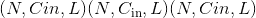和输出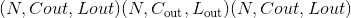的图层的输出值可以精确地描述为：

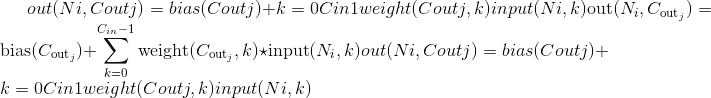

其中是有效的[互相关](https://en.wikipedia.org/wiki/Cross-correlation)运算符，是批处理大小，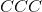表示通道数，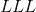是信号序列的长度。

*   `stride`控制互相关的步幅，单个数字或一个元素的元组。

*   对于`padding`点数，`padding`控制两侧的隐式零填充量。

*   `dilation`控制内核点之间的间距； 也称为àtrous 算法。 很难描述，但是此[链接](https://github.com/vdumoulin/conv_arithmetic/blob/master/README.md)很好地展示了`dilation`的功能。

*   `groups`控制输入和输出之间的连接。 `in_channels`和`out_channels`必须都可以被`groups`整除。 例如，

    &gt; *   在组= 1 时，所有输入都卷积为所有输出。
    &gt;     
    &gt;     
    &gt; *   在 groups = 2 时，该操作等效于并排设置两个 conv 层，每个 conv 层看到一半的输入通道，并产生一半的输出通道，并且随后都将它们级联。
    &gt;     
    &gt;     
    &gt; *   在 groups = `in_channels`时，每个输入通道都与自己的大小为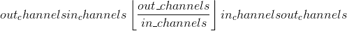的一组滤波器卷积。

Note

根据内核的大小，输入的(最后）几列可能会丢失，因为它是有效的[互相关](https://en.wikipedia.org/wiki/Cross-correlation)，而不是完整的[互相关](https://en.wikipedia.org/wiki/Cross-correlation) 。 由用户决定是否添加适当的填充。

Note

当&lt;cite&gt;组== in_channels&lt;/cite&gt; 和 &lt;cite&gt;out_channels == K * in_channels&lt;/cite&gt; 时，其中 &lt;cite&gt;K&lt;/cite&gt; 是一个正整数，此操作在文献中也被称为深度卷积。

换句话说，对于大小为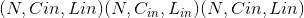的输入，可以通过参数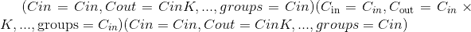构造具有深度乘数 &lt;cite&gt;K&lt;/cite&gt; 的深度卷积。

Note

在某些情况下，将 CUDA 后端与 CuDNN 一起使用时，该运算符可能会选择不确定的算法来提高性能。 如果不希望这样做，则可以通过设置`torch.backends.cudnn.deterministic = True`来使操作具有确定性(可能会降低性能）。 请参阅关于[可再现性](notes/randomness.html)的注意事项作为背景。

Parameters

*   **in_channels**  (_python：int_ )–输入图像中的通道数

*   **out_channels**  (_python：int_ )–卷积产生的通道数

*   **kernel_size**  (_python：int_ _或_ _元组_）–卷积内核的大小

*   **步幅** (_python：int_ _或_ _元组_ _，_ _可选_）–步幅 卷积。 默认值：1

*   **填充** (_python：int_ _或_ _元组_ _，_ _可选_）–零填充 添加到输入的两侧。 默认值：0

*   **padding_mode** (_字符串_ _，_ _可选_）– &lt;cite&gt;零&lt;/cite&gt;

*   **扩展** (_python：int_ _或_ _元组_ _，_ _可选_）–内核之间的间隔 元素。 默认值：1

*   **组** (_python：int_ _，_ _可选_）–从输入通道到输出通道的阻塞连接数。 默认值：1

*   **偏置** (_bool_ _，_ _可选_）–如果`True`，则向输出添加可学习的偏置。 默认值：`True`

```
Shape:
```

*   输入：

*   输出：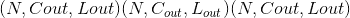其中

    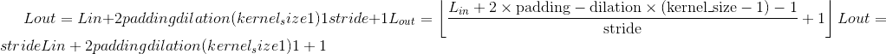

```
Variables
```

*   **〜Conv1d.weight**  ([_tensor_](tensors.html#torch.Tensor "torch.Tensor"))–形状为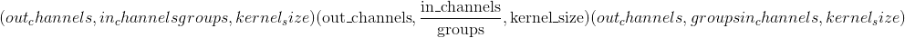的模块的可学习重量。 这些权重的值来自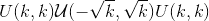，其中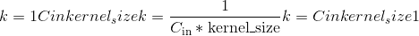

*   **〜Conv1d.bias**  ([_tensor_](tensors.html#torch.Tensor "torch.Tensor"))–形状模块的可学习偏差(out_channels）。 如果`bias`为`True`，则这些权重的值将从采样，其中

例子：

```
>>> m = nn.Conv1d(16, 33, 3, stride=2)
>>> input = torch.randn(20, 16, 50)
>>> output = m(input)

```

### 转换 2d

* * *

```
class torch.nn.Conv2d(in_channels, out_channels, kernel_size, stride=1, padding=0, dilation=1, groups=1, bias=True, padding_mode='zeros')¶
```

对由多个输入平面组成的输入信号应用 2D 卷积。

在最简单的情况下，具有输入大小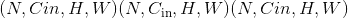和输出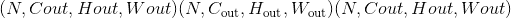的图层的输出值可以精确地描述为：


其中是有效的 2D [互相关](https://en.wikipedia.org/wiki/Cross-correlation)运算符，是批处理大小，表示通道数，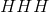是输入平面的高度(以像素为单位），并且[ 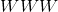是以像素为单位的宽度。

*   `stride`控制互相关的步幅，单个数字或元组。

*   对于每个维度的`padding`点数，`padding`控制两侧的隐式零填充量。

*   `dilation` controls the spacing between the kernel points; also known as the à trous algorithm. It is harder to describe, but this [link](https://github.com/vdumoulin/conv_arithmetic/blob/master/README.md) has a nice visualization of what `dilation` does.

*   `groups` controls the connections between inputs and outputs. `in_channels` and `out_channels` must both be divisible by `groups`. For example,

    &gt; *   At groups=1, all inputs are convolved to all outputs.
    &gt;     
    &gt;     
    &gt; *   At groups=2, the operation becomes equivalent to having two conv layers side by side, each seeing half the input channels, and producing half the output channels, and both subsequently concatenated.
    &gt;     
    &gt;     
    &gt; *   在 groups = `in_channels`时，每个输入通道都与自己的一组过滤器卷积，大小为。

参数`kernel_size`，`stride`，`padding`和`dilation`可以是：

> *   单个`int` –在这种情况下，高度和宽度尺寸将使用相同的值
>     
>     
> *   两个整数的`tuple` –在这种情况下，第一个 &lt;cite&gt;int&lt;/cite&gt; 用于高度尺寸，第二个 &lt;cite&gt;int&lt;/cite&gt; 用于宽度尺寸

Note

根据内核的大小，输入的(最后）几列可能会丢失，因为它是有效的[互相关](https://en.wikipedia.org/wiki/Cross-correlation)，而不是完整的[互相关](https://en.wikipedia.org/wiki/Cross-correlation) 。 由用户决定是否添加适当的填充。

Note

When &lt;cite&gt;groups == in_channels&lt;/cite&gt; and &lt;cite&gt;out_channels == K * in_channels&lt;/cite&gt;, where &lt;cite&gt;K&lt;/cite&gt; is a positive integer, this operation is also termed in literature as depthwise convolution.

换句话说，对于大小为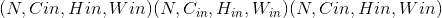的输入，可以通过参数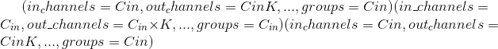构造具有深度乘数 &lt;cite&gt;K&lt;/cite&gt; 的深度卷积。

Note

In some circumstances when using the CUDA backend with CuDNN, this operator may select a nondeterministic algorithm to increase performance. If this is undesirable, you can try to make the operation deterministic (potentially at a performance cost) by setting `torch.backends.cudnn.deterministic = True`. Please see the notes on [Reproducibility](notes/randomness.html) for background.

Parameters

*   **in_channels** (_python:int_) – Number of channels in the input image

*   **out_channels** (_python:int_) – Number of channels produced by the convolution

*   **kernel_size** (_python:int_ _or_ _tuple_) – Size of the convolving kernel

*   **stride** (_python:int_ _or_ _tuple__,_ _optional_) – Stride of the convolution. Default: 1

*   **填充** (_python：int_ _或_ _元组_ _，_ _可选_）–零填充 添加到输入的两侧。 默认值：0

*   **padding_mode** (_string__,_ _optional_) – &lt;cite&gt;zeros&lt;/cite&gt;

*   **扩展** (_python：int_ _或_ _元组_ _，_ _可选_）–内核之间的间隔 元素。 默认值：1

*   **组** (_python：int_ _，_ _可选_）–从输入通道到输出通道的阻塞连接数。 默认值：1

*   **bias** (_bool__,_ _optional_) – If `True`, adds a learnable bias to the output. Default: `True`

```
Shape:
```

*   输入：

*   输出：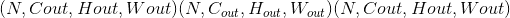其中

    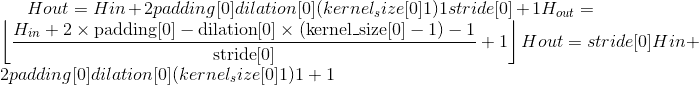

    

```
Variables
```

*   **〜Conv2d.weight**  ([_tensor_](tensors.html#torch.Tensor "torch.Tensor"))–形状为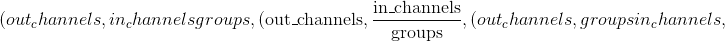 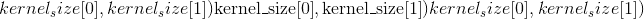的模块的可学习重量。 这些权重的值取自，其中

*   **〜Conv2d.bias**  ([_tensor_](tensors.html#torch.Tensor "torch.Tensor"))–形状模块的可学习偏差(out_channels）。 如果`bias`为`True`，则这些权重的值将从采样，其中

Examples:

```
>>> # With square kernels and equal stride
>>> m = nn.Conv2d(16, 33, 3, stride=2)
>>> # non-square kernels and unequal stride and with padding
>>> m = nn.Conv2d(16, 33, (3, 5), stride=(2, 1), padding=(4, 2))
>>> # non-square kernels and unequal stride and with padding and dilation
>>> m = nn.Conv2d(16, 33, (3, 5), stride=(2, 1), padding=(4, 2), dilation=(3, 1))
>>> input = torch.randn(20, 16, 50, 100)
>>> output = m(input)

```

### 转换 3d

* * *

```
class torch.nn.Conv3d(in_channels, out_channels, kernel_size, stride=1, padding=0, dilation=1, groups=1, bias=True, padding_mode='zeros')¶
```

在由多个输入平面组成的输入信号上应用 3D 卷积。

在最简单的情况下，具有输入大小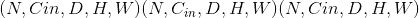和输出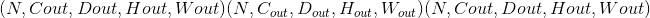的图层的输出值可以精确地描述为：

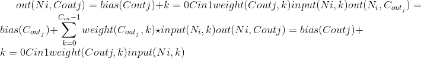

其中是有效的 3D [互相关](https://en.wikipedia.org/wiki/Cross-correlation)运算符

*   `stride`控制互相关的步幅。

*   `padding` controls the amount of implicit zero-paddings on both sides for `padding` number of points for each dimension.

*   `dilation`控制内核点之间的间距； 也称为àtrous 算法。 很难描述，但是此[链接](https://github.com/vdumoulin/conv_arithmetic/blob/master/README.md)很好地展示了`dilation`的功能。

*   `groups` controls the connections between inputs and outputs. `in_channels` and `out_channels` must both be divisible by `groups`. For example,

    &gt; *   At groups=1, all inputs are convolved to all outputs.
    &gt;     
    &gt;     
    &gt; *   At groups=2, the operation becomes equivalent to having two conv layers side by side, each seeing half the input channels, and producing half the output channels, and both subsequently concatenated.
    &gt;     
    &gt;     
    &gt; *   在 groups = `in_channels`时，每个输入通道都与自己的大小为的一组滤波器卷积。

The parameters `kernel_size`, `stride`, `padding`, `dilation` can either be:

> *   单个`int` –在这种情况下，深度，高度和宽度尺寸使用相同的值
>     
>     
> *   三个整数的`tuple` –在这种情况下，第一个 &lt;cite&gt;int&lt;/cite&gt; 用于深度尺寸，第二个 &lt;cite&gt;int&lt;/cite&gt; 用于高度尺寸，第三个 &lt;cite&gt;int&lt;/cite&gt; 为宽度尺寸

Note

Depending of the size of your kernel, several (of the last) columns of the input might be lost, because it is a valid [cross-correlation](https://en.wikipedia.org/wiki/Cross-correlation), and not a full [cross-correlation](https://en.wikipedia.org/wiki/Cross-correlation). It is up to the user to add proper padding.

Note

When &lt;cite&gt;groups == in_channels&lt;/cite&gt; and &lt;cite&gt;out_channels == K * in_channels&lt;/cite&gt;, where &lt;cite&gt;K&lt;/cite&gt; is a positive integer, this operation is also termed in literature as depthwise convolution.

换句话说，对于大小为的输入，可以通过参数构造具有深度乘数 &lt;cite&gt;K&lt;/cite&gt; 的深度卷积。

Note

In some circumstances when using the CUDA backend with CuDNN, this operator may select a nondeterministic algorithm to increase performance. If this is undesirable, you can try to make the operation deterministic (potentially at a performance cost) by setting `torch.backends.cudnn.deterministic = True`. Please see the notes on [Reproducibility](notes/randomness.html) for background.

Parameters

*   **in_channels** (_python:int_) – Number of channels in the input image

*   **out_channels** (_python:int_) – Number of channels produced by the convolution

*   **kernel_size** (_python:int_ _or_ _tuple_) – Size of the convolving kernel

*   **stride** (_python:int_ _or_ _tuple__,_ _optional_) – Stride of the convolution. Default: 1

*   **填充** (_python：int_ _或_ _元组_ _，_ _可选_）–零填充 添加到输入的所有三个方面。 默认值：0

*   **padding_mode** (_string__,_ _optional_) – &lt;cite&gt;zeros&lt;/cite&gt;

*   **dilation** (_python:int_ _or_ _tuple__,_ _optional_) – Spacing between kernel elements. Default: 1

*   **groups** (_python:int__,_ _optional_) – Number of blocked connections from input channels to output channels. Default: 1

*   **bias** (_bool__,_ _optional_) – If `True`, adds a learnable bias to the output. Default: `True`

```
Shape:
```

*   输入：

*   输出：其中

    

    

    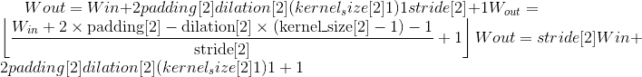

```
Variables
```

*   **〜Conv3d.weight**  ([_tensor_](tensors.html#torch.Tensor "torch.Tensor"))–形状为 的模块的可学习重量。 这些权重的值取自，其中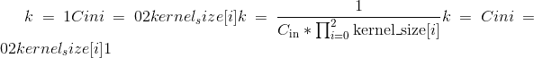

*   **〜Conv3d.bias**  ([_tensor_](tensors.html#torch.Tensor "torch.Tensor"))–形状模块的可学习偏差(out_channels）。 如果`bias`为`True`，则这些权重的值将从采样，其中

Examples:

```
>>> # With square kernels and equal stride
>>> m = nn.Conv3d(16, 33, 3, stride=2)
>>> # non-square kernels and unequal stride and with padding
>>> m = nn.Conv3d(16, 33, (3, 5, 2), stride=(2, 1, 1), padding=(4, 2, 0))
>>> input = torch.randn(20, 16, 10, 50, 100)
>>> output = m(input)

```

### ConvTranspose1d

* * *

```
class torch.nn.ConvTranspose1d(in_channels, out_channels, kernel_size, stride=1, padding=0, output_padding=0, groups=1, bias=True, dilation=1, padding_mode='zeros')¶
```

在由多个输入平面组成的输入图像上应用一维转置的卷积运算符。

该模块可以看作是 Conv1d 相对于其输入的梯度。 它也被称为分数步法卷积或反卷积(尽管它不是实际的反卷积运算）。

*   `stride` controls the stride for the cross-correlation.

*   对于`dilation * (kernel_size - 1) - padding`点数，`padding`控制两侧的隐式零填充量。 有关详细信息，请参见下面的注释。

*   `output_padding`控制添加到输出形状一侧的附加尺寸。 有关详细信息，请参见下面的注释。

*   `dilation` controls the spacing between the kernel points; also known as the à trous algorithm. It is harder to describe, but this [link](https://github.com/vdumoulin/conv_arithmetic/blob/master/README.md) has a nice visualization of what `dilation` does.

*   `groups` controls the connections between inputs and outputs. `in_channels` and `out_channels` must both be divisible by `groups`. For example,

    &gt; *   At groups=1, all inputs are convolved to all outputs.
    &gt;     
    &gt;     
    &gt; *   At groups=2, the operation becomes equivalent to having two conv layers side by side, each seeing half the input channels, and producing half the output channels, and both subsequently concatenated.
    &gt;     
    &gt;     
    &gt; *   在 groups = `in_channels`时，每个输入通道都与自己的一组过滤器(大小为）卷积。

Note

Depending of the size of your kernel, several (of the last) columns of the input might be lost, because it is a valid [cross-correlation](https://en.wikipedia.org/wiki/Cross-correlation), and not a full [cross-correlation](https://en.wikipedia.org/wiki/Cross-correlation). It is up to the user to add proper padding.

Note

`padding`参数有效地将`dilation * (kernel_size - 1) - padding`的零填充量添加到两种输入大小。 进行设置时，以相同的参数初始化 [`Conv1d`](#torch.nn.Conv1d "torch.nn.Conv1d") 和 [`ConvTranspose1d`](#torch.nn.ConvTranspose1d "torch.nn.ConvTranspose1d") 时，它们在输入和输出形状方面彼此相反。 但是，当`stride &gt; 1`， [`Conv1d`](#torch.nn.Conv1d "torch.nn.Conv1d") 将多个输入形状映射到相同的输出形状时。 提供`output_padding`可通过有效地增加一侧的计算输出形状来解决这种歧义。 请注意，`output_padding`仅用于查找输出形状，而实际上并未向输出添加零填充。

Note

In some circumstances when using the CUDA backend with CuDNN, this operator may select a nondeterministic algorithm to increase performance. If this is undesirable, you can try to make the operation deterministic (potentially at a performance cost) by setting `torch.backends.cudnn.deterministic = True`. Please see the notes on [Reproducibility](notes/randomness.html) for background.

Parameters

*   **in_channels** (_python:int_) – Number of channels in the input image

*   **out_channels** (_python:int_) – Number of channels produced by the convolution

*   **kernel_size** (_python:int_ _or_ _tuple_) – Size of the convolving kernel

*   **stride** (_python:int_ _or_ _tuple__,_ _optional_) – Stride of the convolution. Default: 1

*   **填充** (_python：int_ _或_ _元组_ _，_ _可选_）– `dilation * (kernel_size - 1) - padding` 零填充将添加到输入的两侧。 默认值：0

*   **output_padding**  (_python：int_ _或_ _元组_ _，_ _可选_）–已添加其他大小 到输出形状的一侧。 默认值：0

*   **groups** (_python:int__,_ _optional_) – Number of blocked connections from input channels to output channels. Default: 1

*   **bias** (_bool__,_ _optional_) – If `True`, adds a learnable bias to the output. Default: `True`

*   **dilation** (_python:int_ _or_ _tuple__,_ _optional_) – Spacing between kernel elements. Default: 1

```
Shape:
```

*   Input: 

*   Output:  where

    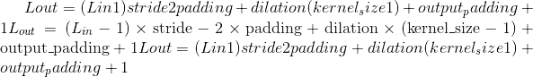

```
Variables
```

*   **〜ConvTranspose1d.weight**  ([_tensor_](tensors.html#torch.Tensor "torch.Tensor"))–形状为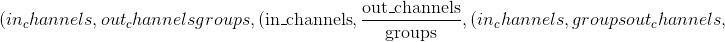 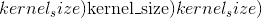的模块的可学习重量。 这些权重的值取自，其中

*   **〜ConvTranspose1d.bias**  ([_tensor_](tensors.html#torch.Tensor "torch.Tensor"))–形状模块的可学习偏差(out_channels）。 如果`bias`为`True`，则这些权重的值将从采样，其中

### ConvTranspose2d

* * *

```
class torch.nn.ConvTranspose2d(in_channels, out_channels, kernel_size, stride=1, padding=0, output_padding=0, groups=1, bias=True, dilation=1, padding_mode='zeros')¶
```

在由多个输入平面组成的输入图像上应用二维转置卷积运算符。

该模块可以看作是 Conv2d 相对于其输入的梯度。 它也被称为分数步法卷积或反卷积(尽管它不是实际的反卷积运算）。

*   `stride` controls the stride for the cross-correlation.

*   `padding` controls the amount of implicit zero-paddings on both sides for `dilation * (kernel_size - 1) - padding` number of points. See note below for details.

*   `output_padding` controls the additional size added to one side of the output shape. See note below for details.

*   `dilation` controls the spacing between the kernel points; also known as the à trous algorithm. It is harder to describe, but this [link](https://github.com/vdumoulin/conv_arithmetic/blob/master/README.md) has a nice visualization of what `dilation` does.

*   `groups` controls the connections between inputs and outputs. `in_channels` and `out_channels` must both be divisible by `groups`. For example,

    &gt; *   At groups=1, all inputs are convolved to all outputs.
    &gt;     
    &gt;     
    &gt; *   At groups=2, the operation becomes equivalent to having two conv layers side by side, each seeing half the input channels, and producing half the output channels, and both subsequently concatenated.
    &gt;     
    &gt;     
    &gt; *   At groups= `in_channels`, each input channel is convolved with its own set of filters (of size ).

参数`kernel_size`，`stride`，`padding`和`output_padding`可以是：

> *   单个`int` –在这种情况下，高度和宽度尺寸将使用相同的值
>     
>     
> *   a `tuple` of two ints – in which case, the first &lt;cite&gt;int&lt;/cite&gt; is used for the height dimension, and the second &lt;cite&gt;int&lt;/cite&gt; for the width dimension

Note

Depending of the size of your kernel, several (of the last) columns of the input might be lost, because it is a valid [cross-correlation](https://en.wikipedia.org/wiki/Cross-correlation), and not a full [cross-correlation](https://en.wikipedia.org/wiki/Cross-correlation). It is up to the user to add proper padding.

Note

`padding`参数有效地将`dilation * (kernel_size - 1) - padding`的零填充量添加到两种输入大小。 进行设置时，以相同的参数初始化 [`Conv2d`](#torch.nn.Conv2d "torch.nn.Conv2d") 和 [`ConvTranspose2d`](#torch.nn.ConvTranspose2d "torch.nn.ConvTranspose2d") 时，它们在输入和输出形状方面彼此相反。 但是，当`stride &gt; 1`， [`Conv2d`](#torch.nn.Conv2d "torch.nn.Conv2d") 将多个输入形状映射到相同的输出形状时。 提供`output_padding`可通过有效地增加一侧的计算输出形状来解决这种歧义。 请注意，`output_padding`仅用于查找输出形状，而实际上并未向输出添加零填充。

Note

In some circumstances when using the CUDA backend with CuDNN, this operator may select a nondeterministic algorithm to increase performance. If this is undesirable, you can try to make the operation deterministic (potentially at a performance cost) by setting `torch.backends.cudnn.deterministic = True`. Please see the notes on [Reproducibility](notes/randomness.html) for background.

Parameters

*   **in_channels** (_python:int_) – Number of channels in the input image

*   **out_channels** (_python:int_) – Number of channels produced by the convolution

*   **kernel_size** (_python:int_ _or_ _tuple_) – Size of the convolving kernel

*   **stride** (_python:int_ _or_ _tuple__,_ _optional_) – Stride of the convolution. Default: 1

*   **填充** (_python：int_ _或_ _元组_ _，_ _可选_）– `dilation * (kernel_size - 1) - padding` 零填充将添加到输入中每个维度的两侧。 默认值：0

*   **output_padding**  (_python：int_ _或_ _元组_ _，_ _可选_）–已添加其他大小 输出形状中每个尺寸的一侧。 默认值：0

*   **groups** (_python:int__,_ _optional_) – Number of blocked connections from input channels to output channels. Default: 1

*   **bias** (_bool__,_ _optional_) – If `True`, adds a learnable bias to the output. Default: `True`

*   **dilation** (_python:int_ _or_ _tuple__,_ _optional_) – Spacing between kernel elements. Default: 1

```
Shape:
```

*   Input: 

*   Output:  where

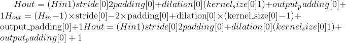

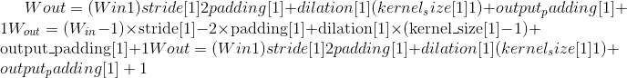

```
Variables
```

*   **〜ConvTranspose2d.weight**  ([_tensor_](tensors.html#torch.Tensor "torch.Tensor"))–形状为 的模块的可学习重量。 这些权重的值取自，其中

*   **〜ConvTranspose2d.bias**  ([_tensor_](tensors.html#torch.Tensor "torch.Tensor"))–形状模块的可学习偏差(out_channels）如果`bias`为`True`，则值 这些权重来自，其中

Examples:

```
>>> # With square kernels and equal stride
>>> m = nn.ConvTranspose2d(16, 33, 3, stride=2)
>>> # non-square kernels and unequal stride and with padding
>>> m = nn.ConvTranspose2d(16, 33, (3, 5), stride=(2, 1), padding=(4, 2))
>>> input = torch.randn(20, 16, 50, 100)
>>> output = m(input)
>>> # exact output size can be also specified as an argument
>>> input = torch.randn(1, 16, 12, 12)
>>> downsample = nn.Conv2d(16, 16, 3, stride=2, padding=1)
>>> upsample = nn.ConvTranspose2d(16, 16, 3, stride=2, padding=1)
>>> h = downsample(input)
>>> h.size()
torch.Size([1, 16, 6, 6])
>>> output = upsample(h, output_size=input.size())
>>> output.size()
torch.Size([1, 16, 12, 12])

```

### ConvTranspose3d

* * *

```
class torch.nn.ConvTranspose3d(in_channels, out_channels, kernel_size, stride=1, padding=0, output_padding=0, groups=1, bias=True, dilation=1, padding_mode='zeros')¶
```

在由多个输入平面组成的输入图像上应用 3D 转置卷积运算符。 转置的卷积运算符将每个输入值逐个元素地乘以一个可学习的内核，并对所有输入特征平面的输出求和。

该模块可以看作是 Conv3d 相对于其输入的梯度。 它也被称为分数步法卷积或反卷积(尽管它不是实际的反卷积运算）。

*   `stride` controls the stride for the cross-correlation.

*   `padding` controls the amount of implicit zero-paddings on both sides for `dilation * (kernel_size - 1) - padding` number of points. See note below for details.

*   `output_padding` controls the additional size added to one side of the output shape. See note below for details.

*   `dilation` controls the spacing between the kernel points; also known as the à trous algorithm. It is harder to describe, but this [link](https://github.com/vdumoulin/conv_arithmetic/blob/master/README.md) has a nice visualization of what `dilation` does.

*   `groups` controls the connections between inputs and outputs. `in_channels` and `out_channels` must both be divisible by `groups`. For example,

    &gt; *   At groups=1, all inputs are convolved to all outputs.
    &gt;     
    &gt;     
    &gt; *   At groups=2, the operation becomes equivalent to having two conv layers side by side, each seeing half the input channels, and producing half the output channels, and both subsequently concatenated.
    &gt;     
    &gt;     
    &gt; *   At groups= `in_channels`, each input channel is convolved with its own set of filters (of size ).

The parameters `kernel_size`, `stride`, `padding`, `output_padding` can either be:

> *   单个`int` –在这种情况下，深度，高度和宽度尺寸使用相同的值
>     
>     
> *   a `tuple` of three ints – in which case, the first &lt;cite&gt;int&lt;/cite&gt; is used for the depth dimension, the second &lt;cite&gt;int&lt;/cite&gt; for the height dimension and the third &lt;cite&gt;int&lt;/cite&gt; for the width dimension

Note

Depending of the size of your kernel, several (of the last) columns of the input might be lost, because it is a valid [cross-correlation](https://en.wikipedia.org/wiki/Cross-correlation), and not a full [cross-correlation](https://en.wikipedia.org/wiki/Cross-correlation). It is up to the user to add proper padding.

Note

`padding`参数有效地将`dilation * (kernel_size - 1) - padding`的零填充量添加到两种输入大小。 进行设置时，以相同的参数初始化 [`Conv3d`](#torch.nn.Conv3d "torch.nn.Conv3d") 和 [`ConvTranspose3d`](#torch.nn.ConvTranspose3d "torch.nn.ConvTranspose3d") 时，它们在输入和输出形状方面彼此相反。 但是，当`stride &gt; 1`， [`Conv3d`](#torch.nn.Conv3d "torch.nn.Conv3d") 将多个输入形状映射到相同的输出形状时。 提供`output_padding`可通过有效地增加一侧的计算输出形状来解决这种歧义。 请注意，`output_padding`仅用于查找输出形状，而实际上并未向输出添加零填充。

Note

In some circumstances when using the CUDA backend with CuDNN, this operator may select a nondeterministic algorithm to increase performance. If this is undesirable, you can try to make the operation deterministic (potentially at a performance cost) by setting `torch.backends.cudnn.deterministic = True`. Please see the notes on [Reproducibility](notes/randomness.html) for background.

Parameters

*   **in_channels** (_python:int_) – Number of channels in the input image

*   **out_channels** (_python:int_) – Number of channels produced by the convolution

*   **kernel_size** (_python:int_ _or_ _tuple_) – Size of the convolving kernel

*   **stride** (_python:int_ _or_ _tuple__,_ _optional_) – Stride of the convolution. Default: 1

*   **padding** (_python:int_ _or_ _tuple__,_ _optional_) – `dilation * (kernel_size - 1) - padding` zero-padding will be added to both sides of each dimension in the input. Default: 0

*   **output_padding** (_python:int_ _or_ _tuple__,_ _optional_) – Additional size added to one side of each dimension in the output shape. Default: 0

*   **groups** (_python:int__,_ _optional_) – Number of blocked connections from input channels to output channels. Default: 1

*   **bias** (_bool__,_ _optional_) – If `True`, adds a learnable bias to the output. Default: `True`

*   **dilation** (_python:int_ _or_ _tuple__,_ _optional_) – Spacing between kernel elements. Default: 1

```
Shape:
```

*   Input: 

*   Output:  where


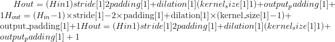

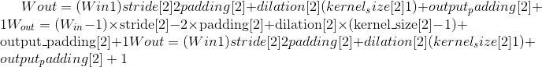

```
Variables
```

*   **〜ConvTranspose3d.weight**  ([_tensor_](tensors.html#torch.Tensor "torch.Tensor"))–形状为 的模块的可学习重量。 这些权重的值取自，其中

*   **〜ConvTranspose3d.bias**  ([_tensor_](tensors.html#torch.Tensor "torch.Tensor"))–形状模块的可学习偏差(out_channels）如果`bias`为`True`，则值 这些权重来自，其中

Examples:

```
>>> # With square kernels and equal stride
>>> m = nn.ConvTranspose3d(16, 33, 3, stride=2)
>>> # non-square kernels and unequal stride and with padding
>>> m = nn.ConvTranspose3d(16, 33, (3, 5, 2), stride=(2, 1, 1), padding=(0, 4, 2))
>>> input = torch.randn(20, 16, 10, 50, 100)
>>> output = m(input)

```

### 展开

* * *

```
class torch.nn.Unfold(kernel_size, dilation=1, padding=0, stride=1)¶
```

从批处理输入张量中提取滑动局部块。

考虑形状为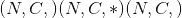的成批`input`张量，其中为批尺寸，为通道尺寸，代表任意空间尺寸。 此操作将`input`的空间尺寸内每个`kernel_size`大小的滑动块压平为形状为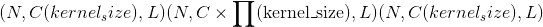的 3-D `output`张量的列(即最后一个尺寸），其中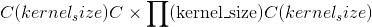为总数 每个块内的值数量(一个块具有个空间位置，每个位置包含通道矢量），是此类块的总数：


其中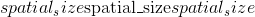由`input`(以上）的空间尺寸形成，而在所有空间尺寸上。

因此，在最后一个维度(列维度）上索引`output`将给出特定块内的所有值。

`padding`，`stride`和`dilation`自变量指定如何检索滑块。

*   `stride`控制滑块的步幅。

*   在重塑之前，`padding`控制每个维的`padding`个点的两侧的隐式零填充量。

*   `dilation` controls the spacing between the kernel points; also known as the à trous algorithm. It is harder to describe, but this [link](https://github.com/vdumoulin/conv_arithmetic/blob/master/README.md) has a nice visualization of what `dilation` does.

Parameters

*   **kernel_size**  (_python：int_ _或_ _元组_）–滑块的大小

*   **跨度** (_python：int_ _或_ _元组_ _，_ _可选_）–跨度 输入空间维度中的滑块。 默认值：1

*   **填充** (_python：int_ _或_ _元组_ _，_ _可选_）–隐式零填充 将被添加到输入的两侧。 默认值：0

*   **扩张** (_python：int_ _或_ _元组_ _，_ _可选_）–一个参数 控制邻域内元素的步幅。 默认值：1

*   如果`kernel_size`，`dilation`，`padding`或`stride`是长度为 1 的 int 或元组，则它们的值将在所有空间维度上复制。

*   对于两个输入空间维度，此操作有时称为`im2col`。

Note

[`Fold`](#torch.nn.Fold "torch.nn.Fold") 通过对来自所有包含块的所有值求和来计算所得大张量中的每个组合值。 [`Unfold`](#torch.nn.Unfold "torch.nn.Unfold") 通过复制大张量来提取局部块中的值。 因此，如果这些块重叠，则它们不是彼此相反。

通常，折叠和展开操作如下相关。 考虑使用相同参数创建的 [`Fold`](#torch.nn.Fold "torch.nn.Fold") 和 [`Unfold`](#torch.nn.Unfold "torch.nn.Unfold") 实例：

```
>>> fold_params = dict(kernel_size=..., dilation=..., padding=..., stride=...)
>>> fold = nn.Fold(output_size=..., **fold_params)
>>> unfold = nn.Unfold(**fold_params)

```

然后，对于任何(受支持的）`input`张量，以下等式成立：

```
fold(unfold(input)) == divisor * input

```

其中`divisor`是仅取决于`input`的形状和 dtype 的张量：

```
>>> input_ones = torch.ones(input.shape, dtype=input.dtype)
>>> divisor = fold(unfold(input_ones))

```

当`divisor`张量不包含零元素时，则`fold`和`unfold`运算互为逆(最大除数）。

Warning

当前，仅支持 4D 输入张量(像图像一样的批状张量）。

```
Shape:
```

*   输入：

*   输出：如上所述

Examples:

```
>>> unfold = nn.Unfold(kernel_size=(2, 3))
>>> input = torch.randn(2, 5, 3, 4)
>>> output = unfold(input)
>>> # each patch contains 30 values (2x3=6 vectors, each of 5 channels)
>>> # 4 blocks (2x3 kernels) in total in the 3x4 input
>>> output.size()
torch.Size([2, 30, 4])

>>> # Convolution is equivalent with Unfold + Matrix Multiplication + Fold (or view to output shape)
>>> inp = torch.randn(1, 3, 10, 12)
>>> w = torch.randn(2, 3, 4, 5)
>>> inp_unf = torch.nn.functional.unfold(inp, (4, 5))
>>> out_unf = inp_unf.transpose(1, 2).matmul(w.view(w.size(0), -1).t()).transpose(1, 2)
>>> out = torch.nn.functional.fold(out_unf, (7, 8), (1, 1))
>>> # or equivalently (and avoiding a copy),
>>> # out = out_unf.view(1, 2, 7, 8)
>>> (torch.nn.functional.conv2d(inp, w) - out).abs().max()
tensor(1.9073e-06)

```

### 折

* * *

```
class torch.nn.Fold(output_size, kernel_size, dilation=1, padding=0, stride=1)¶
```

将一系列滑动局部块组合成一个大型的张量。

考虑一个包含形状的滑动局部块(例如图像块）的批处理`input`张量，其中是批处理尺寸，是一个块内的值数(一个块具有 每个包含通道向量的空间位置），是块的总数。 (这与 [`Unfold`](#torch.nn.Unfold "torch.nn.Unfold") 的输出形状完全相同。）此操作通过求和重叠值，将这些局部块组合为形状为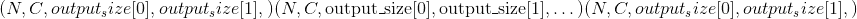的大`output`张量。 与 [`Unfold`](#torch.nn.Unfold "torch.nn.Unfold") 类似，参数必须满足


其中覆盖所有空间尺寸。

*   `output_size`描述了滑动局部块的大包含张量的空间形状。 当多个输入形状例如使用`stride &gt; 0`映射到相同数量的滑块时，解决歧义很有用。

The `padding`, `stride` and `dilation` arguments specify how the sliding blocks are retrieved.

*   `stride` controls the stride for the sliding blocks.

*   `padding` controls the amount of implicit zero-paddings on both sides for `padding` number of points for each dimension before reshaping.

*   `dilation` controls the spacing between the kernel points; also known as the à trous algorithm. It is harder to describe, but this [link](https://github.com/vdumoulin/conv_arithmetic/blob/master/README.md) has a nice visualization of what `dilation` does.

Parameters

*   **output_size**  (_python：int_ _或_ _元组_）–输出的空间尺寸形状(即`output.sizes()[2:]`）

*   **kernel_size** (_python:int_ _or_ _tuple_) – the size of the sliding blocks

*   **跨度** (_python：int_ _或_ _元组_）–滑动块在输入空间维度上的跨度。 默认值：1

*   **padding** (_python:int_ _or_ _tuple__,_ _optional_) – implicit zero padding to be added on both sides of input. Default: 0

*   **dilation** (_python:int_ _or_ _tuple__,_ _optional_) – a parameter that controls the stride of elements within the neighborhood. Default: 1

*   如果`output_size`，`kernel_size`，`dilation`，`padding`或`stride`是长度为 1 的整数或元组，则它们的值将在所有空间维度上复制。

*   对于两个输出空间维度，此操作有时称为`col2im`。

Note

[`Fold`](#torch.nn.Fold "torch.nn.Fold") calculates each combined value in the resulting large tensor by summing all values from all containing blocks. [`Unfold`](#torch.nn.Unfold "torch.nn.Unfold") extracts the values in the local blocks by copying from the large tensor. So, if the blocks overlap, they are not inverses of each other.

In general, folding and unfolding operations are related as follows. Consider [`Fold`](#torch.nn.Fold "torch.nn.Fold") and [`Unfold`](#torch.nn.Unfold "torch.nn.Unfold") instances created with the same parameters:

```
>>> fold_params = dict(kernel_size=..., dilation=..., padding=..., stride=...)
>>> fold = nn.Fold(output_size=..., **fold_params)
>>> unfold = nn.Unfold(**fold_params)

```

Then for any (supported) `input` tensor the following equality holds:

```
fold(unfold(input)) == divisor * input

```

where `divisor` is a tensor that depends only on the shape and dtype of the `input`:

```
>>> input_ones = torch.ones(input.shape, dtype=input.dtype)
>>> divisor = fold(unfold(input_ones))

```

When the `divisor` tensor contains no zero elements, then `fold` and `unfold` operations are inverses of each other (upto constant divisor).

Warning

当前，仅支持 4D 输出张量(像图像一样的批状张量）。

```
Shape:
```

*   输入：

*   输出：如上所述

Examples:

```
>>> fold = nn.Fold(output_size=(4, 5), kernel_size=(2, 2))
>>> input = torch.randn(1, 3 * 2 * 2, 12)
>>> output = fold(input)
>>> output.size()
torch.Size([1, 3, 4, 5])

```

## 汇聚层

### MaxPool1d

* * *

```
class torch.nn.MaxPool1d(kernel_size, stride=None, padding=0, dilation=1, return_indices=False, ceil_mode=False)¶
```

在由多个输入平面组成的输入信号上应用一维最大池化。

在最简单的情况下，具有输入大小和输出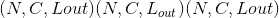的图层的输出值可以精确地描述为：

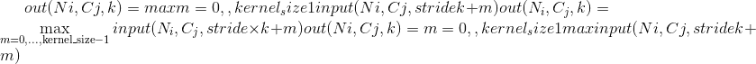

如果`padding`不为零，则对于`padding`点的数量，输入将在两侧隐式填充零。 `dilation`控制内核点之间的间距。 很难描述，但是此[链接](https://github.com/vdumoulin/conv_arithmetic/blob/master/README.md)很好地展示了`dilation`的功能。

Parameters

*   **kernel_size** –取最大值的窗口大小

*   **步幅** –窗口的步幅。 默认值为`kernel_size`

*   **填充** –在两侧都添加隐式零填充

*   **膨胀** –控制窗口中元素步幅的参数

*   **return_indices** –如果`True`，将返回最大索引以及输出。 以后对 [`torch.nn.MaxUnpool1d`](#torch.nn.MaxUnpool1d "torch.nn.MaxUnpool1d") 有用

*   **ceil_mode** –为 True 时，将使用 &lt;cite&gt;ceil&lt;/cite&gt; 而不是 &lt;cite&gt;floor&lt;/cite&gt; 计算输出形状

```
Shape:
```

*   输入：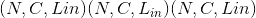

*   输出：，其中

    

Examples:

```
>>> # pool of size=3, stride=2
>>> m = nn.MaxPool1d(3, stride=2)
>>> input = torch.randn(20, 16, 50)
>>> output = m(input)

```

### MaxPool2d

* * *

```
class torch.nn.MaxPool2d(kernel_size, stride=None, padding=0, dilation=1, return_indices=False, ceil_mode=False)¶
```

在由多个输入平面组成的输入信号上应用 2D 最大合并。

在最简单的情况下，具有输入大小，输出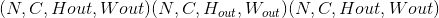和`kernel_size` 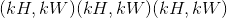的图层的输出值可以精确地描述为：

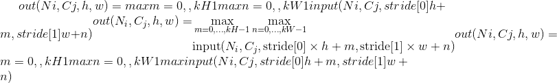

If `padding` is non-zero, then the input is implicitly zero-padded on both sides for `padding` number of points. `dilation` controls the spacing between the kernel points. It is harder to describe, but this [link](https://github.com/vdumoulin/conv_arithmetic/blob/master/README.md) has a nice visualization of what `dilation` does.

The parameters `kernel_size`, `stride`, `padding`, `dilation` can either be:

> *   a single `int` – in which case the same value is used for the height and width dimension
>     
>     
> *   a `tuple` of two ints – in which case, the first &lt;cite&gt;int&lt;/cite&gt; is used for the height dimension, and the second &lt;cite&gt;int&lt;/cite&gt; for the width dimension

Parameters

*   **kernel_size** – the size of the window to take a max over

*   **stride** – the stride of the window. Default value is `kernel_size`

*   **padding** – implicit zero padding to be added on both sides

*   **dilation** – a parameter that controls the stride of elements in the window

*   **return_indices** –如果`True`，将返回最大索引以及输出。 以后对 [`torch.nn.MaxUnpool2d`](#torch.nn.MaxUnpool2d "torch.nn.MaxUnpool2d") 有用

*   **ceil_mode** – when True, will use &lt;cite&gt;ceil&lt;/cite&gt; instead of &lt;cite&gt;floor&lt;/cite&gt; to compute the output shape

```
Shape:
```

*   输入：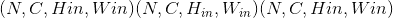

*   输出：，其中

    

    

Examples:

```
>>> # pool of square window of size=3, stride=2
>>> m = nn.MaxPool2d(3, stride=2)
>>> # pool of non-square window
>>> m = nn.MaxPool2d((3, 2), stride=(2, 1))
>>> input = torch.randn(20, 16, 50, 32)
>>> output = m(input)

```

### MaxPool3d

* * *

```
class torch.nn.MaxPool3d(kernel_size, stride=None, padding=0, dilation=1, return_indices=False, ceil_mode=False)¶
```

在由多个输入平面组成的输入信号上应用 3D 最大池化。

在最简单的情况下，具有输入大小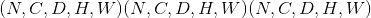，输出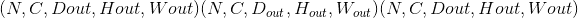和`kernel_size` 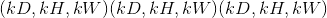的图层的输出值可以精确地描述为：


If `padding` is non-zero, then the input is implicitly zero-padded on both sides for `padding` number of points. `dilation` controls the spacing between the kernel points. It is harder to describe, but this [link](https://github.com/vdumoulin/conv_arithmetic/blob/master/README.md) has a nice visualization of what `dilation` does.

The parameters `kernel_size`, `stride`, `padding`, `dilation` can either be:

> *   a single `int` – in which case the same value is used for the depth, height and width dimension
>     
>     
> *   a `tuple` of three ints – in which case, the first &lt;cite&gt;int&lt;/cite&gt; is used for the depth dimension, the second &lt;cite&gt;int&lt;/cite&gt; for the height dimension and the third &lt;cite&gt;int&lt;/cite&gt; for the width dimension

Parameters

*   **kernel_size** – the size of the window to take a max over

*   **stride** – the stride of the window. Default value is `kernel_size`

*   **填充** –在所有三个面上都添加隐式零填充

*   **dilation** – a parameter that controls the stride of elements in the window

*   **return_indices** –如果`True`，将返回最大索引以及输出。 以后对 [`torch.nn.MaxUnpool3d`](#torch.nn.MaxUnpool3d "torch.nn.MaxUnpool3d") 有用

*   **ceil_mode** – when True, will use &lt;cite&gt;ceil&lt;/cite&gt; instead of &lt;cite&gt;floor&lt;/cite&gt; to compute the output shape

```
Shape:
```

*   输入：

*   输出：，其中

    

    

    

Examples:

```
>>> # pool of square window of size=3, stride=2
>>> m = nn.MaxPool3d(3, stride=2)
>>> # pool of non-square window
>>> m = nn.MaxPool3d((3, 2, 2), stride=(2, 1, 2))
>>> input = torch.randn(20, 16, 50,44, 31)
>>> output = m(input)

```

### MaxUnpool1d

* * *

```
class torch.nn.MaxUnpool1d(kernel_size, stride=None, padding=0)¶
```

计算 [`MaxPool1d`](#torch.nn.MaxPool1d "torch.nn.MaxPool1d") 的局部逆。

[`MaxPool1d`](#torch.nn.MaxPool1d "torch.nn.MaxPool1d") 不能完全反转，因为会丢失非最大值。

[`MaxUnpool1d`](#torch.nn.MaxUnpool1d "torch.nn.MaxUnpool1d") 接收包括最大值索引在内的 [`MaxPool1d`](#torch.nn.MaxPool1d "torch.nn.MaxPool1d") 的输出作为输入，并计算一个部分逆，其中所有非最大值都设置为零。

Note

[`MaxPool1d`](#torch.nn.MaxPool1d "torch.nn.MaxPool1d") 可以将多个输入大小映射到相同的输出大小。 因此，反转过程可能会变得模棱两可。 为了解决这个问题，您可以在前进调用中提供所需的输出大小作为附加参数`output_size`。 请参阅下面的输入和示例。

Parameters

*   **kernel_size**  (_python：int_ _或_ _元组_）–最大池窗口的大小。

*   **跨度** (_python：int_ _或_ _元组_）–最大合并窗口的跨度。 默认设置为`kernel_size`。

*   **填充** (_python：int_ _或_ _元组_）–已添加到输入中的填充

```
Inputs:
```

*   &lt;cite&gt;输入&lt;/cite&gt;：输入张量反转

*   &lt;cite&gt;指标&lt;/cite&gt;： [`MaxPool1d`](#torch.nn.MaxPool1d "torch.nn.MaxPool1d") 给出的指标

*   &lt;cite&gt;output_size&lt;/cite&gt; (可选）：目标输出大小

```
Shape:
```

*   输入：

*   输出：，其中

    

    或由呼叫运营商中的`output_size`给定

Example:

```
>>> pool = nn.MaxPool1d(2, stride=2, return_indices=True)
>>> unpool = nn.MaxUnpool1d(2, stride=2)
>>> input = torch.tensor([[[1., 2, 3, 4, 5, 6, 7, 8]]])
>>> output, indices = pool(input)
>>> unpool(output, indices)
tensor([[[ 0.,  2.,  0.,  4.,  0.,  6.,  0., 8.]]])

>>> # Example showcasing the use of output_size
>>> input = torch.tensor([[[1., 2, 3, 4, 5, 6, 7, 8, 9]]])
>>> output, indices = pool(input)
>>> unpool(output, indices, output_size=input.size())
tensor([[[ 0.,  2.,  0.,  4.,  0.,  6.,  0., 8.,  0.]]])

>>> unpool(output, indices)
tensor([[[ 0.,  2.,  0.,  4.,  0.,  6.,  0., 8.]]])

```

### MaxUnpool2d

* * *

```
class torch.nn.MaxUnpool2d(kernel_size, stride=None, padding=0)¶
```

计算 [`MaxPool2d`](#torch.nn.MaxPool2d "torch.nn.MaxPool2d") 的局部逆。

[`MaxPool2d`](#torch.nn.MaxPool2d "torch.nn.MaxPool2d") 不能完全反转，因为会丢失非最大值。

[`MaxUnpool2d`](#torch.nn.MaxUnpool2d "torch.nn.MaxUnpool2d") 接收包括最大值索引在内的 [`MaxPool2d`](#torch.nn.MaxPool2d "torch.nn.MaxPool2d") 的输出作为输入，并计算一个部分逆，其中所有非最大值都设置为零。

Note

[`MaxPool2d`](#torch.nn.MaxPool2d "torch.nn.MaxPool2d") 可以将多个输入大小映射到相同的输出大小。 因此，反转过程可能会变得模棱两可。 为了解决这个问题，您可以在前进调用中提供所需的输出大小作为附加参数`output_size`。 请参阅下面的输入和示例。

Parameters

*   **kernel_size** (_python:int_ _or_ _tuple_) – Size of the max pooling window.

*   **stride** (_python:int_ _or_ _tuple_) – Stride of the max pooling window. It is set to `kernel_size` by default.

*   **padding** (_python:int_ _or_ _tuple_) – Padding that was added to the input

```
Inputs:
```

*   &lt;cite&gt;input&lt;/cite&gt;: the input Tensor to invert

*   &lt;cite&gt;指标&lt;/cite&gt;： [`MaxPool2d`](#torch.nn.MaxPool2d "torch.nn.MaxPool2d") 给出的指标

*   &lt;cite&gt;output_size&lt;/cite&gt; (optional): the targeted output size

```
Shape:
```

*   Input: 

*   Output: , where

    

    

    or as given by `output_size` in the call operator

Example:

```
>>> pool = nn.MaxPool2d(2, stride=2, return_indices=True)
>>> unpool = nn.MaxUnpool2d(2, stride=2)
>>> input = torch.tensor([[[[ 1.,  2,  3,  4],
                            [ 5,  6,  7,  8],
                            [ 9, 10, 11, 12],
                            [13, 14, 15, 16]]]])
>>> output, indices = pool(input)
>>> unpool(output, indices)
tensor([[[[  0.,   0.,   0.,   0.],
          [  0.,   6.,   0.,   8.],
          [  0.,   0.,   0.,   0.],
          [  0.,  14.,   0.,  16.]]]])

>>> # specify a different output size than input size
>>> unpool(output, indices, output_size=torch.Size([1, 1, 5, 5]))
tensor([[[[  0.,   0.,   0.,   0.,   0.],
          [  6.,   0.,   8.,   0.,   0.],
          [  0.,   0.,   0.,  14.,   0.],
          [ 16.,   0.,   0.,   0.,   0.],
          [  0.,   0.,   0.,   0.,   0.]]]])

```

### MaxUnpool3d

* * *

```
class torch.nn.MaxUnpool3d(kernel_size, stride=None, padding=0)¶
```

计算 [`MaxPool3d`](#torch.nn.MaxPool3d "torch.nn.MaxPool3d") 的局部逆。

[`MaxPool3d`](#torch.nn.MaxPool3d "torch.nn.MaxPool3d") 不能完全反转，因为会丢失非最大值。 [`MaxUnpool3d`](#torch.nn.MaxUnpool3d "torch.nn.MaxUnpool3d") 将包含最大值索引的 [`MaxPool3d`](#torch.nn.MaxPool3d "torch.nn.MaxPool3d") 的输出作为输入，并计算将所有非最大值均设置为零的部分逆。

Note

[`MaxPool3d`](#torch.nn.MaxPool3d "torch.nn.MaxPool3d") 可以将多个输入大小映射到相同的输出大小。 因此，反转过程可能会变得模棱两可。 为了解决这个问题，您可以在前进调用中提供所需的输出大小作为附加参数`output_size`。 请参阅下面的输入部分。

Parameters

*   **kernel_size** (_python:int_ _or_ _tuple_) – Size of the max pooling window.

*   **stride** (_python:int_ _or_ _tuple_) – Stride of the max pooling window. It is set to `kernel_size` by default.

*   **padding** (_python:int_ _or_ _tuple_) – Padding that was added to the input

```
Inputs:
```

*   &lt;cite&gt;input&lt;/cite&gt;: the input Tensor to invert

*   &lt;cite&gt;指标&lt;/cite&gt;： [`MaxPool3d`](#torch.nn.MaxPool3d "torch.nn.MaxPool3d") 给出的指标

*   &lt;cite&gt;output_size&lt;/cite&gt; (optional): the targeted output size

```
Shape:
```

*   Input: 

*   Output: , where

    

    

    

    or as given by `output_size` in the call operator

Example:

```
>>> # pool of square window of size=3, stride=2
>>> pool = nn.MaxPool3d(3, stride=2, return_indices=True)
>>> unpool = nn.MaxUnpool3d(3, stride=2)
>>> output, indices = pool(torch.randn(20, 16, 51, 33, 15))
>>> unpooled_output = unpool(output, indices)
>>> unpooled_output.size()
torch.Size([20, 16, 51, 33, 15])

```

### 平均池 1d

* * *

```
class torch.nn.AvgPool1d(kernel_size, stride=None, padding=0, ceil_mode=False, count_include_pad=True)¶
```

在由多个输入平面组成的输入信号上应用一维平均池。

在最简单的情况下，具有输入大小，输出和`kernel_size` 的图层的输出值可以精确地描述为：


如果`padding`不为零，则对于`padding`点的数量，输入将在两侧隐式填充零。

参数`kernel_size`，`stride`和`padding`可以分别是`int`或一个元素元组。

Parameters

*   **kernel_size** –窗口的大小

*   **stride** – the stride of the window. Default value is `kernel_size`

*   **padding** – implicit zero padding to be added on both sides

*   **ceil_mode** – when True, will use &lt;cite&gt;ceil&lt;/cite&gt; instead of &lt;cite&gt;floor&lt;/cite&gt; to compute the output shape

*   **count_include_pad** –为 True 时，将在平均计算中包括零填充

```
Shape:
```

*   Input: 

*   Output: , where

    

Examples:

```
>>> # pool with window of size=3, stride=2
>>> m = nn.AvgPool1d(3, stride=2)
>>> m(torch.tensor([[[1.,2,3,4,5,6,7]]]))
tensor([[[ 2.,  4.,  6.]]])

```

### 平均池 2d

* * *

```
class torch.nn.AvgPool2d(kernel_size, stride=None, padding=0, ceil_mode=False, count_include_pad=True, divisor_override=None)¶
```

在由多个输入平面组成的输入信号上应用 2D 平均池。

In the simplest case, the output value of the layer with input size , output  and `kernel_size`  can be precisely described as:


If `padding` is non-zero, then the input is implicitly zero-padded on both sides for `padding` number of points.

参数`kernel_size`，`stride`和`padding`可以是：

> *   a single `int` – in which case the same value is used for the height and width dimension
>     
>     
> *   a `tuple` of two ints – in which case, the first &lt;cite&gt;int&lt;/cite&gt; is used for the height dimension, and the second &lt;cite&gt;int&lt;/cite&gt; for the width dimension

Parameters

*   **kernel_size** – the size of the window

*   **stride** – the stride of the window. Default value is `kernel_size`

*   **padding** – implicit zero padding to be added on both sides

*   **ceil_mode** – when True, will use &lt;cite&gt;ceil&lt;/cite&gt; instead of &lt;cite&gt;floor&lt;/cite&gt; to compute the output shape

*   **count_include_pad** – when True, will include the zero-padding in the averaging calculation

*   **divisor_override** -如果指定，它将用作除数，否则 attr： &lt;cite&gt;kernel_size&lt;/cite&gt;

```
Shape:
```

*   Input: 

*   Output: , where

    

    

Examples:

```
>>> # pool of square window of size=3, stride=2
>>> m = nn.AvgPool2d(3, stride=2)
>>> # pool of non-square window
>>> m = nn.AvgPool2d((3, 2), stride=(2, 1))
>>> input = torch.randn(20, 16, 50, 32)
>>> output = m(input)

```

### 平均池 3d

* * *

```
class torch.nn.AvgPool3d(kernel_size, stride=None, padding=0, ceil_mode=False, count_include_pad=True, divisor_override=None)¶
```

在由多个输入平面组成的输入信号上应用 3D 平均池。

In the simplest case, the output value of the layer with input size , output  and `kernel_size`  can be precisely described as:


如果`padding`不为零，则对于`padding`点的数量，输入将在所有三个侧面隐式填充零。

参数`kernel_size`和`stride`可以是：

> *   a single `int` – in which case the same value is used for the depth, height and width dimension
>     
>     
> *   a `tuple` of three ints – in which case, the first &lt;cite&gt;int&lt;/cite&gt; is used for the depth dimension, the second &lt;cite&gt;int&lt;/cite&gt; for the height dimension and the third &lt;cite&gt;int&lt;/cite&gt; for the width dimension

Parameters

*   **kernel_size** – the size of the window

*   **stride** – the stride of the window. Default value is `kernel_size`

*   **padding** – implicit zero padding to be added on all three sides

*   **ceil_mode** – when True, will use &lt;cite&gt;ceil&lt;/cite&gt; instead of &lt;cite&gt;floor&lt;/cite&gt; to compute the output shape

*   **count_include_pad** – when True, will include the zero-padding in the averaging calculation

*   **divisor_override** – if specified, it will be used as divisor, otherwise attr:&lt;cite&gt;kernel_size&lt;/cite&gt; will be used

```
Shape:
```

*   Input: 

*   Output: , where

    

    

    

Examples:

```
>>> # pool of square window of size=3, stride=2
>>> m = nn.AvgPool3d(3, stride=2)
>>> # pool of non-square window
>>> m = nn.AvgPool3d((3, 2, 2), stride=(2, 1, 2))
>>> input = torch.randn(20, 16, 50,44, 31)
>>> output = m(input)

```

### 分数最大池 2d

* * *

```
class torch.nn.FractionalMaxPool2d(kernel_size, output_size=None, output_ratio=None, return_indices=False, _random_samples=None)¶
```

在由多个输入平面组成的输入信号上应用 2D 分数最大池化。

Ben Graham 的论文 [Fractional MaxPooling](http://arxiv.org/abs/1412.6071) 中详细描述了分数最大池化

在区域中通过由目标输出大小确定的随机步长应用最大合并操作。 输出要素的数量等于输入平面的数量。

Parameters

*   **kernel_size** –接管最大值的窗口大小。 可以是单个数字 k(对于 k x k 的平方核）或元组&lt;cite&gt;(kh，kw）&lt;/cite&gt;

*   **output_size** – &lt;cite&gt;oH x oW&lt;/cite&gt; 形式的图像的目标输出尺寸。 可以是一个元组&lt;cite&gt;(oH，oW）&lt;/cite&gt;，也可以是一个正方形图像 &lt;cite&gt;oH x oH&lt;/cite&gt; 的一个数字 oH

*   **output_ratio** –如果希望输出大小与输入大小的比率，可以指定此选项。 这必须是范围为(0，1）的数字或元组

*   **return_indices** -如果`True`，则将返回索引以及输出。 有助于传递给`nn.MaxUnpool2d()`。 默认值：`False`

例子

```
>>> # pool of square window of size=3, and target output size 13x12
>>> m = nn.FractionalMaxPool2d(3, output_size=(13, 12))
>>> # pool of square window and target output size being half of input image size
>>> m = nn.FractionalMaxPool2d(3, output_ratio=(0.5, 0.5))
>>> input = torch.randn(20, 16, 50, 32)
>>> output = m(input)

```

### LPPool1d

* * *

```
class torch.nn.LPPool1d(norm_type, kernel_size, stride=None, ceil_mode=False)¶
```

在由多个输入平面组成的输入信号上应用一维功率平均池。

在每个窗口上，计算的函数为：


*   在 p = 时，获得最大池化

*   在 p = 1 时，总和池(与平均池成正比）

Note

如果 &lt;cite&gt;p&lt;/cite&gt; 的幂的和为零，则此函数的梯度不确定。 在这种情况下，此实现会将梯度设置为零。

Parameters

*   **kernel_size** –单个整数，窗口的大小

*   **跨度** –一个 int，即窗口的跨度。 默认值为`kernel_size`

*   **ceil_mode** – when True, will use &lt;cite&gt;ceil&lt;/cite&gt; instead of &lt;cite&gt;floor&lt;/cite&gt; to compute the output shape

```
Shape:
```

*   Input: 

*   Output: , where

    

```
Examples::
```

```
>>> # power-2 pool of window of length 3, with stride 2.
>>> m = nn.LPPool1d(2, 3, stride=2)
>>> input = torch.randn(20, 16, 50)
>>> output = m(input)

```

### LPPool2d

* * *

```
class torch.nn.LPPool2d(norm_type, kernel_size, stride=None, ceil_mode=False)¶
```

在由多个输入平面组成的输入信号上应用 2D 功率平均池。

On each window, the function computed is:


*   At p = , one gets Max Pooling

*   在 p = 1 时，将获得“汇总池”(与平均池成比例）

The parameters `kernel_size`, `stride` can either be:

> *   a single `int` – in which case the same value is used for the height and width dimension
>     
>     
> *   a `tuple` of two ints – in which case, the first &lt;cite&gt;int&lt;/cite&gt; is used for the height dimension, and the second &lt;cite&gt;int&lt;/cite&gt; for the width dimension

Note

If the sum to the power of &lt;cite&gt;p&lt;/cite&gt; is zero, the gradient of this function is not defined. This implementation will set the gradient to zero in this case.

Parameters

*   **kernel_size** – the size of the window

*   **stride** – the stride of the window. Default value is `kernel_size`

*   **ceil_mode** – when True, will use &lt;cite&gt;ceil&lt;/cite&gt; instead of &lt;cite&gt;floor&lt;/cite&gt; to compute the output shape

```
Shape:
```

*   Input: 

*   Output: , where

    

    

Examples:

```
>>> # power-2 pool of square window of size=3, stride=2
>>> m = nn.LPPool2d(2, 3, stride=2)
>>> # pool of non-square window of power 1.2
>>> m = nn.LPPool2d(1.2, (3, 2), stride=(2, 1))
>>> input = torch.randn(20, 16, 50, 32)
>>> output = m(input)

```

### AdaptiveMaxPool1d

* * *

```
class torch.nn.AdaptiveMaxPool1d(output_size, return_indices=False)¶
```

在由多个输入平面组成的输入信号上应用一维自适应最大池化。

对于任何输入大小，输出大小均为 H。 输出要素的数量等于输入平面的数量。

Parameters

*   **output_size** –目标输出大小 H

*   **return_indices** -如果`True`，则将返回索引以及输出。 传递给 nn.MaxUnpool1d 很有用。 默认值：`False`

Examples

```
>>> # target output size of 5
>>> m = nn.AdaptiveMaxPool1d(5)
>>> input = torch.randn(1, 64, 8)
>>> output = m(input)

```

### AdaptiveMaxPool2d

* * *

```
class torch.nn.AdaptiveMaxPool2d(output_size, return_indices=False)¶
```

在由多个输入平面组成的输入信号上应用 2D 自适应最大池化。

对于任何输入大小，输出大小均为 H xW。 输出要素的数量等于输入平面的数量。

Parameters

*   **output_size** – H x W 形式的图像的目标输出大小。可以是元组(H，W），也可以是正方形图像 H x H 的单个 H。H 和 W 可以是 `int`或`None`表示大小与输入的大小相同。

*   **return_indices** -如果`True`，则将返回索引以及输出。 传递给 nn.MaxUnpool2d 很有用。 默认值：`False`

Examples

```
>>> # target output size of 5x7
>>> m = nn.AdaptiveMaxPool2d((5,7))
>>> input = torch.randn(1, 64, 8, 9)
>>> output = m(input)
>>> # target output size of 7x7 (square)
>>> m = nn.AdaptiveMaxPool2d(7)
>>> input = torch.randn(1, 64, 10, 9)
>>> output = m(input)
>>> # target output size of 10x7
>>> m = nn.AdaptiveMaxPool2d((None, 7))
>>> input = torch.randn(1, 64, 10, 9)
>>> output = m(input)

```

### AdaptiveMaxPool3d

* * *

```
class torch.nn.AdaptiveMaxPool3d(output_size, return_indices=False)¶
```

在由多个输入平面组成的输入信号上应用 3D 自适应最大池化。

对于任何输入大小，输出大小均为 D xH xW。 输出要素的数量等于输入平面的数量。

Parameters

*   **output_size** – D x H x W 形式的图像的目标输出尺寸。可以是一个元组(D，H，W），也可以是一个多维数据集 D x D x D 的单个 D。D， H 和 W 可以是`int`或`None`，这意味着大小将与输入的大小相同。

*   **return_indices** -如果`True`，则将返回索引以及输出。 传递给 nn.MaxUnpool3d 很有用。 默认值：`False`

Examples

```
>>> # target output size of 5x7x9
>>> m = nn.AdaptiveMaxPool3d((5,7,9))
>>> input = torch.randn(1, 64, 8, 9, 10)
>>> output = m(input)
>>> # target output size of 7x7x7 (cube)
>>> m = nn.AdaptiveMaxPool3d(7)
>>> input = torch.randn(1, 64, 10, 9, 8)
>>> output = m(input)
>>> # target output size of 7x9x8
>>> m = nn.AdaptiveMaxPool3d((7, None, None))
>>> input = torch.randn(1, 64, 10, 9, 8)
>>> output = m(input)

```

### AdaptiveAvgPool1d

* * *

```
class torch.nn.AdaptiveAvgPool1d(output_size)¶
```

在由多个输入平面组成的输入信号上应用一维自适应平均池。

The output size is H, for any input size. The number of output features is equal to the number of input planes.

Parameters

**output_size** – the target output size H

Examples

```
>>> # target output size of 5
>>> m = nn.AdaptiveAvgPool1d(5)
>>> input = torch.randn(1, 64, 8)
>>> output = m(input)

```

### AdaptiveAvgPool2d

* * *

```
class torch.nn.AdaptiveAvgPool2d(output_size)¶
```

在由多个输入平面组成的输入信号上应用 2D 自适应平均池。

The output is of size H x W, for any input size. The number of output features is equal to the number of input planes.

Parameters

**output_size** – the target output size of the image of the form H x W. Can be a tuple (H, W) or a single H for a square image H x H. H and W can be either a `int`, or `None` which means the size will be the same as that of the input.

Examples

```
>>> # target output size of 5x7
>>> m = nn.AdaptiveAvgPool2d((5,7))
>>> input = torch.randn(1, 64, 8, 9)
>>> output = m(input)
>>> # target output size of 7x7 (square)
>>> m = nn.AdaptiveAvgPool2d(7)
>>> input = torch.randn(1, 64, 10, 9)
>>> output = m(input)
>>> # target output size of 10x7
>>> m = nn.AdaptiveMaxPool2d((None, 7))
>>> input = torch.randn(1, 64, 10, 9)
>>> output = m(input)

```

### AdaptiveAvgPool3d

* * *

```
class torch.nn.AdaptiveAvgPool3d(output_size)¶
```

在由多个输入平面组成的输入信号上应用 3D 自适应平均池。

The output is of size D x H x W, for any input size. The number of output features is equal to the number of input planes.

Parameters

**output_size** – D x H x W 形式的目标输出大小。可以是元组(D，H，W），也可以是多维数据集 D xD x D 的单个数字 D。D，H 和 W 可以是`int`或`None`，这意味着大小将与输入的大小相同。

Examples

```
>>> # target output size of 5x7x9
>>> m = nn.AdaptiveAvgPool3d((5,7,9))
>>> input = torch.randn(1, 64, 8, 9, 10)
>>> output = m(input)
>>> # target output size of 7x7x7 (cube)
>>> m = nn.AdaptiveAvgPool3d(7)
>>> input = torch.randn(1, 64, 10, 9, 8)
>>> output = m(input)
>>> # target output size of 7x9x8
>>> m = nn.AdaptiveMaxPool3d((7, None, None))
>>> input = torch.randn(1, 64, 10, 9, 8)
>>> output = m(input)

```

## 填充层

### ReflectionPad1d

* * *

```
class torch.nn.ReflectionPad1d(padding)¶
```

使用输入边界的反射来填充输入张量。

对于 &lt;cite&gt;N&lt;/cite&gt; 维填充，请使用 [`torch.nn.functional.pad()`](nn.functional.html#torch.nn.functional.pad "torch.nn.functional.pad") 。

Parameters

**填充** (_python：int_ _，_ _元组_）–填充的大小。 如果为 &lt;cite&gt;int&lt;/cite&gt; ，则在所有边界中使用相同的填充。 如果 2- &lt;cite&gt;元组&lt;/cite&gt;，则使用(，）

```
Shape:
```

*   输入：

*   输出：其中

    

Examples:

```
>>> m = nn.ReflectionPad1d(2)
>>> input = torch.arange(8, dtype=torch.float).reshape(1, 2, 4)
>>> input
tensor([[[0., 1., 2., 3.],
         [4., 5., 6., 7.]]])
>>> m(input)
tensor([[[2., 1., 0., 1., 2., 3., 2., 1.],
         [6., 5., 4., 5., 6., 7., 6., 5.]]])
>>> # using different paddings for different sides
>>> m = nn.ReflectionPad1d((3, 1))
>>> m(input)
tensor([[[3., 2., 1., 0., 1., 2., 3., 2.],
         [7., 6., 5., 4., 5., 6., 7., 6.]]])

```

### ReflectionPad2d

* * *

```
class torch.nn.ReflectionPad2d(padding)¶
```

Pads the input tensor using the reflection of the input boundary.

For &lt;cite&gt;N&lt;/cite&gt;-dimensional padding, use [`torch.nn.functional.pad()`](nn.functional.html#torch.nn.functional.pad "torch.nn.functional.pad").

Parameters

**填充** (_python：int_ _，_ _元组_）–填充的大小。 如果为 &lt;cite&gt;int&lt;/cite&gt; ，则在所有边界中使用相同的填充。 如果是 4- &lt;cite&gt;元组&lt;/cite&gt;，则使用(，，和）

```
Shape:
```

*   Input: 

*   输出：其中

    

    

Examples:

```
>>> m = nn.ReflectionPad2d(2)
>>> input = torch.arange(9, dtype=torch.float).reshape(1, 1, 3, 3)
>>> input
tensor([[[[0., 1., 2.],
          [3., 4., 5.],
          [6., 7., 8.]]]])
>>> m(input)
tensor([[[[8., 7., 6., 7., 8., 7., 6.],
          [5., 4., 3., 4., 5., 4., 3.],
          [2., 1., 0., 1., 2., 1., 0.],
          [5., 4., 3., 4., 5., 4., 3.],
          [8., 7., 6., 7., 8., 7., 6.],
          [5., 4., 3., 4., 5., 4., 3.],
          [2., 1., 0., 1., 2., 1., 0.]]]])
>>> # using different paddings for different sides
>>> m = nn.ReflectionPad2d((1, 1, 2, 0))
>>> m(input)
tensor([[[[7., 6., 7., 8., 7.],
          [4., 3., 4., 5., 4.],
          [1., 0., 1., 2., 1.],
          [4., 3., 4., 5., 4.],
          [7., 6., 7., 8., 7.]]]])

```

### 复制板 1d

* * *

```
class torch.nn.ReplicationPad1d(padding)¶
```

使用输入边界的复制来填充输入张量。

For &lt;cite&gt;N&lt;/cite&gt;-dimensional padding, use [`torch.nn.functional.pad()`](nn.functional.html#torch.nn.functional.pad "torch.nn.functional.pad").

Parameters

**padding** (_python:int__,_ _tuple_) – the size of the padding. If is &lt;cite&gt;int&lt;/cite&gt;, uses the same padding in all boundaries. If a 2-&lt;cite&gt;tuple&lt;/cite&gt;, uses (, )

```
Shape:
```

*   Input: 

*   Output:  where

    

Examples:

```
>>> m = nn.ReplicationPad1d(2)
>>> input = torch.arange(8, dtype=torch.float).reshape(1, 2, 4)
>>> input
tensor([[[0., 1., 2., 3.],
         [4., 5., 6., 7.]]])
>>> m(input)
tensor([[[0., 0., 0., 1., 2., 3., 3., 3.],
         [4., 4., 4., 5., 6., 7., 7., 7.]]])
>>> # using different paddings for different sides
>>> m = nn.ReplicationPad1d((3, 1))
>>> m(input)
tensor([[[0., 0., 0., 0., 1., 2., 3., 3.],
         [4., 4., 4., 4., 5., 6., 7., 7.]]])

```

### 复制板 2d

* * *

```
class torch.nn.ReplicationPad2d(padding)¶
```

Pads the input tensor using replication of the input boundary.

For &lt;cite&gt;N&lt;/cite&gt;-dimensional padding, use [`torch.nn.functional.pad()`](nn.functional.html#torch.nn.functional.pad "torch.nn.functional.pad").

Parameters

**padding** (_python:int__,_ _tuple_) – the size of the padding. If is &lt;cite&gt;int&lt;/cite&gt;, uses the same padding in all boundaries. If a 4-&lt;cite&gt;tuple&lt;/cite&gt;, uses (, , , )

```
Shape:
```

*   Input: 

*   Output:  where

    

    

Examples:

```
>>> m = nn.ReplicationPad2d(2)
>>> input = torch.arange(9, dtype=torch.float).reshape(1, 1, 3, 3)
>>> input
tensor([[[[0., 1., 2.],
          [3., 4., 5.],
          [6., 7., 8.]]]])
>>> m(input)
tensor([[[[0., 0., 0., 1., 2., 2., 2.],
          [0., 0., 0., 1., 2., 2., 2.],
          [0., 0., 0., 1., 2., 2., 2.],
          [3., 3., 3., 4., 5., 5., 5.],
          [6., 6., 6., 7., 8., 8., 8.],
          [6., 6., 6., 7., 8., 8., 8.],
          [6., 6., 6., 7., 8., 8., 8.]]]])
>>> # using different paddings for different sides
>>> m = nn.ReplicationPad2d((1, 1, 2, 0))
>>> m(input)
tensor([[[[0., 0., 1., 2., 2.],
          [0., 0., 1., 2., 2.],
          [0., 0., 1., 2., 2.],
          [3., 3., 4., 5., 5.],
          [6., 6., 7., 8., 8.]]]])

```

### 复制板 3d

* * *

```
class torch.nn.ReplicationPad3d(padding)¶
```

Pads the input tensor using replication of the input boundary.

For &lt;cite&gt;N&lt;/cite&gt;-dimensional padding, use [`torch.nn.functional.pad()`](nn.functional.html#torch.nn.functional.pad "torch.nn.functional.pad").

Parameters

**填充** (_python：int_ _，_ _元组_）–填充的大小。 如果为 &lt;cite&gt;int&lt;/cite&gt; ，则在所有边界中使用相同的填充。 如果是 6-&lt;cite&gt;元组&lt;/cite&gt;，则使用(，，，，，）

```
Shape:
```

*   Input: 

*   输出：其中

    

    

    

Examples:

```
>>> m = nn.ReplicationPad3d(3)
>>> input = torch.randn(16, 3, 8, 320, 480)
>>> output = m(input)
>>> # using different paddings for different sides
>>> m = nn.ReplicationPad3d((3, 3, 6, 6, 1, 1))
>>> output = m(input)

```

### ZeroPad2d

* * *

```
class torch.nn.ZeroPad2d(padding)¶
```

用零填充输入张量边界。

For &lt;cite&gt;N&lt;/cite&gt;-dimensional padding, use [`torch.nn.functional.pad()`](nn.functional.html#torch.nn.functional.pad "torch.nn.functional.pad").

Parameters

**padding** (_python:int__,_ _tuple_) – the size of the padding. If is &lt;cite&gt;int&lt;/cite&gt;, uses the same padding in all boundaries. If a 4-&lt;cite&gt;tuple&lt;/cite&gt;, uses (, , , )

```
Shape:
```

*   Input: 

*   Output:  where

    

    

Examples:

```
>>> m = nn.ZeroPad2d(2)
>>> input = torch.randn(1, 1, 3, 3)
>>> input
tensor([[[[-0.1678, -0.4418,  1.9466],
          [ 0.9604, -0.4219, -0.5241],
          [-0.9162, -0.5436, -0.6446]]]])
>>> m(input)
tensor([[[[ 0.0000,  0.0000,  0.0000,  0.0000,  0.0000,  0.0000,  0.0000],
          [ 0.0000,  0.0000,  0.0000,  0.0000,  0.0000,  0.0000,  0.0000],
          [ 0.0000,  0.0000, -0.1678, -0.4418,  1.9466,  0.0000,  0.0000],
          [ 0.0000,  0.0000,  0.9604, -0.4219, -0.5241,  0.0000,  0.0000],
          [ 0.0000,  0.0000, -0.9162, -0.5436, -0.6446,  0.0000,  0.0000],
          [ 0.0000,  0.0000,  0.0000,  0.0000,  0.0000,  0.0000,  0.0000],
          [ 0.0000,  0.0000,  0.0000,  0.0000,  0.0000,  0.0000,  0.0000]]]])
>>> # using different paddings for different sides
>>> m = nn.ZeroPad2d((1, 1, 2, 0))
>>> m(input)
tensor([[[[ 0.0000,  0.0000,  0.0000,  0.0000,  0.0000],
          [ 0.0000,  0.0000,  0.0000,  0.0000,  0.0000],
          [ 0.0000, -0.1678, -0.4418,  1.9466,  0.0000],
          [ 0.0000,  0.9604, -0.4219, -0.5241,  0.0000],
          [ 0.0000, -0.9162, -0.5436, -0.6446,  0.0000]]]])

```

### ConstantPad1d

* * *

```
class torch.nn.ConstantPad1d(padding, value)¶
```

用恒定值填充输入张量边界。

For &lt;cite&gt;N&lt;/cite&gt;-dimensional padding, use [`torch.nn.functional.pad()`](nn.functional.html#torch.nn.functional.pad "torch.nn.functional.pad").

Parameters

**填充** (_python：int_ _，_ _元组_）–填充的大小。 如果为 &lt;cite&gt;int&lt;/cite&gt; ，则在两个边界中使用相同的填充。 如果 2- &lt;cite&gt;元组&lt;/cite&gt;，则使用(，）

```
Shape:
```

*   Input: 

*   Output:  where

    

Examples:

```
>>> m = nn.ConstantPad1d(2, 3.5)
>>> input = torch.randn(1, 2, 4)
>>> input
tensor([[[-1.0491, -0.7152, -0.0749,  0.8530],
         [-1.3287,  1.8966,  0.1466, -0.2771]]])
>>> m(input)
tensor([[[ 3.5000,  3.5000, -1.0491, -0.7152, -0.0749,  0.8530,  3.5000,
           3.5000],
         [ 3.5000,  3.5000, -1.3287,  1.8966,  0.1466, -0.2771,  3.5000,
           3.5000]]])
>>> m = nn.ConstantPad1d(2, 3.5)
>>> input = torch.randn(1, 2, 3)
>>> input
tensor([[[ 1.6616,  1.4523, -1.1255],
         [-3.6372,  0.1182, -1.8652]]])
>>> m(input)
tensor([[[ 3.5000,  3.5000,  1.6616,  1.4523, -1.1255,  3.5000,  3.5000],
         [ 3.5000,  3.5000, -3.6372,  0.1182, -1.8652,  3.5000,  3.5000]]])
>>> # using different paddings for different sides
>>> m = nn.ConstantPad1d((3, 1), 3.5)
>>> m(input)
tensor([[[ 3.5000,  3.5000,  3.5000,  1.6616,  1.4523, -1.1255,  3.5000],
         [ 3.5000,  3.5000,  3.5000, -3.6372,  0.1182, -1.8652,  3.5000]]])

```

### ConstantPad2d

* * *

```
class torch.nn.ConstantPad2d(padding, value)¶
```

Pads the input tensor boundaries with a constant value.

For &lt;cite&gt;N&lt;/cite&gt;-dimensional padding, use [`torch.nn.functional.pad()`](nn.functional.html#torch.nn.functional.pad "torch.nn.functional.pad").

Parameters

**padding** (_python:int__,_ _tuple_) – the size of the padding. If is &lt;cite&gt;int&lt;/cite&gt;, uses the same padding in all boundaries. If a 4-&lt;cite&gt;tuple&lt;/cite&gt;, uses (, , , )

```
Shape:
```

*   Input: 

*   Output:  where

    

    

Examples:

```
>>> m = nn.ConstantPad2d(2, 3.5)
>>> input = torch.randn(1, 2, 2)
>>> input
tensor([[[ 1.6585,  0.4320],
         [-0.8701, -0.4649]]])
>>> m(input)
tensor([[[ 3.5000,  3.5000,  3.5000,  3.5000,  3.5000,  3.5000],
         [ 3.5000,  3.5000,  3.5000,  3.5000,  3.5000,  3.5000],
         [ 3.5000,  3.5000,  1.6585,  0.4320,  3.5000,  3.5000],
         [ 3.5000,  3.5000, -0.8701, -0.4649,  3.5000,  3.5000],
         [ 3.5000,  3.5000,  3.5000,  3.5000,  3.5000,  3.5000],
         [ 3.5000,  3.5000,  3.5000,  3.5000,  3.5000,  3.5000]]])
>>> # using different paddings for different sides
>>> m = nn.ConstantPad2d((3, 0, 2, 1), 3.5)
>>> m(input)
tensor([[[ 3.5000,  3.5000,  3.5000,  3.5000,  3.5000],
         [ 3.5000,  3.5000,  3.5000,  3.5000,  3.5000],
         [ 3.5000,  3.5000,  3.5000,  1.6585,  0.4320],
         [ 3.5000,  3.5000,  3.5000, -0.8701, -0.4649],
         [ 3.5000,  3.5000,  3.5000,  3.5000,  3.5000]]])

```

### ConstantPad3d

* * *

```
class torch.nn.ConstantPad3d(padding, value)¶
```

Pads the input tensor boundaries with a constant value.

For &lt;cite&gt;N&lt;/cite&gt;-dimensional padding, use [`torch.nn.functional.pad()`](nn.functional.html#torch.nn.functional.pad "torch.nn.functional.pad").

Parameters

**padding** (_python:int__,_ _tuple_) – the size of the padding. If is &lt;cite&gt;int&lt;/cite&gt;, uses the same padding in all boundaries. If a 6-&lt;cite&gt;tuple&lt;/cite&gt;, uses (, , , , , )

```
Shape:
```

*   Input: 

*   Output:  where

    

    

    

Examples:

```
>>> m = nn.ConstantPad3d(3, 3.5)
>>> input = torch.randn(16, 3, 10, 20, 30)
>>> output = m(input)
>>> # using different paddings for different sides
>>> m = nn.ConstantPad3d((3, 3, 6, 6, 0, 1), 3.5)
>>> output = m(input)

```

## 非线性激活(加权和，非线性）

### ELU

* * *

```
class torch.nn.ELU(alpha=1.0, inplace=False)¶
```

应用逐元素函数：


Parameters

*   **alpha** – ELU 公式的值。 默认值：1.0

*   **就地** –可以选择就地进行操作。 默认值：`False`

```
Shape:
```

*   输入：其中 &lt;cite&gt;*&lt;/cite&gt; 表示任意数量的附加尺寸

*   输出：，形状与输入相同


Examples:

```
>>> m = nn.ELU()
>>> input = torch.randn(2)
>>> output = m(input)

```

### 硬收缩

* * *

```
class torch.nn.Hardshrink(lambd=0.5)¶
```

逐个应用硬收缩功能：


Parameters

**lambd** – Hardshrink 配方的值。 默认值：0.5

```
Shape:
```

*   Input:  where &lt;cite&gt;*&lt;/cite&gt; means, any number of additional dimensions

*   Output: , same shape as the input


Examples:

```
>>> m = nn.Hardshrink()
>>> input = torch.randn(2)
>>> output = m(input)

```

### 哈丹

* * *

```
class torch.nn.Hardtanh(min_val=-1.0, max_val=1.0, inplace=False, min_value=None, max_value=None)¶
```

逐个应用 HardTanh 函数

HardTanh 定义为：


线性区域的范围可以使用`min_val`和`max_val`进行调整。

Parameters

*   **min_val** –线性区域范围的最小值。 默认值：-1

*   **max_val** –线性区域范围的最大值。 默认值：1

*   **inplace** – can optionally do the operation in-place. Default: `False`

不推荐使用关键字参数`min_value`和`max_value`，而推荐使用`min_val`和`max_val`。

```
Shape:
```

*   Input:  where &lt;cite&gt;*&lt;/cite&gt; means, any number of additional dimensions

*   Output: , same shape as the input


Examples:

```
>>> m = nn.Hardtanh(-2, 2)
>>> input = torch.randn(2)
>>> output = m(input)

```

### 漏尿

* * *

```
class torch.nn.LeakyReLU(negative_slope=0.01, inplace=False)¶
```

Applies the element-wise function:


要么


Parameters

*   **negative_slope** –控制负斜率的角度。 默认值：1e-2

*   **inplace** – can optionally do the operation in-place. Default: `False`

```
Shape:
```

*   Input:  where &lt;cite&gt;*&lt;/cite&gt; means, any number of additional dimensions

*   Output: , same shape as the input


Examples:

```
>>> m = nn.LeakyReLU(0.1)
>>> input = torch.randn(2)
>>> output = m(input)

```

### LogSigmoid

* * *

```
class torch.nn.LogSigmoid¶
```

Applies the element-wise function:


```
Shape:
```

*   Input:  where &lt;cite&gt;*&lt;/cite&gt; means, any number of additional dimensions

*   Output: , same shape as the input


Examples:

```
>>> m = nn.LogSigmoid()
>>> input = torch.randn(2)
>>> output = m(input)

```

### 多头注意力

* * *

```
class torch.nn.MultiheadAttention(embed_dim, num_heads, dropout=0.0, bias=True, add_bias_kv=False, add_zero_attn=False, kdim=None, vdim=None)¶
```

允许模型共同关注来自不同表示子空间的信息。 请参阅参考：注意就是您所需要的


Parameters

*   **embed_dim** -模型的总尺寸。

*   **num_heads** –平行注意头。

*   **dropout** – attn_output_weights 上的 Dropout 层。 默认值：0.0

*   **偏置** –将偏置添加为模块参数。 默认值：True。

*   **add_bias_kv** –将偏差添加到键和值序列的 dim = 0。

*   **add_zero_attn** –将新一批零添加到调暗值为 1 的键和值序列。

*   **kdim** -密钥中的功能总数。 默认值：无。

*   **vdim** -密钥中的功能总数。 默认值：无。

*   **注意** –如果 kdim 和 vdim 为 None，则将它们设置为 embed_dim，以便

*   **键和值具有相同数量的功能。** (_查询_ _，_）–

Examples:

```
>>> multihead_attn = nn.MultiheadAttention(embed_dim, num_heads)
>>> attn_output, attn_output_weights = multihead_attn(query, key, value)

```

* * *

```
forward(query, key, value, key_padding_mask=None, need_weights=True, attn_mask=None)¶
```

Parameters

*   **键，值**(_查询_ _，_）–将查询和一组键值对映射到输出。 有关更多详细信息，请参见“注意就是全部”。

*   **key_padding_mask** –如果提供，则将忽略按键中指定的填充元素。 这是一个二进制掩码。 当值为 True 时，注意层上的相应值将用-inf 填充。

*   **need_weights** -输出 attn_output_weights。

*   **attn_mask** –防止注意某些位置的遮罩。 这是一个附加蒙版(即这些值将添加到关注层）。

```
Shape:
```

*   输入：

*   查询：其中 L 是目标序列长度，N 是批处理大小，E 是嵌入维数。

*   密钥：，其中 S 是源序列长度，N 是批处理大小，E 是嵌入维数。

*   值：其中 S 是源序列长度，N 是批处理大小，E 是嵌入维数。

*   key_padding_mask：，ByteTensor，其中 N 是批处理大小，S 是源序列长度。

*   attn_mask：其中 L 是目标序列长度，S 是源序列长度。

*   输出：

*   attn_output：其中 L 是目标序列长度，N 是批处理大小，E 是嵌入维数。

*   attn_output_weights：其中 N 是批处理大小，L 是目标序列长度，S 是源序列长度。

### 预备

* * *

```
class torch.nn.PReLU(num_parameters=1, init=0.25)¶
```

Applies the element-wise function:


or


此处是可学习的参数。 当不带参数调用时， &lt;cite&gt;nn.PReLU(）&lt;/cite&gt;在所有输入通道上使用单个参数。 如果使用 &lt;cite&gt;nn.PReLU(nChannels）&lt;/cite&gt;进行调用，则每个输入通道将使用单独的。

Note

学习以获得良好性能时，不应使用重量衰减。

Note

通道暗淡是输入的第二暗淡。 当输入的亮度为&lt; 2 时，则不存在通道的亮度，并且通道数= 1。

Parameters

*   **num_parameters**  (_python：int_ )–要学习的的数量。 尽管将 int 作为输入，但是只有两个值是合法的：1，即输入的通道数。 默认值：1

*   **初始** (_python：float_ )– 的初始值。 默认值：0.25

```
Shape:
```

*   Input:  where &lt;cite&gt;*&lt;/cite&gt; means, any number of additional dimensions

*   Output: , same shape as the input

```
Variables
```

**〜PReLU.weight**  ([_tensor_](tensors.html#torch.Tensor "torch.Tensor"))–可学习的形状权重(`num_parameters`）。


Examples:

```
>>> m = nn.PReLU()
>>> input = torch.randn(2)
>>> output = m(input)

```

### ReLU

* * *

```
class torch.nn.ReLU(inplace=False)¶
```

将整流的线性单位函数按元素应用：


Parameters

**inplace** – can optionally do the operation in-place. Default: `False`

```
Shape:
```

*   Input:  where &lt;cite&gt;*&lt;/cite&gt; means, any number of additional dimensions

*   Output: , same shape as the input


Examples:

```
  >>> m = nn.ReLU()
  >>> input = torch.randn(2)
  >>> output = m(input)

An implementation of CReLU - https://arxiv.org/abs/1603.05201

  >>> m = nn.ReLU()
  >>> input = torch.randn(2).unsqueeze(0)
  >>> output = torch.cat((m(input),m(-input)))

```

### ReLU6

* * *

```
class torch.nn.ReLU6(inplace=False)¶
```

Applies the element-wise function:


Parameters

**inplace** – can optionally do the operation in-place. Default: `False`

```
Shape:
```

*   Input:  where &lt;cite&gt;*&lt;/cite&gt; means, any number of additional dimensions

*   Output: , same shape as the input


Examples:

```
>>> m = nn.ReLU6()
>>> input = torch.randn(2)
>>> output = m(input)

```

### RReLU

* * *

```
class torch.nn.RReLU(lower=0.125, upper=0.3333333333333333, inplace=False)¶
```

如本文所述，按元素应用随机泄漏的整流衬套单元功能：

[卷积网络](https://arxiv.org/abs/1505.00853)中修正激活的经验评估。

该函数定义为：


其中是从均匀分布中随机抽样的。

> 参见： [https://arxiv.org/pdf/1505.00853.pdf](https://arxiv.org/pdf/1505.00853.pdf)

Parameters

*   **下**-均匀分布的下限。 默认值：

*   **上限** –均匀分布的上限。 默认值：

*   **inplace** – can optionally do the operation in-place. Default: `False`

```
Shape:
```

*   Input:  where &lt;cite&gt;*&lt;/cite&gt; means, any number of additional dimensions

*   Output: , same shape as the input

Examples:

```
>>> m = nn.RReLU(0.1, 0.3)
>>> input = torch.randn(2)
>>> output = m(input)

```

### SELU

* * *

```
class torch.nn.SELU(inplace=False)¶
```

按元素应用，例如：


和。

更多细节可以在论文[自归一化神经网络](https://arxiv.org/abs/1706.02515)中找到。

Parameters

**原位** (_bool_ _，_ _可选_）–可以选择就地进行操作。 默认值：`False`

```
Shape:
```

*   Input:  where &lt;cite&gt;*&lt;/cite&gt; means, any number of additional dimensions

*   Output: , same shape as the input


Examples:

```
>>> m = nn.SELU()
>>> input = torch.randn(2)
>>> output = m(input)

```

### 中央图书馆

* * *

```
class torch.nn.CELU(alpha=1.0, inplace=False)¶
```

Applies the element-wise function:


可以在论文[连续微分指数线性单位](https://arxiv.org/abs/1704.07483)中找到更多详细信息。

Parameters

*   **alpha** – CELU 配方的值。 默认值：1.0

*   **inplace** – can optionally do the operation in-place. Default: `False`

```
Shape:
```

*   Input:  where &lt;cite&gt;*&lt;/cite&gt; means, any number of additional dimensions

*   Output: , same shape as the input


Examples:

```
>>> m = nn.CELU()
>>> input = torch.randn(2)
>>> output = m(input)

```

### 格鲁

* * *

```
class torch.nn.GELU¶
```

应用高斯误差线性单位函数：


其中是高斯分布的累积分布函数。

```
Shape:
```

*   Input:  where &lt;cite&gt;*&lt;/cite&gt; means, any number of additional dimensions

*   Output: , same shape as the input


Examples:

```
>>> m = nn.GELU()
>>> input = torch.randn(2)
>>> output = m(input)

```

### 乙状结肠

* * *

```
class torch.nn.Sigmoid¶
```

Applies the element-wise function:


```
Shape:
```

*   Input:  where &lt;cite&gt;*&lt;/cite&gt; means, any number of additional dimensions

*   Output: , same shape as the input


Examples:

```
>>> m = nn.Sigmoid()
>>> input = torch.randn(2)
>>> output = m(input)

```

### 软加

* * *

```
class torch.nn.Softplus(beta=1, threshold=20)¶
```

Applies the element-wise function:


SoftPlus 是 ReLU 函数的平滑近似，可用于将机器的输出约束为始终为正。

为了获得数值稳定性，对于超过一定值的输入，实现将恢复为线性函数。

Parameters

*   **beta** – Softplus 制剂的值。 默认值：1

*   **阈值** –高于此阈值的值恢复为线性函数。 默认值：20

```
Shape:
```

*   Input:  where &lt;cite&gt;*&lt;/cite&gt; means, any number of additional dimensions

*   Output: , same shape as the input


Examples:

```
>>> m = nn.Softplus()
>>> input = torch.randn(2)
>>> output = m(input)

```

### 软缩

* * *

```
class torch.nn.Softshrink(lambd=0.5)¶
```

逐个应用软收缩功能：


Parameters

**lambd** –软收缩配方的值。 默认值：0.5

```
Shape:
```

*   Input:  where &lt;cite&gt;*&lt;/cite&gt; means, any number of additional dimensions

*   Output: , same shape as the input


Examples:

```
>>> m = nn.Softshrink()
>>> input = torch.randn(2)
>>> output = m(input)

```

### 软签

* * *

```
class torch.nn.Softsign¶
```

Applies the element-wise function:


```
Shape:
```

*   Input:  where &lt;cite&gt;*&lt;/cite&gt; means, any number of additional dimensions

*   Output: , same shape as the input


Examples:

```
>>> m = nn.Softsign()
>>> input = torch.randn(2)
>>> output = m(input)

```

### h

* * *

```
class torch.nn.Tanh¶
```

Applies the element-wise function:


```
Shape:
```

*   Input:  where &lt;cite&gt;*&lt;/cite&gt; means, any number of additional dimensions

*   Output: , same shape as the input


Examples:

```
>>> m = nn.Tanh()
>>> input = torch.randn(2)
>>> output = m(input)

```

### Tanhshrink

* * *

```
class torch.nn.Tanhshrink¶
```

Applies the element-wise function:


```
Shape:
```

*   Input:  where &lt;cite&gt;*&lt;/cite&gt; means, any number of additional dimensions

*   Output: , same shape as the input


Examples:

```
>>> m = nn.Tanhshrink()
>>> input = torch.randn(2)
>>> output = m(input)

```

### 阈

* * *

```
class torch.nn.Threshold(threshold, value, inplace=False)¶
```

设置输入张量的每个元素的阈值。

阈值定义为：


Parameters

*   **阈值** –达到阈值的值

*   **值** –要替换为的值

*   **inplace** – can optionally do the operation in-place. Default: `False`

```
Shape:
```

*   Input:  where &lt;cite&gt;*&lt;/cite&gt; means, any number of additional dimensions

*   Output: , same shape as the input

Examples:

```
>>> m = nn.Threshold(0.1, 20)
>>> input = torch.randn(2)
>>> output = m(input)

```

## 非线性激活(其他）

### 软敏

* * *

```
class torch.nn.Softmin(dim=None)¶
```

将 Softmin 函数应用于缩放后的 n 维输入张量，以便 n 维输出张量的元素在 &lt;cite&gt;[0，1]&lt;/cite&gt; 范围内，总和为 1。

Softmin 定义为：


```
Shape:
```

*   输入：其中 &lt;cite&gt;*&lt;/cite&gt; 表示任意数量的附加尺寸

*   输出：，形状与输入相同

Parameters

**dim**  (_python：int_ )–将计算 Softmin 的维度(因此，沿着 dim 的每个切片的总和为 1）。

Returns

与输入具有相同尺寸和形状的张量，其值在[0，1]范围内

Examples:

```
>>> m = nn.Softmin()
>>> input = torch.randn(2, 3)
>>> output = m(input)

```

### 软最大

* * *

```
class torch.nn.Softmax(dim=None)¶
```

将 Softmax 函数应用于缩放后的 n 维输入 Tensor，以使 n 维输出 Tensor 的元素在[0,1]范围内，总和为 1。

Softmax 定义为：


```
Shape:
```

*   Input:  where &lt;cite&gt;*&lt;/cite&gt; means, any number of additional dimensions

*   Output: , same shape as the input

Returns

与输入具有相同尺寸和形状的张量，其值在[0，1]范围内

Parameters

**dim**  (_python：int_ )–将计算 Softmax 的维度(因此，沿着 dim 的每个切片的总和为 1）。

Note

该模块无法直接与 NLLLoss 配合使用，后者希望 Log 是在 Softmax 及其自身之间进行计算的。 请改用 &lt;cite&gt;LogSoftmax&lt;/cite&gt; (速度更快，并且具有更好的数值属性）。

Examples:

```
>>> m = nn.Softmax(dim=1)
>>> input = torch.randn(2, 3)
>>> output = m(input)

```

### Softmax2d

* * *

```
class torch.nn.Softmax2d¶
```

将 SoftMax 应用于要素上的每个空间位置。

当给定`Channels x Height x Width`的图像时，它将 &lt;cite&gt;Softmax&lt;/cite&gt; 应用于每个位置

```
Shape:
```

*   输入：

*   输出：(形状与输入相同）

Returns

a Tensor of the same dimension and shape as the input with values in the range [0, 1]

Examples:

```
>>> m = nn.Softmax2d()
>>> # you softmax over the 2nd dimension
>>> input = torch.randn(2, 3, 12, 13)
>>> output = m(input)

```

### LogSoftmax

* * *

```
class torch.nn.LogSoftmax(dim=None)¶
```

将功能应用于 n 维输入张量。 LogSoftmax 公式可以简化为：


```
Shape:
```

*   Input:  where &lt;cite&gt;*&lt;/cite&gt; means, any number of additional dimensions

*   Output: , same shape as the input

Parameters

**暗淡的** (_python：int_ )–用来计算 LogSoftmax 的尺寸。

Returns

与输入具有相同尺寸和形状的张量，其值在[-inf，0）范围内

Examples:

```
>>> m = nn.LogSoftmax()
>>> input = torch.randn(2, 3)
>>> output = m(input)

```

### AdaptiveLogSoftmaxWithLoss

* * *

```
class torch.nn.AdaptiveLogSoftmaxWithLoss(in_features, n_classes, cutoffs, div_value=4.0, head_bias=False)¶
```

如 Edouard Grave，Armand Joulin，MoustaphaCissé，David Grangier 和 HervéJégou 在[中针对 GPU](https://arxiv.org/abs/1609.04309) 所述的高效 softmax 逼近。

自适应 softmax 是用于训练具有大输出空间的模型的近似策略。 当标签分布高度不平衡时，例如在自然语言建模中，单词频率分布大致遵循 [Zipf 定律](https://en.wikipedia.org/wiki/Zipf%27s_law)时，此方法最为有效。

自适应 softmax 根据标签的频率将标签划分为几个簇。 这些集群每个可能包含不同数量的目标。 此外，包含较少标签的群集将较低维的嵌入分配给这些标签，从而加快了计算速度。 对于每个小批量，仅评估至少存在一个目标的集群。

这个想法是，频繁访问的集群(如第一个集群，包含最频繁的标签），也应该便宜计算-也就是说，包含少量分配的标签。

我们强烈建议您查看原始文件以了解更多详细信息。

*   `cutoffs`应该是按升序排序的有序整数序列。 它控制集群的数量以及将目标划分为集群。 例如，设置`cutoffs = [10, 100, 1000]`意味着第一个 &lt;cite&gt;10 个&lt;/cite&gt;目标将分配给自适应 softmax 的“头部”，目标 &lt;cite&gt;11、12，…，100 个&lt;/cite&gt;将分配给第一个目标 集群，目标 &lt;cite&gt;101、102，…，1000&lt;/cite&gt; 将分配给第二个集群，而目标 &lt;cite&gt;1001、1002，…，n_classes-1&lt;/cite&gt; 将分配给最后一个，第三个 簇。

*   `div_value`用于计算每个附加聚类的大小，以的形式给出，其中是聚类索引(具有较少索引的聚类具有较大索引，而聚类从开始）。

*   `head_bias`如果设置为 True，则会向自适应 softmax 的“头部”添加一个偏差项。 有关详细信息，请参见纸张。 在官方实现中设置为 False。

Warning

传递给该模块的标签应根据其频率进行分类。 这意味着最频繁的标签应由索引 &lt;cite&gt;0&lt;/cite&gt; 表示，最不频繁的标签应由索引 &lt;cite&gt;n_classes-1&lt;/cite&gt; 表示。

Note

该模块返回带有`output`和`loss`字段的`NamedTuple`。 有关详细信息，请参见其他文档。

Note

要计算所有类别的对数概率，可以使用`log_prob`方法。

Parameters

*   **in_features**  (_python：int_ )–输入张量中的特征数

*   **n_classes**  (_python：int_ )–数据集中的类数

*   **临界值**(_序列_）–用于将目标分配给其存储桶的临界值

*   **div_value**  (_python：float_ _，_ _可选_）–用作计算集群大小的指数的值。 默认值：4.0

*   **head_bias**  (_bool_ _，_ _可选_）–如果`True`，则向自适应 softmax 的“ head”添加一个偏差项。 默认值：`False`

Returns

*   **输出**是大小为`N`的张量，其中包含每个示例的计算目标对数概率

*   **损失**是表示计算出的负对数似然损失的标量

Return type

具有`output`和`loss`字段的`NamedTuple`

```
Shape:
```

*   输入：

*   目标：其中每个值都满足

*   输出 1：

*   输出 2：`Scalar`

* * *

```
log_prob(input)¶
```

计算所有的日志概率

Parameters

**输入** ([_tensor_](tensors.html#torch.Tensor "torch.Tensor"))–小批量示例

Returns

范围内每个类别的对数概率，其中是传递给`AdaptiveLogSoftmaxWithLoss`构造函数的参数。

```
Shape:
```

*   输入：

*   输出：

* * *

```
predict(input)¶
```

这等效于 &lt;cite&gt;self.log_pob(input）.argmax(dim = 1）&lt;/cite&gt;，但在某些情况下效率更高。

Parameters

**input** ([_Tensor_](tensors.html#torch.Tensor "torch.Tensor")) – a minibatch of examples

Returns

每个示例中概率最高的类别

Return type

输出([张量](tensors.html#torch.Tensor "torch.Tensor")）

```
Shape:
```

*   Input: 

*   输出：

## 归一化层

### BatchNorm1d

* * *

```
class torch.nn.BatchNorm1d(num_features, eps=1e-05, momentum=0.1, affine=True, track_running_stats=True)¶
```

如论文[中所述，对 2D 或 3D 输入(具有可选附加通道尺寸的 1D 输入的微型批处理）应用批归一化：通过减少内部协变量偏移](https://arxiv.org/abs/1502.03167)加速深度网络训练。


均值和标准偏差是在微型批次上按维度计算的，并且和是大小为 &lt;cite&gt;C&lt;/cite&gt; 的可学习参数矢量(其中 &lt;cite&gt;C&lt;/cite&gt; 是输入大小 )。 默认情况下，的元素设置为 1，的元素设置为 0。

同样默认情况下，在训练过程中，该层会继续对其计算的均值和方差进行估算，然后将其用于评估期间的标准化。 运行估计保持默认值`momentum` 0.1。

如果`track_running_stats`设置为`False`，则此层将不保持运行估计，而是在评估期间也使用批处理统计信息。

Note

`momentum`参数不同于优化程序类中使用的参数以及传统的动量概念。 在数学上，此处用于运行统计信息的更新规则为，其中是估计的统计信息，是新的观测值。

由于批量归一化是在 &lt;cite&gt;C&lt;/cite&gt; 维度上完成的，因此要计算&lt;cite&gt;(N，L）&lt;/cite&gt;切片的统计信息，因此通常将其称为“时间批量归一化”。

Parameters

*   **num_features** – 来自大小为的预期输入，或来自大小为的输入

*   **eps** –分母增加的值，以保证数值稳定性。 默认值：1e-5

*   **动量** –用于 running_mean 和 running_var 计算的值。 可以设置为`None`以获得累积移动平均线(即简单平均线）。 默认值：0.1

*   **仿射** –一个布尔值，当设置为`True`时，此模块具有可学习的仿射参数。 默认值：`True`

*   **track_running_stats** –一个布尔值，设置为`True`时，此模块跟踪运行平均值和方差；设置为`False`时，此模块不跟踪此类统计信息，并且始终使用批处理统计信息 训练和评估模式。 默认值：`True`

```
Shape:
```

*   输入：或

*   输出：或(形状与输入相同）

Examples:

```
>>> # With Learnable Parameters
>>> m = nn.BatchNorm1d(100)
>>> # Without Learnable Parameters
>>> m = nn.BatchNorm1d(100, affine=False)
>>> input = torch.randn(20, 100)
>>> output = m(input)

```

### BatchNorm2d

* * *

```
class torch.nn.BatchNorm2d(num_features, eps=1e-05, momentum=0.1, affine=True, track_running_stats=True)¶
```

如论文[中所述，对 4D 输入(具有附加通道尺寸的 2D 输入的微型批处理）应用批归一化：通过减少内部协变量偏移](https://arxiv.org/abs/1502.03167)来加速深度网络训练。


The mean and standard-deviation are calculated per-dimension over the mini-batches and  and  are learnable parameter vectors of size &lt;cite&gt;C&lt;/cite&gt; (where &lt;cite&gt;C&lt;/cite&gt; is the input size). By default, the elements of  are set to 1 and the elements of  are set to 0.

Also by default, during training this layer keeps running estimates of its computed mean and variance, which are then used for normalization during evaluation. The running estimates are kept with a default `momentum` of 0.1.

If `track_running_stats` is set to `False`, this layer then does not keep running estimates, and batch statistics are instead used during evaluation time as well.

Note

This `momentum` argument is different from one used in optimizer classes and the conventional notion of momentum. Mathematically, the update rule for running statistics here is , where  is the estimated statistic and  is the new observed value.

由于批量归一化是在 &lt;cite&gt;C&lt;/cite&gt; 维度上完成的，因此要计算&lt;cite&gt;(N，H，W）&lt;/cite&gt;切片的统计信息，因此通常将其称为“空间批量归一化”。

Parameters

*   **num_features** – 来自大小为的预期输入

*   **eps** – a value added to the denominator for numerical stability. Default: 1e-5

*   **momentum** – the value used for the running_mean and running_var computation. Can be set to `None` for cumulative moving average (i.e. simple average). Default: 0.1

*   **affine** – a boolean value that when set to `True`, this module has learnable affine parameters. Default: `True`

*   **track_running_stats** – a boolean value that when set to `True`, this module tracks the running mean and variance, and when set to `False`, this module does not track such statistics and always uses batch statistics in both training and eval modes. Default: `True`

```
Shape:
```

*   Input: 

*   Output:  (same shape as input)

Examples:

```
>>> # With Learnable Parameters
>>> m = nn.BatchNorm2d(100)
>>> # Without Learnable Parameters
>>> m = nn.BatchNorm2d(100, affine=False)
>>> input = torch.randn(20, 100, 35, 45)
>>> output = m(input)

```

### BatchNorm3d

* * *

```
class torch.nn.BatchNorm3d(num_features, eps=1e-05, momentum=0.1, affine=True, track_running_stats=True)¶
```

如论文[中所述，对 5D 输入(具有附加通道尺寸的 3D 输入的微型批处理）应用批归一化：通过减少内部协变量偏移](https://arxiv.org/abs/1502.03167)加速深度网络训练。


The mean and standard-deviation are calculated per-dimension over the mini-batches and  and  are learnable parameter vectors of size &lt;cite&gt;C&lt;/cite&gt; (where &lt;cite&gt;C&lt;/cite&gt; is the input size). By default, the elements of  are set to 1 and the elements of  are set to 0.

Also by default, during training this layer keeps running estimates of its computed mean and variance, which are then used for normalization during evaluation. The running estimates are kept with a default `momentum` of 0.1.

If `track_running_stats` is set to `False`, this layer then does not keep running estimates, and batch statistics are instead used during evaluation time as well.

Note

This `momentum` argument is different from one used in optimizer classes and the conventional notion of momentum. Mathematically, the update rule for running statistics here is , where  is the estimated statistic and  is the new observed value.

由于批量归一化是在 &lt;cite&gt;C&lt;/cite&gt; 维度上完成的，因此要计算&lt;cite&gt;(N，D，H，W）&lt;/cite&gt;切片的统计信息，因此通常将这种体积批量归一化或时空称为术语 批处理规范化。

Parameters

*   **num_features** – 来自大小为的预期输入

*   **eps** – a value added to the denominator for numerical stability. Default: 1e-5

*   **momentum** – the value used for the running_mean and running_var computation. Can be set to `None` for cumulative moving average (i.e. simple average). Default: 0.1

*   **affine** – a boolean value that when set to `True`, this module has learnable affine parameters. Default: `True`

*   **track_running_stats** – a boolean value that when set to `True`, this module tracks the running mean and variance, and when set to `False`, this module does not track such statistics and always uses batch statistics in both training and eval modes. Default: `True`

```
Shape:
```

*   输入：

*   输出：(形状与输入相同）

Examples:

```
>>> # With Learnable Parameters
>>> m = nn.BatchNorm3d(100)
>>> # Without Learnable Parameters
>>> m = nn.BatchNorm3d(100, affine=False)
>>> input = torch.randn(20, 100, 35, 45, 10)
>>> output = m(input)

```

### 集团规范

* * *

```
class torch.nn.GroupNorm(num_groups, num_channels, eps=1e-05, affine=True)¶
```

如论文[组归一化](https://arxiv.org/abs/1803.08494)中所述，将组归一化应用于微型输入。


输入通道分为`num_groups`组，每个组包含`num_channels / num_groups`通道。 均值和标准差在每个组中分别计算。 如果`affine`为`True`，则和是大小为`num_channels`的可学习的每通道仿射变换参数矢量。

该层使用在训练和评估模式下从输入数据中计算出的统计信息。

Parameters

*   **num_groups**  (_python：int_ )–将通道分隔为的组数

*   **num_channels**  (_python：int_ )–输入中预期的通道数

*   **eps** –分母增加的值，以保证数值稳定性。 默认值：1e-5

*   **仿射** –一个布尔值，当设置为`True`时，此模块具有可学习的每通道仿射参数，分别初始化为 1(用于权重）和零(用于偏差）。 默认值：`True`。

```
Shape:
```

*   输入：，其中

*   输出：(形状与输入相同）

Examples:

```
>>> input = torch.randn(20, 6, 10, 10)
>>> # Separate 6 channels into 3 groups
>>> m = nn.GroupNorm(3, 6)
>>> # Separate 6 channels into 6 groups (equivalent with InstanceNorm)
>>> m = nn.GroupNorm(6, 6)
>>> # Put all 6 channels into a single group (equivalent with LayerNorm)
>>> m = nn.GroupNorm(1, 6)
>>> # Activating the module
>>> output = m(input)

```

### SyncBatchNorm

* * *

```
class torch.nn.SyncBatchNorm(num_features, eps=1e-05, momentum=0.1, affine=True, track_running_stats=True, process_group=None)¶
```

如论文[中所述，对 N 维输入(具有附加通道维的[N-2] D 输入的小批量）进行批量归一化批量归一化：通过减少内部协变量偏移](https://arxiv.org/abs/1502.03167)加速深度网络训练 。


均值和标准偏差是在同一过程组的所有微型批次中按维度计算的。 和是大小为 &lt;cite&gt;C&lt;/cite&gt; (其中 &lt;cite&gt;C&lt;/cite&gt; 是输入大小）的可学习参数向量。 默认情况下，从采样的元素，并将的元素设置为 0。

Also by default, during training this layer keeps running estimates of its computed mean and variance, which are then used for normalization during evaluation. The running estimates are kept with a default `momentum` of 0.1.

If `track_running_stats` is set to `False`, this layer then does not keep running estimates, and batch statistics are instead used during evaluation time as well.

Note

`momentum`参数不同于优化程序类中使用的参数以及传统的动量概念。 在数学上，此处用于运行统计信息的更新规则为，其中是估计的统计信息，是新的观测值。

由于批量归一化是在 &lt;cite&gt;C&lt;/cite&gt; 维度上完成的，因此要计算&lt;cite&gt;(N，+）&lt;/cite&gt;切片的统计信息，因此通常将其称为体积批量归一化或时空批量归一化。

当前，SyncBatchNorm 仅支持每个进程具有单个 GPU 的 DistributedDataParallel。 在使用 DDP 包装网络之前，使用 torch.nn.SyncBatchNorm.convert_sync_batchnorm(）将 BatchNorm 层转换为 SyncBatchNorm。

Parameters

*   **num_features** – 来自大小为的预期输入

*   **eps** – a value added to the denominator for numerical stability. Default: 1e-5

*   **momentum** – the value used for the running_mean and running_var computation. Can be set to `None` for cumulative moving average (i.e. simple average). Default: 0.1

*   **affine** – a boolean value that when set to `True`, this module has learnable affine parameters. Default: `True`

*   **track_running_stats** – a boolean value that when set to `True`, this module tracks the running mean and variance, and when set to `False`, this module does not track such statistics and always uses batch statistics in both training and eval modes. Default: `True`

*   **process_group** –统计信息的同步分别在每个进程组内发生。 默认行为是在整个世界范围内同步

```
Shape:
```

*   输入：

*   输出：(形状与输入相同）

Examples:

```
>>> # With Learnable Parameters
>>> m = nn.SyncBatchNorm(100)
>>> # creating process group (optional)
>>> # process_ids is a list of int identifying rank ids.
>>> process_group = torch.distributed.new_group(process_ids)
>>> # Without Learnable Parameters
>>> m = nn.BatchNorm3d(100, affine=False, process_group=process_group)
>>> input = torch.randn(20, 100, 35, 45, 10)
>>> output = m(input)

>>> # network is nn.BatchNorm layer
>>> sync_bn_network = nn.SyncBatchNorm.convert_sync_batchnorm(network, process_group)
>>> # only single gpu per process is currently supported
>>> ddp_sync_bn_network = torch.nn.parallel.DistributedDataParallel(
>>>                         sync_bn_network,
>>>                         device_ids=[args.local_rank],
>>>                         output_device=args.local_rank)

```

* * *

```
classmethod convert_sync_batchnorm(module, process_group=None)¶
```

辅助函数将模型中的 &lt;cite&gt;torch.nn.BatchNormND&lt;/cite&gt; 层转换为 &lt;cite&gt;torch.nn.SyncBatchNorm&lt;/cite&gt; 层。

Parameters

*   **模块** ([_nn.Module_](#torch.nn.Module "torch.nn.Module"))–包含模块

*   **process_group** (_可选_）–进程组到范围的同步，

默认是整个世界

Returns

具有转换后的 &lt;cite&gt;torch.nn.SyncBatchNorm&lt;/cite&gt; 层的原始模块

Example:

```
>>> # Network with nn.BatchNorm layer
>>> module = torch.nn.Sequential(
>>>            torch.nn.Linear(20, 100),
>>>            torch.nn.BatchNorm1d(100)
>>>          ).cuda()
>>> # creating process group (optional)
>>> # process_ids is a list of int identifying rank ids.
>>> process_group = torch.distributed.new_group(process_ids)
>>> sync_bn_module = convert_sync_batchnorm(module, process_group)

```

### InstanceNorm1d

* * *

```
class torch.nn.InstanceNorm1d(num_features, eps=1e-05, momentum=0.1, affine=False, track_running_stats=False)¶
```

如论文[中所述，将实例标准化应用于 3D 输入(具有可选附加通道尺寸的 1D 输入的微型批处理）实例标准化：快速样式化](https://arxiv.org/abs/1607.08022)的缺失成分。


微型批处理中每个对象的维数均值和标准差分别计算。 如果`affine`为`True`，则和是大小为 &lt;cite&gt;C&lt;/cite&gt; (其中 &lt;cite&gt;C&lt;/cite&gt; 为输入大小）的可学习参数矢量。

默认情况下，该层使用在训练和评估模式下从输入数据计算出的实例统计信息。

如果`track_running_stats`设置为`True`，则在训练过程中，此层将继续对其计算的均值和方差进行估算，然后将其用于评估期间的标准化。 运行估计保持默认值`momentum` 0.1。

Note

This `momentum` argument is different from one used in optimizer classes and the conventional notion of momentum. Mathematically, the update rule for running statistics here is , where  is the estimated statistic and  is the new observed value.

Note

[`InstanceNorm1d`](#torch.nn.InstanceNorm1d "torch.nn.InstanceNorm1d") 和 [`LayerNorm`](#torch.nn.LayerNorm "torch.nn.LayerNorm") 非常相似，但有一些细微的差异。 [`InstanceNorm1d`](#torch.nn.InstanceNorm1d "torch.nn.InstanceNorm1d") 应用于多维数据序列之类的通道数据的每个通道，但是 [`LayerNorm`](#torch.nn.LayerNorm "torch.nn.LayerNorm") 通常应用于整个样本，并且通常用于 NLP 任务。 另外， [`LayerNorm`](#torch.nn.LayerNorm "torch.nn.LayerNorm") 应用逐元素仿射变换，而 [`InstanceNorm1d`](#torch.nn.InstanceNorm1d "torch.nn.InstanceNorm1d") 通常不应用仿射变换。

Parameters

*   **num_features** –  from an expected input of size  or  from input of size 

*   **eps** – a value added to the denominator for numerical stability. Default: 1e-5

*   **动量** –用于 running_mean 和 running_var 计算的值。 默认值：0.1

*   **仿射** –一个布尔值，当设置为`True`时，此模块具有可学习的仿射参数，其初始化方式与批量标准化相同。 默认值：`False`。

*   **track_running_stats** –一个布尔值，设置为`True`时，此模块跟踪运行平均值和方差；设置为`False`时，此模块不跟踪此类统计信息，并且始终使用批处理统计信息 训练和评估模式。 默认值：`False`

```
Shape:
```

*   输入：

*   输出：(形状与输入相同）

Examples:

```
>>> # Without Learnable Parameters
>>> m = nn.InstanceNorm1d(100)
>>> # With Learnable Parameters
>>> m = nn.InstanceNorm1d(100, affine=True)
>>> input = torch.randn(20, 100, 40)
>>> output = m(input)

```

### InstanceNorm2d

* * *

```
class torch.nn.InstanceNorm2d(num_features, eps=1e-05, momentum=0.1, affine=False, track_running_stats=False)¶
```

如论文[中所述，将实例标准化应用于 4D 输入(具有附加通道尺寸的 2D 输入的小批量）实例标准化：快速样式化](https://arxiv.org/abs/1607.08022)的缺失成分。


The mean and standard-deviation are calculated per-dimension separately for each object in a mini-batch.  and  are learnable parameter vectors of size &lt;cite&gt;C&lt;/cite&gt; (where &lt;cite&gt;C&lt;/cite&gt; is the input size) if `affine` is `True`.

By default, this layer uses instance statistics computed from input data in both training and evaluation modes.

If `track_running_stats` is set to `True`, during training this layer keeps running estimates of its computed mean and variance, which are then used for normalization during evaluation. The running estimates are kept with a default `momentum` of 0.1.

Note

This `momentum` argument is different from one used in optimizer classes and the conventional notion of momentum. Mathematically, the update rule for running statistics here is , where  is the estimated statistic and  is the new observed value.

Note

[`InstanceNorm2d`](#torch.nn.InstanceNorm2d "torch.nn.InstanceNorm2d") 和 [`LayerNorm`](#torch.nn.LayerNorm "torch.nn.LayerNorm") 非常相似，但有一些细微的差异。 [`InstanceNorm2d`](#torch.nn.InstanceNorm2d "torch.nn.InstanceNorm2d") 适用于 RGB 图像之类的通道数据的每个通道，但是 [`LayerNorm`](#torch.nn.LayerNorm "torch.nn.LayerNorm") 通常适用于整个样本，并且通常用于 NLP 任务。 另外， [`LayerNorm`](#torch.nn.LayerNorm "torch.nn.LayerNorm") 应用逐元素仿射变换，而 [`InstanceNorm2d`](#torch.nn.InstanceNorm2d "torch.nn.InstanceNorm2d") 通常不应用仿射变换。

Parameters

*   **num_features** –  from an expected input of size 

*   **eps** – a value added to the denominator for numerical stability. Default: 1e-5

*   **momentum** – the value used for the running_mean and running_var computation. Default: 0.1

*   **affine** – a boolean value that when set to `True`, this module has learnable affine parameters, initialized the same way as done for batch normalization. Default: `False`.

*   **track_running_stats** – a boolean value that when set to `True`, this module tracks the running mean and variance, and when set to `False`, this module does not track such statistics and always uses batch statistics in both training and eval modes. Default: `False`

```
Shape:
```

*   Input: 

*   Output:  (same shape as input)

Examples:

```
>>> # Without Learnable Parameters
>>> m = nn.InstanceNorm2d(100)
>>> # With Learnable Parameters
>>> m = nn.InstanceNorm2d(100, affine=True)
>>> input = torch.randn(20, 100, 35, 45)
>>> output = m(input)

```

### InstanceNorm3d

* * *

```
class torch.nn.InstanceNorm3d(num_features, eps=1e-05, momentum=0.1, affine=False, track_running_stats=False)¶
```

如论文[中所述，将实例标准化应用于 5D 输入(具有附加通道尺寸的 3D 输入的微型批处理）实例标准化：快速样式化](https://arxiv.org/abs/1607.08022)缺少的成分。


微型批处理中每个对象的维数均值和标准差分别计算。 如果`affine`为`True`，则和是大小为 C 的可学习参数矢量(其中 C 为输入大小）。

By default, this layer uses instance statistics computed from input data in both training and evaluation modes.

If `track_running_stats` is set to `True`, during training this layer keeps running estimates of its computed mean and variance, which are then used for normalization during evaluation. The running estimates are kept with a default `momentum` of 0.1.

Note

This `momentum` argument is different from one used in optimizer classes and the conventional notion of momentum. Mathematically, the update rule for running statistics here is , where  is the estimated statistic and  is the new observed value.

Note

[`InstanceNorm3d`](#torch.nn.InstanceNorm3d "torch.nn.InstanceNorm3d") 和 [`LayerNorm`](#torch.nn.LayerNorm "torch.nn.LayerNorm") 非常相似，但有一些细微的差异。 [`InstanceNorm3d`](#torch.nn.InstanceNorm3d "torch.nn.InstanceNorm3d") 适用于通道数据的每个通道，例如具有 RGB 颜色的 3D 模型，但 [`LayerNorm`](#torch.nn.LayerNorm "torch.nn.LayerNorm") 通常适用于整个样本，并且经常用于 NLP 任务。 另外， [`LayerNorm`](#torch.nn.LayerNorm "torch.nn.LayerNorm") 应用逐元素仿射变换，而 [`InstanceNorm3d`](#torch.nn.InstanceNorm3d "torch.nn.InstanceNorm3d") 通常不应用仿射变换。

Parameters

*   **num_features** –  from an expected input of size 

*   **eps** – a value added to the denominator for numerical stability. Default: 1e-5

*   **momentum** – the value used for the running_mean and running_var computation. Default: 0.1

*   **affine** – a boolean value that when set to `True`, this module has learnable affine parameters, initialized the same way as done for batch normalization. Default: `False`.

*   **track_running_stats** – a boolean value that when set to `True`, this module tracks the running mean and variance, and when set to `False`, this module does not track such statistics and always uses batch statistics in both training and eval modes. Default: `False`

```
Shape:
```

*   Input: 

*   Output:  (same shape as input)

Examples:

```
>>> # Without Learnable Parameters
>>> m = nn.InstanceNorm3d(100)
>>> # With Learnable Parameters
>>> m = nn.InstanceNorm3d(100, affine=True)
>>> input = torch.randn(20, 100, 35, 45, 10)
>>> output = m(input)

```

### 层范数

* * *

```
class torch.nn.LayerNorm(normalized_shape, eps=1e-05, elementwise_affine=True)¶
```

如论文[层规范化](https://arxiv.org/abs/1607.06450)中所述，在小批量输入上应用层规范化。


平均值和标准偏差是在最后一定数量的尺寸上分别计算的，这些尺寸必须具有`normalized_shape`指定的形状。 如果`elementwise_affine`为`True`，则和是`normalized_shape`的可学习仿射变换参数。

Note

与批量归一化和实例归一化不同，后者使用`affine`选项对每个通道/平面应用标量缩放和偏置，而层归一化则使用`elementwise_affine`对每个元素缩放和偏置。

This layer uses statistics computed from input data in both training and evaluation modes.

Parameters

*   **normalized_shape**  (_python：int_ _或_ _列表_ _或_ _torch尺寸_）–

    输入尺寸的预期输入

    

    如果使用单个整数，则将其视为一个单例列表，并且此模块将在最后一个预期为该特定大小的维度上进行规范化。

*   **eps** – a value added to the denominator for numerical stability. Default: 1e-5

*   **elementwise_affine** –一个布尔值，当设置为`True`时，此模块具有可学习的按元素仿射参数，分别初始化为 1(用于权重）和零(用于偏差）。 默认值：`True`。

```
Shape:
```

*   输入：

*   输出：(形状与输入相同）

Examples:

```
>>> input = torch.randn(20, 5, 10, 10)
>>> # With Learnable Parameters
>>> m = nn.LayerNorm(input.size()[1:])
>>> # Without Learnable Parameters
>>> m = nn.LayerNorm(input.size()[1:], elementwise_affine=False)
>>> # Normalize over last two dimensions
>>> m = nn.LayerNorm([10, 10])
>>> # Normalize over last dimension of size 10
>>> m = nn.LayerNorm(10)
>>> # Activating the module
>>> output = m(input)

```

### LocalResponseNorm

* * *

```
class torch.nn.LocalResponseNorm(size, alpha=0.0001, beta=0.75, k=1.0)¶
```

在由多个输入平面组成的输入信号上应用本地响应归一化，其中通道占据第二维。 跨通道应用标准化。


Parameters

*   **大小** –用于标准化的相邻信道的数量

*   **alpha** –乘法因子。 默认值：0.0001

*   **beta** -指数。 默认值：0.75

*   **k** –加法因子。 默认值：1

```
Shape:
```

*   Input: 

*   Output:  (same shape as input)

Examples:

```
>>> lrn = nn.LocalResponseNorm(2)
>>> signal_2d = torch.randn(32, 5, 24, 24)
>>> signal_4d = torch.randn(16, 5, 7, 7, 7, 7)
>>> output_2d = lrn(signal_2d)
>>> output_4d = lrn(signal_4d)

```

## 循环层

### RNN 库

* * *

```
class torch.nn.RNNBase(mode, input_size, hidden_size, num_layers=1, bias=True, batch_first=False, dropout=0.0, bidirectional=False)¶
```

* * *

```
flatten_parameters()¶
```

重置参数数据指针，以便它们可以使用更快的代码路径。

现在，仅当模块在 GPU 上并且启用 cuDNN 时，此方法才有效。 否则，这是无人操作。

### RNN

* * *

```
class torch.nn.RNN(*args, **kwargs)¶
```

将具有或非线性的多层 Elman RNN 应用于输入序列。

对于输入序列中的每个元素，每一层都会计算以下功能：


其中是时间 &lt;cite&gt;t&lt;/cite&gt; 的隐藏状态，是时间 &lt;cite&gt;t&lt;/cite&gt; 的输入，而是时间&lt;cite&gt;的上一层的隐藏状态 ] t-1&lt;/cite&gt; 或时间 &lt;cite&gt;0&lt;/cite&gt; 时的初始隐藏状态。 如果`nonlinearity`为`'relu'`，则使用 &lt;cite&gt;ReLU&lt;/cite&gt; 代替 &lt;cite&gt;tanh&lt;/cite&gt; 。

Parameters

*   **input_size** -输入 &lt;cite&gt;x&lt;/cite&gt; 中预期功能的数量

*   **hidden_​​size** –处于隐藏状态的特征数 &lt;cite&gt;h&lt;/cite&gt;

*   **num_layers** –循环层数。 例如，设置`num_layers=2`意味着将两个 RNN 堆叠在一起以形成&lt;cite&gt;堆叠的 RNN&lt;/cite&gt; ，而第二个 RNN 则接收第一个 RNN 的输出并计算最终结果。 默认值：1

*   **非线性** –使用的非线性。 可以是`'tanh'`或`'relu'`。 默认值：`'tanh'`

*   **偏置**-如果`False`，则该层不使用偏置权重 &lt;cite&gt;b_ih&lt;/cite&gt; 和 &lt;cite&gt;b_hh&lt;/cite&gt; 。 默认值：`True`

*   **batch_first** –如果为`True`，则输入和输出张量以&lt;cite&gt;(批，序列，特征）&lt;/cite&gt;的形式提供。 默认值：`False`

*   **dropout** –如果不为零，则在除最后一层之外的每个 RNN 层的输出上引入 &lt;cite&gt;Dropout&lt;/cite&gt; 层，其丢弃概率等于`dropout`。 默认值：0

*   **双向** –如果`True`成为双向 RNN。 默认值：`False`

```
Inputs: input, h_0
```

*   形状为&lt;cite&gt;(seq_len，批处理，input_size）的**输入**：&lt;/cite&gt;：包含输入序列特征的张量。 输入也可以是打包的可变长度序列。 有关详细信息，请参见 [`torch.nn.utils.rnn.pack_padded_sequence()`](#torch.nn.utils.rnn.pack_padded_sequence "torch.nn.utils.rnn.pack_padded_sequence") 或 [`torch.nn.utils.rnn.pack_sequence()`](#torch.nn.utils.rnn.pack_sequence "torch.nn.utils.rnn.pack_sequence") 。

*   **h_0 &lt;cite&gt;的形状为&lt;cite&gt;(num_layers * num_directions，批处理，hidden_​​size）&lt;/cite&gt;：张量，包含批处理中每个元素的初始隐藏状态。 如果未提供，则默认为零。 如果 RNN 是双向的，则 num_directions 应该为 2，否则应为 1。&lt;/cite&gt;**

```
Outputs: output, h_n
```

*   **输出形状为&lt;cite&gt;(seq_len，批处理，num_directions * hidden_​​size）的&lt;/cite&gt;** ：张量包含来自 RNN 的最后一层的输出特征 (&lt;cite&gt;h_t&lt;/cite&gt; )，对于每个[ &lt;cite&gt;t&lt;/cite&gt; 。 如果已将 [`torch.nn.utils.rnn.PackedSequence`](#torch.nn.utils.rnn.PackedSequence "torch.nn.utils.rnn.PackedSequence") 作为输入，则输出也将是打包序列。

    对于未包装的情况，可以使用`output.view(seq_len, batch, num_directions, hidden_size)`分隔方向，向前和向后分别是方向 &lt;cite&gt;0&lt;/cite&gt; 和 &lt;cite&gt;1&lt;/cite&gt; 。 同样，在包装好的情况下，方向也可以分开。

*   **h_n &lt;cite&gt;的形状为&lt;cite&gt;(num_layers * num_directions，批处理，hidden_​​size）&lt;/cite&gt;：包含 &lt;cite&gt;t = seq_len&lt;/cite&gt; 的隐藏状态的张量。&lt;/cite&gt;**

    像_输出_一样，可以使用`h_n.view(num_layers, num_directions, batch, hidden_size)`分离各层。

```
Shape:
```

*   Input1：包含输入特征的张量，其中和 &lt;cite&gt;L&lt;/cite&gt; 表示序列长度。

*   Input2：张量，包含批次中每个元素的初始隐藏状态。 如果未提供，则默认为零。 其中如果 RNN 是双向的，则 num_directions 应该为 2，否则应为 1。

*   输出 1：，其中

*   输出 2：张量，包含批次中每个元素的下一个隐藏状态

```
Variables
```

*   **〜RNN.weight_ih_l [k]** –第 k 层的可学习的输入隐藏权重，形状为&lt;cite&gt;(hidden_​​size，input_size）&lt;/cite&gt;，其中 &lt;cite&gt;k = 0&lt;/cite&gt; 。 否则，形状为&lt;cite&gt;(hidden_​​size，num_directions * hidden_​​size）&lt;/cite&gt;

*   **〜RNN.weight_hh_l [k]** –第 k 层可学习的隐藏权重，形状为&lt;cite&gt;(hidden_​​size，hidden_​​size）&lt;/cite&gt;

*   **〜RNN.bias_ih_l [k]** –第 k 层的可学习的输入隐藏偏差，形状为&lt;cite&gt;(hidden_​​size）&lt;/cite&gt;

*   **〜RNN.bias_hh_l [k]** –第 k 层的可学习的隐藏偏差，形状为&lt;cite&gt;(hidden_​​size）&lt;/cite&gt;

Note

所有权重和偏差均从初始化，其中

Note

如果满足以下条件：1）启用 cudnn，2）输入数据在 GPU 上 3）输入数据具有 dtype `torch.float16` 4）使用 V100 GPU，5）输入数据不是`PackedSequence`格式的持久算法 可以选择以提高性能。

Examples:

```
>>> rnn = nn.RNN(10, 20, 2)
>>> input = torch.randn(5, 3, 10)
>>> h0 = torch.randn(2, 3, 20)
>>> output, hn = rnn(input, h0)

```

### LSTM

* * *

```
class torch.nn.LSTM(*args, **kwargs)¶
```

将多层长短期记忆(LSTM）RNN 应用于输入序列。

For each element in the input sequence, each layer computes the following function:


其中是时间 &lt;cite&gt;t&lt;/cite&gt; 的隐藏状态，是时间 &lt;cite&gt;t&lt;/cite&gt; 的单元状态，是时间 &lt;cite&gt;t&lt;/cite&gt; 的输入 ，是时间 &lt;cite&gt;t-1&lt;/cite&gt; 时层的隐藏状态，或者是时间 &lt;cite&gt;0&lt;/cite&gt; 时的初始隐藏状态，以及，，， 分别是输入，忘记，单元和输出门。 是 S 型函数，是 Hadamard 乘积。

在多层 LSTM 中，第层(）的输入是前一层的隐藏状态乘以压降，其中每个是伯努利随机变量 概率为`dropout`的是。

Parameters

*   **input_size** – The number of expected features in the input &lt;cite&gt;x&lt;/cite&gt;

*   **hidden_size** – The number of features in the hidden state &lt;cite&gt;h&lt;/cite&gt;

*   **num_layers** –循环层数。 例如，设置`num_layers=2`意味着将两个 LSTM 堆叠在一起以形成&lt;cite&gt;堆叠的 LSTM&lt;/cite&gt; ，而第二个 LSTM 则接收第一个 LSTM 的输出并计算最终结果。 默认值：1

*   **bias** – If `False`, then the layer does not use bias weights &lt;cite&gt;b_ih&lt;/cite&gt; and &lt;cite&gt;b_hh&lt;/cite&gt;. Default: `True`

*   **batch_first** –如果为`True`，则输入和输出张量按(batch，seq，feature）提供。 默认值：`False`

*   **dropout** –如果不为零，则在除最后一层以外的每个 LSTM 层的输出上引入 &lt;cite&gt;Dropout&lt;/cite&gt; 层，其丢弃概率等于`dropout`。 默认值：0

*   **双向** –如果`True`变为双向 LSTM。 默认值：`False`

```
Inputs: input, (h_0, c_0)
```

*   形状为&lt;cite&gt;(seq_len，批处理，input_size）的**输入**：&lt;/cite&gt;：包含输入序列特征的张量。 输入也可以是打包的可变长度序列。 有关详细信息，请参见 [`torch.nn.utils.rnn.pack_padded_sequence()`](#torch.nn.utils.rnn.pack_padded_sequence "torch.nn.utils.rnn.pack_padded_sequence") 或 [`torch.nn.utils.rnn.pack_sequence()`](#torch.nn.utils.rnn.pack_sequence "torch.nn.utils.rnn.pack_sequence") 。

*   **h_0 &lt;cite&gt;的形状为&lt;cite&gt;(num_layers * num_directions，批处理，hidden_​​size）&lt;/cite&gt;：张量，包含批处理中每个元素的初始隐藏状态。 如果 LSTM 是双向的，则 num_directions 应该为 2，否则应为 1。&lt;/cite&gt;**

*   **c_0** 的形状为&lt;cite&gt;(num_layers * num_directions，批处理，hidden_​​size）&lt;/cite&gt;：张量，包含批处理中每个元素的初始单元状态。

    如果未提供&lt;cite&gt;(h_0，c_0）&lt;/cite&gt;，则 **h_0** 和 **c_0** 均默认为零。

```
Outputs: output, (h_n, c_n)
```

*   每个[[G] &lt;cite&gt;t&lt;/cite&gt; 。 如果已将 [`torch.nn.utils.rnn.PackedSequence`](#torch.nn.utils.rnn.PackedSequence "torch.nn.utils.rnn.PackedSequence") 作为输入，则输出也将是打包序列。

    For the unpacked case, the directions can be separated using `output.view(seq_len, batch, num_directions, hidden_size)`, with forward and backward being direction &lt;cite&gt;0&lt;/cite&gt; and &lt;cite&gt;1&lt;/cite&gt; respectively. Similarly, the directions can be separated in the packed case.

*   **h_n** of shape &lt;cite&gt;(num_layers * num_directions, batch, hidden_size)&lt;/cite&gt;: tensor containing the hidden state for &lt;cite&gt;t = seq_len&lt;/cite&gt;.

    像_输出_一样，可以使用`h_n.view(num_layers, num_directions, batch, hidden_size)`分隔各层，并且对于 _c_n_ 同样。

*   **c_n &lt;cite&gt;的形状为&lt;cite&gt;(num_layers * num_directions，batch，hidden_​​size）&lt;/cite&gt;：张量，其中包含 &lt;cite&gt;t = seq_len&lt;/cite&gt; 的像元状态。&lt;/cite&gt;**

```
Variables
```

*   **〜LSTM.weight_ih_l [k]** – &lt;cite&gt;形状为&lt;cite&gt;(4 * &lt;cite&gt;k = 0&lt;/cite&gt; 的[hidden_​​size，input_size）&lt;/cite&gt;。 否则，形状为&lt;cite&gt;(4 * hidden_​​size，num_directions * hidden_​​size）&lt;/cite&gt;&lt;/cite&gt;

*   **〜LSTM.weight_hh_l [k]** – 层&lt;cite&gt;(W_hi | W_hf | W_hg | W_ho）&lt;/cite&gt;的可学习的隐藏权重，形状为&lt;cite&gt;(4 * hidden_​​size，hidden_​​size）&lt;/cite&gt;

*   **〜LSTM.bias_ih_l [k]** – 层&lt;cite&gt;(b_ii | b_if | b_ig | b_io）&lt;/cite&gt;的可学习输入隐藏偏置，形状为&lt;cite&gt;(4 * hidden_​​size）&lt;/cite&gt;

*   **〜LSTM.bias_hh_l [k]** – 层&lt;cite&gt;(b_hi | b_hf | b_hg | b_ho）&lt;/cite&gt;的可学习的隐藏偏置，形状为&lt;cite&gt;(4 * hidden_​​size）&lt;/cite&gt;

Note

All the weights and biases are initialized from  where 

Note

If the following conditions are satisfied: 1) cudnn is enabled, 2) input data is on the GPU 3) input data has dtype `torch.float16` 4) V100 GPU is used, 5) input data is not in `PackedSequence` format persistent algorithm can be selected to improve performance.

Examples:

```
>>> rnn = nn.LSTM(10, 20, 2)
>>> input = torch.randn(5, 3, 10)
>>> h0 = torch.randn(2, 3, 20)
>>> c0 = torch.randn(2, 3, 20)
>>> output, (hn, cn) = rnn(input, (h0, c0))

```

### 格鲁

* * *

```
class torch.nn.GRU(*args, **kwargs)¶
```

将多层门控循环单元(GRU）RNN 应用于输入序列。

For each element in the input sequence, each layer computes the following function:


其中是时间 &lt;cite&gt;t&lt;/cite&gt; 的隐藏状态，是时间 &lt;cite&gt;t&lt;/cite&gt; 的输入，是时间 &lt;cite&gt;t 时层的隐藏状态 -1&lt;/cite&gt; 或时间 &lt;cite&gt;0&lt;/cite&gt; 时的初始隐藏状态，以及，和分别是复位门，更新门和新门。 是 S 型函数，是 Hadamard 乘积。

在多层 GRU 中，第层(）的输入是前一层的隐藏状态乘以压降，其中每个是伯努利随机变量 概率为`dropout`的是。

Parameters

*   **input_size** – The number of expected features in the input &lt;cite&gt;x&lt;/cite&gt;

*   **hidden_size** – The number of features in the hidden state &lt;cite&gt;h&lt;/cite&gt;

*   **num_layers** –循环层数。 例如，设置`num_layers=2`意味着将两个 GRU 堆叠在一起以形成&lt;cite&gt;堆叠的 GRU&lt;/cite&gt; ，而第二个 GRU 则接收第一个 GRU 的输出并计算最终结果。 默认值：1

*   **bias** – If `False`, then the layer does not use bias weights &lt;cite&gt;b_ih&lt;/cite&gt; and &lt;cite&gt;b_hh&lt;/cite&gt;. Default: `True`

*   **batch_first** – If `True`, then the input and output tensors are provided as (batch, seq, feature). Default: `False`

*   **丢失** –如果不为零，则在除最后一层之外的每个 GRU 层的输出上引入&lt;cite&gt;丢失&lt;/cite&gt;层，丢失概率等于`dropout`。 默认值：0

*   **双向** –如果`True`成为双向 GRU。 默认值：`False`

```
Inputs: input, h_0
```

*   形状为&lt;cite&gt;(seq_len，批处理，input_size）的**输入**：&lt;/cite&gt;：包含输入序列特征的张量。 输入也可以是打包的可变长度序列。 有关详细信息，请参见 [`torch.nn.utils.rnn.pack_padded_sequence()`](#torch.nn.utils.rnn.pack_padded_sequence "torch.nn.utils.rnn.pack_padded_sequence") 。

*   **h_0** of shape &lt;cite&gt;(num_layers * num_directions, batch, hidden_size)&lt;/cite&gt;: tensor containing the initial hidden state for each element in the batch. Defaults to zero if not provided. If the RNN is bidirectional, num_directions should be 2, else it should be 1.

```
Outputs: output, h_n
```

*   **输出形状为&lt;cite&gt;(seq_len，batch，num_directions * hidden_​​size）的&lt;/cite&gt;**：：对于每个 &lt;cite&gt;t&lt;/cite&gt; ，张量包含来自 GRU 最后一层的输出特征 h_t。 如果已给定 [`torch.nn.utils.rnn.PackedSequence`](#torch.nn.utils.rnn.PackedSequence "torch.nn.utils.rnn.PackedSequence") ，则输出也将是打包序列。 对于未包装的情况，可以使用`output.view(seq_len, batch, num_directions, hidden_size)`分离方向，向前和向后分别是方向 &lt;cite&gt;0&lt;/cite&gt; 和 &lt;cite&gt;1&lt;/cite&gt; 。

    同样，在包装好的情况下，方向也可以分开。

*   **h_n** 的形状为&lt;cite&gt;(num_layers * num_directions，批处理，hidden_​​size）&lt;/cite&gt;：张量，其中包含&lt;cite&gt;的隐藏状态 t = seq_len&lt;/cite&gt;

    Like _output_, the layers can be separated using `h_n.view(num_layers, num_directions, batch, hidden_size)`.

```
Shape:
```

*   Input1:  tensor containing input features where  and &lt;cite&gt;L&lt;/cite&gt; represents a sequence length.

*   Input2:  tensor containing the initial hidden state for each element in the batch.  Defaults to zero if not provided. where  If the RNN is bidirectional, num_directions should be 2, else it should be 1.

*   Output1:  where 

*   Output2:  tensor containing the next hidden state for each element in the batch

```
Variables
```

*   **〜GRU.weight_ih_l [k]** – 层(W_ir | W_iz | W_in）的可学习的输入隐藏权重，形状为&lt;cite&gt;(3 * hidden_​​size，input_size）&lt;/cite&gt; &lt;cite&gt;k = 0&lt;/cite&gt; 。 否则，形状为&lt;cite&gt;(3 * hidden_​​size，num_directions * hidden_​​size）&lt;/cite&gt;

*   **〜GRU.weight_hh_l [k]** – 层(W_hr | W_hz | W_hn）的可学习隐藏权重，形状为&lt;cite&gt;(3 * hidden_​​size，hidden_​​size）&lt;/cite&gt;

*   **〜GRU.bias_ih_l [k]** – 层(b_ir | b_iz | b_in）的可学习输入隐藏偏置，形状为&lt;cite&gt;(3 * hidden_​​size）&lt;/cite&gt;

*   **〜GRU.bias_hh_l [k]** – 层(b_hr | b_hz | b_hn）的可学习的隐藏偏置，形状为&lt;cite&gt;(3 * hidden_​​size）&lt;/cite&gt;

Note

All the weights and biases are initialized from  where 

Note

If the following conditions are satisfied: 1) cudnn is enabled, 2) input data is on the GPU 3) input data has dtype `torch.float16` 4) V100 GPU is used, 5) input data is not in `PackedSequence` format persistent algorithm can be selected to improve performance.

Examples:

```
>>> rnn = nn.GRU(10, 20, 2)
>>> input = torch.randn(5, 3, 10)
>>> h0 = torch.randn(2, 3, 20)
>>> output, hn = rnn(input, h0)

```

### 核细胞

* * *

```
class torch.nn.RNNCell(input_size, hidden_size, bias=True, nonlinearity='tanh')¶
```

具有 tanh 或 ReLU 非线性的 Elman RNN 单元。


如果`nonlinearity`为&lt;cite&gt;'relu'&lt;/cite&gt;，则使用 ReLU 代替 tanh。

Parameters

*   **input_size** – The number of expected features in the input &lt;cite&gt;x&lt;/cite&gt;

*   **hidden_size** – The number of features in the hidden state &lt;cite&gt;h&lt;/cite&gt;

*   **bias** – If `False`, then the layer does not use bias weights &lt;cite&gt;b_ih&lt;/cite&gt; and &lt;cite&gt;b_hh&lt;/cite&gt;. Default: `True`

*   **nonlinearity** – The non-linearity to use. Can be either `'tanh'` or `'relu'`. Default: `'tanh'`

```
Inputs: input, hidden
```

*   **形状为&lt;cite&gt;的输入&lt;/cite&gt;**(批处理，input_size）：包含输入特征的张量

*   **形状为&lt;cite&gt;(批次，hidden_​​size）&lt;/cite&gt;的隐藏**：张量，其中包含批次中每个元素的初始隐藏状态。 如果未提供，则默认为零。

```
Outputs: h’
```

*   **h’**的形状为&lt;cite&gt;(批处理，hidden_​​size）&lt;/cite&gt;：张量，其中包含批次中每个元素的下一个隐藏状态

```
Shape:
```

*   Input1：包含输入特征的张量，其中 = &lt;cite&gt; input_size&lt;/cite&gt;

*   Input2：张量，包含批处理中每个元素的初始隐藏状态，其中 = &lt;cite&gt;hidden_​​size&lt;/cite&gt; 如果未提供，则默认为零。

*   输出：张量包含批处理中每个元素的下一个隐藏状态

```
Variables
```

*   **〜RNNCell.weight_ih** –可学习的输入隐藏权重，形状为&lt;cite&gt;(hidden_​​size，input_size）&lt;/cite&gt;

*   **〜RNNCell.weight_hh** –可学习的隐藏权重，形状为&lt;cite&gt;(hidden_​​size，hidden_​​size）&lt;/cite&gt;

*   **〜RNNCell.bias_ih** –形状为&lt;cite&gt;(hidden_​​size）&lt;/cite&gt;的可学习的隐藏输入偏差

*   **〜RNNCell.bias_hh** –形状为&lt;cite&gt;(hidden_​​size）&lt;/cite&gt;的可学习的隐藏偏差。

Note

All the weights and biases are initialized from  where 

Examples:

```
>>> rnn = nn.RNNCell(10, 20)
>>> input = torch.randn(6, 3, 10)
>>> hx = torch.randn(3, 20)
>>> output = []
>>> for i in range(6):
        hx = rnn(input[i], hx)
        output.append(hx)

```

### LSTM 单元

* * *

```
class torch.nn.LSTMCell(input_size, hidden_size, bias=True)¶
```

长短期记忆(LSTM）单元。


其中是 S 型函数，是 Hadamard 乘积。

Parameters

*   **input_size** – The number of expected features in the input &lt;cite&gt;x&lt;/cite&gt;

*   **hidden_size** – The number of features in the hidden state &lt;cite&gt;h&lt;/cite&gt;

*   **偏置**-如果`False`，则该层不使用偏置权重 &lt;cite&gt;b_ih&lt;/cite&gt; 和 &lt;cite&gt;b_hh&lt;/cite&gt; 。 默认值：`True`

```
Inputs: input, (h_0, c_0)
```

*   **input** of shape &lt;cite&gt;(batch, input_size)&lt;/cite&gt;: tensor containing input features

*   **h_0 &lt;cite&gt;的形状为&lt;/cite&gt;**(批处理，hidden_​​size）：张量，其中包含批次中每个元素的初始隐藏状态。

*   **c_0** 的形状为&lt;cite&gt;(批处理，hidden_​​size）&lt;/cite&gt;：张量，其中包含批次中每个元素的初始单元状态。

    If &lt;cite&gt;(h_0, c_0)&lt;/cite&gt; is not provided, both **h_0** and **c_0** default to zero.

```
Outputs: (h_1, c_1)
```

*   **h_1 &lt;cite&gt;的形状为&lt;cite&gt;(批处理，hidden_​​size）&lt;/cite&gt;：张量，其中包含批次中每个元素的下一个隐藏状态&lt;/cite&gt;**

*   **c_1 &lt;cite&gt;的形状为&lt;cite&gt;(批处理，hidden_​​size）&lt;/cite&gt;：张量，其中包含批次中每个元素的下一个单元格状态&lt;/cite&gt;**

```
Variables
```

*   **〜LSTMCell.weight_ih** –可学习的输入隐藏权重，形状为&lt;cite&gt;(4 * hidden_​​size，input_size）&lt;/cite&gt;

*   **〜LSTMCell.weight_hh** –可学习的隐藏权重，形状为&lt;cite&gt;(4 * hidden_​​size，hidden_​​size）&lt;/cite&gt;

*   **〜LSTMCell.bias_ih** –形状为&lt;cite&gt;(4 * hidden_​​size）&lt;/cite&gt;的可学习的隐藏输入偏差

*   **〜LSTMCell.bias_hh** –形状为&lt;cite&gt;(4 * hidden_​​size）&lt;/cite&gt;的可学习的隐藏偏差。

Note

All the weights and biases are initialized from  where 

Examples:

```
>>> rnn = nn.LSTMCell(10, 20)
>>> input = torch.randn(6, 3, 10)
>>> hx = torch.randn(3, 20)
>>> cx = torch.randn(3, 20)
>>> output = []
>>> for i in range(6):
        hx, cx = rnn(input[i], (hx, cx))
        output.append(hx)

```

### 格鲁塞尔

* * *

```
class torch.nn.GRUCell(input_size, hidden_size, bias=True)¶
```

门控循环单元(GRU）单元


where  is the sigmoid function, and  is the Hadamard product.

Parameters

*   **input_size** – The number of expected features in the input &lt;cite&gt;x&lt;/cite&gt;

*   **hidden_size** – The number of features in the hidden state &lt;cite&gt;h&lt;/cite&gt;

*   **bias** – If `False`, then the layer does not use bias weights &lt;cite&gt;b_ih&lt;/cite&gt; and &lt;cite&gt;b_hh&lt;/cite&gt;. Default: `True`

```
Inputs: input, hidden
```

*   **input** of shape &lt;cite&gt;(batch, input_size)&lt;/cite&gt;: tensor containing input features

*   **hidden** of shape &lt;cite&gt;(batch, hidden_size)&lt;/cite&gt;: tensor containing the initial hidden state for each element in the batch. Defaults to zero if not provided.

```
Outputs: h’
```

*   **h’** of shape &lt;cite&gt;(batch, hidden_size)&lt;/cite&gt;: tensor containing the next hidden state for each element in the batch

```
Shape:
```

*   Input1:  tensor containing input features where  = &lt;cite&gt;input_size&lt;/cite&gt;

*   Input2:  tensor containing the initial hidden state for each element in the batch where  = &lt;cite&gt;hidden_size&lt;/cite&gt; Defaults to zero if not provided.

*   Output:  tensor containing the next hidden state for each element in the batch

```
Variables
```

*   **〜GRUCell.weight_ih** –可学习的输入隐藏权重，形状为&lt;cite&gt;(3 * hidden_​​size，input_size）&lt;/cite&gt;

*   **〜GRUCell.weight_hh** –可学习的隐藏权重，形状为&lt;cite&gt;(3 * hidden_​​size，hidden_​​size）&lt;/cite&gt;

*   **〜GRUCell.bias_ih** –可学习的输入隐藏偏差，形状为&lt;cite&gt;(3 * hidden_​​size）&lt;/cite&gt;

*   **〜GRUCell.bias_hh** –可学习的隐藏偏差，形状为&lt;cite&gt;(3 * hidden_​​size）&lt;/cite&gt;

Note

All the weights and biases are initialized from  where 

Examples:

```
>>> rnn = nn.GRUCell(10, 20)
>>> input = torch.randn(6, 3, 10)
>>> hx = torch.randn(3, 20)
>>> output = []
>>> for i in range(6):
        hx = rnn(input[i], hx)
        output.append(hx)

```

## 变压器层

### 变压器

* * *

```
class torch.nn.Transformer(d_model=512, nhead=8, num_encoder_layers=6, num_decoder_layers=6, dim_feedforward=2048, dropout=0.1, activation='relu', custom_encoder=None, custom_decoder=None)¶
```

变压器模型。 用户可以根据需要修改属性。 该体系结构基于论文“注意就是您所需要的”。 Ashish Vaswani，Noam Shazeer，Niki Parmar，Jakob Uszkoreit，Llion Jones，Aidan N Gomez，Lukasz Kaiser 和 Illia Polosukhin。 2017 年。您只需要关注即可。 《神经信息处理系统的发展》，第 6000-6010 页。 用户可以使用相应的参数构建 BERT ([https://arxiv.org/abs/1810.04805](https://arxiv.org/abs/1810.04805))模型。

Parameters

*   **d_model** –编码器/解码器输入中的预期功能数量(默认= 512）。

*   **nhead** –多头注意力模型中的头数(默认为 8）。

*   **num_encoder_layers** –编码器中的子编码器层数(默认为 6）。

*   **num_decoder_layers** –解码器中子解码器层的数量(默认为 6）。

*   **dim_feedforward** -前馈网络模型的尺寸(默认= 2048）。

*   **dropout** -退出值(默认值= 0.1）。

*   **激活** –编码器/解码器中间层 relu 或 gelu 的激活功能(默认= relu）。

*   **custom_encoder** –自定义编码器(默认=无）。

*   **custom_decoder** -自定义解码器(默认=无）。

```
Examples::
```

```
>>> transformer_model = nn.Transformer(nhead=16, num_encoder_layers=12)
>>> src = torch.rand((10, 32, 512))
>>> tgt = torch.rand((20, 32, 512))
>>> out = transformer_model(src, tgt)

```

注意：[中提供了将 nn.Transformer 模块应用于单词语言模型的完整示例，网址为 https://github.com/pytorch/examples/tree/master/word_language_model](https://github.com/pytorch/examples/tree/master/word_language_model)

* * *

```
forward(src, tgt, src_mask=None, tgt_mask=None, memory_mask=None, src_key_padding_mask=None, tgt_key_padding_mask=None, memory_key_padding_mask=None)¶
```

接收并处理屏蔽的源/目标序列。

Parameters

*   **src** –编码器的序列(必需）。

*   **tgt** –解码器的序列(必需）。

*   **src_mask** – src 序列的附加掩码(可选）。

*   **tgt_mask** – tgt 序列的附加掩码(可选）。

*   **memory_mask** –编码器输出的附加掩码(可选）。

*   **src_key_padding_mask** –每批 src 密钥的 ByteTensor 掩码(可选）。

*   **tgt_key_padding_mask** –每批 tgt 密钥的 ByteTensor 掩码(可选）。

*   **memory_key_padding_mask** –每批存储密钥的 ByteTensor 掩码(可选）。

```
Shape:
```

*   src：。

*   tgt：。

*   src_mask：。

*   tgt_mask：。

*   memory_mask：。

*   src_key_padding_mask：。

*   tgt_key_padding_mask：。

*   memory_key_padding_mask：。

注意：[src / tgt / memory] ​​_mask 应该用 float('-inf'）表示被遮盖的位置，而 float(0.0）表示其他。 这些掩码可确保对位置 i 的预测仅取决于未掩码的位置 j，并且对批次中的每个序列均应用相同的预测。 [src / tgt / memory] ​​_key_padding_mask 应该是 ByteTensor，其中 True 值是应该用 float('-inf'）掩盖的位置，而 False 值将保持不变。 此掩码可确保在屏蔽后不会从位置 i 获取任何信息，并且对于批次中的每个序列都有单独的掩码。

*   输出：。

注意：由于转换器模型中的多头注意架构，转换器的输出序列长度与解码的输入序列(即目标）长度相同。

其中 S 是源序列长度，T 是目标序列长度，N 是批处理大小，E 是特征编号

Examples

```
>>> output = transformer_model(src, tgt, src_mask=src_mask, tgt_mask=tgt_mask)

```

* * *

```
generate_square_subsequent_mask(sz)¶
```

为该序列生成一个正方形蒙版。 屏蔽的位置填充有 float('-inf'）。 未屏蔽的位置填充有 float(0.0）。

### 变压器编码器

* * *

```
class torch.nn.TransformerEncoder(encoder_layer, num_layers, norm=None)¶
```

TransformerEncoder 是 N 个编码器层的堆栈

Parameters

*   **coder_layer** – TransformerEncoderLayer(）类的实例(必需）。

*   **num_layers** –编码器中子编码器层的数量(必填）。

*   **规范** –图层归一化组件(可选）。

```
Examples::
```

```
>>> encoder_layer = nn.TransformerEncoderLayer(d_model=512, nhead=8)
>>> transformer_encoder = nn.TransformerEncoder(encoder_layer, num_layers=6)
>>> src = torch.rand(10, 32, 512)
>>> out = transformer_encoder(src)

```

* * *

```
forward(src, mask=None, src_key_padding_mask=None)¶
```

将输入依次通过编码器层。

Parameters

*   **src** –编码器的序列(必需）。

*   **掩码** – src 序列的掩码(可选）。

*   **src_key_padding_mask** –每批 src 密钥的掩码(可选）。

```
Shape:
```

请参阅 Transformer 类中的文档。

### 变压器解码器

* * *

```
class torch.nn.TransformerDecoder(decoder_layer, num_layers, norm=None)¶
```

TransformerDecoder 是 N 个解码器层的堆栈

Parameters

*   **coder_layer** – TransformerDecoderLayer(）类的实例(必需）。

*   **num_layers** –解码器中子解码器层的数量(必填）。

*   **norm** – the layer normalization component (optional).

```
Examples::
```

```
>>> decoder_layer = nn.TransformerDecoderLayer(d_model=512, nhead=8)
>>> transformer_decoder = nn.TransformerDecoder(decoder_layer, num_layers=6)
>>> memory = torch.rand(10, 32, 512)
>>> tgt = torch.rand(20, 32, 512)
>>> out = transformer_decoder(tgt, memory)

```

* * *

```
forward(tgt, memory, tgt_mask=None, memory_mask=None, tgt_key_padding_mask=None, memory_key_padding_mask=None)¶
```

输入(和掩码）依次通过解码器层。

Parameters

*   **tgt** – the sequence to the decoder (required).

*   **存储器** –从编码器最后一层开始的顺序(必需）。

*   **tgt_mask** – tgt 序列的掩码(可选）。

*   **memory_mask** –内存序列的掩码(可选）。

*   **tgt_key_padding_mask** –每批 tgt 密钥的掩码(可选）。

*   **memory_key_padding_mask** –每批存储密钥的掩码(可选）。

```
Shape:
```

see the docs in Transformer class.

### TransformerEncoderLayer

* * *

```
class torch.nn.TransformerEncoderLayer(d_model, nhead, dim_feedforward=2048, dropout=0.1, activation='relu')¶
```

TransformerEncoderLayer 由自检和前馈网络组成。 此标准编码器层基于“注意就是您所需要的”一文。 Ashish Vaswani，Noam Shazeer，Niki Parmar，Jakob Uszkoreit，Llion Jones，Aidan N Gomez，Lukasz Kaiser 和 Illia Polosukhin。 2017 年。您只需要关注即可。 《神经信息处理系统的发展》，第 6000-6010 页。 用户可以在应用过程中以不同的方式修改或实现。

Parameters

*   **d_model** –输入中预期特征的数量(必填）。

*   **nhead** –多头注意力模型中的头数(必填）。

*   **dim_feedforward** – the dimension of the feedforward network model (default=2048).

*   **dropout** – the dropout value (default=0.1).

*   **激活** –中间层，relu 或 gelu(默认值= relu）的激活功能。

```
Examples::
```

```
>>> encoder_layer = nn.TransformerEncoderLayer(d_model=512, nhead=8)
>>> src = torch.rand(10, 32, 512)
>>> out = encoder_layer(src)

```

* * *

```
forward(src, src_mask=None, src_key_padding_mask=None)¶
```

使输入通过编码器层。

Parameters

*   **src** –编码器层的序列(必需）。

*   **src_mask** – src 序列的掩码(可选）。

*   **src_key_padding_mask** – the mask for the src keys per batch (optional).

```
Shape:
```

see the docs in Transformer class.

### 变压器解码器层

* * *

```
class torch.nn.TransformerDecoderLayer(d_model, nhead, dim_feedforward=2048, dropout=0.1, activation='relu')¶
```

TransformerDecoderLayer 由自组织，多头组织和前馈网络组成。 这个标准的解码器层基于论文“注意就是全部”。 Ashish Vaswani，Noam Shazeer，Niki Parmar，Jakob Uszkoreit，Llion Jones，Aidan N Gomez，Lukasz Kaiser 和 Illia Polosukhin。 2017 年。您只需要关注即可。 《神经信息处理系统的发展》，第 6000-6010 页。 用户可以在应用过程中以不同的方式修改或实现。

Parameters

*   **d_model** – the number of expected features in the input (required).

*   **nhead** – the number of heads in the multiheadattention models (required).

*   **dim_feedforward** – the dimension of the feedforward network model (default=2048).

*   **dropout** – the dropout value (default=0.1).

*   **activation** – the activation function of intermediate layer, relu or gelu (default=relu).

```
Examples::
```

```
>>> decoder_layer = nn.TransformerDecoderLayer(d_model=512, nhead=8)
>>> memory = torch.rand(10, 32, 512)
>>> tgt = torch.rand(20, 32, 512)
>>> out = decoder_layer(tgt, memory)

```

* * *

```
forward(tgt, memory, tgt_mask=None, memory_mask=None, tgt_key_padding_mask=None, memory_key_padding_mask=None)¶
```

将输入(和掩码）通过解码器层。

Parameters

*   **tgt** –解码器层的序列(必需）。

*   **memory** – the sequnce from the last layer of the encoder (required).

*   **tgt_mask** – the mask for the tgt sequence (optional).

*   **memory_mask** – the mask for the memory sequence (optional).

*   **tgt_key_padding_mask** – the mask for the tgt keys per batch (optional).

*   **memory_key_padding_mask** – the mask for the memory keys per batch (optional).

```
Shape:
```

see the docs in Transformer class.

## 线性层

### 身分识别

* * *

```
class torch.nn.Identity(*args, **kwargs)¶
```

对参数不敏感的占位符身份运算符。

Parameters

*   **args** –任何参数(未使用）

*   **kwargs** –任何关键字参数(未使用）

Examples:

```
>>> m = nn.Identity(54, unused_argument1=0.1, unused_argument2=False)
>>> input = torch.randn(128, 20)
>>> output = m(input)
>>> print(output.size())
torch.Size([128, 20])

```

### 线性的

* * *

```
class torch.nn.Linear(in_features, out_features, bias=True)¶
```

对输入数据应用线性变换：

Parameters

*   **in_features** –每个输入样本的大小

*   **out_features** –每个输出样本的大小

*   **偏差**-如果设置为`False`，则该图层将不会学习加法偏差。 默认值：`True`

```
Shape:
```

*   输入：，其中表示任意数量的附加尺寸，

*   输出：，除最后一个尺寸外，所有尺寸均与输入和相同。

```
Variables
```

*   **〜Linear.weight** -形状为的模块的可学习重量。 值从初始化，其中

*   **〜Linear.bias** -形状的模块的可学习偏差。 如果`bias`为`True`，则从初始化值，其中

Examples:

```
>>> m = nn.Linear(20, 30)
>>> input = torch.randn(128, 20)
>>> output = m(input)
>>> print(output.size())
torch.Size([128, 30])

```

### 双线性

* * *

```
class torch.nn.Bilinear(in1_features, in2_features, out_features, bias=True)¶
```

对输入数据应用双线性变换：

Parameters

*   **in1_features** –每个第一个输入样本的大小

*   **in2_features** –每秒钟输入样本的大小

*   **out_features** – size of each output sample

*   **偏差**-如果设置为 False，则该图层将不会学习加法偏差。 默认值：`True`

```
Shape:
```

*   输入 1：，其中和表示任意数量的附加尺寸。 除了最后输入的维度外，其他所有维度均应相同。

*   输入 2：其中。

*   输出：，其中和除最后一个尺寸外的所有尺寸均与输入相同。

```
Variables
```

*   **〜Bilinear.weight** -形状为的模块的可学习权重。 值从初始化，其中

*   **〜Bilinear.bias** -形状的模块的可学习偏差。 如果`bias`为`True`，则从初始化值，其中

Examples:

```
>>> m = nn.Bilinear(20, 30, 40)
>>> input1 = torch.randn(128, 20)
>>> input2 = torch.randn(128, 30)
>>> output = m(input1, input2)
>>> print(output.size())
torch.Size([128, 40])

```

## 辍学层

### 退出

* * *

```
class torch.nn.Dropout(p=0.5, inplace=False)¶
```

在训练期间，使用伯努利分布的样本以概率`p`将输入张量的某些元素随机归零。 在每个前向呼叫中，每个通道将独立清零。

如论文[中所述，通过防止特征检测器](https://arxiv.org/abs/1207.0580)的共同适应来改善神经网络，这已被证明是一种有效的技术，可用于规范化和防止神经元的共同适应。

此外，在训练期间，将输出缩放为。 这意味着在评估期间，模块仅计算身份函数。

Parameters

*   **p** –元素归零的概率。 默认值：0.5

*   **就地** –如果设置为`True`，将就地执行此操作。 默认值：`False`

```
Shape:
```

*   输入：。 输入可以是任何形状

*   输出：。 输出与输入的形状相同

Examples:

```
>>> m = nn.Dropout(p=0.2)
>>> input = torch.randn(20, 16)
>>> output = m(input)

```

### Dropout2d

* * *

```
class torch.nn.Dropout2d(p=0.5, inplace=False)¶
```

随机将整个通道调零(通道是 2D 特征图，例如，批输入中第个样本的第个通道是 2D 张量）。 使用伯努利分布中的样本，每个信道将在每次前向呼叫中以概率`p`独立清零。

通常，输入来自`nn.Conv2d`模块。

如论文[中所述，使用卷积网络](http://arxiv.org/abs/1411.4280)进行有效的对象定位，如果特征图中的相邻像素高度相关(通常是早期卷积层的情况），则 i.i.d。 辍学不会使激活规律化，否则只会导致有效学习率下降。

在这种情况下，`nn.Dropout2d()`将有助于促进要素地图之间的独立性，应改用`nn.Dropout2d()`。

Parameters

*   **p**  (_python：float_ _，_ _可选_）–元素归零的概率。

*   **原位** (_bool_ _，_ _可选_）–如果设置为`True`，则将原位执行此操作

```
Shape:
```

*   Input: 

*   Output:  (same shape as input)

Examples:

```
>>> m = nn.Dropout2d(p=0.2)
>>> input = torch.randn(20, 16, 32, 32)
>>> output = m(input)

```

### 辍学 3d

* * *

```
class torch.nn.Dropout3d(p=0.5, inplace=False)¶
```

随机将整个通道调零(通道是 3D 特征图，例如，批输入中第个样本的第个通道是 3D 张量）。 使用伯努利分布中的样本，每个信道将在每次前向呼叫中以概率`p`独立清零。

通常，输入来自`nn.Conv3d`模块。

As described in the paper [Efficient Object Localization Using Convolutional Networks](http://arxiv.org/abs/1411.4280) , if adjacent pixels within feature maps are strongly correlated (as is normally the case in early convolution layers) then i.i.d. dropout will not regularize the activations and will otherwise just result in an effective learning rate decrease.

在这种情况下，`nn.Dropout3d()`将有助于促进要素地图之间的独立性，应改用`nn.Dropout3d()`。

Parameters

*   **p**  (_python：float_ _，_ _可选_）–元素归零的概率。

*   **inplace** (_bool__,_ _optional_) – If set to `True`, will do this operation in-place

```
Shape:
```

*   Input: 

*   Output:  (same shape as input)

Examples:

```
>>> m = nn.Dropout3d(p=0.2)
>>> input = torch.randn(20, 16, 4, 32, 32)
>>> output = m(input)

```

### AlphaDropout

* * *

```
class torch.nn.AlphaDropout(p=0.5, inplace=False)¶
```

将 Alpha Dropout 应用于输入。

Alpha Dropout 是一种 Dropout，可以维持自我规范化属性。 对于均值为零且单位标准差为零的输入，Alpha Dropout 的输出将保持输入的原始均值和标准差。 Alpha Dropout 与 SELU 激活功能紧密结合，可确保输出具有零均值和单位标准偏差。

在训练期间，它使用来自伯努利分布的样本以概率 _p_ 随机掩盖输入张量的某些元素。 在每个前向调用中，要屏蔽的元素都会随机化，并进行缩放和移位以保持零均值和单位标准差。

在评估过程中，模块仅计算身份函数。

More details can be found in the paper [Self-Normalizing Neural Networks](https://arxiv.org/abs/1706.02515) .

Parameters

*   **p**  (_python：float_ )–元素被删除的概率。 默认值：0.5

*   **inplace** (_bool__,_ _optional_) – If set to `True`, will do this operation in-place

```
Shape:
```

*   Input: . Input can be of any shape

*   Output: . Output is of the same shape as input

Examples:

```
>>> m = nn.AlphaDropout(p=0.2)
>>> input = torch.randn(20, 16)
>>> output = m(input)

```

## 稀疏层

### 嵌入

* * *

```
class torch.nn.Embedding(num_embeddings, embedding_dim, padding_idx=None, max_norm=None, norm_type=2.0, scale_grad_by_freq=False, sparse=False, _weight=None)¶
```

一个简单的查找表，用于存储固定字典和大小的嵌入。

该模块通常用于存储单词嵌入并使用索引检索它们。 模块的输入是索引列表，输出是相应的词嵌入。

Parameters

*   **num_embeddings**  (_python：int_ )–嵌入字典的大小

*   **embedding_dim**  (_python：int_ )–每个嵌入向量的大小

*   **padding_idx**  (_python：int_ _，_ _可选_）–如果给定，则在`padding_idx`处嵌入输出以填充输出(初始化为 零）。

*   **max_norm**  (_python：float_ _，_ _可选_）–如果给定，则范数大于`max_norm`的每个嵌入矢量将重新规范化为具有 规范`max_norm`。

*   **norm_type**  (_python：float_ _，_ _可选_）–为`max_norm`选项计算的 p 范数的 p。 默认值`2`。

*   **scale_grad_by_freq** (_布尔值_ _，_ _可选_））–如果给定，则将按照最小 批量。 默认值`False`。

*   **稀疏** (_bool_ _，_ _可选_）–如果`True`，则梯度 w.r.t. `weight`矩阵将是稀疏张量。 有关稀疏渐变的更多详细信息，请参见注释。

```
Variables
```

**〜Embedding.weight**  ([_tensor_](tensors.html#torch.Tensor "torch.Tensor"))–形状模块的可学习权重(num_embeddings，embedding_dim）从初始化

```
Shape:
```

*   输入：，任意形状的 LongTensor，包含要提取的索引

*   输出：，其中 &lt;cite&gt;*&lt;/cite&gt; 是输入形状，

Note

请记住，只有有限数量的优化程序支持稀疏渐变：当前为`optim.SGD` (&lt;cite&gt;CUDA&lt;/cite&gt; 和 &lt;cite&gt;CPU&lt;/cite&gt; )，`optim.SparseAdam` (&lt;cite&gt;CUDA&lt;/cite&gt; 和[ &lt;cite&gt;CPU&lt;/cite&gt; )和`optim.Adagrad` (&lt;cite&gt;CPU&lt;/cite&gt; )

Note

设置`padding_idx`时，`padding_idx`的嵌入矢量初始化为全零。 但是，请注意，此向量可以在以后进行修改，例如，使用定制的初始化方法，从而更改用于填充输出的向量。 来自 [`Embedding`](#torch.nn.Embedding "torch.nn.Embedding") 的矢量的梯度始终为零。

Examples:

```
>>> # an Embedding module containing 10 tensors of size 3
>>> embedding = nn.Embedding(10, 3)
>>> # a batch of 2 samples of 4 indices each
>>> input = torch.LongTensor([[1,2,4,5],[4,3,2,9]])
>>> embedding(input)
tensor([[[-0.0251, -1.6902,  0.7172],
         [-0.6431,  0.0748,  0.6969],
         [ 1.4970,  1.3448, -0.9685],
         [-0.3677, -2.7265, -0.1685]],

        [[ 1.4970,  1.3448, -0.9685],
         [ 0.4362, -0.4004,  0.9400],
         [-0.6431,  0.0748,  0.6969],
         [ 0.9124, -2.3616,  1.1151]]])

>>> # example with padding_idx
>>> embedding = nn.Embedding(10, 3, padding_idx=0)
>>> input = torch.LongTensor([[0,2,0,5]])
>>> embedding(input)
tensor([[[ 0.0000,  0.0000,  0.0000],
         [ 0.1535, -2.0309,  0.9315],
         [ 0.0000,  0.0000,  0.0000],
         [-0.1655,  0.9897,  0.0635]]])

```

* * *

```
classmethod from_pretrained(embeddings, freeze=True, padding_idx=None, max_norm=None, norm_type=2.0, scale_grad_by_freq=False, sparse=False)¶
```

从给定的二维 FloatTensor 创建嵌入实例。

Parameters

*   **嵌入** ([_tensor_](tensors.html#torch.Tensor "torch.Tensor"))–包含嵌入权重的 FloatTensor。 第一维作为`num_embeddings`传递给嵌入，第二维作为`embedding_dim`传递给 Embedding。

*   **冻结**(_布尔_ _，_ _可选_）–如果`True`，则张量不会在学习过程中更新。 等效于`embedding.weight.requires_grad = False`。 默认值：`True`

*   **padding_idx**  (_python：int_ _，_ _可选_）–请参阅模块初始化文档。

*   **max_norm**  (_python：float_ _，_ _可选_）–请参阅模块初始化文档。

*   **norm_type**  (_python：float_ _，_ _可选_）–请参阅模块初始化文档。 默认值`2`。

*   **scale_grad_by_freq** (_布尔值_ _，_ _可选_）–请参见模块初始化文档。 默认值`False`。

*   **稀疏** (_bool_ _，_ _可选_）–请参阅模块初始化文档。

Examples:

```
>>> # FloatTensor containing pretrained weights
>>> weight = torch.FloatTensor([[1, 2.3, 3], [4, 5.1, 6.3]])
>>> embedding = nn.Embedding.from_pretrained(weight)
>>> # Get embeddings for index 1
>>> input = torch.LongTensor([1])
>>> embedding(input)
tensor([[ 4.0000,  5.1000,  6.3000]])

```

### 嵌入袋

* * *

```
class torch.nn.EmbeddingBag(num_embeddings, embedding_dim, max_norm=None, norm_type=2.0, scale_grad_by_freq=False, mode='mean', sparse=False, _weight=None)¶
```

计算嵌入“袋”的总和或方法，而无需实例化中间嵌入。

对于恒定长度且没有`per_sample_weights`的袋子，此类

> *   `mode="sum"`等于 [`Embedding`](#torch.nn.Embedding "torch.nn.Embedding") ，然后是`torch.sum(dim=0)`，
>     
>     
> *   `mode="mean"`等于 [`Embedding`](#torch.nn.Embedding "torch.nn.Embedding") ，然后是`torch.mean(dim=0)`，
>     
>     
> *   `mode="max"`的等效于 [`Embedding`](#torch.nn.Embedding "torch.nn.Embedding") ，然后是`torch.max(dim=0)`。

但是， [`EmbeddingBag`](#torch.nn.EmbeddingBag "torch.nn.EmbeddingBag") 比使用这些操作链要花费更多的时间和内存。

EmbeddingBag 还支持按样本权重作为正向传递的参数。 在执行`mode`指定的加权缩减之前，这会缩放嵌入的输出。 如果通过`per_sample_weights``，则唯一支持的`mode`是`"sum"`，它根据`per_sample_weights`计算加权和。

Parameters

*   **num_embeddings** (_python:int_) – size of the dictionary of embeddings

*   **embedding_dim** (_python:int_) – the size of each embedding vector

*   **max_norm** (_python:float__,_ _optional_) – If given, each embedding vector with norm larger than `max_norm` is renormalized to have norm `max_norm`.

*   **norm_type** (_python:float__,_ _optional_) – The p of the p-norm to compute for the `max_norm` option. Default `2`.

*   **scale_grad_by_freq** (_布尔_ _，_ _可选_）–如果指定，则将按比例缩小坡度中单词的频率 批量。 默认值`False`。 注意：`mode="max"`时不支持此选项。

*   **模式**(_字符串_ _，_ _可选_）– `"sum"`，`"mean"`或`"max"`。 指定减少袋子的方式。 `"sum"`会考虑`per_sample_weights`来计算加权总和。 `"mean"`计算袋子中值的平均值，`"max"`计算每个袋子中的最大值。 默认值：`"mean"`

*   **稀疏** (_bool_ _，_ _可选_）–如果`True`，则梯度 w.r.t. `weight`矩阵将是稀疏张量。 有关稀疏渐变的更多详细信息，请参见注释。 注意：`mode="max"`时不支持此选项。

```
Variables
```

**〜EmbeddingBag.weight**  ([_tensor_](tensors.html#torch.Tensor "torch.Tensor"))–形状为&lt;cite&gt;的模块的可学习权重(从初始化的 num_embeddings，embedding_dim）&lt;/cite&gt; 。

```
Inputs: input (LongTensor), offsets (LongTensor, optional), and
```

`per_index_weights`(张量，可选）

*   如果`input`是形状为&lt;cite&gt;(B，N）&lt;/cite&gt;的二维，

    它将被视为`B`袋(序列），每个袋子的长度都是固定长度`N`，这将返回`B`值的汇总值取决于`mode`。 在这种情况下，`offsets`被忽略，必须为`None`。

*   如果`input`是形状为&lt;cite&gt;(N）&lt;/cite&gt;的 1D，

    它将被视为多个包(序列）的串联。 `offsets`必须是一维张量，其中包含`input`中每个包的起始索引位置。 因此，对于形状为&lt;cite&gt;(B）&lt;/cite&gt;的`offsets`，`input`将被视为具有`B`袋。 空袋子(即长度为 0 的袋子）将返回由零填充的向量。

```
per_sample_weights (Tensor, optional): a tensor of float / double weights, or None
```

表示所有权重应为`1`。 如果指定，`per_sample_weights`必须具有与输入完全相同的形状，并且如果不是`None`，则将其视为具有相同的`offsets`。 仅支持`mode='sum'`。

输出形状：&lt;cite&gt;(B，embedding_dim）&lt;/cite&gt;

Examples:

```
>>> # an Embedding module containing 10 tensors of size 3
>>> embedding_sum = nn.EmbeddingBag(10, 3, mode='sum')
>>> # a batch of 2 samples of 4 indices each
>>> input = torch.LongTensor([1,2,4,5,4,3,2,9])
>>> offsets = torch.LongTensor([0,4])
>>> embedding_sum(input, offsets)
tensor([[-0.8861, -5.4350, -0.0523],
        [ 1.1306, -2.5798, -1.0044]])

```

* * *

```
classmethod from_pretrained(embeddings, freeze=True, max_norm=None, norm_type=2.0, scale_grad_by_freq=False, mode='mean', sparse=False)¶
```

从给定的二维 FloatTensor 创建 EmbeddingBag 实例。

Parameters

*   **嵌入** ([_tensor_](tensors.html#torch.Tensor "torch.Tensor"))–包含 EmbeddingBag 权重的 FloatTensor。 第一维正以“ num_embeddings”传递给 EmbeddingBag，第二维以“ embedding_dim”传递。

*   **冻结**(_布尔_ _，_ _可选_）–如果`True`，则张量不会在学习过程中更新。 等效于`embeddingbag.weight.requires_grad = False`。 默认值：`True`

*   **max_norm**  (_python：float_ _，_ _可选_）–请参阅模块初始化文档。 默认值：`None`

*   **norm_type** (_python:float__,_ _optional_) – See module initialization documentation. Default `2`.

*   **scale_grad_by_freq** (_boolean__,_ _optional_) – See module initialization documentation. Default `False`.

*   **模式**(_字符串_ _，_ _可选_）–请参见模块初始化文档。 默认值：`"mean"`

*   **稀疏** (_bool_ _，_ _可选_）–请参阅模块初始化文档。 默认值：`False`。

Examples:

```
>>> # FloatTensor containing pretrained weights
>>> weight = torch.FloatTensor([[1, 2.3, 3], [4, 5.1, 6.3]])
>>> embeddingbag = nn.EmbeddingBag.from_pretrained(weight)
>>> # Get embeddings for index 1
>>> input = torch.LongTensor([[1, 0]])
>>> embeddingbag(input)
tensor([[ 2.5000,  3.7000,  4.6500]])

```

## 距离功能

### 余弦相似度

* * *

```
class torch.nn.CosineSimilarity(dim=1, eps=1e-08)¶
```

传回与之间的余弦相似度(沿 dim 计算）。


Parameters

*   **昏暗的** (_python：int_ _，_ _可选_）–计算余弦相似度的维度。 默认值：1

*   **eps**  (_python：float_ _，_ _可选_）–避免被零除的小值。 默认值：1e-8

```
Shape:
```

*   输入 1：，其中 D 在位置&lt;cite&gt;变暗&lt;/cite&gt;

*   Input2：，形状与 Input1 相同

*   输出：

```
Examples::
```

```
>>> input1 = torch.randn(100, 128)
>>> input2 = torch.randn(100, 128)
>>> cos = nn.CosineSimilarity(dim=1, eps=1e-6)
>>> output = cos(input1, input2)

```

### 成对距离

* * *

```
class torch.nn.PairwiseDistance(p=2.0, eps=1e-06, keepdim=False)¶
```

使用 p 范数计算向量和之间的成对成对距离：


Parameters

*   **p** (_实数_）–规范度。 默认值：2

*   **eps**  (_python：float_ _，_ _可选_）–避免被零除的小值。 默认值：1e-6

*   **keepdim**  (_bool_ _，_ _可选_）–确定是否保留矢量尺寸。 默认值：False

```
Shape:
```

*   输入 1：，其中 &lt;cite&gt;D =矢量尺寸&lt;/cite&gt;

*   Input2：，形状与 Input1 相同

*   输出：。 如果`keepdim`为`True`，则。

```
Examples::
```

```
>>> pdist = nn.PairwiseDistance(p=2)
>>> input1 = torch.randn(100, 128)
>>> input2 = torch.randn(100, 128)
>>> output = pdist(input1, input2)

```

## 损失函数

### L1 损失

* * *

```
class torch.nn.L1Loss(size_average=None, reduce=None, reduction='mean')¶
```

创建一个标准，该标准测量输入中的每个元素与目标中的平均绝对误差(MAE）。

未减少的损失(即`reduction`设置为`'none'`）的损失可描述为：


其中是批次大小。 如果`reduction`不是`'none'`(默认为`'mean'`），则：


和是任意形状的张量，每个张量共有个元素。

求和运算仍对所有元素进行运算，并除以。

如果一组`reduction = 'sum'`可以避免被划分。

Parameters

*   **size_average** (_布尔_ _，_ _可选_）–已弃用(请参见`reduction`）。 默认情况下，损失是批次中每个损失元素的平均数。 请注意，对于某些损失，每个样本有多个元素。 如果将字段`size_average`设置为`False`，则每个小批量的损失总和。 当 reduce 为`False`时将被忽略。 默认值：`True`

*   **还原**(_布尔_ _，_ _可选_）–已弃用(请参阅`reduction`）。 默认情况下，取决于`size_average`，对每个小批量的观测值求平均或求和。 当`reduce`为`False`时，返回每批元素损失，并忽略`size_average`。 默认值：`True`

*   **缩减**(_字符串_ _，_ _可选_）–指定要应用于输出的缩减：`'none'` | `'mean'` | `'sum'`。 `'none'`：不应用任何减少量； `'mean'`：输出的总和除以输出中元素的数量； `'sum'`：将对输出求和。 注意：`size_average`和`reduce`正在淘汰中，与此同时，指定这两个 args 中的任何一个将覆盖`reduction`。 默认值：`'mean'`

```
Shape:
```

*   输入：其中表示任意数量的附加尺寸

*   目标：，形状与输入相同

*   输出：标量。 如果`reduction`为`'none'`，则的形状与输入相同

Examples:

```
>>> loss = nn.L1Loss()
>>> input = torch.randn(3, 5, requires_grad=True)
>>> target = torch.randn(3, 5)
>>> output = loss(input, target)
>>> output.backward()

```

### 选配

* * *

```
class torch.nn.MSELoss(size_average=None, reduce=None, reduction='mean')¶
```

创建一个标准，该标准测量输入和目标中每个元素之间的均方误差(L2 平方平方）。

The unreduced (i.e. with `reduction` set to `'none'`) loss can be described as:


where  is the batch size. If `reduction` is not `'none'` (default `'mean'`), then:


 and  are tensors of arbitrary shapes with a total of  elements each.

The sum operation still operates over all the elements, and divides by .

The division by  can be avoided if one sets `reduction = 'sum'`.

Parameters

*   **size_average** (_bool__,_ _optional_) – Deprecated (see `reduction`). By default, the losses are averaged over each loss element in the batch. Note that for some losses, there are multiple elements per sample. If the field `size_average` is set to `False`, the losses are instead summed for each minibatch. Ignored when reduce is `False`. Default: `True`

*   **reduce** (_bool__,_ _optional_) – Deprecated (see `reduction`). By default, the losses are averaged or summed over observations for each minibatch depending on `size_average`. When `reduce` is `False`, returns a loss per batch element instead and ignores `size_average`. Default: `True`

*   **reduction** (_string__,_ _optional_) – Specifies the reduction to apply to the output: `'none'` | `'mean'` | `'sum'`. `'none'`: no reduction will be applied, `'mean'`: the sum of the output will be divided by the number of elements in the output, `'sum'`: the output will be summed. Note: `size_average` and `reduce` are in the process of being deprecated, and in the meantime, specifying either of those two args will override `reduction`. Default: `'mean'`

```
Shape:
```

*   Input:  where  means, any number of additional dimensions

*   Target: , same shape as the input

Examples:

```
>>> loss = nn.MSELoss()
>>> input = torch.randn(3, 5, requires_grad=True)
>>> target = torch.randn(3, 5)
>>> output = loss(input, target)
>>> output.backward()

```

### 交叉熵损失

* * *

```
class torch.nn.CrossEntropyLoss(weight=None, size_average=None, ignore_index=-100, reduce=None, reduction='mean')¶
```

此标准将`nn.LogSoftmax()`和`nn.NLLLoss()`合并为一个类别。

在训练带有 &lt;cite&gt;C&lt;/cite&gt; 类的分类问题时很有用。 如果提供的话，可选参数`weight`应该是一维&lt;cite&gt;张量&lt;/cite&gt;，为每个类分配权重。 当您的训练集不平衡时，此功能特别有用。

&lt;cite&gt;输入&lt;/cite&gt;预计将包含每个类别的原始，未标准化的分数。

对于 &lt;cite&gt;K&lt;/cite&gt; -维情况(稍后描述），&lt;cite&gt;输入&lt;/cite&gt;必须为或和大小的张量。

对于一个大小为 &lt;cite&gt;minibatch&lt;/cite&gt; 的 1D 张量张量的每个值，此标准都希望在范围内的类别索引作为&lt;cite&gt;目标&lt;/cite&gt;； 如果指定了 &lt;cite&gt;ignore_index&lt;/cite&gt; ，则此条件也接受该类索引(该索引可能不一定在类范围内）。

损失可描述为：


或在指定`weight`参数的情况下：


对于每个小批量，损失是通过观察得出的平均值。

通过提供大小为的输入(其中是尺寸的数量）和适当形状的目标，也可以用于更高尺寸的输入(例如 2D 图像）(请参见下文）。

Parameters

*   **重量** ([_tensor_](tensors.html#torch.Tensor "torch.Tensor") _，_ _可选_）–为每个类别提供手动缩放比例的重量。 如果给定，则其张量必须为 &lt;cite&gt;C&lt;/cite&gt;

*   **size_average** (_bool__,_ _optional_) – Deprecated (see `reduction`). By default, the losses are averaged over each loss element in the batch. Note that for some losses, there are multiple elements per sample. If the field `size_average` is set to `False`, the losses are instead summed for each minibatch. Ignored when reduce is `False`. Default: `True`

*   **ignore_index**  (_python：int_ _，_ _可选_）–指定目标值，该目标值将被忽略并且不会对输入梯度产生影响。 当`size_average`为`True`时，损耗是在不可忽略的目标上平均的。

*   **reduce** (_bool__,_ _optional_) – Deprecated (see `reduction`). By default, the losses are averaged or summed over observations for each minibatch depending on `size_average`. When `reduce` is `False`, returns a loss per batch element instead and ignores `size_average`. Default: `True`

*   **reduction** (_string__,_ _optional_) – Specifies the reduction to apply to the output: `'none'` | `'mean'` | `'sum'`. `'none'`: no reduction will be applied, `'mean'`: the sum of the output will be divided by the number of elements in the output, `'sum'`: the output will be summed. Note: `size_average` and `reduce` are in the process of being deprecated, and in the meantime, specifying either of those two args will override `reduction`. Default: `'mean'`

```
Shape:
```

*   输入：，其中 &lt;cite&gt;C =类&lt;/cite&gt;的数量，或在 &lt;cite&gt;K&lt;/cite&gt; -尺寸损失的情况下，和一起使用。

*   目标：，其中每个值为，或者在 K 维丢失的情况下为和。

*   输出：标量。 如果`reduction`为`'none'`，则与 K 尺寸相同：或，带有的对象在 K 维丢失的情况下。

Examples:

```
>>> loss = nn.CrossEntropyLoss()
>>> input = torch.randn(3, 5, requires_grad=True)
>>> target = torch.empty(3, dtype=torch.long).random_(5)
>>> output = loss(input, target)
>>> output.backward()

```

### CTCLoss

* * *

```
class torch.nn.CTCLoss(blank=0, reduction='mean', zero_infinity=False)¶
```

连接主义者的时间分类损失。

计算连续(非分段）时间序列与目标序列之间的损失。 CTCLoss 将输入与目标进行可能的对齐之和加起来，从而产生相对于每个输入节点可微分的损耗值。 假设输入与目标的比对是“多对一”，这限制了目标序列的长度，因此它必须是输入长度的。

Parameters

*   **空白** (_python：int_ _，_ _可选_）–空白标签。 默认值。

*   **缩减**(_字符串_ _，_ _可选_）–指定要应用于输出的缩减：`'none'` | `'mean'` | `'sum'`。 `'none'`：不应用减少量，`'mean'`：将输出损失除以目标长度，然后取批次的平均值。 默认值：`'mean'`

*   **zero_infinity**  (_bool_ _，_ _可选_）–是否将无限大损失和相关的梯度归零。 默认值：`False`无限损失主要发生在输入太短而无法与目标对齐时。

```
Shape:
```

*   Log_probs：大小为的张量，其中，和。 输出的对数概率(例如，使用 [`torch.nn.functional.log_softmax()`](nn.functional.html#torch.nn.functional.log_softmax "torch.nn.functional.log_softmax") 获得的概率）。

*   目标：大小为或的张量，其中和。 它代表靶序列。 目标序列中的每个元素都是一个类索引。 并且目标索引不能为空(默认= 0）。 在形式中，将目标填充到最长序列的长度，然后堆叠。 在格式中，假定目标未填充且在 1 维内连接。

*   Input_lengths：大小为的元组或张量，其中。 它代表输入的长度(每个必须为）。 并且在序列被填充为相等长度的假设下，为每个序列指定长度以实现屏蔽。

*   Target_lengths：大小为的元组或张量，其中。 它代表目标的长度。 在将序列填充为相等长度的假设下，为每个序列指定长度以实现屏蔽。 如果目标形状为，则 target_lengths 实际上是每个目标序列的终止索引，从而使批次中每个目标的`target_n = targets[n,0:s_n]`。 每个长度都必须为如果目标是作为单个目标的并置的 1d 张量给出的，则 target_lengths 必须加起来为张量的总长度。

*   输出：标量。 如果`reduction`为`'none'`，则为，其中。

Example:

```
>>> T = 50      # Input sequence length
>>> C = 20      # Number of classes (including blank)
>>> N = 16      # Batch size
>>> S = 30      # Target sequence length of longest target in batch
>>> S_min = 10  # Minimum target length, for demonstration purposes
>>>
>>> # Initialize random batch of input vectors, for *size = (T,N,C)
>>> input = torch.randn(T, N, C).log_softmax(2).detach().requires_grad_()
>>>
>>> # Initialize random batch of targets (0 = blank, 1:C = classes)
>>> target = torch.randint(low=1, high=C, size=(N, S), dtype=torch.long)
>>>
>>> input_lengths = torch.full(size=(N,), fill_value=T, dtype=torch.long)
>>> target_lengths = torch.randint(low=S_min, high=S, size=(N,), dtype=torch.long)
>>> ctc_loss = nn.CTCLoss()
>>> loss = ctc_loss(input, target, input_lengths, target_lengths)
>>> loss.backward()

```

```
Reference:
```

A. Graves 等人：连接主义者的时间分类：使用循环神经网络标记未分段的序列数据： [https://www.cs.toronto.edu/~graves/icml_2006.pdf](https://www.cs.toronto.edu/~graves/icml_2006.pdf)

Note

为了使用 CuDNN，必须满足以下条件：`targets`必须为级联格式，所有`input_lengths`都必须为 &lt;cite&gt;T&lt;/cite&gt; 。 ，`target_lengths` ，整数参数必须为 dtype `torch.int32`。

常规实现使用(在 PyTorch 中更常见） &lt;cite&gt;torch.long&lt;/cite&gt; dtype。

Note

In some circumstances when using the CUDA backend with CuDNN, this operator may select a nondeterministic algorithm to increase performance. If this is undesirable, you can try to make the operation deterministic (potentially at a performance cost) by setting `torch.backends.cudnn.deterministic = True`. Please see the notes on [Reproducibility](notes/randomness.html) for background.

### 亏损

* * *

```
class torch.nn.NLLLoss(weight=None, size_average=None, ignore_index=-100, reduce=None, reduction='mean')¶
```

负对数似然损失。 训练带有 &lt;cite&gt;C&lt;/cite&gt; 类的分类问题很有用。

如果提供，则可选参数`weight`应该是一维 Tensor，为每个类分配权重。 当您的训练集不平衡时，此功能特别有用。

通过前向调用给出的&lt;cite&gt;输入&lt;/cite&gt;预计将包含每个类的对数概率。 对于 &lt;cite&gt;K&lt;/cite&gt; -维情况(稍后描述），&lt;cite&gt;输入&lt;/cite&gt;的张量必须为或和的大小。

通过在网络的最后一层添加 &lt;cite&gt;LogSoftmax&lt;/cite&gt; 层，可以轻松获得神经网络中的对数概率。 如果您不想添加额外的图层，则可以改用 &lt;cite&gt;CrossEntropyLoss&lt;/cite&gt; 。

该损失预期的&lt;cite&gt;目标&lt;/cite&gt;应该是范围内的类别索引，其中 &lt;cite&gt;C =类别数&lt;/cite&gt;； 如果指定了 &lt;cite&gt;ignore_index&lt;/cite&gt; ，则此丢失也将接受该类索引(该索引可能不一定在类范围内）。

The unreduced (i.e. with `reduction` set to `'none'`) loss can be described as:


其中是批次大小。 如果`reduction`不是`'none'`(默认为`'mean'`），则


通过提供大小为的输入(其中是尺寸的数量）和适当形状的目标，也可以用于更高尺寸的输入(例如 2D 图像）(请参见下文）。 对于图像，它计算每像素 NLL 损耗。

Parameters

*   **重量** ([_tensor_](tensors.html#torch.Tensor "torch.Tensor") _，_ _可选_）–为每个类别提供手动缩放比例的重量。 如果给定，则它必须是 &lt;cite&gt;C&lt;/cite&gt; 大小的张量。 否则，将其视为拥有全部。

*   **size_average** (_bool__,_ _optional_) – Deprecated (see `reduction`). By default, the losses are averaged over each loss element in the batch. Note that for some losses, there are multiple elements per sample. If the field `size_average` is set to `False`, the losses are instead summed for each minibatch. Ignored when reduce is `False`. Default: `True`

*   **ignore_index**  (_python：int_ _，_ _可选_）–指定目标值，该目标值将被忽略并且不会对输入梯度产生影响。 当`size_average`为`True`时，损耗是在不可忽略的目标上平均的。

*   **reduce** (_bool__,_ _optional_) – Deprecated (see `reduction`). By default, the losses are averaged or summed over observations for each minibatch depending on `size_average`. When `reduce` is `False`, returns a loss per batch element instead and ignores `size_average`. Default: `True`

*   **reduction** (_string__,_ _optional_) – Specifies the reduction to apply to the output: `'none'` | `'mean'` | `'sum'`. `'none'`: no reduction will be applied, `'mean'`: the sum of the output will be divided by the number of elements in the output, `'sum'`: the output will be summed. Note: `size_average` and `reduce` are in the process of being deprecated, and in the meantime, specifying either of those two args will override `reduction`. Default: `'mean'`

```
Shape:
```

*   Input:  where &lt;cite&gt;C = number of classes&lt;/cite&gt;, or  with  in the case of &lt;cite&gt;K&lt;/cite&gt;-dimensional loss.

*   Target:  where each value is , or  with  in the case of K-dimensional loss.

*   输出：标量。 如果`reduction`为`'none'`，则与 K 尺寸相同：或，带有的对象在 K 维丢失的情况下。

Examples:

```
>>> m = nn.LogSoftmax(dim=1)
>>> loss = nn.NLLLoss()
>>> # input is of size N x C = 3 x 5
>>> input = torch.randn(3, 5, requires_grad=True)
>>> # each element in target has to have 0 <= value < C
>>> target = torch.tensor([1, 0, 4])
>>> output = loss(m(input), target)
>>> output.backward()
>>>
>>>
>>> # 2D loss example (used, for example, with image inputs)
>>> N, C = 5, 4
>>> loss = nn.NLLLoss()
>>> # input is of size N x C x height x width
>>> data = torch.randn(N, 16, 10, 10)
>>> conv = nn.Conv2d(16, C, (3, 3))
>>> m = nn.LogSoftmax(dim=1)
>>> # each element in target has to have 0 <= value < C
>>> target = torch.empty(N, 8, 8, dtype=torch.long).random_(0, C)
>>> output = loss(m(conv(data)), target)
>>> output.backward()

```

### 泊松

* * *

```
class torch.nn.PoissonNLLLoss(log_input=True, full=False, size_average=None, eps=1e-08, reduce=None, reduction='mean')¶
```

带有目标泊松分布的负对数似然损失。

The loss can be described as:


最后一项可以省略，也可以用斯特林公式近似。 逼近值用于大于 1 的目标值。对于小于或等于 1 的目标值，零添加到损耗中。

Parameters

*   **log_input**  (_bool_ _，_ _可选_）–如果`True`的损失计算为，如果`False`的损失计算 是。

*   **完整的** (_bool_ _，_ _可选_）–

    是否计算全部损失； i。 e。 添加斯特林近似项

    

*   **size_average** (_bool__,_ _optional_) – Deprecated (see `reduction`). By default, the losses are averaged over each loss element in the batch. Note that for some losses, there are multiple elements per sample. If the field `size_average` is set to `False`, the losses are instead summed for each minibatch. Ignored when reduce is `False`. Default: `True`

*   **eps**  (_python：float_ _，_ _可选_）–较小的值，以避免在`log_input = False`时评估。 默认值：1e-8

*   **reduce** (_bool__,_ _optional_) – Deprecated (see `reduction`). By default, the losses are averaged or summed over observations for each minibatch depending on `size_average`. When `reduce` is `False`, returns a loss per batch element instead and ignores `size_average`. Default: `True`

*   **reduction** (_string__,_ _optional_) – Specifies the reduction to apply to the output: `'none'` | `'mean'` | `'sum'`. `'none'`: no reduction will be applied, `'mean'`: the sum of the output will be divided by the number of elements in the output, `'sum'`: the output will be summed. Note: `size_average` and `reduce` are in the process of being deprecated, and in the meantime, specifying either of those two args will override `reduction`. Default: `'mean'`

Examples:

```
>>> loss = nn.PoissonNLLLoss()
>>> log_input = torch.randn(5, 2, requires_grad=True)
>>> target = torch.randn(5, 2)
>>> output = loss(log_input, target)
>>> output.backward()

```

```
Shape:
```

*   Input:  where  means, any number of additional dimensions

*   Target: , same shape as the input

*   输出：默认情况下为标量。 如果`reduction`为`'none'`，则的形状与输入相同

### 损失

* * *

```
class torch.nn.KLDivLoss(size_average=None, reduce=None, reduction='mean')¶
```

[Kullback-Leibler 散度](https://en.wikipedia.org/wiki/Kullback-Leibler_divergence)损失

KL 散度是用于连续分布的有用距离度量，并且在对(离散采样）连续输出分布的空间进行直接回归时通常很有用。

与 [`NLLLoss`](#torch.nn.NLLLoss "torch.nn.NLLLoss") 一样，给定的&lt;cite&gt;输入&lt;/cite&gt;预期包含_对数概率_，并且不限于 2D 张量。 目标以_概率_给出(即，不取对数）。

该标准要求&lt;cite&gt;目标&lt;/cite&gt; &lt;cite&gt;张量&lt;/cite&gt;与&lt;cite&gt;输入&lt;/cite&gt; &lt;cite&gt;张量&lt;/cite&gt;大小相同。

The unreduced (i.e. with `reduction` set to `'none'`) loss can be described as:


其中索引跨越`input`的所有维度，并且具有与`input`相同的形状。 如果`reduction`不是`'none'`(默认为`'mean'`），则：


在默认的`reduction`模式`'mean'`中，损耗是对观察值**和尺寸上的**的每个小批量进行平均的。 `'batchmean'`模式给出正确的 KL 散度，其中损失仅在批次范围内平均。 在下一个主要版本中，`'mean'`模式的行为将更改为与`'batchmean'`相同。

Parameters

*   **size_average** (_bool__,_ _optional_) – Deprecated (see `reduction`). By default, the losses are averaged over each loss element in the batch. Note that for some losses, there are multiple elements per sample. If the field `size_average` is set to `False`, the losses are instead summed for each minibatch. Ignored when reduce is `False`. Default: `True`

*   **reduce** (_bool__,_ _optional_) – Deprecated (see `reduction`). By default, the losses are averaged or summed over observations for each minibatch depending on `size_average`. When `reduce` is `False`, returns a loss per batch element instead and ignores `size_average`. Default: `True`

*   **缩减**(_字符串_ _，_ _可选_）–指定要应用于输出的缩减：`'none'` | `'batchmean'` | `'sum'` | `'mean'`。 `'none'`：不应用减少。 `'batchmean'`：输出的总和将除以 batchsize。 `'sum'`：将对输出求和。 `'mean'`：输出将除以输出中的元素数。 默认值：`'mean'`

Note

`size_average`和`reduce`正在弃用的过程中，与此同时，指定这两个 args 中的任何一个将覆盖`reduction`。

Note

`reduction` = `'mean'`未返回真实的 kl 散度值，请使用与 KL 数学定义一致的`reduction` = `'batchmean'`。 在下一个主要版本中，`'mean'`将更改为与`'batchmean'`相同。

```
Shape:
```

*   Input:  where  means, any number of additional dimensions

*   Target: , same shape as the input

*   输出：默认情况下为标量。 如果：attr：`reduction`为`'none'`，则的形状与输入的形状相同

### BCELoss

* * *

```
class torch.nn.BCELoss(weight=None, size_average=None, reduce=None, reduction='mean')¶
```

创建一个衡量目标和输出之间的二进制交叉熵的标准：

The unreduced (i.e. with `reduction` set to `'none'`) loss can be described as:


where  is the batch size. If `reduction` is not `'none'` (default `'mean'`), then


这用于测量例如自动编码器中的重建误差。 请注意，目标应为 0 到 1 之间的数字。

Parameters

*   **重量** ([_tensor_](tensors.html#torch.Tensor "torch.Tensor") _，_ _可选_）–手工重新定标重量，以补偿每个批次元素的损失。 如果给定，则必须是大小为 &lt;cite&gt;nbatch&lt;/cite&gt; 的张量。

*   **size_average** (_bool__,_ _optional_) – Deprecated (see `reduction`). By default, the losses are averaged over each loss element in the batch. Note that for some losses, there are multiple elements per sample. If the field `size_average` is set to `False`, the losses are instead summed for each minibatch. Ignored when reduce is `False`. Default: `True`

*   **reduce** (_bool__,_ _optional_) – Deprecated (see `reduction`). By default, the losses are averaged or summed over observations for each minibatch depending on `size_average`. When `reduce` is `False`, returns a loss per batch element instead and ignores `size_average`. Default: `True`

*   **reduction** (_string__,_ _optional_) – Specifies the reduction to apply to the output: `'none'` | `'mean'` | `'sum'`. `'none'`: no reduction will be applied, `'mean'`: the sum of the output will be divided by the number of elements in the output, `'sum'`: the output will be summed. Note: `size_average` and `reduce` are in the process of being deprecated, and in the meantime, specifying either of those two args will override `reduction`. Default: `'mean'`

```
Shape:
```

*   Input:  where  means, any number of additional dimensions

*   Target: , same shape as the input

*   输出：标量。 如果`reduction`为`'none'`，则与输入形状相同。

Examples:

```
>>> m = nn.Sigmoid()
>>> loss = nn.BCELoss()
>>> input = torch.randn(3, requires_grad=True)
>>> target = torch.empty(3).random_(2)
>>> output = loss(m(input), target)
>>> output.backward()

```

### BCEWithLogitsLoss

* * *

```
class torch.nn.BCEWithLogitsLoss(weight=None, size_average=None, reduce=None, reduction='mean', pos_weight=None)¶
```

这种损失将&lt;cite&gt;乙状结肠&lt;/cite&gt;层和 &lt;cite&gt;BCELoss&lt;/cite&gt; 合并为一个类别。 该版本比使用普通的 &lt;cite&gt;Sigmoid&lt;/cite&gt; 和随后的 &lt;cite&gt;BCELoss&lt;/cite&gt; 在数值上更稳定，因为通过将操作合并为一层，我们利用了 log-sum-exp 技巧进行数值计算 稳定性。

The unreduced (i.e. with `reduction` set to `'none'`) loss can be described as:


where  is the batch size. If `reduction` is not `'none'` (default `'mean'`), then


这用于测量例如自动编码器中的重建误差。 请注意，目标 &lt;cite&gt;t [i]&lt;/cite&gt; 应为 0 到 1 之间的数字。

通过在积极的例子中增加权重，可以权衡召回率和准确性。 在多标签分类的情况下，损失可描述为：


其中，是类别编号(对于多标签二进制分类，；对于单标签二进制分类，），是批次中样品的数量，是样品的重量 课程的肯定答案。

增加查全率，增加精度。

例如，如果数据集包含一个类的 100 个正例和 300 个负例，则该类的 &lt;cite&gt;pos_weight&lt;/cite&gt; 应等于。 损失将好像数据集包含阳性示例。

Examples:

```
>>> target = torch.ones([10, 64], dtype=torch.float32)  # 64 classes, batch size = 10
>>> output = torch.full([10, 64], 0.999)  # A prediction (logit)
>>> pos_weight = torch.ones([64])  # All weights are equal to 1
>>> criterion = torch.nn.BCEWithLogitsLoss(pos_weight=pos_weight)
>>> criterion(output, target)  # -log(sigmoid(0.999))
tensor(0.3135)

```

Parameters

*   **weight** ([_Tensor_](tensors.html#torch.Tensor "torch.Tensor")_,_ _optional_) – a manual rescaling weight given to the loss of each batch element. If given, has to be a Tensor of size &lt;cite&gt;nbatch&lt;/cite&gt;.

*   **size_average** (_bool__,_ _optional_) – Deprecated (see `reduction`). By default, the losses are averaged over each loss element in the batch. Note that for some losses, there are multiple elements per sample. If the field `size_average` is set to `False`, the losses are instead summed for each minibatch. Ignored when reduce is `False`. Default: `True`

*   **reduce** (_bool__,_ _optional_) – Deprecated (see `reduction`). By default, the losses are averaged or summed over observations for each minibatch depending on `size_average`. When `reduce` is `False`, returns a loss per batch element instead and ignores `size_average`. Default: `True`

*   **reduction** (_string__,_ _optional_) – Specifies the reduction to apply to the output: `'none'` | `'mean'` | `'sum'`. `'none'`: no reduction will be applied, `'mean'`: the sum of the output will be divided by the number of elements in the output, `'sum'`: the output will be summed. Note: `size_average` and `reduce` are in the process of being deprecated, and in the meantime, specifying either of those two args will override `reduction`. Default: `'mean'`

*   **pos_weight**  ([_tensor_](tensors.html#torch.Tensor "torch.Tensor") _，_ _可选_）–正例的权重。 必须是长度等于类数的向量。

```
Shape:
```

> *   输入：其中表示任意数量的附加尺寸
>     
>     
> *   Target: , same shape as the input
>     
>     
> *   Output: scalar. If `reduction` is `'none'`, then , same shape as input.

Examples:

```
>>> loss = nn.BCEWithLogitsLoss()
>>> input = torch.randn(3, requires_grad=True)
>>> target = torch.empty(3).random_(2)
>>> output = loss(input, target)
>>> output.backward()

```

### 保证金排名损失

* * *

```
class torch.nn.MarginRankingLoss(margin=0.0, size_average=None, reduce=None, reduction='mean')¶
```

创建一个标准来测量给定输入，，两个 1D 迷你批量&lt;cite&gt;张量&lt;/cite&gt;和标签 1D 迷你批量张量(包含 1 或-1）的损耗。

如果，则假定第一个输入的排名应高于第二个输入(具有更大的值），反之亦然。

迷你批次中每个样本的损失函数为：


Parameters

*   **边距** (_python：float_ _，_ _可选_）–默认值为。

*   **size_average** (_bool__,_ _optional_) – Deprecated (see `reduction`). By default, the losses are averaged over each loss element in the batch. Note that for some losses, there are multiple elements per sample. If the field `size_average` is set to `False`, the losses are instead summed for each minibatch. Ignored when reduce is `False`. Default: `True`

*   **reduce** (_bool__,_ _optional_) – Deprecated (see `reduction`). By default, the losses are averaged or summed over observations for each minibatch depending on `size_average`. When `reduce` is `False`, returns a loss per batch element instead and ignores `size_average`. Default: `True`

*   **reduction** (_string__,_ _optional_) – Specifies the reduction to apply to the output: `'none'` | `'mean'` | `'sum'`. `'none'`: no reduction will be applied, `'mean'`: the sum of the output will be divided by the number of elements in the output, `'sum'`: the output will be summed. Note: `size_average` and `reduce` are in the process of being deprecated, and in the meantime, specifying either of those two args will override `reduction`. Default: `'mean'`

```
Shape:
```

*   输入：，其中 &lt;cite&gt;N&lt;/cite&gt; 是批次大小， &lt;cite&gt;D&lt;/cite&gt; 是样本大小。

*   目标：

*   输出：标量。 如果`reduction`是`'none'`，则。

### 嵌入损耗

* * *

```
class torch.nn.HingeEmbeddingLoss(margin=1.0, size_average=None, reduce=None, reduction='mean')¶
```

在输入张量和标签张量(包含 1 或-1）的情况下测量损耗。 通常用于测量两个输入是否相似或不相似，例如 使用 L1 成对距离作为，通常用于学习非线性嵌入或半监督学习。

微型批次中第个样本的损失函数为


总损失函数为


其中。

Parameters

*   **边距** (_python：float_ _，_ _可选_）–默认值为 &lt;cite&gt;1&lt;/cite&gt; 。

*   **size_average** (_bool__,_ _optional_) – Deprecated (see `reduction`). By default, the losses are averaged over each loss element in the batch. Note that for some losses, there are multiple elements per sample. If the field `size_average` is set to `False`, the losses are instead summed for each minibatch. Ignored when reduce is `False`. Default: `True`

*   **reduce** (_bool__,_ _optional_) – Deprecated (see `reduction`). By default, the losses are averaged or summed over observations for each minibatch depending on `size_average`. When `reduce` is `False`, returns a loss per batch element instead and ignores `size_average`. Default: `True`

*   **reduction** (_string__,_ _optional_) – Specifies the reduction to apply to the output: `'none'` | `'mean'` | `'sum'`. `'none'`: no reduction will be applied, `'mean'`: the sum of the output will be divided by the number of elements in the output, `'sum'`: the output will be summed. Note: `size_average` and `reduce` are in the process of being deprecated, and in the meantime, specifying either of those two args will override `reduction`. Default: `'mean'`

```
Shape:
```

*   输入：其中表示任意数量的尺寸。 求和运算对所有元素进行运算。

*   目标：，形状与输入相同

*   输出：标量。 如果`reduction`为`'none'`，则形状与输入相同

### 多标签保证金损失

* * *

```
class torch.nn.MultiLabelMarginLoss(size_average=None, reduce=None, reduction='mean')¶
```

创建一个标准，以优化输入(2D 微型批量&lt;cite&gt;张量&lt;/cite&gt;）和输出(2D &lt;cite&gt;目标类别索引的张量&lt;/cite&gt;。 对于小批量中的每个样品：


其中，，，和都适用于和。

和的大小必须相同。

该标准仅考虑从正面开始的非负目标的连续块。

这允许不同的样本具有可变数量的目标类别。

Parameters

*   **size_average** (_bool__,_ _optional_) – Deprecated (see `reduction`). By default, the losses are averaged over each loss element in the batch. Note that for some losses, there are multiple elements per sample. If the field `size_average` is set to `False`, the losses are instead summed for each minibatch. Ignored when reduce is `False`. Default: `True`

*   **reduce** (_bool__,_ _optional_) – Deprecated (see `reduction`). By default, the losses are averaged or summed over observations for each minibatch depending on `size_average`. When `reduce` is `False`, returns a loss per batch element instead and ignores `size_average`. Default: `True`

*   **reduction** (_string__,_ _optional_) – Specifies the reduction to apply to the output: `'none'` | `'mean'` | `'sum'`. `'none'`: no reduction will be applied, `'mean'`: the sum of the output will be divided by the number of elements in the output, `'sum'`: the output will be summed. Note: `size_average` and `reduce` are in the process of being deprecated, and in the meantime, specifying either of those two args will override `reduction`. Default: `'mean'`

```
Shape:
```

*   输入：或，其中 &lt;cite&gt;N&lt;/cite&gt; 是批处理大小， &lt;cite&gt;C&lt;/cite&gt; 是类别数。

*   目标：或，标有-1 的标签目标确保与输入形状相同。

*   Output: scalar. If `reduction` is `'none'`, then .

Examples:

```
>>> loss = nn.MultiLabelMarginLoss()
>>> x = torch.FloatTensor([[0.1, 0.2, 0.4, 0.8]])
>>> # for target y, only consider labels 3 and 0, not after label -1
>>> y = torch.LongTensor([[3, 0, -1, 1]])
>>> loss(x, y)
>>> # 0.25 * ((1-(0.1-0.2)) + (1-(0.1-0.4)) + (1-(0.8-0.2)) + (1-(0.8-0.4)))
tensor(0.8500)

```

### 平滑 L1 损失

* * *

```
class torch.nn.SmoothL1Loss(size_average=None, reduce=None, reduction='mean')¶
```

如果每个元素的绝对误差小于 1，则创建一个使用平方项的条件，否则，则使用 L1 项。 它对异常值的敏感性不及 &lt;cite&gt;MSELoss&lt;/cite&gt; ，并且在某些情况下可以防止爆炸梯度(例如，参见 Ross Girshick 的 &lt;cite&gt;Fast R-CNN&lt;/cite&gt; 论文）。 也称为胡贝尔损耗：


其中的计算公式为：


具有总共个元素的和任意形状，求和运算仍对所有元素进行运算，并除以。

如果设置`reduction = 'sum'`，则可以避免被划分。

Parameters

*   **size_average** (_bool__,_ _optional_) – Deprecated (see `reduction`). By default, the losses are averaged over each loss element in the batch. Note that for some losses, there are multiple elements per sample. If the field `size_average` is set to `False`, the losses are instead summed for each minibatch. Ignored when reduce is `False`. Default: `True`

*   **reduce** (_bool__,_ _optional_) – Deprecated (see `reduction`). By default, the losses are averaged or summed over observations for each minibatch depending on `size_average`. When `reduce` is `False`, returns a loss per batch element instead and ignores `size_average`. Default: `True`

*   **reduction** (_string__,_ _optional_) – Specifies the reduction to apply to the output: `'none'` | `'mean'` | `'sum'`. `'none'`: no reduction will be applied, `'mean'`: the sum of the output will be divided by the number of elements in the output, `'sum'`: the output will be summed. Note: `size_average` and `reduce` are in the process of being deprecated, and in the meantime, specifying either of those two args will override `reduction`. Default: `'mean'`

```
Shape:
```

*   Input:  where  means, any number of additional dimensions

*   Target: , same shape as the input

*   Output: scalar. If `reduction` is `'none'`, then , same shape as the input

### 软保证金损失

* * *

```
class torch.nn.SoftMarginLoss(size_average=None, reduce=None, reduction='mean')¶
```

创建一个标准，以优化输入张量与目标张量(包含 1 或-1）之间的两类分类逻辑损失。


Parameters

*   **size_average** (_bool__,_ _optional_) – Deprecated (see `reduction`). By default, the losses are averaged over each loss element in the batch. Note that for some losses, there are multiple elements per sample. If the field `size_average` is set to `False`, the losses are instead summed for each minibatch. Ignored when reduce is `False`. Default: `True`

*   **reduce** (_bool__,_ _optional_) – Deprecated (see `reduction`). By default, the losses are averaged or summed over observations for each minibatch depending on `size_average`. When `reduce` is `False`, returns a loss per batch element instead and ignores `size_average`. Default: `True`

*   **reduction** (_string__,_ _optional_) – Specifies the reduction to apply to the output: `'none'` | `'mean'` | `'sum'`. `'none'`: no reduction will be applied, `'mean'`: the sum of the output will be divided by the number of elements in the output, `'sum'`: the output will be summed. Note: `size_average` and `reduce` are in the process of being deprecated, and in the meantime, specifying either of those two args will override `reduction`. Default: `'mean'`

```
Shape:
```

*   输入：其中表示任意数量的附加尺寸

*   Target: , same shape as the input

*   Output: scalar. If `reduction` is `'none'`, then same shape as the input

### MultiLabelSoftMarginLoss

* * *

```
class torch.nn.MultiLabelSoftMarginLoss(weight=None, size_average=None, reduce=None, reduction='mean')¶
```

创建一个标准，该标准基于大小的输入和目标之间的最大熵，优化多标签“一对全”损失。 对于小批量中的每个样品：


其中和。

Parameters

*   **weight** ([_Tensor_](tensors.html#torch.Tensor "torch.Tensor")_,_ _optional_) – a manual rescaling weight given to each class. If given, it has to be a Tensor of size &lt;cite&gt;C&lt;/cite&gt;. Otherwise, it is treated as if having all ones.

*   **size_average** (_bool__,_ _optional_) – Deprecated (see `reduction`). By default, the losses are averaged over each loss element in the batch. Note that for some losses, there are multiple elements per sample. If the field `size_average` is set to `False`, the losses are instead summed for each minibatch. Ignored when reduce is `False`. Default: `True`

*   **reduce** (_bool__,_ _optional_) – Deprecated (see `reduction`). By default, the losses are averaged or summed over observations for each minibatch depending on `size_average`. When `reduce` is `False`, returns a loss per batch element instead and ignores `size_average`. Default: `True`

*   **reduction** (_string__,_ _optional_) – Specifies the reduction to apply to the output: `'none'` | `'mean'` | `'sum'`. `'none'`: no reduction will be applied, `'mean'`: the sum of the output will be divided by the number of elements in the output, `'sum'`: the output will be summed. Note: `size_average` and `reduce` are in the process of being deprecated, and in the meantime, specifying either of those two args will override `reduction`. Default: `'mean'`

```
Shape:
```

*   输入：，其中 &lt;cite&gt;N&lt;/cite&gt; 是批次大小， &lt;cite&gt;C&lt;/cite&gt; 是类别数量。

*   目标：，用-1 填充的标签目标确保与输入形状相同。

*   Output: scalar. If `reduction` is `'none'`, then .

### 余弦嵌入损失

* * *

```
class torch.nn.CosineEmbeddingLoss(margin=0.0, size_average=None, reduce=None, reduction='mean')¶
```

创建一个标准来测量给定输入张量，和&lt;cite&gt;张量&lt;/cite&gt;标签的损耗，其值为 1 或-1。 这用于使用余弦距离来测量两个输入是否相似或不相似，并且通常用于学习非线性嵌入或半监督学习。

每个样本的损失函数为：


Parameters

*   **保证金** (_python：float_ _，_ _可选_）–应该是从到， 建议使用。 如果缺少`margin`，则默认值为。

*   **size_average** (_bool__,_ _optional_) – Deprecated (see `reduction`). By default, the losses are averaged over each loss element in the batch. Note that for some losses, there are multiple elements per sample. If the field `size_average` is set to `False`, the losses are instead summed for each minibatch. Ignored when reduce is `False`. Default: `True`

*   **reduce** (_bool__,_ _optional_) – Deprecated (see `reduction`). By default, the losses are averaged or summed over observations for each minibatch depending on `size_average`. When `reduce` is `False`, returns a loss per batch element instead and ignores `size_average`. Default: `True`

*   **reduction** (_string__,_ _optional_) – Specifies the reduction to apply to the output: `'none'` | `'mean'` | `'sum'`. `'none'`: no reduction will be applied, `'mean'`: the sum of the output will be divided by the number of elements in the output, `'sum'`: the output will be summed. Note: `size_average` and `reduce` are in the process of being deprecated, and in the meantime, specifying either of those two args will override `reduction`. Default: `'mean'`

### 多保证金亏损

* * *

```
class torch.nn.MultiMarginLoss(p=1, margin=1.0, weight=None, size_average=None, reduce=None, reduction='mean')¶
```

创建一个标准，以优化输入(2D 微型批处理&lt;cite&gt;张量&lt;/cite&gt;）和输出(目标的 1D 张量）之间的多类分类铰链损耗(基于边距的损耗） 类别索引）：

对于每个小批量样品，一维输入和标量输出的损耗为：


其中和。

(可选）您可以通过将 1D `weight`张量传递到构造函数中来对类进行非相等加权。

损失函数将变为：


Parameters

*   **p**  (_python：int_ _，_ _可选_）–默认值为。 仅支持和值。

*   **边距** (_python：float_ _，_ _可选_）–默认值为。

*   **weight** ([_Tensor_](tensors.html#torch.Tensor "torch.Tensor")_,_ _optional_) – a manual rescaling weight given to each class. If given, it has to be a Tensor of size &lt;cite&gt;C&lt;/cite&gt;. Otherwise, it is treated as if having all ones.

*   **size_average** (_bool__,_ _optional_) – Deprecated (see `reduction`). By default, the losses are averaged over each loss element in the batch. Note that for some losses, there are multiple elements per sample. If the field `size_average` is set to `False`, the losses are instead summed for each minibatch. Ignored when reduce is `False`. Default: `True`

*   **reduce** (_bool__,_ _optional_) – Deprecated (see `reduction`). By default, the losses are averaged or summed over observations for each minibatch depending on `size_average`. When `reduce` is `False`, returns a loss per batch element instead and ignores `size_average`. Default: `True`

*   **reduction** (_string__,_ _optional_) – Specifies the reduction to apply to the output: `'none'` | `'mean'` | `'sum'`. `'none'`: no reduction will be applied, `'mean'`: the sum of the output will be divided by the number of elements in the output, `'sum'`: the output will be summed. Note: `size_average` and `reduce` are in the process of being deprecated, and in the meantime, specifying either of those two args will override `reduction`. Default: `'mean'`

### 三重保证金亏损

* * *

```
class torch.nn.TripletMarginLoss(margin=1.0, p=2.0, eps=1e-06, swap=False, size_average=None, reduce=None, reduction='mean')¶
```

创建一个标准，该标准在输入张量，，和值大于的边距下测量三重态损失。 这用于测量样本之间的相对相似性。 一个三元组由 &lt;cite&gt;a&lt;/cite&gt; ， &lt;cite&gt;p&lt;/cite&gt; 和 &lt;cite&gt;n&lt;/cite&gt; 组成(即&lt;cite&gt;锚定&lt;/cite&gt;，&lt;cite&gt;阳性示例&lt;/cite&gt;和[HTG14 负面示例）。 所有输入张量的形状应为。

V. Balntas，E. Riba 等人的论文[学习具有三重态损失的浅卷积特征描述符](http://www.bmva.org/bmvc/2016/papers/paper119/index.html)中详细描述了距离交换。

The loss function for each sample in the mini-batch is:


哪里


Parameters

*   **边距** (_python：float_ _，_ _可选_）–默认值：。

*   **p**  (_python：int_ _，_ _可选_）–成对距离的标准度。 默认值：。

*   **交换** (_bool_ _，_ _可选_）–距离交换在论文中详细描述。&lt;cite&gt;通过以下方法学习浅卷积特征描述符 V. Balntas，E。Riba 等人的三重损失&lt;/cite&gt;。 默认值：`False`。

*   **size_average** (_bool__,_ _optional_) – Deprecated (see `reduction`). By default, the losses are averaged over each loss element in the batch. Note that for some losses, there are multiple elements per sample. If the field `size_average` is set to `False`, the losses are instead summed for each minibatch. Ignored when reduce is `False`. Default: `True`

*   **reduce** (_bool__,_ _optional_) – Deprecated (see `reduction`). By default, the losses are averaged or summed over observations for each minibatch depending on `size_average`. When `reduce` is `False`, returns a loss per batch element instead and ignores `size_average`. Default: `True`

*   **reduction** (_string__,_ _optional_) – Specifies the reduction to apply to the output: `'none'` | `'mean'` | `'sum'`. `'none'`: no reduction will be applied, `'mean'`: the sum of the output will be divided by the number of elements in the output, `'sum'`: the output will be summed. Note: `size_average` and `reduce` are in the process of being deprecated, and in the meantime, specifying either of those two args will override `reduction`. Default: `'mean'`

```
Shape:
```

*   输入：其中是矢量尺寸。

*   Output: scalar. If `reduction` is `'none'`, then .

```
>>> triplet_loss = nn.TripletMarginLoss(margin=1.0, p=2)
>>> anchor = torch.randn(100, 128, requires_grad=True)
>>> positive = torch.randn(100, 128, requires_grad=True)
>>> negative = torch.randn(100, 128, requires_grad=True)
>>> output = triplet_loss(anchor, positive, negative)
>>> output.backward()

```

## 视觉层

### 像素随机播放

* * *

```
class torch.nn.PixelShuffle(upscale_factor)¶
```

将形状为的张量中的元素重新排列为形状为的张量中的元素。

这对于实现跨度为的有效子像素卷积很有用。

看论文：Shi 等人的[使用高效的亚像素卷积神经网络](https://arxiv.org/abs/1609.05158)进行实时单图像和视频超分辨率。 al(2016）了解更多详情。

Parameters

**upscale_factor**  (_python：int_ )–通过提高空间分辨率的因子

```
Shape:
```

*   输入：，其中

*   输出：，其中和

Examples:

```
>>> pixel_shuffle = nn.PixelShuffle(3)
>>> input = torch.randn(1, 9, 4, 4)
>>> output = pixel_shuffle(input)
>>> print(output.size())
torch.Size([1, 1, 12, 12])

```

### 上采样

* * *

```
class torch.nn.Upsample(size=None, scale_factor=None, mode='nearest', align_corners=None)¶
```

上采样给定的多通道 1D(时间），2D(空间）或 3D(体积）数据。

假定输入数据的形式为&lt;cite&gt;微型批处理 x 通道 x [可选深度] x [可选高度] x 宽度&lt;/cite&gt;。 因此，对于空间输入，我们期望使用 4D 张量；对于体积输入，我们期望使用 5D 张量。

可用于上采样的算法分别是 3D，4D 和 5D 输入张量的最近邻和线性，双线性，双三次和三线性。

可以给出`scale_factor`或目标输出`size`来计算输出大小。 (因为模棱两可，您不能同时给出两者）

Parameters

*   **大小** (_python：int_ _或_ _元组_ _[_ _python：int_ _]或_ _元组_ _[_ _python：int_ _，_ _python：int_ _]或_ _元组_ _[_ _python：int_ _，_ _python：int_ _，_ _python：int_ _]_ _，_ _可选_）–输出空间大小

*   **scale_factor**  (_python：float_ _或_ _元组_ _[_ _python：float_ _]或_ _元组_ _[_ _python：float_ _，_ _python：float_ _]或_ _元组_ _[_ _python：float_ _，_ _python：float_ _，_ _python：float_ _]_ _，_ _可选_）–空间大小的乘数。 如果是元组，则必须匹配输入大小。

*   **模式** (_str_ _，_ _可选_）–上采样算法：`'nearest'`，`'linear'`，`'bilinear'`，[ `'bicubic'`和`'trilinear'`。 默认值：`'nearest'`

*   **align_corners**  (_bool_ _，_ _可选_）–如果`True`，则输入和输出张量的角像素对齐，因此 保留这些像素的值。 仅在`mode`为`'linear'`，`'bilinear'`或`'trilinear'`时才有效。 默认值：`False`

```
Shape:
```

*   输入：，或

*   输出：，或，其中


Warning

使用`align_corners = True`时，线性插值模式(&lt;cite&gt;线性&lt;/cite&gt;，&lt;cite&gt;双线性&lt;/cite&gt;，&lt;cite&gt;双三次&lt;/cite&gt;和&lt;cite&gt;三线性&lt;/cite&gt;）不会按比例对齐输出 和输入像素，因此输出值可能取决于输入大小。 这是这些模式(0.3.1 版之前）的默认行为。 从那时起，默认行为是`align_corners = False`。 有关如何影响输出的具体示例，请参见下文。

Note

如果要缩减采样/调整大小，应使用`interpolate()`。

Examples:

```
>>> input = torch.arange(1, 5, dtype=torch.float32).view(1, 1, 2, 2)
>>> input
tensor([[[[ 1.,  2.],
          [ 3.,  4.]]]])

>>> m = nn.Upsample(scale_factor=2, mode='nearest')
>>> m(input)
tensor([[[[ 1.,  1.,  2.,  2.],
          [ 1.,  1.,  2.,  2.],
          [ 3.,  3.,  4.,  4.],
          [ 3.,  3.,  4.,  4.]]]])

>>> m = nn.Upsample(scale_factor=2, mode='bilinear')  # align_corners=False
>>> m(input)
tensor([[[[ 1.0000,  1.2500,  1.7500,  2.0000],
          [ 1.5000,  1.7500,  2.2500,  2.5000],
          [ 2.5000,  2.7500,  3.2500,  3.5000],
          [ 3.0000,  3.2500,  3.7500,  4.0000]]]])

>>> m = nn.Upsample(scale_factor=2, mode='bilinear', align_corners=True)
>>> m(input)
tensor([[[[ 1.0000,  1.3333,  1.6667,  2.0000],
          [ 1.6667,  2.0000,  2.3333,  2.6667],
          [ 2.3333,  2.6667,  3.0000,  3.3333],
          [ 3.0000,  3.3333,  3.6667,  4.0000]]]])

>>> # Try scaling the same data in a larger tensor
>>>
>>> input_3x3 = torch.zeros(3, 3).view(1, 1, 3, 3)
>>> input_3x3[:, :, :2, :2].copy_(input)
tensor([[[[ 1.,  2.],
          [ 3.,  4.]]]])
>>> input_3x3
tensor([[[[ 1.,  2.,  0.],
          [ 3.,  4.,  0.],
          [ 0.,  0.,  0.]]]])

>>> m = nn.Upsample(scale_factor=2, mode='bilinear')  # align_corners=False
>>> # Notice that values in top left corner are the same with the small input (except at boundary)
>>> m(input_3x3)
tensor([[[[ 1.0000,  1.2500,  1.7500,  1.5000,  0.5000,  0.0000],
          [ 1.5000,  1.7500,  2.2500,  1.8750,  0.6250,  0.0000],
          [ 2.5000,  2.7500,  3.2500,  2.6250,  0.8750,  0.0000],
          [ 2.2500,  2.4375,  2.8125,  2.2500,  0.7500,  0.0000],
          [ 0.7500,  0.8125,  0.9375,  0.7500,  0.2500,  0.0000],
          [ 0.0000,  0.0000,  0.0000,  0.0000,  0.0000,  0.0000]]]])

>>> m = nn.Upsample(scale_factor=2, mode='bilinear', align_corners=True)
>>> # Notice that values in top left corner are now changed
>>> m(input_3x3)
tensor([[[[ 1.0000,  1.4000,  1.8000,  1.6000,  0.8000,  0.0000],
          [ 1.8000,  2.2000,  2.6000,  2.2400,  1.1200,  0.0000],
          [ 2.6000,  3.0000,  3.4000,  2.8800,  1.4400,  0.0000],
          [ 2.4000,  2.7200,  3.0400,  2.5600,  1.2800,  0.0000],
          [ 1.2000,  1.3600,  1.5200,  1.2800,  0.6400,  0.0000],
          [ 0.0000,  0.0000,  0.0000,  0.0000,  0.0000,  0.0000]]]])

```

### UpsamplingNearest2d

* * *

```
class torch.nn.UpsamplingNearest2d(size=None, scale_factor=None)¶
```

将二维最近邻居上采样应用于由多个输入通道组成的输入信号。

要指定比例，请使用`size`或`scale_factor`作为构造函数参数。

给定`size`时，它是图像&lt;cite&gt;(h，w）&lt;/cite&gt;的输出大小。

Parameters

*   **大小** (_python：int_ _或_ _元组_ _[_ _python：int_ _，_ _python：int_ _]_ _，_ _可选_）–输出空间大小

*   **scale_factor**  (_python：float_ _或_ _元组_ _[_ _python：float_ _，_ _python：float_ _]_ _，_ _可选_）–空间大小的乘数。

Warning

不推荐使用此类，而推荐使用`interpolate()`。

```
Shape:
```

*   Input: 

*   Output:  where


Examples:

```
>>> input = torch.arange(1, 5, dtype=torch.float32).view(1, 1, 2, 2)
>>> input
tensor([[[[ 1.,  2.],
          [ 3.,  4.]]]])

>>> m = nn.UpsamplingNearest2d(scale_factor=2)
>>> m(input)
tensor([[[[ 1.,  1.,  2.,  2.],
          [ 1.,  1.,  2.,  2.],
          [ 3.,  3.,  4.,  4.],
          [ 3.,  3.,  4.,  4.]]]])

```

### 上采样双线性 2d

* * *

```
class torch.nn.UpsamplingBilinear2d(size=None, scale_factor=None)¶
```

将二维双线性上采样应用于由多个输入通道组成的输入信号。

To specify the scale, it takes either the `size` or the `scale_factor` as it’s constructor argument.

When `size` is given, it is the output size of the image &lt;cite&gt;(h, w)&lt;/cite&gt;.

Parameters

*   **size** (_python:int_ _or_ _Tuple__[__python:int__,_ _python:int__]__,_ _optional_) – output spatial sizes

*   **scale_factor** (_python:float_ _or_ _Tuple__[__python:float__,_ _python:float__]__,_ _optional_) – multiplier for spatial size.

Warning

不推荐使用此类，而推荐使用`interpolate()`。 等效于`nn.functional.interpolate(..., mode='bilinear', align_corners=True)`。

```
Shape:
```

*   Input: 

*   Output:  where


Examples:

```
>>> input = torch.arange(1, 5, dtype=torch.float32).view(1, 1, 2, 2)
>>> input
tensor([[[[ 1.,  2.],
          [ 3.,  4.]]]])

>>> m = nn.UpsamplingBilinear2d(scale_factor=2)
>>> m(input)
tensor([[[[ 1.0000,  1.3333,  1.6667,  2.0000],
          [ 1.6667,  2.0000,  2.3333,  2.6667],
          [ 2.3333,  2.6667,  3.0000,  3.3333],
          [ 3.0000,  3.3333,  3.6667,  4.0000]]]])

```

## DataParallel 层(多 GPU，分布式）

### 数据并行

* * *

```
class torch.nn.DataParallel(module, device_ids=None, output_device=None, dim=0)¶
```

在模块级别实现数据并行性。

该容器通过按批处理维度中的组块在指定设备之间划分输入来并行化给定`module`的应用程序(其他对象将每个设备复制一次）。 在前向传递中，模块在每个设备上复制，每个副本处理输入的一部分。 在向后传递过程中，每个副本的梯度被累加到原始模块中。

批处理大小应大于使用的 GPU 数量。

另请参见：[使用 nn.DataParallel 而不是并行处理](notes/cuda.html#cuda-nn-dataparallel-instead)

允许将任意位置和关键字输入传递到 DataParallel 中，但是某些类型经过特殊处理。 张量将在指定的昏暗状态(默认值为 0）下分散为。 元组，列表和字典类型将被浅表复制。 其他类型将在不同线程之间共享，并且如果写入模型的前向传递中，则可能会损坏。

运行此 [`DataParallel`](#torch.nn.DataParallel "torch.nn.DataParallel") 模块之前，并行化的`module`必须在`device_ids[0]`上具有其参数和缓冲区。

Warning

在每个转发中，`module`是在每个设备上复制的**，因此对`forward`中正在运行的模块的任何更新都将丢失。 例如，如果`module`具有在每个`forward`中递增的计数器属性，则它将始终保持在初始值，因为更新是在`forward`之后销毁的副本上进行的。 但是， [`DataParallel`](#torch.nn.DataParallel "torch.nn.DataParallel") 保证`device[0]`上的副本具有与基本并行化`module`共享存储的参数和缓冲区。 因此，将记录对`device[0]`上参数或缓冲区的**就地**更新。 例如， [`BatchNorm2d`](#torch.nn.BatchNorm2d "torch.nn.BatchNorm2d") 和 [`spectral_norm()`](#torch.nn.utils.spectral_norm "torch.nn.utils.spectral_norm") 依赖此行为来更新缓冲区。**

Warning

`module`及其子模块上定义的前向和后向挂钩将被调用`len(device_ids)`次，每次输入都位于特定设备上。 特别地，仅保证挂钩在相对应的设备上的操作中以正确的顺序执行。 例如，不能保证在所有 `len(device_ids)` [`forward()`](#torch.nn.Module.forward "torch.nn.Module.forward") 调用&lt;cite&gt;之前执行通过 [`register_forward_pre_hook()`](#torch.nn.Module.register_forward_pre_hook "torch.nn.Module.register_forward_pre_hook") 设置的挂钩。 在该设备的相应 [`forward()`](#torch.nn.Module.forward "torch.nn.Module.forward") 调用之前执行。&lt;/cite&gt;

Warning

当`module`在`forward()`中返回标量(即 0 维张量）时，此包装器将返回一个长度等于向量的设备，该矢量等于数据并行性中使用的设备数，其中包含每个设备的结果。

Note

在包裹在 [`DataParallel`](#torch.nn.DataParallel "torch.nn.DataParallel") 中的 [`Module`](#torch.nn.Module "torch.nn.Module") 中使用`pack sequence -&gt; recurrent network -&gt; unpack sequence`模式有个微妙之处。 有关详细信息，请参见[我的循环网络不适用于数据并行性。](notes/faq.html#pack-rnn-unpack-with-data-parallelism)部分。

Parameters

*   **模块** ([_模块_](#torch.nn.Module "torch.nn.Module"))–要并行化的模块

*   **device_ids** (python：int 的_列表：_ _或_ [_Torch.device_](tensor_attributes.html#torch.torch.device "torch.torch.device"))– CUDA 设备(默认：所有设备 )

*   **output_device**  (_python：int_ _或_ [_Torch.device_](tensor_attributes.html#torch.torch.device "torch.torch.device"))–输出的设备位置(默认值：device_ids [ 0]）

```
Variables
```

**〜DataParallel.module**  ([_模块_](#torch.nn.Module "torch.nn.Module"))–要并行化的模块

Example:

```
>>> net = torch.nn.DataParallel(model, device_ids=[0, 1, 2])
>>> output = net(input_var)  # input_var can be on any device, including CPU

```

### 分布式数据并行

* * *

```
class torch.nn.parallel.DistributedDataParallel(module, device_ids=None, output_device=None, dim=0, broadcast_buffers=True, process_group=None, bucket_cap_mb=25, find_unused_parameters=False, check_reduction=False)¶
```

在模块级别实现基于`torch.distributed`包的分布式数据并行性。

该容器通过按批处理维度分块指定设备之间的输入来并行化给定模块的应用程序。 该模块在每台机器和每台设备上复制，并且每个这样的副本处理一部分输入。 在向后传递过程中，将平均每个节点的梯度。

批处理大小应大于本地使用的 GPU 数量。

另请参见：[基础知识](distributed.html#distributed-basics)和[使用 nn.DataParallel 而不是并行处理](notes/cuda.html#cuda-nn-dataparallel-instead)。 对输入的限制与 [`torch.nn.DataParallel`](#torch.nn.DataParallel "torch.nn.DataParallel") 相同。

此类的创建要求通过调用 [`torch.distributed.init_process_group()`](distributed.html#torch.distributed.init_process_group "torch.distributed.init_process_group") 已初始化`torch.distributed`。

`DistributedDataParallel`可以通过以下两种方式使用：

1.  单进程多 GPU

在这种情况下，将在每个主机/节点上生成一个进程，并且每个进程将在运行该节点的节点的所有 GPU 上运行。 要以这种方式使用`DistributedDataParallel`，您可以简单地按以下方式构建模型：

```
>>> torch.distributed.init_process_group(backend="nccl")
>>> model = DistributedDataParallel(model) # device_ids will include all GPU devices by default

```

1.  多进程单 GPU

强烈建议将`DistributedDataParallel`与多个进程配合使用，每个进程都在单个 GPU 上运行。 这是目前使用 PyTorch 进行数据并行训练的最快方法，适用于单节点(multi-GPU）和多节点数据并行训练。 对于单节点多 GPU 数据并行训练，它被证明比 [`torch.nn.DataParallel`](#torch.nn.DataParallel "torch.nn.DataParallel") 快得多。

使用方法如下：在具有 N 个 GPU 的每台主机上，应生成 N 个进程，同时确保每个进程在 0 至 N-1 的单个 GPU 上可单独运行。 因此，您的工作是通过调用以下命令来确保您的训练脚本在单个给定的 GPU 上运行：

```
>>> torch.cuda.set_device(i)

```

我从 0 到 N-1。 在每个过程中，应参考以下内容来构造此模块：

```
>>> torch.distributed.init_process_group(backend='nccl', world_size=4, init_method='...')
>>> model = DistributedDataParallel(model, device_ids=[i], output_device=i)

```

为了在每个节点上产生多个进程，可以使用`torch.distributed.launch`或`torch.multiprocessing.spawn`

Note

`nccl`后端目前是与多进程单 GPU 分布式训练一起使用的最快和强烈推荐的后端，这适用于单节点和多节点分布式训练

Note

该模块还支持混合精度分布式训练。 这意味着您的模型可以具有不同类型的参数，例如 fp16 和 fp32 的混合类型，对这些混合类型的参数进行梯度降低将可以正常工作。 另请注意，`nccl`后端是目前 fp16 / fp32 混合精度训练中最快，最受推荐的后端。

Note

如果在一个进程上使用`torch.save`检查模块，在其他进程上使用`torch.load`对其进行恢复，请确保为每个进程都正确配置了`map_location`。 没有`map_location`，`torch.load`会将模块恢复到保存模块的设备。

Warning

该模块仅适用于`gloo`和`nccl`后端。

Warning

构造函数，正向方法和输出的微分(或此模块输出的函数）是分布式同步点。 如果不同的进程可能执行不同的代码，请考虑到这一点。

Warning

该模块假定所有参数在创建时已在模型中注册。 不应添加或删除参数。 同样适用于缓冲区。

Warning

该模块假定所有参数在模型中注册的每个分布式过程都以相同的顺序进行。 模块本身将按照模型注册参数的相反顺序进行梯度全约。 换句话说，确保每个分布式过程具有完全相同的模型并因此具有完全相同的参数注册顺序是用户的责任。

Warning

该模块假定所有缓冲区和渐变都是密集的。

Warning

此模块不适用于 [`torch.autograd.grad()`](autograd.html#torch.autograd.grad "torch.autograd.grad") (即，仅当要在`.grad`参数的属性中累积梯度时才适用）。

Warning

如果您打算将此模块与`nccl`后端或`gloo`后端(使用 Infiniband）一起使用，以及使用多个工作程序的 DataLoader，请将并行处理启动方法更改为`forkserver`(仅适用于 Python 3），或者 `spawn`。 不幸的是，Gloo(使用 Infiniband）和 NCCL2 都不是安全的，如果不更改此设置，您可能会遇到死锁。

Warning

除非在`forward()`方法中初始化了挂钩，否则将不再调用`module`及其子模块上定义的向前和向后挂钩。

Warning

在用 DistributedDataParallel 包装模型之后，您永远不要尝试更改模型的参数。 换句话说，当用 DistributedDataParallel 包装模型时，DistributedDataParallel 的构造函数将在构造时在模型本身的所有参数上注册其他梯度减少函数。 如果在构造 DistributedDataParallel 之后更改模型的参数，则不支持此操作，并且可能会发生意外行为，因为可能不会调用某些参数的梯度减小函数。

Note

参数从不在进程之间广播。 该模块对梯度执行全缩减步骤，并假设优化器将在所有过程中以相同方式修改它们。 缓冲区(例如 BatchNorm 统计信息）在每次迭代中从模块广播到第 0 级进程，并广播到系统中的所有其他副本。

Parameters

*   **module** ([_Module_](#torch.nn.Module "torch.nn.Module")) – module to be parallelized

*   **device_ids** (python：int _或_ [_Torch.device_](tensor_attributes.html#torch.torch.device "torch.torch.device") 的_列表）– CUDA 设备。 仅当输入模块位于单个 CUDA 设备上时才应提供此选项。 对于单设备模块，`i``th :attr:`module` replica is placed on ``device_ids[i]`。 对于多设备模块和 CPU 模块，device_ids 必须为 None 或为空列表，并且用于正向传递的输入数据必须放置在正确的设备上。 (默认：单设备模块的所有设备）_

*   **output_device**  (_python：int_ _或_ [_Torch.device_](tensor_attributes.html#torch.torch.device "torch.torch.device"))–单设备 CUDA 输出的设备位置 模块。 对于多设备模块和 CPU 模块，它必须为 None(无），并且模块本身指定输出位置。 (对于单设备模块，默认值：device_ids [0]）

*   **broadcast_buffers**  (_bool_ )–该标志在转发功能开始时启用模块的同步(广播）缓冲区。 (默认：`True`）

*   **process_group** –用于减少所有分布式数据的进程组。 如果`None`，将使用由``torch.distributed.init_process_group``创建的默认进程组。 (默认：`None`）

*   **bucket_cap_mb** – DistributedDataParallel 会将参数存储到多个存储桶中，以便每个存储桶的梯度缩减可能与反向计算重叠。 `bucket_cap_mb`控制存储桶的大小(以兆字节(MB）为单位）(默认值：25）

*   **find_unused_pa​​rameters**  (_bool_ )–遍历包装模块的`forward`函数的返回值中包含的所有张量的自动梯度图。 在此图表中未接收到渐变的参数会被抢先标记为可以还原。 请注意，从模块参数派生的所有`forward`输出必须参与计算损耗，然后再参与梯度计算。 如果没有，该包装器将挂起，等待 autograd 为这些参数生成梯度。 可以使用`torch.Tensor.detach`将来自模块参数的其他未使用的输出从 autograd 图中分离出来。 (默认：`False`）

*   **check_reduction** –设置为`True`时，它使 DistributedDataParallel 自动检查在每次迭代的正向功能开始时是否成功发布了先前迭代的向后缩减。 通常您不需要启用此选项，除非您观察到奇怪的现象，例如不同的等级得到不同的梯度，如果正确使用 DistributedDataParallel，则不会发生这种情况。 (默认：`False`）

```
Variables
```

**〜DistributedDataParallel.module**  ([_Module_](#torch.nn.Module "torch.nn.Module"))–要并行化的模块

Example:

```
>>> torch.distributed.init_process_group(backend='nccl', world_size=4, init_method='...')
>>> net = torch.nn.DistributedDataParallel(model, pg)

```

* * *

```
no_sync()¶
```

上下文管理器，用于禁用 DDP 进程之间的梯度同步。 在此上下文中，梯度将累积在模块变量上，稍后将在退出上下文的第一个向前-向后传递中进行同步。

Example:

```
>>> ddp = torch.nn.DistributedDataParallel(model, pg)
>>> with ddp.no_sync():
...   for input in inputs:
...     ddp(input).backward()  # no synchronization, accumulate grads
... ddp(another_input).backward()  # synchronize grads

```

## 实用工具

### clip_grad_norm_

* * *

```
torch.nn.utils.clip_grad_norm_(parameters, max_norm, norm_type=2)¶
```

裁剪参数可迭代的梯度范数。

范数是在所有梯度上一起计算的，就好像它们被串联到单个矢量中一样。 渐变就地修改。

Parameters

*   **参数**(_可迭代的_ _[_ [_tensor_](tensors.html#torch.Tensor "torch.Tensor") _]或_ [_tensor_](tensors.html#torch.Tensor "torch.Tensor"))–张量的迭代或将张量归一化的单个张量

*   **max_norm**  (_python：float_ _或_ _python：int_ )–梯度的最大范数

*   **norm_type**  (_python：float_ _或_ _python：int_ )–使用的 p 范数的类型。 对于无穷大范数可以为`'inf'`。

Returns

参数的总范数(视为单个向量）。

### clip_grad_value_

* * *

```
torch.nn.utils.clip_grad_value_(parameters, clip_value)¶
```

将可迭代参数的梯度剪切为指定值。

渐变就地修改。

Parameters

*   **parameters** (_Iterable__[_[_Tensor_](tensors.html#torch.Tensor "torch.Tensor")_] or_ [_Tensor_](tensors.html#torch.Tensor "torch.Tensor")) – an iterable of Tensors or a single Tensor that will have gradients normalized

*   **clip_value**  (_python：float_ _或_ _python：int_ )–渐变的最大允许值。 渐变被限制在范围内

### parameters_to_vector

* * *

```
torch.nn.utils.parameters_to_vector(parameters)¶
```

将参数转换为一个向量

Parameters

**参数**(_可迭代_ _[_ [_tensor_](tensors.html#torch.Tensor "torch.Tensor") _]_ )–张量的迭代器 模型的参数。

Returns

单个向量表示的参数

### vector_to_parameters

* * *

```
torch.nn.utils.vector_to_parameters(vec, parameters)¶
```

将一个向量转换为参数

Parameters

*   **vec**  ([_tensor_](tensors.html#torch.Tensor "torch.Tensor"))–单个矢量表示模型的参数。

*   **parameters** (_Iterable__[_[_Tensor_](tensors.html#torch.Tensor "torch.Tensor")_]_) – an iterator of Tensors that are the parameters of a model.

### BasePruningMethod

* * *

```
class torch.nn.utils.prune.BasePruningMethod¶
```

用于创建新修剪技术的抽象基类。

为需要重写诸如 [`compute_mask()`](#torch.nn.utils.prune.BasePruningMethod.compute_mask "torch.nn.utils.prune.BasePruningMethod.compute_mask") 和 [`apply()`](#torch.nn.utils.prune.BasePruningMethod.apply "torch.nn.utils.prune.BasePruningMethod.apply") 等方法的定制提供框架。

* * *

```
classmethod apply(module, name, *args, **kwargs)¶
```

添加了前向预挂接，可进行即时修剪，并根据原始张量和修剪蒙版对张量进行重新参数化。

Parameters

*   **模块** ([_nn.Module_](#torch.nn.Module "torch.nn.Module"))–包含要修剪的张量的模块

*   **名称** (_str_ )– `module`中将对其进行修剪的参数名称。

*   **args** –传递给 [`BasePruningMethod`](#torch.nn.utils.prune.BasePruningMethod "torch.nn.utils.prune.BasePruningMethod") 子类的参数

*   **kwargs** –传递给 [`BasePruningMethod`](#torch.nn.utils.prune.BasePruningMethod "torch.nn.utils.prune.BasePruningMethod") 子类的关键字参数

* * *

```
apply_mask(module)¶
```

只需处理要修剪的参数和生成的掩码之间的乘法。 从模块中获取遮罩和原始张量，然后返回该张量的修剪版本。

Parameters

**module** ([_nn.Module_](#torch.nn.Module "torch.nn.Module")) – module containing the tensor to prune

Returns

输入张量的修剪版本

Return type

pruned_tensor ([Torch.Tensor](tensors.html#torch.Tensor "torch.Tensor"))

* * *

```
abstract compute_mask(t, default_mask)¶
```

计算并返回输入张量`t`的掩码。 从基础`default_mask`(如果尚未修剪张量，应为 1 的掩码）开始，根据特定的修剪方法配方，生成一个随机掩码以应用于`default_mask`的顶部。

Parameters

*   **t**  ([_torch张量_](tensors.html#torch.Tensor "torch.Tensor"))–代表修剪参数的张量

*   **default_mask**  ([_torch张量_](tensors.html#torch.Tensor "torch.Tensor"))–先前修剪迭代中的基础掩码，在应用新掩码后需要加以注意。 与`t`相同。

Returns

应用于`t`的遮罩，其亮度与`t`相同

Return type

面罩([torch。张量](tensors.html#torch.Tensor "torch.Tensor")）

* * *

```
prune(t, default_mask=None)¶
```

根据 [`compute_mask()`](#torch.nn.utils.prune.BasePruningMethod.compute_mask "torch.nn.utils.prune.BasePruningMethod.compute_mask") 中指定的修剪规则，计算并返回输入张量`t`的修剪版本。

Parameters

*   **t**  ([_torch张量_](tensors.html#torch.Tensor "torch.Tensor"))–张量到修剪(与`default_mask`相同的尺寸）。

*   **default_mask**  ([_炬管张量_](tensors.html#torch.Tensor "torch.Tensor") _，_ _可选_）–先前修剪迭代的掩码(如果有）。 在确定应对张量的哪一部分进行修剪时考虑。 如果为 None，则默认为 1 的掩码。

Returns

张量的修剪版本`t`。

* * *

```
remove(module)¶
```

从模块中删除修剪重新参数化。 被修剪的名为`name`的参数将被永久修剪，并且将从参数列表中删除名为`name+'_orig'`的参数。 同样，从缓冲区中删除名为`name+'_mask'`的缓冲区。

Note

修剪本身不会撤消或撤消！

### 修剪容器

* * *

```
class torch.nn.utils.prune.PruningContainer(*args)¶
```

容器，其中包含一系列用于迭代修剪的修剪方法。 跟踪修剪方法的应用顺序，并处理合并的连续修剪调用。

接受 BasePruningMethod 的实例或它们的可迭代实例作为参数。

* * *

```
add_pruning_method(method)¶
```

将子修剪`method`添加到容器中。

Parameters

**方法**(BasePruningMethod 的_子类）–要添加到容器的子修剪方法。_

* * *

```
classmethod apply(module, name, *args, **kwargs)¶
```

Adds the forward pre-hook that enables pruning on the fly and the reparametrization of a tensor in terms of the original tensor and the pruning mask.

Parameters

*   **module** ([_nn.Module_](#torch.nn.Module "torch.nn.Module")) – module containing the tensor to prune

*   **name** (_str_) – parameter name within `module` on which pruning will act.

*   **args** – arguments passed on to a subclass of [`BasePruningMethod`](#torch.nn.utils.prune.BasePruningMethod "torch.nn.utils.prune.BasePruningMethod")

*   **kwargs** – keyword arguments passed on to a subclass of a [`BasePruningMethod`](#torch.nn.utils.prune.BasePruningMethod "torch.nn.utils.prune.BasePruningMethod")

* * *

```
apply_mask(module)¶
```

Simply handles the multiplication between the parameter being pruned and the generated mask. Fetches the mask and the original tensor from the module and returns the pruned version of the tensor.

Parameters

**module** ([_nn.Module_](#torch.nn.Module "torch.nn.Module")) – module containing the tensor to prune

Returns

pruned version of the input tensor

Return type

pruned_tensor ([torch.Tensor](tensors.html#torch.Tensor "torch.Tensor"))

* * *

```
compute_mask(t, default_mask)¶
```

通过计算新的局部掩码并返回其与`default_mask`的组合来应用最新的`method`。 新的部分掩码应在`default_mask`未归零的条目或通道上计算。 将根据`PRUNING_TYPE`(由类型处理程序处理）来计算新掩码的张量`t`的哪一部分：

> *   对于“非结构化”，蒙版将根据乱码计算
>     
>     
> 
> 非屏蔽条目列表；
> 
> *   对于“结构化”，遮罩将根据非遮罩计算
>     
>     
> 
> 张量中的通道；
> 
> *   对于“全局”，将在所有条目中计算掩码。

Parameters

*   **t**  ([_torch张量_](tensors.html#torch.Tensor "torch.Tensor"))–代表要修剪的参数的张量(与`default_mask`尺寸相同）。

*   **default_mask**  ([_torch张量_](tensors.html#torch.Tensor "torch.Tensor"))–先前修剪迭代的掩码。

Returns

合并了`default_mask`和来自当前修剪`method`的新蒙版(与`default_mask`和`t`尺寸相同）的新蒙版的新蒙版。

Return type

mask ([torch.Tensor](tensors.html#torch.Tensor "torch.Tensor"))

* * *

```
prune(t, default_mask=None)¶
```

根据 [`compute_mask()`](#torch.nn.utils.prune.PruningContainer.compute_mask "torch.nn.utils.prune.PruningContainer.compute_mask") 中指定的修剪规则，计算并返回输入张量`t`的修剪版本。

Parameters

*   **t** ([_torch.Tensor_](tensors.html#torch.Tensor "torch.Tensor")) – tensor to prune (of same dimensions as `default_mask`).

*   **default_mask** ([_torch.Tensor_](tensors.html#torch.Tensor "torch.Tensor")_,_ _optional_) – mask from previous pruning iteration, if any. To be considered when determining what portion of the tensor that pruning should act on. If None, default to a mask of ones.

Returns

pruned version of tensor `t`.

* * *

```
remove(module)¶
```

Removes the pruning reparameterization from a module. The pruned parameter named `name` remains permanently pruned, and the parameter named `name+'_orig'` is removed from the parameter list. Similarly, the buffer named `name+'_mask'` is removed from the buffers.

Note

Pruning itself is NOT undone or reversed!

### Identity

* * *

```
class torch.nn.utils.prune.Identity¶
```

实用修剪方法，不修剪任何单位，而是用一个“ 1”的掩码生成修剪参数。

* * *

```
classmethod apply(module, name)¶
```

Adds the forward pre-hook that enables pruning on the fly and the reparametrization of a tensor in terms of the original tensor and the pruning mask.

Parameters

*   **module** ([_nn.Module_](#torch.nn.Module "torch.nn.Module")) – module containing the tensor to prune

*   **name** (_str_) – parameter name within `module` on which pruning will act.

* * *

```
apply_mask(module)¶
```

Simply handles the multiplication between the parameter being pruned and the generated mask. Fetches the mask and the original tensor from the module and returns the pruned version of the tensor.

Parameters

**module** ([_nn.Module_](#torch.nn.Module "torch.nn.Module")) – module containing the tensor to prune

Returns

pruned version of the input tensor

Return type

pruned_tensor ([torch.Tensor](tensors.html#torch.Tensor "torch.Tensor"))

* * *

```
prune(t, default_mask=None)¶
```

根据`compute_mask()`中指定的修剪规则，计算并返回输入张量`t`的修剪版本。

Parameters

*   **t** ([_torch.Tensor_](tensors.html#torch.Tensor "torch.Tensor")) – tensor to prune (of same dimensions as `default_mask`).

*   **default_mask** ([_torch.Tensor_](tensors.html#torch.Tensor "torch.Tensor")_,_ _optional_) – mask from previous pruning iteration, if any. To be considered when determining what portion of the tensor that pruning should act on. If None, default to a mask of ones.

Returns

pruned version of tensor `t`.

* * *

```
remove(module)¶
```

Removes the pruning reparameterization from a module. The pruned parameter named `name` remains permanently pruned, and the parameter named `name+'_orig'` is removed from the parameter list. Similarly, the buffer named `name+'_mask'` is removed from the buffers.

Note

Pruning itself is NOT undone or reversed!

### 随机非结构化

* * *

```
class torch.nn.utils.prune.RandomUnstructured(amount)¶
```

在张量中随机修剪(当前未修剪）单位。

Parameters

*   **name** (_str_) – parameter name within `module` on which pruning will act.

*   **数量** (_python：int_ _或_ _python：float_ )–修剪参数的数量。 如果`float`，则应在 0.0 到 1.0 之间，并且代表要修剪的参数的分数。 如果`int`，则表示要修剪的参数的绝对数量。

* * *

```
classmethod apply(module, name, amount)¶
```

Adds the forward pre-hook that enables pruning on the fly and the reparametrization of a tensor in terms of the original tensor and the pruning mask.

Parameters

*   **module** ([_nn.Module_](#torch.nn.Module "torch.nn.Module")) – module containing the tensor to prune

*   **name** (_str_) – parameter name within `module` on which pruning will act.

*   **amount** (_python:int_ _or_ _python:float_) – quantity of parameters to prune. If `float`, should be between 0.0 and 1.0 and represent the fraction of parameters to prune. If `int`, it represents the absolute number of parameters to prune.

* * *

```
apply_mask(module)¶
```

Simply handles the multiplication between the parameter being pruned and the generated mask. Fetches the mask and the original tensor from the module and returns the pruned version of the tensor.

Parameters

**module** ([_nn.Module_](#torch.nn.Module "torch.nn.Module")) – module containing the tensor to prune

Returns

pruned version of the input tensor

Return type

pruned_tensor ([torch.Tensor](tensors.html#torch.Tensor "torch.Tensor"))

* * *

```
prune(t, default_mask=None)¶
```

Computes and returns a pruned version of input tensor `t` according to the pruning rule specified in `compute_mask()`.

Parameters

*   **t** ([_torch.Tensor_](tensors.html#torch.Tensor "torch.Tensor")) – tensor to prune (of same dimensions as `default_mask`).

*   **default_mask** ([_torch.Tensor_](tensors.html#torch.Tensor "torch.Tensor")_,_ _optional_) – mask from previous pruning iteration, if any. To be considered when determining what portion of the tensor that pruning should act on. If None, default to a mask of ones.

Returns

pruned version of tensor `t`.

* * *

```
remove(module)¶
```

Removes the pruning reparameterization from a module. The pruned parameter named `name` remains permanently pruned, and the parameter named `name+'_orig'` is removed from the parameter list. Similarly, the buffer named `name+'_mask'` is removed from the buffers.

Note

Pruning itself is NOT undone or reversed!

### L1 非结构化

* * *

```
class torch.nn.utils.prune.L1Unstructured(amount)¶
```

通过将具有最低 L1 范数的单元归零，在张量中修剪(当前未修剪的）单元。

Parameters

**amount** (_python:int_ _or_ _python:float_) – quantity of parameters to prune. If `float`, should be between 0.0 and 1.0 and represent the fraction of parameters to prune. If `int`, it represents the absolute number of parameters to prune.

* * *

```
classmethod apply(module, name, amount)¶
```

Adds the forward pre-hook that enables pruning on the fly and the reparametrization of a tensor in terms of the original tensor and the pruning mask.

Parameters

*   **module** ([_nn.Module_](#torch.nn.Module "torch.nn.Module")) – module containing the tensor to prune

*   **name** (_str_) – parameter name within `module` on which pruning will act.

*   **amount** (_python:int_ _or_ _python:float_) – quantity of parameters to prune. If `float`, should be between 0.0 and 1.0 and represent the fraction of parameters to prune. If `int`, it represents the absolute number of parameters to prune.

* * *

```
apply_mask(module)¶
```

Simply handles the multiplication between the parameter being pruned and the generated mask. Fetches the mask and the original tensor from the module and returns the pruned version of the tensor.

Parameters

**module** ([_nn.Module_](#torch.nn.Module "torch.nn.Module")) – module containing the tensor to prune

Returns

pruned version of the input tensor

Return type

pruned_tensor ([torch.Tensor](tensors.html#torch.Tensor "torch.Tensor"))

* * *

```
prune(t, default_mask=None)¶
```

Computes and returns a pruned version of input tensor `t` according to the pruning rule specified in `compute_mask()`.

Parameters

*   **t** ([_torch.Tensor_](tensors.html#torch.Tensor "torch.Tensor")) – tensor to prune (of same dimensions as `default_mask`).

*   **default_mask** ([_torch.Tensor_](tensors.html#torch.Tensor "torch.Tensor")_,_ _optional_) – mask from previous pruning iteration, if any. To be considered when determining what portion of the tensor that pruning should act on. If None, default to a mask of ones.

Returns

pruned version of tensor `t`.

* * *

```
remove(module)¶
```

Removes the pruning reparameterization from a module. The pruned parameter named `name` remains permanently pruned, and the parameter named `name+'_orig'` is removed from the parameter list. Similarly, the buffer named `name+'_mask'` is removed from the buffers.

Note

Pruning itself is NOT undone or reversed!

### 随机结构

* * *

```
class torch.nn.utils.prune.RandomStructured(amount, dim=-1)¶
```

在张量中随机修剪整个(当前未修剪的）通道。

Parameters

*   **amount** (_python:int_ _or_ _python:float_) – quantity of parameters to prune. If `float`, should be between 0.0 and 1.0 and represent the fraction of parameters to prune. If `int`, it represents the absolute number of parameters to prune.

*   **暗淡** (_python：int_ _，_ _可选_）–暗淡的索引，我们沿着该暗淡定义了修剪通道。 默认值：-1。

* * *

```
classmethod apply(module, name, amount, dim=-1)¶
```

Adds the forward pre-hook that enables pruning on the fly and the reparametrization of a tensor in terms of the original tensor and the pruning mask.

Parameters

*   **module** ([_nn.Module_](#torch.nn.Module "torch.nn.Module")) – module containing the tensor to prune

*   **name** (_str_) – parameter name within `module` on which pruning will act.

*   **amount** (_python:int_ _or_ _python:float_) – quantity of parameters to prune. If `float`, should be between 0.0 and 1.0 and represent the fraction of parameters to prune. If `int`, it represents the absolute number of parameters to prune.

*   **dim** (_python:int__,_ _optional_) – index of the dim along which we define channels to prune. Default: -1.

* * *

```
apply_mask(module)¶
```

Simply handles the multiplication between the parameter being pruned and the generated mask. Fetches the mask and the original tensor from the module and returns the pruned version of the tensor.

Parameters

**module** ([_nn.Module_](#torch.nn.Module "torch.nn.Module")) – module containing the tensor to prune

Returns

pruned version of the input tensor

Return type

pruned_tensor ([torch.Tensor](tensors.html#torch.Tensor "torch.Tensor"))

* * *

```
compute_mask(t, default_mask)¶
```

计算并返回输入张量`t`的掩码。 从基础`default_mask`(如果尚未修剪张量，应为 1 的掩码）开始，通过沿张量的指定暗部随机清零通道，生成随机掩码以应用于`default_mask`顶部 。

Parameters

*   **t** ([_torch.Tensor_](tensors.html#torch.Tensor "torch.Tensor")) – tensor representing the parameter to prune

*   **default_mask** ([_torch.Tensor_](tensors.html#torch.Tensor "torch.Tensor")) – Base mask from previous pruning iterations, that need to be respected after the new mask is applied. Same dims as `t`.

Returns

mask to apply to `t`, of same dims as `t`

Return type

mask ([torch.Tensor](tensors.html#torch.Tensor "torch.Tensor"))

```
Raises
```

**IndexError** –如果`self.dim &gt;= len(t.shape)`

* * *

```
prune(t, default_mask=None)¶
```

根据 [`compute_mask()`](#torch.nn.utils.prune.RandomStructured.compute_mask "torch.nn.utils.prune.RandomStructured.compute_mask") 中指定的修剪规则，计算并返回输入张量`t`的修剪版本。

Parameters

*   **t** ([_torch.Tensor_](tensors.html#torch.Tensor "torch.Tensor")) – tensor to prune (of same dimensions as `default_mask`).

*   **default_mask** ([_torch.Tensor_](tensors.html#torch.Tensor "torch.Tensor")_,_ _optional_) – mask from previous pruning iteration, if any. To be considered when determining what portion of the tensor that pruning should act on. If None, default to a mask of ones.

Returns

pruned version of tensor `t`.

* * *

```
remove(module)¶
```

Removes the pruning reparameterization from a module. The pruned parameter named `name` remains permanently pruned, and the parameter named `name+'_orig'` is removed from the parameter list. Similarly, the buffer named `name+'_mask'` is removed from the buffers.

Note

Pruning itself is NOT undone or reversed!

### Ln 结构化

* * *

```
class torch.nn.utils.prune.LnStructured(amount, n, dim=-1)¶
```

根据张量的 Ln 范数在张量中修剪整个(当前未修剪的）通道。

Parameters

*   **数量** (_python：int_ _或_ _python：float_ )–修剪通道的数量。 如果`float`，则应在 0.0 到 1.0 之间，并且代表要修剪的参数的分数。 如果`int`，则表示要修剪的参数的绝对数量。

*   **n**  (_python：int_ _，_ _python：float_ _，_ _inf_ _，_ _-inf_ _，_ _'来回_ _，_ _'nuc'_）–请参阅有效的文档 [`torch.norm()`](torch.html#torch.norm "torch.norm") 中参数`p`的条目。

*   **dim** (_python:int__,_ _optional_) – index of the dim along which we define channels to prune. Default: -1.

* * *

```
classmethod apply(module, name, amount, n, dim)¶
```

Adds the forward pre-hook that enables pruning on the fly and the reparametrization of a tensor in terms of the original tensor and the pruning mask.

Parameters

*   **module** ([_nn.Module_](#torch.nn.Module "torch.nn.Module")) – module containing the tensor to prune

*   **name** (_str_) – parameter name within `module` on which pruning will act.

*   **amount** (_python:int_ _or_ _python:float_) – quantity of parameters to prune. If `float`, should be between 0.0 and 1.0 and represent the fraction of parameters to prune. If `int`, it represents the absolute number of parameters to prune.

*   **n** (_python:int__,_ _python:float__,_ _inf__,_ _-inf__,_ _'fro'__,_ _'nuc'_) – See documentation of valid entries for argument `p` in [`torch.norm()`](torch.html#torch.norm "torch.norm").

*   **暗淡** (_python：int_ )–暗淡的索引，我们沿其定义修剪的通道。

* * *

```
apply_mask(module)¶
```

Simply handles the multiplication between the parameter being pruned and the generated mask. Fetches the mask and the original tensor from the module and returns the pruned version of the tensor.

Parameters

**module** ([_nn.Module_](#torch.nn.Module "torch.nn.Module")) – module containing the tensor to prune

Returns

pruned version of the input tensor

Return type

pruned_tensor ([torch.Tensor](tensors.html#torch.Tensor "torch.Tensor"))

* * *

```
compute_mask(t, default_mask)¶
```

计算并返回输入张量`t`的掩码。 从基本`default_mask`(如果尚未修剪张量，应为 1 的掩码）开始，通过将沿指定的暗角(具有最低 Ln 的通道）归零，生成一个掩码以应用于`default_mask`顶部 -规范。

Parameters

*   **t** ([_torch.Tensor_](tensors.html#torch.Tensor "torch.Tensor")) – tensor representing the parameter to prune

*   **default_mask**  ([_torch张量_](tensors.html#torch.Tensor "torch.Tensor"))–先前修剪迭代中的基础掩码，在应用新掩码后需要加以注意。 与`t`相同。

Returns

mask to apply to `t`, of same dims as `t`

Return type

mask ([torch.Tensor](tensors.html#torch.Tensor "torch.Tensor"))

```
Raises
```

**IndexError** – if `self.dim &gt;= len(t.shape)`

* * *

```
prune(t, default_mask=None)¶
```

根据 [`compute_mask()`](#torch.nn.utils.prune.LnStructured.compute_mask "torch.nn.utils.prune.LnStructured.compute_mask") 中指定的修剪规则，计算并返回输入张量`t`的修剪版本。

Parameters

*   **t** ([_torch.Tensor_](tensors.html#torch.Tensor "torch.Tensor")) – tensor to prune (of same dimensions as `default_mask`).

*   **default_mask** ([_torch.Tensor_](tensors.html#torch.Tensor "torch.Tensor")_,_ _optional_) – mask from previous pruning iteration, if any. To be considered when determining what portion of the tensor that pruning should act on. If None, default to a mask of ones.

Returns

pruned version of tensor `t`.

* * *

```
remove(module)¶
```

Removes the pruning reparameterization from a module. The pruned parameter named `name` remains permanently pruned, and the parameter named `name+'_orig'` is removed from the parameter list. Similarly, the buffer named `name+'_mask'` is removed from the buffers.

Note

Pruning itself is NOT undone or reversed!

### CustomFromMask

* * *

```
class torch.nn.utils.prune.CustomFromMask(mask)¶
```

* * *

```
classmethod apply(module, name, mask)¶
```

Adds the forward pre-hook that enables pruning on the fly and the reparametrization of a tensor in terms of the original tensor and the pruning mask.

Parameters

*   **module** ([_nn.Module_](#torch.nn.Module "torch.nn.Module")) – module containing the tensor to prune

*   **name** (_str_) – parameter name within `module` on which pruning will act.

* * *

```
apply_mask(module)¶
```

Simply handles the multiplication between the parameter being pruned and the generated mask. Fetches the mask and the original tensor from the module and returns the pruned version of the tensor.

Parameters

**module** ([_nn.Module_](#torch.nn.Module "torch.nn.Module")) – module containing the tensor to prune

Returns

pruned version of the input tensor

Return type

pruned_tensor ([torch.Tensor](tensors.html#torch.Tensor "torch.Tensor"))

* * *

```
prune(t, default_mask=None)¶
```

Computes and returns a pruned version of input tensor `t` according to the pruning rule specified in `compute_mask()`.

Parameters

*   **t** ([_torch.Tensor_](tensors.html#torch.Tensor "torch.Tensor")) – tensor to prune (of same dimensions as `default_mask`).

*   **default_mask** ([_torch.Tensor_](tensors.html#torch.Tensor "torch.Tensor")_,_ _optional_) – mask from previous pruning iteration, if any. To be considered when determining what portion of the tensor that pruning should act on. If None, default to a mask of ones.

Returns

pruned version of tensor `t`.

* * *

```
remove(module)¶
```

Removes the pruning reparameterization from a module. The pruned parameter named `name` remains permanently pruned, and the parameter named `name+'_orig'` is removed from the parameter list. Similarly, the buffer named `name+'_mask'` is removed from the buffers.

Note

Pruning itself is NOT undone or reversed!

### 身份

* * *

```
torch.nn.utils.prune.identity(module, name)¶
```

将修剪重新参数化应用于与`module`中称为`name`的参数相对应的张量，而无需实际修剪任何单位。 通过以下方式就地修改模块(并返回修改后的模块）：1）添加一个名为`name+'_mask'`的命名缓冲区，该缓冲区与通过修剪方法应用于参数`name`的二进制掩码相对应。 2）用已修剪版本替换参数`name`，而原始(未修剪）参数存储在名为`name+'_orig'`的新参数中。

Note

掩码是一个张量。

Parameters

*   **模块** ([_nn.Module_](#torch.nn.Module "torch.nn.Module"))–包含要修剪的张量的模块。

*   **name** (_str_) – parameter name within `module` on which pruning will act.

Returns

输入模块的修改(即修剪）版本

Return type

模块 ([nn.Module](#torch.nn.Module "torch.nn.Module"))

Examples

```
>>> m = prune.identity(nn.Linear(2, 3), 'bias')
>>> print(m.bias_mask)
tensor([1., 1., 1.])

```

### random_unstructured

* * *

```
torch.nn.utils.prune.random_unstructured(module, name, amount)¶
```

通过删除随机选择的(当前未修剪的）单位的指定`amount`来修剪与`module`中称为`name`的参数相对应的张量。 通过以下方式就地修改模块(并返回修改后的模块）：1）添加一个名为`name+'_mask'`的命名缓冲区，该缓冲区与通过修剪方法应用于参数&lt;cite&gt;名称&lt;/cite&gt;的二进制掩码相对应。 2）用已修剪版本替换参数`name`，而原始(未修剪）参数存储在名为`name+'_orig'`的新参数中。

Parameters

*   **module** ([_nn.Module_](#torch.nn.Module "torch.nn.Module")) – module containing the tensor to prune

*   **name** (_str_) – parameter name within `module` on which pruning will act.

*   **amount** (_python:int_ _or_ _python:float_) – quantity of parameters to prune. If `float`, should be between 0.0 and 1.0 and represent the fraction of parameters to prune. If `int`, it represents the absolute number of parameters to prune.

Returns

modified (i.e. pruned) version of the input module

Return type

module ([nn.Module](#torch.nn.Module "torch.nn.Module"))

Examples

```
>>> m = prune.random_unstructured(nn.Linear(2, 3), 'weight', amount=1)
>>> torch.sum(m.weight_mask == 0)
tensor(1)

```

### l1_unstructured

* * *

```
torch.nn.utils.prune.l1_unstructured(module, name, amount)¶
```

通过删除 L1 范数最低的(当前未修剪）单位的指定&lt;cite&gt;量&lt;/cite&gt;，修剪与`module`中称为`name`的参数相对应的张量。 通过以下方式就地修改模块(并返回修改后的模块）：1）添加一个名为`name+'_mask'`的命名缓冲区，该缓冲区与通过修剪方法应用于参数`name`的二进制掩码相对应。 2）用已修剪版本替换参数`name`，而原始(未修剪）参数存储在名为`name+'_orig'`的新参数中。

Parameters

*   **module** ([_nn.Module_](#torch.nn.Module "torch.nn.Module")) – module containing the tensor to prune

*   **name** (_str_) – parameter name within `module` on which pruning will act.

*   **amount** (_python:int_ _or_ _python:float_) – quantity of parameters to prune. If `float`, should be between 0.0 and 1.0 and represent the fraction of parameters to prune. If `int`, it represents the absolute number of parameters to prune.

Returns

modified (i.e. pruned) version of the input module

Return type

module ([nn.Module](#torch.nn.Module "torch.nn.Module"))

Examples

```
>>> m = prune.l1_unstructured(nn.Linear(2, 3), 'weight', amount=0.2)
>>> m.state_dict().keys()
odict_keys(['bias', 'weight_orig', 'weight_mask'])

```

### 随机结构

* * *

```
torch.nn.utils.prune.random_structured(module, name, amount, dim)¶
```

通过沿着随机选择的指定`dim`移除(当前未修剪的）通道的指定`amount`来修剪与`module`中称为`name`的参数相对应的张量。 通过以下方式就地修改模块(并返回修改后的模块）：1）添加一个名为`name+'_mask'`的命名缓冲区，该缓冲区与通过修剪方法应用于参数`name`的二进制掩码相对应。 2）用已修剪版本替换参数`name`，而原始(未修剪）参数存储在名为`name+'_orig'`的新参数中。

Parameters

*   **module** ([_nn.Module_](#torch.nn.Module "torch.nn.Module")) – module containing the tensor to prune

*   **name** (_str_) – parameter name within `module` on which pruning will act.

*   **amount** (_python:int_ _or_ _python:float_) – quantity of parameters to prune. If `float`, should be between 0.0 and 1.0 and represent the fraction of parameters to prune. If `int`, it represents the absolute number of parameters to prune.

*   **暗淡** (_python：int_ )–暗淡的索引，我们沿其定义修剪的通道。

Returns

modified (i.e. pruned) version of the input module

Return type

module ([nn.Module](#torch.nn.Module "torch.nn.Module"))

Examples

```
>>> m = prune.random_structured(
        nn.Linear(5, 3), 'weight', amount=3, dim=1
    )
>>> columns_pruned = int(sum(torch.sum(m.weight, dim=0) == 0))
>>> print(columns_pruned)
3

```

### ln_ 结构化

* * *

```
torch.nn.utils.prune.ln_structured(module, name, amount, n, dim)¶
```

通过沿着具有最低 L''n``范数的指定`dim`移除(当前未修剪的）通道的指定`amount`来修剪与`module`中称为`name`的参数相对应的张量。 通过以下方式就地修改模块(并返回修改后的模块）：1）添加一个名为`name+'_mask'`的命名缓冲区，该缓冲区与通过修剪方法应用于参数`name`的二进制掩码相对应。 2）用已修剪版本替换参数`name`，而原始(未修剪）参数存储在名为`name+'_orig'`的新参数中。

Parameters

*   **module** ([_nn.Module_](#torch.nn.Module "torch.nn.Module")) – module containing the tensor to prune

*   **name** (_str_) – parameter name within `module` on which pruning will act.

*   **amount** (_python:int_ _or_ _python:float_) – quantity of parameters to prune. If `float`, should be between 0.0 and 1.0 and represent the fraction of parameters to prune. If `int`, it represents the absolute number of parameters to prune.

*   **n** (_python:int__,_ _python:float__,_ _inf__,_ _-inf__,_ _'fro'__,_ _'nuc'_) – See documentation of valid entries for argument `p` in [`torch.norm()`](torch.html#torch.norm "torch.norm").

*   **dim** (_python:int_) – index of the dim along which we define channels to prune.

Returns

modified (i.e. pruned) version of the input module

Return type

module ([nn.Module](#torch.nn.Module "torch.nn.Module"))

Examples

```
>>> m = prune.ln_structured(
       nn.Conv2d(5, 3, 2), 'weight', amount=0.3, dim=1, n=float('-inf')
    )

```

### global_unstructured

* * *

```
torch.nn.utils.prune.global_unstructured(parameters, pruning_method, **kwargs)¶
```

通过应用指定的`pruning_method`全局修剪与`parameters`中所有参数相对应的张量。 通过以下方式修改模块：1）添加一个名为`name+'_mask'`的命名缓冲区，该缓冲区与通过修剪方法应用于参数`name`的二进制掩码相对应。 2）用已修剪版本替换参数`name`，而原始(未修剪）参数存储在名为`name+'_orig'`的新参数中。

Parameters

*   **参数** (_(_ _模块_ _，_ _名称_ _）的迭代_ ] _元组_）–以全局方式修剪的模型参数，即在决定要修剪的权重之前，先汇总所有权重。 模块必须为`nn.Module`类型，名称必须为字符串。

*   **pruning_method** (_函数_）–该模块中的有效修剪函数，或者是由用户实现的，满足实施准则并具有`PRUNING_TYPE='unstructured'`的自定义函数。

*   **kwargs** –其他关键字参数，例如：amount(整数或浮点数）：跨指定参数修剪的参数数量。 如果`float`，则应在 0.0 到 1.0 之间，并且代表要修剪的参数的分数。 如果`int`，则表示要修剪的参数的绝对数量。

```
Raises
```

**TypeError** –如果`PRUNING_TYPE != 'unstructured'`

Note

由于除非通过参数的大小对规范进行规范化，否则全局结构化修剪没有多大意义，因此我们现在将全局修剪的范围限制为非结构化方法。

Examples

```
>>> net = nn.Sequential(OrderedDict([
        ('first', nn.Linear(10, 4)),
        ('second', nn.Linear(4, 1)),
    ]))
>>> parameters_to_prune = (
        (net.first, 'weight'),
        (net.second, 'weight'),
    )
>>> prune.global_unstructured(
        parameters_to_prune,
        pruning_method=prune.L1Unstructured,
        amount=10,
    )
>>> print(sum(torch.nn.utils.parameters_to_vector(net.buffers()) == 0))
tensor(10, dtype=torch.uint8)

```

### custom_from_mask

* * *

```
torch.nn.utils.prune.custom_from_mask(module, name, mask)¶
```

通过在`mask`中应用预先计算的掩码，修剪与`module`中称为`name`的参数相对应的张量。 通过以下方式就地修改模块(并返回修改后的模块）：1）添加一个名为`name+'_mask'`的命名缓冲区，该缓冲区与通过修剪方法应用于参数`name`的二进制掩码相对应。 2）用已修剪版本替换参数`name`，而原始(未修剪）参数存储在名为`name+'_orig'`的新参数中。

Parameters

*   **module** ([_nn.Module_](#torch.nn.Module "torch.nn.Module")) – module containing the tensor to prune

*   **name** (_str_) – parameter name within `module` on which pruning will act.

*   **掩码** ([_tensor_](tensors.html#torch.Tensor "torch.Tensor"))–应用于参数的二进制掩码。

Returns

modified (i.e. pruned) version of the input module

Return type

module ([nn.Module](#torch.nn.Module "torch.nn.Module"))

Examples

```
>>> m = prune.custom_from_mask(
        nn.Linear(5, 3), name='bias', mask=torch.Tensor([0, 1, 0])
    )
>>> print(m.bias_mask)
tensor([0., 1., 0.])

```

### 去掉

* * *

```
torch.nn.utils.prune.remove(module, name)¶
```

从模块中删除修剪重新参数化，并从前向挂钩中删除修剪方法。 被修剪的名为`name`的参数将被永久修剪，并且将从参数列表中删除名为`name+'_orig'`的参数。 同样，从缓冲区中删除名为`name+'_mask'`的缓冲区。

Note

Pruning itself is NOT undone or reversed!

Parameters

*   **module** ([_nn.Module_](#torch.nn.Module "torch.nn.Module")) – module containing the tensor to prune

*   **name** (_str_) – parameter name within `module` on which pruning will act.

Examples

```
>>> m = random_pruning(nn.Linear(5, 7), name='weight', amount=0.2)
>>> m = remove_pruning(m, name='weight')

```

### is_pruned

* * *

```
torch.nn.utils.prune.is_pruned(module)¶
```

通过在从 [`BasePruningMethod`](#torch.nn.utils.prune.BasePruningMethod "torch.nn.utils.prune.BasePruningMethod") 继承的模块中查找`forward_pre_hooks`，检查是否修剪了`module`。

Parameters

**模块** ([_nn.Module_](#torch.nn.Module "torch.nn.Module"))–已修剪或未修剪的对象

Returns

是否修剪`module`的二进制答案。

Examples

```
>>> m = nn.Linear(5, 7)
>>> print(prune.is_pruned(m))
False
>>> prune.random_pruning(m, name='weight', amount=0.2)
>>> print(prune.is_pruned(m))
True

```

### weight_norm

* * *

```
torch.nn.utils.weight_norm(module, name='weight', dim=0)¶
```

将权重归一化应用于给定模块中的参数。


权重归一化是将权重张量的大小与其方向解耦的重新参数化。 这用两个参数替换了`name`指定的参数(例如`'weight'`）：一个指定幅度(例如`'weight_g'`）和一个指定方向(例如`'weight_v'`）。 权重归一化是通过一个挂钩实现的，该挂钩在每次`forward()`调用之前从幅度和方向重新计算权重张量。

默认情况下，使用`dim=0`，将针对每个输出通道/平面独立计算范数。 要计算整个重量张量的范数，请使用`dim=None`。

参见 [https://arxiv.org/abs/1602.07868](https://arxiv.org/abs/1602.07868)

Parameters

*   **模块** ([_模块_](#torch.nn.Module "torch.nn.Module"))–包含模块

*   **名称** (_str_ _，_ _可选_）–重量参数的名称

*   **昏暗的** (_python：int_ _，_ _可选_）–计算范数的维度

Returns

带有重量标准钩的原始模块

Example:

```
>>> m = weight_norm(nn.Linear(20, 40), name='weight')
>>> m
Linear(in_features=20, out_features=40, bias=True)
>>> m.weight_g.size()
torch.Size([40, 1])
>>> m.weight_v.size()
torch.Size([40, 20])

```

### remove_weight_norm

* * *

```
torch.nn.utils.remove_weight_norm(module, name='weight')¶
```

从模块中删除权重归一化重新参数化。

Parameters

*   **module** ([_Module_](#torch.nn.Module "torch.nn.Module")) – containing module

*   **name** (_str__,_ _optional_) – name of weight parameter

例

```
>>> m = weight_norm(nn.Linear(20, 40))
>>> remove_weight_norm(m)

```

### Spectrum_norm

* * *

```
torch.nn.utils.spectral_norm(module, name='weight', n_power_iterations=1, eps=1e-12, dim=None)¶
```

将频谱归一化应用于给定模块中的参数。


频谱归一化通过使用权重矩阵计算的权重矩阵的频谱范数重新调整权重张量，从而稳定了生成对抗网络(GAN）中鉴别器(批评家）的训练。 如果权重张量的尺寸大于 2，则在幂迭代方法中将其重塑为 2D 以获得频谱范数。 这是通过一个挂钩实现的，该挂钩在每次`forward()`调用之前计算频谱范数并重新调整权重。

请参阅生成对抗网络的[频谱归一化。](https://arxiv.org/abs/1802.05957)

Parameters

*   **module** ([_nn.Module_](#torch.nn.Module "torch.nn.Module")) – containing module

*   **name** (_str__,_ _optional_) – name of weight parameter

*   **n_power_iterations**  (_python：int_ _，_ _可选_）–计算频谱范数的功率迭代次数

*   **eps**  (_python：float_ _，_ _可选_）– epsilon 在计算范数时具有数值稳定性

*   **暗淡的** (_python：int_ _，_ _可选_）–尺寸对应于输出数量，默认为`0`，除了模块 是 ConvTranspose {1,2,3} d 的实例，当它是`1`时

Returns

带有频谱范数挂钩的原始模块

Example:

```
>>> m = spectral_norm(nn.Linear(20, 40))
>>> m
Linear(in_features=20, out_features=40, bias=True)
>>> m.weight_u.size()
torch.Size([40])

```

### remove_spectral_norm

* * *

```
torch.nn.utils.remove_spectral_norm(module, name='weight')¶
```

从模块中删除频谱归一化重新参数化。

Parameters

*   **module** ([_Module_](#torch.nn.Module "torch.nn.Module")) – containing module

*   **name** (_str__,_ _optional_) – name of weight parameter

Example

```
>>> m = spectral_norm(nn.Linear(40, 10))
>>> remove_spectral_norm(m)

```

### 打包序列

* * *

```
torch.nn.utils.rnn.PackedSequence(data, batch_sizes=None, sorted_indices=None, unsorted_indices=None)¶
```

保存打包序列的`batch_sizes`的数据和列表。

所有 RNN 模块都将打包序列作为输入。

Note

此类的实例永远不要手动创建。 它们应通过 [`pack_padded_sequence()`](#torch.nn.utils.rnn.pack_padded_sequence "torch.nn.utils.rnn.pack_padded_sequence") 之类的函数实例化。

批次大小代表批次中每个序列步骤的数量元素，而不是传递给 [`pack_padded_sequence()`](#torch.nn.utils.rnn.pack_padded_sequence "torch.nn.utils.rnn.pack_padded_sequence") 的变化序列长度。 例如，给定数据`abc`和`x`， [`PackedSequence`](#torch.nn.utils.rnn.PackedSequence "torch.nn.utils.rnn.PackedSequence") 将包含数据`axbc`和`batch_sizes=[2,1,1]`。

```
Variables
```

*   **〜PackedSequence.data**  ([_tensor_](tensors.html#torch.Tensor "torch.Tensor"))–包含压缩序列的张量

*   **〜PackedSequence.batch_sizes**  ([_tensor_](tensors.html#torch.Tensor "torch.Tensor"))–整数张量，用于保存有关每个序列步骤的批次大小信息

*   **〜PackedSequence.sorted_indices**  ([_tensor_](tensors.html#torch.Tensor "torch.Tensor") _，_ _可选_）–保持此 [[ `PackedSequence`](#torch.nn.utils.rnn.PackedSequence "torch.nn.utils.rnn.PackedSequence") 由序列构建。

*   **〜PackedSequence.unsorted_indices**  ([_tensor_](tensors.html#torch.Tensor "torch.Tensor") _，_ _可选_）–整数的张量，表示如何恢复原始值 顺序正确的序列。

Note

`data`可以在任意设备上和任意 dtype 上。 `sorted_indices`和`unsorted_indices`必须是与`data`在同一设备上的`torch.int64`张量。

但是，`batch_sizes`应该始终是 CPU `torch.int64`张量。

这个不变量在整个 [`PackedSequence`](#torch.nn.utils.rnn.PackedSequence "torch.nn.utils.rnn.PackedSequence") 类中保持不变，并且所有在 PyTorch 中构造&lt;cite&gt;：class：PackedSequence&lt;/cite&gt; 的函数都保持不变(即，它们仅传递符合此约束的张量）。

### pack_padded_sequence

* * *

```
torch.nn.utils.rnn.pack_padded_sequence(input, lengths, batch_first=False, enforce_sorted=True)¶
```

打包一个 Tensor，其中包含可变长度的填充序列。

`input`的大小可以为`T x B x *`，其中 &lt;cite&gt;T&lt;/cite&gt; 是最长序列的长度(等于`lengths[0]`），`B`是批处理大小，`*`是任意数量的尺寸 (包括 0）。 如果`batch_first`为`True`，则预期为`B x T x *` `input`。

对于未排序的序列，请使用 &lt;cite&gt;force_sorted = False&lt;/cite&gt; 。 如果`enforce_sorted`为`True`，则序列应按长度降序排列，即`input[:,0]`应为最长序列，而`input[:,B-1]`为最短序列。 &lt;cite&gt;forcen_sorted = True&lt;/cite&gt; 仅对于 ONNX 导出是必需的。

Note

此函数接受至少具有二维的任何输入。 您可以将其应用于包装标签，并与它们一起使用 RNN 的输出直接计算损失。 可以通过访问 [`.data`属性来从](#torch.nn.utils.rnn.PackedSequence "torch.nn.utils.rnn.PackedSequence") [`PackedSequence`](#torch.nn.utils.rnn.PackedSequence "torch.nn.utils.rnn.PackedSequence") 对象中检索张量。

Parameters

*   **输入** ([_tensor_](tensors.html#torch.Tensor "torch.Tensor"))–填充了可变长度序列的批处理。

*   **长度** ([_tensor_](tensors.html#torch.Tensor "torch.Tensor"))–每个批处理元素的序列长度列表。

*   **batch_first**  (_bool_ _，_ _可选_）–如果为`True`，则输入应为`B x T x *`格式。

*   **强制排序的** (_bool_ _，_ _可选_）–如果`True`，则输入应包含按长度降序排列的序列 。 如果为`False`，则不检查此条件。 默认值：`True`。

Returns

[`PackedSequence`](#torch.nn.utils.rnn.PackedSequence "torch.nn.utils.rnn.PackedSequence") 对象

### pad_packed_sequence

* * *

```
torch.nn.utils.rnn.pad_packed_sequence(sequence, batch_first=False, padding_value=0.0, total_length=None)¶
```

填充打包的可变长度序列批次。

这是 [`pack_padded_sequence()`](#torch.nn.utils.rnn.pack_padded_sequence "torch.nn.utils.rnn.pack_padded_sequence") 的逆运算。

返回的 Tensor 数据大小为`T x B x *`，其中 &lt;cite&gt;T&lt;/cite&gt; 是最长序列的长度， &lt;cite&gt;B&lt;/cite&gt; 是批处理大小。 如果`batch_first`为 True，则数据将转置为`B x T x *`格式。

批处理元素将按其长度顺序减小。

Note

`total_length`可用于在包裹在 [`DataParallel`](#torch.nn.DataParallel "torch.nn.DataParallel") 中的 [`Module`](#torch.nn.Module "torch.nn.Module") 中实现`pack sequence -&gt; recurrent network -&gt; unpack sequence`模式。 有关详细信息，请参见[此常见问题解答部分](notes/faq.html#pack-rnn-unpack-with-data-parallelism)。

Parameters

*   **序列** (_PackedSequence_ )–批量填充

*   **batch_first** (_布尔_ _，_ _可选_）–如果为`True`，则输出为`B x T x *`格式。

*   **padding_value**  (_python：float_ _，_ _可选_）–填充元素的值。

*   **total_length**  (_python：int_ _，_ _可选_）–如果不是`None`，则输出将被填充为长度`total_length` 。 如果`total_length`小于`sequence`中的最大序列长度，则此方法将抛出`ValueError`。

Returns

张量元组包含填充的序列，张量包含批处理中每个序列的长度列表。

### pad_sequence

* * *

```
torch.nn.utils.rnn.pad_sequence(sequences, batch_first=False, padding_value=0)¶
```

用`padding_value`填充可变长度张量的列表

`pad_sequence`沿新维度堆叠张量列表，并将它们填充为相等的长度。 例如，如果输入是大小为`L x *`的序列列表，并且 batch_first 为 False，否则为`T x B x *`。

&lt;cite&gt;B&lt;/cite&gt; 是批处理大小。 它等于`sequences`中的元素数。 &lt;cite&gt;T&lt;/cite&gt; 是最长序列的长度。 &lt;cite&gt;L&lt;/cite&gt; 是序列的长度。 &lt;cite&gt;*&lt;/cite&gt; 是任意数量的尾随尺寸，包括无。

Example

```
>>> from torch.nn.utils.rnn import pad_sequence
>>> a = torch.ones(25, 300)
>>> b = torch.ones(22, 300)
>>> c = torch.ones(15, 300)
>>> pad_sequence([a, b, c]).size()
torch.Size([25, 3, 300])

```

Note

此函数返回张量为`T x B x *`或`B x T x *`的张量，其中 &lt;cite&gt;T&lt;/cite&gt; 是最长序列的长度。 此函数假定序列中所有张量的尾随尺寸和类型相同。

Parameters

*   **序列**(_列表_ _[_ [_tensor_](tensors.html#torch.Tensor "torch.Tensor") _]_ )–可变长度序列的列表。

*   **batch_first** (_布尔_ _，_ _可选_）–如果为 True，则输出为`B x T x *`，否则为`T x B x *`

*   **padding_value**  (_python：float_ _，_ _可选_）–填充元素的值。 默认值：0

Returns

如果`batch_first`为`False`，则大小为`T x B x *`的张量。 否则大小为`B x T x *`的张量

### pack_sequence

* * *

```
torch.nn.utils.rnn.pack_sequence(sequences, enforce_sorted=True)¶
```

打包可变长度张量的列表

`sequences`应该是大小为`L x *`的张量的列表，其中 &lt;cite&gt;L&lt;/cite&gt; 是序列的长度， &lt;cite&gt;*&lt;/cite&gt; 是任意数量的尾随尺寸，包括零。

对于未排序的序列，请使用 &lt;cite&gt;force_sorted = False&lt;/cite&gt; 。 如果`enforce_sorted`为`True`，则序列应按长度减小的顺序排序。 `enforce_sorted = True`仅对于 ONNX 导出是必需的。

Example

```
>>> from torch.nn.utils.rnn import pack_sequence
>>> a = torch.tensor([1,2,3])
>>> b = torch.tensor([4,5])
>>> c = torch.tensor([6])
>>> pack_sequence([a, b, c])
PackedSequence(data=tensor([ 1,  4,  6,  2,  5,  3]), batch_sizes=tensor([ 3,  2,  1]))

```

Parameters

*   **序列**(_列表_ _[_ [_tensor_](tensors.html#torch.Tensor "torch.Tensor") _]_ )–递减序列的列表 长度。

*   **强制排序的** (_bool_ _，_ _可选_）–如果`True`，则检查输入是否包含按长度排序的降序序列。 如果为`False`，则不检查此条件。 默认值：`True`。

Returns

a [`PackedSequence`](#torch.nn.utils.rnn.PackedSequence "torch.nn.utils.rnn.PackedSequence") object

### 展平

* * *

```
class torch.nn.Flatten(start_dim=1, end_dim=-1)¶
```

将连续范围的暗角展平为张量。 用于`Sequential`。 ：param start_dim：首先变暗到变平(默认= 1）。 ：param end_dim：最后变暗到变平(默认= -1）。

```
Shape:
```

*   输入：

*   输出：(默认情况下）。

```
Examples::
```

```
>>> m = nn.Sequential(
>>>     nn.Conv2d(1, 32, 5, 1, 1),
>>>     nn.Flatten()
>>> )

```

## 量化功能

量化是指用于执行计算并以低于浮点精度的位宽存储张量的技术。 PyTorch 支持每个张量和每个通道非对称线性量化。 要了解更多如何在 PyTorch 中使用量化函数的信息，请参阅[量化](quantization.html#quantization-doc)文档。