# torch功能

> 原文： [https://pytorch.org/docs/stable/nn.functional.html](https://pytorch.org/docs/stable/nn.functional.html)

## 卷积函数

### 转换

* * *

```
torch.nn.functional.conv1d(input, weight, bias=None, stride=1, padding=0, dilation=1, groups=1) → Tensor¶
```

在由多个输入平面组成的输入信号上应用一维卷积。

有关详细信息和输出形状，请参见 [`Conv1d`](nn.html#torch.nn.Conv1d "torch.nn.Conv1d") 。

注意

在某些情况下，将 CUDA 后端与 CuDNN 一起使用时，该运算符可能会选择不确定的算法来提高性能。 如果不希望这样做，则可以通过设置`torch.backends.cudnn.deterministic = True`来使操作具有确定性(可能会降低性能）。 请参阅关于[可再现性](notes/randomness.html)的注意事项作为背景。

参数

*   **输入** –形状为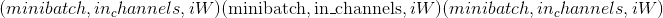的输入张量

*   **重量** –形状为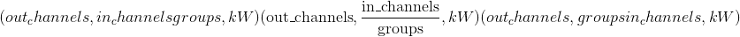的过滤器

*   **偏差**-形状的可选偏差。 默认值：`None`

*   **步幅** –卷积内核的步幅。 可以是一个整数或一个元素的元组&lt;cite&gt;(sW，）&lt;/cite&gt;。 默认值：1

*   **填充** –输入两侧的隐式填充。 可以是一个整数或一个元素的元组&lt;cite&gt;(padW，）&lt;/cite&gt;。 默认值：0

*   **膨胀** –内核元素之间的间距。 可以是一个整数或一个元素的元组&lt;cite&gt;(dW，）&lt;/cite&gt;。 默认值：1

*   **组** –将输入分成组，应该可被组数整除。 默认值：1

例子：

```
>>> filters = torch.randn(33, 16, 3)
>>> inputs = torch.randn(20, 16, 50)
>>> F.conv1d(inputs, filters)

```

### 转换 2d

* * *

```
torch.nn.functional.conv2d(input, weight, bias=None, stride=1, padding=0, dilation=1, groups=1) → Tensor¶
```

在由多个输入平面组成的输入图像上应用 2D 卷积。

有关详细信息和输出形状，请参见 [`Conv2d`](nn.html#torch.nn.Conv2d "torch.nn.Conv2d") 。

Note

In some circumstances when using the CUDA backend with CuDNN, this operator may select a nondeterministic algorithm to increase performance. If this is undesirable, you can try to make the operation deterministic (potentially at a performance cost) by setting `torch.backends.cudnn.deterministic = True`. Please see the notes on [Reproducibility](notes/randomness.html) for background.

Parameters

*   **输入** –形状为的输入张量

*   **重量** –形状为的过滤器

*   **偏差**-形状的可选偏差张量。 默认值：`None`

*   **步幅** –卷积内核的步幅。 可以是单个数字或元组&lt;cite&gt;(sH，sW）&lt;/cite&gt;。 默认值：1

*   **填充** –输入两侧的隐式填充。 可以是单个数字或元组&lt;cite&gt;(padH，padW）&lt;/cite&gt;。 默认值：0

*   **膨胀** –内核元素之间的间距。 可以是单个数字或元组&lt;cite&gt;(dH，dW）&lt;/cite&gt;。 默认值：1

*   **组** –将输入分成组，应该可被组数整除。 默认值：1

Examples:

```
>>> # With square kernels and equal stride
>>> filters = torch.randn(8,4,3,3)
>>> inputs = torch.randn(1,4,5,5)
>>> F.conv2d(inputs, filters, padding=1)

```

### conv3d

* * *

```
torch.nn.functional.conv3d(input, weight, bias=None, stride=1, padding=0, dilation=1, groups=1) → Tensor¶
```

在由多个输入平面组成的输入图像上应用 3D 卷积。

有关详细信息和输出形状，请参见 [`Conv3d`](nn.html#torch.nn.Conv3d "torch.nn.Conv3d") 。

Note

In some circumstances when using the CUDA backend with CuDNN, this operator may select a nondeterministic algorithm to increase performance. If this is undesirable, you can try to make the operation deterministic (potentially at a performance cost) by setting `torch.backends.cudnn.deterministic = True`. Please see the notes on [Reproducibility](notes/randomness.html) for background.

Parameters

*   **输入** –形状为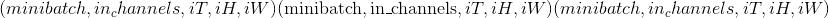的输入张量

*   **重量** –形状为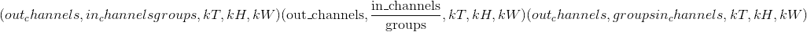的过滤器

*   **偏置**-形状为的可选偏置张量。 默认值：无

*   **步幅** –卷积内核的步幅。 可以是单个数字或元组&lt;cite&gt;(sT，sH，sW）&lt;/cite&gt;。 默认值：1

*   **填充** –输入两侧的隐式填充。 可以是单个数字或元组&lt;cite&gt;(padT，padH，padW）&lt;/cite&gt;。 默认值：0

*   **膨胀** –内核元素之间的间距。 可以是单个数字或元组&lt;cite&gt;(dT，dH，dW）&lt;/cite&gt;。 默认值：1

*   **groups** – split input into groups,  should be divisible by the number of groups. Default: 1

Examples:

```
>>> filters = torch.randn(33, 16, 3, 3, 3)
>>> inputs = torch.randn(20, 16, 50, 10, 20)
>>> F.conv3d(inputs, filters)

```

### conv_transpose1d

* * *

```
torch.nn.functional.conv_transpose1d(input, weight, bias=None, stride=1, padding=0, output_padding=0, groups=1, dilation=1) → Tensor¶
```

在由几个输入平面组成的输入信号上应用一维转置卷积运算符，有时也称为“反卷积”。

有关详细信息和输出形状，请参见 [`ConvTranspose1d`](nn.html#torch.nn.ConvTranspose1d "torch.nn.ConvTranspose1d") 。

Note

In some circumstances when using the CUDA backend with CuDNN, this operator may select a nondeterministic algorithm to increase performance. If this is undesirable, you can try to make the operation deterministic (potentially at a performance cost) by setting `torch.backends.cudnn.deterministic = True`. Please see the notes on [Reproducibility](notes/randomness.html) for background.

Parameters

*   **input** – input tensor of shape 

*   **重量** –形状为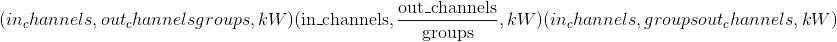的过滤器

*   **偏差**-形状的可选偏差。 默认值：无

*   **步幅** –旋转内核的步幅。 可以是单个数字或元组`(sW,)`。 默认值：1

*   **填充** – `dilation * (kernel_size - 1) - padding`零填充将添加到输入中每个尺寸的两侧。 可以是单个数字或元组`(padW,)`。 默认值：0

*   **output_padding** –在输出形状的每个尺寸的一侧添加了附加尺寸。 可以是单个数字或元组`(out_padW)`。 默认值：0

*   **groups** – split input into groups,  should be divisible by the number of groups. Default: 1

*   **膨胀** –内核元素之间的间距。 可以是单个数字或元组`(dW,)`。 默认值：1

Examples:

```
>>> inputs = torch.randn(20, 16, 50)
>>> weights = torch.randn(16, 33, 5)
>>> F.conv_transpose1d(inputs, weights)

```

### conv_transpose2d

* * *

```
torch.nn.functional.conv_transpose2d(input, weight, bias=None, stride=1, padding=0, output_padding=0, groups=1, dilation=1) → Tensor¶
```

在由多个输入平面组成的输入图像上应用二维转置卷积运算符，有时也称为“反卷积”。

有关详细信息和输出形状，请参见 [`ConvTranspose2d`](nn.html#torch.nn.ConvTranspose2d "torch.nn.ConvTranspose2d") 。

Note

In some circumstances when using the CUDA backend with CuDNN, this operator may select a nondeterministic algorithm to increase performance. If this is undesirable, you can try to make the operation deterministic (potentially at a performance cost) by setting `torch.backends.cudnn.deterministic = True`. Please see the notes on [Reproducibility](notes/randomness.html) for background.

Parameters

*   **input** – input tensor of shape 

*   **重量** –形状为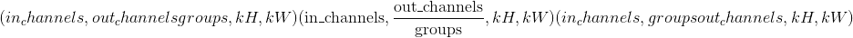的过滤器

*   **bias** – optional bias of shape . Default: None

*   **步幅** –旋转内核的步幅。 可以是单个数字或元组`(sH, sW)`。 默认值：1

*   **填充** – `dilation * (kernel_size - 1) - padding`零填充将添加到输入中每个尺寸的两侧。 可以是单个数字或元组`(padH, padW)`。 默认值：0

*   **output_padding** –在输出形状的每个尺寸的一侧添加了附加尺寸。 可以是单个数字或元组`(out_padH, out_padW)`。 默认值：0

*   **groups** – split input into groups,  should be divisible by the number of groups. Default: 1

*   **膨胀** –内核元素之间的间距。 可以是单个数字或元组`(dH, dW)`。 默认值：1

Examples:

```
>>> # With square kernels and equal stride
>>> inputs = torch.randn(1, 4, 5, 5)
>>> weights = torch.randn(4, 8, 3, 3)
>>> F.conv_transpose2d(inputs, weights, padding=1)

```

### conv_transpose3d

* * *

```
torch.nn.functional.conv_transpose3d(input, weight, bias=None, stride=1, padding=0, output_padding=0, groups=1, dilation=1) → Tensor¶
```

在由多个输入平面组成的输入图像上应用 3D 转置卷积运算符，有时也称为“反卷积”

有关详细信息和输出形状，请参见 [`ConvTranspose3d`](nn.html#torch.nn.ConvTranspose3d "torch.nn.ConvTranspose3d") 。

Note

In some circumstances when using the CUDA backend with CuDNN, this operator may select a nondeterministic algorithm to increase performance. If this is undesirable, you can try to make the operation deterministic (potentially at a performance cost) by setting `torch.backends.cudnn.deterministic = True`. Please see the notes on [Reproducibility](notes/randomness.html) for background.

Parameters

*   **input** – input tensor of shape 

*   **重量** –形状为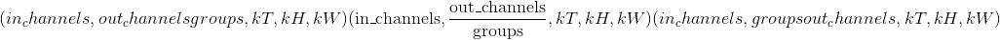的过滤器

*   **bias** – optional bias of shape . Default: None

*   **步幅** –旋转内核的步幅。 可以是单个数字或元组`(sT, sH, sW)`。 默认值：1

*   **填充** – `dilation * (kernel_size - 1) - padding`零填充将添加到输入中每个尺寸的两侧。 可以是单个数字或元组`(padT, padH, padW)`。 默认值：0

*   **output_padding** –在输出形状的每个尺寸的一侧添加了附加尺寸。 可以是单个数字或元组`(out_padT, out_padH, out_padW)`。 默认值：0

*   **groups** – split input into groups,  should be divisible by the number of groups. Default: 1

*   **dilation** – the spacing between kernel elements. Can be a single number or a tuple &lt;cite&gt;(dT, dH, dW)&lt;/cite&gt;. Default: 1

Examples:

```
>>> inputs = torch.randn(20, 16, 50, 10, 20)
>>> weights = torch.randn(16, 33, 3, 3, 3)
>>> F.conv_transpose3d(inputs, weights)

```

### 展开

* * *

```
torch.nn.functional.unfold(input, kernel_size, dilation=1, padding=0, stride=1)¶
```

从批处理输入张量中提取滑动局部块。

警告

当前，仅支持 4D 输入张量(像图像一样的批状张量）。

Warning

展开张量中的一个以上元素可以引用单个存储位置。 结果，就地操作(尤其是矢量化的操作）可能会导致错误的行为。 如果您需要写张量，请先克隆它。

有关详细信息，请参见 [`torch.nn.Unfold`](nn.html#torch.nn.Unfold "torch.nn.Unfold")

### 折

* * *

```
torch.nn.functional.fold(input, output_size, kernel_size, dilation=1, padding=0, stride=1)¶
```

将一系列滑动局部块组合成一个大型的张量。

Warning

当前，仅支持 4D 输出张量(像图像一样的批状张量）。

有关详细信息，请参见 [`torch.nn.Fold`](nn.html#torch.nn.Fold "torch.nn.Fold")

## 池化功能

### avg_pool1d

* * *

```
torch.nn.functional.avg_pool1d(input, kernel_size, stride=None, padding=0, ceil_mode=False, count_include_pad=True) → Tensor¶
```

在由多个输入平面组成的输入信号上应用一维平均池。

有关详细信息和输出形状，请参见 [`AvgPool1d`](nn.html#torch.nn.AvgPool1d "torch.nn.AvgPool1d") 。

Parameters

*   **input** – input tensor of shape 

*   **kernel_size** –窗口的大小。 可以是单个数字或元组&lt;cite&gt;(kW，）&lt;/cite&gt;

*   **步幅** –窗口的步幅。 可以是单个数字或元组&lt;cite&gt;(sW，）&lt;/cite&gt;。 默认值：`kernel_size`

*   **填充** –输入两侧的隐式零填充。 可以是单个数字或元组&lt;cite&gt;(padW，）&lt;/cite&gt;。 默认值：0

*   **ceil_mode** –为 True 时，将使用 &lt;cite&gt;ceil&lt;/cite&gt; 代替 &lt;cite&gt;floor&lt;/cite&gt; 计算输出形状。 默认值：`False`

*   **count_include_pad** –为 True 时，将在平均计算中包括零填充。 默认值：`True`

Examples:

```
>>> # pool of square window of size=3, stride=2
>>> input = torch.tensor([[[1, 2, 3, 4, 5, 6, 7]]], dtype=torch.float32)
>>> F.avg_pool1d(input, kernel_size=3, stride=2)
tensor([[[ 2.,  4.,  6.]]])

```

### avg_pool2d

* * *

```
torch.nn.functional.avg_pool2d(input, kernel_size, stride=None, padding=0, ceil_mode=False, count_include_pad=True, divisor_override=None) → Tensor¶
```

以步长步长在区域中应用 2D 平均合并操作。 输出要素的数量等于输入平面的数量。

有关详细信息和输出形状，请参见 [`AvgPool2d`](nn.html#torch.nn.AvgPool2d "torch.nn.AvgPool2d") 。

Parameters

*   **输入** –输入张量

*   **kernel_size** –池区域的大小。 可以是单个数字或元组&lt;cite&gt;(kH，kW）&lt;/cite&gt;

*   **跨度** –合并操作的跨度。 可以是单个数字或元组&lt;cite&gt;(sH，sW）&lt;/cite&gt;。 默认值：`kernel_size`

*   **填充** –输入两侧的隐式零填充。 可以是单个数字或元组&lt;cite&gt;(padH，padW）&lt;/cite&gt;。 默认值：0

*   **ceil_mode** –为 True 时，将在公式中使用 &lt;cite&gt;ceil&lt;/cite&gt; 而不是 &lt;cite&gt;floor&lt;/cite&gt; 计算输出形状。 默认值：`False`

*   **count_include_pad** – when True, will include the zero-padding in the averaging calculation. Default: `True`

*   **divisor_override** –如果指定，它将用作除数，否则将使用池化区域的大小。 默认值：无

### avg_pool3d

* * *

```
torch.nn.functional.avg_pool3d(input, kernel_size, stride=None, padding=0, ceil_mode=False, count_include_pad=True, divisor_override=None) → Tensor¶
```

以步长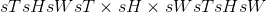步长在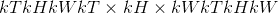区域中应用 3D 平均合并操作。 输出特征的数量等于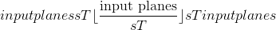。

有关详细信息和输出形状，请参见 [`AvgPool3d`](nn.html#torch.nn.AvgPool3d "torch.nn.AvgPool3d") 。

Parameters

*   **输入** –输入张量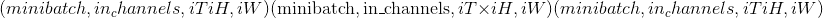

*   **kernel_size** –池区域的大小。 可以是单个数字或元组&lt;cite&gt;(kT，kH，kW）&lt;/cite&gt;

*   **跨度** –合并操作的跨度。 可以是单个数字或元组&lt;cite&gt;(sT，sH，sW）&lt;/cite&gt;。 默认值：`kernel_size`

*   **填充** –输入两侧的隐式零填充。 可以是单个数字或元组&lt;cite&gt;(padT，padH，padW）&lt;/cite&gt;，默认值：0

*   **ceil_mode** –为 True 时，将在公式中使用 &lt;cite&gt;ceil&lt;/cite&gt; 代替 &lt;cite&gt;floor&lt;/cite&gt; 来计算输出形状

*   **count_include_pad** –为 True 时，将在平均计算中包括零填充

*   **divisor_override** – if specified, it will be used as divisor, otherwise size of the pooling region will be used. Default: None

### max_pool1d

* * *

```
torch.nn.functional.max_pool1d(*args, **kwargs)¶
```

在由多个输入平面组成的输入信号上应用一维最大池化。

有关详细信息，请参见 [`MaxPool1d`](nn.html#torch.nn.MaxPool1d "torch.nn.MaxPool1d") 。

### max_pool2d

* * *

```
torch.nn.functional.max_pool2d(*args, **kwargs)¶
```

在由多个输入平面组成的输入信号上应用 2D 最大合并。

有关详细信息，请参见 [`MaxPool2d`](nn.html#torch.nn.MaxPool2d "torch.nn.MaxPool2d") 。

### max_pool3d

* * *

```
torch.nn.functional.max_pool3d(*args, **kwargs)¶
```

在由多个输入平面组成的输入信号上应用 3D 最大池化。

有关详细信息，请参见 [`MaxPool3d`](nn.html#torch.nn.MaxPool3d "torch.nn.MaxPool3d") 。

### max_unpool1d

* * *

```
torch.nn.functional.max_unpool1d(input, indices, kernel_size, stride=None, padding=0, output_size=None)¶
```

计算`MaxPool1d`的部分逆。

有关详细信息，请参见 [`MaxUnpool1d`](nn.html#torch.nn.MaxUnpool1d "torch.nn.MaxUnpool1d") 。

### max_unpool2d

* * *

```
torch.nn.functional.max_unpool2d(input, indices, kernel_size, stride=None, padding=0, output_size=None)¶
```

计算`MaxPool2d`的部分逆。

有关详细信息，请参见 [`MaxUnpool2d`](nn.html#torch.nn.MaxUnpool2d "torch.nn.MaxUnpool2d") 。

### max_unpool3d

* * *

```
torch.nn.functional.max_unpool3d(input, indices, kernel_size, stride=None, padding=0, output_size=None)¶
```

计算`MaxPool3d`的部分逆。

有关详细信息，请参见 [`MaxUnpool3d`](nn.html#torch.nn.MaxUnpool3d "torch.nn.MaxUnpool3d") 。

### lp_pool1d

* * *

```
torch.nn.functional.lp_pool1d(input, norm_type, kernel_size, stride=None, ceil_mode=False)¶
```

在由多个输入平面组成的输入信号上应用一维功率平均池。 如果 &lt;cite&gt;p&lt;/cite&gt; 的所有输入的总和为零，则梯度也设置为零。

有关详细信息，请参见 [`LPPool1d`](nn.html#torch.nn.LPPool1d "torch.nn.LPPool1d") 。

### lp_pool2d

* * *

```
torch.nn.functional.lp_pool2d(input, norm_type, kernel_size, stride=None, ceil_mode=False)¶
```

在由多个输入平面组成的输入信号上应用 2D 功率平均池。 如果 &lt;cite&gt;p&lt;/cite&gt; 的所有输入的总和为零，则梯度也设置为零。

有关详细信息，请参见 [`LPPool2d`](nn.html#torch.nn.LPPool2d "torch.nn.LPPool2d") 。

### adaptive_max_pool1d

* * *

```
torch.nn.functional.adaptive_max_pool1d(*args, **kwargs)¶
```

在由多个输入平面组成的输入信号上应用一维自适应最大池化。

有关详细信息和输出形状，请参见 [`AdaptiveMaxPool1d`](nn.html#torch.nn.AdaptiveMaxPool1d "torch.nn.AdaptiveMaxPool1d") 。

Parameters

*   **output_size** –目标输出大小(单个整数）

*   **return_indices** –是否返回池索引。 默认值：`False`

### adaptive_max_pool2d

* * *

```
torch.nn.functional.adaptive_max_pool2d(*args, **kwargs)¶
```

在由多个输入平面组成的输入信号上应用 2D 自适应最大池化。

有关详细信息和输出形状，请参见 [`AdaptiveMaxPool2d`](nn.html#torch.nn.AdaptiveMaxPool2d "torch.nn.AdaptiveMaxPool2d") 。

Parameters

*   **output_size** –目标输出大小(单整数或双整数元组）

*   **return_indices** – whether to return pooling indices. Default: `False`

### adaptive_max_pool3d

* * *

```
torch.nn.functional.adaptive_max_pool3d(*args, **kwargs)¶
```

在由多个输入平面组成的输入信号上应用 3D 自适应最大池化。

有关详细信息和输出形状，请参见 [`AdaptiveMaxPool3d`](nn.html#torch.nn.AdaptiveMaxPool3d "torch.nn.AdaptiveMaxPool3d") 。

Parameters

*   **output_size** –目标输出大小(单整数或三整数元组）

*   **return_indices** – whether to return pooling indices. Default: `False`

### adaptive_avg_pool1d

* * *

```
torch.nn.functional.adaptive_avg_pool1d(input, output_size) → Tensor¶
```

在由多个输入平面组成的输入信号上应用一维自适应平均池。

有关详细信息和输出形状，请参见 [`AdaptiveAvgPool1d`](nn.html#torch.nn.AdaptiveAvgPool1d "torch.nn.AdaptiveAvgPool1d") 。

Parameters

**output_size** – the target output size (single integer)

### adaptive_avg_pool2d

* * *

```
torch.nn.functional.adaptive_avg_pool2d(input, output_size)¶
```

在由多个输入平面组成的输入信号上应用 2D 自适应平均池。

有关详细信息和输出形状，请参见 [`AdaptiveAvgPool2d`](nn.html#torch.nn.AdaptiveAvgPool2d "torch.nn.AdaptiveAvgPool2d") 。

Parameters

**output_size** – the target output size (single integer or double-integer tuple)

### adaptive_avg_pool3d

* * *

```
torch.nn.functional.adaptive_avg_pool3d(input, output_size)¶
```

在由多个输入平面组成的输入信号上应用 3D 自适应平均池。

有关详细信息和输出形状，请参见 [`AdaptiveAvgPool3d`](nn.html#torch.nn.AdaptiveAvgPool3d "torch.nn.AdaptiveAvgPool3d") 。

Parameters

**output_size** – the target output size (single integer or triple-integer tuple)

## 非线性激活功能

### 阈

* * *

```
torch.nn.functional.threshold(input, threshold, value, inplace=False)¶
```

设置输入张量的每个元素的阈值。

有关更多详细信息，请参见 [`Threshold`](nn.html#torch.nn.Threshold "torch.nn.Threshold") 。

* * *

```
torch.nn.functional.threshold_(input, threshold, value) → Tensor¶
```

[`threshold()`](#torch.nn.functional.threshold "torch.nn.functional.threshold") 的就地版本。

### 露露

* * *

```
torch.nn.functional.relu(input, inplace=False) → Tensor¶
```

按元素应用整流线性单位函数。 有关更多详细信息，请参见 [`ReLU`](nn.html#torch.nn.ReLU "torch.nn.ReLU") 。

* * *

```
torch.nn.functional.relu_(input) → Tensor¶
```

[`relu()`](#torch.nn.functional.relu "torch.nn.functional.relu") 的就地版本。

### Hardtanh

* * *

```
torch.nn.functional.hardtanh(input, min_val=-1., max_val=1., inplace=False) → Tensor¶
```

逐个应用 HardTanh 函数。 有关更多详细信息，请参见 [`Hardtanh`](nn.html#torch.nn.Hardtanh "torch.nn.Hardtanh") 。

* * *

```
torch.nn.functional.hardtanh_(input, min_val=-1., max_val=1.) → Tensor¶
```

[`hardtanh()`](#torch.nn.functional.hardtanh "torch.nn.functional.hardtanh") 的就地版本。

### relu6

* * *

```
torch.nn.functional.relu6(input, inplace=False) → Tensor¶
```

应用逐元素函数。

有关更多详细信息，请参见 [`ReLU6`](nn.html#torch.nn.ReLU6 "torch.nn.ReLU6") 。

### lu

* * *

```
torch.nn.functional.elu(input, alpha=1.0, inplace=False)¶
```

按元素应用。

有关更多详细信息，请参见 [`ELU`](nn.html#torch.nn.ELU "torch.nn.ELU") 。

* * *

```
torch.nn.functional.elu_(input, alpha=1.) → Tensor¶
```

[`elu()`](#torch.nn.functional.elu "torch.nn.functional.elu") 的就地版本。

### 塞卢

* * *

```
torch.nn.functional.selu(input, inplace=False) → Tensor¶
```

将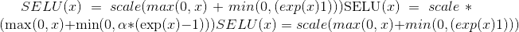与和逐元素应用。

有关更多详细信息，请参见 [`SELU`](nn.html#torch.nn.SELU "torch.nn.SELU") 。

### 塞卢

* * *

```
torch.nn.functional.celu(input, alpha=1., inplace=False) → Tensor¶
```

按元素应用。

有关更多详细信息，请参见 [`CELU`](nn.html#torch.nn.CELU "torch.nn.CELU") 。

### leaky_relu

* * *

```
torch.nn.functional.leaky_relu(input, negative_slope=0.01, inplace=False) → Tensor¶
```

按元素应用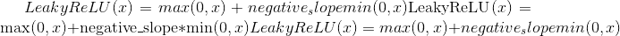

有关更多详细信息，请参见 [`LeakyReLU`](nn.html#torch.nn.LeakyReLU "torch.nn.LeakyReLU") 。

* * *

```
torch.nn.functional.leaky_relu_(input, negative_slope=0.01) → Tensor¶
```

[`leaky_relu()`](#torch.nn.functional.leaky_relu "torch.nn.functional.leaky_relu") 的就地版本。

### 前路

* * *

```
torch.nn.functional.prelu(input, weight) → Tensor¶
```

逐个应用功能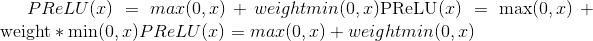，其中权重是可学习的参数。

有关更多详细信息，请参见 [`PReLU`](nn.html#torch.nn.PReLU "torch.nn.PReLU") 。

### 雷雷鲁

* * *

```
torch.nn.functional.rrelu(input, lower=1./8, upper=1./3, training=False, inplace=False) → Tensor¶
```

随机泄漏的 ReLU。

有关更多详细信息，请参见 [`RReLU`](nn.html#torch.nn.RReLU "torch.nn.RReLU") 。

* * *

```
torch.nn.functional.rrelu_(input, lower=1./8, upper=1./3, training=False) → Tensor¶
```

[`rrelu()`](#torch.nn.functional.rrelu "torch.nn.functional.rrelu") 的就地版本。

### 谷氨酸

* * *

```
torch.nn.functional.glu(input, dim=-1) → Tensor¶
```

门控线性单元。 计算：

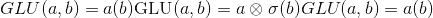

其中&lt;cite&gt;输入&lt;/cite&gt;沿&lt;cite&gt;暗淡&lt;/cite&gt;分成两半，形成 &lt;cite&gt;a&lt;/cite&gt; 和 &lt;cite&gt;b&lt;/cite&gt; ，是 S 型函数，是 矩阵之间的按元素乘积。

请参阅[带门控卷积网络的语言建模](https://arxiv.org/abs/1612.08083)。

Parameters

*   **输入** ([_tensor_](tensors.html#torch.Tensor "torch.Tensor"))–输入张量

*   **暗淡的** (_python：int_ )–分割输入的维度。 默认值：-1

### 格鲁

* * *

```
torch.nn.functional.gelu(input) → Tensor¶
```

逐元素应用功能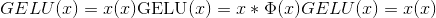

其中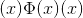是高斯分布的累积分布函数。

请参见[高斯误差线性单位(GELU）](https://arxiv.org/abs/1606.08415)。

### 对数乙状结肠

* * *

```
torch.nn.functional.logsigmoid(input) → Tensor¶
```

按元素应用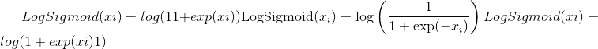

有关更多详细信息，请参见 [`LogSigmoid`](nn.html#torch.nn.LogSigmoid "torch.nn.LogSigmoid") 。

### 硬缩

* * *

```
torch.nn.functional.hardshrink(input, lambd=0.5) → Tensor¶
```

逐个应用硬收缩功能

有关更多详细信息，请参见 [`Hardshrink`](nn.html#torch.nn.Hardshrink "torch.nn.Hardshrink") 。

### tanhshrink

* * *

```
torch.nn.functional.tanhshrink(input) → Tensor¶
```

按元素应用

有关更多详细信息，请参见 [`Tanhshrink`](nn.html#torch.nn.Tanhshrink "torch.nn.Tanhshrink") 。

### 软签

* * *

```
torch.nn.functional.softsign(input) → Tensor¶
```

按元素应用功能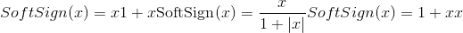

有关更多详细信息，请参见 [`Softsign`](nn.html#torch.nn.Softsign "torch.nn.Softsign") 。

### 软加

* * *

```
torch.nn.functional.softplus(input, beta=1, threshold=20) → Tensor¶
```

### 软敏

* * *

```
torch.nn.functional.softmin(input, dim=None, _stacklevel=3, dtype=None)¶
```

应用 softmin 函数。

注意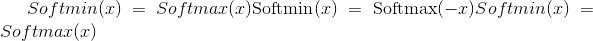。 有关数学公式，请参见 softmax 定义。

有关更多详细信息，请参见 [`Softmin`](nn.html#torch.nn.Softmin "torch.nn.Softmin") 。

Parameters

*   **输入** ([_tensor_](tensors.html#torch.Tensor "torch.Tensor"))–输入

*   **dim**  (_python：int_ )–将计算 softmin 的维度(因此，沿着 dim 的每个切片的总和为 1）。

*   **dtype** (`torch.dtype`，可选）–返回张量的所需数据类型。 如果指定，则在执行操作之前将输入张量转换为`dtype`。 这对于防止数据类型溢出很有用。 默认值：无。

### 软最大

* * *

```
torch.nn.functional.softmax(input, dim=None, _stacklevel=3, dtype=None)¶
```

应用 softmax 函数。

Softmax 定义为：

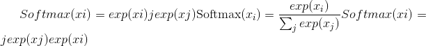

它将沿着暗淡应用于所有切片，并将对其进行重新缩放，以使元素位于 &lt;cite&gt;[0，1]&lt;/cite&gt; 范围内，总和为 1。

有关更多详细信息，请参见 [`Softmax`](nn.html#torch.nn.Softmax "torch.nn.Softmax") 。

Parameters

*   **input** ([_Tensor_](tensors.html#torch.Tensor "torch.Tensor")) – input

*   **暗淡的** (_python：int_ )–将沿着其计算 softmax 的尺寸。

*   **dtype** (`torch.dtype`, optional) – the desired data type of returned tensor. If specified, the input tensor is casted to `dtype` before the operation is performed. This is useful for preventing data type overflows. Default: None.

Note

此函数不能直接与 NLLLoss 一起使用，后者希望 Log 是在 Softmax 及其自身之间计算的。 请改用 log_softmax(速度更快，并且具有更好的数值属性）。

### 软缩

* * *

```
torch.nn.functional.softshrink(input, lambd=0.5) → Tensor¶
```

逐个应用软收缩功能

有关更多详细信息，请参见 [`Softshrink`](nn.html#torch.nn.Softshrink "torch.nn.Softshrink") 。

### gumbel_softmax

* * *

```
torch.nn.functional.gumbel_softmax(logits, tau=1, hard=False, eps=1e-10, dim=-1)¶
```

来自 Gumbel-Softmax 分布的样本([链接 1](https://arxiv.org/abs/1611.00712) [链接 2](https://arxiv.org/abs/1611.01144))，并且可以离散化。

Parameters

*   **logits** – &lt;cite&gt;[…，num_features]&lt;/cite&gt; 未标准化的日志概率

*   **tau** –非负标量温度

*   **硬性** –如果`True`，返回的样本将被离散为一热向量，但将被区分为好像是 autograd 中的软样本

*   **暗淡的** (_python：int_ )–将沿着其计算 softmax 的尺寸。 默认值：-1。

退货

Gumbel-Softmax 分布中与&lt;cite&gt;形状相同的采样张量对数为&lt;/cite&gt;。 如果`hard=True`，则返回的样本将是一个热点，否则它们将是在 &lt;cite&gt;dim&lt;/cite&gt; 上总计为 1 的概率分布。

Note

此函数是出于遗留原因而存在，将来可能会从 nn.Functional 中删除。

Note

&lt;cite&gt;硬性&lt;/cite&gt;的主要技巧是执行 &lt;cite&gt;y_hard-y_soft.detach(）+ y_soft&lt;/cite&gt;

它实现了两件事：-使输出值恰好为一热(因为我们先加然后减去 y_soft 值）-使梯度等于 y_soft 梯度(因为我们剥离所有其他梯度）

```
Examples::
```

```
>>> logits = torch.randn(20, 32)
>>> # Sample soft categorical using reparametrization trick:
>>> F.gumbel_softmax(logits, tau=1, hard=False)
>>> # Sample hard categorical using "Straight-through" trick:
>>> F.gumbel_softmax(logits, tau=1, hard=True)

```

### log_softmax

* * *

```
torch.nn.functional.log_softmax(input, dim=None, _stacklevel=3, dtype=None)¶
```

应用 softmax，后跟对数。

虽然在数学上等效于 log(softmax(x）），但是分别执行这两个操作比较慢，并且在数值上不稳定。 此函数使用替代公式来正确计算输出和渐变。

有关更多详细信息，请参见 [`LogSoftmax`](nn.html#torch.nn.LogSoftmax "torch.nn.LogSoftmax") 。

Parameters

*   **input** ([_Tensor_](tensors.html#torch.Tensor "torch.Tensor")) – input

*   **暗淡的** (_python：int_ )–将沿 log_softmax 计算的维。

*   **dtype** (`torch.dtype`, optional) – the desired data type of returned tensor. If specified, the input tensor is casted to `dtype` before the operation is performed. This is useful for preventing data type overflows. Default: None.

### 谭

* * *

```
torch.nn.functional.tanh(input) → Tensor¶
```

按元素应用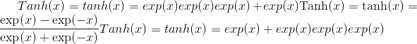

有关更多详细信息，请参见 [`Tanh`](nn.html#torch.nn.Tanh "torch.nn.Tanh") 。

### 乙状结肠

* * *

```
torch.nn.functional.sigmoid(input) → Tensor¶
```

应用逐元素函数

有关更多详细信息，请参见 [`Sigmoid`](nn.html#torch.nn.Sigmoid "torch.nn.Sigmoid") 。

## 归一化功能

### batch_norm

* * *

```
torch.nn.functional.batch_norm(input, running_mean, running_var, weight=None, bias=None, training=False, momentum=0.1, eps=1e-05)¶
```

对一批数据中的每个通道应用批标准化。

有关详细信息，请参见 [`BatchNorm1d`](nn.html#torch.nn.BatchNorm1d "torch.nn.BatchNorm1d") ， [`BatchNorm2d`](nn.html#torch.nn.BatchNorm2d "torch.nn.BatchNorm2d") ， [`BatchNorm3d`](nn.html#torch.nn.BatchNorm3d "torch.nn.BatchNorm3d") 。

### instance_norm

* * *

```
torch.nn.functional.instance_norm(input, running_mean=None, running_var=None, weight=None, bias=None, use_input_stats=True, momentum=0.1, eps=1e-05)¶
```

批量对每个数据样本中的每个通道应用实例归一化。

有关详细信息，请参见 [`InstanceNorm1d`](nn.html#torch.nn.InstanceNorm1d "torch.nn.InstanceNorm1d") ， [`InstanceNorm2d`](nn.html#torch.nn.InstanceNorm2d "torch.nn.InstanceNorm2d") ， [`InstanceNorm3d`](nn.html#torch.nn.InstanceNorm3d "torch.nn.InstanceNorm3d") 。

### layer_norm

* * *

```
torch.nn.functional.layer_norm(input, normalized_shape, weight=None, bias=None, eps=1e-05)¶
```

将图层归一化应用于最后一定数量的尺寸。

有关详细信息，请参见 [`LayerNorm`](nn.html#torch.nn.LayerNorm "torch.nn.LayerNorm") 。

### local_response_norm

* * *

```
torch.nn.functional.local_response_norm(input, size, alpha=0.0001, beta=0.75, k=1.0)¶
```

在由多个输入平面组成的输入信号上应用本地响应归一化，其中通道占据第二维。 跨通道应用标准化。

有关详细信息，请参见 [`LocalResponseNorm`](nn.html#torch.nn.LocalResponseNorm "torch.nn.LocalResponseNorm") 。

### 归一化

* * *

```
torch.nn.functional.normalize(input, p=2, dim=1, eps=1e-12, out=None)¶
```

对指定尺寸的输入执行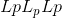归一化。

对于大小为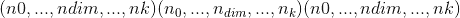的张量`input`，沿维度`dim`的每个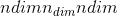-元素矢量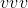都将转换为


使用默认参数时，它将沿向量的矢量使用欧几里得范数进行归一化。

Parameters

*   **输入** –任何形状的输入张量

*   **p**  (_python：float_ )–规范制定中的指数值。 默认值：2

*   **暗淡的** (_python：int_ )–缩小的尺寸。 默认值：1

*   **eps**  (_python：float_ )–避免被零除的较小值。 默认值：1e-12

*   **输出** ([_tensor_](tensors.html#torch.Tensor "torch.Tensor") _，_ _可选_）–输出张量。 如果使用`out`，则此操作将不可区分。

## 线性功能

### 线性的

* * *

```
torch.nn.functional.linear(input, weight, bias=None)¶
```

对输入数据应用线性变换：。

形状：

> *   输入：其中 &lt;cite&gt;*&lt;/cite&gt; 表示任意数量的附加尺寸
>     
>     
> *   重量：
>     
>     
> *   偏差：
>     
>     
> *   输出：

### 双线性

* * *

```
torch.nn.functional.bilinear(input1, input2, weight, bias=None)¶
```

对输入数据应用双线性变换：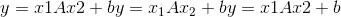

Shape:

> *   输入 1：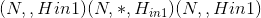，其中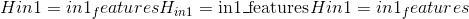和表示任意数量的附加尺寸。 除了最后输入的维度外，其他所有维度均应相同。
>     
>     
> *   输入 2：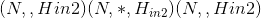，其中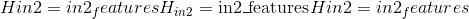
>     
>     
> *   重量：
>     
>     
> *   偏倚：
>     
>     
> *   输出：，其中和除最后一个尺寸外的所有尺寸都与输入相同。

## 辍学功能

### 退出

* * *

```
torch.nn.functional.dropout(input, p=0.5, training=True, inplace=False)¶
```

在训练期间，使用伯努利分布的样本以概率`p`将输入张量的某些元素随机归零。

有关详细信息，请参见 [`Dropout`](nn.html#torch.nn.Dropout "torch.nn.Dropout") 。

Parameters

*   **p** –元素归零的概率。 默认值：0.5

*   **训练** –如果为`True`，则申请辍学。 默认值：`True`

*   **就地** –如果设置为`True`，将就地执行此操作。 默认值：`False`

### alpha_dropout

* * *

```
torch.nn.functional.alpha_dropout(input, p=0.5, training=False, inplace=False)¶
```

将 Alpha 滤除应用于输入。

有关详细信息，请参见 [`AlphaDropout`](nn.html#torch.nn.AlphaDropout "torch.nn.AlphaDropout") 。

### dropout2d

* * *

```
torch.nn.functional.dropout2d(input, p=0.5, training=True, inplace=False)¶
```

将所有通道随机调零(通道是 2D 特征图，例如，批处理输入中第个样本的第个通道是 2D 张量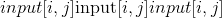）。 使用伯努利分布中的样本，每个信道将在每次前向呼叫中以概率`p`独立清零。

有关详细信息，请参见 [`Dropout2d`](nn.html#torch.nn.Dropout2d "torch.nn.Dropout2d") 。

Parameters

*   **p** –信道归零的概率。 默认值：0.5

*   **training** – apply dropout if is `True`. Default: `True`

*   **inplace** – If set to `True`, will do this operation in-place. Default: `False`

### dropout3d

* * *

```
torch.nn.functional.dropout3d(input, p=0.5, training=True, inplace=False)¶
```

将所有通道随机调零(通道是 3D 特征图，例如，批处理输入中第个样本的第个通道是 3D 张量）。 使用伯努利分布中的样本，每个信道将在每次前向呼叫中以概率`p`独立清零。

有关详细信息，请参见 [`Dropout3d`](nn.html#torch.nn.Dropout3d "torch.nn.Dropout3d") 。

Parameters

*   **p** – probability of a channel to be zeroed. Default: 0.5

*   **training** – apply dropout if is `True`. Default: `True`

*   **inplace** – If set to `True`, will do this operation in-place. Default: `False`

## 稀疏功能

### 嵌入

* * *

```
torch.nn.functional.embedding(input, weight, padding_idx=None, max_norm=None, norm_type=2.0, scale_grad_by_freq=False, sparse=False)¶
```

一个简单的查找表，用于以固定的字典和大小查找嵌入。

该模块通常用于使用索引检索单词嵌入。 模块的输入是索引列表和嵌入矩阵，而输出是相应的词嵌入。

有关更多详细信息，请参见 [`torch.nn.Embedding`](nn.html#torch.nn.Embedding "torch.nn.Embedding") 。

Parameters

*   **输入** (_LongTensor_ )–包含嵌入矩阵的索引的张量

*   **权重** ([_tensor_](tensors.html#torch.Tensor "torch.Tensor"))–行数等于最大可能索引+ 1，并且行数等于嵌入大小的嵌入矩阵

*   **padding_idx**  (_python：int_ _，_ _可选_）–如果给定，则在`padding_idx`处嵌入输出以填充输出(初始化为 零）。

*   **max_norm**  (_python：float_ _，_ _可选_）–如果给定，则范数大于`max_norm`的每个嵌入向量都将重新规范化为具有 规范`max_norm`。 注意：这将就地修改`weight`。

*   **norm_type**  (_python：float_ _，_ _可选_）–为`max_norm`选项计算的 p 范数的 p。 默认值`2`。

*   **scale_grad_by_freq** (_布尔值_ _，_ _可选_））–如果给定，则将按照最小 批量。 默认值`False`。

*   **稀疏** (_bool_ _，_ _可选_）–如果`True`，则梯度 w.r.t. `weight`将是一个稀疏张量。 有关稀疏梯度的更多详细信息，请参见 [`torch.nn.Embedding`](nn.html#torch.nn.Embedding "torch.nn.Embedding") 下的注释。

```
Shape:
```

*   输入：包含要提取的索引的任意形状的 LongTensor

*   ```
    Weight: Embedding matrix of floating point type with shape (V, embedding_dim),
    ```

    其中 V =最大索引+ 1，embedding_dim =嵌入大小

*   输出：&lt;cite&gt;(*，embedding_dim）&lt;/cite&gt;，其中 &lt;cite&gt;*&lt;/cite&gt; 是输入形状

Examples:

```
>>> # a batch of 2 samples of 4 indices each
>>> input = torch.tensor([[1,2,4,5],[4,3,2,9]])
>>> # an embedding matrix containing 10 tensors of size 3
>>> embedding_matrix = torch.rand(10, 3)
>>> F.embedding(input, embedding_matrix)
tensor([[[ 0.8490,  0.9625,  0.6753],
         [ 0.9666,  0.7761,  0.6108],
         [ 0.6246,  0.9751,  0.3618],
         [ 0.4161,  0.2419,  0.7383]],

        [[ 0.6246,  0.9751,  0.3618],
         [ 0.0237,  0.7794,  0.0528],
         [ 0.9666,  0.7761,  0.6108],
         [ 0.3385,  0.8612,  0.1867]]])

>>> # example with padding_idx
>>> weights = torch.rand(10, 3)
>>> weights[0, :].zero_()
>>> embedding_matrix = weights
>>> input = torch.tensor([[0,2,0,5]])
>>> F.embedding(input, embedding_matrix, padding_idx=0)
tensor([[[ 0.0000,  0.0000,  0.0000],
         [ 0.5609,  0.5384,  0.8720],
         [ 0.0000,  0.0000,  0.0000],
         [ 0.6262,  0.2438,  0.7471]]])

```

### embedding_bag

* * *

```
torch.nn.functional.embedding_bag(input, weight, offsets=None, max_norm=None, norm_type=2, scale_grad_by_freq=False, mode='mean', sparse=False, per_sample_weights=None)¶
```

在不实例化中间嵌入的情况下，计算嵌入的&lt;cite&gt;袋&lt;/cite&gt;的总和，平均值或最大值。

有关更多详细信息，请参见 [`torch.nn.EmbeddingBag`](nn.html#torch.nn.EmbeddingBag "torch.nn.EmbeddingBag") 。

Note

当使用 CUDA 后端时，此操作可能会在其向后传递中引起不确定的行为，这种行为很难关闭。 有关背景，请参见[重现性](notes/randomness.html)的注释。

Parameters

*   **输入** (_LongTensor_ )–将包含索引袋的张量放入嵌入矩阵

*   **weight** ([_Tensor_](tensors.html#torch.Tensor "torch.Tensor")) – The embedding matrix with number of rows equal to the maximum possible index + 1, and number of columns equal to the embedding size

*   **偏移量** (_LongTensor_ _，_ _可选_）–仅在`input`为 1D 时使用。 `offsets`确定`input`中每个袋子(序列）的起始索引位置。

*   **max_norm** (_python:float__,_ _optional_) – If given, each embedding vector with norm larger than `max_norm` is renormalized to have norm `max_norm`. Note: this will modify `weight` in-place.

*   **norm_type**  (_python：float_ _，_ _可选_）– `p` -norm 中的`p`用于计算`max_norm` ] 选项。 默认`2`。

*   **scale_grad_by_freq** (_布尔_ _，_ _可选_）–如果指定，则将按比例缩小坡度中单词的频率 批量。 默认值`False`。 注意：`mode="max"`时不支持此选项。

*   **模式**(_字符串_ _，_ _可选_）– `"sum"`，`"mean"`或`"max"`。 指定减少袋子的方式。 默认值：`"mean"`

*   **稀疏** (_bool_ _，_ _可选_）–如果`True`，则梯度为 w.r.t.。 `weight`将是一个稀疏张量。 有关稀疏渐变的更多详细信息，请参见 [`torch.nn.Embedding`](nn.html#torch.nn.Embedding "torch.nn.Embedding") 下的注释。 注意：`mode="max"`时不支持此选项。

*   **per_sample_weights**  ([_tensor_](tensors.html#torch.Tensor "torch.Tensor") _，_ _可选_）–浮点/双权重的张量，或无表示所有值 权重应取为 1。如果指定，则`per_sample_weights`的形状必须与输入的形状完全相同，并且如果不是[None]，则将其视为具有相同的`offsets`。

Shape:

> *   `input`(LongTensor）和`offsets`(LongTensor，可选）
>     
>     
>     *   如果`input`是形状为&lt;cite&gt;(B，N）&lt;/cite&gt;的二维，
>         
>         
>         
>         它将被视为`B`袋(序列），每个袋子的长度都是固定长度`N`，这将返回`B`值的汇总值取决于`mode`。 在这种情况下，`offsets`被忽略，必须为`None`。
>         
>         
>     *   如果`input`是形状为&lt;cite&gt;(N）&lt;/cite&gt;的 1D，
>         
>         
>         
>         它将被视为多个包(序列）的串联。 `offsets`必须是一维张量，其中包含`input`中每个包的起始索引位置。 因此，对于形状为&lt;cite&gt;(B）&lt;/cite&gt;的`offsets`，`input`将被视为具有`B`袋。 空袋子(即长度为 0 的袋子）将返回由零填充的向量。
>         
>         
> *   `weight`(张量）：形状为&lt;cite&gt;的模块的可学习权重(num_embeddings，embedding_dim）&lt;/cite&gt;
>     
>     
> *   `per_sample_weights`(张量，可选）。 具有与`input`相同的形状。
>     
>     
> *   `output`：形状为&lt;cite&gt;的汇总嵌入值(B，embedding_dim）&lt;/cite&gt;

Examples:

```
>>> # an Embedding module containing 10 tensors of size 3
>>> embedding_matrix = torch.rand(10, 3)
>>> # a batch of 2 samples of 4 indices each
>>> input = torch.tensor([1,2,4,5,4,3,2,9])
>>> offsets = torch.tensor([0,4])
>>> F.embedding_bag(embedding_matrix, input, offsets)
tensor([[ 0.3397,  0.3552,  0.5545],
        [ 0.5893,  0.4386,  0.5882]])

```

### one_hot

* * *

```
torch.nn.functional.one_hot(tensor, num_classes=-1) → LongTensor¶
```

接受具有形状为`(*)`的索引值的 LongTensor，并返回形状为`(*, num_classes)`的张量，该张量在所有地方都为零，除非最后一个维度的索引与输入张量的对应值匹配，在这种情况下它将为 1。

另请参阅[维基百科](https://en.wikipedia.org/wiki/One-hot)上的热门。

Parameters

*   **张量** (_LongTensor_ )–任何形状的类值。

*   **num_classes**  (_python：int_ )–类的总数。 如果设置为-1，则将类数推断为比输入张量中的最大类值大一。

Returns

LongTensor 具有一个维度，在输入指示的最后维度的索引处具有 1 个值，在其他地方均为 0。

例子

```
>>> F.one_hot(torch.arange(0, 5) % 3)
tensor([[1, 0, 0],
        [0, 1, 0],
        [0, 0, 1],
        [1, 0, 0],
        [0, 1, 0]])
>>> F.one_hot(torch.arange(0, 5) % 3, num_classes=5)
tensor([[1, 0, 0, 0, 0],
        [0, 1, 0, 0, 0],
        [0, 0, 1, 0, 0],
        [1, 0, 0, 0, 0],
        [0, 1, 0, 0, 0]])
>>> F.one_hot(torch.arange(0, 6).view(3,2) % 3)
tensor([[[1, 0, 0],
         [0, 1, 0]],
        [[0, 0, 1],
         [1, 0, 0]],
        [[0, 1, 0],
         [0, 0, 1]]])

```

## 距离功能

### pairwise_distance

* * *

```
torch.nn.functional.pairwise_distance(x1, x2, p=2.0, eps=1e-06, keepdim=False)¶
```

有关详细信息，请参见 [`torch.nn.PairwiseDistance`](nn.html#torch.nn.PairwiseDistance "torch.nn.PairwiseDistance")

### 余弦相似度

* * *

```
torch.nn.functional.cosine_similarity(x1, x2, dim=1, eps=1e-8) → Tensor¶
```

返回沿 dim 计算的 x1 和 x2 之间的余弦相似度。

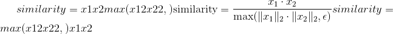

Parameters

*   **x1**  ([_tensor_](tensors.html#torch.Tensor "torch.Tensor"))–第一个输入。

*   **x2**  ([_tensor_](tensors.html#torch.Tensor "torch.Tensor"))–第二个输入(大小匹配 x1）。

*   **昏暗的** (_python：int_ _，_ _可选_）–向量的尺寸。 默认值：1

*   **eps**  (_python：float_ _，_ _可选_）–避免被零除的小值。 默认值：1e-8

```
Shape:
```

*   输入：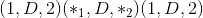其中 D 在位置&lt;cite&gt;变暗&lt;/cite&gt;处。

*   输出：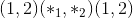其中 1 处于位置&lt;cite&gt;暗淡&lt;/cite&gt;。

例：

```
>>> input1 = torch.randn(100, 128)
>>> input2 = torch.randn(100, 128)
>>> output = F.cosine_similarity(input1, input2)
>>> print(output)

```

### pdist

* * *

```
torch.nn.functional.pdist(input, p=2) → Tensor¶
```

计算输入中每​​对行向量之间的 p 范数距离。 这与 &lt;cite&gt;torch.norm(input [:, None]-input，dim = 2，p = p）&lt;/cite&gt;的对角线之外的上三角部分相同。 如果行是连续的，此功能将更快。

如果输入的形状为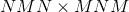，则输出的形状为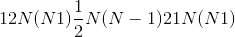。

如果，则此函数等效于 &lt;cite&gt;scipy.spatial.distance.pdist(input，'minkowski'，p = p）&lt;/cite&gt;。 当等于 &lt;cite&gt;scipy.spatial.distance.pdist(input，'hamming'）* M&lt;/cite&gt; 。 当时，最接近的 scipy 函数是 &lt;cite&gt;scipy.spatial.distance.pdist(xn，lambda x，y：np.abs(x-y）.max(））&lt;/cite&gt;。

Parameters

*   **输入**-形状为的输入张量。

*   **p** -p 范数距离的 p 值，以计算每个向量对之间的距离。

## 损失函数

### binary_cross_entropy

* * *

```
torch.nn.functional.binary_cross_entropy(input, target, weight=None, size_average=None, reduce=None, reduction='mean')¶
```

测量目标和输出之间的二进制交叉熵的函数。

有关详细信息，请参见 [`BCELoss`](nn.html#torch.nn.BCELoss "torch.nn.BCELoss") 。

Parameters

*   **输入** –任意形状的张量

*   **目标** –与输入形状相同的张量

*   **重量** ([_tensor_](tensors.html#torch.Tensor "torch.Tensor") _，_ _可选_）–手动调整重量(如果重复以匹配输入张量形状）

*   **size_average** (_布尔_ _，_ _可选_）–已弃用(请参见`reduction`）。 默认情况下，损失是批次中每个损失元素的平均数。 请注意，对于某些损失，每个样本有多个元素。 如果将字段`size_average`设置为`False`，则每个小批量的损失总和。 当 reduce 为`False`时将被忽略。 默认值：`True`

*   **还原**(_布尔_ _，_ _可选_）–已弃用(请参阅`reduction`）。 默认情况下，取决于`size_average`，对每个小批量的观测值求平均或求和。 当`reduce`为`False`时，返回每批元素损失，并忽略`size_average`。 默认值：`True`

*   **缩减**(_字符串_ _，_ _可选_）–指定要应用于输出的缩减：`'none'` | `'mean'` | `'sum'`。 `'none'`：不应用任何减少量； `'mean'`：输出的总和除以输出中元素的数量； `'sum'`：将对输出求和。 注意：`size_average`和`reduce`正在淘汰中，与此同时，指定这两个 args 中的任何一个将覆盖`reduction`。 默认值：`'mean'`

Examples:

```
>>> input = torch.randn((3, 2), requires_grad=True)
>>> target = torch.rand((3, 2), requires_grad=False)
>>> loss = F.binary_cross_entropy(F.sigmoid(input), target)
>>> loss.backward()

```

### binary_cross_entropy_with_logits

* * *

```
torch.nn.functional.binary_cross_entropy_with_logits(input, target, weight=None, size_average=None, reduce=None, reduction='mean', pos_weight=None)¶
```

测量目标和输出对数之间的二进制交叉熵的函数。

有关详细信息，请参见 [`BCEWithLogitsLoss`](nn.html#torch.nn.BCEWithLogitsLoss "torch.nn.BCEWithLogitsLoss") 。

Parameters

*   **input** – Tensor of arbitrary shape

*   **target** – Tensor of the same shape as input

*   **weight** ([_Tensor_](tensors.html#torch.Tensor "torch.Tensor")_,_ _optional_) – a manual rescaling weight if provided it’s repeated to match input tensor shape

*   **size_average** (_bool__,_ _optional_) – Deprecated (see `reduction`). By default, the losses are averaged over each loss element in the batch. Note that for some losses, there multiple elements per sample. If the field `size_average` is set to `False`, the losses are instead summed for each minibatch. Ignored when reduce is `False`. Default: `True`

*   **reduce** (_bool__,_ _optional_) – Deprecated (see `reduction`). By default, the losses are averaged or summed over observations for each minibatch depending on `size_average`. When `reduce` is `False`, returns a loss per batch element instead and ignores `size_average`. Default: `True`

*   **reduction** (_string__,_ _optional_) – Specifies the reduction to apply to the output: `'none'` | `'mean'` | `'sum'`. `'none'`: no reduction will be applied, `'mean'`: the sum of the output will be divided by the number of elements in the output, `'sum'`: the output will be summed. Note: `size_average` and `reduce` are in the process of being deprecated, and in the meantime, specifying either of those two args will override `reduction`. Default: `'mean'`

*   **pos_weight**  ([_tensor_](tensors.html#torch.Tensor "torch.Tensor") _，_ _可选_）–正例的权重。 必须是长度等于类数的向量。

Examples:

```
>>> input = torch.randn(3, requires_grad=True)
>>> target = torch.empty(3).random_(2)
>>> loss = F.binary_cross_entropy_with_logits(input, target)
>>> loss.backward()

```

### poisson_nll_loss

* * *

```
torch.nn.functional.poisson_nll_loss(input, target, log_input=True, full=False, size_average=None, eps=1e-08, reduce=None, reduction='mean')¶
```

泊松负对数似然损失。

有关详细信息，请参见 [`PoissonNLLLoss`](nn.html#torch.nn.PoissonNLLLoss "torch.nn.PoissonNLLLoss") 。

Parameters

*   **输入** –基本泊松分布的期望。

*   **目标**-随机样本。

*   **log_input** –如果将`True`的损失计算为，如果将`False`的损失计算为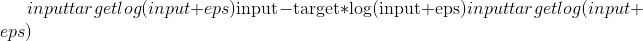。 默认值：`True`

*   **full** –是否计算全部损耗，即。 e。 添加斯特林近似项。 默认值：`False` 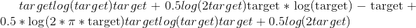。

*   **size_average** (_bool__,_ _optional_) – Deprecated (see `reduction`). By default, the losses are averaged over each loss element in the batch. Note that for some losses, there multiple elements per sample. If the field `size_average` is set to `False`, the losses are instead summed for each minibatch. Ignored when reduce is `False`. Default: `True`

*   **eps**  (_python：float_ _，_ _可选_）–较小的值，以避免在`log_input`=``False``时评估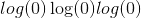。 默认值：1e-8

*   **reduce** (_bool__,_ _optional_) – Deprecated (see `reduction`). By default, the losses are averaged or summed over observations for each minibatch depending on `size_average`. When `reduce` is `False`, returns a loss per batch element instead and ignores `size_average`. Default: `True`

*   **reduction** (_string__,_ _optional_) – Specifies the reduction to apply to the output: `'none'` | `'mean'` | `'sum'`. `'none'`: no reduction will be applied, `'mean'`: the sum of the output will be divided by the number of elements in the output, `'sum'`: the output will be summed. Note: `size_average` and `reduce` are in the process of being deprecated, and in the meantime, specifying either of those two args will override `reduction`. Default: `'mean'`

### cosine_embedding_loss

* * *

```
torch.nn.functional.cosine_embedding_loss(input1, input2, target, margin=0, size_average=None, reduce=None, reduction='mean') → Tensor¶
```

有关详细信息，请参见 [`CosineEmbeddingLoss`](nn.html#torch.nn.CosineEmbeddingLoss "torch.nn.CosineEmbeddingLoss") 。

### 交叉熵

* * *

```
torch.nn.functional.cross_entropy(input, target, weight=None, size_average=None, ignore_index=-100, reduce=None, reduction='mean')¶
```

该标准将 &lt;cite&gt;log_softmax&lt;/cite&gt; 和 &lt;cite&gt;nll_loss&lt;/cite&gt; 合并在一个函数中。

有关详细信息，请参见 [`CrossEntropyLoss`](nn.html#torch.nn.CrossEntropyLoss "torch.nn.CrossEntropyLoss") 。

Parameters

*   **输入** ([_tensor_](tensors.html#torch.Tensor "torch.Tensor"))– 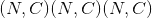其中 &lt;cite&gt;C =类别损失&lt;/cite&gt;或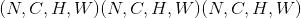，如果出现 2D 损失，或[ 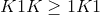在 K 维丢失的情况下。

*   **目标** ([_tensor_](tensors.html#torch.Tensor "torch.Tensor"))– 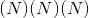，其中每个值是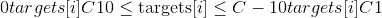，或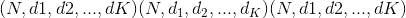，其中对于 K 维损耗。

*   **重量** ([_tensor_](tensors.html#torch.Tensor "torch.Tensor") _，_ _可选_）–为每个类别提供手动缩放比例的重量。 如果给定，则其张量必须为 &lt;cite&gt;C&lt;/cite&gt;

*   **size_average** (_bool__,_ _optional_) – Deprecated (see `reduction`). By default, the losses are averaged over each loss element in the batch. Note that for some losses, there multiple elements per sample. If the field `size_average` is set to `False`, the losses are instead summed for each minibatch. Ignored when reduce is `False`. Default: `True`

*   **ignore_index**  (_python：int_ _，_ _可选_）–指定目标值，该目标值将被忽略并且不会对输入梯度产生影响。 当`size_average`为`True`时，损耗是在不可忽略的目标上平均的。 默认值：-100

*   **reduce** (_bool__,_ _optional_) – Deprecated (see `reduction`). By default, the losses are averaged or summed over observations for each minibatch depending on `size_average`. When `reduce` is `False`, returns a loss per batch element instead and ignores `size_average`. Default: `True`

*   **reduction** (_string__,_ _optional_) – Specifies the reduction to apply to the output: `'none'` | `'mean'` | `'sum'`. `'none'`: no reduction will be applied, `'mean'`: the sum of the output will be divided by the number of elements in the output, `'sum'`: the output will be summed. Note: `size_average` and `reduce` are in the process of being deprecated, and in the meantime, specifying either of those two args will override `reduction`. Default: `'mean'`

Examples:

```
>>> input = torch.randn(3, 5, requires_grad=True)
>>> target = torch.randint(5, (3,), dtype=torch.int64)
>>> loss = F.cross_entropy(input, target)
>>> loss.backward()

```

### ctc_loss

* * *

```
torch.nn.functional.ctc_loss(log_probs, targets, input_lengths, target_lengths, blank=0, reduction='mean', zero_infinity=False)¶
```

连接主义者的时间分类损失。

有关详细信息，请参见 [`CTCLoss`](nn.html#torch.nn.CTCLoss "torch.nn.CTCLoss") 。

Note

In some circumstances when using the CUDA backend with CuDNN, this operator may select a nondeterministic algorithm to increase performance. If this is undesirable, you can try to make the operation deterministic (potentially at a performance cost) by setting `torch.backends.cudnn.deterministic = True`. Please see the notes on [Reproducibility](notes/randomness.html) for background.

Note

When using the CUDA backend, this operation may induce nondeterministic behaviour in its backward pass that is not easily switched off. Please see the notes on [Reproducibility](notes/randomness.html) for background.

Parameters

*   **log_probs** – 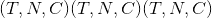，其中 &lt;cite&gt;C =字母字符数，包括空白&lt;/cite&gt;， &lt;cite&gt;T =输入长度&lt;/cite&gt;，和 &lt;cite&gt;N =批处理大小&lt;/cite&gt; 。 输出的对数概率(例如，使用 [`torch.nn.functional.log_softmax()`](#torch.nn.functional.log_softmax "torch.nn.functional.log_softmax") 获得的概率）。

*   **目标为** – 或&lt;cite&gt;(sum(target_lengths））&lt;/cite&gt;。 目标不能为空。 在第二种形式中，假定目标是串联的。

*   **input_lengths** – 。 输入的长度(每个必须为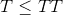）

*   **target_lengths** – 。 目标长度

*   **空白** (_python：int_ _，_ _可选_）–空白标签。 默认值。

*   **缩减**(_字符串_ _，_ _可选_）–指定要应用于输出的缩减：`'none'` | `'mean'` | `'sum'`。 `'none'`：不应用减少量，`'mean'`：将输出损失除以目标长度，然后取批次的平均值，`'sum'`：将输出相加。 默认值：`'mean'`

*   **zero_infinity**  (_bool_ _，_ _可选_）–是否将无限大损失和相关的梯度归零。 默认值：`False`无限损失主要发生在输入太短而无法与目标对齐时。

Example:

```
>>> log_probs = torch.randn(50, 16, 20).log_softmax(2).detach().requires_grad_()
>>> targets = torch.randint(1, 20, (16, 30), dtype=torch.long)
>>> input_lengths = torch.full((16,), 50, dtype=torch.long)
>>> target_lengths = torch.randint(10,30,(16,), dtype=torch.long)
>>> loss = F.ctc_loss(log_probs, targets, input_lengths, target_lengths)
>>> loss.backward()

```

### 铰链嵌入损耗

* * *

```
torch.nn.functional.hinge_embedding_loss(input, target, margin=1.0, size_average=None, reduce=None, reduction='mean') → Tensor¶
```

有关详细信息，请参见 [`HingeEmbeddingLoss`](nn.html#torch.nn.HingeEmbeddingLoss "torch.nn.HingeEmbeddingLoss") 。

### kl_div

* * *

```
torch.nn.functional.kl_div(input, target, size_average=None, reduce=None, reduction='mean')¶
```

[Kullback-Leibler 散度](https://en.wikipedia.org/wiki/Kullback-Leibler_divergence)损失。

有关详细信息，请参见 [`KLDivLoss`](nn.html#torch.nn.KLDivLoss "torch.nn.KLDivLoss") 。

Parameters

*   **input** – Tensor of arbitrary shape

*   **target** – Tensor of the same shape as input

*   **size_average** (_bool__,_ _optional_) – Deprecated (see `reduction`). By default, the losses are averaged over each loss element in the batch. Note that for some losses, there multiple elements per sample. If the field `size_average` is set to `False`, the losses are instead summed for each minibatch. Ignored when reduce is `False`. Default: `True`

*   **reduce** (_bool__,_ _optional_) – Deprecated (see `reduction`). By default, the losses are averaged or summed over observations for each minibatch depending on `size_average`. When `reduce` is `False`, returns a loss per batch element instead and ignores `size_average`. Default: `True`

*   **缩减**(_字符串_ _，_ _可选_）–指定要应用于输出的缩减：`'none'` | `'batchmean'` | `'sum'` | `'mean'`。 `'none'`：不应用缩减项`'batchmean'`：输出的总和除以批处理大小`'sum'`：输出的总和`'mean'`：输出除以输出中的元素数 默认值：`'mean'`

Note

`size_average`和`reduce`正在弃用的过程中，与此同时，指定这两个 args 中的任何一个将覆盖`reduction`。

Note

：attr：`reduction` = `'mean'`不返回真实的 kl 散度值，请使用：attr：`reduction` = `'batchmean'`，该值与 KL 数学定义一致。 在下一个主要版本中，`'mean'`将更改为与“ batchmean”相同的名称。

### l1_ 损失

* * *

```
torch.nn.functional.l1_loss(input, target, size_average=None, reduce=None, reduction='mean') → Tensor¶
```

取平均逐元素绝对值差的函数。

有关详细信息，请参见 [`L1Loss`](nn.html#torch.nn.L1Loss "torch.nn.L1Loss") 。

### mse_loss

* * *

```
torch.nn.functional.mse_loss(input, target, size_average=None, reduce=None, reduction='mean') → Tensor¶
```

测量按元素的均方误差。

有关详细信息，请参见 [`MSELoss`](nn.html#torch.nn.MSELoss "torch.nn.MSELoss") 。

### margin_ranking_loss

* * *

```
torch.nn.functional.margin_ranking_loss(input1, input2, target, margin=0, size_average=None, reduce=None, reduction='mean') → Tensor¶
```

有关详细信息，请参见 [`MarginRankingLoss`](nn.html#torch.nn.MarginRankingLoss "torch.nn.MarginRankingLoss") 。

### multilabel_margin_loss

* * *

```
torch.nn.functional.multilabel_margin_loss(input, target, size_average=None, reduce=None, reduction='mean') → Tensor¶
```

有关详细信息，请参见 [`MultiLabelMarginLoss`](nn.html#torch.nn.MultiLabelMarginLoss "torch.nn.MultiLabelMarginLoss") 。

### multilabel_soft_margin_loss

* * *

```
torch.nn.functional.multilabel_soft_margin_loss(input, target, weight=None, size_average=None) → Tensor¶
```

有关详细信息，请参见 [`MultiLabelSoftMarginLoss`](nn.html#torch.nn.MultiLabelSoftMarginLoss "torch.nn.MultiLabelSoftMarginLoss") 。

### multi_margin_loss

* * *

```
torch.nn.functional.multi_margin_loss(input, target, p=1, margin=1.0, weight=None, size_average=None, reduce=None, reduction='mean')¶
```

```
multi_margin_loss(input, target, p=1, margin=1, weight=None, size_average=None,
```

reduce = None，reduction ='mean'）-&gt;张量

有关详细信息，请参见 [`MultiMarginLoss`](nn.html#torch.nn.MultiMarginLoss "torch.nn.MultiMarginLoss") 。

### nll_loss

* * *

```
torch.nn.functional.nll_loss(input, target, weight=None, size_average=None, ignore_index=-100, reduce=None, reduction='mean')¶
```

负对数似然损失。

有关详细信息，请参见 [`NLLLoss`](nn.html#torch.nn.NLLLoss "torch.nn.NLLLoss") 。

Parameters

*   **输入** – ，其中 &lt;cite&gt;C =二维损失时的类数&lt;/cite&gt;或，或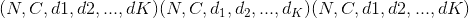，如果发生 K 维损失则为。

*   **目标** – ，其中每个值为，或，其中用于 K 维损耗。

*   **weight** ([_Tensor_](tensors.html#torch.Tensor "torch.Tensor")_,_ _optional_) – a manual rescaling weight given to each class. If given, has to be a Tensor of size &lt;cite&gt;C&lt;/cite&gt;

*   **size_average** (_bool__,_ _optional_) – Deprecated (see `reduction`). By default, the losses are averaged over each loss element in the batch. Note that for some losses, there multiple elements per sample. If the field `size_average` is set to `False`, the losses are instead summed for each minibatch. Ignored when reduce is `False`. Default: `True`

*   **ignore_index** (_python:int__,_ _optional_) – Specifies a target value that is ignored and does not contribute to the input gradient. When `size_average` is `True`, the loss is averaged over non-ignored targets. Default: -100

*   **reduce** (_bool__,_ _optional_) – Deprecated (see `reduction`). By default, the losses are averaged or summed over observations for each minibatch depending on `size_average`. When `reduce` is `False`, returns a loss per batch element instead and ignores `size_average`. Default: `True`

*   **reduction** (_string__,_ _optional_) – Specifies the reduction to apply to the output: `'none'` | `'mean'` | `'sum'`. `'none'`: no reduction will be applied, `'mean'`: the sum of the output will be divided by the number of elements in the output, `'sum'`: the output will be summed. Note: `size_average` and `reduce` are in the process of being deprecated, and in the meantime, specifying either of those two args will override `reduction`. Default: `'mean'`

Example:

```
>>> # input is of size N x C = 3 x 5
>>> input = torch.randn(3, 5, requires_grad=True)
>>> # each element in target has to have 0 <= value < C
>>> target = torch.tensor([1, 0, 4])
>>> output = F.nll_loss(F.log_softmax(input), target)
>>> output.backward()

```

### smooth_l1_loss

* * *

```
torch.nn.functional.smooth_l1_loss(input, target, size_average=None, reduce=None, reduction='mean')¶
```

如果逐个元素的绝对误差低于 1，则使用平方项的函数，否则使用 L1 项。

有关详细信息，请参见 [`SmoothL1Loss`](nn.html#torch.nn.SmoothL1Loss "torch.nn.SmoothL1Loss") 。

### soft_margin_loss

* * *

```
torch.nn.functional.soft_margin_loss(input, target, size_average=None, reduce=None, reduction='mean') → Tensor¶
```

有关详细信息，请参见 [`SoftMarginLoss`](nn.html#torch.nn.SoftMarginLoss "torch.nn.SoftMarginLoss") 。

### Triplet_margin_loss

* * *

```
torch.nn.functional.triplet_margin_loss(anchor, positive, negative, margin=1.0, p=2, eps=1e-06, swap=False, size_average=None, reduce=None, reduction='mean')¶
```

有关详细信息，请参见 [`TripletMarginLoss`](nn.html#torch.nn.TripletMarginLoss "torch.nn.TripletMarginLoss")

## 视觉功能

### pixel_shuffle

* * *

```
torch.nn.functional.pixel_shuffle()¶
```

将形状为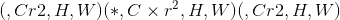的张量中的元素重新排列为形状为的张量中的元素。

有关详细信息，请参见 [`PixelShuffle`](nn.html#torch.nn.PixelShuffle "torch.nn.PixelShuffle") 。

Parameters

*   **输入** ([_tensor_](tensors.html#torch.Tensor "torch.Tensor"))–输入张量

*   **upscale_factor**  (_python：int_ )–通过提高空间分辨率的因子

Examples:

```
>>> input = torch.randn(1, 9, 4, 4)
>>> output = torch.nn.functional.pixel_shuffle(input, 3)
>>> print(output.size())
torch.Size([1, 1, 12, 12])

```

### 垫

* * *

```
torch.nn.functional.pad(input, pad, mode='constant', value=0)¶
```

填充张量。

```
Padding size:
```

从最后一个尺寸开始，往前介绍填充`input`某些尺寸的填充尺寸。 将填充`input`的尺寸。 例如，要仅填充输入张量的最后一个维度，则 [`pad`](#torch.nn.functional.pad "torch.nn.functional.pad") 的形式为； 填充输入张量的最后两个维度，然后使用 ； 要填充最后 3 个尺寸，请使用  。

```
Padding mode:
```

有关每种填充模式如何工作的具体示例，请参见 [`torch.nn.ConstantPad2d`](nn.html#torch.nn.ConstantPad2d "torch.nn.ConstantPad2d") ， [`torch.nn.ReflectionPad2d`](nn.html#torch.nn.ReflectionPad2d "torch.nn.ReflectionPad2d") 和 [`torch.nn.ReplicationPad2d`](nn.html#torch.nn.ReplicationPad2d "torch.nn.ReplicationPad2d") 。 恒定填充用于任意尺寸。 复制填充用于填充 5D 输入张量的最后 3 个维度，4D 输入张量的最后 2 个维度或 3D 输入张量的最后一个维度。 反射填充仅用于填充 4D 输入张量的最后 2 个维度或 3D 输入张量的最后一个维度。

Note

When using the CUDA backend, this operation may induce nondeterministic behaviour in its backward pass that is not easily switched off. Please see the notes on [Reproducibility](notes/randomness.html) for background.

Parameters

*   **输入** ([_tensor_](tensors.html#torch.Tensor "torch.Tensor"))– N 维张量

*   **填充**(_元组_）– m 元素元组，其中输入尺寸和是偶数。

*   **模式** – `'constant'`，`'reflect'`，`'replicate'`或`'circular'`。 默认值：`'constant'`

*   **值** – `'constant'`填充的填充值。 默认值：`0`

Examples:

```
>>> t4d = torch.empty(3, 3, 4, 2)
>>> p1d = (1, 1) # pad last dim by 1 on each side
>>> out = F.pad(t4d, p1d, "constant", 0)  # effectively zero padding
>>> print(out.data.size())
torch.Size([3, 3, 4, 4])
>>> p2d = (1, 1, 2, 2) # pad last dim by (1, 1) and 2nd to last by (2, 2)
>>> out = F.pad(t4d, p2d, "constant", 0)
>>> print(out.data.size())
torch.Size([3, 3, 8, 4])
>>> t4d = torch.empty(3, 3, 4, 2)
>>> p3d = (0, 1, 2, 1, 3, 3) # pad by (0, 1), (2, 1), and (3, 3)
>>> out = F.pad(t4d, p3d, "constant", 0)
>>> print(out.data.size())
torch.Size([3, 9, 7, 3])

```

### 插

* * *

```
torch.nn.functional.interpolate(input, size=None, scale_factor=None, mode='nearest', align_corners=None)¶
```

向下/向上采样输入给定`size`或给定`scale_factor`的输入

用于插值的算法由`mode`确定。

当前支持时间，空间和体积采样，即，预期输入的形状为 3-D，4-D 或 5-D。

输入尺寸以以下形式解释：&lt;cite&gt;微型批处理 x 通道 x [可选深度] x [可选高度] x 宽度&lt;/cite&gt;。

可用于调整大小的模式为：&lt;cite&gt;最接近&lt;/cite&gt;，&lt;cite&gt;线性&lt;/cite&gt;(仅 3D），&lt;cite&gt;双线性&lt;/cite&gt;，&lt;cite&gt;双三次&lt;/cite&gt;(仅 4D），[ &lt;cite&gt;三线性&lt;/cite&gt;(仅限 5D），&lt;cite&gt;区域&lt;/cite&gt;

Parameters

*   **input** ([_Tensor_](tensors.html#torch.Tensor "torch.Tensor")) – the input tensor

*   **大小** (_python：int_ _或_ _元组_ _[_ _python：int_ _]或_ _元组_ _[_ _python：int_ _，_ _python：int_ _]或_ _元组_ _[_ _python：int_ _，_ _python：int_ _，_ _python：int_ _]_ )–输出空间大小。

*   **scale_factor**  (_python：float_ _或_ _元组_ _[_ _python：float_ _]_ )–空间大小的乘数。 如果是元组，则必须匹配输入大小。

*   **模式** (_str_ )–用于上采样的算法：`'nearest'` | `'linear'` | `'bilinear'` | `'bicubic'` | `'trilinear'` | `'area'`。 默认值：`'nearest'`

*   **align_corners** (_布尔_ _，_ _可选_）–在几何上，我们将输入和输出的像素视为正方形而不是点。 如果设置为`True`，则输入和输出张量将按其角点像素的中心对齐，并保留角点像素处的值。 如果设置为`False`，则输入和输出张量按其角点像素的角点对齐，并且插值对边界值使用边缘值填充，从而使此操作_独立于输入_ `scale_factor`保持相同时的尺寸。 仅当`mode`为`'linear'`，`'bilinear'`，`'bicubic'`或`'trilinear'`时才有效。 默认值：`False`

Note

使用`mode='bicubic'`可能会导致过冲，换句话说，它可能会产生负值或大于 255 的图像值。 如果要减少显示图像时的过冲，请明确调用`result.clamp(min=0, max=255)`。

Warning

使用`align_corners = True`时，线性插值模式(&lt;cite&gt;线性&lt;/cite&gt;，&lt;cite&gt;双线性&lt;/cite&gt;和&lt;cite&gt;三线性&lt;/cite&gt;）不会按比例对齐输出像素和输入像素，因此输出 值可以取决于输入大小。 这是这些模式(0.3.1 版之前）的默认行为。 从那时起，默认行为是`align_corners = False`。 有关如何影响输出的具体示例，请参见 [`Upsample`](nn.html#torch.nn.Upsample "torch.nn.Upsample") 。

Note

When using the CUDA backend, this operation may induce nondeterministic behaviour in its backward pass that is not easily switched off. Please see the notes on [Reproducibility](notes/randomness.html) for background.

### 上采样

* * *

```
torch.nn.functional.upsample(input, size=None, scale_factor=None, mode='nearest', align_corners=None)¶
```

将输入上采样到给定的`size`或给定的`scale_factor`

Warning

不推荐使用此功能，而推荐使用 [`torch.nn.functional.interpolate()`](#torch.nn.functional.interpolate "torch.nn.functional.interpolate") 。 与`nn.functional.interpolate(...)`等效。

Note

When using the CUDA backend, this operation may induce nondeterministic behaviour in its backward pass that is not easily switched off. Please see the notes on [Reproducibility](notes/randomness.html) for background.

用于上采样的算法由`mode`确定。

当前支持时间，空间和体积上采样，即，预期输入的形状为 3D，4D 或 5D。

The input dimensions are interpreted in the form: &lt;cite&gt;mini-batch x channels x [optional depth] x [optional height] x width&lt;/cite&gt;.

可用于上采样的模式为：&lt;cite&gt;最接近&lt;/cite&gt;，&lt;cite&gt;线性&lt;/cite&gt;(仅 3D），&lt;cite&gt;双线性&lt;/cite&gt;，&lt;cite&gt;双三次&lt;/cite&gt;(仅 4D），&lt;cite&gt;三线性&lt;/cite&gt;(仅限 5D）

Parameters

*   **input** ([_Tensor_](tensors.html#torch.Tensor "torch.Tensor")) – the input tensor

*   **size** (_python:int_ _or_ _Tuple__[__python:int__] or_ _Tuple__[__python:int__,_ _python:int__] or_ _Tuple__[__python:int__,_ _python:int__,_ _python:int__]_) – output spatial size.

*   **scale_factor**  (_python：float_ _或_ _元组_ _[_ _python：float_ _]_ )–空间大小的乘数。 必须是整数。

*   **模式**(_字符串_）–用于上采样的算法：`'nearest'` | `'linear'` | `'bilinear'` | `'bicubic'` | `'trilinear'`。 默认值：`'nearest'`

*   **align_corners** (_bool__,_ _optional_) – Geometrically, we consider the pixels of the input and output as squares rather than points. If set to `True`, the input and output tensors are aligned by the center points of their corner pixels, preserving the values at the corner pixels. If set to `False`, the input and output tensors are aligned by the corner points of their corner pixels, and the interpolation uses edge value padding for out-of-boundary values, making this operation _independent_ of input size when `scale_factor` is kept the same. This only has an effect when `mode` is `'linear'`, `'bilinear'`, `'bicubic'` or `'trilinear'`. Default: `False`

Note

With `mode='bicubic'`, it’s possible to cause overshoot, in other words it can produce negative values or values greater than 255 for images. Explicitly call `result.clamp(min=0, max=255)` if you want to reduce the overshoot when displaying the image.

Warning

With `align_corners = True`, the linearly interpolating modes (&lt;cite&gt;linear&lt;/cite&gt;, &lt;cite&gt;bilinear&lt;/cite&gt;, and &lt;cite&gt;trilinear&lt;/cite&gt;) don’t proportionally align the output and input pixels, and thus the output values can depend on the input size. This was the default behavior for these modes up to version 0.3.1\. Since then, the default behavior is `align_corners = False`. See [`Upsample`](nn.html#torch.nn.Upsample "torch.nn.Upsample") for concrete examples on how this affects the outputs.

### upsample_nearest

* * *

```
torch.nn.functional.upsample_nearest(input, size=None, scale_factor=None)¶
```

使用最近邻的像素值对输入进行上采样。

Warning

不推荐使用此功能，而推荐使用 [`torch.nn.functional.interpolate()`](#torch.nn.functional.interpolate "torch.nn.functional.interpolate") 。 与`nn.functional.interpolate(..., mode='nearest')`等效。

当前支持空间和体积上采样(即，预期输入为 4 维或 5 维）。

Parameters

*   **input** ([_Tensor_](tensors.html#torch.Tensor "torch.Tensor")) – input

*   **大小** (_python：int_ _或_ _元组_ _[_ _python：int_ _，_ _python：int_ _]或_ _元组_ _[_ _python：int_ _，_ _python：int_ _，_ _python：int_ _]_ )–输出空间大小。

*   **scale_factor**  (_python：int_ )–空间大小的乘数。 必须是整数。

Note

When using the CUDA backend, this operation may induce nondeterministic behaviour in its backward pass that is not easily switched off. Please see the notes on [Reproducibility](notes/randomness.html) for background.

### upsample_bilinear

* * *

```
torch.nn.functional.upsample_bilinear(input, size=None, scale_factor=None)¶
```

使用双线性上采样对输入进行上采样。

Warning

不推荐使用此功能，而推荐使用 [`torch.nn.functional.interpolate()`](#torch.nn.functional.interpolate "torch.nn.functional.interpolate") 。 与`nn.functional.interpolate(..., mode='bilinear', align_corners=True)`等效。

预期的输入是空间(4 维）。 对于体积(5 维）输入使用 &lt;cite&gt;upsample_trilinear&lt;/cite&gt; 。

Parameters

*   **input** ([_Tensor_](tensors.html#torch.Tensor "torch.Tensor")) – input

*   **大小** (_python：int_ _或_ _元组_ _[_ _python：int_ _，_ _python：int_ _]_ )–输出空间大小。

*   **scale_factor**  (_python：int_ _或_ _元组_ _[_ _python：int_ _，_ _python：int_ _]_ )–空间大小的乘数

Note

When using the CUDA backend, this operation may induce nondeterministic behaviour in its backward pass that is not easily switched off. Please see the notes on [Reproducibility](notes/randomness.html) for background.

### grid_sample

* * *

```
torch.nn.functional.grid_sample(input, grid, mode='bilinear', padding_mode='zeros', align_corners=None)¶
```

给定`input`和流场`grid`，则使用`input`值和来自`grid`的像素位置来计算`output`。

当前，仅支持空间(4-D）和体积(5-D）`input`。

在空间(4-D）情况下，对于形状为的`input`和形状为的`grid`，输出将具有形状。

对于每个输出位置`output[n, :, h, w]`，大小为 2 的向量`grid[n, h, w]`指定`input`像素位置`x`和`y`，用于对输出值`output[n, :, h, w]`进行插值。 在 5D 输入的情况下，`grid[n, d, h, w]`指定用于内插`output[n, :, d, h, w]`的`x`，`y`，`z`像素位置。 `mode`自变量指定`nearest`或`bilinear`内插方法以对输入像素进行采样。

`grid`指定通过`input`空间尺寸归一化的采样像素位置。 因此，它应具有`[-1, 1]`范围内的大多数值。 例如，值`x = -1, y = -1`是`input`的左上像素，值`x = 1, y = 1`是`input`的右下像素。

如果`grid`的值超出`[-1, 1]`范围，则​​按`padding_mode`定义处理相应的输出。 选项是

> *   `padding_mode="zeros"`：将`0`用于出站网格位置，
>     
>     
> *   `padding_mode="border"`：将边界值用于出站网格位置，
>     
>     
> *   `padding_mode="reflection"`：将边界所反映的位置的值用于边界外的网格位置。 对于远离边界的位置，它将一直被反射直到成为边界，例如，(标准化）像素位置`x = -3.5`被边界`-1`反射并变为`x' = 1.5`，然后被边界`1`反射并变为[ `x'' = -0.5`。

Note

此功能通常与 [`affine_grid()`](#torch.nn.functional.affine_grid "torch.nn.functional.affine_grid") 结合使用，以构建[空间变压器网络](https://arxiv.org/abs/1506.02025)。

Note

When using the CUDA backend, this operation may induce nondeterministic behaviour in its backward pass that is not easily switched off. Please see the notes on [Reproducibility](notes/randomness.html) for background.

Parameters

*   **输入** ([_tensor_](tensors.html#torch.Tensor "torch.Tensor"))–输入形状(4-D 情况）或(5-D 情况）

*   **网格** ([_tensor_](tensors.html#torch.Tensor "torch.Tensor"))–形状为(4-D 情况）或(5-D 情况）的流场

*   **模式** (_str_ )–插值模式以计算输出值`'bilinear'` | `'nearest'`。 默认值：`'bilinear'`

*   **padding_mode**  (_str_ )–外部网格值的填充模式`'zeros'` | `'border'` | `'reflection'`。 默认值：`'zeros'`

*   **align_corners** (_布尔_ _，_ _可选_）–在几何上，我们将输入像素视为正方形而不是点。 如果设置为`True`，则极值(`-1`和`1`）被视为参考输入角像素的中心点。 如果设置为`False`，则它们将被视为参考输入的角像素的角点，从而使采样更加不可知。 此选项与 [`interpolate()`](#torch.nn.functional.interpolate "torch.nn.functional.interpolate") 中的`align_corners`选项相似，因此在网格采样之前，此处使用的任何选项也应用于调整输入图像的大小。 默认值：`False`

Returns

输出张量

返回类型

输出([张量](tensors.html#torch.Tensor "torch.Tensor")）

Warning

当`align_corners = True`时，网格位置取决于相对于输入图像大小的像素大小，因此对于以不同分辨率给出的同一输入， [`grid_sample()`](#torch.nn.functional.grid_sample "torch.nn.functional.grid_sample") 采样的位置将有所不同(也就是说， 上采样或下采样）。 直到版本 1.2.0，默认行为是`align_corners = True`。 从那时起，默认行为已更改为`align_corners = False`，以使其与 [`interpolate()`](#torch.nn.functional.interpolate "torch.nn.functional.interpolate") 的默认行为保持一致。

### 仿射网格

* * *

```
torch.nn.functional.affine_grid(theta, size, align_corners=None)¶
```

给定一批仿射矩阵`theta`，生成 2D 或 3D 流场(采样网格）。

Note

此功能通常与 [`grid_sample()`](#torch.nn.functional.grid_sample "torch.nn.functional.grid_sample") 结合使用，以构建[空间变压器网络](https://arxiv.org/abs/1506.02025)。

Parameters

*   **theta**  ([_tensor_](tensors.html#torch.Tensor "torch.Tensor"))–输入仿射矩阵，其形状为(D）(2D）或(）3D

*   **大小**(_torch大小_）–目标输出图像大小。 (用于 2D 的或用于 3D 的）示例：torch.Size((32，3，24，24））

*   **align_corners**  (_bool_ _，_ _可选_）–如果`True`，请考虑`-1`和`1`指的是 角像素而不是图像角。 有关更完整的说明，请参见 [`grid_sample()`](#torch.nn.functional.grid_sample "torch.nn.functional.grid_sample") 。 由 [`affine_grid()`](#torch.nn.functional.affine_grid "torch.nn.functional.affine_grid") 生成的网格应传递至 [`grid_sample()`](#torch.nn.functional.grid_sample "torch.nn.functional.grid_sample") ，并为此选项设置相同。 默认值：`False`

Returns

输出张量大小(）

Return type

output ([Tensor](tensors.html#torch.Tensor "torch.Tensor"))

Warning

When `align_corners = True`, the grid positions depend on the pixel size relative to the input image size, and so the locations sampled by [`grid_sample()`](#torch.nn.functional.grid_sample "torch.nn.functional.grid_sample") will differ for the same input given at different resolutions (that is, after being upsampled or downsampled). The default behavior up to version 1.2.0 was `align_corners = True`. Since then, the default behavior has been changed to `align_corners = False`, in order to bring it in line with the default for [`interpolate()`](#torch.nn.functional.interpolate "torch.nn.functional.interpolate").

Warning

当`align_corners = True`时，对 1D 数据的 2D 仿射变换和对 2D 数据的 3D 仿射变换(即，当空间维度之一具有单位大小时）定义不明确，而不是预期的用例。 当`align_corners = False`时这不是问题。 在版本 1.2.0 之前的版本中，沿单位维度的所有网格点都被视为任意`-1`。 从版本 1.3.0 开始，在`align_corners = True`下，单位尺寸上的所有网格点都被认为位于``0`(输入图像的中心）处。

## DataParallel 功能(多 GPU，分布式）

### data_parallel

* * *

```
torch.nn.parallel.data_parallel(module, inputs, device_ids=None, output_device=None, dim=0, module_kwargs=None)¶
```

跨 device_ids 中提供的 GPU 并行评估模块(输入）。

这是 DataParallel 模块的功能版本。

Parameters

*   **模块** ([_模块_](nn.html#torch.nn.Module "torch.nn.Module"))–并行评估的模块

*   **输入** ([_tensor_](tensors.html#torch.Tensor "torch.Tensor"))–模块的输入

*   **device_ids** (python：int 的_列表：_ _或_ [_Torch.device_](tensor_attributes.html#torch.torch.device "torch.torch.device"))–在其上复制模块的 GPU ID

*   **output_device** (python：int 的_列表：_ _或_ [_Torch.device_](tensor_attributes.html#torch.torch.device "torch.torch.device"))–输出的 GPU 位置使用- 1 表示 CPU。 (默认值：device_ids [0]）

Returns

一个 Tensor，包含位于 output_device 上的 module(input）的结果