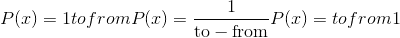
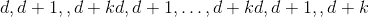
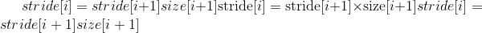

# torch张量

> 原文： [https://pytorch.org/docs/stable/tensors.html](https://pytorch.org/docs/stable/tensors.html)

[`torch.Tensor`](#torch.Tensor "torch.Tensor") 是包含单个数据类型元素的多维矩阵。

Torch 定义了 9 种 CPU 张量类型和 9 种 GPU 张量类型：

| 数据类型 | dtype | CPU 张量 | GPU 张量 |
| --- | --- | --- | --- |
| 32 位浮点 | `torch.float32`或`torch.float` | `torch.FloatTensor` | `torch.cuda.FloatTensor` |
| 64 位浮点 | `torch.float64`或`torch.double` | `torch.DoubleTensor` | `torch.cuda.DoubleTensor` |
| 16 位浮点 | `torch.float16`或`torch.half` | `torch.HalfTensor` | `torch.cuda.HalfTensor` |
| 8 位整数(无符号） | `torch.uint8` | `torch.ByteTensor` | `torch.cuda.ByteTensor` |
| 8 位整数(有符号） | `torch.int8` | `torch.CharTensor` | `torch.cuda.CharTensor` |
| 16 位整数(有符号） | `torch.int16`或`torch.short` | `torch.ShortTensor` | `torch.cuda.ShortTensor` |
| 32 位整数(有符号） | `torch.int32`或`torch.int` | `torch.IntTensor` | `torch.cuda.IntTensor` |
| 64 位整数(有符号） | `torch.int64`或`torch.long` | `torch.LongTensor` | `torch.cuda.LongTensor` |
| 布尔型 | `torch.bool` | [`torch.BoolTensor`](#torch.BoolTensor "torch.BoolTensor") | `torch.cuda.BoolTensor` |

[`torch.Tensor`](#torch.Tensor "torch.Tensor") 是默认张量类型(`torch.FloatTensor`）的别名。

可以使用 [`torch.tensor()`](torch.html#torch.tensor "torch.tensor") 构造函数从 Python `list`或序列构造张量：

```
>>> torch.tensor([[1., -1.], [1., -1.]])
tensor([[ 1.0000, -1.0000],
        [ 1.0000, -1.0000]])
>>> torch.tensor(np.array([[1, 2, 3], [4, 5, 6]]))
tensor([[ 1,  2,  3],
        [ 4,  5,  6]])

```

警告

[`torch.tensor()`](torch.html#torch.tensor "torch.tensor") 始终复制`data`。 如果您具有张量`data`，而只想更改其`requires_grad`标志，请使用 [`requires_grad_()`](#torch.Tensor.requires_grad_ "torch.Tensor.requires_grad_") 或 [`detach()`](autograd.html#torch.Tensor.detach "torch.Tensor.detach") 以避免复制。 如果您有一个 numpy 数组并且想要避免复制，请使用 [`torch.as_tensor()`](torch.html#torch.as_tensor "torch.as_tensor") 。

可以通过将 [`torch.dtype`](tensor_attributes.html#torch.torch.dtype "torch.torch.dtype") 和/或 [`torch.device`](tensor_attributes.html#torch.torch.device "torch.torch.device") 传递给构造函数或张量创建操作来构造特定数据类型的张量：

```
>>> torch.zeros([2, 4], dtype=torch.int32)
tensor([[ 0,  0,  0,  0],
        [ 0,  0,  0,  0]], dtype=torch.int32)
>>> cuda0 = torch.device('cuda:0')
>>> torch.ones([2, 4], dtype=torch.float64, device=cuda0)
tensor([[ 1.0000,  1.0000,  1.0000,  1.0000],
        [ 1.0000,  1.0000,  1.0000,  1.0000]], dtype=torch.float64, device='cuda:0')

```

张量的内容可以使用 Python 的索引和切片符号来访问和修改：

```
>>> x = torch.tensor([[1, 2, 3], [4, 5, 6]])
>>> print(x[1][2])
tensor(6)
>>> x[0][1] = 8
>>> print(x)
tensor([[ 1,  8,  3],
        [ 4,  5,  6]])

```

使用 [`torch.Tensor.item()`](#torch.Tensor.item "torch.Tensor.item") 从张量中获取包含单个值的 Python 数字：

```
>>> x = torch.tensor([[1]])
>>> x
tensor([[ 1]])
>>> x.item()
1
>>> x = torch.tensor(2.5)
>>> x
tensor(2.5000)
>>> x.item()
2.5

```

可以使用`requires_grad=True`创建一个张量，以便 [`torch.autograd`](autograd.html#module-torch.autograd "torch.autograd") 对其进行记录操作以进行自动微分。

```
>>> x = torch.tensor([[1., -1.], [1., 1.]], requires_grad=True)
>>> out = x.pow(2).sum()
>>> out.backward()
>>> x.grad
tensor([[ 2.0000, -2.0000],
        [ 2.0000,  2.0000]])

```

每个张量都有一个关联的`torch.Storage`，它保存其数据。 张量类提供了存储的多维[跨度](https://en.wikipedia.org/wiki/Stride_of_an_array)视图，并定义了数字运算。

注意

有关 [`torch.Tensor`](#torch.Tensor "torch.Tensor") 的 [`torch.dtype`](tensor_attributes.html#torch.torch.dtype "torch.torch.dtype") ， [`torch.device`](tensor_attributes.html#torch.torch.device "torch.torch.device") 和 [`torch.layout`](tensor_attributes.html#torch.torch.layout "torch.torch.layout") 属性的更多信息，请参阅[ [Tensor Attributes](tensor_attributes.html#tensor-attributes-doc) 。

注意

改变张量的方法用下划线后缀标记。 例如，`torch.FloatTensor.abs_()`在原位计算绝对值并返回修改后的张量，而`torch.FloatTensor.abs()`在新张量中计算结果。

注意

要更改现有张量的 [`torch.device`](tensor_attributes.html#torch.torch.device "torch.torch.device") 和/或 [`torch.dtype`](tensor_attributes.html#torch.torch.dtype "torch.torch.dtype") ，请考虑在张量上使用 [`to()`](#torch.Tensor.to "torch.Tensor.to") 方法。

警告

[`torch.Tensor`](#torch.Tensor "torch.Tensor") 的当前实现引入了内存开销，因此，在具有许多微小张量的应用程序中，它可能导致意外的高内存使用率。 如果是这种情况，请考虑使用一种大型结构。

* * *

```
class torch.Tensor
```

根据您的用例，创建张量的主要方法有几种。

*   要使用现有数据创建张量，请使用 [`torch.tensor()`](torch.html#torch.tensor "torch.tensor") 。

*   要创建具有特定大小的张量，请使用`torch.*`张量创建操作(请参见 [Creation Ops](torch.html#tensor-creation-ops))。

*   要创建与另一个张量具有相同大小(和相似类型）的张量，请使用`torch.*_like`张量创建操作(请参见[创建操作](torch.html#tensor-creation-ops)）。

*   要创建与其他张量具有相似类型但大小不同的张量，请使用`tensor.new_*`创建操作。

* * *

```
new_tensor(data, dtype=None, device=None, requires_grad=False) → Tensor
```

返回以`data`作为张量数据的新张量。 默认情况下，返回的张量与此张量具有相同的 [`torch.dtype`](tensor_attributes.html#torch.torch.dtype "torch.torch.dtype") 和 [`torch.device`](tensor_attributes.html#torch.torch.device "torch.torch.device") 。

警告

[`new_tensor()`](#torch.Tensor.new_tensor "torch.Tensor.new_tensor") 始终复制`data`。 如果您有张量`data`并希望避免复制，请使用 [`torch.Tensor.requires_grad_()`](#torch.Tensor.requires_grad_ "torch.Tensor.requires_grad_") 或 [`torch.Tensor.detach()`](autograd.html#torch.Tensor.detach "torch.Tensor.detach") 。 如果您有一个 numpy 数组并且想要避免复制，请使用 [`torch.from_numpy()`](torch.html#torch.from_numpy "torch.from_numpy") 。

警告

当数据是张量 _x_ 时， [`new_tensor()`](#torch.Tensor.new_tensor "torch.Tensor.new_tensor") 从传递的任何数据中读出“数据”，并构造一个叶子变量。 因此，`tensor.new_tensor(x)`等同于`x.clone().detach()`，`tensor.new_tensor(x, requires_grad=True)`等同于`x.clone().detach().requires_grad_(True)`。 建议使用`clone()`和`detach()`的等效项。

参数

*   **data** (_array_like_ )–返回的张量副本`data`。

*   **dtype**  ([`torch.dtype`](tensor_attributes.html#torch.torch.dtype "torch.torch.dtype") ，可选）– 返回张量的所需类型。 默认值：如果为 None，则与此张量相同的 [`torch.dtype`](tensor_attributes.html#torch.torch.dtype "torch.torch.dtype") 。

*   **device** ([`torch.device`](tensor_attributes.html#torch.torch.device "torch.torch.device") ，可选）– 返回张量的所需设备。 默认值：如果为 None，则与此张量相同的 [`torch.device`](tensor_attributes.html#torch.torch.device "torch.torch.device") 。

*   **require_grad**  (_bool_ _，_ _可选_）– 返回的张量是否需要自动求导。 默认值：`False`。

例：

```
>>> tensor = torch.ones((2,), dtype=torch.int8)
>>> data = [[0, 1], [2, 3]]
>>> tensor.new_tensor(data)
tensor([[ 0,  1],
        [ 2,  3]], dtype=torch.int8)

```

* * *

```
new_full(size, fill_value, dtype=None, device=None, requires_grad=False) → Tensor
```

返回大小为 [`size`](#torch.Tensor.size "torch.Tensor.size") 的张量，并用`fill_value`填充。 默认情况下，返回的张量与此张量具有相同的 [`torch.dtype`](tensor_attributes.html#torch.torch.dtype "torch.torch.dtype") 和 [`torch.device`](tensor_attributes.html#torch.torch.device "torch.torch.device") 。

参数

*   **fill_value** (_标量_）–用来填充输出张量的数字。

*   **dtype** ([`torch.dtype`](tensor_attributes.html#torch.torch.dtype "torch.torch.dtype"), optional) – 返回张量的所需类型。 默认值：如果为 None，则与此张量相同的 [`torch.dtype`](tensor_attributes.html#torch.torch.dtype "torch.torch.dtype") 。

*   **device** ([`torch.device`](tensor_attributes.html#torch.torch.device "torch.torch.device"), optional) – 返回张量的所需设备。 默认值：如果为 None，则与此张量相同的 [`torch.device`](tensor_attributes.html#torch.torch.device "torch.torch.device") 。

*   **requires_grad** (_bool__,_ _optional_) – 返回的张量是否需要自动求导。 默认值：`False`。

例:

```
>>> tensor = torch.ones((2,), dtype=torch.float64)
>>> tensor.new_full((3, 4), 3.141592)
tensor([[ 3.1416,  3.1416,  3.1416,  3.1416],
        [ 3.1416,  3.1416,  3.1416,  3.1416],
        [ 3.1416,  3.1416,  3.1416,  3.1416]], dtype=torch.float64)

```

* * *

```
new_empty(size, dtype=None, device=None, requires_grad=False) → Tensor
```

返回大小为 [`size`](#torch.Tensor.size "torch.Tensor.size") 的张量，其中填充了未初始化的数据。 默认情况下，返回的张量具有与此张量相同的 [`torch.dtype`](tensor_attributes.html#torch.torch.dtype "torch.torch.dtype") 和 [`torch.device`](tensor_attributes.html#torch.torch.device "torch.torch.device") 。

参数

*   **dtype** ([`torch.dtype`](tensor_attributes.html#torch.torch.dtype "torch.torch.dtype"), optional) – 

*   **device** ([`torch.device`](tensor_attributes.html#torch.torch.device "torch.torch.device"), optional) – 返回张量的所需设备。 默认值：如果为 None，则与此张量相同的 [`torch.device`](tensor_attributes.html#torch.torch.device "torch.torch.device") 。

*   **requires_grad** (_bool__,_ _optional_) – 返回的张量是否需要自动求导。 默认值：`False`。

例:

```
>>> tensor = torch.ones(())
>>> tensor.new_empty((2, 3))
tensor([[ 5.8182e-18,  4.5765e-41, -1.0545e+30],
        [ 3.0949e-41,  4.4842e-44,  0.0000e+00]])

```

* * *

```
new_ones(size, dtype=None, device=None, requires_grad=False) → Tensor
```

返回大小为 [`size`](#torch.Tensor.size "torch.Tensor.size") 的张量，并用`1`填充。 默认情况下，返回的张量与此张量具有相同的 [`torch.dtype`](tensor_attributes.html#torch.torch.dtype "torch.torch.dtype") 和 [`torch.device`](tensor_attributes.html#torch.torch.device "torch.torch.device") 。

参数

*   **大小** (_python：int ..._ )–定义输出张量形状的整数列表，元组或`torch.Size`。

*   **dtype** ([`torch.dtype`](tensor_attributes.html#torch.torch.dtype "torch.torch.dtype"), optional) – 返回张量的所需类型。 默认: 如果是 None, 和 [`torch.dtype`](tensor_attributes.html#torch.torch.dtype "torch.torch.dtype") 一样

*   **device** ([`torch.device`](tensor_attributes.html#torch.torch.device "torch.torch.device"), optional) – 返回张量所在的设备。 默认: 如果是 None, 和 [`torch.device`](tensor_attributes.html#torch.torch.device "torch.torch.device") 一样

*   **requires_grad** (_bool__,_ _optional_) – 返回的张量是否需要自动求导。 默认值：`False`。

例:

```
>>> tensor = torch.tensor((), dtype=torch.int32)
>>> tensor.new_ones((2, 3))
tensor([[ 1,  1,  1],
        [ 1,  1,  1]], dtype=torch.int32)

```

* * *

```
new_zeros(size, dtype=None, device=None, requires_grad=False) → Tensor
```

返回大小为 [`size`](#torch.Tensor.size "torch.Tensor.size") 的张量，并用`0`填充。 默认情况下，返回的张量与此张量具有相同的 [`torch.dtype`](tensor_attributes.html#torch.torch.dtype "torch.torch.dtype") 和 [`torch.device`](tensor_attributes.html#torch.torch.device "torch.torch.device") 。

参数

*   **size** (_python:int..._) – a list, tuple, or `torch.Size` of integers defining the shape of the output tensor.

*   **dtype** ([`torch.dtype`](tensor_attributes.html#torch.torch.dtype "torch.torch.dtype"), optional) – 返回张量的所需类型。 默认值：如果为 None，则与此张量相同的 [`torch.dtype`](tensor_attributes.html#torch.torch.dtype "torch.torch.dtype") 。

*   **device** ([`torch.device`](tensor_attributes.html#torch.torch.device "torch.torch.device"), optional) – 返回张量的所需设备。 默认值：如果为 None，则与此张量相同的 [`torch.device`](tensor_attributes.html#torch.torch.device "torch.torch.device") 。

*   **requires_grad** (_bool__,_ _optional_) – 返回的张量是否需要自动求导。 默认值：`False`。

例：

```
>>> tensor = torch.tensor((), dtype=torch.float64)
>>> tensor.new_zeros((2, 3))
tensor([[ 0.,  0.,  0.],
        [ 0.,  0.,  0.]], dtype=torch.float64)

```

```
is_cuda
```

如果张量存储在 GPU 上，则为`True`，否则为`False`。

```
device
```

张量所在的 [`torch.device`](tensor_attributes.html#torch.torch.device "torch.torch.device") 。

```
grad
```

此属性默认为`None`，并在首次调用 [`backward()`](autograd.html#torch.Tensor.backward "torch.Tensor.backward") 计算`self`的梯度时成为张量。 然后，该属性将包含计算出的梯度以及 [`backward()`](autograd.html#torch.Tensor.backward "torch.Tensor.backward")返回的梯度值，然后进行梯度累加。

```
ndim
```

[`dim()`](#torch.Tensor.dim "torch.Tensor.dim") 的别名

```
T
```

这个张量的尺寸是否颠倒了吗？

如果`n`是`x`中的尺寸数，则`x.T`等效于`x.permute(n-1, n-2, ..., 0)`。

* * *

```
abs() → Tensor
```

参见 [`torch.abs()`](torch.html#torch.abs "torch.abs")

* * *

```
abs_() → Tensor
```

就地版本的 [`abs()`](#torch.Tensor.abs "torch.Tensor.abs")

* * *

```
acos() → Tensor
```

参见 [`torch.acos()`](torch.html#torch.acos "torch.acos")

* * *

```
acos_() → Tensor
```

就地版本的 [`acos()`](#torch.Tensor.acos "torch.Tensor.acos")

* * *

```
add(value) → Tensor
```

add(value = 1，other）-&gt;张量

参见 [`torch.add()`](torch.html#torch.add "torch.add")

* * *

```
add_(value) → Tensor
```

add_(value = 1，other）-&gt;张量

就地版本的 [`add()`](#torch.Tensor.add "torch.Tensor.add")

* * *

```
addbmm(beta=1, alpha=1, batch1, batch2) → Tensor
```

参见 [`torch.addbmm()`](torch.html#torch.addbmm "torch.addbmm")

* * *

```
addbmm_(beta=1, alpha=1, batch1, batch2) → Tensor
```

就地版本的 [`addbmm()`](#torch.Tensor.addbmm "torch.Tensor.addbmm")

* * *

```
addcdiv(value=1, tensor1, tensor2) → Tensor
```

参见 [`torch.addcdiv()`](torch.html#torch.addcdiv "torch.addcdiv")

* * *

```
addcdiv_(value=1, tensor1, tensor2) → Tensor
```

就地版本的 [`addcdiv()`](#torch.Tensor.addcdiv "torch.Tensor.addcdiv")

* * *

```
addcmul(value=1, tensor1, tensor2) → Tensor
```

参见 [`torch.addcmul()`](torch.html#torch.addcmul "torch.addcmul")

* * *

```
addcmul_(value=1, tensor1, tensor2) → Tensor
```

就地版本的 [`addcmul()`](#torch.Tensor.addcmul "torch.Tensor.addcmul")

* * *

```
addmm(beta=1, alpha=1, mat1, mat2) → Tensor
```

参见 [`torch.addmm()`](torch.html#torch.addmm "torch.addmm")

* * *

```
addmm_(beta=1, alpha=1, mat1, mat2) → Tensor
```

就地版本的 [`addmm()`](#torch.Tensor.addmm "torch.Tensor.addmm")

* * *

```
addmv(beta=1, alpha=1, mat, vec) → Tensor
```

参见 [`torch.addmv()`](torch.html#torch.addmv "torch.addmv")

* * *

```
addmv_(beta=1, alpha=1, mat, vec) → Tensor
```

就地版本的 [`addmv()`](#torch.Tensor.addmv "torch.Tensor.addmv")

* * *

```
addr(beta=1, alpha=1, vec1, vec2) → Tensor
```

参见 [`torch.addr()`](torch.html#torch.addr "torch.addr")

* * *

```
addr_(beta=1, alpha=1, vec1, vec2) → Tensor
```

就地版本的 [`addr()`](#torch.Tensor.addr "torch.Tensor.addr")

* * *

```
allclose(other, rtol=1e-05, atol=1e-08, equal_nan=False) → Tensor
```

参见 [`torch.allclose()`](torch.html#torch.allclose "torch.allclose")

* * *

```
angle() → Tensor
```

参见 [`torch.angle()`](torch.html#torch.angle "torch.angle")

* * *

```
apply_(callable) → Tensor
```

将函数`callable`应用于张量中的每个元素，并用`callable`返回的值替换每个元素。

注意

此功能仅适用于 CPU 张量，不应在需要高性能的代码段中使用。

* * *

```
argmax(dim=None, keepdim=False) → LongTensor
```

参见 [`torch.argmax()`](torch.html#torch.argmax "torch.argmax")

* * *

```
argmin(dim=None, keepdim=False) → LongTensor
```

参见 [`torch.argmin()`](torch.html#torch.argmin "torch.argmin")

* * *

```
argsort(dim=-1, descending=False) → LongTensor
```

参见：func： &lt;cite&gt;torch.argsort&lt;/cite&gt;

* * *

```
asin() → Tensor
```

参见 [`torch.asin()`](torch.html#torch.asin "torch.asin")

* * *

```
asin_() → Tensor
```

就地版本的 [`asin()`](#torch.Tensor.asin "torch.Tensor.asin")

* * *

```
as_strided(size, stride, storage_offset=0) → Tensor
```

参见 [`torch.as_strided()`](torch.html#torch.as_strided "torch.as_strided")

* * *

```
atan() → Tensor
```

参见 [`torch.atan()`](torch.html#torch.atan "torch.atan")

* * *

```
atan2(other) → Tensor
```

参见 [`torch.atan2()`](torch.html#torch.atan2 "torch.atan2")

* * *

```
atan2_(other) → Tensor
```

就地版本的 [`atan2()`](#torch.Tensor.atan2 "torch.Tensor.atan2")

* * *

```
atan_() → Tensor
```

就地版本的 [`atan()`](#torch.Tensor.atan "torch.Tensor.atan")

* * *

```
backward(gradient=None, retain_graph=None, create_graph=False)
```

计算当前张量的梯度 w.r.t. 图叶。

该图使用链式法则进行区分。 如果张量是非标量的(即其数据具有多个元素）并且需要梯度，则该函数还需要指定`gradient`。 它应该是匹配类型和位置的张量，其中包含微分函数 w.r.t 的梯度。 `self`。

此函数是叶子梯度累加-调用它之前可能需要将它们归零。

参数

*   **gradient** ([_tensor_](#torch.Tensor "torch.Tensor") _Tensor_ _None_）– 梯度 w.r.t. 张量。 如果它是张量，除非`create_graph`为 True，否则它将自动转换为不需要 grad 的张量。 无法为标量张量或不需要等级的张量指定任何值。 如果 None 值可以接受，那么此参数是可选的。

*   **retian_graph**  (_bool_ _，_ _可选_）– 如果`False`，则用于计算等级的图形将被释放。 请注意，几乎在所有情况下都不需要将此选项设置为 True，并且通常可以以更有效的方式解决它。 默认为`create_graph`的值。

*   **create_graph**  (_bool_ _，_ _可选_）– 如果`True`，则将构造导数图，从而允许计算高阶导数产品。 默认为`False`。

* * *

```
baddbmm(beta=1, alpha=1, batch1, batch2) → Tensor
```

参见 [`torch.baddbmm()`](torch.html#torch.baddbmm "torch.baddbmm")

* * *

```
baddbmm_(beta=1, alpha=1, batch1, batch2) → Tensor
```

就地版本的 [`baddbmm()`](#torch.Tensor.baddbmm "torch.Tensor.baddbmm")

* * *

```
bernoulli(*, generator=None) → Tensor
```

返回结果张量，其中每个$result[i]$从$Bernoulli(self[i])$中独立采样。 `self`必须具有浮点`dtype`，结果将具有相同的`dtype`。

参见 [`torch.bernoulli()`](torch.html#torch.bernoulli "torch.bernoulli")

* * *

```
bernoulli_(p=0.5, *, generator=None) → Tensor
```

用$Bernoulli(p)$的独立样本填充`self`的每个位置。 `self`可以具有整数`dtype`。

* * *

```
bfloat16() → Tensor
```

`self.bfloat16()`等效于`self.to(torch.bfloat16)`。 参见 [`to()`](#torch.Tensor.to "torch.Tensor.to") 。

* * *

```
bincount(weights=None, minlength=0) → Tensor
```

参见 [`torch.bincount()`](torch.html#torch.bincount "torch.bincount")

* * *

```
bitwise_not() → Tensor
```

参见 [`torch.bitwise_not()`](torch.html#torch.bitwise_not "torch.bitwise_not")

* * *

```
bitwise_not_() → Tensor
```

就地版本的 [`bitwise_not()`](#torch.Tensor.bitwise_not "torch.Tensor.bitwise_not")

* * *

```
bitwise_xor() → Tensor
```

参见 [`torch.bitwise_xor()`](torch.html#torch.bitwise_xor "torch.bitwise_xor")

* * *

```
bitwise_xor_() → Tensor
```

就地版本的 [`bitwise_xor()`](#torch.Tensor.bitwise_xor "torch.Tensor.bitwise_xor")

* * *

```
bmm(batch2) → Tensor
```

参见 [`torch.bmm()`](torch.html#torch.bmm "torch.bmm")

* * *

```
bool() → Tensor
```

`self.bool()`等效于`self.to(torch.bool)`。 参见 [`to()`](#torch.Tensor.to "torch.Tensor.to") 。

* * *

```
byte() → Tensor
```

`self.byte()`等效于`self.to(torch.uint8)`。 参见 [`to()`](#torch.Tensor.to "torch.Tensor.to") 。

* * *

```
cauchy_(median=0, sigma=1, *, generator=None) → Tensor
```

用从柯西分布中得出的数字填充张量：

$$f(x)=\frac {1}{\pi}\frac {\sigma}{(x-median)^2+\sigma^2}$$

* * *

```
ceil() → Tensor
```

参见 [`torch.ceil()`](torch.html#torch.ceil "torch.ceil")

* * *

```
ceil_() → Tensor
```

就地版本的 [`ceil()`](#torch.Tensor.ceil "torch.Tensor.ceil")

* * *

```
char() → Tensor
```

`self.char()`等效于`self.to(torch.int8)`。 参见 [`to()`](#torch.Tensor.to "torch.Tensor.to") 。

* * *

```
cholesky(upper=False) → Tensor
```

参见 [`torch.cholesky()`](torch.html#torch.cholesky "torch.cholesky")

* * *

```
cholesky_inverse(upper=False) → Tensor
```

参见 [`torch.cholesky_inverse()`](torch.html#torch.cholesky_inverse "torch.cholesky_inverse")

* * *

```
cholesky_solve(input2, upper=False) → Tensor
```

参见 [`torch.cholesky_solve()`](torch.html#torch.cholesky_solve "torch.cholesky_solve")

* * *

```
chunk(chunks, dim=0) → List of Tensors
```

参见 [`torch.chunk()`](torch.html#torch.chunk "torch.chunk")

* * *

```
clamp(min, max) → Tensor
```

参见 [`torch.clamp()`](torch.html#torch.clamp "torch.clamp")

* * *

```
clamp_(min, max) → Tensor
```

就地版本的 [`clamp()`](#torch.Tensor.clamp "torch.Tensor.clamp")

* * *

```
clone() → Tensor
```

返回`self`张量的副本。 该副本的大小和数据类型与`self`相同。

注意

与 _copy__()不同，此功能记录在计算图中。 传播到克隆张量的渐变将传播到原始张量。

* * *

```
contiguous() → Tensor
```

返回包含与`self`张量相同的数据的连续张量。 如果`self`张量是连续的，则此函数返回`self`张量。

* * *

```
copy_(src, non_blocking=False) → Tensor
```

将元素从`src`复制到`self`张量并返回`self`。

`src`张量必须与`self`张量一起[广播](注意s/broadcasting.html#broadcasting-semantics)。 它可以具有不同的数据类型，也可以位于不同的设备上。

参数

*   **src**  ([_tensor_](#torch.Tensor "torch.Tensor"))–要从中复制的源张量

*   **non_blocking**  (_bool_ )–如果`True`并且此副本位于 CPU 和 GPU 之间，则该副本可能相对于主机异步发生。 在其他情况下，此参数无效。

* * *

```
conj() → Tensor
```

参见 [`torch.conj()`](torch.html#torch.conj "torch.conj")

* * *

```
cos() → Tensor
```

参见 [`torch.cos()`](torch.html#torch.cos "torch.cos")

* * *

```
cos_() → Tensor
```

就地版本的 [`cos()`](#torch.Tensor.cos "torch.Tensor.cos")

* * *

```
cosh() → Tensor
```

参见 [`torch.cosh()`](torch.html#torch.cosh "torch.cosh")

* * *

```
cosh_() → Tensor
```

就地版本的 [`cosh()`](#torch.Tensor.cosh "torch.Tensor.cosh")

* * *

```
cpu() → Tensor
```

返回此对象在 CPU 内存中的副本。

如果该对象已经在 CPU 内存中并且在正确的设备上，则不执行任何复制操作并返回原始对象。

* * *

```
cross(other, dim=-1) → Tensor
```

参见 [`torch.cross()`](torch.html#torch.cross "torch.cross")

* * *

```
cuda(device=None, non_blocking=False) → Tensor
```

返回此对象在 CUDA 内存中的副本。

如果此对象已经在 CUDA 内存中并且在正确的设备上，则不执行任何复制，并返回原始对象。

参数

*   **device** ([`torch.device`](tensor_attributes.html#torch.torch.device "torch.torch.device")) – 目标 GPU 设备。 默认为当前 CUDA 设备。

*   **non_blocking**  (_bool_ ) – 如果`True`并且源位于固定内存中，则副本将相对于主机是异步的。 否则，该参数无效。 默认值：`False`。

* * *

```
cumprod(dim, dtype=None) → Tensor
```

参见 [`torch.cumprod()`](torch.html#torch.cumprod "torch.cumprod")

* * *

```
cumsum(dim, dtype=None) → Tensor
```

参见 [`torch.cumsum()`](torch.html#torch.cumsum "torch.cumsum")

* * *

```
data_ptr() → int
```

返回`self`张量的第一个元素的地址。

* * *

```
dequantize() → Tensor
```

给定量化的张量，对其进行反量化，然后返回反量化后的浮点张量。

* * *

```
det() → Tensor
```

参见 [`torch.det()`](torch.html#torch.det "torch.det")

* * *

```
dense_dim() → int
```

如果`self`是稀疏的 COO 张量(即`torch.sparse_coo`布局），则返回密集尺寸的数量。 否则，将引发错误。

另请参见 [`Tensor.sparse_dim()`](#torch.Tensor.sparse_dim "torch.Tensor.sparse_dim") 。

* * *

```
detach()
```

返回与当前图形分离的新 Tensor。

结果将永远不需要梯度。

注意

返回的 Tensor 与原始 Tensor 共享相同的存储。 可以看到对它们中的任何一个的就地修改，并且可能触发正确性检查中的错误。 重要说明：以前，就地大小/步幅/存储更改(例如 _resize__/_resize_as__/_set__/_transpose__) 返回的张量也会更新原始张量。 现在，这些就地更改将不再更新原始张量，而将触发错误。 对于稀疏张量：原位索引 / 值更改(例如 _zero__/_copy__/_add__)将不会再更新原始张量， 而是触发错误。

* * *

```
detach_()
```

从创建它的图形中分离张量，使其成为一片叶子。 视图不能就地分离。

* * *

```
diag(diagonal=0) → Tensor
```

参见 [`torch.diag()`](torch.html#torch.diag "torch.diag")

* * *

```
diag_embed(offset=0, dim1=-2, dim2=-1) → Tensor
```

参见 [`torch.diag_embed()`](torch.html#torch.diag_embed "torch.diag_embed")

* * *

```
diagflat(offset=0) → Tensor
```

参见 [`torch.diagflat()`](torch.html#torch.diagflat "torch.diagflat")

* * *

```
diagonal(offset=0, dim1=0, dim2=1) → Tensor
```

参见 [`torch.diagonal()`](torch.html#torch.diagonal "torch.diagonal")

* * *

```
fill_diagonal_(fill_value, wrap=False) → Tensor
```

填充具有至少 2 维的张量的主对角线。 当&gt; 2 变暗时，所有输入尺寸必须相等。 此函数就地修改输入张量，并返回输入张量。

参数

*   **fill_value** (_标量_）– 填充值

*   **wrap** (_bool_ ) – 对角线“包裹”在高列的 N 列之后。

例:

```
>>> a = torch.zeros(3, 3)
>>> a.fill_diagonal_(5)
tensor([[5., 0., 0.],
        [0., 5., 0.],
        [0., 0., 5.]])
>>> b = torch.zeros(7, 3)
>>> b.fill_diagonal_(5)
tensor([[5., 0., 0.],
        [0., 5., 0.],
        [0., 0., 5.],
        [0., 0., 0.],
        [0., 0., 0.],
        [0., 0., 0.],
        [0., 0., 0.]])
>>> c = torch.zeros(7, 3)
>>> c.fill_diagonal_(5, wrap=True)
tensor([[5., 0., 0.],
        [0., 5., 0.],
        [0., 0., 5.],
        [0., 0., 0.],
        [5., 0., 0.],
        [0., 5., 0.],
        [0., 0., 5.]])

```

* * *

```
digamma() → Tensor
```

参见 [`torch.digamma()`](torch.html#torch.digamma "torch.digamma")

* * *

```
digamma_() → Tensor
```

就地版本的 [`digamma()`](#torch.Tensor.digamma "torch.Tensor.digamma")

* * *

```
dim() → int
```

返回`self`张量的维数。

* * *

```
dist(other, p=2) → Tensor
```

参见 [`torch.dist()`](torch.html#torch.dist "torch.dist")

* * *

```
div(value) → Tensor
```

参见 [`torch.div()`](torch.html#torch.div "torch.div")

* * *

```
div_(value) → Tensor
```

就地版本的 [`div()`](#torch.Tensor.div "torch.Tensor.div")

* * *

```
dot(tensor2) → Tensor
```

参见 [`torch.dot()`](torch.html#torch.dot "torch.dot")

* * *

```
double() → Tensor
```

`self.double()`等效于`self.to(torch.float64)`。 参见 [`to()`](#torch.Tensor.to "torch.Tensor.to") 。

* * *

```
eig(eigenvectors=False) -> (Tensor, Tensor)
```

参见 [`torch.eig()`](torch.html#torch.eig "torch.eig")

* * *

```
element_size() → int
```

返回单个元素的大小(以字节为单位）。

例:

```
>>> torch.tensor([]).element_size()
4
>>> torch.tensor([], dtype=torch.uint8).element_size()
1

```

* * *

```
eq(other) → Tensor
```

参见 [`torch.eq()`](torch.html#torch.eq "torch.eq")

* * *

```
eq_(other) → Tensor
```

就地版本的 [`eq()`](#torch.Tensor.eq "torch.Tensor.eq")

* * *

```
equal(other) → bool
```

参见 [`torch.equal()`](torch.html#torch.equal "torch.equal")

* * *

```
erf() → Tensor
```

参见 [`torch.erf()`](torch.html#torch.erf "torch.erf")

* * *

```
erf_() → Tensor
```

就地版本的 [`erf()`](#torch.Tensor.erf "torch.Tensor.erf")

* * *

```
erfc() → Tensor
```

参见 [`torch.erfc()`](torch.html#torch.erfc "torch.erfc")

* * *

```
erfc_() → Tensor
```

就地版本的 [`erfc()`](#torch.Tensor.erfc "torch.Tensor.erfc")

* * *

```
erfinv() → Tensor
```

参见 [`torch.erfinv()`](torch.html#torch.erfinv "torch.erfinv")

* * *

```
erfinv_() → Tensor
```

就地版本的 [`erfinv()`](#torch.Tensor.erfinv "torch.Tensor.erfinv")

* * *

```
exp() → Tensor
```

参见 [`torch.exp()`](torch.html#torch.exp "torch.exp")

* * *

```
exp_() → Tensor
```

就地版本的 [`exp()`](#torch.Tensor.exp "torch.Tensor.exp")

* * *

```
expm1() → Tensor
```

参见 [`torch.expm1()`](torch.html#torch.expm1 "torch.expm1")

* * *

```
expm1_() → Tensor
```

就地版本的 [`expm1()`](#torch.Tensor.expm1 "torch.Tensor.expm1")

* * *

```
expand(*sizes) → Tensor
```

返回`self`张量的新视图，其中单例尺寸扩展为更大的尺寸。

将-1 传递为尺寸的大小表示不更改该尺寸的大小。

Tensor 也可以扩展到更大的尺寸，并且新尺寸将附加在前面。 对于新尺寸，尺寸不能设置为-1。

扩展张量不会分配新的内存，而只会在现有张量上创建一个新视图，其中通过将`stride`设置为 0，将尺寸为 1 的维扩展为更大的尺寸。尺寸为 1 的任何维都可以扩展为 不分配新内存的任意值。

参数

***大小**(_torch大小_ _或_ _python：int ..._ )–所需的扩展大小

警告

扩展张量的一个以上元素可以引用单个存储位置。 结果，就地操作(尤其是矢量化的操作）可能会导致错误的行为。 如果需要写张量，请先克隆它们。

例:

```
>>> x = torch.tensor([[1], [2], [3]])
>>> x.size()
torch.Size([3, 1])
>>> x.expand(3, 4)
tensor([[ 1,  1,  1,  1],
        [ 2,  2,  2,  2],
        [ 3,  3,  3,  3]])
>>> x.expand(-1, 4)   # -1 means not changing the size of that dimension
tensor([[ 1,  1,  1,  1],
        [ 2,  2,  2,  2],
        [ 3,  3,  3,  3]])

```

* * *

```
expand_as(other) → Tensor
```

将该张量扩展为与`other`相同的大小。 `self.expand_as(other)`等效于`self.expand(other.size())`。

有关`expand`的更多信息，请参见 [`expand()`](#torch.Tensor.expand "torch.Tensor.expand") 。

参数

**其他** ([`torch.Tensor`](#torch.Tensor "torch.Tensor"))–结果张量的大小与`other`相同。

* * *

```
exponential_(lambd=1, *, generator=None) → Tensor
```

用从指数分布中绘制的元素填充`self`张量：

$$f(x)=\lambda e^{-\lambda x}$$

* * *

```
fft(signal_ndim, normalized=False) → Tensor
```

参见 [`torch.fft()`](torch.html#torch.fft "torch.fft")

* * *

```
fill_(value) → Tensor
```

用指定值填充`self`张量。

* * *

```
flatten(input, start_dim=0, end_dim=-1) → Tensor
```

参见 [`torch.flatten()`](torch.html#torch.flatten "torch.flatten")

* * *

```
flip(dims) → Tensor
```

参见 [`torch.flip()`](torch.html#torch.flip "torch.flip")

* * *

```
float() → Tensor
```

`self.float()`等效于`self.to(torch.float32)`。 参见 [`to()`](#torch.Tensor.to "torch.Tensor.to") 。

* * *

```
floor() → Tensor
```

参见 [`torch.floor()`](torch.html#torch.floor "torch.floor")

* * *

```
floor_() → Tensor
```

就地版本的 [`floor()`](#torch.Tensor.floor "torch.Tensor.floor")

* * *

```
fmod(divisor) → Tensor
```

参见 [`torch.fmod()`](torch.html#torch.fmod "torch.fmod")

* * *

```
fmod_(divisor) → Tensor
```

就地版本的 [`fmod()`](#torch.Tensor.fmod "torch.Tensor.fmod")

* * *

```
frac() → Tensor
```

参见 [`torch.frac()`](torch.html#torch.frac "torch.frac")

* * *

```
frac_() → Tensor
```

就地版本的 [`frac()`](#torch.Tensor.frac "torch.Tensor.frac")

* * *

```
gather(dim, index) → Tensor
```

参见 [`torch.gather()`](torch.html#torch.gather "torch.gather")

* * *

```
ge(other) → Tensor
```

参见 [`torch.ge()`](torch.html#torch.ge "torch.ge")

* * *

```
ge_(other) → Tensor
```

就地版本的 [`ge()`](#torch.Tensor.ge "torch.Tensor.ge")

* * *

```
geometric_(p, *, generator=None) → Tensor
```

用从几何分布中绘制的元素填充`self`张量：

$$f(X=k)=p^{k-1}(1-p)$$

* * *

```
geqrf() -> (Tensor, Tensor)
```

参见 [`torch.geqrf()`](torch.html#torch.geqrf "torch.geqrf")

* * *

```
ger(vec2) → Tensor
```

参见 [`torch.ger()`](torch.html#torch.ger "torch.ger")

* * *

```
get_device() -> Device ordinal (Integer)
```

对于 CUDA 张量，此函数返回张量所在的 GPU 的设备序号。 对于 CPU 张量，将引发错误。

例：

```
>>> x = torch.randn(3, 4, 5, device='cuda:0')
>>> x.get_device()
0
>>> x.cpu().get_device()  # RuntimeError: get_device is not implemented for type torch.FloatTensor

```

* * *

```
gt(other) → Tensor
```

参见 [`torch.gt()`](torch.html#torch.gt "torch.gt")

* * *

```
gt_(other) → Tensor
```

就地版本的 [`gt()`](#torch.Tensor.gt "torch.Tensor.gt")

* * *

```
half() → Tensor
```

`self.half()`等效于`self.to(torch.float16)`。 参见 [`to()`](#torch.Tensor.to "torch.Tensor.to") 。

* * *

```
hardshrink(lambd=0.5) → Tensor
```

参见 [`torch.nn.functional.hardshrink()`](nn.functional.html#torch.nn.functional.hardshrink "torch.nn.functional.hardshrink")

* * *

```
histc(bins=100, min=0, max=0) → Tensor
```

参见 [`torch.histc()`](torch.html#torch.histc "torch.histc")

* * *

```
ifft(signal_ndim, normalized=False) → Tensor
```

参见 [`torch.ifft()`](torch.html#torch.ifft "torch.ifft")

* * *

```
imag() → Tensor
```

参见 [`torch.imag()`](torch.html#torch.imag "torch.imag")

* * *

```
index_add_(dim, index, tensor) → Tensor
```

通过按`index`中给定的顺序添加索引，将 [`tensor`](torch.html#torch.tensor "torch.tensor") 的元素累积到`self`张量中。 例如，如果`dim == 0`和`index[i] == j`，则将[的第`i`行`tensor`](torch.html#torch.tensor "torch.tensor") 添加到`self`的第`j`行。

[`tensor`](torch.html#torch.tensor "torch.tensor") 的 [`dim`](#torch.Tensor.dim "torch.Tensor.dim") 尺寸必须与`index`的长度(必须为矢量）的尺寸相同，并且所有其他尺寸必须与`self` ]，否则将引发错误。

注意

使用 CUDA 后端时，此操作可能会导致不确定的行为，不容易关闭。 有关背景，请参见[重现性](注意s/randomness.html)的注释。

参数

*   **dim** (_python：int_ )–索引所沿的维度

*   **索引** (_LongTensor_ )– [`tensor`](torch.html#torch.tensor "torch.tensor") 的索引

*   **张量** ([_tensor_](#torch.Tensor "torch.Tensor"))–张量包含要添加的值

例：

```
>>> x = torch.ones(5, 3)
>>> t = torch.tensor([[1, 2, 3], [4, 5, 6], [7, 8, 9]], dtype=torch.float)
>>> index = torch.tensor([0, 4, 2])
>>> x.index_add_(0, index, t)
tensor([[  2.,   3.,   4.],
        [  1.,   1.,   1.],
        [  8.,   9.,  10.],
        [  1.,   1.,   1.],
        [  5.,   6.,   7.]])

```

* * *

```
index_add(dim, index, tensor) → Tensor
```

[`torch.Tensor.index_add_()`](#torch.Tensor.index_add_ "torch.Tensor.index_add_") 的替代版本

* * *

```
index_copy_(dim, index, tensor) → Tensor
```

通过按`index`中给定的顺序选择索引，将 [`tensor`](torch.html#torch.tensor "torch.tensor") 的元素复制到`self`张量中。 例如，如果`dim == 0`和`index[i] == j`，则将 [`tensor`](torch.html#torch.tensor "torch.tensor") 的第`i`行复制到`self`的第`j`行。

The [`dim`](#torch.Tensor.dim "torch.Tensor.dim")th dimension of [`tensor`](torch.html#torch.tensor "torch.tensor") must have the same size as the length of `index` (which must be a vector), and all other dimensions must match `self`, or an error will be raised.

参数

*   **dim** (_python:int_) – dimension along which to index

*   **index** (_LongTensor_) – indices of [`tensor`](torch.html#torch.tensor "torch.tensor") to select from

*   **张量** ([_tensor_](#torch.Tensor "torch.Tensor"))–张量包含要复制的值

例：

```
>>> x = torch.zeros(5, 3)
>>> t = torch.tensor([[1, 2, 3], [4, 5, 6], [7, 8, 9]], dtype=torch.float)
>>> index = torch.tensor([0, 4, 2])
>>> x.index_copy_(0, index, t)
tensor([[ 1.,  2.,  3.],
        [ 0.,  0.,  0.],
        [ 7.,  8.,  9.],
        [ 0.,  0.,  0.],
        [ 4.,  5.,  6.]])

```

* * *

```
index_copy(dim, index, tensor) → Tensor
```

[`torch.Tensor.index_copy_()`](#torch.Tensor.index_copy_ "torch.Tensor.index_copy_") 的替代版本

* * *

```
index_fill_(dim, index, val) → Tensor
```

通过按`index`中给定的顺序选择索引，用值`val`填充`self`张量的元素。

参数

*   **dim** (_python:int_) – dimension along which to index

*   **索引** (_LongTensor_ )–填写的`self`张量索引

*   **val**  (_python：float_ )–要填充的值

```
例：:
```

```
>>> x = torch.tensor([[1, 2, 3], [4, 5, 6], [7, 8, 9]], dtype=torch.float)
>>> index = torch.tensor([0, 2])
>>> x.index_fill_(1, index, -1)
tensor([[-1.,  2., -1.],
        [-1.,  5., -1.],
        [-1.,  8., -1.]])

```

* * *

```
index_fill(dim, index, value) → Tensor
```

[`torch.Tensor.index_fill_()`](#torch.Tensor.index_fill_ "torch.Tensor.index_fill_") 的替代版本

* * *

```
index_put_(indices, value, accumulate=False) → Tensor
```

使用在 [`indices`](#torch.Tensor.indices "torch.Tensor.indices") 中指定的索引(张量的元组）将张量`value`的值放入张量`self`。 表达式`tensor.index_put_(indices, value)`等效于`tensor[indices] = value`。 返回`self`。

如果`accumulate`为`True`，则将 [`tensor`](torch.html#torch.tensor "torch.tensor") 中的元素添加到`self`中。 如果 accumulate 为`False`，则在索引包含重复元素的情况下行为未定义。

参数

*   **索引**(LongTensor 的_元组）–用于索引&lt;cite&gt;自身&lt;/cite&gt;的张量。_

*   **值** ([_tensor_](#torch.Tensor "torch.Tensor"))–与&lt;cite&gt;自身&lt;/cite&gt;相同类型的张量。

*   **累积** (_bool_ )–是否累积

* * *

```
index_put(indices, value, accumulate=False) → Tensor
```

[`index_put_()`](#torch.Tensor.index_put_ "torch.Tensor.index_put_") 的替代版本

* * *

```
index_select(dim, index) → Tensor
```

参见 [`torch.index_select()`](torch.html#torch.index_select "torch.index_select")

* * *

```
indices() → Tensor
```

如果`self`是稀疏的 COO 张量(即`torch.sparse_coo`布局），则返回包含的索引张量的视图。 否则，将引发错误。

另请参见 [`Tensor.values()`](#torch.Tensor.values "torch.Tensor.values") 。

注意

只能在合并的稀疏张量上调用此方法。 有关详细信息，请参见`Tensor.coalesce()`。

* * *

```
int() → Tensor
```

`self.int()`等效于`self.to(torch.int32)`。 参见 [`to()`](#torch.Tensor.to "torch.Tensor.to") 。

* * *

```
int_repr() → Tensor
```

给定量化的 Tensor，`self.int_repr()`返回以 uint8_t 作为数据类型的 CPU Tensor，该数据类型存储给定 Tensor 的基础 uint8_t 值。

* * *

```
inverse() → Tensor
```

参见 [`torch.inverse()`](torch.html#torch.inverse "torch.inverse")

* * *

```
irfft(signal_ndim, normalized=False, onesided=True, signal_sizes=None) → Tensor
```

参见 [`torch.irfft()`](torch.html#torch.irfft "torch.irfft")

* * *

```
is_contiguous() → bool
```

如果`self`张量在内存中以 C 顺序连续，则返回 True。

* * *

```
is_floating_point() → bool
```

如果`self`的数据类型是浮点数据类型，则返回 True。

```
is_leaf
```

按照惯例，所有具有 [`requires_grad`](autograd.html#torch.Tensor.requires_grad "torch.Tensor.requires_grad") 即`False`的张量将是叶张量。

对于具有 [`requires_grad`](autograd.html#torch.Tensor.requires_grad "torch.Tensor.requires_grad") (即`True`）的张量，如果它们是由用户创建的，则它们将是叶张量。 这意味着它们不是运算的结果，因此`grad_fn`为“无”。

在调用 [`backward()`](autograd.html#torch.Tensor.backward "torch.Tensor.backward") 期间，仅叶子张量会填充其 [`grad`](autograd.html#torch.Tensor.grad "torch.Tensor.grad") 。 要为非叶张量填充 [`grad`](autograd.html#torch.Tensor.grad "torch.Tensor.grad") ，可以使用 [`retain_grad()`](autograd.html#torch.Tensor.retain_grad "torch.Tensor.retain_grad") 。

例：

```
>>> a = torch.rand(10, requires_grad=True)
>>> a.is_leaf
True
>>> b = torch.rand(10, requires_grad=True).cuda()
>>> b.is_leaf
False
# b was created by the operation that cast a cpu Tensor into a cuda Tensor
>>> c = torch.rand(10, requires_grad=True) + 2
>>> c.is_leaf
False
# c was created by the addition operation
>>> d = torch.rand(10).cuda()
>>> d.is_leaf
True
# d does not require gradients and so has no operation creating it (that is tracked by the autograd engine)
>>> e = torch.rand(10).cuda().requires_grad_()
>>> e.is_leaf
True
# e requires gradients and has no operations creating it
>>> f = torch.rand(10, requires_grad=True, device="cuda")
>>> f.is_leaf
True
# f requires grad, has no operation creating it

```

* * *

```
is_pinned()
```

如果该张量驻留在固定的内存中，则返回 true。

* * *

```
is_set_to(tensor) → bool
```

如果此对象引用与 Torch C API 中相同的`THTensor`对象作为给定张量，则返回 True。

* * *

```
is_shared()
```

检查张量是否在共享内存中。

CUDA 张量始终为`True`。

* * *

```
is_signed() → bool
```

如果`self`的数据类型是带符号的数据类型，则返回 True。

```
is_sparse
```

* * *

```
item() → number
```

返回此张量的值作为标准 Python 数。 这仅适用于具有一个元素的张量。 对于其他情况，请参见 [`tolist()`](#torch.Tensor.tolist "torch.Tensor.tolist") 。

此操作不可区分。

例：

```
>>> x = torch.tensor([1.0])
>>> x.item()
1.0

```

* * *

```
kthvalue(k, dim=None, keepdim=False) -> (Tensor, LongTensor)
```

参见 [`torch.kthvalue()`](torch.html#torch.kthvalue "torch.kthvalue")

* * *

```
le(other) → Tensor
```

参见 [`torch.le()`](torch.html#torch.le "torch.le")

* * *

```
le_(other) → Tensor
```

就地版本的 [`le()`](#torch.Tensor.le "torch.Tensor.le")

* * *

```
lerp(end, weight) → Tensor
```

参见 [`torch.lerp()`](torch.html#torch.lerp "torch.lerp")

* * *

```
lerp_(end, weight) → Tensor
```

就地版本的 [`lerp()`](#torch.Tensor.lerp "torch.Tensor.lerp")

* * *

```
lgamma() → Tensor
```

参见 [`torch.lgamma()`](torch.html#torch.lgamma "torch.lgamma")

* * *

```
lgamma_() → Tensor
```

就地版本的 [`lgamma()`](#torch.Tensor.lgamma "torch.Tensor.lgamma")

* * *

```
log() → Tensor
```

参见 [`torch.log()`](torch.html#torch.log "torch.log")

* * *

```
log_() → Tensor
```

就地版本的 [`log()`](#torch.Tensor.log "torch.Tensor.log")

* * *

```
logdet() → Tensor
```

参见 [`torch.logdet()`](torch.html#torch.logdet "torch.logdet")

* * *

```
log10() → Tensor
```

参见 [`torch.log10()`](torch.html#torch.log10 "torch.log10")

* * *

```
log10_() → Tensor
```

就地版本的 [`log10()`](#torch.Tensor.log10 "torch.Tensor.log10")

* * *

```
log1p() → Tensor
```

参见 [`torch.log1p()`](torch.html#torch.log1p "torch.log1p")

* * *

```
log1p_() → Tensor
```

就地版本的 [`log1p()`](#torch.Tensor.log1p "torch.Tensor.log1p")

* * *

```
log2() → Tensor
```

参见 [`torch.log2()`](torch.html#torch.log2 "torch.log2")

* * *

```
log2_() → Tensor
```

就地版本的 [`log2()`](#torch.Tensor.log2 "torch.Tensor.log2")

* * *

```
log_normal_(mean=1, std=2, *, generator=None)
```

用对数正态分布中由给定平均值和标准偏差参数化的数字样本填充`self`张量。 请注意， [`mean`](torch.html#torch.mean "torch.mean") 和 [`std`](torch.html#torch.std "torch.std") 是基础正态分布的均值和标准偏差，而不是返回的正态分布：

$$f(x)=\frac {1}{x\sigma \sqrt {2\pi}}e^{-\frac {(lnx - \mu)^2}{2\sigma^2}}$$

* * *

```
logsumexp(dim, keepdim=False) → Tensor
```

参见 [`torch.logsumexp()`](torch.html#torch.logsumexp "torch.logsumexp")

* * *

```
logical_not() → Tensor
```

参见 [`torch.logical_not()`](torch.html#torch.logical_not "torch.logical_not")

* * *

```
logical_not_() → Tensor
```

就地版本的 [`logical_not()`](#torch.Tensor.logical_not "torch.Tensor.logical_not")

* * *

```
logical_xor() → Tensor
```

参见 [`torch.logical_xor()`](torch.html#torch.logical_xor "torch.logical_xor")

* * *

```
logical_xor_() → Tensor
```

就地版本的 [`logical_xor()`](#torch.Tensor.logical_xor "torch.Tensor.logical_xor")

* * *

```
long() → Tensor
```

`self.long()`等效于`self.to(torch.int64)`。 参见 [`to()`](#torch.Tensor.to "torch.Tensor.to") 。

* * *

```
lstsq(A) -> (Tensor, Tensor)
```

参见 [`torch.lstsq()`](torch.html#torch.lstsq "torch.lstsq")

* * *

```
lt(other) → Tensor
```

参见 [`torch.lt()`](torch.html#torch.lt "torch.lt")

* * *

```
lt_(other) → Tensor
```

就地版本的 [`lt()`](#torch.Tensor.lt "torch.Tensor.lt")

* * *

```
lu(pivot=True, get_infos=False)
```

参见 [`torch.lu()`](torch.html#torch.lu "torch.lu")

* * *

```
lu_solve(LU_data, LU_pivots) → Tensor
```

参见 [`torch.lu_solve()`](torch.html#torch.lu_solve "torch.lu_solve")

* * *

```
map_(tensor, callable)
```

对`self`张量中的每个元素和给定的 [`tensor`](torch.html#torch.tensor "torch.tensor") 应用`callable`，并将结果存储在`self`张量中。 `self`张量和给定的 [`tensor`](torch.html#torch.tensor "torch.tensor") 必须是[可广播的](注意s/broadcasting.html#broadcasting-semantics)。

`callable`应具有签名：

```
def callable(a, b) -> number

```

* * *

```
masked_scatter_(mask, source)
```

在`mask`为 True 的位置将元素从`source`复制到`self`张量。 `mask`的形状必须是[可广播的](注意s/broadcasting.html#broadcasting-semantics)，并具有基础张量的形状。 `source`中的元素数量至少应与`mask`中的元素数量一样多。

参数

*   **掩码** ([_BoolTensor_](#torch.BoolTensor "torch.BoolTensor"))–布尔掩码

*   **源** ([_tensor_](#torch.Tensor "torch.Tensor"))–要从中复制的张量

注意

`mask`在`self`张量上运行，而不是在给定的`source`张量上运行。

* * *

```
masked_scatter(mask, tensor) → Tensor
```

[`torch.Tensor.masked_scatter_()`](#torch.Tensor.masked_scatter_ "torch.Tensor.masked_scatter_") 的替代版本

* * *

```
masked_fill_(mask, value)
```

用`value`填充`self`张量的元素，其中`mask`为 True。 `mask`的形状必须是[可广播的](注意s/broadcasting.html#broadcasting-semantics)，并具有基础张量的形状。

参数

*   **mask** ([_BoolTensor_](#torch.BoolTensor "torch.BoolTensor")) – the boolean mask

*   **值** (_python：float_ )–要填写的值

* * *

```
masked_fill(mask, value) → Tensor
```

[`torch.Tensor.masked_fill_()`](#torch.Tensor.masked_fill_ "torch.Tensor.masked_fill_") 的替代版本

* * *

```
masked_select(mask) → Tensor
```

参见 [`torch.masked_select()`](torch.html#torch.masked_select "torch.masked_select")

* * *

```
matmul(tensor2) → Tensor
```

参见 [`torch.matmul()`](torch.html#torch.matmul "torch.matmul")

* * *

```
matrix_power(n) → Tensor
```

参见 [`torch.matrix_power()`](torch.html#torch.matrix_power "torch.matrix_power")

* * *

```
max(dim=None, keepdim=False) -> Tensor or (Tensor, Tensor)
```

参见 [`torch.max()`](torch.html#torch.max "torch.max")

* * *

```
mean(dim=None, keepdim=False) -> Tensor or (Tensor, Tensor)
```

参见 [`torch.mean()`](torch.html#torch.mean "torch.mean")

* * *

```
median(dim=None, keepdim=False) -> (Tensor, LongTensor)
```

参见 [`torch.median()`](torch.html#torch.median "torch.median")

* * *

```
min(dim=None, keepdim=False) -> Tensor or (Tensor, Tensor)
```

参见 [`torch.min()`](torch.html#torch.min "torch.min")

* * *

```
mm(mat2) → Tensor
```

参见 [`torch.mm()`](torch.html#torch.mm "torch.mm")

* * *

```
mode(dim=None, keepdim=False) -> (Tensor, LongTensor)
```

参见 [`torch.mode()`](torch.html#torch.mode "torch.mode")

* * *

```
mul(value) → Tensor
```

参见 [`torch.mul()`](torch.html#torch.mul "torch.mul")

* * *

```
mul_(value)
```

就地版本的 [`mul()`](#torch.Tensor.mul "torch.Tensor.mul")

* * *

```
multinomial(num_samples, replacement=False, *, generator=None) → Tensor
```

参见 [`torch.multinomial()`](torch.html#torch.multinomial "torch.multinomial")

* * *

```
mv(vec) → Tensor
```

参见 [`torch.mv()`](torch.html#torch.mv "torch.mv")

* * *

```
mvlgamma(p) → Tensor
```

参见 [`torch.mvlgamma()`](torch.html#torch.mvlgamma "torch.mvlgamma")

* * *

```
mvlgamma_(p) → Tensor
```

就地版本的 [`mvlgamma()`](#torch.Tensor.mvlgamma "torch.Tensor.mvlgamma")

* * *

```
narrow(dimension, start, length) → Tensor
```

参见 [`torch.narrow()`](torch.html#torch.narrow "torch.narrow")

例：

```
>>> x = torch.tensor([[1, 2, 3], [4, 5, 6], [7, 8, 9]])
>>> x.narrow(0, 0, 2)
tensor([[ 1,  2,  3],
        [ 4,  5,  6]])
>>> x.narrow(1, 1, 2)
tensor([[ 2,  3],
        [ 5,  6],
        [ 8,  9]])

```

* * *

```
narrow_copy(dimension, start, length) → Tensor
```

与 [`Tensor.narrow()`](#torch.Tensor.narrow "torch.Tensor.narrow") 相同，只是返回副本而不是共享存储。 这主要用于稀疏张量，它们没有共享存储的窄方法。 用``dimemsion &gt; self.sparse_dim()``调用``narrow_copy`将返回缩小了相关密集尺寸的副本，并相应地更新了``self.shape``。

* * *

```
ndimension() → int
```

Alias for [`dim()`](#torch.Tensor.dim "torch.Tensor.dim")

* * *

```
ne(other) → Tensor
```

参见 [`torch.ne()`](torch.html#torch.ne "torch.ne")

* * *

```
ne_(other) → Tensor
```

就地版本的 [`ne()`](#torch.Tensor.ne "torch.Tensor.ne")

* * *

```
neg() → Tensor
```

参见 [`torch.neg()`](torch.html#torch.neg "torch.neg")

* * *

```
neg_() → Tensor
```

就地版本的 [`neg()`](#torch.Tensor.neg "torch.Tensor.neg")

* * *

```
nelement() → int
```

[`numel()`](#torch.Tensor.numel "torch.Tensor.numel") 的别名

* * *

```
nonzero() → LongTensor
```

参见 [`torch.nonzero()`](torch.html#torch.nonzero "torch.nonzero")

* * *

```
norm(p='fro', dim=None, keepdim=False, dtype=None)
```

参见 [`torch.norm()`](torch.html#torch.norm "torch.norm")

* * *

```
normal_(mean=0, std=1, *, generator=None) → Tensor
```

用由 [`mean`](torch.html#torch.mean "torch.mean") 和 [`std`](torch.html#torch.std "torch.std") 参数化的正态分布的元素样本填充`self`张量。

* * *

```
numel() → int
```

参见 [`torch.numel()`](torch.html#torch.numel "torch.numel")

* * *

```
numpy() → numpy.ndarray
```

以 NumPy `ndarray`的形式返回`self`张量。 该张量和返回的`ndarray`共享相同的基础存储。 对`self`张量的更改将反映在`ndarray`中，反之亦然。

* * *

```
orgqr(input2) → Tensor
```

参见 [`torch.orgqr()`](torch.html#torch.orgqr "torch.orgqr")

* * *

```
ormqr(input2, input3, left=True, transpose=False) → Tensor
```

参见 [`torch.ormqr()`](torch.html#torch.ormqr "torch.ormqr")

* * *

```
permute(*dims) → Tensor
```

置换此张量的尺寸。

参数

***dims** (_python：int ..._ ) – 所需的维度顺序

例:

```
>>> x = torch.randn(2, 3, 5)
>>> x.size()
torch.Size([2, 3, 5])
>>> x.permute(2, 0, 1).size()
torch.Size([5, 2, 3])

```

* * *

```
pin_memory() → Tensor
```

将张量复制到固定的内存(如果尚未固定）。

* * *

```
pinverse() → Tensor
```

参见 [`torch.pinverse()`](torch.html#torch.pinverse "torch.pinverse")

* * *

```
polygamma(n) → Tensor
```

参见 [`torch.polygamma()`](torch.html#torch.polygamma "torch.polygamma")

* * *

```
polygamma_(n) → Tensor
```

就地版本的 [`polygamma()`](#torch.Tensor.polygamma "torch.Tensor.polygamma")

* * *

```
pow(exponent) → Tensor
```

参见 [`torch.pow()`](torch.html#torch.pow "torch.pow")

* * *

```
pow_(exponent) → Tensor
```

就地版本的 [`pow()`](#torch.Tensor.pow "torch.Tensor.pow")

* * *

```
prod(dim=None, keepdim=False, dtype=None) → Tensor
```

参见 [`torch.prod()`](torch.html#torch.prod "torch.prod")

* * *

```
put_(indices, tensor, accumulate=False) → Tensor
```

将 [`tensor`](torch.html#torch.tensor "torch.tensor") 中的元素复制到索引指定的位置。 为了建立索引，将`self`张量视为一维张量。

If `accumulate` is `True`, the elements in [`tensor`](torch.html#torch.tensor "torch.tensor") are added to `self`. If accumulate is `False`, the behavior is undefined if indices contain duplicate elements.

参数

*   **索引** (_LongTensor_ )–自身索引

*   **张量** ([_tensor_](#torch.Tensor "torch.Tensor"))–张量包含要复制的值

*   **accumulate** (_bool_) – whether to accumulate into self

例：

```
>>> src = torch.tensor([[4, 3, 5],
                        [6, 7, 8]])
>>> src.put_(torch.tensor([1, 3]), torch.tensor([9, 10]))
tensor([[  4,   9,   5],
        [ 10,   7,   8]])

```

* * *

```
qr(some=True) -> (Tensor, Tensor)
```

参见 [`torch.qr()`](torch.html#torch.qr "torch.qr")

* * *

```
qscheme() → torch.qscheme
```

返回给定 QTensor 的量化方案。

* * *

```
q_scale() → float
```

给定一个通过线性(仿射）量化量化的张量，返回基础量化器(）的比例尺。

* * *

```
q_zero_point() → int
```

给定一个通过线性(仿射）量化量化的张量，返回基础量化器(）的 zero_point。

* * *

```
q_per_channel_scales() → Tensor
```

给定通过线性(仿射）每通道量化进行量化的张量，返回基础量化器的比例的张量。 它具有与张量的相应尺寸(来自 q_per_channel_axis）匹配的元素数量。

* * *

```
q_per_channel_zero_points() → Tensor
```

给定一个通过线性(仿射）每通道量化量化的张量，返回基础量化器的 zero_points 张量。 它具有与张量的相应尺寸(来自 q_per_channel_axis）匹配的元素数量。

* * *

```
q_per_channel_axis() → int
```

给定通过线性(仿射）每通道量化量化的张量，返回在其上应用每通道量化的尺寸索引。

* * *

```
random_(from=0, to=None, *, generator=None) → Tensor
```

用从`[from, to - 1]`上的离散均匀分布采样的数字填充`self`张量。 如果未指定，则这些值通常仅受`self`张量的数据类型限制。 但是，对于浮点类型，如果未指定，范围将为`[0, 2^mantissa]`以确保每个值都是可表示的。 例如， &lt;cite&gt;torch.tensor(1，dtype = torch.double）.random_(）&lt;/cite&gt;在`[0, 2^53]`中将是统一的。

* * *

```
reciprocal() → Tensor
```

参见 [`torch.reciprocal()`](torch.html#torch.reciprocal "torch.reciprocal")

* * *

```
reciprocal_() → Tensor
```

就地版本的 [`reciprocal()`](#torch.Tensor.reciprocal "torch.Tensor.reciprocal")

* * *

```
record_stream(stream)
```

确保在`stream`上排队的所有当前工作完成之前，张量存储器不会被其他张量重用。

注意

缓存分配器仅知道分配张量的流。 由于有了这种认识，它已经可以仅在一个流上正确管理张量的生命周期。 但是，如果在与原始流不同的流上使用张量，则分配器可能会意外地重用内存。 调用此方法可让分配器知道哪些流使用了张量。

* * *

```
register_hook(hook)
```

注册一个倒钩。

每当计算相对于张量的梯度时，都会调用该挂钩。 挂钩应具有以下签名：

```
hook(grad) -> Tensor or None

```

挂钩不应修改其自变量，但可以选择返回一个新的渐变，该渐变将代替 [`grad`](autograd.html#torch.Tensor.grad "torch.Tensor.grad") 使用。

此函数返回带有方法`handle.remove()`的句柄，该方法可将钩子从模块中移除。

例：

```
>>> v = torch.tensor([0., 0., 0.], requires_grad=True)
>>> h = v.register_hook(lambda grad: grad * 2)  # double the gradient
>>> v.backward(torch.tensor([1., 2., 3.]))
>>> v.grad

 2
 4
 6
[torch.FloatTensor of size (3,)]

>>> h.remove()  # removes the hook

```

* * *

```
remainder(divisor) → Tensor
```

参见 [`torch.remainder()`](torch.html#torch.remainder "torch.remainder")

* * *

```
remainder_(divisor) → Tensor
```

就地版本的 [`remainder()`](#torch.Tensor.remainder "torch.Tensor.remainder")

* * *

```
real() → Tensor
```

参见 [`torch.real()`](torch.html#torch.real "torch.real")

* * *

```
renorm(p, dim, maxnorm) → Tensor
```

参见 [`torch.renorm()`](torch.html#torch.renorm "torch.renorm")

* * *

```
renorm_(p, dim, maxnorm) → Tensor
```

就地版本的 [`renorm()`](#torch.Tensor.renorm "torch.Tensor.renorm")

* * *

```
repeat(*sizes) → Tensor
```

沿指定尺寸重复此张量。

与 [`expand()`](#torch.Tensor.expand "torch.Tensor.expand") 不同，此功能复制张量的数据。

警告

`torch.repeat()`的行为与 [numpy.repeat](https://docs.scipy.org/doc/numpy/reference/generated/numpy.repeat.html) 不同，但更类似于 [numpy.tile](https://docs.scipy.org/doc/numpy/reference/generated/numpy.tile.html) 。 对于类似于 &lt;cite&gt;numpy.repeat&lt;/cite&gt; 的运算符，请参见 [`torch.repeat_interleave()`](torch.html#torch.repeat_interleave "torch.repeat_interleave") 。

参数

**大小**(_torch大小_ _或_ _python：int ..._ )–在每个维度上重复此张量的次数

例：

```
>>> x = torch.tensor([1, 2, 3])
>>> x.repeat(4, 2)
tensor([[ 1,  2,  3,  1,  2,  3],
        [ 1,  2,  3,  1,  2,  3],
        [ 1,  2,  3,  1,  2,  3],
        [ 1,  2,  3,  1,  2,  3]])
>>> x.repeat(4, 2, 1).size()
torch.Size([4, 2, 3])

```

* * *

```
repeat_interleave(repeats, dim=None) → Tensor
```

参见 [`torch.repeat_interleave()`](torch.html#torch.repeat_interleave "torch.repeat_interleave") 。

```
requires_grad
```

如果需要为此张量计算梯度，则为`True`，否则为`False`。

注意

需要为张量计算梯度的事实并不意味着将填充 [`grad`](autograd.html#torch.Tensor.grad "torch.Tensor.grad") 属性，有关更多详细信息，请参见 [`is_leaf`](autograd.html#torch.Tensor.is_leaf "torch.Tensor.is_leaf") 。

* * *

```
requires_grad_(requires_grad=True) → Tensor
```

更改 autograd 是否应记录该张量上的操作：适当地设置此张量的 [`requires_grad`](autograd.html#torch.Tensor.requires_grad "torch.Tensor.requires_grad") 属性。 返回此张量。

[`requires_grad_()`](#torch.Tensor.requires_grad_ "torch.Tensor.requires_grad_") 的主要用例是告诉 autograd 在 Tensor `tensor`上开始记录操作。 如果`tensor`具有`requires_grad=False`(因为它是通过 DataLoader 获得的，或者需要进行预处理或初始化），则`tensor.requires_grad_()`将其设置为使 autograd 将开始在`tensor`上记录操作。

参数

**require_grad**  (_bool_ )–如果 autograd 应该在该张量上记录操作。 默认值：`True`。

例：

```
>>> # Let's say we want to preprocess some saved weights and use
>>> # the result as new weights.
>>> saved_weights = [0.1, 0.2, 0.3, 0.25]
>>> loaded_weights = torch.tensor(saved_weights)
>>> weights = preprocess(loaded_weights)  # some function
>>> weights
tensor([-0.5503,  0.4926, -2.1158, -0.8303])

>>> # Now, start to record operations done to weights
>>> weights.requires_grad_()
>>> out = weights.pow(2).sum()
>>> out.backward()
>>> weights.grad
tensor([-1.1007,  0.9853, -4.2316, -1.6606])

```

* * *

```
reshape(*shape) → Tensor
```

返回具有与`self`相同的数据和元素数量但具有指定形状的张量。 如果`shape`与当前形状兼容，则此方法返回一个视图。 当可以返回视图时，请参见 [`torch.Tensor.view()`](#torch.Tensor.view "torch.Tensor.view") 。

参见 [`torch.reshape()`](torch.html#torch.reshape "torch.reshape")

参数

**形状** (_python：ints 的元组_ _或_ _python：int ..._ )–所需的形状

* * *

```
reshape_as(other) → Tensor
```

以与`other`相同的形状返回此张量。 `self.reshape_as(other)`等效于`self.reshape(other.sizes())`。 如果`other.sizes()`与当前形状兼容，则此方法返回视图。 何时可以返回视图，请参见 [`torch.Tensor.view()`](#torch.Tensor.view "torch.Tensor.view") 。

有关`reshape`的更多信息，请参见 [`reshape()`](torch.html#torch.reshape "torch.reshape") 。

参数

**其他** ([`torch.Tensor`](#torch.Tensor "torch.Tensor"))–结果张量具有与`other`相同的形状。

* * *

```
resize_(*sizes) → Tensor
```

将`self`张量调整为指定大小。 如果元素数量大于当前存储大小，那么将调整基础存储的大小以适合新的元素数量。 如果元素数较小，则基础存储不会更改。 现有元素将保留，但任何新内存均未初始化。

警告

这是一种底层方法。 将存储重新解释为 C 连续的，而忽略当前步幅(除非目标大小等于当前大小，在这种情况下，张量保持不变）。 对于大多数目的，您将改为使用 [`view()`](#torch.Tensor.view "torch.Tensor.view") (检查连续性），或使用 [`reshape()`](#torch.Tensor.reshape "torch.Tensor.reshape") (如果需要，可复制数据）。 要使用自定义步幅就地更改大小，请参见 [`set_()`](#torch.Tensor.set_ "torch.Tensor.set_") 。

参数

**大小**(_torch大小_ _或_ _python：int ..._ )–所需大小

例：

```
>>> x = torch.tensor([[1, 2], [3, 4], [5, 6]])
>>> x.resize_(2, 2)
tensor([[ 1,  2],
        [ 3,  4]])

```

* * *

```
resize_as_(tensor) → Tensor
```

将`self`张量调整为与指定的 [`tensor`](torch.html#torch.tensor "torch.tensor") 相同的大小。 这等效于`self.resize_(tensor.size())`。

* * *

```
retain_grad()
```

为非叶张量启用.grad 属性。

* * *

```
rfft(signal_ndim, normalized=False, onesided=True) → Tensor
```

参见 [`torch.rfft()`](torch.html#torch.rfft "torch.rfft")

* * *

```
roll(shifts, dims) → Tensor
```

参见 [`torch.roll()`](torch.html#torch.roll "torch.roll")

* * *

```
rot90(k, dims) → Tensor
```

参见 [`torch.rot90()`](torch.html#torch.rot90 "torch.rot90")

* * *

```
round() → Tensor
```

参见 [`torch.round()`](torch.html#torch.round "torch.round")

* * *

```
round_() → Tensor
```

就地版本的 [`round()`](#torch.Tensor.round "torch.Tensor.round")

* * *

```
rsqrt() → Tensor
```

参见 [`torch.rsqrt()`](torch.html#torch.rsqrt "torch.rsqrt")

* * *

```
rsqrt_() → Tensor
```

就地版本的 [`rsqrt()`](#torch.Tensor.rsqrt "torch.Tensor.rsqrt")

* * *

```
scatter(dim, index, source) → Tensor
```

[`torch.Tensor.scatter_()`](#torch.Tensor.scatter_ "torch.Tensor.scatter_") 的替代版本

* * *

```
scatter_(dim, index, src) → Tensor
```

将张量`src`中的所有值写入`index`张量中指定的索引处的`self`中。 对于`src`中的每个值，其输出索引由`dimension != dim`的`src`中的索引以及`dimension = dim`的`index`中的相应值指定。

对于 3-D 张量，`self`更新为：

```
self[index[i][j][k]][j][k] = src[i][j][k]  # if dim == 0
self[i][index[i][j][k]][k] = src[i][j][k]  # if dim == 1
self[i][j][index[i][j][k]] = src[i][j][k]  # if dim == 2

```

这是 [`gather()`](#torch.Tensor.gather "torch.Tensor.gather") 中描述的方式的相反操作。

`self`，`index`和`src`(如果是张量）应具有相同数量的尺寸。 还要求对于所有尺寸`d`均为`index.size(d) &lt;= src.size(d)`，并且对于所有尺寸`d != dim`均要求`index.size(d) &lt;= self.size(d)`。

此外，对于 [`gather()`](#torch.Tensor.gather "torch.Tensor.gather") ，`index`的值必须介于`0`和`self.size(dim) - 1`之间，且沿指定尺寸 [`dim`](#torch.Tensor.dim "torch.Tensor.dim") 必须是唯一的。

参数

*   **dim** (_python：int_ ) – 沿其索引的轴

*   **index** (_LongTensor_ ) – 要散布的元素的索引可以为空或 src 的大小相同。 如果为空，则操作返回标识

*   **src**  ([_tensor_](#torch.Tensor "torch.Tensor")) – 要散布的源元素，如果未指定_值_

*   **value** (_python：float_ ) – 要分散的源元素，如果未指定_src_

例：

```
>>> x = torch.rand(2, 5)
>>> x
tensor([[ 0.3992,  0.2908,  0.9044,  0.4850,  0.6004],
        [ 0.5735,  0.9006,  0.6797,  0.4152,  0.1732]])
>>> torch.zeros(3, 5).scatter_(0, torch.tensor([[0, 1, 2, 0, 0], [2, 0, 0, 1, 2]]), x)
tensor([[ 0.3992,  0.9006,  0.6797,  0.4850,  0.6004],
        [ 0.0000,  0.2908,  0.0000,  0.4152,  0.0000],
        [ 0.5735,  0.0000,  0.9044,  0.0000,  0.1732]])

>>> z = torch.zeros(2, 4).scatter_(1, torch.tensor([[2], [3]]), 1.23)
>>> z
tensor([[ 0.0000,  0.0000,  1.2300,  0.0000],
        [ 0.0000,  0.0000,  0.0000,  1.2300]])

```

* * *

```
scatter_add_(dim, index, other) → Tensor
```

将张量`other`中的所有值添加到`index`张量中指定的索引处的`self`中，其方式与 [`scatter_()`](#torch.Tensor.scatter_ "torch.Tensor.scatter_") 相似。 对于`other`中的每个值，将其添加到`self`中的索引，该索引由`dimension != dim`中的`other`中的索引和`dimension = dim`中的`index`中的对应值指定。

For a 3-D tensor, `self` is updated as:

```
self[index[i][j][k]][j][k] += other[i][j][k]  # if dim == 0
self[i][index[i][j][k]][k] += other[i][j][k]  # if dim == 1
self[i][j][index[i][j][k]] += other[i][j][k]  # if dim == 2

```

`self`，`index`和`other`应具有相同的尺寸数。 还要求对于所有尺寸`d`均为`index.size(d) &lt;= other.size(d)`，并且对于所有尺寸`d != dim`均要求`index.size(d) &lt;= self.size(d)`。

注意

When using the CUDA backend, this operation may induce nondeterministic behaviour that is not easily switched off. Please see the 注意s on [Reproducibility](注意s/randomness.html) for background.

参数

*   **dim** (_python:int_) – the axis along which to index

*   **index** (_LongTensor_ ) – 分散和添加元素的索引，可以为空或 src 大小相同。 为空时，该操作将返回标识。

*   **other** ([_tensor_](#torch.Tensor "torch.Tensor")) – 分散和添加的源元素

例：

```
>>> x = torch.rand(2, 5)
>>> x
tensor([[0.7404, 0.0427, 0.6480, 0.3806, 0.8328],
        [0.7953, 0.2009, 0.9154, 0.6782, 0.9620]])
>>> torch.ones(3, 5).scatter_add_(0, torch.tensor([[0, 1, 2, 0, 0], [2, 0, 0, 1, 2]]), x)
tensor([[1.7404, 1.2009, 1.9154, 1.3806, 1.8328],
        [1.0000, 1.0427, 1.0000, 1.6782, 1.0000],
        [1.7953, 1.0000, 1.6480, 1.0000, 1.9620]])

```

* * *

```
scatter_add(dim, index, source) → Tensor
```

[`torch.Tensor.scatter_add_()`](#torch.Tensor.scatter_add_ "torch.Tensor.scatter_add_") 的替代版本

* * *

```
select(dim, index) → Tensor
```

沿选定维度在给定索引处切片`self`张量。 该函数返回一个张量，其中给定尺寸被移除。

参数

*   **dim** (_python：int_ )–切片的尺寸

*   **索引** (_python：int_ )–要选择的索引

注意

[`select()`](#torch.Tensor.select "torch.Tensor.select") 相当于切片。 例如，`tensor.select(0, index)`等效于`tensor[index]`，`tensor.select(2, index)`等效于`tensor[:,:,index]`。

* * *

```
set_(source=None, storage_offset=0, size=None, stride=None) → Tensor
```

设置基础存储空间，大小和跨度。 如果`source`是张量，则`self`张量将与`source`共享相同的存储空间并具有相同的大小和跨度。 一个张量中元素的变化将反映在另一个张量中。

如果`source`是`Storage`，则该方法设置基础存储，偏移，大小和跨度。

参数

*   **源** ([_tensor_](#torch.Tensor "torch.Tensor") _或_ _存储器_）–使用的张量或存储器

*   **storage_offset**  (_python：int_ _，_ _可选_）–存储中的偏移量

*   **大小**(_torch大小_ _，_ _可选_）–所需大小。 默认为源大小。

*   **步幅**(_元组_ _，_ _可选_）–所需的步幅。 默认为 C 连续跨步。

* * *

```
share_memory_()
```

将基础存储移动到共享内存。

如果基础存储已经在共享内存中并且用于 CUDA 张量，则此操作不可操作。 共享内存中的张量无法调整大小。

* * *

```
short() → Tensor
```

`self.short()`等效于`self.to(torch.int16)`。 参见 [`to()`](#torch.Tensor.to "torch.Tensor.to") 。

* * *

```
sigmoid() → Tensor
```

参见 [`torch.sigmoid()`](torch.html#torch.sigmoid "torch.sigmoid")

* * *

```
sigmoid_() → Tensor
```

就地版本的 [`sigmoid()`](#torch.Tensor.sigmoid "torch.Tensor.sigmoid")

* * *

```
sign() → Tensor
```

参见 [`torch.sign()`](torch.html#torch.sign "torch.sign")

* * *

```
sign_() → Tensor
```

就地版本的 [`sign()`](#torch.Tensor.sign "torch.Tensor.sign")

* * *

```
sin() → Tensor
```

参见 [`torch.sin()`](torch.html#torch.sin "torch.sin")

* * *

```
sin_() → Tensor
```

就地版本的 [`sin()`](#torch.Tensor.sin "torch.Tensor.sin")

* * *

```
sinh() → Tensor
```

参见 [`torch.sinh()`](torch.html#torch.sinh "torch.sinh")

* * *

```
sinh_() → Tensor
```

就地版本的 [`sinh()`](#torch.Tensor.sinh "torch.Tensor.sinh")

* * *

```
size() → torch.Size
```

返回`self`张量的大小。 返回的值是`tuple`的子类。

例：

```
>>> torch.empty(3, 4, 5).size()
torch.Size([3, 4, 5])

```

* * *

```
slogdet() -> (Tensor, Tensor)
```

参见 [`torch.slogdet()`](torch.html#torch.slogdet "torch.slogdet")

* * *

```
solve(A) → Tensor, Tensor
```

参见 [`torch.solve()`](torch.html#torch.solve "torch.solve")

* * *

```
sort(dim=-1, descending=False) -> (Tensor, LongTensor)
```

参见 [`torch.sort()`](torch.html#torch.sort "torch.sort")

* * *

```
split(split_size, dim=0)
```

参见 [`torch.split()`](torch.html#torch.split "torch.split")

* * *

```
sparse_mask(input, mask) → Tensor
```

返回一个新的 SparseTensor，其 Tensor `input`中的值被`mask`的索引过滤，并且值被忽略。 `input`和`mask`必须具有相同的形状。

参数

*   **input** ([_tensor_](#torch.Tensor "torch.Tensor"))–输入张量

*   **mask** (_SparseTensor_ )–我们根据其索引过滤`input`的 SparseTensor

例：

```
>>> nnz = 5
>>> dims = [5, 5, 2, 2]
>>> I = torch.cat([torch.randint(0, dims[0], size=(nnz,)),
                   torch.randint(0, dims[1], size=(nnz,))], 0).reshape(2, nnz)
>>> V = torch.randn(nnz, dims[2], dims[3])
>>> size = torch.Size(dims)
>>> S = torch.sparse_coo_tensor(I, V, size).coalesce()
>>> D = torch.randn(dims)
>>> D.sparse_mask(S)
tensor(indices=tensor([[0, 0, 0, 2],
                       [0, 1, 4, 3]]),
       values=tensor([[[ 1.6550,  0.2397],
                       [-0.1611, -0.0779]],

                      [[ 0.2326, -1.0558],
                       [ 1.4711,  1.9678]],

                      [[-0.5138, -0.0411],
                       [ 1.9417,  0.5158]],

                      [[ 0.0793,  0.0036],
                       [-0.2569, -0.1055]]]),
       size=(5, 5, 2, 2), nnz=4, layout=torch.sparse_coo)

```

* * *

```
sparse_dim() → int
```

如果`self`是稀疏的 COO 张量(即`torch.sparse_coo`布局），则返回稀疏维度的数量。 否则，将引发错误。

另请参见 [`Tensor.dense_dim()`](#torch.Tensor.dense_dim "torch.Tensor.dense_dim") 。

* * *

```
sqrt() → Tensor
```

参见 [`torch.sqrt()`](torch.html#torch.sqrt "torch.sqrt")

* * *

```
sqrt_() → Tensor
```

就地版本的 [`sqrt()`](#torch.Tensor.sqrt "torch.Tensor.sqrt")

* * *

```
squeeze(dim=None) → Tensor
```

参见 [`torch.squeeze()`](torch.html#torch.squeeze "torch.squeeze")

* * *

```
squeeze_(dim=None) → Tensor
```

就地版本的 [`squeeze()`](#torch.Tensor.squeeze "torch.Tensor.squeeze")

* * *

```
std(dim=None, unbiased=True, keepdim=False) → Tensor
```

参见 [`torch.std()`](torch.html#torch.std "torch.std")

* * *

```
stft(n_fft, hop_length=None, win_length=None, window=None, center=True, pad_mode='reflect', normalized=False, onesided=True)
```

参见 [`torch.stft()`](torch.html#torch.stft "torch.stft")

警告

此功能在版本 0.4.1 更改了签名。 使用前一个签名进行调用可能会导致错误或返回错误的结果。

* * *

```
storage() → torch.Storage
```

返回基础存储。

* * *

```
storage_offset() → int
```

根据存储元素的数量(不是字节），返回基础存储中的`self`张量偏移量。

例：

```
>>> x = torch.tensor([1, 2, 3, 4, 5])
>>> x.storage_offset()
0
>>> x[3:].storage_offset()
3

```

* * *

```
storage_type() → type
```

返回基础存储的类型。

* * *

```
stride(dim) → tuple or int
```

返回`self`张量的步幅。

跨度是在指定尺寸 [`dim`](#torch.Tensor.dim "torch.Tensor.dim") 中从一个元素跳至下一元素所需的跳跃。 当未传递任何参数时，将返回所有跨度的元组。否则，将返回整数值作为特定维度 [`dim`](#torch.Tensor.dim "torch.Tensor.dim") 中的跨度。

参数

**dim** (_python：int_ _，_ _可选_）– 需要跨度的所需尺寸

例：

```
>>> x = torch.tensor([[1, 2, 3, 4, 5], [6, 7, 8, 9, 10]])
>>> x.stride()
(5, 1)
>>>x.stride(0)
5
>>> x.stride(-1)
1

```

* * *

```
sub(value, other) → Tensor
```

从`self`张量中减去标量或张量。 如果同时指定了`value`和`other`，则在使用前`other`的每个元素都会按`value`缩放。

当`other`是张量时，`other`的形状必须是[可广播的](注意s/broadcasting.html#broadcasting-semantics)，并具有基础张量的形状。

* * *

```
sub_(x) → Tensor
```

就地版本的 [`sub()`](#torch.Tensor.sub "torch.Tensor.sub")

* * *

```
sum(dim=None, keepdim=False, dtype=None) → Tensor
```

参见 [`torch.sum()`](torch.html#torch.sum "torch.sum")

* * *

```
sum_to_size(*size) → Tensor
```

将`this`张量与 [`size`](#torch.Tensor.size "torch.Tensor.size") 相加。 [`size`](#torch.Tensor.size "torch.Tensor.size") 必须可广播到`this`张量大小。

参数

**大小** (_python：int ..._ )–定义输出张量形状的整数序列。

* * *

```
svd(some=True, compute_uv=True) -> (Tensor, Tensor, Tensor)
```

参见 [`torch.svd()`](torch.html#torch.svd "torch.svd")

* * *

```
symeig(eigenvectors=False, upper=True) -> (Tensor, Tensor)
```

参见 [`torch.symeig()`](torch.html#torch.symeig "torch.symeig")

* * *

```
t() → Tensor
```

参见 [`torch.t()`](torch.html#torch.t "torch.t")

* * *

```
t_() → Tensor
```

就地版本的 [`t()`](#torch.Tensor.t "torch.Tensor.t")

* * *

```
to(*args, **kwargs) → Tensor
```

执行 Tensor dtype 和/或设备转换。 [`torch.dtype`](tensor_attributes.html#torch.torch.dtype "torch.torch.dtype") 和 [`torch.device`](tensor_attributes.html#torch.torch.device "torch.torch.device") 是从`self.to(*args, **kwargs)`的论点推论出来的。

注意

如果`self`张量已经具有正确的 [`torch.dtype`](tensor_attributes.html#torch.torch.dtype "torch.torch.dtype") 和 [`torch.device`](tensor_attributes.html#torch.torch.device "torch.torch.device") ，则返回`self`。 否则，返回的张量是`self`与所需 [`torch.dtype`](tensor_attributes.html#torch.torch.dtype "torch.torch.dtype") 和 [`torch.device`](tensor_attributes.html#torch.torch.device "torch.torch.device") 的副本。

以下是调用`to`的方法：

* * *

```
to(dtype, non_blocking=False, copy=False) → Tensor
```

返回具有指定`dtype`的张量

* * *

```
to(device=None, dtype=None, non_blocking=False, copy=False) → Tensor
```

返回具有指定 [`device`](#torch.Tensor.device "torch.Tensor.device") 和(可选）`dtype`的张量。 如果`dtype`为`None`，则推断为`self.dtype`。 当`non_blocking`时，如果可能，尝试相对于主机进行异步转换，例如，将具有固定内存的 CPU 张量转换为 CUDA 张量。 设置`copy`时，即使张量已经匹配所需的转换，也会创建新的张量。

* * *

```
to(other, non_blocking=False, copy=False) → Tensor
```

返回与张量`other`相同的 [`torch.dtype`](tensor_attributes.html#torch.torch.dtype "torch.torch.dtype") 和 [`torch.device`](tensor_attributes.html#torch.torch.device "torch.torch.device") 的张量。 当`non_blocking`时，如果可能，尝试相对于主机进行异步转换，例如，将具有固定内存的 CPU 张量转换为 CUDA 张量。 设置`copy`时，即使张量已经与所需的转换匹配，也会创建新的张量。

例：

```
>>> tensor = torch.randn(2, 2)  # Initially dtype=float32, device=cpu
>>> tensor.to(torch.float64)
tensor([[-0.5044,  0.0005],
        [ 0.3310, -0.0584]], dtype=torch.float64)

>>> cuda0 = torch.device('cuda:0')
>>> tensor.to(cuda0)
tensor([[-0.5044,  0.0005],
        [ 0.3310, -0.0584]], device='cuda:0')

>>> tensor.to(cuda0, dtype=torch.float64)
tensor([[-0.5044,  0.0005],
        [ 0.3310, -0.0584]], dtype=torch.float64, device='cuda:0')

>>> other = torch.randn((), dtype=torch.float64, device=cuda0)
>>> tensor.to(other, non_blocking=True)
tensor([[-0.5044,  0.0005],
        [ 0.3310, -0.0584]], dtype=torch.float64, device='cuda:0')

```

* * *

```
to_mkldnn() → Tensor
```

返回`torch.mkldnn`布局中的张量的副本。

* * *

```
take(indices) → Tensor
```

参见 [`torch.take()`](torch.html#torch.take "torch.take")

* * *

```
tan() → Tensor
```

参见 [`torch.tan()`](torch.html#torch.tan "torch.tan")

* * *

```
tan_() → Tensor
```

就地版本的 [`tan()`](#torch.Tensor.tan "torch.Tensor.tan")

* * *

```
tanh() → Tensor
```

参见 [`torch.tanh()`](torch.html#torch.tanh "torch.tanh")

* * *

```
tanh_() → Tensor
```

就地版本的 [`tanh()`](#torch.Tensor.tanh "torch.Tensor.tanh")

* * *

```
tolist()
```

” tolist(）-&gt;列表或编号

将张量作为(嵌套的）列表返回。 对于标量，将返回标准 Python 编号，就像 [`item()`](#torch.Tensor.item "torch.Tensor.item") 一样。 如有必要，张量会先自动移至 CPU。

This operation is not differentiable.

例子：

```
>>> a = torch.randn(2, 2)
>>> a.tolist()
[[0.012766935862600803, 0.5415473580360413],
 [-0.08909505605697632, 0.7729271650314331]]
>>> a[0,0].tolist()
0.012766935862600803

```

* * *

```
topk(k, dim=None, largest=True, sorted=True) -> (Tensor, LongTensor)
```

参见 [`torch.topk()`](torch.html#torch.topk "torch.topk")

* * *

```
to_sparse(sparseDims) → Tensor
```

返回张量的稀疏副本。 PyTorch 支持[坐标格式](sparse.html#sparse-docs)的稀疏张量。

参数

**sparseDims**  (_python：int_ _，_ _可选_）– 新稀疏张量中包含的稀疏维数

例：

```
>>> d = torch.tensor([[0, 0, 0], [9, 0, 10], [0, 0, 0]])
>>> d
tensor([[ 0,  0,  0],
        [ 9,  0, 10],
        [ 0,  0,  0]])
>>> d.to_sparse()
tensor(indices=tensor([[1, 1],
                       [0, 2]]),
       values=tensor([ 9, 10]),
       size=(3, 3), nnz=2, layout=torch.sparse_coo)
>>> d.to_sparse(1)
tensor(indices=tensor([[1]]),
       values=tensor([[ 9,  0, 10]]),
       size=(3, 3), nnz=1, layout=torch.sparse_coo)

```

* * *

```
trace() → Tensor
```

参见 [`torch.trace()`](torch.html#torch.trace "torch.trace")

* * *

```
transpose(dim0, dim1) → Tensor
```

参见 [`torch.transpose()`](torch.html#torch.transpose "torch.transpose")

* * *

```
transpose_(dim0, dim1) → Tensor
```

就地版本的 [`transpose()`](#torch.Tensor.transpose "torch.Tensor.transpose")

* * *

```
triangular_solve(A, upper=True, transpose=False, unitriangular=False) -> (Tensor, Tensor)
```

参见 [`torch.triangular_solve()`](torch.html#torch.triangular_solve "torch.triangular_solve")

* * *

```
tril(k=0) → Tensor
```

参见 [`torch.tril()`](torch.html#torch.tril "torch.tril")

* * *

```
tril_(k=0) → Tensor
```

就地版本的 [`tril()`](#torch.Tensor.tril "torch.Tensor.tril")

* * *

```
triu(k=0) → Tensor
```

参见 [`torch.triu()`](torch.html#torch.triu "torch.triu")

* * *

```
triu_(k=0) → Tensor
```

就地版本的 [`triu()`](#torch.Tensor.triu "torch.Tensor.triu")

* * *

```
trunc() → Tensor
```

参见 [`torch.trunc()`](torch.html#torch.trunc "torch.trunc")

* * *

```
trunc_() → Tensor
```

就地版本的 [`trunc()`](#torch.Tensor.trunc "torch.Tensor.trunc")

* * *

```
type(dtype=None, non_blocking=False, **kwargs) → str or Tensor
```

如果未提供_dtype_; ，则返回类型，否则将该对象强制转换为指定的类型。

如果它已经是正确的类型，则不执行任何复制，并返回原始对象。

参数

*   **dtype**  (_python：type_ _或_ _字符串_）– 所需类型

*   **non_blocking**  (_bool_ ) – 如果`True`，并且源位于固定内存中，而目标位于 GPU 上，反之亦然，则相对于主机异步执行复制。 否则，该参数无效。

*   ****kwargs** – 为兼容起见，可以包含键`async`来代替`non_blocking`参数。 不推荐使用`async` arg。

* * *

```
type_as(tensor) → Tensor
```

将此张量转换为给定张量的类型。

如果张量已经是正确的类型，则这是无操作的。 相当于`self.type(tensor.type())`

参数

**张量** ([_tensor_](#torch.Tensor "torch.Tensor"))–具有所需类型的张量

* * *

```
unbind(dim=0) → seq
```

参见 [`torch.unbind()`](torch.html#torch.unbind "torch.unbind")

* * *

```
unfold(dimension, size, step) → Tensor
```

返回一个张量，该张量包含`self`张量中尺寸为`dimension`的所有大小为 [`size`](#torch.Tensor.size "torch.Tensor.size") 的切片。

两个切片之间的步长由`step`给出。

如果 _sizedim_ 是`self`的尺寸`dimension`的大小，则返回张量中`dimension`的尺寸将是(_sizeim-size_）/_step_+ 1 。

在返回的张量中附加了尺寸为 [`size`](#torch.Tensor.size "torch.Tensor.size") 的附加尺寸。

参数

*   **dimension** (_python：int_ )–发生展开的尺寸

*   **size** (_python：int_ )–展开的每个切片的大小

*   **step** (_python：int_ )–每个切片之间的步骤

例：

```
>>> x = torch.arange(1., 8)
>>> x
tensor([ 1.,  2.,  3.,  4.,  5.,  6.,  7.])
>>> x.unfold(0, 2, 1)
tensor([[ 1.,  2.],
        [ 2.,  3.],
        [ 3.,  4.],
        [ 4.,  5.],
        [ 5.,  6.],
        [ 6.,  7.]])
>>> x.unfold(0, 2, 2)
tensor([[ 1.,  2.],
        [ 3.,  4.],
        [ 5.,  6.]])

```

* * *

```
uniform_(from=0, to=1) → Tensor
```

用从连续均匀分布中采样的数字填充`self`张量：



* * *

```
unique(sorted=True, return_inverse=False, return_counts=False, dim=None)
```

返回输入张量的唯一元素。

参见 [`torch.unique()`](torch.html#torch.unique "torch.unique")

* * *

```
unique_consecutive(return_inverse=False, return_counts=False, dim=None)
```

从每个连续的等效元素组中除去除第一个元素外的所有元素。

参见 [`torch.unique_consecutive()`](torch.html#torch.unique_consecutive "torch.unique_consecutive")

* * *

```
unsqueeze(dim) → Tensor
```

参见 [`torch.unsqueeze()`](torch.html#torch.unsqueeze "torch.unsqueeze")

* * *

```
unsqueeze_(dim) → Tensor
```

就地版本的 [`unsqueeze()`](#torch.Tensor.unsqueeze "torch.Tensor.unsqueeze")

* * *

```
values() → Tensor
```

如果`self`是稀疏的 COO 张量(即`torch.sparse_coo`布局），则返回包含值张量的视图。 否则，将引发错误。

另请参见 [`Tensor.indices()`](#torch.Tensor.indices "torch.Tensor.indices") 。

注意

This method can only be called on a coalesced sparse tensor. See `Tensor.coalesce()` for details.

* * *

```
var(dim=None, unbiased=True, keepdim=False) → Tensor
```

参见 [`torch.var()`](torch.html#torch.var "torch.var")

* * *

```
view(*shape) → Tensor
```

返回具有与`self`张量相同的数据但具有不同`shape`的新张量。

返回的张量共享相同的数据，并且必须具有相同数量的元素，但可能具有不同的大小。 要查看张量，新视图尺寸必须与其原始尺寸和步幅兼容，即每个新视图尺寸必须是原始尺寸的子空间，或者仅跨越满足以下条件的原始尺寸 的连续性状



否则，需要先调用 [`contiguous()`](#torch.Tensor.contiguous "torch.Tensor.contiguous") 才能查看张量。 另请参见： [`reshape()`](torch.html#torch.reshape "torch.reshape") ，如果形状兼容则返回一个视图，否则复制(相当于调用 [`contiguous()`](#torch.Tensor.contiguous "torch.Tensor.contiguous"))。

参数

**形状**(_torch大小_ _或_ _python：int ..._ )–所需大小

例：

```
>>> x = torch.randn(4, 4)
>>> x.size()
torch.Size([4, 4])
>>> y = x.view(16)
>>> y.size()
torch.Size([16])
>>> z = x.view(-1, 8)  # the size -1 is inferred from other dimensions
>>> z.size()
torch.Size([2, 8])

>>> a = torch.randn(1, 2, 3, 4)
>>> a.size()
torch.Size([1, 2, 3, 4])
>>> b = a.transpose(1, 2)  # Swaps 2nd and 3rd dimension
>>> b.size()
torch.Size([1, 3, 2, 4])
>>> c = a.view(1, 3, 2, 4)  # Does not change tensor layout in memory
>>> c.size()
torch.Size([1, 3, 2, 4])
>>> torch.equal(b, c)
False

```

* * *

```
view_as(other) → Tensor
```

将此张量查看为与`other`相同的大小。 `self.view_as(other)`等效于`self.view(other.size())`。

有关`view`的更多信息，请参见 [`view()`](#torch.Tensor.view "torch.Tensor.view") 。

参数

**other** ([`torch.Tensor`](#torch.Tensor "torch.Tensor")) – The result tensor has the same size as `other`.

* * *

```
where(condition, y) → Tensor
```

`self.where(condition, y)`等效于`torch.where(condition, self, y)`。 参见 [`torch.where()`](torch.html#torch.where "torch.where")

* * *

```
zero_() → Tensor
```

用零填充`self`张量。

* * *

```
class torch.BoolTensor
```

以下方法是 [`torch.BoolTensor`](#torch.BoolTensor "torch.BoolTensor") 独有的。

* * *

```
all()
```

* * *

```
all() → bool
```

如果张量中的所有元素均为 True，则返回 True，否则返回 False。

例：

```
>>> a = torch.rand(1, 2).bool()
>>> a
tensor([[False, True]], dtype=torch.bool)
>>> a.all()
tensor(False, dtype=torch.bool)

```

* * *

```
all(dim, keepdim=False, out=None) → Tensor
```

如果张量的每一行中给定维度`dim`中的所有元素均为 True，则返回 True，否则返回 False。

如果`keepdim`为`True`，则输出张量的大小与`input`相同，但尺寸为`dim`的大小为 1。否则，将压缩`dim`(请参见 [`torch.squeeze()`](torch.html#torch.squeeze "torch.squeeze"))，导致输出张量的尺寸比`input`小 1。

参数

*   **dim** (_python：int_ ) – 缩小的尺寸

*   **keepdim**  (_bool_ ) – 输出张量是否保留`dim`

*   **out**  ([_tensor_](#torch.Tensor "torch.Tensor") _，_ _可选_）– 输出的张量

例：

```
>>> a = torch.rand(4, 2).bool()
>>> a
tensor([[True, True],
        [True, False],
        [True, True],
        [True, True]], dtype=torch.bool)
>>> a.all(dim=1)
tensor([ True, False,  True,  True], dtype=torch.bool)
>>> a.all(dim=0)
tensor([ True, False], dtype=torch.bool)

```

* * *

```
any()
```

* * *

```
any() → bool
```

如果张量中的任何元素为 True，则返回 True，否则为 False。

例：

```
>>> a = torch.rand(1, 2).bool()
>>> a
tensor([[False, True]], dtype=torch.bool)
>>> a.any()
tensor(True, dtype=torch.bool)

```

* * *

```
any(dim, keepdim=False, out=None) → Tensor
```

如果张量的每一行中给定维度`dim`中的任何元素为 True，则返回 True，否则为 False。

如果`keepdim`为`True`，则输出张量的大小与`input`相同，但尺寸为`dim`的大小为 1。否则，将压缩`dim`(请参见 [`torch.squeeze()`](torch.html#torch.squeeze "torch.squeeze"))，导致输出张量的尺寸比`input`小 1。

参数

*   **dim** (_python:int_) – 缩小的尺寸

*   **keepdim** (_bool_) – 输出张量是否保留`dim`

*   **out** ([_Tensor_](#torch.Tensor "torch.Tensor")_,_ _optional_) – 输出的张量

例：

```
>>> a = torch.randn(4, 2) < 0
>>> a
tensor([[ True,  True],
        [False,  True],
        [ True,  True],
        [False, False]])
>>> a.any(1)
tensor([ True,  True,  True, False])
>>> a.any(0)
tensor([True, True])

```