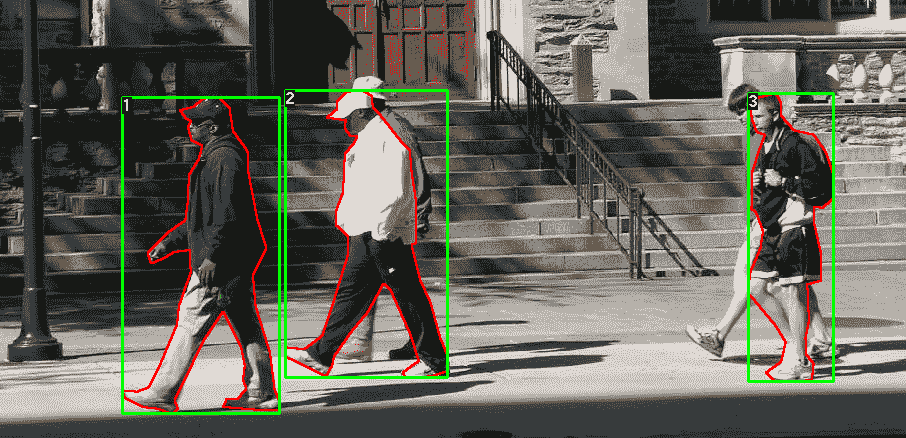
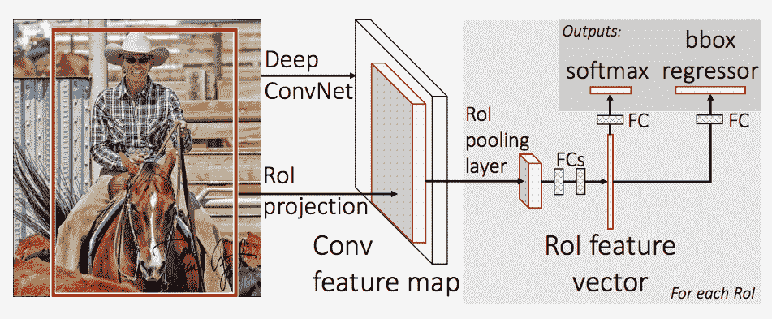
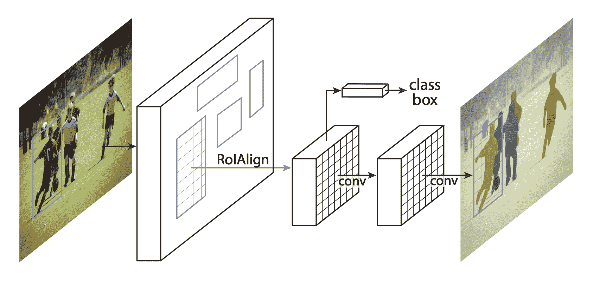
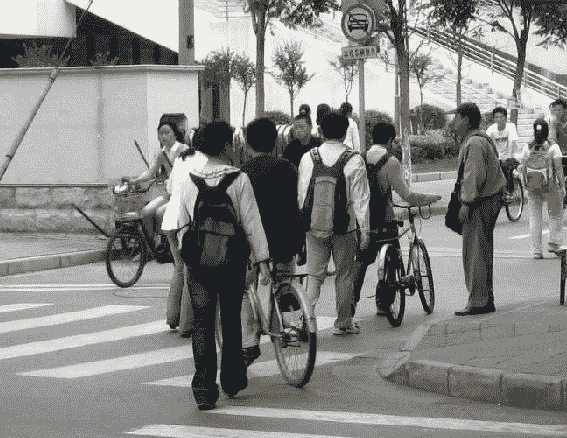
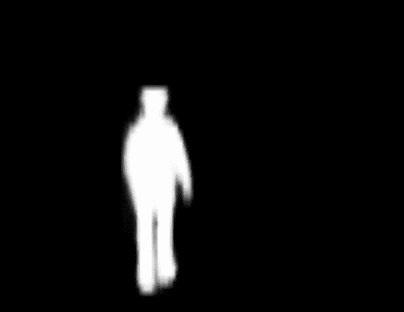
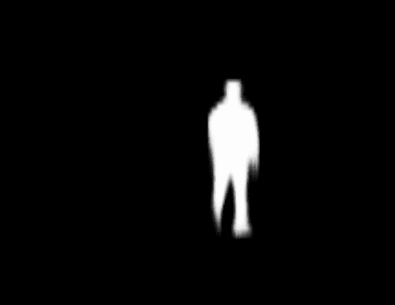

# TorchVision 对象检测微调教程

> 原文： [https://pytorch.org/tutorials/intermediate/torchvision_tutorial.html](https://pytorch.org/tutorials/intermediate/torchvision_tutorial.html)

小费

为了充分利用本教程，我们建议使用此 [Colab 版本](https://colab.research.google.com/github/pytorch/vision/blob/temp-tutorial/tutorials/torchvision_finetuning_instance_segmentation.ipynb)。 这将使您可以尝试以下信息。

在本教程中，我们将在 [Penn-Fudan 数据库中对行人检测和分割](https://www.cis.upenn.edu/~jshi/ped_html/)进行预训练的[遮罩 R-CNN](https://arxiv.org/abs/1703.06870) 模型进行微调。 它包含 170 个图像，其中包含 345 个行人实例，我们将用它来说明如何在 torchvision 中使用新功能，以便在自定义数据集上训练实例细分模型。

## 定义数据集

用于训练对象检测，实例细分和人员关键点检测的参考脚本可轻松支持添加新的自定义数据集。 数据集应继承自标准`torch.utils.data.Dataset`类，并实现`__len__`和`__getitem__`。

我们唯一需要的特异性是数据集`__getitem__`应该返回：

*   图像：大小为`(H, W)`的 PIL 图像
*   目标：包含以下字段的字典
    *   `boxes (FloatTensor[N, 4])`：`[x0, y0, x1, y1]`格式的`N`边界框的坐标，范围从`0`至`W`，从`0`至`H`
    *   `labels (Int64Tensor[N])`：每个边界框的标签
    *   `image_id (Int64Tensor[1])`：图像标识符。 它在数据集中的所有图像之间应该是唯一的，并在评估过程中使用
    *   `area (Tensor[N])`：边界框的区域。 在使用 COCO 度量进行评估时，可使用此值来区分小盒子，中盒子和大盒子之间的度量得分。
    *   `iscrowd (UInt8Tensor[N])`：iscrowd = True 的实例在评估期间将被忽略。
    *   (可选）`masks (UInt8Tensor[N, H, W])`：每个对象的分割蒙版
    *   (可选）`keypoints (FloatTensor[N, K, 3])`：对于 N 个对象中的每个对象，它包含`[x, y, visibility]`格式的 K 个关键点，以定义对象。 可见性= 0 表示关键点不可见。 请注意，对于数据扩充，翻转关键点的概念取决于数据表示形式，您可能应该将`references/detection/transforms.py`修改为新的关键点表示形式

如果您的模型返回上述方法，则它们将使其适用于训练和评估，并将使用`pycocotools`中的评估脚本。

此外，如果要在训练过程中使用长宽比分组(以便每个批次仅包含具有相似长宽比的图像），则建议您还实施`get_height_and_width`方法，该方法返回图像的高度和宽度。 如果未提供此方法，我们将通过`__getitem__`查询数据集的所有元素，这会将图像加载到内存中，并且比提供自定义方法慢。

### 为 PennFudan 编写自定义数据集

让我们为 PennFudan 数据集编写一个数据集。 在[下载并解压缩 zip 文件](https://www.cis.upenn.edu/~jshi/ped_html/PennFudanPed.zip)之后，我们具有以下文件夹结构：

```
PennFudanPed/
  PedMasks/
    FudanPed00001_mask.png
    FudanPed00002_mask.png
    FudanPed00003_mask.png
    FudanPed00004_mask.png
    ...
  PNGImages/
    FudanPed00001.png
    FudanPed00002.png
    FudanPed00003.png
    FudanPed00004.png

```

这是一对图像和分割蒙版的一个示例

 

因此，每个图像都有一个对应的分割蒙版，其中每个颜色对应一个不同的实例。 让我们为此数据集编写一个`torch.utils.data.Dataset`类。

```
import os
import numpy as np
import torch
from PIL import Image

class PennFudanDataset(object):
    def __init__(self, root, transforms):
        self.root = root
        self.transforms = transforms
        # load all image files, sorting them to
        # ensure that they are aligned
        self.imgs = list(sorted(os.listdir(os.path.join(root, "PNGImages"))))
        self.masks = list(sorted(os.listdir(os.path.join(root, "PedMasks"))))

    def __getitem__(self, idx):
        # load images ad masks
        img_path = os.path.join(self.root, "PNGImages", self.imgs[idx])
        mask_path = os.path.join(self.root, "PedMasks", self.masks[idx])
        img = Image.open(img_path).convert("RGB")
        # note that we haven't converted the mask to RGB,
        # because each color corresponds to a different instance
        # with 0 being background
        mask = Image.open(mask_path)
        # convert the PIL Image into a numpy array
        mask = np.array(mask)
        # instances are encoded as different colors
        obj_ids = np.unique(mask)
        # first id is the background, so remove it
        obj_ids = obj_ids[1:]

        # split the color-encoded mask into a set
        # of binary masks
        masks = mask == obj_ids[:, None, None]

        # get bounding box coordinates for each mask
        num_objs = len(obj_ids)
        boxes = []
        for i in range(num_objs):
            pos = np.where(masks[i])
            xmin = np.min(pos[1])
            xmax = np.max(pos[1])
            ymin = np.min(pos[0])
            ymax = np.max(pos[0])
            boxes.append([xmin, ymin, xmax, ymax])

        # convert everything into a torch.Tensor
        boxes = torch.as_tensor(boxes, dtype=torch.float32)
        # there is only one class
        labels = torch.ones((num_objs,), dtype=torch.int64)
        masks = torch.as_tensor(masks, dtype=torch.uint8)

        image_id = torch.tensor([idx])
        area = (boxes[:, 3] - boxes[:, 1]) * (boxes[:, 2] - boxes[:, 0])
        # suppose all instances are not crowd
        iscrowd = torch.zeros((num_objs,), dtype=torch.int64)

        target = {}
        target["boxes"] = boxes
        target["labels"] = labels
        target["masks"] = masks
        target["image_id"] = image_id
        target["area"] = area
        target["iscrowd"] = iscrowd

        if self.transforms is not None:
            img, target = self.transforms(img, target)

        return img, target

    def __len__(self):
        return len(self.imgs)

```

这就是数据集的全部内容。 现在，让我们定义一个可以对该数据集进行预测的模型。

## 定义模型

在本教程中，我们将基于 [Faster R-CNN](https://arxiv.org/abs/1506.01497) 使用 [Mask R-CNN](https://arxiv.org/abs/1703.06870) 。 更快的 R-CNN 是可预测图像中潜在对象的边界框和类分数的模型。



Mask R-CNN 在 Faster R-CNN 中增加了一个分支，该分支还可以预测每个实例的分割掩码。



在两种常见情况下，可能要修改 Torchvision modelzoo 中的可用模型之一。 首先是当我们想从预先训练的模型开始，然后微调最后一层时。 另一个是当我们要用另一个模型替换主干时(例如，为了更快的预测）。

在以下各节中，让我们看看如何做一个或另一个。

### 1-通过预训练模型进行微调

假设您想从在 COCO 上经过预训练的模型开始，并希望针对您的特定班级对其进行微调。 这是一种可行的方法：

```
import torchvision
from torchvision.models.detection.faster_rcnn import FastRCNNPredictor

# load a model pre-trained pre-trained on COCO
model = torchvision.models.detection.fasterrcnn_resnet50_fpn(pretrained=True)

# replace the classifier with a new one, that has
# num_classes which is user-defined
num_classes = 2  # 1 class (person) + background
# get number of input features for the classifier
in_features = model.roi_heads.box_predictor.cls_score.in_features
# replace the pre-trained head with a new one
model.roi_heads.box_predictor = FastRCNNPredictor(in_features, num_classes)

```

### 2-修改模型以添加其他主干

```
import torchvision
from torchvision.models.detection import FasterRCNN
from torchvision.models.detection.rpn import AnchorGenerator

# load a pre-trained model for classification and return
# only the features
backbone = torchvision.models.mobilenet_v2(pretrained=True).features
# FasterRCNN needs to know the number of
# output channels in a backbone. For mobilenet_v2, it's 1280
# so we need to add it here
backbone.out_channels = 1280

# let's make the RPN generate 5 x 3 anchors per spatial
# location, with 5 different sizes and 3 different aspect
# ratios. We have a Tuple[Tuple[int]] because each feature
# map could potentially have different sizes and
# aspect ratios
anchor_generator = AnchorGenerator(sizes=((32, 64, 128, 256, 512),),
                                   aspect_ratios=((0.5, 1.0, 2.0),))

# let's define what are the feature maps that we will
# use to perform the region of interest cropping, as well as
# the size of the crop after rescaling.
# if your backbone returns a Tensor, featmap_names is expected to
# be [0]. More generally, the backbone should return an
# OrderedDict[Tensor], and in featmap_names you can choose which
# feature maps to use.
roi_pooler = torchvision.ops.MultiScaleRoIAlign(featmap_names=[0],
                                                output_size=7,
                                                sampling_ratio=2)

# put the pieces together inside a FasterRCNN model
model = FasterRCNN(backbone,
                   num_classes=2,
                   rpn_anchor_generator=anchor_generator,
                   box_roi_pool=roi_pooler)

```

### PennFudan 数据集的实例细分模型

在我们的例子中，由于我们的数据集非常小，我们希望从预训练的模型中进行微调，因此我们将遵循方法 1。

这里我们还想计算实例分割掩码，因此我们将使用 Mask R-CNN：

```
import torchvision
from torchvision.models.detection.faster_rcnn import FastRCNNPredictor
from torchvision.models.detection.mask_rcnn import MaskRCNNPredictor

def get_model_instance_segmentation(num_classes):
    # load an instance segmentation model pre-trained pre-trained on COCO
    model = torchvision.models.detection.maskrcnn_resnet50_fpn(pretrained=True)

    # get number of input features for the classifier
    in_features = model.roi_heads.box_predictor.cls_score.in_features
    # replace the pre-trained head with a new one
    model.roi_heads.box_predictor = FastRCNNPredictor(in_features, num_classes)

    # now get the number of input features for the mask classifier
    in_features_mask = model.roi_heads.mask_predictor.conv5_mask.in_channels
    hidden_layer = 256
    # and replace the mask predictor with a new one
    model.roi_heads.mask_predictor = MaskRCNNPredictor(in_features_mask,
                                                       hidden_layer,
                                                       num_classes)

    return model

```

就是这样，这将使`model`随时可以在您的自定义数据集上进行训练和评估。

## 放在一起

在`references/detection/`中，我们提供了许多帮助程序功能来简化训练和评估检测模型。 在这里，我们将使用`references/detection/engine.py`，`references/detection/utils.py`和`references/detection/transforms.py`。 只需将它们复制到您的文件夹中并在此处使用它们即可。

让我们写一些辅助函数来进行数据扩充/转换：

```
import transforms as T

def get_transform(train):
    transforms = []
    transforms.append(T.ToTensor())
    if train:
        transforms.append(T.RandomHorizontalFlip(0.5))
    return T.Compose(transforms)

```

## 测试`forward()`方法(可选）

遍历数据集之前，最好先查看模型在训练过程中的期望值以及对样本数据的推断时间。

```
model = torchvision.models.detection.fasterrcnn_resnet50_fpn(pretrained=True)
dataset = PennFudanDataset('PennFudanPed', get_transform(train=True))
data_loader = torch.utils.data.DataLoader(
 dataset, batch_size=2, shuffle=True, num_workers=4,
 collate_fn=utils.collate_fn)
# For Training
images,targets = next(iter(data_loader))
images = list(image for image in images)
targets = [{k: v for k, v in t.items()} for t in targets]
output = model(images,targets)   # Returns losses and detections
# For inference
model.eval()
x = [torch.rand(3, 300, 400), torch.rand(3, 500, 400)]
predictions = model(x)           # Returns predictions

```

现在让我们编写执行训练和验证的主要功能：

```
from engine import train_one_epoch, evaluate
import utils

def main():
    # train on the GPU or on the CPU, if a GPU is not available
    device = torch.device('cuda') if torch.cuda.is_available() else torch.device('cpu')

    # our dataset has two classes only - background and person
    num_classes = 2
    # use our dataset and defined transformations
    dataset = PennFudanDataset('PennFudanPed', get_transform(train=True))
    dataset_test = PennFudanDataset('PennFudanPed', get_transform(train=False))

    # split the dataset in train and test set
    indices = torch.randperm(len(dataset)).tolist()
    dataset = torch.utils.data.Subset(dataset, indices[:-50])
    dataset_test = torch.utils.data.Subset(dataset_test, indices[-50:])

    # define training and validation data loaders
    data_loader = torch.utils.data.DataLoader(
        dataset, batch_size=2, shuffle=True, num_workers=4,
        collate_fn=utils.collate_fn)

    data_loader_test = torch.utils.data.DataLoader(
        dataset_test, batch_size=1, shuffle=False, num_workers=4,
        collate_fn=utils.collate_fn)

    # get the model using our helper function
    model = get_model_instance_segmentation(num_classes)

    # move model to the right device
    model.to(device)

    # construct an optimizer
    params = [p for p in model.parameters() if p.requires_grad]
    optimizer = torch.optim.SGD(params, lr=0.005,
                                momentum=0.9, weight_decay=0.0005)
    # and a learning rate scheduler
    lr_scheduler = torch.optim.lr_scheduler.StepLR(optimizer,
                                                   step_size=3,
                                                   gamma=0.1)

    # let's train it for 10 epochs
    num_epochs = 10

    for epoch in range(num_epochs):
        # train for one epoch, printing every 10 iterations
        train_one_epoch(model, optimizer, data_loader, device, epoch, print_freq=10)
        # update the learning rate
        lr_scheduler.step()
        # evaluate on the test dataset
        evaluate(model, data_loader_test, device=device)

    print("That's it!")

```

您应该获得第一个时期的输出：

```
Epoch: [0]  [ 0/60]  eta: 0:01:18  lr: 0.000090  loss: 2.5213 (2.5213)  loss_classifier: 0.8025 (0.8025)  loss_box_reg: 0.2634 (0.2634)  loss_mask: 1.4265 (1.4265)  loss_objectness: 0.0190 (0.0190)  loss_rpn_box_reg: 0.0099 (0.0099)  time: 1.3121  data: 0.3024  max mem: 3485
Epoch: [0]  [10/60]  eta: 0:00:20  lr: 0.000936  loss: 1.3007 (1.5313)  loss_classifier: 0.3979 (0.4719)  loss_box_reg: 0.2454 (0.2272)  loss_mask: 0.6089 (0.7953)  loss_objectness: 0.0197 (0.0228)  loss_rpn_box_reg: 0.0121 (0.0141)  time: 0.4198  data: 0.0298  max mem: 5081
Epoch: [0]  [20/60]  eta: 0:00:15  lr: 0.001783  loss: 0.7567 (1.1056)  loss_classifier: 0.2221 (0.3319)  loss_box_reg: 0.2002 (0.2106)  loss_mask: 0.2904 (0.5332)  loss_objectness: 0.0146 (0.0176)  loss_rpn_box_reg: 0.0094 (0.0123)  time: 0.3293  data: 0.0035  max mem: 5081
Epoch: [0]  [30/60]  eta: 0:00:11  lr: 0.002629  loss: 0.4705 (0.8935)  loss_classifier: 0.0991 (0.2517)  loss_box_reg: 0.1578 (0.1957)  loss_mask: 0.1970 (0.4204)  loss_objectness: 0.0061 (0.0140)  loss_rpn_box_reg: 0.0075 (0.0118)  time: 0.3403  data: 0.0044  max mem: 5081
Epoch: [0]  [40/60]  eta: 0:00:07  lr: 0.003476  loss: 0.3901 (0.7568)  loss_classifier: 0.0648 (0.2022)  loss_box_reg: 0.1207 (0.1736)  loss_mask: 0.1705 (0.3585)  loss_objectness: 0.0018 (0.0113)  loss_rpn_box_reg: 0.0075 (0.0112)  time: 0.3407  data: 0.0044  max mem: 5081
Epoch: [0]  [50/60]  eta: 0:00:03  lr: 0.004323  loss: 0.3237 (0.6703)  loss_classifier: 0.0474 (0.1731)  loss_box_reg: 0.1109 (0.1561)  loss_mask: 0.1658 (0.3201)  loss_objectness: 0.0015 (0.0093)  loss_rpn_box_reg: 0.0093 (0.0116)  time: 0.3379  data: 0.0043  max mem: 5081
Epoch: [0]  [59/60]  eta: 0:00:00  lr: 0.005000  loss: 0.2540 (0.6082)  loss_classifier: 0.0309 (0.1526)  loss_box_reg: 0.0463 (0.1405)  loss_mask: 0.1568 (0.2945)  loss_objectness: 0.0012 (0.0083)  loss_rpn_box_reg: 0.0093 (0.0123)  time: 0.3489  data: 0.0042  max mem: 5081
Epoch: [0] Total time: 0:00:21 (0.3570 s / it)
creating index...
index created!
Test:  [ 0/50]  eta: 0:00:19  model_time: 0.2152 (0.2152)  evaluator_time: 0.0133 (0.0133)  time: 0.4000  data: 0.1701  max mem: 5081
Test:  [49/50]  eta: 0:00:00  model_time: 0.0628 (0.0687)  evaluator_time: 0.0039 (0.0064)  time: 0.0735  data: 0.0022  max mem: 5081
Test: Total time: 0:00:04 (0.0828 s / it)
Averaged stats: model_time: 0.0628 (0.0687)  evaluator_time: 0.0039 (0.0064)
Accumulating evaluation results...
DONE (t=0.01s).
Accumulating evaluation results...
DONE (t=0.01s).
IoU metric: bbox
 Average Precision  (AP) @[ IoU=0.50:0.95 | area=   all | maxDets=100 ] = 0.606
 Average Precision  (AP) @[ IoU=0.50      | area=   all | maxDets=100 ] = 0.984
 Average Precision  (AP) @[ IoU=0.75      | area=   all | maxDets=100 ] = 0.780
 Average Precision  (AP) @[ IoU=0.50:0.95 | area= small | maxDets=100 ] = 0.313
 Average Precision  (AP) @[ IoU=0.50:0.95 | area=medium | maxDets=100 ] = 0.582
 Average Precision  (AP) @[ IoU=0.50:0.95 | area= large | maxDets=100 ] = 0.612
 Average Recall     (AR) @[ IoU=0.50:0.95 | area=   all | maxDets=  1 ] = 0.270
 Average Recall     (AR) @[ IoU=0.50:0.95 | area=   all | maxDets= 10 ] = 0.672
 Average Recall     (AR) @[ IoU=0.50:0.95 | area=   all | maxDets=100 ] = 0.672
 Average Recall     (AR) @[ IoU=0.50:0.95 | area= small | maxDets=100 ] = 0.650
 Average Recall     (AR) @[ IoU=0.50:0.95 | area=medium | maxDets=100 ] = 0.755
 Average Recall     (AR) @[ IoU=0.50:0.95 | area= large | maxDets=100 ] = 0.664
IoU metric: segm
 Average Precision  (AP) @[ IoU=0.50:0.95 | area=   all | maxDets=100 ] = 0.704
 Average Precision  (AP) @[ IoU=0.50      | area=   all | maxDets=100 ] = 0.979
 Average Precision  (AP) @[ IoU=0.75      | area=   all | maxDets=100 ] = 0.871
 Average Precision  (AP) @[ IoU=0.50:0.95 | area= small | maxDets=100 ] = 0.325
 Average Precision  (AP) @[ IoU=0.50:0.95 | area=medium | maxDets=100 ] = 0.488
 Average Precision  (AP) @[ IoU=0.50:0.95 | area= large | maxDets=100 ] = 0.727
 Average Recall     (AR) @[ IoU=0.50:0.95 | area=   all | maxDets=  1 ] = 0.316
 Average Recall     (AR) @[ IoU=0.50:0.95 | area=   all | maxDets= 10 ] = 0.748
 Average Recall     (AR) @[ IoU=0.50:0.95 | area=   all | maxDets=100 ] = 0.749
 Average Recall     (AR) @[ IoU=0.50:0.95 | area= small | maxDets=100 ] = 0.650
 Average Recall     (AR) @[ IoU=0.50:0.95 | area=medium | maxDets=100 ] = 0.673
 Average Recall     (AR) @[ IoU=0.50:0.95 | area= large | maxDets=100 ] = 0.758

```

因此，经过一个时期的训练，我们获得了 60.6 的 COCO 风格 mAP 和 70.4 的口罩 mAP。

经过 10 个时期的训练，我得到了以下指标

```
IoU metric: bbox
 Average Precision  (AP) @[ IoU=0.50:0.95 | area=   all | maxDets=100 ] = 0.799
 Average Precision  (AP) @[ IoU=0.50      | area=   all | maxDets=100 ] = 0.969
 Average Precision  (AP) @[ IoU=0.75      | area=   all | maxDets=100 ] = 0.935
 Average Precision  (AP) @[ IoU=0.50:0.95 | area= small | maxDets=100 ] = 0.349
 Average Precision  (AP) @[ IoU=0.50:0.95 | area=medium | maxDets=100 ] = 0.592
 Average Precision  (AP) @[ IoU=0.50:0.95 | area= large | maxDets=100 ] = 0.831
 Average Recall     (AR) @[ IoU=0.50:0.95 | area=   all | maxDets=  1 ] = 0.324
 Average Recall     (AR) @[ IoU=0.50:0.95 | area=   all | maxDets= 10 ] = 0.844
 Average Recall     (AR) @[ IoU=0.50:0.95 | area=   all | maxDets=100 ] = 0.844
 Average Recall     (AR) @[ IoU=0.50:0.95 | area= small | maxDets=100 ] = 0.400
 Average Recall     (AR) @[ IoU=0.50:0.95 | area=medium | maxDets=100 ] = 0.777
 Average Recall     (AR) @[ IoU=0.50:0.95 | area= large | maxDets=100 ] = 0.870
IoU metric: segm
 Average Precision  (AP) @[ IoU=0.50:0.95 | area=   all | maxDets=100 ] = 0.761
 Average Precision  (AP) @[ IoU=0.50      | area=   all | maxDets=100 ] = 0.969
 Average Precision  (AP) @[ IoU=0.75      | area=   all | maxDets=100 ] = 0.919
 Average Precision  (AP) @[ IoU=0.50:0.95 | area= small | maxDets=100 ] = 0.341
 Average Precision  (AP) @[ IoU=0.50:0.95 | area=medium | maxDets=100 ] = 0.464
 Average Precision  (AP) @[ IoU=0.50:0.95 | area= large | maxDets=100 ] = 0.788
 Average Recall     (AR) @[ IoU=0.50:0.95 | area=   all | maxDets=  1 ] = 0.303
 Average Recall     (AR) @[ IoU=0.50:0.95 | area=   all | maxDets= 10 ] = 0.799
 Average Recall     (AR) @[ IoU=0.50:0.95 | area=   all | maxDets=100 ] = 0.799
 Average Recall     (AR) @[ IoU=0.50:0.95 | area= small | maxDets=100 ] = 0.400
 Average Recall     (AR) @[ IoU=0.50:0.95 | area=medium | maxDets=100 ] = 0.769
 Average Recall     (AR) @[ IoU=0.50:0.95 | area= large | maxDets=100 ] = 0.818

```

但是这些预测是什么样的？ 让我们在数据集中拍摄一张图像并进行验证



经过训练的模型会在此图片中预测 9 个人物实例，让我们看看其中的几个：

 

结果看起来还不错！

## 包起来

在本教程中，您学习了如何在自定义数据集上为实例细分模型创建自己的训练管道。 为此，您编写了一个`torch.utils.data.Dataset`类，该类返回图像以及地面真相框和分段蒙版。 您还利用了在 COCO train2017 上预先训练的 Mask R-CNN 模型，以便对该新数据集执行转移学习。

对于更完整的示例(包括多机/多 GPU 训练），请检查在 Torchvision 存储库中存在的`references/detection/train.py`。

您可以在处下载本教程[的完整源文件。](https://pytorch.org/tutorials/_static/tv-training-code.py)