# 概率分布-torch分布

> 原文： [https://pytorch.org/docs/stable/distributions.html](https://pytorch.org/docs/stable/distributions.html)

`distributions`程序包包含可参数化的概率分布和采样函数。 这允许构造用于优化的随机计算图和随机梯度估计器。 该软件包通常遵循 [TensorFlow Distributions](https://arxiv.org/abs/1711.10604) 软件包的设计。

无法直接反向传播随机样本。 但是，有两种主要的方法可以创建可以反向传播的代理功能。 它们是得分函数估计器/似然比估计器/ REINFORCE 和路径导数估计器。 REINFORCE 通常被认为是强化学习中策略梯度方法的基础，而路径派生估计器通常出现在变分自动编码器的重新参数化技巧中。 虽然得分函数仅需要样本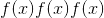的值，但路径导数需要导数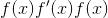。 下一节将在强化学习示例中讨论这两个方面。 有关更多详细信息，请参见使用随机计算图的[梯度估计。](https://arxiv.org/abs/1506.05254)

## 评分功能

当概率密度函数的参数可微时，我们只需要`sample()`和`log_prob()`即可实现 REINFORCE：

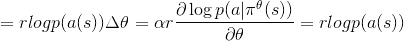

其中是参数，是学习率，是奖励，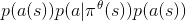是在给定策略的状态下在状态下采取行动的概率。

在实践中，我们将从网络的输出中采样一个动作，将该动作应用于环境中，然后使用`log_prob`构造等效的损失函数。 请注意，由于优化程序使用梯度下降，因此我们使用负值，而上述规则假定梯度上升。 使用分类策略，用于实现 REINFORCE 的代码如下：

```
probs = policy_network(state)
# Note that this is equivalent to what used to be called multinomial
m = Categorical(probs)
action = m.sample()
next_state, reward = env.step(action)
loss = -m.log_prob(action) * reward
loss.backward()

```

## 路径导数

实现这些随机/策略梯度的另一种方法是使用`rsample()`方法中的重新参数化技巧，其中可以通过无参数随机变量的参数化确定性函数构造参数化随机变量。 因此，重新参数化的样本变得可微。 用于实现按路径导数的代码如下：

```
params = policy_network(state)
m = Normal(*params)
# Any distribution with .has_rsample == True could work based on the application
action = m.rsample()
next_state, reward = env.step(action)  # Assuming that reward is differentiable
loss = -reward
loss.backward()

```

## 分配

* * *

```
class torch.distributions.distribution.Distribution(batch_shape=torch.Size([]), event_shape=torch.Size([]), validate_args=None)¶
```

基数：`object`

分布是概率分布的抽象基类。

* * *

```
property arg_constraints¶
```

返回从参数名称到 [`Constraint`](#torch.distributions.constraints.Constraint "torch.distributions.constraints.Constraint") 对象的字典，此分布的每个参数都应满足该对象。 不是 tensor 的 Args 不必出现在此字典中。

* * *

```
property batch_shape¶
```

返回批处理参数的形状。

* * *

```
cdf(value)¶
```

返回以&lt;cite&gt;值&lt;/cite&gt;评估的累积密度/质量函数。

参数

**值** ([_tensor_](tensors.html#torch.Tensor "torch.Tensor"))–

* * *

```
entropy()¶
```

返回分配的熵，在 batch_shape 中批处理。

退货

形状 batch_shape 的张量。

* * *

```
enumerate_support(expand=True)¶
```

返回包含离散分布支持的所有值的张量。 结果将在维度 0 上枚举，因此结果的形状将为&lt;cite&gt;(基数）+ batch_shape + event_shape&lt;/cite&gt; (其中对于单变量分布，其中 &lt;cite&gt;event_shape =(）&lt;/cite&gt;）。

注意，这枚举所有以锁步 &lt;cite&gt;[[0，0]，[1，1]，…]&lt;/cite&gt; 组成的张量。 在 &lt;cite&gt;expand = False&lt;/cite&gt; 的情况下，枚举沿暗淡 0 进行，但其余批次尺寸为单例尺寸 &lt;cite&gt;[[0]，[1]，..&lt;/cite&gt; 。

要遍历整个笛卡尔积，请使用 &lt;cite&gt;itertools.product(m.enumerate_support(））&lt;/cite&gt;。

Parameters

**扩展** (_bool_ )–是否扩展对批次暗淡的支持以匹配发行版的 &lt;cite&gt;batch_shape&lt;/cite&gt; 。

Returns

张量在维度 0 上迭代。

* * *

```
property event_shape¶
```

返回单个样品的形状(不分批）。

* * *

```
expand(batch_shape, _instance=None)¶
```

返回一个新的分发实例(或填充派生类提供的现有实例），其批次尺寸扩展为 &lt;cite&gt;batch_shape&lt;/cite&gt; 。 此方法在发行版的参数上调用 [`expand`](tensors.html#torch.Tensor.expand "torch.Tensor.expand") 。 因此，这不会为扩展的分发实例分配新的内存。 此外，首次创建实例时，此操作不会在 &lt;cite&gt;__init__.py&lt;/cite&gt; 中重复任何参数检查或参数广播。

Parameters

*   **batch_shape** (_torch尺寸_）–所需的扩展尺寸。

*   **_instance** -子类提供的需要重写 &lt;cite&gt;.expand&lt;/cite&gt; 的新实例。

Returns

具有批次尺寸的新分发实例已扩展为 &lt;cite&gt;batch_size&lt;/cite&gt; 。

* * *

```
icdf(value)¶
```

返回以&lt;cite&gt;值&lt;/cite&gt;评估的逆累积密度/质量函数。

Parameters

**value** ([_Tensor_](tensors.html#torch.Tensor "torch.Tensor")) –

* * *

```
log_prob(value)¶
```

返回以&lt;cite&gt;值&lt;/cite&gt;评估的概率密度/质量函数的对数。

Parameters

**value** ([_Tensor_](tensors.html#torch.Tensor "torch.Tensor")) –

* * *

```
property mean¶
```

返回分布的平均值。

* * *

```
perplexity()¶
```

返回分配的复杂性，按 batch_shape 批处理。

Returns

Tensor of shape batch_shape.

* * *

```
rsample(sample_shape=torch.Size([]))¶
```

如果分配了分布参数，则生成一个 sample_shape 形状的重新参数化样本或 sample_shape 形状的一批重新参数化样本。

* * *

```
sample(sample_shape=torch.Size([]))¶
```

如果分配参数是批处理的，则生成 sample_shape 形状的样本或 sample_shape 形状的样本批。

* * *

```
sample_n(n)¶
```

如果分配了分布参数，则生成 n 个样本或 n 个样本批次。

* * *

```
property stddev¶
```

返回分布的标准偏差。

* * *

```
property support¶
```

返回表示此发行版支持的 [`Constraint`](#torch.distributions.constraints.Constraint "torch.distributions.constraints.Constraint") 对象。

* * *

```
property variance¶
```

返回分布的方差。

## 指数家族

* * *

```
class torch.distributions.exp_family.ExponentialFamily(batch_shape=torch.Size([]), event_shape=torch.Size([]), validate_args=None)¶
```

碱基： [`torch.distributions.distribution.Distribution`](#torch.distributions.distribution.Distribution "torch.distributions.distribution.Distribution")

ExponentialFamily 是属于指数族的概率分布的抽象基类，其概率质量/密度函数的形式如下

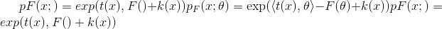

其中表示自然参数，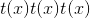表示足够的统计量，是给定族的对数归一化函数，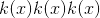是载波测量。

注意

此类是&lt;cite&gt;分布&lt;/cite&gt;类和属于指数家族的分布之间的中介，主要是检查 &lt;cite&gt;.entropy(）&lt;/cite&gt;和分析性 KL 散度方法的正确性。 我们使用此类使用 AD 框架和 Bregman 散度来计算熵和 KL 散度(由 Frank Nielsen 和 Richard Nock 提供，指数族的熵和交叉熵）。

* * *

```
entropy()¶
```

使用对数归一化器的 Bregman 散度来计算熵的方法。

## 伯努利

* * *

```
class torch.distributions.bernoulli.Bernoulli(probs=None, logits=None, validate_args=None)¶
```

碱基： [`torch.distributions.exp_family.ExponentialFamily`](#torch.distributions.exp_family.ExponentialFamily "torch.distributions.exp_family.ExponentialFamily")

创建一个由 [`probs`](#torch.distributions.bernoulli.Bernoulli.probs "torch.distributions.bernoulli.Bernoulli.probs") 或 [`logits`](#torch.distributions.bernoulli.Bernoulli.logits "torch.distributions.bernoulli.Bernoulli.logits") 参数化的伯努利分布(但不能同时包含两者）。

样本为二进制(0 或 1）。 它们以概率 &lt;cite&gt;p&lt;/cite&gt; 取值 &lt;cite&gt;1&lt;/cite&gt; ，以概率 &lt;cite&gt;1 -p&lt;/cite&gt; 取值 &lt;cite&gt;0&lt;/cite&gt; 。

例：

```
>>> m = Bernoulli(torch.tensor([0.3]))
>>> m.sample()  # 30% chance 1; 70% chance 0
tensor([ 0.])

```

Parameters

*   **概率**(_编号_ _，_ [_tensor_](tensors.html#torch.Tensor "torch.Tensor"))–采样 &lt;cite&gt;1&lt;/cite&gt; 的概率

*   **对数**(_编号_ _，_ [_tensor_](tensors.html#torch.Tensor "torch.Tensor"))–采样的对数奇数 &lt;cite&gt;1&lt;/cite&gt;

```
arg_constraints = {'logits': Real(), 'probs': Interval(lower_bound=0.0, upper_bound=1.0)}¶
```

* * *

```
entropy()¶
```

* * *

```
enumerate_support(expand=True)¶
```

* * *

```
expand(batch_shape, _instance=None)¶
```

```
has_enumerate_support = True¶
```

* * *

```
log_prob(value)¶
```

```
logits¶
```

* * *

```
property mean¶
```

* * *

```
property param_shape¶
```

```
probs¶
```

* * *

```
sample(sample_shape=torch.Size([]))¶
```

```
support = Boolean()¶
```

* * *

```
property variance¶
```

## 贝塔

* * *

```
class torch.distributions.beta.Beta(concentration1, concentration0, validate_args=None)¶
```

Bases: [`torch.distributions.exp_family.ExponentialFamily`](#torch.distributions.exp_family.ExponentialFamily "torch.distributions.exp_family.ExponentialFamily")

由 [`concentration1`](#torch.distributions.beta.Beta.concentration1 "torch.distributions.beta.Beta.concentration1") 和 [`concentration0`](#torch.distributions.beta.Beta.concentration0 "torch.distributions.beta.Beta.concentration0") 参数化的 Beta 分布。

Example:

```
>>> m = Beta(torch.tensor([0.5]), torch.tensor([0.5]))
>>> m.sample()  # Beta distributed with concentration concentration1 and concentration0
tensor([ 0.1046])

```

Parameters

*   **浓度 1**  (_python：float_ _或_ [_tensor_](tensors.html#torch.Tensor "torch.Tensor"))–分布的第一浓度参数(通常称为浓度参数） α）

*   **浓度 0**  (_python：float_ _或_ [_tensor_](tensors.html#torch.Tensor "torch.Tensor"))–分布的第二个浓度参数(通常称为 Beta）

```
arg_constraints = {'concentration0': GreaterThan(lower_bound=0.0), 'concentration1': GreaterThan(lower_bound=0.0)}¶
```

* * *

```
property concentration0¶
```

* * *

```
property concentration1¶
```

* * *

```
entropy()¶
```

* * *

```
expand(batch_shape, _instance=None)¶
```

```
has_rsample = True¶
```

* * *

```
log_prob(value)¶
```

* * *

```
property mean¶
```

* * *

```
rsample(sample_shape=())¶
```

```
support = Interval(lower_bound=0.0, upper_bound=1.0)¶
```

* * *

```
property variance¶
```

## 二项式

* * *

```
class torch.distributions.binomial.Binomial(total_count=1, probs=None, logits=None, validate_args=None)¶
```

Bases: [`torch.distributions.distribution.Distribution`](#torch.distributions.distribution.Distribution "torch.distributions.distribution.Distribution")

创建由`total_count`和 [`probs`](#torch.distributions.binomial.Binomial.probs "torch.distributions.binomial.Binomial.probs") 或 [`logits`](#torch.distributions.binomial.Binomial.logits "torch.distributions.binomial.Binomial.logits") (但不是全部）参数化的二项分布。 `total_count`必须可与 [`probs`](#torch.distributions.binomial.Binomial.probs "torch.distributions.binomial.Binomial.probs") / [`logits`](#torch.distributions.binomial.Binomial.logits "torch.distributions.binomial.Binomial.logits") 广播。

Example:

```
>>> m = Binomial(100, torch.tensor([0 , .2, .8, 1]))
>>> x = m.sample()
tensor([   0.,   22.,   71.,  100.])

>>> m = Binomial(torch.tensor([[5.], [10.]]), torch.tensor([0.5, 0.8]))
>>> x = m.sample()
tensor([[ 4.,  5.],
        [ 7.,  6.]])

```

Parameters

*   **total_count**  (_python：int_ _或_ [_tensor_](tensors.html#torch.Tensor "torch.Tensor"))–伯努利试验次数

*   **概率** ([_tensor_](tensors.html#torch.Tensor "torch.Tensor"))–事件概率

*   **logits**  ([_tensor_](tensors.html#torch.Tensor "torch.Tensor"))–事件对数

```
arg_constraints = {'logits': Real(), 'probs': Interval(lower_bound=0.0, upper_bound=1.0), 'total_count': IntegerGreaterThan(lower_bound=0)}¶
```

* * *

```
enumerate_support(expand=True)¶
```

* * *

```
expand(batch_shape, _instance=None)¶
```

```
has_enumerate_support = True¶
```

* * *

```
log_prob(value)¶
```

```
logits¶
```

* * *

```
property mean¶
```

* * *

```
property param_shape¶
```

```
probs¶
```

* * *

```
sample(sample_shape=torch.Size([]))¶
```

* * *

```
property support¶
```

* * *

```
property variance¶
```

## 分类的

* * *

```
class torch.distributions.categorical.Categorical(probs=None, logits=None, validate_args=None)¶
```

Bases: [`torch.distributions.distribution.Distribution`](#torch.distributions.distribution.Distribution "torch.distributions.distribution.Distribution")

创建由 [`probs`](#torch.distributions.categorical.Categorical.probs "torch.distributions.categorical.Categorical.probs") 或 [`logits`](#torch.distributions.categorical.Categorical.logits "torch.distributions.categorical.Categorical.logits") (但不是全部）参数化的分类分布。

Note

等效于 [`torch.multinomial()`](torch.html#torch.multinomial "torch.multinomial") 采样的分布。

样本是来自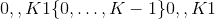的整数，其中 &lt;cite&gt;K&lt;/cite&gt; 为`probs.size(-1)`。

如果 [`probs`](#torch.distributions.categorical.Categorical.probs "torch.distributions.categorical.Categorical.probs") 为一维且长度为 &lt;cite&gt;K&lt;/cite&gt; ，则每个元素都是在该索引处采样类别的相对概率。

如果 [`probs`](#torch.distributions.categorical.Categorical.probs "torch.distributions.categorical.Categorical.probs") 为 2D，则将其视为一批相对概率向量。

Note

[`probs`](#torch.distributions.categorical.Categorical.probs "torch.distributions.categorical.Categorical.probs") 必须为非负数，有限且总和为非零，并且将其归一化为 1。

另请参见： [`torch.multinomial()`](torch.html#torch.multinomial "torch.multinomial")

Example:

```
>>> m = Categorical(torch.tensor([ 0.25, 0.25, 0.25, 0.25 ]))
>>> m.sample()  # equal probability of 0, 1, 2, 3
tensor(3)

```

Parameters

*   **概率** ([_tensor_](tensors.html#torch.Tensor "torch.Tensor"))–事件概率

*   **logits**  ([_tensor_](tensors.html#torch.Tensor "torch.Tensor"))–事件对数

```
arg_constraints = {'logits': Real(), 'probs': Simplex()}¶
```

* * *

```
entropy()¶
```

* * *

```
enumerate_support(expand=True)¶
```

* * *

```
expand(batch_shape, _instance=None)¶
```

```
has_enumerate_support = True¶
```

* * *

```
log_prob(value)¶
```

```
logits¶
```

* * *

```
property mean¶
```

* * *

```
property param_shape¶
```

```
probs¶
```

* * *

```
sample(sample_shape=torch.Size([]))¶
```

* * *

```
property support¶
```

* * *

```
property variance¶
```

## 柯西

* * *

```
class torch.distributions.cauchy.Cauchy(loc, scale, validate_args=None)¶
```

Bases: [`torch.distributions.distribution.Distribution`](#torch.distributions.distribution.Distribution "torch.distributions.distribution.Distribution")

来自柯西(洛伦兹）分布的样本。 具有均值 &lt;cite&gt;0&lt;/cite&gt; 的独立正态分布随机变量的比率分布遵循柯西分布。

Example:

```
>>> m = Cauchy(torch.tensor([0.0]), torch.tensor([1.0]))
>>> m.sample()  # sample from a Cauchy distribution with loc=0 and scale=1
tensor([ 2.3214])

```

Parameters

*   **loc**  (_python：float_ _或_ [_tensor_](tensors.html#torch.Tensor "torch.Tensor"))–分布的中位数。

*   **比例尺** (_python：float_ _或_ [_tensor_](tensors.html#torch.Tensor "torch.Tensor"))–半宽度为一半的最大值。

```
arg_constraints = {'loc': Real(), 'scale': GreaterThan(lower_bound=0.0)}¶
```

* * *

```
cdf(value)¶
```

* * *

```
entropy()¶
```

* * *

```
expand(batch_shape, _instance=None)¶
```

```
has_rsample = True¶
```

* * *

```
icdf(value)¶
```

* * *

```
log_prob(value)¶
```

* * *

```
property mean¶
```

* * *

```
rsample(sample_shape=torch.Size([]))¶
```

```
support = Real()¶
```

* * *

```
property variance¶
```

## 22

* * *

```
class torch.distributions.chi2.Chi2(df, validate_args=None)¶
```

碱基： [`torch.distributions.gamma.Gamma`](#torch.distributions.gamma.Gamma "torch.distributions.gamma.Gamma")

创建通过形状参数 [`df`](#torch.distributions.chi2.Chi2.df "torch.distributions.chi2.Chi2.df") 参数化的 Chi2 分布。 这完全等同于`Gamma(alpha=0.5*df, beta=0.5)`

Example:

```
>>> m = Chi2(torch.tensor([1.0]))
>>> m.sample()  # Chi2 distributed with shape df=1
tensor([ 0.1046])

```

Parameters

**df**  (_python：float_ _或_ [_tensor_](tensors.html#torch.Tensor "torch.Tensor"))–分布的形状参数

```
arg_constraints = {'df': GreaterThan(lower_bound=0.0)}¶
```

* * *

```
property df¶
```

* * *

```
expand(batch_shape, _instance=None)¶
```

## Dirichlet

* * *

```
class torch.distributions.dirichlet.Dirichlet(concentration, validate_args=None)¶
```

Bases: [`torch.distributions.exp_family.ExponentialFamily`](#torch.distributions.exp_family.ExponentialFamily "torch.distributions.exp_family.ExponentialFamily")

创建通过浓度`concentration`参数化的 Dirichlet 分布。

Example:

```
>>> m = Dirichlet(torch.tensor([0.5, 0.5]))
>>> m.sample()  # Dirichlet distributed with concentrarion concentration
tensor([ 0.1046,  0.8954])

```

Parameters

**浓度** ([_tensor_](tensors.html#torch.Tensor "torch.Tensor"))–浓度参数分布(通常称为 alpha）

```
arg_constraints = {'concentration': GreaterThan(lower_bound=0.0)}¶
```

* * *

```
entropy()¶
```

* * *

```
expand(batch_shape, _instance=None)¶
```

```
has_rsample = True¶
```

* * *

```
log_prob(value)¶
```

* * *

```
property mean¶
```

* * *

```
rsample(sample_shape=())¶
```

```
support = Simplex()¶
```

* * *

```
property variance¶
```

## 指数的

* * *

```
class torch.distributions.exponential.Exponential(rate, validate_args=None)¶
```

Bases: [`torch.distributions.exp_family.ExponentialFamily`](#torch.distributions.exp_family.ExponentialFamily "torch.distributions.exp_family.ExponentialFamily")

创建由`rate`参数化的指数分布。

Example:

```
>>> m = Exponential(torch.tensor([1.0]))
>>> m.sample()  # Exponential distributed with rate=1
tensor([ 0.1046])

```

Parameters

**比率** (_python：float_ _或_ [_tensor_](tensors.html#torch.Tensor "torch.Tensor"))–比率= 1 /分布范围

```
arg_constraints = {'rate': GreaterThan(lower_bound=0.0)}¶
```

* * *

```
cdf(value)¶
```

* * *

```
entropy()¶
```

* * *

```
expand(batch_shape, _instance=None)¶
```

```
has_rsample = True¶
```

* * *

```
icdf(value)¶
```

* * *

```
log_prob(value)¶
```

* * *

```
property mean¶
```

* * *

```
rsample(sample_shape=torch.Size([]))¶
```

* * *

```
property stddev¶
```

```
support = GreaterThan(lower_bound=0.0)¶
```

* * *

```
property variance¶
```

## FisherSnedecor

* * *

```
class torch.distributions.fishersnedecor.FisherSnedecor(df1, df2, validate_args=None)¶
```

Bases: [`torch.distributions.distribution.Distribution`](#torch.distributions.distribution.Distribution "torch.distributions.distribution.Distribution")

创建由`df1`和`df2`参数化的 Fisher-Snedecor 分布。

Example:

```
>>> m = FisherSnedecor(torch.tensor([1.0]), torch.tensor([2.0]))
>>> m.sample()  # Fisher-Snedecor-distributed with df1=1 and df2=2
tensor([ 0.2453])

```

Parameters

*   **df1**  (_python：float_ _或_ [_tensor_](tensors.html#torch.Tensor "torch.Tensor"))–自由度参数 1

*   **df2**  (_python：float_ _或_ [_tensor_](tensors.html#torch.Tensor "torch.Tensor"))–自由度参数 2

```
arg_constraints = {'df1': GreaterThan(lower_bound=0.0), 'df2': GreaterThan(lower_bound=0.0)}¶
```

* * *

```
expand(batch_shape, _instance=None)¶
```

```
has_rsample = True¶
```

* * *

```
log_prob(value)¶
```

* * *

```
property mean¶
```

* * *

```
rsample(sample_shape=torch.Size([]))¶
```

```
support = GreaterThan(lower_bound=0.0)¶
```

* * *

```
property variance¶
```

## 伽玛

* * *

```
class torch.distributions.gamma.Gamma(concentration, rate, validate_args=None)¶
```

Bases: [`torch.distributions.exp_family.ExponentialFamily`](#torch.distributions.exp_family.ExponentialFamily "torch.distributions.exp_family.ExponentialFamily")

创建通过形状`concentration`和`rate`参数化的 Gamma 分布。

Example:

```
>>> m = Gamma(torch.tensor([1.0]), torch.tensor([1.0]))
>>> m.sample()  # Gamma distributed with concentration=1 and rate=1
tensor([ 0.1046])

```

Parameters

*   **浓度** (_python：float_ _或_ [_tensor_](tensors.html#torch.Tensor "torch.Tensor"))–分布形状参数(通常称为 alpha )

*   **比率** (_python：float_ _或_ [_tensor_](tensors.html#torch.Tensor "torch.Tensor"))–比率= 1 /分布比例(通常称为 到 beta）

```
arg_constraints = {'concentration': GreaterThan(lower_bound=0.0), 'rate': GreaterThan(lower_bound=0.0)}¶
```

* * *

```
entropy()¶
```

* * *

```
expand(batch_shape, _instance=None)¶
```

```
has_rsample = True¶
```

* * *

```
log_prob(value)¶
```

* * *

```
property mean¶
```

* * *

```
rsample(sample_shape=torch.Size([]))¶
```

```
support = GreaterThan(lower_bound=0.0)¶
```

* * *

```
property variance¶
```

## 几何

* * *

```
class torch.distributions.geometric.Geometric(probs=None, logits=None, validate_args=None)¶
```

Bases: [`torch.distributions.distribution.Distribution`](#torch.distributions.distribution.Distribution "torch.distributions.distribution.Distribution")

创建由 [`probs`](#torch.distributions.geometric.Geometric.probs "torch.distributions.geometric.Geometric.probs") 参数化的几何分布，其中 [`probs`](#torch.distributions.geometric.Geometric.probs "torch.distributions.geometric.Geometric.probs") 是伯努利试验成功的概率。 它表示在 Bernoulli 试验中，第一个试验失败后才看到成功的可能性。

样本是非负整数[0，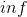）。

Example:

```
>>> m = Geometric(torch.tensor([0.3]))
>>> m.sample()  # underlying Bernoulli has 30% chance 1; 70% chance 0
tensor([ 2.])

```

Parameters

*   **概率**(_编号_ _，_ [_tensor_](tensors.html#torch.Tensor "torch.Tensor"))–采样 &lt;cite&gt;1&lt;/cite&gt; 的概率。 必须在范围内(0，1]

*   **对数**(_编号_ _，_ [_tensor_](tensors.html#torch.Tensor "torch.Tensor"))–采样的对数奇数 &lt;cite&gt;1&lt;/cite&gt; 。

```
arg_constraints = {'logits': Real(), 'probs': Interval(lower_bound=0.0, upper_bound=1.0)}¶
```

* * *

```
entropy()¶
```

* * *

```
expand(batch_shape, _instance=None)¶
```

* * *

```
log_prob(value)¶
```

```
logits¶
```

* * *

```
property mean¶
```

```
probs¶
```

* * *

```
sample(sample_shape=torch.Size([]))¶
```

```
support = IntegerGreaterThan(lower_bound=0)¶
```

* * *

```
property variance¶
```

## 古贝尔

* * *

```
class torch.distributions.gumbel.Gumbel(loc, scale, validate_args=None)¶
```

碱基： [`torch.distributions.transformed_distribution.TransformedDistribution`](#torch.distributions.transformed_distribution.TransformedDistribution "torch.distributions.transformed_distribution.TransformedDistribution")

来自 Gumbel 分布的样本。

例子：

```
>>> m = Gumbel(torch.tensor([1.0]), torch.tensor([2.0]))
>>> m.sample()  # sample from Gumbel distribution with loc=1, scale=2
tensor([ 1.0124])

```

Parameters

*   **loc**  (_python：float_ _或_ [_tensor_](tensors.html#torch.Tensor "torch.Tensor"))–分布的位置参数

*   **标度** (_python：float_ _或_ [_tensor_](tensors.html#torch.Tensor "torch.Tensor"))–分布的标度参数

```
arg_constraints = {'loc': Real(), 'scale': GreaterThan(lower_bound=0.0)}¶
```

* * *

```
entropy()¶
```

* * *

```
expand(batch_shape, _instance=None)¶
```

* * *

```
log_prob(value)¶
```

* * *

```
property mean¶
```

* * *

```
property stddev¶
```

```
support = Real()¶
```

* * *

```
property variance¶
```

## 半漂亮

* * *

```
class torch.distributions.half_cauchy.HalfCauchy(scale, validate_args=None)¶
```

Bases: [`torch.distributions.transformed_distribution.TransformedDistribution`](#torch.distributions.transformed_distribution.TransformedDistribution "torch.distributions.transformed_distribution.TransformedDistribution")

创建一个以&lt;cite&gt;标度&lt;/cite&gt;为参数的半正态分布，其中：

```
X ~ Cauchy(0, scale)
Y = |X| ~ HalfCauchy(scale)

```

Example:

```
>>> m = HalfCauchy(torch.tensor([1.0]))
>>> m.sample()  # half-cauchy distributed with scale=1
tensor([ 2.3214])

```

Parameters

**比例尺** (_python：float_ _或_ [_tensor_](tensors.html#torch.Tensor "torch.Tensor"))–完整柯西分布的比例

```
arg_constraints = {'scale': GreaterThan(lower_bound=0.0)}¶
```

* * *

```
cdf(value)¶
```

* * *

```
entropy()¶
```

* * *

```
expand(batch_shape, _instance=None)¶
```

```
has_rsample = True¶
```

* * *

```
icdf(prob)¶
```

* * *

```
log_prob(value)¶
```

* * *

```
property mean¶
```

* * *

```
property scale¶
```

```
support = GreaterThan(lower_bound=0.0)¶
```

* * *

```
property variance¶
```

## 半普通

* * *

```
class torch.distributions.half_normal.HalfNormal(scale, validate_args=None)¶
```

Bases: [`torch.distributions.transformed_distribution.TransformedDistribution`](#torch.distributions.transformed_distribution.TransformedDistribution "torch.distributions.transformed_distribution.TransformedDistribution")

Creates a half-normal distribution parameterized by &lt;cite&gt;scale&lt;/cite&gt; where:

```
X ~ Normal(0, scale)
Y = |X| ~ HalfNormal(scale)

```

Example:

```
>>> m = HalfNormal(torch.tensor([1.0]))
>>> m.sample()  # half-normal distributed with scale=1
tensor([ 0.1046])

```

Parameters

**标度** (_python：float_ _或_ [_tensor_](tensors.html#torch.Tensor "torch.Tensor"))–完全正态分布的标度

```
arg_constraints = {'scale': GreaterThan(lower_bound=0.0)}¶
```

* * *

```
cdf(value)¶
```

* * *

```
entropy()¶
```

* * *

```
expand(batch_shape, _instance=None)¶
```

```
has_rsample = True¶
```

* * *

```
icdf(prob)¶
```

* * *

```
log_prob(value)¶
```

* * *

```
property mean¶
```

* * *

```
property scale¶
```

```
support = GreaterThan(lower_bound=0.0)¶
```

* * *

```
property variance¶
```

## 独立

* * *

```
class torch.distributions.independent.Independent(base_distribution, reinterpreted_batch_ndims, validate_args=None)¶
```

Bases: [`torch.distributions.distribution.Distribution`](#torch.distributions.distribution.Distribution "torch.distributions.distribution.Distribution")

将某个分发的一些批次模糊重新解释为事件暗淡。

这对于更改 [`log_prob()`](#torch.distributions.independent.Independent.log_prob "torch.distributions.independent.Independent.log_prob") 的结果形状非常有用。 例如，要创建与多变量正态分布具有相同形状的对角正态分布(因此它们是可互换的），您可以：

```
>>> loc = torch.zeros(3)
>>> scale = torch.ones(3)
>>> mvn = MultivariateNormal(loc, scale_tril=torch.diag(scale))
>>> [mvn.batch_shape, mvn.event_shape]
[torch.Size(()), torch.Size((3,))]
>>> normal = Normal(loc, scale)
>>> [normal.batch_shape, normal.event_shape]
[torch.Size((3,)), torch.Size(())]
>>> diagn = Independent(normal, 1)
>>> [diagn.batch_shape, diagn.event_shape]
[torch.Size(()), torch.Size((3,))]

```

Parameters

*   **base_distribution**  ([_torch.分发。分发。分发_](#torch.distributions.distribution.Distribution "torch.distributions.distribution.Distribution"))–基本分发

*   **reinterpreted_batch_ndims**  (_python：int_ )–要重新解释为事件暗淡的批暗淡数量

```
arg_constraints = {}¶
```

* * *

```
entropy()¶
```

* * *

```
enumerate_support(expand=True)¶
```

* * *

```
expand(batch_shape, _instance=None)¶
```

* * *

```
property has_enumerate_support¶
```

* * *

```
property has_rsample¶
```

* * *

```
log_prob(value)¶
```

* * *

```
property mean¶
```

* * *

```
rsample(sample_shape=torch.Size([]))¶
```

* * *

```
sample(sample_shape=torch.Size([]))¶
```

* * *

```
property support¶
```

* * *

```
property variance¶
```

## 拉普拉斯

* * *

```
class torch.distributions.laplace.Laplace(loc, scale, validate_args=None)¶
```

Bases: [`torch.distributions.distribution.Distribution`](#torch.distributions.distribution.Distribution "torch.distributions.distribution.Distribution")

创建由`loc`和：attr：'scale'参数化的拉普拉斯分布。

Example:

```
>>> m = Laplace(torch.tensor([0.0]), torch.tensor([1.0]))
>>> m.sample()  # Laplace distributed with loc=0, scale=1
tensor([ 0.1046])

```

Parameters

*   **loc**  (_python：float_ _或_ [_tensor_](tensors.html#torch.Tensor "torch.Tensor"))–分布的平均值

*   **规模** (_python：float_ _或_ [_tensor_](tensors.html#torch.Tensor "torch.Tensor"))–分布规模

```
arg_constraints = {'loc': Real(), 'scale': GreaterThan(lower_bound=0.0)}¶
```

* * *

```
cdf(value)¶
```

* * *

```
entropy()¶
```

* * *

```
expand(batch_shape, _instance=None)¶
```

```
has_rsample = True¶
```

* * *

```
icdf(value)¶
```

* * *

```
log_prob(value)¶
```

* * *

```
property mean¶
```

* * *

```
rsample(sample_shape=torch.Size([]))¶
```

* * *

```
property stddev¶
```

```
support = Real()¶
```

* * *

```
property variance¶
```

## 对数正态

* * *

```
class torch.distributions.log_normal.LogNormal(loc, scale, validate_args=None)¶
```

Bases: [`torch.distributions.transformed_distribution.TransformedDistribution`](#torch.distributions.transformed_distribution.TransformedDistribution "torch.distributions.transformed_distribution.TransformedDistribution")

创建由 [`loc`](#torch.distributions.log_normal.LogNormal.loc "torch.distributions.log_normal.LogNormal.loc") 和 [`scale`](#torch.distributions.log_normal.LogNormal.scale "torch.distributions.log_normal.LogNormal.scale") 参数化的对数正态分布，其中：

```
X ~ Normal(loc, scale)
Y = exp(X) ~ LogNormal(loc, scale)

```

Example:

```
>>> m = LogNormal(torch.tensor([0.0]), torch.tensor([1.0]))
>>> m.sample()  # log-normal distributed with mean=0 and stddev=1
tensor([ 0.1046])

```

Parameters

*   **loc**  (_python：float_ _或_ [_tensor_](tensors.html#torch.Tensor "torch.Tensor"))–分布对数的平均值

*   **比例尺** (_python：float_ _或_ [_tensor_](tensors.html#torch.Tensor "torch.Tensor"))–分布对数的标准偏差

```
arg_constraints = {'loc': Real(), 'scale': GreaterThan(lower_bound=0.0)}¶
```

* * *

```
entropy()¶
```

* * *

```
expand(batch_shape, _instance=None)¶
```

```
has_rsample = True¶
```

* * *

```
property loc¶
```

* * *

```
property mean¶
```

* * *

```
property scale¶
```

```
support = GreaterThan(lower_bound=0.0)¶
```

* * *

```
property variance¶
```

## LowRankMultivariateNormal

* * *

```
class torch.distributions.lowrank_multivariate_normal.LowRankMultivariateNormal(loc, cov_factor, cov_diag, validate_args=None)¶
```

Bases: [`torch.distributions.distribution.Distribution`](#torch.distributions.distribution.Distribution "torch.distributions.distribution.Distribution")

使用协方差矩阵创建具有由`cov_factor`和`cov_diag`参数化的低秩形式的多元正态分布：

```
covariance_matrix = cov_factor @ cov_factor.T + cov_diag

```

例

```
>>> m = LowRankMultivariateNormal(torch.zeros(2), torch.tensor([1, 0]), torch.tensor([1, 1]))
>>> m.sample()  # normally distributed with mean=`[0,0]`, cov_factor=`[1,0]`, cov_diag=`[1,1]`
tensor([-0.2102, -0.5429])

```

Parameters

*   **loc**  ([_tensor_](tensors.html#torch.Tensor "torch.Tensor"))–形状为 &lt;cite&gt;batch_shape + event_shape&lt;/cite&gt; 的分布平均值

*   **cov_factor**  ([_tensor_](tensors.html#torch.Tensor "torch.Tensor"))–形状为&lt;cite&gt;的协方差矩阵的低秩形式的因子部分 batch_shape + event_shape +(rank，）&lt;/cite&gt;

*   **cov_diag**  ([_tensor_](tensors.html#torch.Tensor "torch.Tensor"))–形状为 &lt;cite&gt;batch_shape + event_shape&lt;/cite&gt; 的协方差矩阵的低秩形式的对角线部分

Note

由于[伍德伯里矩阵恒等式](https://en.wikipedia.org/wiki/Woodbury_matrix_identity)和 [矩阵行列式引理](https://en.wikipedia.org/wiki/Matrix_determinant_lemma)。 由于有了这些公式，我们只需要计算小尺寸“电容”矩阵的行列式和逆式：

```
capacitance = I + cov_factor.T @ inv(cov_diag) @ cov_factor

```

```
arg_constraints = {'cov_diag': GreaterThan(lower_bound=0.0), 'cov_factor': Real(), 'loc': Real()}¶
```

```
covariance_matrix¶
```

* * *

```
entropy()¶
```

* * *

```
expand(batch_shape, _instance=None)¶
```

```
has_rsample = True¶
```

* * *

```
log_prob(value)¶
```

* * *

```
property mean¶
```

```
precision_matrix¶
```

* * *

```
rsample(sample_shape=torch.Size([]))¶
```

```
scale_tril¶
```

```
support = Real()¶
```

```
variance¶
```

## 多项式

* * *

```
class torch.distributions.multinomial.Multinomial(total_count=1, probs=None, logits=None, validate_args=None)¶
```

Bases: [`torch.distributions.distribution.Distribution`](#torch.distributions.distribution.Distribution "torch.distributions.distribution.Distribution")

创建由`total_count`和 [`probs`](#torch.distributions.multinomial.Multinomial.probs "torch.distributions.multinomial.Multinomial.probs") 或 [`logits`](#torch.distributions.multinomial.Multinomial.logits "torch.distributions.multinomial.Multinomial.logits") (但不是全部）参数化的多项式分布。 [`probs`](#torch.distributions.multinomial.Multinomial.probs "torch.distributions.multinomial.Multinomial.probs") 的最内维度在类别上进行索引。 所有其他尺寸均按批次编制索引。

请注意，如果仅调用 [`log_prob()`](#torch.distributions.multinomial.Multinomial.log_prob "torch.distributions.multinomial.Multinomial.log_prob") ，则无需指定`total_count`(请参见下面的示例）

Note

[`probs`](#torch.distributions.multinomial.Multinomial.probs "torch.distributions.multinomial.Multinomial.probs") 必须为非负数，有限且总和为非零，并且将其归一化为 1。

*   对于所有参数和样本， [`sample()`](#torch.distributions.multinomial.Multinomial.sample "torch.distributions.multinomial.Multinomial.sample") 需要一个共享的 &lt;cite&gt;total_count&lt;/cite&gt; 。

*   [`log_prob()`](#torch.distributions.multinomial.Multinomial.log_prob "torch.distributions.multinomial.Multinomial.log_prob") 允许每个参数和样本使用不同的 &lt;cite&gt;total_count&lt;/cite&gt; 。

Example:

```
>>> m = Multinomial(100, torch.tensor([ 1., 1., 1., 1.]))
>>> x = m.sample()  # equal probability of 0, 1, 2, 3
tensor([ 21.,  24.,  30.,  25.])

>>> Multinomial(probs=torch.tensor([1., 1., 1., 1.])).log_prob(x)
tensor([-4.1338])

```

Parameters

*   **total_count**  (_python：int_ )–试用次数

*   **probs** ([_Tensor_](tensors.html#torch.Tensor "torch.Tensor")) – event probabilities

*   **logits**  ([_tensor_](tensors.html#torch.Tensor "torch.Tensor"))–事件日志概率

```
arg_constraints = {'logits': Real(), 'probs': Simplex()}¶
```

* * *

```
expand(batch_shape, _instance=None)¶
```

* * *

```
log_prob(value)¶
```

* * *

```
property logits¶
```

* * *

```
property mean¶
```

* * *

```
property param_shape¶
```

* * *

```
property probs¶
```

* * *

```
sample(sample_shape=torch.Size([]))¶
```

* * *

```
property support¶
```

* * *

```
property variance¶
```

## 多元正态

* * *

```
class torch.distributions.multivariate_normal.MultivariateNormal(loc, covariance_matrix=None, precision_matrix=None, scale_tril=None, validate_args=None)¶
```

Bases: [`torch.distributions.distribution.Distribution`](#torch.distributions.distribution.Distribution "torch.distributions.distribution.Distribution")

创建由均值向量和协方差矩阵参数化的多元正态(也称为高斯）分布。

可以使用正定协方差矩阵或正定精度矩阵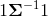或具有正值对角线项的下三角矩阵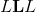来参数化多元正态分布，例如。 该三角矩阵可以通过例如 协方差的 Cholesky 分解。

Example

```
>>> m = MultivariateNormal(torch.zeros(2), torch.eye(2))
>>> m.sample()  # normally distributed with mean=`[0,0]` and covariance_matrix=`I`
tensor([-0.2102, -0.5429])

```

Parameters

*   **loc**  ([_tensor_](tensors.html#torch.Tensor "torch.Tensor"))–分布的均值

*   **covariance_matrix**  ([_tensor_](tensors.html#torch.Tensor "torch.Tensor"))–正定协方差矩阵

*   **precision_matrix**  ([_tensor_](tensors.html#torch.Tensor "torch.Tensor"))–正定精度矩阵

*   **scale_tril**  ([_tensor_](tensors.html#torch.Tensor "torch.Tensor"))–协方差的下三角因子，对角线为正值

Note

只能指定 [`covariance_matrix`](#torch.distributions.multivariate_normal.MultivariateNormal.covariance_matrix "torch.distributions.multivariate_normal.MultivariateNormal.covariance_matrix") 或 [`precision_matrix`](#torch.distributions.multivariate_normal.MultivariateNormal.precision_matrix "torch.distributions.multivariate_normal.MultivariateNormal.precision_matrix") 或 [`scale_tril`](#torch.distributions.multivariate_normal.MultivariateNormal.scale_tril "torch.distributions.multivariate_normal.MultivariateNormal.scale_tril") 中的一个。

使用 [`scale_tril`](#torch.distributions.multivariate_normal.MultivariateNormal.scale_tril "torch.distributions.multivariate_normal.MultivariateNormal.scale_tril") 会更高效：所有内部计算都基于 [`scale_tril`](#torch.distributions.multivariate_normal.MultivariateNormal.scale_tril "torch.distributions.multivariate_normal.MultivariateNormal.scale_tril") 。 如果改为通过 [`covariance_matrix`](#torch.distributions.multivariate_normal.MultivariateNormal.covariance_matrix "torch.distributions.multivariate_normal.MultivariateNormal.covariance_matrix") 或 [`precision_matrix`](#torch.distributions.multivariate_normal.MultivariateNormal.precision_matrix "torch.distributions.multivariate_normal.MultivariateNormal.precision_matrix") ，则仅用于使用 Cholesky 分解来计算相应的下三角矩阵。

```
arg_constraints = {'covariance_matrix': PositiveDefinite(), 'loc': RealVector(), 'precision_matrix': PositiveDefinite(), 'scale_tril': LowerCholesky()}¶
```

```
covariance_matrix¶
```

* * *

```
entropy()¶
```

* * *

```
expand(batch_shape, _instance=None)¶
```

```
has_rsample = True¶
```

* * *

```
log_prob(value)¶
```

* * *

```
property mean¶
```

```
precision_matrix¶
```

* * *

```
rsample(sample_shape=torch.Size([]))¶
```

```
scale_tril¶
```

```
support = Real()¶
```

* * *

```
property variance¶
```

## 负二项式

* * *

```
class torch.distributions.negative_binomial.NegativeBinomial(total_count, probs=None, logits=None, validate_args=None)¶
```

Bases: [`torch.distributions.distribution.Distribution`](#torch.distributions.distribution.Distribution "torch.distributions.distribution.Distribution")

创建负二项式分布，即在`total_count`失败之前，成功的独立且相同的 Bernoulli 试验次数的分布。 每个伯努利试验成功的概率为 [`probs`](#torch.distributions.negative_binomial.NegativeBinomial.probs "torch.distributions.negative_binomial.NegativeBinomial.probs") 。

Parameters

*   **total_count**  (_python：float_ _或_ [_tensor_](tensors.html#torch.Tensor "torch.Tensor"))–伯努利试验阴性的非负数停止， 尽管该分布对于实际值计数仍然有效

*   **概率** ([_tensor_](tensors.html#torch.Tensor "torch.Tensor"))–半开放时间间隔[0，1）成功的事件概率

*   **logits**  ([_tensor_](tensors.html#torch.Tensor "torch.Tensor"))–成功概率的事件对数

```
arg_constraints = {'logits': Real(), 'probs': HalfOpenInterval(lower_bound=0.0, upper_bound=1.0), 'total_count': GreaterThanEq(lower_bound=0)}¶
```

* * *

```
expand(batch_shape, _instance=None)¶
```

* * *

```
log_prob(value)¶
```

```
logits¶
```

* * *

```
property mean¶
```

* * *

```
property param_shape¶
```

```
probs¶
```

* * *

```
sample(sample_shape=torch.Size([]))¶
```

```
support = IntegerGreaterThan(lower_bound=0)¶
```

* * *

```
property variance¶
```

## 正常

* * *

```
class torch.distributions.normal.Normal(loc, scale, validate_args=None)¶
```

Bases: [`torch.distributions.exp_family.ExponentialFamily`](#torch.distributions.exp_family.ExponentialFamily "torch.distributions.exp_family.ExponentialFamily")

创建由`loc`和`scale`参数化的正态(也称为高斯）分布。

Example:

```
>>> m = Normal(torch.tensor([0.0]), torch.tensor([1.0]))
>>> m.sample()  # normally distributed with loc=0 and scale=1
tensor([ 0.1046])

```

Parameters

*   **loc**  (_python：float_ _或_ [_tensor_](tensors.html#torch.Tensor "torch.Tensor"))–分布的平均值(通常称为 mu）

*   **标度** (_python：float_ _或_ [_tensor_](tensors.html#torch.Tensor "torch.Tensor"))–分布的标准偏差(通常称为 sigma )

```
arg_constraints = {'loc': Real(), 'scale': GreaterThan(lower_bound=0.0)}¶
```

* * *

```
cdf(value)¶
```

* * *

```
entropy()¶
```

* * *

```
expand(batch_shape, _instance=None)¶
```

```
has_rsample = True¶
```

* * *

```
icdf(value)¶
```

* * *

```
log_prob(value)¶
```

* * *

```
property mean¶
```

* * *

```
rsample(sample_shape=torch.Size([]))¶
```

* * *

```
sample(sample_shape=torch.Size([]))¶
```

* * *

```
property stddev¶
```

```
support = Real()¶
```

* * *

```
property variance¶
```

## 热门分类

* * *

```
class torch.distributions.one_hot_categorical.OneHotCategorical(probs=None, logits=None, validate_args=None)¶
```

Bases: [`torch.distributions.distribution.Distribution`](#torch.distributions.distribution.Distribution "torch.distributions.distribution.Distribution")

创建由 [`probs`](#torch.distributions.one_hot_categorical.OneHotCategorical.probs "torch.distributions.one_hot_categorical.OneHotCategorical.probs") 或 [`logits`](#torch.distributions.one_hot_categorical.OneHotCategorical.logits "torch.distributions.one_hot_categorical.OneHotCategorical.logits") 参数化的单热点分类分布。

样本是大小为`probs.size(-1)`的一键编码矢量。

Note

[`probs`](#torch.distributions.one_hot_categorical.OneHotCategorical.probs "torch.distributions.one_hot_categorical.OneHotCategorical.probs") 必须为非负数，有限且总和为非零，并且将其归一化为 1。

另请参见：`torch.distributions.Categorical()`了解 [`probs`](#torch.distributions.one_hot_categorical.OneHotCategorical.probs "torch.distributions.one_hot_categorical.OneHotCategorical.probs") 和 [`logits`](#torch.distributions.one_hot_categorical.OneHotCategorical.logits "torch.distributions.one_hot_categorical.OneHotCategorical.logits") 的规格。

Example:

```
>>> m = OneHotCategorical(torch.tensor([ 0.25, 0.25, 0.25, 0.25 ]))
>>> m.sample()  # equal probability of 0, 1, 2, 3
tensor([ 0.,  0.,  0.,  1.])

```

Parameters

*   **probs** ([_Tensor_](tensors.html#torch.Tensor "torch.Tensor")) – event probabilities

*   **logits** ([_Tensor_](tensors.html#torch.Tensor "torch.Tensor")) – event log probabilities

```
arg_constraints = {'logits': Real(), 'probs': Simplex()}¶
```

* * *

```
entropy()¶
```

* * *

```
enumerate_support(expand=True)¶
```

* * *

```
expand(batch_shape, _instance=None)¶
```

```
has_enumerate_support = True¶
```

* * *

```
log_prob(value)¶
```

* * *

```
property logits¶
```

* * *

```
property mean¶
```

* * *

```
property param_shape¶
```

* * *

```
property probs¶
```

* * *

```
sample(sample_shape=torch.Size([]))¶
```

```
support = Simplex()¶
```

* * *

```
property variance¶
```

## 帕累托

* * *

```
class torch.distributions.pareto.Pareto(scale, alpha, validate_args=None)¶
```

Bases: [`torch.distributions.transformed_distribution.TransformedDistribution`](#torch.distributions.transformed_distribution.TransformedDistribution "torch.distributions.transformed_distribution.TransformedDistribution")

来自帕累托 1 型分布的样本。

Example:

```
>>> m = Pareto(torch.tensor([1.0]), torch.tensor([1.0]))
>>> m.sample()  # sample from a Pareto distribution with scale=1 and alpha=1
tensor([ 1.5623])

```

Parameters

*   **scale** (_python:float_ _or_ [_Tensor_](tensors.html#torch.Tensor "torch.Tensor")) – Scale parameter of the distribution

*   **alpha**  (_python：float_ _或_ [_tensor_](tensors.html#torch.Tensor "torch.Tensor"))–分布的形状参数

```
arg_constraints = {'alpha': GreaterThan(lower_bound=0.0), 'scale': GreaterThan(lower_bound=0.0)}¶
```

* * *

```
entropy()¶
```

* * *

```
expand(batch_shape, _instance=None)¶
```

* * *

```
property mean¶
```

* * *

```
property support¶
```

* * *

```
property variance¶
```

## 泊松

* * *

```
class torch.distributions.poisson.Poisson(rate, validate_args=None)¶
```

Bases: [`torch.distributions.exp_family.ExponentialFamily`](#torch.distributions.exp_family.ExponentialFamily "torch.distributions.exp_family.ExponentialFamily")

创建由`rate`(速率参数）参数化的泊松分布。

样本是非负整数，pmf 为

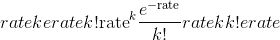

Example:

```
>>> m = Poisson(torch.tensor([4]))
>>> m.sample()
tensor([ 3.])

```

Parameters

**速率**(_编号_ _，_ [_tensor_](tensors.html#torch.Tensor "torch.Tensor"))–速率参数

```
arg_constraints = {'rate': GreaterThan(lower_bound=0.0)}¶
```

* * *

```
expand(batch_shape, _instance=None)¶
```

* * *

```
log_prob(value)¶
```

* * *

```
property mean¶
```

* * *

```
sample(sample_shape=torch.Size([]))¶
```

```
support = IntegerGreaterThan(lower_bound=0)¶
```

* * *

```
property variance¶
```

## 轻松的伯努利

* * *

```
class torch.distributions.relaxed_bernoulli.RelaxedBernoulli(temperature, probs=None, logits=None, validate_args=None)¶
```

Bases: [`torch.distributions.transformed_distribution.TransformedDistribution`](#torch.distributions.transformed_distribution.TransformedDistribution "torch.distributions.transformed_distribution.TransformedDistribution")

创建由 [`temperature`](#torch.distributions.relaxed_bernoulli.RelaxedBernoulli.temperature "torch.distributions.relaxed_bernoulli.RelaxedBernoulli.temperature") 以及 [`probs`](#torch.distributions.relaxed_bernoulli.RelaxedBernoulli.probs "torch.distributions.relaxed_bernoulli.RelaxedBernoulli.probs") 或 [`logits`](#torch.distributions.relaxed_bernoulli.RelaxedBernoulli.logits "torch.distributions.relaxed_bernoulli.RelaxedBernoulli.logits") (但不是全部）参数化的 RelaxedBernoulli 分布。 这是 &lt;cite&gt;Bernoulli&lt;/cite&gt; 分布的宽松版本，因此值在(0，1）中，并且具有可重新设置参数的样本。

Example:

```
>>> m = RelaxedBernoulli(torch.tensor([2.2]),
                         torch.tensor([0.1, 0.2, 0.3, 0.99]))
>>> m.sample()
tensor([ 0.2951,  0.3442,  0.8918,  0.9021])

```

Parameters

*   **温度** ([_tensor_](tensors.html#torch.Tensor "torch.Tensor"))–松弛温度

*   **probs** (_Number__,_ [_Tensor_](tensors.html#torch.Tensor "torch.Tensor")) – the probability of sampling &lt;cite&gt;1&lt;/cite&gt;

*   **logits** (_Number__,_ [_Tensor_](tensors.html#torch.Tensor "torch.Tensor")) – the log-odds of sampling &lt;cite&gt;1&lt;/cite&gt;

```
arg_constraints = {'logits': Real(), 'probs': Interval(lower_bound=0.0, upper_bound=1.0)}¶
```

* * *

```
expand(batch_shape, _instance=None)¶
```

```
has_rsample = True¶
```

* * *

```
property logits¶
```

* * *

```
property probs¶
```

```
support = Interval(lower_bound=0.0, upper_bound=1.0)¶
```

* * *

```
property temperature¶
```

## LogitRelaxed 伯努利

* * *

```
class torch.distributions.relaxed_bernoulli.LogitRelaxedBernoulli(temperature, probs=None, logits=None, validate_args=None)¶
```

Bases: [`torch.distributions.distribution.Distribution`](#torch.distributions.distribution.Distribution "torch.distributions.distribution.Distribution")

创建一个以 [`probs`](#torch.distributions.relaxed_bernoulli.LogitRelaxedBernoulli.probs "torch.distributions.relaxed_bernoulli.LogitRelaxedBernoulli.probs") 或 [`logits`](#torch.distributions.relaxed_bernoulli.LogitRelaxedBernoulli.logits "torch.distributions.relaxed_bernoulli.LogitRelaxedBernoulli.logits") (但不是两者）为参数的 LogitRelaxedBernoulli 分布，这是 RelaxedBernoulli 分布的对数。

样本是(0，1）中值的对数。 有关更多详细信息，请参见[1]。

Parameters

*   **temperature** ([_Tensor_](tensors.html#torch.Tensor "torch.Tensor")) – relaxation temperature

*   **probs** (_Number__,_ [_Tensor_](tensors.html#torch.Tensor "torch.Tensor")) – the probability of sampling &lt;cite&gt;1&lt;/cite&gt;

*   **logits** (_Number__,_ [_Tensor_](tensors.html#torch.Tensor "torch.Tensor")) – the log-odds of sampling &lt;cite&gt;1&lt;/cite&gt;

[1]具体分布：离散随机变量的连续松弛(Maddison 等，2017）

[2]使用 Gumbel-Softmax 分类重新参数化(Jang 等，2017）

```
arg_constraints = {'logits': Real(), 'probs': Interval(lower_bound=0.0, upper_bound=1.0)}¶
```

* * *

```
expand(batch_shape, _instance=None)¶
```

* * *

```
log_prob(value)¶
```

```
logits¶
```

* * *

```
property param_shape¶
```

```
probs¶
```

* * *

```
rsample(sample_shape=torch.Size([]))¶
```

```
support = Real()¶
```

## RelaxedOneHot 分类

* * *

```
class torch.distributions.relaxed_categorical.RelaxedOneHotCategorical(temperature, probs=None, logits=None, validate_args=None)¶
```

Bases: [`torch.distributions.transformed_distribution.TransformedDistribution`](#torch.distributions.transformed_distribution.TransformedDistribution "torch.distributions.transformed_distribution.TransformedDistribution")

创建一个由 [`temperature`](#torch.distributions.relaxed_categorical.RelaxedOneHotCategorical.temperature "torch.distributions.relaxed_categorical.RelaxedOneHotCategorical.temperature") 以及 [`probs`](#torch.distributions.relaxed_categorical.RelaxedOneHotCategorical.probs "torch.distributions.relaxed_categorical.RelaxedOneHotCategorical.probs") 或 [`logits`](#torch.distributions.relaxed_categorical.RelaxedOneHotCategorical.logits "torch.distributions.relaxed_categorical.RelaxedOneHotCategorical.logits") 设置参数的 RelaxedOneHotCategorical 分布。 这是`OneHotCategorical`发行版的宽松版本，因此其示例位于单纯形上，并且可以重新设置参数。

Example:

```
>>> m = RelaxedOneHotCategorical(torch.tensor([2.2]),
                                 torch.tensor([0.1, 0.2, 0.3, 0.4]))
>>> m.sample()
tensor([ 0.1294,  0.2324,  0.3859,  0.2523])

```

Parameters

*   **temperature** ([_Tensor_](tensors.html#torch.Tensor "torch.Tensor")) – relaxation temperature

*   **probs** ([_Tensor_](tensors.html#torch.Tensor "torch.Tensor")) – event probabilities

*   **对数** ([_tensor_](tensors.html#torch.Tensor "torch.Tensor"))–每个事件的对数概率。

```
arg_constraints = {'logits': Real(), 'probs': Simplex()}¶
```

* * *

```
expand(batch_shape, _instance=None)¶
```

```
has_rsample = True¶
```

* * *

```
property logits¶
```

* * *

```
property probs¶
```

```
support = Simplex()¶
```

* * *

```
property temperature¶
```

## 学生 T

* * *

```
class torch.distributions.studentT.StudentT(df, loc=0.0, scale=1.0, validate_args=None)¶
```

Bases: [`torch.distributions.distribution.Distribution`](#torch.distributions.distribution.Distribution "torch.distributions.distribution.Distribution")

创建以自由度`df`，均值`loc`和小数位数`scale`为参数的学生 t 分布。

Example:

```
>>> m = StudentT(torch.tensor([2.0]))
>>> m.sample()  # Student's t-distributed with degrees of freedom=2
tensor([ 0.1046])

```

Parameters

*   **df**  (_python：float_ _或_ [_tensor_](tensors.html#torch.Tensor "torch.Tensor"))–自由度

*   **loc** (_python:float_ _or_ [_Tensor_](tensors.html#torch.Tensor "torch.Tensor")) – mean of the distribution

*   **scale** (_python:float_ _or_ [_Tensor_](tensors.html#torch.Tensor "torch.Tensor")) – scale of the distribution

```
arg_constraints = {'df': GreaterThan(lower_bound=0.0), 'loc': Real(), 'scale': GreaterThan(lower_bound=0.0)}¶
```

* * *

```
entropy()¶
```

* * *

```
expand(batch_shape, _instance=None)¶
```

```
has_rsample = True¶
```

* * *

```
log_prob(value)¶
```

* * *

```
property mean¶
```

* * *

```
rsample(sample_shape=torch.Size([]))¶
```

```
support = Real()¶
```

* * *

```
property variance¶
```

## 转换分布

* * *

```
class torch.distributions.transformed_distribution.TransformedDistribution(base_distribution, transforms, validate_args=None)¶
```

Bases: [`torch.distributions.distribution.Distribution`](#torch.distributions.distribution.Distribution "torch.distributions.distribution.Distribution")

分发类的扩展，该类将一系列 Transforms 应用于基本分发。 令 f 为所应用转换的组成：

```
X ~ BaseDistribution
Y = f(X) ~ TransformedDistribution(BaseDistribution, f)
log p(Y) = log p(X) + log |det (dX/dY)|

```

注意， [`TransformedDistribution`](#torch.distributions.transformed_distribution.TransformedDistribution "torch.distributions.transformed_distribution.TransformedDistribution") 的`.event_shape`是其基本分布及其变换的最大形状，因为变换可以在事件之间引入相关性。

[`TransformedDistribution`](#torch.distributions.transformed_distribution.TransformedDistribution "torch.distributions.transformed_distribution.TransformedDistribution") 的用法示例为：

```
# Building a Logistic Distribution
# X ~ Uniform(0, 1)
# f = a + b * logit(X)
# Y ~ f(X) ~ Logistic(a, b)
base_distribution = Uniform(0, 1)
transforms = [SigmoidTransform().inv, AffineTransform(loc=a, scale=b)]
logistic = TransformedDistribution(base_distribution, transforms)

```

有关更多示例，请查看 [`Gumbel`](#torch.distributions.gumbel.Gumbel "torch.distributions.gumbel.Gumbel") ， [`HalfCauchy`](#torch.distributions.half_cauchy.HalfCauchy "torch.distributions.half_cauchy.HalfCauchy") ， [`HalfNormal`](#torch.distributions.half_normal.HalfNormal "torch.distributions.half_normal.HalfNormal") ， [`LogNormal`](#torch.distributions.log_normal.LogNormal "torch.distributions.log_normal.LogNormal") 的实现， [`Pareto`](#torch.distributions.pareto.Pareto "torch.distributions.pareto.Pareto") ， [`Weibull`](#torch.distributions.weibull.Weibull "torch.distributions.weibull.Weibull") ， [`RelaxedBernoulli`](#torch.distributions.relaxed_bernoulli.RelaxedBernoulli "torch.distributions.relaxed_bernoulli.RelaxedBernoulli") 和 [`RelaxedOneHotCategorical`](#torch.distributions.relaxed_categorical.RelaxedOneHotCategorical "torch.distributions.relaxed_categorical.RelaxedOneHotCategorical")

```
arg_constraints = {}¶
```

* * *

```
cdf(value)¶
```

通过反转变换并计算基本分布的分数来计算累积分布函数。

* * *

```
expand(batch_shape, _instance=None)¶
```

* * *

```
property has_rsample¶
```

* * *

```
icdf(value)¶
```

使用变换计算逆累积分布函数，并计算基本分布的分数。

* * *

```
log_prob(value)¶
```

通过反转变换对样本进行评分，并使用基本分布的分数和 log abs det jacobian 计算分数。

* * *

```
rsample(sample_shape=torch.Size([]))¶
```

如果分配了分布参数，则生成一个 sample_shape 形状的重新参数化样本或 sample_shape 形状的一批重新参数化样本。 首先从基本分布中采样，并对列表中的每个变换应用 &lt;cite&gt;transform(）&lt;/cite&gt;。

* * *

```
sample(sample_shape=torch.Size([]))¶
```

如果分配参数是批处理的，则生成 sample_shape 形状的样本或 sample_shape 形状的样本批。 首先从基本分布中采样，并对列表中的每个变换应用 &lt;cite&gt;transform(）&lt;/cite&gt;。

* * *

```
property support¶
```

## 制服

* * *

```
class torch.distributions.uniform.Uniform(low, high, validate_args=None)¶
```

Bases: [`torch.distributions.distribution.Distribution`](#torch.distributions.distribution.Distribution "torch.distributions.distribution.Distribution")

从半开间隔`[low, high)`生成均匀分布的随机样本。

Example:

```
>>> m = Uniform(torch.tensor([0.0]), torch.tensor([5.0]))
>>> m.sample()  # uniformly distributed in the range [0.0, 5.0)
tensor([ 2.3418])

```

Parameters

*   **低** (_python：float_ _或_ [_tensor_](tensors.html#torch.Tensor "torch.Tensor"))–较低范围(含）。

*   **高** (_python：float_ _或_ [_tensor_](tensors.html#torch.Tensor "torch.Tensor"))–上限(不包括）。

```
arg_constraints = {'high': Dependent(), 'low': Dependent()}¶
```

* * *

```
cdf(value)¶
```

* * *

```
entropy()¶
```

* * *

```
expand(batch_shape, _instance=None)¶
```

```
has_rsample = True¶
```

* * *

```
icdf(value)¶
```

* * *

```
log_prob(value)¶
```

* * *

```
property mean¶
```

* * *

```
rsample(sample_shape=torch.Size([]))¶
```

* * *

```
property stddev¶
```

* * *

```
property support¶
```

* * *

```
property variance¶
```

## 威布尔

* * *

```
class torch.distributions.weibull.Weibull(scale, concentration, validate_args=None)¶
```

Bases: [`torch.distributions.transformed_distribution.TransformedDistribution`](#torch.distributions.transformed_distribution.TransformedDistribution "torch.distributions.transformed_distribution.TransformedDistribution")

来自两参数威布尔分布的样本。

Example

```
>>> m = Weibull(torch.tensor([1.0]), torch.tensor([1.0]))
>>> m.sample()  # sample from a Weibull distribution with scale=1, concentration=1
tensor([ 0.4784])

```

Parameters

*   **标度** (_python：float_ _或_ [_tensor_](tensors.html#torch.Tensor "torch.Tensor"))–分布的标度参数(lambda）。

*   **浓度** (_python：float_ _或_ [_tensor_](tensors.html#torch.Tensor "torch.Tensor"))–浓度的浓度参数(k /形状）。

```
arg_constraints = {'concentration': GreaterThan(lower_bound=0.0), 'scale': GreaterThan(lower_bound=0.0)}¶
```

* * *

```
entropy()¶
```

* * *

```
expand(batch_shape, _instance=None)¶
```

* * *

```
property mean¶
```

```
support = GreaterThan(lower_bound=0.0)¶
```

* * *

```
property variance¶
```

## &lt;cite&gt;KL 发散&lt;/cite&gt;

* * *

```
torch.distributions.kl.kl_divergence(p, q)¶
```

计算两个分布之间的 Kullback-Leibler 散度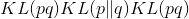。

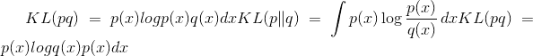

Parameters

*   **p**  ([_分布_](#torch.distributions.distribution.Distribution "torch.distributions.distribution.Distribution"))–一个`Distribution`对象。

*   **q**  ([_分布_](#torch.distributions.distribution.Distribution "torch.distributions.distribution.Distribution"))–一个`Distribution`对象。

Returns

形状为 &lt;cite&gt;batch_shape&lt;/cite&gt; 的一批 KL 散度。

返回类型

[张量](tensors.html#torch.Tensor "torch.Tensor")

```
Raises
```

**NotImplementedError** -如果尚未通过 [`register_kl()`](#torch.distributions.kl.register_kl "torch.distributions.kl.register_kl") 注册分发类型。

* * *

```
torch.distributions.kl.register_kl(type_p, type_q)¶
```

装饰器向 [`kl_divergence()`](#torch.distributions.kl.kl_divergence "torch.distributions.kl.kl_divergence") 注册成对功能。 用法：

```
@register_kl(Normal, Normal)
def kl_normal_normal(p, q):
    # insert implementation here

```

查找返回按子类排序的最特定的(类型，类型）匹配。 如果匹配不明确，则会引发 &lt;cite&gt;RuntimeWarning&lt;/cite&gt; 。 例如解决模棱两可的情况：

```
@register_kl(BaseP, DerivedQ)
def kl_version1(p, q): ...
@register_kl(DerivedP, BaseQ)
def kl_version2(p, q): ...

```

您应该注册第三个最具体的实现，例如：

```
register_kl(DerivedP, DerivedQ)(kl_version1)  # Break the tie.

```

Parameters

*   **type_p**  (_python：type_ )– `Distribution`的子类。

*   **type_q**  (_python：type_ )– `Distribution`的子类。

## &lt;cite&gt;转换&lt;/cite&gt;

* * *

```
class torch.distributions.transforms.Transform(cache_size=0)¶
```

可计算 log det jacobians 的可逆转换的抽象类。 它们主要用于`torch.distributions.TransformedDistribution`中。

高速缓存对于反变换代价昂贵或数值不稳定的变换非常有用。 请注意，记住的值必须小心，因为自动刻度图可能会颠倒。 例如，在以下情况下可以使用或不使用缓存：

```
y = t(x)
t.log_abs_det_jacobian(x, y).backward()  # x will receive gradients.

```

但是，由于依赖关系反转，在缓存时以下内容将出错：

```
y = t(x)
z = t.inv(y)
grad(z.sum(), [y])  # error because z is x

```

派生类应实现`_call()`或`_inverse()`中的一个或两个。 设置 &lt;cite&gt;bijective = True&lt;/cite&gt; 的派生类也应实现 [`log_abs_det_jacobian()`](#torch.distributions.transforms.Transform.log_abs_det_jacobian "torch.distributions.transforms.Transform.log_abs_det_jacobian") 。

Parameters

**cache_size**  (_python：int_ )–缓存的大小。 如果为零，则不进行缓存。 如果为 1，则将缓存最新的单个值。 仅支持 0 和 1。

```
Variables
```

*   **〜Transform.domain**  ([`Constraint`](#torch.distributions.constraints.Constraint "torch.distributions.constraints.Constraint"))–表示此变换有效输入的约束。

*   **〜Transform.codomain**  ([`Constraint`](#torch.distributions.constraints.Constraint "torch.distributions.constraints.Constraint"))–表示此变换的有效输出的约束，该约束是逆变换的输入。

*   **〜Transform.bijective**  (_bool_ )–此变换是否为双射的。 对于域中的每个`x`和共域中的`y`，变换`t`是双射 iff `t.inv(t(x)) == x`和`t(t.inv(y)) == y`。 非双射的变换至少应保持较弱的伪逆特性`t(t.inv(t(x)) == t(x)`和`t.inv(t(t.inv(y))) == t.inv(y)`。

*   **〜Transform.sign**  (_python：int_ _或_ [_tensor_](tensors.html#torch.Tensor "torch.Tensor"))–对于双射单变量变换，应为 +1 或-1，取决于变换是单调递增还是递减。

*   **〜Transform.event_dim**  (_python：int_ )–在变换`event_shape`中相互关联的维数。 对于逐点变换，应为 0；对于联合作用于矢量的变换，应为 1；对于联合作用于矩阵的变换，其应为 2。

* * *

```
property inv¶
```

返回此变换的逆数 [`Transform`](#torch.distributions.transforms.Transform "torch.distributions.transforms.Transform") 。 这应该满足`t.inv.inv is t`。

* * *

```
property sign¶
```

返回雅可比行列式的符号(如果适用）。 通常，这仅对双射变换有意义。

* * *

```
log_abs_det_jacobian(x, y)¶
```

计算 log det jacobian &lt;cite&gt;log | dy / dx |&lt;/cite&gt; 给定输入和输出。

* * *

```
class torch.distributions.transforms.ComposeTransform(parts)¶
```

组成一个链中的多个变换。 组成的转换负责缓存。

Parameters

**部分** ([`Transform`](#torch.distributions.transforms.Transform "torch.distributions.transforms.Transform") 的列表）–组成变换的列表。

* * *

```
class torch.distributions.transforms.ExpTransform(cache_size=0)¶
```

通过映射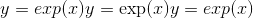进行转换。

* * *

```
class torch.distributions.transforms.PowerTransform(exponent, cache_size=0)¶
```

通过映射进行转换。

* * *

```
class torch.distributions.transforms.SigmoidTransform(cache_size=0)¶
```

通过映射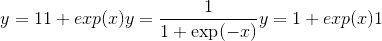和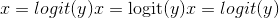进行转换。

* * *

```
class torch.distributions.transforms.AbsTransform(cache_size=0)¶
```

通过映射进行转换。

* * *

```
class torch.distributions.transforms.AffineTransform(loc, scale, event_dim=0, cache_size=0)¶
```

通过逐点仿射映射进行变换。

Parameters

*   **loc**  ([_tensor_](tensors.html#torch.Tensor "torch.Tensor") _或_ _python：float_ )–位置参数。

*   **标度** ([_tensor_](tensors.html#torch.Tensor "torch.Tensor") _或_ _python：float_ )–标度参数。

*   **event_dim**  (_python：int_ )– &lt;cite&gt;event_shape&lt;/cite&gt; 的可选大小。 对于单变量随机变量，它应该为零；对于矢量的分布，它应该为 1；对于矩阵的分布，它应该为 2。

* * *

```
class torch.distributions.transforms.SoftmaxTransform(cache_size=0)¶
```

通过从不受约束的空间转换为单纯形，然后进行规范化。

这不是双射的，不能用于 HMC。 但是，这主要是按坐标方式(最终归一化除外），因此适用于按坐标优化算法。

* * *

```
class torch.distributions.transforms.StickBreakingTransform(cache_size=0)¶
```

通过不折断的过程将不受约束的空间转换为一维的单纯形。

该变换以 &lt;cite&gt;Dirichlet&lt;/cite&gt; 分布的小节结构中的迭代 S 形变换形式出现：第一个 logit 通过 S 形变换成第一个概率和所有其他概率，然后过程重复进行。

这是双射的，适合在 HMC 中使用； 但是，它将坐标混合在一起，不太适合优化。

* * *

```
class torch.distributions.transforms.LowerCholeskyTransform(cache_size=0)¶
```

从非约束矩阵转换为具有非负对角线项的低三角形矩阵。

这对于根据正定矩阵的 Cholesky 因式分解参数化很有用。

* * *

```
class torch.distributions.transforms.CatTransform(tseq, dim=0, lengths=None)¶
```

变换函子，以与[兼容的方式，以长度&lt;cite&gt;，长度[dim]&lt;/cite&gt; 为单位，将每个分量的 &lt;cite&gt;tseq&lt;/cite&gt; 变换序列应用于每个子矩阵。 ] `torch.cat()`](torch.html#torch.cat "torch.cat") 。

```
Example::
```

x0 = torch.cat([torch.range(1，10），torch.range(1，10）]，dim = 0）x = torch.cat([x0，x0]，dim = 0）t0 = CatTransform ([ExpTransform(），identity_transform]，dim = 0，长度= [10，10]）t = CatTransform([t0，t0]，dim = 0，长度= [20，20]）y = t(x）

* * *

```
class torch.distributions.transforms.StackTransform(tseq, dim=0)¶
```

变换函子，以与 [`torch.stack()`](torch.html#torch.stack "torch.stack") 兼容的方式，对&lt;cite&gt;暗淡&lt;/cite&gt;处的每个子矩阵按分量进行变换 &lt;cite&gt;tseq&lt;/cite&gt; 的序列。

```
Example::
```

x = torch.stack([torch.range(1，10），torch.range(1，10）]，dim = 1）t = StackTransform([ExpTransform(），identity_transform]，dim = 1）y = t (X）

## &lt;cite&gt;约束&lt;/cite&gt;

实现了以下约束：

*   `constraints.boolean`

*   `constraints.cat`

*   `constraints.dependent`

*   `constraints.greater_than(lower_bound)`

*   `constraints.integer_interval(lower_bound, upper_bound)`

*   `constraints.interval(lower_bound, upper_bound)`

*   `constraints.lower_cholesky`

*   `constraints.lower_triangular`

*   `constraints.nonnegative_integer`

*   `constraints.positive`

*   `constraints.positive_definite`

*   `constraints.positive_integer`

*   `constraints.real`

*   `constraints.real_vector`

*   `constraints.simplex`

*   `constraints.stack`

*   `constraints.unit_interval`

* * *

```
class torch.distributions.constraints.Constraint¶
```

约束的抽象基类。

约束对象表示变量有效的区域，例如 在其中可以优化变量。

* * *

```
check(value)¶
```

返回 &lt;cite&gt;sample_shape + batch_shape&lt;/cite&gt; 的字节张量，指示值中的每个事件是否满足此约束。

```
torch.distributions.constraints.dependent_property¶
```

`torch.distributions.constraints._DependentProperty`的别名

```
torch.distributions.constraints.integer_interval¶
```

`torch.distributions.constraints._IntegerInterval`的别名

```
torch.distributions.constraints.greater_than¶
```

`torch.distributions.constraints._GreaterThan`的别名

```
torch.distributions.constraints.greater_than_eq¶
```

`torch.distributions.constraints._GreaterThanEq`的别名

```
torch.distributions.constraints.less_than¶
```

`torch.distributions.constraints._LessThan`的别名

```
torch.distributions.constraints.interval¶
```

`torch.distributions.constraints._Interval`的别名

```
torch.distributions.constraints.half_open_interval¶
```

`torch.distributions.constraints._HalfOpenInterval`的别名

```
torch.distributions.constraints.cat¶
```

`torch.distributions.constraints._Cat`的别名

```
torch.distributions.constraints.stack¶
```

`torch.distributions.constraints._Stack`的别名

## &lt;cite&gt;约束注册表&lt;/cite&gt;

PyTorch 提供了两个全局 [`ConstraintRegistry`](#torch.distributions.constraint_registry.ConstraintRegistry "torch.distributions.constraint_registry.ConstraintRegistry") 对象，这些对象将 [`Constraint`](#torch.distributions.constraints.Constraint "torch.distributions.constraints.Constraint") 对象链接到 [`Transform`](#torch.distributions.transforms.Transform "torch.distributions.transforms.Transform") 对象。 这些对象既有输入约束又有返回变换，但对双射性有不同的保证。

1.  `biject_to(constraint)`查找从`constraints.real`到给定`constraint`的双射 [`Transform`](#torch.distributions.transforms.Transform "torch.distributions.transforms.Transform") 。 保证返回的转换具有`.bijective = True`并应实现`.log_abs_det_jacobian()`。

2.  `transform_to(constraint)`查找从`constraints.real`到给定`constraint`的不必要的双射 [`Transform`](#torch.distributions.transforms.Transform "torch.distributions.transforms.Transform") 。 返回的转换不能保证实现`.log_abs_det_jacobian()`。

`transform_to()`注册表可用于对概率分布的受约束参数执行无约束优化，该概率分布由每个分布的`.arg_constraints` dict 指示。 为了避免旋转，这些变换通常对空间进行了参数化； 因此，它们更适合于像 Adam 这样的坐标优化算法：

```
loc = torch.zeros(100, requires_grad=True)
unconstrained = torch.zeros(100, requires_grad=True)
scale = transform_to(Normal.arg_constraints['scale'])(unconstrained)
loss = -Normal(loc, scale).log_prob(data).sum()

```

`biject_to()`注册表对于哈密顿量的蒙特卡洛很有用，其中在`.support`约束下的概率分布中的样本在不受约束的空间中传播，并且算法通常是旋转不变的。

```
dist = Exponential(rate)
unconstrained = torch.zeros(100, requires_grad=True)
sample = biject_to(dist.support)(unconstrained)
potential_energy = -dist.log_prob(sample).sum()

```

Note

`transform_to`和`biject_to`不同的一个例子是`constraints.simplex`：`transform_to(constraints.simplex)`返回一个 [`SoftmaxTransform`](#torch.distributions.transforms.SoftmaxTransform "torch.distributions.transforms.SoftmaxTransform") ，该输入简单地对输入进行指数化和归一化； 这是一种便宜的方法，通常适合于像 SVI 这样的算法进行协调操作。 相反，`biject_to(constraints.simplex)`返回一个 [`StickBreakingTransform`](#torch.distributions.transforms.StickBreakingTransform "torch.distributions.transforms.StickBreakingTransform") ，它将其输入降低到一维空间； 这是一个更昂贵的数字稳定度较低的变换，但对于 HMC 这样的算法来说是必需的。

可以通过用户定义的约束扩展`biject_to`和`transform_to`对象，并使用它们的`.register()`方法将其转换为单例约束的函数：

```
transform_to.register(my_constraint, my_transform)

```

或作为参数约束的修饰器：

```
@transform_to.register(MyConstraintClass)
def my_factory(constraint):
    assert isinstance(constraint, MyConstraintClass)
    return MyTransform(constraint.param1, constraint.param2)

```

您可以通过创建新的 [`ConstraintRegistry`](#torch.distributions.constraint_registry.ConstraintRegistry "torch.distributions.constraint_registry.ConstraintRegistry") 对象来创建自己的注册表。

* * *

```
class torch.distributions.constraint_registry.ConstraintRegistry¶
```

注册表将约束链接到转换。

* * *

```
register(constraint, factory=None)¶
```

在此注册表中注册 [`Constraint`](#torch.distributions.constraints.Constraint "torch.distributions.constraints.Constraint") 子类。 用法：

```
@my_registry.register(MyConstraintClass)
def construct_transform(constraint):
    assert isinstance(constraint, MyConstraint)
    return MyTransform(constraint.arg_constraints)

```

Parameters

*   **约束** ([`Constraint`](#torch.distributions.constraints.Constraint "torch.distributions.constraints.Constraint") 的子类）– [`Constraint`](#torch.distributions.constraints.Constraint "torch.distributions.constraints.Constraint") 的子类，或所需类的单例对象。

*   **factory** (可调用_的_）–输入约束对象并返回 [`Transform`](#torch.distributions.transforms.Transform "torch.distributions.transforms.Transform") 对象的可调用对象。__