# torch.nn.init

> 原文： [https://pytorch.org/docs/stable/nn.init.html](https://pytorch.org/docs/stable/nn.init.html)

* * *

```
torch.nn.init.calculate_gain(nonlinearity, param=None)¶
```

返回给定非线性函数的推荐增益值。 取值如下：

| 

非线性

 | 

获得

 |
| --- | --- |
| 线性/身份 |  |
| 转换{1,2,3} D |  |
| 乙状结肠 |  |
| h | 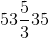 |
| ReLU | 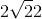 |
| 泄漏的露露 | 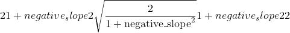 |

参数

*   **非线性** –非线性函数 (&lt;cite&gt;nn.functional&lt;/cite&gt; 名称）

*   **参数** –非线性功能的可选参数

例子

```
>>> gain = nn.init.calculate_gain('leaky_relu', 0.2)  # leaky_relu with negative_slope=0.2

```

* * *

```
torch.nn.init.uniform_(tensor, a=0.0, b=1.0)¶
```

用从均匀分布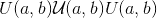中得出的值填充输入张量。

Parameters

*   **张量** – n 维&lt;cite&gt;torch.张量&lt;/cite&gt;

*   **a** –均匀分布的下限

*   **b** –均匀分布的上限

Examples

```
>>> w = torch.empty(3, 5)
>>> nn.init.uniform_(w)

```

* * *

```
torch.nn.init.normal_(tensor, mean=0.0, std=1.0)¶
```

使用从正态分布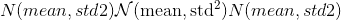中得出的值填充输入张量。

Parameters

*   **tensor** – an n-dimensional &lt;cite&gt;torch.Tensor&lt;/cite&gt;

*   **平均值** –正态分布的平均值

*   **std** –正态分布的标准偏差

Examples

```
>>> w = torch.empty(3, 5)
>>> nn.init.normal_(w)

```

* * *

```
torch.nn.init.constant_(tensor, val)¶
```

用值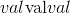填充输入张量。

Parameters

*   **tensor** – an n-dimensional &lt;cite&gt;torch.Tensor&lt;/cite&gt;

*   **val** –用张量填充张量的值

Examples

```
>>> w = torch.empty(3, 5)
>>> nn.init.constant_(w, 0.3)

```

* * *

```
torch.nn.init.ones_(tensor)¶
```

用标量值 &lt;cite&gt;1&lt;/cite&gt; 填充输入张量。

Parameters

**tensor** – an n-dimensional &lt;cite&gt;torch.Tensor&lt;/cite&gt;

Examples

```
>>> w = torch.empty(3, 5)
>>> nn.init.ones_(w)

```

* * *

```
torch.nn.init.zeros_(tensor)¶
```

用标量值 &lt;cite&gt;0&lt;/cite&gt; 填充输入张量。

Parameters

**tensor** – an n-dimensional &lt;cite&gt;torch.Tensor&lt;/cite&gt;

Examples

```
>>> w = torch.empty(3, 5)
>>> nn.init.zeros_(w)

```

* * *

```
torch.nn.init.eye_(tensor)¶
```

用单位矩阵填充二维输入&lt;cite&gt;张量&lt;/cite&gt;。 在&lt;cite&gt;线性&lt;/cite&gt;层中保留输入的身份，在该层中将保留尽可能多的输入。

Parameters

**张量** –二维&lt;cite&gt;torch.张量&lt;/cite&gt;

Examples

```
>>> w = torch.empty(3, 5)
>>> nn.init.eye_(w)

```

* * *

```
torch.nn.init.dirac_(tensor)¶
```

使用 Dirac delta 函数填充{3，4，5}维输入&lt;cite&gt;张量&lt;/cite&gt;。 保留&lt;cite&gt;卷积&lt;/cite&gt;层中输入的身份，其中保留尽可能多的输入通道。

Parameters

**张量** – {3，4，5}维的&lt;cite&gt;torch.张量&lt;/cite&gt;

Examples

```
>>> w = torch.empty(3, 16, 5, 5)
>>> nn.init.dirac_(w)

```

* * *

```
torch.nn.init.xavier_uniform_(tensor, gain=1.0)¶
```

根据&lt;cite&gt;中所述的方法，用值填充输入&lt;cite&gt;张量&lt;/cite&gt;的值。了解训练深度前馈神经网络&lt;/cite&gt;的难度-Glorot，X。& Bengio，Y.(2010），使用 均匀分布。 结果张量将具有从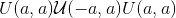采样的值，其中

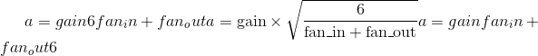

也称为 Glorot 初始化。

Parameters

*   **tensor** – an n-dimensional &lt;cite&gt;torch.Tensor&lt;/cite&gt;

*   **增益** –可选的比例因子

Examples

```
>>> w = torch.empty(3, 5)
>>> nn.init.xavier_uniform_(w, gain=nn.init.calculate_gain('relu'))

```

* * *

```
torch.nn.init.xavier_normal_(tensor, gain=1.0)¶
```

根据&lt;cite&gt;中所述的方法，用值填充输入&lt;cite&gt;张量&lt;/cite&gt;。了解训练深度前馈神经网络&lt;/cite&gt;的难度-Glorot，X。& Bengio，Y.(2010），使用 正态分布。 结果张量将具有从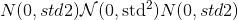采样的值，其中


Also known as Glorot initialization.

Parameters

*   **tensor** – an n-dimensional &lt;cite&gt;torch.Tensor&lt;/cite&gt;

*   **gain** – an optional scaling factor

Examples

```
>>> w = torch.empty(3, 5)
>>> nn.init.xavier_normal_(w)

```

* * *

```
torch.nn.init.kaiming_uniform_(tensor, a=0, mode='fan_in', nonlinearity='leaky_relu')¶
```

根据&lt;cite&gt;中描述的方法，用值填充输入&lt;cite&gt;张量&lt;/cite&gt;的值。深入研究整流器：在 ImageNet 分类&lt;/cite&gt;上超越人类水平的性能-He，K.等。 (2015），使用均匀分布。 结果张量将具有从采样的值，其中

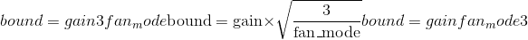

也称为 He 初始化。

Parameters

*   **tensor** – an n-dimensional &lt;cite&gt;torch.Tensor&lt;/cite&gt;

*   **a** –在该层之后使用的整流器的负斜率(仅

*   **with'leaky_relu'）**(_使用了_）–

*   **模式** – `'fan_in'`(默认）或`'fan_out'`。 选择`'fan_in'`会保留前向传递中权重差异的大小。 选择`'fan_out'`可以保留反向传递的幅度。

*   **非线性** –非线性函数(&lt;cite&gt;为功能性&lt;/cite&gt;名称），建议仅与`'relu'`或`'leaky_relu'`(默认）一起使用。

Examples

```
>>> w = torch.empty(3, 5)
>>> nn.init.kaiming_uniform_(w, mode='fan_in', nonlinearity='relu')

```

* * *

```
torch.nn.init.kaiming_normal_(tensor, a=0, mode='fan_in', nonlinearity='leaky_relu')¶
```

根据&lt;cite&gt;中描述的方法，用值填充输入&lt;cite&gt;张量&lt;/cite&gt;的值。深入研究整流器：在 ImageNet 分类&lt;/cite&gt;上超越人类水平的性能-He，K.等。 (2015），使用正态分布。 结果张量将具有从采样的值，其中

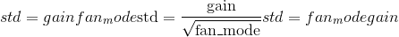

Also known as He initialization.

Parameters

*   **tensor** – an n-dimensional &lt;cite&gt;torch.Tensor&lt;/cite&gt;

*   **a** – the negative slope of the rectifier used after this layer (only

*   **with 'leaky_relu')** (_used_) –

*   **mode** – either `'fan_in'` (default) or `'fan_out'`. Choosing `'fan_in'` preserves the magnitude of the variance of the weights in the forward pass. Choosing `'fan_out'` preserves the magnitudes in the backwards pass.

*   **nonlinearity** – the non-linear function (&lt;cite&gt;nn.functional&lt;/cite&gt; name), recommended to use only with `'relu'` or `'leaky_relu'` (default).

Examples

```
>>> w = torch.empty(3, 5)
>>> nn.init.kaiming_normal_(w, mode='fan_out', nonlinearity='relu')

```

* * *

```
torch.nn.init.orthogonal_(tensor, gain=1)¶
```

用(半）正交矩阵填充输入的&lt;cite&gt;张量&lt;/cite&gt;，如&lt;cite&gt;中所述，用于深度线性神经网络&lt;/cite&gt;中学习的非线性动力学的精确解-Saxe，A.等。 (2013）。 输入张量必须至少具有 2 个维度，对于 2 个以上的张量，尾随维度将被展平。

Parameters

*   **张量** – n 维&lt;cite&gt;torch张量&lt;/cite&gt;，其中

*   **增益** –可选比例因子

Examples

```
>>> w = torch.empty(3, 5)
>>> nn.init.orthogonal_(w)

```

* * *

```
torch.nn.init.sparse_(tensor, sparsity, std=0.01)¶
```

将 2D 输入&lt;cite&gt;张量&lt;/cite&gt;填充为稀疏矩阵，其中将从正态分布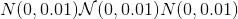提取非零元素，如&lt;cite&gt;通过无麻木优化的深度学习&lt;/cite&gt;中所述- Martens，J.(2010 年）。

Parameters

*   **tensor** – an n-dimensional &lt;cite&gt;torch.Tensor&lt;/cite&gt;

*   **稀疏性** –每列中要设置为零的元素比例

*   **std** –用于生成非零值的正态分布的标准偏差

Examples

```
>>> w = torch.empty(3, 5)
>>> nn.init.sparse_(w, sparsity=0.1)

```