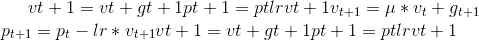
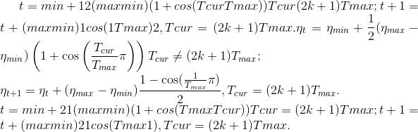
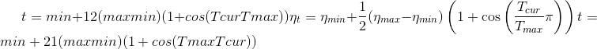
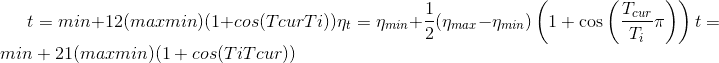
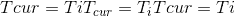

# torch.optim

> 原文： [https://pytorch.org/docs/stable/optim.html](https://pytorch.org/docs/stable/optim.html)

[`torch.optim`](#module-torch.optim "torch.optim") 是实现各种优化算法的软件包。 已经支持最常用的方法，并且接口足够通用，因此将来也可以轻松集成更复杂的方法。

## 如何使用优化器

要使用 [`torch.optim`](#module-torch.optim "torch.optim") ，您必须构造一个优化器对象，该对象将保持当前状态并根据计算出的梯度更新参数。

### 构造它

要构建 [`Optimizer`](#torch.optim.Optimizer "torch.optim.Optimizer") ，您必须为其提供一个包含参数的可迭代项(所有参数应为`Variable`）以进行优化。 然后，您可以指定优化器特定的选项，例如学习率，权重衰减等。

注意

如果您需要通过`.cuda()`将模型移至 GPU，请在为其构建优化器之前执行此操作。 `.cuda()`之后的模型参数将与调用之前的参数不同。

通常，在构造和使用优化器时，应确保优化的参数位于一致的位置。

例：

```
optimizer = optim.SGD(model.parameters(), lr=0.01, momentum=0.9)
optimizer = optim.Adam([var1, var2], lr=0.0001)

```

### 每个参数选项

[`Optimizer`](#torch.optim.Optimizer "torch.optim.Optimizer") 也支持指定每个参数选项。 为此，不要传递`Variable`的迭代器，而是传递`dict`的迭代器。 它们每个都将定义一个单独的参数组，并且应包含一个`params`键，其中包含属于它的参数列表。 其他键应与优化器接受的关键字参数匹配，并将用作该组的优化选项。

Note

您仍然可以将选项作为关键字参数传递。 在未覆盖它们的组中，它们将用作默认值。 当您只想改变一个选项，同时使所有其他参数组保持一致时，这很有用。

例如，当要指定每层学习率时，这非常有用：

```
optim.SGD([
                {'params': model.base.parameters()},
                {'params': model.classifier.parameters(), 'lr': 1e-3}
            ], lr=1e-2, momentum=0.9)

```

这意味着`model.base`的参数将使用默认的学习率`1e-2`，`model.classifier`的参数将使用`1e-3`的学习率，并且动量`0.9`会用于所有参数。

### 采取优化步骤

所有优化器均实现 [`step()`](#torch.optim.Optimizer.step "torch.optim.Optimizer.step") 方法，该方法可更新参数。 它可以以两种方式使用：

#### `optimizer.step()`

这是大多数优化程序支持的简化版本。 一旦使用例如计算出梯度，就可以调用该函数。 `backward()`。

Example:

```
for input, target in dataset:
    optimizer.zero_grad()
    output = model(input)
    loss = loss_fn(output, target)
    loss.backward()
    optimizer.step()

```

#### `optimizer.step(closure)`

某些优化算法(例如共轭梯度和 LBFGS）需要多次重新评估函数，因此您必须传递闭包以允许它们重新计算模型。 闭合应清除梯度，计算损耗，然后将其返回。

Example:

```
for input, target in dataset:
    def closure():
        optimizer.zero_grad()
        output = model(input)
        loss = loss_fn(output, target)
        loss.backward()
        return loss
    optimizer.step(closure)

```

## 演算法

* * *

```
class torch.optim.Optimizer(params, defaults)¶
```

所有优化程序的基类。

警告

需要将参数指定为具有确定性顺序的集合，这些顺序在两次运行之间是一致的。 不满足这些属性的对象的示例是字典值的集合和迭代器。

参数

*   **参数**(_迭代_）– [`torch.Tensor`](tensors.html#torch.Tensor "torch.Tensor") 或`dict` s 的迭代。 指定应优化哪些张量。

*   **默认值为** –(dict）：包含优化选项默认值的 dict(在参数组未指定优化选项时使用）。

* * *

```
add_param_group(param_group)¶
```

将参数组添加到 [`Optimizer`](#torch.optim.Optimizer "torch.optim.Optimizer") 的 &lt;cite&gt;param_groups&lt;/cite&gt; 中。

当对预训练的网络进行微调时，这很有用，因为可以使冻结层成为可训练的，并随着训练的进行而添加到 [`Optimizer`](#torch.optim.Optimizer "torch.optim.Optimizer") 中。

Parameters

*   **param_group**  (_dict_ )–指定应与组一起优化哪些张量

*   **优化选项。** (特定于）–

* * *

```
load_state_dict(state_dict)¶
```

加载优化器状态。

Parameters

**state_dict**  (_dict_ )–优化器状态。 应该是从对 [`state_dict()`](#torch.optim.Optimizer.state_dict "torch.optim.Optimizer.state_dict") 的调用返回的对象。

* * *

```
state_dict()¶
```

以`dict`的形式返回优化器的状态。

它包含两个条目：

*   ```
    state - a dict holding current optimization state. Its content
    ```

    优化器类之间有所不同。

*   param_groups-包含所有参数组的字典

* * *

```
step(closure)¶
```

执行单个优化步骤(参数更新）。

Parameters

**闭合**(可调用_的_）–重新评估模型并返回损失的闭合。 对于大多数优化程序是可选的。

* * *

```
zero_grad()¶
```

清除所有优化的 [`torch.Tensor`](tensors.html#torch.Tensor "torch.Tensor") 的梯度。

* * *

```
class torch.optim.Adadelta(params, lr=1.0, rho=0.9, eps=1e-06, weight_decay=0)¶
```

实现 Adadelta 算法。

在 [ADADELTA 中提出了一种：自适应学习率方法](https://arxiv.org/abs/1212.5701)。

Parameters

*   **参数**(_可迭代_）–参数可迭代以优化或命令定义参数组

*   **rho**  (_python：float_ _，_ _可选_）–用于计算平方梯度的移动平均值的系数(默认值：0.9）

*   **eps**  (_python：float_ _，_ _可选_）–分母添加到分母以提高数值稳定性(默认值：1e-6）

*   **lr**  (_python：float_ _，_ _可选_）–在将增量应用于参数之前对其进行缩放的系数(默认值：1.0）

*   **weight_decay**  (_python：float_ _，_ _可选_）–权重衰减(L2 惩罚）(默认值：0）

* * *

```
step(closure=None)¶
```

执行一个优化步骤。

Parameters

**闭合**(可调用的_，_ _可选_）–重新评估模型并返回损失的闭合。

* * *

```
class torch.optim.Adagrad(params, lr=0.01, lr_decay=0, weight_decay=0, initial_accumulator_value=0, eps=1e-10)¶
```

实现 Adagrad 算法。

它已在[在线学习和随机优化的自适应次梯度方法](http://jmlr.org/papers/v12/duchi11a.html)中提出。

Parameters

*   **params** (_iterable_) – iterable of parameters to optimize or dicts defining parameter groups

*   **lr**  (_python：float_ _，_ _可选_）–学习率(默认值：1e-2）

*   **lr_decay**  (_python：float_ _，_ _可选_）–学习速率衰减(默认值：0）

*   **weight_decay** (_python:float__,_ _optional_) – weight decay (L2 penalty) (default: 0)

*   **eps**  (_python：float_ _，_ _可选_）–分母添加到分母以提高数值稳定性(默认值：1e-10）

* * *

```
step(closure=None)¶
```

Performs a single optimization step.

Parameters

**closure** (_callable__,_ _optional_) – A closure that reevaluates the model and returns the loss.

* * *

```
class torch.optim.Adam(params, lr=0.001, betas=(0.9, 0.999), eps=1e-08, weight_decay=0, amsgrad=False)¶
```

实现亚当算法。

在 [Adam 中提出了一种随机优化方法](https://arxiv.org/abs/1412.6980)。

Parameters

*   **params** (_iterable_) – iterable of parameters to optimize or dicts defining parameter groups

*   **lr**  (_python：float_ _，_ _可选_）–学习率(默认值：1e-3）

*   **Betas**  (_Tuple_ _[_ _python：float_ _，_ _python：float_ _]_ _，_ _可选_）–用于计算梯度及其平方的移动平均值的系数(默认值：(0.9，0.999））

*   **eps**  (_python：float_ _，_ _可选_）–分母添加到分母以提高数值稳定性(默认值：1e-8）

*   **weight_decay** (_python:float__,_ _optional_) – weight decay (L2 penalty) (default: 0)

*   **amsgrad** (_布尔值_ _，_ _可选_）–是否使用论文[上该算法的 AMSGrad 变体 Adam and Beyond](https://openreview.net/forum?id=ryQu7f-RZ) (默认值：False）

* * *

```
step(closure=None)¶
```

Performs a single optimization step.

Parameters

**closure** (_callable__,_ _optional_) – A closure that reevaluates the model and returns the loss.

* * *

```
class torch.optim.AdamW(params, lr=0.001, betas=(0.9, 0.999), eps=1e-08, weight_decay=0.01, amsgrad=False)¶
```

实现 AdamW 算法。

最初的 Adam 算法是在 [Adam：随机优化方法](https://arxiv.org/abs/1412.6980)中提出的。 AdamW 变体在[去耦权重衰减正则化](https://arxiv.org/abs/1711.05101)中提出。

Parameters

*   **params** (_iterable_) – iterable of parameters to optimize or dicts defining parameter groups

*   **lr** (_python:float__,_ _optional_) – learning rate (default: 1e-3)

*   **betas** (_Tuple__[__python:float__,_ _python:float__]__,_ _optional_) – coefficients used for computing running averages of gradient and its square (default: (0.9, 0.999))

*   **eps** (_python:float__,_ _optional_) – term added to the denominator to improve numerical stability (default: 1e-8)

*   **weight_decay**  (_python：float_ _，_ _可选_）–权重衰减系数(默认值：1e-2）

*   **amsgrad** (_boolean__,_ _optional_) – whether to use the AMSGrad variant of this algorithm from the paper [On the Convergence of Adam and Beyond](https://openreview.net/forum?id=ryQu7f-RZ) (default: False)

* * *

```
step(closure=None)¶
```

Performs a single optimization step.

Parameters

**closure** (_callable__,_ _optional_) – A closure that reevaluates the model and returns the loss.

* * *

```
class torch.optim.SparseAdam(params, lr=0.001, betas=(0.9, 0.999), eps=1e-08)¶
```

实现适用于稀疏张量的 Adam 算法的惰性版本。

在此变体中，仅显示出现在渐变中的力矩，并且仅将渐变的那些部分应用于参数。

Parameters

*   **params** (_iterable_) – iterable of parameters to optimize or dicts defining parameter groups

*   **lr** (_python:float__,_ _optional_) – learning rate (default: 1e-3)

*   **betas** (_Tuple__[__python:float__,_ _python:float__]__,_ _optional_) – coefficients used for computing running averages of gradient and its square (default: (0.9, 0.999))

*   **eps** (_python:float__,_ _optional_) – term added to the denominator to improve numerical stability (default: 1e-8)

* * *

```
step(closure=None)¶
```

Performs a single optimization step.

Parameters

**closure** (_callable__,_ _optional_) – A closure that reevaluates the model and returns the loss.

* * *

```
class torch.optim.Adamax(params, lr=0.002, betas=(0.9, 0.999), eps=1e-08, weight_decay=0)¶
```

实现 Adamax 算法(基于无穷范数的 Adam 的变体）。

It has been proposed in [Adam: A Method for Stochastic Optimization](https://arxiv.org/abs/1412.6980).

Parameters

*   **params** (_iterable_) – iterable of parameters to optimize or dicts defining parameter groups

*   **lr**  (_python：float_ _，_ _可选_）–学习率(默认值：2e-3）

*   **Betas**  (_Tuple_ _[_ _python：float_ _，_ _python：float_ _]_ _，_ _可选_）–用于计算梯度及其平方的移动平均值的系数

*   **eps** (_python:float__,_ _optional_) – term added to the denominator to improve numerical stability (default: 1e-8)

*   **weight_decay** (_python:float__,_ _optional_) – weight decay (L2 penalty) (default: 0)

* * *

```
step(closure=None)¶
```

Performs a single optimization step.

Parameters

**closure** (_callable__,_ _optional_) – A closure that reevaluates the model and returns the loss.

* * *

```
class torch.optim.ASGD(params, lr=0.01, lambd=0.0001, alpha=0.75, t0=1000000.0, weight_decay=0)¶
```

实施平均随机梯度下降。

在通过平均对随机逼近的加速中提出。

Parameters

*   **params** (_iterable_) – iterable of parameters to optimize or dicts defining parameter groups

*   **lr** (_python:float__,_ _optional_) – learning rate (default: 1e-2)

*   **lambd**  (_python：float_ _，_ _可选_）–衰减项(默认值：1e-4）

*   **alpha**  (_python：float_ _，_ _可选_）– eta 更新的电源(默认值：0.75）

*   **t0**  (_python：float_ _，_ _可选_）–开始平均的点(默认值：1e6）

*   **weight_decay** (_python:float__,_ _optional_) – weight decay (L2 penalty) (default: 0)

* * *

```
step(closure=None)¶
```

Performs a single optimization step.

Parameters

**closure** (_callable__,_ _optional_) – A closure that reevaluates the model and returns the loss.

* * *

```
class torch.optim.LBFGS(params, lr=1, max_iter=20, max_eval=None, tolerance_grad=1e-07, tolerance_change=1e-09, history_size=100, line_search_fn=None)¶
```

实现 L-BFGS 算法，该算法受到 &lt;cite&gt;minFunc &lt; https://www.cs.ubc.ca/~schmidtm/Software/minFunc.html &gt;&lt;/cite&gt; 的启发。

Warning

此优化器不支持每个参数的选项和参数组(只能有一个）。

Warning

现在，所有参数都必须在单个设备上。 将来会有所改善。

Note

这是一个非常占用内存的优化器(它需要额外的`param_bytes * (history_size + 1)`字节）。 如果内存不足，请尝试减小历史记录的大小，或使用其他算法。

Parameters

*   **lr**  (_python：float_ )–学习率(默认值：1）

*   **max_iter**  (_python：int_ )–每个优化步骤的最大迭代次数(默认值：20）

*   **max_eval**  (_python：int_ )–每个优化步骤的最大函数求值数(默认值：max_iter * 1.25）。

*   **tolerance_grad**  (_python：float_ )–一阶最优的终止公差(默认值：1e-5）。

*   **tolerance_change**  (_python：float_ )–函数值/参数更改的终止公差(默认值：1e-9）。

*   **history_size**  (_python：int_ )–更新历史记录大小(默认值：100）。

*   **line_search_fn**  (_str_ )–“ strong_wolfe”或“无”(默认值：无）。

* * *

```
step(closure)¶
```

Performs a single optimization step.

Parameters

**闭合**(可调用_的_）–重新评估模型并返回损失的闭合。

* * *

```
class torch.optim.RMSprop(params, lr=0.01, alpha=0.99, eps=1e-08, weight_decay=0, momentum=0, centered=False)¶
```

实现 RMSprop 算法。

由 G. Hinton 在他的[课程](http://www.cs.toronto.edu/~tijmen/csc321/slides/lecture_slides_lec6.pdf)中提出。

居中版本首先出现在[中，并使用递归神经网络生成序列](https://arxiv.org/pdf/1308.0850v5.pdf)。

这里的实现在添加 epsilon 之前取梯度平均值的平方根(请注意，TensorFlow 会互换这两个操作）。 因此，有效学习率是，其中是计划的学习率，是平方梯度的加权移动平均值。

Parameters

*   **params** (_iterable_) – iterable of parameters to optimize or dicts defining parameter groups

*   **lr** (_python:float__,_ _optional_) – learning rate (default: 1e-2)

*   **动量** (_python：float_ _，_ _可选_）–动量因子(默认值：0）

*   **alpha**  (_python：float_ _，_ _可选_）–平滑常数(默认值：0.99）

*   **eps** (_python:float__,_ _optional_) – term added to the denominator to improve numerical stability (default: 1e-8)

*   以**为中心的** (_bool_ _，_ _可选_）–如果`True`来计算居中的 RMSProp，则通过对其斜率的估计对其进行归一化 方差

*   **weight_decay** (_python:float__,_ _optional_) – weight decay (L2 penalty) (default: 0)

* * *

```
step(closure=None)¶
```

Performs a single optimization step.

Parameters

**closure** (_callable__,_ _optional_) – A closure that reevaluates the model and returns the loss.

* * *

```
class torch.optim.Rprop(params, lr=0.01, etas=(0.5, 1.2), step_sizes=(1e-06, 50))¶
```

实现弹性反向传播算法。

Parameters

*   **params** (_iterable_) – iterable of parameters to optimize or dicts defining parameter groups

*   **lr** (_python:float__,_ _optional_) – learning rate (default: 1e-2)

*   **etas** (_元组_ _[_ _python：float_ _，_ _python：float_ _]_ _，_ _可选_）–对(增加，减少）(增加，减少）(默认值：(0.5，1.2））

*   **step_sizes** (_元组_ _[_ _python：float_ _，_ _python：float_ _]_ _，_ _可选_）–一对最小和最大允许步长(默认值：(1e-6，50））

* * *

```
step(closure=None)¶
```

Performs a single optimization step.

Parameters

**closure** (_callable__,_ _optional_) – A closure that reevaluates the model and returns the loss.

* * *

```
class torch.optim.SGD(params, lr=<required parameter>, momentum=0, dampening=0, weight_decay=0, nesterov=False)¶
```

实现随机梯度下降(可选带动量）。

Nesterov 动量基于[中关于初始化和动量在深度学习](http://www.cs.toronto.edu/%7Ehinton/absps/momentum.pdf)中的重要性的公式。

Parameters

*   **params** (_iterable_) – iterable of parameters to optimize or dicts defining parameter groups

*   **lr**  (_python：float_ )–学习率

*   **momentum** (_python:float__,_ _optional_) – momentum factor (default: 0)

*   **weight_decay** (_python:float__,_ _optional_) – weight decay (L2 penalty) (default: 0)

*   **衰减** (_python：float_ _，_ _可选_）–衰减动量(默认值：0）

*   **nesterov**  (_bool_ _，_ _可选_）–启用 Nesterov 动量(默认：False）

例

```
>>> optimizer = torch.optim.SGD(model.parameters(), lr=0.1, momentum=0.9)
>>> optimizer.zero_grad()
>>> loss_fn(model(input), target).backward()
>>> optimizer.step()

```

Note

用 Momentum / Nesterov 实施 SGD 与 Sutskever 等人的方法有所不同。 等 以及其他一些框架中的实现。

考虑到动量的具体情况，可以将更新写为



其中，p，g，v 和分别表示参数，梯度，速度和动量。

这与 Sutskever 等人相反。 等 和其他使用表格更新的框架


Nesterov 版本进行了类似的修改。

* * *

```
step(closure=None)¶
```

Performs a single optimization step.

Parameters

**closure** (_callable__,_ _optional_) – A closure that reevaluates the model and returns the loss.

## 如何调整学习率

`torch.optim.lr_scheduler`提供了几种根据时期数来调整学习率的方法。 [`torch.optim.lr_scheduler.ReduceLROnPlateau`](#torch.optim.lr_scheduler.ReduceLROnPlateau "torch.optim.lr_scheduler.ReduceLROnPlateau") 允许基于某些验证度量来降低动态学习率。

优化器更新后应应用学习率安排； 例如，您应该以这种方式编写代码：

```
>>> scheduler = ...
>>> for epoch in range(100):
>>>     train(...)
>>>     validate(...)
>>>     scheduler.step()

```

Warning

在 PyTorch 1.1.0 之前，学习率调度程序应在优化程序更新之前调用； 1.1.0 改变了这种行为，打破了 BC。 如果您在优化程序更新之前(调用`optimizer.step()`）使用学习率计划程序(调用`scheduler.step()`），则会跳过学习率计划的第一个值。 如果升级到 PyTorch 1.1.0 后无法重现结果，请检查是否在错误的时间调用了`scheduler.step()`。

* * *

```
class torch.optim.lr_scheduler.LambdaLR(optimizer, lr_lambda, last_epoch=-1)¶
```

将每个参数组的学习率设置为给定函数的初始 lr 倍。 当 last_epoch = -1 时，将初始 lr 设置为 lr。

Parameters

*   **优化器** ([_优化器_](#torch.optim.Optimizer "torch.optim.Optimizer"))–包装的优化器。

*   **lr_lambda** (_函数_ _或_ _列表_）–一个给定整数参数纪元的乘法因子或此类函数列表的函数 ，对于 optimizer.param_groups 中的每个组一个。

*   **last_epoch**  (_python：int_ )–最后一个纪元的索引。 默认值：-1。

Example

```
>>> # Assuming optimizer has two groups.
>>> lambda1 = lambda epoch: epoch // 30
>>> lambda2 = lambda epoch: 0.95 ** epoch
>>> scheduler = LambdaLR(optimizer, lr_lambda=[lambda1, lambda2])
>>> for epoch in range(100):
>>>     train(...)
>>>     validate(...)
>>>     scheduler.step()

```

* * *

```
load_state_dict(state_dict)¶
```

加载调度程序状态。

Parameters

**state_dict**  (_dict_ )–调度程序状态。 应该是从对 [`state_dict()`](#torch.optim.lr_scheduler.LambdaLR.state_dict "torch.optim.lr_scheduler.LambdaLR.state_dict") 的调用返回的对象。

* * *

```
state_dict()¶
```

返回调度程序的状态为`dict`。

它包含 self .__ dict__ 中不是优化程序的每个变量的条目。 学习率 lambda 函数仅在它们是可调用对象时才被保存，而在它们是函数或 lambda 时才被保存。

* * *

```
class torch.optim.lr_scheduler.MultiplicativeLR(optimizer, lr_lambda, last_epoch=-1)¶
```

将每个参数组的学习率乘以指定函数中给定的因子。 当 last_epoch = -1 时，将初始 lr 设置为 lr。

Parameters

*   **optimizer** ([_Optimizer_](#torch.optim.Optimizer "torch.optim.Optimizer")) – Wrapped optimizer.

*   **lr_lambda** (_function_ _or_ _list_) – A function which computes a multiplicative factor given an integer parameter epoch, or a list of such functions, one for each group in optimizer.param_groups.

*   **last_epoch** (_python:int_) – The index of last epoch. Default: -1.

Example

```
>>> # Assuming optimizer has two groups.
>>> lmbda = lambda epoch: 0.95
>>> scheduler = LambdaLR(optimizer, lr_lambda=lmbda)
>>> for epoch in range(100):
>>>     train(...)
>>>     validate(...)
>>>     scheduler.step()

```

* * *

```
load_state_dict(state_dict)¶
```

Loads the schedulers state.

Parameters

**state_dict**  (_dict_ )–调度程序状态。 应该是从对 [`state_dict()`](#torch.optim.lr_scheduler.MultiplicativeLR.state_dict "torch.optim.lr_scheduler.MultiplicativeLR.state_dict") 的调用返回的对象。

* * *

```
state_dict()¶
```

Returns the state of the scheduler as a `dict`.

It contains an entry for every variable in self.__dict__ which is not the optimizer. The learning rate lambda functions will only be saved if they are callable objects and not if they are functions or lambdas.

* * *

```
class torch.optim.lr_scheduler.StepLR(optimizer, step_size, gamma=0.1, last_epoch=-1)¶
```

在每个 step_size 时期，通过 gamma 降低每个参数组的学习率。 注意，这种衰减可能与此调度程序外部的学习速率的其他更改同时发生。 当 last_epoch = -1 时，将初始 lr 设置为 lr。

Parameters

*   **optimizer** ([_Optimizer_](#torch.optim.Optimizer "torch.optim.Optimizer")) – Wrapped optimizer.

*   **step_size**  (_python：int_ )–学习率衰减的周期。

*   **伽玛** (_python：float_ )–学习率衰减的乘法因子。 默认值：0.1

*   **last_epoch** (_python:int_) – The index of last epoch. Default: -1.

Example

```
>>> # Assuming optimizer uses lr = 0.05 for all groups
>>> # lr = 0.05     if epoch < 30
>>> # lr = 0.005    if 30 <= epoch < 60
>>> # lr = 0.0005   if 60 <= epoch < 90
>>> # ...
>>> scheduler = StepLR(optimizer, step_size=30, gamma=0.1)
>>> for epoch in range(100):
>>>     train(...)
>>>     validate(...)
>>>     scheduler.step()

```

* * *

```
class torch.optim.lr_scheduler.MultiStepLR(optimizer, milestones, gamma=0.1, last_epoch=-1)¶
```

一旦历元数达到其中一个里程碑，则通过伽马衰减每个参数组的学习率。 注意，这种衰减可能与此调度程序外部的学习速率的其他更改同时发生。 当 last_epoch = -1 时，将初始 lr 设置为 lr。

Parameters

*   **optimizer** ([_Optimizer_](#torch.optim.Optimizer "torch.optim.Optimizer")) – Wrapped optimizer.

*   **里程碑**(_列表_）–时期索引列表。 必须增加。

*   **gamma** (_python:float_) – Multiplicative factor of learning rate decay. Default: 0.1.

*   **last_epoch** (_python:int_) – The index of last epoch. Default: -1.

Example

```
>>> # Assuming optimizer uses lr = 0.05 for all groups
>>> # lr = 0.05     if epoch < 30
>>> # lr = 0.005    if 30 <= epoch < 80
>>> # lr = 0.0005   if epoch >= 80
>>> scheduler = MultiStepLR(optimizer, milestones=[30,80], gamma=0.1)
>>> for epoch in range(100):
>>>     train(...)
>>>     validate(...)
>>>     scheduler.step()

```

* * *

```
class torch.optim.lr_scheduler.ExponentialLR(optimizer, gamma, last_epoch=-1)¶
```

在每个时期以伽马衰减每个参数组的学习率。 当 last_epoch = -1 时，将初始 lr 设置为 lr。

Parameters

*   **optimizer** ([_Optimizer_](#torch.optim.Optimizer "torch.optim.Optimizer")) – Wrapped optimizer.

*   **伽玛** (_python：float_ )–学习率衰减的乘法因子。

*   **last_epoch** (_python:int_) – The index of last epoch. Default: -1.

* * *

```
class torch.optim.lr_scheduler.CosineAnnealingLR(optimizer, T_max, eta_min=0, last_epoch=-1)¶
```

使用余弦退火进度表设置每个参数组的学习率，其中设置为初始 lr，是自 SGDR 上次重新启动以来的时期数：



当 last_epoch = -1 时，将初始 lr 设置为 lr。 注意，由于调度是递归定义的，因此其他操作员可以在此调度器外部同时修改学习率。 如果学习率仅由此调度程序设置，则每个步骤的学习率变为：



它已在 [SGDR：具有暖重启的随机梯度下降](https://arxiv.org/abs/1608.03983)中提出。 请注意，这仅实现 SGDR 的余弦退火部分，而不实现重新启动。

Parameters

*   **optimizer** ([_Optimizer_](#torch.optim.Optimizer "torch.optim.Optimizer")) – Wrapped optimizer.

*   **T_max**  (_python：int_ )–最大迭代次数。

*   **eta_min**  (_python：float_ )–最低学习率。 默认值：0

*   **last_epoch** (_python:int_) – The index of last epoch. Default: -1.

* * *

```
class torch.optim.lr_scheduler.ReduceLROnPlateau(optimizer, mode='min', factor=0.1, patience=10, verbose=False, threshold=0.0001, threshold_mode='rel', cooldown=0, min_lr=0, eps=1e-08)¶
```

当指标停止改善时，降低学习率。 一旦学习停滞，模型通常会受益于将学习率降低 2-10 倍。 该调度程序读取一个指标数量，如果在“耐心”时期没有看到改善，则学习速度会降低。

Parameters

*   **optimizer** ([_Optimizer_](#torch.optim.Optimizer "torch.optim.Optimizer")) – Wrapped optimizer.

*   **模式** (_str_ )– &lt;cite&gt;min&lt;/cite&gt; ， &lt;cite&gt;max&lt;/cite&gt; 中的一种。 在 &lt;cite&gt;min&lt;/cite&gt; 模式下，当监视的数量停止减少时，lr 将减小； 在 &lt;cite&gt;max&lt;/cite&gt; 模式下，当监视的数量停止增加时，它将减少。 默认值：“分钟”。

*   **因子** (_python：float_ )–将降低学习率的因子。 new_lr = lr *因子。 默认值：0.1

*   **耐心** (_python：int_ )–没有改善的时期数，之后学习率将降低。 例如，如果&lt;cite&gt;耐心= 2&lt;/cite&gt; ，那么我们将忽略前两个时期，而没有改善，并且如果损失仍然没有改善，则只会在第三个时期之后降低 LR。 默认值：10

*   **详细** (_bool_ )–如果`True`，则为每次更新向 stdout 打印一条消息。 默认值：`False`。

*   **阈值** (_python：float_ )–用于测量新最优值的阈值，仅关注重大变化。 默认值：1e-4。

*   **threshold_mode**  (_str_ )– &lt;cite&gt;相对&lt;/cite&gt;， &lt;cite&gt;abs&lt;/cite&gt; 之一。 在&lt;cite&gt;相对于&lt;/cite&gt;模式下，dynamic_threshold =最佳*(1 +阈值）在“最大”模式下，最佳*(1-阈值）在 &lt;cite&gt;min&lt;/cite&gt; 模式下。 在&lt;cite&gt;绝对&lt;/cite&gt;模式下，dynamic_threshold =最佳+ &lt;cite&gt;max&lt;/cite&gt; 模式下的阈值，或 best-阈值 &lt;cite&gt;min&lt;/cite&gt; 模式下的阈值。 默认值：“ rel”。

*   **冷却时间** (_python：int_ )–减少 lr 后恢复正常运行之前要等待的时期数。 默认值：0

*   **min_lr**  (_python：float_ _或_ _列表_）–标量或标量列表。 所有参数组或每个组的学习率的下限。 默认值：0

*   **eps**  (_python：float_ )–应用于 lr 的最小衰减。 如果新旧 lr 之间的差异小于 eps，则忽略该更新。 默认值：1e-8。

Example

```
>>> optimizer = torch.optim.SGD(model.parameters(), lr=0.1, momentum=0.9)
>>> scheduler = ReduceLROnPlateau(optimizer, 'min')
>>> for epoch in range(10):
>>>     train(...)
>>>     val_loss = validate(...)
>>>     # Note that step should be called after validate()
>>>     scheduler.step(val_loss)

```

* * *

```
class torch.optim.lr_scheduler.CyclicLR(optimizer, base_lr, max_lr, step_size_up=2000, step_size_down=None, mode='triangular', gamma=1.0, scale_fn=None, scale_mode='cycle', cycle_momentum=True, base_momentum=0.8, max_momentum=0.9, last_epoch=-1)¶
```

根据周期学习率策略(CLR）设置每个参数组的学习率。 该策略以恒定的频率在两个边界之间循环学习率，如论文[训练神经网络的循环学习率](https://arxiv.org/abs/1506.01186)中所述。 两个边界之间的距离可以在每个迭代或每个周期的基础上缩放。

周期性学习率策略会在每批之后更改学习率。 在将一批用于训练之后，应调用&lt;cite&gt;步骤&lt;/cite&gt;。

如本文所述，该类具有三个内置策略：

*   “三角形”：没有幅度缩放的基本三角形周期。

*   “ triangular2”：一个基本的三角形周期，它将每个周期的初始幅度缩放一半。

*   “ exp_range”：一个在每次循环迭代中按缩放初始幅度的循环。

此实现改编自 github 存储库： [bckenstler / CLR](https://github.com/bckenstler/CLR)

Parameters

*   **optimizer** ([_Optimizer_](#torch.optim.Optimizer "torch.optim.Optimizer")) – Wrapped optimizer.

*   **base_lr**  (_python：float_ _或_ _列表_）–初始学习速率，它是每个参数组循环的下限。

*   **max_lr**  (_python：float_ _或_ _列表_）–每个参数组在循环中的较高学习率边界。 从功能上讲，它定义了循环幅度(max_lr-base_lr）。 任何周期的 lr 是 base_lr 与振幅的一定比例之和； 因此，取决于缩放函数，可能实际上无法达到 max_lr。

*   **step_size_up**  (_python：int_ )–周期递增的一半中的训练迭代次数。 默认值：2000

*   **step_size_down**  (_python：int_ )–减少周期的一半内的训练迭代次数。 如果 step_size_down 为 None，则将其设置为 step_size_up。 默认值：无

*   **模式** (_str_ )– {triangle，trial2，exp_range}中的一种。 值与上面详述的策略相对应。 如果 scale_fn 不为 None，则忽略此参数。 默认值：“三角形”

*   **伽玛** (_python：float_ )–'exp_range'缩放函数中的常量：gamma **(循环迭代）默认值：1.0

*   **scale_fn** (_函数_）–由单个参数 lambda 函数定义的自定义缩放策略，其中对于所有 x &gt; = 0 &lt; = scale_fn(x）&lt; = 1 0。如果指定，则忽略“模式”。 默认值：无

*   **scale_mode**  (_str_ )– {“周期”，“迭代次数”}。 定义是否在循环数或循环迭代(自循环开始后的训练迭代）中评估 scale_fn。 默认值：“循环”

*   **cycle_momentum**  (_bool_ )–如果`True`，则动量与学习速率成反比地在“ base_momentum”和“ max_momentum”之间循环。 默认值：True

*   **base_momentum**  (_python：float_ _或_ _列表_）–每个参数组的循环动量边界较低。 注意，动量与学习速度成反比。 在一个周期的最高峰，动量为“ base_momentum”，学习速率为“ max_lr”。 默认值：0.8

*   **max_momentum**  (_python：float_ _或_ _列表_）–每个参数组在循环中的较高动量边界。 从功能上讲，它定义了循环幅度(max_momentum-base_momentum）。 任何周期的动量都是 max_momentum 与振幅的一定比例之差； 因此，取决于缩放功能，实际上可能无法达到 base_momentum。 注意，动量与学习速度成反比。 在周期开始时，动量为“ max_momentum”，学习率为“ base_lr”默认值：0.9

*   **last_epoch**  (_python：int_ )–最后一批的索引。 恢复训练作业时使用此参数。 由于 &lt;cite&gt;step(）&lt;/cite&gt;应该在每个批处理之后而不是在每个时期之后调用，因此该数字表示所计算的批次的总数，而不是所计算的时期总数。 当 last_epoch = -1 时，调度将从头开始。 默认值：-1

Example

```
>>> optimizer = torch.optim.SGD(model.parameters(), lr=0.1, momentum=0.9)
>>> scheduler = torch.optim.lr_scheduler.CyclicLR(optimizer, base_lr=0.01, max_lr=0.1)
>>> data_loader = torch.utils.data.DataLoader(...)
>>> for epoch in range(10):
>>>     for batch in data_loader:
>>>         train_batch(...)
>>>         scheduler.step()

```

* * *

```
get_lr()¶
```

计算批次索引的学习率。 此函数将 &lt;cite&gt;self.last_epoch&lt;/cite&gt; 视为最后一批索引。

如果 &lt;cite&gt;self.cycle_momentum&lt;/cite&gt; 为`True`，则此功能具有更新优化器动量的副作用。

* * *

```
class torch.optim.lr_scheduler.OneCycleLR(optimizer, max_lr, total_steps=None, epochs=None, steps_per_epoch=None, pct_start=0.3, anneal_strategy='cos', cycle_momentum=True, base_momentum=0.85, max_momentum=0.95, div_factor=25.0, final_div_factor=10000.0, last_epoch=-1)¶
```

根据 1cycle 学习率策略设置每个参数组的学习率。 1 周期策略将学习速率从初始学习速率退火到某个最大学习速率，然后从该最大学习速率退火到某个远低于初始学习速率的最小学习速率。 最初在论文[超融合：使用大学习率的超快速神经网络训练](https://arxiv.org/abs/1708.07120)中描述了此策略。

1 周期学习率策略每批更改一次学习率。 在将一批用于训练之后，应调用&lt;cite&gt;步骤&lt;/cite&gt;。

此调度程序不可链接。

还请注意，可以用以下两种方法之一确定循环中的步骤总数(按优先顺序列出）：

1.  明确提供了 total_steps 的值。

2.  提供了多个时期(epoch）和每个时期的步骤数(steps_per_epoch）。 在这种情况下，总步数由 total_steps = epochs * steps_per_epoch 推断

您必须为 total_steps 提供一个值，或者为纪元和 steps_per_epoch 提供一个值。

Parameters

*   **optimizer** ([_Optimizer_](#torch.optim.Optimizer "torch.optim.Optimizer")) – Wrapped optimizer.

*   **max_lr**  (_python：float_ _或_ _列表_）–每个参数组在循环中的较高学习率边界。

*   **total_steps**  (_python：int_ )–循环中的总步数。 请注意，如果此处提供了一个值，则必须通过为 epochs 和 steps_per_epoch 提供一个值来进行推断。 默认值：无

*   **纪元** (_python：int_ )–要训练的纪元数。 如果未提供 total_steps 的值，则将其与 steps_per_epoch 一起使用以推断循环中的步骤总数。 默认值：无

*   **steps_per_epoch**  (_python：int_ )–每个纪元要训练的步数。 如果未提供 total_steps 的值，则将其与历元一起使用以推断循环中的总步数。 默认值：无

*   **pct_start**  (_python：float_ )–花费的周期百分比(步数）提高了学习率。 默认值：0.3

*   **anneal_strategy**  (_str_ )– {'cos'，'linear'}指定退火策略：余弦退火为“ cos”，线性退火为“ linear”。 默认值：“ cos”

*   **cycle_momentum** (_bool_) – If `True`, momentum is cycled inversely to learning rate between ‘base_momentum’ and ‘max_momentum’. Default: True

*   **base_momentum**  (_python：float_ _或_ _列表_）–每个参数组的循环动量边界较低。 注意，动量与学习速度成反比。 在一个周期的最高峰，动量为“ base_momentum”，学习速率为“ max_lr”。 默认值：0.85

*   **max_momentum**  (_python：float_ _或_ _列表_）–每个参数组在循环中的较高动量边界。 从功能上讲，它定义了循环幅度(max_momentum-base_momentum）。 注意，动量与学习速度成反比。 在周期开始时，动量为“ max_momentum”，学习率为“ base_lr”默认值：0.95

*   **div_factor**  (_python：float_ )–通过 initial_lr = max_lr / div_factor 确定初始学习率默认值：25

*   **final_div_factor**  (_python：float_ )–通过 min_lr = initial_lr / final_div_factor 确定最小学习率默认值：1e4

*   **last_epoch** (_python:int_) – The index of the last batch. This parameter is used when resuming a training job. Since &lt;cite&gt;step()&lt;/cite&gt; should be invoked after each batch instead of after each epoch, this number represents the total number of _batches_ computed, not the total number of epochs computed. When last_epoch=-1, the schedule is started from the beginning. Default: -1

Example

```
>>> data_loader = torch.utils.data.DataLoader(...)
>>> optimizer = torch.optim.SGD(model.parameters(), lr=0.1, momentum=0.9)
>>> scheduler = torch.optim.lr_scheduler.OneCycleLR(optimizer, max_lr=0.01, steps_per_epoch=len(data_loader), epochs=10)
>>> for epoch in range(10):
>>>     for batch in data_loader:
>>>         train_batch(...)
>>>         scheduler.step()

```

* * *

```
class torch.optim.lr_scheduler.CosineAnnealingWarmRestarts(optimizer, T_0, T_mult=1, eta_min=0, last_epoch=-1)¶
```

使用余弦退火进度表设置每个参数组的学习率，其中设置为初始 lr，是自上次重启以来的时期数，是两次暖启动之间的时期数 在 SGDR 中：



当时，设置。 重新启动后时，设置。

它已在 [SGDR：具有暖重启的随机梯度下降](https://arxiv.org/abs/1608.03983)中提出。

Parameters

*   **optimizer** ([_Optimizer_](#torch.optim.Optimizer "torch.optim.Optimizer")) – Wrapped optimizer.

*   **T_0**  (_python：int_ )–首次重启的迭代次数。

*   **T_mult**  (_python：int_ _，_ _可选_）–重新启动后，因素会增加。 默认值：1。

*   **eta_min**  (_python：float_ _，_ _可选_）–最低学习率。 默认值：0

*   **last_epoch**  (_python：int_ _，_ _可选_）–最后一个纪元的索引。 默认值：-1。

* * *

```
step(epoch=None)¶
```

每次批量更新后都可以调用该步骤

Example

```
>>> scheduler = CosineAnnealingWarmRestarts(optimizer, T_0, T_mult)
>>> iters = len(dataloader)
>>> for epoch in range(20):
>>>     for i, sample in enumerate(dataloader):
>>>         inputs, labels = sample['inputs'], sample['labels']
>>>         scheduler.step(epoch + i / iters)
>>>         optimizer.zero_grad()
>>>         outputs = net(inputs)
>>>         loss = criterion(outputs, labels)
>>>         loss.backward()
>>>         optimizer.step()

```

可以交错方式调用此函数。

Example

```
>>> scheduler = CosineAnnealingWarmRestarts(optimizer, T_0, T_mult)
>>> for epoch in range(20):
>>>     scheduler.step()
>>> scheduler.step(26)
>>> scheduler.step() # scheduler.step(27), instead of scheduler(20)

```