# 量化

> 原文： [https://pytorch.org/docs/stable/quantization.html](https://pytorch.org/docs/stable/quantization.html)

## 量化导论

量化是指用于执行计算并以低于浮点精度的位宽存储张量的技术。 量化模型对张量使用整数而不是浮点值执行部分或全部运算。 这允许更紧凑的模型表示，并在许多硬件平台上使用高性能矢量化操作。 与典型的 FP32 型号相比，PyTorch 支持 INT8 量化，从而可将模型大小减少 4 倍，并将内存带宽要求减少 4 倍。 与 FP32 计算相比，对 INT8 计算的硬件支持通常快 2 到 4 倍。 量化主要是一种加速推理的技术，并且量化算子仅支持前向传递。

PyTorch 支持多种方法来量化深度学习模型。 在大多数情况下，该模型在 FP32 中训练，然后将模型转换为 INT8。 此外，PyTorch 还支持量化意识训练，该训练使用伪量化模块对前向和后向传递中的量化误差进行建模。 注意，整个计算是在浮点数中进行的。 在量化意识训练结束时，PyTorch 提供转换功能，将训练后的模型转换为较低的精度。

在较低级别，PyTorch 提供了一种表示量化张量并对其执行操作的方法。 它们可用于直接构建以较低的精度执行全部或部分计算的模型。 提供了更高级别的 API，这些 API 合并了将 FP32 模型转换为较低精度并降低精度损失的典型工作流程。

如今，PyTorch 支持以下后端以有效地运行量化运算符：

*   具有 AVX2 支持或更高版本的 x86 CPU(在没有 AVX2 的情况下，某些操作的执行效率较低）

*   ARM CPU(通常在移动/嵌入式设备中找到）

相应的实现是根据 PyTorch 构建模式自动选择的。

注意

PyTorch 1.3 尚未在 CUDA 上提供量化的操作员实施-这是未来工作的方向。 将模型移至 CPU，以测试量化功能。

量化感知训练(通过 [`FakeQuantize`](#torch.quantization.FakeQuantize "torch.quantization.FakeQuantize"))支持 CPU 和 CUDA。

Note

在准备量化模型时，有必要确保 qconfig 和用于量化计算的引擎与将在其上执行模型的后端匹配。 量化目前支持两个后端：fbgemm(用于 x86， [https://github.com/pytorch/FBGEMM](https://github.com/pytorch/FBGEMM))和 qnnpack(用于 ARM QNNPACK 库 [https://github.com）。 com / pytorch / QNNPACK](https://github.com/pytorch/QNNPACK))。 例如，如果您对量化要在 ARM 上运行的模型感兴趣，建议通过调用以下命令设置 qconfig：

`qconfig = torch.quantization.get_default_qconfig('qnnpack')`

用于后期训练量化和

`qconfig = torch.quantization.get_default_qat_qconfig('qnnpack')`

用于量化意识训练。

另外，torch.backends.quantized.engine 参数应设置为与后端匹配。 为了使用 qnnpack 进行推理，将后端设置为 qnnpack，如下所示

`torch.backends.quantized.engine = 'qnnpack'`

## 量化张量

PyTorch 支持每个张量和每个通道非对称线性量化。 每个张量意味着张量内的所有值都以相同的方式缩放。 每通道意味着对于每个尺寸(通常是张量的通道尺寸），张量中的值都按比例缩放并偏移一个不同的值(实际上，比例和偏移成为矢量）。 这样可以在将张量转换为量化值时减少误差。

通过使用以下命令转换浮点张量来执行映射

[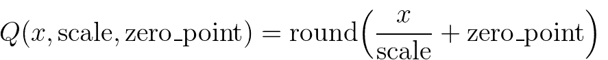](_images/math-quantizer-equation.png)

注意，我们确保在量化后浮点中的零表示没有错误，从而确保诸如填充之类的操作不会引起额外的量化误差。

为了在 PyTorch 中进行量化，我们需要能够在 Tensor 中表示量化数据。 量化张量允许存储量化数据(表示为 int8 / uint8 / int32）以及诸如 scale 和 zero_point 之类的量化参数。 量化张量除了允许以量化格式序列化数据外，还允许许多有用的操作使量化算术变得容易。

## 经营范围

量化张量支持常规全精度张量的有限数据处理方法子集。 (请参阅下面的列表）

对于 PyTorch 中包含的 NN 运算符，我们将支持范围限制为：

> 1.  8 位权重(data_type = qint8）
>     
>     
> 2.  8 位激活(data_type = quint8）

请注意，运算符实现目前仅支持**转换**和**线性**运算符的权重的每个通道量化。 此外，将输入数据的最小值和最大值线性映射到量化数据类型的最小值和最大值，以使零表示时没有量化误差。

可以通过[定制运算符机制](https://pytorch.org/tutorials/advanced/torch_script_custom_ops.html)实现其他数据类型和量化方案。

在与`torch`或`torch.nn`中的全浮点版本相同的 API 下，可以使用许多量化张量操作。 `torch.nn.quantized`中提供了执行重新量化的 NN 模块的量化版本。 这些操作在操作签名中显式采用输出量化参数(scale 和 zero_point）。

另外，我们还支持与影响量化的常见融合模式相对应的融合版本：torch.nn.intrinsic.quantized。

对于量化意识训练，我们在 torch.nn.qat 和 torch.nn.intrinsic.qat 支持支持量化意识训练的模块

当前的量化操作列表足以覆盖典型的 CNN 和 RNN 模型：

### 量化`torch.Tensor`操作

可从`torch`命名空间获得的操作或作为 Tensor 上用于量化张量的方法的操作：

*   [`quantize_per_tensor()`](torch.html#torch.quantize_per_tensor "torch.quantize_per_tensor") -将浮点张量转换为具有每个张量标度和零点的量化张量

*   [`quantize_per_channel()`](torch.html#torch.quantize_per_channel "torch.quantize_per_channel") -使用每通道标度和零点将浮点张量转换为量化张量

*   基于视图的操作，例如 [`view()`](tensors.html#torch.Tensor.view "torch.Tensor.view") ， [`as_strided()`](tensors.html#torch.Tensor.as_strided "torch.Tensor.as_strided") ， [`expand()`](tensors.html#torch.Tensor.expand "torch.Tensor.expand") ， [`flatten()`](tensors.html#torch.Tensor.flatten "torch.Tensor.flatten") ， [`select()`](tensors.html#torch.Tensor.select "torch.Tensor.select") ，python 风格的索引等-与常规张量一样工作(如果不是按通道量化）

*   ```
    Comparators
    ```

    *   [`ne()`](tensors.html#torch.Tensor.ne "torch.Tensor.ne") -不相等

    *   [`eq()`](tensors.html#torch.Tensor.eq "torch.Tensor.eq") -相等

    *   [`ge()`](tensors.html#torch.Tensor.ge "torch.Tensor.ge") -大于或等于

    *   [`le()`](tensors.html#torch.Tensor.le "torch.Tensor.le") -小于或等于

    *   [`gt()`](tensors.html#torch.Tensor.gt "torch.Tensor.gt") -更大

    *   [`lt()`](tensors.html#torch.Tensor.lt "torch.Tensor.lt") -少

*   [`copy_()`](tensors.html#torch.Tensor.copy_ "torch.Tensor.copy_") -将 src 复制到原位

*   [`clone()`](tensors.html#torch.Tensor.clone "torch.Tensor.clone") -返回传入张量的深层副本

*   [`dequantize()`](tensors.html#torch.Tensor.dequantize "torch.Tensor.dequantize") -将量化张量转换为浮点张量

*   [`equal()`](tensors.html#torch.Tensor.equal "torch.Tensor.equal") -比较两个张量，如果量化参数和所有整数元素相同，则返回 true

*   [`int_repr()`](tensors.html#torch.Tensor.int_repr "torch.Tensor.int_repr") -打印量化张量的基础整数表示

*   [`max()`](tensors.html#torch.Tensor.max "torch.Tensor.max") -返回张量的最大值(仅减小）

*   [`mean()`](tensors.html#torch.Tensor.mean "torch.Tensor.mean") -均值功能。 支持的变体：缩小，变暗，变暗

*   [`min()`](tensors.html#torch.Tensor.min "torch.Tensor.min") -返回张量的最小值(仅减小）

*   [`q_scale()`](tensors.html#torch.Tensor.q_scale "torch.Tensor.q_scale") -返回每个张量量化张量的小数位数

*   [`q_zero_point()`](tensors.html#torch.Tensor.q_zero_point "torch.Tensor.q_zero_point") -返回每个张量量化零点的 zero_point

*   [`q_per_channel_scales()`](tensors.html#torch.Tensor.q_per_channel_scales "torch.Tensor.q_per_channel_scales") -返回每通道量化张量的小数位数

*   [`q_per_channel_zero_points()`](tensors.html#torch.Tensor.q_per_channel_zero_points "torch.Tensor.q_per_channel_zero_points") -返回每通道量化张量的零点

*   [`q_per_channel_axis()`](tensors.html#torch.Tensor.q_per_channel_axis "torch.Tensor.q_per_channel_axis") -返回每通道量化张量的通道轴

*   [`resize_()`](tensors.html#torch.Tensor.resize_ "torch.Tensor.resize_") -就地调整大小

*   [`sort()`](tensors.html#torch.Tensor.sort "torch.Tensor.sort") -对张量进行排序

*   [`topk()`](tensors.html#torch.Tensor.topk "torch.Tensor.topk") -返回张量的 k 个最大值

### `torch.nn.functional`

支持基本激活。

*   [`relu()`](nn.functional.html#torch.nn.functional.relu "torch.nn.functional.relu") -整流线性单位(副本）

*   [`relu_()`](nn.functional.html#torch.nn.functional.relu_ "torch.nn.functional.relu_") -整流线性单位(就位）

*   [`max_pool2d()`](nn.functional.html#torch.nn.functional.max_pool2d "torch.nn.functional.max_pool2d") -最大池

*   [`adaptive_avg_pool2d()`](nn.functional.html#torch.nn.functional.adaptive_avg_pool2d "torch.nn.functional.adaptive_avg_pool2d") -自适应平均池

*   [`avg_pool2d()`](nn.functional.html#torch.nn.functional.avg_pool2d "torch.nn.functional.avg_pool2d") -平均池

*   [`interpolate()`](nn.functional.html#torch.nn.functional.interpolate "torch.nn.functional.interpolate") -插值

*   [`upsample()`](nn.functional.html#torch.nn.functional.upsample "torch.nn.functional.upsample") -上采样

*   [`upsample_bilinear()`](nn.functional.html#torch.nn.functional.upsample_bilinear "torch.nn.functional.upsample_bilinear") -双线性上采样

*   [`upsample_nearest()`](nn.functional.html#torch.nn.functional.upsample_nearest "torch.nn.functional.upsample_nearest") -最近的升采样

### `torch.nn.intrinsic`

提供融合模块以用于 CNN 中的常见模式。 将多个运算(例如卷积和 relu）组合在一起可以实现更好的量化精度

*   ```
    torch.nn.intrinsic — float versions of the modules, can be swapped with quantized version 1 to 1
    ```

    *   [`ConvBn2d`](#torch.nn.intrinsic.ConvBn2d "torch.nn.intrinsic.ConvBn2d") -Conv2d + BatchNorm

    *   [`ConvBnReLU2d`](#torch.nn.intrinsic.ConvBnReLU2d "torch.nn.intrinsic.ConvBnReLU2d") -Conv2d + BatchNorm + ReLU

    *   [`ConvReLU2d`](#torch.nn.intrinsic.ConvReLU2d "torch.nn.intrinsic.ConvReLU2d") — Conv2d + ReLU

    *   [`ConvReLU3d`](#torch.nn.intrinsic.ConvReLU3d "torch.nn.intrinsic.ConvReLU3d") — Conv3d + ReLU

    *   [`LinearReLU`](#torch.nn.intrinsic.LinearReLU "torch.nn.intrinsic.LinearReLU") -线性+ ReLU

*   ```
    torch.nn.intrinsic.qat — versions of layers for quantization-aware training
    ```

    *   [`ConvBn2d`](#torch.nn.intrinsic.qat.ConvBn2d "torch.nn.intrinsic.qat.ConvBn2d") -Conv2d + BatchNorm

    *   [`ConvBnReLU2d`](#torch.nn.intrinsic.qat.ConvBnReLU2d "torch.nn.intrinsic.qat.ConvBnReLU2d") -Conv2d + BatchNorm + ReLU

    *   [`ConvReLU2d`](#torch.nn.intrinsic.qat.ConvReLU2d "torch.nn.intrinsic.qat.ConvReLU2d") — Conv2d + ReLU

    *   [`LinearReLU`](#torch.nn.intrinsic.qat.LinearReLU "torch.nn.intrinsic.qat.LinearReLU") -线性+ ReLU

*   ```
    torch.nn.intrinsic.quantized — quantized version of fused layers for inference (no BatchNorm variants as it’s usually folded into convolution for inference)
    ```

    *   [`LinearReLU`](#torch.nn.intrinsic.quantized.LinearReLU "torch.nn.intrinsic.quantized.LinearReLU") -线性+ ReLU

    *   [`ConvReLU2d`](#torch.nn.intrinsic.quantized.ConvReLU2d "torch.nn.intrinsic.quantized.ConvReLU2d") — 2D 卷积+ ReLU

    *   [`ConvReLU3d`](#torch.nn.intrinsic.quantized.ConvReLU3d "torch.nn.intrinsic.quantized.ConvReLU3d") — 3D 卷积+ ReLU

### `torch.nn.qat`

量化意识训练的层次

*   [`Linear`](#torch.nn.qat.Linear "torch.nn.qat.Linear") -线性(完全连接）层

*   [`Conv2d`](#torch.nn.qat.Conv2d "torch.nn.qat.Conv2d") — 2D 卷积

### `torch.quantization`

*   ```
    Functions for quantization
    ```

    *   [`add_observer_()`](#torch.quantization.add_observer_ "torch.quantization.add_observer_") -为叶子模块添加观察者(如果提供了量化配置）

    *   [`add_quant_dequant()`](#torch.quantization.add_quant_dequant "torch.quantization.add_quant_dequant") -使用 [`QuantWrapper`](#torch.quantization.QuantWrapper "torch.quantization.QuantWrapper") 包装叶子子模块

    *   [`convert()`](#torch.quantization.convert "torch.quantization.convert") -将具有观察者的 float 模块转换为其量化的对应物。 必须具有量化配置

    *   [`get_observer_dict()`](#torch.quantization.get_observer_dict "torch.quantization.get_observer_dict") -遍历模块子级并将所有观察者收集到`dict`中

    *   [`prepare()`](#torch.quantization.prepare "torch.quantization.prepare") -准备模型的副本以进行量化

    *   [`prepare_qat()`](#torch.quantization.prepare_qat "torch.quantization.prepare_qat") -准备用于量化意识训练的模型副本

    *   [`propagate_qconfig_()`](#torch.quantization.propagate_qconfig_ "torch.quantization.propagate_qconfig_") -通过模块层次结构传播量化配置，并将其分配给每个叶模块

    *   [`quantize()`](#torch.quantization.quantize "torch.quantization.quantize") -将 float 模块转换为量化版本

    *   [`quantize_dynamic()`](#torch.quantization.quantize_dynamic "torch.quantization.quantize_dynamic") -将 float 模块转换为动态量化版本

    *   [`quantize_qat()`](#torch.quantization.quantize_qat "torch.quantization.quantize_qat") -将浮点模块转换为用于量化意识训练的量化版本

    *   [`swap_module()`](#torch.quantization.swap_module "torch.quantization.swap_module") -交换模块及其量化的对应对象(如果量化并且具有观察者）

*   [`default_eval_fn()`](#torch.quantization.default_eval_fn "torch.quantization.default_eval_fn") - [`torch.quantization.quantize()`](#torch.quantization.quantize "torch.quantization.quantize") 使用的默认评估功能

*   [`fuse_modules()`](#torch.quantization.fuse_modules "torch.quantization.fuse_modules")

*   [`FakeQuantize`](#torch.quantization.FakeQuantize "torch.quantization.FakeQuantize") -用于在训练时模拟量化/去量化的模块

*   ```
    Default Observers. The rest of observers are available from torch.quantization.observer
    ```

    *   `default_observer`-与`MinMaxObserver.with_args(reduce_range=True)`相同

    *   `default_weight_observer`-与`MinMaxObserver.with_args(dtype=torch.qint8, qscheme=torch.per_tensor_symmetric)`相同

    *   `Observer` —观察者的抽象基类

*   ```
    Quantization configurations
    ```

    *   [`QConfig`](#torch.quantization.QConfig "torch.quantization.QConfig") -量化配置类

    *   `default_qconfig` —与`QConfig(activation=default_observer, weight=default_weight_observer)`相同(请参阅`QConfig`）

    *   `default_qat_qconfig` —与`QConfig(activation=default_fake_quant, weight=default_weight_fake_quant)`相同(请参阅`QConfig`）

    *   `default_dynamic_qconfig` —与`QConfigDynamic(weight=default_weight_observer)`相同(请参阅`QConfigDynamic`）

    *   `float16_dynamic_qconfig` —与`QConfigDynamic(weight=NoopObserver.with_args(dtype=torch.float16))`相同(请参阅`QConfigDynamic`）

*   ```
    Stubs
    ```

    *   [`DeQuantStub`](#torch.quantization.DeQuantStub "torch.quantization.DeQuantStub") -浮点型模型中用于 dequantize(）操作的占位符模块

    *   [`QuantStub`](#torch.quantization.QuantStub "torch.quantization.QuantStub") -用于浮点值模型中的 quantize(）操作的占位符模块

    *   [`QuantWrapper`](#torch.quantization.QuantWrapper "torch.quantization.QuantWrapper") -包装要量化的模块。 插入 [`QuantStub`](#torch.quantization.QuantStub "torch.quantization.QuantStub") 和 [`DeQuantStub`](#torch.quantization.DeQuantStub "torch.quantization.DeQuantStub")

观察者，用于计算量化参数

*   [`MinMaxObserver`](#torch.quantization.MinMaxObserver "torch.quantization.MinMaxObserver") -从观察到的张量输入的运行最小值和最大值(每个张量变量）得出量化参数

*   [`MovingAverageMinMaxObserver`](#torch.quantization.MovingAverageMinMaxObserver "torch.quantization.MovingAverageMinMaxObserver") -从观测到的张量输入的最大值和最小值的运行平均值(每个张量变量）得出量化参数

*   [`PerChannelMinMaxObserver`](#torch.quantization.PerChannelMinMaxObserver "torch.quantization.PerChannelMinMaxObserver") -从观测到的张量输入的运行最小值和最大值得出量化参数(每个通道变量）

*   [`MovingAveragePerChannelMinMaxObserver`](#torch.quantization.MovingAveragePerChannelMinMaxObserver "torch.quantization.MovingAveragePerChannelMinMaxObserver") -从观测到的张量输入的最小值和最大值的运行平均值(每个通道变量）得出量化参数

*   [`HistogramObserver`](#torch.quantization.HistogramObserver "torch.quantization.HistogramObserver") -通过创建运行最小值和最大值的直方图来得出量化参数。

*   ```
    Observers that do not compute the quantization parameters:
    ```

    *   [`RecordingObserver`](#torch.quantization.RecordingObserver "torch.quantization.RecordingObserver") -记录所有传入的张量。 仅用于调试。

    *   [`NoopObserver`](#torch.quantization.NoopObserver "torch.quantization.NoopObserver") -直通观察器。 用于没有量化参数(即量化为`float16`）的情况

### `torch.nn.quantized`

标准 NN 层的量化版本。

*   [`Quantize`](#torch.nn.quantized.Quantize "torch.nn.quantized.Quantize") -量化层，用于自动替换 [`QuantStub`](#torch.quantization.QuantStub "torch.quantization.QuantStub")

*   [`DeQuantize`](#torch.nn.quantized.DeQuantize "torch.nn.quantized.DeQuantize") -脱层层，用于替换 [`DeQuantStub`](#torch.quantization.DeQuantStub "torch.quantization.DeQuantStub")

*   [`FloatFunctional`](#torch.nn.quantized.FloatFunctional "torch.nn.quantized.FloatFunctional") —包装器类，使无状态的浮点操作成为有状态的，以便可以用量化版本替换它们

*   [`QFunctional`](#torch.nn.quantized.QFunctional "torch.nn.quantized.QFunctional") -包装类，用于无状态操作(例如``torch.add`）的量化版本

*   [`Conv2d`](#torch.nn.quantized.Conv2d "torch.nn.quantized.Conv2d") — 2D 卷积

*   [`Conv3d`](#torch.nn.quantized.Conv3d "torch.nn.quantized.Conv3d") — 3D 卷积

*   [`Linear`](#torch.nn.quantized.Linear "torch.nn.quantized.Linear") -线性(完全连接）层

*   [`MaxPool2d`](nn.html#torch.nn.MaxPool2d "torch.nn.MaxPool2d") -2D 最大合并

*   [`ReLU`](#torch.nn.quantized.ReLU "torch.nn.quantized.ReLU") -整流线性单元

*   [`ReLU6`](#torch.nn.quantized.ReLU6 "torch.nn.quantized.ReLU6") -校正后的线性单位，其量化表示为 6

### `torch.nn.quantized.dynamic`

动态量化模型中使用的图层(即仅根据权重进行量化）

*   [`Linear`](#torch.nn.quantized.dynamic.Linear "torch.nn.quantized.dynamic.Linear") -线性(完全连接）层

*   [`LSTM`](#torch.nn.quantized.dynamic.LSTM "torch.nn.quantized.dynamic.LSTM") —长期内存 RNN 模块

### `torch.nn.quantized.functional`

量化 NN 层的功能版本(其中许多接受显式的量化输出参数）

*   [`adaptive_avg_pool2d()`](#torch.nn.quantized.functional.adaptive_avg_pool2d "torch.nn.quantized.functional.adaptive_avg_pool2d") —二维自适应平均池

*   [`avg_pool2d()`](#torch.nn.quantized.functional.avg_pool2d "torch.nn.quantized.functional.avg_pool2d") -2D 平均池

*   [`conv2d()`](#torch.nn.quantized.functional.conv2d "torch.nn.quantized.functional.conv2d") — 2D 卷积

*   [`conv3d()`](#torch.nn.quantized.functional.conv3d "torch.nn.quantized.functional.conv3d") — 3D 卷积

*   [`interpolate()`](#torch.nn.quantized.functional.interpolate "torch.nn.quantized.functional.interpolate") -下/上采样器

*   [`linear()`](#torch.nn.quantized.functional.linear "torch.nn.quantized.functional.linear") -线性(完全连接）运算

*   [`max_pool2d()`](#torch.nn.quantized.functional.max_pool2d "torch.nn.quantized.functional.max_pool2d") -2D 最大合并

*   [`relu()`](#torch.nn.quantized.functional.relu "torch.nn.quantized.functional.relu") -整流线性单元

*   [`upsample()`](#torch.nn.quantized.functional.upsample "torch.nn.quantized.functional.upsample") -上采样器。 将不推荐使用 [`interpolate()`](#torch.nn.quantized.functional.interpolate "torch.nn.quantized.functional.interpolate")

*   [`upsample_bilinear()`](#torch.nn.quantized.functional.upsample_bilinear "torch.nn.quantized.functional.upsample_bilinear") -双镜头上采样器。 将不推荐使用 [`interpolate()`](#torch.nn.quantized.functional.interpolate "torch.nn.quantized.functional.interpolate")

*   [`upsample_nearest()`](#torch.nn.quantized.functional.upsample_nearest "torch.nn.quantized.functional.upsample_nearest") -最近的邻居上采样器。 将不推荐使用 [`interpolate()`](#torch.nn.quantized.functional.interpolate "torch.nn.quantized.functional.interpolate")

### 量化 dtype 和量化方案

*   ```
    torch.qscheme — Type to describe the quantization scheme of a tensor. Supported types:
    ```

    *   `torch.per_tensor_affine`-每个张量，不对称

    *   `torch.per_channel_affine`-每个通道，不对称

    *   `torch.per_tensor_symmetric`-每个张量，对称

    *   `torch.per_channel_symmetric`-每个张量，对称

*   ```
    torch.dtype — Type to describe the data. Supported types:
    ```

    *   `torch.quint8`-8 位无符号整数

    *   `torch.qint8` — 8 位有符号整数

    *   `torch.qint32` — 32 位有符号整数

## 量化工作流程

PyTorch 提供了三种量化模型的方法。

1.  训练后动态量化：这是最简单的量化形式，其中权重被提前量化，而激活在推理过程中被动态量化。 这用于以下情况：模型执行时间主要由从内存中加载权重而不是计算矩阵乘法来决定。 对于小批量的 LSTM 和 Transformer 类型的模型，这是正确的。 只需调用一次 [`torch.quantization.quantize_dynamic()`](#torch.quantization.quantize_dynamic "torch.quantization.quantize_dynamic") ，即可将动态量化应用于整个模型。 请参阅[量化教程](https://pytorch.org/tutorials/#quantization-experimental)

2.  训练后静态量化：这是最常用的量化形式，其中权重是提前量化的，并且基于观察校准过程中模型的行为来预先计算激活张量的比例因子和偏差。 训练后量化通常是在内存带宽和计算节省都很重要的情况下进行的，而 CNN 是典型的用例。 进行训练后量化的一般过程是：

    1.  准备模型： 通过添加 QuantStub 和 DeQuantStub 模块，指定在何处明确量化激活和量化数量。 b。 确保不重复使用模块。 C。 将所有需要重新量化的操作转换为模块

    2.  将诸如 conv + relu 或 conv + batchnorm + relu 之类的保险丝操作融合在一起，以提高模型的准确性和性能。

    3.  指定'97 量化方法的配置，例如选择对称或非对称量化以及 MinMax 或 L2Norm 校准技术。

    4.  使用 [`torch.quantization.prepare()`](#torch.quantization.prepare "torch.quantization.prepare") 插入将在校准期间观察激活张量的模块

    5.  通过对校准数据集进行推断来校准模型

    6.  最后，使用 torch.quantization.convert(）方法转换模型本身。 这可以做几件事：它量化权重，计算并存储要在每个激活张量中使用的比例和偏差值，并替换关键运算符的量化实现。

    请参阅[量化教程](https://pytorch.org/tutorials/#quantization-experimental)

3.  量化意识训练：在极少数情况下，训练后量化不能提供足够的准确性，可以使用 [`torch.quantization.FakeQuantize`](#torch.quantization.FakeQuantize "torch.quantization.FakeQuantize") 通过模拟量化来进行训练。 计算将在 FP32 中进行，但将值取整并四舍五入以模拟 INT8 量化的效果。 步骤的顺序非常相似。

    1.  步骤(1）和(2）相同。

    1.  指定伪量化方法'97 的配置，例如选择对称或非对称量化以及 MinMax 或移动平均或 L2Norm 校准技术。

    2.  使用 [`torch.quantization.prepare_qat()`](#torch.quantization.prepare_qat "torch.quantization.prepare_qat") 插入将在训练过程中模拟量化的模块。

    3.  训练或微调模型。

    4.  与步骤(6）相同，用于训练后量化

    See the [quantization tutorials](https://pytorch.org/tutorials/#quantization-experimental)

虽然提供了根据观察到的张量数据选择比例因子和偏差的观察者的默认实现，但开发人员可以提供自己的量化功能。 量化可以选择性地应用于模型的不同部分，也可以针对模型的不同部分进行不同的配置。

我们还为 **conv2d(）**， **conv3d(）**和 **linear(）**的每个通道量化提供支持

量化工作流程通过在模型的模块层次结构中添加(例如，将观察者添加为`.observer`子模块）或替换(例如，将`nn.Conv2d`转换为`nn.quantized.Conv2d`）来工作。 这意味着该模型在整个过程中都将保留基于常规`nn.Module`的实例，因此可以与其他 PyTorch API 一起使用。

## 量化的模型准备

当前有必要在量化之前对模型定义进行一些修改。 这是因为当前量化在逐个模块的基础上进行。 具体来说，对于所有量化技术，用户需要：

1.  将需要输出重新量化(因此具有其他参数）的所有操作从功能转换为模块形式。

2.  通过在子模块上分配``.qconfig`属性或通过指定`qconfig_dict`，指定需要量化模型的哪些部分

对于量化激活的静态量化技术，用户还需要执行以下操作：

1.  指定对激活进行量化和反量化的位置。 这是使用 [`QuantStub`](#torch.quantization.QuantStub "torch.quantization.QuantStub") 和 [`DeQuantStub`](#torch.quantization.DeQuantStub "torch.quantization.DeQuantStub") 模块完成的。

2.  使用 [`torch.nn.quantized.FloatFunctional`](#torch.nn.quantized.FloatFunctional "torch.nn.quantized.FloatFunctional") 将需要特殊处理以将量化量化的张量操作包装到模块中。 例如`add`和`cat`之类的操作，需要特殊处理才能确定输出量化参数。

3.  保险丝模块：将操作/模块组合为一个模块，以获得更高的精度和性能。 这是通过 [`torch.quantization.fuse_modules()`](#torch.quantization.fuse_modules "torch.quantization.fuse_modules") API 完成的，该 API 接收要融合的模块列表。 我们目前支持以下融合：[Conv，Relu]，[Conv，BatchNorm]，[Conv，BatchNorm，Relu]，[Linear，Relu]

## torch量化

该模块实现您直接调用的功能，以将模型从 FP32 转换为量化形式。 例如， [`prepare()`](#torch.quantization.prepare "torch.quantization.prepare") 用于后期训练量化，以为校准步骤准备模型，而 [`convert()`](#torch.quantization.convert "torch.quantization.convert") 实际上将权重转换为 int8，并用其量化的对等物替换运算 。 还有其他帮助程序功能，例如对模型的输入进行量化以及执行 conv + relu 等关键融合。

### 顶级量化 API

* * *

```
torch.quantization.quantize(model, run_fn, run_args, mapping=None, inplace=False)¶
```

将浮点模型转换为量化模型。

首先，它将准备进行校准或训练的模型，然后调用 &lt;cite&gt;run_fn&lt;/cite&gt; ，它将运行校准步骤或训练步骤，之后我们将调用 &lt;cite&gt;convert&lt;/cite&gt; ，它将模型转换为 量化模型。

参数

*   **模型** –输入模型

*   **run_fn** –用于评估准备好的模型的函数，可以是仅运行准备好的模型或训练循环的函数

*   **run_args** – &lt;cite&gt;run_fn&lt;/cite&gt; 的位置参数

*   **就地** –就地进行模型转换，原始模块已变异

*   **映射** –原始模块类型与量化对应项之间的对应关系

退货

量化模型。

* * *

```
torch.quantization.quantize_dynamic(model, qconfig_spec=None, dtype=torch.qint8, mapping=None, inplace=False)¶
```

将浮动模型转换为动态(即仅权重）量化模型。

用仅动态权重的量化版本替换指定的模块，然后输出量化的模型。

对于最简单的用法，请提供 &lt;cite&gt;dtype&lt;/cite&gt; 参数，该参数可以是 float16 或 qint8。 默认情况下，仅对权重较大的图层(即线性和 RNN 变体）执行仅权重量化。

通过 &lt;cite&gt;qconfig&lt;/cite&gt; 和&lt;cite&gt;映射&lt;/cite&gt;的细粒度控制是可能的，它们的作用类似于 &lt;cite&gt;Quantize(）&lt;/cite&gt;。 如果提供了 &lt;cite&gt;qconfig&lt;/cite&gt; ，则将忽略 &lt;cite&gt;dtype&lt;/cite&gt; 参数。

Parameters

*   **模块** –输入模型

*   **qconfig_spec** –

    要么：

    *   从子模块的名称或类型映射到量化配置的字典，qconfig 适用于给定模块的所有子模块，除非为子模块指定了 qconfig(当子模块已经具有 qconfig 属性时）。 字典中的条目必须是 QConfigDynamic 实例。

    *   一组类型和/或子模块名称，用于对其进行动态量化，在这种情况下， &lt;cite&gt;dtype&lt;/cite&gt; 自变量用于指定位宽

*   **inplace** – carry out model transformations in-place, the original module is mutated

*   **映射** –将子模块的类型映射到需要替换子模块的对应动态量化版本的类型

* * *

```
torch.quantization.quantize_qat(model, run_fn, run_args, inplace=False)¶
```

进行量化意识训练并输出量化模型

Parameters

*   **model** – input model

*   **run_fn** –用于评估准备好的模型的函数，可以是仅运行准备好的模型或训练循环的函数

*   **run_args** – positional arguments for &lt;cite&gt;run_fn&lt;/cite&gt;

Returns

Quantized model.

* * *

```
torch.quantization.prepare(model, qconfig_dict=None, inplace=False)¶
```

为量化校准或量化意识训练准备模型的副本。

量化配置可以作为 &lt;cite&gt;qconfig_dict&lt;/cite&gt; 传递，也可以抢先分配给 &lt;cite&gt;.qconfig&lt;/cite&gt; 属性中的各个子模块。

该模型将附加观察者或伪造的 quant 模块，并传播 qconfig。

Parameters

*   **模型**-要就地修改的输入模型

*   **qconfig_dict** –从子模块的名称或类型映射到量化配置的字典，除非指定了子模块的 qconfig，否则 qconfig 适用于给定模块的所有子模块(当子模块已经具有 qconfig 属性时）

*   **inplace** – carry out model transformations in-place, the original module is mutated

* * *

```
torch.quantization.prepare_qat(model, mapping=None, inplace=False)¶
```

为量化校准或量化意识训练准备模型的副本，并将其转换为量化版本。

量化配置可以作为 &lt;cite&gt;qconfig_dict&lt;/cite&gt; 传递，也可以抢先分配给 &lt;cite&gt;.qconfig&lt;/cite&gt; 属性中的各个子模块。

Parameters

*   **model** – input model to be modified in-place

*   **映射** –将浮点模块映射到要替换的量化模块的字典。

*   **就地** –就地进行模型转换，原始模块已变异

* * *

```
torch.quantization.convert(module, mapping=None, inplace=False)¶
```

将带有观察者的 float 模块(我们可以在其中获得量化参数）转换为量化模块。

Parameters

*   **模块** –带有观察者的校准模块

*   **映射** –从浮点模块类型映射到量化模块类型的字典，可以重写以允许交换用户定义的模块

*   **inplace** – carry out model transformations in-place, the original module is mutated

* * *

```
class torch.quantization.QConfig¶
```

描述如何通过分别提供激活和权重的设置(观察者类）来量化网络的一部分或一部分。

请注意，QConfig 需要包含观察者**类**(如 MinMaxObserver）或一个可调用的可调用对象，该可调用对象在调用时返回实例，而不是具体的观察者实例本身。 量化准备功能将为每个层多次实例化观察者。

观察者类通常具有合理的默认参数，但是可以使用 &lt;cite&gt;with_args&lt;/cite&gt; 方法(行为类似于 functools.partial）来覆盖它们：

> my_qconfig = QConfig(激活= MinMaxObserver.with_args(dtype = torch.qint8），权重= default_observer.with_args(dtype = torch.qint8））

* * *

```
class torch.quantization.QConfigDynamic¶
```

描述如何通过提供权重设置(观察者类别）动态量化网络的一部分或一部分。

就像 QConfig，但用于动态量化。

请注意，QConfigDynamic 需要包含观察者**类**(如 MinMaxObserver）或一个可调用的可调用对象，该调用可在调用时返回实例，而不是具体的观察者实例本身。 量化功能将为每个层多次实例化观察者。

Observer classes have usually reasonable default arguments, but they can be overwritten with &lt;cite&gt;with_args&lt;/cite&gt; method (that behaves like functools.partial):

> my_qconfig = QConfigDynamic(权重= default_observer.with_args(dtype = torch.qint8））

### 准备量化模型

* * *

```
torch.quantization.fuse_modules(model, modules_to_fuse, inplace=False, fuser_func=<function fuse_known_modules>)¶
```

将模块列表融合到一个模块中

仅融合以下模块序列：

*   转换，bn

*   转换，bn，relu

*   转换，relu

*   线性，相对

所有其他序列保持不变。 对于这些序列，将列表中的第一项替换为融合模块，并将其余模块替换为 identity。

Parameters

*   **模型** –包含要融合的模块的模型

*   **modules_to_fuse** –要融合的模块名称列表的列表。 如果只有一个要融合的模块列表，则也可以是字符串列表。

*   **就位** –布尔值指定是否在模型上发生融合，默认情况下会返回新模型

*   **fuser_func** –接收模块列表并输出相同长度的融合模块列表的功能。 例如，fuser_func([convModule，BNModule]）返回列表[ConvBNModule，nn.Identity(）]默认为 torch.quantization.fuse_known_modules

Returns

融合模块的模型。 如果 inplace = True，则创建一个新副本。

例子：

```
>>> m = myModel()
>>> # m is a module containing  the sub-modules below
>>> modules_to_fuse = [ ['conv1', 'bn1', 'relu1'], ['submodule.conv', 'submodule.relu']]
>>> fused_m = torch.quantization.fuse_modules(m, modules_to_fuse)
>>> output = fused_m(input)

>>> m = myModel()
>>> # Alternately provide a single list of modules to fuse
>>> modules_to_fuse = ['conv1', 'bn1', 'relu1']
>>> fused_m = torch.quantization.fuse_modules(m, modules_to_fuse)
>>> output = fused_m(input)

```

* * *

```
class torch.quantization.QuantStub(qconfig=None)¶
```

量化存根模块，在校准之前，与观察者相同，将被交换为 &lt;cite&gt;nnq。在&lt;cite&gt;中将&lt;/cite&gt;转换为&lt;/cite&gt;。

Parameters

**qconfig** -张量的量化配置，如果未提供 qconfig，我们将从父模块获取 qconfig

* * *

```
class torch.quantization.DeQuantStub¶
```

消除存根模块，在校准之前，它与标识相同，将交换为 &lt;cite&gt;nnq.DeQuantize &lt;cite&gt;中的&lt;/cite&gt;转换为&lt;/cite&gt;。

* * *

```
class torch.quantization.QuantWrapper(module)¶
```

包装器类，用于包装输入模块，添加 QuantStub 和 DeQuantStub 并将对模块的调用与对 Quant 和 Dequant 模块的调用包围。

&lt;cite&gt;量化&lt;/cite&gt;实用程序功能使用此函数添加量化和反量化模块，然后&lt;cite&gt;转换&lt;/cite&gt;函数 &lt;cite&gt;QuantStub&lt;/cite&gt; 只是观察者，它观察输入张量，之后 &lt;cite&gt;转换为&lt;/cite&gt;， &lt;cite&gt;QuantStub&lt;/cite&gt; 将交换为 &lt;cite&gt;nnq.Quantize&lt;/cite&gt; 进行实际量化。 对于&lt;cite&gt;类似地，DeQuantStub&lt;/cite&gt; 也是如此。

* * *

```
torch.quantization.add_quant_dequant(module)¶
```

如果叶子模块具有有效的 qconfig，则将其包装在 QuantWrapper 中。请注意，此函数将就地修改模块的子模块，并且它可以返回一个新的模块，该模块也将输入模块包装起来。

Parameters

*   **模块** –具有所有叶子模块的 qconfig 属性的输入模块

*   **我们要量化**(等于）–

Returns

使用基于 qconfig 的 &lt;cite&gt;QuantWrapper&lt;/cite&gt; 中包装有子模块的就地修改模块，或包装输入模块的新 &lt;cite&gt;QuantWrapper&lt;/cite&gt; 模块，后一种情况仅在输入模块是叶模块且 我们要量化它。

### 实用功能

* * *

```
torch.quantization.add_observer_(module)¶
```

为模块的叶子添加观察者。

此函数将观察者模块插入具有有效 qconfig 属性的所有叶子模块。

Parameters

**模块** –具有要配置的所有叶子模块的 qconfig 属性的输入模块

Returns

无，通过添加观察者模块和 forward_hooks 来就地修改模块

* * *

```
torch.quantization.swap_module(mod, mapping)¶
```

如果模块具有量化的对应项并且连接了&lt;cite&gt;观察器&lt;/cite&gt;，则交换该模块。

Parameters

*   **mod** –输入模块

*   **映射** –从 nn 模块映射到 nnq 模块的字典

Returns

&lt;cite&gt;mod&lt;/cite&gt; 的相应量化模块

* * *

```
torch.quantization.propagate_qconfig_(module, qconfig_dict=None)¶
```

通过模块层次结构传播 qconfig 并在每个叶子模块上分配 &lt;cite&gt;qconfig&lt;/cite&gt; 属性

Parameters

*   **模块** –输入模块

*   **qconfig_dict** –从子模块的名称或类型映射到量化配置的字典，除非指定了子模块的 qconfig，否则 qconfig 适用于给定模块的所有子模块(当子模块已经具有 qconfig 属性时）

Returns

无，模块已附加 qconfig 进行就地修改

* * *

```
torch.quantization.default_eval_fn(model, calib_data)¶
```

默认评估函数采用 torch.utils.data.Dataset 或输入张量列表，并在数据集上运行模型

### 观察者

* * *

```
class torch.quantization.MinMaxObserver(dtype=torch.quint8, qscheme=torch.per_tensor_affine, reduce_range=False)¶
```

观察器模块，用于基于运行的最小值和最大值来计算量化参数。

该观察者使用张量最小/最大统计量来计算量化参数。 该模块记录输入张量的运行最小值和最大值，并使用此统计信息计算量化参数。

Parameters

*   **dtype** –量化数据类型

*   **qscheme** –要使用的量化方案

*   **reduce_range** –将量化数据类型的范围缩小 1 位

给定最小/最大值为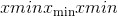和，标度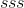和零点计算为：

最小/最大运行时间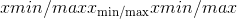计算如下：


其中是观察到的张量。

然后，将比例和零点计算为：

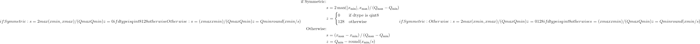

其中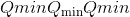和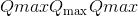是量化数据类型的最小值和最大值。

警告

仅适用于`torch.per_tensor_symmetric`量化方案

Warning

`dtype`只能使用`torch.qint8`或`torch.quint8`。

Note

如果运行最小值等于运行最大值，则将 scale 和 zero_point 设置为 1.0 和 0。

* * *

```
class torch.quantization.MovingAverageMinMaxObserver(averaging_constant=0.01, dtype=torch.quint8, qscheme=torch.per_tensor_affine, reduce_range=False)¶
```

观察器模块，用于根据最小值和最大值的移动平均值来计算量化参数。

该观察者根据传入张量的最小值和最大值的移动平均值来计算量化参数。 该模块记录输入张量的平均最小值和最大值，并使用此统计信息计算量化参数。

Parameters

*   **averaging_constant** -最小/最大的平均常数。

*   **dtype** – Quantized data type

*   **qscheme** – Quantization scheme to be used

*   **reduce_range** – Reduces the range of the quantized data type by 1 bit

最小/最大移动平均值计算如下


其中是运行平均最小值/最大值，是传入张量，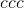是`averaging_constant`。

然后按`MinMaxObserver`中的比例和零点进行计算。

Note

仅适用于`torch.per_tensor_affine`量化模式。

Note

If the running minimum equals to the running maximum, the scale and zero_point are set to 1.0 and 0.

* * *

```
class torch.quantization.PerChannelMinMaxObserver(ch_axis=0, dtype=torch.quint8, qscheme=torch.per_channel_affine, reduce_range=False)¶
```

观察器模块，用于基于每个通道的运行最小值和最大值来计算量化参数。

该观察者使用张量最小/最大统计量来计算每个通道的量化参数。 该模块记录输入张量的运行最小值和最大值，并使用此统计信息计算量化参数。

Parameters

*   **ch_axis** –通道轴

*   **dtype** – Quantized data type

*   **qscheme** – Quantization scheme to be used

*   **reduce_range** – Reduces the range of the quantized data type by 1 bit

量化参数的计算方法与`MinMaxObserver`中的计算方法相同，不同之处在于，每个通道都存储运行的最小/最大值。 因此，每个通道也可以计算比例和零点。

Note

如果运行最小值等于运行最大值，则将 scales 和 zero_points 设置为 1.0 和 0。

* * *

```
class torch.quantization.MovingAveragePerChannelMinMaxObserver(averaging_constant=0.01, ch_axis=0, dtype=torch.quint8, qscheme=torch.per_channel_affine, reduce_range=False)¶
```

Observer module for computing the quantization parameters based on the running per channel min and max values.

This observer uses the tensor min/max statistics to compute the per channel quantization parameters. The module records the running minimum and maximum of incoming tensors, and uses this statistic to compute the quantization parameters.

Parameters

*   **averaging_constant** – Averaging constant for min/max.

*   **ch_axis** – Channel axis

*   **dtype** – Quantized data type

*   **qscheme** – Quantization scheme to be used

*   **reduce_range** – Reduces the range of the quantized data type by 1 bit

量化参数的计算方法与`MovingAverageMinMaxObserver`中的计算方法相同，不同之处在于，每个通道都存储运行的最小/最大值。 因此，每个通道也可以计算比例和零点。

Note

If the running minimum equals to the running maximum, the scales and zero_points are set to 1.0 and 0.

* * *

```
class torch.quantization.HistogramObserver(bins=2048, upsample_rate=128, dtype=torch.quint8, qscheme=torch.per_tensor_affine, reduce_range=False)¶
```

该模块记录张量值以及最小/最大值的运行直方图。 `calculate_qparams`将计算比例和 zero_point。

Parameters

*   **bins** –直方图使用的 bin 数

*   **upsample_rate** –直方图被上采样的因子，用于对观测值变化范围内的直方图进行插值

*   **dtype** – Quantized data type

*   **qscheme** – Quantization scheme to be used

*   **reduce_range** – Reduces the range of the quantized data type by 1 bit

标度和零点计算如下：

1.  ```
    Create the histogram of the incoming inputs.
    ```

    直方图是连续计算的，每个 bin 的范围随观察到的每个新张量而变化。

2.  ```
    Search the distribution in the histogram for optimal min/max values.
    ```

    搜索最小值/最大值可确保相对于浮点模型的量化误差最小。

3.  ```
    Compute the scale and zero point the same way as in the
    ```

    [`MinMaxObserver`](#torch.quantization.MinMaxObserver "torch.quantization.MinMaxObserver")

* * *

```
class torch.quantization.FakeQuantize(observer=<class 'torch.quantization.observer.MovingAverageMinMaxObserver'>, quant_min=0, quant_max=255, **observer_kwargs)¶
```

在训练时间内模拟量化和反量化操作。 该模块的输出由下式给出

x_out =(钳位(round(x / scale + zero_point），quant_min，quant_max）-zero_point）*比例

*   `scale`定义用于量化的比例因子。

*   `zero_point`指定浮点数 0 映射到的量化值

*   `quant_min`指定最小允许量化值。

*   `quant_max`指定最大允许量化值。

*   `fake_quant_enable`控制伪量化在张量上的应用，请注意统计信息仍然可以更新。

*   `observer_enable`控制张量的统计信息收集

*   ```
    dtype specifies the quantized dtype that is being emulated with fake-quantization,
    ```

    允许的值为 torch.qint8 和 torch.quint8。 应该选择 quant_min 和 quant_max 的值与 dtype 一致

Parameters

*   **观察器**(_模块_）–用于观察输入张量的统计信息并计算刻度和零点的模块。

*   **quant_min**  (_python：int_ )–最小允许量化值。

*   **quant_max**  (_python：int_ )–允许的最大量化值。

*   **viewer_kwargs** (_可选_）–观察者模块的参数

```
Variables
```

**〜FakeQuantize.observer**  ([_模块_](nn.html#torch.nn.Module "torch.nn.Module"))–用户提供的模块，用于收集输入张量的统计信息，并提供一种计算标度和零点的方法。

* * *

```
class torch.quantization.NoopObserver(dtype=torch.float16)¶
```

观察者什么也不做，只是将其配置传递给量化模块的`.from_float()`。

主要用于量化为 float16，不需要确定范围。

Parameters

**dtype** – Quantized data type

### 调试工具

* * *

```
torch.quantization.get_observer_dict(mod, target_dict, prefix='')¶
```

遍历模块并将所有观察者保存到 dict 中。 这主要用于量化精度调试：param mod：我们要保存所有观察者的顶层模块：param prefix：当前模块的前缀：param target_dict：用于保存所有观察者的字典

* * *

```
class torch.quantization.RecordingObserver(**kwargs)¶
```

该模块主要用于调试，并在运行时记录张量值。

Parameters

*   **dtype** – Quantized data type

*   **qscheme** – Quantization scheme to be used

*   **reduce_range** – Reduces the range of the quantized data type by 1 bit

## torch

此模块实现组合(融合）模块 conv + relu，然后可以对其进行量化。

### ConvBn2d

* * *

```
class torch.nn.intrinsic.ConvBn2d(conv, bn)¶
```

这是一个顺序容器，称为 Conv 2d 和 Batch Norm 2d 模块。 在量化过程中，它将被相应的融合模块替换。

### ConvBnReLU2d

* * *

```
class torch.nn.intrinsic.ConvBnReLU2d(conv, bn, relu)¶
```

这是一个顺序容器，称为 Conv 2d，Batch Norm 2d 和 ReLU 模块。 在量化过程中，它将被相应的融合模块替换。

### 转化率

* * *

```
class torch.nn.intrinsic.ConvReLU2d(conv, relu)¶
```

这是一个顺序容器，调用 Conv 2d 和 ReLU 模块。 在量化过程中，它将被相应的融合模块替换。

### ConvReLU3d

* * *

```
class torch.nn.intrinsic.ConvReLU3d(conv, relu)¶
```

这是一个顺序容器，调用 Conv 3d 和 ReLU 模块。 在量化过程中，它将被相应的融合模块替换。

### 线性 ReLU

* * *

```
class torch.nn.intrinsic.LinearReLU(linear, relu)¶
```

这是一个顺序容器，调用 Linear 和 ReLU 模块。 在量化过程中，它将被相应的融合模块替换。

## torch.nn.instrinsic.qat

该模块实现了量化意识训练所需的那些融合操作的版本。

### ConvBn2d

* * *

```
class torch.nn.intrinsic.qat.ConvBn2d(in_channels, out_channels, kernel_size, stride=1, padding=0, dilation=1, groups=1, padding_mode='zeros', eps=1e-05, momentum=0.1, freeze_bn=False, qconfig=None)¶
```

ConvBn2d 模块是由 Conv2d 和 BatchNorm2d 融合而成的模块，附加了 FakeQuantize 模块以用于输出激活和权重，用于量化意识训练。

我们结合了 [`torch.nn.Conv2d`](nn.html#torch.nn.Conv2d "torch.nn.Conv2d") 和 [`torch.nn.BatchNorm2d`](nn.html#torch.nn.BatchNorm2d "torch.nn.BatchNorm2d") 的接口。

实施细节： [https://arxiv.org/pdf/1806.08342.pdf](https://arxiv.org/pdf/1806.08342.pdf) 第 3.2.2 节

与 [`torch.nn.Conv2d`](nn.html#torch.nn.Conv2d "torch.nn.Conv2d") 相似，其中 FakeQuantize 模块已初始化为默认值。

```
Variables
```

*   **〜ConvBn2d.freeze_bn** –

*   **〜ConvBn2d.activation_post_process** –用于输出激活的伪量化模块

*   **〜ConvBn2d.weight_fake_quant** –伪造的权重量化模块

* * *

```
classmethod from_float(mod, qconfig=None)¶
```

从 float 模块或 qparams_dict 创建一个 qat 模块

Args： &lt;cite&gt;mod&lt;/cite&gt; 一个浮点模块，由 torch.quantization 实用程序生成或直接从用户获取

### ConvBnReLU2d

* * *

```
class torch.nn.intrinsic.qat.ConvBnReLU2d(in_channels, out_channels, kernel_size, stride=1, padding=0, dilation=1, groups=1, padding_mode='zeros', eps=1e-05, momentum=0.1, freeze_bn=False, qconfig=None)¶
```

ConvBnReLU2d 模块是由 Conv2d，BatchNorm2d 和 ReLU 融合而成的模块，附加了 FakeQuantize 模块以用于输出激活和权重，用于量化意识训练。

我们组合了 [`torch.nn.Conv2d`](nn.html#torch.nn.Conv2d "torch.nn.Conv2d") 和 [`torch.nn.BatchNorm2d`](nn.html#torch.nn.BatchNorm2d "torch.nn.BatchNorm2d") 和 [`torch.nn.ReLU`](nn.html#torch.nn.ReLU "torch.nn.ReLU") 的接口。

实施细节： [https://arxiv.org/pdf/1806.08342.pdf](https://arxiv.org/pdf/1806.08342.pdf)

与 &lt;cite&gt;torch.nn.Conv2d&lt;/cite&gt; 相似，其中 FakeQuantize 模块已初始化为默认值。

```
Variables
```

*   **〜ConvBnReLU2d.observer** –用于激活输出的虚假量化模块，称为观察员，与后期训练流程保持一致

*   **〜ConvBnReLU2d.weight_fake_quant** –伪造的权重量化模块

### ConvReLU2d

* * *

```
class torch.nn.intrinsic.qat.ConvReLU2d(in_channels, out_channels, kernel_size, stride=1, padding=0, dilation=1, groups=1, bias=True, padding_mode='zeros', qconfig=None)¶
```

ConvReLU2d 模块是 Conv2d 和 ReLU 的融合模块，附加了 FakeQuantize 模块，用于输出激活和权重，以进行量化感知训练。

我们结合了 [`Conv2d`](nn.html#torch.nn.Conv2d "torch.nn.Conv2d") 和 [`BatchNorm2d`](nn.html#torch.nn.BatchNorm2d "torch.nn.BatchNorm2d") 的接口。

```
Variables
```

*   **〜ConvReLU2d.activation_post_process** –用于输出激活的伪量化模块

*   **〜ConvReLU2d.weight_fake_quant** –伪造的权重量化模块

### LinearReLU

* * *

```
class torch.nn.intrinsic.qat.LinearReLU(in_features, out_features, bias=True, qconfig=None)¶
```

由 Linear 和 ReLU 模块融合而成的 LinearReLU 模块，与 FakeQuantize 模块相连，用于输出激活和权重，用于量化意识训练。

我们采用与 [`torch.nn.Linear`](nn.html#torch.nn.Linear "torch.nn.Linear") 相同的接口。

与 &lt;cite&gt;torch.nn.intrinsic.LinearReLU&lt;/cite&gt; 相似，其中 FakeQuantize 模块已初始化为默认值。

```
Variables
```

*   **〜LinearReLU.activation_post_process** –用于输出激活的伪量化模块

*   **〜LinearReLU.weight** –伪造的权重量化模块

Examples:

```
>>> m = nn.qat.LinearReLU(20, 30)
>>> input = torch.randn(128, 20)
>>> output = m(input)
>>> print(output.size())
torch.Size([128, 30])

```

## torch nn 本征量化

该模块实现了诸如 conv + relu 之类的融合操作的量化实现。

### ConvReLU2d

* * *

```
class torch.nn.intrinsic.quantized.ConvReLU2d(in_channels, out_channels, kernel_size, stride=1, padding=0, dilation=1, groups=1, bias=True, padding_mode='zeros')¶
```

ConvReLU2d 模块是 Conv2d 和 ReLU 的融合模块

我们采用与 [`torch.nn.quantized.Conv2d`](#torch.nn.quantized.Conv2d "torch.nn.quantized.Conv2d") 相同的接口。

```
Variables
```

**as torch.nn.quantized.Conv2d**  (_Same_ )–

### ConvReLU3d

* * *

```
class torch.nn.intrinsic.quantized.ConvReLU3d(in_channels, out_channels, kernel_size, stride=1, padding=0, dilation=1, groups=1, bias=True, padding_mode='zeros')¶
```

ConvReLU3d 模块是 Conv3d 和 ReLU 的融合模块

我们采用与 [`torch.nn.quantized.Conv3d`](#torch.nn.quantized.Conv3d "torch.nn.quantized.Conv3d") 相同的接口。

属性：与 torch.nn.quantized.Conv3d 相同

### LinearReLU

* * *

```
class torch.nn.intrinsic.quantized.LinearReLU(in_features, out_features, bias=True)¶
```

由 Linear 和 ReLU 模块融合而成的 LinearReLU 模块

我们采用与 [`torch.nn.quantized.Linear`](#torch.nn.quantized.Linear "torch.nn.quantized.Linear") 相同的接口。

```
Variables
```

**为 torch.nn.quantized.Linear** (_相同_）–

Examples:

```
>>> m = nn.intrinsic.LinearReLU(20, 30)
>>> input = torch.randn(128, 20)
>>> output = m(input)
>>> print(output.size())
torch.Size([128, 30])

```

## torch

此模块实现了关键 nn 模块 **Conv2d(）**和 **Linear(）**的版本，这些版本在 FP32 中运行，但四舍五入以模拟 INT8 量化的效果。

### 转换 2d

* * *

```
class torch.nn.qat.Conv2d(in_channels, out_channels, kernel_size, stride=1, padding=0, dilation=1, groups=1, bias=True, padding_mode='zeros', qconfig=None)¶
```

随附有 FakeQuantize 模块的 Conv2d 模块，用于输出激活和权重，用于量化意识训练。

我们采用与 &lt;cite&gt;torch.nn.Conv2d&lt;/cite&gt; 相同的界面，请参阅 [https://pytorch.org/docs/stable/nn.html?highlight=conv2d#torch.nn.Conv2d](https://pytorch.org/docs/stable/nn.html?highlight=conv2d#torch.nn.Conv2d) 获取文档。

Similar to &lt;cite&gt;torch.nn.Conv2d&lt;/cite&gt;, with FakeQuantize modules initialized to default.

```
Variables
```

*   **〜Conv2d.activation_post_process** –用于输出激活的伪量化模块

*   **〜Conv2d.weight_fake_quant** –伪造的权重量化模块

* * *

```
classmethod from_float(mod, qconfig=None)¶
```

Create a qat module from a float module or qparams_dict

Args: &lt;cite&gt;mod&lt;/cite&gt; a float module, either produced by torch.quantization utilities or directly from user

### 线性的

* * *

```
class torch.nn.qat.Linear(in_features, out_features, bias=True, qconfig=None)¶
```

附带有 FakeQuantize 模块的线性模块，用于输出激活和权重，用于量化意识训练。

我们采用与 &lt;cite&gt;torch.nn.Linear&lt;/cite&gt; 相同的接口，请参阅 [https://pytorch.org/docs/stable/nn.html#torch.nn.Linear](https://pytorch.org/docs/stable/nn.html#torch.nn.Linear) 以获取文档。

类似于 &lt;cite&gt;torch.nn.Linear&lt;/cite&gt; ，其中 FakeQuantize 模块已初始化为默认值。

```
Variables
```

*   **〜Linear.activation_post_process** –用于输出激活的伪量化模块

*   **〜Linear.weight** –伪造的权重量化模块

* * *

```
classmethod from_float(mod, qconfig=None)¶
```

Create a qat module from a float module or qparams_dict

Args: &lt;cite&gt;mod&lt;/cite&gt; a float module, either produced by torch.quantization utilities or directly from user

## torch量化

此模块实现 nn 层的量化版本，例如 **Conv2d** 和 **ReLU** 。

### 功能界面

功能界面(已量化）。

* * *

```
torch.nn.quantized.functional.relu(input, inplace=False) → Tensor¶
```

按元素应用整流线性单位函数。 有关更多详细信息，请参见 [`ReLU`](#torch.nn.quantized.ReLU "torch.nn.quantized.ReLU") 。

Parameters

*   **输入** –量化输入

*   **就地** –就地执行计算

* * *

```
torch.nn.quantized.functional.linear(input, weight, bias=None, scale=None, zero_point=None)¶
```

对输入的量化数据进行线性变换：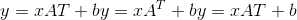。 参见 [`Linear`](#torch.nn.quantized.Linear "torch.nn.quantized.Linear")

Note

当前的实现在每个调用中都包含权重，这会降低性能。 如果要避免开销，请使用 [`Linear`](#torch.nn.quantized.Linear "torch.nn.quantized.Linear") 。

Parameters

*   **输入** ([_tensor_](tensors.html#torch.Tensor "torch.Tensor"))–类型为 &lt;cite&gt;Torch.quint8&lt;/cite&gt; 的量化输入

*   **重量** ([_tensor_](tensors.html#torch.Tensor "torch.Tensor"))–类型 &lt;cite&gt;Torch.qint8&lt;/cite&gt; 的量化重量

*   **偏差** ([_tensor_](tensors.html#torch.Tensor "torch.Tensor"))–类型为 &lt;cite&gt;Torch.float&lt;/cite&gt; 的无或 fp32 偏差。

*   **标度**(_双_）–输出标度。 如果为无，则从输入比例得出

*   **zero_point**  (_python：long_ )–输出零点。 如果为 None，则从输入 zero_point 派生

```
Shape:
```

*   输入：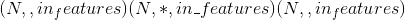其中 &lt;cite&gt;*&lt;/cite&gt; 表示任意数量的附加尺寸

*   重量：

*   偏差：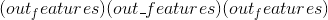

*   输出：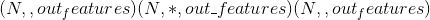

* * *

```
torch.nn.quantized.functional.conv2d(input, weight, bias, stride=1, padding=0, dilation=1, groups=1, padding_mode='zeros', scale=1.0, zero_point=0, dtype=torch.quint8)¶
```

在由多个输入平面组成的量化 2D 输入上应用 2D 卷积。

有关详细信息和输出形状，请参见 [`Conv2d`](#torch.nn.quantized.Conv2d "torch.nn.quantized.Conv2d") 。

Parameters

*   **输入** –形状为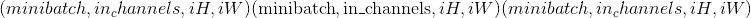的量化输入张量

*   **权重** –形状为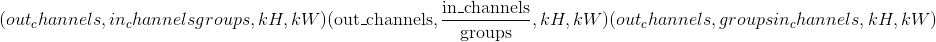的量化滤波器

*   **偏置** – **非量化的**形状为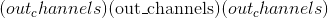的偏置张量。 张量类型必须为 &lt;cite&gt;torch.float&lt;/cite&gt; 。

*   **步幅** –卷积内核的步幅。 可以是单个数字或元组&lt;cite&gt;(sH，sW）&lt;/cite&gt;。 默认值：1

*   **填充** –输入两侧的隐式填充。 可以是单个数字或元组&lt;cite&gt;(padH，padW）&lt;/cite&gt;。 默认值：0

*   **膨胀** –内核元素之间的间距。 可以是单个数字或元组&lt;cite&gt;(dH，dW）&lt;/cite&gt;。 默认值：1

*   **组** –将输入分成组，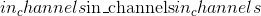应该可被组数整除。 默认值：1

*   **padding_mode** –要使用的填充模式。 目前仅对量化卷积支持“零”。 默认值：“零”

*   **标度** –输出的量化标度。 默认值：1.0

*   **zero_point** -输出的量化 zero_point。 默认值：0

*   **dtype** –要使用的量化数据类型。 默认值：`torch.quint8`

Examples:

```
>>> from torch.nn.quantized import functional as qF
>>> filters = torch.randn(8, 4, 3, 3, dtype=torch.float)
>>> inputs = torch.randn(1, 4, 5, 5, dtype=torch.float)
>>> bias = torch.randn(4, dtype=torch.float)
>>>
>>> scale, zero_point = 1.0, 0
>>> dtype = torch.quint8
>>>
>>> q_filters = torch.quantize_per_tensor(filters, scale, zero_point, dtype)
>>> q_inputs = torch.quantize_per_tensor(inputs, scale, zero_point, dtype)
>>> qF.conv2d(q_inputs, q_filters, bias, scale, zero_point, padding=1)

```

* * *

```
torch.nn.quantized.functional.conv3d(input, weight, bias, stride=1, padding=0, dilation=1, groups=1, padding_mode='zeros', scale=1.0, zero_point=0, dtype=torch.quint8)¶
```

在由多个输入平面组成的量化 3D 输入上应用 3D 卷积。

有关详细信息和输出形状，请参见 [`Conv3d`](#torch.nn.quantized.Conv3d "torch.nn.quantized.Conv3d") 。

Parameters

*   **输入** –形状为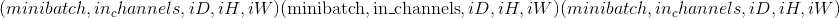的量化输入张量

*   **权重** –形状为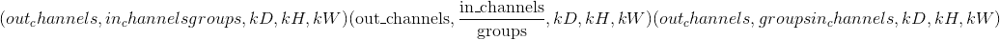的量化滤波器

*   **偏置** – **非量化的**形状为的偏置张量。 张量类型必须为 &lt;cite&gt;torch.float&lt;/cite&gt; 。

*   **步幅** –卷积内核的步幅。 可以是单个数字或元组&lt;cite&gt;(sD，sH，sW）&lt;/cite&gt;。 默认值：1

*   **填充** –输入两侧的隐式填充。 可以是单个数字或元组&lt;cite&gt;(padD，padH，padW）&lt;/cite&gt;。 默认值：0

*   **膨胀** –内核元素之间的间距。 可以是单个数字或元组&lt;cite&gt;(dD，dH，dW）&lt;/cite&gt;。 默认值：1

*   **组** –将输入分成组，应该可被组数整除。 默认值：1

*   **padding_mode** –要使用的填充模式。 目前仅对量化卷积支持“零”。 默认值：“零”

*   **scale** – quantization scale for the output. Default: 1.0

*   **zero_point** – quantization zero_point for the output. Default: 0

*   **dtype** – quantization data type to use. Default: `torch.quint8`

Examples:

```
>>> from torch.nn.quantized import functional as qF
>>> filters = torch.randn(8, 4, 3, 3, 3, dtype=torch.float)
>>> inputs = torch.randn(1, 4, 5, 5, 5, dtype=torch.float)
>>> bias = torch.randn(4, dtype=torch.float)
>>>
>>> scale, zero_point = 1.0, 0
>>> dtype = torch.quint8
>>>
>>> q_filters = torch.quantize_per_tensor(filters, scale, zero_point, dtype)
>>> q_inputs = torch.quantize_per_tensor(inputs, scale, zero_point, dtype)
>>> qF.conv3d(q_inputs, q_filters, bias, scale, zero_point, padding=1)

```

* * *

```
torch.nn.quantized.functional.max_pool2d(input, kernel_size, stride=None, padding=0, dilation=1, ceil_mode=False, return_indices=False)¶
```

在由几个量化输入平面组成的量化输入信号上应用 2D max 合并。

Note

输入量化参数传播到输出。

有关详细信息，请参见`MaxPool2d`。

* * *

```
torch.nn.quantized.functional.adaptive_avg_pool2d(input, output_size)¶
```

在由几个量化输入平面组成的量化输入信号上应用 2D 自适应平均池。

Note

输入量化参数传播到输出。

有关详细信息和输出形状，请参见`AdaptiveAvgPool2d`。

Parameters

**output_size** –目标输出大小(单整数或双整数元组）

* * *

```
torch.nn.quantized.functional.avg_pool2d(input, kernel_size, stride=None, padding=0, ceil_mode=False, count_include_pad=True, divisor_override=None)¶
```

以步长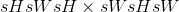步长在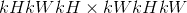区域中应用 2D 平均合并操作。 输出要素的数量等于输入平面的数量。

Note

输入量化参数传播到输出。

有关详细信息和输出形状，请参见`AvgPool2d`。

Parameters

*   **输入** –量化输入张量

*   **kernel_size** –池区域的大小。 可以是单个数字或元组&lt;cite&gt;(kH，kW）&lt;/cite&gt;

*   **跨度** –合并操作的跨度。 可以是单个数字或元组&lt;cite&gt;(sH，sW）&lt;/cite&gt;。 默认值：`kernel_size`

*   **填充** –输入两侧的隐式零填充。 可以是单个数字或元组&lt;cite&gt;(padH，padW）&lt;/cite&gt;。 默认值：0

*   **ceil_mode** –为 True 时，将在公式中使用 &lt;cite&gt;ceil&lt;/cite&gt; 而不是 &lt;cite&gt;floor&lt;/cite&gt; 计算输出形状。 默认值：`False`

*   **count_include_pad** –为 True 时，将在平均计算中包括零填充。 默认值：`True`

*   **divisor_override** –如果指定，它将用作除数，否则将使用池化区域的大小。 默认值：无

* * *

```
torch.nn.quantized.functional.interpolate(input, size=None, scale_factor=None, mode='nearest', align_corners=None)¶
```

向下/向上采样输入给定`size`或给定`scale_factor`的输入

有关实现的详细信息，请参见 [`torch.nn.functional.interpolate()`](nn.functional.html#torch.nn.functional.interpolate "torch.nn.functional.interpolate") 。

输入尺寸以以下形式解释：&lt;cite&gt;微型批处理 x 通道 x [可选深度] x [可选高度] x 宽度&lt;/cite&gt;。

Note

The input quantization parameters propagate to the output.

Note

量化输入仅支持 2D 输入

Note

量化输入仅支持以下模式：

*   &lt;cite&gt;双线性&lt;/cite&gt;

*   &lt;cite&gt;最近的&lt;/cite&gt;

Parameters

*   **输入** ([_tensor_](tensors.html#torch.Tensor "torch.Tensor"))–输入张量

*   **大小** (_python：int_ _或_ _元组_ _[_ _python：int_ _]或_ _元组_ _[_ _python：int_ _，_ _python：int_ _]或_ _元组_ _[_ _python：int_ _，_ _python：int_ _，_ _python：int_ _]_ )–输出空间大小。

*   **scale_factor**  (_python：float_ _或_ _元组_ _[_ _python：float_ _]_ )–空间大小的乘数。 如果是元组，则必须匹配输入大小。

*   **模式** (_str_ )–用于上采样的算法：`'nearest'` | `'bilinear'`

*   **align_corners** (_布尔_ _，_ _可选_）–在几何上，我们将输入和输出的像素视为正方形而不是点。 如果设置为`True`，则输入和输出张量将按其角点像素的中心对齐，并保留角点像素处的值。 如果设置为`False`，则输入和输出张量按其角点像素的角点对齐，并且插值对边界值使用边缘值填充，从而使此操作_独立于输入_ `scale_factor`保持相同时的尺寸。 仅当`mode`为`'bilinear'`时才有效。 默认值：`False`

* * *

```
torch.nn.quantized.functional.upsample(input, size=None, scale_factor=None, mode='nearest', align_corners=None)¶
```

将输入上采样到给定的`size`或给定的`scale_factor`

Warning

不推荐使用此功能，而推荐使用 [`torch.nn.quantized.functional.interpolate()`](#torch.nn.quantized.functional.interpolate "torch.nn.quantized.functional.interpolate") 。 与`nn.quantized.functional.interpolate(...)`等效。

See [`torch.nn.functional.interpolate()`](nn.functional.html#torch.nn.functional.interpolate "torch.nn.functional.interpolate") for implementation details.

The input dimensions are interpreted in the form: &lt;cite&gt;mini-batch x channels x [optional depth] x [optional height] x width&lt;/cite&gt;.

Note

The input quantization parameters propagate to the output.

Note

Only 2D input is supported for quantized inputs

Note

Only the following modes are supported for the quantized inputs:

*   &lt;cite&gt;bilinear&lt;/cite&gt;

*   &lt;cite&gt;nearest&lt;/cite&gt;

Parameters

*   **输入** ([_tensor_](tensors.html#torch.Tensor "torch.Tensor"))–量化输入张量

*   **size** (_python:int_ _or_ _Tuple__[__python:int__] or_ _Tuple__[__python:int__,_ _python:int__] or_ _Tuple__[__python:int__,_ _python:int__,_ _python:int__]_) – output spatial size.

*   **scale_factor**  (_python：float_ _或_ _元组_ _[_ _python：float_ _]_ )–空间大小的乘数。 必须是整数。

*   **模式**(_字符串_）–用于上采样的算法：`'nearest'` | `'bilinear'`

*   **align_corners** (_bool__,_ _optional_) – Geometrically, we consider the pixels of the input and output as squares rather than points. If set to `True`, the input and output tensors are aligned by the center points of their corner pixels, preserving the values at the corner pixels. If set to `False`, the input and output tensors are aligned by the corner points of their corner pixels, and the interpolation uses edge value padding for out-of-boundary values, making this operation _independent_ of input size when `scale_factor` is kept the same. This only has an effect when `mode` is `'bilinear'`. Default: `False`

Warning

使用`align_corners = True`时，线性插值模式(&lt;cite&gt;双线性&lt;/cite&gt;）不会按比例对齐输出像素和输入像素，因此输出值可能取决于输入大小。 这是这些模式(0.3.1 版之前）的默认行为。 从那时起，默认行为是`align_corners = False`。 有关如何影响输出的具体示例，请参见 [`Upsample`](nn.html#torch.nn.Upsample "torch.nn.Upsample") 。

* * *

```
torch.nn.quantized.functional.upsample_bilinear(input, size=None, scale_factor=None)¶
```

使用双线性上采样对输入进行上采样。

Warning

不推荐使用此功能，而推荐使用 [`torch.nn.quantized.functional.interpolate()`](#torch.nn.quantized.functional.interpolate "torch.nn.quantized.functional.interpolate") 。 与`nn.quantized.functional.interpolate(..., mode='bilinear', align_corners=True)`等效。

Note

The input quantization parameters propagate to the output.

Note

仅支持 2D 输入

Parameters

*   **输入** ([_tensor_](tensors.html#torch.Tensor "torch.Tensor"))–量化输入

*   **大小** (_python：int_ _或_ _元组_ _[_ _python：int_ _，_ _python：int_ _]_ )–输出空间大小。

*   **scale_factor**  (_python：int_ _或_ _元组_ _[_ _python：int_ _，_ _python：int_ _]_ )–空间大小的乘数

* * *

```
torch.nn.quantized.functional.upsample_nearest(input, size=None, scale_factor=None)¶
```

使用最近邻的像素值对输入进行上采样。

Warning

不推荐使用此功能，而推荐使用 [`torch.nn.quantized.functional.interpolate()`](#torch.nn.quantized.functional.interpolate "torch.nn.quantized.functional.interpolate") 。 与`nn.quantized.functional.interpolate(..., mode='nearest')`等效。

Note

The input quantization parameters propagate to the output.

Note

Only 2D inputs are supported

Parameters

*   **input** ([_Tensor_](tensors.html#torch.Tensor "torch.Tensor")) – quantized input

*   **大小** (_python：int_ _或_ _元组_ _[_ _python：int_ _，_ _python：int_ _]或_ _元组_ _[_ _python：int_ _，_ _python：int_ _，_ _python：int_ _]_ )–输出空间大小。

*   **scale_factor**  (_python：int_ )–空间大小的乘数。 必须是整数。

### ReLU

* * *

```
class torch.nn.quantized.ReLU(inplace=False)¶
```

按元素应用量化整流线性单位函数：

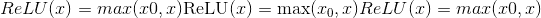，其中是零点。

有关 ReLU 的更多文档，请参见 [https://pytorch.org/docs/stable/nn.html#torch.nn.ReLU](https://pytorch.org/docs/stable/nn.html#torch.nn.ReLU) 。

Parameters

**就地** –(当前不支持）可以选择就地进行操作。

```
Shape:
```

*   输入：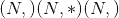其中 &lt;cite&gt;*&lt;/cite&gt; 表示任意数量的附加尺寸

*   输出：，形状与输入相同

Examples:

```
>>> m = nn.quantized.ReLU()
>>> input = torch.randn(2)
>>> input = torch.quantize_per_tensor(input, 1.0, 0, dtype=torch.qint32)
>>> output = m(input)

```

### ReLU6

* * *

```
class torch.nn.quantized.ReLU6(inplace=False)¶
```

应用逐元素函数：

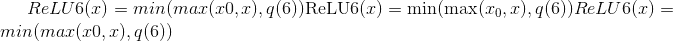，其中是 zero_point，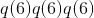是数字 6 的量化表示。

Parameters

**就地** –可以选择就地进行操作。 默认值：`False`

```
Shape:
```

*   Input:  where &lt;cite&gt;*&lt;/cite&gt; means, any number of additional dimensions

*   Output: , same shape as the input

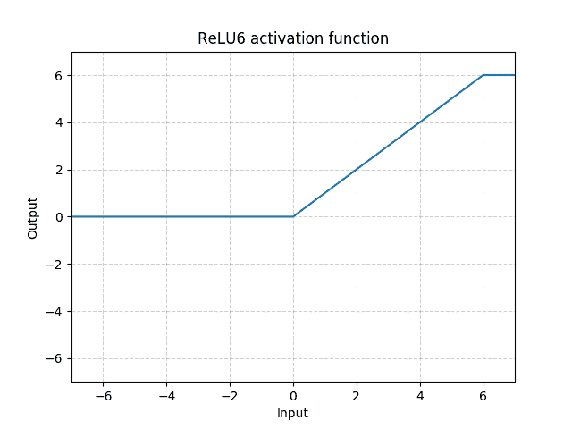

Examples:

```
>>> m = nn.quantized.ReLU6()
>>> input = torch.randn(2)
>>> input = torch.quantize_per_tensor(input, 1.0, 0, dtype=torch.qint32)
>>> output = m(input)

```

### Conv2d

* * *

```
class torch.nn.quantized.Conv2d(in_channels, out_channels, kernel_size, stride=1, padding=0, dilation=1, groups=1, bias=True, padding_mode='zeros')¶
```

在由多个量化输入平面组成的量化输入信号上应用 2D 卷积。

有关输入参数，参数和实现的详细信息，请参见 [`Conv2d`](nn.html#torch.nn.Conv2d "torch.nn.Conv2d") 。

Note

`padding_mode`参数仅支持&lt;cite&gt;零&lt;/cite&gt;。

Note

输入数据类型仅支持 &lt;cite&gt;torch.quint8&lt;/cite&gt; 。

```
Variables
```

*   **〜Conv2d.weight**  ([_tensor_](tensors.html#torch.Tensor "torch.Tensor"))–从可学习的权重参数得出的压缩张量。

*   **〜Conv2d.scale**  ([_tensor_](tensors.html#torch.Tensor "torch.Tensor"))–输出比例的标量

*   **〜Conv2d.zero_point**  ([_tensor_](tensors.html#torch.Tensor "torch.Tensor"))–输出零点的标量

有关其他属性，请参见 [`Conv2d`](nn.html#torch.nn.Conv2d "torch.nn.Conv2d") 。

Examples:

```
>>> # With square kernels and equal stride
>>> m = nn.quantized.Conv2d(16, 33, 3, stride=2)
>>> # non-square kernels and unequal stride and with padding
>>> m = nn.quantized.Conv2d(16, 33, (3, 5), stride=(2, 1), padding=(4, 2))
>>> # non-square kernels and unequal stride and with padding and dilation
>>> m = nn.quantized.Conv2d(16, 33, (3, 5), stride=(2, 1), padding=(4, 2), dilation=(3, 1))
>>> input = torch.randn(20, 16, 50, 100)
>>> # quantize input to qint8
>>> q_input = torch.quantize_per_tensor(input, scale=1.0, zero_point=0, dtype=torch.qint32)
>>> output = m(input)

```

* * *

```
classmethod from_float(mod)¶
```

从 float 模块或 qparams_dict 创建量化模块。

Parameters

**mod**  ([_模块_](nn.html#torch.nn.Module "torch.nn.Module"))–浮点模块，由 Torch.quantization 实用程序生产或由用户提供

### 转换 3d

* * *

```
class torch.nn.quantized.Conv3d(in_channels, out_channels, kernel_size, stride=1, padding=0, dilation=1, groups=1, bias=True, padding_mode='zeros')¶
```

在由几个量化输入平面组成的量化输入信号上应用 3D 卷积。

有关输入参数，参数和实现的详细信息，请参见 [`Conv3d`](nn.html#torch.nn.Conv3d "torch.nn.Conv3d") 。

Note

Only &lt;cite&gt;zeros&lt;/cite&gt; is supported for the `padding_mode` argument.

Note

Only &lt;cite&gt;torch.quint8&lt;/cite&gt; is supported for the input data type.

```
Variables
```

*   **〜Conv3d.weight**  ([_tensor_](tensors.html#torch.Tensor "torch.Tensor"))–从可学习的重量参数得出的压缩张量。

*   **〜Conv3d.scale**  ([_tensor_](tensors.html#torch.Tensor "torch.Tensor"))–输出比例的标量

*   **〜Conv3d.zero_point**  ([_tensor_](tensors.html#torch.Tensor "torch.Tensor"))–输出零点的标量

有关其他属性，请参见 [`Conv3d`](nn.html#torch.nn.Conv3d "torch.nn.Conv3d") 。

Examples:

```
>>> # With square kernels and equal stride
>>> m = nn.quantized.Conv3d(16, 33, 3, stride=2)
>>> # non-square kernels and unequal stride and with padding
>>> m = nn.quantized.Conv3d(16, 33, (3, 5, 5), stride=(1, 2, 2), padding=(1, 2, 2))
>>> # non-square kernels and unequal stride and with padding and dilation
>>> m = nn.quantized.Conv3d(16, 33, (3, 5, 5), stride=(1, 2, 2), padding=(1, 2, 2), dilation=(1, 2, 2))
>>> input = torch.randn(20, 16, 56, 56, 56)
>>> # quantize input to qint8
>>> q_input = torch.quantize_per_tensor(input, scale=1.0, zero_point=0, dtype=torch.qint32)
>>> output = m(input)

```

* * *

```
classmethod from_float(mod)¶
```

Creates a quantized module from a float module or qparams_dict.

Parameters

**mod** ([_Module_](nn.html#torch.nn.Module "torch.nn.Module")) – a float module, either produced by torch.quantization utilities or provided by the user

### 浮动功能

* * *

```
class torch.nn.quantized.FloatFunctional¶
```

浮点运算符的状态收集器类。

在某些操作中，可以使用此类的实例代替`torch.`前缀。 请参阅下面的示例用法。

Note

此类不提供`forward`挂钩。 相反，您必须使用基础功能之一(例如`add`）。

Examples:

```
>>> f_add = FloatFunctional()
>>> a = torch.tensor(3.0)
>>> b = torch.tensor(4.0)
>>> f_add.add(a, b)  # Equivalent to ``torch.add(3, 4)

```

```
Valid operation names:
```

*   加

*   猫

*   多

*   add_relu

*   add_scalar

*   mul_scalar

### Q 功能

* * *

```
class torch.nn.quantized.QFunctional¶
```

量化运算符的包装器类。

可以使用此类的实例代替`torch.ops.quantized`前缀。 请参阅下面的示例用法。

Note

This class does not provide a `forward` hook. Instead, you must use one of the underlying functions (e.g. `add`).

Examples:

```
>>> q_add = QFunctional('add')
>>> a = torch.quantize_per_tensor(torch.tensor(3.0), 1.0, 0, torch.qint32)
>>> b = torch.quantize_per_tensor(torch.tensor(4.0), 1.0, 0, torch.qint32)
>>> q_add.add(a, b)  # Equivalent to ``torch.ops.quantized.add(3, 4)

```

```
Valid operation names:
```

*   add

*   cat

*   mul

*   add_relu

*   add_scalar

*   mul_scalar

### 量化

* * *

```
class torch.nn.quantized.Quantize(scale, zero_point, dtype)¶
```

量化传入张量

Parameters

*   **标度** –输出量化张量的标度

*   **zero_point** –输出量化张量的 zero_point

*   **dtype** –输出量化张量的数据类型

```
Variables
```

**zero_point，dtype** (_`scale`_ _和_）–

```
Examples::
```

```
>>> t = torch.tensor([[1., -1.], [1., -1.]])
>>> scale, zero_point, dtype = 1.0, 2, torch.qint8
>>> qm = Quantize(scale, zero_point, dtype)
>>> qt = qm(t)
>>> print(qt)
tensor([[ 1., -1.],
        [ 1., -1.]], size=(2, 2), dtype=torch.qint8, scale=1.0, zero_point=2)

```

### 解量化

* * *

```
class torch.nn.quantized.DeQuantize¶
```

使进入的张量均衡化

```
Examples::
```

```
>>> input = torch.tensor([[1., -1.], [1., -1.]])
>>> scale, zero_point, dtype = 1.0, 2, torch.qint8
>>> qm = Quantize(scale, zero_point, dtype)
>>> quantized_input = qm(input)
>>> dqm = DeQuantize()
>>> dequantized = dqm(quantized_input)
>>> print(dequantized)
tensor([[ 1., -1.],
        [ 1., -1.]], dtype=torch.float32)

```

### Linear

* * *

```
class torch.nn.quantized.Linear(in_features, out_features, bias_=True)¶
```

具有量化张量作为输入和输出的量化线性模块。 我们采用与 &lt;cite&gt;torch.nn.Linear&lt;/cite&gt; 相同的接口，请参阅 [https://pytorch.org/docs/stable/nn.html#torch.nn.Linear](https://pytorch.org/docs/stable/nn.html#torch.nn.Linear) 以获取文档。

与 [`Linear`](nn.html#torch.nn.Linear "torch.nn.Linear") 类似，属性将在模块创建时随机初始化，稍后将被覆盖

```
Variables
```

*   **〜线性权重** ([_tensor_](tensors.html#torch.Tensor "torch.Tensor"))–形状为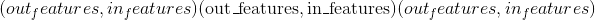的模块的不可学习的量化权重。

*   **〜线性偏差** ([_tensor_](tensors.html#torch.Tensor "torch.Tensor"))–形状为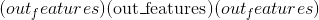的模块的不可学习的偏差。 如果`bias`为`True`，则值将初始化为零。

*   **〜线性比例** – &lt;cite&gt;比例&lt;/cite&gt;输出量化张量的参数，类型：double

*   **〜Linear.zero_point** – &lt;cite&gt;zero_point&lt;/cite&gt; 输出量化张量的参数，类型：long

Examples:

```
>>> m = nn.quantized.Linear(20, 30)
>>> input = torch.randn(128, 20)
>>> input = torch.quantize_per_tensor(input, 1.0, 0, torch.quint8)
>>> output = m(input)
>>> print(output.size())
torch.Size([128, 30])

```

* * *

```
classmethod from_float(mod)¶
```

从 float 模块或 qparams_dict 创建量化模块

Parameters

**mod** ([_Module_](nn.html#torch.nn.Module "torch.nn.Module")) – a float module, either produced by torch.quantization utilities or provided by the user

## torch量化的动态

### Linear

* * *

```
class torch.nn.quantized.dynamic.Linear(in_features, out_features, bias_=True)¶
```

具有量化张量作为输入和输出的动态量化线性模块。 我们采用与 &lt;cite&gt;torch.nn.Linear&lt;/cite&gt; 相同的接口，请参阅 [https://pytorch.org/docs/stable/nn.html#torch.nn.Linear](https://pytorch.org/docs/stable/nn.html#torch.nn.Linear) 以获取文档。

与 [`torch.nn.Linear`](nn.html#torch.nn.Linear "torch.nn.Linear") 类似，属性将在模块创建时随机初始化，稍后将被覆盖

```
Variables
```

*   **〜线性权重** ([_tensor_](tensors.html#torch.Tensor "torch.Tensor"))–形状为的模块的不可学习的量化权重。

*   **~Linear.bias** ([_Tensor_](tensors.html#torch.Tensor "torch.Tensor")) – the non-learnable bias of the module of shape . If `bias` is `True`, the values are initialized to zero.

Examples:

```
>>> m = nn.quantized.dynamic.Linear(20, 30)
>>> input = torch.randn(128, 20)
>>> output = m(input)
>>> print(output.size())
torch.Size([128, 30])

```

* * *

```
classmethod from_float(mod)¶
```

从 float 模块或 qparams_dict 创建动态量化模块

Parameters

**mod** ([_Module_](nn.html#torch.nn.Module "torch.nn.Module")) – a float module, either produced by torch.quantization utilities or provided by the user

### LSTM

* * *

```
class torch.nn.quantized.dynamic.LSTM(*args, **kwargs)¶
```