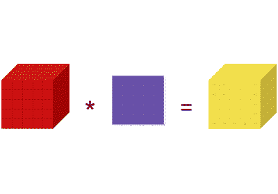
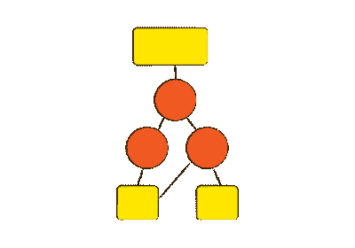
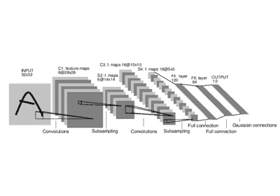
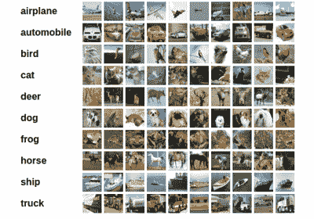

# PyTorch 深度学习：60 分钟的突击

> 原文：<https://pytorch.org/tutorials/beginner/deep_learning_60min_blitz.html>

**作者**： [Soumith Chintala](http://soumith.ch)

<https://www.youtube.com/embed/u7x8RXwLKcA>

## 什么是 PyTorch？

PyTorch 是基于 Python 的科学计算包，可实现两个广泛的目的：

*   替代 NumPy，以使用 GPU 和其他加速器的功能。
*   一个自动微分库，对实现神经网络很有用。

## 本教程的目标：

*   全面了解 PyTorch 的张量库和神经网络。
*   训练一个小型神经网络对图像进行分类

注意

确保已安装[`torch`](https://github.com/pytorch/pytorch)和[`torchvision`](https://github.com/pytorch/vision)包。

[张量](blitz/tensor_tutorial.html#sphx-glr-beginner-blitz-tensor-tutorial-py)

[`torch.autograd`的简要介绍](blitz/autograd_tutorial.html#sphx-glr-beginner-blitz-autograd-tutorial-py)

[神经网络](blitz/neural_networks_tutorial.html#sphx-glr-beginner-blitz-neural-networks-tutorial-py)

[训练分类器](blitz/cifar10_tutorial.html#sphx-glr-beginner-blitz-cifar10-tutorial-py)