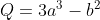
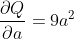
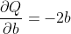
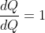
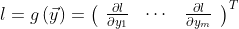
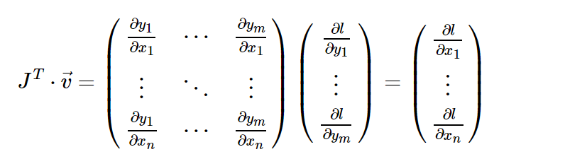
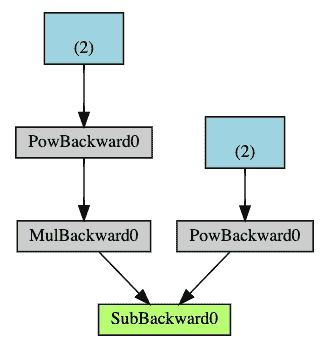

# `torch.autograd`的简要介绍

> 原文：<https://pytorch.org/tutorials/beginner/blitz/autograd_tutorial.html#sphx-glr-beginner-blitz-autograd-tutorial-py>

`torch.autograd`是 PyTorch 的自动差分引擎，可为神经网络训练提供支持。 在本节中，您将获得有关 Autograd 如何帮助神经网络训练的概念性理解。

## 背景

神经网络（NN）是在某些输入数据上执行的嵌套函数的集合。 这些函数由*参数*（由权重和偏差组成）定义，这些参数在 PyTorch 中存储在张量中。

训练 NN 分为两个步骤：

**正向传播**：在正向传播中，NN 对正确的输出进行最佳猜测。 它通过其每个函数运行输入数据以进行猜测。

**反向传播**：在反向传播中，NN 根据其猜测中的误差调整其参数。 它通过从输出向后遍历，收集有关函数参数（*梯度*）的误差导数并使用梯度下降来优化参数来实现。 有关反向传播的更详细的演练，请查看 3Blue1Brown 的[视频](https://www.youtube.com/watch?v=tIeHLnjs5U8)。

## 在 PyTorch 中的用法

让我们来看一个训练步骤。 对于此示例，我们从`torchvision`加载了经过预训练的 resnet18 模型。 我们创建一个随机数据张量来表示具有 3 个通道的单个图像，高度&宽度为 64，其对应的`label`初始化为一些随机值。

```py
import torch, torchvision
model = torchvision.models.resnet18(pretrained=True)
data = torch.rand(1, 3, 64, 64)
labels = torch.rand(1, 1000)

```

接下来，我们通过模型的每一层运行输入数据以进行预测。 这是**正向传播**。

```py
prediction = model(data) # forward pass

```

我们使用模型的预测和相应的标签来计算误差（`loss`）。 下一步是通过网络反向传播此误差。 当我们在误差张量上调用`.backward()`时，开始反向传播。 然后，Autograd 会为每个模型参数计算梯度并将其存储在参数的`.grad`属性中。

```py
loss = (prediction - labels).sum()
loss.backward() # backward pass

```

接下来，我们加载一个优化器，在本例中为 SGD，学习率为 0.01，动量为 0.9。 我们在优化器中注册模型的所有参数。

```py
optim = torch.optim.SGD(model.parameters(), lr=1e-2, momentum=0.9)

```

最后，我们调用`.step()`启动梯度下降。 优化器通过`.grad`中存储的梯度来调整每个参数。

```py
optim.step() #gradient descent

```

至此，您已经具备了训练神经网络所需的一切。 以下各节详细介绍了 Autograd 的工作原理-随时跳过它们。

* * *

## Autograd 的微分

让我们来看看`autograd`如何收集梯度。 我们用`requires_grad=True`创建两个张量`a`和`b`。 这向`autograd`发出信号，应跟踪对它们的所有操作。

```py
import torch

a = torch.tensor([2., 3.], requires_grad=True)
b = torch.tensor([6., 4.], requires_grad=True)

```

我们从`a`和`b`创建另一个张量`Q`。



```py
Q = 3*a**3 - b**2

```

假设`a`和`b`是神经网络的参数，`Q`是误差。 在 NN 训练中，我们想要相对于参数的误差，即





当我们在`Q`上调用`.backward()`时，Autograd 将计算这些梯度并将其存储在各个张量的`.grad`属性中。

我们需要在`Q.backward()`中显式传递`gradient`参数，因为它是向量。 `gradient`是与`Q`形状相同的张量，它表示`Q`相对于本身的梯度，即



同样，我们也可以将`Q`聚合为一个标量，然后隐式地向后调用，例如`Q.sum().backward()`。

```py
external_grad = torch.tensor([1., 1.])
Q.backward(gradient=external_grad)

```

梯度现在沉积在`a.grad`和`b.grad`中

```py
# check if collected gradients are correct
print(9`a`2 == a.grad)
print(-2*b == b.grad)

```

出：

```py
tensor([True, True])
tensor([True, True])

```

### 可选阅读-使用`autograd`的向量微积分

从数学上讲，如果您具有向量值函数`y = f(x)`，则`y`相对于`x`的雅可比矩阵`J`：


一般来说，`torch.autograd`是用于计算向量雅可比积的引擎。 也就是说，给定任何向量`v`，计算乘积`J^T · v`

如果`v`恰好是标量函数的梯度



然后根据链式规则，向量-雅可比积将是`l`相对于`x`的梯度：



上面的示例中使用的是 vector-Jacobian 乘积的这一特征。 `external_grad`表示`v`。

## 计算图

从概念上讲，Autograd 在由[函数](https://pytorch.org/docs/stable/autograd.html#torch.autograd.Function)对象组成的有向无环图（DAG）中记录数据（张量）和所有已执行的操作（以及由此产生的新张量）。 在此 DAG 中，叶子是输入张量，根是输出张量。 通过从根到叶跟踪此图，可以使用链式规则自动计算梯度。

在正向传播中，Autograd 同时执行两项操作：

*   运行请求的操作以计算结果张量，并且
*   在 DAG 中维护操作的*梯度函数*。

当在 DAG 根目录上调用`.backward()`时，后退通道开始。 `autograd`然后：

*   从每个`.grad_fn`计算梯度，
*   将它们累积在各自的张量的`.grad`属性中，然后
*   使用链式规则，一直传播到叶子张量。

下面是我们示例中 DAG 的直观表示。 在图中，箭头指向前进的方向。 节点代表正向传播中每个操作的反向函数。 蓝色的叶节点代表我们的叶张量`a`和`b`。



注意

**DAG 在 PyTorch 中是动态的**。要注意的重要一点是，图是从头开始重新创建的； 在每个`.backward()`调用之后，Autograd 开始填充新图。 这正是允许您在模型中使用控制流语句的原因。 您可以根据需要在每次迭代中更改形状，大小和操作。

### 从 DAG 中排除

`torch.autograd`跟踪所有将其`requires_grad`标志设置为`True`的张量的操作。 对于不需要梯度的张量，将此属性设置为`False`会将其从梯度计算 DAG 中排除。

即使只有一个输入张量具有`requires_grad=True`，操作的输出张量也将需要梯度。

```py
x = torch.rand(5, 5)
y = torch.rand(5, 5)
z = torch.rand((5, 5), requires_grad=True)

a = x + y
print(f"Does `a` require gradients? : {a.requires_grad}")
b = x + z
print(f"Does `b` require gradients?: {b.requires_grad}")

```

出：

```py
Does `a` require gradients? : False
Does `b` require gradients?: True

```

在 NN 中，不计算梯度的参数通常称为**冻结参数**。 如果事先知道您不需要这些参数的梯度，则“冻结”模型的一部分很有用（通过减少自动梯度计算，这会带来一些表现优势）。

从 DAG 中排除很重要的另一个常见用例是[调整预训练网络](https://pytorch.org/tutorials/beginner/finetuning_torchvision_models_tutorial.html)

在微调中，我们冻结了大部分模型，通常仅修改分类器层以对新标签进行预测。 让我们来看一个小例子来说明这一点。 和以前一样，我们加载一个预训练的 resnet18 模型，并冻结所有参数。

```py
from torch import nn, optim

model = torchvision.models.resnet18(pretrained=True)

# Freeze all the parameters in the network
for param in model.parameters():
    param.requires_grad = False

```

假设我们要在具有 10 个标签的新数据集中微调模型。 在 resnet 中，分类器是最后一个线性层`model.fc`。 我们可以简单地将其替换为充当我们的分类器的新线性层（默认情况下未冻结）。

```py
model.fc = nn.Linear(512, 10)

```

现在，除了`model.fc`的参数外，模型中的所有参数都将冻结。 计算梯度的唯一参数是`model.fc`的权重和偏差。

```py
# Optimize only the classifier
optimizer = optim.SGD(model.fc.parameters(), lr=1e-2, momentum=0.9)

```

请注意，尽管我们在优化器中注册了所有参数，但唯一可计算梯度的参数（因此会在梯度下降中进行更新）是分类器的权重和偏差。

[`torch.no_grad()`](https://pytorch.org/docs/stable/generated/torch.no_grad.html)中的上下文管理器可以使用相同的排除功能。

* * *

## 进一步阅读：

*   [原地操作&多线程 Autograd](https://pytorch.org/docs/stable/notes/autograd.html)
*   [反向模式自动微分](https://colab.research.google.com/drive/1VpeE6UvEPRz9HmsHh1KS0XxXjYu533EC) 的示例实现

**脚本的总运行时间**：（0 分钟 5.184 秒）

[下载 Python 源码：`autograd_tutorial.py`](https://pytorch.org/tutorials/_downloads/00a1ac60985c7481f4250bafeae15ffa/autograd_tutorial.py)

[下载 Jupyter 笔记本：`autograd_tutorial.ipynb`](https://pytorch.org/tutorials/_downloads/009cea8b0f40dfcb55e3280f73b06cc2/autograd_tutorial.ipynb)

[由 Sphinx 画廊](https://sphinx-gallery.readthedocs.io)生成的画廊
