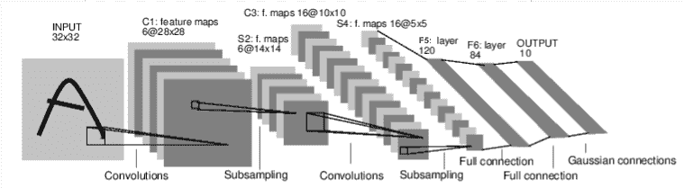

# 神经网络

> 原文：<https://pytorch.org/tutorials/beginner/blitz/neural_networks_tutorial.html#sphx-glr-beginner-blitz-neural-networks-tutorial-py>

可以使用`torch.nn`包构建神经网络。

现在您已经了解了`autograd`，`nn`依赖于`autograd`来定义模型并对其进行微分。 `nn.Module`包含层，以及返回`output`的方法`forward(input)`。

例如，查看以下对数字图像进行分类的网络：



卷积网

这是一个简单的前馈网络。 它获取输入，将其一层又一层地馈入，然后最终给出输出。

神经网络的典型训练过程如下：

*   定义具有一些可学习参数（或权重）的神经网络
*   遍历输入数据集
*   通过网络处理输入
*   计算损失（输出正确的距离有多远）
*   将梯度传播回网络参数
*   通常使用简单的更新规则来更新网络的权重：`weight = weight - learning_rate * gradient`

## 定义网络

让我们定义这个网络：

```py
import torch
import torch.nn as nn
import torch.nn.functional as F

class Net(nn.Module):

    def __init__(self):
        super(Net, self).__init__()
        # 1 input image channel, 6 output channels, 3x3 square convolution
        # kernel
        self.conv1 = nn.Conv2d(1, 6, 3)
        self.conv2 = nn.Conv2d(6, 16, 3)
        # an affine operation: y = Wx + b
        self.fc1 = nn.Linear(16 * 6 * 6, 120)  # 6*6 from image dimension
        self.fc2 = nn.Linear(120, 84)
        self.fc3 = nn.Linear(84, 10)

    def forward(self, x):
        # Max pooling over a (2, 2) window
        x = F.max_pool2d(F.relu(self.conv1(x)), (2, 2))
        # If the size is a square you can only specify a single number
        x = F.max_pool2d(F.relu(self.conv2(x)), 2)
        x = x.view(-1, self.num_flat_features(x))
        x = F.relu(self.fc1(x))
        x = F.relu(self.fc2(x))
        x = self.fc3(x)
        return x

    def num_flat_features(self, x):
        size = x.size()[1:]  # all dimensions except the batch dimension
        num_features = 1
        for s in size:
            num_features *= s
        return num_features

net = Net()
print(net)

```

出：

```py
Net(
  (conv1): Conv2d(1, 6, kernel_size=(3, 3), stride=(1, 1))
  (conv2): Conv2d(6, 16, kernel_size=(3, 3), stride=(1, 1))
  (fc1): Linear(in_features=576, out_features=120, bias=True)
  (fc2): Linear(in_features=120, out_features=84, bias=True)
  (fc3): Linear(in_features=84, out_features=10, bias=True)
)

```

您只需要定义`forward`函数，就可以使用`autograd`为您自动定义`backward`函数（计算梯度）。 您可以在`forward`函数中使用任何张量操作。

模型的可学习参数由`net.parameters()`返回

```py
params = list(net.parameters())
print(len(params))
print(params[0].size())  # conv1's .weight

```

出：

```py
10
torch.Size([6, 1, 3, 3])

```

让我们尝试一个`32x32`随机输入。 注意：该网络的预期输入大小（LeNet）为`32x32`。 要在 MNIST 数据集上使用此网络，请将图像从数据集中调整为`32x32`。

```py
input = torch.randn(1, 1, 32, 32)
out = net(input)
print(out)

```

出：

```py
tensor([[ 0.1002, -0.0694, -0.0436,  0.0103,  0.0488, -0.0429, -0.0941, -0.0146,
         -0.0031, -0.0923]], grad_fn=<AddmmBackward>)

```

使用随机梯度将所有参数和反向传播的梯度缓冲区归零：

```py
net.zero_grad()
out.backward(torch.randn(1, 10))

```

注意

`torch.nn`仅支持小批量。 整个`torch.nn`包仅支持作为微型样本而不是单个样本的输入。

例如，`nn.Conv2d`将采用`nSamples x nChannels x Height x Width`的 4D 张量。

如果您只有一个样本，只需使用`input.unsqueeze(0)`添加一个假批量尺寸。

在继续之前，让我们回顾一下到目前为止所看到的所有类。

**回顾**：

*   `torch.Tensor`-一个*多维数组*，支持诸如`backward()`的自动微分操作。 同样，保持相对于张量的梯度。
*   `nn.Module`-神经网络模块。 *封装参数*的便捷方法，并带有将其移动到 GPU，导出，加载等的帮助器。
*   `nn.Parameter`-一种张量，即将其分配为`Module`的属性时，自动注册为参数。
*   `autograd.Function`-实现自动微分操作的正向和反向定义。 每个`Tensor`操作都会创建至少一个`Function`节点，该节点连接到创建`Tensor`的函数，并且编码其历史记录。

**目前为止，我们涵盖了**：

*   定义神经网络
*   处理输入并向后调用

**仍然剩下**：

*   计算损失
*   更新网络的权重

## 损失函数

损失函数采用一对（输出，目标）输入，并计算一个值，该值估计输出与目标之间的距离。

`nn`包下有几种不同的[损失函数](https://pytorch.org/docs/nn.html#loss-functions)。 一个简单的损失是：`nn.MSELoss`，它计算输入和目标之间的均方误差。

例如：

```py
output = net(input)
target = torch.randn(10)  # a dummy target, for example
target = target.view(1, -1)  # make it the same shape as output
criterion = nn.MSELoss()

loss = criterion(output, target)
print(loss)

```

出：

```py
tensor(0.4969, grad_fn=<MseLossBackward>)

```

现在，如果使用`.grad_fn`属性向后跟随`loss`，您将看到一个计算图，如下所示：

```py
input -> conv2d -> relu -> maxpool2d -> conv2d -> relu -> maxpool2d
      -> view -> linear -> relu -> linear -> relu -> linear
      -> MSELoss
      -> loss

```

因此，当我们调用`loss.backward()`时，整个图将被微分。 损失，并且图中具有`requires_grad=True`的所有张量将随梯度累积其`.grad`张量。

为了说明，让我们向后走几步：

```py
print(loss.grad_fn)  # MSELoss
print(loss.grad_fn.next_functions[0][0])  # Linear
print(loss.grad_fn.next_functions[0][0].next_functions[0][0])  # ReLU

```

出：

```py
<MseLossBackward object at 0x7f1ba05a1ba8>
<AddmmBackward object at 0x7f1ba05a19e8>
<AccumulateGrad object at 0x7f1ba05a19e8>

```

## 反向传播

要反向传播误差，我们要做的只是对`loss.backward()`。 不过，您需要清除现有的梯度，否则梯度将累积到现有的梯度中。

现在，我们将其称为`loss.backward()`，然后看一下向后前后`conv1`的偏差梯度。

```py
net.zero_grad()     # zeroes the gradient buffers of all parameters

print('conv1.bias.grad before backward')
print(net.conv1.bias.grad)

loss.backward()

print('conv1.bias.grad after backward')
print(net.conv1.bias.grad)

```

出：

```py
conv1.bias.grad before backward
tensor([0., 0., 0., 0., 0., 0.])
conv1.bias.grad after backward
tensor([ 0.0111, -0.0064,  0.0053, -0.0047,  0.0026, -0.0153])

```

现在，我们已经看到了如何使用损失函数。

**稍后阅读**：

> 神经网络包包含各种模块和损失函数，这些模块和损失函数构成了深度神经网络的构建块。 带有文档的完整列表位于此处。

**唯一需要学习的是**：

> *   更新网络的权重

## 更新权重

实践中使用的最简单的更新规则是随机梯度下降（SGD）：

> `weight = weight - learning_rate * gradient`

我们可以使用简单的 Python 代码实现此目标：

```py
learning_rate = 0.01
for f in net.parameters():
    f.data.sub_(f.grad.data * learning_rate)

```

但是，在使用神经网络时，您希望使用各种不同的更新规则，例如 SGD，Nesterov-SGD，Adam，RMSProp 等。为实现此目的，我们构建了一个小包装：`torch.optim`，可实现所有这些方法。 使用它非常简单：

```py
import torch.optim as optim

# create your optimizer
optimizer = optim.SGD(net.parameters(), lr=0.01)

# in your training loop:
optimizer.zero_grad()   # zero the gradient buffers
output = net(input)
loss = criterion(output, target)
loss.backward()
optimizer.step()    # Does the update

```

注意

观察如何使用`optimizer.zero_grad()`将梯度缓冲区手动设置为零。 这是因为如[反向传播](#backprop)部分中所述累积了梯度。

**脚本的总运行时间**：（0 分钟 3.778 秒）

[下载 Python 源码：`neural_networks_tutorial.py`](https://pytorch.org/tutorials/_downloads/3665741da15f111de82da3227a615699/neural_networks_tutorial.py)

[下载 Jupyter 笔记本：`neural_networks_tutorial.ipynb`](https://pytorch.org/tutorials/_downloads/97abb4c06a586d45ef3fc4b4b9634406/neural_networks_tutorial.ipynb)

[由 Sphinx 画廊](https://sphinx-gallery.readthedocs.io)生成的画廊