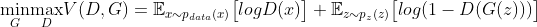
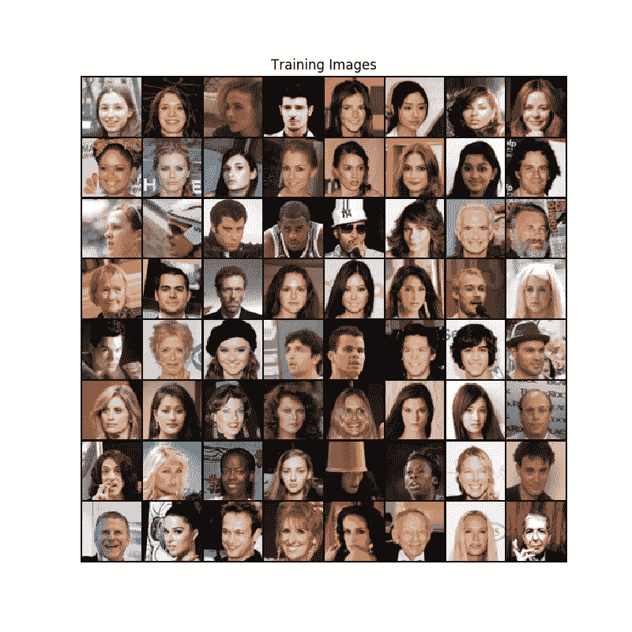
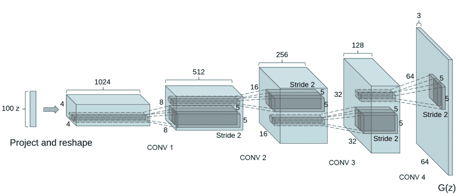
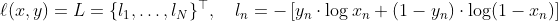
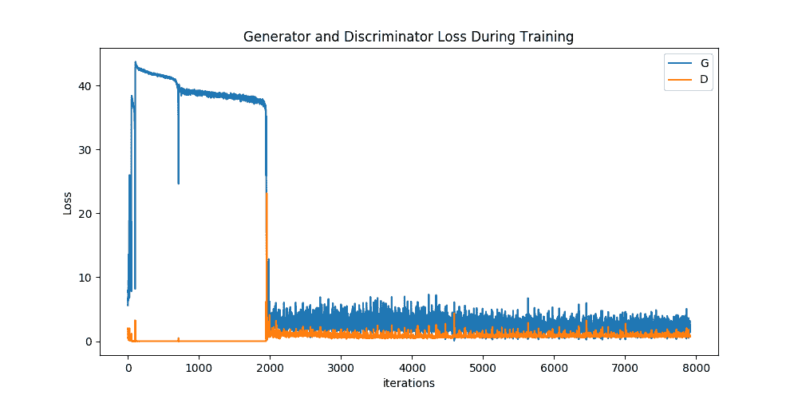
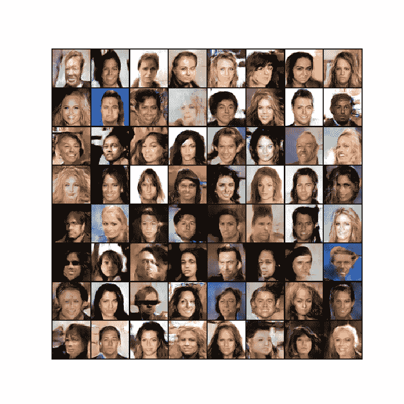
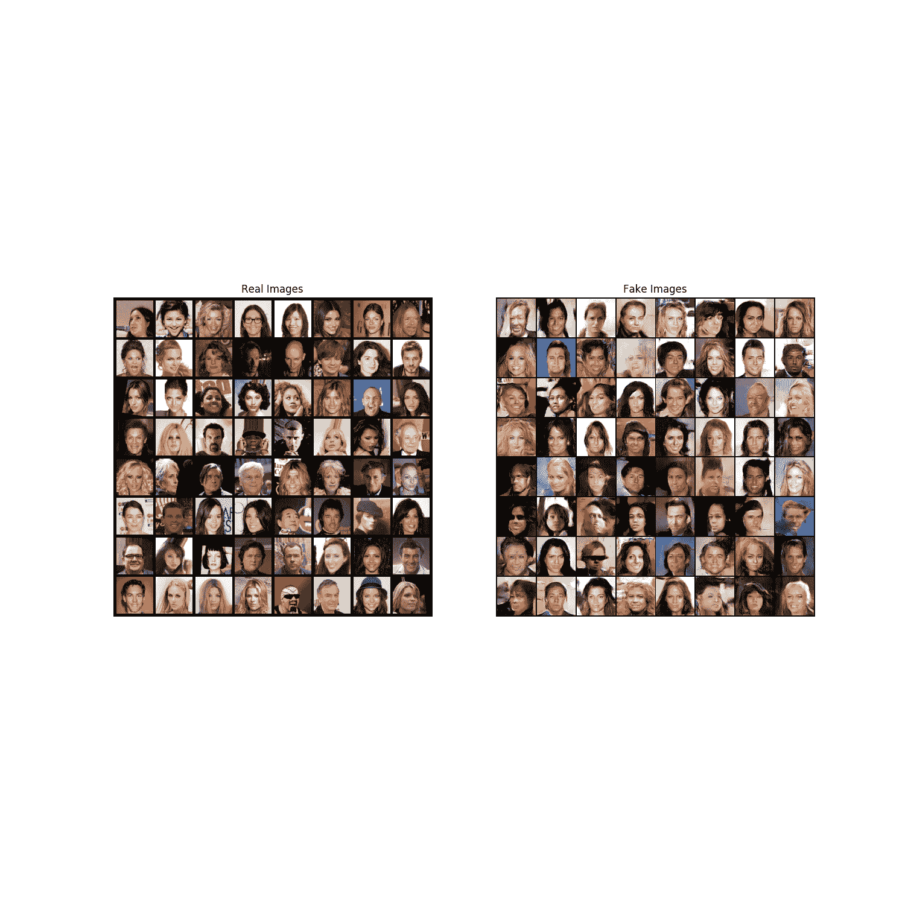

# DCGAN 教程

> 原文：<https://pytorch.org/tutorials/beginner/dcgan_faces_tutorial.html>

**作者**： [Nathan Inkawhich](https://github.com/inkawhich)

## 简介

本教程将通过一个示例对 DCGAN 进行介绍。 在向其展示许多真实名人的照片后，我们将训练一个生成对抗网络（GAN）来产生新名人。 此处的大多数代码来自[`pytorch/examples`](https://github.com/pytorch/examples)中的 dcgan 实现，并且本文档将对该实现进行详尽的解释，并阐明此模型的工作方式和原因。 但请放心，不需要 GAN 的先验知识，但这可能需要新手花一些时间来推理幕后实际发生的事情。 同样，为了节省时间，拥有一两个 GPU 也将有所帮助。 让我们从头开始。

## 生成对抗网络

### 什么是 GAN？

GAN 是用于教授 DL 模型以捕获训练数据分布的框架，因此我们可以从同一分布中生成新数据。 GAN 由 Ian Goodfellow 于 2014 年发明，并在论文[《生成对抗网络》](https://papers.nips.cc/paper/5423-generative-adversarial-nets.pdf)中首次进行了描述。 它们由两个不同的模型组成：*生成器*和*判别器*。 生成器的工作是生成看起来像训练图像的“假”图像。 判别器的工作是查看图像并从生成器输出它是真实的训练图像还是伪图像。 在训练过程中，生成器不断尝试通过生成越来越好的伪造品而使判别器的表现超过智者，而判别器正在努力成为更好的侦探并正确地对真实和伪造图像进行分类。 博弈的平衡点是当生成器生成的伪造品看起来像直接来自训练数据时，而判别器则总是猜测生成器输出是真实还是伪造品的 50% 置信度。

现在，让我们从判别器开始定义一些在整个教程中使用的符号。 令`x`为代表图像的数据。 `D(x)`是判别器网络，其输出`x`来自训练数据而不是生成器的（标量）概率。 在这里，由于我们要处理图像，因此`D(x)`的输入是 CHW 大小为`3x64x64`的图像。 直观地，当`x`来自训练数据时，`D(x)`应该为高，而当`x`来自生成器时，它应该为低。 `D(x)`也可以被认为是传统的二分类器。

对于生成器的表示法，令`z`是从标准正态分布中采样的潜在空间向量。 `G(z)`表示将隐向量`z`映射到数据空间的生成器函数。 `G`的目标是估计训练数据来自`p_data`的分布，以便它可以从该估计分布（`p_g`）生成假样本。

因此，`D(G(z))`是生成器`G`的输出是真实图像的概率（标量）。 如 [Goodfellow 的论文](https://papers.nips.cc/paper/5423-generative-adversarial-nets.pdf)中所述，`D`和`G`玩一个 minimax 游戏，其中`D`试图最大化其正确分类实物和假物`log D(x)`，并且`G`尝试最小化`D`预测其输出为假的概率`log(1 - D(G(g(x))))`。 从本文来看，GAN 损失函数为



从理论上讲，此极小极大游戏的解决方案是`p_g = p_data`，判别器会随机猜测输入是真实的还是假的。 但是，GAN 的收敛理论仍在积极研究中，实际上，模型并不总是能达到这一目的。

### 什么是 DCGAN？

DCGAN 是上述 GAN 的直接扩展，不同之处在于，DCGAN 分别在判别器和生成器中分别使用卷积和卷积转置层。 它最早由 Radford 等人，在论文[《使用深度卷积生成对抗网络的无监督表示学习》](https://arxiv.org/pdf/1511.06434.pdf)中描述。 判别器由分层的[卷积层](https://pytorch.org/docs/stable/nn.html#torch.nn.Conv2d)，[批量规范层](https://pytorch.org/docs/stable/nn.html#torch.nn.BatchNorm2d)和 [LeakyReLU](https://pytorch.org/docs/stable/nn.html#torch.nn.LeakyReLU) 激活组成。 输入是`3x64x64`的输入图像，输出是输入来自真实数据分布的标量概率。 生成器由[转置卷积层](https://pytorch.org/docs/stable/nn.html#torch.nn.ConvTranspose2d)，批量规范层和 [ReLU](https://pytorch.org/docs/stable/nn.html#relu) 激活组成。 输入是从标准正态分布中提取的潜向量`z`，输出是`3x64x64` RGB 图像。 跨步的转置层使潜向量可以转换为具有与图像相同形状的体积。 在本文中，作者还提供了一些有关如何设置优化器，如何计算损失函数以及如何初始化模型权重的提示，所有这些都将在接下来的部分中进行解释。

```py
from __future__ import print_function
#%matplotlib inline
import argparse
import os
import random
import torch
import torch.nn as nn
import torch.nn.parallel
import torch.backends.cudnn as cudnn
import torch.optim as optim
import torch.utils.data
import torchvision.datasets as dset
import torchvision.transforms as transforms
import torchvision.utils as vutils
import numpy as np
import matplotlib.pyplot as plt
import matplotlib.animation as animation
from IPython.display import HTML

# Set random seed for reproducibility
manualSeed = 999
#manualSeed = random.randint(1, 10000) # use if you want new results
print("Random Seed: ", manualSeed)
random.seed(manualSeed)
torch.manual_seed(manualSeed)

```

出：

```py
Random Seed:  999

```

## 输入

让我们为跑步定义一些输入：

*   `dataroot`-数据集文件夹根目录的路径。 我们将在下一节中进一步讨论数据集
*   `worker`-使用`DataLoader`加载数据的工作线程数
*   `batch_size`-训练中使用的批量大小。 DCGAN 纸使用的批量大小为 128
*   `image_size`-用于训练的图像的空间大小。 此实现默认为`64x64`。 如果需要其他尺寸，则必须更改`D`和`G`的结构。 有关更多详细信息，请参见[此处](https://github.com/pytorch/examples/issues/70)。
*   `nc`-输入图像中的彩色通道数。 对于彩色图像，这是 3
*   `nz`-潜向量的长度
*   `ngf`-与通过生成器传送的特征映射的深度有关
*   `ndf`-设置通过判别器传播的特征映射的深度
*   `num_epochs`-要运行的训练周期数。 训练更长的时间可能会导致更好的结果，但也会花费更长的时间
*   `lr`-训练的学习率。 如 DCGAN 文件中所述，此数字应为 0.0002
*   `beta1`-Adam 优化器的`beta1`超参数。 如论文所述，该数字应为 0.5
*   `ngpu`-可用的 GPU 数量。 如果为 0，则代码将在 CPU 模式下运行。 如果此数字大于 0，它将在该数量的 GPU 上运行

```py
# Root directory for dataset
dataroot = "data/celeba"

# Number of workers for dataloader
workers = 2

# Batch size during training
batch_size = 128

# Spatial size of training images. All images will be resized to this
#   size using a transformer.
image_size = 64

# Number of channels in the training images. For color images this is 3
nc = 3

# Size of z latent vector (i.e. size of generator input)
nz = 100

# Size of feature maps in generator
ngf = 64

# Size of feature maps in discriminator
ndf = 64

# Number of training epochs
num_epochs = 5

# Learning rate for optimizers
lr = 0.0002

# Beta1 hyperparam for Adam optimizers
beta1 = 0.5

# Number of GPUs available. Use 0 for CPU mode.
ngpu = 1

```

## 数据

在本教程中，我们将使用 [Celeb-A Faces 数据集](http://mmlab.ie.cuhk.edu.hk/projects/CelebA.html)，该数据集可在链接的站点或 [Google 云端硬盘](https://drive.google.com/drive/folders/0B7EVK8r0v71pTUZsaXdaSnZBZzg)中下载。 数据集将下载为名为`img_align_celeba.zip`的文件。 下载完成后，创建一个名为`celeba`的目录，并将 zip 文件解压缩到该目录中。 然后，将此笔记本的`dataroot `输入设置为刚创建的`celeba`目录。 结果目录结构应为：

```py
/path/to/celeba
    -> img_align_celeba
        -> 188242.jpg
        -> 173822.jpg
        -> 284702.jpg
        -> 537394.jpg
           ...

```

这是重要的一步，因为我们将使用`ImageFolder`数据集类，该类要求数据集的根文件夹中有子目录。 现在，我们可以创建数据集，创建数据加载器，将设备设置为可以运行，并最终可视化一些训练数据。

```py
# We can use an image folder dataset the way we have it setup.
# Create the dataset
dataset = dset.ImageFolder(root=dataroot,
                           transform=transforms.Compose([
                               transforms.Resize(image_size),
                               transforms.CenterCrop(image_size),
                               transforms.ToTensor(),
                               transforms.Normalize((0.5, 0.5, 0.5), (0.5, 0.5, 0.5)),
                           ]))
# Create the dataloader
dataloader = torch.utils.data.DataLoader(dataset, batch_size=batch_size,
                                         shuffle=True, num_workers=workers)

# Decide which device we want to run on
device = torch.device("cuda:0" if (torch.cuda.is_available() and ngpu > 0) else "cpu")

# Plot some training images
real_batch = next(iter(dataloader))
plt.figure(figsize=(8,8))
plt.axis("off")
plt.title("Training Images")
plt.imshow(np.transpose(vutils.make_grid(real_batch[0].to(device)[:64], padding=2, normalize=True).cpu(),(1,2,0)))

```



## 实现

设置好输入参数并准备好数据集后，我们现在可以进入实现了。 我们将从权重初始化策略开始，然后详细讨论生成器，判别器，损失函数和训练循环。

### 权重初始化

在 DCGAN 论文中，作者指定所有模型权重均应从均值为 0，`stdev = 0.02`的正态分布中随机初始化。 `weights_init`函数采用已初始化的模型作为输入，并重新初始化所有卷积，卷积转置和批量归一化层以满足此标准。 初始化后立即将此函数应用于模型。

```py
# custom weights initialization called on netG and netD
def weights_init(m):
    classname = m.__class__.__name__
    if classname.find('Conv') != -1:
        nn.init.normal_(m.weight.data, 0.0, 0.02)
    elif classname.find('BatchNorm') != -1:
        nn.init.normal_(m.weight.data, 1.0, 0.02)
        nn.init.constant_(m.bias.data, 0)

```

### 生成器

生成器`G`用于将潜在空间向量（`z`）映射到数据空间。 由于我们的数据是图像，因此将`z`转换为数据空间意味着最终创建与训练图像大小相同的 RGB 图像（即`3x64x64`）。 在实践中，这是通过一系列跨步的二维卷积转置层来完成的，每个层都与 2d 批量规范层和 relu 激活配对。 生成器的输出通过 tanh 函数馈送，以使其返回到输入数据范围`[-1,1]`。 值得注意的是，在卷积转置层之后存在批量规范函数，因为这是 DCGAN 论文的关键贡献。 这些层有助于训练过程中的梯度流动。 DCGAN 纸生成的图像如下所示。



请注意，我们在输入部分中设置的输入（`nz`，`ngf`和`nc`）如何影响代码中的生成器架构。 `nz`是`z`输入向量的长度，`ngf`与通过生成器传播的特征映射的大小有关， `nc`是输出图像中的通道（对于 RGB 图像设置为 3）。 下面是生成器的代码。

```py
# Generator Code

class Generator(nn.Module):
    def __init__(self, ngpu):
        super(Generator, self).__init__()
        self.ngpu = ngpu
        self.main = nn.Sequential(
            # input is Z, going into a convolution
            nn.ConvTranspose2d( nz, ngf * 8, 4, 1, 0, bias=False),
            nn.BatchNorm2d(ngf * 8),
            nn.ReLU(True),
            # state size. (ngf*8) x 4 x 4
            nn.ConvTranspose2d(ngf * 8, ngf * 4, 4, 2, 1, bias=False),
            nn.BatchNorm2d(ngf * 4),
            nn.ReLU(True),
            # state size. (ngf*4) x 8 x 8
            nn.ConvTranspose2d( ngf * 4, ngf * 2, 4, 2, 1, bias=False),
            nn.BatchNorm2d(ngf * 2),
            nn.ReLU(True),
            # state size. (ngf*2) x 16 x 16
            nn.ConvTranspose2d( ngf * 2, ngf, 4, 2, 1, bias=False),
            nn.BatchNorm2d(ngf),
            nn.ReLU(True),
            # state size. (ngf) x 32 x 32
            nn.ConvTranspose2d( ngf, nc, 4, 2, 1, bias=False),
            nn.Tanh()
            # state size. (nc) x 64 x 64
        )

    def forward(self, input):
        return self.main(input)

```

现在，我们可以实例化生成器并应用`weights_init`函数。 签出打印的模型以查看生成器对象的结构。

```py
# Create the generator
netG = Generator(ngpu).to(device)

# Handle multi-gpu if desired
if (device.type == 'cuda') and (ngpu > 1):
    netG = nn.DataParallel(netG, list(range(ngpu)))

# Apply the weights_init function to randomly initialize all weights
#  to mean=0, stdev=0.2.
netG.apply(weights_init)

# Print the model
print(netG)

```

出：

```py
Generator(
  (main): Sequential(
    (0): ConvTranspose2d(100, 512, kernel_size=(4, 4), stride=(1, 1), bias=False)
    (1): BatchNorm2d(512, eps=1e-05, momentum=0.1, affine=True, track_running_stats=True)
    (2): ReLU(inplace=True)
    (3): ConvTranspose2d(512, 256, kernel_size=(4, 4), stride=(2, 2), padding=(1, 1), bias=False)
    (4): BatchNorm2d(256, eps=1e-05, momentum=0.1, affine=True, track_running_stats=True)
    (5): ReLU(inplace=True)
    (6): ConvTranspose2d(256, 128, kernel_size=(4, 4), stride=(2, 2), padding=(1, 1), bias=False)
    (7): BatchNorm2d(128, eps=1e-05, momentum=0.1, affine=True, track_running_stats=True)
    (8): ReLU(inplace=True)
    (9): ConvTranspose2d(128, 64, kernel_size=(4, 4), stride=(2, 2), padding=(1, 1), bias=False)
    (10): BatchNorm2d(64, eps=1e-05, momentum=0.1, affine=True, track_running_stats=True)
    (11): ReLU(inplace=True)
    (12): ConvTranspose2d(64, 3, kernel_size=(4, 4), stride=(2, 2), padding=(1, 1), bias=False)
    (13): Tanh()
  )
)

```

### 判别器

如前所述，判别器`D`是一个二分类网络，将图像作为输入并输出标量概率，即输入图像是真实的（与假的相对）。 在这里，`D`拍摄`3x64x64`的输入图像，通过一系列的`Conv2d`，`BatchNorm2d`和`LeakyReLU`层对其进行处理，然后通过 Sigmoid 激活函数输出最终概率。 如果需要解决此问题，可以用更多层扩展此架构，但是使用跨步卷积，`BatchNorm`和`LeakyReLU`仍然很重要。 DCGAN 论文提到，使用跨步卷积而不是通过池化来进行下采样是一个好习惯，因为它可以让网络学习自己的池化特征。 批量规范和泄漏 ReLU 函数还可以促进健康的梯度流，这对于`G`和`D`的学习过程都是至关重要的。

鉴别码

```py
class Discriminator(nn.Module):
    def __init__(self, ngpu):
        super(Discriminator, self).__init__()
        self.ngpu = ngpu
        self.main = nn.Sequential(
            # input is (nc) x 64 x 64
            nn.Conv2d(nc, ndf, 4, 2, 1, bias=False),
            nn.LeakyReLU(0.2, inplace=True),
            # state size. (ndf) x 32 x 32
            nn.Conv2d(ndf, ndf * 2, 4, 2, 1, bias=False),
            nn.BatchNorm2d(ndf * 2),
            nn.LeakyReLU(0.2, inplace=True),
            # state size. (ndf*2) x 16 x 16
            nn.Conv2d(ndf * 2, ndf * 4, 4, 2, 1, bias=False),
            nn.BatchNorm2d(ndf * 4),
            nn.LeakyReLU(0.2, inplace=True),
            # state size. (ndf*4) x 8 x 8
            nn.Conv2d(ndf * 4, ndf * 8, 4, 2, 1, bias=False),
            nn.BatchNorm2d(ndf * 8),
            nn.LeakyReLU(0.2, inplace=True),
            # state size. (ndf*8) x 4 x 4
            nn.Conv2d(ndf * 8, 1, 4, 1, 0, bias=False),
            nn.Sigmoid()
        )

    def forward(self, input):
        return self.main(input)

```

现在，与生成器一样，我们可以创建判别器，应用`weights_init`函数，并打印模型的结构。

```py
# Create the Discriminator
netD = Discriminator(ngpu).to(device)

# Handle multi-gpu if desired
if (device.type == 'cuda') and (ngpu > 1):
    netD = nn.DataParallel(netD, list(range(ngpu)))

# Apply the weights_init function to randomly initialize all weights
#  to mean=0, stdev=0.2.
netD.apply(weights_init)

# Print the model
print(netD)

```

出：

```py
Discriminator(
  (main): Sequential(
    (0): Conv2d(3, 64, kernel_size=(4, 4), stride=(2, 2), padding=(1, 1), bias=False)
    (1): LeakyReLU(negative_slope=0.2, inplace=True)
    (2): Conv2d(64, 128, kernel_size=(4, 4), stride=(2, 2), padding=(1, 1), bias=False)
    (3): BatchNorm2d(128, eps=1e-05, momentum=0.1, affine=True, track_running_stats=True)
    (4): LeakyReLU(negative_slope=0.2, inplace=True)
    (5): Conv2d(128, 256, kernel_size=(4, 4), stride=(2, 2), padding=(1, 1), bias=False)
    (6): BatchNorm2d(256, eps=1e-05, momentum=0.1, affine=True, track_running_stats=True)
    (7): LeakyReLU(negative_slope=0.2, inplace=True)
    (8): Conv2d(256, 512, kernel_size=(4, 4), stride=(2, 2), padding=(1, 1), bias=False)
    (9): BatchNorm2d(512, eps=1e-05, momentum=0.1, affine=True, track_running_stats=True)
    (10): LeakyReLU(negative_slope=0.2, inplace=True)
    (11): Conv2d(512, 1, kernel_size=(4, 4), stride=(1, 1), bias=False)
    (12): Sigmoid()
  )
)

```

### 损失函数和优化器

使用`D`和`G`设置，我们可以指定它们如何通过损失函数和优化器学习。 我们将使用在 PyTorch 中定义的二进制交叉熵损失（[BCELoss](https://pytorch.org/docs/stable/nn.html#torch.nn.BCELoss)）函数：



请注意，此函数如何提供目标函数中两个对数分量的计算（即`log D(x)`和`log(1 - D(G(z)))`）。 我们可以指定`y`输入使用 BCE 方程的哪一部分。 这是在即将到来的训练循环中完成的，但重要的是要了解我们如何仅通过更改`y`（即`GT`标签）即可选择希望计算的分量。

接下来，我们将实际标签定义为 1，将假标签定义为 0。这些标签将在计算`D`和`G`的损失时使用，这也是 GAN 原始论文中使用的惯例 。 最后，我们设置了两个单独的优化器，一个用于`D`，另一个用于`G`。 如 DCGAN 论文中所指定，这两个都是学习速度为 0.0002 和`Beta1 = 0.5`的 Adam 优化器。 为了跟踪生成器的学习进度，我们将生成一批固定的潜在向量，这些向量是从高斯分布（即`fixed_noise`）中提取的。 在训练循环中，我们将定期将此`fixed_noise`输入到`G`中，并且在迭代过程中，我们将看到图像形成于噪声之外。

```py
# Initialize BCELoss function
criterion = nn.BCELoss()

# Create batch of latent vectors that we will use to visualize
#  the progression of the generator
fixed_noise = torch.randn(64, nz, 1, 1, device=device)

# Establish convention for real and fake labels during training
real_label = 1.
fake_label = 0.

# Setup Adam optimizers for both G and D
optimizerD = optim.Adam(netD.parameters(), lr=lr, betas=(beta1, 0.999))
optimizerG = optim.Adam(netG.parameters(), lr=lr, betas=(beta1, 0.999))

```

### 训练

最后，既然我们已经定义了 GAN 框架的所有部分，我们就可以对其进行训练。 请注意，训练 GAN 某种程度上是一种艺术形式，因为不正确的超参数设置会导致模式崩溃，而对失败的原因几乎没有解释。 在这里，我们将严格遵循 Goodfellow 论文中的算法 1，同时遵守[`ganhacks`](https://github.com/soumith/ganhacks)中显示的一些最佳做法。 即，我们将“为真实和伪造构建不同的小批量”图像，并调整`G`的目标函数以最大化`log D(G(z))`。 训练分为两个主要部分。 第 1 部分更新了判别器，第 2 部分更新了生成器。

**第 1 部分-训练判别器**

回想一下，训练判别器的目的是最大程度地提高将给定输入正确分类为真实或伪造的可能性。 就古德费罗而言，我们希望“通过提高其随机梯度来更新判别器”。 实际上，我们要最大化`log D(x) + log(1 - D(G(z))`。 由于 ganhacks 提出了单独的小批量建议，因此我们将分两步进行计算。 首先，我们将从训练集中构造一批真实样本，向前通过`D`，计算损失（`log D(x)`），然后在向后通过中计算梯度。 其次，我们将使用当前生成器构造一批假样本，将这批伪造通过`D`，计算损失（`log(1 - D(G(z)))`），然后*反向累积*梯度。 现在，利用全批量和全批量的累积梯度，我们称之为判别器优化程序的一个步骤。

**第 2 部分-训练生成器**

如原始论文所述，我们希望通过最小化`log(1 - D(G(z)))`来训练生成器，以产生更好的假货。 如前所述，Goodfellow 证明这不能提供足够的梯度，尤其是在学习过程的早期。 作为解决方法，我们希望最大化`log D(G(z))`。 在代码中，我们通过以下步骤来实现此目的：将第 1 部分的生成器输出与判别器进行分类，使用实数标签`GT`计算`G`的损失，反向计算`G`的梯度，最后使用优化器步骤更新`G`的参数。 将真实标签用作损失函数的`GT`标签似乎是违反直觉的，但这使我们可以使用 BCELoss 的`log(x)`部分（而不是`log(1 - x)`部分），这正是我们想要的。

最后，我们将进行一些统计报告，并在每个周期结束时，将我们的`fixed_noise`批量推送到生成器中，以直观地跟踪`G`的训练进度。 报告的训练统计数据是：

*   `Loss_D`-判别器损失，计算为所有真实批量和所有假批量的损失总和（`log D(x) + log D(G(z))`）。
*   `Loss_G`-生成器损失计算为`log D(G(z))`
*   `D(x)`-所有真实批量的判别器的平均输出（整个批量）。 这应该从接近 1 开始，然后在`G`变得更好时理论上收敛到 0.5。 想想这是为什么。
*   `D(G(z))`-所有假批量的平均判别器输出。 第一个数字在`D`更新之前，第二个数字在`D`更新之后。 这些数字应从 0 开始，并随着`G`的提高收敛到 0.5。 想想这是为什么。

**注意**：此步骤可能需要一段时间，具体取决于您运行了多少个周期以及是否从数据集中删除了一些数据。

```py
# Training Loop

# Lists to keep track of progress
img_list = []
G_losses = []
D_losses = []
iters = 0

print("Starting Training Loop...")
# For each epoch
for epoch in range(num_epochs):
    # For each batch in the dataloader
    for i, data in enumerate(dataloader, 0):

        ############################
        # (1) Update D network: maximize log(D(x)) + log(1 - D(G(z)))
        ###########################
        ## Train with all-real batch
        netD.zero_grad()
        # Format batch
        real_cpu = data[0].to(device)
        b_size = real_cpu.size(0)
        label = torch.full((b_size,), real_label, dtype=torch.float, device=device)
        # Forward pass real batch through D
        output = netD(real_cpu).view(-1)
        # Calculate loss on all-real batch
        errD_real = criterion(output, label)
        # Calculate gradients for D in backward pass
        errD_real.backward()
        D_x = output.mean().item()

        ## Train with all-fake batch
        # Generate batch of latent vectors
        noise = torch.randn(b_size, nz, 1, 1, device=device)
        # Generate fake image batch with G
        fake = netG(noise)
        label.fill_(fake_label)
        # Classify all fake batch with D
        output = netD(fake.detach()).view(-1)
        # Calculate D's loss on the all-fake batch
        errD_fake = criterion(output, label)
        # Calculate the gradients for this batch
        errD_fake.backward()
        D_G_z1 = output.mean().item()
        # Add the gradients from the all-real and all-fake batches
        errD = errD_real + errD_fake
        # Update D
        optimizerD.step()

        ############################
        # (2) Update G network: maximize log(D(G(z)))
        ###########################
        netG.zero_grad()
        label.fill_(real_label)  # fake labels are real for generator cost
        # Since we just updated D, perform another forward pass of all-fake batch through D
        output = netD(fake).view(-1)
        # Calculate G's loss based on this output
        errG = criterion(output, label)
        # Calculate gradients for G
        errG.backward()
        D_G_z2 = output.mean().item()
        # Update G
        optimizerG.step()

        # Output training stats
        if i % 50 == 0:
            print('[%d/%d][%d/%d]\tLoss_D: %.4f\tLoss_G: %.4f\tD(x): %.4f\tD(G(z)): %.4f / %.4f'
                  % (epoch, num_epochs, i, len(dataloader),
                     errD.item(), errG.item(), D_x, D_G_z1, D_G_z2))

        # Save Losses for plotting later
        G_losses.append(errG.item())
        D_losses.append(errD.item())

        # Check how the generator is doing by saving G's output on fixed_noise
        if (iters % 500 == 0) or ((epoch == num_epochs-1) and (i == len(dataloader)-1)):
            with torch.no_grad():
                fake = netG(fixed_noise).detach().cpu()
            img_list.append(vutils.make_grid(fake, padding=2, normalize=True))

        iters += 1

```

出：

```py
Starting Training Loop...
[0/5][0/1583]   Loss_D: 1.9847  Loss_G: 5.5914  D(x): 0.6004    D(G(z)): 0.6680 / 0.0062
[0/5][50/1583]  Loss_D: 0.7168  Loss_G: 35.7954 D(x): 0.7127    D(G(z)): 0.0000 / 0.0000
[0/5][100/1583] Loss_D: 0.0007  Loss_G: 28.2580 D(x): 0.9994    D(G(z)): 0.0000 / 0.0000
[0/5][150/1583] Loss_D: 0.0001  Loss_G: 42.5731 D(x): 0.9999    D(G(z)): 0.0000 / 0.0000
[0/5][200/1583] Loss_D: 0.0138  Loss_G: 42.3603 D(x): 0.9933    D(G(z)): 0.0000 / 0.0000
[0/5][250/1583] Loss_D: 0.0010  Loss_G: 42.2029 D(x): 0.9991    D(G(z)): 0.0000 / 0.0000
[0/5][300/1583] Loss_D: 0.0000  Loss_G: 41.9521 D(x): 1.0000    D(G(z)): 0.0000 / 0.0000
[0/5][350/1583] Loss_D: 0.0000  Loss_G: 41.7962 D(x): 1.0000    D(G(z)): 0.0000 / 0.0000
[0/5][400/1583] Loss_D: 0.0000  Loss_G: 41.6345 D(x): 1.0000    D(G(z)): 0.0000 / 0.0000
[0/5][450/1583] Loss_D: 0.0000  Loss_G: 41.6058 D(x): 1.0000    D(G(z)): 0.0000 / 0.0000
[0/5][500/1583] Loss_D: 0.0001  Loss_G: 41.6208 D(x): 0.9999    D(G(z)): 0.0000 / 0.0000
[0/5][550/1583] Loss_D: 0.0000  Loss_G: 41.3979 D(x): 1.0000    D(G(z)): 0.0000 / 0.0000
[0/5][600/1583] Loss_D: 0.0000  Loss_G: 41.2545 D(x): 1.0000    D(G(z)): 0.0000 / 0.0000
[0/5][650/1583] Loss_D: 0.0000  Loss_G: 41.0200 D(x): 1.0000    D(G(z)): 0.0000 / 0.0000
[0/5][700/1583] Loss_D: 0.0000  Loss_G: 39.6461 D(x): 1.0000    D(G(z)): 0.0000 / 0.0000
[0/5][750/1583] Loss_D: 0.0000  Loss_G: 38.8834 D(x): 1.0000    D(G(z)): 0.0000 / 0.0000
[0/5][800/1583] Loss_D: 0.0000  Loss_G: 38.5914 D(x): 1.0000    D(G(z)): 0.0000 / 0.0000
[0/5][850/1583] Loss_D: 0.0000  Loss_G: 38.8209 D(x): 1.0000    D(G(z)): 0.0000 / 0.0000
[0/5][900/1583] Loss_D: 0.0000  Loss_G: 38.9713 D(x): 1.0000    D(G(z)): 0.0000 / 0.0000
[0/5][950/1583] Loss_D: 0.0000  Loss_G: 38.4995 D(x): 1.0000    D(G(z)): 0.0000 / 0.0000
[0/5][1000/1583]        Loss_D: 0.0001  Loss_G: 38.5549 D(x): 0.9999    D(G(z)): 0.0000 / 0.0000
[0/5][1050/1583]        Loss_D: 0.0000  Loss_G: 39.1773 D(x): 1.0000    D(G(z)): 0.0000 / 0.0000
[0/5][1100/1583]        Loss_D: 0.0000  Loss_G: 39.0142 D(x): 1.0000    D(G(z)): 0.0000 / 0.0000
[0/5][1150/1583]        Loss_D: 0.0000  Loss_G: 38.6368 D(x): 1.0000    D(G(z)): 0.0000 / 0.0000
[0/5][1200/1583]        Loss_D: 0.0000  Loss_G: 38.7159 D(x): 1.0000    D(G(z)): 0.0000 / 0.0000
[0/5][1250/1583]        Loss_D: 0.0000  Loss_G: 38.7660 D(x): 1.0000    D(G(z)): 0.0000 / 0.0000
[0/5][1300/1583]        Loss_D: 0.0000  Loss_G: 38.5522 D(x): 1.0000    D(G(z)): 0.0000 / 0.0000
[0/5][1350/1583]        Loss_D: 0.0001  Loss_G: 38.6703 D(x): 0.9999    D(G(z)): 0.0000 / 0.0000
[0/5][1400/1583]        Loss_D: 0.0000  Loss_G: 38.5487 D(x): 1.0000    D(G(z)): 0.0000 / 0.0000
[0/5][1450/1583]        Loss_D: 0.0000  Loss_G: 38.0378 D(x): 1.0000    D(G(z)): 0.0000 / 0.0000
[0/5][1500/1583]        Loss_D: 0.0000  Loss_G: 38.1258 D(x): 1.0000    D(G(z)): 0.0000 / 0.0000
[0/5][1550/1583]        Loss_D: 0.0000  Loss_G: 38.3473 D(x): 1.0000    D(G(z)): 0.0000 / 0.0000
[1/5][0/1583]   Loss_D: 0.0000  Loss_G: 37.8825 D(x): 1.0000    D(G(z)): 0.0000 / 0.0000
[1/5][50/1583]  Loss_D: 0.0000  Loss_G: 38.2248 D(x): 1.0000    D(G(z)): 0.0000 / 0.0000
[1/5][100/1583] Loss_D: 0.0000  Loss_G: 38.2204 D(x): 1.0000    D(G(z)): 0.0000 / 0.0000
[1/5][150/1583] Loss_D: 0.0000  Loss_G: 38.0967 D(x): 1.0000    D(G(z)): 0.0000 / 0.0000
[1/5][200/1583] Loss_D: 0.0000  Loss_G: 38.0669 D(x): 1.0000    D(G(z)): 0.0000 / 0.0000
[1/5][250/1583] Loss_D: 0.0000  Loss_G: 37.4736 D(x): 1.0000    D(G(z)): 0.0000 / 0.0000
[1/5][300/1583] Loss_D: 0.0000  Loss_G: 37.0766 D(x): 1.0000    D(G(z)): 0.0000 / 0.0000
[1/5][350/1583] Loss_D: 0.0000  Loss_G: 36.6055 D(x): 1.0000    D(G(z)): 0.0000 / 0.0000
[1/5][400/1583] Loss_D: 2.5403  Loss_G: 12.8251 D(x): 0.8672    D(G(z)): 0.8088 / 0.0000
[1/5][450/1583] Loss_D: 1.3779  Loss_G: 2.0631  D(x): 0.5850    D(G(z)): 0.4734 / 0.1820
[1/5][500/1583] Loss_D: 1.0299  Loss_G: 2.4048  D(x): 0.5165    D(G(z)): 0.1698 / 0.1333
[1/5][550/1583] Loss_D: 1.4922  Loss_G: 3.2383  D(x): 0.5854    D(G(z)): 0.4773 / 0.0888
[1/5][600/1583] Loss_D: 0.9283  Loss_G: 1.8533  D(x): 0.6231    D(G(z)): 0.2962 / 0.2153
[1/5][650/1583] Loss_D: 0.8065  Loss_G: 2.9684  D(x): 0.6684    D(G(z)): 0.2624 / 0.0715
[1/5][700/1583] Loss_D: 0.6909  Loss_G: 2.8746  D(x): 0.7910    D(G(z)): 0.3013 / 0.0819
[1/5][750/1583] Loss_D: 1.3242  Loss_G: 2.5236  D(x): 0.7183    D(G(z)): 0.5300 / 0.1090
[1/5][800/1583] Loss_D: 1.0871  Loss_G: 2.0203  D(x): 0.4993    D(G(z)): 0.1716 / 0.1727
[1/5][850/1583] Loss_D: 1.7561  Loss_G: 4.9674  D(x): 0.8542    D(G(z)): 0.7052 / 0.0133
[1/5][900/1583] Loss_D: 0.8294  Loss_G: 2.5024  D(x): 0.6913    D(G(z)): 0.2910 / 0.1178
[1/5][950/1583] Loss_D: 0.9390  Loss_G: 2.2087  D(x): 0.5508    D(G(z)): 0.1638 / 0.1617
[1/5][1000/1583]        Loss_D: 1.8202  Loss_G: 1.2178  D(x): 0.2535    D(G(z)): 0.0684 / 0.3527
[1/5][1050/1583]        Loss_D: 0.9816  Loss_G: 3.7976  D(x): 0.7310    D(G(z)): 0.3944 / 0.0343
[1/5][1100/1583]        Loss_D: 0.9798  Loss_G: 2.0990  D(x): 0.5963    D(G(z)): 0.2328 / 0.1660
[1/5][1150/1583]        Loss_D: 0.7173  Loss_G: 2.7879  D(x): 0.6385    D(G(z)): 0.1424 / 0.1057
[1/5][1200/1583]        Loss_D: 0.8903  Loss_G: 2.3547  D(x): 0.7371    D(G(z)): 0.3589 / 0.1251
[1/5][1250/1583]        Loss_D: 0.6137  Loss_G: 2.1031  D(x): 0.7491    D(G(z)): 0.2062 / 0.1588
[1/5][1300/1583]        Loss_D: 1.0179  Loss_G: 5.0280  D(x): 0.7465    D(G(z)): 0.4325 / 0.0129
[1/5][1350/1583]        Loss_D: 0.7131  Loss_G: 3.6670  D(x): 0.7931    D(G(z)): 0.3270 / 0.0398
[1/5][1400/1583]        Loss_D: 1.0736  Loss_G: 4.2392  D(x): 0.8172    D(G(z)): 0.4861 / 0.0351
[1/5][1450/1583]        Loss_D: 0.6050  Loss_G: 2.6052  D(x): 0.7590    D(G(z)): 0.2240 / 0.1019
[1/5][1500/1583]        Loss_D: 1.3370  Loss_G: 1.9105  D(x): 0.3786    D(G(z)): 0.0405 / 0.2013
[1/5][1550/1583]        Loss_D: 0.6698  Loss_G: 2.3040  D(x): 0.6444    D(G(z)): 0.1071 / 0.1372
[2/5][0/1583]   Loss_D: 1.3043  Loss_G: 2.1213  D(x): 0.4073    D(G(z)): 0.0423 / 0.1682
[2/5][50/1583]  Loss_D: 1.3636  Loss_G: 3.4322  D(x): 0.7959    D(G(z)): 0.6129 / 0.0510
[2/5][100/1583] Loss_D: 0.8047  Loss_G: 3.4262  D(x): 0.9067    D(G(z)): 0.4371 / 0.0536
[2/5][150/1583] Loss_D: 0.7103  Loss_G: 2.4974  D(x): 0.6212    D(G(z)): 0.0862 / 0.1273
[2/5][200/1583] Loss_D: 0.8335  Loss_G: 2.9292  D(x): 0.7340    D(G(z)): 0.3396 / 0.0772
[2/5][250/1583] Loss_D: 1.4766  Loss_G: 1.4532  D(x): 0.3469    D(G(z)): 0.0140 / 0.3162
[2/5][300/1583] Loss_D: 0.8063  Loss_G: 2.5363  D(x): 0.6939    D(G(z)): 0.2714 / 0.1160
[2/5][350/1583] Loss_D: 2.4655  Loss_G: 1.7710  D(x): 0.1625    D(G(z)): 0.0049 / 0.2345
[2/5][400/1583] Loss_D: 0.9256  Loss_G: 1.4698  D(x): 0.5101    D(G(z)): 0.1192 / 0.2926
[2/5][450/1583] Loss_D: 0.7932  Loss_G: 3.1267  D(x): 0.8831    D(G(z)): 0.4330 / 0.0657
[2/5][500/1583] Loss_D: 1.0515  Loss_G: 1.8415  D(x): 0.4922    D(G(z)): 0.0817 / 0.2372
[2/5][550/1583] Loss_D: 1.1575  Loss_G: 2.3904  D(x): 0.8286    D(G(z)): 0.5113 / 0.1394
[2/5][600/1583] Loss_D: 0.8667  Loss_G: 4.0253  D(x): 0.8805    D(G(z)): 0.4499 / 0.0329
[2/5][650/1583] Loss_D: 0.9943  Loss_G: 3.0625  D(x): 0.8224    D(G(z)): 0.4700 / 0.0678
[2/5][700/1583] Loss_D: 0.7634  Loss_G: 3.7297  D(x): 0.7855    D(G(z)): 0.3507 / 0.0369
[2/5][750/1583] Loss_D: 0.6280  Loss_G: 2.7439  D(x): 0.7664    D(G(z)): 0.2518 / 0.0897
[2/5][800/1583] Loss_D: 0.9011  Loss_G: 1.3725  D(x): 0.5495    D(G(z)): 0.1341 / 0.3033
[2/5][850/1583] Loss_D: 0.4595  Loss_G: 3.0410  D(x): 0.8186    D(G(z)): 0.1808 / 0.0721
[2/5][900/1583] Loss_D: 0.8331  Loss_G: 1.3725  D(x): 0.5696    D(G(z)): 0.1528 / 0.3128
[2/5][950/1583] Loss_D: 1.2701  Loss_G: 4.4360  D(x): 0.9365    D(G(z)): 0.6218 / 0.0226
[2/5][1000/1583]        Loss_D: 0.5165  Loss_G: 3.2817  D(x): 0.7543    D(G(z)): 0.1460 / 0.0651
[2/5][1050/1583]        Loss_D: 0.5562  Loss_G: 2.5533  D(x): 0.8034    D(G(z)): 0.2385 / 0.1047
[2/5][1100/1583]        Loss_D: 0.9842  Loss_G: 3.5247  D(x): 0.7936    D(G(z)): 0.4511 / 0.0446
[2/5][1150/1583]        Loss_D: 0.6793  Loss_G: 3.2208  D(x): 0.8038    D(G(z)): 0.3133 / 0.0571
[2/5][1200/1583]        Loss_D: 1.8110  Loss_G: 5.4461  D(x): 0.8337    D(G(z)): 0.7185 / 0.0090
[2/5][1250/1583]        Loss_D: 0.6310  Loss_G: 2.8066  D(x): 0.7859    D(G(z)): 0.2644 / 0.0822
[2/5][1300/1583]        Loss_D: 0.6009  Loss_G: 1.6727  D(x): 0.6759    D(G(z)): 0.1297 / 0.2422
[2/5][1350/1583]        Loss_D: 0.5156  Loss_G: 3.5893  D(x): 0.8552    D(G(z)): 0.2686 / 0.0385
[2/5][1400/1583]        Loss_D: 0.7672  Loss_G: 1.0321  D(x): 0.5755    D(G(z)): 0.0938 / 0.4195
[2/5][1450/1583]        Loss_D: 0.6583  Loss_G: 2.0611  D(x): 0.6727    D(G(z)): 0.1675 / 0.1591
[2/5][1500/1583]        Loss_D: 1.2956  Loss_G: 3.7047  D(x): 0.9324    D(G(z)): 0.6345 / 0.0479
[2/5][1550/1583]        Loss_D: 0.8555  Loss_G: 3.0119  D(x): 0.8243    D(G(z)): 0.4237 / 0.0696
[3/5][0/1583]   Loss_D: 0.7295  Loss_G: 2.0605  D(x): 0.7051    D(G(z)): 0.2466 / 0.1671
[3/5][50/1583]  Loss_D: 0.6551  Loss_G: 3.0267  D(x): 0.8502    D(G(z)): 0.3419 / 0.0676
[3/5][100/1583] Loss_D: 0.9209  Loss_G: 1.3069  D(x): 0.5238    D(G(z)): 0.1032 / 0.3367
[3/5][150/1583] Loss_D: 0.6289  Loss_G: 1.8684  D(x): 0.6835    D(G(z)): 0.1555 / 0.1994
[3/5][200/1583] Loss_D: 1.0600  Loss_G: 1.3343  D(x): 0.4512    D(G(z)): 0.0575 / 0.3259
[3/5][250/1583] Loss_D: 0.7251  Loss_G: 1.7242  D(x): 0.6128    D(G(z)): 0.1340 / 0.2269
[3/5][300/1583] Loss_D: 0.7097  Loss_G: 1.7072  D(x): 0.7143    D(G(z)): 0.2623 / 0.2238
[3/5][350/1583] Loss_D: 0.8045  Loss_G: 2.7455  D(x): 0.7958    D(G(z)): 0.3825 / 0.0901
[3/5][400/1583] Loss_D: 0.8351  Loss_G: 1.6116  D(x): 0.5394    D(G(z)): 0.1106 / 0.2425
[3/5][450/1583] Loss_D: 1.4829  Loss_G: 0.5346  D(x): 0.3523    D(G(z)): 0.0987 / 0.6289
[3/5][500/1583] Loss_D: 0.6972  Loss_G: 2.1915  D(x): 0.7656    D(G(z)): 0.2987 / 0.1450
[3/5][550/1583] Loss_D: 0.7369  Loss_G: 1.7250  D(x): 0.6402    D(G(z)): 0.1899 / 0.2224
[3/5][600/1583] Loss_D: 0.8170  Loss_G: 2.6806  D(x): 0.7843    D(G(z)): 0.3880 / 0.0929
[3/5][650/1583] Loss_D: 1.1531  Loss_G: 0.9077  D(x): 0.4340    D(G(z)): 0.1224 / 0.4550
[3/5][700/1583] Loss_D: 0.8751  Loss_G: 1.0230  D(x): 0.5587    D(G(z)): 0.1808 / 0.4021
[3/5][750/1583] Loss_D: 0.7169  Loss_G: 2.1268  D(x): 0.6690    D(G(z)): 0.2219 / 0.1588
[3/5][800/1583] Loss_D: 0.9772  Loss_G: 3.1279  D(x): 0.8451    D(G(z)): 0.5081 / 0.0632
[3/5][850/1583] Loss_D: 0.6574  Loss_G: 1.9605  D(x): 0.7010    D(G(z)): 0.2120 / 0.1775
[3/5][900/1583] Loss_D: 0.6153  Loss_G: 2.8981  D(x): 0.8399    D(G(z)): 0.3197 / 0.0697
[3/5][950/1583] Loss_D: 0.9155  Loss_G: 1.1091  D(x): 0.5482    D(G(z)): 0.1730 / 0.3799
[3/5][1000/1583]        Loss_D: 0.9873  Loss_G: 3.9150  D(x): 0.8838    D(G(z)): 0.5423 / 0.0284
[3/5][1050/1583]        Loss_D: 0.8369  Loss_G: 2.1366  D(x): 0.8039    D(G(z)): 0.4067 / 0.1533
[3/5][1100/1583]        Loss_D: 0.9522  Loss_G: 3.4744  D(x): 0.8732    D(G(z)): 0.5049 / 0.0412
[3/5][1150/1583]        Loss_D: 0.6371  Loss_G: 2.1278  D(x): 0.7648    D(G(z)): 0.2672 / 0.1424
[3/5][1200/1583]        Loss_D: 1.0349  Loss_G: 2.7710  D(x): 0.7604    D(G(z)): 0.4512 / 0.0920
[3/5][1250/1583]        Loss_D: 0.9350  Loss_G: 2.7946  D(x): 0.8007    D(G(z)): 0.4649 / 0.0805
[3/5][1300/1583]        Loss_D: 0.7655  Loss_G: 2.7838  D(x): 0.7965    D(G(z)): 0.3724 / 0.0803
[3/5][1350/1583]        Loss_D: 0.7623  Loss_G: 2.2647  D(x): 0.7979    D(G(z)): 0.3641 / 0.1414
[3/5][1400/1583]        Loss_D: 0.9361  Loss_G: 3.1341  D(x): 0.8601    D(G(z)): 0.4938 / 0.0628
[3/5][1450/1583]        Loss_D: 0.7966  Loss_G: 3.1544  D(x): 0.8568    D(G(z)): 0.4211 / 0.0623
[3/5][1500/1583]        Loss_D: 1.0768  Loss_G: 3.8304  D(x): 0.8364    D(G(z)): 0.5348 / 0.0353
[3/5][1550/1583]        Loss_D: 0.8528  Loss_G: 3.3978  D(x): 0.8824    D(G(z)): 0.4788 / 0.0491
[4/5][0/1583]   Loss_D: 0.8361  Loss_G: 1.9086  D(x): 0.6756    D(G(z)): 0.2975 / 0.1872
[4/5][50/1583]  Loss_D: 0.7666  Loss_G: 2.3647  D(x): 0.7698    D(G(z)): 0.3487 / 0.1232
[4/5][100/1583] Loss_D: 0.7536  Loss_G: 1.6556  D(x): 0.6398    D(G(z)): 0.2084 / 0.2423
[4/5][150/1583] Loss_D: 0.8390  Loss_G: 1.7737  D(x): 0.6400    D(G(z)): 0.2714 / 0.2181
[4/5][200/1583] Loss_D: 0.8608  Loss_G: 2.5683  D(x): 0.7898    D(G(z)): 0.4126 / 0.1009
[4/5][250/1583] Loss_D: 0.8651  Loss_G: 1.8416  D(x): 0.6033    D(G(z)): 0.2312 / 0.1954
[4/5][300/1583] Loss_D: 0.8790  Loss_G: 1.2224  D(x): 0.5099    D(G(z)): 0.0960 / 0.3501
[4/5][350/1583] Loss_D: 2.0809  Loss_G: 0.5006  D(x): 0.1907    D(G(z)): 0.0415 / 0.6501
[4/5][400/1583] Loss_D: 1.0178  Loss_G: 2.6912  D(x): 0.7134    D(G(z)): 0.4299 / 0.0977
[4/5][450/1583] Loss_D: 0.7773  Loss_G: 1.5577  D(x): 0.6859    D(G(z)): 0.2705 / 0.2527
[4/5][500/1583] Loss_D: 1.0217  Loss_G: 2.8968  D(x): 0.8227    D(G(z)): 0.5103 / 0.0755
[4/5][550/1583] Loss_D: 0.6428  Loss_G: 2.8346  D(x): 0.8293    D(G(z)): 0.3290 / 0.0793
[4/5][600/1583] Loss_D: 1.7683  Loss_G: 4.1924  D(x): 0.9236    D(G(z)): 0.7656 / 0.0211
[4/5][650/1583] Loss_D: 0.8692  Loss_G: 2.2491  D(x): 0.7046    D(G(z)): 0.3386 / 0.1336
[4/5][700/1583] Loss_D: 0.8933  Loss_G: 1.5814  D(x): 0.6256    D(G(z)): 0.2963 / 0.2476
[4/5][750/1583] Loss_D: 1.2154  Loss_G: 2.6798  D(x): 0.8082    D(G(z)): 0.5792 / 0.0862
[4/5][800/1583] Loss_D: 0.7252  Loss_G: 1.6059  D(x): 0.6257    D(G(z)): 0.1717 / 0.2486
[4/5][850/1583] Loss_D: 0.6888  Loss_G: 2.4141  D(x): 0.7470    D(G(z)): 0.2786 / 0.1207
[4/5][900/1583] Loss_D: 1.0490  Loss_G: 1.1737  D(x): 0.4731    D(G(z)): 0.1746 / 0.3528
[4/5][950/1583] Loss_D: 1.1517  Loss_G: 0.5954  D(x): 0.4083    D(G(z)): 0.0727 / 0.5876
[4/5][1000/1583]        Loss_D: 0.7451  Loss_G: 2.1440  D(x): 0.7385    D(G(z)): 0.3118 / 0.1455
[4/5][1050/1583]        Loss_D: 1.2439  Loss_G: 0.8178  D(x): 0.3806    D(G(z)): 0.0852 / 0.4825
[4/5][1100/1583]        Loss_D: 0.8468  Loss_G: 3.3432  D(x): 0.8220    D(G(z)): 0.4289 / 0.0484
[4/5][1150/1583]        Loss_D: 0.9824  Loss_G: 0.8542  D(x): 0.4712    D(G(z)): 0.1120 / 0.4808
[4/5][1200/1583]        Loss_D: 1.1658  Loss_G: 3.3930  D(x): 0.8771    D(G(z)): 0.5939 / 0.0450
[4/5][1250/1583]        Loss_D: 0.8152  Loss_G: 1.3158  D(x): 0.5988    D(G(z)): 0.1721 / 0.3111
[4/5][1300/1583]        Loss_D: 0.7013  Loss_G: 2.0752  D(x): 0.6751    D(G(z)): 0.2173 / 0.1596
[4/5][1350/1583]        Loss_D: 0.8809  Loss_G: 3.0340  D(x): 0.8292    D(G(z)): 0.4574 / 0.0636
[4/5][1400/1583]        Loss_D: 0.7911  Loss_G: 2.7713  D(x): 0.7982    D(G(z)): 0.3830 / 0.0829
[4/5][1450/1583]        Loss_D: 1.0299  Loss_G: 2.8774  D(x): 0.7987    D(G(z)): 0.4941 / 0.0761
[4/5][1500/1583]        Loss_D: 0.8572  Loss_G: 2.5340  D(x): 0.7273    D(G(z)): 0.3717 / 0.1009
[4/5][1550/1583]        Loss_D: 0.8135  Loss_G: 1.6428  D(x): 0.5799    D(G(z)): 0.1693 / 0.2267

```

## 结果

最后，让我们看看我们是如何做到的。 在这里，我们将看三个不同的结果。 首先，我们将了解`D`和`G`的损失在训练过程中如何变化。 其次，我们将在每个周期将`G`的输出显示为`fixed_noise`批量。 第三，我们将查看一批真实数据以及来自`G`的一批伪数据。

**损失与训练迭代**

下面是`D&G`的损失与训练迭代的关系图。

```py
plt.figure(figsize=(10,5))
plt.title("Generator and Discriminator Loss During Training")
plt.plot(G_losses,label="G")
plt.plot(D_losses,label="D")
plt.xlabel("iterations")
plt.ylabel("Loss")
plt.legend()
plt.show()

```



**可视化`G`的进度**

请记住，在每次训练之后，我们如何将生成器的输出保存为`fixed_noise`批量。 现在，我们可以用动画形象化`G`的训练进度。 按下播放按钮开始动画。

```py
#%%capture
fig = plt.figure(figsize=(8,8))
plt.axis("off")
ims = [[plt.imshow(np.transpose(i,(1,2,0)), animated=True)] for i in img_list]
ani = animation.ArtistAnimation(fig, ims, interval=1000, repeat_delay=1000, blit=True)

HTML(ani.to_jshtml())

```



**真实图像和伪图像**

最后，让我们并排查看一些真实图像和伪图像。

```py
# Grab a batch of real images from the dataloader
real_batch = next(iter(dataloader))

# Plot the real images
plt.figure(figsize=(15,15))
plt.subplot(1,2,1)
plt.axis("off")
plt.title("Real Images")
plt.imshow(np.transpose(vutils.make_grid(real_batch[0].to(device)[:64], padding=5, normalize=True).cpu(),(1,2,0)))

# Plot the fake images from the last epoch
plt.subplot(1,2,2)
plt.axis("off")
plt.title("Fake Images")
plt.imshow(np.transpose(img_list[-1],(1,2,0)))
plt.show()

```



## 下一步去哪里

我们已经走到了旅程的尽头，但是您可以从这里到达几个地方。 你可以：

*   训练更长的时间，看看效果如何
*   修改此模型以采用其他数据集，并可能更改图像的大小和模型架构
*   查看其他一些不错的 GAN 项目
*   [创建可生成音乐的 GAN](https://deepmind.com/blog/wavenet-generative-model-raw-audio/)

**脚本的总运行时间**：（29 分钟 17.480 秒）

[下载 Python 源码：`dcgan_faces_tutorial.py`](../_downloads/dc0e6f475c6735eb8d233374f8f462eb/dcgan_faces_tutorial.py)

[下载 Jupyter 笔记本：`dcgan_faces_tutorial.ipynb`](../_downloads/e9c8374ecc202120dc94db26bf08a00f/dcgan_faces_tutorial.ipynb)

[由 Sphinx 画廊](https://sphinx-gallery.readthedocs.io)生成的画廊