# 音频 I/O 和`torchaudio`的预处理

> 原文：<https://pytorch.org/tutorials/beginner/audio_preprocessing_tutorial.html>

PyTorch 是一个开源深度学习平台，提供了从研究原型到具有 GPU 支持的生产部署的无缝路径。

解决机器学习问题的重要工作是准备数据。 `torchaudio`充分利用了 PyTorch 的 GPU 支持，并提供了许多工具来简化数据加载并使其更具可读性。 在本教程中，我们将看到如何从简单的数据集中加载和预处理数据。 请访问[音频 I/O 和`torchaudio`](https://pytorch.org/tutorials/beginner/audio_preprocessing_tutorial.html)的预处理，以了解更多信息。

对于本教程，请确保已安装`matplotlib`包，以便于查看。

```py
# Uncomment the following line to run in Google Colab
# !pip install torchaudio
import torch
import torchaudio
import requests
import matplotlib.pyplot as plt

```

## 打开文件

`torchaudio`还支持以 wav 和 mp3 格式加载声音文件。 我们将波形称为原始音频信号。

```py
url = "https://pytorch.org/tutorials/_static/img/steam-train-whistle-daniel_simon-converted-from-mp3.wav"
r = requests.get(url)

with open('steam-train-whistle-daniel_simon-converted-from-mp3.wav', 'wb') as f:
    f.write(r.content)

filename = "steam-train-whistle-daniel_simon-converted-from-mp3.wav"
waveform, sample_rate = torchaudio.load(filename)

print("Shape of waveform: {}".format(waveform.size()))
print("Sample rate of waveform: {}".format(sample_rate))

plt.figure()
plt.plot(waveform.t().numpy())

```

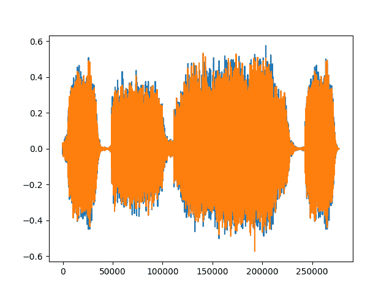

出：

```py
Shape of waveform: torch.Size([2, 276858])
Sample rate of waveform: 44100

```

在`torchaudio`中加载文件时，可以选择指定后端以通过`torchaudio.set_audio_backend`使用 [SoX](https://pypi.org/project/sox/) 或 [SoundFile](https://pypi.org/project/SoundFile/) 。 这些后端在需要时会延迟加载。

`torchaudio`还使 JIT 编译对于函数是可选的，并在可能的情况下使用`nn.Module`。

## 转换

`torchaudio`支持不断增长的[转换列表](https://pytorch.org/audio/stable/transforms.html)。

*   `Resample`：将波形重采样为其他采样率。
*   `Spectrogram`：从波形创建频谱图。
*   `GriffinLim`：使用 Griffin-Lim 变换从线性比例幅度谱图计算波形。
*   `ComputeDeltas`：计算张量（通常是声谱图）的增量系数。
*   `ComplexNorm`：计算复数张量的范数。
*   `MelScale`：使用转换矩阵将正常 STFT 转换为 Mel 频率 STFT。
*   `AmplitudeToDB`：这将频谱图从功率/振幅标度变为分贝标度。
*   `MFCC`：从波形创建梅尔频率倒谱系数。
*   `MelSpectrogram`：使用 PyTorch 中的 STFT 特征从波形创建 MEL 频谱图。
*   `MuLawEncoding`：基于 mu-law 压扩对波形进行编码。
*   `MuLawDecoding`：解码 mu-law 编码波形。
*   `TimeStretch`：在不更改给定速率的音调的情况下，及时拉伸频谱图。
*   `FrequencyMasking`：在频域中对频谱图应用屏蔽。
*   `TimeMasking`：在时域中对频谱图应用屏蔽。

每个变换都支持批量：您可以对单个原始音频信号或频谱图或许多相同形状的信号执行变换。

由于所有变换都是`nn.Modules`或`jit.ScriptModules`，因此它们可以随时用作神经网络的一部分。

首先，我们可以以对数刻度查看频谱图的对数。

```py
specgram = torchaudio.transforms.Spectrogram()(waveform)

print("Shape of spectrogram: {}".format(specgram.size()))

plt.figure()
plt.imshow(specgram.log2()[0,:,:].numpy(), cmap='gray')

```

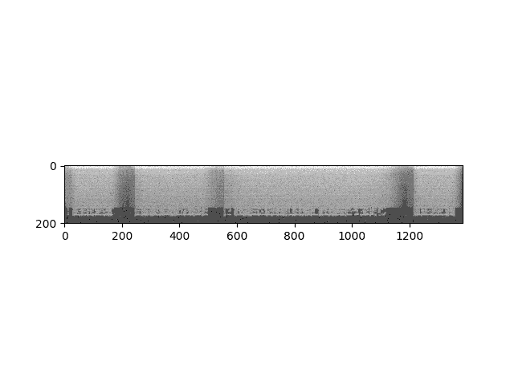

出：

```py
Shape of spectrogram: torch.Size([2, 201, 1385])

```

或者我们可以以对数刻度查看梅尔光谱图。

```py
specgram = torchaudio.transforms.MelSpectrogram()(waveform)

print("Shape of spectrogram: {}".format(specgram.size()))

plt.figure()
p = plt.imshow(specgram.log2()[0,:,:].detach().numpy(), cmap='gray')

```

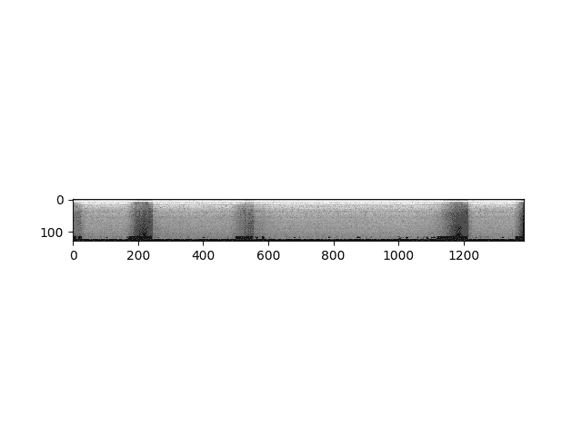

出：

```py
Shape of spectrogram: torch.Size([2, 128, 1385])

```

我们可以一次对一个通道重新采样波形。

```py
new_sample_rate = sample_rate/10

# Since Resample applies to a single channel, we resample first channel here
channel = 0
transformed = torchaudio.transforms.Resample(sample_rate, new_sample_rate)(waveform[channel,:].view(1,-1))

print("Shape of transformed waveform: {}".format(transformed.size()))

plt.figure()
plt.plot(transformed[0,:].numpy())

```

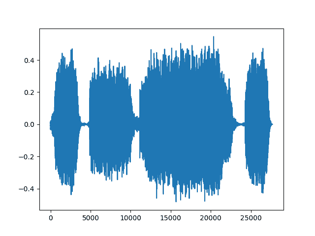

出：

```py
Shape of transformed waveform: torch.Size([1, 27686])

```

作为变换的另一个示例，我们可以基于 Mu-Law 编码对信号进行编码。 但是要这样做，我们需要信号在 -1 和 1 之间。由于张量只是常规的 PyTorch 张量，因此我们可以在其上应用标准运算符。

```py
# Let's check if the tensor is in the interval [-1,1]
print("Min of waveform: {}\nMax of waveform: {}\nMean of waveform: {}".format(waveform.min(), waveform.max(), waveform.mean()))

```

出：

```py
Min of waveform: -0.572845458984375
Max of waveform: 0.575958251953125
Mean of waveform: 9.293758921558037e-05

```

由于波形已经在 -1 和 1 之间，因此我们不需要对其进行归一化。

```py
def normalize(tensor):
    # Subtract the mean, and scale to the interval [-1,1]
    tensor_minusmean = tensor - tensor.mean()
    return tensor_minusmean/tensor_minusmean.abs().max()

# Let's normalize to the full interval [-1,1]
# waveform = normalize(waveform)

```

让我们对波形进行编码。

```py
transformed = torchaudio.transforms.MuLawEncoding()(waveform)

print("Shape of transformed waveform: {}".format(transformed.size()))

plt.figure()
plt.plot(transformed[0,:].numpy())

```


出：

```py
Shape of transformed waveform: torch.Size([2, 276858])

```

现在解码。

```py
reconstructed = torchaudio.transforms.MuLawDecoding()(transformed)

print("Shape of recovered waveform: {}".format(reconstructed.size()))

plt.figure()
plt.plot(reconstructed[0,:].numpy())

```

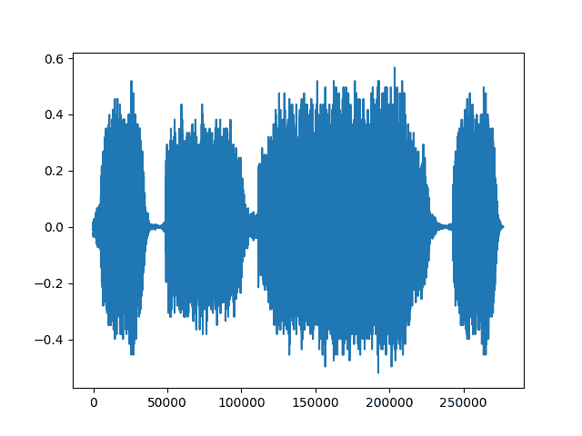

出：

```py
Shape of recovered waveform: torch.Size([2, 276858])

```

我们最终可以将原始波形与其重构版本进行比较。

```py
# Compute median relative difference
err = ((waveform-reconstructed).abs() / waveform.abs()).median()

print("Median relative difference between original and MuLaw reconstucted signals: {:.2%}".format(err))

```

出：

```py
Median relative difference between original and MuLaw reconstucted signals: 1.28%

```

## 函数

上面看到的转换依赖于较低级别的无状态函数进行计算。 这些函数在`torchaudio.functional`下可用。 完整列表在[此处](https://pytorch.org/audio/functional.html)，包括：

*   `istft`：短期傅立叶逆变换。
*   `gain`：对整个波形进行放大或衰减。
*   `dither`：增加以特定位深度存储的音频的动态范围。
*   `compute_deltas`：计算张量的增量系数。
*   `equalizer_biquad`：设计双二阶峰值均衡器过滤器并执行滤波。
*   `lowpass_biquad`：设计双二阶低通过滤器并执行滤波。
*   `highpass_biquad`：设计双二阶高通过滤器并执行滤波。

例如，让我们尝试`mu_law_encoding`函数：

```py
mu_law_encoding_waveform = torchaudio.functional.mu_law_encoding(waveform, quantization_channels=256)

print("Shape of transformed waveform: {}".format(mu_law_encoding_waveform.size()))

plt.figure()
plt.plot(mu_law_encoding_waveform[0,:].numpy())

```

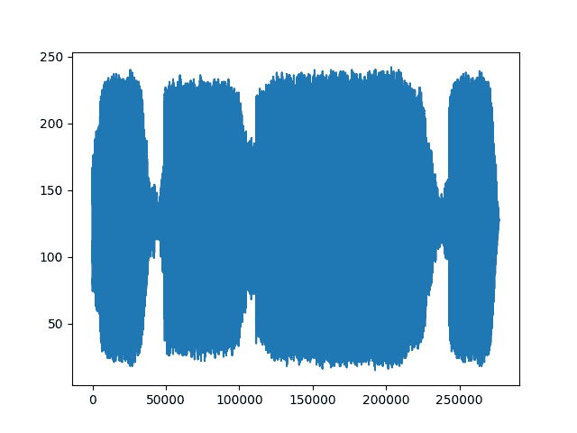

出：

```py
Shape of transformed waveform: torch.Size([2, 276858])

```

您可以看到`torchaudio.functional.mu_law_encoding`的输出与`torchaudio.transforms.MuLawEncoding`的输出相同。

现在让我们尝试其他一些函数，并可视化其输出。 通过我们的频谱图，我们可以计算出其增量：

```py
computed = torchaudio.functional.compute_deltas(specgram.contiguous(), win_length=3)
print("Shape of computed deltas: {}".format(computed.shape))

plt.figure()
plt.imshow(computed.log2()[0,:,:].detach().numpy(), cmap='gray')

```

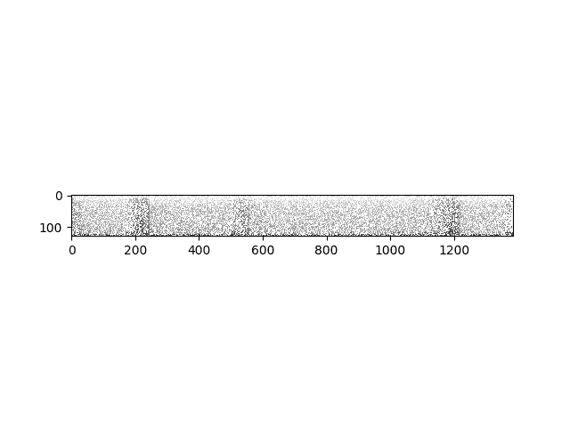

出：

```py
Shape of computed deltas: torch.Size([2, 128, 1385])

```

我们可以获取原始波形并对其应用不同的效果。

```py
gain_waveform = torchaudio.functional.gain(waveform, gain_db=5.0)
print("Min of gain_waveform: {}\nMax of gain_waveform: {}\nMean of gain_waveform: {}".format(gain_waveform.min(), gain_waveform.max(), gain_waveform.mean()))

dither_waveform = torchaudio.functional.dither(waveform)
print("Min of dither_waveform: {}\nMax of dither_waveform: {}\nMean of dither_waveform: {}".format(dither_waveform.min(), dither_waveform.max(), dither_waveform.mean()))

```

出：

```py
Min of gain_waveform: -1.0186792612075806
Max of gain_waveform: 1.024214744567871
Mean of gain_waveform: 0.00016526899707969278
Min of dither_waveform: -0.572784423828125
Max of dither_waveform: 0.575927734375
Mean of dither_waveform: 0.00010744280007202178

```

`torchaudio.functional`中函数的另一个示例是将过滤器应用于我们的波形。 将低通双二阶过滤器应用于我们的波形，将输出修改了频率信号的新波形。

```py
lowpass_waveform = torchaudio.functional.lowpass_biquad(waveform, sample_rate, cutoff_freq=3000)

print("Min of lowpass_waveform: {}\nMax of lowpass_waveform: {}\nMean of lowpass_waveform: {}".format(lowpass_waveform.min(), lowpass_waveform.max(), lowpass_waveform.mean()))

plt.figure()
plt.plot(lowpass_waveform.t().numpy())

```


出：

```py
Min of lowpass_waveform: -0.5595059990882874
Max of lowpass_waveform: 0.5595012307167053
Mean of lowpass_waveform: 9.293757466366515e-05

```

我们还可以使用高通双二阶过滤器可视化波形。

```py
highpass_waveform = torchaudio.functional.highpass_biquad(waveform, sample_rate, cutoff_freq=2000)

print("Min of highpass_waveform: {}\nMax of highpass_waveform: {}\nMean of highpass_waveform: {}".format(highpass_waveform.min(), highpass_waveform.max(), highpass_waveform.mean()))

plt.figure()
plt.plot(highpass_waveform.t().numpy())

```

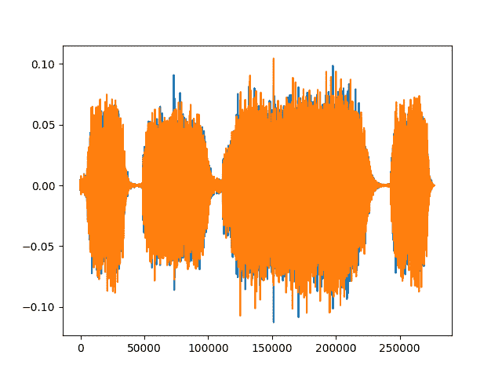

出：

```py
Min of highpass_waveform: -0.11269102990627289
Max of highpass_waveform: 0.10451897978782654
Mean of highpass_waveform: 1.8138147234170177e-11

```

## 从 Kaldi 迁移到`torchaudio`

用户可能熟悉 [Kaldi](http://github.com/kaldi-asr/kaldi) （一种用于语音识别的工具包）。 `torchaudio`提供与`torchaudio.kaldi_io`中的兼容性。 实际上，它可以通过以下方式从 kaldi scp 或 ark 文件或流中读取：

*   `read_vec_int_ark`
*   `read_vec_flt_scp`
*   `read_vec_flt_arkfile`/流
*   `read_mat_scp`
*   `read_mat_ark`

`torchaudio`为`spectrogram`，`fbank`，`mfcc`和 Kaldi [提供兼容的转换](#id2)。 `resample_waveform`受益于 GPU 支持，有关更多信息，请参见[此处](compliance.kaldi.html)。

```py
n_fft = 400.0
frame_length = n_fft / sample_rate * 1000.0
frame_shift = frame_length / 2.0

params = {
    "channel": 0,
    "dither": 0.0,
    "window_type": "hanning",
    "frame_length": frame_length,
    "frame_shift": frame_shift,
    "remove_dc_offset": False,
    "round_to_power_of_two": False,
    "sample_frequency": sample_rate,
}

specgram = torchaudio.compliance.kaldi.spectrogram(waveform, **params)

print("Shape of spectrogram: {}".format(specgram.size()))

plt.figure()
plt.imshow(specgram.t().numpy(), cmap='gray')

```

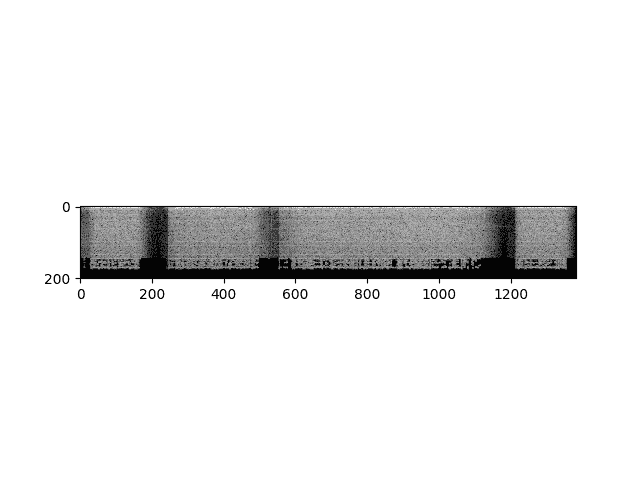

出：

```py
Shape of spectrogram: torch.Size([1383, 201])

```

我们还支持根据波形计算过滤器组特征，以匹配 Kaldi 的实现。

```py
fbank = torchaudio.compliance.kaldi.fbank(waveform, **params)

print("Shape of fbank: {}".format(fbank.size()))

plt.figure()
plt.imshow(fbank.t().numpy(), cmap='gray')

```

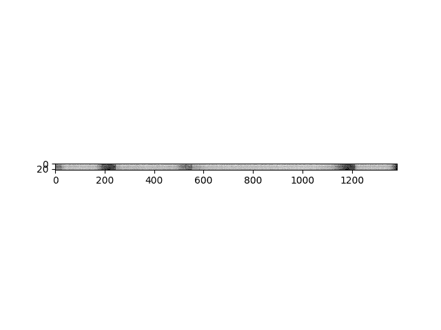

出：

```py
Shape of fbank: torch.Size([1383, 23])

```

您可以从原始音频信号创建梅尔频率倒谱系数，这与 Kaldi 的 compute-mfcc-feats 的输入/输出相匹配。

```py
mfcc = torchaudio.compliance.kaldi.mfcc(waveform, **params)

print("Shape of mfcc: {}".format(mfcc.size()))

plt.figure()
plt.imshow(mfcc.t().numpy(), cmap='gray')

```

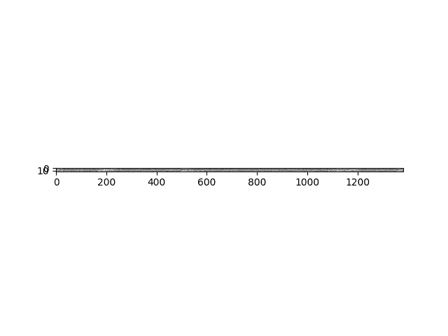

出：

```py
Shape of mfcc: torch.Size([1383, 13])

```

## 可用数据集

如果您不想创建自己的数据集来训练模型，则`torchaudio`提供了统一的数据集接口。 该接口支持将文件延迟加载到内存，下载和提取函数以及数据集以构建模型。

当前支持的数据集`torchaudio`为：

*   **VCTK**：109 位以英语为母语的母语者说的语音数据，带有各种重音（[在此处详细了解](https://homepages.inf.ed.ac.uk/jyamagis/page3/page58/page58.html)）。
*   **Yesno**：一个人在希伯来语中说是或否的 60 张唱片； 每个记录长 8 个字（[在此处了解更多](https://www.openslr.org/1/)）。
*   **Common Voice**：开源的多语言语音数据集，任何人都可以用来训练启用语音的应用（[在此处了解更多](https://voice.mozilla.org/en/datasets)）。
*   **LibriSpeech**：阅读英语语音的大型语料库（1000 小时）（[在此处详细了解](http://www.openslr.org/12)）。

```py
yesno_data = torchaudio.datasets.YESNO('./', download=True)

# A data point in Yesno is a tuple (waveform, sample_rate, labels) where labels is a list of integers with 1 for yes and 0 for no.

# Pick data point number 3 to see an example of the the yesno_data:
n = 3
waveform, sample_rate, labels = yesno_data[n]

print("Waveform: {}\nSample rate: {}\nLabels: {}".format(waveform, sample_rate, labels))

plt.figure()
plt.plot(waveform.t().numpy())

```

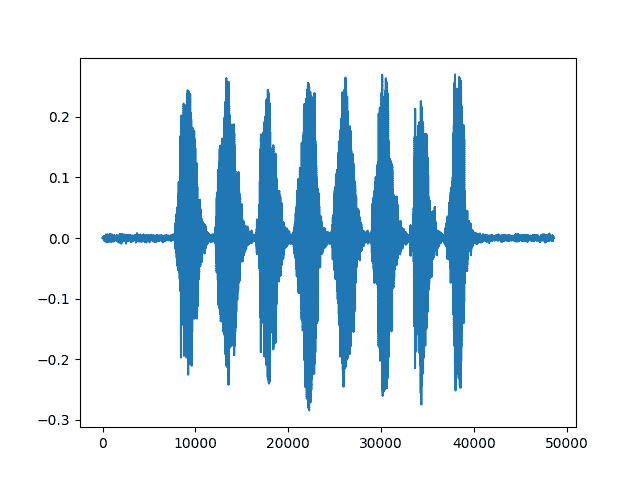

出：

```py
Waveform: tensor([[ 3.0518e-05,  6.1035e-05,  3.0518e-05,  ..., -1.8311e-04,
          4.2725e-04,  6.7139e-04]])
Sample rate: 8000
Labels: [0, 0, 1, 0, 0, 0, 1, 0]

```

现在，每当您从数据集中请求声音文件时，仅当您请求声音文件时，它才会加载到内存中。 这意味着，数据集仅加载所需的项目并将其保留在内存中，并保存在内存中。

## 总结

我们使用示例原始音频信号或波形来说明如何使用`torchaudio`打开音频文件，以及如何对该波形进行预处理，变换和应用函数。 我们还演示了如何使用熟悉的 Kaldi 函数以及如何利用内置数据集构建模型。 鉴于`torchaudio`是基于 PyTorch 构建的，因此这些技术可以在利用 GPU 的同时，用作语音识别等更高级音频应用的构建块。

**脚本的总运行时间**：（0 分钟 18.821 秒）

[下载 Python 源码：`audio_preprocessing_tutorial.py`](../_downloads/5ffe15ce830e55b3a9e9c294d04ab41c/audio_preprocessing_tutorial.py)

[下载 Jupyter 笔记本：`audio_preprocessing_tutorial.ipynb`](../_downloads/7303ce3181f4dbc9a50bc1ed5bb3218f/audio_preprocessing_tutorial.ipynb)

[由 Sphinx 画廊](https://sphinx-gallery.readthedocs.io)生成的画廊