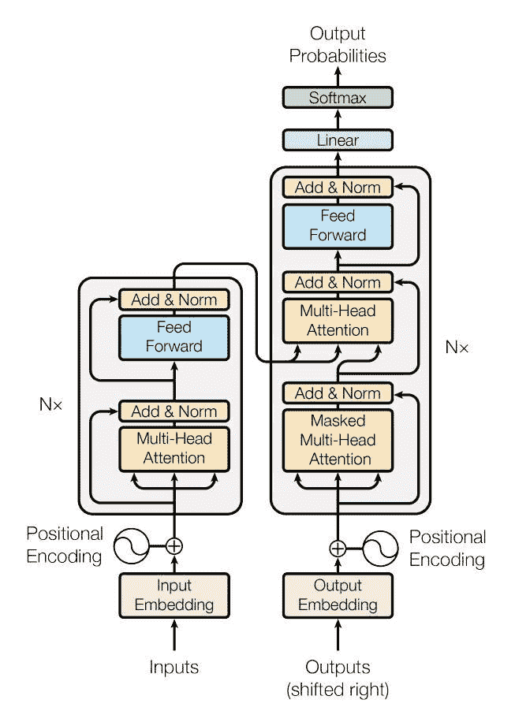
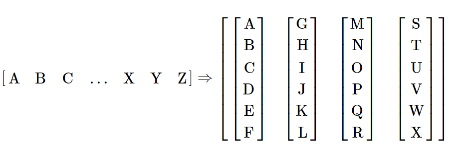
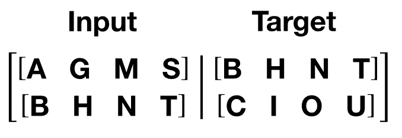

# 使用`nn.Transformer`和`torchtext`的序列到序列建模

> 原文：<https://pytorch.org/tutorials/beginner/transformer_tutorial.html>

这是一个有关如何训练使用[`nn.Transformer`](https://pytorch.org/docs/master/nn.html?highlight=nn%20transformer#torch.nn.Transformer)模块的序列到序列模型的教程。

PyTorch 1.2 版本包括一个基于[论文](https://arxiv.org/pdf/1706.03762.pdf)的标准转换器模块。 事实证明，该转换器模型在许多序列间问题上具有较高的质量，同时具有更高的可并行性。 `nn.Transformer`模块完全依赖于注意力机制（另一个最近实现为[`nn.MultiheadAttention`](https://pytorch.org/docs/master/nn.html?highlight=multiheadattention#torch.nn.MultiheadAttention)的模块）来绘制输入和输出之间的全局依存关系。 `nn.Transformer`模块现已高度模块化，因此可以轻松地修改/组成单个组件（如本教程中的[`nn.TransformerEncoder`](https://pytorch.org/docs/master/nn.html?highlight=nn%20transformerencoder#torch.nn.TransformerEncoder)）。



## 定义模型

在本教程中，我们将在语言建模任务上训练`nn.TransformerEncoder`模型。 语言建模任务是为给定单词（或单词序列）遵循单词序列的可能性分配概率。 标记序列首先传递到嵌入层，然后传递到位置编码层以说明单词的顺序（有关更多详细信息，请参见下一段）。 `nn.TransformerEncoder`由多层[`nn.TransformerEncoderLayer`](https://pytorch.org/docs/master/nn.html?highlight=transformerencoderlayer#torch.nn.TransformerEncoderLayer)组成。 与输入序列一起，还需要一个正方形的注意掩码，因为`nn.TransformerEncoder`中的自注意层仅允许出现在该序列中的较早位置。 对于语言建模任务，应屏蔽将来头寸上的所有标记。 为了获得实际的单词，将`nn.TransformerEncoder`模型的输出发送到最终的`Linear`层，然后是对数 Softmax 函数。

```py
import math
import torch
import torch.nn as nn
import torch.nn.functional as F

class TransformerModel(nn.Module):

    def __init__(self, ntoken, ninp, nhead, nhid, nlayers, dropout=0.5):
        super(TransformerModel, self).__init__()
        from torch.nn import TransformerEncoder, TransformerEncoderLayer
        self.model_type = 'Transformer'
        self.pos_encoder = PositionalEncoding(ninp, dropout)
        encoder_layers = TransformerEncoderLayer(ninp, nhead, nhid, dropout)
        self.transformer_encoder = TransformerEncoder(encoder_layers, nlayers)
        self.encoder = nn.Embedding(ntoken, ninp)
        self.ninp = ninp
        self.decoder = nn.Linear(ninp, ntoken)

        self.init_weights()

    def generate_square_subsequent_mask(self, sz):
        mask = (torch.triu(torch.ones(sz, sz)) == 1).transpose(0, 1)
        mask = mask.float().masked_fill(mask == 0, float('-inf')).masked_fill(mask == 1, float(0.0))
        return mask

    def init_weights(self):
        initrange = 0.1
        self.encoder.weight.data.uniform_(-initrange, initrange)
        self.decoder.bias.data.zero_()
        self.decoder.weight.data.uniform_(-initrange, initrange)

    def forward(self, src, src_mask):
        src = self.encoder(src) * math.sqrt(self.ninp)
        src = self.pos_encoder(src)
        output = self.transformer_encoder(src, src_mask)
        output = self.decoder(output)
        return output

```

`PositionalEncoding`模块注入一些有关标记在序列中的相对或绝对位置的信息。 位置编码的尺寸与嵌入的尺寸相同，因此可以将两者相加。 在这里，我们使用不同频率的`sine`和`cosine`函数。

```py
class PositionalEncoding(nn.Module):

    def __init__(self, d_model, dropout=0.1, max_len=5000):
        super(PositionalEncoding, self).__init__()
        self.dropout = nn.Dropout(p=dropout)

        pe = torch.zeros(max_len, d_model)
        position = torch.arange(0, max_len, dtype=torch.float).unsqueeze(1)
        div_term = torch.exp(torch.arange(0, d_model, 2).float() * (-math.log(10000.0) / d_model))
        pe[:, 0::2] = torch.sin(position * div_term)
        pe[:, 1::2] = torch.cos(position * div_term)
        pe = pe.unsqueeze(0).transpose(0, 1)
        self.register_buffer('pe', pe)

    def forward(self, x):
        x = x + self.pe[:x.size(0), :]
        return self.dropout(x)

```

## 加载和批量数据

本教程使用`torchtext`生成 Wikitext-2 数据集。 `vocab`对象是基于训练数据集构建的，用于将标记数字化为张量。 从序列数据开始，`batchify()`函数将数据集排列为列，以修剪掉数据分成大小为`batch_size`的批量后剩余的所有标记。 例如，以字母为序列（总长度为 26）并且批大小为 4，我们将字母分为 4 个长度为 6 的序列：



这些列被模型视为独立的，这意味着无法了解`G`和`F`的依赖性，但可以进行更有效的批量。

```py
import io
import torch
from torchtext.utils import download_from_url, extract_archive
from torchtext.data.utils import get_tokenizer
from torchtext.vocab import build_vocab_from_iterator

url = 'https://s3.amazonaws.com/research.metamind.io/wikitext/wikitext-2-v1.zip'
test_filepath, valid_filepath, train_filepath = extract_archive(download_from_url(url))
tokenizer = get_tokenizer('basic_english')
vocab = build_vocab_from_iterator(map(tokenizer,
                                      iter(io.open(train_filepath,
                                                   encoding="utf8"))))

def data_process(raw_text_iter):
  data = [torch.tensor([vocab[token] for token in tokenizer(item)],
                       dtype=torch.long) for item in raw_text_iter]
  return torch.cat(tuple(filter(lambda t: t.numel() > 0, data)))

train_data = data_process(iter(io.open(train_filepath, encoding="utf8")))
val_data = data_process(iter(io.open(valid_filepath, encoding="utf8")))
test_data = data_process(iter(io.open(test_filepath, encoding="utf8")))

device = torch.device("cuda" if torch.cuda.is_available() else "cpu")

def batchify(data, bsz):
    # Divide the dataset into bsz parts.
    nbatch = data.size(0) // bsz
    # Trim off any extra elements that wouldn't cleanly fit (remainders).
    data = data.narrow(0, 0, nbatch * bsz)
    # Evenly divide the data across the bsz batches.
    data = data.view(bsz, -1).t().contiguous()
    return data.to(device)

batch_size = 20
eval_batch_size = 10
train_data = batchify(train_data, batch_size)
val_data = batchify(val_data, eval_batch_size)
test_data = batchify(test_data, eval_batch_size)

```

### 生成输入序列和目标序列的函数

`get_batch()`函数为转换器模型生成输入和目标序列。 它将源数据细分为长度为`bptt`的块。 对于语言建模任务，模型需要以下单词作为`Target`。 例如，如果`bptt`值为 2，则`i = 0`时，我们将获得以下两个变量：



应该注意的是，这些块沿着维度 0，与`Transformer`模型中的`S`维度一致。 批量尺寸`N`沿尺寸 1。

```py
bptt = 35
def get_batch(source, i):
    seq_len = min(bptt, len(source) - 1 - i)
    data = source[i:i+seq_len]
    target = source[i+1:i+1+seq_len].reshape(-1)
    return data, target

```

## 启动实例

使用下面的超参数建立模型。 `vocab`的大小等于`vocab`对象的长度。

```py
ntokens = len(vocab.stoi) # the size of vocabulary
emsize = 200 # embedding dimension
nhid = 200 # the dimension of the feedforward network model in nn.TransformerEncoder
nlayers = 2 # the number of nn.TransformerEncoderLayer in nn.TransformerEncoder
nhead = 2 # the number of heads in the multiheadattention models
dropout = 0.2 # the dropout value
model = TransformerModel(ntokens, emsize, nhead, nhid, nlayers, dropout).to(device)

```

## 运行模型

[`CrossEntropyLoss`](https://pytorch.org/docs/master/nn.html?highlight=crossentropyloss#torch.nn.CrossEntropyLoss)用于跟踪损失，[`SGD`](https://pytorch.org/docs/master/optim.html?highlight=sgd#torch.optim.SGD)实现随机梯度下降方法作为优化器。 初始学习率设置为 5.0。 [`StepLR`](https://pytorch.org/docs/master/optim.html?highlight=steplr#torch.optim.lr_scheduler.StepLR)用于通过历时调整学习率。 在训练期间，我们使用[`nn.utils.clip_grad_norm_`](https://pytorch.org/docs/master/nn.html?highlight=nn%20utils%20clip_grad_norm#torch.nn.utils.clip_grad_norm_)函数将所有梯度缩放在一起，以防止爆炸。

```py
criterion = nn.CrossEntropyLoss()
lr = 5.0 # learning rate
optimizer = torch.optim.SGD(model.parameters(), lr=lr)
scheduler = torch.optim.lr_scheduler.StepLR(optimizer, 1.0, gamma=0.95)

import time
def train():
    model.train() # Turn on the train mode
    total_loss = 0.
    start_time = time.time()
    src_mask = model.generate_square_subsequent_mask(bptt).to(device)
    for batch, i in enumerate(range(0, train_data.size(0) - 1, bptt)):
        data, targets = get_batch(train_data, i)
        optimizer.zero_grad()
        if data.size(0) != bptt:
            src_mask = model.generate_square_subsequent_mask(data.size(0)).to(device)
        output = model(data, src_mask)
        loss = criterion(output.view(-1, ntokens), targets)
        loss.backward()
        torch.nn.utils.clip_grad_norm_(model.parameters(), 0.5)
        optimizer.step()

        total_loss += loss.item()
        log_interval = 200
        if batch % log_interval == 0 and batch > 0:
            cur_loss = total_loss / log_interval
            elapsed = time.time() - start_time
            print('| epoch {:3d} | {:5d}/{:5d} batches | '
                  'lr {:02.2f} | ms/batch {:5.2f} | '
                  'loss {:5.2f} | ppl {:8.2f}'.format(
                    epoch, batch, len(train_data) // bptt, scheduler.get_lr()[0],
                    elapsed * 1000 / log_interval,
                    cur_loss, math.exp(cur_loss)))
            total_loss = 0
            start_time = time.time()

def evaluate(eval_model, data_source):
    eval_model.eval() # Turn on the evaluation mode
    total_loss = 0.
    src_mask = model.generate_square_subsequent_mask(bptt).to(device)
    with torch.no_grad():
        for i in range(0, data_source.size(0) - 1, bptt):
            data, targets = get_batch(data_source, i)
            if data.size(0) != bptt:
                src_mask = model.generate_square_subsequent_mask(data.size(0)).to(device)
            output = eval_model(data, src_mask)
            output_flat = output.view(-1, ntokens)
            total_loss += len(data) * criterion(output_flat, targets).item()
    return total_loss / (len(data_source) - 1)

```

循环遍历。 如果验证损失是迄今为止迄今为止最好的，请保存模型。 在每个周期之后调整学习率。

```py
best_val_loss = float("inf")
epochs = 3 # The number of epochs
best_model = None

for epoch in range(1, epochs + 1):
    epoch_start_time = time.time()
    train()
    val_loss = evaluate(model, val_data)
    print('-' * 89)
    print('| end of epoch {:3d} | time: {:5.2f}s | valid loss {:5.2f} | '
          'valid ppl {:8.2f}'.format(epoch, (time.time() - epoch_start_time),
                                     val_loss, math.exp(val_loss)))
    print('-' * 89)

    if val_loss < best_val_loss:
        best_val_loss = val_loss
        best_model = model

    scheduler.step()

```

出：

```py
| epoch   1 |   200/ 2928 batches | lr 5.00 | ms/batch 30.78 | loss  8.03 | ppl  3085.47
| epoch   1 |   400/ 2928 batches | lr 5.00 | ms/batch 29.85 | loss  6.83 | ppl   929.53
| epoch   1 |   600/ 2928 batches | lr 5.00 | ms/batch 29.92 | loss  6.41 | ppl   610.71
| epoch   1 |   800/ 2928 batches | lr 5.00 | ms/batch 29.88 | loss  6.29 | ppl   539.54
| epoch   1 |  1000/ 2928 batches | lr 5.00 | ms/batch 29.95 | loss  6.17 | ppl   479.92
| epoch   1 |  1200/ 2928 batches | lr 5.00 | ms/batch 29.95 | loss  6.15 | ppl   468.35
| epoch   1 |  1400/ 2928 batches | lr 5.00 | ms/batch 29.95 | loss  6.11 | ppl   450.25
| epoch   1 |  1600/ 2928 batches | lr 5.00 | ms/batch 29.95 | loss  6.10 | ppl   445.77
| epoch   1 |  1800/ 2928 batches | lr 5.00 | ms/batch 29.97 | loss  6.02 | ppl   409.90
| epoch   1 |  2000/ 2928 batches | lr 5.00 | ms/batch 29.92 | loss  6.01 | ppl   408.66
| epoch   1 |  2200/ 2928 batches | lr 5.00 | ms/batch 29.94 | loss  5.90 | ppl   363.89
| epoch   1 |  2400/ 2928 batches | lr 5.00 | ms/batch 29.94 | loss  5.96 | ppl   388.68
| epoch   1 |  2600/ 2928 batches | lr 5.00 | ms/batch 29.94 | loss  5.95 | ppl   382.60
| epoch   1 |  2800/ 2928 batches | lr 5.00 | ms/batch 29.95 | loss  5.88 | ppl   358.87
-----------------------------------------------------------------------------------------
| end of epoch   1 | time: 91.45s | valid loss  5.85 | valid ppl   348.17
-----------------------------------------------------------------------------------------
| epoch   2 |   200/ 2928 batches | lr 4.51 | ms/batch 30.09 | loss  5.86 | ppl   351.70
| epoch   2 |   400/ 2928 batches | lr 4.51 | ms/batch 29.97 | loss  5.85 | ppl   347.85
| epoch   2 |   600/ 2928 batches | lr 4.51 | ms/batch 29.98 | loss  5.67 | ppl   288.80
| epoch   2 |   800/ 2928 batches | lr 4.51 | ms/batch 29.92 | loss  5.70 | ppl   299.81
| epoch   2 |  1000/ 2928 batches | lr 4.51 | ms/batch 29.95 | loss  5.65 | ppl   285.57
| epoch   2 |  1200/ 2928 batches | lr 4.51 | ms/batch 29.99 | loss  5.68 | ppl   293.48
| epoch   2 |  1400/ 2928 batches | lr 4.51 | ms/batch 29.96 | loss  5.69 | ppl   296.90
| epoch   2 |  1600/ 2928 batches | lr 4.51 | ms/batch 29.96 | loss  5.72 | ppl   303.83
| epoch   2 |  1800/ 2928 batches | lr 4.51 | ms/batch 29.93 | loss  5.66 | ppl   285.90
| epoch   2 |  2000/ 2928 batches | lr 4.51 | ms/batch 29.93 | loss  5.67 | ppl   289.58
| epoch   2 |  2200/ 2928 batches | lr 4.51 | ms/batch 29.97 | loss  5.55 | ppl   257.20
| epoch   2 |  2400/ 2928 batches | lr 4.51 | ms/batch 29.96 | loss  5.65 | ppl   283.92
| epoch   2 |  2600/ 2928 batches | lr 4.51 | ms/batch 29.95 | loss  5.65 | ppl   283.76
| epoch   2 |  2800/ 2928 batches | lr 4.51 | ms/batch 29.95 | loss  5.60 | ppl   269.90
-----------------------------------------------------------------------------------------
| end of epoch   2 | time: 91.37s | valid loss  5.60 | valid ppl   270.66
-----------------------------------------------------------------------------------------
| epoch   3 |   200/ 2928 batches | lr 4.29 | ms/batch 30.12 | loss  5.60 | ppl   269.95
| epoch   3 |   400/ 2928 batches | lr 4.29 | ms/batch 29.92 | loss  5.62 | ppl   274.84
| epoch   3 |   600/ 2928 batches | lr 4.29 | ms/batch 29.96 | loss  5.41 | ppl   222.98
| epoch   3 |   800/ 2928 batches | lr 4.29 | ms/batch 29.93 | loss  5.48 | ppl   240.15
| epoch   3 |  1000/ 2928 batches | lr 4.29 | ms/batch 29.94 | loss  5.43 | ppl   229.16
| epoch   3 |  1200/ 2928 batches | lr 4.29 | ms/batch 29.94 | loss  5.48 | ppl   239.42
| epoch   3 |  1400/ 2928 batches | lr 4.29 | ms/batch 29.95 | loss  5.49 | ppl   242.87
| epoch   3 |  1600/ 2928 batches | lr 4.29 | ms/batch 29.93 | loss  5.52 | ppl   250.16
| epoch   3 |  1800/ 2928 batches | lr 4.29 | ms/batch 29.93 | loss  5.47 | ppl   237.70
| epoch   3 |  2000/ 2928 batches | lr 4.29 | ms/batch 29.94 | loss  5.49 | ppl   241.36
| epoch   3 |  2200/ 2928 batches | lr 4.29 | ms/batch 29.92 | loss  5.36 | ppl   211.91
| epoch   3 |  2400/ 2928 batches | lr 4.29 | ms/batch 29.95 | loss  5.47 | ppl   237.16
| epoch   3 |  2600/ 2928 batches | lr 4.29 | ms/batch 29.94 | loss  5.47 | ppl   236.47
| epoch   3 |  2800/ 2928 batches | lr 4.29 | ms/batch 29.92 | loss  5.41 | ppl   223.08
-----------------------------------------------------------------------------------------
| end of epoch   3 | time: 91.32s | valid loss  5.61 | valid ppl   272.10
-----------------------------------------------------------------------------------------

```

## 使用测试数据集评估模型

应用最佳模型以检查测试数据集的结果。

```py
test_loss = evaluate(best_model, test_data)
print('=' * 89)
print('| End of training | test loss {:5.2f} | test ppl {:8.2f}'.format(
    test_loss, math.exp(test_loss)))
print('=' * 89)

```

出：

```py
=========================================================================================
| End of training | test loss  5.52 | test ppl   249.05
=========================================================================================

```

**脚本的总运行时间**：（4 分钟 50.218 秒）

[下载 Python 源码：`transformer_tutorial.py`](../_downloads/f53285338820248a7c04a947c5110f7b/transformer_tutorial.py)

[下载 Jupyter 笔记本：`transformer_tutorial.ipynb`](../_downloads/dca13261bbb4e9809d1a3aa521d22dd7/transformer_tutorial.ipynb)

[由 Sphinx 画廊](https://sphinx-gallery.readthedocs.io)生成的画廊